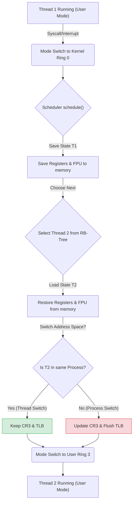
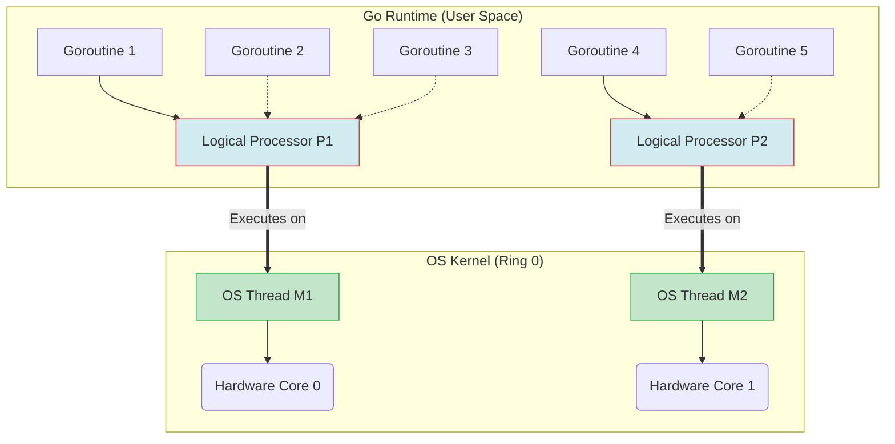

---
tags:
  - concurrency
  - os
  - threads
  - processes
  - linux
aliases:
  - Threads vs Processes
  - Context Switch Cost
---
# L1.CONC.01: Threads vs processes, context switch cost

> [!abstract] О лекции
> Для уровня Practitioner разница между потоком и процессом — это не просто «общая память». Это глубокий архитектурный выбор между **Fault Isolation** (процессы) и **Data Locality** (потоки).
> Самое важное: стоимость переключения контекста — это не только физическое время на сохранение регистров CPU. Настоящий, невидимый убийца производительности — это **TLB Flush** (сброс кэша трансляции адресов) и **Cache Pollution** (загрязнение L1/L2/L3 кэша). Если вы проектируете Low Latency систему, ваша цель — не "быстро переключаться", а **не переключаться вообще** (используя CPU Affinity / Pinning).

---
## 1. Анатомия: Что мы переключаем?

Чтобы понять, почему `Context Switch` может убить Latency вашего приложения, мы должны взвесить "полезную нагрузку", которую CPU обязан сохранить и восстановить. Мы говорим о тяжелых структурах данных, управляемых ядром ОС (в терминологии ядра Linux это структура — `task_struct`).

### 1.1. Процесс (Process) — Тяжелый контейнер
Процесс — это фундаментальная абстракция ОС, создающая для программы иллюзию того, что она владеет всем компьютером монопольно. Это **Единица Владения Ресурсами (Unit of Resource Ownership)**.

Когда мы говорим о переключении процессов (Process Context Switch), мы переключаем саму **Изоляцию**.

*   **Virtual Address Space (VAS) / Memory Map:**
    *   Это не сами мегабайты данных в RAM, а **карта перевода** виртуальных адресов процесса в физические адреса оперативной памяти.
    *   **Физическая суть:** В архитектуре x86-64 это физический указатель на корневую таблицу страниц (Page Global Directory). Этот указатель хранится в специальном управляющем регистре **CR3**.
    *   *Почему это дорого (Архитектурная боль):* Смена значения в регистре CR3 мгновенно делает невалидным **TLB** (Translation Lookaside Buffer — аппаратный кэш трансляции адресов внутри процессора), если не используется технология PCID (Process-Context ID). Процессор "слепнет" и начинает дорогой, аппаратный обход таблиц страниц в памяти (Page Walk) при каждом последующем обращении к памяти, что занимает сотни тактов.
*   **File Descriptor Table (Таблица дескрипторов):**
    *   Маппинг целых чисел (`int fd = 3`) на реальные структуры ресурсов ядра (открытые сетевые сокеты, файлы на диске, pipe-каналы).
    *   *Нюанс:* `fd=3` в Процессе А и `fd=3` в Процессе Б указывают на совершенно разные файлы.
*   **Signal Handlers (Обработчики сигналов):**
    *   Код, который будет асинхронно выполнен ядром при получении `SIGTERM` или `SIGSEGV`. Обработчики — глобальны для процесса (они общие для всех его потоков).
*   **Security Context (Контекст безопасности):**
    *   Атрибуты `uid`, `gid`, namespaces (в случае Docker контейнеров), capabilities (права `CAP_NET_ADMIN` и т.д.).

### 1.2. Поток (Thread) — Легкий исполнитель
Поток (в ядре Linux он часто называется LWP — Light Weight Process) — это **Единица Планирования (Unit of Scheduling)**. Ядро ОС (планировщик CFS) планирует и выделяет кванты времени именно потокам, а не процессам.

Поток живет *строго внутри* процесса. Когда мы переключаем потоки **в рамках одного и того же процесса**, мы переключаем только **Поток Исполнения**, абсолютно не трогая тяжелую Изоляцию (VAS остается тем же, регистр CR3 не меняется, кэш TLB остается горячим и валидным).

У потока есть два типа состояния, которые нужно разделять:

#### А. Разделяемое состояние (Shared State)
Доступно абсолютно всем потокам данного процесса без необходимости копирования (Pointer passing - передача по указателю).
*   **Код (Text Segment):** Скомпилированные машинные инструкции программы.
*   **Куча (Heap):** Динамически выделенная память (`malloc` в C / `new` в Java/C++).
*   **Глобальные переменные (Data/BSS):** Статические данные.
*   **Открытые файлы:** Если Поток 1 открыл файл на чтение и получил `fd=5`, Поток 2 может свободно читать из этого же `fd=5`.

#### Б. Приватное состояние (Private State) — То, что нужно сохранить/восстановить
Именно объем этих данных составляет реальный "вес" переключения потока (Thread Context Switch):

1.  **Hardware Registers (Регистры CPU) — Сердце переключения:**
    *   **General Purpose:** `RAX`, `RBX`, `RCX`... (хранят временные данные текущих вычислений).
    *   **Instruction Pointer (RIP):** Адрес следующей инструкции (закладка, где мы остановились).
    *   **Stack Pointer (RSP):** Указатель на текущую вершину стека вызовов.
    *   **FPU / SIMD Context (Самое тяжелое состояние):** Регистры для вычислений с плавающей точкой и векторных инструкций (SSE, AVX, AVX-512).
        *   *Деталь для эксперта:* Контекст векторных расширений AVX-512 огромен (он весит сотни байт на каждое ядро). Ядро ОС использует хитрые аппаратные оптимизации (инструкции `XSAVE` / `XRSTOR`), чтобы не сохранять и не восстанавливать их, если поток реально не использовал сложную математику в своем кванте времени.
2.  **Два Стека (Two Stacks per Thread):**
    *   Каждый поток имеет свой независимый **User Stack** (в пространстве пользователя) для хранения локальных переменных и обычных вызовов функций.
    *   Каждый поток имеет свой отдельный **Kernel Stack** (фиксированного небольшого размера, обычно 8KB или 16KB в пространстве ядра). Он используется исключительно тогда, когда поток делает Syscall (обращается к ОС) или прерывается аппаратным железом.
3.  **Thread Local Storage (TLS):**
    *   Специальная область памяти для изолированных переменных `__thread` / `ThreadLocal`.
    *   На низком уровне CPU это реализуется через сегментные регистры (в x86-64 обычно аппаратный регистр **FS** или **GS** указывает на базовый адрес TLS). Переключение потока обязано обновить этот базовый адрес в регистре.
4.  **Signal Mask (Маска сигналов):**
    *   Хотя *сами обработчики* общие для всего процесса, каждый отдельный поток может индивидуально решить, какие именно сигналы он *блокирует* (игнорирует) в данный момент времени.

---
### 1.3. Пример для наглядности: "Офисное здание"

Представим **Компьютер** как огромное офисное здание.

*   **Процесс — это "Комната" (Офис одной компании).**
    *   У неё есть толстые стены (**Изоляция памяти**).
    *   В ней есть общие ресурсы: кофемашина, принтер, документы в шкафу (**File Descriptors, Heap**).
    *   Чтобы перейти из Комнаты А в Комнату Б, вам нужно физически выйти в коридор, пройти проверку охраны, открыть новую запертую дверь. Это долго и муторно (**смена регистра CR3 / очистка TLB Flush**).

*   **Потоки — это "Сотрудники" в одной комнате.**
    *   Сотрудник Вася (**Поток 1**) и Петя (**Поток 2**) сидят в одной комнате за соседними столами.
    *   Они видят одни и те же документы в шкафу и могут мгновенно передать их друг другу из рук в руки (**Shared Memory**).
    *   У каждого есть свой личный рабочий стол (**CPU Registers**), свой блокнот для текущих коротких заметок (**Stack**) и свои личные вещи в тумбочке (**Thread Local Storage**).
    *   **Context Switch:** Чтобы Вася перестал работать, а Петя начал (допустим, у них один карандаш на двоих - 1 ядро CPU), Васе нужно просто запомнить, на какой строке документа он остановился (сохранить RIP), отложить карандаш и отойти от стола. Пете не нужно менять комнату, проходить охрану или искать шкаф.

**Критический вывод для архитектора:**
Переключение между сотрудниками внутри одной комнаты (Threads) всегда дешевле, чем перегон сотрудников между разными офисами (Processes). Но есть цена: если Вася случайно подожжет свою корзину для бумаг (вызовет `Segmentation Fault`), сгорят все — и Петя, и кофемашина, и документы всей компании. В процессах сгорит только комната Васи.

---
## 2. Стоимость Context Switch (CS)

Стоимость переключения контекста — это всегда сумма **накладных расходов ядра** (Direct Costs - прямые затраты тактов CPU) и **деградации производительности самого приложения** (Indirect Costs - косвенные затраты). Второе часто превышает первое в десятки и сотни раз.

### 2.1. Прямые расходы (Direct Costs): «Налог на переключение»
Это конкретные операции, выполняемые железом CPU и кодом ядра ОС для самой механики подмены задач. Эти расходы относительно детерминированы (занимают $\sim 1–5 \mu s$ микросекунд), но их огромная частота (Context Switch Storm) убивает пропускную способность.

1.  **Смена уровня привилегий (Mode Switch / Ring Transition):**
    *   Обязательный переход из безопасного *Ring 3* (User Mode) в привилегированный *Ring 0* (Kernel Mode).
    *   **Деталь для инженера:** Это не просто легкая ассемблерная инструкция `JMP`. Процессор аппаратно меняет CPL (Current Privilege Level), переключает указатель стека (с User Stack на Kernel Stack) и, что критично, **сбрасывает конвейер инструкций (Pipeline Flush)**.
    *   В современных CPU (особенно с учетом тяжелых микрокодовых патчей против аппаратных уязвимостей Spectre/Meltdown/Retbleed) этот переход стал еще дороже из-за барьеров (например, IBPB — Indirect Branch Prediction Barrier), которые принудительно очищают предсказатель переходов, чтобы один зловредный процесс не мог "подсмотреть" данные другого процесса через side-channels.

2.  **Сохранение и восстановление регистров (Register State):**
    *   **General Purpose Registers (GPR):** Сохранение `RAX`, `RBX`, `RCX`, `SP`, `IP` в память (в структуру `thread_struct`). Это делается аппаратно быстро.
    *   **Extended State (FPU/SSE/AVX-512):** Вот где скрыт дьявол производительности. Контекст AVX-512 — это килобайты данных (гигантские ZMM регистры).
    *   *Оптимизация ядра:* Linux использует **Lazy FPU Restore**. Если входящий (новый) поток не использует математику с плавающей точкой, ядро хитрит и не восстанавливает эти регистры сразу. Но если вы пишете высокопроизводительный вычислительный код (машинное обучение, криптография, кодирование видео H.264), вы используете AVX-инструкции постоянно, и платите полную цену при каждом переключении (тяжелые инструкции `XSAVE` / `XRSTOR`).

3.  **Логика планировщика (Scheduler Overhead):**
    *   Функция ядра `schedule()` должна математически вычислить и выбрать, *кого* запустить следующим.
    *   В Linux (дефолтный планировщик CFS — Completely Fair Scheduler) это означает поиск самой "левой" ноды в сбалансированном красно-черном дереве (Red-Black Tree), отсортированном по виртуальному времени (`vruntime`). Алгоритмическая сложность поиска $O(\log N)$.
    *   Даже при $N=1$ (один активный поток) выполнение планировщика — это сотни инструкций: проверка истекших таймеров, обработка сигналов, учет статистики CPU-времени (для `cgroups` и биллинга Kubernetes).



### 2.2. Косвенные расходы (Indirect Costs): «Разрушение локальности»
Это жестокие потери производительности, которые наступают *после* того, как новый поток физически начал исполняться. Именно здесь теряются драгоценные миллисекунды в High-Load системах (HFT, базы данных).

#### A. Cache Pollution (Загрязнение кэша) — Главный враг
Современный процессор работает быстро только тогда, когда данные физически лежат в L1/L2 кэше прямо на кристалле (задержка ~1-4 наносекунды).
*   **Сценарий:** Поток A активно работал с хеш-таблицей, загрузив ее горячие сегменты в L1/L2 кэш.
*   **Событие:** Аппаратное прерывание таймера. Планировщик ОС снимает Поток A и ставит Поток B.
*   **Последствие:** Поток B начинает загружать *свои собственные* данные (картинку, JSON), аппаратно вытесняя данные Потока A из кэша (Eviction). Кэш "загрязняется" чужими данными.
*   **Возврат (Катастрофа):** Когда Поток A через 10 мс вернется на ядро, он столкнется со штормом кэш-промахов (**Cache Miss Storm**). Ему придется заново тянуть все свои данные из медленной RAM (задержка ~100 наносекунд, что в 100 раз медленнее L1).
    *   *Математическая Оценка:* Время полного восстановления "прогретого" состояния кэша может занимать от 10 до 1000 микросекунд в зависимости от размера Working Set (рабочего набора данных).

#### B. TLB Thrashing (Сброс буфера трансляции)
Виртуальная память (основа защиты ОС) требует непрерывного аппаратного перевода виртуальных адресов в физические (Virtual -> Physical). TLB (Translation Lookaside Buffer) — это сверхбыстрый аппаратный кэш этих переводов внутри MMU процессора.

1.  **При переключении потоков (внутри одного процесса):**
    *   Адресное пространство (Page Table) не меняется. Указатель в регистре `CR3` остается прежним.
    *   **TLB аппаратно сохраняется.** Это главная, фундаментальная причина, почему переключать Threads значительно "легче", чем Processes.

2.  **При переключении процессов (Cross-Process):**
    *   ОС меняет значение `CR3` на таблицу нового процесса. Старые записи в TLB мгновенно становятся логически невалидными (иначе новый процесс прочитает память старого).
    *   **Полный сброс TLB (TLB Flush):** Процессор физически забывает все закэшированные переводы адресов.
    *   **Последствие:** Следующие обращения к памяти нового процесса вызовут медленный **Page Walk** (аппаратный обход дерева страниц в RAM), что требует 3-4 последовательных обращений к медленной оперативной памяти *на каждое чтение переменной*, пока TLB снова не прогреется.
    *   *Спасение от Intel/AMD (PCID / ASID):* Современные CPU (начиная с архитектуры Haswell) аппаратно поддерживают тегирование записей TLB (Process Context ID). Это позволяет не сбрасывать весь TLB при смене CR3, а просто игнорировать "чужие" записи по ID. Однако емкость TLB ничтожно мала (обычно 512-1536 записей), и новый активный процесс все равно за миллисекунды физически вытеснит записи старого.

#### C. Branch Prediction Failure (Сброс предсказателя переходов)
Современные CPU — это суперскалярные монстры с конвейерами длиной в 15-20 стадий, которые постоянно "гадают" ветвления (if/else, циклы) наперед.
*   Таблицы истории переходов (BTB, BHT) внутри кристалла обучены на коде и поведении Потока A.
*   Когда внезапно приходит Поток B, предсказатель начинает жестко ошибаться, вызывая **Pipeline Stalls** (остановку конвейера на 15+ тактов) и сброс уже спекулятивно выполненных инструкций. Процессор "тупеет" на некоторое время, пока не изучит паттерны Потока B.

---
### 2.3. Вывод для Software Архитектора

Если ваша серверная система (API Gateway, Database) обрабатывает 100,000 RPS:
1.  **Process Switch** — это гарантированная катастрофа для Latency (из-за TLB Flush и Cache pollution).
2.  **Thread Switch** — это меньшее зло, но все еще зло (из-за Cache pollution и Branch Prediction).
3.  **Идеальное архитектурное состояние** — поток берет задачу и работает на выделенном физическом ядре монопольно столько, сколько возможно (Time Slice достаточный, либо используется CPU Pinning), не засыпая на блокировках.

Именно поэтому высоконагруженные системы мирового класса (типа **Nginx**, **Node.js**, **Redis**, **Envoy**) используют **Event Loop** (однопоточную асинхронную модель или фиксированный пул потоков по числу ядер), а не создают новый тяжелый `OS Thread` на каждое входящее TCP-соединение. Они избегают *переключений контекста ОС*, обрабатывая тысячи клиентских сокетов в рамках *одного* "горячего" контекста CPU.

---
## 3. Архитектурные модели: Процессы vs Потоки

Выбор между Multi-Process (MP) и Multi-Threaded (MT) архитектурой при старте проекта — это не вопрос вкуса программиста, а жесткий выбор стратегии управления **состоянием (State)** и **рисками (Resilience)**.

### 3.1. Multi-Process Model (MP): Изоляция и Надежность
**Архитектурная Философия:** "Share Nothing" (Не разделяй ничего по умолчанию).
**Примеры индустрии:** PostgreSQL, PHP-FPM, Oracle DB (классический режим), Google Chrome (вкладки — это процессы), Nginx (worker processes).

В этой строгой модели единица конкурентности — это тяжелый процесс ОС.

1.  **Fault Isolation (Изоляция отказа / Blast Radius):**
    *   Это главный, неоспоримый аргумент. У каждого процесса свое физически изолированное виртуальное адресное пространство (VAS).
    *   *Сценарий Аварии:* Воркер PostgreSQL выполняет сложный аналитический запрос или кривой C-extension, который ловит баг и вызывает `Segfault` (обращение к невалидной памяти, например `*ptr = 0`).
    *   *Результат:* Ядро Linux мгновенно убивает **только этот конкретный PID**. Master-процесс (`Postmaster`) видит сигнал `SIGCHLD`, аккуратно очищает ресурсы (Shared Memory) и запускает нового свежего воркера. База данных продолжает работать, остальные 999 клиентов даже не моргнули. 
    *   В многопоточной модели этот же баг (Segfault) убил бы весь сервер БД со всеми 1000 клиентами мгновенно, так как память общая.

2.  **Copy-on-Write (CoW) — Секретное оружие сисколла `fork()`:**
    *   Многие джуниоры думают, что создание процесса — это долго из-за копирования гигабайтов памяти. Это миф.
    *   Системный вызов `fork()` клонирует только структуры ядра и таблицы страниц (Page Tables), аппаратно помечая физические страницы RAM как "Read-Only" для обоих процессов. Сама память (данные) не копируется физически!
    *   Копирование происходит **лениво (Lazy)**: только когда дочерний процесс (или родитель) попытается реально *записать* в эту страницу памяти, процессор сгенерирует прерывание (Page Fault), и ядро сделает прозрачную физическую копию этой 4KB страницы для писателя.
    *   *Гениальный пример (Redis `BGSAVE`):* Однопоточный Redis делает `fork` для сохранения снапшота базы данных на диск. Если база весит 64 ГБ, `fork` происходит за пару миллисекунд (копируются только таблицы). 64 ГБ не дублируются в RAM, пока основной процесс не начнет изменять данные во время сохранения.

3.  **IPC (Inter-Process Communication) — Цена за изоляцию:**
    Чтобы изолированные процессы обменивались данными, нужны системные механизмы IPC. Они всегда медленнее, чем просто чтение переменной из памяти в потоках, из-за дополнительных **Context Switches** и накладных расходов копирования данных (Marshalling/Unmarshalling).
    *   **Pipes / Unix Domain Sockets:** Надежно, используется файловый API, но требует копирования буферов через ядро (User -> Kernel -> User).
    *   **Shared Memory (SHM):** Самый быстрый IPC. ОС позволяет процессам "спроецировать" (mmap) один и тот же участок физической памяти (RAM) в свои разные VAS. Работает со скоростью чистой памяти (Zero-copy), но требует таких же сложных примитивов синхронизации (семафоров в разделяемой памяти), как и в многопоточности. (Именно так работает PostgreSQL для своих Shared Buffers).

### 3.2. Multi-Threaded Model (MT): Скорость и Общее состояние
**Архитектурная Философия:** "Share Everything" (Глобальная общая куча).
**Примеры индустрии:** MySQL (InnoDB), Memcached, JVM (Java/Kotlin/Scala сервера), C# Kestrel, Envoy Proxy.

В этой модели единица конкурентности — легковесный поток (Thread).

1.  **Shared Heap (Общая куча памяти):**
    *   Абсолютно все потоки процесса видят одни и те же глобальные переменные, синглтоны и объекты в куче.
    *   *Плюс (Скорость):* Нулевая стоимость обмена данными (Zero Overhead). Передал 8-байтный указатель (pointer) — и другой поток на другом ядре уже видит гигабайтный объект. Идеально для In-Memory графов, LRU-кэшей, пулов соединений.
    *   *Смертельный Риск (Memory Corruption):* "Дикий" указатель (Dangling pointer) или Data Race (гонка данных) в одном плохом потоке может незаметно перезаписать критические данные другого, "здорового" потока. Такие баги (Heisenbugs) появляются раз в неделю под нагрузкой, и их отлаживать сложнее всего в индустрии.

2.  **Synchronization Overhead (Накладные расходы синхронизации):**
    *   Поскольку память общая, конкурентный доступ к ней нужно жестко защищать мьютексами (Mutex), спинлоками (Spinlock) или атомарными операциями.
    *   **Lock Contention (Борьба за блокировки):** Если 100 активных потоков пытаются захватить один глобальный мьютекс, 99 из них встают в очередь ядра (Wait Queue), вызывая те самые дорогие переключения контекста (`cswch/s`). Производительность сервера падает нелинейно. Добавили ядер — стало работать медленнее.
    *   *Пример:* В ранних версиях БД MySQL был глобальный лок (Big Kernel Lock), который "душил" масштабируемость системы на многоядерных машинах.

3.  **GIL (Global Interpreter Lock) — Особый случай скриптовых языков:**
    *   В стандартном Python (CPython) и Ruby (MRI) потоки ОС физически есть, но **строго только один** поток может исполнять байт-код языка в единицу времени. За этим следит гигантский глобальный мьютекс — GIL.
    *   *Следствие для Архитектора:* В этих языках многопоточность (`threading`) полезна *только* для I/O-bound задач (скачивание файлов по сети, запросы в БД). Для тяжелых CPU-bound задач (парсинг JSON, криптография, ML) многопоточность не дает никакого прироста (или даже замедляет выполнение из-за дергания GIL). Там вы **обязаны** использовать Multi-Process модель (модуль `multiprocessing` или запускать `gunicorn` с $N$ процессами-воркерами).

### 3.3. Hybrid / Event-Driven Models (Современный High-Load стандарт)
В чистом виде классические MP и MT модели имеют свои аппаратные пределы (лимит C10K). Современные высоконагруженные системы (Nginx, Node.js, Netty, Redis) используют мощный гибрид: **Event Loop + Worker Pool**.

*   **Reactor Pattern (На примере Nginx):**
    *   При старте запускается $N$ процессов-воркеров (обычно строго по числу физических ядер CPU).
    *   Каждый процесс — **однопоточный** (Single Threaded), но он использует системный API неблокирующего мультиплексированного ввода-вывода (`epoll` в Linux / `kqueue` в BSD).
    *   *Почему это гениально:* Внутри процесса физически нет переключений контекста и нет локов (так как поток один, нет конкуренции за память!). Один крошечный процесс эффективно держит 10,000 открытых клиентских соединений, жонглируя ими по мере поступления байтов в ядро. При этом процессы надежно изолированы друг от друга.
*   **Thread-per-Core (ScyllaDB, Envoy, Seastar framework):**
    *   Похоже на Nginx, но внутри одного гигантского процесса потоки жестко привязаны (pinned) к своим ядрам процессора (Core 0 -> Thread 0).
    *   Каждый поток имеет свой *абсолютно независимый* шард памяти и данных (Shared Nothing внутри процесса).
    *   Коммуникация между ядрами (если нужна) — происходит исключительно через lock-free очереди сообщений (как по сети, но в RAM), чтобы навсегда избежать использования медленных Mutex.

---
### Резюме: Как сделать архитектурный выбор (Матрица принятия решений)

| Критерий Архитектуры | Multi-Process (MP) | Multi-Threaded (MT) |
| :--- | :--- | :--- |
| **Устойчивость (Reliability)** | **Высочайшая**. Крэш одного воркера не кладет всю систему. (Postgres) | **Низкая**. Ошибка памяти (Segfault) или OOM убивает весь процесс БД. |
| **Сложность разработки** | Высокая (необходим сложный IPC протокол, сериализация данных). | Средняя (стандартные примитивы языка), но адски сложная отладка гонок данных (Data Races). |
| **Масштабируемость (Scaling)** | Линейная, но быстро упирается в объемы RAM (Memory Footprint). | Отличная вертикальная, но в итоге упирается в Lock Contention (узкие горлышки). |
| **Стоимость переключения (CS)**| Очень Высокая (TLB Flush, cache pollution). | Средняя/Низкая (TLB аппаратно сохраняется). |
| **Использование памяти (RAM)** | Высокое (дублирование структур библиотек, стэков, хоть и спасает CoW). | Низкое (общие структуры данных, пулы). |
| **Идеальный Use Case** | Браузеры (Chrome), СУБД (Postgres), Python/Ruby Apps, Изоляция клиентов. | High-freq trading (HFT), In-memory caches, Game Servers, C++/Go сервисы. |

**Совет Практика-Архитектора:** Если вы не пишете экстремальную Low-Latency систему на C/Rust, где важен каждый такт CPU, всегда по умолчанию предпочитайте архитектуру **Multi-Process** (или изоляцию в Docker контейнерах, что по сути то же самое). Оперативная память сейчас дешевая, а стабильность системы в 3 часа ночи — бесценна.
Если же вам критически необходимо делить огромное, мутирующее состояние (графы связей, кэши на 100ГБ) между миллионами запросов в секунду — ваш безальтернативный выбор **Multi-Threaded** (или Thread-per-Core).

---
## 4. User-Space Threads (Green Threads / Goroutines / Fibers)

В этом подходе мы осознанно отказываемся от делегирования управления потоками ядру ОС (Linux) и берем планирование задач в свои руки (в руки Runtime вашего языка программирования — Go, Erlang, Java).

### 4.1. Фундаментальные модели потоков
Чтобы глубоко понять выигрыш Go или Java Loom, нужно сравнить три архитектуры маппинга пользовательского кода на **KSE (Kernel Schedulable Entity)** — то, что ядро Linux считает реальным потоком (`task_struct`).

1.  **Модель 1:1 (Kernel-Level Threading / Родные потоки):**
    *   1 поток в вашем языке программирования = 1 реальный KSE в ядре Linux.
    *   *Примеры:* Java (старые потоки `Thread`), C/C++ (`pthreads`), Python.
    *   *Проблема:* Ядро Linux *вообще ничего не знает* о бизнес-логике вашего веб-приложения. Оно переключает ваши потоки "вслепую" по таймеру, тратя драгоценные микросекунды на тяжелые `Ring 0 <-> Ring 3` переходы, даже если ваши потоки просто ждут один и тот же мьютекс соединения с БД. Лимит масштабируемости (C10K): ~10k-50k потоков, после чего вы упретесь в лимит оперативной памяти (из-за огромных стеков) или в CPU, который будет только то и делать, что переключать контексты.

2.  **Модель N:1 (User-Level Threading / Игрушечные потоки):**
    *   N (тысячи) потоков языка = всего 1 KSE (один поток ОС).
    *   *Примеры:* Очень старый Java Green Threads, Python Gevent/Asyncio (концептуально), JavaScript (Event Loop в браузере/Node.js).
    *   *Проблема:* Совершенно не использует многоядерность процессора. Если один "зеленый" поток вызывает синхронный блокирующий syscall (например, чтение гигантского файла с диска или кривой DNS резолв), мгновенно **встает намертво весь процесс ОС** (все ваши N тысяч потоков), так как ядро Linux видит физическую блокировку единственного KSE и снимает его с CPU.

3.  **Модель M:N (Hybrid / Multiplexing / Золотой стандарт):**
    *   M (Миллионы) легковесных потоков языка (Goroutines / Fibers) умно мультиплексируются (размазываются) на N KSE (OS Threads). Обычно количество N равно числу ядер CPU (`GOMAXPROCS`).
    *   *Примеры:* Go (Goroutines), Erlang (BEAM Process), Haskell, Java 21+ Virtual Threads (Project Loom), Rust (внутри tokio runtime).
    *   *Суть магии:* Рантайм (виртуальная машина) языка содержит свой собственный, высокооптимизированный планировщик (User-space Scheduler), написанный на C/ASM, который сам решает, какую горутину поставить на ядро ОС прямо сейчас.



### 4.2. Экономика памяти: Stack Management (Почему мы можем создать миллион горутин?)
Главный физический ограничитель модели 1:1 (Обычных потоков) — это потребление памяти под Стек (Stack).
*   **Kernel Thread Stack:** При создании `pthread` ОС Linux сразу выделяет фиксированный блок виртуальной памяти (обычно 2MB или 8MB по дефолту). Даже если ваша функция сделала только `print("Hi")` и использует 1 КБ стека, вы уже зарезервировали мегабайты памяти ОС (Virtual Memory Commit).
    *   *Математика коллапса:* $100,000 	ext{ threads} 	imes 2 	ext{ MB} = \mathbf{200 	ext{ GB}}$ виртуальной памяти. Сервер просто умрет от OOM (Out of Memory).
*   **Dynamic Stack (Goroutines / Fibers):**
    *   Начинается с экстремально малого размера: **~2 KB** (в Go).
    *   *Segmented Stacks (старый подход до Go 1.3):* При переполнении 2KB выделялся новый отдельный кусок памяти, и создавалась ссылка (linked list). Проблема: "Hot Split" — если функция в цикле постоянно переходила границу стека, происходило бешеное выделение/освобождение памяти.
    *   **Contiguous Stack Copying (современный подход Go):** Если 2KB стало мало, рантайм Go динамически выделяет новый кусок в 4KB, **копирует** все данные старого стека в новый, и с помощью магии рефлексии переписывает все локальные указатели на новые адреса. Затем старый стек уничтожается.
    *   *Результат для бизнеса:* Вы можете легко запустить $1,000,000$ сетевых соединений (горутин) на стандартном недорогом сервере с 4 ГБ оперативной памяти.

### 4.3. Механика переключения (The "Micro-Switch")
Почему переключение горутин в User-Space стоит копейки ($\sim 20-200$ наносекунд), а переключение потоков ОС в Kernel-Space стоит целое состояние ($\sim 1-5$ микросекунд)?

1.  **No Mode Switch (Нет прыжков в Ядро):** Мы не делаем тяжелый системный вызов (`SYSCALL` / `INT 0x80`). Мы физически остаемся в `Ring 3` (User space). Нет инвалидации конвейера.
2.  **Minimal Context (Сохраняем только нужное):**
    *   Ядро Linux параноидально и сохраняет *абсолютно всё*: все регистры общего назначения, Floating Point (SSE/AVX), состояние сегментов памяти, маски сигналов, флаги отладки.
    *   Go Scheduler доверяет своему компилятору. Он сохраняет только необходимый минимум: PC (Program Counter - где остановились), SP (Stack Pointer - стек) и пару регистров (`DX`). Ему вообще не нужно сохранять гигантские AVX-регистры, так как спецификация вызова (Calling Convention Go) жестко требует, чтобы сами функции-воркеры сохраняли их на свой стек при необходимости, а не планировщик.
3.  **Data Locality (Уважение к Кэшу):** Планировщик рантайма (в отличие от ядра Linux) точно знает логику: если Горутина А разбудила Горутину Б через канал (Channel), значит Б нужны данные от А. Планировщик моментально запустит Горутину Б *на том же самом логическом ядре P*, где данные от А все еще лежат горячими в L1/L2 кэше процессора!

### 4.4. Проблема блокирующих вызовов (The Secret Sauce - Netpoller)
Как гибридная модель M:N обходит фатальную проблему блокировки всего потока ОС (`M`) при медленных операциях (скачивание по сети `conn.Read()`)?

**Иллюстрация чуда (Go Netpoller):**
1.  Вы (как разработчик) пишете простой, понятный линейный (синхронный) код: `data := conn.Read(buffer)`.
2.  Умный компилятор Go под капотом преобразует этот вызов не в системный `read()`, а в вызов рантайма.
3.  Если данных в сокете прямо сейчас нет (сеть лагает):
    *   Рантайм Go **паркует (усыпляет)** текущую горутину `G1` в своей памяти.
    *   Рантайм регистрирует дескриптор этого сетевого сокета в системном механизме неблокирующего I/O ядра Linux (**`epoll`** / в Mac - `kqueue`).
    *   Планировщик Go мгновенно берет из своей очереди *другую* готовую горутину `G2` и запускает её на *том же самом* физическом потоке ОС (`M`). **Поток ОС не блокируется и продолжает жечь CPU полезной работой**.
4.  Когда через 100мс сеть наконец приносит пакет данных, ядро Linux через `epoll` сигнализирует рантайму Go.
5.  Рантайм Go помечает первую горутину `G1` как "Runnable" (Готова к работе) и ставит её обратно в очередь на выполнение.

**Исключение из правил (Syscalls, Disk I/O & CGO):** Далеко не все системные вызовы в Linux можно элегантно сделать неблокирующими (особенно это касается прямого дискового ввода-вывода файлов в старых версиях Linux или вызовов C-кода через CGO).
*   В этом жестком случае рантайм Go (понимая, что сейчас поток ОС `M` намертво зависнет в ядре) вынужден **мгновенно создать новый поток ОС `M2`** (или взять резервный из кэша), чтобы "отпочковаться" от заблокированного потока `M1`, передать ему контекст `P` и продолжить бесперебойное выполнение остальных тысяч горутин в очереди.

### 4.5. Stackful vs Stackless Coroutines (Терминология эксперта на собеседовании)

*   **Stackful Coroutines (Стековые корутины - Go, Java Virtual Threads, Lua):**
    У каждой асинхронной задачи есть свой реальный, непрерывный кусок памяти (стек). Вы можете приостановить выполнение (сделать `yield` или I/O) глубоко внутри 10-го уровня вложенных вызовов функций. Для программиста это выглядит и пишется как абсолютно обычный, простой синхронный код.
*   **Stackless Coroutines (Бесстековые корутины - Async/Await в Rust, C#, JavaScript, Kotlin):**
    У них вообще нет выделенного системного стека. Компилятор языка (под капотом) жестоко "разрезает" вашу функцию на куски и превращает её в **State Machine** (Конечный автомат).
    *   Все ваши локальные переменные функции компилятор превращает в скрытые поля структуры/объекта (Closure), который выделяется в Куче (Heap).
    *   Слово `await` — это жесткая точка сохранения состояния и `return` (возврата управления в Event Loop).
    *   *Архитектурный Плюс:* Потребляют еще меньше оперативной памяти (сотни байт на задачу), максимальная производительность для I/O (выбор Rust для HFT).
    *   *Архитектурный Минус:* Знаменитая проблема **"Function Coloring Problem"** (Цветные функции). "Синяя" асинхронная функция (`async`) заражает весь стек вызовов: вы не можете просто так взять и вызвать "синюю" асинхронную функцию из "красной" обычной синхронной функции без сложной магии блокировок (`block_on`). Это ломает архитектуру старых библиотек.

### 4.6. Эталонный пример: Go Scheduler (GMP Model)
Классический вопрос для системного инженера (Staff Level).
*   **G (Goroutine):** Легковесная структура. Хранит свой Стек, указатель инструкций (PC) и статус.
*   **M (Machine):** Тяжелый, реальный поток ОС Linux (`pthread`). Выполняет код.
*   **P (Processor):** Логический ресурс (контекст планирования и права на CPU). Их количество жестко равно переменной окружения `GOMAXPROCS`. Каждый `P` содержит свою локальную очередь (Local Run Queue) готовых к работе горутин `G`.

**Механизм Work Stealing (Балансировка нагрузки / Кража работы):**
Если у процессора `P1` внезапно опустела его локальная очередь задач (он выполнил все горутины), он не идет спать, чтобы не простаивало ядро. Он агрессивно ищет работу:
1.  Сначала проверяет Глобальную Очередь горутин (Global Queue).
2.  Если там пусто, `P1` идет к своему соседу `P2` и пытается **украсть (Steal)** ровно половину задач из его локальной очереди!
Это математически обеспечивает феноменальную утилизацию многоядерных процессоров и балансировку нагрузки без центрального "бутылочного горлышка" (единого мьютекса на очередь).

---

**Резюме для архитектора платформы:**
User-Space Threads (Горутины) — это гениальная **иллюзия синхронного, блокирующего, простого кода поверх сложнейшего асинхронного неблокирующего ядра ОС**.
Выбирайте эту модель (Go, Elixir/Erlang, Java 21+), когда у вас типичная **IO-bound** серверная веб-нагрузка с гигантским количеством параллельных соединений (Микросервисы, API гейтвеи, чат-сервера, балансировщики).
Но для жестких **CPU-bound** задач (кодирование видео FFmpeg, Машинное обучение, 3D рендеринг, тяжелая криптография) User-Space планировщик языка будет только мешать ОС (оверхед на работу самого планировщика и Garbage Collector), и старая добрая классическая модель пула ОС потоков (строго равного числу ядер на C++/Rust) будет работать предсказуемее и быстрее.

---
## 5. Практические метрики и инструменты: Performance Forensics (Криминалистика)

Для инженера уровня Staff/Principal голые метрики CPU — это не просто числа на дашборде Grafana. Это проекция скрытого внутреннего состояния планировщика ядра Linux (OS Scheduler). Мы, как детективы, ищем ответы на два фундаментальных вопроса: **"Где именно я теряю драгоценные CPU-такты?"** и **"Почему мой критичный поток не исполняется прямо сейчас, хотя CPU свободен?"**

### 5.1. Глобальная диагностика сервера: `vmstat` и природа системного шума

Это первая линия обороны в инцидентах. Утилита показывает, страдает ли вся машина целиком (Global bottleneck) или проблема локализована в конкретном процессе базы данных.

**Инструмент:** `vmstat 1` (вывод статистики каждую секунду).

*   **Колонка `r` (Running/Runnable):** Количество ОС-потоков, которые либо прямо сейчас физически исполняются на CPU, либо **полностью готовы** исполняться (Runnable) и злобно ждут своей очереди в Run-Queue ядра.
    *   *Rule of Thumb (Правило Эксперта):* Если параметр `r` стабильно **больше** количества ваших физических ядер (например, `r=12` на 8-ядерной машине) — у вас жесткий **CPU Saturation (Перенасыщение CPU)**. Потоки буквально дерутся за кванты времени. Это 100% гарантирует высокий `latency` (задержки) ответа сервиса и огромный показатель вытеснений `nvcswch/s` (см. ниже).
*   **Колонка `b` (Blocked / Uninterruptible Sleep):** Потоки в "командном" состоянии `TASK_UNINTERRUPTIBLE` (известном как D-state в `htop`). Они не могут быть прерваны даже сигналом `kill -9`. Они ждут аппаратного I/O от ядра (диск, своппинг памяти на диск `swap`, сеть в некоторых старых драйверах NFS/EBS).
    *   *Аналитический Нюанс:* Очень высокий показатель Load Average (например, Load = 50) при крайне низком `CPU User%` (CPU простаивает на 90%) обычно вызван именно огромным значением в колонке `b`. Это значит: **ваша проблема не в нехватке CPU, ваша проблема в мертвой дисковой подсистеме (IOPS)**.
*   **Колонка `cs` (Context Switches - Переключения):**
    *   *Норма:* Зависит от приложения. Для нагруженной базы данных (Postgres/MySQL) 5k-50k переключений в секунду — это адекватная рабочая норма.
    *   *Аномалия:* > 100k-500k переключений на одно ядро. Это так называемый **Context Switch Storm**. Ваш мощный серверный процессор тратит больше времени на сохранение регистров и сброс кэшей (overhead), чем на полезную работу (выполнение вашего кода). Часто вызвано архитектурной проблемой "Thundering Herd" (стадо бизонов: пробуждение тысяч потоков ради одного маленького сетевого события).
*   **Колонка `in` (Interrupts - Аппаратные Прерывания):**
    *   Сравнивайте динамику `cs` и `in`. Если `in` растет синхронно вместе с `cs` — виновато внешнее железное событие (миллионы пакетов из сетевой карты, прерывания таймера). Если `cs` астрономически высокий, а `in` остается низким — проблема на 100% внутри вашего User Space кода (ошибка архитектуры блокировок, Lock Contention).

### 5.2. Микрохирургия процесса: Voluntary vs Non-voluntary (`pidstat`)

Это **самая важная и информативная метрика** для глубокого анализа многопоточности вашего кода.

**Инструмент:** `pidstat -w -p <PID> -t 1` (флаг `-t` разворачивает процесс и показывает статистику по каждому отдельному потоку внутри него).

#### А. Voluntary Context Switches (`cswch/s`) — "Добровольное переключение / Я сдаюсь"
Поток *сам, добровольно* отдал процессор ядру ОС, не дожидаясь конца своего законного кванта времени.
*   **Причина:** Ваш поток вызвал синхронный блокирующий системный вызов (`read` из файла, `select`, `epoll_wait`) или (самое частое!) попытался взять уже занятый кем-то мьютекс (`pthread_mutex_lock` / Java `synchronized`), понял что заперто, и ушел спать.
*   **Диагноз Архитектора:**
    *   Если эта метрика зашкаливает (>10k/s на один поток) — ваш поток занимается архитектурным "пин-понгом". Он просыпается, делает микроскопический объем полезной работы (на 1 микросекунду) и снова засыпает (wait) в ожидании лока или данных. Это чудовищно неэффективно.
    *   *Пример из жизни:* Неэффективная работа с пулом соединений к БД (все потоки дергают один лок пула) или слишком мелкая (гранулярная) блокировка словаря.

#### Б. Non-voluntary Context Switches (`nvcswch/s`) — "Принудительное вытеснение / Пошел вон"
Планировщик ядра ОС (CFS) насильно, по прерыванию таймера, снял ваш активно работающий поток с ядра процессора, прервав его на полуслове.
*   **Причина:** Истек законный квант времени (Time Slice ~4ms) или в системе внезапно появился системный поток с более высоким приоритетом (Real-Time priority / IRQ).
*   **Диагноз Архитектора:**
    *   Если это число > 0 и стабильно растет — у вашего потока жесткий **CPU Starvation (Процессорное Голодание)**. Ему физически не хватает процессорного времени, чтобы закончить вычисления.
    *   *Пример архитектурной ошибки:* На 4-ядерной виртуалке AWS вы в Java настроили `ThreadPoolExecutor` на 50 активных потоков, и все 50 потоков одновременно начали рендерить тяжелые картинки или парсить гигабайтные XML (CPU-bound задача). Планировщик Linux сойдет с ума, пытаясь поровну распределить 4 ядра между 50 потоками, постоянно насильно их вытесняя.

### 5.3. Advanced Level: Off-CPU Analysis и `perf`

Стандартные профайлеры (например, классические CPU FlameGraphs, JProfiler, pprof) показывают вам только то, где и в каких функциях CPU *тратил* время, работая (`On-CPU`). Но они абсолютно **слепы** к тому времени, где ваш CPU *ждал* (когда поток спал). Для глубокого анализа сетевого latency нужно смотреть именно туда, что происходило, когда поток **НЕ** был на процессоре.

**Инструмент 1: `perf sched` (Linux Profiler)**
Встроенный мощный профайлер ядра Linux. Записывает низкоуровневые события планировщика.
```bash
# Записать 10 секунд всех событий переключений планировщика в файл
perf sched record -- sleep 10
# Показать задержки планировщика (scheduling latency) - сколько миллисекунд поток ЖДАЛ в очереди (Run-Queue) ДО ТОГО, как его пустили на ядро
perf sched latency
```
*   **Maximum Delay (Красный флаг):** Если вы видите в выводе `perf` задержку запуска 15мс+, значит, какой-то ваш важный поток был на 100% готов работать, но тупо стоял в очереди и ждал свободного ядра долгих 15мс из-за перегруза соседей (Noisy Neighbors). Для систем HFT (High-Frequency Trading) или RTB (Real-Time Bidding рекламы) 15мс — это финансовая катастрофа.

**Инструмент 2: eBPF (BCC tools / утилита `offcputime`)**
Магия eBPF. Инструмент строит **Off-CPU FlameGraph** (График того, где мы спали).
*   Вы визуально увидите глубокий стек вызовов вашей программы, на котором поток конкретно "уснул" в ядре.
*   *Пример из практики:* Вы увидите гигантский столбец времени над функциями `system_call_fastpath -> sys_futex -> do_futex`. Это прямое и неоспоримое указание: "Мы теряем 80% времени ответа (latency) не на вычислениях, а тупо ожидая на вот этом конкретном локе (`Mutex`) в нашем коде на Java/C++". Идем в код и переписываем архитектуру лока.

---
### 5.4. Практический сценарий расследования: "Всё тормозит, но CPU простаивает"

Представьте типичный инцидент: Микросервис (Java/Go) отвечает клиентам за 500мс вместо положенных 50мс. Вы смотрите в Grafana: CPU Usage = жалкие 20%. Load Average = 8 (на 4 ядрах). Джуниоры в панике хотят перезагружать сервер.

**Шаг 1: Консоль `vmstat 1`**
*   Видим: колонка `r`=1, `b`=7. `cs`=2000 (очень низкий).
*   **Вывод Архитектора:** Это вообще не проблема нехватки CPU (мало потоков running, мало переключений). Это жесткий I/O (очень высокий показатель заблокированных потоков `b`). Наш код ждет железо.
*   *Action:* Открываем `iostat -x 1`, ищем физический диск (EBS volume) с параметром `%util = 100%`. Мы уперлись в лимит диска облака.

**Шаг 2 (Альтернативный Инцидент): `vmstat 1`**
*   Видим: `r`=6 (больше ядер), `b`=0. `cs`=300,000. Метрика `CPU Usage (sys)` = 40%, `CPU (usr)` = 10%.
*   **Вывод:** Это шторм переключений (Context Switch Storm). Ядро Linux сжигает половину процессора (40% `sys`), просто переключая потоки туда-сюда.

**Шаг 3: Детализация `pidstat -w -t -p <PID> 1`**
*   Разворачиваем процесс базы данных и видим у основных рабочих потоков (воркеров):
    *   `cswch/s` (Voluntary - Добровольные уходы) = 25,000
    *   `nvcswch/s` (Non-voluntary - Вытеснения) = 10
*   **Анализ:** Потоки добровольно отдают управление ядру 25 тысяч раз в секунду. Они не вычисляют бизнес-логику, они постоянно натыкаются на препятствие и уходят спать.
*   **Архитектурная Гипотеза:** Жесткий Lock Contention (конкуренция) на каком-то одном "горячем" мьютексе в памяти, ИЛИ слишком частые и мелкие сетевые системные вызовы (например, программист забыл включить буферизацию `BufWriter` и делает миллион сисколлов `write()` по 1 байту в сокет + отключен Nagle algorithm).

**Шаг 4: Поиск виновника `offcputime-bpfcc -p <PID>`**
*   Запускаем eBPF трейсер. Получаем стек вызовов.
*   Видим, что 90% всего времени физического ожидания (Off-CPU) приходится на внутренний класс JVM: `java.util.concurrent.locks.AbstractQueuedSynchronizer.parkAndCheckInterrupt`.
*   Смотрим на строку кода выше по стеку трейса и находим наш метод: `com.company.db.ConnectionPool.getConnection()`.
*   **Финальный Вердикт (Root Cause):** Пул соединений (Connection Pool) к БД слишком мал (исчерпан лимит). Сотни веб-потоков просыпаются, лезут в пул, проверяют наличие свободного слота (под локом), не находят его, и снова идут спать в ядро ОС (эффект thundering herd при освобождении слота). Увеличиваем `maxPoolSize` — проблема исчезает, latency падает до 50мс.

---
### 5.5. Терминология для точности (Словарь Senior-инженера)

1.  **Time Quantum (Time Slice / Квант времени):** Минимальное гарантированное время, которое поток проведет на процессоре, если он не заблокируется сам (не сделает I/O). В планировщике Linux CFS этот параметр динамический, зависит от приоритета (nice) и "честности", обычно составляет от $0.75 	ext{ мс}$ до $6 	ext{ мс}$.
2.  **Processor Affinity (CPU Pinning / Привязка):** Жесткая привязка конкретного потока ОС к конкретному физическому ядру процессора (утилита `taskset` или вызов `sched_setaffinity`).
    *   *Зачем Архитектору:* Убирает миграцию потоков между ядрами -> навсегда сохраняет L1/L2 кэш "горячим" -> радикально снижает `LLC-misses` (промахи в Last Level Cache).
    *   *Архитектурный Риск:* Если привязанное ядро внезапно перегружено (на него упал Interrupt от сетевухи), ваш прибитый поток будет ждать в очереди, даже если соседние 10 ядер абсолютно свободны и простаивают.
3.  **Run Queue Latency (Задержка планировщика):** Точное время в миллисекундах между переходом потока в состояние `TASK_RUNNING` ("Я готов работать, данные есть!") и реальным началом исполнения его инструкций на кремнии процессора (`exec`). Это "чистая задержка" самой операционной системы, о которой ваш код даже не подозревает.

---
## 6. Чек-лист уровня Practitioner (Архитектурные заповеди)

1.  **CPU Affinity (Pinning) в Production:**
    Если вы проектируете систему с экстремально низкой и предсказуемой задержкой (HFT-трейдинг, Real-time audio/video processing), переключение контекста ОС и миграция кэша для вас **недопустимы**.
    *   Используйте утилиты `taskset` или `numactl`, чтобы жестко прибить (pin) ваши критичные рабочие потоки (workers) к конкретным ядрам CPU.
    *   Используйте параметр `isolcpus` в командной строке загрузчика ядра Linux (GRUB), чтобы планировщик ОС вообще "забыл" про эти ядра и **никогда** не ставил туда другие системные процессы и прерывания. Вы получаете 100% монополию на кремний.
2.  **Voluntary vs Non-voluntary (Диагностика):**
    При инциденте вы должны четко и мгновенно различать по метрикам `pidstat`: ваш поток ушел спать **сам** (заблокировался в ожидании ответа от медленной базы данных) или его нагло **выгнал** с ядра планировщик из-за "шумного соседа" (Noisy Neighbor) в том же Kubernetes узле?
3.  **NUMA Architecture (Non-Uniform Memory Access):**
    В современных многопроцессорных серверах (2+ сокета) память разделена. При случайном переключении и миграции потока планировщиком на ядро *другого* физического процессора, этот поток внезапно может оказаться далеко от *своих* данных, которые лежат в памяти (RAM), физически подключенной к *старому* процессору. Доступ к этой "дальней" памяти через шину QPI/Infinity Fabric станет медленнее на 30-50%.
    *   *Совет Эксперта:* Всегда привязывайте процессы БД (Postgres) или In-Memory кэши строго к определенным NUMA-нодам (через `numactl --cpunodebind=0 --membind=0`), чтобы данные и вычисления были физически на одном кристалле.
4.  **Hyper-Threading (SMT - Обоюдоострый меч):**
    Технология HT от Intel (или SMT от AMD) означает, что два логических потока работают на **одном** физическом ядре. Они агрессивно делят (соревнуются за) один L1/L2 кэш и одни и те же исполнительные ALU блоки.
    *   Для **CPU-bound** задач (тяжелое AES-шифрование, кодирование видео, математика) включенный Hyper-Threading может *сильно замедлить* общую работу (до -20% производительности) из-за жесткой аппаратной конкуренции за ресурсы ядра. Опытные системные инженеры отключают HT в BIOS для таких специфичных нагрузок.

### Финальное Архитектурное Заключение
Вечный спор "Что выбрать: Процесс или Поток" в 2025 году часто уже диктуется не вами, а выбранным Runtime-окружением проекта (пишете на Java/C# — используете потоки, выбрали Node.js/Python — используете процессы/воркеры, выбрали Go/Erlang — используете горутины/процессы ВМ).
Однако, как Senior Архитектор, проектирующий высоконагруженные системы, вы должны навсегда запомнить золотое правило Performance Engineering:
**Самый быстрый и дешевый Context Switch — это тот, которого вообще не было в системе**.
Стремитесь к архитектурам **Share Nothing** (Изоляция) или **Single Writer Principle** (Один писатель, много читателей), чтобы математически минимизировать синхронизацию (мьютексы). Используйте статические пулы потоков (Thread Pools), размер которых строго равен количеству физических ядер сервера, чтобы свести паразитный показатель вытеснений ядра `nvcswch/s` к абсолютному нулю.