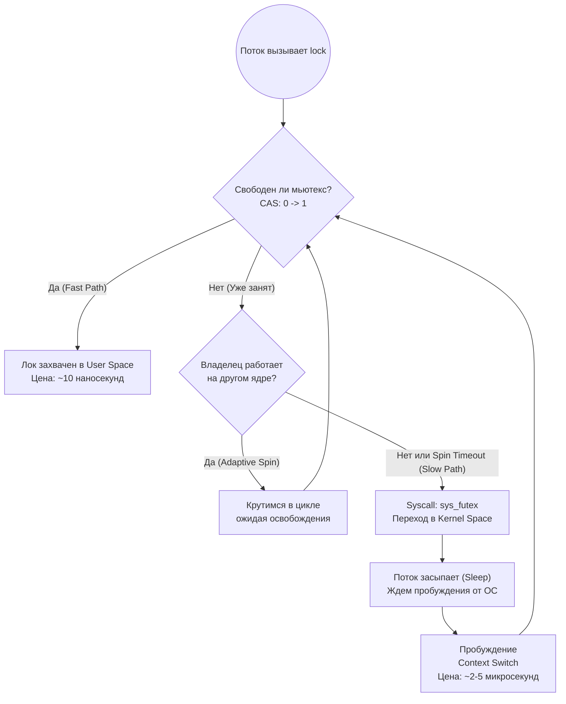
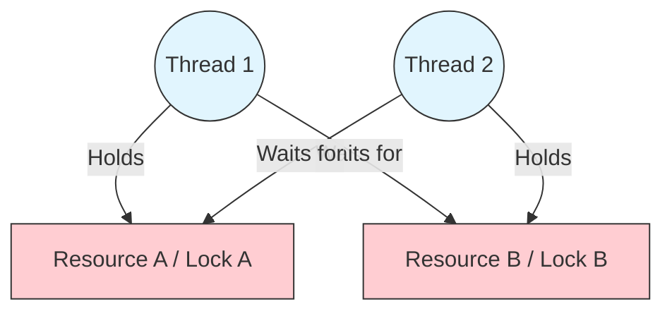

---
tags:
  - concurrency
  - synchronization
  - mutex
  - deadlock
  - multithreading
aliases:
  - Mutex and RW-Lock
  - Condition Variables
---

# L1.CONC.02: Mutex, RW‑lock, condition variables, deadlock patterns

> [!abstract] О лекции
> *   **Mutex** — это не только высокоуровневый `lock`, под капотом это тяжелый системный вызов (futex). Современные адаптивные мьютексы хитро крутятся в user-space перед тем, как уснуть в ядре.
> *   **RW-Lock** — это опасный инструмент, который часто **медленнее** обычного мьютекса из-за архитектурного эффекта "cache line bouncing" при постоянном обновлении счетчиков читателей на шине процессора. Используйте только если читателей *значительно* больше писателей, и критическая секция достаточно долгая.
> *   **Condition Variables** — всегда используйте их в цикле `while`, а не `if`. **Spurious Wakeups** (ложные пробуждения) — это не баг вашей программы, а задокументированная суровая реальность работы ядра ОС.
> *   **Deadlock** — решается не магией и перезагрузками, а строгой математической иерархией захвата ресурсов (Lock Ordering).

---
## 1. Mutex (Взаимное исключение)

**Mutex (Mutual Exclusion)** — это базовый примитив синхронизации, обеспечивающий **строгую сериализацию** доступа к разделяемому ресурсу в многопоточной среде.

Для системного архитектора мьютекс всегда выполняет две фундаментальные функции, о второй из которых джуниоры часто забывают:
1.  **Atomicity (Атомарность):** Гарантирует, что блок кода (критическая секция) выполняется как единое целое, без вмешательства других потоков.
2.  **Visibility (Видимость / Memory Barriers):** Гарантирует, что все изменения в оперативной памяти, сделанные одним потоком *под мьютексом*, гарантированно станут видны любому другому потоку *сразу после* захвата того же самого мьютекса. Без этой барьерной синхронизации (из-за агрессивных кешей L1/L2 CPU) второй поток имеет полное право читать устаревший "мусор" из своих локальных регистров.

## 1.1. Физика процесса: От User Space до Kernel Space

Мьютекс — это не встроенная магия ОС, делающая код медленным. Это хитроумный гибридный объект. В современных реализациях (Linux `pthread_mutex`, Java `ReentrantLock`, Go `sync.Mutex`) используется паттерн **Fast Path / Slow Path**.



### А. Fast Path (User Space) — "Оптимистичный сценарий"
В основе любого мьютекса лежит простая атомарная целочисленная переменная (обычно `int state`: 0 — свободен, 1 — занят).
Когда ваш код вызывает `mutex.lock()`:
1.  Выполняется аппаратная инструкция процессора **CAS (Compare-And-Swap)** или `LOCK XCHG`.
2.  Поток пытается за 1 такт атомарно сменить `0` на `1`.
3.  **Успех:** Если получилось — поздравляю, вы захватили мьютекс. **Системного вызова (Syscall) в ядро ОС не было.** Цена этой операции — десятки наносекунд (это лишь стоимость сброса Store Buffer процессора и инвалидации кэш-линий других ядер по протоколу MESI).

### Б. Slow Path (Kernel Space) — "Пессимистичный сценарий"
Если CAS не удался (мьютекс уже равен `1` или `2` — то есть есть ждущие), поток больше не может продолжать работу в User Space.
1.  Поток помечает мьютекс как "contended" (есть ждущие в очереди, значение `2`).
2.  Выполняется дорогой **Системный вызов (Syscall)** (в Linux это `sys_futex` с опцией `FUTEX_WAIT`).
3.  Ядро ОС (Linux Scheduler) переводит этот поток в состояние `TASK_INTERRUPTIBLE` (паркует его) и убирает из активной очереди планировщика (Run Queue).
4.  Происходит физический **Context Switch** (переключение контекста) на совершенно другой поток или процесс.

**Истинная Цена Slow Path:**
*   Syscall overhead (смена колец защиты Ring 3 -> Ring 0).
*   Context switch latency ($\sim 1-5$ микросекунд чистой потери).
*   **Cache Trashing:** Самое страшное. Когда ваш поток проснется через миллисекунды, абсолютно все его данные в L1/L2 кэше будут вытеснены чужими данными (Evicted). Придется заново читать всё из медленной RAM.

---
## 1.2. Adaptive Mutex (Спин-локи спрятанные внутри Мьютекса)

Когда на собеседовании спрашивают: "Что лучше использовать: Spinlock или Mutex?", этот вопрос выдает устаревшие знания из 2000-х. Абсолютно все современные промышленные мьютексы по умолчанию являются **адаптивными (Adaptive)**.

**Логика Адаптивности (Эвристика):**
Переключение контекста в ядро стоит очень дорого. Если владелец мьютекса прямо сейчас активно работает на *другом* физическом ядре процессора, есть огромная вероятность, что он освободит лок через микросекунду. В таком случае нам математически выгоднее немного "покрутиться" (spin) в user-space цикле, сжигая циклы CPU впустую, чем уходить в тяжелый сон ядра.

**Алгоритм (упрощенно как в JVM/glibc):**
1.  При неудаче первого CAS, алгоритм проверяет: выполняется ли поток-владелец мьютекса прямо сейчас на физическом CPU?
2.  Если да -> мы крутимся в "пустом" цикле `while` (Spin) строго определенное число раз (например, 10-100 итераций), постоянно пытаясь сделать CAS.
3.  Если владелец спит (вытеснен ядром) или время нашего спин-лока вышло -> мы сдаемся и уходим в системный вызов `sys_futex` (Slow Path).

**Инсайт для архитектора:**
Именно поэтому на одноядерных виртуалках (или в Docker контейнерах с лимитом `cpus=1`) спин-локи математически бесполезны и даже вредны. Современные адаптивные мьютексы достаточно умны: они автоматически отключают фазу спиннинга, если ОС сообщает им, что доступно только 1 ядро (потому что крутиться нет смысла — мы только отнимаем время у владельца лока).

---
## 1.3. Проблемы производительности и антипаттерны

### 1. Convoy Effect (Эффект конвоя)
Ситуация: Мьютекс защищает очень "горячий" ресурс (например, аллокатор памяти или пул соединений).
1.  Поток А (текущий владелец) внезапно засыпает из-за исчерпания своего кванта времени от планировщика ОС или из-за аппаратного Page Fault (подгрузка страницы с диска).
2.  В это время Потоки B, C, D пытаются взять лок, проваливаются в Slow Path и массово паркуются в ядре.
3.  Поток А просыпается, заканчивает работу и отпускает лок.
4.  Поток А делает системный вызов, чтобы разбудить *один* ждущий поток (например, B).
5.  Но пока поток B мучительно просыпается (задержка Context Switch), на это же ядро прибегает абсолютно "свежий" поток E (который не спал, а только что пришел с запросом) и нагло **крадет лок (Unfair lock)** через Fast Path!
6.  Поток B наконец просыпается, видит, что лок снова подло занят, и с обидой снова засыпает в ядро.
**Результат для системы:** Очередь спящих потоков растет как снежный ком, общая пропускная способность сервера (Throughput) катастрофически падает, а задержки (99th percentile latency / хвосты) улетают в космос.
**Архитектурное Решение:** Использование **Fair Locks** (Честных локов, строгая очередь FIFO) решает проблему starvation (голодания), но *значительно* снижает общую пропускную способность (потому что запрещает кражу лока и заставляет всех ждать долгих пробуждений). Лучшее инженерное решение — **Fine-grained locking** (дробить локи) или сокращать время пребывания под локом до абсолютного минимума.

### 2. Priority Inversion (Инверсия приоритетов)
Это критический баг, который знаменит тем, что чуть не погубил миссию марсохода NASA Mars Pathfinder.
*   Поток **L** (Low priority - Низкий приоритет) захватывает мьютекс.
*   Поток **H** (High priority - Высший приоритет) вытесняет поток L (так как его приоритет выше), тоже пытается взять этот же мьютекс и блокируется (так как мьютекс у L).
*   Поток **M** (Medium priority - Средний приоритет) вытесняет спящего L (так как $M > L$) и начинает работать долго, делая свои расчеты.
*   **Смертельный Итог:** Супер-важный системный поток H вынужден бесконечно ждать какой-то фоновый поток M, хотя они даже не делят общий ресурс! Система не реагирует на критические события.
**Решение в ядре:** Механизм **Priority Inheritance Protocol** (Наследование приоритетов). Ядро ОС видит ситуацию: когда поток H блокируется об мьютекс потока L, ОС автоматически и временно **повышает приоритет** потока L до уровня потока H. Это позволяет потоку L быстро закончить работу, не будучи вытесненным потоком M, и отпустить ресурс.

---
## 1.4. Reentrancy (Рекурсивные мьютексы): Зло или Полезный Инструмент?

**Определение:** Reentrant Mutex (Рекурсивный мьютекс) — это лок, который позволяет потоку, *уже владеющему* этим локом, успешно захватить его снова и снова (просто увеличивая внутренний счетчик `holdCount`), не блокируя самого себя (Deadlock).

**Жесткое мнение Эксперта:** Использование рекурсивных мьютексов в современной разработке — это почти всегда **Code Smell** (признак плохой архитектуры).

**Пример проблемы (Потеря инварианта):**
```java
class Widget {
    synchronized void doSomething() {
        // Мы меняем состояние объекта (шаг 1)
        state = INTERMEDIATE_STATE; 
        
        // RE-ENTRY (Рекурсивный вызов)
        // doOtherThing() ожидает, что объект находится в консистентном состоянии!
        doOtherThing(); 
        
        // Завершаем изменение (шаг 2)
        state = FINAL_STATE;
    }
    
    synchronized void doOtherThing() {
        // ОШИБКА: Мы зашли сюда, но состояние сломано (INTERMEDIATE_STATE).
        // Логика может отработать неверно или записать мусор в БД.
    }
}
```
Если вы используете рекурсию, вы навсегда теряете понимание того, где именно начинаются и заканчиваются границы вашего инварианта (целостного и валидного состояния бизнес-объекта). Метод `doOtherThing` может быть безопасно вызван снаружи отдельно, а может быть вызван изнутри `doSomething`, когда объект находится в "разобранном" (промежуточном) состоянии. Это источник сложнейших плавающих багов.

**Паттерн решения (Refactoring):**
Всегда жестко разделяйте публичный API (где берется блокировка) и приватную внутреннюю реализацию (которая вообще не знает про блокировки).
```java
// Публичный фасад - берет лок
public void method() {
    lock.lock();
    try {
        methodInternal();
    } finally {
        lock.unlock();
    }
}

// Приватная реализация - НЕ берет лок
private void methodInternal() {
    // Вся реальная бизнес-логика здесь. 
    // Она не требует лока, так как по дизайну 
    // вызывается исключительно из-под уже взятого лока публичными методами.
}
```

---
## 1.5. Granularity (Гранулярность блокировок)

Выбор гранулярности — это вечный компромисс (trade-off) архитектора между производительностью (параллелизмом) и сложностью поддержки (риском дедлоков).

1.  **Coarse-Grained (Глобальный толстый лок):**
    *   Например, `synchronized(this)` на все методы гигантского класса или один `GlobalMutex` на весь кэш.
    *   *Плюс:* Невероятная простота кода, абсолютное отсутствие риска дедлоков (так как лок всего один).
    *   *Минус:* Чудовищное бутылочное горлышко. Все потоки сервера выстраиваются в одну длинную очередь. Сервер с 64 ядрами будет работать со скоростью одного ядра.

2.  **Fine-Grained (Ультра-тонкая блокировка):**
    *   Свой отдельный лок на каждое мелкое поле структуры или на каждый узел связного списка (техника Hand-over-hand locking).
    *   *Плюс:* Максимально возможный параллелизм.
    *   *Минус:* Огромный оверхед по памяти (каждый объект мьютекса занимает 32-64 байта в памяти + внутренние структуры ядра ОС). Экстремально высокий риск поймать перекрестный дедлок.

3.  **Lock Striping (Секционирование / Шардирование локов):**
    *   Золотая середина индустрии. Именно этот паттерн используется внутри `ConcurrentHashMap` (до Java 8).
    *   Создается массив из N локов (например, 16).
    *   Сами данные логически делятся на независимые сегменты (корзины). Поток выбирает нужный лок по хешу: `lockIndex = hash(key) % 16`.
    *   Позволяет 16 потокам писать в одну структуру абсолютно одновременно, не мешая друг другу. Вероятность коллизии (что два потока одновременно полезут в один и тот же сегмент) статистически очень низкая.

---
### Итоговый архитектурный пример для закрепления

Представьте, что вы, как разработчик, пишете In-Memory LRU-кэш для высоконагруженного сервиса.

*   **Уровень Junior:** Просто ставим `synchronized` (глобальный лок) на методы `get` и `put`.
    *   *Результат в проде:* При 1000 RPS всё работает нормально. При всплеске 100k RPS — сервис ложится, все 100 потоков Tomcat висят в состоянии `futex_wait` в ядре, ожидая один лок.
*   **Уровень Practitioner (Middle):** Используем потокобезопасный `ConcurrentHashMap` для хранения самих данных (Lock Striping внутри решит проблему записи) + `DoublyLinkedList` (двусвязный список) для поддержания порядка вытеснения (LRU порядка).
    *   *Архитектурная Проблема:* `ConcurrentHashMap` сам по себе потокобезопасен, но наш связный список — нет! Нам всё равно нужен лок для обновления ссылок `prev/next` в списке при каждом `get()`.
    *   Если мы возьмем один глобальный лок на этот связный список, мы мгновенно убьем всю выгоду от использования `ConcurrentHashMap`. Мы снова вернулись к глобальному узкому горлышку.
*   **Уровень Expert (Lock-Free / Sharding Analytics):**
    *   Мы осознаем бизнес-требования: строгий, идеальный математический LRU (Least Recently Used) нам на самом деле *не нужен*. Нам нужен *приблизительный* LRU (чтобы выкидывать старый мусор).
    *   Мы используем вероятностные алгоритмы (например, алгоритм Clock или TinyLFU из библиотеки Caffeine) или делаем жесткое **Lock Striping самого LRU списка** (разбиваем один список на 16 независимых мини-кэшей, каждый со своим локом).
    *   Либо, если нам нужна экстремальная скорость на C++, мы используем **Spinlock** исключительно для защиты коротких операций перекидывания указателей (`prev`, `next`), так как эти операции занимают единицы наносекунд (Fast Path), и позволять потоку уходить в глубокий сон ядра (Slow Path) там смерти подобно.

**Резюме по Мьютексам:** Мьютекс — это тяжелый, дорогой инструмент. Прежде чем слепо его взять, задайте себе вопросы: "Могу ли я использовать легковесный атомик (AtomicInteger)? Могу ли я шардировать данные так, чтобы лок вообще не был нужен? И если лок неизбежен — как мне спроектировать код так, чтобы поток владел им минимальное количество микросекунд?"

---
## 2. RW-Lock (Read-Write Lock / Блокировка чтения-записи)

**RW-Lock** — это продвинутый примитив синхронизации, который разрешает абсолютно параллельный одновременный доступ множеству потоков-читателей (Shared mode), но строго требует эксклюзивного монопольного доступа для потока-писателя (Exclusive mode).

### 2.1. Физика "бутылочного горлышка": Когерентность кэшей CPU
Это самый важный аппаратный пункт, который массово упускают из виду разработчики уровня Middle. "Ну раз мы просто читаем, значит RW-Lock будет летать!" — это глубокое заблуждение.

Чтобы физически разрешить вход **читателю**, структура RW-Lock обязана убедиться в памяти, что:
1.  Нет активных писателей прямо сейчас.
2.  (Опционально) Нет ждущих в очереди голодных писателей.
3.  **Инкрементировать (увеличить на +1) внутренний счетчик активных читателей.**

Вот в пункте 3 кроется технологический дьявол. Даже если ваша прикладная критическая секция строго *read-only* (вы только читаете конфиг), сам факт захвата замка `readLock.lock()` — это низкоуровневая операция **ЗАПИСИ** в оперативную память (обновление метаданных замка, переменной `active_readers++`).

**Сценарий катастрофы (Cache Line Bouncing):**
*   У вас сервер на 64 ядра, и 64 потока хотят "просто быстро прочитать" конфигурацию.
*   Счетчик читателей физически находится в одной **Cache Line** процессора (обычно размер линии 64 байта).
*   Ядро 1 делает атомарный инкремент счетчика (инструкция `LOCK XADD` или `CAS`).
*   Согласно аппаратному протоколу когерентности **MESI** (Modified-Exclusive-Shared-Invalid), Ядро 1 обязано получить эту кэш-линию в эксклюзивное состояние **Modified**.
*   В этот же такт Ядро 2 тоже хочет взять `readLock`. Оно лезит в память и получает **Cache Miss** (промах). Процессор аппаратно вынужден сбросить эту горячую линию из L1 кэша Ядра 1 в общую медленную шину (или L3 кэш), чтобы Ядро 2 могло ее прочитать, обновить свой инкремент и перевести уже к себе в состояние Modified.
*   **Катастрофический Итог:** Вместо заявленного параллельного чтения вы получаете строгую **последовательную** передачу (пинг-понг) одной кэш-линии между 64 ядрами. Внутренняя шина данных процессора (Ring Bus / Mesh) намертво забита паразитным трафиком синхронизации.
*   **Сравнение:** Обычный глупый Mutex (`std::mutex`) в этом же сценарии тоже страдал бы, но структура RW-Lock намного тяжелее ("жирнее" в памяти) внутри, и суммарная цена атомарных операций выше из-за сложности логики проверки состояний. Если ваша полезная критическая секция очень короткая (например, просто прочитать `int` значение), то накладные расходы процессора на "жонглирование" кэш-линией превысят время самой полезной работы в десятки раз. Обычный Mutex отработает быстрее.

### 2.2. Политики честности (Fairness Policies): Выбор яда
Объект RW-Lock не существует в вакууме. Внутренняя реализация (в библиотеках glibc, JVM, `sync` в Go) всегда жестко выбирает стратегию приоритизации потоков. Как инженер, вы обязаны знать какую именно, иначе вы гарантированно получите на проде баг **Starvation** (Голодание).

1.  **Reader Preference (Приоритет читателя):**
    *   *Логика ядра:* Если лок уже занят толпой читателей, и приходит новый читатель — мы пускаем его сразу (даже если в очереди уже плачет и ждет писатель).
    *   *Проблема:* **Write Starvation (Голодание писателя)**. Если поток читателей плотный и непрерывный (High RPS), писатель может не получить доступ секунды, минуты... вечно. Он умрет по таймауту.
    *   *Пример:* `ReentrantReadWriteLock` в Java (по умолчанию его unfair mode работает по похожему принципу).

2.  **Writer Preference (Приоритет писателя):**
    *   *Логика ядра:* Как только в очередь пришел хотя бы один писатель, абсолютно все новые читатели жестко блокируются в очереди. Система ждет, пока текущие активные читатели дочитают свои данные и уйдут, затем пускает писателя, и только потом разблокирует очередь новых читателей.
    *   *Проблема:* Резкое снижение общей пропускной способности (Concurrency). Один медленный писатель, просто став в очередь, может заблокировать и "повесить" тысячу быстрых читателей.
    *   *Пример:* `std::shared_mutex` во многих реализациях C++, `sync.RWMutex` в Go (разработчики Go реализовали сложный гибрид, но он имеет перевес в сторону writer-preference, чтобы гарантированно избежать starvation писателей).

3.  **Fair (Честная очередь):**
    *   *Логика:* Строгий FIFO (First-In, First-Out). Кто первый пришел к замку, тот и обслуживается.
    *   *Цена:* Огромный системный оверхед на Context Switches. Возникает "Эффект конвоя" — пачка очень быстрых читателей вынуждена ждать одного медленного писателя, который пришел на долю секунды раньше них. На практике это обычно самая медленная реализация под нагрузкой.

### 2.3. Проблема Upgrade / Downgrade (Смертельный капкан)
Частая и наивная архитектурная ошибка джуниора: "Я возьму `readLock`, прочитаю данные, и если они мне не нравятся — я прямо здесь же обновлю лок до `writeLock` и изменю их".

```java
// Anti-pattern: Upgrading Lock (Путь к дедлоку)
rwLock.readLock().lock();
if (state == BAD) {
    // Мы хотим стать писателем!
    rwLock.readLock().unlock(); // Мы вынуждены отпустить чтение!
    rwLock.writeLock().lock();  // И встать в конец очереди за записью
    
    // ВНИМАНИЕ АРХИТЕКТОРА: За то время (микросекунды) между unlock() и lock() 
    // состояние 'state' в памяти могло измениться 10 раз другими писателями!
    // Вы обязаны ПЕРЕПРОВЕРЯТЬ state заново.
}
```
**Фундаментальная Суть проблемы:** Атомарный апгрейд (мгновенный переход из статуса R в W без отпускания лока) математически невозможен в большинстве стандартных библиотек программирования, так как это гарантирует мгновенный неразрешимый **Deadlock**.
*   Представьте физику: Поток А держит `readLock`, и просит `writeLock`. В эту же миллисекунду Поток Б тоже держит `readLock` (они же читатели, им можно вместе) и тоже просит `writeLock`.
*   Чтобы Поток А получил свой W, Поток Б обязан отпустить свой R (так как W эксклюзивен).
*   Чтобы Поток Б получил свой W, Поток А обязан отпустить свой R.
*   Они оба заблокировались в ожидании друг друга навечно.

*Примечание Эксперта:* Существуют хитрые реализации вроде `StampedLock` (появился в Java 8) или специфичные локи баз данных, которые поддерживают оптимистичное чтение с валидацией штампов, но они невероятно сложны в правильном использовании и отладке.

### 2.4. Когда реально нужен RW-Lock (Decision Matrix для Архитектора)
Как системный инженер, вы даете добро на использование RW-Lock в PR (Pull Request) ТОЛЬКО если строго выполняются **все три** условия:

1.  **Read-Heavy workload (Профиль нагрузки):** Доля операций чтения составляет > 90-95% от всех запросов (не 60/40, и даже не 80/20).
2.  **Long Critical Section (Длинная секция):** Физическое время удержания лока велико (занимает сотни микросекунд или миллисекунды). Например: обход гигантского графа в памяти, тяжелая сериализация огромного JSON, медленное копирование массива.
    *   *Физическое обоснование:* Если секция долгая, тогда цена аппаратного Cache Line Bouncing на счетчиках (100-300 наносекунд) математически становится несущественной и размазывается на фоне огромного выигрыша от параллельного чтения.
3.  **Low Contention on Write:** Писатели приходят крайне редко и не создают постоянную пробку.

### 2.5. Альтернативы для Эксперта (Без RW-Lock)

Если профайлинг показывает, что RW-Lock стал бутылочным горлышком системы, Staff Engineer применяет паттерны высшего порядка:

1.  **Lock Striping (Шардирование локов):**
    Вместо одного толстого `RWLock` на весь кэш, сделайте массив из 16-64 независимых `RWLock`.
    Обращение: `locks[hash(key) % 16].readLock()`.
    Это математически снижает аппаратную конкуренцию за ту самую кэш-линию счетчика на шине CPU ровно в 16 раз.
    *Пример индустрии:* класс `ConcurrentHashMap` (до Java 8 активно использовал парадигму Segment Locking).

2.  **Copy-On-Write (COW):**
    Идеальный и пуленепробиваемый паттерн для конфигов, роутинга или списков слушателей (Listeners).
    *   Читатели всегда читают `volatile` (или atomic) ссылку на массив без всяких локов (Zero overhead, скорость света).
    *   Писатель, когда хочет добавить элемент, физически копирует весь старый массив памяти, меняет эту копию у себя, и затем атомарно (CAS) подменяет глобальную ссылку со старого массива на новый.
    *   *Скрытая Цена:* Экстремально дорогая операция записи (копирование мегабайт памяти и нагрузка на Garbage Collector). Оправдано только при редких записях.

3.  **RCU (Read-Copy-Update):**
    Высший пилотаж системного программирования (основа ядра Linux, есть либы Userspace RCU).
    Читатели вообще физически не используют атомарные инструкции (нет операций записи в память, нет кэш-миссов, шина CPU свободна). Писатели делают изменения в копии, а затем терпеливо "ждут", пока абсолютно все активные читатели покинут свои критические секции (достигнут "quiescent state" - состояния покоя), прежде чем безопасно удалить из памяти старые, замененные данные.

4.  **LongAdder / Striped64 (Java):**
    Если вам нужен RW-Lock только для того, чтобы защитить один глобальный счетчик метрик — никогда не используйте лок и даже простой AtomicInteger (он тоже ложит шину). Используйте "полосатые" структуры (LongAdder), которые под капотом хитро размазывают единый счетчик по массиву независимых ячеек памяти (по одной изолированной ячейке на каждое ядро CPU), чтобы полностью избежать аппаратных конфликтов записи, а при вызове `get()` просто суммируют их.

### Пример для наглядности: DNS-кэш микросервиса

**Плохо (Naive RW-Lock - Решение джуниора):**
```cpp
std::shared_mutex dns_lock;
std::map<string, IP> dns_cache;

IP resolve(string domain) {
    // ВНИМАНИЕ: shared_lock делает АТОМАРНУЮ ЗАПИСЬ в метаданные dns_lock!
    std::shared_lock lock(dns_lock); 
    return dns_cache[domain]; // Поиск в map - это всего пара сотен тактов
}
```
*Почему это архитектурно плохо:* Операция поиска в сбалансированном `std::map` по строке очень быстрая. Время затраченное процессором на захват и отпускание лока на шине памяти сопоставимо со временем самого поиска! На сервере с 64 ядрами под 100k RPS общая производительность этого кода упадет ниже, чем на 1-ядерном сервере из-за протокола когерентности кэшей.

**Хорошо (Granular Locking + Double Check):**
Использовать готовую lock-free структуру `ConcurrentHashMap` (Java) или применить ручное шардирование.
Если мы пишем суровый бэкенд на C++:
```cpp
// 1. Сначала мы всегда пробуем обойтись без лока (если есть lock-free read path)
// 2. Если нужно синхронизироваться - жестко шардируем мьютексы
std::shared_mutex locks[256];
// Выбираем свой лок на основе хеша (раскидываем нагрузку по 256 кэш-линиям)
auto& mtx = locks[hash(domain) % 256]; 
{
    std::shared_lock lock(mtx);
    // ... логика поиска
}
```

**Резюме раздела:** RW-Lock — это узкоспециализированный инструмент для **очень длительных** операций чтения. На коротких (микросекундных) операциях он с треском проигрывает обычному мьютексу (или даже спинлоку) из-за сложности и тяжести протокола когерентности на шине процессора.

---
## 3. Spinlock (Спин-лок): Битва с шиной памяти и планировщиком ОС

Спинлок — это низкоуровневый примитив синхронизации, основанный на концепции **активного ожидания (busy-wait)**. Поток не уходит в глубокий сон ядра (не делает системный вызов), а агрессивно крутится в бесконечном цикле `while`, непрерывно опрашивая переменную в памяти, пока она не освободится.

### 3.1. Физика процесса: TAS vs TTAS и протокол MESI

Наивная, "учебная" реализация спинлока — это физическая катастрофа для пропускной способности шины памяти сервера.

**1. Наивный TAS (Test-And-Set):**
```cpp
// Архитектурно ПЛОХО:
// Мы бесконечно в цикле делаем аппаратный EXCHANGE (запись)
while (flag.exchange(true, std::memory_order_acquire)) {
    // крутимся, сжигая CPU
}
```
*   **Проблема Железа:** Ассемблерная инструкция `LOCK XCHG` (или `CAS`) — это безусловная операция **записи** в память. Даже если лок прямо сейчас занят, мы с каждым тактом постоянно пытаемся в него писать.
*   **MESI Protocol:** Чтобы физически записать биты в ячейку, ядро процессора обязано получить её в эксклюзивное состояние **Modified (M)**. Для этого оно каждую микросекунду шлет сообщение `RequestForOwnership` по кольцевой шине материнской платы, принудительно инвалидируя (сбрасывая) кэши абсолютно всех остальных ядер (которые держат эту линию в состоянии Shared).
*   **Шторм на шине (Bus Storm):** Если 10 ядер одновременно крутятся на таком TAS-спинлоке, они как собаки постоянно вырывают одну несчастную кэш-линию друг у друга (Cache Line Ping-Pong). Внутренняя шина памяти полностью забита бесполезным системным трафиком синхронизации, полезная математическая работа на других (даже не связанных) ядрах встает колом, так как они не могут достучаться до RAM.

**2. TTAS (Test-Test-And-Set) — Выбор профессионала:**
```cpp
// Архитектурно ЛУЧШЕ (Эталон):
do {
    // 1. Test (Read-only фаза): Крутимся только на чтении, не трогая шину записи!
    while (flag.load(std::memory_order_relaxed)) {
        _mm_pause(); // Охлаждаем CPU и спасаем конвейер
    }
    // 2. Test-And-Set (Write фаза): Пытаемся захватить ТОЛЬКО когда своими глазами увидели 0
} while (flag.exchange(true, std::memory_order_acquire));
```
*   **Механика спасения:** Пока лок занят, мы делаем только легкую инструкцию `LOAD`. Кэш-линия спокойно остается в состоянии **Shared (S)** на кэшах всех 10 ядер. Чтение происходит сугубо локально (L1 Cache hit). Трафика на общей шине процессора **нет вообще**.
*   Мы пытаемся сделать дорогую инструкцию `EXCHANGE` (захват шины) только тогда, когда локально увидели, что лок наконец-то освободился.

### 3.2. Ассемблерная инструкция `PAUSE`: Зачем умышленно тормозить процессор?

Внутри активного цикла `while` спинлока **абсолютно обязательно** должна присутствовать инструкция `cpu_relax()` (в ядре Linux), `_mm_pause()` (архитектура x86) или `__yield()` (архитектура ARM).

Зачем инженеры вставляют "паузу", если мы по логике хотим захватить лок "как можно быстрее"?
1.  **Memory Order Violation (Защита Конвейера):** Без этой паузы процессор в пустом цикле спекулятивно (наперед) выполняет миллионы инструкций чтения. Когда лок наконец меняется (другой поток отпускает его), конвейер (Pipeline) процессора оказывается "забит" спекулятивными мусорными данными, которые нужно экстренно сбросить (Pipeline Flush). Это стоит очень дорого (потеря сотен тактов). Инструкция `PAUSE` дает контроллеру команду: "Это спинлок, не спекулируй, притормози выборку".
2.  **Энергоэффективность:** Бешеный холостой цикл моментально раскаляет ядро процессора до 90 градусов, заставляя систему охлаждения сбрасывать (троттлить) базовую частоту всего процессора, замедляя работу сервера.
3.  **Hyper-Threading (HT / Солидарность):** Если на одном физическом ядре аппаратно работают два логических потока (HT), гиперактивный спинлок без паузы эгоистично забивает 100% исполнительных блоков (ALU) ядра, не давая второму логическому потоку (соседу) нормально работать. Инструкция `PAUSE` заставляет процессор принудительно отдать такты ALU соседу.

### 3.3. Главный враг Спинлока: Preemption (Вытеснение ОС)

Это фундаментальная причина, по которой Линус Торвальдс и мировые эксперты по конкаренси **строго запрещают** использовать чистые самописные спинлоки в User Space (прикладном коде веб-серверов) без крайней необходимости.

**Сценарий катастрофы (Lock Convoy / Фриз системы):**
1.  **Поток А** успешно захватывает ваш Спинлок. Он находится прямо внутри критической секции кода (вычисляет хеш).
2.  **Планировщик ОС Linux** решает, что квант времени Потока А (его 4 мс) истек (или пришло аппаратное прерывание от сетевой карты, которое вытеснило его). Поток А "насильно засыпает", но **с локом в руках**!
3.  **Поток Б** получает управление от ОС на этом ядре. Он доходит до кода и пытается захватить этот же лок.
4.  Поскольку это Спинлок (глупый `while`), Поток Б не идет жаловаться ядру и спать. Он начинает бешено крутиться в цикле `while` весь свой выданный квант времени (например, 10 мс), **сжигая 100% CPU абсолютно впустую**, ожидая Поток А. Но Поток А не может проснуться, потому что Поток Б занял процессор!
5.  Если потоков много (веб-сервер), они выстраиваются в очередь, по очереди сжигая свои кванты времени на 100% CPU и ничего не делая. Система "фризится" (Deadlock-подобное состояние по таймауту).

**Разительное отличие от Mutex:** Если бы в этой ситуации использовался стандартный Мьютекс, Поток Б, увидев, что лок занят, сразу отдал бы процессор обратно операционной системе (через `sys_futex_wait`), позволив планировщику разбудить Поток А (или заняться другими полезными задачами), чтобы тот быстрее отдал лок.

### 3.4. Exponential Backoff (Экспоненциальная отсрочка)

Если вы, как эксперт, пишете свой кастомный гибридный спинлок (например, внутри сложной Lock-Free структуры данных), вы математически не должны "долбить" проверку в памяти в каждом такте.
Правильный алгоритм ожидания (Backoff Algorithm):
1.  Сначала крутимся активно и агрессивно (например, 4-10 итераций).
2.  Если не вышло — крутимся с инструкцией `_mm_pause()` (причем количество пауз растет экспоненциально: 2, 4, 8...).
3.  Если всё еще не вышло (лок держится долго) — делаем системный вызов `std::this_thread::yield()` или `sched_yield()` (добровольно отдаем остаток своего кванта времени ОС).
4.  В самом конце, если ресурс "застрял" — уходим в полноценный системный `wait/sleep` (по сути, превращаясь обратно в логику мьютекса).

### 3.5. Когда Spinlock реально оправдан (Use Cases)

Как Staff Engineer, вы на код-ревью утверждаете использование чистого спинлока **исключительно** в трех строгих случаях:

1.  **Критическая секция экстремально мала:** Секция содержит всего несколько ассемблерных инструкций (инкремент счетчика, атомарный переброс указателя). Физическое время выполнения секции ($T_{crit}$) должно быть строго и гарантированно **меньше** времени переключения контекста ОС ($T_{ctx} \approx 2-5 \mu s$). Иначе математика ломается.
    *   *Пример:* `ref_count++` в умных указателях (`std::shared_ptr`).
2.  **Kernel Development / Interrupt Handlers (Разработка Ядра):** В обработчике аппаратного прерывания (IRQ) ядру Linux *физически запрещено* спать или вызывать планировщик. Там спинлок — это единственный технически возможный вариант синхронизации.
3.  **Real-Time Systems (Pinned Threads / Прибитые потоки):**
    *   Вы как DevOps выделили ядра процессора (CPU isolation), на которых вообще не работает планировщик ОС (параметр загрузчика `isolcpus`).
    *   Ваш критичный рабочий поток жестко прибит к этому выделенному ядру (`pthread_setaffinity_np`).
    *   Вы архитектурно гарантируете, что этот поток **никто и никогда не вытеснит** (No Preemption). Только тогда спинлок дает минимально возможную, предсказуемую задержку (единицы наносекунд). Это суровый мир **HFT (High-Frequency Trading)** на биржах.

### 3.6. Пример эталонного спинлока на C++ (Production Grade)

```cpp
#include <atomic>
#include <thread>
#include <emmintrin.h> // Необходим для инструкции _mm_pause (x86)

class TASSpinLock {
    std::atomic<bool> state = {false};

public:
    void lock() {
        // Оптимизация TTAS: Сначала только читаем (Load), пока не увидим false
        while (true) {
            // 1. Фаза Test (Relaxed load - самая дешевая инструкция, без барьеров памяти)
            if (!state.load(std::memory_order_relaxed)) {
                // 2. Фаза Attempt Test-And-Set (Acquire - барьер памяти)
                // Если успешно поменяли false -> true за один такт, мы захватили лок!
                if (!state.exchange(true, std::memory_order_acquire)) {
                    return;
                }
            }
            // 3. Backoff: Аппаратная подсказка процессору не спекулировать и остудить конвейер
            _mm_pause(); 
        }
    }

    void unlock() {
        // Release - барьер: все наши записи в память до этой строки 
        // гарантированно станут видимы другим ядрам CPU
        state.store(false, std::memory_order_release);
    }
};
```

**Резюме раздела:** Спинлок — это острейший скальпель. В руках хирурга (HFT трейдер, разработчик Ядра) он спасает драгоценные наносекунды. В руках любителя (обычный Web/Backend API разработчик) он гарантированно убивает общую пропускную способность сервера при малейших скачках нагрузки из-за Priority Inversion и тотального забивания шины памяти.

---
## 4. Semaphore (Семафор): Оркестрация, а не просто защита 

Если классический Мьютекс — это **замóк на двери** (Lock), ключ от которого в кармане есть только у одного владельца, то Семафор — это **корзина с талонами на очередь** (Permits).
В архитектуре семафора напрочь отсутствует понятие "Владельца" (Thread Ownership). Это фундаментально меняет абсолютно всё: от паттернов применения в коде до низкоуровневых оптимизаций внутри ядра ОС.

### 4.1. Архитектурная пропасть: Владение (Thread Ownership)
Это главный вопрос "на засыпку" на собеседовании инженеров уровня Staff. Чем Семафор со счетчиком 1 отличается от Мьютекса?

*   **Mutex (Строгое Владение):**
    *   Тот самый поток `T1`, который вызвал `lock()`, **обязан** лично вызвать `unlock()`.
    *   Если поток `T1` аварийно умирает (Crash), так и не отпустив мьютекс, продвинутая система (Linux) может отследить это и пометить мьютекс как `EOWNERDEAD` (механизм Robust Mutexes), позволяя другим потокам восстановить работу.
    *   **Priority Inheritance (Наследование):** Ядро ОС физически *видит*, кто именно держит мьютекс. Если высокоприоритетный процесс ждет, ядро может временно "бустануть" приоритет владельца-аутсайдера.
*   **Semaphore (Анархия / Без владельца):**
    *   Поток `T1` может сделать `wait()` (взять последний талон из корзины), а совершенно другой поток `T2` (или вообще асинхронный обработчик прерывания) может сделать `post()` (вернуть талон в корзину).
    *   **Никакого Priority Inheritance:** Ядро Linux не имеет понятия, *какой именно* из тысяч потоков в системе должен в будущем вернуть талон (сделать `post`). Поэтому, если высокоприоритетный поток жестко ждет на пустом семафоре, он может прождать вечно, пока какой-нибудь низкоприоритетный фоновый поток не соизволит сделать `post()`. Это классическая, неустранимая причина **Unbounded Priority Inversion** (Неограниченной инверсии приоритетов).

### 4.2. Анатомия операций (Наследие Дейкстры)
В классическом системном программировании (POSIX / C) используются исторические термины голландца Эдсгера Дейкстры:
1.  **Wait / Acquire (Операция P - Proberen / Проверять):** Атомарно уменьшает внутренний счетчик семафора.
    *   Если счетчик $> 0$, декрементирует его (забирает талон) и продолжает работу немедленно, не засыпая.
    *   Если счетчик $= 0$ (талонов нет), поток жестко блокируется (уходит в Sleep в ядро) до появления талона.
2.  **Post / Signal / Release (Операция V - Verhogen / Увеличивать):** Атомарно увеличивает счетчик (кладет талон).
    *   Если в очереди есть спящие потоки, один из них немедленно разблокируется ядром и забирает этот талон.

### 4.3. Сценарии использования (Design Patterns)

Опытный архитектор выбирает семафор не для защиты куска памяти (для этого всегда есть Mutex/Spinlock), а для **координации и оркестрации потоков**.

#### А. Admission Control (Ограничение допуска / Leaky Bucket)
Защита хрупкого бэкенд-сервиса от перегрузки (Rate Limiting). У нас есть пул из ровно 50 коннектов к Legacy Базе Данных.
*   **Инициализация:** `sem_init(50)`.
*   **Logic:** Перед стартом обработки каждого HTTP-запроса делаем `sem_wait()`. После окончания — обязательно `sem_post()` в блоке `finally`.
*   **Почему не просто Atomic Integer (Счетчик)?** Атомик математически не умеет усыплять потоки. Если лимит пула исчерпан (50/50), на атомике вы будете вынуждены писать `while(atomic.get() >= 50)` и делать `spin-wait` (жечь CPU вхолостую). Семафор же элегантно отправит 51-й поток спать в очередь ядра Linux, пока не освободится слот. Это самый эффективный и системно правильный способ реализации **Bulkhead pattern** внутри одного запущенного процесса.

#### Б. Handoff Signaling (Асинхронная передача эстафеты)
Сценарий Producer-Consumer без буфера: Поток А готовит пачку данных, Поток Б их должен отправить по сети.
*   *Инициализация:* `sem_init(0)` (Корзина изначально пуста).
*   **Thread A (Producer):** Подготовил буфер в памяти -> вызывает `sem_post()` (кладет талон).
*   **Thread B (Consumer):** Висит в `sem_wait()` -> Проснулся (получил талон), значит данные точно готовы -> Начинает отправку.
*   *Архитектурный Нюанс:* Если Поток А (генератор) работает быстрее Потока Б, семафор просто накапливает "кредиты" (счетчик растет: 1, 2, 3...). Поток Б потом их выгребет по одному без задержек и блокировок. Классический Мьютекс бы здесь вообще не сработал (вы физически не можете сделать `unlock` 3 раза подряд "впрок").

#### В. Async Completion (Превращение callback-лапши в синхронный код)
Вы работаете со старым асинхронным C/C++ API (например, `libaio` или сетевой драйвер), который вызывает функцию-колбек, но вам по бизнес-логике нужно заблокировать текущий рабочий поток именно до получения ответа (превратить Async в Sync).
```c
// Структура для передачи контекста между потоками
struct Context { sem_t sem; Response resp; };

// Функция, которую вызовет ДРУГОЙ системный поток драйвера
void callback(Response r, void* arg) {
    Context* ctx = (Context*)arg;
    ctx->resp = r;
    sem_post(&ctx->sem); // Разблокируем наш ожидающий поток!
}

Response sync_request() {
    Context ctx;
    sem_init(&ctx.sem, 0, 0); // Инициализация нулем
    async_send_request(..., callback, &ctx); // Ушло в фон
    sem_wait(&ctx.sem); // Наш поток жестко блокируется до вызова callback
    return ctx.resp;
}
```
*   *Почему здесь фатально ошибкой было бы использовать Мьютекс?* Потому что `sem_post` вызывается совершенно *другим* потоком ОС (внутри пула драйвера) или вообще из аппаратного signal handler'а, а стандартный мьютекс требует, чтобы `unlock` делал строго тот же самый поток, что и сделал `lock`. Разблокировка чужого мьютекса в С++ — это **Undefined Behavior** (UB, может привести к крашу ядра).

### 4.4. Binary Semaphore vs Mutex (Вечная путаница)
Частый вопрос: "Бинарный семафор (инициализированный в 1) — это ведь то же самое, что и Мьютекс?"
**Ответ эксперта: Категорически Нет.**
1.  **Reentrancy (Рекурсия):**
    *   Мьютекс может быть настроен как рекурсивный (один поток может брать его 5 раз, не зависая).
    *   Бинарный семафор глуп. Если поток, взявший семафор (сделал счетчик 0), по ошибке вызовет `wait` второй раз — произойдет мгновенный **Deadlock** самого себя.
2.  **Скорость (Оптимизации ядра):**
    *   В Linux (библиотека glibc) `pthread_mutex` чудовищно сильно оптимизирован под user-space (он вообще не делает syscall `futex`, если нет конкуренции).
    *   Объект `sem_t` тоже использует futex внутри, но часто он чуть "тяжелее" в тактах из-за более сложной логики гарантий пробуждения (thundering herd avoidance) и отсутствия привязки к Thread ID для оптимизаций.

### 4.5. Опасности эксплуатации (The Dark Side)

1.  **Signal Safety (Безопасность в прерываниях):**
    `sem_post` — это одна из очень немногих функций синхронизации, которую (по строгому стандарту POSIX) абсолютно безопасно вызывать изнутри **обработчика системных сигналов** (Signal Handler, например при получении `SIGINT` или `SIGALRM`).
    Никакие стандартные функции выделения памяти (`malloc`), функции I/O (`printf`) или классические мьютексы (`pthread_mutex_lock`) внутри signal handler вызывать **категорически нельзя** — это с огромной вероятностью приведет к Deadlock. А семафор можно. Это единственный легальный способ корректно сообщить основному приложению: "Получен сигнал от ОС, пора грациозно завершаться".

2.  **Забытый Post (Утечка талонов):**
    Если в сложном блоке `try-catch` или при раннем выходе из функции `return` вы забыли сделать обязательный `sem_post`, система (в отличие от умных RAII-оберток над мьютексами в C++, типа `std::lock_guard`, которые отпускают лок в деструкторе) не "починит" это автоматически. Незаметная утечка пермитов (талонов) семафора приводит к полному зависанию (Resource Starvation) системы спустя часы или недели непрерывной работы.

**Резюме раздела:** Как архитектор, используйте семафоры исключительно для **управления количеством ресурсов** (connection пулы, лимиты пропускной способности) и для асинхронных **уведомлений** (паттерн producer-consumer). Для классической защиты критических секций с данными (изменения переменных) всегда используйте только **Мьютексы**.

---
## 5. Condition Variables (Условные переменные)

**Строгое Определение:** Condition Variable (CV) — это системный механизм синхронизации, позволяющий потоку **атомарно** освободить удерживаемый мьютекс и приостановить свое выполнение (уйти в сон ядра), дожидаясь получения сигнала пробуждения от другого потока.

**Главный архитектурный инсайт:** CV сама по себе **не имеет состояния**. У неё вообще нет "памяти" внутри. Если вы пошлете сигнал (`notify`) в CV, на которой прямо сейчас физически никто не спит, этот сигнал бесследно уйдет в пустоту (Lost Signal). Это фундаментальное, базовое отличие от Семафора, который аппаратно "запоминает" (инкрементирует счетчик) такие сигналы впрок. Само состояние (предикат, условие) всегда должно храниться в *ваших собственных* бизнес-данных (флаг `isReady=true`, счетчик `queueSize > 0` и т.д.).

### 5.1. Анатомия операции `wait(mutex)` (Что происходит под капотом)

Операция `wait` (ожидание) делает три вещи, и вся математическая магия заключается в их строгой неразрывной последовательности:
1.  **Атомарно (в рамках одного такта планировщика)** разблокирует переданный мьютекс (`unlock`) и ставит вызывающий поток в очередь спящих ОС (Wait Queue).
2.  Поток спит и ждет сигнала.
3.  Когда сигнал получен (кто-то сделал `notify`, или произошло ложное пробуждение), поток просыпается ядром и **в обязательном порядке** пытается снова захватить этот же самый мьютекс (`lock`). Если мьютекс занят другим потоком — он будет стоять в очереди за мьютексом.
4.  Только *после успешного повторного захвата* мьютекса метод `wait` возвращает управление вашему коду.

**Почему слово "Атомарно" здесь критично:** Между шагом 1 (сброс лока) и шагом 2 (уход в сон) **не может быть ни микросекунды разрыва**. Если бы разрыв (race condition) был, другой поток мог бы успеть в эту щель захватить мьютекс, изменить состояние данных на "Готово" и послать `notify` *до* того, как наш первый поток реально уснул в ядре. Первый поток пропустил бы этот сигнал (так как он еще не спал) и затем уснул бы навечно. Это классическая системная проблема "Lost Wakeup", которую CV элегантно решает за вас на уровне ядра.

### 5.2. Канонический паттерн (The Loop / Золотое правило)

В абсолютно любом Production-коде ожидание на CV должно выглядеть **строго и только** так (через цикл `while`):

```cpp
// 1. Захват мьютекса (защищаем наше бизнес-состояние)
unique_lock<mutex> lock(mtx);

// 2. Проверка предиката СТРОГО В ЦИКЛЕ WHILE
// "Пока НЕ готово - спать"
while (!predicate_condition()) { 
    // 3. Атомарный unlock + sleep. 
    // При пробуждении прямо здесь под капотом происходит re-lock.
    cv.wait(lock); 
}

// 4. Критическая секция (гарантия: мы владеем мьютексом И наше условие 100% выполнено)
do_business_work();
```

### 5.3. Почему `while`, а категорически не `if`: Три системные причины

Многие инженеры на интервью отвечают "Потому что Spurious Wakeups (Ложные пробуждения)", но это лишь одна из причин. Их три.

1.  **Spurious Wakeups (Ложные пробуждения от ОС):**
    В стандарте POSIX Pthreads (и, как прямое следствие, в спецификациях Java/C++) официально разрешено, чтобы функция `wait` вернулась (поток проснулся) **вообще без вызова `notify`** кем-либо.
    *   *Причина Ядра:* В некоторых реализациях ядра (особенно Linux) при обработке системных сигналов (например, доставка `SIGINT` процессу) ядру математически проще и дешевле разбудить вообще все спящие на фьютексах потоки, чем сидеть и разбираться, кого именно нужно будить, а кого нет. Это осознанный инженерный trade-off между чистотой API для программиста и сырой производительностью ядра Linux. Вы обязаны с этим жить.
2.  **Intercepted Signal (Перехват сигнала конкурентом):**
    *   Поток `Producer` кладет задачу в очередь, меняет состояние и делает `notify()`.
    *   Просыпается поток `Consumer A` (который спал в `wait`). Он начинает процедуру выхода из сна (пытается захватить мьютекс).
    *   *НО!* В эту же наносекунду на свободное ядро приходит абсолютно новый поток `Consumer B` (который вообще не спал, а просто только что пришел выполнить функцию).
    *   `Consumer B` сходу успевает захватить этот мьютекс первым (через Fast Path), так как `Consumer A` только просыпается из ядра (Slow Path) и проигрывает гонку. `Consumer B` забирает единственную задачу из очереди и уходит.
    *   Спустя микросекунду `Consumer A` наконец захватывает мьютекс и выходит из `wait`. Если бы в коде стоял `if`, он бы пошел дальше и попытался забрать задачу из *уже пустой* очереди -> Fatal Crash/Bug (NullPointerException). С циклом `while` он честно посмотрит на состояние, увидит, что очередь опять пуста, вздохнет и уснет снова.
3.  **Relaxed Semantics (Семантика Mesa):**
    Абсолютно все современные операционные системы используют семантику Mesa (в отличие от академической Hoare semantics).
    *   **Mesa:** Вызов `notify` не передает процессор мгновенно спящему потоку! Он просто переводит спящий поток из очереди ожидания (Wait Queue) в общую очередь готовых к исполнению (Ready Queue). Сигнализирующий поток *продолжает* владеть мьютексом и работать. Пробужденный поток запустится "когда-нибудь потом", когда до него дойдет планировщик ОС. За эти миллисекунды задержки состояние мира (данных) могло измениться 100 раз.

### 5.4. Signal (`notify`) vs Broadcast (`notifyAll`)

Выбор между ними — это не вопрос вкуса, это вопрос масштабируемой производительности (Performance) и корректности (Correctness).

*   **Signal (`notify` в Java / `notify_one` в C++):** Будит **ровно один** произвольный поток из всей очереди ожидания (ОС сама решает какой).
    *   *Когда использовать:* (1) Абсолютно все потоки ждут одного и того же логического условия (Uniform waiters) И (2) Одно событие может логически удовлетворить работу только одного потока.
    *   *Идеальный Пример:* Пул воркеров. Появилась ровно 1 новая задача в очереди -> нам нужно разбудить ровно 1 воркера. Будить остальных бессмысленно.
*   **Broadcast (`notifyAll` / `notify_all`):** Безусловно будит **абсолютно все** ждущие на этой переменной потоки.
    *   *Когда использовать:* Потоки могут ждать разных условий, зависящих от одной переменной состояния, или это событие критически важно для всех сразу.
    *   *Пример 1 (Защелка / Latch):* Изменилось состояние сервиса с "PAUSED" на "RUNNING" (нужно разбудить все 100 потоков, чтобы они начали работу).
    *   *Пример 2 (Read-Write Lock):* Писатель закончил и освободил ресурс. Нужно разбудить *всех* ожидающих читателей (их может быть 100). Если мы ошибочно используем `signal`, проснется только один читатель, прочитает данные и уснет, а остальные 99 читателей так и останутся спать вечно, хотя ресурс давно свободен!

**Смертельная Проблема Thundering Herd (Эффект "Стадо бизонов"):**
Слепое использование `notifyAll` (на всякий случай) на высоконагруженной очереди задач — это фатальная архитектурная ошибка. Представьте: 1000 потоков спят. Приходит 1 мелкая задача. Вы делаете `notifyAll`. Все 1000 потоков одновременно просыпаются ядром и начинают жестокую драку (Lock Contention) за один единственный мьютекс. Один поток выигрывает, забирает задачу. Остальные 999 потоков тратят CPU, видят пустоту и снова паркуются (засыпают). Это вызывает колоссальный, разрушительный всплеск Context Switches на ровном месте и катастрофическое падение Throughput сервера.

### 5.5. Практический пример: Ограниченный буфер (Bounded Buffer)

Классическая и пуленепробиваемая реализация архитектурного паттерна Producer-Consumer (это фундамент того, как написаны драйверы очередей в Kafka, пулы соединений HikariCP и драйверы RabbitMQ).

```java
class BoundedBuffer {
    final Lock lock = new ReentrantLock();
    // Архитектурная деталь: У нас ДВЕ разные условные переменные на один лок: 
    // "жди пока не станет пусто" и "жди пока не станет полно"
    final Condition notFull  = lock.newCondition(); 
    final Condition notEmpty = lock.newCondition(); 

    final Object[] items = new Object[100];
    int putptr, takeptr, count;

    public void put(Object x) throws InterruptedException {
        lock.lock(); // Захватываем эксклюзивный доступ
        try {
            // Ждем, пока в массиве появится свободное место.
            // ВАЖНО: Мы ждем (спим) строго на condition `notFull`.
            while (count == items.length)
                notFull.await(); // Атомарно отпускает lock, ждет сигнала "есть место"
            
            items[putptr] = x;
            if (++putptr == items.length) putptr = 0;
            ++count;
            
            // Мы успешно положили элемент, значит буфер гарантированно "не пуст".
            // Будим ТОГО (Consumer), кто ждал появления данных.
            notEmpty.signal(); // Используем точечный signal(), а не signalAll()
        } finally {
            lock.unlock();
        }
    }

    public Object take() throws InterruptedException {
        lock.lock();
        try {
            // Ждем, пока в массиве появятся хоть какие-то данные.
            // ВАЖНО: Мы ждем на condition `notEmpty`.
            while (count == 0)
                notEmpty.await();
            
            Object x = items[takeptr];
            if (++takeptr == items.length) takeptr = 0;
            --count;
            
            // Мы забрали элемент, значит появилось свободное место.
            // Будим ТОГО (Producer), кто хотел положить данные, но не мог.
            notFull.signal();
            return x;
        } finally {
            lock.unlock();
        }
    }
}
```

**Глубокий разбор примера для Эксперта:**
Обратите пристальное внимание на использование **двух** абсолютно разных Condition Variables (`notFull` и `notEmpty`), которые привязаны к **одному** общему Lock.
*   Если бы мы, как джуниоры, использовали всего один общий CV (или старый встроенный монитор Java `synchronized(this) / this.wait() / this.notify()`), нам бы пришлось всегда делать дорогой `notifyAll()`.
*   Почему? Потому что точечный `notify()` в общей куче мог бы случайно разбудить спящего Producer-а, в то время как место в буфере всё еще занято (и он бы снова уснул), оставив нужного нам Consumer-а спать. Произошел бы Deadlock-подобный зависон (Livelock).
*   Разделение на две CV позволяет делать хирургически точный `signal` (Поток Consumer будит строго поток Producer-а, и наоборот), полностью избегая аппаратного шторма Thundering Herd. Это оптимизация уровня Senior/Staff.

---
## 6. Deadlock Patterns: Анатомия, Диагностика и Лечение

Для системного архитектора **Deadlock (Взаимная блокировка)** — это не просто досадное "моя программа почему-то зависла", это фундаментальная логическая ошибка инженера в проектировании графа зависимостей ресурсов. Это терминальное состояние, из которого система математически не может выйти самостоятельно без жесткого вмешательства извне (убийство процесса `kill -9` / срабатывание timeout).

Чтобы бороться с врагом, нужно знать его теорию. В 1971 году ученый Эдвард Коффман (Edward Coffman) математически сформулировал 4 условия. Дедлок возможен **строго и только тогда**, когда выполняются **все четыре** условия одновременно.

### 6.1. Четыре всадника Апокалипсиса (Условия Коффмана)

Если вы, как архитектор, разрушите (исключите) хотя бы одно из этих четырех условий в своем дизайне, дедлок станет математически невозможен.

1.  **Mutual Exclusion (Взаимное исключение):** Физический ресурс (мьютекс, таблица БД) может быть занят только одним потоком одновременно.
    *   *Как сломать в архитектуре:* Полностью отказаться от мьютексов. Использовать Lock-Free структуры данных (`AtomicReference`, `ConcurrentLinkedQueue`, Ring Buffers) или перейти на `ReadWriteLock` (ослабление жесткого условия для множества читателей).
2.  **Hold and Wait (Удержание и ожидание):** Поток уже крепко держит один ресурс в руках и при этом просит выделить ему другой ресурс.
    *   *Как сломать в архитектуре:* Заставлять потоки захватывать **все** нужные им ресурсы атомарно (сразу пачкой за один шаг, используя глобальный лок) или заставлять освобождать все текущие ресурсы перед тем, как просить новые.
3.  **No Preemption (Отсутствие вытеснения):** Захваченный ресурс нельзя отобрать у потока силой (ОС не может сделать `mutex.force_unlock()`).
    *   *Как сломать в архитектуре:* Использовать неблокирующие вызовы `tryLock()`. Если не получилось быстро взять второй ресурс, вы по контракту **обязаны** отпустить первый ресурс, откатить свою транзакцию, подождать (backoff) и попробовать всё заново. Операционные системы также делают это грубо, убивая процесс целиком (OOM Killer).
4.  **Circular Wait (Круговое ожидание / Цикл в графе):** Возникает замкнутая цепь: Поток T1 ждет ресурс, занятый T2. А T2 ждет ресурс, занятый T1.



*   *Как сломать в архитектуре:* **Lock Ordering** (Иерархия блокировок). Это самый мощный и основной метод инженера на практике.

---

### 6.2. Lock Ordering (Иерархия блокировок) — The Golden Rule

Самый надежный и математически доказуемый способ предотвратить *Circular Wait* навсегда. Мы (как команда разработчиков) вводим **строгий линейный порядок** ($L_1 < L_2 < L_3 \dots$) для абсолютно всех локов в системе.
**Золотое Правило:** Если ваш поток уже держит лок уровня $N$ (например, лок БД), вы имеете право запрашивать только локи уровня $N+1$ и выше. Запрашивать локи уровня $N-1$ или того же уровня $N$ категорически запрещено архитектурой.

#### Практический пример: "Банковский перевод" (The Deadly Embrace)
Классическая задача с интервью. Есть функция перевода денег между двумя счетами `from` и `to`. Чтобы атомарно списать и начислить, нужно заблокировать оба счета.

**Ошибочный код (Naive Approach - Гарантированный Дедлок):**
```java
void transfer(Account from, Account to, double amount) {
    synchronized(from) {          // Thread A лочит счет отправителя (Acc 1)
        // Симуляция микро-задержки сети или context switch
        synchronized(to) {        // Thread A пытается залочить счет получателя (Acc 2)
             // ... логика перевода (списание и начисление)
        }
    }
}
```
*Сценарий катастрофы на проде:*
*   Пользователь 1 делает перевод Васе: `transfer(Acc1, Acc2)`. Поток A лочит `Acc1`, хочет `Acc2`.
*   Пользователь 2 (Вася) в ту же секунду делает перевод обратно: `transfer(Acc2, Acc1)`. Поток B лочит `Acc2`, хочет `Acc1`.
*   **Итог:** Мгновенный Deadlock (Взаимоблокировка). Система висит.

**Решение инженера (Lock Ordering - Сортировка):**
Мы должны программно гарантировать, что *независимо от логического направления перевода* (кто кому шлет), системные локи (мьютексы) всегда берутся в одном и том же строгом порядке. Обычно используют уникальные ID сущностей базы данных или адреса в памяти.

```java
void transfer(Account from, Account to, double amount) {
    // Вводим детерминированный строгий порядок
    Account firstLock = from;
    Account secondLock = to;
    
    // Сортируем объекты по их уникальному ключу (ID из базы данных)
    if (from.getId() < to.getId()) {
        firstLock = from;
        secondLock = to;
    } else if (from.getId() > to.getId()) {
        firstLock = to;
        secondLock = from;
    } else {
        // Edge case: self-transfer (перевод самому себе from == to).
        // Если попытаемся взять лок дважды - будет дедлок или рекурсия.
        // Либо прерываемся, либо лочим ровно один раз.
        return; 
    }

    // Порядок гарантирован! Дедлок математически невозможен.
    synchronized(firstLock) {
        synchronized(secondLock) {
             // ... safe business logic (списание, начисление)
        }
    }
}
```
*Нюанс для уровня Expert:* Что делать, если у объектов нет красивого уникального `ID` (например, это просто графы в памяти)? Используйте системный `System.identityHashCode(obj)` (в Java) или сырой адрес указателя `uintptr_t` (в C++). В крайне редком случае коллизии хешей (когда хеши равны, но объекты разные) используйте специальный глобальный "Tie-Breaker" лок (глобальный мьютекс всей системы, который берется только как крайняя мера при коллизии, чтобы разрулить спор).

---
### 6.3. Invisible Deadlocks (Невидимые Дедлоки): Alien Methods & Callback Hell

Самый коварный и трудноуловимый паттерн в GUI приложениях (Android/React) и асинхронных Event-Driven системах. Дедлок происходит не потому, что вы как программист явно написали `lock A` и `lock B` в одной функции, а потому, что вы (находясь под локом) вызвали чужой код, который *может* взять другой лок.

**Термин "Alien Method" (Чужой метод):**
Это метод, реализацию которого вы не контролируете полностью (переданный вам интерфейс, closure/лямбда, внешний слушатель событий Listener). Вы не знаете, какие локи берет внутри себя этот Alien Method.

**Анти-паттерн (Как делать нельзя):**
```java
class EventDispatcher {
    private final List<Listener> listeners = new ArrayList<>();

    public synchronized void addListener(Listener l) {
        listeners.add(l);
    }

    public synchronized void fireEvent() {
        // ОШИБКА: Мы прямо сейчас крепко держим мьютекс "this"
        for (Listener l : listeners) {
            l.onEvent(); // DANGER! Вызов "Чужого" метода из-под лока
        }
    }
}
```
*Сценарий скрытого дедлока:*
1.  Поток A вызывает ваш `fireEvent()`, захватывает лок объекта `EventDispatcher`.
2.  Внутри цикла вызывается `listener.onEvent()`. Этот чужой код пытается обратиться к другому системному Компоненту B (которому нужен лок компонента B).
3.  Тем временем Поток C в другой части программы УЖЕ держит лок Компонента B и прямо сейчас пытается подписаться на события, вызывая `dispatcher.addListener()` (пытается захватить ваш лок `EventDispatcher`).
4.  **Дедлок.** И по коду вы этого никогда не найдете, потому что вызовы разнесены по разным модулям.

**Архитектурное Решение: Open Calls (Открытые вызовы вне блокировки)**
Золотое правило: Никогда не вызывайте чужие методы, функции-колбеки или долгие I/O операции, находясь под мьютексом. Сделайте быструю локальную копию ("снэпшот") нужных данных под локом, немедленно отпустите лок, и только затем (в свободном плавании) вызывайте чужие методы.

```java
    public void fireEvent() {
        List<Listener> copy;
        synchronized(this) {
            // Мгновенная операция под локом: просто копируем ссылки в новый массив
            copy = new ArrayList<>(listeners); 
        } // МЬЮТЕКС ОТПУЩЕН ЗДЕСЬ!

        // Вызов абсолютно безопасен, мы не держим никаких локов системы
        for (Listener l : copy) {
            l.onEvent(); 
        }
    }
```

---
### 6.4. Database Deadlocks (Applicative vs Internal)

Архитектор должен четко разделять дедлоки *в оперативной памяти кода* (Java/Go/C++) и распределенные дедлоки *на уровне дисковых блокировок базы данных* (SQL RDBMS).

1.  **Gap Locks (Блокировки промежутков) & Next-Key Locks:** В транзакционных БД (особенно PostgreSQL, MySQL InnoDB с уровнем изоляции Repeatable Read) блокируются не только физически существующие строки таблицы, но и виртуальные "математические промежутки" между индексами, чтобы предотвратить Phantom Reads.
    *   *Скрытый пример:* Выполнение транзакции `DELETE FROM users WHERE id < 100`. БД наложит Gap Lock. Если в эту же секунду другой поток попытается выполнить `INSERT INTO users (id) VALUES (50)`, он намертво заблокируется (хотя строки 50 еще не существовало!). Возможен дедлок при встречных операциях.
2.  **Порядок обновлений (Batch Update Sequence):**
    Если вы в ORM (Hibernate) отправляете пачку обновлений `UPDATE users ... WHERE id IN (10, 5, 20)`, база данных физически захватывает локи на эти строки не одновременно, а по очереди (как оптимизатор решит). Это нарушает Lock Ordering. Если другая транзакция обновит `IN (20, 10)`, будет дедлок на уровне БД.
    *   *Архитектурное Решение:* Внутри кода приложения всегда принудительно сортируйте массив ID (`ids.sort()`) перед отправкой любого пакетного Update/Delete запроса в БД.

**Wait-for Graph (Детектор дедлоков СУБД):**
В отличие от тупого C++, современные СУБД имеют умный встроенный фоновый детектор дедлоков (Deadlock Detector). Каждую секунду они строят в памяти математический граф ожиданий транзакций. Если в графе найден цикл, СУБД берет на себя смелость и жестко выбирает "жертву" (Deadlock Victim) — обычно ту транзакцию, которая сделала меньше всего полезной работы (байт изменений), и принудительно делает ей `ROLLBACK` (откат), кидая вашему приложению ошибку (`SQL Error 1213: Deadlock found when trying to get lock`).
*Ваша стратегия как разработчика:* БД не решает проблему за вас. Вы обязаны в коде поймать этот специфичный Exception и сделать программный **Retry** (повтор) всей бизнес-транзакции с самого начала.

---
### 6.5. Livelock (Живая блокировка) — "Два вежливых джентльмена в дверях"

Livelock — это ужасное состояние системы, когда потоки физически не заблокированы в ядре ОС (их состояние `RUNNABLE`, они активно работают), они агрессивно жгут 100% CPU, но система логически не может продвинуться вперед и не совершает никакой полезной работы.

**Паттерн возникновения:**
Потоки (написанные программистами-перестраховщиками) пытаются быть слишком "вежливыми" и избежать обычного дедлока, используя неблокирующие вызовы `tryLock()` и постоянный откат.
1.  Поток A берет Ресурс 1. Пытается взять Ресурс 2. Не вышло (он занят). Поток А "вежливо" отпускает Ресурс 1, чтобы не мешать другим.
2.  В эту же наносекунду Поток B берет Ресурс 2. Пытается взять Ресурс 1. Не вышло. Поток B отпускает Ресурс 2.
3.  Они делают это **абсолютно синхронно** (в быстром цикле `while(true)`) и бесконечно сталкиваются лбами в узком проходе, отступая и сталкиваясь снова. CPU горит, полезного выхлопа ноль.

**Инженерное Решение: Randomized Backoff (Случайная задержка / Jitter)**
Если вам не удалось взять `tryLock`, никогда не повторяйте попытку мгновенно. Вы обязаны сделать `sleep` или `delay` на случайное время `random(10ms, 100ms)` перед повторной попыткой. Это математически рассинхронизирует фазы потоков, и в следующий раз один из них успеет проскочить (этот же фундаментальный метод используется аппаратно в сетевых картах Ethernet CSMA/CD при коллизии пакетов в кабеле).

---
### 6.6. Инструментарий диагностики (Форензика)

Как доказать, что у вас на продакшене именно дедлок, а не "сеть тормозит"?

1.  **Thread Dump (Слепок потоков):**
    *   **Мир JVM (Java/Kotlin):** Выполните в консоли сервера утилиту `jstack <pid>` (или `jcmd`). Ищите в самом конце огромного текстового файла секцию `"Found one Java-level deadlock"`. Виртуальная машина Java сама всё найдет и напишет вам английским языком: "Thread-1 waiting to lock <0x...> which is held by Thread-2". Это джекпот.
    *   **Мир C/C++ (gdb):** Подключитесь дебаггером к живому процессу `gdb -p <pid>` и выполните команду `thread apply all bt` (получить stacktrace всех потоков). Ищите глазами перекрестные зависшие вызовы функций `__lll_lock_wait` или `pthread_mutex_lock`.
2.  **Архитектура Timeouts (Защита от вечности):**
    Современный подход: повсеместно использовать `lock.tryLock(timeout, unit)` или `std::unique_lock(mtx, std::defer_lock)` вместо тупого и бесконечного `lock.lock()`.
    *   Если мьютекс не получен за разумные 5-10 секунд ожидания (чего не бывает при нормальной работе), вы кидаете метрику в Grafana, выбрасываете исключение `LockTimeoutException` и аварийно (но контролируемо) завершаете эту бизнес-операцию (вернув клиенту 503 ошибку). Это элегантно превращает фатальное "вечное зависание сервера" (Hard Failure) в обычную обрабатываемую ошибку (Soft Failure), не роняя весь сервис.

---
## 7. Чек-лист уровня Practitioner (Вопросы на Senior интервью)

1.  **Timeout Paradigm:**
    Используете ли вы методы с таймаутом (`tryLock(timeout)`) в своей бизнес-логике? В суровом продакшене концепция "висеть вечно и ждать" недопустима. Таймаут позволяет системе самовосстановиться или упасть с понятной ошибкой в логи, вместо тихого и мучительного зависания (которое не лечится даже балансировщиком, так как хелсчек может проходить).
2.  **Volatile vs Lock (Понимание барьеров):**
    Понимаете ли вы глубоко, что ключевое слово `volatile` (в Java/C/C++) абсолютно не заменяет мьютекс? `volatile` дает жесткую гарантию видимости (visibility) между кэшами ядер (запрещает кэширование переменной в регистре), но он математически не дает гарантии атомарности (atomicity) для составных операций (Read-Modify-Write, например `i++`). Для `i++` нужен мьютекс или `AtomicInteger`.
3.  **Double-Checked Locking (Паттерн Singleton):**
    Умеете ли вы технически правильно (без багов) реализовать ленивый Singleton в многопоточной среде? Правильный паттерн:
    *   Быстрая проверка `if (instance == null)` (без лока)
    *   Блок `synchronized(Singleton.class)`
    *   Вторая проверка внутри лока `if (instance == null)` (чтобы исключить гонку)
    *   **Критически Важно:** Сама переменная `instance` обязана быть объявлена как `volatile`! Иначе (из-за переупорядочивания инструкций компилятором - instruction reordering) другой поток может получить ссылку на частично сконструированный объект (память выделена, но конструктор еще не отработал) и упасть с ошибкой.
4.  **Lost Wakeup (Потерянный сигнал):**
    Что физически произойдет, если поток А вызовет `cv.signal()` за миллисекунду *до* того, как поток Б зашел в функцию `cv.wait()`?
    *   *Ответ Эксперта:* Сигнал бесследно испарится (пропадет в никуда). Поток Б, зайдя в `wait`, уснет навсегда. В отличие от семафора, объект Condition Variable не имеет встроенной "памяти" (счетчика состояний). Именно поэтому архитектурно жизненно важна проверка вашего бизнес-условия (предиката в `while`) перед уходом в ожидание.

### Итоговое Архитектурное Заключение
Многопоточность — это вообще не способ сделать ваш код "быстрее" (наоборот, из-за тяжелейшего оверхеда на системную синхронизацию, шину CPU и блокировки, выполнение одной конкретной задачи становится медленнее). Многопоточность — это способ максимально плотно **утилизировать простаивающие аппаратные ресурсы** сервера (занять все 64 ядра).
Ваш главный архитектурный враг — это сложность состояний.
*   Лучший лок в системе — тот, которого вообще нет (Стремитесь к Share Nothing architecture, используйте паттерн Actors или изолированные Channels/Message Queues).
*   Если лок жизненно необходим — делайте его максимально узким (Fine-grained), строго иерархичным (Lock Ordering) и всегда снабжайте таймаутом отсечки.
*   Бегите от использования RW-Lock на "горячих" путях исполнения, если вы не уверены на 1000% в профиле вашей нагрузки (когда Read-операции преобладают над Write-операциями в пропорции 99 к 1).