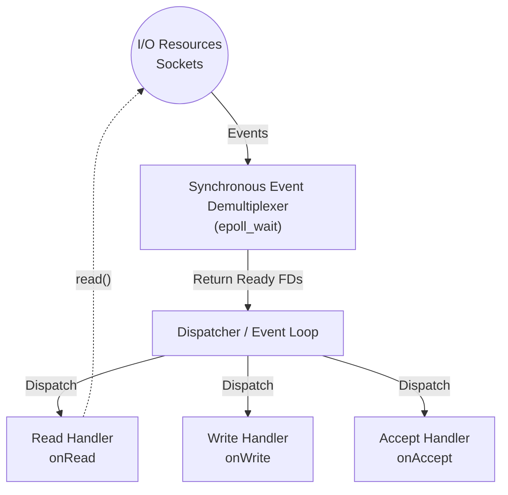
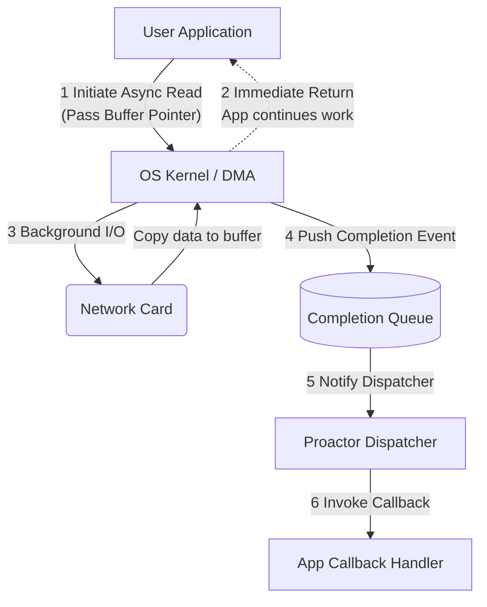

---
tags:
  - concurrency
  - event-loop
  - reactor
  - proactor
  - async-io
  - linux
aliases:
  - Event loop architectures
  - Async I/O models
---
# L1.CONC.03: Event loop, reactor-proactor, async IO

> [!abstract] О лекции
> *   **Event Loop** — это фундаментальный бесконечный цикл, который ждет событий от ОС и диспетчеризует их.
> *   **Reactor** (модели на базе Linux `epoll`, BSD `kqueue`) — модель **"Готовности" (Readiness)**. ОС сообщает: "В сокете есть данные, можешь читать". Вы сами делаете системный вызов `read()`.
> *   **Proactor** (Windows `IOCP`, Linux `io_uring`) — модель **"Завершения" (Completion)**. Вы говорите ОС: "Вот буфер, наполни его данными". ОС говорит: "Я наполнила, вот статус".
> *   На уровне **Expert / Staff Engineer** вы обязаны понимать стоимость системных вызовов (context switches), разницу между Edge-Triggered и Level-Triggered в `epoll`, и почему `io_uring` кардинально меняет правила игры, превращая Linux в полноценную Proactor-систему.

---
## 1. Физика I/O: Таксономия и Стоимость

В основе любой I/O операции (ввод-вывод) лежит взаимодействие между вашим кодом (пространством пользователя - User Space) и физическим оборудованием (Network Card / Disk) через привилегированного посредника — Ядро ОС (Kernel Space). Ключевые архитектурные различия моделей кроются в том, **кто именно ждет** поступления данных и **кто физически копирует** эти данные между буферами.

Согласно строгой классификации POSIX, модели I/O делятся по двум осям:
1.  **Synchronous vs Asynchronous (Синхронный / Асинхронный)**: Блокируется ли поток выполнения до момента фактического завершения *физического переноса данных* в память процесса?
2.  **Blocking vs Non-Blocking (Блокирующий / Неблокирующий)**: Возвращает ли системный вызов управление в код немедленно, если запрошенные данные еще не готовы на уровне аппаратуры?

### 1.1. Synchronous Blocking I/O (Синхронный Блокирующий)
Это самая старая и "наивная" модель. Вы вызываете `read()`, и ваш поток засыпает до победного конца.

*   **Механика (Под капотом):**
    1.  **Syscall:** Приложение делает вызов `read(fd, buf, len)`. Происходит дорогое переключение контекста (User -> Kernel).
    2.  **Wait:** Ядро ОС смотрит в сокет и видит, что буфер приема на сетевой карте пуст. Поток переводится в состояние `TASK_INTERRUPTIBLE` (Sleep) и безжалостно убирается из очереди планировщика CPU (`runqueue`).
    3.  **Hardware Interrupt:** Сетевая карта (NIC) получает пакет из кабеля и генерирует аппаратное прерывание. Драйвер копирует пакет в буфер ядра (Kernel Buffer).
    4.  **Wakeup:** Ядро будит уснувший поток.
    5.  **Copy:** Ядро копирует данные из Kernel Buffer в User Buffer (`buf`). **В этот момент CPU занят перекладыванием байтов.**
    6.  **Return:** Происходит возврат в User Space, код выполняется дальше.

*   **Стоимость для Архитектора (The Penalty):**
    *   **Context Switch Overhead:** Потеря $\sim 3–5 \mu s$ на каждое переключение (Ring 3 $\leftrightarrow$ Ring 0).
    *   **Memory Overhead:** Эта модель требует подхода `Thread-per-Connection`. Каждый поток требует свой стек (в Linux по умолчанию 1–8 МБ виртуальной памяти, $\sim 16–64$ КБ физической RSS минимум). На 10,000 соединений вы тратите гигабайты просто на стеки ожидания.
    *   **Cache Pollution (Скрытый убийца):** Самая разрушительная проблема блокирующей модели. Когда планировщик бешено переключается между 10,000 потоками, L1/L2 кэши процессора постоянно инвалидируются ("вымываются" чужими данными). Полезная математическая работа CPU падает драматически.

### 1.2. Synchronous Non-Blocking I/O (Синхронный Неблокирующий)
Сокет принудительно переводится в специальный режим `O_NONBLOCK` через системный вызов `fcntl`.

*   **Механика:**
    1.  **Syscall:** Приложение вызывает `read(fd, ...)`.
    2.  **Check:** Ядро проверяет свой внутренний буфер.
    3.  **Fast Return:**
        *   Если данные физически есть: Ядро копирует их (синхронно, тратя CPU!) и возвращает кол-во байт.
        *   Если данных нет: Ядро **немедленно** возвращает `-1` и устанавливает код ошибки `errno = EAGAIN` (или `EWOULDBLOCK`). Поток **не засыпает**, а продолжает работать.

*   **Паттерн "Busy Wait" (Активное ожидание - Антипаттерн):**
    ```c
    // УЖАСНЫЙ ПАТТЕРН, СЖИГАЮЩИЙ CPU
    while (true) {
        ssize_t n = read(fd, buf, len);
        if (n == -1 && errno == EAGAIN) {
            // Данных нет, попробуем снова... и снова...
            continue; 
        }
        process(buf);
    }
    ```
    Такой код сжигает 100% одного ядра CPU исключительно на постоянную *проверку пустоты*. В чистом виде в продакшене не используется, но является важнейшим строительным блоком для систем мультиплексирования.

### 1.3. I/O Multiplexing (Мультиплексирование ввода-вывода)
Это элегантное решение проблемы Busy Wait. Мы логически отделяем **ожидание готовности** (ждем толпой) от **выполнения работы** (читаем по одному). Обратите внимание: это тоже **Синхронная** модель (так как вызовы `select/poll/epoll` физически блокируют поток, пока событий нет).

*   **Механика (Основа Реактора):**
    1.  **Wait:** Мы говорим ядру: "Усыпи меня, пока на *любом* из этого списка в 1000 дескрипторов не появится событие READ/WRITE". (Вызов `select`, `poll`, `epoll_wait`).
    2.  **Wakeup:** Ядро будит нас, когда приходит хотя бы один пакет.
    3.  **Action:** Мы проходим по списку "готовых" дескрипторов и выполняем классический `read()` в неблокирующем режиме. Поскольку мы заранее *знаем*, что данные там есть, `read` не вернет `EAGAIN` и сразу скопирует данные.

*   **Эволюция системных вызовов (Важно для собеседований уровня Expert):**
    *   `select` (POSIX): Исторический легаси. Передает битовую маску абсолютно всех FD из User Space в Ядро при каждом вызове. Ядро делает $O(N)$ сканирование. Жесткий хард-лимит (обычно `FD_SETSIZE = 1024`). Абсолютно непригодно для Highload (C10K problem).
    *   `poll` (System V): Передает массив структур. Снимает хард-лимит в 1024, но это все еще $O(N)$ тупое сканирование всего массива внутри ядра при каждом пробуждении.
    *   `epoll` (Linux) / `kqueue` (BSD): Спасение индустрии. Вычислительная сложность $O(1)$ (или точнее $O(K)$, где K - число *активных* событий). Ядро хранит список интересов (state) внутри себя (в структуре Red-Black Tree). Когда драйвер получает пакет, он **мгновенно** через прерывание добавляет готовый FD в локальный "Ready List". `epoll_wait` больше ничего не сканирует, он просто забирает этот уже готовый список.

### 1.4. Asynchronous I/O (AIO / Истинная асинхронность)
Это модель паттерна **Proactor**. Ключевое, фундаментальное отличие: **Само приложение (User Space) вообще не занимается копированием байт.**

*   **Механика:**
    1.  **Initiate:** Приложение говорит ядру: "Пожалуйста, прочитай данные из сокета X в *вот этот* мой кусок памяти Y, и сообщи мне, когда полностью закончишь". (Вызовы `aio_read`, `io_uring_enter`).
    2.  **Return:** Системный вызов возвращается мгновенно.
    3.  **Background Work:** Ядро ОС (или вообще аппаратный контроллер DMA) ждет данные из сети и само аппаратно копирует их прямо в переданный буфер Y. Приложение в это время абсолютно свободно и занимается расчетами на CPU.
    4.  **Notification:** Ядро сообщает приложению (через системный сигнал, колбэк или, что современнее, очередь событий CQ): "Операция полностью завершена, твой буфер Y наполнен, можешь парсить".

*   **Главное архитектурное отличие:**
    *   В моделях Non-Blocking/Multiplexing (`epoll`) вы ждете, чтобы **только начать** читать. Само физическое чтение (перенос памяти из ядра в юзерспейс) все равно отнимает такты вашего потока.
    *   В истинном Async (`io_uring`, `IOCP`) вы ждете уведомления о том, что чтение **уже успешно закончено**. Ваш поток не тратит драгоценное время на `memcpy` данных из ядра. Это обеспечивает идеальный паттерн **Overlapping of Computation and I/O** (параллельное наложение математических вычислений на ввод-вывод).

---
### Сводная архитектурная таблица (Cheat Sheet)

| Модель | Системный вызов (пример) | Блокировка потока | Кто физически копирует данные? | Типичный Сценарий |
| :--- | :--- | :--- | :--- | :--- |
| **Blocking** | `read()` | Да, до конца всей операции | CPU потока приложения | Простые скрипты, CLI утилиты, легаси |
| **Non-Blocking** | `read(O_NONBLOCK)` | Нет (мгновенный возврат ошибки) | CPU потока приложения | Вспомогательная часть Event Loop |
| **Multiplexing** | `epoll_wait()` | Да, но только пока нет событий | CPU потока приложения | Nginx, Netty, Redis, Go Runtime |
| **Asynchronous** | `io_uring`, Windows IOCP | Нет | Ядро ОС / DMA контроллер | High-Performance БД, современные Web-серверы |

> [!danger] Инсайт эксперта (Разрушитель мифов)
> Подавляющее большинство "асинхронных" веб-фреймворков (Node.js, Python `asyncio`, Java NIO) под капотом используют **I/O Multiplexing (Synchronous Event Loop на базе epoll)**. Они лишь *симулируют* асинхронность для программиста на уровне синтаксиса (async/await), но физически поток всё равно занят синхронным копированием байт. Настоящая аппаратная асинхронность (AIO) стала мейнстримом в Linux только с недавним массовым внедрением `io_uring`.

---
## 2. Reactor Pattern (Реактор): Глубокий анализ

**Reactor** — это классический поведенческий паттерн проектирования (впервые системно описанный Дугласом Шмидтом в 90-х), предназначенный для высокопроизводительной обработки сервисных запросов, поступающих одновременно из огромного количества источников событий.

**Ключевая концепция:** Инверсия управления (Inversion of Control - IoC). Вместо того чтобы поток выполнения линейно и активно ждал ввода (как в `scanf` или блокирующем `read`), приложение делегирует ожидание специальному компоненту ядра ("Демультиплексору") и предоставляет кусок кода ("Хендлер"), который нужно вызвать (callback), когда событие физически произойдет.

**Модель I/O под капотом:** Синхронный Неблокирующий (Synchronous Non-Blocking).
*   **Синхронный:** Потому что само физическое чтение данных (`read`/`recv`) выполняет ваш собственный код, и поток приложения все равно блокируется на микросекунды на время копирования байт из памяти ядра в User Space.
*   **Неблокирующий:** Потому что вы вызываете `read` *исключительно* тогда, когда гарантированно знаете (благодаря `epoll`), что данные там точно есть.

### 2.1. Анатомия архитектуры Реактора

Для экспертного понимания выделим 4 базовых компонента:

1.  **Resources (Handles / File Descriptors):** Физические источники событий ОС (сетевые сокеты, таймеры `timerfd`, системные сигналы `signalfd`, каналы связи `eventfd`).
2.  **Synchronous Event Demultiplexer (Синхронный демультиплексор):** Системный вызов (`epoll`, `kqueue`, `select`), который умеет усыплять поток в ожидании событий на множестве ресурсов одновременно. Это "слух" реактора.
3.  **Dispatcher (Диспетчер / Event Loop):** Главный логический компонент приложения, который крутится в цикле `while(true)`, управляет регистрацией хендлеров и вызывает их при пробуждении Демультиплексора.
4.  **Request Handler (Обработчик):** Ваш прикладной callback-код (методы класса `onRead`, `onWrite`, `onAccept`).



---
### 2.2. Жизненный цикл и Механика (Under the Hood)

Рассмотрим, что физически происходит внутри, когда Nginx или Node.js обрабатывает 10,000 соединений.

1.  **Setup Phase (Регистрация интересов):**
    *   Приложение (через `accept`) создает сокет клиента, переводит его строго в **Non-Blocking Mode** (через флаг `O_NONBLOCK`). *Это критически важное требование.* Если вы забудете этот флаг, Реактор мгновенно развалится: первый же системный `read` на медленном сокете заморозит (заблокирует) весь Event Loop, и все остальные 9,999 клиентов отвалятся по таймауту.
    *   Приложение вызывает `epoll_ctl(EPOLL_CTL_ADD)`, связывая файловый дескриптор сокета с вашим объектом-хендлером (обычно передавая указатель через поле `epoll_data.ptr`).

2.  **Event Loop (Цикл событий):**
    *   Диспетчер вызывает `epoll_wait()`. В этот момент поток **добровольно засыпает** (переходит в состояние Interruptible Sleep). Утилизация CPU падает до 0%.
    *   Это единственная законная *блокирующая* точка во всей архитектуре Реактора.

3.  **Kernel Magic (Магия внутри Ядра):**
    *   Когда сетевая карта получает фрейм, происходит аппаратное прерывание (IRQ). Драйвер NIC (Network Interface Controller) копирует пакет в RX-буфер (ring buffer) сокета.
    *   Ядро ОС (сетевой стек TCP/IP) проверяет, есть ли процессы, ожидающие этот сокет в инстансе `epoll`. Если да — оно аппаратно добавляет событие (EPOLLIN) в **Ready List** (список готовых) и будит процесс.

4.  **Dispatch Phase (Реакция):**
    *   Функция `epoll_wait` просыпается, возвращает управление в User Space и отдает массив структур `epoll_event`.
    *   Диспетчер проходится циклом `for` по списку и для каждого события вызывает соответствующий метод Хендлера (например, `connection->handle_read()`).

5.  **Execution Phase (Действие):**
    *   Внутри функции `handle_read()` вы, наконец, вызываете системный `read(fd, buf, size)`.
    *   Так как мы гарантированно знаем, что данные в ядре есть (нам сказал `epoll`), вызов `read` не блокируется на ожидании сети. Он немедленно копирует данные из буфера ядра в оперативную память процесса и возвращает `N` прочитанных байт.

---
### 2.3. Внутренности Linux `epoll` (Expert Details)

Частый вопрос: Почему древний `select` умирает от перегрузки на 10k соединениях, а `epoll` легко переваривает миллионы?

*   **Select/Poll (Вычислительная сложность $O(N)$):** При каждом вызове (на каждой итерации Event Loop) вы передаете в ядро ОС *весь гигантский список* из 10,000 дескрипторов. Ядро должно: скопировать этот массив в свою память, пройти циклом по всему списку, проверить статус каждого сокета, подключиться к их локальным очередям ожидания (wait queues), а при возврате — отключиться и скопировать результат обратно. Это астрономическое бессмысленное копирование памяти и перебор.
*   **Epoll (Вычислительная сложность $O(1)$ или $O(K)$):**
    *   **Red-Black Tree (Красно-черное дерево):** В памяти ядра хранится persistent структура `eventpoll`. Все наблюдаемые сокеты хранятся в сбалансированном красно-черном дереве (вставка/удаление за $O(\log N)$). Это происходит *только один раз* при вызове `epoll_ctl` (регистрация).
    *   **Ready List (Двусвязный список готовых):** Когда случается физическое событие (пакет реально пришел), драйвер через callback (`ep_poll_callback`) мгновенно добавляет ссылку на этот сокет в отдельный список готовых дескрипторов (Ready List).
    *   **Epoll Wait (Сбор урожая):** Вызов `epoll_wait` больше ничего не сканирует. Он просто забирает элементы из `Ready List`. Если список пуст — поток спит. Если там 5 активных сокетов из миллиона зарегистрированных — он заберет только эти 5 и мгновенно вернется. Сложность зависит исключительно от числа *активных* событий, а не от общего числа подключенных idle-клиентов.

---
### 2.4. Режимы срабатывания: LT vs ET (Детализация для Staff Engineer)

Это самый сложный и важный вопрос на собеседованиях уровня Senior/Staff по системному программированию и архитектуре высоконагруженных систем.

#### Level-Triggered (LT) — "Поведение по Уровню" (Назойливое напоминание)
*Это безопасное поведение по умолчанию.*
*   **Логика ядра:** "Пока условие истинно (в буфере ОС есть хотя бы 1 байт не прочитанных данных), я буду настойчиво будить тебя и возвращать событие при каждом вызове `epoll_wait`".
*   **Сценарий:** Пришло 1000 байт по сети.
    1.  `epoll_wait` просыпается и вернул событие `EPOLLIN`.
    2.  Вы прочитали всего 100 байт в свой маленький буфер и вышли из хендлера (отдав процессор другим задачам).
    3.  Цикл провернулся, вы снова вызвали `epoll_wait`.
    4.  **Ядро мгновенно снова вернет событие**, так как в сокете осталось 900 байт. Оно не даст вам уснуть.
*   **Плюс:** Железобетонная надежность. Невозможно "потерять" данные по ошибке логики (забыл дочитать).
*   **Минус (Производительность):** Лишние вызовы `epoll_wait` (а значит, лишние дорогие Context Switches), если вы обрабатываете данные мелкими порциями.

#### Edge-Triggered (ET) — "Поведение по Фронту" (Однократное уведомление)
*Режим экстремальной максимальной производительности (используется в ядре Nginx и планировщике Go `netpoller`).*
*   **Логика ядра:** "Я разбужу тебя строго один раз — только тогда, когда состояние сокета **изменится** (перейдет из состояния "нет данных" в состояние "есть данные"). Дальше — это твои проблемы".
*   **Сценарий катастрофы (если не уметь готовить):** Пришло 1000 байт.
    1.  `epoll_wait` вернул событие.
    2.  Вы лениво прочитали 100 байт и вышли из хендлера.
    3.  Вызвали `epoll_wait`.
    4.  **Тишина.** Процесс засыпает навечно. Оставшиеся 900 байт гниют в буфере ядра, но `epoll` молчит, потому что *нового* поступления пакетов (перехода 0 -> 1) не было. Клиент висит, ждет ответа.
*   **Обязанность Архитектора:** При включении флага `EPOLLET` вы берете на себя клятву читать данные в цикле `while` до абсолютного упора (до ошибки `EAGAIN`):
    ```c
    bool done = false;
    while (!done) {
        ssize_t n = read(fd, buf, size);
        if (n == -1) {
            if (errno == EAGAIN || errno == EWOULDBLOCK) {
                // Только теперь мы уверены, что буфер ядра пуст!
                done = true; // Можно смело идти спать в epoll_wait
            } else {
                handle_socket_error();
            }
        } else if (n == 0) {
            close(fd); // Клиент закрыл соединение (EOF)
            done = true;
        } else {
            process_data(buf); // Обработка куска
        }
    }
    ```
*   **Плюс режима ET:** Радикально меньше системных вызовов (`epoll_wait` не дергается на каждый чих). Максимальная утилизация кэша CPU (вы вычерпываете весь сокет за один раз).

---
### 2.5. Концептуальный пример кода (C++ Event Loop)

Чтобы окончательно закрепить понимание механики, посмотрите на этот эталонный (упрощенный) каркас:

```cpp
// 1. Создание инстанса epoll (демультиплексора)
int epfd = epoll_create1(0);

// 2. Регистрация слушающего сокета сервера (ServerSocket)
struct epoll_event ev;
// Используем Edge-Triggered для скорости
ev.events = EPOLLIN | EPOLLET; 
ev.data.fd = listen_sock;
epoll_ctl(epfd, EPOLL_CTL_ADD, listen_sock, &ev);

// 3. Главный Event Loop
struct epoll_event events[MAX_EVENTS];
while (true) {
    // БЛОКИРУЕМСЯ здесь. Ждем событий ОС. CPU usage = 0%.
    int nfds = epoll_wait(epfd, events, MAX_EVENTS, -1);

    for (int i = 0; i < nfds; ++i) {
        if (events[i].data.fd == listen_sock) {
            // Событие на главном порту = Новое подключение клиента!
            // accept() должен быть в цикле (так как у нас ET режим)
            while (true) {
                int conn_sock = accept(listen_sock, ...);
                if (conn_sock == -1) break; // EAGAIN - забрали всех
                
                // ОБЯЗАТЕЛЬНО делаем сокет клиента неблокирующим
                fcntl(conn_sock, F_SETFL, O_NONBLOCK); 
                
                // Добавляем клиента в мониторинг
                ev.events = EPOLLIN | EPOLLET; 
                ev.data.fd = conn_sock;
                epoll_ctl(epfd, EPOLL_CTL_ADD, conn_sock, &ev);
            }
        } else {
            // Событие на сокете клиента = Пришли данные.
            // Вызываем Handler. Он обязан читать до EAGAIN!
            handle_client_data_in_loop(events[i].data.fd);
        }
    }
}
```

### 2.6. Архитектурная уязвимость: Starvation (Голодание)

Главный, смертельный враг паттерна Reactor — **блокирующий или тяжелый код в хендлере**.

Если в функции `handle_client_data_in_loop` вы по неопытности сделаете:
*   Вызов `sleep(1)`;
*   Тяжелый CPU-bound расчет (расчет крипто-хеша bcrypt или парсинг XML на 100МБ);
*   Синхронный блокирующий запрос к Базе Данных (на 50 мс);

...то **весь ваш Event Loop встанет намертво**. Процесс не вернется в `epoll_wait`. Никто больше не сможет принять новые соединения (клиенты отвалятся по таймауту `connect`), никто не ответит на пинги. Для 10,000 уже подключенных клиентов ваш сервер будет выглядеть глухо зависшим, хотя загрузка CPU будет всего 10%.

**Золотое Правило Staff Engineer (Для Node.js / Nginx / Asyncio):**
В главном потоке Event Loop выполняется *исключительно* управление I/O потоком и легкая логика (маршрутизация). Абсолютно всё, что тяжелее 1-2 миллисекунд (CPU bound) или может заблокироваться (Disk I/O, Database SQL), должно быть немедленно делегировано в отдельный **Worker Thread Pool** (пул рабочих потоков) или выполняться истинно асинхронно через современные драйверы (или `io_uring`).

---
## 3. Proactor Pattern (Проактор): True Async I/O

Если **Reactor** — это паттерн **"Готовности" (Readiness)** (уведомление о том, что можно действовать), то **Proactor** — это паттерн **"Завершения" (Completion)** (уведомление о том, что всё уже сделано за вас).

Различие кажется академическим и семантическим, но оно фундаментально меняет архитектуру управления памятью и потоками.
*   **Reactor (epoll/kqueue):** Вы говорите: «Ядро, скажи мне, когда **я сам смогу прочитать** данные, не заблокировавшись». (Код приложения *самостоятельно* выполняет копирование I/O).
*   **Proactor (Windows IOCP / Linux io_uring):** Вы говорите: «Ядро, вот тебе мой буфер в памяти. **Прочитай данные за меня**, сложи их туда, и скажи, когда закончишь». (Ядро ОС / Железо выполняет копирование I/O).

### 3.1. Детальная механика (Life Cycle of an Operation)

В модели Proactor само приложение инициирует асинхронную операцию, которая выполняется полностью "на фоне" (аппаратно через контроллеры DMA сетевой карты или фоновыми потоками ядра).



1.  **Initiation (Инициация):**
    *   Приложение создает объект **Asynchronous Operation Processor**.
    *   Приложение выделяет память под буфер в User Space.
    *   Приложение вызывает *асинхронный* системный вызов (например, `WSARecv` в Windows или кладет задачу в Submission Queue в `io_uring`), передавая ядру физический указатель на свой буфер и дескриптор сокета.
    *   **Важнейший нюанс [Expert]:** В ту же секунду приложение **теряет право** трогать этот буфер. Если буфер был аллоцирован на локальном стеке функции, выходить из этой функции (делать `return`) категорически нельзя (иначе ядро запишет данные в разрушенный стек, вызвав сбой памяти). Буфер должен быть "прибит" (pinned) в куче, чтобы ядро могло безопасно писать в него в любой момент.

2.  **Execution (Фоновое выполнение):**
    *   Асинхронный вызов возвращается немедленно (за наносекунды). Поток приложения абсолютно свободен.
    *   Ядро/Драйвер принимает задачу. Сетевая карта (NIC) через технологию DMA (Direct Memory Access) копирует входящий пакет **напрямую** в переданный буфер User Space (в идеальном Zero-Copy сценарии) или во внутренний буфер с последующим копированием ядром.
    *   *Ключевое отличие от Реактора:* Нет бессмысленного переключения контекста "туда-сюда" для проверки "Готов/Не готов".

3.  **Completion Notification (Уведомление о Завершении):**
    *   Когда операция физически завершена (буфер полон или соединение закрыто), ядро помещает событие (**Completion Event**) в очередь завершения (**Completion Queue**).
    *   Событие содержит статус (Success/Error) и *фактическое количество реально переданных байт*.

4.  **Completion Handler (Обработка):**
    *   **Completion Dispatcher** (часть Event Loop фреймворка) извлекает событие из очереди.
    *   Вызывается коллбэк приложения (`onReadComplete`).
    *   *Только теперь* приложение снова получает эксклюзивное право владеть и парсить буфер.

### 3.2. Архитектурный компромисс: Управление памятью (Memory Management)

На уровне Staff Engineer вы обязаны видеть главную проблему модели Proactor: **Buffer Management Strategy**.

*   **Сценарий Reactor (Подход Nginx):**
    *   У нас 100,000 TCP соединений (пользователи висят на WebSockets). Все они "idle" (молчат).
    *   Мы *вообще не выделяем* оперативную память под буферы чтения для них.
    *   Только когда `epoll` говорит "Эй, на сокете #5 пришли данные!", мы динамически берем из пула 4KB, вызываем `read()`, обрабатываем запрос, и тут же возвращаем 4KB в пул.
    *   **Memory usage:** Экстремально низкий и эффективный. Идеально для огромного числа спящих соединений (C10M).

*   **Сценарий Proactor (Наивный подход):**
    *   По определению протокола, чтобы получить данные, мы *обязаны* заранее отдать буфер ядру в момент инициации `AsyncRead`.
    *   100,000 соединений требуют 100,000 предварительно аллоцированных буферов (Pre-posted buffers).
    *   Если размер буфера 4KB, то $100k 	imes 4KB = \mathbf{400 	ext{ Мегабайт}}$ оперативной памяти будет "заморожено" впустую в ожидании данных, которых может никогда и не быть (клиент ушел в оффлайн).
    *   **Memory usage:** Аномально высокий.

*   **Решение Индустрии [Expert]:**
    *   В старом Windows IOCP: Использовать хак "Zero-byte reads" (инициируем чтение буфером 0 байт. Ядро сигнализирует завершение 0 байт, когда пакет пришел. Затем мы быстро делаем реальный синхронный Read нужного размера). Это фактически превращает Proactor обратно в Reactor, убивая саму идею производительности.
    *   В революционном **Linux io_uring**: Придуман механизм **Provided Buffers (Buffer Selection)**. Приложение регистрирует в ядре общий глобальный пул буферов (Buffer Ring). Мы не даем буфер конкретному сокету. Когда приходят данные на *любой* из сокетов, ядро ОС **само** берет первый свободный буфер из пула, пишет туда данные из сети и возвращает ID этого буфера в User Space вместе с событием завершения (`CQE`). Это элегантно решает проблему перерасхода памяти, сохраняя AIO.

### 3.3. Реализации: Битва идеологий ОС

#### Windows IOCP (I/O Completion Ports) — Исторический Золотой стандарт
Исторически архитектура ядра Windows (NT) с самого начала (90-е годы) была построена вокруг асинхронного Proactor паттерна.
*   **Глубокая Интеграция с планировщиком ОС (Scheduler Awareness):** Это киллер-фича IOCP.
*   Когда вы создаете порт завершения (Completion Port), вы указываете ядру `ConcurrencyValue` (обычно равно числу физических ядер CPU).
*   Ядро Windows следит за вашими потоками. Если поток просыпается для обработки события I/O, планировщик помечает ядро как "занятое". Если этот рабочий поток вдруг заблокируется (наткнется на ваш `Mutex`, или словит Page Fault от диска), планировщик Windows **мгновенно и автоматически** будит *другой* спящий поток из пула IOCP, чтобы не дать физическому ядру CPU простаивать! Это магия, недоступная в Linux.
*   **LIFO Wakeup (Стек пробуждений):** Чтобы минимизировать Context Switches и сохранить L1 кэш, IOCP старается всегда будить *тот же самый* поток, который только что работал и уснул (Hot Cache / LIFO), а не размазывать нагрузку равномерно по всем потокам по кругу (FIFO).

#### Linux `io_uring` — Новый абсолютный король производительности
До появления `io_uring` (2019 год, автор Jens Axboe) Linux был чисто "Reactor-only" страной (`select`/`poll`/`epoll`). Старый интерфейс `Linux AIO` был сломан архитектурно (он нормально поддерживал только `O_DIRECT` небуферизованный доступ для файлов баз данных, и вообще не работал с сокетами).

`io_uring` реализует мощный Proactor через два кольцевых буфера (Ring Buffers), которые лежат в **Shared Memory** (Разделяемой памяти, спроецированной через mmap между User Space и Kernel Space):
1.  **Submission Queue (SQ - Очередь задач):** Приложение (вы) кладете туда структуры операций (`SQE` - Submission Queue Entry): "Прочитай из файла FD 5 в буфер X". Вы просто пишете в память массива.
2.  **Completion Queue (CQ - Очередь результатов):** Ядро кладет туда готовые результаты (`CQE`): "Операция чтения из ячейки 3 завершена успешно, прочитано 1024 байта". Вы просто читаете из памяти массива.

**Почему это произвело революцию в мире High-Load:**
*   **Single System Call (Один сисколл для всего) или даже Zero Syscalls:** В `epoll` вы делаете 100 вызовов `read()`. В `io_uring` вы можете положить 100 операций в память SQ и сделать всего один системный вызов `io_uring_enter()`, чтобы ядро пошло работать.
*   **IOPOLL (Kernel Side Polling - Магия без сисколлов):** Вы можете настроить конфигурацию `io_uring` так, что ядро Linux выделит отдельный системный поток (Kernel Thread), который будет вечно крутиться в цикле и проверять память SQ на наличие новых задач. Вы просто кладете задачу в Shared Memory, а ядро ее подхватывает **вообще без единого системного вызова** (Context Switch = 0). Аппаратная латентность (latency) падает до наносекунд. Так сейчас пишутся новые драйверы баз данных и хранилищ.

### 3.4. Пример для наглядности (Mental Model для интервью)

Представьте, что вы (Ваше Приложение) хотите получить свежеиспеченную пиццу (Данные из сети).

*   **Blocking I/O:** Вы звоните в пиццерию, делаете заказ и *висите на трубке*, слушая музыку ожидания, пока пиццу не испекут. Вы не можете делать абсолютно ничего другого.
*   **Reactor (Non-blocking + epoll):** Вы делаете заказ. Вам дают беспроводной пейджер. Вы кладете трубку и работаете свои дела. Пейджер пищит: "Готово!". Но пиццы у вас нет. Вы обязаны встать, **сами** поехать в пиццерию, отстоять очередь на кассе, забрать коробку (копирование байтов) и привезти домой.
*   **Proactor (IOCP / io_uring):** Вы делаете заказ на доставку на дом. Вы даете курьеру (Ядру ОС) физический ключ от вашей двери (Буфер). Вы работаете свои дела. Курьер сам приезжает, сам открывает дверь, кладет коробку прямо на ваш стол. Ваш пейджер пищит: "Пицца УЖЕ на столе!". Вам не нужно никуда ехать. Вы просто берете кусок и едите.

### Заключение по разделу
Для **Expert** уровня: Proactor — намного более сложная модель программирования (она требует ручного управления временем жизни памяти буферов и сложного State Machine для коллбэков), но она потенциально в разы быстрее за счет радикального уменьшения числа переключений контекста и копирований (Zero-Copy I/O). Современный технологический тренд индустрии (Rust Tokio, Java Netty, Modern C++ ASIO) — это агрессивный переход на `io_uring` (Proactor паттерн) под Linux для достижения задержек микросекундного уровня.

---
## 4. Event Loop Architectures (Топологии масштабирования)

Выбор архитектуры Event Loop — это ответ на главный инженерный вопрос: **как математически эффективно с-маппировать $M$ тысяч сетевых соединений на ограниченные $N$ физических ядер CPU вашего сервера?**
Главные архитектурные враги на этом пути:
1.  **Context Switching:** Переключение регистров и сброс TLB стоит 1-5 мкс. Чем чаще — тем хуже.
2.  **Cache Thrashing:** Если данные одного клиентского соединения постоянно прыгают (мигрируют) между разными ядрами процессора, L1/L2 кэши становятся бесполезными (Cache Miss).
3.  **Synchronization Latency:** Использование любого глобального `mutex` или конкурентной `queue` (очереди) между потоками — это гарантированное бутылочное горлышко.

### 4.1. Single Threaded Event Loop (Модель Redis / Node.js)

Самая чистая, простая и жесткая модель. Весь мир — это строго один поток выполнения.

*   **Принцип:** Один процесс ОС, один системный поток, один инстанс демультиплексора `epoll`. Все поступающие события и коллбэки (хендлеры) выполняются строго последовательно один за другим (**Run-to-Completion**).
*   **Механика:**
    ```cpp
    while (true) {
        events = epoll_wait(epfd, ...); // Спим
        for (event in events) {
            process(event); // Выполняем логику БЕЗ переключений контекста
        }
    }
    ```
*   **Почему это невероятно быстро (На примере Redis):**
    *   **Zero Lock Contention (Никаких локов):** В коде нет ни одного мьютекса, нет атомиков. Код работает аппаратно быстрее на 20-30% просто за счет отсутствия барьеров памяти и тяжелых инструкций синхронизации.
    *   **Perfect Cache Locality (Идеальный кэш):** Структуры данных (например, огромный глобальный `dict` хэш-таблицы в Redis) всегда "горячие" и всегда лежат в L1/L2 кэше одного конкретного ядра CPU.
*   **Ахиллесова пята — Head-of-Line (HoL) Blocking (Блокировка очереди):**
    *   *Пример Катастрофы:* В ваш Node.js сервер приходит хитрый HTTP-запрос, требующий вычисления криптографического хеша `bcrypt` (занимает 100 миллисекунд чистого CPU времени).
    *   *Результат:* Весь единственный Event Loop встает колом на 100 мс. Следующие 10,000 простейших запросов (типа `GET /ping`), которые могли бы выполниться за 0.01 мс, ждут эти 100 мс в очереди. Показатель P99 Latency (хвосты) подскакивает до небес.
    *   *Решение Архитектора:* Offloading. Вы обязаны вручную выносить абсолютно все CPU-bound задачи в отдельный Thread Pool (например, `libuv worker pool` в Node.js) или в совершенно отдельный микросервис.

### 4.2. Thread-per-Core / Shared Nothing (Модель Nginx / Envoy Proxy / ScyllaDB)

Золотой индустриальный стандарт для **Data Plane** систем (прокси-серверы, In-Memory базы данных, Edge роутеры).

*   **Принцип:** При старте запускаем ровно $N$ процессов/потоков (где $N$ — число физических ядер). Каждый поток крутит свой собственный, **абсолютно независимый** Event Loop (экземпляр `epoll`).
*   **Connection Affinity (Жесткая привязка соединений):**
    *   Когда клиент делает `connect()`, он попадает на обработку к одному конкретному потоку (ядру).
    *   **Все** дальнейшие операции с этим клиентом (read, parse HTTP, process, write, close) на протяжении часов происходят **только и исключительно** в этом одном потоке.
    *   Память под объекты соединения выделяется из локального, неблокирующего аллокатора этого потока (Thread-Local Allocator, см. tcmalloc/jemalloc).
*   **Распределение входящих соединений (Магия `SO_REUSEPORT`):**
    *   Раньше (старые Nginx) был один общий слушающий сокет и процесс брал глобальный мьютекс (`accept_mutex`), чтобы принять клиента. Это вызывало проблему "Thundering Herd" (стадо бизонов: пришел 1 пакет, проснулись 64 ядра, 63 уснули обратно).
    *   Сейчас используется флаг сокета ядра Linux **`SO_REUSEPORT`**. Ядро ОС аппаратно создает $N$ независимых очередей приема сокетов. Входящий TCP SYN пакет математически хешируется (Tuple: src_ip, src_port, dst_ip, dst_port). Ядро Linux на уровне стека сразу кладет пакет в очередь конкретного ядра CPU. Никаких локов.
*   **Экспертный нюанс (Load Imbalance - Дисбаланс нагрузки):**
    *   *Архитектурная Проблема:* Проблема "Elephant Flows" (Толстые потоки). Представьте, что потоку #1 (Ядро 1) досталось одно соединение, перекачивающее 100 ГБ 4K-видео (Backup), а потоку #2 (Ядро 2) досталось 1000 мелких соединений `GET /status`.
    *   Ядро 1 загружено на 100% (троттлит сеть), Ядро 2 простаивает на 0%. Из-за строгой идеологии *Shared Nothing* Ядро 2 **физически не может** помочь первому, так как вся память соединения локальна для Ядра 1.
    *   *Решение:* Крайне сложное. Требует миграции FD (через Unix Domain Sockets) между потоками, что убивает кэш. Обычно эта проблема решается на уровне L4 балансировщика перед сервисом.

### 4.3. Boss-Worker / Handoff (Модель Java Netty / Memcached)

Попытка сбалансировать нагрузку ценой внесения накладных расходов на межпоточную синхронизацию.

*   **Boss Thread (Acceptor / Босс):** Один выделенный поток (или очень маленький пул) занимается только одним делом — крутит `epoll` для вызовов `accept()`. Его задача — как можно быстрее "снимать трубку", когда приходят новые клиенты.
*   **Handoff (Передача эстафеты):** Полученный новый файловый дескриптор клиента (FD) через thread-safe очередь передается в один из Worker Threads.
*   **Worker Threads (Reactors / Воркеры):** Большой пул потоков (равный числу ядер), каждый из которых крутит свой Event Loop (свой `epoll`).
*   **Алгоритм балансировки:** Boss-поток обычно использует Round-Robin или эвристику "Join the Shortest Queue" (выбор воркера с наименьшим количеством активных соединений).
*   **Цена архитектурного решения:**
    *   Передача FD требует синхронизации памяти (очередь с мьютексом / lock-free канал) между Boss и Worker.
    *   **Cache Miss:** Объект соединения создается в памяти на ядре Boss-а, а физически обрабатываться будет на ядре Worker-а. Данные нужно "болезненно перетащить" через общую медленную шину L3 кэша.
*   **Применение:** Фреймворк Java Netty использует именно этот гибрид: пул Boss-потоков (обычно 1) и пул Worker-потоков. Это гибче, чем Shared Nothing (решает проблему дисбаланса коннектов), но математически медленнее на экстремальных, пиковых нагрузках из-за оверхеда передачи.

### 4.4. Work-Stealing Runtime (Модель Go / Rust Tokio / Erlang)

Абсолютная вершина эволюции планировщиков. Это концепция **M:N Scheduling** (M "зеленых" легковесных потоков мультиплексируются на N аппаратных потоков ОС).

*   **Принцип:** У нас запущено $N$ системных потоков (Processors, P). У каждого потока в памяти есть своя **локальная очередь** (Local Run Queue) микро-задач (Goroutines в Go / Tasks в Tokio).
*   **Встроенный Event Loop:**
    *   Каждый физический поток P крутит свой невидимый системный `epoll` / `io_uring` (Netpoller).
    *   Когда I/O готово (сеть прислала пакет), задача (Task) размораживается, становится Runnable и падает обратно в *локальную* очередь этого же потока.
*   **Work Stealing (Кража работы):**
    *   Если поток P1 очень быстро разгреб свою локальную очередь и она стала пуста, он не идет спать в ОС (чтобы не терять время на пробуждение).
    *   Он идет к соседнему потоку P2, берет спин-лок, и **атомарно крадет ровно половину** его задач из хвоста очереди.
*   **Почему это гениально:**
    1.  Элегантно решает проблему дисбаланса нагрузки "Elephant flows" (в отличие от Nginx), так как простаивающие ядра забирают работу.
    2.  Сохраняет локальность данных (Data Locality). В 90% случаев задача обрабатывается в том же потоке, где и была создана (L1 кэш горячий), кража — это относительно редкое событие.
    3.  Автоматически утилизирует все доступные ядра процессора без ручного тюнинга программистом.
*   **Сложность:** Физически реализовать такой планировщик без багов — задача уровня Principal Engineer в команде платформы (Go Runtime team). Обычные продуктовые приложения просто импортируют библиотеку и бесплатно используют плоды этой гениальной архитектуры.

### 4.5. Half-Sync / Half-Async (Классический Thread Pool Pattern)

Для контраста — классическая, старая схема работы энтерпрайза (Apache Worker MPM, Tomcat до перехода на NIO).

*   **Async Layer:** Один быстрый поток Event Loop слушает сеть (`epoll`), принимает соединения, вычитывает байты HTTP-запроса и формирует объекты Request.
*   **Queue (Очередь):** Готовые запросы кладутся в гигантскую глобальную блокирующую очередь (BlockingQueue).
*   **Sync Layer:** Пул тяжелых ОС-потоков (обычно 200-1000 штук) разбирает эту очередь. Каждый поток вытаскивает Request и выполняет традиционный, **блокирующий** код (Сложная Business Logic + долгие синхронные вызовы к БД по JDBC).
*   **Проблема масштабирования:**
    *   Очень высокое и дорогое переключение контекста ОС (потоки засыпают на JDBC ответах).
    *   Огромное потребление оперативной памяти (1000 потоков = 1 ГБ RAM только на стеки).
    *   Глобальная очередь становится жесткой точкой конкуренции (Global Lock Contention), об которую бьются все потоки.
*   **Статус:** Устарело для High-Load сервисов (10k+ RPS), но абсолютно приемлемо и стабильно для простых CRUD приложений внутреннего Enterprise-уровня.

---

### Сводная таблица для принятия решений (Expert Cheat Sheet)

| Архитектура | Latency (Задержка) | Throughput (Пропускная способность) | Сложность реализации | Пример использования в индустрии |
| :--- | :--- | :--- | :--- | :--- |
| **Single Threaded** | Low (если нет CPU-bound задач) | Medium | Очень Низкая | Redis, Node.js (микросервисы) |
| **Shared Nothing (Per-Core)** | **Ultra Low (Минимум)** | **Max (Предел железа)** | Экстремально Высокая (никаких lock-ов, ручной тюнинг) | Nginx, ScyllaDB, Envoy, HFT |
| **Boss-Worker** | Medium | High | Средняя | Java Netty, Memcached |
| **Work-Stealing** | Low | Very High | Скрыта внутри рантайма языка | Go, Rust (Tokio), Erlang (BEAM) |
| **Half-Sync/Async** | High | Low/Medium | Низкая (линейный блокирующий код) | Apache, Tomcat (Legacy) |

**Совет Архитектора:** Начиная новый проект на **Rust/Go**, вы получаете мощный *Work-Stealing* "из коробки" бесплатно. При развертывании и тюнинге прокси **Nginx/Envoy**, вы работаете с парадигмой *Shared Nothing* — поэтому вы обязаны на уровне Linux следить за правильным распределением аппаратных прерываний сетевой карты по ядрам процессора (настройка RSS - Receive Side Scaling / irqbalance), иначе вся эта сложная архитектура не сработает и упрется в одно ядро.

---
## 5. Практические нюансы: Битва за наносекунды (High Frequency)

Когда количество одновременных активных соединений переваливает за 1 миллион (Сценарий C1M) или поток пакетов (PPS - Packets Per Second) превышает 1-2 миллиона, любой стандартный Event Loop (даже самый лучший `epoll` в C++) начинает захлебываться. Упирается он не в ваш красивый код, а в фундаментальную архитектуру самой ОС Linux.

### 5.1. Барьер C10M и Kernel Bypass (Обход ядра Linux)

Математика безжалостна: Для обработки 10 миллионов пакетов в секунду на одно ядро у вас есть всего **100 наносекунд** (наносекунд!) на полную обработку одного пакета.
Стандартный тяжелый путь пакета в Linux (Hardware Interrupt -> NIC Driver -> Kernel Network Stack IP/TCP -> Аллокация `sk_buff` -> Context Switch -> Copy to User Space) физически занимает гораздо больше времени.

*   **Проблема 1: Interrupt Storm (Шторм аппаратных прерываний).**
    Сетевая карта генерирует аппаратное прерывание (IRQ) на каждый пришедший пакет. Процессор вынужден останавливать текущую работу, сохранять контекст, прыгать в обработчик прерывания (Ring 0) и обратно. При 1 млн PPS процессор просто зависнет на обработке прерываний (Livelock).
    *   *Аппаратное Решение:* **NAPI (New API) / Interrupt Coalescing**. Современный драйвер сетевой карты при высокой нагрузке отключает прерывания и переключается в режим "Polling" (Опрос), забирая пакеты огромными пачками (батчами), а не по одному.
*   **Проблема 2: Context Switches & Cache Pollution.**
    Даже с быстрым `epoll`, постоянное переключение между Kernel Mode (Ring 0) и User Mode (Ring 3) "грязнит" кэш инструкций (L1i) и данных (L1d). Сброс TLB (Translation Lookaside Buffer) при переключении делает доступ к памяти медленным.
*   **Радикальные Решения Архитектора (Kernel Bypass):**
    *   **XDP (eXpress Data Path) / eBPF:** Позволяет безопасно загрузить и запускать ваш кастомный C-код (в JIT-песочнице eBPF) прямо внутри самого низкого уровня драйвера сетевой карты *до* того, как пакет вообще попадет в тяжелый сетевой стек Linux (до аллокации структуры `sk_buff`). Идеально для написания молниеносных DDoS-фильтров (Drop) и L4 балансировщиков.
    *   **DPDK (Data Plane Development Kit от Intel):** Максимально радикальный подход. Ваше User-Space приложение физически "отбирает" сетевую карту у ядра Linux под свой полный монопольный контроль (User Space Driver). Ядро больше не видит сетевую карту.
        *   *Цена (Боль):* Вы теряете весь стандартный TCP/IP стек Linux, iptables и утилиты. Вам придется реализовывать протоколы ARP, IP, TCP, логику Congestion Control и Retransmission полностью вручную или брать тяжелые User-space библиотеки (Seastar, F-Stack). Это путь создания кастомных СУБД или роутеров.
    *   **io_uring (Submission Queue Polling - SQPOLL):** Элегантный компромисс. Можно запустить инстанс `io_uring` со специальным флагом. Ядро Linux выделит выделенный поток ядра (Kernel Thread), который будет в бесконечном цикле опрашивать (Polling) кольцевой буфер задач в RAM. **Системные вызовы исчезают как класс** — ваше приложение просто пишет структуру задачи в общую память и читает результат. Ноль переключений контекста.

### 5.2. Backpressure (Обратное давление) и TCP Zero Window

Это критически важная концепция архитектуры устойчивых систем, которую регулярно проваливают на системных собеседованиях и в реальном продакшене.
**Аварийная Ситуация:** Ваш сверхбыстрый сервер читает данные из TCP-сокета гораздо быстрее, чем ваши воркеры могут их физически обработать (например, быстрый парсинг потокового JSON, но очень медленная запись результатов в перегруженную БД PostgreSQL).

*   **Наивная реализация (OOM Risk - Гарантированный краш):**
    ```python
    # Псевдокод глупого Event Loop
    def on_read_ready(socket):
        data = socket.read() # Жадность: Читаем всё, что сеть дала
        global_queue.push(data) # Кладем в память (очередь) на процессинг БД
        # Если воркеры БД медленные, queue растет бесконечно 
        # Память сервера кончается -> OOM Killer убивает процесс!
    ```
*   **Правильная реализация (Watermarks / Шлюзы):**
    В профессиональных фреймворках (Netty, Envoy, Go channels) встроены концепции **High Watermark** (Верхний порог) и **Low Watermark** (Нижний порог).
    1.  Когда размер внутренней очереди задач приложения превышает High Watermark (например, накопилось 64 КБ необработанных данных), мы **осознанно отписываемся от чтения**: вызываем `socket.setAutoRead(false)` (физически удаляем интерес `EPOLLIN` из конфигурации `epoll`).
    2.  **Аппаратная цепная реакция:**
        *   Event Loop перестает вызывать `read()`.
        *   Аппаратный буфер приема ядра Linux (Kernel TCP Recv Buffer) стремительно заполняется входящими пакетами.
        *   Ядро Linux видит, что буфер полон, и автоматически отправляет клиенту-отправителю специальный TCP-пакет с флагом **Window Size = 0** (Zero Window Advertisement).
        *   Сетевой стек клиента (отправителя), получив Zero Window, аппаратно **блокирует** системный вызов `write()` на своей стороне или буферизует данные у себя в RAM, пока не получит разрешающий пакет Window Update.
    3.  Когда наша БД разгребла очередь и размер очереди приложения упал до Low Watermark, мы снова возвращаем подписку `EPOLLIN`. Ядро читает данные, освобождает буфер и шлет клиенту TCP Window Update. Трафик возобновляется.
    *   *Итог Архитектора:* Мы элегантно переложили проблему нехватки памяти (буферизации избыточных данных) обратно на оперативную память самого клиента (отправителя), железобетонно защитив свой сервер от OOM.

### 5.3. NUMA Awareness и CPU Affinity (Привязка к железу)

На мощных серверах с двумя или четырьмя процессорами (Dual Socket CPU, например AMD EPYC) оперативная память физически неоднородна.
*   **Концепция NUMA (Non-Uniform Memory Access):** Плашки RAM физически подключены к контроллерам памяти конкретных процессоров. Доступ процессора 0 к "своей" локальной RAM быстрый. Доступ процессора 0 к "чужой" RAM (подключенной к Процессору 1) идет через узкую материнскую межпроцессорную шину (QPI/UPI/Infinity Fabric) и стоит в 1.5-2 раза дороже по задержкам.
*   **PCIe Locality:** Точно так же, сетевая карта (NIC 100G) физически воткнута в слот PCIe, который обслуживается только *одним* из двух процессоров.

**Архитектура идеального, сверхбыстрого Event Loop (HFT Level):**
1.  **Pinning (Жесткая Привязка):** Каждый Worker-поток вашего Event Loop жестко привязан (syscall `pthread_setaffinity_np`) к конкретному логическому ядру процессора. Это полностью предотвращает случайную миграцию потока планировщиком ОС и сохраняет L1/L2 кэш горячим.
2.  **IRQ Affinity (Привязка прерываний сети):** Аппаратные прерывания от очередей сетевой карты (NIC RX Queues) должны быть жестко направлены (настроены через `smp_affinity`) исключительно на те же самые физические ядра, где прямо сейчас работают ваши Worker-потоки.
    *   *Идеальный Результат:* Пакет приходит в NIC -> прерывание летит на Core 0-> обработчик SoftIRQ работает на Core 0 -> Ваш Event Loop просыпается на Core 0 и читает данные.
    *   Это создает идеальный "вертикальный колодец" локальной обработки, полностью исключая дорогие межъядерные блокировки и пересылки данных по шине (Inter-Processor Interrupts).
3.  **Memory Allocation:** Вся память под буферы чтения должна выделяться строго из локальной NUMA-ноды этого процессора (утилита `numactl --membind` или API `numa_alloc_onnode`).

### 5.4. False Sharing (Ложное разделение кэша)

Крайне неочевидная, но фатальная проблема производительности многопоточных архитектур (когда Event Loops всё же шарят какую-то статистику).

*   **Сценарий:** У вас есть глобальный массив счетчиков производительности `long counters[]`, где элемент `counters[0]` постоянно обновляет (инкрементирует) Поток 1 (Ядро 1), а `counters[1]` постоянно обновляет Поток 2 (Ядро 2). Никаких мьютексов нет. Кажется, всё должно быть быстро?
*   **Аппаратная Физика:** L1/L2 Кэш современного процессора физически работает линиями (Cache Lines) размером строго по 64 байта (а не по байтам). Переменные `counters[0]` (8 байт) и `counters[1]` (8 байт) лежат в памяти вплотную друг к другу и 100% попадают в **одну и ту же** 64-байтную кэш-линию.
*   **Аппаратный Конфликт (MESI):** Когда Поток 1 пишет в свой `counters[0]`, ядро аппаратно помечает *всю 64-байтную линию целиком* как "Modified" и эксклюзивно захватывает её. Когда Поток 2, работающий на другом кристалле, пытается в этот же момент записать в свой (соседний) `counters[1]`, протокол когерентности вынуждает Ядро 2 инвалидировать свой кэш и физически перечитывать всю линию из медленного L3 кэша или RAM Ядра 1.
*   **Итог:** Это называется **Cache Line Ping-Pong**. Вы получаете скорость работы, как будто там стоит жесткий Mutex, хотя его в коде нет.
*   **Решение Инженера (Padding):** Padding (Заполнители). Структуры данных должны быть выровнены (aligned) в памяти так, чтобы горячие атомарные данные разных потоков *никогда* физически не делили одну кэш-линию.
    ```c
    // Решение на C/C++
    struct WorkerStats {
        long requests_processed; // Полезные 8 байт
        char padding[56]; // Искусственно добиваем структуру мусором до 64 байт 
    } __attribute__((aligned(64))); // Говорим компилятору выровнять адреса
    ```

### 5.5. Защита от DDoS "Slow Loris" и архитектура тайм-аутов

В старой синхронной модели (Thread-per-connection) тайм-аут на долгое чтение ставится элементарно через опцию сокета `setsockopt(SO_RCVTIMEO)`. В асинхронной (Reactor) модели этот вызов абсолютно бесполезен, так как сам системный вызов `read` мгновенный (Non-blocking).

**Архитектурная Реализация миллионов тайм-аутов:**
Мы физически не можем позволить себе просить ядро ОС создавать системный таймер (`timer_create`) на каждое из 1,000,000 соединений (это убьет ОС). В Event Loop используется сверхэффективный паттерн **Hashed Timing Wheel** (Колесо Таймеров, о котором мы подробно говорили в L1.CS.06).
*   При `accept()` новое соединение добавляется как элемент в соответствующий слот кольцевого буфера (колеса таймеров).
*   При любой успешной активности клиента (прочитан кусок данных / записан кусок) таймер сокета "перевзводится" (элемент удаляется за $O(1)$ и добавляется заново в конец колеса $O(1)$).
*   *Защита от хакеров:* Атаки типа Slow Loris (когда хакер медленно шлет по 1 байту в 10 секунд, чтобы исчерпать лимит соединений, формально обходя простые таймауты) детектируются архитектурно не по факту полного отсутствия активности, а по **минимальной скорости передачи данных** (throughput check). Event Loop проверяет: если клиент за минуту прислал меньше 10 КБ полезных заголовков — безжалостно рубим TCP соединение пакетом RST, даже если формально байты всё еще капают.

---
## 6. Чек-лист для самопроверки (Интервью Senior/Staff уровня)

1.  **Reactor vs Proactor (Суть):** В чем концептуальная разница для прикладного разработчика?
    *   *Ответ:* В Reactor паттерне я жду уведомления от ОС, чтобы получить право *самому начать* выкачивать данные из ядра. В Proactor паттерне я жду уведомления о том, что ОС уже *завершила* выкачивание и положила готовые данные прямо в мой буфер памяти.
2.  **Epoll Thundering Herd (Стадо бизонов):** Что физически произойдет, если 40 процессов-воркеров Nginx одновременно ждут на `epoll_wait` входящего соединения на одном и том же порту `80`?
    *   *Ответ:* В старых ядрах Linux при входящем TCP SYN проснутся сразу все 40 процессов (Context Switch шторм). Один вызовет `accept` успешно, остальные 39 получат `EAGAIN` и уснут обратно (потратив CPU впустую). В современных ядрах эта проблема решена флагом `EPOLLEXCLUSIVE` в epoll, или (что лучше архитектурно) использованием флага `SO_REUSEPORT`, который позволяет ядру балансировать пакеты по воркерам еще до их пробуждения.
3.  **CPU Starvation (Зависание):** Как на проде мониторить "здоровье" вашего Event Loop в Node.js / Python?
    *   *Ответ:* Необходимо измерять метрику **Event Loop Lag** (Задержка цикла). Нужно в начале каждой итерации цикла (с помощью `setTimeout(0)`) считывать системный timestamp и смотреть дельту с ожидаемым временем. Если фактический лаг начинает расти (> 10-50ms), значит, кто-то из программистов засунул в Event Loop тяжелую блокирующую или CPU-bound операцию (например, регулярное выражение с катастрофическим откатом / ReDoS).
4.  **IO_URING Революция:** Почему он математически быстрее самого оптимизированного `epoll`?
    *   *Ответ:* Во-первых, он предоставляет единый унифицированный интерфейс кольцевого буфера в общей (mmap) памяти для любых операций (диск, сеть, таймеры). Во-вторых, он позволяет достигнуть полного отсутствия переключений контекста (Zero Syscalls) при использовании режима `submission queue polling` (SQPOLL). В-третьих, он позволяет батчинг (Batching) — отправку 100 запросов на I/O за один такт взаимодействия с ядром.

### Архитектурное Заключение
Глубокое понимание механики Event Loop и сетевого стека ОС — это именно та граница, которая отличает "пользователя модного фреймворка" от истинного Архитектора систем.
*   Если ваша текущая система уперлась в потолок по CPU именно на сетевом слое (огромный `%sys` в htop) — пора переходить с классической модели Reactor (`epoll`) на современные реализации Proactor (`io_uring`).
*   Если ваша система страдает от необъяснимых Latency Spikes (всплесков задержек P99) — перестаньте тюнить сеть. Ищите блокирующие (Synchronous) операции или тяжелые вычисления внутри вашего Event Loop и безжалостно вырезайте их, делегируя в отдельный Thread Pool (Sidecar pattern для вычислений).