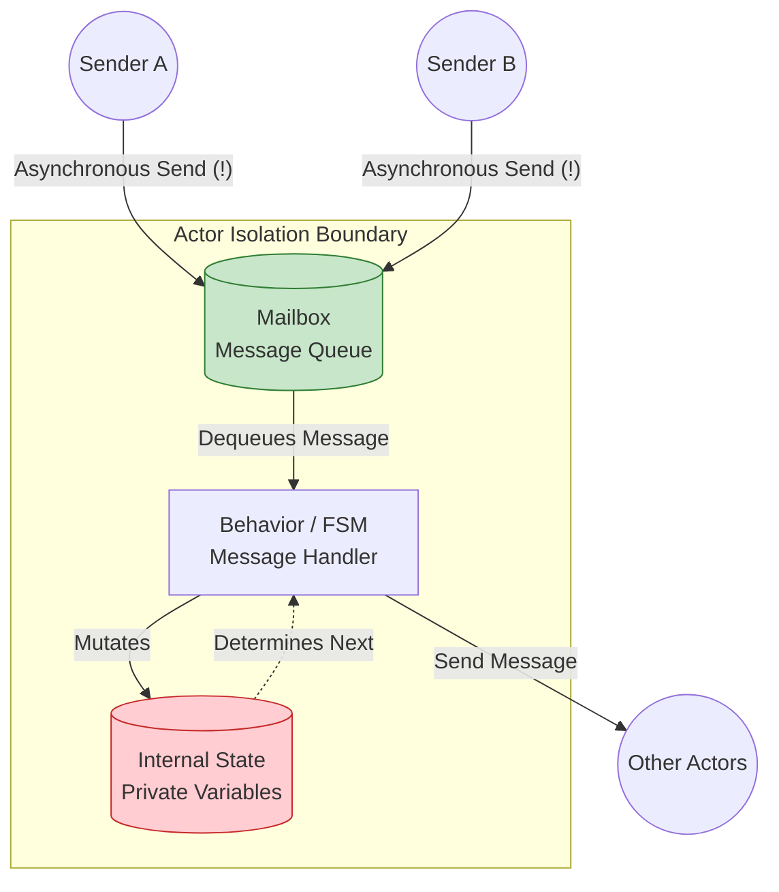
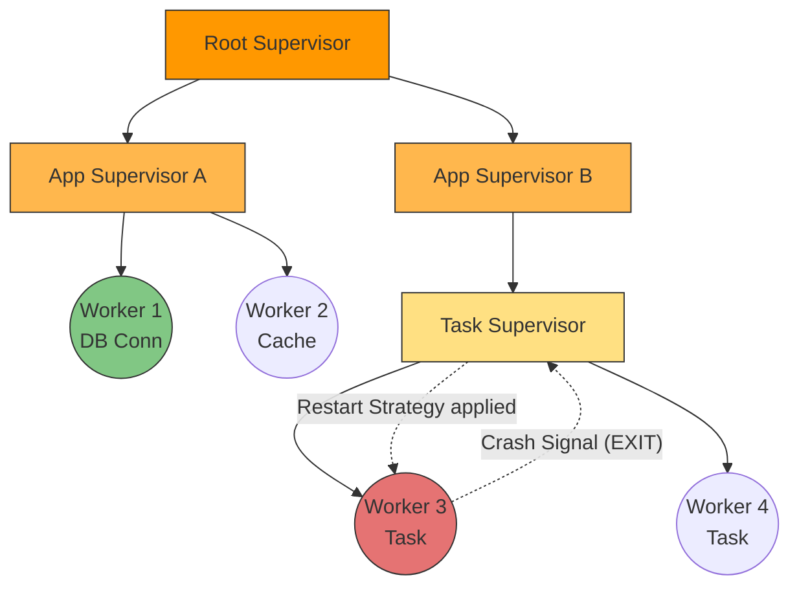

---
tags:
  - concurrency
  - actor-model
  - erlang
  - akka
  - orleans
  - architecture
aliases:
  - Actor Model
  - Erlang OTP
  - Akka and Orleans
---
# L1.CONC.05: Actor model (Akka, Erlang, Orleans) 

> [!abstract] О лекции
> **Модель Акторов** — это мощный архитектурный паттерн, который концептуально решает проблему конкурентности (Concurrency) путем абсолютного отказа от **разделяемой памяти (Shared State)** и тяжелых системных блокировок (Locks/Mutex).
> *   **Erlang** — это родоначальник модели. Он исповедует философию "Let It Crash" и идеален для создания систем с фантастическим аптаймом 99.9999999% (Telecom/Messaging).
> *   **Akka** — это мощь и производительность экосистемы JVM, привнесение строгой типизации (Akka Typed) и явного, гранулярного управления жизненным циклом и кластеризацией.
> *   **Microsoft Orleans** — это революционная абстракция **Virtual Actors (Виртуальные акторы)**. Вы физически не "создаете" акторы, вы просто обращаетесь к ним по ID, а умный рантайм сам решает, где, когда и на каком сервере их оживить или выгрузить в базу. Это концепция "Serverless state" до того, как Serverless стало мейнстримом.
> 
> **Главное железобетонное правило практика:** Внутри одного актора физически **нет многопоточности**. Актор — это безопасный, гарантированно однопоточный островок целостного состояния в бушующем океане асинхронного хаоса.

---
## 1. Фундаментальная концепция: Физика мира Акторов

Для системного архитектора или Senior инженера модель Акторов — это не просто абстрактные "объекты, которые прикольно общаются асинхронными сообщениями". Это фундаментальная **инверсия управления потоками (Thread Management Inversion)**. Мы осознанно и полностью отказываемся от классической модели *Shared Memory Concurrency* (где потоки агрессивно конкурируют за доступ к общим данным через локи, сжигая CPU на `Context Switches`), в пользу модели *Message Passing Concurrency* (где память строго изолирована, а коммуникация происходит через очереди сообщений).

### 1.1. Актор как "Вычислительный Нано-сервис"
Представьте актор не как классический экземпляр объекта (instance of class), а как микроскопический, полностью изолированный микросервис (или даже отдельный сервер), живущий прямо в оперативной памяти вашего процесса. У него нет публичных методов. У него нет геттеров или сеттеров. Вы физически не можете "заглянуть" в его память извне или дернуть его метод напрямую.

Анатомия любого актора строго определена тремя нерушимыми инвариантами:



1.  **State (Строго Изолированное Состояние):**
    *   В отличие от ООП, где приватность защищена лишь синтаксическим модификатором доступа (`private`), который легко обходится рефлексией, в модели акторов состояние защищено **физически** (в Erlang — аппаратным копированием памяти между процессами, в Akka — жестким барьером видимости потоков).
    *   **Золотое правило архитектора:** Ссылка на внутреннее мутабельное состояние (например, `this.userList`) никогда, ни при каких обстоятельствах не должна покинуть пределы актора. Если вы по неопытности вернули `return this.userList` в сообщении-ответе другому актору — вы разрушили всю модель акторов и своими руками создали фатальную гонку данных (Data Race).
2.  **Mailbox (Очередь входящих сообщений):**
    *   Это локальный буфер (почтовый ящик), обычно реализованный как lock-free структура типа MPSC (Multiple Producers, Single Consumer). Много внешних потоков могут писать туда сообщения одновременно, но читает из него строго только сам актор.
    *   Сообщения гарантированно извлекаются и обрабатываются **строго последовательно, одно за другим** (Serializability). Эффект обработки сообщения $M_1$ полностью и атомарно виден перед началом обработки сообщения $M_2$. Это математически дает нам гарантию **Happens-Before** без необходимости использовать тяжелые барьеры памяти или ключевое слово `volatile`.
3.  **Behavior (Поведение / FSM - Конечный автомат):**
    *   Актор содержит логику: как именно обработать *следующее* сообщение на основе текущего внутреннего состояния.
    *   Модель позволяет элегантно менять логику поведения прямо на лету. 
    *   *Пример (FSM):* Актор "Сессия Авторизации" при старте находится в состоянии `Unauthenticated` и игнорирует все команды, реагируя только на сообщение `Login`. После проверки базы данных и успеха, он переключает свое внутреннее поведение (в Akka это делается вызовом `context.become(Authenticated)`) и с этого момента начинает принимать и обрабатывать команды `GetData`, игнорируя повторные попытки `Login`.

### 1.2. Механика исполнения под капотом: The Scheduling Quantum
Это самый важный системный аспект для тюнинга перформанса. Как запустить 1 миллион независимых акторов на сервере, где всего 16 физических ядер CPU?

Это реализуется через парадигму **M:N Scheduling** (M миллионов акторов мультиплексируются на N аппаратных потоков ОС) в пространстве пользователя (User-space scheduling). Актор не привязан к потоку навечно.

1.  **Спящий режим (Idle):** Когда Mailbox актора пуст, актор физически не привязан ни к какому системному потоку. Он — просто "холодный" кусок данных (структура) в куче (Heap). В таком состоянии он потребляет $\sim 300-500$ байт оперативной памяти и ровно **0% CPU**.
2.  **Пробуждение (Wake-up):** В Mailbox приходит новое сообщение. Если актор до этого "спал", рантайм помечает его как `Runnable` (готов к работе) и ставит ссылку на него в общую или локальную очередь к **Диспетчеру** (Dispatcher — обычно это `ExecutorService` / `ForkJoinPool` в JVM).
3.  **Захват потока (Mounting):** Диспетчер находит свободный рабочий тред ОС. Этот тред "заходит" внутрь актора (монтируется к нему).
4.  **Throughput (Квант времени / Пакетная обработка):**
    *   Чтобы не прыгать между акторами на каждое сообщение (что вызовет шторм Context Switches), тред обрабатывает из Mailbox не одно сообщение, а сразу пачку (batch), например, 10, 50 или 100 сообщений подряд (этот критичный параметр конфигурации называется `throughput` в Akka).
    *   *Зачем это Архитектору:* Это колоссально амортизирует стоимость переключения контекста и феноменально прогревает L1/L2 кэш процессора данными именно этого актора. CPU работает на максимальной эффективности.
5.  **Вытеснение (Unmounting / Отсоединение):**
    *   Если сообщения в Mailbox кончились ИЛИ лимит `throughput` (например, 50 сообщений) исчерпан, тред принудительно "выходит" из актора, оставляя его ждать следующего кванта.
    *   Диспетчер берет этот освободившийся тред и переназначает его другому голодающему актору в системе.

> [!danger] Инсайт для эксперта (Причина падений Akka)
> Именно из-за этой M:N механики **любой синхронный блокирующий код внутри актора мгновенно убивает систему**. Если тред ОС "зашел" в ваш актор и вы там сделали `JDBC.execute()` (обращение к БД на 50мс) или, не дай бог, `Thread.sleep()`, этот тред *не вернулся* в общий пул Диспетчера. Диспетчер думает, что тред занят полезной математикой. Если все N тредов пула (например, 16 штук) зайдут в такие кривые акторы и встанут на блокировках к БД, миллионы остальных акторов вашей системы останутся вообще без процессорного времени (Thread Starvation), даже если их почтовые ящики переполнены входящими запросами. Сервер "зависнет" при 0% загрузки CPU.

### 1.3. Иллюзия однопоточности (Single Thread Illusion)
Главное преимущество для разработчика бизнес-логики: в любой конкретный наносекундный момент времени внутри физической памяти актора находится **строго максимум один** исполняющий тред.

*   Вам больше никогда не нужны блоки `synchronized`.
*   Вам больше не нужны тормозящие `AtomicInteger`.
*   Примитивный инкремент `this.counter++` или добавление в обычный `ArrayList` абсолютно безопасны.

Это радикально устраняет целый класс жесточайших архитектурных ошибок (Deadlocks и Race Conditions) внутри самой бизнес-логики, но (по закону сохранения сложности) переносит эту сложность на более высокий уровень — на уровень оркестрации взаимодействия между акторами (разработка протоколов общения, обработка распределенных таймаутов, реакция на потерю сообщений в сети).

### 1.4. Пример: Банковский перевод (Сравнение парадигм)

**Классический подход (Shared Memory & Locks):**
```java
void transfer(Account from, Account to, BigDecimal amount) {
    // Архитектурная Опасность: Deadlock! 
    // Если потоки параллельно захватят локи в разном порядке (А->Б и Б->А) - система встанет.
    synchronized(from) {
        synchronized(to) {
             from.debit(amount);
             to.credit(amount);
        }
    }
}
```

**Акторный подход (Message Passing - Распределенная логика):**
Здесь физически нет единой монолитной транзакции в классическом понимании ACID (на уровне оперативной памяти). Есть концепция **Eventual Consistency** (Согласованность в конечном счете).

1.  Актор `TransactionManager` (Актор-оркестратор или Сага) посылает асинхронное сообщение `Debit(amount)` актору `AccountA`.
2.  Актор `AccountA` в своем потоке проверяет баланс. Если ок — списывает у себя внутри число и отправляет ответ `DebitSuccess`. (В этот микро-момент времени `AccountB` еще даже не знает о деньгах, деньги "висят в воздухе").
3.  Получив сообщение `DebitSuccess`, `TransactionManager` посылает команду `Credit(amount)` актору `AccountB`.
4.  `AccountB` зачисляет деньги и отвечает `CreditSuccess`. Сделка завершена.

*Что делать, если система упадет на шаге 3 (Сеть моргнула)?* Деньги списаны с А, но не зачислены на Б.
В суровом мире распределенных акторов это решается не через глобальные блокировки БД (которые не масштабируются), а исключительно через архитектурный паттерн **Saga** или **Compensating Actions** (Транзакционный менеджер по таймауту обязан проснуться и послать команду-компенсацию `RollbackDebit` обратно актору A, чтобы вернуть деньги).

### 1.5. Location Transparency (Абсолютная прозрачность местоположения)
Физика модели акторов позволяет элегантно разорвать жесткую связь между "местом вызова" и "местом исполнения".
В классическом ООП код `obj.method()` строго требует, чтобы объект `obj` физически находился в локальной оперативной памяти вашего процесса.
В Акторах вызов `actorRef ! message` (tell) под капотом работает абсолютно одинаково, независимо от того, где живет актор:
*   Актор находится в том же процессе JVM/BEAM (сообщение передается ссылкой в памяти).
*   Актор находится в другом процессе на этой же физической машине (сообщение летит через IPC/Sockets).
*   Актор находится на сервере в Токио, а вы в Нью-Йорке (сообщение сериализуется и летит по TCP/IP).

Это фундаментальный базис для построения кластеров (**Akka Cluster** и **Orleans**). Вы пишете бизнес-код так, будто всё работает локально на одном ноутбуке, а конфигурация развертывания (DevOps) или рантайм прозрачно решают, где физически на планете будет исполняться эта логика.

---
## 2. Erlang / OTP: Философия "Let It Crash" (Пусть падает)

Erlang (и его современный синтаксический наследник Elixir) работают на уникальной виртуальной машине **BEAM**. В отличие от универсальных JVM или CLR, которые исторически создавались для максимальной вычислительной производительности (числодробилки), машина BEAM с самого начала (в Ericsson) создавалась с совершенно иной, единственной целью: **Latency Consistency** (максимально жестко предсказуемая задержка ответа, soft real-time) и **Fault Tolerance** (абсолютная отказоустойчивость телеком-уровня).

### 2.1. Истинная физическая изоляция: Share-Nothing Architecture
В экосистемах Java/C# потоки (Threads) физически делят одну гигантскую общую память (Heap). Любая фатальная ошибка в одном мелком фоновом потоке (например, порча памяти через JNI/Unsafe или бесконечный цикл, вызывающий 100% паузу сборщика мусора GC) может мгновенно "положить" и убить **весь** гигантский процесс JVM со всеми его тысячами клиентов.

В Erlang реализована бескомпромиссная концепция **Lightweight Processes (LWP)**, доведенная до абсолюта:
*   **Память:** Каждый Erlang-процесс (актор) имеет свой *собственный, физически изолированный* крошечный стек и свою собственную микро-кучу (Heap). Стартовый размер процесса всего $\sim 300$ машинных слов.
*   **Сборка мусора (Per-Process GC):** Это архитектурный Game Changer. Сборка мусора (GC) происходит исключительно внутри каждого маленького процесса абсолютно независимо от других.
    *   *Результат для бизнеса:* **Никаких глобальных Stop-The-World пауз.** Даже если у вас на сервере 100 ГБ RAM и миллион процессов, локальная очистка памяти одного маленького процесса занимает микросекунды и вообще никак не влияет на работу соседей. Нет фризов системы.
*   **Копирование сообщений:** Поскольку память жестко не шарится, передача любого сообщения от процесса А к процессу Б — это всегда физическое **полное копирование данных** (`memcpy` в памяти машины).
    *   *Trade-off Архитектора:* Да, это тратит такты CPU и пропускную способность шины памяти. Но это дает абсолютную, математическую гарантию отсутствия Data Races, отсутствия невидимых связей и невозможности коррупции общего состояния.

### 2.2. Preemptive Scheduling (Честная вытесняющая многозадачность)
Как архитектор, вы должны глубоко понимать, почему системы вроде Node.js или языка Go (до версии 1.14) могли "фризиться" (зависать) на тяжелых математических вычислениях. В них планировщик исторически был кооперативным (поток должен был сам "уступить" место другим, сделав системный вызов).

Планировщик виртуальной машины BEAM работает иначе, как жесткая операционная система:
*   **Reductions (Редукции):** Каждому Erlang-процессу при пробуждении выдается строгий бюджет — ровно 2000 редукций (грубо говоря, 2000 вызовов любых функций или итераций цикла).
*   Как только этот бюджет исчерпан до нуля, BEAM **принудительно и жестко** замораживает процесс прямо на полуслове, сохраняет его контекст и передает ядро процессора следующему процессу в очереди.
*   **Следствие для системы:** Никакой "тяжелый" бесконечный цикл, баг программиста или криптографическая математическая задача не могут заблокировать сервер и помешать обработке других легких сообщений (например, сетевых пингов Heartbeat). Система остается "живой" и отзывчивой даже при перманентной 100% загрузке CPU.

### 2.3. "Let It Crash": Философия надежности, а не лень программиста
В традиционном защитном программировании (Defensive Programming — стиль Java/Go/C++) мы пишем огромные полотна проверок:
```java
// Java / C# style: Ужас проверок на null
if (msg != null && msg.getParams() != null && msg.getParams().isValid()) {
    try {
        process(msg);
    } catch (Exception e) {
        logger.error("Something went wrong, trying to recover...", e);
        // Пытаемся выжить любой ценой, затирая ошибки
    }
} else {
    logger.error("Invalid msg"); 
}
```
В функциональном мире Erlang/Elixir мы пишем прямолинейно:
```erlang
% Erlang style: Рассчитываем только на счастливый путь
process({ok, Params}) -> do_work(Params).
% ВСЁ. Если по сети придет что-то кроме паттерна {ok, Params} (например, {error, timeout}), 
% встроенный pattern matching просто не совпадет, 
% и процесс мгновенно УПАДЕТ (Crash) с фатальным исключением function_clause.
```
**Суть Философии:** Если внутреннее состояние процесса испорчено, или по сети пришло что-то абсолютно непредвиденное, **нет никакого смысла пытаться написать код, который "починит" это**. Вы, как человек, не могли предвидеть эту ошибку, а значит ваш код восстановления, скорее всего, сделает только хуже (запишет мусор в БД — Corrupted State). Гораздо безопаснее и правильнее убить скомпрометированный процесс мгновенно (Fail-Fast) и доверить его перезапуск супервайзеру, откатившись к заведомо чистому, "заводскому" начальному состоянию.

### 2.4. OTP (Open Telecom Platform) и Деревья Надзора (Supervision Trees)



OTP — это не просто стандартная библиотека, это гигантский фреймворк, реализующий годами выверенные паттерны надежности. Вы практически никогда не пишете низкоуровневые акторы с циклами `receive`, вы используете готовые поведения (Behaviors), например `gen_server`.

**Supervision Tree (Дерево надзора)** — это строгая иерархия всех процессов в приложении.
1.  **Workers (Рабочие):** Листья этого дерева. Они делают реальную грязную работу (парсят JSON, пишут в сокеты БД, считают математику). Они могут падать.
2.  **Supervisors (Надзиратели):** Узлы дерева. Они не выполняют бизнес-логику. Их единственная архитектурная работа — **запускать воркеров, следить за их смертью и воскрешать их**.

**Сигналы выхода (Exit Signals & Links):**
Процессы в BEAM связаны двунаправленными "линками" (`link`). Если Worker падает от бага, виртуальная машина немедленно посылает асинхронный сигнал `EXIT` его Supervisor-у. Supervisor реагирует согласно заранее заданной **Стратегии Перезапуска (Restart Strategy)**:

*   **One-For-One:** Перезапустить *только* конкретного упавшего воркера.
    *   *Пример использования:* Упал изолированный обработчик HTTP-запроса пользователя А. Остальные миллион пользователей не должны пострадать. Воскрешаем только одного.
*   **One-For-All (Один за всех):** Если упал хотя бы один воркер, безжалостно убить (terminate) и перезапустить *абсолютно всех* детей (братьев) этого супервайзера.
    *   *Пример использования:* Система из трех жестко связанных процессов: `SocketReader` -> `Parser` -> `DBWriter`. Если `Parser` упал из-за кривого байта, `SocketReader` бесполезен (ему некуда слать данные), а `DBWriter` может содержать неполные, повисшие транзакции. Надо сбросить всю группу как единое целое в чистое стартовое состояние.
*   **Rest-For-One:** Перезапустить упавшего и только тех воркеров, которые были запущены *после* него по порядку (зависимые процессы, которые могли опираться на его состояние).

### 2.5. Пример из реальной жизни: Платежный шлюз (Self-Healing)
Представьте процесс `PaymentActor`, который по TCP держит перманентное соединение с банковским шлюзом.
*   Вдруг на стороне банка происходит сбой: банк рвет соединение или шлет битые байты без заголовков.
*   В Java/C++ вы бы писали километры кода: ловили `IOException`, запускали таймер `reconnect()`, сбрасывали внутренние буферы парсера, обнуляли переменные состояния... Ошибка инженера в этой сложнейшей "логике восстановления" — самая частая причина мертвых зависаний в проде.
*   В Erlang процесс `PaymentActor` просто **падает с треском**.
*   Его локальная память очищается виртуальной машиной мгновенно. TCP сокет гарантированно закрывается ядром ОС, так как владелец сокета мертв.
*   Надзиратель (Supervisor) видит смерть воркера и, согласно правилу, создает **новый, абсолютно чистый** процесс `PaymentActor` с нуля.
*   Новый актор просыпается, читает стартовый конфиг и штатно открывает новое TCP-соединение.
*   **Архитектурный Результат:** Система "вылечила" сама себя за миллисекунды через полную, хирургическую перезагрузку проблемного микро-компонента, а не через попытку написать костыли для его "починки" на ходу.

### 2.6. Hot Code Swapping (Обновление на лету — Бонус для экспертов)
Erlang позволяет обновлять бинарный код приложения **вообще без остановки системы (Zero Downtime)**.
*   Виртуальная машина BEAM способна держать в памяти одновременно две версии одного и того же модуля: `Current` (Текущая) и `Old` (Старая).
*   Все новые вызовы функций автоматически направляются в `Current` код.
*   Долгоживущие процессы (акторы), крутящиеся в своих старых циклах, легально продолжают работать в версии `Old`.
*   Специальный системный вызов (в механизме `gen_server`) заставляет процесс корректно перевести свое внутреннее состояние в новый формат (миграция стейта) и перепрыгнуть из `Old` в `Current`.
*   Это позволяет телеком-маршрутизаторам и свитчам Ericsson работать десятилетиями без единой перезагрузки ОС на апдейты.

---
## 3. Akka (JVM): Power, Types & Control

Akka — это не просто библиотека классов, это колоссальный **Toolkit** (набор инструментов) и отдельный **Runtime** для построения высоконагруженных, распределенных и отказоустойчивых систем на платформе JVM (изначально Scala, затем Java). Она реализует спецификацию *Reactive Streams* и доводит модель акторов до кровавого энтерпрайза, позволяя выжимать 100% из многоядерных процессоров (SMP) и кластерных облачных сред.

### 3.1. Архитектурная Эволюция: от Classic к Akka Typed

Долгое время (до 2020 года) индустрия использовала нетипизированные акторы (`Akka Classic`). Это было невероятно гибко (как Python/JS), но фатально опасно в большом рефакторинге.
*   **Classic (Untyped):** В классике ссылка на актор `ActorRef` — это "черная дыра" типа `Object`. Вы можете технически отправить строку `"Hello"` туда, где актор ожидает сложный объект `Integer`. Компилятор промолчит. Ошибка (или, что хуже, просто тихое игнорирование сообщения — "Dead Letters") всплывет только в рантайме на проде в виде `ClassCastException`.
*   **Akka Typed (Текущий Индустриальный Стандарт):** Теперь контракт общения с актором жестко фиксируется системой типов JVM (Generics).
    *   Ссылка выглядит строго как `ActorRef<Command>`. Компилятор Java/Scala на этапе сборки физически не даст вам написать код, отправляющий сообщение, не входящее в иерархию интерфейса `Command`.
    *   **Behavior (Поведение как Функция):** Актор теперь определяется не как толстый ООП-класс, расширяющий `AbstractActor` с мутабельным стейтом, а чисто как функция `Behavior<T>`. Это делает конечные автоматы (FSM) более явными и принуждает к функциональному, immutable стилю программирования.

**Эталонный Пример (Java Typed Actor псевдокод):**

```java
// 1. Protocol definition (Строгий контракт сообщений)
public interface Command {}
public record Deposit(BigDecimal amount, ActorRef<Receipt> replyTo) implements Command {}
public record Withdraw(BigDecimal amount) implements Command {}

// 2. Behavior definition (Фабрика поведения)
public class BankAccount {
    // Состояние передается через аргументы метода, а не поля класса!
    public static Behavior<Command> createBehavior(BigDecimal currentBalance) {
        return Behaviors.receive(Command.class)
            .onMessage(Deposit.class, (ctx, msg) -> {
                // Мутация состояния реализуется через ВОЗВРАТ НОВОГО ПОВЕДЕНИЯ 
                // с вычисленным новым балансом (Immutable подход)
                BigDecimal newBalance = currentBalance.add(msg.amount());
                msg.replyTo().tell(new Receipt("Success"));
                return createBehavior(newBalance); 
            })
            .onMessage(Withdraw.class, (ctx, msg) -> {
                 if (currentBalance.compareTo(msg.amount()) < 0) {
                     ctx.getLog().warn("Insufficient funds for withdrawal");
                     // Возвращаем Behaviors.same() - состояние не меняется
                     return Behaviors.same(); 
                 }
                 return createBehavior(currentBalance.subtract(msg.amount()));
            })
            .build();
    }
}
```
*Инсайт Архитектора:* В Typed версии изменение состояния системы реализуется через рекурсивный переход к новому поведению с новыми аргументами (чисто функциональный подход), что полностью исключает использование опасных мутабельных переменных внутри класса актора.

### 3.2. Dispatchers и Магия Потоков (Under the hood)

Актор — это **логический** поток выполнения (Concurrency), но никак не физический поток ОС (Parallelism). Магическую связь между ними обеспечивает системный компонент **Dispatcher** (Диспетчер).

*   **Default Dispatcher:** По умолчанию в Akka работает `ForkJoinPool` (из пакета java.util.concurrent). Он использует гениальный алгоритм **Work-stealing**.
    *   У каждого треда в пуле есть своя двусторонняя очередь задач (Deque).
    *   Если тред быстро закончил свои задачи и освободился, он не идет спать. Он лезет в чужую очередь и "крадет" задачу из хвоста очереди другого, сильно загруженного треда (балансировка нагрузки).
*   **Throughput Setting (Пропускная способность):** Критичный параметр конфигурации `application.conf`. Он жестко определяет, сколько сообщений актор вычерпает из своего Mailbox за один "заход" (timeslice), прежде чем добровольно вернуть поток обратно в пул.
    *   *Высокое значение (например, 100):* Идеально для Batch processing. Потрясающая локальность кэша процессора, максимальная общая пропускная способность сервера, НО сильно повышается Latency (задержка) для других акторов, которые ждут в очереди на поток.
    *   *Низкое значение (например, 1):* Максимально честное распределение времени (Fairness). Очень ровный Latency для всех, но сервер задыхается от огромного количества Context Switches. Настраивается профайлером.
*   **Pinned Dispatcher (Bulkheading / Изоляция):**
    *   *Смертельный Антипаттерн:* Синхронный блокирующий вызов (старый JDBC драйвер, чтение файла) прямо на дефолтном диспетчере. Если все 16 потоков пула ForkJoinPool заблокируются в ожидании `socket.read()` от базы данных, вся архитектура Akka встанет замертво (Thread Starvation).
    *   *Решение Архитектора:* Вы обязаны создать конфигурацию отдельного `ThreadPoolExecutor` специально для блокирующих операций. И вы запускаете "тяжелых", legacy акторов строго на этом пуле, аппаратно изолируя их от нежного ядра системы.

### 3.3. Location Transparency и Akka Cluster Sharding

**Location Transparency (Прозрачность расположения):** Это философский принцип, при котором вы используете абсолютно один и тот же API (`actorRef.tell(msg)`) независимо от того, живет актор в том же процессе, в соседнем процессе на этой же ноде или на сервере на другом континенте. Вся боль сериализации байт и маршрутизации по TCP/IP скрыта внутри платформы.

**Cluster Sharding (Динамическое шардирование сущностей):**
Это главная фича и причина выбора Akka для Enterprise Stateful систем (биржи, IoT, игры).
Представьте бизнес-задачу: у вас 10 миллионов пользователей (Entities/Actors). Вы хотите держать их состояние прямо в RAM кластера для ответов за 1 мс. Они не влезут в один сервер.
*   **Shard Region:** Локальный умный прокси-компонент, запущенный на каждой ноде кластера.
*   **Shard Coordinator:** Выделенный системный актор (Синглтон кластера), который хранит карту распределения Шардов по нодам.
*   **Математический Алгоритм Доставки:**
    1.  Gateway получает HTTP запрос и шлет сообщение к логическому `User(id="123")`.
    2.  Akka вычисляет ID Шарда: `ShardId = hash("123") % Total_Number_Of_Shards`.
    3.  Локальный Shard Region смотрит в свою кэшированную таблицу маршрутизации: "Где в кластере сейчас физически живет этот Шард?".
    4.  Akka прозрачно пересылает сообщение по сети на нужную ноду.
    5.  Если Шарда еще нет нигде (или актор спал) — он автоматически создается на целевой ноде, грузит состояние из БД и обрабатывает пакет.
*   **Rebalancing (Авто-балансировка):** Главная магия. Если вы (DevOps) добавите новую пустую ноду в работающий кластер, Coordinator заметит её и автоматически (в фоне) перенесет часть шардов с перегруженных нод на новую, равномерно распределяя RAM и CPU (Migration). Во время переезда сообщения для мигрирующих акторов аккуратно буферизуются, потерь трафика нет.

### 3.4. Supervision Hierarchies (Иерархия надзора)

В Akka все акторы без исключения образуют строгую древовидную структуру (как процессы в Linux).
*   `/user`: Системный Guardian actor, корневой родитель абсолютно всех ваших пользовательских акторов.
*   **Parent-Child responsibility (Ответственность родителя):** Только родитель имеет право создавать детей. И он **жестко обязан** реагировать на их падения (Exceptions). Вы не ловите `try/catch` внутри бизнес-логики ребенка, вы пишете стратегию в родителе.
*   **Стратегии (Supervision Strategy):**
    1.  **Resume (Игнорировать):** Простить ошибку (например, пришел битый пакет данных, который не распарсился). Сохранить стейт актора нетронутым, просто продолжить работу со следующего сообщения.
    2.  **Restart (Перезагрузка):** Сбросить стейт (физически пересоздать инстанс Java-класса актора), и обработать следующее сообщение в очереди с чистого листа. Критично для очистки системы от непредсказуемого "грязного" состояния при багах.
    3.  **Stop (Убийство):** Убить ребенка навсегда. Больше он сообщений не получит (они пойдут в Dead Letters).
    4.  **Escalate (Эскалация):** "Я не понимаю, почему упала БД, пусть решает мой родитель (выше по дереву)".

### 3.5. Akka Persistence: Event Sourcing "из коробки"

Для обеспечения надежности (Fault Tolerance) состояние важного актора сохраняется в базу не как "финальный снимок" таблицы (традиционный CRUD: `UPDATE table SET val=5`), а как бесконечная последовательность неизменяемых событий (Event Sourcing).

1.  **Journal (Журнал):** Append-only (только на запись) лог событий. Писать в конец лога невероятно быстро (поддерживаются Cassandra, PostgreSQL, AWS DynamoDB). События неизменяемы.
2.  **Snapshot Store (Оптимизация снимков):**
    *   *Проблема:* Если актор живет год и накопил 1 миллион событий, при рестарте сервера (Crash) он будет "проигрывать" (Replay) этот миллион событий из БД целую минуту, чтобы восстановить состояние в RAM.
    *   *Решение:* Вместо проигрывания всего лога, мы периодически (напр., на каждом 100-м событии) сохраняем сжатый слепок полного состояния (Snapshot) в БД.
    *   *Recovery (Восстановление) =* Мгновенно загрузить в RAM последний Snapshot + быстро проиграть только те 5 событий, которые случились *после* него.
3.  **Tagging & Projections (CQRS Паттерн):**
    *   События при сохранении в журнал помечаются тегами (например, "order-created-event").
    *   Совершенно отдельный, асинхронный микросервис (**Akka Projection**) читает этот бесконечный поток событий по тегу и строит оптимизированные Read-Model (например, обновляет денормализованную таблицу в PostgreSQL или индекс в ElasticSearch для быстрого UI-поиска). Это гарантирует масштабируемость и Eventual Consistency между Write и Read частями системы.

### 3.6. Сериализация (Kryo vs Protobuf)

Передача объектов по сети требует превращения их в байты.
*   **Java Serialization** — исторически была включена по умолчанию. Для системного инженера это **красный флаг: она чудовищно медленная, уязвима к атакам (RCE) и производит гигантские, неоптимизированные блобы байт**.
*   **Jackson (JSON / CBOR):** Удобно для дебага, читаемо глазами, но не супер-компактно и тратит CPU на парсинг текста.
*   **Protocol Buffers (Protobuf):** Индустриальный стандарт де-факто для Akka Cluster.
    *   Инструментарий: В Akka встроен генератор эффективных сериализаторов.
    *   **Schema Evolution (Эволюция схем):** Обязательное условие для энтерпрайза. Вы можете добавлять новые поля в сообщения (протокол) при деплое новой версии микросервиса, и это математически не сломает чтение старых исторических событий из базы данных (Journal), так как Protobuf совместим версиями.

### Итог раздела Akka
Akka — это осознанный выбор Архитектора, которому нужен **абсолютный, тотальный контроль над физикой распределенной системы**.
*   Вы хирургически контролируете каждый рабочий поток ОС (через Dispatchers).
*   Вы математически контролируете распределение данных по дата-центру (через Sharding).
*   Вы декларативно контролируете реакцию системы на сбои (через Supervision).
Это мощь уровня программирования ядра ОС, доступная в прикладном коде. Цена этого величия — экстремально высокий порог входа для разработчиков и необходимость глубоко понимать теорию распределенных систем (CAP теорема, Split Brain).

---
## 4. Microsoft Orleans: Virtual Actors (Виртуальные Акторы)

Microsoft Orleans (система, лежащая в ядре облака Azure, бекенде игр Xbox Halo, и инфраструктуре Skype) — это гениальный .NET фреймворк, который ввел в индустрию революционную абстракцию **Virtual Actor**. 
Если Akka дает вам низкоуровневые инструменты для тяжелого построения распределенной системы своими руками, то Orleans сам по себе *уже является* готовой распределенной системой, в которую вы (как разработчик) просто пишете чистую бизнес-логику, не думая о серверах.

### 4.1. Фундаментальные абстракции: Grain, Silo, Cluster

Прежде чем говорить о механике магии Orleans, нужно определить системный словарь:

1.  **Grain (Зерно):** Логическая единица вычислений и состояния. Это и есть Актор в мире Microsoft.
    *   *Ключевое архитектурное отличие:* Grain — это **Identity** (Идентичность/Адрес), а не Lifecycle (Жизненный цикл инстанса в памяти).
    *   Вы физически не можете "создать" (`new`) или "удалить" Grain. С точки зрения системы, он существует *вечно* и *всегда*, точно так же, как всегда существует URL веб-сайта в интернете или ваш номер телефона. Вы просто отправляете по этому адресу сообщение.
2.  **Silo (Силос / Башня):** Хост-процесс (Docker контейнер или железный сервер), в оперативной памяти которого в данный момент физически живут (активированы) объекты Grains. Silo загружает ваш .NET код, держит пулы соединений с БД и обменивается трафиком с другими Silo.
3.  **Cluster (Кластер):** Группа серверов Silo, объединенных протоколом членства (Membership Protocol, обычно координируется через легкую таблицу в Azure Storage, SQL Server или ZooKeeper).
    *   Кластер обеспечивает *единое виртуальное адресное пространство*. Вам как клиенту совершенно не важно, на каком из 100 серверов Silo прямо сейчас физически живет Grain Васи Пупкина. Рантаим Orleans найдет его сам за миллисекунды.

### 4.2. Жизненный цикл: Virtual Actor Model (Магия Serverless)

Это именно то свойство, которое делает Orleans концепцией "Serverless before Serverless" (Бессерверные вычисления до появления AWS Lambda).

*   **Activation (Активация / Гидратация):**
    Когда ваш API-контроллер делает вызов `client.GetGrain<IUser>(123).AddBalance(100)`, рантайм под капотом проверяет глобальную распределенную хэш-таблицу (Distributed Directory).
    *   Если Grain `User:123` уже загружен в память какого-то конкретного Silo (он "горячий") — сетевой запрос молча и мгновенно летит прямо туда по TCP.
    *   Если Grain физически **нет в оперативной памяти ни одного сервера** (он "холодный" или сервер с ним сгорел) — рантайм Orleans берет паузу, выбирает наиболее свободный Silo в кластере (по стратегии Placement), создает там пустой экземпляр C#-класса, асинхронно **загружает его историческое состояние из базы данных** (State Hydration) и *только после этого* передает в него ваш метод `AddBalance`.
    *   **Latency Impact (Влияние на задержку):** Самый первый вызов к "холодному" Grain может быть медленнее (например, 50мс на время чтения из Redis/SQL). Но абсолютно все последующие вызовы к этому же пользователю будут отрабатывать за микросекунды, так как объект уже прогрет in-memory.

*   **Deactivation (Деактивация / Сборка мусора):**
    Orleans работает как умная **Виртуальная память для бизнес-объектов**.
    Если к Grain `User:123` никто в мире не обращался длительное время (например, 2 часа бездействия), внутренний сборщик мусора Orleans (Activation GC) принимает решение освободить RAM. Он автоматически вызывает метод `DeactivateAsync`, сбрасывает (сохраняет) последнее состояние в БД и безопасно удаляет C#-объект из кучи сервера.
    *   **Масштаб для Бизнеса:** Вы можете иметь в базе данных 100 миллионов зарегистрированных пользователей (100 млн Grains), но физически потреблять RAM на серверах будут только те 50 тысяч пользователей, которые активно кликают на сайте прямо в эту секунду. Бесконечное масштабирование.

### 4.3. Turn-Based Concurrency и Reentrancy (Архитектурные подводные камни)

Для классических C# разработчиков это самый критический и непривычный момент платформы. Orleans жестко использует модель **Turn-Based Concurrency** (Конкурентность по очереди).

1.  **Single Thread Guarantee (Гарантия одного потока):** Внутри одного экземпляра Grain никогда, ни при каких условиях не выполняются два метода одновременно параллельно. Код внутри Grain на 100% thread-safe. Вам категорически запрещено использовать `lock`, `Monitor` или `ConcurrentDictionary` внутри Grain.
2.  **Асинхронность и оператор `await`:**
    *   Когда логика Grain делает вызов `await CallDatabaseAsync()`, он логически *отдает* рабочий поток пулу, пока ждет ответа от сети (чтобы не блокировать CPU).
    *   **Каверзный Вопрос:** Может ли в это время (пока этот Grain ждет ответа от базы) прийти совершенно другой, параллельный запрос к этому же самому Grain от другого пользователя?
    *   **Системный Ответ:** По умолчанию — **НЕТ**. Все новые входящие запросы вежливо встают в очередь (Mailbox) этого Grain и ждут, пока `await` не вернется и метод не завершится полностью. Это гарантирует железобетонную атомарность (ACID) состояния внутри Grain.
    *   **Исключение (Опасный атрибут Reentrancy):** Если вы, как оптимизатор, пометите класс атрибутом `[Reentrant]` (Реентерабельный), то в момент, когда первый запрос встанет на паузу `await`, Orleans разрешит Grain-у вытащить из очереди и начать обрабатывать *второй* запрос, "чередуя" их выполнение.
        *   *Смертельный Риск для Архитектора:* Reentrancy мгновенно ломает гарантию защиты атомарного состояния. Пока первый запрос ждал БД, второй запрос мог изменить внутренние переменные Grain! Когда первый запрос проснется после `await`, мир вокруг него изменился. Используйте `[Reentrant]` исключительно для математически чистых `Read-Only` операций или если вы на 1000% понимаете риски Interleaving (чередования) асинхронных вызовов.

### 4.4. State Management (Декларативное сохранение состояния / Persistence)

В отличие от Akka, где вы вручную, потом и кровью пишете логику сохранения эвентов в байты, Microsoft Orleans предлагает магический декларативный подход.

*   В конструктор класса Grain через Dependency Injection (DI) внедряется специальный объект `IPersistentState<TState>`.
*   В методе вы просто мутируете объект в памяти: `State.Value.Balance += 100`.
*   В самом конце метода вы вызываете один системный метод `await WriteStateAsync()`.
*   **Storage Providers (Провайдеры Хранилищ):** То, *куда именно* физически сохраняются эти байты (в таблицы Azure Table Storage, в MS SQL Server, в AWS DynamoDB или быстрый Redis), настраивается девопсом в конфигурации запуска Silo-хоста, а не зашито в коде вашей бизнес-логики. Это чистейшая реализация паттерна "Инверсия зависимостей" (Dependency Inversion). Вы можете переехать с SQL на Redis, не поменяв ни единой строчки бизнес-кода Grain.

### 4.5. Архитектурный пример на миллион долларов: "Умная корзина покупок"

Представьте бэкенд для гигантского E-commerce (Amazon-like).

**Бизнес-задача:** Корзина покупок, которая живет вечно, считает сложные динамические скидки на лету и надежно резервирует товары без багов с двойным списанием.

```csharp
// Интерфейс (Публичный строгий Контракт)
public interface ICartGrain : IGrainWithGuidKey
{
    Task AddItem(string productId, int quantity);
    Task<decimal> Checkout();
}

// Реализация (Скрытая за кулисами)
public class CartGrain : Grain, ICartGrain
{
    // Декларативное состояние: прозрачно сохраняется в Redis или SQL силами платформы
    private readonly IPersistentState<CartState> _cart;

    // Внедряем стейт с указанием имени провайдера ("redis-store")
    public CartGrain([PersistentState("cart", "redis-store")] IPersistentState<CartState> cart)
    {
        _cart = cart;
    }

    public async Task AddItem(string productId, int quantity)
    {
        // 1. Моментально изменяем in-memory состояние (Zero-latency)
        if (!_cart.State.Items.ContainsKey(productId))
            _cart.State.Items[productId] = 0;
        
        _cart.State.Items[productId] += quantity;

        // 2. Персистим в базу (асинхронно, с гарантией записи)
        await _cart.WriteStateAsync();
        
        // Магия: Grain остается "горячим" в RAM сервера для 
        // сверхбыстрых последующих добавлений товаров этим клиентом
    }
}
```

**Анализ Архитектора:**
*   Клиенту (Front-end API / мобильному приложению) абсолютно не нужно знать, на каком именно сервере кластера сейчас лежит эта корзина. API дергает абстрактный интерфейс.
*   Если железный сервер (Silo) с этой корзиной внезапно сгорит или перезагрузится, эта же самая корзина при следующем запросе "магически всплывет" и возродится на другом здоровом сервере за миллисекунды, прозрачно подтянув свое последнее консистентное состояние из Redis.
*   Полностью отсутствует гонка (Race Condition) за запись в БД, так как абсолютно все клики пользователя "Добавить в корзину" маршрутизируются в один единственный экземпляр Grain, который выполняет их строго последовательно, защищая БД от дедлоков и конфликтов (Row Locks).

### 4.6. Placement Strategies (Стратегии размещения в кластере)

Как Staff Architect, вы должны уметь тонко тюнить поведение системы под профиль нагрузки. Orleans позволяет вам решать, *по какому алгоритму* распределять активации новых Grains по серверам (Silo):

1.  **Random Placement (Default):** Самый простой. Случайный выбор доступного Silo. Отлично подходит для идеально ровной балансировки нагрузки в больших веб-приложениях.
2.  **ActivationCountBasedPlacement:** Балансировщик выбирает тот Silo, у которого прямо сейчас наименьшее количество активных Grains в памяти. Полезно для тяжелых ("жирных" по RAM) объектов.
3.  **HashBasedPlacement (Консистентное хеширование):** Алгоритм математически хеширует ID грейна и всегда жестко привязывает его к конкретному Silo.
    *   *Нюанс Эксперта:* Это радикально уменьшает количество сетевых "прыжков" (Network Hops), но сильно усложняет алгоритмы ребалансировки кластера при падении или добавлении новых серверов (нод).
4.  **Stateless Worker (Уникальный паттерн):** Особый тип Grain (без привязки к Identity). Он всегда, при любом вызове, создается **локально** на том же самом сервере Silo, откуда был вызван. Рантаим автоматически масштабирует количество их копий вплоть до числа физических ядер CPU на сервере. Идеально подходит для чистого математического процессинга (парсинг XML, шифрование файлов, калькуляции), который не должен хранить состояние (State), но требует 100% утилизации локального процессора без походов по сети.

### 4.7. Сравнение титанов: Akka Cluster Sharding vs Orleans

Это самый частый и сложный вопрос на Architectural Review (защита архитектуры) перед стартом большого проекта.

| Системная Характеристика | Akka Cluster (Scala/Java) | Microsoft Orleans (.NET) |
| :--- | :--- | :--- |
| **Философия Управления** | "Я (программист) сам вручную создаю актора, деплою его и слежу за его смертью" | "Актор математически существует всегда, я просто зову его, а платформа всё сделает сама" |
| **Физическое Расположение** | Строго детерминировано алгоритмом шардинга (Consistent Hashing колесо) | Полностью Динамическое (ищется через распределенный Distributed Directory) |
| **Проблема Hot Spots (Перегруз)** | Проблема "горячего шарда" (когда все ломятся к одному актору и кладут ноду) решается сложно и больно | Решается из коробки (Directory быстро кэшируется на всех нодах) |
| **DevOps / Инфраструктура** | Требует невероятно сложной ручной настройки ролей: Sharding, Singleton, Persistence, Split Brain | Подход "Zero config" (почти), начинает стабильно работать в кластере из коробки |
| **Хранение Данных (State)** | Event Sourcing (чаще всего, генерация потока событий) | Классический CRUD State (State Store: чтение-изменение-перезапись) |
| **Экосистема** | Scala/Java (Экосистема JVM, Lightbend) | C# (.NET, Microsoft) |

### Вывод для Технического Эксперта

**Microsoft Orleans** — это абсолютный и непревзойденный идеал для построения **Stateful Middle-Tier** (Сервисного слоя с состоянием). Это сверхбыстрый слой кэширования и вычислений, стоящий прямо перед медленной базой данных, который обеспечивает:
1.  **Линейную горизонтальную масштабируемость:** Не хватает CPU? Вы просто добавляете новый контейнер Silo в Kubernetes, и Orleans сам перераспределяет на него акторы.
2.  **Data Locality (Локальность данных):** Данные обрабатываются процессором именно на том сервере, где они прямо сейчас лежат в оперативной памяти (без постоянного гоняния DTO по сети к БД и обратно).
3.  **Упрощение конкурентности (Concurrency):** Вы навсегда можете забыть про сложные `optimistic locking` (`version` поля) в таблицах SQL-базы, так как Orleans Grain выступает как однопоточный шлюз, который сериализует любой параллельный доступ к конкретной бизнес-сущности.

Используйте архитектуру Orleans там, где у вас есть миллионы мелких, независимых сущностей (активные игровые сессии в онлайн-игре, профили игроков, датчики IoT-телеметрии машин, корзины покупателей), каждая из которых живет своей асинхронной жизнью.
**Противопоказания:** Категорически не используйте Orleans (и акторы вообще) для тяжелых монолитных вычислительных задач (HPC / Big Data / Matrix multiplication), или если вашему бизнесу критически нужна глобальная ACID транзакционность (двухфазный коммит) между сразу сотнями разных акторов (распределенные ACID транзакции между независимыми Grains реализовать невероятно сложно и медленно, хотя механизм Orleans Transactions 2.0+ пытается это решить алгоритмически).

---
## 5. Архитектурные антипаттерны (Must Know for Seniors)

Это ошибки проектирования, которые не ловит компилятор, но которые убивают проекты на стадии нагрузочного тестирования.

## 5.1. Thread Starvation (Голодание пула): Блокирующий I/O в Диспетчере

Это самая распространенная (Топ-1) причина тихой и мучительной смерти систем на Akka/Orleans в суровом продакшене.

### Суть системной проблемы
Акторные фреймворки в основе своей используют системный **Dispatcher** (планировщик) поверх пула потоков **ForkJoinPool**. По умолчанию (из коробки) количество рабочих потоков в этом пуле жестко равно количеству логических ядер CPU сервера ($N$).
*   **Опасная Иллюзия программиста:** "Ух ты, у меня работает 100,000 легковесных акторов одновременно!".
*   **Физическая Реальность:** У вас есть всего $N$ (например, 8) реальных потоков ОС, которые как белки в колесе "прыгают" между 100,000 акторов, обрабатывая по одному короткому сообщению за раз.

### Сценарий каскадной катастрофы
1.  Актор `UserActor` получает обычное асинхронное сообщение `GetProfile`.
2.  Внутри метода `OnReceive` неопытный программист делает **синхронный блокирующий вызов** к старой базе данных (используя старый JDBC, Entity Framework без `Async` методов) или выполняет долгий внешний HTTP запрос: `db.query("SELECT * FROM users...")`.
3.  Рабочий поток пула **мгновенно блокируется (замораживается)** ядром ОС в ожидании ответа от сети/диска (I/O Wait). Он *не может* вернуться в пул диспетчера.
4.  Если всего 8 разных акторов в системе одновременно сделают такой неудачный запрос к БД (например, пришел всплеск трафика), **абсолютно все 8 потоков пула будут намертво заблокированы**.
5.  **Starvation (Голодание):** В пуле осталось 0 свободных потоков. Оставшиеся 99,992 актора (среди которых жизненно важные системные акторы, отвечающие за Cluster Heartbeats и поддержание консенсуса кластера!) физически не могут получить ни миллисекунды процессорного времени.
6.  **Смертельный Итог:** Кластер Akka/Orleans считает, что нода "умерла" (так как она не отвечает на пинги), происходит распад кластера (Split Brain), ноды помечаются как Unreachable, таймауты клиентов взлетают до небес (HTTP 503), и вся система ложится, хотя метрика загрузки процессора (CPU Load) в Grafana может показывать идеальные 0%.

### Архитектурное Решение (Паттерн Bulkheading - Переборки)
В судостроении физические переборки (bulkheads) делят трюм корабля на изолированные отсеки, не давая воде затопить абсолютно всё судно при одной локальной пробоине. В архитектуре ПО это паттерн изоляции вычислительных ресурсов.
1.  **Async Drivers Only (Только Асинхронщина):** Бескомпромиссно использовать *исключительно* неблокирующие, реактивные драйверы БД (R2DBC для Java, Slick, AsyncHttpClient, `Npgsql`). В таком случае поток мгновенно освобождается сразу после отправки TCP-запроса в БД и может обслуживать другие акторы.
2.  **Dedicated Dispatcher (Изолированный Пул):** Если блокировка неизбежна (используется закрытая legacy JDBC библиотека), вы **обязаны** архитектурно вынести выполнение этих "опасных" акторов (или обернуть эти вызовы во `Future`/`Task`) в **совершенно отдельный, выделенный Thread Pool**.
    *   *Пример настройки:* Создать в конфигурации `jdbc-dispatcher` с фиксированным, большим размером (например, 50-100 потоков). Если база данных "встанет", забьются и заблокируются только эти 50 потоков. А ваш основной системный пул (где живут Akka Cluster, маршрутизация и быстрый HTTP handling) продолжит "летать" на свободных ядрах, и система останется жива и способна отдавать адекватные ошибки пользователям.

---
## 5.2. Closing Over Mutable State (Фатальная утечка состояния в замыкание)

Самый страшный антипаттерн, который своими руками убивает главное фундаментальное преимущество акторов — потокобезопасность без локов (Lock-free thread-safety).

### Суть проблемы
Внутри метода актора мы часто используем конструкции `Future` (Scala/Java) или `Task` (C#) для выполнения вычислений или асинхронных операций. Джуниоры по привычке обращаются к **внутреннему состоянию самого актора** (например, переменной `this.balance`) прямо внутри асинхронной callback-функции фьючерса (внутри блоков `.map`, `.onComplete`, `.thenApply`, `.ContinueWith`).

### Пример (Ошибочный псевдокод Scala/Java)
```java
class BankActor extends Actor {
    int balance = 100; // Локальное изолированное состояние (State)

    void onReceive(msg) {
        if (msg instanceof Withdraw) {
            // АСИНХРОННЫЙ вызов проверки (возвращает Future/Promise)
            Future<Boolean> check = externalAntiFraudService.validateAsync();
            
            // ФАТАЛЬНАЯ ОШИБКА АРХИТЕКТУРЫ ЗДЕСЬ:
            check.onComplete(result -> {
                // ВНИМАНИЕ: Этот блок кода (callback) в 99% случаев выполняется 
                // совершенно ДРУГИМ системным потоком из ForkJoinPool, когда придет ответ!
                if (result.isSuccess()) {
                   // Мы обращаемся к переменной актора из ЧУЖОГО потока!
                   this.balance -= 10; // RACE CONDITION! Коррупция памяти!
                }
            });
        }
    }
}
```

### Почему это катастрофа
Анонимный код внутри `onComplete` будет выполнен случайным фоновым потоком из `ExecutionContext` (ForkJoinPool) в случайное время в будущем. В этот же самый момент *другой* поток диспетчера может уже абсолютно легально обрабатывать следующее входящее сообщение для этого же `BankActor` и тоже попытаться изменить переменную `this.balance`.
Поздравляю, вы своими руками пробили стену актора и получили классический **Race Condition (Гонку данных)** в многопоточной среде, от которого так отчаянно пытались убежать, выбрав модель акторов.

### Решение Эксперта: Pattern PipeTo (Маршрутизация в себя)
Никогда, ни при каких обстоятельствах не трогайте и не читайте внутренний стейт актора внутри асинхронных колбэков. Вместо этого отправьте результат выполнения Future **самому себе в Mailbox** в виде нового обычного сообщения!
1.  Сложная `Future` завершается и возвращает результат `Result` в фоновом пуле.
2.  Встроенный паттерн `pipeTo` берет этот `Result`, оборачивает его в типизированное сообщение `UpdateBalance(Result)`.
3.  И безопасно отправляет его в физический Mailbox этого же самого актора (`pipe(result).to(self())`).
4.  Актор, как и положено по архитектуре, вытащит сообщение `UpdateBalance` из очереди и обработает его в своем главном потоке **строго последовательно** и безопасно по отношению к другим сообщениям. Магия акторов восстановлена.

---
## 5.3. The "God Actor" (Божественный Актор / Актор-Монолит)

Попытка разработчиков перенести классическую структуру "Слоистый монолит" (Spring Controller -> God Service -> Repository) "один-в-один" в мир акторов.

### Суть архитектурной ошибки
В системе создается один гигантский актор-одиночка (например, `OrderManagerActor`), который делает абсолютно всё: он валидирует корзину, делает запросы в БД, считает скидки, делает вызов к платежному шлюзу Stripe и отправляет email клиенту.

### Разрушительные последствия
1.  **Bottleneck (Горлышко бутылки):** По законам физики акторов, один актор обрабатывает сообщения **строго по одному**. Даже если вы арендуете суперкомпьютер со 100-ядерным процессором, ваш `OrderManagerActor` будет физически использовать мощность только **одного ядра (1 CPU)**. Входящая очередь (Mailbox) начнет расти до миллионов элементов (так как он не успевает), а Latency системы для клиентов улетит в бесконечность. Сервер стоит пустой, а сервис "лежит".
2.  **Fault Tolerance (Отсутствие изоляции сбоев):** Если этот огромный актор упадет (Crash) из-за банального таймаута при попытке отправки email (сети нет), вместе с ним в мусорку упадет и весь стейт, и логика процессинга всех остальных заказов.

### Решение Архитектора: Иерархия и Делегирование (Divide and Conquer)
*   **Worker Pattern (Пул Воркеров):** `OrderManagerActor` не должен выполнять работу. Он должен быть умным роутером и Супервайзером (Supervisor). На каждый входящий запрос на заказ он мгновенно создает легковесного дочернего актора `OrderWorkerActor` (или берет готового из пула маршрутизатора), пересылает сложную задачу ему и сразу берет следующий запрос.
*   Это позволяет честно распараллелить работу по ядрам процессора: 1000 одновременных заказов = 1000 запущенных мини-воркеров = идеальная загрузка всех 100 ядер CPU. Упадет один воркер (на email) — умрет только 1 заказ, остальные 999 завершатся успешно.

---
## 5.4. Ask Pattern Abuse (Антипаттерн "Tell, Don't Ask")

Жестокое злоупотребление синхронной парадигмой Request-Response (оператор `ask`, `?`, `await`) вместо идеологически правильной Fire-and-Forget (`tell`, `!`).

### Суть проблемы
Бэкенд-разработчики исторически привыкли к HTTP и REST: "Я синхронно спросил — я заблокировался и дождался ответа".
Они начинают писать в акторах длинные ждущие цепочки: `ActorA` делает `ask()` к `ActorB`, который внутри себя делает `ask()` к `ActorC`, который пишет в базу.

### Почему это очень плохо (The Hidden Cost of Ask)
1.  **Системные Ресурсы (Оверхед):** Каждый вызов `ask()` под капотом рантайма (Akka) не просто отправляет сообщение. Он вынужден физически создать временного "технического" микро-актора (Promise Actor), выделить оперативную память и зарегистрировать таймер (Timer) в планировщике ОС для отслеживания таймаута ответа. При десятках тысяч RPS это создает гигантский, бессмысленный оверхед на память и мучает Garbage Collector (создаются миллионы короткоживущих объектов-промисов).
2.  **Хрупкость цепочек (Cascading Failures):** Если самый последний `ActorC` в глубине системы зависнет или отвалится по таймауту, ошибка каскадной волной пойдет наверх и разрушит работу `B` и `A`. Стек-трейсы асинхронных таймаутов становятся нечитаемым месивом.
3.  **Deadlocks (Смертельные объятия):** Если `ActorA` и `ActorB` случайно сделают `ask()` друг к другу одновременно (циклическая зависимость) в условиях ограниченного пула потоков (Thread pool exhaustion), они могут заблокировать друг друга навсегда (Deadlock).

### Идеологическое Решение (Reactive)
Проектировать взаимодействие систем исключительно на потоках независимых событий (Event-Driven).
*   *Вместо блокирующего кода:* `Result res = await actorB.ask(Command)`
*   *Писать асинхронно:* `actorB.tell(Command, replyTo = self())` (Отправь команду и вложи в письмо обратный адрес "ответь мне").
*   `ActorB` сделает тяжелую работу, и, когда будет готов, отправит новое сообщение `Result` обратно по адресу `ActorA`. `ActorA` мирно обработает его реактивно в своем `onReceive`, когда оно придет, не блокируя свой поток ожиданиями.

---
## 5.5. Unbounded Mailboxes (Бездонные очереди: Путь к OOM)

Катастрофическая настройка по умолчанию во многих старых фреймворках (включая классическую Akka и Erlang по дефолту).

### Суть проблемы
Почтовый ящик (Mailbox) актора под капотом — это обычно неблокирующая структура данных `ConcurrentLinkedQueue`. По умолчанию её размер (capacity) ничем не ограничен, кроме размера всей вашей оперативной памяти.
Если **Producer** (например, сокет, читающий поток биржевых котировок) генерирует сообщения быстрее, чем ваш **Consumer** (актор-получатель, пишущий это на жесткий диск) физически успевает их разгребать (Backpressure mismatch):
1.  Очередь сообщений в памяти стремительно растет (до миллионов объектов).
2.  Garbage Collector начинает сходить с ума, пытаясь сканировать этот гигантский живой граф объектов (Stop-The-World паузы растут с миллисекунд до секунд).
3.  Неизбежно наступает `OutOfMemoryError` (OOM). Ядро ОС Linux активирует "OOM Killer" и безжалостно убивает весь процесс вашего приложения.
4.  В итоге — катастрофическая потеря абсолютно всех не сохраненных сообщений, висевших в очереди.

### Решение Архитектора (Defensive Design)
1.  **Bounded Mailbox (Жесткие лимиты):** Вы обязаны на уровне конфигурации (`application.conf`) настроить жесткий лимит размера очереди для критичных акторов (например, строго `capacity = 1000` сообщений).
2.  **Drop Strategy (Политика отбрасывания):** Вы должны явно архитектурно решить, что делать системе при переполнении (когда пришло 1001-е сообщение):
    *   *Drop New (Отбросить новое):* Отклонять входящие запросы (Fail Fast). Отлично подходит для HTTP API (клиент получит ошибку 429 Too Many Requests и попробует позже).
    *   *Drop Old (Выкинуть старое):* Выкидывать из головы очереди старые данные. Жизненно необходимо для систем стриминга телеметрии/сенсоров/GPS, где бизнесу важны только актуальные (свежие) координаты, а устаревшие миллисекунду назад данные не имеют ценности.
3.  **Backpressure (Обратное давление - Высший пилотаж):** Использовать фреймворк **Akka Streams** (реализация стандарта Reactive Streams), где работает умная протокольная механика: актор-получатель (Subscriber) физически и явно отправляет актору-отправителю (Publisher) цифровой сигнал "Стой! Я готов принять только ровно 5 следующих элементов (Demand), больше не шли". Это единственное научно надежное решение для высоконагруженных бесконечных потоков данных (ETL/Streaming).

---
## 6. Сравнительная матрица выбора (Для Технического Ревью)

| Характеристика (Домен) | Erlang/Elixir (BEAM) | Akka Framework (JVM) | Microsoft Orleans (.NET) |
| :--- | :--- | :--- | :--- |
| **Физическая Модель** | Изолированные Процессы (Green Threads с личным GC) | Объекты Actors (Поверх пула потоков JVM ForkJoin) | Virtual Actors (Абстрактные Grains в облаке) |
| **Управление Жизненным циклом** | Строго Явное (разработчик делает Start/Kill/Link) | Строго Явное (Создание, PoisonPill, Supervision) | **Полностью Автоматическое** (Платформа делает Activate/Deactivate) |
| **Управление Состоянием (State)** | Неизменяемое функциональное состояние (Functional Immutable) | Мутабельный ООП стейт (переменные класса) | Мутабельный ООП стейт (с внедрением провайдера БД) |
| **Fault Tolerance (Надежность)** | Лучшая в индустрии (Деревья OTP, Let It Crash) | Гибкие Supervision Strategies | Авто-рестарт Grains с подтягиванием стейта из БД |
| **Сложность внедрения** | Крайне Высокая (Необходимо учить новый язык, ФП, чужую экосистему) | Очень Высокая (Сложность настройки кластера, SBR, шардинга) | **Относительно Низкая** (Абстракция скрывает сетевую физику от C# кодера) |
| **Идеальный Бизнес Use Case** | Глобальный Messaging (WhatsApp/Discord), Telecom, Системы IoT | Сложный Banking, Streaming, High-Load Betting | Cloud Web Services, Бэкенды MMO Игр (Halo), Соцсети |

---

## 7. Чек-лист уровня Practitioner (Вопросы для интервью Senior)

1.  **Mailbox Overflow (Переполнение):** Что физически произойдет с сервером, если ваш красивый актор успевает обрабатывать 1 сообщение в секунду (пишет в тормозную БД), а по сети получает 100 сообщений в секунду?
    *   *Ответ Эксперта:* Ядро JVM упадет с `OutOfMemoryError`. Классические Akka и Erlang по умолчанию имеют Unbounded (бесконечный) Mailbox. Практик для защиты продакшена обязан настраивать **Bounded Mailbox** (с политиками сброса лишнего трафика `DropOld`/`DropNew`) или использовать парадигму **Backpressure** (через Akka Streams) для контролируемой потоковой обработки.
2.  **Split Brain Resolver (Сетевой раскол):** Что фатального произойдет с вашим Akka Cluster, если дата-центр моргнет и оптическая сеть между стойками серверов порвется ровно пополам (Network Partition)?
    *   *Ответ Эксперта:* Если вы не настроили SBR (Split Brain Resolver), обе половины кластера перестанут видеть друг друга. Каждая половина, согласно алгоритмам, решит, что именно она "выжившая главная", и обе половины независимо поднимут у себя одни и те же шары (Shards) акторов и начнут параллельно писать противоречивые данные в одну и ту же базу данных. Это приведет к неисправимой коррупции бизнес-данных (Data Corruption). Настройка строгой математической стратегии SBR (например, "Keep Majority" - выживает та часть, где серверов математически больше) строго обязательна для запуска в Production.
3.  **Безопасность Сериализации (Serialization Security):** Какую сериализацию вы выберете для пересылки сообщений между нодами Akka?
    *   *Ответ Эксперта:* Я категорически отключу дефолтную Java Serialization — она работает очень медленно, генерирует гигантские пакеты данных и подвержена критическим уязвимостям удаленного исполнения кода (RCE/Deserialization attacks). В Production мы обязаны использовать бинарный **Protobuf** (для компактности и жесткой схемы), **Kryo** (для скорости) или **Jackson (CBOR/JSON)** (для удобства интеграции), явно прописав привязки классов в конфигурации `serialization-bindings`.

### Итоговое Архитектурное Заключение
Акторная модель — это не волшебная "серебряная пуля" от всех бед. Она архитектурно очень плоха для чистых математических, вычислительных задач (например, Matrix multiplication, AI-рендеринг или парсинг видео — там используйте классические Thread Pools или GPU). 
Но она абсолютно **гениальна и идеальна** для бизнес-задач, где существует **огромное количество сложного мутабельного состояния (State)**, распределенного по **миллионам независимых бизнес-сущностей** (Identity) — банковские счета, корзины, игровые персонажи, IoT устройства.
*   Выбирайте экосистему **Microsoft Orleans**, если бизнес требует скорости Time-to-Market, дешевизны разработки и ваша команда уже плотно сидит на стеке C# / .NET.
*   Выбирайте тяжелую **Akka**, если вам нужна бескомпромиссная максимальная гибкость, контроль над каждым тактом CPU и вы строите хардкорную систему на JVM (Scala/Java/Kotlin).
*   Влюбляйтесь в **Erlang / Elixir**, если ваш продукт — это система передачи сообщений (мессенджер) или телеком-свитч, и вам по контракту необходим легендарный "Nine Nines" (99.9999999%) аптайм (допустимо 31 миллисекунда простоя в год).