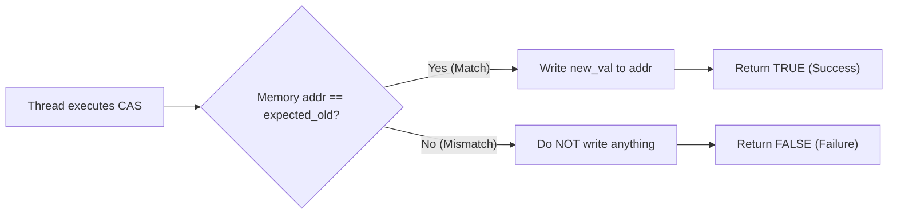
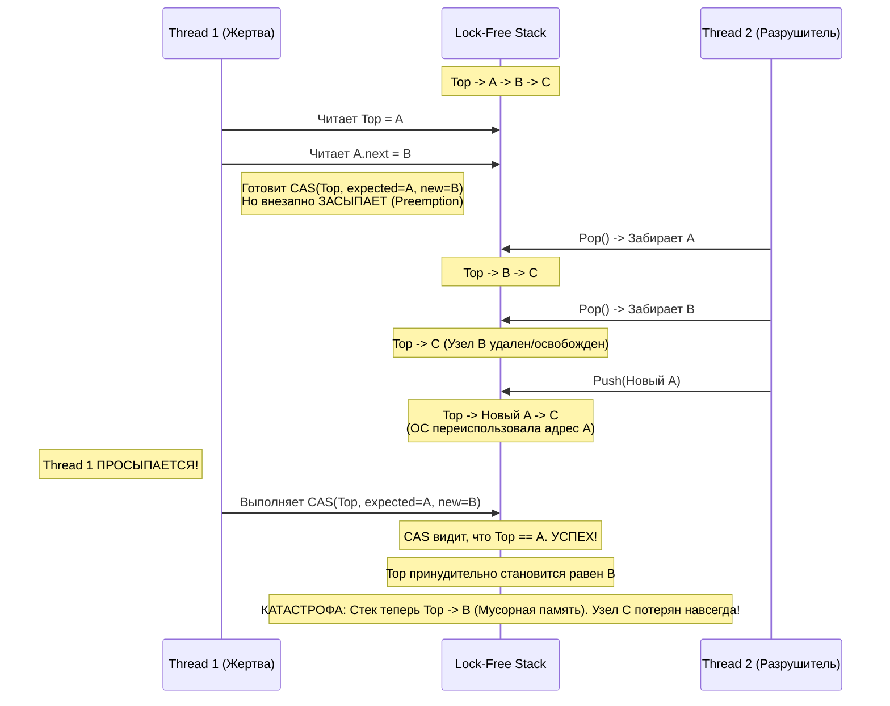

---
tags:
  - concurrency
  - lock-free
  - cas
  - aba-problem
  - multithreading
  - memory-model
aliases:
  - Lock-free structures
  - CAS and ABA
---
# L1.CONC.06: Lock-free структуры, CAS, ABA-проблема 

> [!abstract] О лекции
> **Lock-free** — это парадигма, которая на самом деле вообще не про скорость (в большинстве случаев обычные Spinlocks или адаптивные Mutexes работают быстрее). Lock-free — это про **жесткую гарантию прогресса всей системы** (System-wide Progress).
> Отсутствие блокировок означает, что "заснувший", повисший на I/O или внезапно убитый ОС поток больше не сможет заморозить всю систему, заблокировав критическую секцию. 
> Однако цена за эту архитектурную роскошь непомерна: усложнение кода на порядок, столкновение со смертельной проблемой **ABA**, борьба с когерентностью кэшей CPU и необходимость ручного, филигранного управления памятью (Safe Memory Reclamation) в unmanaged языках вроде C++ или Rust.

---
## 1. Философия: Lock-free vs Wait-free vs Blocking

В глубоких компьютерных науках (Computer Science) классификация алгоритмов конкурентности строится не на примитивной метрике "скорости выполнения", а на том, как система в целом ведет себя при **непредсказуемой задержке или фатальном отказе** одного из потоков. Это математическое понятие называется **Progress Guarantees** (Гарантии прогресса).

Представьте высоконагруженную систему из $N$ потоков. Что физически произойдет, если ядро ОС внезапно остановит (preempt) один рабочий поток на долгих 100 миллисекунд (исчерпан квант времени, произошел аппаратный page fault или Stop-The-World GC pause)?

### 1.1. Blocking (Блокирующие алгоритмы)
Они используют системные примитивы синхронизации (Mutex, Semaphore, Monitor).
*   **Определение:** Если поток $T_1$, эксклюзивно владеющий блокировкой, внезапно задерживается, то **абсолютно все** остальные потоки, требующие эту блокировку для своей работы, немедленно останавливаются и засыпают. Прогресс всей системы равен абсолютному нулю, пока $T_1$ не проснется и не отпустит лок.
*   **Архитектурные риски (Почему от них бегут в High-Load):**
    1.  **Kill-safety (Отсутствие устойчивости к отказу):** Если поток $T_1$ был принудительно "убит" ядром (например, `kill -9` или OOM) или ушел в бесконечный цикл прямо внутри критической секции — система мертва навсегда. Данные остаются в навечно заблокированном и часто несогласованном состоянии.
    2.  **Priority Inversion (Инверсия приоритетов):** Фоновый поток с низким приоритетом держит лок, намертво блокируя системный поток с самым высоким приоритетом (например, обработчик сетевых пакетов).
    3.  **Convoy Effect (Эффект конвоя):** Множество быстрых потоков выстраиваются в длинную очередь за одним локом. Когда лок освобождается, происходит массовое пробуждение толпы (Thundering Herd), вызывающее катастрофический спайк нагрузки на планировщик ОС (Scheduler Thrashing).
    4.  **Deadlock (Взаимоблокировка):** Классическая проблема $A 	o B$ и $B 	o A$.

> **Архитектурная Аналогия:** Очередь в туалет с одним единственным ключом на всё здание. Если человек с ключом уснул внутри или ушел домой с ключом в кармане — никто больше никогда не сможет воспользоваться ресурсом. Здание парализовано.

### 1.2. Non-Blocking (Неблокирующие алгоритмы)
Это благородное семейство алгоритмов, гарантирующих, что внезапная остановка или смерть одного потока **математически не приведет** к остановке всей системы. Внутри этого семейства есть строгая иерархия по силе гарантий:

#### A. Obstruction-Free (Свобода от помех) — *Базовый уровень*
*   **Определение:** Поток гарантированно завершит свою операцию, если он будет выполняться **в полной изоляции** (то есть, если все остальные конкурирующие потоки будут внезапно приостановлены) в течение достаточного времени.
*   **Нюанс (Слабость):** Эта модель не защищает от состояния Livelock (Живой блокировки). Два активных потока могут вечно мешать друг другу (конфликтовать на откатах), и никто из них в итоге не продвинется.
*   **Пример:** Software Transactional Memory (STM) с механизмом постоянного отката транзакций при обнаружении конфликта.

#### B. Lock-Free (Свобода от блокировок) — *Индустриальный Золотой стандарт*
*   **Определение:** Математически гарантируется, что **хотя бы один** поток в системе обязательно сделает полезный прогресс (успешно завершит операцию) за конечное число шагов.
*   **Формально:** System-wide Progress (Прогресс на уровне всей системы).
*   **Механика:** Обычно реализуется через бесконечный цикл вокруг инструкции `CAS` (Compare-And-Swap). Логика проста: если у одного неудачливого потока CAS провалился, это означает только одно — у какого-то другого потока он в эту же секунду **удался**. Следовательно, система в целом успешно продвинулась вперед на один шаг.
*   **Цена (Starvation - Голодание):** Lock-free парадигма вообще не гарантирует справедливости (Fairness). Один "удачливый" и быстрый поток может выигрывать гонку за CAS миллион раз подряд, в то время как другой, "неудачливый" поток будет бесконечно и бесполезно крутиться в цикле `while(!cas(...))`, сжигая CPU.
*   **Профиль Latency:** Обеспечивает колоссальный средний Throughput (пропускную способность), но чреват огромными, непредсказуемыми выбросами Latency (Tail Latency P99.9) для отдельных неудачливых запросов.

> **Архитектурная Аналогия:** Вращающаяся стеклянная дверь в метро в час пик. Люди толкаются плечами. Кто-то наглый проскакивает быстро, кого-то постоянно оттесняют назад. Но в среднем огромный поток людей идет постоянно, дверь никогда не заклинивает намертво.

#### C. Wait-Free (Свобода от ожидания) — *Высший пилотаж Computer Science*
*   **Определение:** Математически гарантируется, что **абсолютно каждый** поток успешно завершит свою операцию за строго конечное (и часто ограниченное константой $O(1)$) число шагов, совершенно независимо от агрессивных действий и скорости других потоков.
*   **Формально:** Per-thread Progress (Прогресс на уровне каждого отдельного потока).
*   **Цена (Extreme Overhead):** Чтобы избежать голодания неудачников, алгоритм строится так, что быстрые потоки аппаратно обязаны "помогать" (Helping mechanism) медленным потокам завершить их работу, прежде чем продолжить свою собственную. Это создает феноменально сложный код и значительный оверхед на координацию состояний.
*   **Профиль Latency:** Идеально предсказуемая, математически ограниченная максимальная задержка (Bounded Latency). Идеально и критически необходимо для Hard Real-Time систем (авионика самолетов, кардиостимуляторы, HFT-трейдинг, реалтайм аудио-процессинг).

> **Архитектурная Аналогия:** Касса супермаркета, где действует жесткое правило системы: "Если быстрый кассир видит, что вы стоите в очереди дольше 5 минут, он обязан бросить свои дела и открыть для вас персональное окно". Стопроцентная гарантия обслуживания каждого за фиксированное время.

---

### 1.3. Сводная таблица для Архитектора (Decision Matrix)

| Системное Свойство                      | Blocking (Mutex / Lock)                            | Lock-Free (CAS Loop)                          | Wait-Free (Helping)                                   |
| :-------------------------------------- | :------------------------------------------------- | :-------------------------------------------- | :---------------------------------------------------- |
| **Гарантия прогресса**                  | Никакой (если владелец уснул/умер - система стоит) | System-wide (минимум кто-то один пройдет)     | Per-thread (каждый гарантированно пройдет)            |
| **Голодание (Starvation)**              | Возможно (зависит от честности планировщика)       | Возможно (очень вероятно при High Contention) | **Абсолютно Невозможно**                              |
| **Deadlock (Взаимоблокировка)**         | Возможен (при нарушении Lock Ordering)             | Математически Невозможен                      | Невозможен                                            |
| **Throughput (Пропускная способность)** | Высокая только при *низкой* конкуренции            | **Высочайшая** при высокой конкуренции        | Средняя/Низкая (из-за чудовищного оверхеда алгоритма) |
| **Latency (Задержка ответа)**           | Предсказуемая (постепенный рост очереди)           | Непредсказуемая (опасные Spikes/всплески P99) | **Строго Ограниченная (Bounded $O(1)$)**              |
| **Сложность имплементации**             | Низкая (1 строчка кода `lock()`)                   | Экстремально Высокая (ABA, Memory Ordering)   | Уровень написания Диссертации                         |
| **Индустриальный Пример**               | `ReentrantLock`, `std::mutex`, `sync.Mutex`        | `ConcurrentLinkedQueue`, `Treiber Stack`      | `Aeron` IPC buffers, Ring Buffers (SPSC)              |

### 1.4. Практический пример в коде: Операция Push в Stack

Чтобы закрепить фундаментальную разницу, посмотрим на логику простейшей операции `push` в связный список (стек) в разных моделях.

**Blocking (Java/C++ style - Защита замком):**
```java
synchronized(lock) {
   // Если поток прерван ОС (уснул) прямо на этой строчке,
   // НИКТО во всей системе больше не сможет сделать push() или pop().
   node.next = top;
   top = node;
}
```

**Lock-Free (Treiber Stack паттерн - Оптимистичная гонка):**
```java
do {
   // Если поток уснул на этой строчке, другие потоки просто продолжат 
   // менять top, система не заметит потери бойца.
   oldTop = top.get();
   node.next = oldTop;
   // Вся суть гонки здесь! Выигрывает тот единственный поток, кто первым сделает CAS.
   // compareAndSet атомарно проверит: "top все еще равен oldTop?"
} while (!top.compareAndSet(oldTop, node)); 
// Если CAS провалился (вернул False - кто-то другой успел изменить top), 
// мы молча проглатываем обиду и делаем retry цикла. Возможен Starvation.
```

**Wait-Free (Conceptual - Командная работа):**
Алгоритм в 50 раз сложнее. Поток сначала "анонсирует" свое намерение сделать Push, записывая объект в глобальный массив намерений `AnnounceState[]`. Другие приходящие потоки, прежде чем делать свой Push, обязаны просканировать массив анонсов, и если видят чужой незавершенный Push — они пытаются выполнить его *за того парня* (используя CAS), чтобы протолкнуть систему вперед, и только потом делают свой. Это гарантирует, что операция первого парня не будет откладываться вечно.

### Резюме для эксперта (Когда что выбирать)
Когда вы проектируете архитектуру и выбираете структуру данных:
1.  **Blocking** — дефолтный, безопасный выбор для 95% бизнес-задач. Современный OS Scheduler невероятно умный, а `futex` в Linux работают за наносекунды при отсутствии конфликтов.
2.  **Lock-Free** — используйте **только** для **High-Throughput** платформенных систем (очереди сообщений Kafka, асинхронные логгеры Log4j, пулы коннектов), где критически важно, чтобы система продолжала "переваривать" гигабайты данных, даже если отдельные потоки-продюсеры "тупят" или засыпают.
3.  **Wait-Free** — используйте **исключительно** в **Hard Real-Time** или **Ultra-Low Latency** системах (HFT-биржи, софт кардиостимуляторов), где предсказуемый перцентиль `P99.99` (задержка не более 10 мкс) в тысячу раз важнее, чем средний throughput.

---
## 2. Атом параллелизма: Инструкция CAS (Compare-And-Swap)

Если Мьютекс — это грубый "светофор", который физически останавливает движение всех машин, то CAS — это ювелирный "маневр перестроения на опережение". Это единственная в мире точка опоры процессора, позволяющая безопасно менять состояние разделяемой памяти (Shared Memory) без перевода потоков в спящий режим операционной системы.

### 2.1. Формальное определение и семантика работы
CAS — это **аппаратная атомарная инструкция** процессора из семейства (RMW — Read-Modify-Write), которая выполняет условное обновление памяти за один неделимый такт шины.



Сигнатура операции (концептуальный псевдокод):
```cpp
// Выполняется железом АТОМАРНО, прерывания не могут вклиниться в этот процесс.
// Возвращает true, если обмен успешно произошел, false — если значения не совпали.
// В качестве side-effect обновляет RAM по адресу addr.
boolean CAS(address* addr, type expected_old, type new_val);
```

**Важное практическое уточнение для архитектора:** В современных языковых API (C++ `std::atomic`, Rust `Atomic`, Java `VarHandle`) CAS часто спроектирован так, что возвращает не просто глупый `boolean`, а **само актуальное значение** (witness), которое прямо сейчас лежит в памяти. Это критически важно для оптимизации циклов ретрая (нам не нужно делать еще один `read()`, если CAS провалился, мы уже знаем свежее значение).

### 2.2. Физика процесса: Что физически происходит в "железе"?
Почему CAS традиционно считается "тяжелой" операцией (overhead)? Это далеко не простое сравнение двух регистров в ALU.

1.  **x86 / x64 (CISC архитектура - Intel/AMD):**
    Используется ассемблерная инструкция `LOCK CMPXCHG`. Префикс `LOCK` здесь делает всю фундаментальную магию.
    *   **Раньше (В эпоху Pentium - Bus Lock):** Процессор тупо посылал электрический сигнал `#LOCK` на шину материнской платы, физически блокируя доступ к оперативной памяти (RAM) для абсолютно всех остальных ядер процессора. Это останавливало всю систему на сотни тактов. Катастрофа для многоядерности.
    *   **Сейчас (Эпоха Cache Locking / MESI Protocol):** Ядра поумнели. Если нужные данные уже лежат в L1 кэше текущего ядра в состоянии `Modified` или `Exclusive`, блокировка всей шины памяти больше не нужна. Процессор использует внутренний протокол когерентности кэша (MESI). Он рассылает по кольцевой шине кристалла требование к остальным ядрам **немедленно инвалидировать** (сбросить и забыть) их локальные копии этой конкретной кэш-линии.
    *   **Цена операции:** Тем не менее, успешный CAS занимает $\sim 15-30$ тактов CPU (против 1 такта обычной записи L1), плюс драгоценное время на синхронизацию статусов кэшей (inter-core communication latency).

2.  **ARM / RISC-V (LL/SC архитектура - Apple Silicon / AWS Graviton):**
    В этих современных архитектурах физически нет единой монолитной инструкции CAS. Есть пара инструкций, работающих в тандеме:
    *   `LDREX` (Load-Exclusive): Читает значение из памяти в регистр и аппаратно ставит специальную "метку" (монитор эксклюзивности) на этот физический адрес памяти.
    *   `STREX` (Store-Exclusive): Пытается записать новое значение по адресу. Если с момента вызова `LDREX` ни одно другое ядро (или устройство DMA) **не трогало (не писало)** по этому адресу — запись проходит успешно. Если монитор засек чужую активность — запись фейлится.
    *   *Нюанс Архитектуры:* Это позволяет реализовать семантику CAS более изящно, без жесткой блокировки шины, но добавляет высокий риск "ложных отказов" (Spurious Failures) — когда `STREX` проваливается просто из-за того, что рядом пролетело прерывание ОС.

### 2.3. Паттерн программирования: CAS-Loop (Цикл ретраев)
Поскольку CAS оптимистичен и может не сработать в любую секунду (другой поток успел изменить переменную на наносекунду раньше), мы как инженеры обязаны повторять попытку. Это классический паттерн оптимистичной блокировки.

**Пример: Эталонный Атомарный инкремент счетчика (Java / C++ logic)**

```java
public void increment() {
    int current, next;
    // 1. Читаем начальное (базовое) состояние
    // В C++ это: current = atom.load(memory_order_relaxed);
    current = atom.get(); 
    
    do {
        // 2. Вычисляем новое состояние АБСОЛЮТНО ЛОКАЛЬНО (без блокировок)
        // ВАЖНО: Если здесь будет тяжелая математика или I/O, она будет 
        // выполнена впустую и выброшена в мусорку при неудаче CAS.
        next = current + 1;

        // 3. Пытаемся "закоммитить" наше изменение в RAM
        // compareAndSet вернет false, если память реально изменилась с момента шага 1.
        // Оптимизация: При неудаче современный CAS обычно сразу обновляет переменную 
        // 'current' актуальным значением из памяти, избавляя нас от лишнего вызова get()!
    } while (!atom.compareAndSet(current, next)); 
}
```

### 2.4. Strong CAS vs Weak CAS (Тонкая настройка C++)
На уровне Senior/C++ эксперта вы должны осознанно выбирать правильный тип атомарной операции.

1.  **Strong CAS (`compare_exchange_strong`):**
    *   Жесткая Гарантия: если актуальное значение в памяти действительно равно `expected`, замена произойдет на 100%.
    *   *Где использовать Архитектору:* Строго в тех случаях, когда алгоритм вычисления нового значения (`next`) очень долгий и тяжелый по CPU, и вы категорически не хотите пересчитывать его лишний раз из-за случайной ошибки железа.
2.  **Weak CAS (`compare_exchange_weak`):**
    *   Слабая Гарантия: Может вернуть `false` (провал), **даже если реальное значение в памяти в эту секунду равно `expected`**.
    *   *Причина (Аппаратная физика):* На архитектуре ARM (LL/SC) любое случайное аппаратное прерывание (IRQ) от сетевой карты или переключение контекста ОС, произошедшее ровно между инструкциями `LDREX` и `STREX`, параноидально сбивает аппаратный монитор эксклюзивности. Возникает **Spurious Failure** (ложный отказ).
    *   *Где использовать Архитектору:* **Всегда внутри циклов (Loop).**
    *   *Почему:* Поскольку ваш код всё равно уже обернут в цикл `while`, ложный отказ просто приведет к одной лишней итерации цикла (микросекунды). Зато `weak` версия позволяет компилятору генерировать гораздо более компактный и быстрый машинный код на ARM (без вставки лишних барьеров памяти внутри самого CAS).

### 2.5. Проблема производительности: Cache Line Ping-Pong (CAS Storm)

Это главная, скрытая опасность Lock-free архитектуры, которую часто упускают при переходе с мьютексов.

Представьте банальный атомарный счетчик `AtomicLong` (например, счетчик хитов страницы), который пытаются инкрементировать 64 потока на 64-ядерном сервере одновременно.
1.  Ядро 1 делает свой CAS -> переводит эту кэш-линию в состояние `Modified` у себя в L1 кэше.
2.  Ядро 2 тоже хочет сделать CAS -> оно посылает сигнал по шине на Ядро 1 с запросом на эти данные.
3.  Ядро 1 аппаратно обязано прерваться, сбросить свои данные в общий L3 кэш (или передать напрямую), и инвалидировать свой L1 кэш.
4.  Ядро 2 получает данные, делает свою запись (CAS).
5.  Ядро 3 хочет данные... Ядро 1 снова хочет данные...

Бедная 64-байтная кэш-линия начинает с бешеной скоростью "летать" между 64 ядрами (Ping-Pong). Внутренний трафик на шине процессора (Interconnect/Mesh) забивается до предела.
**Катастрофический Результат:** Ваш крутой Lock-free алгоритм работает **в 10 раз медленнее**, чем старый добрый `Mutex` (который бы просто выстроил потоки в очередь в ядре ОС и дал одному ядру спокойно поработать с кэшем).

**Архитектурные Решения проблемы (Mitigation):**
*   **Backoff (Отступление):** Если CAS не прошел, заставить поток подождать случайное время (в Java `LockSupport.parkNanos(random)`), чтобы искусственно снизить одновременное давление толпы на шину памяти (аналог CSMA/CD в Ethernet).
*   **Sharding / Striping (Размазывание):** Вместо одного глобального счетчика использовать массив счетчиков (паттерн `LongAdder` в Java), где каждый поток пишет строго в свою, отдельную ячейку памяти (находящуюся в разных кэш-линиях), минимизируя конкуренцию до нуля. В конце значения просто суммируются.
*   **Relaxed Atomics:** Если строгая консистентность и мгновенная видимость значения вам по бизнесу не нужна, использовать инструкцию `fetch_add`, которая на процессорах x86 выполняется одной аппаратной инструкцией `LOCK XADD` (она работает на шине в разы быстрее, чем программный цикл CAS).

---
### 3. The ABA Problem: Призрак в машине

Проблема **ABA** — это фундаментальная, смертельная уязвимость любой оптимистичной блокировки, основанной на CAS. Это логическая ситуация, когда алгоритм проверки «значение не изменилось» ложно рапортует об успехе, хотя физическое состояние системы за это время изменилось **дважды** (туда и обратно), и смысловой контекст операции безнадежно устарел.

#### 3.1. Суть проблемы (Формальное определение)
Аппаратная инструкция CAS (`Compare-And-Swap`) тупо и математически проверяет **равенство значений байт** (Value Equality), а не **историю изменений этих байт** (History/Timeline).
*   **Логика CAS (Иллюзия):** "Если по адресу памяти $P$ всё еще лежит значение $A$, значит абсолютно никто не трогал эту память, пока мой поток спал. Я могу безопасно продолжить".
*   **Суровая Реальность:** По адресу $P$ лежало значение $A$. Вы уснули. Пришел другой, очень быстрый поток, поменял значение на $B$, сделал свои дела, и вернул обратно значение $A$ (или вообще положил туда совершенно другой новый объект, которому ОС случайно выдала тот же самый адрес памяти $A$).
*   **Результат:** Ваш CAS срабатывает "успешно", но ваш поток применяет разрушительную операцию, основываясь на **глубоко устаревших предпосылках** о состоянии связанных данных.

#### 3.2. Анатомия катастрофы (Детальный разбор на примере Стека)

Рассмотрим классический баг при реализации Lock-Free стека (односвязного списка), где `Top` — это глобальный атомарный указатель на вершину.
Структура узла: `Node { value, next }`.

**Начальное консистентное состояние:**
Стек: `Top -> [Node A] -> [Node B] -> [Node C]`
*   В физической памяти: `Top` указывает на адрес `0x100` (где лежит Node A).
*   Переменная `Node A.next` указывает на адрес `0x200` (где лежит Node B).

**Сценарий развития ABA:**



1.  **Поток 1 (Жертва) начинает операцию `Pop()`:**
    *   Считывает текущий `Top` и видит `Node A` (адрес `0x100`).
    *   Считывает `Top.next`, чтобы знать, кто станет новой вершиной после удаления А. Видит `Node B` (адрес `0x200`).
    *   *План Потока 1:* Сделать `CAS(Top, expected=0x100, new=0x200)`. Логика: "Если вершина всё еще A, сделать новой вершиной B".
    *   **⏸ Контекст жестко переключается (Preemption). Поток 1 засыпает в ядре ОС.**

2.  **Поток 2 (Разрушитель) вмешивается и работает:**
    *   Быстро выполняет `Pop()`: Забирает узел `A`. Стек становится: `Top -> B -> C`.
    *   Быстро выполняет `Pop()`: Забирает узел `B`. Стек становится: `Top -> C`. (В этот момент `Node B` логически удален из стека, его память может быть освобождена или отдана другому процессу!).
    *   Выполняет `Push(Новый A)`: Создает новый узел. Менеджер памяти (Allocator С++ или GC) видит, что адрес `0x100` свободен (так как старое А удалили на шаге 1), и в целях оптимизации кэша выделяет именно этот адрес `0x100` под новый узел.
    *   **Текущее состояние системы:** Стек: `Top -> [New Node A] -> [Node C]`.
    *   *Заметьте критический момент:* `Top` снова указывает на старый адрес `0x100`. Но вот `Node A.next` теперь внутри себя указывает на `C`, а вовсе не на `B`!

3.  **Поток 1 просыпается:**
    *   Он ничего не знает о прошедшем времени. Он слепо приступает к выполнению своей старой инструкции `CAS(Top, Old=0x100, New=0x200)`.
    *   **Аппаратная Проверка:** Процессор сверяет текущий `Top` (0x100) с ожидаемым (0x100). Они совпадают! Битовое представление адреса абсолютно идентично.
    *   **Аппаратное Действие:** Процессор радостно записывает в `Top` значение `0x200` (адрес давно удаленного `Node B`).

#### 3.3. Последствия (Impact Analysis)

Что именно сломалось в архитектуре? Мы получили "успешный" CAS, но давайте посмотрим на итоговый разрушенный стек.

*   **Текущий Top:** Указывает на `Node B` (0x200).
*   **Статус Node B:** Этот узел был физически удален Потоком 2 на шаге 2!
    *   **В C/C++ (Unmanaged Memory):** Память по адресу 0x200 уже была возвращена ОС (`free/delete`). Любое последующее обращение программы к стеку вызовет уязвимость **Use-After-Free** и, скорее всего, мгновенный **Segmentation Fault** (краш сервера). Либо, что еще хуже, там уже лежат данные SQL-запроса другого клиента, и мы их молча коррумпируем.
    *   **В Java/Go (Managed Memory - GC):** Сборщик мусора (GC) не удалил объект `B` физически из RAM, так как Поток 1 всё это время держал на него локальную ссылку в стеке (Reference). Краша JVM не будет. Но логически `B` уже не в стеке!
    *   **Потеря данных (Data Loss):** Самое страшное — мы навсегда потеряли `Node C` и всё, что было под ним на миллион записей вниз.
        Поток 1 думал, что структура цела: `A -> B -> C`.
        По факту структура была: `Новый A -> C`.
        Поток 1 своим CAS-ом насильно выставил `Head = B`. Ссылка на `C` (которая заботливо хранилась в `New Node A`) была просто затерта и потеряна навсегда. Это классический **Memory Leak** (утечка памяти целой ветки) и **Data Loss** в бизнес-логике.

#### 3.4. Иллюстрация из реальной жизни (The Suitcase Analogy)

Представьте, что вы арендуете защищенную ячейку в банке.
1.  Вы (Поток 1) открываете ячейку и видите там черный чемодан с миллионом долларов (Значение А). Вы запоминаете для проверки: "Чемодан черный, бренд Samsonite".
2.  Вы отворачиваетесь попить воды к кулеру.
3.  Опытный вор (Поток 2) забирает чемодан, вытряхивает ваши деньги, кладет туда тикающую бомбу и возвращает точно такой же черный чемодан Samsonite (Значение А) на то же самое место.
4.  Вы поворачиваетесь. Вы делаете свою "CAS" проверку: "Чемодан черный? Да. Samsonite? Да. Значит никто ничего не трогал".
5.  Вы забираете чемодан с собой, абсолютно уверенные, что состояние системы не изменилось.
6.  **Взрыв.**

В программировании CAS проверяет только "внешний вид чемодана" (шестнадцатеричный адрес указателя), но абсолютно слеп к его внутреннему содержимому или истории его перемещений во времени.

#### 3.5. Где этот баг встречается чаще всего?

1.  **Object Pooling (Пулы объектов):** Если вы не аллоцируете память в ОС каждый раз через `new`/`malloc`, а берете готовые переиспользуемые объекты из пула (для экономии CPU), их адреса в памяти будут повторяться очень и очень часто. Это настоящий рай для возникновения проблемы ABA.
2.  **Intrusive Data Structures:** Высокооптимизированные структуры (часто в ядрах ОС или драйверах), где системные указатели `next/prev` хранятся прямо внутри самих бизнес-объектов (payload).
3.  **Lock-free Freelist:** Списки свободных блоков памяти внутри самих аллокаторов памяти (таких как `jemalloc`, `mimalloc` или `tcmalloc`) — там инженерам ABA проблему приходится лечить на самом хардкорном уровне железа.

**Вывод для архитектора (Red Flag):** Если на код-ревью вы видите простой `CAS` в коде, который управляет сложной динамической связной структурой (стек, очередь, граф), и там нет ни единого механизма защиты версионированием (Stamped/Tagged pointers) — это критический баг. Он может не проявляться на локальных тестах годами, но гарантированно выстрелит в продакшене при пиковой нагрузке (Black Friday), уничтожив данные.

---
## 4. Архитектурные решения проблемы ABA 

Проблема ABA возникает не потому, что "данные внезапно изменились", а потому, что мы на уровне адресации потеряли **семантику уникальной идентичности**. Значение указателя `0x00F1` сейчас и `0x00F1` через миллисекунду — это логически могут быть два абсолютно разных объекта (если память была освобождена и аллоцирована ядром заново).

Решения делятся на аппаратные (железо), алгоритмические и архитектурные.

### 4.1. Tagged Pointers (Версионирование указателей / Stamped References)
Самое распространенное и пуленепробиваемое алгоритмическое решение для стандартных архитектур x86/x64. Мы искусственно приклеиваем к данным "историю" их изменений.

*   **Концепция:** Вместо того чтобы хранить просто "голый" указатель `ptr` (64 бита), мы храним в памяти неразрывную пару `{ptr, version}` (128 бит).
*   **Механика спасения:** При каждом успешном изменении структуры (CAS) мы не только меняем сам указатель, но и обязательно инкрементируем счетчик `version` (+1).
    *   *Было:* `A -> B -> A`. Глупый CAS видит: `A == A` (Ложный Успех, ОШИБКА ABA).
    *   *Стало (с тегами):* `{A, ver:1} -> {B, ver:2} -> {A, ver:3}`. Умный CAS ожидает увидеть старую пару `{A, ver:1}`, но видит в памяти `{A, ver:3}`. **CAS гарантированно проваливается (False).** Структура данных и система спасены.

**Реализация в железе и языках:**
1.  **x86-64 (Инструкция `CMPXCHG16B`):** Современные процессоры Intel/AMD аппаратно умеют делать CAS над 128 битами (16 байт) за один такт атомарно. Это позволяет программисту положить рядом в структуру 64-битный указатель и 64-битный счетчик эпохи и атомарно их проверять.
2.  **Pointer Packing (Сжатие указателей в C++):** Архитектурный хак. В современных 64-битных ОС (Linux/Windows) реально для адресации используется только нижние 48 бит адреса (остальные зарезервированы). Оставшиеся свободные 16 бит в "голове" указателя инженеры часто используют для хранения счетчика (Tag). Это опасно (если вендор ОС в будущем начнет использовать эти биты, код сломается), но это работает невероятно быстро и влезает в стандартный 64-битный регистр.
3.  **Java (`AtomicStampedReference<V>`):** Это программная обертка в стандартной библиотеке `java.util.concurrent`. Она внутри хранит обычную ссылку на объект и `int` штамп. 
    *   *Минус Архитектуры:* Каждое изменение значения требует создания дополнительного объекта-обертки `Pair` в куче, что катастрофически увеличивает нагрузку на GC (Garbage Collector) и напрочь убивает cache locality (данные размазаны по памяти).

### 4.2. Safe Memory Reclamation (SMR) — "Святой Грааль" для C++/Rust
В суровых языках без автоматической сборки мусора (C++, Rust) вы физически не можете просто сделать `delete node` после извлечения узла (Pop) из Lock-free очереди.
*   *Смертельная причина:* Другой фоновый поток может прямо сейчас спать (preempted) перед выполнением своего CAS, все еще крепко держа старый указатель на этот `node` в своей локальной переменной. Если вы вернете память ОС (`free`), а потом ОС отдаст её другому приложению, спящий поток проснется и запишет данные в чужую память (Уязвимость Use-After-Free + логическая ABA).

Нам критически необходимы системные механизмы **отложенного безопасного удаления**.

#### А. Hazard Pointers (Указатели опасности)
Классический академический метод, предложенный Maged Michael.
*   **Идея (Сигнальные флажки):** Каждый читающий поток имеет свой публичный "список покупок" (массив Hazard Pointers). Перед тем как читать узел, поток записывает туда адрес: "Внимание всем! Я сейчас активно работаю с указателем `X`, категорически запрещаю его удалять".
*   **Алгоритм безопасного удаления:**
    1.  Поток-писатель логически удалил узел `X` из списка и хочет освободить память.
    2.  Он сканирует Hazard-списки **абсолютно всех** остальных активных потоков в системе.
    3.  Если указатель `X` нигде не упомянут — значит никто на него не смотрит, удаляем безопасно (вызываем `delete`).
    4.  Если указатель `X` кем-то упомянут — писатель вздыхает и кладет `X` в свой локальный кэш "на удаление потом" (Retire List), чтобы попытаться удалить его при следующей операции.
*   **Цена архитектуры:** Читающие потоки обязаны делать тяжелую, атомарную операцию **записи в память** (публикацию своего Hazard Pointer с барьером памяти `seq_cst`) перед *каждым* актом чтения узла. Это полностью убивает масштабируемость системы на большом количестве читателей (Reader contention).

#### Б. Epoch Based Reclamation (EBR)
Современный индустриальный стандарт. Широко используется в **Rust Crossbeam** (библиотека эпох), высокопроизводительной базе данных **ScyllaDB** и многих современных системных аллокаторах (`mimalloc`).
*   **Идея:** Системное время абстрактно делится на "Эпохи" (глобальный атомарный счетчик $E$).
*   **Железное Правило:** Мы имеем право физически освободить (delete) объекты, которые были логически помечены на удаление в эпохе $E$, **только и исключительно тогда**, когда абсолютно **все** активные потоки в системе подтвердят, что они перешли в эпоху $E+1$ или $E+2$. (То есть никто больше не живет в прошлом).
*   **Механика:**
    1.  Поток перед началом любой Lock-free операции регистрируется в системе: "Я начал работу в эпохе 10".
    2.  Закончив операцию (или батч операций), поток снимает отметку или обновляет свою эпоху на свежую.
    3.  Фоновый Мусорщик (Reclaimer) смотрит на массив потоков: "Ага, минимальная эпоха среди всех активных рабочих потоков сейчас — 10". Значит, весь мусор, собранный в древних эпохах 8 и 9, можно смело и пакетно удалять (`free`). Физически никто в системе больше не может держать ссылку на него.
*   **Архитектурная Цена:** Работает феноменально быстро (почти нулевой оверхед на чтение, так как читателям не нужно публиковать каждый указатель, только отмечать вход в эпоху).
*   **Архитектурный Риск (Starvation):** Если хотя бы один кривой поток зависнет (уйдет в deadlock, бесконечный цикл или просто долгую паузу I/O), не обновив свою эпоху, он в одиночку "заморозит" глобальную эпоху всей системы. Память от удаленных объектов вообще перестанет возвращаться в ОС, и сервер неминуемо упадет с OOM (Out Of Memory).

### 4.3. Аппаратный иммунитет от ABA: LL/SC (Load-Linked / Store-Conditional)
Архитектор-эксперт должен твердо знать, что проблема ABA — это в первую очередь родовая болезнь CISC архитектуры **x86/x64** (Intel/AMD).
На современных RISC-архитектурах (ARM, PowerPC, RISC-V — например, процессоры Apple M1/M2, сервера AWS Graviton) вместо монолитной инструкции `CAS` на уровне кремния используется связка инструкций `LL/SC`.

*   `LL (Load Linked)`: Прочитать текущее значение из памяти в регистр и аппаратно "повесить скрытый микро-монитор" на эту линию памяти в кэше процессора.
*   `SC (Store Conditional)`: Попытаться записать новое значение, **строго только если** с момента вызова `LL` в этот физический адрес не было произведено **абсолютно никаких записей** со стороны любых других ядер или устройств.

**Фундаментальная Разница:** `CAS` глупо проверяет только *текущее значение* в памяти (чемодан черный?). `SC` аппаратно проверяет *сам факт любой записи* в эту память (чемодан кто-то трогал руками?).
Если произошел сценарий `A -> B -> A`, то финальный `SC` гарантированно провалится (вернет ошибку), потому что его аппаратный монитор четко зафиксирует, что память физически "перезаписывалась" (сбрасывалась из кэша), даже если итоговое значение волшебным образом совпало со старым.
*   **Вывод:** На современных ARM процессорах классическая проблема ABA решается на самом нижнем уровне железа естественным образом (хотя высокоуровневые программные абстракции языков вроде Java/C# часто все равно программно эмулируют поведение классического `CAS` ради кроссплатформенности, возвращая риск обратно).

### 4.4. Ловушка Object Pooling (Даже в Java/Go с Garbage Collector)
Многие мидлы свято верят: "У меня код на Java / C# / Go, там есть умный Garbage Collector, он сам следит за памятью, значит проблемы ABA у меня не существует в принципе". **Это фатальная архитектурная ошибка.**
Если вы (ради оптимизации Latency) используете паттерн **Object Pool** (например, для радикального снижения нагрузки на GC в высокочастотных фреймворках вроде Netty или LMAX Disruptor) и переиспользуете старые объекты вручную:
1.  Вы берете "чистый" объект `Node` из вашего пула.
2.  Используете его в вашей самописной Lock-free очереди.
3.  Закончив работу, вы очищаете его поля и возвращаете обратно в пул.
4.  В следующую миллисекунду другой поток снова берет *тот же самый* физический объект `Node` из пула.
Для инструкции `CAS` это выглядит как эталонная проблема ABA, так как шестнадцатеричный адрес объекта (ссылка в памяти кучи) остался абсолютно тем же самым! Системный GC здесь вообще вас не спасет, так как с его точки зрения объект постоянно "жив" (на него есть ссылки из пула).
**Решение Инженера:** При каждом возврате объекта в ваш кастомный пул всегда принудительно инкрементируйте его внутренний счетчик версий (поле `generationId`).

---
## 5. Границы применимости: Когда внедрение Lock-free — это архитектурная ошибка

Как Solution Architect, вы обязаны рассматривать Lock-free подходы не как «классную оптимизацию по умолчанию, чтобы код был модным», а как **экстремальную меру последней надежды**. Вы неизбежно платите десятикратным усложнением кода, месяцами тяжелой отладки и (внезапно) чудовищным падением производительности в худших сценариях, и всё это ради одной цели: гарантии бесперебойного System-wide Progress.

Вот 4 классических сценария, когда использование Lock-free алгоритмов строго и категорически противопоказано.

### 5.1. Проблема композиции (Multi-Word Updates - Обновление нескольких переменных)
**Суть проблемы:** Атомарные инструкции современных процессоров (`CMPXCHG`) физически способны работать только с **одним машинным словом** памяти за раз (64 бита, или максимум 128 бит с расширениями x86). Если ваша бизнес-логика (инвариант) требует одновременного атомарного обновления **двух и более** логически независимых переменных, разбросанных по памяти, Lock-free превращается в инженерный ад.

*   **Термин Computer Science: Линеаризуемость (Linearizability).** Это строгое свойство многопоточной системы вести себя для внешнего наблюдателя так, будто каждая сложная операция происходит мгновенно, целиком в одной точке времени. Обеспечить линеаризуемость для составных операций без использования блокировок — это алгоритмическая задача уровня докторской диссертации.
*   **Классический Пример:** Потокобезопасный Двусвязный список (Doubly Linked List).
    *   Атомарная вставка нового узла $B$ между существующими узлами $A$ и $C$ математически требует одновременного обновления двух указателей: $A.next$ и $C.prev$.
    *   В простом мире с блокировками это пишется за секунду: `lock(list); A.next=B; C.prev=B; unlock(list)`. Всё безопасно.
    *   В мире Lock-free: Вы успешно делаете `CAS(A.next, C, B)`. Первый шаг готов. Теперь весь список находится в "сломанном" (промежуточном) состоянии! Если ваш поток упадет (прервется ОС) именно в эту микросекунду, указатель $C.prev$ так и останется смотреть на старое место. Обратный обход списка сломается. 
    *   *Решение Lock-free:* Чтобы это починить, вам придется внедрять сложные "дескрипторы операций" (объекты в памяти, описывающие намерение потока изменить $N$ ячеек), чтобы любой другой поток, наткнувшийся на вашу недоделанную работу, мог прочитать дескриптор и "доделать" (help) вставку за вас. Это создает астрономический оверхед на CPU и память.

**Вердикт Архитектора:** Если бизнес-инвариант затрагивает $>1$ разделяемой переменной -> **Использовать только классические блокировки (Mutex/RWLock)** или концепцию Software Transactional Memory (STM). Самописный Lock-free здесь убьет проект.

### 5.2. Патология высокой конкуренции (CAS Storm & Cache Coherence)
Распространенный миф джуниоров: «Lock-free всегда быстрее, потому что нет дорогих переключений контекста ОС».
Жестокая реальность: При экстремально высокой конкуренции за одни данные (High Contention) Lock-free алгоритм на CAS-ах будет работать **в десятки раз медленнее** обычных блокировок.

*   **Физика процесса (Hardware level):** Когда 100 активных потоков одновременно пытаются сделать `CAS` на одной и той же ячейке памяти (например, глобальный `AtomicCounter`):
    1.  Все 100 физических ядер процессора требуют эксклюзивного доступа на запись к одной Cache Line (протокол MESI, состояние *Modified*).
    2.  Кольцевая шина процессора (Interconnect / QPI) намертво забивается системным трафиком синхронизации кэшей.
    3.  Ровно 1 ядро из 100 выигрывает гонку и делает инкремент. 99 ядер проигрывают.
    4.  99 проигравших ядер тут же, без паузы (в цикле `while`), пытаются повторить `CAS`, снова создавая гигантский спам запросами на шине.
*   **Термин: Contention (Конкуренция).** Ситуация, когда непропорционально много потоков пытаются изменить один и тот же ресурс одновременно.
*   **Сравнение деградации:**
    *   **Lock-free:** Жесткое активное ожидание (Spinning), сжигание электроэнергии (100% CPU), забивание кэш-шины памяти. Общая производительность сервера деградирует по экспоненте.
    *   **Mutex:** Потоки, не получившие доступ к мьютексу через Fast Path, тихо паркуются ядром ОС в специальную очередь (Wait Queue). Они полностью уходят из CPU run-queue (0% CPU), разгружая шину памяти и освобождая все аппаратные ресурсы для того единственного потока, который сейчас держит лок и делает полезную работу.
*   **Решение Архитектора:** Если вы по дизайну ожидаете высочайшую конкуренцию в одной "горячей" точке, категорически избегайте простого CAS-loop. Используйте паттерн **Striping / Sharding** (размазывание стейта по массиву, как в `LongAdder`), алгоритмы с очередями с делегированием (Flat Combining), или просто вернитесь к умным адаптивным Мьютексам.

### 5.3. Ад моделей памяти (Memory Model Hell)
Lock-free код, который годами идеально и без сбоев работал на серверах Intel (архитектура x86-64), может внезапно начать падать с мистическими ошибками или терять данные при переезде проекта в облако на процессоры AWS Graviton (архитектура ARM64) или на Apple Silicon (M-чипы).

*   **Суть физики железа:** Процессоры x86 исторически имеют очень строгую (сильную) модель памяти (TSO — Total Store Order). Процессор x86 аппаратно прощает программисту отсутствие многих барьеров памяти (Memory Barriers). Архитектура ARM, напротив, имеет экстремально **слабую** модель памяти (Weak Memory Model). Ради энергоэффективности процессор ARM имеет полное аппаратное право безжалостно переставлять местами инструкции чтения и записи (`Store-Load` reordering) совсем не так, как вы написали их в исходном коде, если между ними нет явной зависимости.
*   **Требование к Инженеру:** Чтобы писать кросс-архитектурный Lock-free код, вы должны виртуозно, на академическом уровне владеть семантикой `Acquire` (барьер на получение), `Release` (барьер на публикацию изменений) и `Sequential Consistency` (полная строгая консистентность).
*   **Пример смертельного риска:**
    ```java
    // Поток 1 (Писатель - Инициализация)
    data = new Object(); // Шаг 1: Аллокация и заполнение полей объекта
    ready = true;        // Шаг 2: Флаг готовности (volatile write / Release)
    ```
    ```java
    // Поток 2 (Читатель - Потребление)
    if (ready) {         // Шаг 3: Проверка флага (volatile read / Acquire)
       use(data);        // Шаг 4: Использование полей объекта
    }
    ```
    Если вы, как программист на C++, забудете (или решите сэкономить такты) и проставите неверные барьеры памяти (например `memory_order_relaxed` вместо `acquire/release`) на строках 2 и 3, то на слабой архитектуре ARM Поток 2 абсолютно легально может увидеть, что `ready == true`, проскочить `if`, но при этом поля объекта `data` в памяти всё еще будут находиться в состоянии инициализации (вы прочитаете частично сконструированный мусор или нули), потому что хитрый процессор ARM физически переставил местами выполнение инструкций 1 и 2 в Потоке 1!

**Вердикт Архитектора:** Если в вашей команде нет Senior эксперта, знающего наизусть 500-страничную спецификацию JMM (Java Memory Model) или C++11 Memory Model -> **Строго запретить написание самописного Lock-free кода в проекте**.

### 5.4. Сложность нетривиальной логики (Backoff & Fairness)
Простой и короткий CAS-цикл из учебника математически не гарантирует справедливости выполнения (Fairness).
*   **Проблема:** В тяжело нагруженном Lock-free стеке один "сверх-удачливый" (или работающий на более быстром ядре) поток может успеть сделать `Push`, `Pop`, `Push` 100 раз подряд, пока другой, несчастный поток отчаянно и безуспешно пытается пропихнуть один единственный свой `Push`. Это приводит к жесткому **Starvation** (голоданию) отдельных потоков и абсолютно непредсказуемому Latency ответа для конечных пользователей (метрика P99 улетает в небеса до секунд).
*   **Реализация:** Чтобы архитектурно исправить эту несправедливость, вам как разработчику придется руками вписывать в код сложные алгоритмические механизмы *Backoff* (экспоненциальная задержка при неудаче, расчет контента), что по своей сути является "костыльной" эмуляцией работы крутого планировщика ОС (Linux CFS) прямо в вашем user-space коде. Возникает вопрос инженерии: зачем писать это криво самому, если системные `java.util.concurrent.ReentrantLock` или `pthread_mutex` в Linux уже делают всё это за вас и оптимизировались лучшими умами планеты десятилетиями (через механизм Futexes и Wait Queues)?

---
### Итоговое правило Архитектора (Golden Rule of Thumb)

Прибегайте к внедрению Lock-free структур в Production **только и исключительно если**:
1.  Ваш профилировщик (например, Linux `perf` или Java `JFR`) железобетонно доказал, что **именно ваши текущие блокировки (mutex) являются главным узким местом системы** (Lock Contention сжирает > 30% времени CPU). Докажите это метриками, а не интуицией.
2.  Операции над вашей структурой данных **максимально элементарны** и атомарны по своей природе (простой инкремент метрики, вставка узла строго в один конец списка).
3.  Для вашего домена критична абсолютная устойчивость к фатальным **Deadlock / Livelock / Thread Death** (например, вы пишете низкоуровневый обработчик прерываний в ядре ОС или HFT-торговую систему, где нельзя допустить паузу всего торгового пайплайна ни на микросекунду, даже если один поток упал).
4.  Вы используете **готовую, проверенную годами индустриальную библиотеку** (JCTools для Java, архитектуру LMAX Disruptor, пакет Boost.Lockfree для C++), а ни в коем случае не пишете эти структуры сами с нуля.

Во всех остальных 99% стандартных бизнес-случаях **хороший, современный адаптивный Mutex (особенно SpinLock, применяемый на экстремально коротких критических секциях) будет работать в разы эффективнее, стабильнее, безопаснее и, что самое главное, будет на порядки проще в отладке и поддержке вашими коллегами.**

---
## 6. Чек-лист уровня Awareness (Для Senior Интервью)

1.  **Wait-Free vs Lock-Free (Отличие гарантий):** Понимаете ли вы фундаментально, что алгоритм Lock-free гарантирует работу системы в целом, но совершенно не гарантирует отсутствие гигантских задержек (latency spikes) и голодания для одного конкретного, отдельно взятого запроса/потока? (Только Wait-Free алгоритмы дают гарантию задержки).
2.  **False Sharing (Ложное разделение кэша):** Знаете ли вы физику железа: если в коде два независимых `AtomicLong` лежат в памяти вплотную рядом друг с другом (и попадают в одну физическую 64-байтную кэш-линию процессора), то Lock-free операции над ними на разных ядрах будут жестоко тормозить друг друга (эффект cache line ping-pong), создавая фантомную блокировку? (Архитектурное решение: использование аннотации `@Contended` в Java или ручной `padding` мусорными байтами в C/C++).
3.  **ABA (Объяснение на пальцах):** Можете ли вы четко, с примером на доске (как с чемоданом) объяснить джуниору, почему весь Lock-free стек сломался и потерял данные, хотя аппаратная инструкция CAS радостно вернула `true`?

### Заключение
**Lock-free структуры данных** — это сложнейший инструмент микрохирургии для создателей базовых библиотек, разработчиков ядер операционных систем и инженеров систем экстремального Low Latency.
Ваша прагматичная стратегия как Senior/Staff архитектора:
1.  По умолчанию всегда использовать **High-level Concurrency Libraries** (стандартные `java.util.concurrent`, Concurrent dictionaries).
2.  Если бенчмарки требуют кастомный Lock-free — сначала искать **проверенную Open Source реализацию** (которая базируется на peer-reviewed научных статьях).
3.  Всегда держать в голове опасности проблемы ABA, скрытую цену сборки мусора (SMR) и коварство слабых моделей памяти ARM (Memory Reordering).

Никогда не пишите сырые `CAS` циклы внутри прикладной бизнес-логики сервисов.