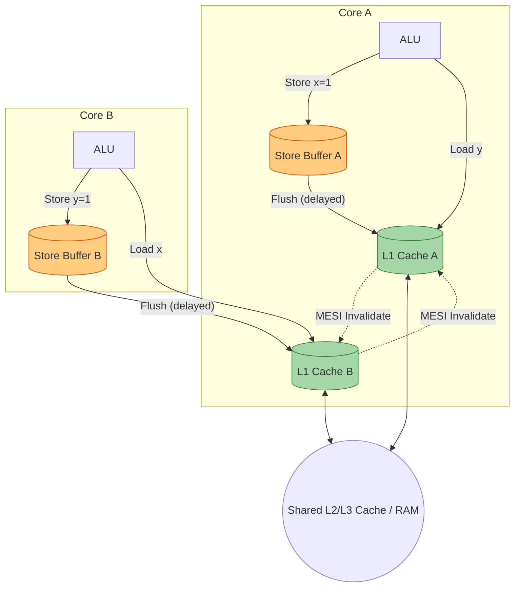
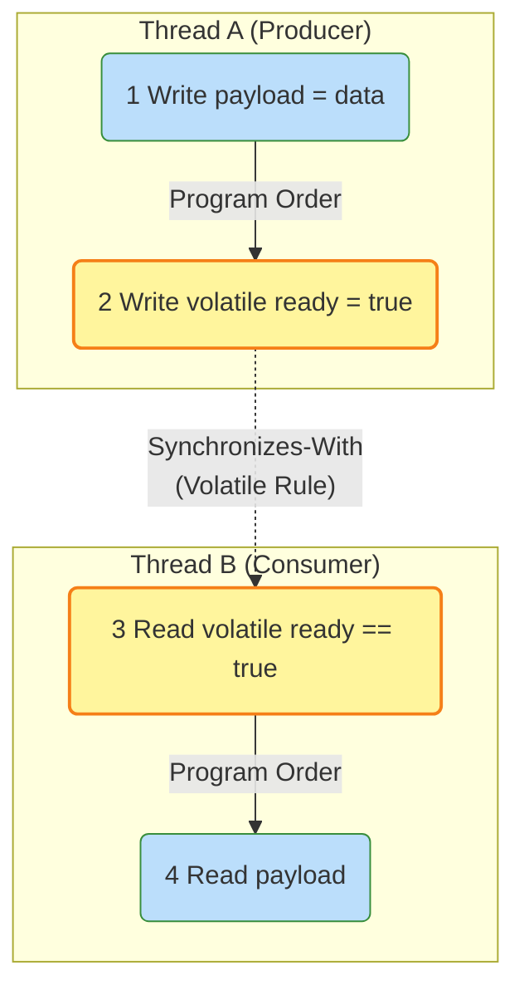

---
tags:
  - concurrency
  - jmm
  - memory-model
  - happens-before
  - volatile
  - architecture
aliases:
  - Java Memory Model
  - JMM and Volatile
---

# L1.CONC.07: Java Memory Model, happens-before, volatile

> [!abstract] О лекции
> **Java Memory Model (JMM)** — это не описание того, как физически работает кэш процессора (хотя они тесно связаны). Это строгая **спецификация (юридический контракт)** из JLS (Java Language Specification) Chapter 17, которая математически определяет частичный порядок (`partial order`) выполнения операций.
> Для инженера уровня Expert/Architect критически важно понимать не просто бытовую мантру "volatile сбрасывает кэш" (это сильное упрощение для джуниоров), а то, как именно JMM запрещает конкретные перестановки инструкций (Instruction Reordering) оптимизирующим компилятором (JIT) и самим железом процессора через механизм **Memory Barriers** (Барьеры памяти). И, что еще важнее, как эта абстрактная спецификация транслируется в суровые инструкции ассемблера (`lock addl`, `dmb`) на кардинально разных архитектурах (x86 vs ARM).

---
## 1. Фундаментальная проблема: Sequential Consistency — это иллюзия

Для подавляющего большинства разработчиков интуитивная ментальная модель исполнения их кода выглядит так: "Мой код выполняется процессором строго строка за строкой, сверху вниз, и если я в Потоке А записал значение в память, Поток Б мгновенно это увидит". Эта идеальная утопия в Computer Science называется **Sequential Consistency (SC)** или Последовательная Согласованность.

На уровне Expert вы обязаны осознать горькую правду: **SC — это чисто теоретическая абстракция, которая в современном высокопроизводительном железе физически не существует по умолчанию.**

### 1.1. Формальное определение (Leslie Lamport, 1979)
Математическая модель последовательной консистентности (SC) строго требует выполнения двух фундаментальных условий:
1.  **Program Order:** Результат выполнения любой многопоточной программы должен быть точно таким же, как если бы атомарные операции всех процессоров выполнялись в какой-то единой глобальной последовательности, а операции каждого отдельного процессора выполнялись строго в том порядке, который задан его исходным кодом.
2.  **Atomicity & Visibility:** Каждая операция чтения или записи в оперативную память выполняется абсолютно атомарно и её результат мгновенно виден всем остальным участникам системы.

> *Архитектурная метафора:* Представьте, что оперативная память — это одна единственная тетрадь, а 64 ядра процессора сидят вокруг стола. Только одно ядро может держать ручку (иметь доступ к шине) в данный наносекундный момент. Оно пишет число, кладет ручку, следующее ядро берет ручку и читает. Это и есть SC. Идеально просто, но чудовищно медленно.

### 1.2. Почему SC физически убивает производительность (Микроархитектурный уровень)
Чтобы аппаратно обеспечить строгую SC, процессор должен был бы после каждой инструкции `STORE` останавливать свой конвейер вычислений (Pipeline Stall) и покорно ждать, пока электрический сигнал дойдет по шине материнской платы до планок главной DRAM памяти и вернется сигнал подтверждения (Ack). Это блокировало бы процессор на сотни тактов при *каждой* записи.
Современные суперскалярные CPU (x86, ARM, POWER) агрессивно и безжалостно нарушают SC ради скорости, используя следующие аппаратные механизмы:



1.  **Store Buffers (Буферы записи):**
    Когда ядро делает операцию `STORE x = 1`, оно физически не пишет байты в L1 кэш сразу (это слишком долго, так как требует эксклюзивного захвата cache line по протоколу MESI). Оно молча пишет это значение в свой микроскопический, супербыстрый приватный FIFO буфер — **Store Buffer**.
    *   *Эффект Иллюзии:* Текущее ядро "считает", что оно успешно записало данные, и мгновенно переходит к следующей инструкции. Но все остальные ядра в системе **физически не видят** эту запись, пока контроллер кэша не соизволит сбросить (flush) этот буфер в настоящий L1 кэш.
    *   *Store-to-Load Forwarding:* Если это же самое ядро сразу после записи попытается прочитать `x`, оно хитро возьмет актуальное значение не из L1 кэша, а прямо из своего Store Buffer. Для него консистентность визуально сохранена. А вот для его соседа — фатально нарушена.

2.  **Invalidate Queues (Очереди инвалидации):**
    Протоколы когерентности кэшей (такие как MESI) строго требуют отправить сообщение "Invalidate x" всем другим ядрам перед записью поверх старых данных. Чтобы ядро-писатель не простаивало в ожидании подтверждений ("Ack") от всех соседей, ядра-получатели просто кладут эти сообщения о смерти кэш-линий в свою локальную очередь входящих инвалидаций (Invalidate Queue) и сразу шлют "Ack", продолжая работу, применяя сами инвалидации "когда-нибудь потом в свободное время".
    *   *Эффект Иллюзии:* Ядро может успешно прочитать "протухшее" старое значение `x` из своего L1 кэша, хотя сообщение о том, что эти данные нужно срочно уничтожить, уже физически лежит у него в почтовом ящике (Invalidate Queue).

3.  **Superscalar Out-of-Order Execution (Внеочередное исполнение):**
    Процессор на лету анализирует машинный код и динамически меняет порядок исполнения инструкций (Instruction Reordering), если между ними нет жесткой зависимости по данным. Это делается, чтобы максимально плотно загрузить простаивающие исполнительные блоки (ALU/FPU).

### 1.3. Litmus Test: Знаменитый пример разрушения интуиции
Рассмотрим классический пример (Dekker's example), который наглядно доказывает, что Store Buffers вдребезги ломают интуицию программиста.

Дано глобальное состояние: `int x = 0, y = 0;`

| Поток 1 (Ядро Core A) | Поток 2 (Ядро Core B) |
| :--- | :--- |
| `x = 1;` // (Операция Store x) | `y = 1;` // (Операция Store y) |
| `int r1 = y;` // (Операция Load y) | `int r2 = x;` // (Операция Load x) |

**Вопрос Архитектора:** Могут ли локальные переменные `r1` и `r2` обе оказаться равны `0` после выполнения кода?

*   **В идеальной модели SC:** **НЕТ**. Это математически невозможно. Либо запись `x=1` случится в глобальном времени раньше чтения `r2=x`, либо запись `y=1` раньше `r1=y`. Кто-то из них обязан быть первым. Состояние `(0, 0)` недостижимо.
*   **В суровой реальности (JMM / Железо x86 TSO):** **ДА, МОГУТ И БУДУТ**.
    1.  Core A пишет `1` в свой локальный Store Buffer. (В общую память сигнал еще не ушел).
    2.  Core B параллельно пишет `1` в свой локальный Store Buffer. (В память не ушло).
    3.  Core A выполняет чтение `y`. Оно идет в память (или общие кэши), а там лежит старый `0`. -> Итог: `r1 = 0`.
    4.  Core B выполняет чтение `x`. Оно идет в память, а там лежит старый `0`. -> Итог: `r2 = 0`.
    5.  Только после всего этого Store Buffers неспешно сбрасываются в память. Но уже слишком поздно, бизнес-логика сломана.

Это физическое явление перестановки (или задержки) инструкции `Store` и следующего за ней `Load` называется **StoreLoad Reordering**. JMM по умолчанию абсолютно легально разрешает это поведение.

### 1.4. Роль JMM и концепция SC-DRF
Поскольку SC недостижима аппаратно без чудовищных тормозов, спецификация Java (начиная с революционного Java 5, JSR-133) вводит так называемую "слабую" (weak) модель памяти.

**JMM дает индустрии следующую железобетонную гарантию (называемую SC-DRF):**
> Любые многопоточные программы, которые **полностью свободны от гонок данных (Data-Race-Free - DRF)**, будут исполняться на любой платформе точно так же, как если бы они работали на идеальной машине с **Sequentially Consistent (SC)** поведением.

Это фундаментальный контракт:
*   **Вы (как Senior-разработчик):** Обязуетесь использовать инструменты синхронизации (`volatile`, `synchronized`, `final` поля, примитивы из `java.util.concurrent`) абсолютно везде, где есть конкурентный доступ к общим изменяемым данным, устраняя саму возможность Data Race.
*   **JMM (JVM + Компилятор + Hardware):** В ответ гарантирует вам, что все агрессивные перестановки инструкций в железе будут надежно скрыты от ваших глаз, и вы получите предсказуемое SC-поведение.

### 1.5. Определение Data Race и Out-Of-Thin-Air Safety
Формально в спецификации JMM состояние **Data Race** (гонка данных) возникает, когда одновременно соблюдаются три условия:
1.  Два или более потоков параллельно обращаются к одной и той же переменной в памяти.
2.  Хотя бы одно из этих обращений — это операция изменения (Write).
3.  Между этими двумя обращениями не установлен строгий порядок **happens-before**.

Если Data Race существует, программа считается некорректно синхронизированной. Однако, есть огромное отличие Java от C++. В C++ Data Race — это **Undefined Behavior** (UB: может произойти что угодно, вплоть до форматирования диска или уязвимости). Java, как безопасный язык, даже при Data Race обеспечивает базовую безопасность **Out-Of-Thin-Air (OOTA)**.
*   *OOTA Safety:* Переменная в Java физически не может принять случайное значение, которое никогда не было записано в нее ни одним потоком (нельзя прочитать случайный системный мусор из чужой RAM, что предотвращает кражу паролей).
*   *Но (Внимание):* Вы всё еще можете легко увидеть фатальное нарушение порядка инициализации (например, прочитать `null` вместо готового объекта в паттерне Singleton), увидеть 64-битный разрыв данных (word tearing для не-volatile `long`/`double`) или уйти в бесконечный цикл из-за агрессивного кэширования переменной JIT-компилятором прямо в регистре CPU.

**Резюме раздела:** Sequential Consistency — это удобная архитектурная ложь, которую мы покупаем ценой правильной расстановки барьеров синхронизации (установления отношений Happens-Before). Без правильной синхронизации мы лицом к лицу сталкиваемся с сырой, хаотичной физической реальностью работы микро-буферов процессора.

---
## 2. Формализация Happens-Before (HB)

Отношение **Happens-Before** — это концепция не про физическое время на часах (wall-clock time). Это математическая концепция про **гарантированную видимость эффектов**.
В JMM выполнение любой программы строго моделируется как огромный граф взаимосвязанных **Действий (Actions)**.

### 2.1. Определения: Actions и Partial Order

Прежде чем говорить о бизнес-правилах, определим базовые сущности JMM.

1.  **Action (Действие):** Минимальный, неделимый атомарный шаг исполнения с точки зрения JMM. Включает:
    *   Простое Чтение/запись переменных (обычных и `volatile`).
    *   Успешная Блокировка/разблокировка монитора (`lock`/`unlock` через `synchronized`).
    *   Запуск потока (`Thread.start()`) и его остановка.
    *   *Архитектурный Нюанс:* Составные высокоуровневые операции (типа `i++`) — это **не** одно действие, а сложная последовательность из трех действий (Read -> Modify -> Write), которые могут быть прерваны на любом шаге.

2.  **Happens-Before Order ($\xrightarrow{hb}$):** Это математическое отношение **строгого частичного порядка** (оно irreflexive, transitive, antisymmetric) над множеством всех Actions.
    *   **Ключевой инсайт Senior'а:** Если по спецификации действие $A \xrightarrow{hb} B$, это **ВООБЩЕ НЕ** означает, что действие $A$ физически выполнится раньше действия $B$ в кремнии процессора.
    *   Это означает лишь одно: **конечный результат** (эффект в памяти) действия $A$ должен быть гарантированно *виден* действию $B$.
    *   Если умный JIT-компилятор (C2) может математически доказать, что физическая перестановка $B 	o A$ никак не изменит результат выполнения *внутри одного текущего потока* (intra-thread semantics), компилятор **имеет полное легальное право** переставить их местами (или слить вместе), даже если формально в коде $A \xrightarrow{hb} B$ (согласно Program Order).

### 2.2. Из чего логически строится граф HB?

Отношение $\xrightarrow{hb}$ не возникает из воздуха. Оно является результатом транзитивного замыкания (склеивания) двух других фундаментальных отношений:
$$ HB = PO \cup SW \cup (Transitivity) $$

#### 1. Program Order (PO) — Порядок следования в исходном коде
В рамках **одного отдельно взятого** потока все действия строго упорядочены так, как они написаны программистом в исходном коде Java (с поправкой на ветвления `if/while`).
*   Если строка `x = 1` стоит физически выше строки `y = 2`, то $W(x) \xrightarrow{po} W(y)$.
*   *Опасный Нюанс:* Для обычных (не-volatile) переменных компилятор может смело нарушить физический порядок исполнения на процессоре, если для самого потока сохраняется иллюзия PO (так называемая *as-if-serial semantics*).

#### 2. Synchronizes-With (SW) — Межпоточная аппаратная синхронизация
Это и есть тот самый мост, соединяющий графы разных потоков. Отношение SW возникает исключительно между парами специфических "сильных" действий (семантика Release / Acquire).
*   **Volatile:** Успешная запись в volatile переменную $v$ *synchronizes-with* абсолютно любым последующим (по времени) чтением этой же переменной $v$.
*   **Monitor:** Снятие блокировки (Unlock) монитора $m$ *synchronizes-with* любым последующим захватом (Lock) этого же самого монитора $m$.
*   **Thread Lifecycle:** Вызов `Thread.start()` *synchronizes-with* самым первым действием внутри метода `run()` нового потока. Самое последнее действие в потоке *synchronizes-with* моментом возврата из блокирующего вызова `thread.join()` в ожидающем потоке.

### 2.3. Правила Happens-Before (Детальный разбор JLS 17.4.5)

Рассмотрим, как именно формируется граф HB на практике.

1.  **Monitor Lock Rule:**
    $$ Unlock(M) \xrightarrow{sw} Lock(M) $$
    Это архитектурно создает полный барьер памяти. Абсолютно всё, что было записано в память до выполнения `unlock`, гарантированно "вымывается" в общую RAM и становится видимым тому счастливчику, который следующим сделает `lock` на этом же мониторе.
    *   *Смертельная Ошибка джуниора:* Два потока делают `lock`, но на *разных* объектах-мониторах. Отношение HB не возникает вообще. Состояния гонки и коррупция данных неизбежны, даже если код обвешан словом `synchronized`.

2.  **Volatile Variable Rule:**
    $$ Write(V) \xrightarrow{sw} Read(V) $$
    *   **Важный нюанс:** Это правило срабатывает, только если операция чтения произошла *физически позже* (в глобальном времени системы — Synchronization Order) операции записи. Вы физически не можете "синхронизироваться с будущим".

3.  **Transitivity (Транзитивность - Самое мощное и опасное правило):**
    $$ (A \xrightarrow{hb} B) \land (B \xrightarrow{hb} C) \implies A \xrightarrow{hb} C $$
    Именно это математическое правило позволяет нам использовать крошечную `volatile` переменную (или один `synchronized` блок) для гарантированной публикации **тысяч обычных** (не-volatile) переменных.

### 2.4. Эталонный Пример: Piggybacking (Паразитирование на чужом HB)

Этот пример наглядно демонстрирует, как знание графа HB позволяет писать высокопроизводительный lock-free код, виртуозно используя транзитивность.



```java
class MessagePasser {
    private int payload;      // Обычная переменная (НЕ volatile)
    private volatile boolean ready; // Флаг аппаратной синхронизации

    // Thread A
    void send(int data) {
        this.payload = data;  // Действие (1) Write Payload
        this.ready = true;    // Действие (2) Volatile Write (RELEASE семантика)
    }

    // Thread B
    void receive() {
        if (this.ready) {     // Действие (3) Volatile Read (ACQUIRE семантика)
            int data = this.payload; // Действие (4) Read Payload
            process(data);
        }
    }
}
```

**Полный анализ графа HB:**
1.  **В потоке A:** $(1) \xrightarrow{po} (2)$. (Жесткий Program Order в пределах метода гарантирует это).
2.  **Межпоточное ребро:** $(2) \xrightarrow{sw} (3)$. (Срабатывает Volatile Rule: запись `true` жестко синхронизируется с моментом чтения `true`).
3.  **В потоке B:** $(3) \xrightarrow{po} (4)$. (Снова работает Program Order).
4.  **Транзитивность (ФИНАЛ):**
    Так как $(1) \xrightarrow{hb} (2) \xrightarrow{hb} (3) \xrightarrow{hb} (4)$, мы математически выводим: $(1) \xrightarrow{hb} (4)$.

**Архитектурный Вывод:** Поток B на 100% гарантированно увидит корректное значение `payload`, записанное потоком A, хотя переменная `payload` физически не является ни `volatile`, ни `AtomicInteger`. Мы успешно "протащили" гарантию видимости целого мегабайта данных через одно единственное узкое горлышко (ребро) volatile-флага.

### 2.5. Что HB **НЕ** гарантирует (Common Architecture Pitfalls)

Для технического эксперта жизненно важно знать строгие границы применимости:

1.  **Вообще не гарантирует немедленности (Immediacy):**
    Если Поток A записал `volatile v = true`, Поток B может не увидеть это изменение *мгновенно* (наносекунда в наносекунду). Он увидит его строго при своем *следующем* обращении (чтении), которое физически пробьет кэш. Но спецификация JMM абсолютно не обязывает процессор активно "пушить" (выталкивать) изменения в другие ядра.
2.  **Не чинит логический Race Condition на операциях Write-Write:**
    Если два потока абсолютно одновременно пытаются записать данные в одну `volatile` переменную, HB вообще не определяет, кто из них победит. Это классический Data Race на уровне вашей бизнес-логики (Lost Update / Потерянное обновление), хотя технически с точки зрения самой спецификации JMM этот код валиден (так как все записи `volatile` атомарны и JVM не упадет).
3.  **Агрессивный Reordering обычных переменных вне защитной цепочки HB:**
    Если в примере "Piggybacking" выше переменные `payload` и `ready` не связаны строгой алгоритмической зависимостью (например, вы по ошибке написали код так, что вы пытаетесь читать `payload` *до* того, как проверили `ready`), JIT-компилятор вправе безжалостно переставить чтение `payload` на самый верх метода, и вы прочитаете случайный системный мусор из кэша еще до того, как флаг станет `true`.

---
## 3. Volatile: Глубокое погружение (Анатомия и Семантика)

Для Junior-разработчика ключевое слово `volatile` — это просто магический флажок, чтобы "разные потоки наконец-то увидели изменения переменной".
Для Staff Architect `volatile` — это **искусственно спроектированная дыра в агрессивных оптимизациях компилятора и процессора**, обеспечивающая математически строгие гарантии упорядочивания (Ordering) и видимости (Visibility) через сложнейший механизм Memory Barriers.

### 3.1. Видимость (Visibility) и аппаратный протокол MESI
В статьях часто пишут, что `volatile` "немедленно сбрасывает данные в RAM". Это технически безграмотно. В современных CPU прямая запись в RAM (DRAM) — это целая вечность (сотни тактов). Ждать этого — самоубийство для перформанса.

**Как физика работает на самом деле:**
`volatile` взаимодействует не с RAM, а с аппаратным протоколом когерентности кэшей материнской платы (чаще всего это протокол **MESI** — Modified, Exclusive, Shared, Invalid).
1.  **Volatile Write (Запись):** Поток А пишет значение в `volatile` переменную. Это действие заставляет физическое ядро процессора перевести свою кэш-линию L1 в состояние **Modified** и немедленно отправить электрический широковещательный сигнал **Invalidate (Уничтожить)** по внутренней шине всем другим ядрам, у которых есть локальная копия этой кэш-линии.
2.  **Volatile Read (Чтение):** Поток Б хочет прочитать эту же переменную. Его контроллер кэша видит, что его локальная кэш-линия L1 помечена флагом **Invalid** (из-за сигнала от А). Поток Б вынужден "сходить" по шине (интерконнекту) к ядру А (или в общий L3 кэш) и запросить самое свежее, актуальное значение, полностью игнорируя свой устаревший кэш L1/L2.

**Формальное Определение:** *Visibility* — это железобетонная аппаратная гарантия того, что запись, совершенная одним потоком, будет обязательно замечена другим потоком при его следующем чтении, успешно обходя локальные иллюзии (Store Buffers) и протухшие кэши.

### 3.2. Атомарность (Atomicity): Великое и опасное заблуждение
JMM гарантирует атомарность *исключительно* для элементарных операций **чтения** и **записи** самой переменной. И больше ни для чего.

*   `volatile int x`: операция `x = 5` (атомарна), операция `int y = x` (атомарна).
*   `volatile long y`: в современных 64-битных JVM чтение/запись атомарны. (Историческая справка: В очень старых 32-битных JVM без слова `volatile` запись 64-битного `long` могла разорваться планировщиком на две раздельные записи по 32 бита — этот краш называется *word tearing*. Использование `volatile` аппаратно "лечит" эту проблему, склеивая запись).

**Где эта иллюзия жестоко ломается:** Составные логические операции **Read-Modify-Write (RMW)**.
Классический пример: `x++` или `x = x + 1`.
Даже если `x` объявлен как `volatile`, эта строка кода на уровне процессора состоит из 3 независимых шагов:
1.  **Load:** Прочитать текущее значение `x` из кэша в регистр процессора.
2.  **Increment:** Дать команду ALU увеличить значение в регистре.
3.  **Store:** Записать новое значение из регистра обратно в `x`.

**Сценарий катастрофической гонки (Race Condition):**
Поток А читает 0 в регистр. Поток Б параллельно читает 0 в свой регистр. Оба ядра инкрементируют свои регистры (получают 1). Поток А пишет 1 в кэш. Поток Б пишет 1 в кэш, затирая работу А. Итог: `x == 1` (а по бизнес-логике должно быть 2). 
`volatile` здесь абсолютно **бессилен и бесполезен**, так как он никак не блокирует доступ к памяти на время выполнения шага 2 (вычислений). Для безопасных RMW операций вы обязаны использовать аппаратный CAS (через классы `AtomicInteger`) или тяжелый `synchronized`.

### 3.3. Упорядочивание (Ordering) и концепция "Roach Motel"
Это самая технически сложная и важная часть для эксперта.
JMM щедро разрешает компилятору (JIT) и процессору динамически менять местами инструкции для оптимизации конвейера (Instruction Reordering). Но ключевое слово `volatile` накладывает строгое вето на определенные типы перестановок.

В индустрии это часто описывают через семантику **Acquire / Release**:

1.  **Volatile Write имеет Release Semantics (Семантика Публикации):**
    *   *Строгое Правило:* Абсолютно все записи в переменные (и обычные, и volatile), сделанные в коде **до** volatile-записи, физически не могут быть перенесены оптимизатором **после** неё.
    *   *Метафора:* Volatile-запись — это жесткий "односторонний барьер" (или граница выхода). Всё, что вы "накодили" и изменили до неё, должно быть зафиксировано в памяти (стать видимым миру) до того, как миру станет видима сама `volatile` переменная.
    *   *Архитектурный Эффект:* Это то самое свойство, которое позволяет безопасно публиковать сложные объекты в DCL (Double-Checked Locking). Если вы сначала записали все поля объекта, а потом записали ссылку на него в `volatile` переменную, никто в системе не сможет увидеть новую ссылку, пока не увидит все заполненные поля.

2.  **Volatile Read имеет Acquire Semantics (Семантика Получения):**
    *   *Строгое Правило:* Абсолютно все операции чтения (и обычных, и volatile переменных), идущие в исходном коде **после** volatile-чтения, не могут быть перенесены компилятором **до** него.
    *   *Метафора:* Volatile-чтение — это строгий "барьер входа". Вы физически не можете начать спекулятивно работать с данными (запрашивать поля объекта из памяти), пока процессор не проверил актуальный статус флага.

**Официальная матрица разрешенных перестановок (JSR-133 Cookbook):**
*Вопрос:* Может ли 2-я операция перегнать (выполниться раньше) 1-ю?

| 1-я операция в коде \ 2-я операция | Normal Load/Store | **Volatile Load (Read)** | **Volatile Store (Write)** |
| :--- | :---: | :---: | :---: |
| Normal Load/Store | Да | Да | **НЕТ** (Семантика Release) |
| **Volatile Load (Read)** | **НЕТ** (Семантика Acquire) | **НЕТ** | **НЕТ** |
| **Volatile Store (Write)** | Да | **НЕТ** (Барьер StoreLoad) | **НЕТ** |

*   **НЕТ (Release):** Обычные операции физически не могут "уплыть" вниз за Volatile Store.
*   **НЕТ (Acquire):** Обычные операции физически не могут "всплыть" вверх перед Volatile Load.
*   **Volatile Store -> Volatile Load:** Никогда, ни при каких условиях нельзя переставлять. Эта связка требует внедрения самого тяжелого и дорогого барьера в архитектуре: `StoreLoad`.

### 3.4. Hardware Mapping: Цена абстракций на кремнии

Как виртуальная машина (JVM) реализует эти абстрактные математические правила на реальных кусках кремния? Она агрессивно вставляет в машинный код инструкции **Memory Barriers (Fences - Барьеры)**.

Барьеры памяти классифицируются взаимодействием двух операций: той, что находится в коде *до* барьера, и той, что *после*.

1.  **StoreStore Barrier (Барьер Запись-Запись):**
    *   *Где ставится:* Перед `volatile write`.
    *   *Физическая Суть:* "Процессор, убедись, что все предыдущие записи из твоего Store Buffer попали в L1 кэш до того, как ты сделаешь эту запись". Гарантирует, что другой поток не увидит опубликованный флаг `ready == true`, пока данные еще пустые.

2.  **StoreLoad Barrier (Тяжелая артиллерия Запись-Чтение):**
    *   *Где ставится:* После `volatile write` и перед `volatile read`.
    *   *Физическая Суть:* "Процессор, полностью сбрось (flush) все свои Store Buffers в общую память и дождись электрического подтверждения записи, прежде чем делать любые следующие чтения из кэша". Это предотвращает ситуацию из примера Dekker'a, когда процессор думает, что записал значение (а оно застряло в буфере), и тут же читает старое значение соседа.
    *   *Архитектурная Цена:* На процессорах x86 это транслируется в хардкорную инструкцию `lock addl $0x0,(%rsp)` или `mfence`. Это полностью останавливает конвейер процессора на десятки тактов.

3.  **LoadLoad Barrier (Барьер Чтение-Чтение):**
    *   *Где ставится:* Сразу после `volatile read`.
    *   *Физическая Суть:* "Запрети блоку предсказания ветвлений (Branch Predictor) начинать спекулятивное выполнение и загрузку следующих чтений в кэш, пока полностью не завершится проверка текущего флага".

4.  **LoadStore Barrier (Барьер Чтение-Запись):**
    *   *Где ставится:* После `volatile read`.
    *   *Физическая Суть:* "Не пиши ничего в общую память, пока не завершится это чтение".

**Критичные Архитектурные различия (x86 vs ARM):**
*   **x86/x64 (TSO - Total Store Order):** Архитектура исторически "сильная". Она *сама, на уровне железа* запрещает LoadLoad, LoadStore и StoreStore перестановки.
    *   Volatile Read: Транслируется в обычный `MOV` (полностью бесплатно, барьеры не вставляются).
    *   Volatile Write: Транслируется в `MOV` + тяжелый `StoreLoad` барьер (вставляется только для запрета перестановки с последующим возможным чтением).
*   **ARM (Weak Memory Model - Apple M1, AWS Graviton):** Архитектура "слабая" ради экономии батареи и кремния. Процессор физически может переставлять вообще всё.
    *   Volatile Read: Транслируется в спец-инструкцию `LDAR` (Load-Acquire).
    *   Volatile Write: Транслируется в спец-инструкцию `STLR` (Store-Release).
    *   Если серверный процессор старый (до эпохи ARMv8), JIT-компилятор вынужден вставлять явные, тормозящие `DMB` (Data Memory Barrier) инструкции до и после вызовов, что ощутимо бьет по Latency.

### Резюме раздела
Для Staff-инженера `volatile` — это не уличная магия, а жесткий технический контракт:
1.  **Видимость:** Обеспечивается через форсирование когерентности кэшей (протокол MESI).
2.  **Атомарность:** Гарантируется только для тривиальных load/store (RMW запрещен).
3.  **Упорядочивание:** Запись (`Write`) работает как **Release-барьер** (все, что было ДО, фиксируется намертво), Чтение (`Read`) работает как **Acquire-барьер** (все, что будет ПОСЛЕ, послушно ждет).
4.  **Цена (Профилирование):** На архитектуре x86 *запись* стоит дорого (из-за полного сброса конвейера StoreLoad), а *чтение* практически бесплатно. На архитектуре ARM дорого обходится и то, и другое (так как требуются явные барьеры Acquire/Release).

---
## 4. Final Fields Semantics (Скрытая магия JSR-133)

В древних версиях (до JSR-133, Java 1.4 и ранее) ключевое слово `final` для полей класса было просто синтаксическим ограничением для программиста ("компилятор ударит по рукам, если попытаешься переназначить"). В многопоточной среде они **вообще не давали никаких гарантий видимости**. Поток мог легально увидеть ссылку на полностью сконструированный объект, но при попытке прочитать его `final` поле внезапно получить `0` или `null` (дефолтное системное значение выделенной памяти). Это происходило потому, что физическая запись значения в поле и публикация ссылки на объект могли быть легко переставлены процессором (Store-Store reordering).

В современной Java `final` — это мощный **специальный тип барьера памяти**, обеспечивающий фундаментальную **безопасность инициализации (Initialization Safety)** объектов.

### 4.1. Гарантия JSR-133: Freeze Action (Заморозка)
JMM вводит специальное, жесткое правило для `final` полей. Оно математически гарантирует, что значения, записанные в `final` поля внутри конструктора класса, становятся гарантированно видимыми абсолютно всем потокам **строго до того**, как станет видимой сама ссылка на этот созданный объект.

Это достигается через системный механизм **Freeze Action** (Действие Заморозки) при выходе из конструктора.
*   **Семантика записи (Write Semantics):** В самом конце конструктора (после физической записи всех `final` полей, но перед возвратом управления вызывающему коду) JIT-компилятор принудительно вставляет барьер **StoreStore**. Он аппаратно запрещает процессору переставлять инструкции записи в `final` поля ниже этого барьера, а инструкцию публикации ссылки на сам объект — переставлять выше.
*   **Семантика чтения (Read Semantics):** Для экзотических RISC архитектур JMM строго требует, чтобы чтение значения `final` поля не кэшировалось спекулятивно процессором до того момента, как будет физически получен и проверен адрес самого объекта в памяти (Data Dependency).

### 4.2. Золотое Правило "Safe Construction" (Отсутствие утечки `this`)
Все эти красивые гарантии `final` работают **только и исключительно в том случае**, если объект считается платформой "корректно сконструированным" (Safe Construction).
**Критическое правило Архитектора:** Ссылка на текущий объект (`this`) ни при каких обстоятельствах не должна утечь (escape) из конструктора до его полного завершения.

Если `this` "утекает" (например, вы по неопытности записываете `this` в статический кэш, или регистрируете этот объект как слушатель событий `EventBus` прямо внутри его конструктора, или запускаете внутри конструктора фоновый поток, передав ему `this`), то другой поток может мгновенно подхватить и увидеть эту ссылку **до** того, как сработает спасительный Freeze Action (StoreStore барьер).

**Пример катастрофы (This Escape):**

```java
public class UnsafePublisher {
    final int answer;

    public UnsafePublisher(int val) {
        this.answer = val; // Инициализация final поля
        
        // ФАТАЛЬНАЯ ОШИБКА АРХИТЕКТУРЫ: 'this' утекает в мир 
        // ДО полного завершения работы конструктора!
        // Барьер StoreStore, который JIT поставит в конце, еще не сработал.
        GlobalRegistry.instances.add(this); 
    }
}
// Если фоновый Поток Б прямо сейчас прочитает GlobalRegistry.instances.get(0).answer
// Он имеет полное право увидеть там 0 (грязную память) вместо переданного значения, 
// несмотря на то, что поле помечено как final!
```

### 4.3. Транзитивная гарантия (Reachability) — Нюанс для Senior/Staff
Это самый тонкий и неочевидный момент спецификации. Гарантия видимости `final` распространяется **транзитивно** на весь граф объектов, который достижим через это `final` поле при инициализации.

Если у вас есть `final` поле, ссылающееся на **изменяемый** (mutable) объект (например, на массив `int[]` или `ArrayList`), то абсолютно любые записи в этот изменяемый объект, сделанные **строго внутри конструктора**, также попадают под защитный зонтик барьера Freeze Action.

**Продвинутый Пример с массивом:**
```java
public class SafeStates {
    private final String[] states; // Ссылка помечена как final, но сам массив - mutable

    public SafeStates() {
        states = new String[] {"A", "B", "C"}; 
        // Физические записи строк в кучу (heap writes) происходят именно здесь.
        // Магический Freeze Action в конце конструктора "замораживает" видимость
        // не только для самой ссылки 'states', но и для её содержимого "A", "B", "C".
    }

    public String getState(int i) {
        // Вызов из любого потока без локов гарантированно вернет "A", "B" или "C", 
        // а не null, благодаря транзитивности final.
        return states[i]; 
    }
    
    public void update(int i, String val) {
        // ВНИМАНИЕ: А вот эта мутация уже НЕ БЕЗОПАСНА без синхронизации!
        // Freeze-барьер работает только единожды, для записей В КОНСТРУКТОРЕ.
        // Любые мутации после создания требуют локов или volatile массива.
        states[i] = val; 
    }
}
```
**Архитектурный Инсайт:** Именно благодаря этому мощному транзитивному правилу классические неизменяемые объекты (Immutable Objects), все поля которых помечены как `final` (такие как `String`, `Integer` или `Record` в новых Java), являются **абсолютно потокобезопасными** (thread-safe by default) без применения какой-либо дорогостоящей дополнительной синхронизации. Их можно смело передавать между потоками без оглядки на кэши.

---
## 5. Глубокий анализ: Double-Checked Locking (DCL) и безопасная публикация

Паттерн DCL (Блокировка с двойной проверкой) — это классический паттерн "ленивой" инициализации тяжелых объектов (Lazy Initialization), который исторически стал самым известным хрестоматийным примером того, как наивное интуитивное понимание кода разбивается вдребезги о жестокую реальность оптимизирующих компиляторов и архитектуру конвейеров CPU.

### 5.1. Анатомия проблемы: Иллюзия безопасности

Рассмотрим стандартную, "логичную", но **фатально некорректную** реализацию паттерна Singleton (без использования `volatile`).

```java
// ANTI-PATTERN: Смертельно опасный Broken DCL
public class Singleton {
    private static Singleton instance; // Фатальная ошибка: Нет volatile!

    public static Singleton getInstance() {
        if (instance == null) {             // (1) Первая, оптимистичная проверка (без локов для скорости)
            synchronized (Singleton.class) { // Блокируем доступ для остальных
                if (instance == null) {     // (2) Вторая, пессимистичная проверка (уже под локом)
                    instance = new Singleton(); // (3) Инициализация и Публикация
                }
            }
        }
        return instance;
    }
}
```

**Интуиция наивного программиста:**
1.  Поток А заходит, видит `instance == null`.
2.  Захватывает тяжелый системный монитор (`synchronized`).
3.  Создает полностью готовый объект.
4.  Присваивает ссылку переменной `instance`.
5.  Поток Б заходит, проверяет (1), видит, что ссылка уже не `null`, не ждет блокировку и сразу возвращает готовый объект. Идеальная скорость.

**Физическая Реальность (Out-of-Order Execution):**
Безобидная строка (3) `instance = new Singleton();` математически **не является атомарной**. На уровне байт-кода JVM и, тем более, машинных инструкций процессора (micro-ops), это сложнейшая последовательность из нескольких действий.

### 5.2. Механика сбоя: Partially Constructed Objects (Полуфабрикаты)

В абстрактном псевдокоде работы процессора и аллокатора создание этого объекта выглядит так:

1.  `mem_ptr = allocate(sizeof(Singleton))` — Выделение "сырой", неинициализированной памяти в куче (Heap). Все поля физически занулены ОС (0, null, false).
2.  `ctor(mem_ptr)` — Вызов конструктора объекта. Вычисление и инициализация внутренних бизнес-полей полезными значениями.
3.  `instance = mem_ptr` — Публикация ссылки. Глобальная переменная `instance` перестает быть `null` и указывает на кусок памяти.

**Корень Проблемы:** Спецификация JMM и аппаратные архитектуры современных процессоров легально разрешают **перестановку инструкций (Instruction Reordering)**, если она не нарушает **Intra-thread semantics** (гарантированное поведение внутри одного текущего изолированного потока).
Для самого Потока А абсолютно неважно, в каком именно порядке аппаратно произойдут скрытые шаги 2 и 3 — он все равно обратится к ссылке на объект только после полного завершения обоих шагов (после выхода из блока).

Поэтому хитрый оптимизатор (JIT компилятор C2 или конвейер CPU) ради выигрыша пары тактов имеет полное право перестроить машинный код так:
1.  `mem_ptr = allocate(...)` — Выделили память.
2.  `instance = mem_ptr` — **КРИТИЧЕСКИЙ, ФАТАЛЬНЫЙ МОМЕНТ!** Ссылка (указатель) на "сырую" память уже опубликована в глобальную переменную. Все другие потоки внезапно видят, что `instance != null`.
3.  `ctor(mem_ptr)` — А вот только теперь мы неспешно инициализируем поля объекта (пишем туда данные).

**Сценарий катастрофы (Data Race) в Production:**
1.  **Поток А** заходит в блок и выполняет аллокацию и присваивание (шаги 1 и 3 переставленного кода). Медленный Конструктор еще **физически не отработал**.
2.  **Поток А** внезапно прерывается ядром ОС (Preemption) из-за квантования времени.
3.  **Поток Б** радостно заходит в `getInstance()`, выполняет быструю проверку без блокировок (1).
4.  **Поток Б** видит, что `instance != null` (там уже есть адрес). Он **вообще не ждет** на `synchronized`, а немедленно возвращает этот недоделанный объект в бизнес-логику.
5.  **Поток Б** пытается использовать поля объекта (например, делает `instance.configMap.get("db_url")`).
6.  Поскольку конструктор (шаг 2) в прерванном Потоке А еще не успел выполниться, поле `configMap` в памяти физически равно `null` (дефолтное значение сырой памяти).
7.  **Результат:** Мистический `NullPointerException` или запись нулевых балансов в базу данных в месте кода, которое при анализе кажется абсолютно надежным.

### 5.3. Архитектурное Решение 1: Volatile и гарантии Happens-Before

Добавление всего одного слова `volatile` к переменной `instance` полностью и изящно исправляет эту ситуацию (но только начиная с Java 5 (JSR-133), в Java 1.4 это всё еще не работало).

```java
private static volatile Singleton instance;
```

**Почему это магически работает (Expert explanation):**
Это работает не просто из-за банального "volatile отключает кэширование L1". Оно спасает ситуацию исключительно из-за формирования графа **Happens-Before** рёбер и внедрения **Memory Barriers (StoreStore)**.

1.  **Жесткий запрет перестановки (StoreStore Barrier):**
    JMM строго запрещает процессору переставлять обычные записи (долгую инициализацию полей в конструкторе) с последующей финальной записью в `volatile` переменную.
    *   Компилятор аппаратно вставляет барьер `StoreStore` (на уровне железа) ровно между завершением работы конструктора и финальным присвоением ссылки переменной `instance`.
    *   Порядок выполнения теперь строго зафиксирован и не может быть нарушен: `ctor()` -> `StoreStore Barrier` -> `instance = ptr`. Никаких публикаций недоделанных объектов.

2.  **Математическая гарантия видимости (Транзитивность):**
    Установленное отношение Happens-Before гарантирует:
    *   Событие "Запись в `volatile instance`" (в Потоке А) $\xrightarrow{hb}$ Событие "Чтение `volatile instance`" (в Потоке Б).
    *   Все действия *до* записи в потоке А (выполнение конструктора и инициализация бизнес-полей) $\xrightarrow{hb}$ Запись ссылки в `instance`.
    *   *По правилу Транзитивности:* Инициализация полей $\xrightarrow{hb}$ Чтение `instance` в Потоке Б.

Поток Б теперь либо честно увидит `null` (и покорно пойдет ждать на `synchronized`), либо увидит **на 100% полностью и корректно инициализированный** объект. Промежуточных, "грязных" состояний больше быть не может по законам физики.

### 5.4. Решение 2: Initialization-on-demand holder idiom (Рекомендация Архитектора)

Хотя DCL с `volatile` математически корректен, он громоздок, легко может быть написан с ошибкой (если забыть volatile) и работает чуть медленнее (из-за необходимости выполнять тяжелый `volatile read` с семантикой Acquire при абсолютно каждом обращении к синглтону).
Эксперты-архитекторы используют гениальную особенность самого загрузчика классов виртуальной машины (Class Loader), который аппаратно и на уровне спецификации JVM гарантирует потокобезопасность инициализации статических полей.

```java
// PREFERRED ARCHITECTURE: Bill Pugh Singleton Design
public class Singleton {
    private Singleton() {} // Приватный конструктор

    // Вложенный статический класс (Holder) загружается JVM ЛЕНИВО, 
    // строго только при самом первом физическом обращении к нему.
    private static class Holder {
        private static final Singleton INSTANCE = new Singleton();
    }

    public static Singleton getInstance() {
        return Holder.INSTANCE; // Быстро, безопасно, без volatile и локов
    }
}
```

**Механика под капотом JVM:**
1.  При старте большого приложения класс внешней обертки `Singleton` загружается в память, но вложенный класс `Holder` — нет. Никакая память под экземпляр синглтона не тратится. (Настоящая ленивая инициализация).
2.  При самом первом вызове клиентским кодом метода `getInstance()` JVM видит прямое обращение к внутреннему классу `Holder.INSTANCE`.
3.  Только в этот момент JVM начинает процесс загрузки (class loading) и инициализации класса `Holder`.
4.  Сама спецификация Java (JLS) жестко гарантирует, что фаза инициализации любого класса (выполнение его статических блоков и статических полей) происходит под капотом под **глобальной системной блокировкой JVM** (так называемый LC_CLINIT lock).
5.  Если сразу 100 потоков одновременно вызовут `getInstance()`, ядро JVM само поставит их в очередь и безупречно синхронизирует их без единой строчки вашего кода.

**Итог Архитектора:** Мы элегантно получаем идеальную ленивую загрузку (lazy load) и абсолютную потокобезопасность (thread-safety) **вообще без** использования явных и дорогих конструкций `synchronized` и `volatile` в бизнес-коде. Это самое красивое и индустриально правильное решение для синглтонов.

---
## 6. Чек-лист уровня Expert (Для Technical Interview)

1.  **Volatile Arrays (Массивы):**
    Делает ли объявление `private volatile int[] arr` все внутренние элементы этого массива `volatile`?
    *   *Ответ Эксперта:* Категорически НЕТ. Ключевое слово `volatile` в данном случае будет применяться **только к самой ссылке (указателю)** на массив. Если один поток поменяет ссылку на новый массив — другие это увидят. Но если поток сделает `arr[0] = 5`, элементы внутри массива **не имеют** абсолютно никаких HB (Happens-Before) гарантий видимости. Для безопасного конкурентного изменения внутренностей массива Архитектор обязан использовать специализированные классы `AtomicIntegerArray` или современные `VarHandle` (начиная с Java 9+).
2.  **Piggybacking (Паразитирование на чужом HB):**
    Можно ли алгоритмически синхронизировать обычную (не-volatile) переменную, сначала записав в неё новые данные, а сразу потом записав `true` в другую `volatile` переменную-флаг?
    *   *Ответ Эксперта:* Да. Этот мощный трюк называется "Piggybacking". Если поток А пишет `x=1` (обычное поле), затем `ready=true` (volatile), а поток Б читает `ready==true`, то по правилу Транзитивности HB он математически гарантированно увидит `x=1`. Этот сложнейший паттерн массово используется под капотом стандартной библиотеки `java.util.concurrent` (например, в реализации `FutureTask` или `ConcurrentHashMap`), но он крайне хрупок для использования в прикладном бизнес-коде (любой рефакторинг может его сломать).
3.  **Out-of-Thin-Air Safety (Безопасность "из воздуха"):**
    Может ли переменная из-за бага кэшей или гонки получить абсолютно случайное (мусорное) значение, которое никогда, ни одним потоком не записывалось в неё по коду?
    *   *Ответ Эксперта:* В суровом языке C++ (с его relaxed memory order) — теоретически да (из-за феномена causal loops). В языке Java спецификация JMM специально и с огромными усилиями спроектирована так, чтобы на уровне JVM аппаратно запретить OOTA (Out-Of-Thin-Air) values, даже при наличии жесточайших гонок данных (Data Races) в пользовательском коде. Вы никогда не прочитаете чужой пароль из RAM.
4.  **Синхронизация широких примитивов (long/double):**
    Почему для 64-битных примитивов (`long` и `double`) спецификация настоятельно рекомендует использовать `volatile` в 32-битных операционных системах, даже если вам не нужна синхронизация логики?
    *   *Ответ Эксперта:* Чтобы избежать фатального аппаратного бага "word tearing" (разрыв слова). На 32-битной архитектуре шина памяти не может пропихнуть 64 бита за один такт. JVM вынуждена делать запись в два этапа по 32 бита. Без защиты может возникнуть гонка: один поток записал старшие 32 бита нового числа, его прервали, а другой поток перезаписал младшие 32 бита старого числа. Итог: в переменной образуется Франкенштейн — бессмысленное склеенное число, которого никогда не было в природе. Слово `volatile` делает эту 64-битную операцию монолитной и атомарной.

### Итоговое Заключение
**JMM (Java Memory Model)** — это сложнейший системный контракт про компромиссы между абстрактной красотой кода и суровой физикой кэшей процессора.
*   Используйте `volatile` как предельно легковесный и изящный механизм **безопасной публикации ссылок** (паттерн one-writer / many-readers) или как бинарный **флаг состояния системы** (сигнал на остановку).
*   Никогда не полагайтесь на `volatile` для сложной бизнес-логики и инвариантов (например, когда переменные `limit` и `count` всегда должны меняться вместе как единое целое, или для `i++`) — здесь вам поможет только старый добрый `synchronized` или `ReentrantLock`.
*   И всегда держите в голове физику профилирования: под капотом на серверах x86 `volatile` стоит практически бесплатно при *чтении*, но обходится очень дорого при *записи* (из-за полного сброса конвейера барьером StoreLoad). А на облачных серверах ARM (Graviton) дорого обходится и то, и другое (из-за аппаратных барьеров). Архитектура определяет всё.