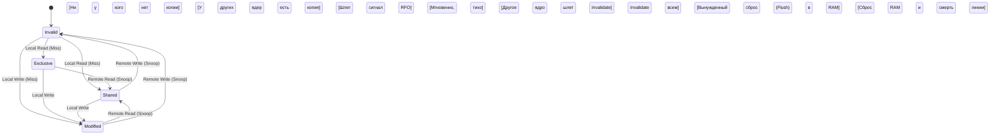
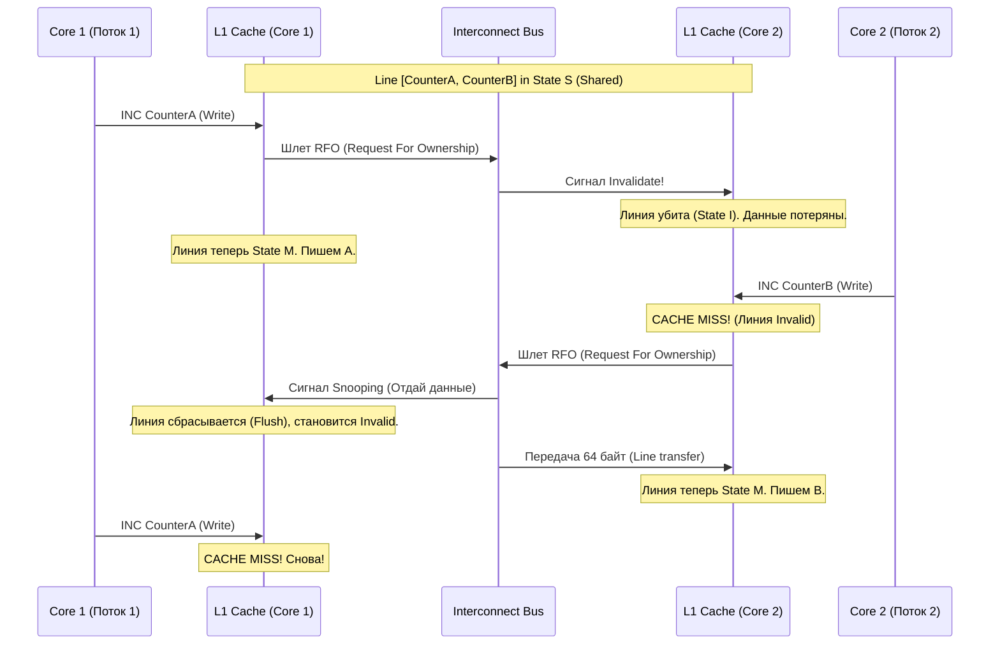

---
tags:
  - concurrency
  - false-sharing
  - cache-coherence
  - mesi
  - architecture
  - performance
aliases:
  - False Sharing
  - MESI Protocol
  - Cache Coherence
---
# L1.CONC.08: False sharing, cache coherence (MESI) 

> [!abstract] О лекции
> В современной вычислительной архитектуре наблюдается фундаментальный сдвиг парадигмы, который определяет большинство проблем производительности высоконагруженных систем (High-Load). С завершением эры масштабирования частот (Dennard scaling) и массовым переходом серверного железа к многоядерным процессорам, ответственность за финальную производительность сместилась с плеч аппаратного обеспечения на плечи системной архитектуры программного кода. 
> Для старших системных архитекторов (Senior Solution Architect) и ведущих инженеров (Staff Engineer) критически важным становится не просто знание абстрактной алгоритмической сложности (Big O notation), но и глубокое понимание микроархитектуры процессора. Это концепция, которую известный инженер Мартин Томпсон (LMAX) емко определил как **"Mechanical Sympathy" (Механическая симпатия)**.

---
## 1. Введение: Эпоха многоядерности и проблема "Стены памяти"

Центральной проблемой в архитектуре High-Load является фундаментальный разрыв между скоростью процессора и скоростью физического доступа к оперативной памяти, известный в индустрии как **"Memory Wall" (Стена Памяти)**. В то время как ядра процессора могут молотить инструкции за ничтожные доли наносекунды (0.2 нс), физический доступ к главной памяти (DRAM) занимает бесконечно долгие десятки и сотни наносекунд (60-100 нс). 

Для смягчения этого чудовищного разрыва инженеры железа используют сложную иерархию сверхбыстрой кэш-памяти (L1, L2, L3) прямо на кристалле CPU. Однако в современных симметричных мультипроцессорных системах (SMP) и сложных серверных архитектурах с неоднородным доступом к памяти (NUMA), само наличие множества независимых кэшей у разных ядер мгновенно порождает сложнейшую проблему их аппаратной синхронизации — **когерентность кэша (Cache Coherence)**.

---
## 2. Микроархитектура подсистемы памяти

Для детального, профессионального понимания феномена ложного разделения (False Sharing) необходимо под микроскопом рассмотреть анатомию процессорной кэш-памяти. Кэш CPU не является просто быстрым HashMap хранилищем "ключ-значение"; это невероятно сложная аппаратная структура, оперирующая непрерывными блоками байт строго фиксированного размера.

### 2.1 Иерархия кэшей и физический принцип локальности

Современные мощные процессоры (Intel Xeon, AMD EPYC, ARM Neoverse) используют жесткую многоуровневую иерархию:
*   **L1 (Level 1):** Самый быстрый и маленький. Физически разделен на кэш инструкций (L1i) и кэш данных (L1d). Он абсолютно приватен для каждого физического ядра. Размер обычно составляет скромные 32-48 КБ. Задержка доступа (Latency) — порядка 3-4 тактов процессора ($\sim 1$ нс). Попадание в L1 — цель любого оптимизатора.
*   **L2 (Level 2):** Унифицированный кэш (содержит и данные, и инструкции вперемешку). Обычно приватен для конкретного ядра, но может быть архитектурно общим для малого кластера ядер (например, E-cores в некоторых мобильных архитектурах). Размер варьируется от 256 КБ до внушительных 2 МБ на ядро. Задержка — 10-14 тактов ($\sim 3-4$ нс).
*   **L3 (Last Level Cache, LLC):** Гигантский и общий для абсолютно всех ядер на кремниевом кристалле (или в пределах модуля CCX у AMD архитектуры). Размер может достигать сотен мегабайт (например, серверный AMD 3D V-Cache содержит 768 МБ L3). Он служит главной точкой синхронизации и сброса данных перед мучительным выходом в медленную RAM. Задержка — 40-70 тактов ($\sim 15-20$ нс).

Эффективность этой сложной многослойной иерархии базируется на двух железобетонных принципах:
1.  **Временная локальность (Temporal Locality):** Если программа запросила эти данные прямо сейчас, они с колоссальной вероятностью потребуются ей снова в ближайшие микросекунды (например, счетчик в цикле).
2.  **Пространственная локальность (Spatial Locality):** Если процессор запросил байт по определенному адресу памяти, очень высока математическая вероятность, что следующим он запросит соседние с ним адреса (например, обход массива или чтение полей одного объекта).

### 2.2 Анатомия кэш-линии (Cache Line)

Именно принцип пространственной локальности жестко диктует гранулярность обмена данными. Минимальной неделимой единицей передачи данных между оперативной памятью (DRAM) и внутренним кэшем процессора является не единичный байт, и не 64-битный Long, а массивная **кэш-линия (Cache Line)**. В подавляющем большинстве современных серверных и десктопных архитектур (x86-64 и ARM) физический размер кэш-линии составляет ровно **64 байта**.

**Структура записи в аппаратном кэше:**
| Компонент кэш-записи | Описание (Роль в железе) |
| :--- | :--- |
| **Tag (Тег адреса)** | Старшие биты физического адреса ОЗУ, однозначно идентифицирующие, откуда пришел этот блок памяти. |
| **Data Block (Блок данных)** | Непосредственно полезная нагрузка — 64 байта (512 бит) непрерывных данных из RAM. |
| **Flag Bits (Флаги состояния)** | Системные биты процессора, определяющие статус этой линии согласно встроенному протоколу когерентности (MESI/MOESI), бит валидности (Valid) и важнейший бит модификации (Dirty - грязные ли данные). |

**Смертельный нюанс архитектуры:** Когда ваше ядро наивно запрашивает всего один маленький байт (например, `boolean` флаг состояния), безжалостный контроллер памяти физически загружает из RAM всю гигантскую 64-байтовую линию, содержащую этот байт, в L1 кэш этого конкретного ядра. Если соседние 63 байта содержат системные переменные, активно используемые и изменяемые другими потоками на других ядрах, возникает огромный риск деградации под названием ложное разделение.

### 2.3 Ассоциативность кэша и конфликты вытеснения (Way Contention)

Кэши организованы не как сплошной массив, а как наборы путей (sets). Адрес памяти физически разбивается контроллером на три части: Tag, Set Index и Block Offset.
*   **Direct Mapped Cache:** Каждому физическому адресу памяти математически соответствует ровно одно жесткое место в кэше. Это дешево в производстве, но вызывает чудовищно частые коллизии (если адреса совпадают по хэшу).
*   **Set Associative Cache:** Каждому адресу соответствует гибкий набор из $N$ линий ($N$-way associative). Современные L1 кэши часто имеют продвинутую ассоциативность 8-way или 12-way, L2 кэши — 16-way и выше.

Понимание ассоциативности критически важно для профилирования, так как эффект False Sharing может многократно усугубляться аппаратными "конфликтами путей" (way contention), когда часто используемые кэш-линии постоянно вытесняют друг друга из-за ограниченности набора, даже если они алгоритмически логически не пересекаются в вашем коде.

---
## 3. Протокол когерентности MESI: Механика синхронизации

В современной многоядерной системе каждое ядро (Core) имеет свой абсолютно собственный, изолированный L1/L2 кэш. Это фундаментально создает проблему когерентности: если Ядро A изменяет данные объекта в своем кэше, Ядро B, которое тоже имеет копию этого же объекта у себя в L1, рискует работать с фатально устаревшим значением. Для предотвращения этого хаоса процессоры используют встроенный, хардкорный аппаратный протокол когерентности (своеобразный распределенный консенсус между ядрами). Наиболее распространенным базовым вариантом которого является протокол **MESI**.

### 3.1 Состояния MESI (Конечный автомат)

Протокол MESI — это строгий конечный автомат (State Machine), описывающий жизненный цикл и состояние каждой отдельной кэш-линии (64 байт). Сама аббревиатура расшифровывается по названиям четырех возможных состояний линии:

| Аппаратное Состояние | Описание физики процесса | Доступность для чтения | Доступность для записи | Синхронизация с ОЗУ (RAM) | Владение линией |
| :--- | :--- | :--- | :--- | :--- | :--- |
| **M**odified (Изменен) | Линия присутствует *только* в этом конкретном кэше ядра и была изменена процессором (помечена как "dirty"). | Да (Мгновенно) | **Да (Мгновенно, без шины)** | Данные еще НЕ сброшены (Cache $>$ RAM). В ОЗУ мусор. | Эксклюзивное (Только мы) |
| **E**xclusive (Эксклюзив) | Линия присутствует *только* в текущем кэше, но её байты идеально совпадают с памятью RAM ("clean"). | Да (Мгновенно) | Да (Тихий переход в State M) | Полностью Синхронизирована | Эксклюзивное |
| **S**hared (Разделен) | Линия может одновременно присутствовать в кэшах *других* ядер. Данные никем не изменены. | Да (Мгновенно) | **Нет (Требуется дорогая инвалидация соседей!)** | Полностью Синхронизирована | Совместное (Толпа читателей) |
| **I**nvalid (Недействителен) | Линия логически мертва, не содержит валидных данных (мусор). При обращении будет долгий кэш-промах. | Нет (Блокировка и поход в RAM) | Нет (Требуется RFO) | N/A | Нет |



### 3.2 Матрица переходов состояний (Как это тормозит код)

Глубокое понимание этих переходов критически важно для диагностики просадок производительности. Переходы автомата инициируются либо самим локальным процессором (запросы `PrRd` - чтение, `PrWr` - запись), либо системными сигналами с кольцевой шины/интерконнекта (запросы соседей `BusRd`, `BusRdX`).

#### Сценарий 1: Чтение данных (Local Read Miss)
1.  Ядро A хочет прочитать переменную из памяти. Происходит физический промах в кэше (Состояние `Invalid`). Ядро блокирует свой конвейер.
2.  Контроллер Ядра A отправляет широковещательный сигнал `BusRd` (Bus Read) по шине материнской платы.
3.  Все остальные ядра (Snoopers - Шпионы) обязаны прерваться и проверить свои кэши.
    *   Если у Ядра B эта линия лежит в состоянии `M` (Modified), оно обреченно сбрасывает свои "грязные" данные в медленную память (Writeback) и переводит свой статус в `S` (Shared). Ядро A наконец-то загружает свежие данные тоже в состоянии `S`. (Очень долгий процесс).
    *   Если у Ядра B линия в `E` или `S`, оно просто переходит/остается в `S`. Ядро A загружает данные в `S`.
    *   Если ни у кого в системе нет этих данных, Ядро A загружает их напрямую из RAM и ставит себе элитный статус `E` (Exclusive).

#### Сценарий 2: Запись данных (Local Write) - Источник тормозов
1.  **Если State `M`:** Запись происходит мгновенно, абсолютно локально в L1. Самый быстрый и желанный сценарий для инженера.
2.  **Если State `E`:** Тихий переход в состояние `M` происходит локально, так как ядро точно знает, что оно — единственный и эксклюзивный владелец этих байт во всей вселенной.
3.  **Если State `S`:** Это критический, фатальный момент для возникновения эффекта False Sharing.
    *   Ядро A физически **не имеет права** писать поверх данных, так как оно знает, что другие ядра прямо сейчас могут активно читать свои копии.
    *   Ядро A ставит конвейер на паузу и отправляет по шине грозный сигнал `BusRdX` (Bus Read Exclusive) или **RFO (Request For Ownership - Запрос на монопольное владение)**.
    *   Абсолютно все остальные ядра в системе, имеющие у себя эту копию (в State `S`), обязаны аппаратно убить (инвалидировать) её у себя (переход в State `I` - Invalid) и послать ответ "Ack".
    *   И только после получения всех подтверждений "Ack" о смерти копий, Ядро A торжественно переходит в состояние `M` и выполняет запись одного несчастного байта.

**Вывод Архитектора:** Именно тяжелая системная операция **RFO (Request For Ownership)** является наиболее разрушительной и дорогостоящей в контексте False Sharing, так как она требует масштабной коммуникации ядер через шину QPI/UPI, наглухо блокируя исполнение полезных инструкций бизнес-логики.

### 3.3 Расширенные протоколы: MOESI (AMD) и MESIF (Intel)
Современные вендоры используют сильно оптимизированные, проприетарные версии базового MESI.
*   **AMD (Протокол MOESI):** Добавляет гениальное состояние **Owned (O)**. Оно позволяет обмениваться "грязными" (modified) данными напрямую между кэшами разных ядер без мучительного и долгого сброса их в главную память (RAM). Если Ядро A имеет линию в состоянии `O` (оно хозяин), а Ядро B запрашивает чтение, Ядро A передает данные по скоростной шине Infinity Fabric напрямую Ядру B. Оба ядра помечают линию как `O` и `S`. Это колоссально снижает нагрузку на контроллер памяти, но сильно увеличивает инженерную сложность снупинга.
*   **Intel (Протокол MESIF):** Добавляет состояние **Forward (F)**. В старом стандартном MESI, если сразу 10 ядер имеют линию в состоянии `S`, и тут приходит 11-е ядро с запросом на чтение, возникает хаос: неясно, кто именно из 10 должен отдать данные. В MESIF только одно строго назначенное ядро (имеющее статус `F`) имеет право и обязано ответить на широковещательный запрос, предотвращая дикий избыточный спам-трафик на кольцевой шине Intel.

---
## 4. Феномен False Sharing (Ложное Разделение): Анатомия проблемы

**False Sharing** — это катастрофическая ситуация деградации, которая возникает, когда два или более рабочих потока, сидящих на разных физических ядрах, интенсивно и параллельно изменяют переменные, которые **логически абсолютно независимы** (разные объекты/поля в коде), но которые "случайно" физически расположились слишком близко друг к другу и попали в **одну и ту же 64-байтовую кэш-линию**.

С точки зрения бизнес-семантики вашей программы (Java/C++), потоки вообще не конфликтуют (они пишут по разным адресам `0x100` и `0x108`). Однако, с суровой точки зрения аппаратной логики когерентности процессора, любой измененный байт в пределах 64-байтового блока заставляет процессор рассматривать **весь блок как единое целое**. Глупая запись в один байт безжалостно инвалидирует (уничтожает) весь 64-байтовый блок целиком во всех остальных кэшах системы.

### 4.1 Эффект "Пинг-понга" кэш-линии (Cache Thrashing)

Рассмотрим классический пример смерти производительности из учебников:
*   Поток 1 работает с переменной `CounterA` (считает хиты кэша).
*   Поток 2 работает с переменной `CounterB` (считает промахи кэша).
*   Обе переменные типа `long` (8 байт) и аллокатор ОЗУ услужливо положил их рядом в памяти в одну линию.



1.  Поток 1 инкрементирует `CounterA`. Для этого его контроллер запрашивает эксклюзивное владение шиной (RFO).
2.  Кэш Потока 2, мирно содержащий `CounterB` (живущий на той же физической линии), принудительно переходит в состояние `Invalid` (Мертв).
3.  Поток 2 пытается инкрементировать свой `CounterB`. Происходит аппаратный кэш-промах (**Cache Miss**), так как его данные только что были инвалидированы соседом.
4.  Поток 2 от злости отправляет свой RFO. Поток 1 вынужден прерваться, сбросить измененную линию в общий кэш и перевести свой статус в `Invalid`.
5.  Вся жирная 64-байтовая линия физически, по проводам, перемещается от Потока 1 к Потоку 2 через L3 кэш или интерконнект.

Этот дикий процесс повторяется миллионы раз в секунду циклически, создавая так называемый "пинг-понг" (cache thrashing). Вместо того чтобы работать с космической скоростью локального L1 кэша ($\sim 4$ такта), мощнейшие серверные процессоры вынуждены покорно ждать синхронизации через L3/Memory ($\sim 100-300$ тактов) на абсолютно каждую тривиальную операцию инкремента!

### 4.2 Влияние на Production и масштабируемость

False Sharing является самым жестоким классическим примером нарушения закона Амдала на самом низком аппаратном уровне. В такой ситуации добавление новых ядер на сервер не только не увеличивает пропускную способность, но часто катастрофически **снижает** её (отрицательное масштабирование).
*   **Латентность (Latency):** Резкий, необъяснимый рост времени (P99) выполнения базовых операций записи и бизнес-логики.
*   **Пропускная способность шины:** Полная сатурация (забивание) внутренней шины процессора мусорным служебным трафиком (snoop traffic).
*   **Кейс из индустрии (Netflix):** В одном из известных случаев миграции микросервисов на более жирные и дорогие инстансы AWS (с 16 до 48 vCPU), инженеры Netflix столкнулись с необъяснимым падением производительности всего кластера и ростом латентности на 50%. После месяцев отладки причиной оказалось банальное False Sharing прямо внутри системного кода JVM: конфликт происходил при обновлении поля кэша суперкласса (`_secondary_super_cache`) и параллельном чтении соседнего системного поля (`_secondary_supers`). Математическая вероятность их фатального попадания в одну кэш-линию при аллокации составляла ровно 12.5%, что идеально коррелировало с количеством "медленных", деградировавших серверов в облаке.

### 4.3 Терминология: True Sharing vs False Sharing
Архитектору крайне важно уметь четко различать истинное и ложное разделение:
*   **True Sharing (Истинное):** Потоки реально и осознанно конкурируют за одни и те же данные по бизнес-логике (например, делят глобальный `AtomicCounter` корзины под мьютексом). Аппаратное замедление здесь неизбежно, логично и решается только изменением самой бизнес-архитектуры (например, через шардирование метрик, MapReduce, lock-free очереди).
*   **False Sharing (Ложное):** Потоки конкурируют за *разные* данные, которым просто не повезло оказаться на одной физической линии 64 байт. Это замедление является чистым архитектурным паразитом, багом компиляции, и хирургически решается через принудительное выравнивание памяти (padding).

---
## 5. Инструментарий диагностики и обнаружения (Для DevOps и SRE)

Обнаружение False Sharing дедовским методом "пристального взгляда на исходный код" практически невозможно в крупных, многослойных системах. Инженеры обязаны использовать системное профилирование через аппаратные счетчики событий процессора (Hardware Performance Counters - PMU).

### 5.1 Симптомы болезни и метрики
Основные красные флаги на дашбордах Grafana или в выводе `top`:
*   **Высокий CPI (Cycles Per Instruction):** Значения CPI $> 2-3$ в простых вычислительных циклах (процессор не считает, а тупо ждет память).
*   **HITM (Hit Modified):** Уникальное аппаратное событие, когда запрос на доступ к памяти попадает в модифицированную (грязную) линию, принадлежащую кэшу *другого* ядра. Это самый надежный, 100% диагностический признак болезни.
*   **L1 Store Misses:** Аномально высокое количество кэш-промахов именно при операциях записи.
*   **Machine Clears (Сбросы):** Регулярные полные сбросы конвейера процессора из-за конфликтов жесткого порядка памяти (Memory Ordering violations).

### 5.2 Linux `perf`: Индустриальный анализ Cache-to-Cache (c2c)

Системная утилита `perf c2c` (появилась в ядре Linux 4.x, мощно улучшена для процессоров AMD в ядре 6.1+) является сегодня абсолютным стандартом де-факто для поиска этой проблемы. Она перехватывает события доступа к памяти и умно группирует их математически по физическим кэш-линиям.

#### Методология использования `perf c2c` на сервере:
1.  **Сбор профиля (Recording):**
```bash
# Запись событий (семплирование) с частотой 60000 Гц.
# Флаги: -g (сохранять граф вызовов/stacktrace), -u (только user-space код)
sudo perf c2c record -g -u -F 60000 -- ./my_target_application  
```
*Под капотом:* Утилита использует хардкорные прерывания `cpu/mem-loads/` и `cpu/mem-stores/`. Для процессоров Intel используется технология **PEBS** (Precise Event Based Sampling), позволяющая ловить инструкцию с точностью до байта. Для процессоров AMD используется аналог **IBS** (Instruction Based Sampling).
    
2.  **Анализ отчета (Reporting):**
```bash  
sudo perf c2c report --stats  
```
    Открывается в мощном интерактивном режиме TUI прямо в консоли.
    
3.  **Интерпретация таблицы "Shared Data Cache Line":**
    *   **LLC Misses:** Количество промахов в общем L3 (Last Level Cache).
    *   **Rmt Hitm (Remote Hit Modified):** Процент доступов, которые были мучительно обслужены из "грязного" кэша чужого (Remote) ядра. **Аномально высокие значения в этой единственной колонке — это прямой, неопровержимый индикатор False Sharing.**
    *   **Lcl Hitm (Local Hit Modified):** Попадания в собственный грязный кэш (это нормально для работы одного тяжелого потока, но в контексте c2c может иногда указывать на баг планировщика ОС — миграцию потока между ядрами).

В отчете `perf c2c` вы можете нажать Enter и "провалиться" (drill down) вглубь конкретной кэш-линии. Там вы увидите точные смещения (offsets в байтах) внутри этих 64 байт. Если вы, как детектив, видите, что Поток А постоянно пишет в смещение `0x00`, а Поток Б яростно пишет в смещение `0x08` (соседнее поле) одной и той же физической линии, и при этом счетчик `Rmt Hitm` зашкаливает — поздравляю, вы нашли False Sharing.

### 5.3 Специфика профилирования процессоров AMD (uProf)

До выпуска ядра Linux 6.1 поддержка архитектуры AMD в `perf c2c` была сильно ограничена или глючила. Для современных серверов на базе AMD EPYC (Zen 3/4) или десктопов Ryzen настоятельно рекомендуется использовать фирменный профайлер **AMD uProf**.
*   Он нативно и глубоко использует **IBS (Instruction Based Sampling)** для лазерно-точного отслеживания операций памяти.
*   Позволяет визуализировать тепловые потоки данных между изолированными чиплетами CCX (Core Complexes). *Справка Архитектора:* False Sharing между двумя ядрами, сидящими в *разных* CCX модулях процессора AMD, обходится системе в разы дороже (задержка улетает в космос), из-за высокой латентности внутренней шины Infinity Fabric, которой приходится связывать чиплеты.
*   Командный пайплайн для анализа:
```bash  
AMDuProfCLI collect --config ibs -- ./my_app  
AMDuProfCLI report -i AMDuProf-app-IBS/  
```

### 5.4 Экосистема Java: Java Flight Recorder (JFR)

JFR — это встроенный, невероятно мощный инструмент профилирования прямо внутри JVM, славящийся своим околонулевым оверхедом (< 1% CPU).
*   **Событие Old Object Sample:** Позволяет легко найти тяжелые объекты, неоправданно долго живущие в памяти.
*   *Ограничения:* В современных версиях JDK Mission Control (JMC) можно детально отслеживать события конкурентных блокировок мониторов (lock contention), но вот **прямое обнаружение коллизий кэш-линий недоступно** из-за того, что JVM скрывает физические адреса объектов абстракцией сборщика мусора. 
*   Однако, сильная корреляция между аномально высокими задержками в точках `safepoint` (или микропаузами GC) и высокой математической активностью потоков может косвенно указывать инженеру на проблему с кэшами. Для постановки точного окончательного диагноза (нахождения конкретного поля класса) Java-разработчикам всё равно приходится спускаться в ОС и использовать Linux `perf`, предварительно привязав JIT-символы методов через плагин `perf-map-agent`.

---
## 6. Стратегии минимизации (Mitigation) и Паттерны в коде

Решение проблемы False Sharing в коде всегда концептуально сводится к одной тривиальной задаче геометрии: **искусственно разнести конкурирующие, "горячие" переменные по разным физическим кэш-линиям (сделать между ними зазор $> 64$ байт)**. Это достигается через методику Padding (добавление мусорных байт-отступов).

### 6.1 Индустриальные Паттерны в Java

JVM намеренно скрывает от программиста точное физическое размещение объектов в оперативной памяти (более того, GC двигает их при дефрагментации), но платформа предоставляет мощные инструменты контроля для гуру.

#### Аннотация `@Contended` (Java 8+)

Это современный, нативный, встроенный в ядро JVM способ борьбы с False Sharing (ранее известен как `@sun.misc.Contended`). Эта аннотация дает JIT-компилятору строгую подсказку: автоматически добавить необходимый аппаратный паддинг (Обычно это целых **128 байт пустоты**, чтобы с гарантией перекрыть умные аппаратные префетчеры (Prefetchers) процессора Intel, которые очень любят на всякий случай грузить по 2 линии памяти подряд) вокруг помеченного поля или вокруг всего объекта целиком.

```java
import jdk.internal.vm.annotation.Contended;  // Внутреннее API JDK
  
public class HighPerformanceCounter {  
    // JVM сама раздвинет память так, чтобы 'value' сидело в гордом одиночестве
    @Contended  
    volatile long value;  
}  
```

**Критически важное предупреждение (Ops):** Из соображений безопасности (чтобы джуниоры не раздули кучу пустыми байтами), для работы этой аннотации в вашем прикладном пользовательском коде необходимо обязательно запустить JVM со специальным флагом снятия ограничений: `-XX:-RestrictContended`. Без этого флага аннотация будет тихо и без ошибок проигнорирована платформой для любых классов, не входящих в базовый пакет `java.*` (например, `Thread` или `ConcurrentHashMap` используют ее легально).

#### Ручной паттерн "Padding" (Legacy / До Java 8)

В эпоху до Java 8 разработчики высокочастотных систем (HFT) использовали грязный, но рабочий хак "Long Padding". Поскольку стандартный системный заголовок любого Java-объекта (Object Header + Mark Word) занимает 8-12 байт (в зависимости от флага `Compressed Oops`), ручное добавление 7 мусорных полей типа `long` ($7 	imes 8 = 56$ байт) математически гарантирует сдвиг полезных данных за пределы опасной 64-байтной зоны.

```java
public class PaddedAtomicLong extends AtomicLong {  
    // 7 мусорных полей, которые мы НИКОГДА не будем использовать в логике.
    // Они нужны просто чтобы занять место на 64 байта в куче.
    public volatile long p1, p2, p3, p4, p5, p6, p7 = 7L;  
}  
```

**Риск Архитектора:** Слишком "умные" современные оптимизирующие JIT-компиляторы (особенно GraalVM) могут заметить, что поля `p1..p7` нигде не читаются, и просто нагло вырезать их из памяти на этапе компиляции (оптимизация Dead Code Elimination), вернув вам проблему False Sharing. Поэтому этот старый метод считается крайне хрупким и ненадежным по сравнению с `@Contended`.

### 6.2 Паттерны в C / C++ (Системный уровень)

Язык C++ предоставляет инженеру абсолютный, хирургический контроль над точным выравниванием структур в оперативной памяти.

#### Директива `alignas` и константа `hardware_destructive_interference_size`

Начиная с современного стандарта C++17, комитет добавил стандартную системную константу, которая на этапе компиляции определяет безопасный размер смещения кэш-линии (чаще всего это 64, но на некоторых старых архитектурах может быть 128).

```cpp
#include <new>  // Для аппаратных констант
#include <atomic>  
  
struct SharedData {  
    // Компилятор принудительно выделит под этот инт целую кэш-линию
    alignas(std::hardware_destructive_interference_size) std::atomic<int> counterA;  
    
    // И под этот инт тоже выделит свою собственную линию
    alignas(std::hardware_destructive_interference_size) std::atomic<int> counterB;  
};  
```

Если ваш проект использует старый легаси-компилятор, не поддерживающий C++17, инженерам приходится использовать нестандартные макросы жесткого выравнивания на 64 байта (что ломает кроссплатформенность): `alignas(64)` для GCC/Clang или `__declspec(align(64))` для MSVC.

### 6.3 Паттерны в языке Go (Golang)

В языке Go физически нет красивого аналога `@Contended`. В Go все структуры жестко и предсказуемо выравниваются в памяти по своим полям. Поэтому системный разработчик на Go обязан руками вставлять явный паддинг, используя "пустой идентификатор" (blank identifier).

```go
type PaddedCounter struct {  
    Value int64 // 8 байт полезной нагрузки
    
    // Паддинг: заполняем оставшиеся 56 байт массива нулями.
    // 64 (кэш-линия) - 8 (int64) = 56 байт пустоты.
    _     [56]byte 
}  
```
**Архитектурный Нюанс:** При создании огромного слайса (массива) таких выровненных структур `[]PaddedCounter`, спецификация Go гарантирует, что каждая новая структура в массиве будет строго начинаться с новой кэш-линии (при условии, что аллокатор ОС выделил базовую память выровненным блоком 64 байта). Это искусственно увеличивает потребление вашей оперативной памяти сервером ровно в 8 раз (оверхед на память), но это абсолютно критично и оправдано для достижения пиковой производительности (выигрыш в сотни раз по скорости).

Профилирование в Go с помощью стандартного инструмента `pprof` (который основан на программных таймерах ОС) часто оказывается бесполезным и слепым для обнаружения микросекундных задержек на уровне шины от False Sharing. В экосистеме Go эксперты также настоятельно рекомендуют спускаться на уровень ниже и использовать аппаратный Linux `perf`.

### 6.4 Великий архитектурный паттерн: LMAX Disruptor

Изучение исходников фреймворка **LMAX Disruptor** (ядро высокочастотной биржи) является эталонным, обязательным примером применения философии Mechanical Sympathy на практике. Disruptor использует Lock-Free кольцевой буфер (RingBuffer), где специальные последовательности курсоров (`Sequence`), отслеживающие математические позиции сотен параллельных продюсеров и консюмеров, феноменально агрессивно выровнены в памяти.

Вместо использования стандартных очередей с классическими блокировками (которые неизбежно вызывают катастрофическое True Sharing и бутылочное горлышко на указателях Head и Tail очереди), Disruptor элегантно разделяет потоки записи и чтения. Все указатели (курсоры) внутри Disruptor имеют гигантский ручной паддинг (56 байт пустоты слева и 56 байт пустоты справа от 8-байтного значения). Это сделано для того, чтобы дать 100% гарантию, что ни одна другая посторонняя переменная в JVM никогда не попадет на их кэш-линию, даже при агрессивной, ошибочной работе аппаратных двойных префетчеров процессора.

### 6.5 Альтернатива: Thread-Local Storage (TLS)

Самый лучший, радикальный и эффективный архитектурный способ избежать проблемы False Sharing — это следовать правилу **"избегать Sharing (совместного владения) вообще"**. 
Массовое использование локальных для потока переменных (Thread-Local) позволяет каждому ядру спокойно и независимо молотить математику, работая со своей собственной, личной копией данных в идеальном аппаратном состоянии `Modified` (без малейшей инвалидации чужих кэшей и выходов на шину). Агрегация (слияние) всех локальных результатов происходит крайне редко (например, в самом конце тяжелого пула вычислений через MapReduce-подобный паттерн), что блестяще сводит накладные архитектурные расходы на когерентность практически к нулю.

---
## 7. Финальное Заключение Эксперта

Проблема **False Sharing (Ложного разделения)** — это один из самых красивых и одновременно жестоких классических примеров того, как прекрасные абстракции высокого уровня (Потоки, ООП-объекты, Замки) "протекают" (leaky abstractions) на суровый физический уровень аппаратного обеспечения из кремния и металла. Для архитектора систем экстремально высокой нагрузки (High-Load, HFT, AdTech) понимание нюансов работы протокола MESI и анатомии 64-байтной кэш-линии является уже не красивым опциональным навыком для собеседования, а жесткой ежедневной производственной необходимостью.

Незнание или наивное игнорирование механизмов когерентности кэша регулярно приводит в индустрии к абсурдным ситуациям, когда покупка и установка новейших, сверхмощных 128-ядерных серверов приводит к тому, что код начинает работать **медленнее**, чем на старом 4-ядерном ноутбуке, именно из-за "пинг-понга" данных по кольцевой шине. Владение специализированными хардкорными инструментами (Linux `perf c2c`, AMD uProf) и грамотное применение соответствующих низкоуровневых языковых конструкций (аннотации `@Contended`, `alignas`, ручной padding) позволяет Архитектору "разблокировать" истинный, заявленный вендором потенциал параллелизма системы.

В нашу эпоху, когда закон Мура окончательно умер и физика транзисторов больше не дарит нам "бесплатную" производительность каждый год, именно концепция **Mechanical Sympathy** становится вашим главным и непобедимым конкурентным преимуществом на рынке сложной инженерии.