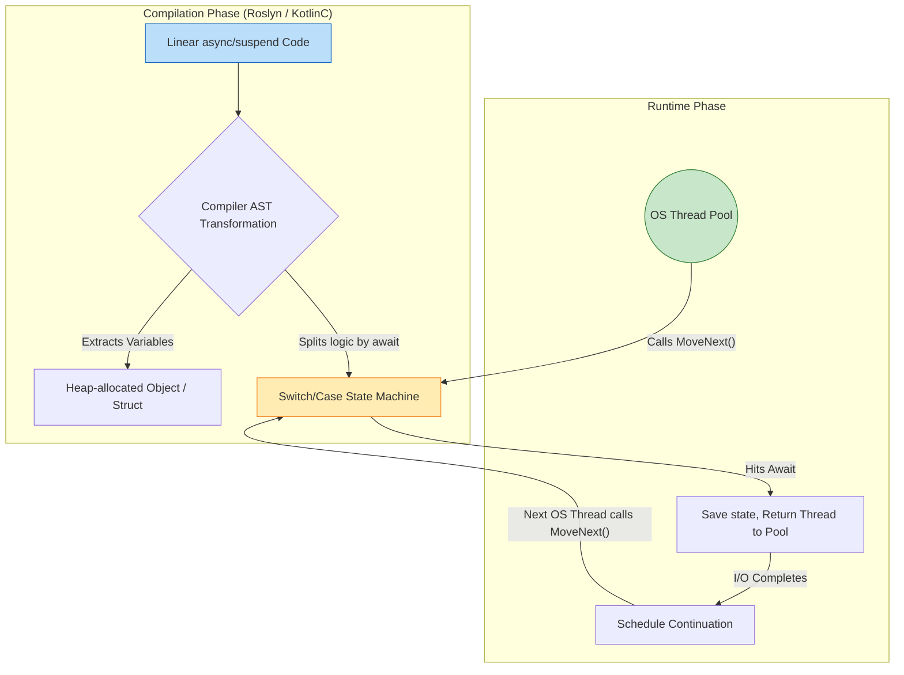

---
tags:
  - concurrency
  - coroutines
  - async-await
  - csharp
  - kotlin
  - architecture
aliases:
  - Coroutines
  - Async Await in .NET
  - Kotlin Coroutines
---
# L1.CONC.09: Coroutine frameworks (Kotlin, .NET async-await)

> [!abstract] О лекции
> **Корутины (Coroutines)** — это абсолютно не "легкие потоки" в привычном смысле операционной системы (как процессы или системные треды). Это чистая **компиляторная магия**, алгоритмически превращающая ваш обычный, линейно написанный код в сложнейший асинхронный **Конечный Автомат (State Machine)** под капотом.
> *   В экосистеме **.NET (C#)** это синтаксический сахар вокруг объектов `Task`, структурного паттерна `Builder` и метода `MoveNext()`, где состояние сохраняется в heap через boxing.
> *   В экосистеме **Kotlin (JVM)** это реализация CPS (Continuation-Passing Style), где любая функция `suspend` неявно получает скрытый параметр-колбэк `Continuation`.
> 
> **Главное железобетонное правило практика:** **Никогда, ни при каких обстоятельствах не блокируйте физический поток внутри корутины.** Если вы по ошибке сделали `Thread.sleep()`, вызвали синхронный `JDBC` драйвер или тяжелый I/O без оператора `await`/`suspend` находясь внутри пула потоков корутин — вы мгновенно убили пропускную способность всего вашего микросервиса (Thread Pool Starvation).

---
## 1. Фундаментальная концепция: Stackless Coroutines

Корутины — это абстракция программирования, позволяющая приостанавливать (suspend) исполнение текущей функции с гарантированным сохранением её локального состояния, и возобновлять (resume) её работу в будущем, возможно, уже на другом физическом потоке.
Главный архитектурный водораздел в индустрии проходит по физическому методу хранения этого "состояния": **Stackful** (Fibers, Green Threads, Go Goroutines, Java Loom) и **Stackless** (C# `async/await`, Kotlin `suspend`, Rust `async`, JavaScript/TypeScript, Python `asyncio`).

### 1.1. Проблема масштабирования: Стековый кадр (Stack Frame)
В классической системной модели (OS Threads - POSIX / Windows Threads) каждый вызов функции в коде создает физический **кадр стека** (Stack Frame) в непрерывном блоке виртуальной памяти, выделенном ОС специально под этот поток (обычно от 1MB до 8MB на поток). В этом кадре хранятся:
1.  Локальные переменные метода.
2.  Аргументы, переданные в функцию.
3.  Адрес возврата (Instruction Pointer - куда прыгнуть процессору после `return`).

**Почему это фундаментальная проблема для архитектуры C10K/C10M (10 миллионов коннектов)?**
Если вы хотите держать 100,000 активных конкурентных вебсокет-соединений, и каждое требует 1MB стека в ОЗУ, вам нужно 100GB чистой RAM только под пустые стеки спящих потоков! Это физический, непреодолимый предел горизонтальной масштабируемости классической модели "1 поток ОС = 1 соединение".

### 1.2. Решение 1: Stackful Coroutines (Go, Project Loom)
*   **Механизм под капотом:** Умный Runtime (языковая ВМ) выделяет *динамические, очень маленькие* стеки (например, всего 2KB на старте) прямо в куче (Heap), а не в системной памяти ОС. Если стек переполняется — он прозрачно копируется в новый, больший кусок памяти.
*   **Переключение (Context Switch):** Когда горутина блокируется (ждет I/O), планировщик рантайма в User-Space берет управление, физически сохраняет регистры CPU (Stack Pointer SP, Program Counter PC, Base Pointer BP) в структуру-дескриптор этой горутины и подменяет их на регистры другой, готовой к работе горутины.
*   **Плюс Архитектуры:** Абсолютная прозрачность. Вы пишите самый обычный синхронный код (без `await`), а Runtime сам "жонглирует" стеками под капотом.
*   **Минус (FFI & JNI):** Чудовищная сложность взаимодействия с нативным C/C++ кодом (Foreign Function Interface). C-код, скомпилированный GCC, жестко ожидает большой, непрерывный системный стек. Поэтому при вызове C-функции (через `cgo` в Go) рантайму приходится делать дорогую операцию: переключаться на жирный системный поток ОС, что сильно бьет по Latency.

### 1.3. Решение 2: Stackless Coroutines (C#, Kotlin, Rust)
Это осознанный архитектурный выбор платформ .NET и JVM (до Loom). Здесь корутина физически **не имеет** своего собственного, выделенного стека в памяти. Она как паразит "катается" на стеке потока-носителя (Carrier OS Thread), пока активно выполняет математику, и **полностью освобождает и покидает этот стек**, когда приостанавливается в ожидании I/O.

**Как это физически работает (Under the Hood):**
Это сложнейшая техника компилятора, известная в Computer Science как **Continuation-Passing Style (CPS) transformation** и переписывание кода в **State Machine (Конечный Автомат)**.



1.  **Heap Promotion (Промоушн в кучу / Спасение переменных):**
    Все локальные переменные вашего метода, которые должны математически "пережить" паузу в виде `await`/`suspend`, физически больше не могут лежать на стеке процессора (ведь стек будет полностью затерт другими задачами после возврата потока в пул). Компилятор агрессивно вырезает их из стека и делает **полями сгенерированного объекта (или забоксированной структуры)** в куче.
    *   *Технический Термин:* **Closure (Замыкание)** контекста исполнения в Heap.

2.  **Suspend == Return (Пауза - это просто Возврат):**
    Это самый важный инсайт для понимания магии. Когда корутина доходит до оператора `await` (и данные еще не готовы), она не "засыпает" в понимании ОС. Она физически делает обычный ассемблерный `return` из сгенерированного метода `MoveNext()` (в C#) или `invokeSuspend()` (в Kotlin).
    *   Дорогой поток ОС мгновенно освобождается и возвращается в Thread Pool для обслуживания других клиентов.
    *   В памяти (в куче) сиротливо остается лежать только **объект-автомат** (весом всего 80-200 байт), бережно хранящий состояние: *"Я остановился на шаге 2, моя локальная переменная `id=42`"*.

3.  **Resume == Method Call (Возобновление - это Вызов метода):**
    Когда сетевая карта (I/O) сообщает ОС, что байты получены (через `epoll`/`IOCP`), драйвер дергает колбэк. Планировщик фреймворка берет этот спящий объект из кучи, ставит его в очередь к любому свободному потоку, и этот поток *снова* вызывает тот же самый метод (`MoveNext`), но внутри метода код через `goto` или `switch` перепрыгивает сразу на нужную метку после последнего `await`.

### 1.4. Иллюстрация компиляторной трансформации (Mental Model)

Представьте примитивный код:
```kotlin
// Исходный линейный код разработчика
suspend fun process() {
    val a = 10      // (1)
    delay(1000)     // (2) Suspension point (Здесь магия)
    print(a * 2)    // (3)
}
```

Во что это превращает компилятор за вашей спиной (псевдокод на Java):

```java
// Скомпилированный класс-автомат (State Machine)
class ProcessStateMachine implements Continuation {
    // 1. Бывшая локальная переменная на стеке стала полем в Heap (Heap Promotion)
    int a; 
    // 2. Системная метка состояния (где мы сейчас находимся в switch?)
    int label = 0;

    // Этот метод будет вызван пулом потоков дважды!
    void invokeSuspend(Object result) {
        switch(this.label) {
            case 0:
                this.a = 10;
                this.label = 1; // Запоминаем, что следующий шаг - это 1
                
                // 3. Планируем возобновление в таймере и ВОЗВРАЩАЕМ управление потоку (return)
                // Поток ОС уходит делать другие дела.
                if (DelayService.schedule(1000, this) == SUSPENDED) return; 
                
                // Если delay выполнился мгновенно (fast path), мы не делаем return,
                // а просто проваливаемся (fall-through) в case 1.
                
            case 1:
                // 4. Мы проснулись на новом потоке. Значение 'a' безопасно берем из поля объекта (this.a)
                print(this.a * 2);
                this.label = 2; // Конец автомата
                break;
        }
    }
}
```

### 1.5. Trade-offs (Компромиссы) для Системного Архитектора

Почему гиганты индустрии (C# и Kotlin/JetBrains) выбрали именно этот сложный путь State Machine, а не элегантный путь Go (Stackful)?

1.  **Zero-Cost Interop (Бесплатный вызов C-кода):** Поскольку корутина в активной фазе работает на самом обычном, стандартном жирном стеке системного потока, вызов тяжелого нативного C/C++ кода (JNI в Java или P/Invoke в .NET) абсолютно бесплатен. Системе нет нужды переключать и перекладывать регистры между маленьким стеком горутины и большим стеком ОС.
2.  **Memory Footprint (Микроскопическое потребление RAM):** Приостановленная корутина C# занимает в куче ровно столько байт, сколько весят её захваченные переменные + заголовок объекта. Пустая корутина (без переменных) весит жалкие байты (80-100 байт), а не килобайты, как минимальный стек горутины (2048 байт). Вы можете держать в RAM десятки миллионов открытых WebSocket соединений.
3.  **Function Coloring Problem (Проблема "Цвета" функций):**
    Это главная, фундаментальная боль и минус Stackless модели. В этой архитектуре вы физически не можете просто и безопасно вызвать "красную" `async` функцию из "синей" обычной синхронной функции (без опасных костылей типа `.Result` или `runBlocking`). Весь стек вызовов от низа (БД) до самого верха (HTTP Контроллер) должен быть принудительно "заражен" асинхронностью и возвращать `Task`/`suspend`. В Stackful моделях (Go/Loom) любой функции "все равно", синхронная она или нет, цвет только один.

**Резюме для Practitioner:**
Stackless Coroutines (C#/Kotlin) — это гениальный компиляторный трюк по превращению вашего красивого линейного кода в **уродливую цепочку асинхронных колбэков (callback hell)**, надежно спрятанную внутри объекта-автомата. Память теперь тратится в куче (Heap Allocation), а не на стеке. Как следствие: давление на системный планировщик потоков ОС полностью исчезает, но взамен резко возрастает нагрузка на Garbage Collector (GC), который должен убирать эти объекты-автоматы после завершения запроса.

---
## 2. Механика .NET (C#): State Machine Under the Hood

Ключевые слова `async` и `await` не вводят абсолютно никакой новой физической функциональности в рантайм CLR (Common Language Runtime). CLR не знает, что такое async. Это чистая **трансформация кода на этапе компиляции (Compiler Lowering)**. Компилятор Roslyn безжалостно разрезает ваш метод на куски (по границам `await`) и упаковывает их в конечный автомат.

### 2.1. Анатомия Автомата: Struct vs Class (Оптимизация аллокаций)

В отличие от старых версий .NET (до .NET Core), в современном оптимизированном .NET (в режиме Release) машина состояний генерируется компилятором как **`struct`** (структура, Value Type), а не `class` (Reference Type).

*   **Зачем это сделано Архитекторами:** Если асинхронная операция чудом завершается абсолютно синхронно (например, нужные данные уже лежат в кэше RAM, и сетевой сокет вернул `IsCompleted == true`), эта структура так и остается лежать на дешевом стеке. Дорогостоящей аллокации памяти в куче (Heap Allocation) и последующей работы GC **вообще не происходит**. Это паттерн проектирования "Zero-cost abstraction" для так называемого Hot Path (горячего пути выполнения).
*   **Boxing (Упаковка в кучу):** Если операция реально требует медленного ожидания ответа от ОС (настоящий I/O), структура мгновенно "боксится" (копируется в кучу как объект), чтобы пережить неминуемый `return` из метода и быть вызванной планировщиком позже.

### 2.2. Поля генерируемой структуры
Компилятор создает в вашей сборке скрытый тип (обычно с именем вроде `<FetchDataAsync>d__0`), который жестко реализует системный интерфейс `IAsyncStateMachine`.

Внутри этой структуры лежат:
1.  **`<>1__state`**: Целочисленный счетчик текущего состояния (Instruction Pointer).
    *   `-1`: Метод сейчас выполняется (Running) или еще даже не начал первое ожидание.
    *   `-2`: Метод полностью и успешно завершен (Done).
    *   `0, 1, 2...`: Индекс конкретного оператора `await` в коде, на котором мы сейчас спим.
2.  **`<>t__builder`**: Структура `AsyncTaskMethodBuilder` (или `AsyncValueTaskMethodBuilder`). Это сложнейший системный "клей", который управляет жизненным циклом возвращаемого объекта `Task` и пробрасывает в него исключения.
3.  **Hoisted Variables (Поднятые переменные)**: Абсолютно все локальные переменные вашего метода (`var id`, `var data`) и входящие аргументы превращаются в **поля** этой структуры. Это и есть физическое **Closure** (замыкание), позволяющее состоянию пережить разрыв во времени.
4.  **`<>u__1`**: Служебное поле для хранения `TaskAwaiter` (или `ValueTaskAwaiter`). Это временное хранилище для объекта, который умеет ждать завершения (то, что возвращает метод `GetAwaiter()`).

### 2.3. Алгоритм `MoveNext()`: Fast Path и Slow Path

Скрытый метод `MoveNext()` — это бьющееся сердце автомата. Он вызывается рантаймом в двух случаях:
1.  **Синхронно** (немедленно) при самом первом вызове вашего `async` метода.
2.  **Асинхронно** (через системный колбэк `ThreadPool`), когда `TaskAwaiter` завершил долгую работу.

Давайте декомпилируем и разберем реальную логику (сильно упрощенно для понимания сути):

**Исходный код разработчика:**
```csharp
async Task<int> FetchDataAsync(int id) {
    if (id < 0) return 0;            // Синхронная ветка (Fast Path)
    var data = await Net.Get(id);    // Асинхронная ветка (Point 0)
    return data.Length;
}
```

**Во что это превращает компилятор Roslyn (Decompiled logic):**

```csharp
[CompilerGenerated]
struct FetchDataAsyncStateMachine : IAsyncStateMachine
{
    public int state;                 // <>1__state (Наш счетчик)
    public AsyncTaskMethodBuilder<int> builder;
    public int id;                    // Аргумент сохранен как поле структуры
    private TaskAwaiter<string> awaiter; // Поле для сохранения awaiter'а между вызовами

    public void MoveNext()
    {
        int result = 0;
        try
        {
            // --- СИНХРОННАЯ ЧАСТЬ (Первый заход ИЛИ возврат после первого await) ---
            if (state == -1) 
            {
                if (id < 0) { // Исполнение вашей бизнес-логики
                    result = 0;
                    goto Done; // Завершаем Task мгновенно
                }
                
                // Вызываем метод. Получаем awaiter от возвращенной задачи.
                // ВАЖНО: Net.Get(id) УЖЕ НАЧАЛ ВЫПОЛНЕНИЕ!
                var myTask = Net.Get(id);
                awaiter = myTask.GetAwaiter();

                // --- FAST PATH OPTIMIZATION (Оптимизация горячего пути) ---
                // Если данные чудом уже готовы (например, из in-memory кэша, 
                // или TCP пакет уже лежал в буфере ОС и завершился мгновенно)
                // Мы НЕ прерываем метод, НЕ боксим структуру в кучу, НЕ переключаем контекст!
                if (awaiter.IsCompleted) 
                {
                    goto AfterAwait; // Прыгаем вниз, экономим микросекунды
                }

                // --- SLOW PATH (SUSPENSION - Настоящее засыпание) ---
                state = 0; // Запоминаем в поле, что мы остановились на await с индексом 0
                
                // Черная магия Builder-а под капотом: 
                // 1. Делает Boxing этой структуры (переносит копию со стека в кучу).
                // 2. Подписывает метод MoveNext боксированной версии как колбэк (Continuation) 
                //    на событие OnCompleted внутри awaiter-а.
                // 3. Возвращает управление вызывающему коду (return Task). Поток свободен!
                builder.AwaitUnsafeOnCompleted(ref awaiter, ref this);
                return; // Выход из метода. Стек уничтожается.
            }

            // --- ТОЧКА ВОЗВРАТА (RESUMPTION - Колбэк из пула) ---
            if (state == 0)
            {
                // Мы "проснулись" на случайном потоке из ThreadPool. 
                // Авайтер был сохранен в поле структуры на предыдущем шаге, достаем его.
                state = -1; // Сбрасываем статус в "выполняется"
            }

            AfterAwait:
            // Получаем физический результат (Строку). 
            // ВНИМАНИЕ: Именно здесь GetResult() выбросит Exception, если оригинальный Task завершился с ошибкой (Faulted).
            string data = awaiter.GetResult(); 
            
            // Продолжение вашей бизнес-логики
            result = data.Length;
        }
        catch (Exception ex)
        {
            state = -2;
            // Если была ошибка, мы не крашим приложение, 
            // а аккуратно переводим возвращаемый Task в состояние Faulted.
            builder.SetException(ex); 
            return;
        }

        Done:
        state = -2; // State "Мертв"
        // Переводим возвращаемый клиентский Task в состояние RanToCompletion с результатом.
        builder.SetResult(result); 
    }

    // Системный метод для связывания Builder'а с боксированной копией
    public void SetStateMachine(IAsyncStateMachine stateMachine) => builder.SetStateMachine(stateMachine);
}
```

### 2.4. Важные системные определения для Staff Engineer

#### 1. ExecutionContext (Контекст выполнения потока)
При физическом переходе (прыжке) через `await` на другой поток из пула, .NET архитектурно обязан прозрачно перенести за вами всё "окружение" (глобальное состояние): переменные `AsyncLocal<T>` (например, Correlation ID для логов), `WindowsIdentity` (права доступа), `CultureInfo` (язык локали).
*   Системный метод `builder.AwaitUnsafeOnCompleted` тихо делает слепок текущего состояния (`ExecutionContext.Capture()`).
*   Когда `Task` завершается, продолжение (следующий вызов `MoveNext`) запускается рантаймом строго внутри **восстановленного** контекста.
*   *Цена абстракции:* Это далеко не бесплатно. Очень глубокие цепочки вызовов `async` с тяжелым контекстом могут создавать заметный оверхед на аллокации при захвате контекстов.

#### 2. SynchronizationContext vs TaskScheduler
*   **SynchronizationContext:** Это высокоуровневая абстракция, отвечающая на вопрос "Где именно математически должен выполниться этот кусок кода?". В UI-приложениях (WPF/WinForms) он строго указывает на "Главный UI поток" (иначе будет краш интерфейса). В старом ASP.NET Classic он указывал на "Поток с доступом к HttpContext". В современном, быстром ASP.NET Core этот контекст умышленно удален и равен `null`.
*   **`ConfigureAwait(false)`:** Это заклинание говорит стейт-машине: "Пожалуйста, игнорируй текущий `SynchronizationContext`. Не пытайся использовать его `Post()` для возобновления. Просто кинь продолжение `MoveNext` в любой свободный рабочий поток тредпула (`TaskScheduler.Default`)".
    *   *Best Practice Архитектора:* В любом библиотечном (Nuget) или бэкенд коде вы **всегда, абсолютно везде** обязаны писать `ConfigureAwait(false)`. Это защитит код пользователей вашей библиотеки от чудовищных дедлоков UI-потока и сэкономит ресурсы на переключении контекстов. (В ASP.NET Core это не обязательно, но писать стоит для переносимости кода).

#### 3. ValueTask (Структурные Таски)
Внимательно посмотрите на логику Fast Path выше. Если `IsCompleted == true`, мы не создаем накладных расходов на переключение потока. Но мы по сигнатуре метода все равно обязаны вернуть объект `Task<T>` (который является ссылочным классом, аллоцируется в куче и нагружает GC).
*   **Решение проблемы:** В .NET ввели тип `ValueTask<T>`. Физически это структура (Sum Type / Discriminated Union): внутри нее лежит либо готовый результат `T result`, либо незаконченный объект `Task<T> task`.
*   Если результат готов синхронно (например, чтение байт из закешированного стрима), метод возвращает структуру `ValueTask` прямо на стеке. Аллокаций в куче — **Ноль**. Это критично для high-load методов в парсерах сокетов, сериализаторах или чтении файлов.

### 2.5. Пример "Выстрела в ногу" (Смертельный антипаттерн Sync over Async)

Детально понимая сгенерированный код `MoveNext`, вы теперь как эксперт видите, почему использование `.Result` или `.Wait()` в UI или старом ASP.NET — это гарантированный Deadlock (взаимоблокировка).

```csharp
// UI Thread (Имеет строгий SynchronizationContext, который допускает только 1 поток)
void Button_Click() {
    var task = GetDataAsync(); // (1) Синхронно запускает операцию, возвращает недоделанный Task
    var result = task.Result;  // (2) ЖЕСТКО БЛОКИРУЕТ единственный UI Thread, ожидая завершения Task. Поток спит.
}

async Task<int> GetDataAsync() {
    await Net.Get(); // (3) Запускает сетевой I/O. Возвращает управление (return).
    // (4) Спустя 100мс I/O завершилось драйвером сети. 
    // Awaiter просыпается и видит, что был захвачен SynchronizationContext (UI Thread).
    // Он пытается сделать Post(MoveNext) — то есть поставить продолжение в очередь выполнения UI потока.
    // (5) НО единственный UI Thread ЗАБЛОКИРОВАН и спит на шаге (2), ожидая завершения задачи!
    // МЕРТВАЯ ПЕТЛЯ (DEADLOCK). Приложение висит намертво.
}
```

**Фундаментальный Вывод:** Машина состояний физически не может "вклинить" свое продолжение в заблокированный системный поток, если Контекст Синхронизации требует эксклюзивного доступа к этому потоку. Решение — использовать `await` везде до самого верха.

---
### 3. Механика Kotlin: Continuation-Passing Style (CPS) и State Machine

В отличие от языка Go (где стек динамический и жестко переключается C-подобным рантаймом на низком уровне) или будущей Java Project Loom (где стек перекладывается виртуальной машиной JVM), язык Kotlin реализует корутины **исключительно силами своего компилятора (kotlinc)**. Сама Виртуальная машина Java (JVM) абсолютно ничего не знает о существовании корутин. Для JVM это просто самые обычные объекты, классы и скучные вызовы методов в куче.

Этот математический процесс называется **CPS Transformation** (трансформация в стиль передачи продолжения).

#### 3.1. Трансформация сигнатуры (Function Lowering)

Компилятор Kotlin сканирует код, находит каждую функцию, помеченную словом `suspend`, и тайно изменяет её байт-код сигнатуру.
Изначальный красивый код программиста:
```kotlin
suspend fun getUser(id: Int): User
```

Реальный Байт-код в JVM (упрощенно в Java-синтаксисе):
```java
Object getUser(int id, Continuation<User> cont)
```

**Ключевые изменения Архитектуры:**
1.  **Добавлен неявный параметр `cont`:** Это и есть объект "Продолжения" (Continuation). По сути, это умный колбэк, который "знает", какую строку кода нужно выполнить *сразу после* того, как этот метод `getUser` завершит свою асинхронную работу.
2.  **Тип возврата изменен на `Object` (в Kotlin это `Any?`):** Почему функция больше не возвращает `User`? Потому что в асинхронном мире функция может физически вернуть два совершенно разных типа значений:
    *   Объект `User`: если сетевой результат доступен прямо сейчас (синхронно или из кэша).
    *   Специальный маркер `COROUTINE_SUSPENDED`: (это просто enum singleton в памяти), который означает "Я еще не закончил работу, я ушел в асинхронное I/O плавание, не жди меня, освобождай поток".

#### 3.2. Анатомия объекта Continuation

Чтобы глубоко понять механику, нужно заглянуть внутрь системного интерфейса `Continuation`. Это атом, из которого строятся корутины.

```kotlin
public interface Continuation<in T> {
    // Карта (Map) с системной конфигурацией: диспетчеры, родительский Job, имена
    public val context: CoroutineContext 
    
    // Главный колбэк. Вызывается ядром пула потоков при успехе или падении задачи.
    public fun resumeWith(result: Result<T>) 
}
```

Когда вы пишете код в `suspend` функции, компилятор Kotlin генерирует скрытый анонимный класс (обычно наследующийся от `ContinuationImpl`), который аппаратно реализует этот интерфейс. Этот огромный класс и является тем самым **Конечным Автоматом (State Machine)**.

#### 3.3. Конечный автомат и метод `invokeSuspend`

Компилятор логически "разрезает" вашу функцию на куски ровно в точках вызова других `suspend` функций (эти точки называются suspension points). Все эти разрезанные куски бизнес-логики помещаются внутрь одного гигантского метода `invokeSuspend`, который управляется скрытым полем `label` (switch/case).

**Пример исходного кода:**
```kotlin
suspend fun flow() {
    print("Start")      // Шаг 1 (State 0)
    delay(1000)         // Точка остановки (Suspension Point)
    print("End")        // Шаг 2 (State 1)
}
```

**Во что это компилирует Kotlin (Псевдокод State Machine):**

```java
// Сгенерированный компилятором класс
class FlowStateMachine extends ContinuationImpl {
    int label = 0; // Наш Instruction Pointer
    Object result; // Системное поле для хранения результата от промежуточных вызовов

    // Главная Точка входа. Вызывается каждый раз, когда корутина "просыпается" в пуле
    Object invokeSuspend(Object result) {
        this.result = result; // Принимаем и сохраняем результат от предыдущего шага

        switch (this.label) {
            case 0: // Начальное состояние (первый вызов)
                System.out.println("Start");
                
                this.label = 1; // Готовим автомат к следующему шагу
                
                // ВАЖНО: Вызываем функцию delay, передавая СЕБЯ ЖЕ (this) в качестве колбэка-продолжения!
                Object suspendResult = DelayKt.delay(1000, this);
                
                // Аппаратная проверка: Если delay действительно решил приостановиться (пошел в таймер ОС):
                if (suspendResult == COROUTINE_SUSPENDED) {
                    // Мы немедленно возвращаем управление системному потоку пула (unwind JVM stack)
                    // Поток свободен и идет обрабатывать другие корутины.
                    return COROUTINE_SUSPENDED; 
                }
                // Если delay (вдруг) выполнился мгновенно синхронно, мы проваливаемся вниз в case 1
                // Оператор 'break' отсутствует намеренно (fall-through оптимизация)!
                
            case 1: // Состояние после пробуждения таймером
                // Здесь поле this.result уже содержит то, что вернул delay (обычно объект Unit)
                // Проверяем, не упал ли delay с ошибкой
                if (result instanceof Failure) throw ((Failure) result).exception;
                
                System.out.println("End");
                return Unit.INSTANCE; // Финиш автомата
                
            default: 
                throw new IllegalStateException("Call to 'resume' before 'invoke' with coroutine");
        }
    }
}
```

#### 3.4. Сохранение состояния (LVT Spill - Local Variable Table)

Самая дорогая часть работы корутин в JVM — это не само переключение контекста, а **физическая аллокация объектов** в куче для сохранения локальных переменных.
В классическом треде переменные живут в сверхбыстрых регистрах CPU или стековой памяти L1 кэша. В Stackless корутинах, когда происходит вызов `suspend`, стек Java **полностью разматывается и уничтожается** (функция делает `return COROUTINE_SUSPENDED`). Все локальные переменные на стеке безвозвратно стираются.

Чтобы они логически "выжили", хитроумный компилятор Kotlin "проливает" (spills) их в скрытые поля класса StateMachine.

*   **Пример в коде:**
    ```kotlin
    val token = requestToken() // Локальная переменная
    delay(100)                 // Стек уничтожается здесь!
    use(token)                 // Токен нужен снова
    ```
*   **Результат агрессивной компиляции:** Переменная `token` перестает быть локальной. Она становится полем `Object L$0` внутри сгенерированного класса `FlowStateMachine`.
*   **Инсайт для оптимизации (Liveness Analysis):** Компилятор Kotlin невероятно умен. Если переменная больше никогда не используется *после* точки остановки (`delay`), компилятор понимает это и **не сохраняет** её в поле объекта. Это экономит RAM и спасает от утечек (GC может собрать объект). Это называется математическим анализом жизнеспособности (Liveness Analysis).

#### 3.5. Магия `COROUTINE_SUSPENDED` (Оптимизация развертывания - Unrolling)

Почему был выбран возвращаемый тип `Any?`, а не просто классический `void` с колбэком (как в Node.js)? Исключительно ради оптимизации "быстрого пути" (Fast Path) и предотвращения переполнения стека.

Если `suspend` функция может выполнить свою логику и вернуть результат мгновенно (например, чтение байт из буферизированного Kotlin `Channel` или чтение уже готового значения из `Deferred`), она возвращает результат напрямую в виде значения. Она не возвращает маркер `SUSPENDED`, не создает накладных расходов на парковку потока в ОС и не регистрирует себя в диспетчере.

*   **Сценарий Быстрого Пути:**
    1. Наш `invokeSuspend` вызывает дочернюю `suspend` подфункцию.
    2. Если подфункция вернула `COROUTINE_SUSPENDED` -> мы тоже делаем `return COROUTINE_SUSPENDED` (мы засыпаем и отдаем поток).
    3. Если подфункция вернула реальное значение (число `42`) -> мы **физически не выходим** из метода! Мы сразу переходим к следующему `case` в нашем `switch`.
    Это позволяет виртуальной машине выполнять гигантские, длинные цепочки из сотен корутин точно так же быстро, как обычный императивный C-код, без рекурсии колбэков и без крашей `StackOverflowError`.

#### 3.6. Context Interceptor (Магия Диспетчеризации потоков)

Механика CPS блестяще объясняет *как* код приостанавливается, но она не объясняет *как именно* он магически меняет физические потоки при вызове `withContext(Dispatchers.IO)`.
За эту "телепортацию" отвечает архитектурный компонент `ContinuationInterceptor` — один из элементов карты `CoroutineContext`.

Когда корутина готова проснуться (например, I/O таймер сработал и вызывает `resumeWith`), вызывается не напрямую сам метод `invokeSuspend` нашего автомата, а вызывается метод Интерцептора (например, планировщика `Dispatchers.Default`), который делает следующее:
1.  Берет наш объект `Continuation` (автомат).
2.  Оборачивает его в системную задачу `DispatchedContinuation` (которая реализует стандартный Java `Runnable`).
3.  Кидает этот `Runnable` в очередь пула потоков (обычно это системный `ForkJoinPool` в JVM).
4.  Случайный свободный поток пула забирает задачу из очереди и, наконец, физически вызывает наш `invokeSuspend`. Корутина "телепортировалась".

### Резюме для Архитектора (Kotlin)

1.  **Корутина в Kotlin = Тяжелый Объект в Heap.** Все локальные переменные становятся полями класса-автомата (Heap allocation).
2.  **Suspend = Физический Return.** Технически `suspend` — это мгновенный возврат специального токена `SUSPENDED` и полное освобождение Java-стека потока.
3.  **Resume = Системный Callback.** Продолжение работы — это вызов метода `invokeSuspend` у сохраненного объекта из другого потока пула.
4.  **Бесплатного сыра нет.** Интенсивное использование "жирных" локальных переменных (списков, контекстов), которые должны переживать вызов `suspend`, радикально увеличивает нагрузку на сборщик мусора GC (Old Gen space), так как объект StateMachine может жить в памяти очень долго, ожидая ответа от базы данных.

---
## 4. Structured Concurrency (Структурная конкурентность)

Это революционная парадигма дизайна, которая делает сложнейшее многопоточное программирование таким же предсказуемым, безопасным и линейным, как и обычное однопоточное.

**Фундаментальная Аналогия для понимания:** В далеких 1960-х годах Эдсгер Дейкстра продвигал революцию "Структурного программирования" (замену дикого оператора `GOTO` на понятные лексические блоки `if/else`, циклы, функции). Парадигма **Structured Concurrency** делает абсолютно то же самое, но для потоков выполнения: она на уровне компилятора запрещает "GOTO-подобный" запуск потоков в никуда (паттерн `Fire-and-Forget`), жестко требуя, чтобы абсолютно любой запущенный фоновый процесс имел четкую точку старта и **математически гарантированную точку финиша** строго внутри лексической области видимости (Scope) своего создателя.

### 4.1. Фундаментальные законы (The Three Laws of Structured Concurrency)

В Kotlin (и частично в новых экспериментальных API .NET 8+) структурная конкурентность математически базируется на трех законах, которые обеспечиваются скрытым объектом `Job` в контексте корутины:

1.  **Иерархия (Hierarchy):** Когда корутина $A$ запускает фоновую корутину $B$, $B$ автоматически, на уровне ссылок в памяти, становится "ребенком" корутины $A$. Технически это реализуется через прозрачное наследование карты `coroutineContext`. Объект `Job` ребенка аппаратно регистрируется в массиве детей объекта `Job` родителя.
2.  **Время жизни (Lifetime Scope / Принцип Яслей):** Родительская корутина физически **не может завершиться** (перейти в статус Completed), пока полностью не завершатся абсолютно все её запущенные дети. Даже если основной линейный код родителя успешно выполнен до конца, родительский объект будет "висеть" в невидимом состоянии ожидания, пока самый последний, самый долгий ребенок не закончит свою работу (или не упадет). Это на 100% предотвращает главную беду бэкендов — утечку памяти из-за "зомби-процессов".
3.  **Распространение сигналов (Signal Propagation):**
    *   **Вниз по дереву (Downstream - Отмена):** Если родительскую корутину отменили (пользователь закрыл браузер), родитель мгновенно и рекурсивно отменяет всех своих живых детей, внуков и правнуков. Трафик спасен.
    *   **Вверх по дереву (Upstream - Фатальная Ошибка):** Если любой ребенок внезапно упал с исключением (Exception, кроме мирного `CancellationException`), он немедленно **отменяет своего родителя**. Возмущенный родитель, в свою очередь, каскадно отменяет абсолютно всех остальных своих детей (братьев упавшего) и пробрасывает фатальную ошибку еще выше. Принцип: "Один за всех, и все за одного".

### 4.2. Механика реализации: Kotlin vs .NET (C#)

Здесь кроется фундаментальное, идеологическое различие подходов двух платформ.

#### Kotlin: Explicit Scope (Явная, строгая область)
В языке Kotlin вы **физически не можете** (компилятор выдаст ошибку) запустить корутину (`launch` или `async`), не имея доступа к объекту `CoroutineScope`.
*   **`coroutineScope { ... }`**: Это встроенная suspend-функция, которая динамически создает новую "мягкую" границу (Scope). Если внутри этих фигурных скобок вы запустите 100 параллельных корутин, функция `coroutineScope` не вернет управление следующей строке кода, пока все 100 корутин не отработают до конца.
*   **Смертельный Anti-pattern**: `GlobalScope.launch`. Это классический эквивалент Линуксового демона (daemon thread). Он жестоко нарушает все законы структурной конкурентности, так как физически не имеет родителя (его `Job` привязан к времени жизни всего процесса JVM) и его завершения никто не ждет. Использование `GlobalScope` в прикладном бизнес-коде — признак вопиющего дурного тона (code smell) и некомпетентности, допустимо только для специфических top-level фоновых задач (типа демона сборки метрик).

#### .NET (C#): Implicit / Task-based (Ручная ответственность)
Архитектура C# исторически (с 2012 года) использует более свободную модель **Futures** (где объект `Task` — это независимое обещание результата в будущем).
*   Конструкция `Task.Run(() => ...)` создает задачу в пуле, которая физически **полностью отвязана** от создателя. Никакой иерархии в памяти не создается.
*   Если разработчик забыл написать `await myTask`, задача-сирота продолжит работать в фоне (Fire-and-forget). Если она упадет с исключением внутри себя, это исключение будет "проглочено" пустотой (сохранено в объекте `Task` до сборки мусора GC), или вызовет глобальный краш сервера `UnobservedTaskException` (поведение зависит от настроек версии .NET).
*   **Эмуляция структурности Архитектором:** В C# структурность достигается исключительно жесткой самодисциплиной разработчика: обязательное использование `using` блоков, ручное связывание токенов `CancellationTokenSource.CreateLinkedTokenSource` и параноидальное использование `await Task.WhenAll(...)`. Но компилятор C# это **никак не форсирует**. Ошибка человека неизбежно ведет к утечке.

### 4.3. Практический пример: Сценарий Fail-Fast (Упасть быстро)

Представьте классический Gateway микросервис. Мы параллельно грузим Профиль пользователя (User) и его Историю транзакций (Tx). Если загрузка Профиля упала (БД легла), нам математически **не нужны** его транзакции (мы все равно отдадим клиенту ошибку 500). Нам нужно немедленно прервать загрузку транзакций, чтобы не жечь CPU и не тратить сетевой трафик.

**Kotlin (Идеальная автоматическая отмена):**
```kotlin
suspend fun loadDashboard() = coroutineScope { 
    // Создаем Scope. Если любой запущенный child упадет внутри, Scope отменит всех остальных!
    
    val userDeferred = async { 
        throw RuntimeException("User DB is down") // Фатальная Ошибка здесь!
    }
    
    val txDeferred = async { 
        delay(1000) // Имитация долгой, тяжелой работы с другой БД
        fetchTransactions() 
    }

    // ХРОНОЛОГИЯ РЕЗУЛЬТАТА:
    // 1. userDeferred мгновенно падает с RuntimeException.
    // 2. Эта ошибка летит вверх, в родительский coroutineScope.
    // 3. coroutineScope немедленно посылает сигнал cancel() вниз, в еще живой txDeferred.
    // 4. txDeferred прерывает свой sleep (delay) и выбрасывает внутреннее CancellationException.
    // 5. Метод loadDashboard выбрасывает RuntimeException("User DB is down") наружу вызывающему коду.
    // ИТОГ: Драгоценные ресурсы на вызов fetchTransactions() спасены. Сервер не перегружен.
}
```

**C# (Опасная ручная работа):**
```csharp
async Task LoadDashboard() {
    using var cts = new CancellationTokenSource();
    
    try {
        // Мы ОБЯЗАНЫ не забыть передать токен внутрь каждого метода!
        var userTask = FetchUserAsync(cts.Token);
        var txTask = FetchTxAsync(cts.Token);
        
        // ОПАСНОСТЬ: Если userTask упадет первым (за 10мс), txTask ВСЕ РАВНО 
        // продолжит работать (еще 10 секунд), сжигая CPU, пока мы не дойдем 
        // до await, не поймаем ошибку и не вызовем cts.Cancel() руками в блоке catch.
        await Task.WhenAll(userTask, txTask);
    } catch {
        cts.Cancel(); // Мы обязаны явно, руками отменять живые задачи-сироты
        throw;
    }
}
```

### 4.4. Тонкая настройка архитектуры: SupervisorJob (Паттерн Изоляции)

Иногда радикальный принцип "один за всех, и все за одного" (Fail-Fast) вреден для бизнеса. Например, при рендеринге сложного UI: если боковой виджет погоды упал с ошибкой API, главная кнопка "Оплатить заказ" не должна исчезнуть или сломаться.

Для изоляции отказов в Kotlin существует преднамеренный разрыв связи Upstream (ошибки вверх не летят):
*   **`SupervisorJob` / `supervisorScope { ... }`**: В этом специальном скоупе дети могут падать независимо друг от друга. Падение одного ребенка **вообще не** отменяет родителя и **не** отменяет работу соседних детей.
*   **Критическое правило для Практика:** В `SupervisorJob` родитель *аппаратно обязан* самостоятельно обрабатывать все исключения своих детей (через блоки `try-catch` внутри самого ребенка или через глобальный `CoroutineExceptionHandler`), иначе эти "тихие" ошибки могут незаметно "протечь" в системный обработчик крашей и положить процесс Android/JVM.

### Итоговое определение для раздела
**Структурная конкурентность (Structured Concurrency)** — это жесткая математическая гарантия того, что дерево управления потоком выполнения (control flow) идеально совпадает с лексической, визуальной структурой кода в IDE (скобками `{}`). Операция (функция) считается алгоритмически завершенной тогда и только тогда, когда успешно (или с ошибкой) завершены абсолютно все порожденные ею асинхронные фоновые операции. Это обеспечивает автоматическое управление памятью, 100% предсказуемую обработку ошибок (Observability) и математическое отсутствие утечек зомби-потоков.

---
## 5. Архитектурные антипаттерны, практические проблемы и решения

### 5.1. Антипаттерн "Sync over Async" (Смертельная блокировка потока пула)

Это убийца производительности (Throughput) №1 в экосистеме .NET и (чуть реже) в мире JVM. Это архитектурная катастрофа, возникающая когда разработчик вызывает современный асинхронный метод, но принудительно, синхронно блокирует текущий системный поток в ожидании результата.

*   **Как этот кошмар выглядит в коде:**
    *   **C#:** Обращение к `.Result`, вызов `.Wait()`, `.GetAwaiter().GetResult()`.
    *   **Kotlin:** Использование `runBlocking { ... }` глубоко внутри уже работающей корутины или Spring WebFlux контроллера.

*   **Механика каскадной катастрофы (Thread Pool Starvation - Голодание Пула):**
    В современных рантаймах (CLR, JVM) системные потоки ОС — это крайне дорогой и ограниченный ресурс (обычно их 10-100 штук на пул). Пул потоков (Thread Pool) имеет умные эвристики для впрыска новых потоков при нагрузке (например, алгоритм Hill Climbing в .NET), но он не может физически создавать тяжелые потоки мгновенно (это занимает сотни миллисекунд).
    1.  На сервер приходит HTTP-запрос. Системный поток `T1` забирается из пула для обработки роутинга.
    2.  Код разработчика делает `dbQueryAsync().Result`.
    3.  Запускается сетевая I/O операция в БД. Вместо того, чтобы вернуть `T1` в пул (как делает `await`), поток `T1` жестко **блокируется** ядром ОС и тупо спит, ожидая ответа. Он выведен из пула.
    4.  I/O операция в БД завершается. ОС сообщает об этом через прерывание. Рантайму теперь нужен **новый** свободный поток `T2` из пула, чтобы выполнить микро-колбэк продолжения (continuation) и разблокировать спящий `T1`.
    5.  **Системный Пат (Смерть сервера):** Если входящая HTTP нагрузка высокая, в пуле может банально **не остаться** свободных потоков `T2`, потому что абсолютно все имеющиеся потоки `T1` уже заблокированы в таком же дурацком ожидании `Result`! Пул в панике пытается медленно создать новые потоки (по 1-2 штуки в секунду), но новые запросы съедают их быстрее. Латентность (Latency) сервиса мгновенно взлетает с 5мс до 30 секунд. Сервер перестает отвечать на Health Check и убивается Kubernetes.

*   **Классический Deadlock (Context-aware environment):** В старых фреймворках (ASP.NET Classic, WPF), где существует строгий `SynchronizationContext` (допускающий работу только одного потока), этот паттерн мгновенно вызывает классический математический дедлок: заблокированный главный поток бесконечно ждет асинхронную таску, а таска бесконечно ждет освобождения *этого же самого* главного потока, чтобы завершить свой код.

*   **Решение Архитектора:**
    *   **Золотое Правило:** `Async all the way` (Асинхронность до самых корней). Асинхронность подобна вирусу — она должна пронизывать весь стек вызовов от самого нижнего драйвера БД до самого верхнего HTTP Контроллера.
    *   **C#:** Никогда, ни в коем случае не используйте `.Result`. Если вы загнаны в угол архитектурой легаси (например, в синхронном конструкторе или `Main`) — скрипя зубами используйте `GetAwaiter().GetResult()` (это хотя бы не заворачивает внутреннюю ошибку в мерзкий `AggregateException`), но делайте это только там, где вы на 100% контролируете нагрузку.
    *   **Kotlin:** Конструкция `runBlocking` легальна и допустима **только** в корневой `main()` функции сервера и в Unit-тестах. В рабочем коде микросервисов бескомпромиссно используйте только `suspend`.

### 5.2. Кооперативная отмена (Cooperative Cancellation) - Как остановить неудержимое

Джуниоры часто наивно полагают, что вызов `cancel()` (Kotlin) или активация `CancellationToken` (C#) работают как жесткий аппаратный сигнал `SIGKILL` или метод `Thread.Abort()` — то есть мгновенно и кроваво убивают выполнение потока на полуслове. Это **опасная ложь**. Отмена в мире корутин — строго **кооперативная (вежливая)**. Код внутри корутины обязан *сам, добровольно* периодически проверять, что его просят остановиться, и завершать работу.

*   **Сценарий Проблемы:** Тяжелая CPU-bound задача (например, парсинг гигантского XML или генерация отчета) в корутине, которая в цикле игнорирует сигналы отмены.
    ```csharp
    // C# Bad Example (Утечка CPU)
    async Task HeavyCalculationAsync(CancellationToken token) {
        while (true) {
            // Тяжелая математика (сотни миллисекунд)
            CalculateMatrixAndCrypto(); 
            
            // КАТАСТРОФА: Мы никогда в цикле не проверяем 'token'! 
            // Даже если рассерженный клиент нажал "Отмена" и закрыл соединение 2 часа назад, 
            // сервер будет бессмысленно жарить процессор на 100% вечно.
        }
    }
    ```

*   **Архитектурное Решение:**
    *   **C#:** Вставлять вызов `token.ThrowIfCancellationRequested()` в начале каждой тяжелой итерации циклов `while`/`for`. Пробрасывать (передавать) этот токен во абсолютно все вложенные вызовы методов БД и API.
    *   **Kotlin:** Использовать свойство `isActive` в условии цикла `while(isActive)`, или периодически вызывать функцию `ensureActive()`. 
    *   *Важно:* Абсолютно все стандартные библиотечные suspend-функции (`delay`, `yield`, методы Ktor/Retrofit) внутри себя проверяют статус отмены автоматически и мгновенно выбрасывают `CancellationException`.

    ```kotlin
    // Kotlin Good Example (Безопасный код)
    while (isActive) { // Или вызов ensureActive() в начале тела цикла
        calculateMatrix() // Безопасно, остановится при отмене
    }
    ```

### 5.3. Проглатывание исключений в параллельных задачах (Exception Swallowing)

Когда вы запускаете несколько асинхронных задач параллельно ("веерный запуск" - Fan-Out), обработка неизбежных ошибок становится нетривиальной и опасной задачей.

*   **Бизнес-Сценарий:** Запускаем 3 параллельных HTTP-запроса к разным микросервисам одновременно. 1-й запрос упал с ошибкой `Timeout`, 2-й и 3-й выполнились успешно.

*   **Ловушка в C# (`Task.WhenAll`):**
    ```csharp
    try {
        // Дожидаемся всех. Но что если упали сразу ДВЕ задачи?
        await Task.WhenAll(task1, task2, task3);
    } catch (Exception ex) {
        // ОШИБКА ДИЗАЙНА: ВЫ ПОЙМАЕТЕ ТОЛЬКО ОДНО, ПЕРВОЕ ИСКЛЮЧЕНИЕ!
        // Механика Task.WhenAll такова, что при операторе await она распаковывает 
        // и выбрасывает наружу только самое первое попавшееся исключение.
        // Критические ошибки остальных упавших тасок (например, SecurityException) будут безвозвратно потеряны (Swallowed) для ваших логов!
    }
    ```
    *   **Правильное Решение (C#):** Чтобы увидеть всю картину катастрофы, нужно сохранить сам результат объединения `Task t = Task.WhenAll(...)` в переменную, сделать `try { await t; }`, а в `catch` инспектировать свойство `t.Exception` (которое является мощным классом `AggregateException`), содержащим плоский список абсолютно всех ошибок, произошедших во всех тасках.

*   **Поведение в Kotlin (`async` / `launch`):**
    *   По умолчанию (если вы находитесь в обычном `coroutineScope`), если с треском падает хотя бы одна дочерняя корутина `async`, она **мгновенно отменяет** родителя, а родитель безжалостно отменяет всех остальных еще бегущих детей. Это принцип "Fail Fast" (Упади быстро). Вы получите исключение первой упавшей корутины.
    *   **Решение для Изоляции:** Если вам по бизнесу нужно "Independent execution" (одна задача упала, но остальные обязаны доработать и вернуть результат), вы обязаны использовать `supervisorScope` (или `SupervisorJob`). В этом случае ошибку нужно аккуратно ловить внутри каждой функции `async` через локальный блок `try-catch` или оборачивать вызов в `runCatching { Deferred.await() }`.

### 5.4. Скрытые утечки памяти: Утечки контекста и замыканий (Closure Leaks)

Как мы выяснили в механике (Раздел 1), корутины компилируются в "жирные" классы. Все локальные переменные, захваченные лямбда-выражениями или машиной состояний (State-machine), переезжают жить в кучу (Heap) и живут там до завершения автомата.

*   **Проблема (Memory Leak):** Захват гигантских объектов в долгоживущей (спящей) корутине.
    ```csharp
    // C# Скрытая Утечка
    async Task LeakyMethodAsync() {
        var hugeDataArray = new byte[100_000_000]; // Аллоцируем 100MB RAM
        
        await ProcessArrayFastAsync(hugeDataArray); // Отработает за 1мс
        
        // ... Переменная hugeDataArray больше нигде в коде ниже не используется, НО...
        // ... синтаксически эта переменная "видна" компилятору до самого конца метода.
        // ПОСЛЕДСТВИЯ: Сборщик мусора (GC) ФИЗИЧЕСКИ НЕ ИМЕЕТ ПРАВА собрать и удалить эти 100MB, 
        // пока весь объект StateMachine не завершит работу.
        // Потому что ссылка на массив лежит в скрытых полях сгенерированного класса StateMachine.
        
        await Task.Delay(TimeSpan.FromHours(1)); // 100 Мегабайт будут висеть в памяти ЦЕЛЫЙ ЧАС!
    }
    ```
*   **Архитектурное Решение:** Принудительно обнулять тяжелые ссылки (`hugeDataArray = null;`) прямо перед длинными асинхронными вызовами (`await`), если эти данные больше не понадобятся для бизнес-логики. Или, что более элегантно и архитектурно верно — жестко ограничивать лексическую область видимости тяжелых переменных блоками `{ var data = ...; await process(data); }`.

### 5.5. Смертельный `async void` (Специфика C#) — Паттерн "Fire and Crash"

В языке C# метод с сигнатурой `async void` синтаксически разрешен компилятором (для легаси-совместимости), но среди Senior-разработчиков это считается "ядерной миной замедленного действия".

*   **Суть Катастрофы:** Методы `async void` физически не возвращают объект `Task`. У вызывающей стороны (вашего кода) банально **нет объекта**, на который можно сделать `await` или подписаться, чтобы проверить статус завершения или получить исключение.
*   **Смертельное Последствие:** Если глубоко внутри метода `async void` возникает любой Exception (например, БД недоступна), это исключение некому перехватить. Оно пробрасывается рантаймом напрямую в системный `SynchronizationContext` (или в голый `ThreadPool`). Стандартный блок `try-catch`, которым вы заботливо обернули вызов этого метода, **физически не поймает** эту ошибку, так как она выстрелит в другом потоке асинхронно!
*   **Итоговый Результат:** **Мгновенный Crash (падение) всего процесса ОС** (в современных версиях .NET Core необработанное исключение в потоке пула — это фатальная ошибка `Environment.FailFast`, кладущая весь бэкенд).
*   **Единственное легальное Исключение:** Единственное в мире легальное место для использования `async void` — это верхнеуровневые обработчики событий UI-кнопок в десктопе (например, `private async void Button_Click(sender, args)`), так как жесткая сигнатура системного делегата события `EventHandler` требует возвращать именно `void`. В веб-бэкенде (ASP.NET) `async void` запрещен законом.

### 5.6. Dispatcher Pollution (Блокировка и Загрязнение Диспетчера / Starvation)

Эта проблема особенно ярко и часто проявляется в Kotlin, но концептуально актуальна для любых фреймворков.

*   **Системный Контекст:** Диспетчер по умолчанию в Kotlin (`Dispatchers.Default`), предназначенный для CPU-bound работы (математики), физически ограничен количеством ядер CPU вашего сервера (например, 8 потоков на 8-ядерной машине).
*   **Проблема (Starvation):** Если вы, как разработчик, сделаете долгий блокирующий вызов (например, парсинг гигантского JSON на 500МБ, сложная криптография хеширования пароля `Bcrypt` или, не дай бог, вызов синхронного HTTP клиента) внутри `Dispatchers.Default` бездумно, вы намертво займете (заблокируете) одно ценное ядро. Если придет 8 таких запросов одновременно, **абсолютно все ядра сервера будут заняты** этими "полу-блокирующими" тяжелыми задачами. Важнейшие системные корутины сервера (например, обработка сетевых heartbeats, таймеры таймаутов) не смогут получить квант процессорного времени и зависнут, сервис отвалится от балансировщика.
*   **Архитектурное Решение:** 
    1. Инженерно используйте кооперативную функцию `yield()` в тяжелых, длинных циклах математических вычислений (`for(i in 1..1000000)`), чтобы "вежливо" дать шанс планировщику поставить другие срочные корутины на выполнение в этом потоке. 
    2. Для любых IO-блоков (чтение файлов, БД, сеть, ожидание локов) **всегда, безусловно** уходите на специальный безлимитный диспетчер `withContext(Dispatchers.IO)`, который может расширяться до сотен потоков, не блокируя драгоценные CPU-ядра.

### Итоговый философский совет Staff-инженера:
Перестаньте думать о корутине (или Task) как о физическом "потоке ОС" (Thread). Начните думать о ней как о **задаче (бумажке с кодом) в гигантской очереди на выполнение**.
*   Если ваша задача ждет ответа от сети (`await` / I/O) — она должна лежать на полке (в куче) и не должна физически занимать потока-работника.
*   Если ваша задача работает (жарит CPU) — она должна быть максимально короткой, либо периодически вежливо уступать место (yield) другим бумажкам в очереди.
*   Если ваша задача фатально упала (Crash) — архитектура должна гарантировать, что вы точно знаете, какой именно родительский компонент получит отчет об этой ошибке, а не сбросит её в пустоту.

---
## 6. Чек-лист уровня Practitioner (Для Technical Interview)

Вы понимаете глубину корутин, если можете легко ответить на эти вопросы:

1.  **Cold vs Hot execution (Холодные и Горячие абстракции):**
    *   **C# `Task`:** Это **Hot (Горячий)** объект. Как только асинхронный метод был вызван и вернул `Task`, фоновая работа *уже физически началась* и летит в пуле (Eager execution). `Task` — это просто коробка для получения результата в будущем.
    *   **Kotlin `Flow` / `suspend` функция:** Это **Cold (Холодная)** абстракция. Вы можете создать и передать её как переменную, но сам код внутри неё физически не начнет выполняться, пока вы явно не вызовете терминальный метод `.collect()` или не подпишетесь на неё. Это ленивые вычисления.
2.  **Аномалия Stack Traces (Рваные Стек-Трейсы):**
    Понимаете ли вы глубоко, почему стек-трейс асинхронной ошибки в логах часто выглядит "рваным", неполным и не содержит метода `main`?
    *   *Ответ Эксперта:* Потому что реальный, физический стек вызовов Java/C# безвозвратно теряется и стирается в момент первого возврата (return) в Event Loop пула потоков при ожидании I/O. То дерево вызовов, что вы видите в логах после `await` — это не настоящий стек CPU. Это заботливо восстановленная рантаймом логическая цепочка объектов-продолжений (Async Causality Chain / State Machines), хранящихся в куче.
3.  **Context Switching Overhead (Цена переключения):**
    Бесплатен ли вызов смены пула `withContext(Dispatchers.IO)` в Kotlin?
    *   *Ответ Эксперта:* Категорически Нет. Этот вызов математически может потребовать упаковки `Continuation` в Runnable, физической постановки задачи в системную очередь ConcurrentLinkedQueue другого пула потоков, пробуждения нового потока ОС и тяжелого переключения контекста уровня ядра Linux (Context Switch). Никогда не делайте `withContext` для примитивных операций (типа сложения двух чисел). Делайте это исключительно для тяжелых блоков кода (занимающих $> 1$ мс).

### Архитектурное Заключение
Использование `async/await` и State Machine корутин — это абсолютно безальтернативный, золотой индустриальный стандарт написания масштабируемых I/O-bound приложений и микросервисов в 2024+ году.
*   Для экосистемы **.NET (C#)**: Главная заповедь Архитектора — "Не блокируй потоки синхронным ожиданием (`.Result`)" и глубоко понимай физику работы `SynchronizationContext` (особенно если вы тащите старый код на чистый .NET Core).
*   Для экосистемы **Kotlin (JVM)**: Максимально используйте архитектурную мощь парадигмы **Structured Concurrency**. Жгите каленым железом `GlobalScope` на код-ревью. Строго и осознанно разделяйте CPU и IO нагрузки (Heavy lifting) по разным, аппаратно изолированным диспетчерам.