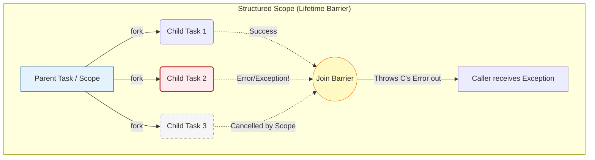

---
tags:
  - concurrency
  - structured-concurrency
  - project-loom
  - golang
  - coroutines
  - python
  - architecture
aliases:
  - Structured Concurrency
  - Loom and Go concurrency
---
# L1.CONC.10: Structured Concurrency (Go, Kotlin, C++, Java, Python)

> [!abstract] О лекции
> **Structured Concurrency (Структурная конкурентность)** относится к дикому миру многопоточности точно так же, как строгое структурное программирование (блоки `if/for/function`) относится к хаотичному оператору `GOTO`. Это фундаментальный архитектурный принцип, согласно которому **время жизни любого фонового потока (или асинхронной задачи) должно быть жестко и математически ограничено лексическим (синтаксическим) блоком кода, в котором он был создан**. 
> Поток-родитель аппаратно обязан дождаться полного завершения абсолютно всех своих порожденных детей. Если один из детей падает с фатальной ошибкой — система автоматически, каскадно отменяет работу всех остальных детей. Это возвращает многопоточному коду утерянную предсказуемость и надежность.

---
## 1. Фундаментальная системная проблема: «GOTO» для потоков

Чтобы глубоко понять суть и необходимость Структурной Конкурентности, нужно как историку вернуться в далекий 1968 год, к легендарной статье Эдсгера Дейкстры *"Go To Statement Considered Harmful"*. Дейкстра математически доказывал, что оператор `GOTO` вреден для индустрии, так как он позволяет потоку исполнения хаотично, без правил прыгать по исходному коду, делая физически невозможным статический анализ состояния программы в любой момент времени. Мы (индустрия) успешно заменили `GOTO` на **структурное программирование** (инкапсулированные блоки `if`, `while`, вызовы функций с локальным скоупом), где у каждого блока кода есть ровно одна предсказуемая точка входа и ровно одна точка выхода (или проброс исключения).

Однако, в области многопоточности на протяжении десятилетий мы продолжали совершать ту же самую фатальную ошибку. Классический, низкоуровневый запуск фонового потока (например, `new Thread().start()`, горутина `go func()`, или `CompletableFuture.supplyAsync()`) — это по своей сути и есть тот самый дикий `GOTO`, только скачок происходит не в пространстве машинных инструкций, а **в пространстве времени**.

### 1.1. Нарушение принципа «Черного ящика» (Causality violation)

В правильном, структурном программировании любая функция — это инкапсулированный **черный ящик**.
*   **Жесткий Контракт:** Вы как клиент вызываете функцию `myProcessFunc()`. Она делает тяжелую работу внутри себя. Когда она наконец возвращает управление вызывающему коду (`return`), вы имеете математическую гарантию, что заявленная работа **полностью и гарантированно** завершена (успешно с результатом, или с выброшенным Exception).
*   **Суровая Реальность (Fire-and-forget):** В старом, неструктурированном асинхронном коде функция `myProcessFunc()` может тихо запустить фоновый системный поток ОС и тут же, через микросекунду, вернуть `return`.
    *   Вызывающий код (Caller) наивно думает, что долгая операция полностью завершена, и продолжает свою бизнес-логику.
    *   Но на самом деле, "дети" (потоки) этой функции всё еще тайно продолжают работать в фоне операционной системы, агрессивно изменяя глобальное состояние, записывая логи в базу или модифицируя файлы на диске.
    *   Причинно-следственная связь (Causality) между временем жизни "родителя" и "детей" навсегда разорвана.

**Определение Архитектора — Fire-and-forget ("Выстрелил и забыл"):** Паттерн проектирования, при котором асинхронная задача запускается в пуле без какого-либо механизма отслеживания её фактического завершения, статуса или финального результата. В современных надежных распределенных системах (High Availability) это считается строгим **анти-паттерном**, так как он полностью лишает систему детерминированности и наблюдаемости.

### 1.2. Три главные архитектурные проблемы ("The Unholy Trinity")

Когда связь между лексическим временем жизни функции и физическим временем жизни порожденных ею потоков разорвана, в Production-системах неминуемо возникают три критические уязвимости:

#### А. Утечки задач (Thread / Task Leaks) и "Зомби-процессы"
В системных языках без автоматического сборщика мусора (C/C++) это классически вело к жестоким утечкам оперативной памяти (Memory Leaks). В управляемых языках с GC (Java, Go, C#) память собирается, но это ведет к гораздо более опасным утечкам **логических и системных ресурсов** (соединений к БД, файловых дескрипторов, портов).
*   *Сценарий из жизни:* HTTP-запрос от клиента запустил тяжелую аналитику в фоне (горутину) и через 5 секунд отвалился по клиентскому тайм-ауту (пользователь закрыл вкладку).
*   *Результат:* Клиент получил 504 Gateway Timeout. Но "забытый", осиротевший поток аналитики продолжает бесполезно молотить ядра CPU сервера и держать транзакцию/соединение с Базой Данных еще целый час. Если в момент пиковой нагрузки придет 1000 таких запросов, весь кластер ляжет от OOM (Out Of Memory) или Exhaustion пула соединений БД, хотя формально полезная нагрузка (RPS) на сервер кажется низкой.

#### Б. Потеря контекста ошибок (Swallowed Exceptions)
Это самая разрушительная проблема для SRE-инженера при ночной отладке инцидентов.
*   В синхронном мире: Если функция `A` вызывает функцию `B`, и `B` падает, сгенерированный стек-трейс (Stack Trace) четко показывает всю прозрачную цепочку вызовов.
*   В асинхронном мире: Если "отвязанный" фоновый поток падает с `NullPointerException`, **кому именно** он об этом сообщит? Его функция-родитель уже 10 минут как сделала `return` и забыла о нем.
*   *Результат:* Критическое бизнес-исключение либо бесследно теряется в пустоте (swallowed), либо вываливается в глобальный системный `UncaughtExceptionHandler`, где уже абсолютно нет никакого полезного контекста (какой именно `userId` или `orderId` вызвал эту ошибку? к какому HTTP `requestId` это относится?). Вы видите в Kibana голый `NullPointerException`, но не можете расследовать, какая именно бизнес-операция клиента к нему привела.

#### В. Кошмар ручной отмены (Cancellation Propagation)
Представьте огромное дерево микросервисных задач: Функция А запускает Б и В. Б в свою очередь параллельно запускает Г и Д.
Пользователь внезапно нажимает кнопку "Отмена заказа" для родительской функции А.
*   В старом, неструктурированном коде разработчику нужно вручную, через каждый слой бизнес-логики прокидывать флаги отмены (системные `Thread.isInterrupted()`, Go `context.Context`, C# `CancellationToken`) абсолютно каждому ребенку, внуку и правнуку в дереве.
*   Стоит программисту забыть (человеческий фактор) передать этот токен отмены всего в одну функцию на глубине 5 уровней — и у архитектуры мгновенно появляется "оторванный" (detached) поток, который будет продолжать ресурсоемкую работу вечно, полностью игнорируя сигнал отмены от своего прародителя.

### 1.3. Пример для наглядности (Java / Pseudo-code Junior'a)

Рассмотрим типичный, опасный "плохой" код, который часто пишет Junior/Middle разработчик, не знакомый с философией структурной конкурентности.

```java
// БИЗНЕС-АНТИПАТТЕРН: Unstructured Concurrency (Хаос)

public void handleUserRequest(String userId) {
    // 1. Наивно запускаем задачу сохранения логов в фоне ("чтобы быстрее ответить юзеру по HTTP")
    new Thread(() -> {
        try {
            // Эта I/O операция может упасть, заблокироваться на 10 минут или уйти в Deadlock
            database.saveAccessLog(userId); 
        } catch (Exception e) {
            // АРХИТЕКТУРНЫЙ БАГ: КОМУ уйдет эта системная ошибка? 
            // Функция handleUserRequest уже давно завершилась и вернула 200 OK.
            // Эта ошибка просто тихо напечатается в консоль сервера (stderr) и будет навсегда потеряна.
            e.printStackTrace(); 
        }
    }).start();

    // 2. Запускаем еще одну отвязанную задачу в пуле
    CompletableFuture.runAsync(() -> sendMetrics(userId));

    // 3. Быстро возвращаем ответ пользователю
    return; 
    
    // ФАКТ ДЛЯ АНАЛИЗА: В этот самый момент функция handleUserRequest полностью завершилась. Её стек очищен ОС.
    // Но ДВА жирных фоновых потока продолжают жить своей независимой жизнью в недрах сервера.
    // Если вызов database.saveAccessLog() зависнет на 10 лет из-за сетевого раздела (Split Brain), 
    // мы об этом никогда не узнаем из метрик функции handleUserRequest.
}
```

**Почему этот код — архитектурный GOTO?**
Потому что точка входа в `handleUserRequest` строго одна, а физических точек выхода из нее — **три** (один быстрый `return` для клиента и два скрытых завершения потоков в абсолютно неопределенном будущем времени). Вы, как ревьюер, физически не можете взглянуть на этот код и со 100% уверенностью сказать, когда именно *полностью и окончательно* закончится работа с ресурсами сервера по запросу `userId`.

### Итог раздела
Парадигма **Структурной Конкурентности** силой компилятора и дизайна API восстанавливает лексические скобки `{}` вокруг опасного многопоточного кода. Она навязывает индустрии новый железный инвариант:
> *«Любая функция математически не считается завершенной до тех пор, пока не завершились все до единого запущенные ею фоновые потоки».*

Это превращает страшную многопоточность обратно в интуитивно понятные "черные ящики", где ошибки всегда каскадно всплывают наверх (к вызывающему), системные ресурсы (RAM, сокеты) освобождаются строго автоматически при выходе из блока, а сложнейшая древовидная отмена (Cancellation) работает каскадно, как швейцарские часы.

---
## 2. Анатомия Структурной Конкурентности: Три Инварианта Архитектуры

Мы заменяем опасный хаос "просто запуска системных потоков" на строгие алгоритмические правила **инкапсуляции времени выполнения**.



### 2.1. Lexical Scoping (Лексическая, текстовая область видимости)
В старом, неструктурном мире время жизни потока вообще никак не связано с текстом кода, который его породил. Поток ОС — это глобальный ресурс ядра.
В парадигме структурной конкурентности время жизни абсолютно всех конкурентных (параллельных) задач жестко ограничено синтаксическим текстовым блоком в вашей IDE (scope).

*   **Формальное Определение:** Любая конкурентная операция (блок кода, `TaskGroup` в Python, `CoroutineScope` в Kotlin) считается алгоритмически завершенной тогда и только тогда, когда успешно (или с ошибкой) завершены **абсолютно все** операции, запущенные внутри её лексического блока.
*   **Жесткий Инвариант:** Поток управления программы (Control Flow) процессора физически не имеет права покинуть этот блок скоупа, пока все порожденные внутри него "дети" не завершат свою работу.
*   **Аналогия инженера:** Это работает точно так же, как фигурные скобки `{ ... }` для видимости локальных переменных в языке C/Java. Когда процессор выходит из функции, локальные переменные мгновенно уничтожаются (стек очищается). Здесь та же самая семантика: при выходе из скоупа гарантированно уничтожаются (завершаются) все порожденные потоки.

### 2.2. Parent-Child Ownership & Wait-for-Exit (Владение и абсолютная гарантия завершения)
Это системный принцип "Нет сиротам" (No Orphans). В классических Unix-системах процесс-родитель системно обязан сделать `waitpid` на своего форкнутого ребенка, иначе в ОС (в таблице процессов) навсегда появятся процессы-"зомби". В Java `ExecutorService` это золотое правило десятилетиями игнорировалось.

*   **Механика работы Скоупа:**
    1.  Родительская функция создает объект `Scope`.
    2.  Родитель порождает детей внутри скоупа (`fork`, `launch`).
    3.  Родитель выполняет операцию-барьер `join()` (часто это происходит неявно, автоматически, прямо в момент закрытия фигурной скобки блока).
*   **Архитектурный нюанс:** Это `join()` — не просто ожидание для синхронизации результатов. Это **абсолютный барьер безопасности (Memory Barrier)**. Любой код, идущий по тексту *после* блока структурной конкурентности, математически гарантированно "знает", что фоновых процессов, запущенных этим блоком, в памяти больше нет. Память чиста, кэши сброшены, все TCP коннекты корректно закрыты.
*   **Бизнес-ценность для Enterprise:** Это полностью устраняет гигантский класс трудноуловимых плавающих багов типа "Race Condition on Server Shutdown" (Гонка при выключении), когда приложение (Spring/Node) пытается грациозно выключиться перед деплоем, а "забытый" фоновый поток внезапно просыпается и пытается писать логи в уже физически закрытый пул коннектов к БД.

### 2.3. Bubble-Up Error Propagation & Cancellation (Всплытие ошибок и каскадная отмена)
Это самый алгоритмически сложный, но самый мощный и полезный для бизнеса аспект парадигмы. В обычном синхронном коде: если в итерации цикла `for` происходит `throw Exception`, весь цикл немедленно прерывается. Структурная конкурентность переносит этот логичный принцип на сложные параллельные распределенные задачи.

*   **Алгоритм Short-Circuiting (Короткое Замыкание вычислений):**
    Если внутри одного скоупа параллельно запущены 3 тяжелые задачи $A$, $B$ и $C$, и вдруг задача $B$ падает с сетевой ошибкой `Timeout`:
    1.  Объект Скоупа (Scope) мгновенно перехватывает упавшую ошибку задачи $B$.
    2.  Скоуп **автоматически, системно отправляет сигнал агрессивной отмены** (Cancellation Signal / Interrupt) еще живым и работающим задачам $A$ и $C$.
    3.  Скоуп терпеливо **дожидается**, пока $A$ и $C$ корректно завершатся в ответ на этот сигнал (выполнят блоки `finally`, закроют открытые файлы и освободят память).
    4.  И только после полной очистки ресурсов, скоуп выбрасывает исходное исключение (от задачи $B$) наружу, прямо в лицо родительскому вызывающему потоку.

*   **Почему это критично для Cloud Computing:** Если вовремя не отменить соседей $A$ и $C$, мы получим так называемую "утечку вычислений" (Wasted Computation in Cloud). Мы (бизнес-логика) уже точно знаем, что общая агрегированная операция провалилась из-за падения $B$, так зачем же нам продолжать тратить такты CPU и платить деньги AWS за завершение работы $A$ и $C$, результаты которых уже гарантированно никому не понадобятся?

---
### Прикладной пример: Архитектурный паттерн "Scatter-Gather" (Веерный запрос)

Представьте, что вы пишите высоконагруженный эндпоинт для агрегатора цен отелей. Нам нужно параллельно по сети опросить 3 внешних провайдера: `Booking`, `Expedia`, `Airbnb`.

#### Сценарий 1: Без структурной конкурентности (Java `CompletableFuture` / Старый Legacy подход):
```java
// ОЧЕНЬ ПЛОХОЙ КОД (Enterprise Anti-pattern)
CompletableFuture<Price> f1 = fetchBookingAsync();
CompletableFuture<Price> f2 = fetchExpediaAsync();
CompletableFuture<Price> f3 = fetchAirbnbAsync();

CompletableFuture.allOf(f1, f2, f3).join(); 
// Бизнес-Проблема 1: Если f1 сразу упал с NetworkError (500), тяжелые запросы f2 и f3 
// бесцельно продолжат работать еще 10 секунд. Мы впустую тратим свой трафик и лимиты API.
// Бизнес-Проблема 2: Ошибка f1 может быть легко проигнорирована программистом (swallowed), 
// или обработана криво из-за сложного API CompletableFuture.
// Бизнес-Проблема 3: Если пользователь не дождался и закрыл вкладку в браузере (отмена), 
// эти 3 запроса все равно дойдут до серверов партнеров, создавая паразитную мусорную нагрузку.
```

#### Сценарий 2: Со структурной конкурентностью (Java 21+ `StructuredTaskScope`):
```java
// ИДЕАЛЬНЫЙ АРХИТЕКТУРНЫЙ КОД (Современный стандарт)
try (var scope = new StructuredTaskScope.ShutdownOnFailure()) {
    // 1. Lexical Scope (Граница): начало защищенного блока try-with-resources
    
    // 2. Hierarchy: метод fork() аппаратно создает легковесные дочерние виртуальные потоки,
    // намертво привязанные к этому scope.
    Supplier<Price> task1 = scope.fork(() -> fetchBooking());
    Supplier<Price> task2 = scope.fork(() -> fetchExpedia());
    Supplier<Price> task3 = scope.fork(() -> fetchAirbnb());

    // 3. Error Propagation Barrier (Точка синхронизации)
    scope.join();           // Текущий поток Ждет завершения ВСЕХ 3-х задач ИЛИ самой ПЕРВОЙ ошибки
    scope.throwIfFailed();  // Если хоть кто-то упал (например task1), немедленно выбрасываем его exception
    
    // Если процессор дошел до этой строчки кода — мы имеем математическую гарантию, 
    // что ВСЕ три задачи завершились успешно. Никаких проверок на null не нужно.
    return aggregatePrices(task1.get(), task2.get(), task3.get());
    
} // Конец блока (Неявный вызов scope.close()): Железобетонная гарантия, что живых потоков в памяти больше нет.
catch (ExecutionException e) {
    // Если fetchBooking упал с 500 ошибкой в самом начале:
    // 1. Объект scope АВТОМАТИЧЕСКИ послал системный сигнал interrupt() в потоки fetchExpedia и fetchAirbnb.
    // 2. Scope дождался их экстренного завершения (освобождения сетевых пулов).
    // 3. Выбросил ошибку сюда, в наш catch блок.
    log.error("Global hotel search entirely failed due to partner error", e);
}
```

**Резюме для Senior эксперта:**
Структурная конкурентность навсегда превращает параллелизм из сложнейшей "архитектурной проблемы с гонками" в простую и скучную деталь реализации внутри локального блока. Она дает архитектурную гарантию, что любая, даже самая сложная разветвленная асинхронная операция снаружи для клиента выглядит и ведет себя точно так же, как абсолютно **атомарная, предсказуемая синхронная операция**.

---
## 3. Ландшафт языков (State of the Art)

Как технический лидер, вы обязаны знать, как именно этот паттерн реализован "под капотом" в стеке технологий вашей компании.

### 3.1. Java: Project Loom (JDK 21+) — Фундаментальная смена парадигмы Runtime

Project Loom — это не просто очередная новая библиотека (API) в Java. Это колоссальная, фундаментальная переработка самой математической модели планирования потоков глубоко в ядре C++ виртуальной машины JVM. До выхода JDK 21 платформа Java использовала жесткую модель **1:1** (один системный поток Java в куче = один тяжелый физический поток ядра ОС Linux/Windows). Loom внедряет в Java передовую модель **M:N** (Много-ко-Многим: Миллионы легковесных виртуальных потоков Java "прозрачно" маппятся (мультиплексируются) на N (например, 16) тяжелых рабочих потоков ядра ОС).

Как архитектор, вы должны четко разделять и понимать две разные составляющие Project Loom: **Virtual Threads** (Сам физический механизм исполнения) и **Structured Concurrency** (Новая высокоуровневая модель программирования).

#### A. Virtual Threads (Физический Механизм: "Двигатель")
Виртуальные потоки — это экстремально легковесные сущности (объекты в Heap), управляемые исключительно самой JVM (в User-Space), а не ядром ОС.

*   **Carrier Threads (Потоки-носители ОС):** Это реальные платформенные потоки ОС (Platform Threads), обычно это системный ForkJoinPool внутри JVM. Виртуальный поток "садится" (mount) на поток-носитель только на время выполнения реальных вычислений на CPU.
*   **Blocking I/O (Главная магия Loom):** Когда ваш виртуальный поток выполняет классическую блокирующую операцию (например, `socket.read()`, `Thread.sleep()` или ждет лок `lock.lock()`), он **физически не блокирует** драгоценный поток-носитель ОС!
    *   Ядро JVM детектирует системный вызов блокировки.
    *   JVM немедленно выполняет операцию **Unmount (Спешивание)**: она берет весь стек вызовов этого виртуального потока (в байтах) и просто сохраняет (копирует) его в обычную оперативную кучу (Garbage Collected Heap). 
    *   Сам поток-носитель ОС мгновенно освобождается и готов брать следующую задачу.
    *   Когда сетевая карта завершает I/O (пришли байты), ОС шлет сигнал (epoll), и виртуальный поток снова "пробуждается" и планируется на исполнение на любом свободном носителе.
*   **Цена Абстракции:** Создание одного виртуального потока стоит микросекунды времени и жалкие байты оперативной памяти (в отличие от монструозных 1-2 Мегабайт зарезервированного стека для каждого платформенного потока ОС).
*   **Бизнес-Результат:** Вы и ваши джуниоры снова можете писать предельно простой, читаемый, синхронный (блокирующий) код в старом стиле "Один выделенный поток на один HTTP запрос" (Thread-per-request), который при этом будет держать 100,000 соединений и масштабироваться так же потрясающе хорошо, как сложнейший асинхронный код (NIO / Netty / Spring WebFlux), но полностью избавляя вас от лапши "callback hell".

#### B. Structured Concurrency API (Модель: "Руль управления")
Поскольку виртуальные потоки теперь стоят сущие копейки по ресурсам RAM, разработчики начнут бесконтрольно создавать их миллионами. Без строгой структуры это неминуемо приведет к катастрофическому хаосу в логах и утечкам. API `StructuredTaskScope` (стабилизирующееся в новых JDK) принудительно вводит строгие правила гигиены.

**Ключевые понятия системного API:**
1.  **`StructuredTaskScope`:** Системный контейнер, намертво ограничивающий время жизни созданных в нем потоков. Он жестко реализует интерфейс `AutoCloseable`, что гарантирует автоматический вызов метода `close()` (а внутри него спрятано тяжелое ожидание завершения всех детей) при любом выходе (даже по ошибке) из синтаксического блока `try-with-resources`.
2.  **`Subtask<T>`:** Вместо старого, неуправляемого объекта `Future` (который можно было легально проигнорировать), новый метод `fork` возвращает специальный тип `Subtask`.
3.  **Policies (Политики каскадного завершения):**
    *   **`ShutdownOnFailure` (Упади при ошибке):** Паттерн "Всё или ничего" (All-or-Nothing). Если хоть один подпроцесс выбросил исключение — мгновенно отменяются (interrupt) все остальные братья, скоуп закрывается и пробрасывает ошибку наверх.
    *   **`ShutdownOnSuccess` (Гонка за успехом):** Паттерн "Спекулятивного выполнения" (High Availability pattern). Мы параллельно запускаем 3 одинаковых запроса к разным гео-репликам базы данных. Мы берем самый первый успешный и быстрый ответ, а остальные два медленных запроса — безжалостно и автоматически отменяем, экономя ресурсы.

#### C. Почему это критически важно для Архитектора (Enterprise view)?

1.  **Observability (Идеальная Наблюдаемость в логах):**
    *   В реактивном/асинхронном коде (RxJava, CompletableFuture) стек-трейс ошибки часто абсолютно бесполезен для дебага (он обрывается на системном классе EventLoop, не показывая, откуда пришел запрос).
    *   В архитектуре Loom стек-трейс **полностью сохраняется JVM в памяти**. Если фатальная ошибка произошла глубоко в дебрях 10-го виртуального дочернего потока, вы в логах увидите полную, кристально чистую цепочку вызовов, ведущую прямо к родительскому `StructuredTaskScope`. Это радикально, в разы упрощает ночную отладку инцидентов.
2.  **Thread Pinning (Опасная Проблема "прилипания" / Пиннинга):**
    *   **Архитектурный Warning:** Если ваш код внутри виртуального потока выполнит старый системный блок `synchronized` (или вызовет Native Method через JNI/C++), этот виртуальный поток намертво "прилипнет" (pin) к своему физическому потоку-носителю ОС. В этом ужасном сценарии любая I/O блокировка внутри `synchronized` заблокирует настоящий, дорогой поток ОС, ломая всю магию Loom.
    *   *Решение Архитектора:* Провести аудит кодовой базы и безжалостно заменять `synchronized` на современные `ReentrantLock` везде, где есть долгие I/O операции под локом.
3.  **Конец эры Reactive Streams (Смерть WebFlux?):**
    *   Для подавляющего большинства стандартных Enterprise-задач (CRUD приложения, оркестрация микросервисов) тяжелый реактивный подход (Spring WebFlux, Project Reactor) с появлением Loom становится неоправданно сложным и избыточным (Overengineering). Loom дает бизнесу абсолютно ту же самую пропускную способность (Throughput) при синхронном, легко читаемом и тестируемом коде. Реактивность останется жить только в нишевых задачах (Streaming Data Processing — обработка бесконечных потоков видео/данных).

**Итоговое Резюме по Java:** Project Loom элегантно возвращает платформу Java к её историческим корням — программированию простым, понятным, блокирующим кодом. Но теперь этот код обладает сумасшедшей масштабируемостью Node.js / Go. А парадигма Structured Concurrency делает этот миллионный поток кода безопасным, управляемым и лишенным утечек памяти.

### 3.2. Kotlin: Coroutines (Индустриальная Эталонная реализация)

Язык Kotlin не просто "добавил какие-то легковесные потоки сбоку". Главный архитектор Роман Елизаров и блестящая команда JetBrains изначально заложили принцип структурной конкурентности глубоко в сам **дизайн языка и его стандартных библиотек**. В отличие от многих других языков, где SC часто является просто опциональной надстройкой (библиотекой), в современном Kotlin вы физически (на уровне компиляции) не можете запустить корутину, не определив для неё строгий родительский контекст.

#### А. Фундаментальная абстракция: `CoroutineScope` и `CoroutineContext`
Многие разработчики ошибочно считают `CoroutineScope` просто синтаксической оберткой для группировки функций. На архитектурном уровне памяти:
*   **CoroutineScope** — это легковесный интерфейс, единственная задача которого — хранить ссылку на `CoroutineContext`. Его главная бизнес-цель — жестко ограничить **время жизни** (Lifetime) всех запущенных в нем корутин.
*   **CoroutineContext** — это неизменяемый (immutable) персистентный набор элементов, работающий как Map (словарь). Главный, системообразующий элемент здесь — интерфейс **`Job`** (Работа).
    *   Именно скрытый объект `Job` выстраивает в оперативной памяти жесткую иерархию графа "Родитель — Ребенок" (Parent-Child execution hierarchy).

#### Б. Инварианты Структурной Конкурентности в Kotlin
Система Kotlin математически гарантирует выполнение двух жестких правил, которые спасают ваш сервер от утечек памяти (Memory Leaks):

1.  **Parent waits for Children (Родитель всегда ждет детей):** Родительская корутина (или сам Scope) физически не может перейти в финальный статус (`COMPLETED`), пока не завершатся **абсолютно все** её дочерние корутины. Вам, как программисту, больше не нужно писать явный, ручной `.join()` для каждого ребенка (как в C#) — это ожидание намертво "зашито" в саму механику выхода из блока кода компилятором.
2.  **Parent is cancelled by Child (Принцип мушкетеров: Упал один - упали все):** Если хотя бы **одна** дочерняя корутина падает с любым исключением (кроме специального мирного `CancellationException`), она немедленно выполняет протокол:
    *   Отменяет и завершает саму себя.
    *   Посылает сигнал отмены своему Родителю вверх.
    *   Родитель, получив этот сигнал смерти, каскадно отменяет абсолютно всех **остальных** своих живых детей (братьев упавшего потока).
    *   Само Исключение (Exception) честно всплывает вверх по иерархии к разработчику для обработки.

Это классическое поведение "Атомарной неудачи" (Atomic Failure).

#### В. Инструменты Архитектора: `coroutineScope` vs `supervisorScope`

Как системный архитектор, именно вы выбираете политику обработки отказов (Failure Policy) в вашем микросервисе:

1.  **`coroutineScope { ... }` (Жесткая неразрывная связь):**
    Используется строго там, где под-задачи логически взаимозависимы для бизнеса.
    *   *Пример:* Вы загружаете данные юзера **И** его настройки биллинга. Если загрузка настроек упала с ошибкой 500, просто данные юзера нам уже бесполезны (мы не сможем отрендерить страницу) — Scope мгновенно отменяет всё, чтобы не тратить ценный серверный трафик и CPU.

2.  **`supervisorScope { ... }` (Жесткая Изоляция Сбоев):**
    Используется там, где запущенные задачи абсолютно логически независимы друг от друга.
    *   *Что внутри:* Под капотом используется специальный `SupervisorJob`.
    *   *Поведение:* Падение одного ребенка с ошибкой **вообще не** отменяет родителя и **никак не** отменяет других детей. Изоляция 100%.
    *   *Пример использования:* Обработка пула независимых входящих HTTP-запросов вашим сервером. Падение (Crash) обработчика одного кривого запроса (от одного клиента) не должно убивать весь сервер и запросы других клиентов!

#### Г. Архитектурный нюанс: Cooperative Cancellation (Кооперативная отмена)

Structured Concurrency в Kotlin (и везде) посылает цифровой сигнал отмены (вызывает метод `cancel()`), но она аппаратно **не убивает** физический поток жестко на полуслове (в Java метод `Thread.stop()` давно признан смертельно опасным и удален).
*   **Индустриальный Термин:** **Cooperative Cancellation (Кооперативная Отмена)**. Код внутри вашей корутины должен "сотрудничать" с фреймворком.
*   Если ваша корутина делает тяжелые непрерывные математические вычисления на CPU (например, `while(true) { calculateCrypto() }`), она **никогда не отменится**, пока вы явно, своими руками не проверите системный флаг `isActive` внутри цикла, или не вызовете системную функцию `ensureActive()`, которая выбросит исключение при отмене.
*   *Облегчение:* Абсолютно все стандартные библиотечные `suspend` функции Kotlin (`delay`, `withContext`, сетевой I/O) проверяют сигнал отмены глубоко внутри себя автоматически.

**Резюме для Expert Level:** В экосистеме Kotlin Структурная Конкурентность — это не просто набор классов API, это фундаментальная математическая гарантия целостности всего дерева выполнения приложения (`Job hierarchy`). Классическая "Утечка корутины" (Leaking coroutine) в синтаксически корректном Kotlin-коде **математически невозможна**, если вы только сами не выстрелите себе в ногу, используя глобальный анти-паттерн `GlobalScope`.

### 3.3. Python: Революция библиотеки Trio и современный стандарт `asyncio.TaskGroup`

Язык Python очень долгое время (до версии 3.11) находился в состоянии глубокого "подросткового кризиса" асинхронности. Стандартная библиотека `asyncio` изначально (в 3.4) наивно скопировала старые паттерны из Node.js и фреймворка Twisted (Future / Callback based архитектура). Это исторически породило чудовищную проблему «висячих зомби-задач» и абсолютно непредсказуемой, рваной обработки исключений в Python-бэкендах. Ситуация кардинально изменилась только благодаря влиянию open-source сообщества и принятию эпохального документа **PEP 654**.

#### А. Библиотека Trio: Идеологический первопроходец (The Nursery Pattern)
Невозможно понять современный Python, не упомянув революционную библиотеку **Trio** и гениальный манифест Натаниэля Дж. Смита *"Notes on structured concurrency, or: Go Statement Considered Harmful"*.
*   **Термин "Nursery" (Детские Ясли):** Смит ввел в индустрию прекрасную понятную метафору: вы как программист не можете просто так создать фоновый поток («ребенка») и безответственно забыть о нем. Вы аппаратно обязаны сдать его под присмотр в строгие «ясли» (специальный изолированный блок кода). Родительская функция не имеет физического права завершиться (сделать `return` и «выйти из комнаты»), пока абсолютно все дети в яслях не закончат свою игру или не уснут.
*   **Железный Инвариант Trio:** Асинхронная функция в Trio завершается тогда и только тогда, когда успешно завершились абсолютно все порожденные ею фоновые задачи. Это делает поток управления (Control Flow) в Python линейным, читаемым и кристально понятным.

#### Б. Старый `asyncio` (до Python 3.11): Мрачная Эпоха `gather` (The Old Way)
Долгие годы стандартом параллелизма в Python был вызов `asyncio.gather()`.
*   **Архитектурная Проблема:** Это неструктурированный, хрупкий подход. Если одна задача в пуле `gather` падает с исключением, все остальные задачи **продолжают молча работать** (поведению по умолчанию!), если вы явно не пропишете флаг `return_exceptions=False` (и даже в этом случае отмена соседей происходит не мгновенно и крайне неудобно для дебага).
*   **Утечки (Leaks):** Если вы наивно сделали `asyncio.create_task()`, но забыли сделать на него `await` (или случайно потеряли ссылку на объект таски в памяти), эта задача продолжает жить в фоне ("Fire-and-forget"), сжигая память сервера. А её исключение может внезапно всплыть в случайный момент времени в системных логах с загадочным сообщением `Task exception was never retrieved`, разрушая Observability проекта.

#### В. Новый стандарт: `asyncio.TaskGroup` (Python 3.11+)
С долгожданным выходом Python 3.11 концепция "Ясель" из Trio была официально и нативно внедрена прямо в стандартную библиотеку языка через асинхронный менеджер контекста `TaskGroup`.

**Как это работает (Внутренняя Механика Python):**
1.  **Context Manager:** Вы входите в защищенный лексический блок кода через `async with asyncio.TaskGroup() as tg`.
2.  **Scheduling (Планирование):** Строго внутри этого блока вы безопасно запускаете десятки задач через метод `tg.create_task()`. Они привязываются к группе.
3.  **Implicit Join (Скрытое неявное ожидание):** При физическом выходе из блока (вызов дандер-метода `__aexit__`) интерпретатор Python автоматически блокируется и ожидает завершения **всех** запущенных задач группы.
4.  **Cancellation Propagation (Лавина отмен):** Если хотя бы одна из задач группы падает с необработанным исключением, или если синхронный код внутри самого блока `with` падает с ошибкой:
    *   Системный объект `TaskGroup` немедленно рассылает сигнал жесткой отмены (`CancelledError`) абсолютно всем остальным живым задачам в этой группе.
    *   Он блокируется и ждет их полного и корректного завершения (выполнения блоков `finally`).
    *   После очистки он бросает наружу мощное агрегированное исключение для логирования.

#### Г. Новая концепция обработки множественных ошибок: `ExceptionGroup`
Структурная конкурентность неизбежно порождает новую математическую проблему: что делать языку, если **две независимые** параллельные задачи в группе упали одновременно, но по разным причинам (одна из-за БД, другая из-за сети HTTP)? В классическом блоке `try/except` физически можно выбросить и поймать только одно, одиночное исключение.

Для решения этого в Python 3.11 был встроен фундаментально новый тип данных: **`ExceptionGroup`**.
Это полноценное дерево (граф) исключений. `TaskGroup` аккуратно собирает абсолютно все ошибки от всех упавших задач группы и надежно заворачивает их в одну гигантскую упаковку `ExceptionGroup`.

**Пример для наглядности (Architectural Pattern):**

```python
import asyncio

async def critical_task():
    await asyncio.sleep(0.5)
    raise ValueError("Critical DB failure!") # 1. Задача падает с фатальной ошибкой

async def heavy_computation():
    try:
        await asyncio.sleep(10) # Долгая, дорогая работа на CPU (10 секунд)
    except asyncio.CancelledError:
        print("Computation stopped due to sibling failure. Resources saved.") # 3. Корректная обработка сигнала отмены
        raise # Обязательно пробрасываем CancelledError дальше!

async def main():
    try:
        # Начало жесткого Scope (Ясли). Функция main не выйдет за пределы with, пока всё не завершится.
        async with asyncio.TaskGroup() as tg:
            tg.create_task(critical_task())
            tg.create_task(heavy_computation())
            
        # Этот код гарантированно выполнится ТОЛЬКО если ВСЕ запущенные задачи были успешны.
        print("All tasks done perfectly") 
        
    except ExceptionGroup as eg:
        # 4. Ловим сразу целую ГРУППУ исключений!
        print(f"Caught multiple aggregated errors: {eg}")
        
        # Инсайт: Новый синтаксис Python 3.11 "except* ValueError:" (split exceptions) 
        # позволяет элегантно извлекать и обрабатывать только конкретные типы ошибок прямо из дерева ExceptionGroup, 
        # пропуская остальные дальше.
        
# Анализ Потока выполнения (Control Flow):
# 1. Запускаются обе задачи.
# 2. Через 0.5с critical_task падает.
# 3. TaskGroup ловит эту ошибку и мгновенно посылает сигнал cancel() в еще работающую 10 секунд heavy_computation.
# 4. heavy_computation перехватывает сигнал, завершается досрочно, экономя 9.5 секунд времени сервера!
# 5. TaskGroup собирает мусор и выбрасывает ExceptionGroup, содержащий наш ValueError наружу в main.
```

**Резюме для Senior Архитектора:**
Использование современных `TaskGroup` и `ExceptionGroup` в Python 3.11+ теперь является **строго обязательным стандартом** для любого серьезного Production-grade кода бэкендов (FastAPI / Starlette). Это навсегда устраняет гигантский класс трудноуловимых плавающих багов "зависших корутин" и делает обработку сбоев в микросервисной архитектуре кристально предсказуемой. Старые, легаси конструкции с использованием `asyncio.gather` следует на код-ревью помечать как критический "code smell" в новой современной кодовой базе.

### 3.4. Язык Go: Пакет Errgroup и суровая эмуляция структурности

В популярном языке Go концепция структурной конкурентности исторически **вообще не встроена в базовый синтаксис языка** (в разительном отличие от Kotlin или Python `asyncio`). Знаменитое ключевое слово `go` просто создает неблокирующую, "осиротевшую" фоновую горутину (detached execution), которая физически никак не привязана к стеку или области видимости функции-родителя.
*   **Утечки:** Если родительская функция успешно завершается, все её порожденные горутины продолжают молотить в фоне (классическая утечка ресурсов).
*   **Краш Системы:** Если любая фоновая горутина внезапно вызовет `panic`, мгновенно падает **всё приложение** целиком (если внутри горутины не написан громоздкий `defer recover()`).
*   **Потеря Ошибок:** Если горутина выполнила работу и хочет вернуть ошибку (`error`), классическому родителю просто некуда её принять (нужно вручную строить сложную систему каналов `chan error`).

Для элегантного архитектурного решения этих детских болезней Go, абсолютным и непререкаемым стандартом индустрии (де-факто) стал официальный системный пакет `golang.org/x/sync/errgroup`.

#### 3.4.1. Внутренняя Механика `errgroup`: Искусственное связывание жизненных циклов
Пакет `errgroup` под капотом виртуозно объединяет три базовых примитива синхронизации Go: `sync.WaitGroup` (для физического ожидания), системный `context.Context` (для рассылки сигналов отмены) и атомарный `sync.Once` (для безопасного захвата самой первой случившейся ошибки).

1.  **Context Propagation (Каскадное Распространение сигнала отмены):**
    Метод `errgroup.WithContext(parentCtx)` создает новый объект `Group` и генерирует новый дочерний контекст.
    *   **Жесткий Инвариант:** Если *хотя бы одна любая* из запущенных в этой группе функций вернет интерфейс ошибки `error != nil`, системный контекст всей группы **автоматически и мгновенно отменяется** (внутренний канал `ctx.Done()` аппаратно закрывается).
    *   Это служит широковещательным сигналом (Broadcast) абсолютно всем остальным горутинам в этой рабочей группе: "Ребята, сосед упал, миссия провалена, немедленно прекращайте работу".

2.  **First Error Wins (Побеждает только первая ошибка):**
    В разительном отличие от примитивного `WaitGroup`, где возвращаемые ошибки просто игнорируются, `errgroup` бережно запоминает в памяти **самую первую** вернувшуюся ошибку. Все последующие ошибки от других падающих горутин тихо отбрасываются (так как архитектурно они обычно являются просто прямым следствием отмены контекста из-за первой ошибки).

3.  **Wait Barrier (Фундаментальный Барьер ожидания):**
    Системный вызов метода `Wait()` намертво блокирует выполнение родительской горутины до тех пор, пока **все до единой** дочерние горутины в группе не завершатся (не важно, успешно или с ошибкой). Именно этот барьер обеспечивает ту самую структурную целостность: мы гарантированно не выходим из логического блока кода, пока наши дети живы в памяти.

#### 3.4.2. Bounded Concurrency (Жесткое Ограничение параллелизма - Bulkhead pattern)
В проектировании высоконагруженных микросервисов критически важно не только уметь быстро запустить тысячи задач, но и аппаратно ограничить максимальное количество одновременно работающих воркеров, чтобы случайно не "положить" (DDoS) свою же базу данных или лимитированный внешний API партнера (реализация паттерна Backpressure).
*   В современный объект `errgroup` встроен мощный семафор (канал), который управляется через вызов метода `SetLimit(n)`.
*   Если вы поставили лимит `10`, то при попытке запустить одиннадцатую горутину, сам метод `g.Go()` физически заблокируется и будет ждать, пока кто-то из первой десятки не завершит работу.
*   Это позволяет инженеру абсолютно безопасно скармливать сервису гигантские списки на 100,000 элементов, имея гарантию, что в памяти ОС физически будут существовать только `n` активных горутин.

#### 3.4.3. Критический недостаток архитектуры: Panic Propagation
**Внимание Системного Архитектора (Red Flag):** Стандартный `errgroup` аппаратно **не** ловит и не изолирует системные паники (`panic`).
Если любая одна из миллионов ваших горутин внутри пула вызовет `panic` (например, деление на ноль или разыменование nil-указателя), а вы забыли обернуть её код в `defer recover()`, с грохотом упадет **весь процесс операционной системы** (рантайм Go выполнит жесткий краш, и Kubernetes придется рестартовать под).
*   *Архитектурное Решение для Enterprise:* Использовать более продвинутые open-source обертки (например, библиотеку `sourcegraph/conc`), или написать свой собственный, корпоративный middleware-метод поверх `g.Go()`, который автоматически ловит `panic` через `recover()` и элегантно превращает её в обычный возвращаемый интерфейс `error`.

#### 3.4.4. Эталонный Пример уровня Production
Классический код, который безупречно демонстрирует архитектурный паттерн "Fan-Out / Fan-In" (разветвление и сборка) с жестким ограничением параллелизма (лимитом), автоматической отменой по первой ошибке и потокобезопасной агрегацией результатов в массив.

```go
import (
    "context"
    "fmt"
    "golang.org/x/sync/errgroup"
)

// Data - DTO для результата обработки
type Data struct {
    ID  int
    Val string
}

// Функция-процессор для обработки батча ID
func ProcessBatch(ctx context.Context, ids []int) ([]Data, error) {
    // 1. Создаем группу с привязкой к родительскому контексту. 
    // Если любая горутина упадет, groupCtx мгновенно отменится.
    g, groupCtx := errgroup.WithContext(ctx)
    
    // 2. Ограничиваем concurrency (Внедряем паттерн Bulkhead).
    // Одновременно физически работает не более 10 горутин-воркеров, чтобы не убить нашу БД.
    g.SetLimit(10)

    // Предварительно аллоцируем слайс нужного размера, чтобы избежать мьютексов при записи
    results := make([]Data, len(ids))

    for i, id := range ids {
        // Обязательный захват переменных цикла для замыкания (до Go 1.22)
        i, id := i, id 
        
        // 3. Запускаем фоновую задачу. Вызов g.Go заблокируется, если лимит в 10 превышен!
        g.Go(func() error {
            // ВАЖНОЕ ПРАВИЛО: Всегда проверяем контекст перед началом тяжелой работы 
            // Это и есть Cooperative Cancellation! Если другой worker упал, мы выйдем отсюда за 1нс.
            if err := groupCtx.Err(); err != nil {
                return err 
            }

            // Симуляция тяжелой работы. Мы ОБЯЗАНЫ передать дочерний groupCtx внутрь БД-вызова, 
            // чтобы мгновенно прервать I/O сетевой запрос (сокет), если соседний worker упадет с ошибкой.
            val, err := fetchFromExternalAPI(groupCtx, id)
            if err != nil {
                // Возвращаем ошибку. Рантайм errgroup поймает её и отменит groupCtx для всех остальных!
                return fmt.Errorf("Item id %d completely failed: %w", id, err) 
            }

            // Идеально потокобезопасная запись результата (без тормозящих Mutex), 
            // так как каждая отдельная горутина пишет строго в свой уникальный индекс [i] слайса.
            results[i] = Data{ID: id, Val: val}
            return nil // Успех
        })
    }

    // 4. Главный Барьер (Join Point). Текущая функция блокируется и Ждет завершения абсолютно ВСЕХ горутин.
    // Если были ошибки, метод вернет ПЕРВУЮ (самую раннюю) ошибку, которая случилась.
    if err := g.Wait(); err != nil {
        return nil, err // Весь огромный батч данных архитектурно считается проваленным (Fail-Fast)
    }

    // Если мы дошли сюда - мы гарантируем, что все N задач выполнились успешно.
    return results, nil
}
```

#### Термины и Определения для Собеседования (Go):
*   **Goroutine Leak (Фатальная Утечка горутины):** Ситуация, когда горутина была успешно запущена `go func()`, но родительский метод вернул результат и навсегда потерял над ней контроль. Эта горутина висит в оперативной памяти сервера вечно (Обычно она тупо заблокирована на чтении из пустого канала `chan` или ждет ответа от мертвого TCP сокета). Паттерн `errgroup` физически предотвращает это, жестко гарантируя ожидание в методе `Wait`.
*   **Cooperative Cancellation (Кооперативная отмена):** В философии Go в принципе невозможно убить или прервать горутину принудительно снаружи. Поток должен *сам, добровольно* проверить закрытие канала `<-ctx.Done()` и завершиться через `return`. Пакет `errgroup` полностью автоматизирует рассылку сигнала отмены, но вот проверять этот сигнал — это святая обязанность и ответственность разработчика бизнес-кода.
*   **Fan-Out (Веер):** Архитектурный паттерн мощного распараллеливания одной большой входной задачи на множество мелких, независимых подзадач-воркеров.

### 3.5. C++: Революция Senders / Receivers (Пропозал P2300, Target C++26)

Системный язык C++ невероятно долгое время серьезно отставал от конкурентов в эргономике асинхронного программирования. Классические инструменты `std::future` и `std::async` (из C++11) были архитектурно "жадными" (они запускали тяжелый поток операционной системы мгновенно), требовали дорогих аллокаций динамической памяти в куче (Heap Allocation) под разделяемое состояние (Shared State) и требовали сложнейшей синхронизации на мьютексах.
Грядущее предложение в стандарт **P2300 (библиотека `std::execution`)** фундаментально меняет правила игры. Оно внедряет **Structured Concurrency** на самом низком уровне системы типов компилятора, обеспечивая легендарную абстракцию **Zero-Cost Abstraction** (без накладных расходов в рантайме).

#### 3.5.1. Фундаментальная смена парадигмы: Eager (Жадность) vs Lazy (Ленивость)
*   **Eager (Классика `std::future`):** Вы как программист создаете задачу, она *тут же, мгновенно* летит на исполнение в пул потоков ОС. Результат где-то в будущем ждет вас в объекте-контейнере `future`. Проблема архитектуры: такие задачи невероятно сложно компоновать в цепочки (Chain), их физически сложно отменить (cancel), и они несут огромный оверхед на поддержание `Shared State` между потоком-создателем и потоком-исполнителем.
*   **Lazy (Современные Senders):** В новой модели вы только *математически описываете граф вычислений* (Pipeline). Физически в процессоре ничего не происходит (ни один байт не выделяется и ни один поток не запускается), пока вы в самом конце явно не вызовете функцию-триггер `sync_wait` или `start`.
    *   *Аналогия:* Это очень похоже на построение сложного SQL-запроса через ORM (например, Entity Framework или Hibernate): вы долго конструируете сложный `SELECT` с кучей `JOIN`, `WHERE` и фильтров, но база данных даже не знает об этом и не бежит исполнять запрос, пока вы физически не дернете метод `.execute()` или `.toList()`.

#### 3.5.2. Основные термины новой системы (Vocabulary Types)
Вам, как системному архитектору C++, теперь нужно понимать новую святую триаду интерфейсов:

1.  **Sender (Отправитель данных):** Объект, который чисто декларативно описывает будущую асинхронную операцию. Это своеобразный "рецепт" вычисления. Он точно знает *как именно* нужно создать результат, но сам еще не делает абсолютно ничего.
    *   *Примеры Sender-ов:* "Асинхронно прочитать 1КБ из файла на диске", "Подождать на таймере ОС 5 секунд", "Отправить HTTP GET".
2.  **Receiver (Получатель результата):** Обобщенный, типизированный колбэк (Callback). У него по стандарту есть строго три канала (метода) для связи:
    *   `set_value(data)`: Вызывается при успешном завершении алгоритма (передает результат).
    *   `set_error(exception_ptr)`: Вызывается при падении (работает как асинхронный `catch` для исключений).
    *   `set_stopped()`: Вызывается при получении сигнала отмены (Cancellation). **Это фундаментальная база для структурной конкурентности** — сигнал отмены прозрачно и мгновенно пронизывает весь граф выполнения сверху вниз.
3.  **Scheduler (Планировщик исполнения):** Легковесная абстракция того, *где именно аппаратно* и *как* должен физически выполняться ваш машинный код.
    *   Это может быть `system_thread_pool` (пул потоков ЦПУ), `GPU context` (видеокарта CUDA), `SIMD lane` (векторные инструкции) или специфичный `Network IO event loop` (например, `epoll` или `io_uring`).
    *   Концепция: Сендеры могут динамически, на лету "перепрыгивать" между разными планировщиками в процессе конвейера (операторы `on`, `transfer`).

#### 3.5.3. Как конкретно это реализует Structured Concurrency на уровне компилятора?
В разительное отличие от Go или Java Project Loom, где мощный языковой Runtime (ВМ) берет на себя всю тяжелую работу по динамическому управлению и переключению стеков в памяти, в суровом C++ вся структура задается на этапе компиляции через **статическую композицию типов** (Templates).
Весь жизненный цикл асинхронных операций аппаратно привязан к огромному сгенерированному компилятором объекту **Operation State**. Эта структура данных в 99% случаев живет не в куче, а прямо на **статическом стеке (Stack)** родительского потока! Нет вызова `new` / `malloc` -> нет аллокаций памяти -> математически невозможны утечки памяти (Memory Leaks).

**Пример (Синтаксический Псевдокод в стиле современного P2300 std::execution):**

```cpp
namespace ex = std::execution;

// 1. ДЕКЛАРАТИВНАЯ ФАЗА: Описываем сложнейший граф асинхронных задач (Pipeline)
// В этот момент CPU просто собирает структуру данных на стеке. Вычислений нет!
auto work = ex::just(request_id)                     // 1. Старт конвейера: просто передаем ID запроса в трубу
    | ex::transfer(io_pool_scheduler)                // 2. Прыжок: Приказываем переключить контекст в пул потоков I/O
    | ex::then([](int id) {                          // 3. Бизнес-логика: Делаем тяжелый запрос (чтение) из Базы Данных
        return load_data_from_db(id); 
      })
    | ex::transfer(cpu_pool_scheduler)               // 4. Прыжок: Данные загружены. Уходим из I/O пула в быстрый CPU пул
    | ex::then([](Data d) {                          // 5. Бизнес-логика: Делаем тяжелую математику (ML/AI обработка данных)
        return process_heavy_ai_logic(d);
      })
    | ex::let_error([](std::exception_ptr e) {       // 6. Изолированная обработка ошибок (Try/Catch встроенный прямо внутрь графа!)
        log_error("Pipeline failed", e);
        return ex::just(Data{}); // Graceful Degradation: возвращаем дефолтный (Fallback) пустой ответ
      });

// --- ВАЖНО: До этого момента (до этой строчки кода) НИ ОДИН системный поток ОС не был запущен ---

// 2. ФАЗА ИСПОЛНЕНИЯ: Запуск и блокирующее ожидание (Structured Concurrency Point)
// Вызов sync_wait - это железобетонный барьер. Он гарантирует, что мы (текущий поток) 
// физически не выйдем из этой функции, пока абсолютно ВЕСЬ вышеописанный граф задач не завершится (успехом или ошибкой).
// Если оператор нажмет "Отмена" (используя stop_source) - всё гигантское дерево операций 
// корректно, безопасно и без утечек памяти "схлопнется" и очистится (вызовутся деструкторы).
auto final_result = ex::sync_wait(std::move(work)); 
```

#### 3.5.4. Why it fundamentally matters (Мнение Архитектора / Expert Analysis)
1.  **No Hidden Allocations (Полное отсутствие аллокаций в Куче):** Сверх-умный компилятор C++ (GCC/Clang) способен взять весь этот многоэтажный граф `work` (со всеми его колбэками, `transfer` и `then`) и "сплющить" (flatten) его в одну единственную, плоскую, оптимальную структуру данных прямо на локальном стеке (Stack). Это невероятно, критически важно для систем реального времени (Embedded системы, HFT - биржевой высокочастотный трейдинг, и движки GameDev), где любой вызов аллокатора (`new` / `malloc`) вызывает недопустимые микро-задержки (jitter).
2.  **Generic Async (Агностика к железу):** Этот абсолютно же самый высокоуровневый код `work` может без изменений работать на видеокарте GPU (например, используя официальную имплементацию `std::execution` от NVidia). Вы как программист пишете чистую бизнес-логику всего один раз, а меняете только провайдера планировщика `Scheduler` (CPU, GPU, Network).
3.  **Cancellation Propagation (Нативная аппаратная отмена):** Если вы программно отмените корневой `sync_wait` (или используете системный токен `stop_source`), сигнал `set_stopped` молниеносно, каскадно прошьет (пройдет через) все текущие I/O, CPU и БД операции графа, мгновенно прерывая их работу без написания сложного ручного кода проверок (как это приходится делать в Go или C#).

**Архитектурный Итог по C++:** Появление класса `std::jthread` (в стандарте C++20) — это была лишь простая косметическая RAII-обертка (обеспечивающая автоматический вызов деструктора и `join` в конце области видимости). Настоящая, промышленная, мощная структурная конкурентность (Structured Concurrency) приходит в мир плюсов только с внедрением архитектуры **Senders/Receivers (P2300)**. Она полностью превращает грязную, "опасную" работу с потоками и мьютексами в чистый, математический, декларативный функциональный пайплайн, лишенный непредсказуемых побочных эффектов (side-effects).

---
## 4. Архитектурная значимость в Enterprise: От хаоса к тотальному детерминизму

Для уровня Senior / Staff Engineer / Solution Architect внедрение парадигмы Структурной Конкурентности (SC) в кодовую базу — это абсолютно не вкусовой вопрос «чистоты и красоты кода», а фундаментальный вопрос **выживаемости и устойчивости всей системы под пиковой нагрузкой (System Resilience)**. Это качественный эволюционный переход от опасного ручного управления системными ресурсами к математически гарантированному автоматическому управлению. Этот переход исторически аналогичен революционному переходу от ручного управления памятью через `malloc/free` к автоматической сборке мусора (GC) в Java/C# или парадигме RAII в C++ / Rust.

### 4.1. Детерминированное управление системными ресурсами (RAII паттерн для потоков)
В старом, неструктурированном подходе (`Fire-and-Forget`) фоновый процесс (поток) физически может пережить функцию-создателя и продолжить висеть в памяти годами. Это порождает в архитектуре концепцию **Zombie Tasks** (задачи-зомби).

*   **Классическая Проблема Индустрии:** Тяжелый HTTP-запрос от мобильного клиента пришел на бэкенд, контроллер запустил огромную агрегацию данных (аналитику) в пуле фоновых потоков. Но у клиента пропал интернет (он заехал в туннель), и он отменил запрос (отвалился по таймауту балансировщика). В старой модели бэкенда этот фоновый поток не узнает об отрыве клиента и продолжит усердно "молотить" ядра CPU, загружать диски и держать драгоценный коннект к базе данных PostgreSQL еще 10 минут.
*   **Элегантное Решение от SC:** Применение принципа **Black Box (Черный Ящик)**. Функция (API endpoint), использующая SC, предоставляет железобетонную гарантию: *«Когда я возвращаю управление (делаю `return` с ответом или падаю с `Exception`), абсолютно все запущенные мной внутри дочерние фоновые процессы гарантированно завершены и мертвы»*.
*   **Архитектурный бизнес-выигрыш:** Вы (SRE команда) получаете 100% математическую гарантию полного отсутствия утечек горутин/потоков/Task-ов в проде. Если графики в Grafana вдруг показывают резкий, аномальный рост числа запущенных горутин/тредов — вы точно и безошибочно знаете, что проблема кроется в зависании *текущих, прямо сейчас активных* пользовательских запросах (например, отвалился DNS-резолв), а не в скопившихся "хвостах" или зомби-потоках недельной давности.

### 4.2. Short-Circuiting и Агрессивный Error Propagation (Архитектурный Принцип «Падаем мгновенно»)
В сложных распределенных микросервисных системах состояние "частичного сбоя" (Partial Failure — когда один сервер из пяти работает, но очень медленно) — это самый разрушительный и сложный для отладки сценарий (гораздо хуже, чем полный отказ базы данных).

*   **Сценарий из E-Commerce:** Вы (API Gateway) делаете веерный Fan-Out запрос одновременно к 3 разным изолированным микросервисам для сборки карточки товара: `Price` (Цена), `Stock` (Наличие на складе), `Description` (Текст описания).
*   **Без SC (Медленная Смерть):** Сервис инвентаризации `Stock` мгновенно вернул фатальную ошибку HTTP 500 (БД легла). Но сервис агрегации цен `Price` продолжает тужиться и пытается отвечать вам еще 5 долгих секунд. Ваш главный Gateway тупо ждет эти 5 секунд абсолютно впустую, занимая порт, чтобы в самом конце всё равно вернуть ошибку `500 Server Error` расстроенному пользователю (ведь без знания "Наличия" товар не продать).
*   **С внедренным SC (Хирургическая Отмена):** Мгновенная ошибка в одной ветке (child task `Stock`) автоматически, на уровне рантайма языка (Loom/Kotlin) рассылает электрический сигнал **отмены** (Cancellation Signal / Interrupt) абсолютно всем активным сиблингам (соседним работающим задачам `Price` и `Description`), а затем мгновенно прерывает работу самого родительского скоупа (Gateway).
*   **Индустриальный Термин:** Такое поведение называется **Short-Circuiting** (короткое замыкание) бизнес-логики. Вы колоссально экономите вычислительные ресурсы всего кластера, не выполняя "белку в колесе" — работу, финальный результат которой математически уже никому не понадобится.

### 4.3. Сохранение Контекста и Observability (Технологии Scoped Values / ThreadLocal)
Это самая большая, кровоточащая боль в индустрии при настройке распределенной трассировки (OpenTelemetry, Jaeger) и сквозного логирования (ELK).

*   **Проблема Legacy `ThreadLocal`:** В современных высоконагруженных реактивных (Spring WebFlux) или асинхронных (.NET Async) средах один единственный логический HTTP-запрос от юзера может последовательно (или параллельно) обрабатываться десятком абсолютно разных физических потоков из ThreadPool. Классические переменные `ThreadLocal` (в которых архитекторы обычно хранят сквозные идентификаторы `trace_id`, `user_id`, `tenant_id`) физически привязаны к потоку ОС. При перескоке задачи на другой поток пула контекст мгновенно теряется, и логи обрываются! Копировать эти контексты вручную (через хаки типа `MDC.put` / `MDC.clear` в Java или AsyncLocal в C#) — это невероятно дорого по CPU (аллокации HashMaps) и дико подвержено человеческим ошибкам (забыл скопировать — потерял лог).
*   **Революционное Решение от SC:** Поскольку алгоритмическая структура задач теперь строго иерархична (как дерево каталогов в ОС), современный язык (Java 21+, Go Context, Kotlin CoroutineContext) позволяет элегантно "математически наследовать" любые данные прямо из родительского Scope вниз, к детям.
*   **Пример (Инновация Java Scoped Values - JEP 464):** Новая абстракция `ScopedValue` физически привязывается не к мутабельному потоку ОС, а к *самому лексическому блоку кода* в памяти. Абсолютно все тысячи дочерних виртуальных потоков (Loom), рожденные внутри этого текстового блока, аппаратно "видят" (имеют иммутабельный доступ на чтение) этот общий контекст (`trace_id`) с околонулевым оверхедом (O(1)), вообще без накладных расходов на создание и бесконечное копирование тяжелых `ThreadLocalMap`.

### 4.4. Graceful Shutdown (Грациозная деградация) и Кооперативная отмена
Современный оркестратор Kubernetes (K8s) при обновлении пода дает вашему приложению ровно 30 секунд "последнего желания" на завершение работы (посылает мягкий сигнал `SIGTERM`), прежде чем безжалостно "убить выстрелом в голову" ваш процесс (сигнал `SIGKILL`).

*   **Без SC (Ужас DevOps):** У вас в приложении крутится глобальный, синглтонный `ThreadPool` или `Task.Factory`. Как архитектурно чисто сказать ему: "Друг, пожалуйста доделай свои текущие начатые транзакции в БД, но категорически не бери новые из очереди, и, кстати, если какая-то текущая задача зависла и висит дольше 5 секунд — убей её принудительно"? Разработчикам приходится писать сложнейшую, глючную кастомную логику с сотнями флагов `isShuttingDown` и кастомными `CountDownLatch`.
*   **С идеальным SC (Как в оркестраторе):** Вся структура вашей программы с точки зрения архитектуры — это одно единственное гигантское дерево (граф) задач, с единым корнем в функции `main()`.
    1.  От Kubernetes приходит сигнал `SIGTERM`.
    2.  Ваш обработчик сигнала элегантно отменяет самый главный, корневой контекст приложения (`Root Scope`).
    3.  Этот цифровой сигнал отмены каскадно (как разрушительная лавина) за доли секунды спускается по ветвям дерева к абсолютно каждому активному листу (работающему HTTP-хендлеру, долгому DB-воркеру, Kafka-консюмеру).
    4.  Каждая конкретная микро-задача, по правилу `Cooperative Cancellation` регулярно проверяя свой флаг `isActive` / `ctx.Done()`, мгновенно замечает сигнал, корректно откатывает локальную транзакцию, закрывает сетевые ресурсы и послушно завершается.
*   **Архитектурный Итог:** Идеально предсказуемое, математически точное время грациозной остановки сервиса (Graceful Shutdown) без обрыва транзакций и потери пользовательских данных на половине пути.

---
### Наглядный пример для проектирования (Паттерн "Bank Dashboard")

Представьте, что вы системный архитектор и проектируете тяжелый агрегационный API эндпоинт для главного дашборда банковского приложения, который должен за секунду показать пользователю:
1.  Текущий Баланс по всем счетам (работает очень быстро).
2.  Список последних транзакций (работает со средней скоростью, тяжелый SQL).
3.  Персональное Кредитное предложение (работает мучительно медленно, требует синхронного похода по HTTP во внешний партнерский скоринг-сервис).

**Неструктурированный, устаревший подход (Java `CompletableFuture` / JS `Promise.all`):**
```java
// ОЧЕНЬ ПЛОХО: Нет никакой иерархической связи между независимыми задачами. Это 3 сироты.
CompletableFuture<Balance> f1 = getBalanceAsync();
CompletableFuture<Tx> f2 = getTransactionsAsync();
CompletableFuture<Offer> f3 = getCreditOfferAsync();

// БИЗНЕС РИСК 1: Если внешний сервис f3 (Кредиты) упадет с 500 ошибкой, 
// тяжелые SQL запросы f1 и f2 продолжат нагружать вашу базу данных. Зачем? Дашборд мы уже не покажем.
// БИЗНЕС РИСК 2: Если пользователь устал ждать ответа от партнера и нажал "Отмена" (или закрыл iPhone), 
// тяжелый вызов f3 (скоринг) продолжит стучаться к партнеру, а партнер спишет с вас реальные $0.10 за API call.
CompletableFuture.allOf(f1, f2, f3).join(); 
```

**Структурированный, современный подход (Java 21 `StructuredTaskScope`):**
```java
// ИДЕАЛЬНО: Единый, нерушимый лексический блок завершения операций
try (var scope = new StructuredTaskScope.ShutdownOnFailure()) {
    // 1. Форкаем задачи. Они аппаратно привязываются пуповиной к родительскому 'scope'.
    Supplier<Balance> balance = scope.fork(() -> getBalance());
    Supplier<Tx> tx = scope.fork(() -> getTransactions());
    Supplier<Offer> offer = scope.fork(() -> getCreditOffer());

    // 2. Ждем результатов выполнения (Барьер).
    // МАГИЯ: Если getCreditOffer() выбросит исключение TimeoutException -> 
    // объект scope АВТОМАТИЧЕСКИ, за миллисекунды отменит getBalance() и getTransactions() на уровне ядер процессора, 
    // спасая мощности вашей Базы Данных, если они еще не успели завершиться.
    scope.join(); 
    scope.throwIfFailed(); // Мгновенно пробрасываем пойманную внутри ошибку наверх контроллеру (HTTP 500)

    // Возвращаем собранный агрегат
    return new Dashboard(balance.get(), tx.get(), offer.get());
}
// 3. ГАРАНТИЯ: При физическом выходе процессора за скобку 'try', математически гарантировано, 
// что никаких "висячих", недобитых фоновых потоков от этого юзера на сервере не осталось. Утечек 0.
```

### Главное Резюме для Системного Архитектора
Внедряя парадигму **Structured Concurrency** в масштабах всей компании, вы фундаментально меняете парадигму разработки бэкенда:
1.  **Default behavior (Безопасность по умолчанию):** Фатальная утечка потока (Thread Leak) становится практически невозможной по умолчанию (чтобы "потерять" поток в памяти, Junior-разработчику нужно будет очень сильно постараться и написать много хакерского кода).
2.  **Latency (Ускорение):** Вы радикально снижаете показатель p99 latency (хвостовую задержку) для всего кластера исключительно за счет агрессивного алгоритма Short-Circuiting (сверхбыстрой каскадной отмены ненужной работы в соседних ветках при первых признаках сбоя).
3.  **Stability (Сверх-Надежность):** Система ведет себя абсолютно предсказуемо и детерминированно как при экстремальной пиковой нагрузке (Black Friday), так и при штатном выключении нод Kubernetes (Rolling Update).

---
## 5. Архитектурный Чек-лист уровня Awareness (Для код-ревью и собеседований)

Вы как инженер действительно понимаете фундаментальную глубину темы, если безоговорочно согласны со следующими утверждениями:

1.  **Fire-and-forget is harmful (Паттерн "Запустил и забыл" — это яд):** Абсолютно любой системный запуск фоновой задачи (создание горутины, таски) без продуманного механизма ожидания её физического завершения (Join) или гарантированного получения её исключения (Error) — это грубейший технический долг (Technical Debt), который в будущем убьет ваш сервер утечкой памяти (OOM).
2.  **Cancellation is strictly mandatory (Отмена — это обязательство):** В современных ОС категорически нельзя просто "убить" поток снаружи (Метод `Thread.stop()` давно признан смертельно опасным, так как он оставляет локи заблокированными, а память - "грязной"). Поток обязан разумно сотрудничать с архитектурой (`cooperative cancellation`) — он должен в цикле регулярно проверять системный флаг `isInterrupted()`, `ctx.Done()` или статус `isActive` и корректно, самостоятельно завершать свою работу, очищая ресурсы (закрывая файлы и сокеты).
3.  **Scopes over Globals (Изоляция важнее глобальности):** Использование любых глобальных, ничем не ограниченных скоупов (например, пресловутый `GlobalScope` в языке Kotlin или `Task.Run` без токенов в C#) в обычных прикладных бизнес-эндпоинтах — это жесткий архитектурный анти-паттерн, который должен автоматически блокироваться линтерами на этапе CI/CD.

### Финальное Заключение
Парадигма **Structured Concurrency** делает невероятно сложный, пугающий многопоточный код абсолютно "скучным" для чтения. И это технологически прекрасно.
Она навсегда превращает конкурентность из "опасной черной магии" (которая была доступна только избранным Senior-хакерам, знающим работу ОС) в прозрачный, предсказуемый лексический блок кода, который ведет себя и отлаживается точно так же легко, как обычный линейный цикл `for`. 
В современных, надежных Enterprise-проектах (начиная с экосистем Java 21+, Kotlin, Python 3.11+ и C++26) любое использование старых, архаичных неструктурированных подходов (таких как `new Thread`, создание горутины без `errgroup` или `asyncio.create_task` без привязки к `TaskGroup`) должно жестко, без компромиссов блокироваться Лидами на этапе Code Review.