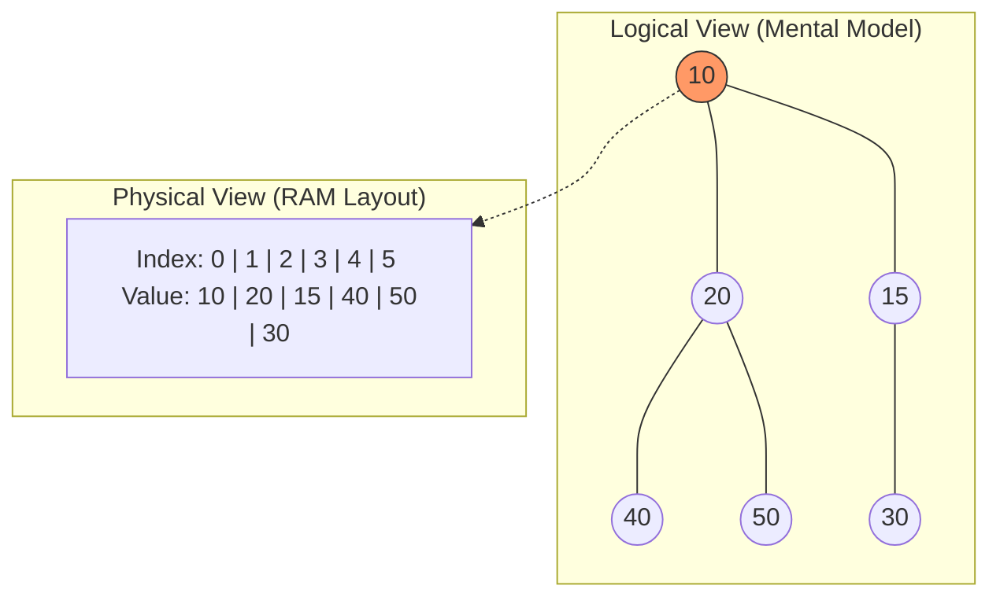
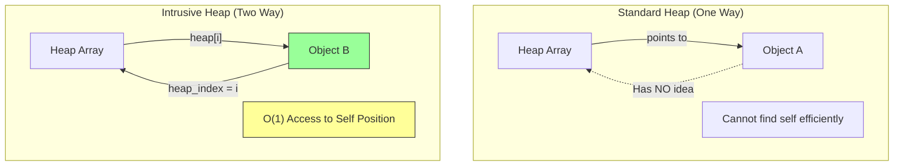
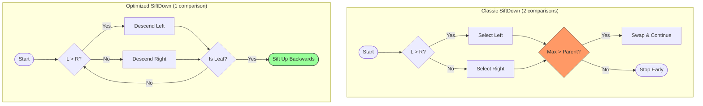
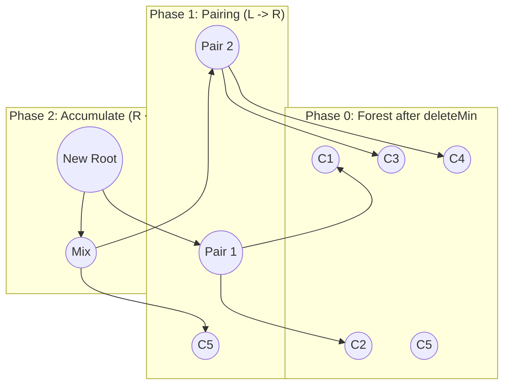
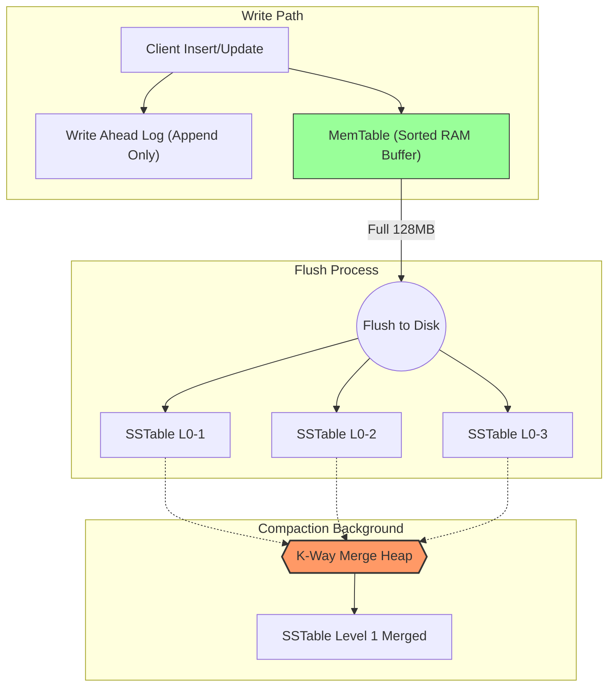
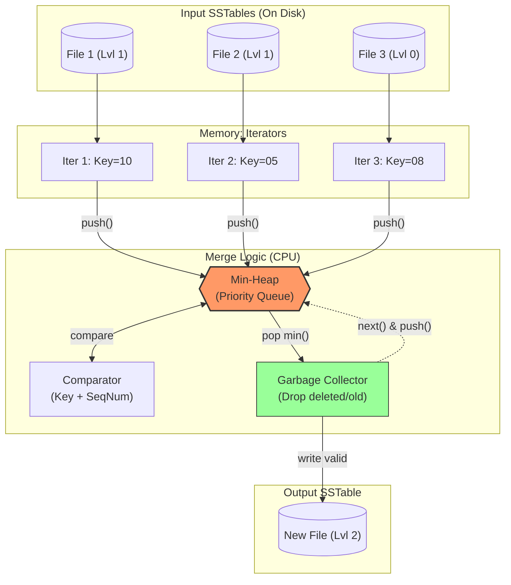
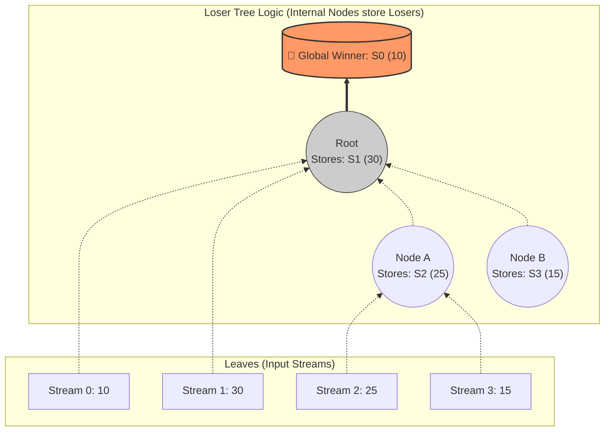
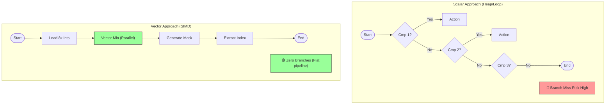
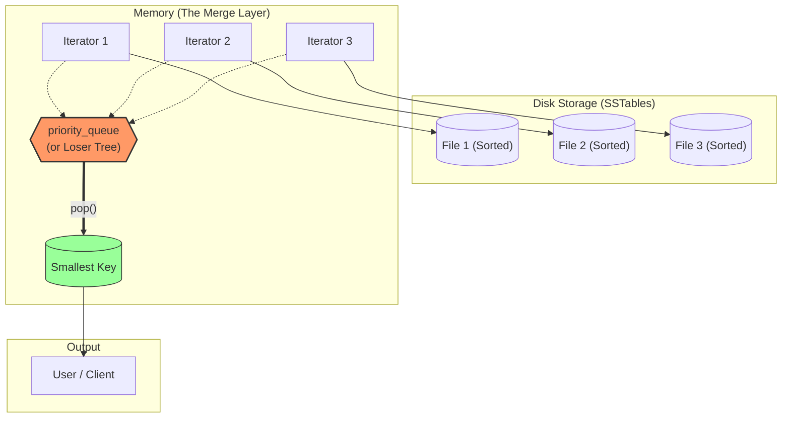

## 1. Binary Heap: Скрытая цена абстракции

Большинство разработчиков воспринимают Priority Queue как "черный ящик": положил данные, забрал минимум. В стандартных библиотеках (`java.util.PriorityQueue`, C++ `std::priority_queue`, Python `heapq`) этот ящик оптимизирован под сценарий "положил всё — забрал всё".

Однако в долгоживущих системах (серверы баз данных, планировщики задач, сетевые экраны) возникает проблема **произвольного доступа**.

## 1.0. Binary Heap: Иллюзия Дерева 

> [!abstract] Определение: Логика vs. Физика
> **Priority Queue (Очередь с приоритетом)** — это *интерфейс* (ADT). Он говорит "что" делать (дай минимум, добавь элемент).
> **Binary Heap (Двоичная Куча)** — это *реализация*. Она говорит "как" это хранить.
>
> Главная магия двоичной кучи:
> Мы думаем о ней как о **полном бинарном дереве** (Complete Binary Tree), но храним её как **плоский массив** (Array).
> Это единственная структура данных на деревьях, которая не требует `struct Node*` и указателей `left/right`.

### A. Инварианты Кучи (The Rules of the Game)

Чтобы массив считался кучей, он должен соблюдать два жестких правила:

1.  **Structural Property (Форма):**
    * Дерево должно быть *полным*. Все уровни заполнены целиком, кроме последнего.
    * Последний уровень заполняется строго **слева направо**.
    * *Зачем:* Это гарантирует, что в массиве не будет "дырок". Мы можем вычислить индекс любого ребенка математически.
2.  **Heap Property (Порядок):**
    * Для **Min-Heap:** `Parent <= Children`. Самый маленький элемент всегда в Корне.
    * Для **Max-Heap:** `Parent >= Children`. Самый большой элемент всегда в Корне.
    * *Важно:* Между братьями (Left Child и Right Child) **нет никакого порядка**. Куча — это *частично* упорядоченная структура.

### B. Математика Индексов (Implicit Data Structure)

Если мы нумеруем узлы дерева по уровням (Breadth-First), то для узла с индексом `i` (при нумерации с 0):

* **Parent(i):** `(i - 1) / 2` (Целочисленное деление, по сути битовый сдвиг `>> 1`).
* **Left Child(i):** `2 * i + 1` (Сдвиг `<< 1` + 1).
* **Right Child(i):** `2 * i + 2`.

Эта арифметика позволяет процессору "гулять" по дереву, оставаясь в пределах кэша процессора, что делает кучу одной из самых быстрых структур.

### C. Базовые Операции (Visualized)

#### 1. Insert (Sift Up / Bubble Up)
Когда мы добавляем новичка, мы всегда кладем его в **первую свободную ячейку массива** (конец). Это сохраняет свойство формы.
Но свойство порядка может нарушиться.
* **Алгоритм:** "Я меньше своего родителя? Если да — меняемся местами. Повторить."
* **Сложность:** $O(\log N)$. В лучшем случае $O(1)$ (если элемент большой).

#### 2. Extract Min (Sift Down / Sink)
Мы не можем просто удалить корень (останется дырка).
* **Алгоритм:**
    1.  Забираем корень (Min).
    2.  Берем **последний элемент** из массива (Loser) и ставим его на трон (в корень).
    3.  Теперь "Лозер" должен утонуть. "Кто из моих детей меньше меня? Меняемся с меньшим. Повторить."
* **Сложность:** $O(\log N)$.

### D. Почему массив, а не `Node*`?

В эпоху 64-битных систем каждый указатель — это 8 байт.
Если у вас дерево из объектов `int32` (4 байта):
* **Pointer-based Tree:** 4 байта (данные) + 16 байт (указатели L/R) + 8 байт (Header аллокатора). Оверхед **600%**.
* **Binary Heap (Array):** 4 байта (данные) + 0 байт оверхеда. Данные лежат плотно (Cache Locality).

### E. Визуализация: Дерево в Массиве (Mermaid)



> [!check] Архитектурный вывод Binary Heap — это идеальный баланс. Мы получаем логарифмическую скорость операций дерева, но сохраняем линейную скорость доступа к памяти массива. Это фундамент для понимания, почему **Priority Queue** в C++/Java/Python такая быстрая.
### 1.1. Проблема "Слепого удаления" (The Lookup Problem)

Представьте сценарий: вы пишете таймер-сервис.
1.  Вы добавили задачу `Task A`, которая должна сработать через 1 час. Она упала где-то в середину кучи.
2.  Через 5 минут пользователь отменил задачу.
3.  Вам нужно удалить `Task A` из кучи *прямо сейчас*.

**Наивный подход (Black Box):**
Вы вызываете метод `remove(Task A)`.
*   **Что происходит внутри:** Куча — это массив. Она не знает, где лежит `Task A`. Она запускает линейный поиск по массиву: `for (i=0; i < size; i++) if (arr[i] == TaskA) ...`
*   **Цена:** $O(N)$.
*   **Последствия:** Если у вас 1 млн активных таймеров, удаление одной задачи блокирует поток на время перебора миллиона элементов. Это вызывает спайк латентности (Latency Spike) и убивает SLA.

**Подход с внешней картой (External Indexing):**
Вы создаете `HashMap<TaskID, Integer>`, где храните индекс элемента в массиве кучи.
*   **Механика:** При каждом перемещении элемента внутри кучи (swap) вы должны обновлять эту карту.
*   **Цена:**
    1.  **Double Memory:** Храним данные дважды.
    2.  **Synchronization Hell:** Логика кучи жестко сцепляется с картой.
    3.  **Cache Thrashing (Грязный кеш):** Чтобы обновить индекс, CPU должен прыгнуть из массива кучи (одна область памяти) в хеш-таблицу (другая область, разбросанная по куче). Это гарантированный **Cache Miss** (промах кэша) и простой процессора.

### 1.2. Решение Эксперта: Интрузивная Куча (Intrusive Heap)

> [!abstract] Определение: Кто владеет данными?
> В стандартных ("неинтрузивных") контейнерах (например, `std::priority_queue` в C++ или `PriorityQueue` в Java) структура данных **владеет** узлами. Вы кладете туда данные, и контейнер сам создает обертку, выделяет память и прячет внутреннюю кухню.
>
> В **Интрузивных (Intrusive)** структурах данные **сами являются узлами**.
> Объект "знает", что он находится в куче, и хранит необходимые для этого метаданные (индекс, указатели) внутри себя.
>
> **Главная цель:** Поддержка операции `updateKey` (или `decreaseKey`) и `remove` произвольного элемента за $O(\log N)$ без предварительного поиска за $O(N)$.

#### A. Проблема "Черного Ящика" (The Decrease Key Problem)

Чтобы понять, зачем это нужно, рассмотрим задачу таймера.

1.  У вас есть `Task A` с дедлайном через 10 секунд.
2.  Вы положили его в бинарную кучу (Binary Heap). Он где-то там "утонул" (Sift Down).
3.  Вдруг событие: `Task A` нужно выполнить **сейчас** (deadline = 0).
4.  **Вопрос:** Как обновить приоритет `Task A` в куче?

**В стандартной куче (Non-Intrusive):**
* Вы имеете указатель на `Task A` в руках.
* Но вы **не знаете**, в какой ячейке массива кучи он лежит (индекс $i$ неизвестен).
* Вам нужно просканировать весь массив, чтобы найти `Task A`.
* **Сложность:** $O(N)$ (поиск) + $O(\log N)$ (Sift Up). Это неприемлемо для систем реального времени.

**В интрузивной куче:**
* `Task A` хранит поле `heap_index`.
* Вы читаете `index = A.heap_index`.
* Вы меняете приоритет и вызываете `siftUp(index)`.
* **Сложность:** $O(1)$ (доступ) + $O(\log N)$ (балансировка).
#### B. Анатомия Интрузивности (Memory Layout)

Различие на уровне памяти фундаментально.
##### 1. Non-Intrusive (Standard)
Контейнер выделяет память под узлы. Данные копируются или хранятся по указателю.
$$\text{Container} \to [\text{Node ptr}] \to [\text{Node \{ data, priority \}}]$$

##### 2. Intrusive (Embedded)
Контейнер хранит только указатели на объекты, но **управление связями** внедрено в объект.

```cpp
// Пример структуры для Интрузивной кучи
struct Job {
    // Payload (Полезная нагрузка)
    std::string name;
    int priority; 

    // Intrusive Hook (Служебные данные кучи)
    int heap_index; // <-- МАГИЯ ЗДЕСЬ. Объект знает, где он в массиве.
};
```
#### C. Синхронизация при обмене (The Hook Callback)

Самая сложная часть реализации интрузивной бинарной кучи — поддержание актуальности поля `heap_index`.

Когда куча делает операцию `swap(i, j)` (при Sift Up/Down), она должна уведомить объекты, что они переехали.

**Алгоритм Swap в интрузивной куче:**
1. Пусть в массиве `heap[]` по индексу $i$ лежит объект $A$, а по индексу $j$ — объект $B$.
2. Мы меняем местами указатели в массиве: `swap(heap[i], heap[j])`.
3. **Критический шаг:** Мы обновляем "знания" объектов:
    - `A->heap_index = j`
    - `B->heap_index = i`

> [!important] Архитектурный паттерн
> 
> Куча больше не является пассивным хранилищем. Она "вторгается" (intrudes) в состояние хранящихся объектов. Это нарушает инкапсуляцию, но дает выигрыш в производительности (Performance).

#### D. Интрузивность в связных кучах (Binomial / Fibonacci)

Если мы говорим не о массиве (Binary Heap), а о **связных структурах** (Binomial, Fibonacci, Pairing Heaps), интрузивность выглядит иначе. Там нет индекса массива, но есть указатели на соседей.

**Структура узла Fibonacci Heap:**

```C++
struct FibNode {
    // Payload
    int key;
    
    // Intrusive Pointers (Внедрены прямо в объект пользователя)
    FibNode* parent;
    FibNode* child;
    FibNode* left;   // Ссылка на левого брата (Cyclic List)
    FibNode* right;  // Ссылка на правого брата
    
    bool mark;       // Для Fibonacci Heap (Cascading Cuts)
    int degree;
};
```

**Преимущество:**
- **Zero Allocation:** Когда вы добавляете элемент в кучу, вы не вызываете `malloc` (не создаете Node). Вы просто перевязываете указатели `left/right` уже существующего объекта.
- **Cache Locality:** Данные и указатели лежат в одной линии кэша (Cache Line), а не разбросаны по памяти.
#### E. Визуализация: The Feedback Loop (Mermaid)
Диаграмма показывает, как разрывается односторонняя зависимость.



#### F. Сравнительная таблица (Trade-offs)

|**Характеристика**|**Non-Intrusive (Standard)**|**Intrusive (Custom)**|
|---|---|---|
|**Управление памятью**|Контейнер создает узлы (Nodes)|Пользователь создает узлы|
|**`insert`**|Может вызывать аллокацию|Zero-allocation (просто связывание)|
|**`decreaseKey`**|**$O(N)$** (нужен поиск)|**$O(\log N)$** (индекс известен)|
|**`remove(Node)`**|**$O(N)$**|**$O(\log N)$**|
|**Инкапсуляция**|Высокая (Безопасно)|Низкая (Опасно, можно повредить индекс)|
|**Ownership**|Контейнер владеет объектом|Объект может жить в нескольких контейнерах одновременно|
|**Use Case**|Обычная сортировка, Top-K|Таймеры ядра, планировщики задач, A* Pathfinding|
#### G. Пример реализации (Pseudo-C++)

Демонстрация того, как выглядит `siftUp` с поддержкой интрузивности.

```C++
template <typename T>
class IntrusiveHeap {
    std::vector<T*> data;

    void swap_nodes(int i, int j) {
        // 1. Физический обмен в массиве
        std::swap(data[i], data[j]);
        
        // 2. Интрузивное обновление индексов внутри объектов
        data[i]->heap_index = i;
        data[j]->heap_index = j;
    }

public:
    void push(T* item) {
        int i = data.size();
        item->heap_index = i; // Инициализация
        data.push_back(item);
        siftUp(i);
    }

    void decreaseKey(T* item, int newPriority) {
        // Мы НЕ ищем item. Мы знаем, где он!
        int i = item->heap_index; 
        
        // Safety check (в продакшене)
        if (data[i] != item) throw IntegrityError();

        item->priority = newPriority;
        siftUp(i); // O(log N)
    }
};
```

> [!check] Итог раздела
> 
> - Используйте **Intrusive Heap**, когда вам нужно менять приоритеты объектов "на лету" (Dijkstra, Prim, Event Loop).
>     
> - Интрузивность перекладывает ответственность за жизненный цикл объектов на программиста, но взамен дает контроль над памятью и асимптотическую эффективность операций обновления.
>     
> - В контексте **Fibonacci Heap**, интрузивность практически обязательна, так как структура слишком сложна для внешних оберток.
>

### 1.3. Микроархитектура: Ветвления и SiftUp vs SiftDown

> [!abstract] Закон сохранения сравнений
> С точки зрения асимптотики, операции в куче — это $O(\log N)$.
> Однако с точки зрения процессора, куча — это **худший кошмар предсказателя переходов**.
>
> 1.  **SiftUp (Bubble Up):** Требует 1 сравнение на уровень (с родителем).
> 2.  **SiftDown (Sink):** В классическом виде требует **2 сравнения** на уровень (выбрать большего ребенка + сравнить с собой).
>
> В этом разделе мы разберем, почему `std::make_heap` использует SiftDown (несмотря на лишние сравнения) и как хакнуть этот процесс, чтобы сделать его быстрее.

#### A. The $O(N)$ Magic: Why SiftDown Wins for Building

Почему мы строим кучу (`buildHeap`), вызывая `siftDown` для всех не-листовых узлов, а не вставляя элементы по одному через `siftUp`?

**Математическое обоснование:**
* **SiftUp подход (Insert $N$ times):**
    * Листья (их $\approx N/2$) находятся на глубине $\log N$. Им нужно всплывать высоко.
    * Суммарная работа: $O(N \log N)$.
* **SiftDown подход (Floyd's Algorithm):**
    * Листья (50% узлов) вообще не обрабатываются.
    * Узлы над ними (25%) просеиваются максимум на 1 уровень вниз.
    * Только корень (1 шт.) просеивается на $\log N$.
    * Формула: $\sum_{h=0}^{\log N} \frac{N}{2^{h+1}} \cdot h = O(N)$.

> [!info] Интуиция
> В `SiftDown` мы выполняем "дорогие" операции (длинные пути) для малого количества элементов (верхушка), а "дешевые" — для большинства.

#### B. Проблема Ветвлений (Branch Misprediction)

Куча — это структура данных, зависящая от *значений* (Value-dependent layout).
Если данные случайны, то результат сравнения `heap[i] < heap[child]` тоже случаен (50/50).

**Что происходит в CPU:**
```cpp
// Классический SiftDown
if (child + 1 < n && heap[child] < heap[child+1]) { 
    child++; // Branch 1: Выбор правого ребенка (50% mispredict)
}
if (heap[i] >= heap[child]) { 
    break;   // Branch 2: Досрочный выход (Unpredictable)
}
swap(heap[i], heap[child]);
```
Каждый `misprediction` (ошибка предсказания) стоит процессору сброса конвейера (Pipeline Flush), что занимает **15-20 тактов**. В плотном цикле это убивает производительность сильнее, чем лишнее чтение из памяти.
#### C. Оптимизация: "Bottom-Up Heapsort" (Heuristic)

Стандартная библиотека C++ (STL) и эффективные реализации HeapSort используют трюк, чтобы уменьшить количество сравнений в `SiftDown` с 2 до 1 на уровень.
**Сценарий `pop_heap`:**
Мы убираем корень (Max), ставим на его место последний лист (который обычно очень маленький) и вызываем `siftDown`.
- _Наблюдение:_ Маленький элемент с 99% вероятностью утонет до самого дна.
- _Идея:_ Зачем на каждом шаге спрашивать "Я уже приехал?", если мы знаем, что ехать до конечной?

**Оптимизированный алгоритм:**
1. **Hole Digging:** Спускаемся до самого низа (листа), выбирая на каждом шаге _большего_ ребенка.
    - _Затраты:_ 1 сравнение на уровень (только между детьми). Мы _не_ сравниваем с текущим элементом.
2. **Sift Up:** Теперь, когда мы нашли место на дне, помещаем туда наш элемент. Если он оказался слишком большим для этого уровня (что бывает редко), мы вызываем `siftUp`, чтобы поднять его чуть выше.
**Результат:**
- Вместо $2 \log N$ сравнений мы делаем $\log N$ (спуск) + $\epsilon$ (всплытие).
- Убирается `Branch 2` (досрочный выход), что улучшает работу предсказателя переходов.
#### D. Memory Layout & Prefetching
Вторая проблема кучи — это доступ к памяти.
Для индекса $i$, дети лежат в $2i$ и $2i+1$.
На больших кучах ($N > 10^6$) это означает прыжки по памяти, которые гарантированно вызывают **Cache Miss**.
- **d-ary Heaps:** Чтобы утилизировать кэш-линию (64 байта), используют не бинарную кучу (2 ребенка), а 4-ary (4 ребенка). Это снижает высоту дерева в $\log_4 N$ раз и улучшает локальность данных.
- **Prefetching:** В цикле `siftDown`, как только мы вычислили `child_index`, нужно давать инструкцию процессору `__builtin_prefetch(heap[child_index * 2])` для следующего шага, пока мы обрабатываем текущий.

#### E. Visualization: The Comparison Path (Mermaid)
Сравнение логики классического и оптимизированного спуска.



> [!check] Архитектурный вывод
> 
> 1. **SiftDown** предпочтительнее для построения кучи ($O(N)$).
>     
> 2. **Ветвления** — главный враг. Чем меньше условий `if` внутри цикла `while`, тем быстрее работает куча на современном железе.
>     
> 3. **Heapsort optimization:** Сначала "топите" элемент до дна, выбирая путь большего ребенка, и только потом проверяйте инвариант кучи. Это экономит 50% сравнений.
>

---
## 2. d-ary Heaps: Анатомия производительности (Hardware Symbiosis)

В высокопроизводительных системах (High-Performance Computing, Kernels, Databases) узким местом почти всегда является **Memory Wall** — процессор ждет данные из оперативной памяти.

**d-ary Heap** — это обобщение бинарной кучи, где каждый узел имеет $d$ детей (обычно $d=4$ или $d=8$).
*   В массиве дети узла с индексом `i` находятся в диапазоне: `[d*i + 1 ... d*i + d]`.
*   Родитель узла `i`: `(i - 1) / d`.

Почему мы жертвуем теоретическим числом сравнений ради этой структуры?

### 2.1. Кэш-линии (Cache Lines) и Пространственная локальность

Современный CPU не читает память байтами. Он читает её блоками, называемыми **Cache Lines** (обычно 64 байта).
Чтение 1 байта и чтение 64 байтов, лежащих подряд, стоит одинаково (около 100 наносекунд, если промах в кэш).

**Анализ сценария:** Храним `int32` (4 байта).
*   **Cache Line Capacity:** 64 байта / 4 байта = 16 элементов.

**Проблема Binary Heap ($d=2$):**
При операции `SiftDown` (погружение) нам нужно сравнивать детей.
1.  Мы читаем узел `i`.
2.  Его дети `2i+1` и `2i+2`.
3.  Его внуки `4i...`.
С ростом глубины индексы разлетаются экспоненциально. Очень быстро дети перестают попадать в одну кэш-линию с родителем или друг с другом. Каждая итерация цикла — это потенциальный **Cache Miss** (простой CPU).

**Решение 4-ary Heap ($d=4$):**
Узлы становятся "толще", а дерево — ниже.
*   При `SiftDown` мы загружаем сразу всех 4-х детей.
*   Так как они лежат в памяти последовательно (`d*i + 1` ... `d*i + 4`), они с высокой вероятностью попадают **в одну или две смежные кэш-линии**.
*   **Префетчинг (Hardware Prefetcher):** Процессор видит последовательный доступ к массиву и заранее подтягивает данные в L1 кэш.

**Результат:** Мы делаем больше сравнений процессором (дешево), но в разы меньше обращений к RAM (очень дорого).

### 2.2. Векторизация (SIMD) — "Бесплатные" сравнения

Это самый тонкий момент, который отличает Senior от Principal инженера.
Классическая критика d-ary куч: *"Чтобы найти минимум среди $d$ детей, нужно $d-1$ сравнений вместо 1-го. Это замедляет шаг алгоритма!"*

Это верно для скалярного кода, но неверно для **SIMD (Single Instruction, Multiple Data)**.
Современные процессоры (x86_64 с AVX2, ARM с NEON) умеют выполнять операции над векторами данных за один такт.

**Как это работает (на примере AVX2 и $d=8$ для 32-битных чисел):**
1.  У нас есть 8 детей в памяти подряд.
2.  Одной инструкцией `_mm256_load_si256` мы загружаем всех 8 детей в один 256-битный регистр процессора (`YMM`).
3.  Одной инструкцией (или цепочкой из `_mm256_min_epi32`) мы находим минимум среди них параллельно.
4.  Мы получаем индекс минимального элемента **без единого ветвления `if`**.

**Почему это критично:**
Обычный `if (arr[left] < arr[right])` — это **Branching**. Процессор пытается предсказать результат. Если он ошибся (Branch Misprediction), конвейер сбрасывается, теряется 15-20 тактов. В куче данные случайны, предсказание работает плохо.
SIMD-инструкции — это **Branch-free code**. Мы меняем (непредсказуемые ветвления + мало чтений) на (гарантированное время + векторные вычисления).

> **Пример из жизни:** Реализация кучи в .NET Core или Boost для `d=4` часто работает быстрее бинарной в 2-3 раза именно за счет векторизации поиска минимума.

### 2.3. TLB (Translation Lookaside Buffer) и Виртуальная память

Память разбита на страницы (обычно 4 KiB). Процессор использует TLB-кэш для перевода виртуальных адресов в физические. Промах в TLB (TLB Miss) стоит дорого, так как требует обхода таблиц страниц (Page Walk).

*   **Binary Heap ($N=10^9$):** Высота дерева $\log_2(10^9) \approx 30$.
    Чтобы добраться от корня до листа, мы можем затронуть до 30 разных страниц памяти. Это "вымывает" TLB.
*   **4-ary Heap ($N=10^9$):** Высота дерева $\log_4(10^9) = \log_2(10^9) / 2 \approx 15$.
    В 2 раза меньше прыжков по памяти.
*   **B-Heap (Extreme case):** Если сделать $d$ равным размеру страницы памяти (например, $d=1024$), мы получим структуру B-Tree, идеальную для диска, где минимизация "прыжков" (IOPS) — главная цель.

### 2.4. Как выбрать $d$? (Benchmark Rule of Thumb)

Как архитектор, вы выбираете $d$ исходя из профиля нагрузки:

1.  **$d=2$ (Binary):**
    *   Если операция сравнения элементов *очень дорогая* (например, это длинные строки или сложные объекты). Здесь лишние сравнения "съедят" выигрыш от кэша.
    *   Если код работает на старых микроконтроллерах без кэша и SIMD.

2.  **$d=4$ (Quaternary):**
    *   **Золотой стандарт** для general-purpose куч (int, float, pointers) на современном железе. Идеальный баланс между высотой дерева и стоимостью шага `SiftDown`.

3.  **$d=8$ или $d=16$:**
    *   Используется, если куча *огромная* (гигабайты) и мы хотим минимизировать TLB misses.
    *   Обязательно наличие ручной оптимизации под SIMD (AVX-512).

### 2.5. Резюме: Cache-Oblivious vs Cache-Aware

*   **Binary Heap** — это **Cache-Oblivious** алгоритм в плохом смысле. Он не учитывает параметры железа.
*   **d-ary Heap** — это **Cache-Aware** структура. Мы "подгоняем" топологию данных под размер линейки кэша (64 байта) и ширину векторного регистра (256 бит).

**Инсайт для собеседования:** Если вас спросят, как ускорить кучу, ответ: «Перейти на d-ary heap с $d=4$, чтобы снизить высоту дерева в 2 раза, улучшить cache locality и использовать SIMD для устранения branch misprediction при выборе дочернего элемента».

---
## 3. Advanced Heaps: Битва за `Decrease-Key`

Стандартная двоичная куча (Binary Heap) хороша всем, кроме двух операций:
1.  **Merge:** Слияние двух куч стоит $O(N)$.
2.  **Decrease-Key:** Изменение приоритета элемента стоит $O(\log N)$ и, что хуже, требует знания индекса элемента (см. Intrusive Heaps выше).

В алгоритмах на графах (Dijkstra, Prim MST) операция `Decrease-Key` вызывается **на порядки чаще**, чем `Extract-Min`. Если у нас $E$ ребер и $V$ вершин, Дейкстра делает $E$ раз `Decrease-Key`.
*   Binary Heap: $O(E \log V)$.
*   Fibonacci/Pairing Heap: $O(E + V \log V)$.
Для плотных графов (где $E \approx V^2$) это разница между $O(V^2 \log V)$ и $O(V^2)$.

### 3.1. Fibonacci Heap (Фибоначчиева куча) — Теоретический эталон

Это структура, построенная на принципе **"Лени" (Laziness)**. Мы откладываем всю работу по наведению порядка до последнего возможного момента (обычно до `Extract-Min`).

#### Анатомия и Термины
Фибоначчиева куча — это не одно дерево, а **лес** (набор) деревьев.
*   **Roots List:** Корни всех деревьев связаны в кольцевой двусвязный список.
*   **Min Pointer:** Указатель на корень с минимальным ключом.
*   **Marked Node (Помеченный узел):** Узел, у которого "урезали" детей. Это критический механизм балансировки.

#### Механика операций
1.  **Insert ($O(1)$):** Создаем новое дерево из одного узла и добавляем в список корней. Мы *не* пытаемся встроить его вглубь. Структура деградирует (растет в ширину), но это мгновенно.
2.  **Merge ($O(1)$):** Просто сцепляем два списка корней в один.
3.  **Decrease-Key ($O(1)$ amortized):**
    *   Если новый ключ нарушает порядок кучи (меньше родителя) — мы **отрезаем** (Cut) этот узел вместе с поддеревом и переносим его в список корней.
    *   **Cascading Cut (Каскадное отсечение):**
        *   Правило: "Узел может потерять только одного ребенка".
        *   Когда мы отрезаем ребенка у родителя $P$, мы проверяем $P$.
        *   Если $P$ не помечен (unmarked) — ставим метку `marked = true`.
        *   Если $P$ уже был помечен (значит, он уже терял ребенка раньше) — мы **отрезаем и самого $P$**, переносим в корни, снимаем метку, и идем к дедушке.
    *   *Смысл:* Это предотвращает превращение деревьев в широкие и плоские "кусты", сохраняя свойства, близкие к биномиальным деревьям.

#### Почему это провал на практике (In Practice)
1.  **Memory Overhead:** Каждый узел требует: `parent`, `child`, `left`, `right`, `degree`, `mark`, `key`, `value`. Это **4-6 указателей** + метаданные. Огромный расход памяти и давление на аллокатор.
2.  **Pointer Chasing:** Структура "размазана" по памяти. Любой проход по детям — это Random RAM Access (Cache Misses).
3.  **Сложная константа:** Амортизированное $O(1)$ скрывает за собой сложную логику каскадных срезов и манипуляций ссылками.

### 3.2. Pairing Heap (Спаренная куча) — Выбор Инженера

> [!abstract] Реальность против Теории
> **Fibonacci Heap** теоретически идеальна: $O(1)$ для `decreaseKey`. Но она сложна в реализации, требует много памяти (4 указателя на узел) и имеет большие скрытые константы.
>
> **Pairing Heap (Спаренная куча)** была придумана Фредманом, Седжвиком и др. в 1986 году как "упрощенная саморегулирующаяся структура".
> * **Теория:** Асимптотика `decreaseKey` доказанно *хуже* $O(1)$ (это $\Omega(\log \log N)$), но точные границы до сих пор являются открытой математической проблемой.
> * **Практика:** Работает **быстрее**, чем Fibonacci Heap, в 99% реальных сценариев за счет простоты структуры и лучшей работы с кэшем.
#### A. Анатомия: Простота как преимущество

В отличие от Биномиальных и Фибоначчи куч, которые поддерживают сложный "лес" деревьев с разными рангами, Pairing Heap — это **всегда одно дерево** (после каждой операции мы стремимся всё слить в одну кучу).

**Структура узла (LCRS - Left Child, Right Sibling):**
Для реализации произвольного дерева (General Tree) на бинарных узлах мы используем стандартный паттерн:
```cpp
struct PairNode {
    int key;
    PairNode* child;   // Указатель на первого ребенка (Head of list)
    PairNode* sibling; // Указатель на следующего брата (Next in list)
    PairNode* parent;  // Нужен только для decreaseKey
};
```

_Экономия памяти:_ Всего 3 указателя против 4 у Фибоначчи (parent, child, left, right).
#### B. Базовая операция: Linking (Линковка)
Весь алгоритм строится на одной примитивной операции `compareAndLink`.
Как слить два дерева? Сделайте корень с _большим_ ключом ребенком корня с _меньшим_ ключом.
```C++
PairNode* merge(PairNode* A, PairNode* B) {
    if (A == nullptr) return B;
    if (B == nullptr) return A;
    
    if (A->key < B->key) {
        // B становится первым ребенком A
        B->sibling = A->child;
        A->child = B;
        B->parent = A;
        return A;
    } else {
        // A становится первым ребенком B
        // (аналогично)
        return B;
    }
}
```
#### C. Магия `deleteMin`: Two-Pass Merge
Самая интересная часть — удаление минимума (корня).
Когда мы удаляем корень, остается лес его детей. Если их просто слить по очереди (`result = merge(result, child)`), мы получим вырожденное дерево (список) высотой $O(N)$, и следующая операция будет долгой.
Pairing Heap использует стратегию **Two-Pass Merge** (Двухпроходное слияние), которая амортизированно укорачивает дерево (аналог Splay-операции в деревьях поиска).
**Алгоритм:**
Представьте, что после удаления корня у нас остался список детей: $C_1, C_2, C_3, C_4, C_5$.
1. **Pass 1 (Left-to-Right Pairing):** Сливаем соседей парами.
    - $T_1 = \text{merge}(C_1, C_2)$    
    - $T_2 = \text{merge}(C_3, C_4)$
    - $C_5$ остается один.
    - _Эффект:_ Мы мгновенно сокращаем количество деревьев в 2 раза.
2. **Pass 2 (Right-to-Left Accumulation):** Сливаем результат с конца в один ком.
    - $Result = \text{merge}(T_2, C_5)$
    - $Result = \text{merge}(T_1, Result)$

> [!info] Почему именно так?
> 
> Эта схема похожа на сворачивание рекурсии. Она гарантирует, что дерево остается широким и неглубоким. Доказано, что именно "Multipass" (сначала пары, потом всё вместе) дает нужную амортизацию. Простое слияние (Multipass в одну сторону) не работает.

#### D. Операция `decreaseKey` (Laziness)
В Pairing Heap эта операция до смешного проста (и "ленива").

**Алгоритм:**
1. Если узел является корнем — просто обновить ключ.
2. Если нет — **отрезать** поддерево этого узла от родителя.
3. Слить (Merge) отрезанное дерево с корнем кучи.

Мы не делаем никаких каскадных вырезок (Cascading Cuts), как в Fibonacci Heap. Мы просто отрезаем и кидаем к корню.
- _Риск:_ Это может создать много детей у корня.
- _Компенсация:_ Последующий `deleteMin` "приберет" этот беспорядок с помощью Two-Pass Merge.
#### E. Визуализация: Two-Pass Merge (Mermaid)
Показывает, как лес детей превращается в одно дерево.


#### F. Сравнение производительности (Benchmarks)

Почему инженеры выбирают Pairing Heap?

|**Feature**|**Fibonacci Heap**|**Pairing Heap**|**Binary Heap**|
|---|---|---|---|
|**`insert`**|$O(1)$|$O(1)$|$O(\log N)$|
|**`decreaseKey`**|$O(1)$ amortized|$O(2^{\sqrt{\log \log N}})$ *|$O(\log N)$|
|**`deleteMin`**|$O(\log N)$ amortized|$O(\log N)$ amortized|$O(\log N)$|
|**Pointers per Node**|4 (p, c, L, R)|3 (p, c, s)|0 (Array index)|
|**Code Complexity**|Nightmare (10/10)|Medium (4/10)|Easy (2/10)|
|**Real World Speed**|Slow due to malloc/ptr overhead|**Fastest** for heavy merge/decrease loads|Fastest for static datasets|

_* Примечание: Асимптотика `decreaseKey` для Pairing Heap — сложная теоретическая проблема. Доказано, что она лучше $O(\log N)$, но хуже $O(1)$. На практике это константа._

> [!check] Архитектурный вывод
> 
> Если вам нужна Priority Queue с поддержкой `decreaseKey` (например, для алгоритма Дейкстры или Прима):
> 
> 1. **Не используйте** Fibonacci Heap (если вы не пишете научную статью). Оверхед на указатели убьет кэш.
>     
> 2. **Используйте** Pairing Heap. Это баланс простоты, памяти и скорости.
>     
> 3. В C++ `boost::heap::pairing_heap` — отличная готовая реализация.
>

### 3.3. Сравнение для Архитектурного Решения (Decision Matrix)

| Характеристика          | Binary Heap                 | Fibonacci Heap        | Pairing Heap          |
| :---------------------- | :-------------------------- | :-------------------- | :-------------------- |
| **Основная структура**  | Массив (Array)              | Лес деревьев (Linked) | Одно дерево (Linked)  |
| **Insert**              | $O(\log N)$                 | $O(1)$                | $O(1)$                |
| **Decrease-Key**        | $O(\log N)$                 | $O(1)$ Amortized      | $O(1)$ Amortized*     |
| **Delete-Min**          | $O(\log N)$                 | $O(\log N)$ Amortized | $O(\log N)$ Amortized |
| **Space Overhead**      | **0 bytes** (только данные) | High (4-6 pointers)   | Low (2-3 pointers)    |
| **Cache Locality**      | **Excellent**               | Poor                  | Medium                |
| **Реальное применение** | Task Schedulers, Timers     | Academic Research     | **GCC, jemalloc**     |

*\* Примечание: Сложность Decrease-Key для Pairing Heap до сих пор является строгим математическим объектом споров (Fredman доказал $\Omega(\log \log n)$, но на практике она неотличима от константы).*

**Вердикт Эксперта:**
1.  Если вам **не нужен** `Decrease-Key` (или он редок) — используйте **Binary d-ary Heap**. Кэш-локальность победит любую асимптотику.
2.  Если `Decrease-Key` — это основа алгоритма (плотные графы, сложная эвристика) — используйте **Pairing Heap**. Она проще в коде, ест в 2 раза меньше памяти, чем Фибоначчиева, и работает быстрее.

---
## 4. Heap vs Sorted Array: Сердце LSM-Tree движков

> [!abstract] Проблема K-way Merge
> Современные базы данных (RocksDB, Cassandra, ScyllaDB, ClickHouse) построены на архитектуре **LSM-Tree**.
> Она превращает Random Writes в Sequential Writes, накапливая данные в памяти (MemTable) и сбрасывая их на диск в виде отсортированных файлов (SSTables).
>
> **Главная проблема:** Чтобы прочитать ключ или сделать компактизацию (Compaction), нужно слить $K$ отсортированных файлов в один поток.
> * Это классическая задача: **Merge K sorted lists**.
> * Интуитивное решение: Использовать **Min-Heap** размера $K$.
> * Проблема: Когда $K$ мало (например, 10 файлов), накладные расходы на "жонглирование" кучей могут превышать выгоду от логарифма.

### 4.0. LSM-Tree: Архитектура, пожирающая данные 

> [!abstract] Проблема "Случайной Записи" (Random Write)
> Классические базы данных (PostgreSQL, MySQL InnoDB) используют **B-Tree**.
> Чтобы обновить одну строку, B-Tree должно найти нужную страницу на диске (Random Seek), считать её, изменить и записать обратно.
> * **HDD:** 100 IOPS (катастрофа).
> * **SSD:** Быстрее, но "Write Amplification" убивает ресурс диска.
>
> **LSM-Tree (Log-Structured Merge-Tree)** решает эту проблему радикально:
> Мы превращаем **любую** запись (Insert, Update, Delete) в **последовательную запись** (Sequential Append) в конец файла.
> * **Цена:** Данные дублируются и размазываются по разным файлам.
> * **Решение:** Фоновый процесс **Compaction**, который постоянно собирает и сливает эти файлы. Именно здесь (в Compaction) в игру вступают Heap и Loser Tree.

#### A. Анатомия LSM-движка

LSM-Tree — это не одна структура данных, а каскад из нескольких структур, живущих в памяти и на диске.

1.  **MemTable (Memory Table):**
    * Все записи сначала попадают сюда.
    * Это структура **в оперативной памяти** (обычно SkipList или Red-Black Tree).
    * *Свойство:* Данные здесь всегда отсортированы.
    * *Скорость:* $O(\log N)$ в RAM (наносекунды).
2.  **WAL (Write Ahead Log):**
    * Параллельно запись идет в append-only лог на диске (для восстановления при падении питания).
3.  **SSTable (Sorted String Table):**
    * Когда MemTable заполняется (например, до 128MB), она **сбрасывается (Flush)** на диск.
    * Получается файл, где ключи **неизменяемы** (Immutable) и **отсортированы**.
    * Это критически важно: так как файл отсортирован, поиск в нем можно делать бинарным поиском или через Index Block.

#### B. Жизненный цикл данных (The Data Flow)

Представьте, что вы делаете `UPDATE user SET age=25 WHERE id=100`.

1.  **Write:** В MemTable пишется запись `Key: 100, Val: 25`. Старого значения мы не ищем (мы не знаем, где оно). Мы просто пишем новую версию.
2.  **Flush:** MemTable сбрасывается в файл `SSTable_Level0_1.sst`.
3.  **Read:** При чтении `id=100` база данных должна проверить:
    * Сначала MemTable (там самое свежее).
    * Если нет — `SSTable_Level0`.
    * Если нет — `SSTable_Level1`...
    * Побеждает версия с самым большим `Timestamp` (LWW - Last Write Wins).

#### C. Зачем здесь нужна Куча? (The Merge Problem)

Со временем на диске скапливаются тысячи файлов SSTable.
1.  **Проблема Чтения:** Чтобы найти ключ, нужно проверить 1000 файлов. Это очень медленно.
2.  **Проблема Места:** У нас хранятся старые версии ключа `100` (age=20, age=21...), хотя нужна только последняя (age=25).

**Compaction (Компактизация)** — это процесс "уборки мусора".
Движок берет $K$ файлов (например, 10 файлов уровня 0) и сливает их в один большой файл уровня 1.

* Так как каждый файл **уже отсортирован**, нам не нужно сортировать их заново.
* Нам нужно просто **слить $K$ отсортированных списков**.
* $\to$ **K-Way Merge Sort**
* $\to$ **Priority Queue (Min-Heap)**

Именно эффективность этого этапа определяет, "захлебнется" база под нагрузкой или нет.

#### D. Визуализация: LSM Pipeline (Mermaid)


#### E. Сравнение: B-Tree vs. LSM-Tree

|**Характеристика**|**B-Tree (MySQL, Postgres)**|**LSM-Tree (RocksDB, Cassandra)**|
|---|---|---|
|**Оптимизация**|**Read Heavy** (Быстрое чтение)|**Write Heavy** (Быстрая запись)|
|**Write Pattern**|Random In-Place (медленно на HDD)|Sequential Append (максимальная скорость)|
|**Space**|Есть фрагментация (пустоты в страницах)|Компактно (после слияния), но хранит дубликаты|
|**Compaction**|Не требуется (Autovacuum в PG другой)|**Критически важен (CPU Heavy)**|
|**Роль Кучи**|Не используется (только для сортировки запросов)|**Ядро архитектуры** (двигатель слияния)|
### 4.1. Анатомия Компактизации (Compaction Iterator)

> [!abstract] Определение: Compaction (Компактизация)
> В LSM-Tree (Log-Structured Merge-Tree) данные никогда не обновляются "на месте" (in-place). Новые данные просто дописываются в новые файлы.
> Это приводит к двум проблемам:
> 1.  **Space Amplification:** Старые значения и удаленные ключи (Tombstones) занимают место.
> 2.  **Read Amplification:** Чтобы найти ключ, нужно проверить много файлов.
>
> **Компактизация** — это фоновый процесс, который берет $K$ старых файлов (SSTables), сливает их в один, удаляя дубликаты и мусор.
> Математически это задача **K-way Merge Sort**.

#### A. The Setup: Input Streams (Iterators)
Представьте, что у нас есть 3 файла на диске (SSTables), отсортированных по первичному ключу.
Нам нужно создать иллюзию *одного* отсортированного потока для записи нового файла.

* **File 1 (Oldest):** `[Key: 1, Val: A]`, `[Key: 5, Val: B]`, `[Key: 10, Val: C]`
* **File 2 (Middle):** `[Key: 2, Val: D]`, `[Key: 5, Val: E (Update)]`, `[Key: 6, Val: F]`
* **File 3 (Newest):** `[Key: 1, Val: DELETE]`, `[Key: 3, Val: G]`

Для каждого файла создается **Iterator** — объект, который умеет делать `current()` (показать текущий ключ) и `next()` (сдвинуться вперед).

#### B. The Algorithm: Heap-Based Merge
Чтобы эффективно сливать $K$ потоков, мы не можем просто сравнивать их все друг с другом ($O(K)$). Мы используем **Min-Heap** (Очередь с приоритетом).

**Инвариант:** В Куче всегда находится ровно $K$ элементов — по одному "текущему" ключу от каждого активного итератора.

**Пошаговая трассировка (Trace):**

1.  **Init:** Загружаем первые ("головы") элементы всех файлов в Кучу.
    * Heap: `{ (1, DEL, File3), (1, A, File1), (2, D, File2) }`
    * *Примечание:* При равенстве ключей (Key 1) побеждает тот, у кого `SeqNum` (версия) выше (File 3 > File 1).
2.  **Step 1 (Pop Min):**
    * Достаем Min: `(1, DEL, File3)`.
    * *Logic:* Это Tombstone. Если это самый нижний уровень, мы его выкидываем. Если нет — пишем в выходной файл.
    * Advance: Сдвигаем File 3 -> `[3, G]`.
    * Push: Кладем `(3, G, File3)` обратно в Кучу.
    * Heap: `{ (1, A, File1), (2, D, File2), (3, G, File3) }`
3.  **Step 2 (Pop Min):**
    * Достаем Min: `(1, A, File1)`.
    * *Logic:* Мы только что обработали ключ `1` из более нового файла. Значит, эта версия `(1, A)` устарела (Shadowed). **Drop it.**
    * Advance: Сдвигаем File 1 -> `[5, B]`.
    * Push: Кладем `(5, B, File1)` в Кучу.
    * Heap: `{ (2, D, File2), (3, G, File3), (5, B, File1) }`
4.  **Step 3 (Pop Min):**
    * Достаем Min: `(2, D, File2)`.
    * *Logic:* Уникальный ключ. **Write to Output.**
    * ... и так далее.

#### C. Проблема Производительности: "Pointer Chasing"
Почему в высоконагруженных системах (ScyllaDB, RocksDB) стандартная `std::priority_queue<Iterator*>` работает плохо?

Куча должна сравнивать элементы. Но элементы — это **Итераторы**.
Чтобы сравнить `IterA` и `IterB`, процессор должен сделать следующее:
1.  Загрузить адрес `IterA` из массива кучи.
2.  Перейти по адресу (Dereference) $\to$ **Cache Miss #1**.
3.  Прочитать поле `current_key` внутри объекта Итератора.
4.  Если ключ длинный (String), перейти по указателю на данные ключа $\to$ **Cache Miss #2**.

В итоге, сортировка кучи упирается не в CPU (сравнения), а в **Latency памяти**.
*Решение:* Использовать **Loser Tree** или хранить ключи *прямо* в массиве кучи (embedded keys), чтобы сравнивать их без прыжков по памяти.

#### D. Visualization: The Compaction Pipeline (Mermaid)

Визуализация потока данных через воронку Кучи.


#### E. Ключевые термины (Glossary)
- **SSTable (Sorted String Table):** Неизменяемый файл на диске, хранящий данные, отсортированные по ключу. Базовый блок LSM.
- **Merge Sort:** Алгоритм типа "Разделяй и властвуй". Мы используем только фазу "Слияния" (Merge), так как входные данные уже отсортированы.
- **Shadowing (Затенение):** Ситуация, когда более свежая запись (в L0 или MemTable) скрывает старую запись с тем же ключом в нижних уровнях.
- **Tombstone (Могильный камень):** Специальная запись-маркер, означающая "Ключ X удален". Она должна "доплыть" до самого дна базы, чтобы реально освободить место.

> [!important] Архитектурный вывод Эффективность базы данных определяется тем, насколько быстро она может делать `pop()` из этой Кучи. Если ваша структура данных (Heap) добавляет 50 наносекунд на каждую запись из-за промахов кэша, а вы сливаете 1 миллиард записей — вы теряете **50 секунд** чистого CPU времени просто на структуру данных. Поэтому выбор правильной реализации (Loser Tree vs Heap) здесь критичен.
### 4.2. Loser Tree (Дерево Проигравших) — Секретное оружие

> [!abstract] Проблема 2x Сравнений
> В обычной **Binary Heap**, чтобы восстановить порядок после удаления минимума (операция `replaceTop`), мы используем `siftDown`.
> На каждом уровне спуска нужно выполнить **2 сравнения**:
> 1.  Найти меньшего из двух детей: `min_child = (L < R) ? L : R`
> 2.  Сравнить себя с меньшим ребенком: `curr < min_child ?`
>
> **Loser Tree** (разновидность Tournament Tree) решает эту проблему радикально:
> Оно гарантирует **ровно 1 сравнение** на уровень при обновлении элемента.
> Для слияния 128 файлов это сокращает число сравнений с $\approx 14$ до $7$ на каждую запись.

#### A. Концепция: Турнирная Сетка
Представьте теннисный турнир.
* **Winner Tree:** В каждом узле сетки записан **победитель** матча. Чтобы узнать, с кем играть дальше, победителю нужно посмотреть на соседнюю ветку (брата).
* **Loser Tree:** В каждом узле сетки записан **проигравший** в этом матче. Победитель не записывается в узел, он просто "пролетает" вверх в следующий раунд.

**Главный трюк:**
Когда чемпион "выбывает" (мы записали его в файл и берем следующий элемент из того же потока), новому элементу нужно сыграть матчи только с теми, кто **проиграл** предыдущему чемпиону. Эти "проигравшие" уже сидят в узлах по пути к корню.

#### B. Алгоритм: Bottom-Up Replay
В отличие от Кучи (которая работает сверху-вниз при `siftDown`), Loser Tree работает **снизу-вверх**.

Пусть у нас есть $K$ входных потоков (листьев).
Структура дерева: массив `tree[]` размером $K$, где хранятся индексы проигравших итераторов. Глобальный победитель хранится отдельно в `tree[0]`.

**Сценарий:** Мы забрали победителя из потока №3. Берем следующий элемент из потока №3 (назовем его `NewElem`).

1.  **Start:** Начинаем с листа, соответствующего потоку №3.
2.  **Loop:** Поднимаемся к родителю (`idx / 2`).
3.  **Action:** В родительском узле сидит "Проигравший" прошлого матча (например, элемент из потока №5).
    * Сравниваем `NewElem` vs `Loser`.
    * **Если NewElem < Loser:** `NewElem` побеждает! Он идет дальше вверх. `Loser` остается сидеть в узле (он снова проиграл).
    * **Если NewElem > Loser:** `NewElem` проигрывает. Мы записываем `NewElem` в текущий узел (он теперь новый Лузер этого уровня). А старый `Loser` (который был в узле) становится победителем и идет вверх вместо нас.
4.  **Repeat:** Повторяем до корня. Тот, кто вылетит из корня — глобальный минимум.

#### C. Почему это быстрее? (Hardware Perspective)

1.  **Single Comparison:** На каждом уровне мы делаем ровно одно сравнение: `if (Candidate < Tree[Node])`. Никаких проверок "левый ребенок vs правый ребенок".
2.  **Locality of Reference:** В Winner Tree, чтобы подняться вверх, нужно читать память **соседа** (Sibling), который может быть далеко в массиве. В Loser Tree мы читаем только память **родителя**, который лежит по фиксированному пути.
3.  **Fixed Branching:** Путь от листа к корню всегда имеет фиксированную длину $\lceil \log_2 K \rceil$. Это позволяет развернуть циклы (Loop Unrolling).

#### D. Пример Трассировки (Trace)

Сливаем 4 потока:
* Src 0: `[10, 20]`
* Src 1: `[30]`
* Src 2: `[5]`  <-- Текущий минимум
* Src 3: `[15]`

В узлах дерева (внутренних) записаны индексы проигравших в прошлых матчах. Глобальный победитель (индекс 2) выведен.
Теперь мы берем следующий элемент из Src 2 (пусть это будет `25`).

**Replay для Src 2:**
1.  **Level 1 (Match vs Src 3):**
    * Src 3 (значение 15) был лузером на этом уровне.
    * Сравниваем `New(25)` и `Loser(15)`.
    * `25 > 15`. **New проиграл.**
    * Записываем `Src 2` (значение 25) в узел как нового лузера.
    * `Src 3` (15) становится новым претендентом и идет вверх.
2.  **Level 2 (Match vs Winner of 0-1):**
    * Там сидел лузер `Src 0` (10).
    * Сравниваем `Candidate(15)` и `Loser(10)`.
    * `15 > 10`. **Candidate проиграл.**
    * Записываем `Src 3` в узел.
    * `Src 0` (10) идет вверх.
3.  **Root:** `Src 0` (10) объявляется новым глобальным минимумом.

#### E. Визуализация: Winner vs Loser Structure (Mermaid)

Обратите внимание: в Loser Tree победитель "вылетает" наверх, не останавливаясь в узлах.


#### F. Сравнительная Таблица

|**Характеристика**|**Binary Heap (std::priority_queue)**|**Loser Tree**|
|---|---|---|
|**Операция**|`replaceTop` (SiftDown)|`replay` (SiftUp)|
|**Направление**|Сверху-вниз (Top-Down)|Снизу-вверх (Bottom-Up)|
|**Сравнений на уровень**|**2** (Children compare + Parent compare)|**1** (Parent compare only)|
|**Доступ к памяти**|Зависит от детей (Random-like)|Строго вертикальный (Better Prefetch)|
|**Сложность реализации**|Низкая (есть в STL)|Высокая (нужно писать руками)|
|**Применение**|General Purpose, Task Schedulers|**Database Compaction (K-Way Merge)**|

> [!check] Архитектурный вывод
> 
> Используйте **Loser Tree**, если:
> 
> 1. Размер входных данных ($K$) фиксирован (количество файлов для слияния известно заранее).
>     
> 2. Операция `replaceTop` (взять минимум, вставить следующий) является доминирующей (99% времени).
>     
> 
> Это "секретное оружие" позволяет базам данных вроде RocksDB утилизировать CPU на 100% при компактизации, не упираясь в Branch Misprediction.

### 4.3. Sorted Array & SIMD (Когда Куча проигрывает)

> [!abstract] Закон "Смерти Ветвлений"
> В учебниках нас учат: для поиска минимума среди $K$ элементов Куча ($O(\log K)$) всегда лучше Массива ($O(K)$).
>
> **Реальность:** Это верно только для скалярного процессора 1990-х годов.
> Современный CPU — это суперскалярный векторный монстр.
> 1.  **Branch Misprediction:** Один неверный `if` стоит 15-20 тактов. Куча состоит из сплошных `if`.
> 2.  **SIMD (Single Instruction, Multiple Data):** Мы можем сравнить 8 или 16 чисел за **1 такт** без ветвлений.
>
> **Результат:** При $K \le 64$ линейное сканирование массива с помощью AVX-512 работает быстрее, чем самая оптимизированная куча.

#### A. Проблема "Куча тормозит" (The Heap Overhead)

Рассмотрим слияние $K=8$ файлов.
* **Heap:**
    * Высота дерева = 3.
    * Чтобы восстановить порядок (siftDown), нужно сделать $\approx 6$ сравнений и 6 условных переходов.
    * Прыжки по памяти (Left child -> Right child) убивают кэш.
* **Linear Scan:**
    * Нужно прочитать 8 чисел подряд из памяти.
    * Сравнить их.
    * Память читается линейно (Hardware Prefetcher счастлив).

#### B. Векторная Магия (SIMD Mechanics)

Как найти минимум среди 8 чисел за 1 такт?
Используем регистры **AVX2 (256 бит)**, которые вмещают 8 чисел `int32`.

**Алгоритм (Vertical Minimum):**
Вместо цикла `for` мы делаем следующее (псевдокод):

```cpp
// Загружаем 8 текущих ключей итераторов в один регистр
__m256i keys = _mm256_load_si256(current_keys_ptr);

// Допустим, у нас есть текущий глобальный минимум в регистре min_val
// Одной инструкцией обновляем минимум
min_val = _mm256_min_epi32(min_val, keys);
```
Но нам мало найти _значение_ минимума. Нам нужен **индекс** итератора, чтобы продвинуть его (`iter->next()`).
Это называется **ArgMin problem**.
#### C. Решение ArgMin без ветвлений (Branchless Logic)
В AVX-512 появились инструкции, которые делают это тривиально. Но даже на AVX2 это делается через маски.
1. **Сравнение:** Сравниваем все 8 ключей с найденным минимумом. Получаем маску, где `0xFF` стоит там, где совпало.
    - `mask = _mm256_cmpeq_epi32(keys, min_val)`    
2. **Индекс:** Извлекаем биты маски (`_mm256_movemask_ps`) и считаем количество нулей до первой единицы (`__builtin_ctz`). Это и есть индекс победившего итератора.

**Итого:** Мы нашли победителя среди 8 кандидатов за ~5-6 тактов процессора **без единого условного перехода (`if`)**. Куча потратила бы на это ~50-100 тактов.

#### D. Bitonic Sorting Networks (Сортировочные сети)

Если $K$ фиксировано и мало (например, $K=4$), используется еще более мощный подход — **Hardcoded Sorting Network**.

Это последовательность операций `min/max`, которая сортирует массив _независимо_ от входных данных.

**Сеть для 4 элементов:**
```C++
// Вход: a, b, c, d
void sort4(int& a, int& b, int& c, int& d) {
    swap_if_greater(a, b); // Compare-Exchange 1
    swap_if_greater(c, d); // Compare-Exchange 2
    swap_if_greater(a, c); // Compare-Exchange 3
    swap_if_greater(b, d); // Compare-Exchange 4
    swap_if_greater(b, c); // Compare-Exchange 5
}
```
Эти `swap_if_greater` компилируются в инструкции `min` и `max` без ветвлений. Процессор "проглатывает" такой код целиком, так как поток инструкций детерминирован.
#### E. Visualization: Scalar Loop vs. Vector Block (Mermaid)
Сравнение того, как поток исполнения выглядит для CPU.

#### F. Где находится "Точка Пересечения"?

Бенчмарки (например, из докладов разработчиков ClickHouse) показывают следующие результаты:

| **Размер K**         | **Победитель**      | **Почему?**                                                      |
| -------------------- | ------------------- | ---------------------------------------------------------------- |
| **$K \le 4$**        | **Sorting Network** | Полностью регистровые операции, 0 обращений к памяти.            |
| **$4 < K \le 32$**   | **SIMD Array Scan** | Векторизация перекрывает асимптотику. Данные влезают в L1 Cache. |
| **$32 < K \le 128$** | **Loser Tree**      | Асимптотика начинает выигрывать, но Loser Tree бережет кэш.      |
| **$K > 128$**        | **Binary Heap**     | Логарифм $O(\log K)$ становится решающим фактором.               |

> [!check] Архитектурный вывод
> 
> Если вы реализуете движок базы данных или высоконагруженный мерджер:
> 
> 1. Не создавайте `std::priority_queue` для слияния 4-8 потоков. Это "стрельба из пушки по воробьям".
>     
> 2. Используйте **гибридный подход**:
>     
>     - Если активных потоков мало — линейный скан (или `std::min_element` — он часто векторизован).
>         
>     - Если много — переключайтесь на Heap / Loser Tree.
>         
> 3. В C++20 и новее проверяйте поддержку `std::simd` или используйте библиотеки типа `xsimd`.
>

### 4.4. Визуализация: The Merger Architecture (Mermaid)

Как движок БД собирает данные.



> [!check] Архитектурный вывод
> 
> Если вы пишете систему, которая сливает данные:
> 
> 1. Не используйте `std::priority_queue` слепо.
>     
> 2. Замерьте типичное $K$.
>     
> 3. Если $K$ мало и постоянно, рассмотрите **Bitonic Sort Networks** (аппаратная сортировка) или SIMD-сканирование.
>     
> 4. Если $K$ велико, реализуйте **Loser Tree**, чтобы минимизировать промахи кэша и ошибки предсказателя переходов.
>

---
## 5. Чек-лист уровня Expert

Для проверки компетенции архитектора:

1.  **Implicit vs Explicit:** В чем разница между неявной кучей (`std::make_heap` на массиве) и явной (структура с указателями `Node* left, right`) с точки зрения **Memory Allocator pressure**? (Ответ: Явная куча — это миллионы мелких аллокаций, фрагментация кучи и оверхед 16-32 байта на заголовок каждого объекта. Неявная — 1 аллокация).
2.  **Update Heavy Workload:** Если в вашей системе операций `decrease-key` больше, чем `extract-min`, какую структуру вы выберете? (Ответ: Pairing Heap или Relaxed Heap, так как бинарная куча просядет на $O(\log N)$ сифт-апах, а Pairing сделает это за $O(1)$).
3.  **Jitter в Timing Wheel:** В чем проблема "каскадирования" в иерархических колесах таймеров, и как Kafka решает её (DelayQueue vs Purgatory)?
4.  **Concurrent Access:** Почему `PriorityBlockingQueue` в Java считается "узким местом" (contention point) и как реализовать **Sharded Priority Queue**? (Ответ: Несколько куч, Random choice при вставке, Round-robin при чтении — жертвуем строгим порядком ради пропускной способности).