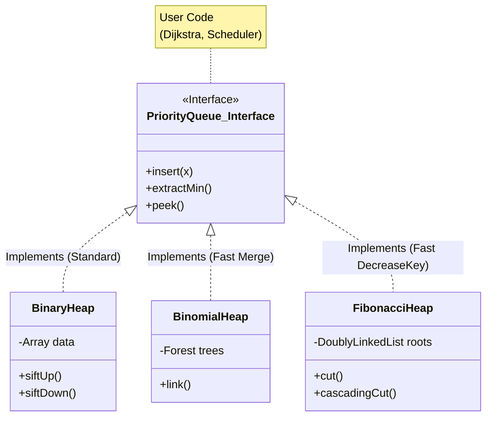
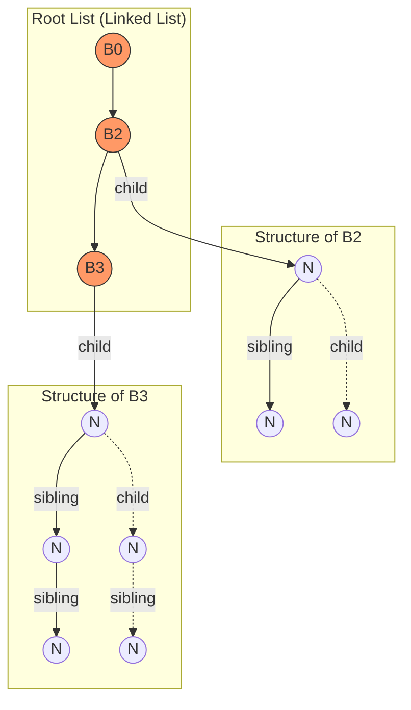

## 1. Priority Queue (Очередь с приоритетом): Контракт, а не структура

> [!abstract] ADT vs. Data Structure
> **Priority Queue (PQ)** — это **Абстрактный Тип Данных (ADT)**. Это *контракт*, который описывает, **что** система умеет делать (API).
> **Binary Heap (Куча)** — это **Структура Данных**. Это конкретный способ, **как** реализовать этот контракт в байтах.
>
> Спутать их — это как спутать понятие "Двигатель" (что он делает) с "V8 Twin-Turbo" (как он устроен).
> Вы можете реализовать Priority Queue на массиве, на списке или на дереве поиска. Но именно *Heap* (Куча) стала стандартом де-факто из-за баланса производительности.

### 1.1. The Contract (API Definitions)

Очередь с приоритетом — это контейнер $S$ для набора элементов, где каждый элемент имеет ассоциированный **ключ** (key/priority).
Мы будем рассматривать `Min-Priority Queue` (чем меньше ключ, тем выше приоритет), так как это стандарт для алгоритмов на графах.

#### Основной набор (Standard API)
Любая PQ обязана поддерживать эти операции:

1.  **`insert(S, x)`**: Добавить элемент $x$ в множество $S$.
    * *Интуиция:* "Встать в очередь".
2.  **`min(S)` / `peek(S)`**: Вернуть элемент с **минимальным** ключом, не удаляя его.
    * *Интуиция:* "Кто сейчас главный?"
3.  **`extractMin(S)` / `pop(S)`**: Удалить и вернуть элемент с минимальным ключом.
    * *Интуиция:* "Следующий, пройдите!"

#### Расширенный набор (Advanced API)
Именно здесь начинается магия (и боль) сложных куч. Эти операции критичны для алгоритмов Дейкстры и Прима.

4.  **`decreaseKey(S, x, k)`**: Изменить приоритет элемента $x$ (уже лежащего в очереди) на новое значение $k$ (при условии $k < currentKey$).
    * *Интуиция:* "Я стал VIP-клиентом, пропустите меня вперед!"
    * *Сложность:* Это самая сложная операция, ради которой придумали Fibonacci Heap.
5.  **`merge(S1, S2)` / `meld`**: Слить две очереди в одну.
    * *Интуиция:* "Две очереди в кассу объединяются".
6.  **`delete(S, x)`**: Удалить произвольный элемент (обычно реализуется через `decreaseKey` до $-\infty$ + `extractMin`).

### 1.2. Why not just sort? (The Naive Trap)

Почему нам нужна специальная структура данных (Heap)? Почему нельзя просто держать отсортированный массив или список?

Давайте сравним асимптотику реализаций контракта Priority Queue:

| Реализация | `insert` | `extractMin` | `peek` | Вердикт |
| :--- | :--- | :--- | :--- | :--- |
| **Unsorted Array** | $O(1)$ | $O(N)$ (scan) | $O(N)$ | Отлично пишет, ужасно читает. |
| **Sorted Array** | $O(N)$ (shift) | $O(1)$ | $O(1)$ | Отлично читает, ужасно пишет. |
| **Balanced BST (RB-Tree)** | $O(\log N)$ | $O(\log N)$ | $O(\log N)$ | Хорошо, но большой оверхед на память и указатели. |
| **Binary Heap** | **$O(\log N)$** | **$O(\log N)$** | **$O(1)$** | **Идеальный баланс.** |

> [!important] Закон Сохранения Сложности
> Вы не можете получить $O(1)$ на всё.
> * В несортированном массиве мы платим временем при чтении.
> * В сортированном — при записи.
> * **Куча** — это компромисс. Мы поддерживаем *частичный порядок* (слабее, чем полная сортировка), что позволяет делать обе операции быстро.

### 1.3. Примеры из жизни (Use Cases)

Чтобы понять PQ, нужно увидеть её в действии.

1.  **Планировщик задач OS (Linux CFS):**
    * В системе запущено 100 процессов. У кого меньше `vruntime` (виртуальное время работы), тот получает CPU следующим.
    * Процесс поработал -> его `vruntime` увеличился -> `insert` обратно в очередь.
2.  **Сетевой трафик (Quality of Service - QoS):**
    * Пакеты Voice over IP (Zoom) имеют приоритет выше, чем торренты. Роутер всегда делает `extractMax` для отправки пакета.
3.  **Событийный цикл (Event Loop / Timers):**
    * `setTimeout(func, 100ms)`.
    * Браузер хранит таймеры в PQ, отсортированной по *времени срабатывания*.
    * Цикл проверяет `peek()`: "Наступило ли время ближайшего события?". Если нет — спим.
4.  **Поиск пути (Dijkstra / A*):**
    * Мы исследуем граф. В очереди лежат вершины, до которых мы дошли, с приоритетом = "расстояние от старта".
    * Нам всегда нужно брать ближайшую вершину (`extractMin`).
    * Если нашли путь короче — обновляем приоритет (`decreaseKey`).

### 1.4. Visualizing the Semantic Gap (Mermaid)

Диаграмма, показывающая разрыв между Контрактом и Реализацией.



> [!check] Архитектурный вывод Когда вы пишете `std::priority_queue` в C++ или `PriorityQueue` в Java, вы подписываете **контракт**. Большинство библиотек "под капотом" дают вам **Binary Heap**. Это хороший дефолт. Но если ваш алгоритм требует частых слияний (`merge`) или обновлений (`decreaseKey`), дефолтная реализация станет узким местом. Тогда вам придется сменить реализацию интерфейса на Pairing Heap или Fibonacci Heap.
---
## 2. Binomial Heap (Биномиальная куча): Анатомия Слияния

> [!abstract] Проблема Слияния (The Merge Problem)
> **Binary Heap** идеальна для одинокой очереди. Но что, если вам нужно слить две очереди в одну (`merge`)?
> * В Binary Heap это стоит **$O(N)$**, так как нужно копировать массивы.
> * В распределенных системах и графовых алгоритмах (MST) слияние — частая операция.
>
> **Binomial Heap** была создана Ж. Вюллеменом (1978) именно для решения этой задачи. Она выполняет `merge` за **$O(\log N)$**.
> *Секрет:* Она подражает двоичной системе счисления. Слияние двух куч — это просто сложение двух двоичных чисел "в столбик".

### 2.1. Строительный блок: Биномиальное дерево ($B_k$)

Биномиальная куча — это не одно дерево, а **лес** (набор) специальных деревьев.

**Рекурсивное определение:**
1.  **$B_0$**: Один узел (корень).
2.  **$B_k$**: Два дерева $B_{k-1}$, где корень одного становится **самым левым ребенком** корня другого.

**Свойства дерева $B_k$:**
1.  **Высота:** $k$.
2.  **Количество узлов:** $2^k$. (Степень двойки — это важно!).
3.  **Степень корня:** $k$ (у корня ровно $k$ детей).
4.  **Биномиальность:** Количество узлов на глубине $d$ равно биномиальному коэффициенту $\binom{k}{d}$. Отсюда и название.

### 2.2. Структура Кучи: Двоичная аналогия

Как представить число $N=13$ элементами?
В двоичной системе: $13_{10} = 1101_2 = 1 \cdot 2^3 + 1 \cdot 2^2 + 0 \cdot 2^1 + 1 \cdot 2^0$.

**Binomial Heap** хранит элементы ровно по этому принципу:
* Она содержит набор биномиальных деревьев.
* Для каждого ранга $k$ может быть **либо 0, либо 1** дерево $B_k$.
* Для $N=13$ куча будет содержать деревья: $\{B_3, B_2, B_0\}$. (Дерева $B_1$ нет, так как бит равен 0).

**Физическое представление:**
Корни деревьев связаны в односвязный список (Root List), отсортированный по рангу.
Внутри дерева используется структура "Left Child, Right Sibling" (как в Pairing Heap).

### 2.3. Операция Link: Фундамент Слияния

Прежде чем слить кучи, нужно уметь сливать два дерева одинакового ранга.
Пусть у нас есть два дерева $T_1$ и $T_2$ ранга $k$.

**Алгоритм `link(T1, T2)`:**
1.  Сравниваем корни. Пусть $key(T_1) < key(T_2)$.
2.  Делаем $T_2$ самым левым ребенком $T_1$.
3.  Ранг $T_1$ увеличивается на 1.
4.  Время: **$O(1)$** (просто перекинуть пару указателей).

```cpp
Node* link(Node* y, Node* z) {
    y->parent = z;
    y->sibling = z->child;
    z->child = y;
    z->degree++;
    return z;
}
```
### 2.4. Операция Merge (Union): Сложение в столбик
Теперь самое главное. Как слить Кучу $H1$ и Кучу $H2$?
Это полный аналог сложения двоичных чисел с переносом разряда (Carry).
**Пример:** Сложить $H1$ (size 6: $B_2, B_1$) и $H2$ (size 7: $B_2, B_1, B_0$).
Двоично: $0110 + 0111$.
**Алгоритм:**
Идем по спискам корней от $k=0$ до $k_{max}$.
1. **Rank 0:** В $H1$ нет $B_0$. В $H2$ есть $B_0$.
    - Результат: $B_0$. Перенос: нет.   
2. **Rank 1:** В $H1$ есть $B_1$. В $H2$ есть $B_1$.
    - Конфликт! Нельзя иметь два $B_1$.
    - Действие: `link(B_1, B_1)`. Получаем дерево $B_2$. Оно уходит в **Перенос (Carry)**.
    - Результат в этом разряде: 0.
3. **Rank 2:** В $H1$ есть $B_2$. В $H2$ есть $B_2$. Плюс $B_2$ из Переноса.
    - У нас три дерева $B_2$.
    - Одно оставляем в результате. Два других линкуем в $B_3$ (новый перенос).

**Сложность:** $O(\log N)$, так как максимальный ранг дерева ограничен логарифмом от числа элементов.
### 2.5. Операция `extractMin`
1. **Поиск:** Пройтись по списку корней ($O(\log N)$ штук) и найти минимум. (В биномиальной куче минимум не всегда первый в списке!).
2. **Удаление:** Изъять дерево с минимальным корнем из списка.
3. **Распад:** Удалить корень дерева. Его дети (их $k$ штук) сами являются корнями деревьев $B_0, B_1 \dots B_{k-1}$.
4. **Re-Merge:** Развернуть список детей и слить (`merge`) его с оставшейся кучей.
    - _Сложность:_ $O(\log N)$ поиск + $O(\log N)$ слияние = **$O(\log N)$**.
### 2.6. Visualizing the Structure (Mermaid)
Структура кучи из 13 элементов ($B_3, B_2, B_0$). Обратите внимание на связи `child` и `sibling`.

### 2.7. Why Binomial Heap died? (Trade-offs)

Если Binomial Heap такая классная ($O(\log N)$ на слияние), почему в C++ `std::priority_queue` используется обычная Binary Heap?
1. **Cache Locality:** Биномиальная куча — это разбросанные по памяти узлы (Linked List). Binary Heap — это плотный массив. Промахи кэша убивают теоретическую выгоду.
2. **Complexity:** Реализация в 3 раза сложнее.
3. **DecreaseKey:** Все еще работает за $O(\log N)$, как и в обычной куче. (Потому что дерево имеет высоту $\log N$, и всплытие элемента занимает время).

> [!check] Архитектурный вывод
> Биномиальная куча сегодня редко используется в чистом виде.
> Однако она является **концептуальным родителем** для **Fibonacci Heap**.
> Фибоначчиева куча берет идею "Леса деревьев" и добавляет "Ленивость" (Laziness) — мы не сливаем деревья сразу, а ждем до последнего.

---
## 3. GAP Анализ: Почему не использовать их везде?

Если Binomial Heap так хорош в слиянии и имеет те же $O(\log N)$ на поиск, почему `std::priority_queue` использует Binary Heap?

1.  **Overhead на указатели:**
    *   В Binary Heap: 0 байт на структуру (неявные связи через индексы массива).
    *   В Binomial Heap: Каждый узел требует указатели: `parent`, `child`, `sibling`. Это $+24$ байта на элемент (на 64-bit системе).
2.  **Cache Locality (Убийца производительности):**
    *   Binary Heap: Последовательный доступ к массиву. Отличный Spatial Locality.
    *   Binomial Heap: Узлы разбросаны по куче (Heap Memory). Переход от `parent` к `child` — это гарантированный **Cache Miss** (задержка ~100ns).
3.  **Сложность реализации:** Написать безбажный `merge` с переносом деревьев в разы сложнее, чем `sift-up` в массиве.

### Где это применяется в реальности?
Чистые Биномиальные кучи сейчас редки. Но их идеи лежат в основе **Fibonacci Heaps** (где слияние ленивое) и **Pairing Heaps** (упрощенная версия для аллокаторов памяти).
Архитектор должен знать о них как о паттерне: *"Если мне нужно часто сливать шардированные очереди приоритетов, стандартная куча убьет CPU копированием. Нужна структура на ссылках"*.

---
## 4. Сравнение структур (Cheat Sheet для Архитектора)

| Операция | Binary Heap (Array) | Binomial Heap (Linked) | Fibonacci Heap (Lazy) |
| :--- | :--- | :--- | :--- |
| **Peek Min** | $O(1)$ | $O(\log N)$* | $O(1)$ |
| **Insert** | $O(\log N)$ | $O(\log N)$ | $O(1)$ |
| **Extract Min** | $O(\log N)$ | $O(\log N)$ | $O(\log N)$ amortized |
| **Decrease Key** | $O(\log N)$ | $O(\log N)$ | $O(1)$ amortized |
| **Merge** | $O(N)$ | $O(\log N)$ | $O(1)$ |

*\* Примечание: В Binomial Heap нужно пробежать по корням всех деревьев (их $\log N$), чтобы найти минимум, либо хранить указатель на минимум отдельно ($O(1)$).*

**Вывод Expert Level:**
Используйте **Binary Heap** по умолчанию.
Используйте **Intrusive Pairing Heap**, если нужно часто удалять из середины или менять приоритет.
Вспоминайте про **Binomial/Fibonacci**, только если вы пишете библиотеку графовых алгоритмов и вам нужно теоретически доказать асимптотику $O(E + V \log V)$.