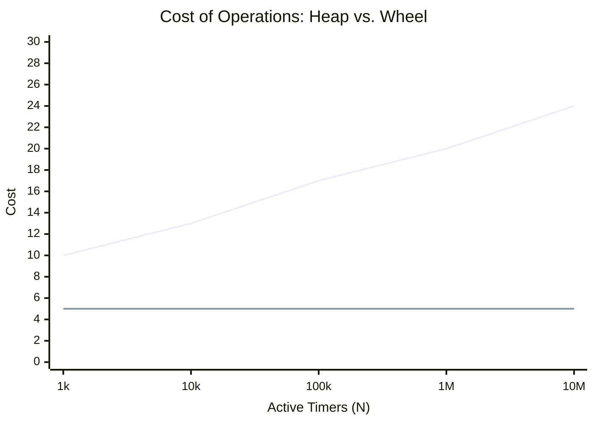
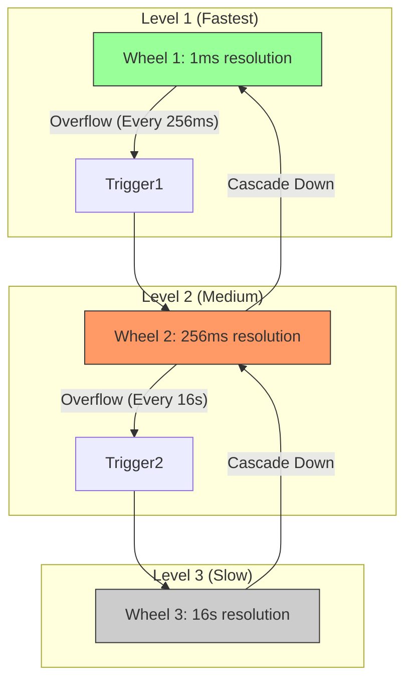
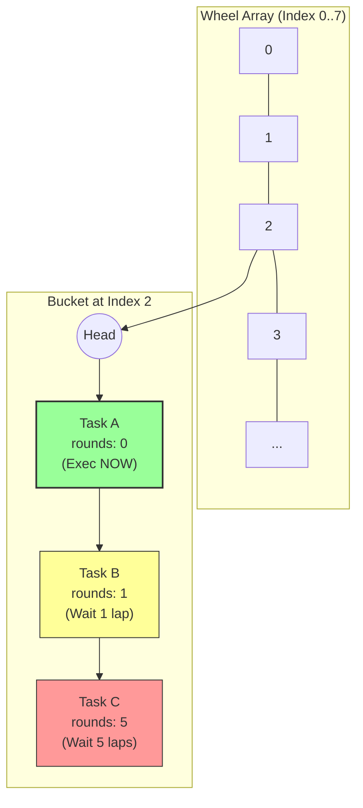
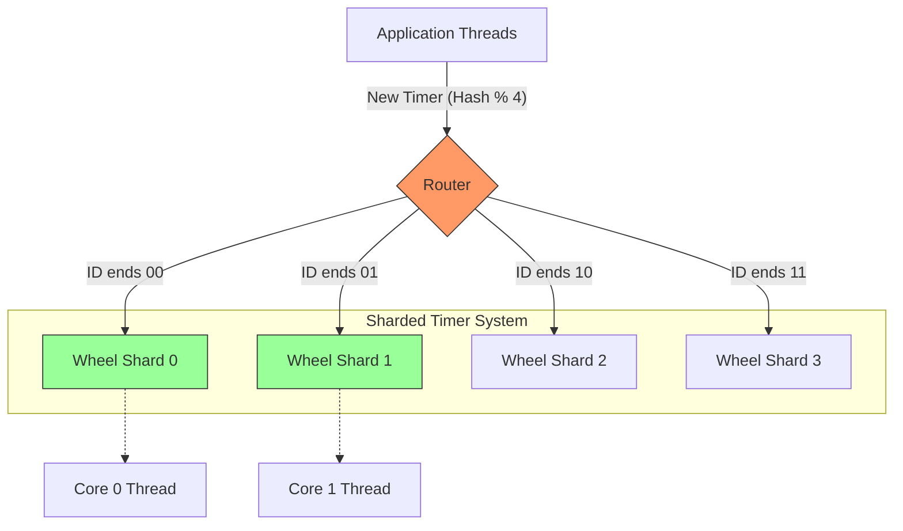
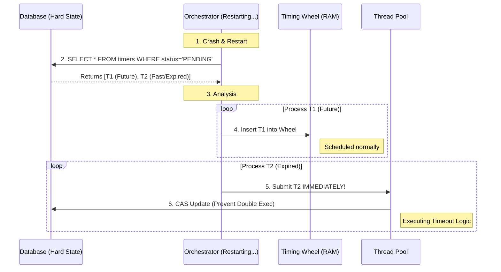

**TL;DR**: Когда у вас 10 миллионов открытых соединений (например, WebSocket сервер или Netty), и для каждого нужно поддерживать `Keep-Alive` таймер, стандартная куча (Heap) с её $O(\log N)$ убьёт ваш CPU. **Timing Wheel** — это структура данных, позволяющая запускать, отменять и обрабатывать таймеры за **$O(1)$**.

---
Идея была формализована Варгезе и Лауком (Varghese & Lauck) в 1987 году в статье *"Hashed and Hierarchical Timing Wheels"*.

## 1. Проблема: Почему $O(\log N)$ недостаточно?

> [!abstract] Контекст: C10M Problem
> Представьте, что вы пишете сетевой шлюз (Gateway), который держит **10 миллионов** открытых WebSocket соединений.
> Для каждого соединения нужен `Keep-Alive` таймер. Если мы не получили "ping" за 60 секунд — разрываем связь.
>
> * **Масштаб:** $N = 10,000,000$.
> * **Операции:** Каждую секунду приходят тысячи новых пакетов (обновление таймера) и тысячи соединений отваливаются (удаление таймера).
> * **Проблема:** Использовать `std::priority_queue` (Binary Heap) здесь — это самоубийство производительности.

### 1.1. Арифметика Латенси (The Cost of Logarithm)

Давайте посчитаем такты процессора.
В бинарной куче операции `insert` и `delete` стоят $O(\log N)$.

При $N = 10^7$ (10 миллионов):
$$\log_2(10^7) \approx 23 \dots 24$$

Это значит, что на **каждое** обновление таймера (когда прилетел пакет) процессор должен сделать ~24 сравнения и потенциально 24 обмена в памяти (Swap).
* **Cache Misses:** Куча не лежит в кэше линейно (родитель и дети далеко друг от друга). Каждый шаг спуска — это потенциальный промах кэша (L3 Cache Miss ~100ns).
* **Total Latency:** $24 \times 100ns \approx 2.4 \mu s$ на один таймер.
* **Throughput:** В одном потоке вы сможете обработать максимум $\frac{1 \text{sec}}{2.4 \mu s} \approx 400,000$ операций в секунду.
* **Вердикт:** Для высокочастотного трейдинга или ядра Linux это неприемлемо мало. Нам нужно $O(1)$.

### 1.2. Специфика Задачи (The Timer Pattern)

Почему Heap — это "стрельба из пушки по воробьям"?
Куча решает задачу сортировки **произвольных** чисел. Но таймеры — это не случайные числа.

1.  **Монотонность Времени:** Время всегда идет только вперед. Нам не нужно искать минимум среди *прошлого*. Нас интересует только "тик", который наступит *сейчас*.
2.  **Массовая Отмена (Cancellation Rate):**
    * В сетевом программировании 95% таймеров **никогда не срабатывают**.
    * Пакет пришел вовремя $\to$ Таймер отменяется (удаляется) и создается новый.
    * В стандартной куче (не интрузивной) удаление произвольного элемента — это $O(N)$ или требует "ленивых" меток (Tombstones), которые забивают память.
3.  **Группировка:** Нам часто не важно, сработает таймер в `1000ms` или `1001ms`. Нам важна точность до "тика" системы. Куча же сортирует всё с абсолютной точностью, тратя на это ресурсы.

### 1.3. Блокировки и Конкуренция (Global Lock Contention)

Если вы используете одну глобальную Priority Queue для всех соединений:
* Вам нужен `Mutex`.
* При каждом `Packet Arrived` поток захватывает мьютекс.
* Пока поток делает свои 24 шага по куче (Sift Up), **все остальные потоки ждут**.
* Это классическая проблема **Head-of-Line Blocking**.

> [!warning] Эффект "Грохочущего Стада" (Thundering Herd)
> Если в одну миллисекунду истекает 10,000 таймеров (например, скачок трафика минуту назад), куча должна сделать 10,000 `extractMin` подряд. Это создает спайк нагрузки (Jitter), замораживая Event Loop.

### 1.4. Эволюция решений в Linux Kernel

История ядра Linux отлично иллюстрирует этот тупик.

| Эра | Структура данных | Сложность (Insert/Run) | Проблема |
| :--- | :--- | :--- | :--- |
| **Linux < 2.4** | Linked List ($O(N)$) | $O(N)$ | Тормозил при >10k таймеров. |
| **Linux 2.4-2.6** | Timer Wheel (Early) | $O(1)$ | Быстро, но низкая точность при каскадировании. |
| **Linux 2.6+ (hrtimers)** | **Red-Black Tree** | $O(\log N)$ | Нужна наносекундная точность для Real-Time задач. Пришлось пожертвовать скоростью в пользу точности. |
| **Networking (Kafka/Netty)** | **Hashed Timing Wheel** | $O(1)$ амортизированное | В User-space приложениях точность важнее скорости. |
### 1.5. Visualizing the Gap (Mermaid)
Сравнение того, как растет стоимость операции при росте нагрузки.


> [!check] Архитектурный вывод
> 
> Если ваша система оперирует миллионами отложенных событий (timeouts, retries, delayed jobs), **Priority Queue** станет узким местом.
> 
> Вам нужна структура данных, которая:
> 
> 1. Использует свойство монотонности времени.
>     
> 2. Обеспечивает $O(1)$ на вставку и, главное, на **отмену**.
>     
> 3. Жертвует абсолютной точностью ради пропускной способности.
>     
> 
> Имя этой структуре — **Timing Wheel**.
---
## 2. Концепция: Простое колесо (Simple Timing Wheel)

> [!abstract] Аналогия: Настенные часы
> Самый простой способ понять Timing Wheel — посмотреть на обычные механические часы.
> * У них есть циферблат, разбитый на **60 делений** (секунд).
> * Секундная стрелка делает один шаг (**Tick**) каждую секунду.
> * Если вам нужно сделать что-то через 15 секунд, вы вешаете стикер на деление "текущее время + 15".
>
> Когда стрелка доходит до деления со стикером, вы выполняете задачу. Вам не нужно просматривать *все* стикеры на циферблате. Вы смотрите только на **текущий**.

### 2.1. Анатомия Структуры (The Array of Buckets)

С точки зрения Computer Science, Simple Timing Wheel — это **Циклический Буфер (Circular Buffer)** списков.

**Основные компоненты:**
1.  **Wheel Size ($N$):** Количество слотов (buckets) в колесе. Это определяет наш "горизонт планирования".
2.  **Tick Duration ($u$):** Цена одного деления (например, 10ms или 1s). Это определяет точность.
3.  **Current Time Pointer ($ptr$):** Курсор, указывающий на текущий слот.
4.  **Buckets:** В каждом слоте лежит двусвязный список (Doubly Linked List) задач, запланированных на этот момент.

**Математика планирования:**
Пусть мы хотим запланировать задачу через время $D$ (delay).
Текущее время (абсолютное) — $T_{now}$.
Время срабатывания: $T_{target} = T_{now} + D$.

Индекс слота в массиве вычисляется за $O(1)$:
$$Index = \left( \frac{T_{target}}{u} \right) \% N$$

### 2.2. Операции и Асимптотика

Посмотрим, как выглядит жизненный цикл таймера.

#### A. Insert (Schedule) — $O(1)$
1.  Вычисляем индекс слота по формуле выше.
2.  Добавляем задачу в хвост списка этого слота (Linked List Append).
3.  **Затраты:** Арифметика + пара перебросов указателей. Никаких сравнений, никакого `siftUp`.

#### B. Tick (Execution) — $O(1)$ per bucket
Системный таймер просыпается каждые $u$ миллисекунд.
1.  Сдвигаем указатель: $ptr = (ptr + 1) \% N$.
2.  Берем список в `Buckets[ptr]`.
3.  Выполняем все задачи из списка.
4.  Очищаем список (или просто переносим его в Thread Pool на исполнение).

#### C. Cancel (Delete) — $O(1)$
Это критический момент. Чтобы отмена была $O(1)$, мы должны использовать **Intrusive List** (как обсуждалось в лекции про Кучи).
* Объект таймера сам хранит указатели `prev` и `next` на соседей в бакете.
* Чтобы удалить таймер, нам не нужно искать его в колесе. Мы просто делаем `unlink(timer)`:
  ```cpp
  timer->prev->next = timer->next;
  timer->next->prev = timer->prev;
  ```

---
## 3. Решение: Иерархические колеса (Hierarchical Timing Wheels)

> [!abstract] Аналогия: Одометр автомобиля
> Как решить проблему памяти, не теряя $O(1)$? Нужно использовать идею систем счисления.
> Представьте одометр (счетчик пробега).
> * Правое колесико крутится быстро (метры).
> * Когда оно проходит круг (9 $\to$ 0), оно сдвигает соседнее левое колесико на один шаг (километры).
> * Еще левее — десятки километров.
>
> **Hierarchical Timing Wheel** — это набор из нескольких простых колес разного "масштаба" (разрешения). Таймеры не проверяются каждый тик. Они "спят" на верхних уровнях и спускаются вниз только когда их время пришло.

### 3.1. Архитектура: Колеса внутри колес

Вместо одного гигантского массива на миллиард слотов, мы берем несколько маленьких массивов (уровней).

**Пример конфигурации (как в Linux Kernel):**
1.  **Level 1 (TV1):** Основное колесо.
    * Размер: 256 слотов ($2^8$).
    * Разрешение: 1 тик (например, 1 ms).
    * Покрывает: 0...255 ms.
2.  **Level 2 (TV2):** Колесо второго уровня.
    * Размер: 64 слота ($2^6$).
    * Разрешение: 256 ms (один слот здесь = полный оборот TV1).
    * Покрывает: 256 ms ... 16 sec.
3.  **Level 3 (TV3):** ...
    * Разрешение: 16 sec.
    * Покрывает: до ~17 минут.
4.  **Level 4 (TV4):** ...
    * Покрывает: до ~18 часов.
5.  **Level 5 (TV5):** ...
    * Покрывает: до ~13 дней.

**Итого:** Вместо массива длиной $1,100,000,000$ (для 13 дней по 1мс), мы используем $256 + 64 \times 4 = 512$ слотов.
Экономия памяти — колоссальная.

### 3.2. Алгоритм Вставки (Insert)

Куда положить таймер с задержкой `delay = 1000 ms`?

1.  Смотрим на текущее время $T_{now}$. Целевое время $T_{target} = T_{now} + 1000$.
2.  Вычисляем разницу (Delta).
3.  **Битовая магия:** Так как размеры колес — степени двойки, выбор уровня делается через битовые операции (MSB - Most Significant Bit или `clz` - count leading zeros).
    * Если $Delta < 256$ $\to$ кладем в **TV1**.
    * Если $256 \le Delta < 16384$ $\to$ кладем в **TV2**.
    * И так далее.
4.  **Индекс:** $Index = (T_{target} \gg Shift_{level}) \& Mask_{level}$.
    * Для таймера на 1000ms (попадет в TV2): он окажется в слоте $\approx 3$ второго колеса.

### 3.3. Главный трюк: Каскадирование (Cascading)

Самое интересное происходит при тиках.
Пока время идет в пределах 0..255, крутится только **TV1**. Мы достаем задачи и исполняем их.

**Что происходит на 256-й тик?**
1.  Указатель TV1 переходит через 0 (Overflow).
2.  Это сигнал для TV2: "Прошел один ваш такт".
3.  Мы сдвигаем указатель TV2 на 1 позицию.
4.  **CASCADE:** Мы берем **весь список** задач из текущего слота TV2.
    * Эти задачи были запланированы давно. Их время *почти* пришло, но не совсем (осталось меньше 256 мс).
    * Мы **удаляем** их из TV2 и **перевставляем (Re-insert)** в TV1.
    * Теперь они распределятся по слотам основного колеса с точностью до 1 мс.

> [!info] Ленивое вычисление
> Мы не сортируем задачи в TV2. Они там лежат "кучей". Мы уточняем их позицию только тогда, когда до исполнения остается мало времени.

### 3.4. Асимптотика: Амортизированная константа

Какова стоимость тика?
* **Обычный тик (99.6% случаев):** Работаем только с TV1. $O(1)$.
* **Тик переполнения TV1 (каждые 256 мс):** Каскадирование из TV2. Перенос $M$ элементов. $O(M)$.
* **Тик переполнения TV2 (каждые 16 сек):** Каскадирование из TV3.

Хотя в худшем случае (раз в 13 дней) мы можем каскадировать много задач, **средняя** стоимость операции остается $O(1)$.
В отличие от Binary Heap, здесь нет зависимости от общего числа таймеров $N$, только от количества таймеров *в конкретную миллисекунду*.

### 3.5. Визуализация: The Gear Mechanism (Mermaid)

Представьте систему шестеренок.



---
## 4. Реализация: Hashed Timing Wheel (Netty / Dubbo)

> [!abstract] Философия: "Simplicity Scales"
> Иерархические колеса (как в Linux) — это мощно, но сложно в реализации (каскадирование, миграция задач между уровнями).
> В User-space приложениях (особенно на Java/Go) перекладывание объектов между массивами создает лишнюю нагрузку на шину памяти и GC.
>
> **Netty** (и, как следствие, Dubbo, Vert.x, Cassandra) использует упрощенный подход: **Hashed Timing Wheel**.
> * **Идея:** Одно колесо фиксированного размера.
> * **Коллизии:** Если времени не хватает (горизонт планирования превышен), мы не создаем второе колесо. Мы просто говорим таймеру: *"Пропусти $K$ оборотов, прежде чем сработать"*.

### 4.1. Структура Данных: Bucket & Rounds

Мы возвращаемся к массиву списков, но добавляем в каждый таймер одно поле.

**Компоненты:**
1.  **Wheel (`HashedWheelBucket[]`):** Массив слотов. Размер — степень двойки (например, 512), чтобы брать остаток от деления через битовую маску `& (N-1)`.
2.  **Tick Duration:** Шаг времени (например, 100ms).
3.  **Task Wrapper (`HashedWheelTimeout`):**
    * `task`: Сама задача.
    * `deadline`: Абсолютное время срабатывания.
    * **`remainingRounds`**: Счетчик "лишних" оборотов.
#### Математика "Кругов" (The Rounds Logic)
Пусть:
* `tickDuration` = 1 сек.
* `wheelSize` = 10 слотов.
* Текущее время = 0.

Мы планируем задачи:
1.  **Task A (через 2 сек):**
    * `index` = $2 \% 10 = 2$.
    * `rounds` = $2 / 10 = 0$.
2.  **Task B (через 12 сек):**
    * `index` = $12 \% 10 = 2$. (Коллизия с Task A!)
    * `rounds` = $12 / 10 = 1$. (Один полный круг).

В слоте №2 будет список: `[Task A (R=0)] -> [Task B (R=1)]`.

### 4.2. Алгоритм Работы (The Worker Loop)

В Netty колесо крутится в **одном отдельном потоке**. Это важно: таймеры не выполняются в потоках IO, они только *диспатчатся* оттуда.

#### A. Тик (Tick Processing)
Когда поток просыпается (спустя `tickDuration`):
1.  Вычисляем текущий индекс: `idx = (idx + 1) & mask`.
2.  Берем бакет `buckets[idx]`.
3.  **Проходим по всему списку (Linked List Traversal):**
    * У каждого таймера проверяем `remainingRounds`.
    * **Если `rounds > 0`:**
        * `timer.rounds--`.
        * Оставляем в списке. Идем дальше.
    * **Если `rounds == 0`:**
        * Задача созрела!
        * Удаляем из списка (`unlink`).
        * Передаем на исполнение (обычно в `ExecutorService` или выполняем тут же, если задача легкая).
    * **Если `cancelled`:**
        * Просто удаляем (Lazy removal).

#### B. Вставка (Insert)
В Netty вставка оптимизирована для многопоточности (Non-Blocking).
Мы не пишем сразу в бакет (это потребовало бы блокировки всего колеса).
1.  Вычисляем параметры (`rounds`, `stopIndex`).
2.  Кладем задачу в очередь **MPSC** (Multi-Producer Single-Consumer) — `timeouts` queue.
3.  Поток колеса (Worker) в начале каждого тика выгребает из этой очереди до 100,000 задач и рассовывает их по бакетам.

> [!info] Почему так?
> Это позволяет `schedule()` работать молниеносно из любого потока, не ожидая захвата лока бакета.

### 4.3. Опасности и Ограничения (The Catch)

Hashed Timing Wheel не идеальна. У неё есть специфические "болезни", о которых обязан знать архитектор.

1.  **Блокировка Воркера (Worker Blocking):**
    * Колесо крутит **один** поток.
    * Если вы в задаче таймера напишете `Thread.sleep(1000)` или сделаете запрос в БД, **все остальные таймеры остановятся**.
    * *Правило:* Внутри таймера должна быть только легковесная логика или отправка задачи в ThreadPool.
2.  **Джиттер (Tick Duration Precision):**
    * Если `tickDuration = 100ms`, вы не можете запланировать задачу ровно через 105ms. Она сработает либо через 100, либо через 200.
    * Hashed Wheel не подходит для Real-Time систем (аудио, видео).
3.  **Взрыв "Толстых" Бакетов:**
    * Если у вас `wheelSize` маленький, а задач миллионы, списки в бакетах станут длинными.
    * Даже если задачи "на следующий круг" (`rounds > 0`), процессору все равно нужно пройти по списку, чтобы уменьшить счетчик. Это тратит кэш и такты.

### 4.4. Визуализация: Логика Раундов (Mermaid)


### 4.5. Code Snippet: Имитация логики (Pseudo-Java)
```Java
class HashedWheelBucket {
    HashedWheelTimeout head;
    HashedWheelTimeout tail;

    public void expireTimeouts(long deadline) {
        HashedWheelTimeout timeout = head;

        // Traverse the list
        while (timeout != null) {
            HashedWheelTimeout next = timeout.next;
            
            if (timeout.remainingRounds <= 0) {
                // Time to execute!
                next = remove(timeout);
                if (timeout.deadline <= deadline) {
                    timeout.expire();
                } else {
                    // Edge case: round check passed, but deadline mismatch
                    // (Should not happen in ideal logic)
                }
            } else {
                // Not yet, wait for next rotation
                timeout.remainingRounds--;
            }
            timeout = next;
        }
    }
}
```

> [!check] Архитектурный вывод Используйте **Netty HashedWheelTimer**, когда:
> 
> 1. Вам нужно держать **100k+ открытых соединений** с таймаутами.
>     
> 2. Точность 10-100 мс для вас приемлема.
>     
> 3. Задачи отменяются чаще, чем срабатывают.
>     
> 
> Это стандарт индустрии для IO-bound приложений на JVM.
---
## 5. Где это применяется (Case Studies)

### 5.1. Linux Kernel Timers
Ядро ОС не может позволить себе перебирать миллионы таймеров TCP-соединений.
Оно использует **Hierarchical Timing Wheels**.
*   Массивы TV1 (256 слотов, 1 тик = 1 jiffy), TV2, TV3, TV4, TV5 (по 64 слота).
*   Это позволяет обрабатывать таймеры с накладными расходами близкими к нулю.

### 5.2. Apache Kafka (Purgatory)
В Kafka есть структура **Purgatory** — чистилище для запросов.
Пример: Producer ждет `acks=all`. Запрос висит в Purgatory, пока реплики не ответят ИЛИ не выйдет тайм-аут.
*   Тайм-аутов тысячи. Создавать Java `Thread` или даже объект `java.util.Timer` на каждый запрос — накладно.
*   Kafka реализовала **Hierarchical Timing Wheels** (на Scala/Java).
*   **Результат:** Вставка/отмена таймера почти бесплатна. Это критично, так как 99.9% репликаций успевают вовремя, и таймер *отменяется* до срабатывания.

---
## 6. Как реализовать самому (Советы Архитектора)

> [!danger] Предупреждение: "Not Invented Here" Syndrome
> Прежде чем писать свое Колесо Таймеров, убедитесь, что существующие решения (Netty HashedWheelTimer, Linux timerfd, Go time.After) вам точно не подходят.
> Писать планировщик — это как писать аллокатор памяти. Легко сделать прототип, но невероятно сложно сделать его корректным в условиях **Race Conditions**, **Clock Skew** и **Memory Fragmentation**.

Если вы всё же решились (или пишете свой игровой движок / базу данных), вот 5 правил архитектора.

### 6.1. Правило №1: Никогда не используйте "Wall Clock"

Самая распространенная ошибка новичков — использовать `System.currentTimeMillis()` (Unix Timestamp).

* **Проблема:** Пользователь перевел часы назад. NTP-сервер синхронизировал время (Leap Second).
* **Результат:** Ваш таймер на 1 секунду "зависнет" на час или сработает мгновенно.
* **Решение:** Используйте только **Монотонные Часы**.
    * **Linux C++:** `CLOCK_MONOTONIC` или `CLOCK_BOOTTIME` (учитывает время сна системы).
    * **Java:** `System.nanoTime()`.
    * **Go:** `time.Now()` (в Go оно содержит монотонный компонент внутри).
    * **Hardware:** `RDTSC` (процессорный счетчик тактов) — только если вы знаете, как конвертировать его в секунды и бороться с плавающей частотой CPU.

### 6.2. Правило №2: Борьба с Cache Miss (Intrusive Lists)

В стандартной реализации (`std::list<Timer>`) каждый таймер — это отдельная аллокация в куче.
При проходе по бакету (`tick`) процессор прыгает по случайным адресам памяти. Это **Cache Miss Storm**.

**Оптимизация:**
1.  **Intrusive Data Structures:** Сделайте объект таймера частью вашей структуры данных (Task/Request). Указатели `prev` и `next` должны лежать *внутри* объекта задачи.
2.  **Object Pooling:** Таймеры часто создаются и удаляются. Не делайте `new/delete` (malloc/free) на каждый чих. Используйте Pre-allocated Ring Buffer или Slab Allocator для нод таймеров.

```cpp
// Плохо (Pointer chasing + Cache miss)
std::vector<std::list<Timer*>> wheel;

// Хорошо (Intrusive)
struct Task {
    // ... payload ...
    Task* timer_next;
    Task* timer_prev;
    int bucket_index;
};
```

### 6.3. Правило №3: Шардирование (Sharding) вместо Мьютекса

Если у вас 64 ядра и одно глобальное колесо с одним `Mutex` (или `Spinlock`), вы убьете производительность на контеншене (Lock Contention).

**Решение:**
Используйте подход `ConcurrentHashMap`. Создайте массив из $K$ независимых колес (например, $K=CPU\_Cores$).
- Когда создается новый таймер, выбирайте колесо по формуле: `wheel_id = ThreadID % K` или `hash(TaskID) % K`.
- Каждое колесо имеет свой поток (или крутится в своем Event Loop).
- **Результат:** Линейная масштабируемость.

### 6.4. Правило №4: Проблема "Тихого Часа" (Sleep Strategy)

Как крутить колесо?

- **Вариант A: Busy Spin (`while(true)`)**
    - Точность идеальная.
    - CPU загружен на 100% (греет воздух). Приемлемо только для HFT (High-Frequency Trading).
- **Вариант B: `sleep(tick)`**
    - Если тик 1мс, ОС может проснуться через 1.5мс или 2мс. Джиттер неизбежен.
- **Вариант C: Event Loop Integration (Best Practice)**
    - Встройте проверку таймеров в ваш основной цикл ввода-вывода (`epoll`, `kqueue`, `io_uring`).
    - Вычисляйте `timeout` для системного вызова как `min(next_timer_deadline, 100ms)`.
    - Если событий ввода-вывода нет, поток спит ровно столько, сколько нужно до ближайшего таймера.
### 6.5. Правило №5: Overflow Protection (Защита от Дурака)

Что будет, если пользователь поставит таймер на `Long.MAX_VALUE` лет вперед?
- В **Simple Wheel**: Индекс выйдет за пределы массива (Segfault).
- В **Hashed Wheel**: Счетчик `rounds` переполнится (Integer Overflow).
- В **Hierarchical Wheel**: Потребуется слишком много уровней.

**Совет:** Введите жесткий лимит на максимальный горизонт планирования (например, 24 часа). Если нужно больше — сохраняйте задачу в базу данных, а не держите в оперативной памяти.
### 6.6. Визуализация: Sharded Architecture (Mermaid)

Архитектура промышленного уровня для многоядерных систем.



> [!check] Итоговый чек-лист (Definition of Done)
> 
> Ваше самописное колесо готово к продакшену, если:
> 
> 1. [ ] Вставка и отмена за $O(1)$.
>     
> 2. [ ] Используется монотонное время.
>     
> 3. [ ] Нет глобальной блокировки (используется шардирование или thread-local).
>     
> 4. [ ] Нет динамической аллокации памяти на "горячем" пути (Hot Path).
>     
> 5. [ ] Вы четко понимаете, что происходит при переполнении (Overflow).
>

---
## 7. Durability: Как пережить падение (Durable Timers) 

> [!danger] Проблема волатильности
> Timing Wheel — это структура **Soft State** (кеш расписания).
> База данных (WAL) — это структура **Hard State** (истина).
>
> Если оркестратор падает, мы теряем Soft State. При перезапуске мы обязаны **регидрировать (Rehydrate)** колесо из Hard State.
> Но тут возникает проблема "Пропущенного времени" (Time Gap): что делать с таймерами, которые должны были сработать *во время* простоя?

### 7.1. Архитектура: Write-Through Scheduling

Чтобы гарантировать надежность, колесо не может быть "вещью в себе". Оно должно работать в паре с персистентным хранилищем (PostgreSQL, Redis, Cassandra).

#### Фаза 1: Регистрация (Schedule)
Когда вы ставите таймер (например, "ждать ответа агента 5 минут"):

1.  **DB Commit:** Записываем намерение в БД.
    * `INSERT INTO timers (id, deadline, callback_payload, status) VALUES (uuid, now() + 5m, json, 'PENDING');`
2.  **RAM Insert:** Только *после* успешного коммита в БД добавляем задачу в `TimingWheel` в памяти.
    * *Важно:* Если БД упала — таймер не ставим, возвращаем ошибку клиенту.

#### Фаза 2: Срабатывание (Fire)
Когда Timing Wheel делает `tick` и находит задачу:

1.  **Check Status:** Идем в БД (или проверяем локальный кэш состояния задачи). Актуален ли этот таймер? (Может, задачу уже отменили или агент ответил досрочно?).
2.  **Execution:** Запускаем логику таймаута (например, посылаем событие "Timeout" в State Machine).
3.  **DB Delete/Mark:** Помечаем в БД `status = 'FIRED'` или удаляем строку.

### 7.2. Процедура Восстановления (Crash Recovery)

Самое интересное происходит при рестарте оркестратора.

**Алгоритм Catch-Up (Нагоняем упущенное):**

1.  **Start:** Оркестратор запускается. Колесо пустое. Текущее время $T_{boot}$.
2.  **Fetch:** Читаем из БД все активные таймеры: `SELECT * FROM timers WHERE status = 'PENDING'`.
3.  **Filter & Re-insert:**
    Для каждого таймера с дедлайном $T_{deadline}$:
    * **Сценарий А ($T_{deadline} > T_{boot}$):** Время еще не пришло. Просто вставляем в колесо.
    * **Сценарий Б ($T_{deadline} \le T_{boot}$):** Время **истекло**, пока мы лежали!
        * Это "Просроченный таймер".
        * Мы не можем вставить его в колесо (в прошлое нельзя запланировать).
        * **Решение:** Немедленно отправляем его в `WorkerPool` на исполнение.

> [!warning] Лавина при старте (Thundering Herd)
> Если вы лежали час, и за это время протухло 100,000 задач, при старте вы попытаетесь выполнить их все *одновременно*.
> **Совет:** Используйте Rate Limiter на фазе Recovery, чтобы не положить базу данных и сеть мгновенным "проигрыванием" старых таймаутов.

### 7.3. Идемпотентность и Гонки (Concurrency)

Вы правильно заметили про идемпотентность. В распределенной системе возможен сценарий **"Зомби-процесса"**:

1.  Нода А "зависла" (GC Pause на 30 сек).
2.  Кластер решил, что Нода А умерла, и поднял Ноду Б.
3.  Нода Б загрузила таймеры и выполнила Таймаут для задачи X.
4.  Нода А "отвисла" и *тоже* выполнила Таймаут для задачи X (так как у неё в памяти старое колесо).

**Решение: Optimistic Locking (CAS)**

При срабатывании таймера всегда делайте проверку в БД (или KV-store типа Redis/Etcd):

```sql
UPDATE tasks 
SET status = 'TIMED_OUT' 
WHERE id = $task_id AND status = 'IN_PROGRESS';
```
- Если `rows_affected == 1` — мы победили. Выполняем логику компенсации.
- Если `rows_affected == 0` — кто-то (другая нода или успешный ответ агента) уже изменил состояние. **Игнорируем таймер.**
### 7.4. Hybrid Approach: Redis ZSET (Альтернатива)

Если писать свой WAL и Recovery лениво, можно использовать **Redis Sorted Sets** как "Персистентное Колесо".

- **Insert:** `ZADD timers <timestamp> <task_id>`
- **Tick (Poller):** Каждую секунду скрипт делает `ZRANGEBYSCORE timers -inf <now>`.
- **Result:** Redis возвращает список задач, время которых настало.
- **Atomic Pop:** Lua-скрипт, который читает и удаляет задачи атомарно.

**Плюсы:**
- Redis персистит данные на диск (AOF/RDB).
- При падении вашего Go/Java сервиса, таймеры остаются в Redis.
- Любой свободный воркер может подхватить задачу (нет привязки к памяти одной ноды).

**Минусы:**
- Лишний сетевой хоп (Network Hop) на каждый тик.
- Redis становится единой точкой отказа (хотя он надежен).

### 7.5. Визуализация: Recovery Process (Mermaid)




> [!check] Итоговый рецепт надежности
> 
> 1. **Timing Wheel** используем для _оптимизации_ (чтобы не поллить БД каждую секунду).
>     
> 2. **Database (WAL)** используем как _источник истины_.
>     
> 3. **При старте** вычитываем БД и наполняем Колесо.
>     
> 4. **Просроченные** задачи исполняем сразу.
>     
> 5. **CAS (Compare-And-Swap)** защищает от двойного срабатывания.
>     
> 6. Да, **Идемпотентность** API агентов обязательна, так как сеть может дублировать запросы независимо от таймеров.
>

## 8. Чек-лист уровня Expert

1.  **Jitter (Дрожание):** Понимаете ли вы, что Timing Wheel округляет время до ближайшего тика? Таймер на 10.5мс в колесе с тиком 10мс сработает либо через 10, либо через 20. Для Hard Real-Time это может быть неприемлемо.
2.  **Memory Access:** Hashed Wheel с длинными списками плох для кеша (Pointer Chasing). Hierarchical Wheel лучше, так как списки обычно короче.
3.  **Сравнение:**
    *   **Min-Heap:** $O(\log N)$ insert/delete, точный порядок, компактность. Хорош для малого $N$.
    *   **Timing Wheel:** $O(1)$ insert/delete, приблизительная точность, фиксированный оверхед памяти. Король для огромного $N$ и частых отмен (cancellation).
### Заключение
**Timing Wheel** — это пример того, как знание структур данных позволяет обойти ограничения "стандартных библиотек". Когда профайлер покажет вам, что `PriorityQueue.offer` занимает 30% CPU, вы будете знать, что делать.