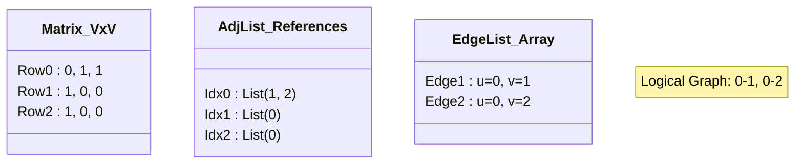
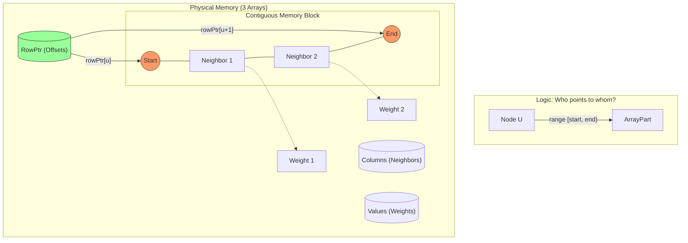
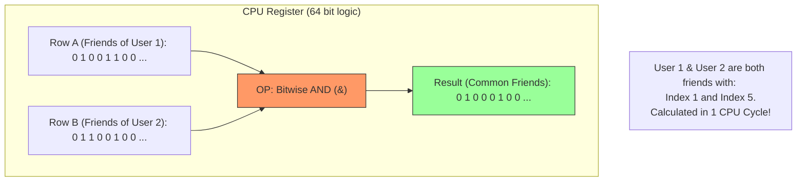
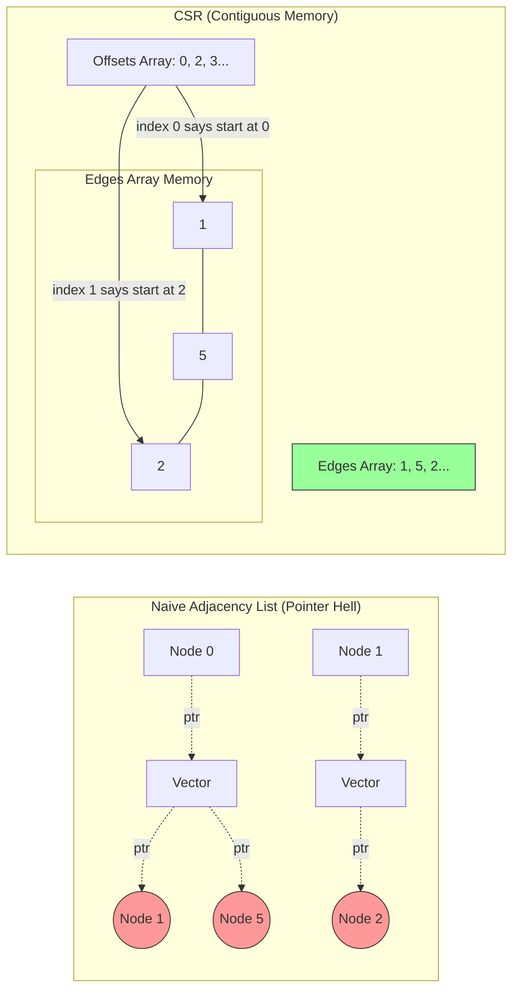
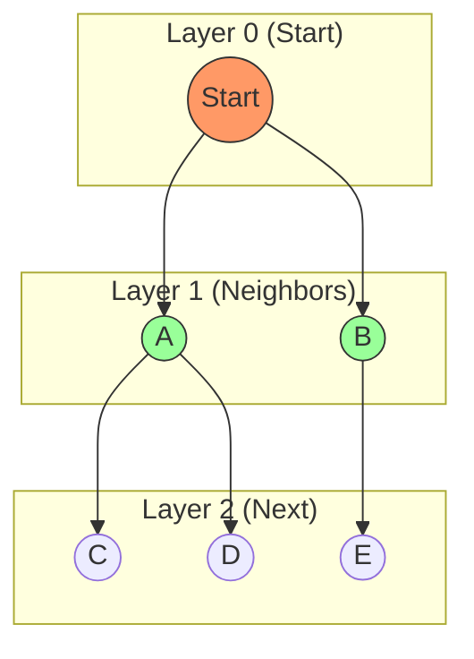
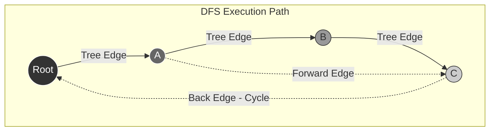
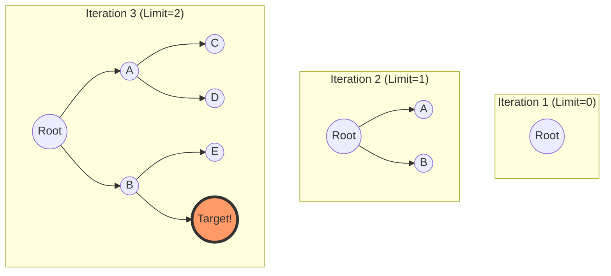

В высоконагруженных системах "Граф" — это способ укладки данных в оперативную память. Ваша задача как архитектора — минимизировать количество прыжков по памяти (Memory Indirections) и максимизировать плотность полезных данных (Data Locality).

## 1. Представление графа: Theory vs Hardware

> [!abstract] Ложь "Большого О"
> В классической теории (Кормен, Седжвик) мы учим, что **Список Смежности (Adjacency List)** — это стандарт для разреженных графов с асимптотикой обхода $O(V+E)$.
>
> **Инженерная реальность:** Если вы реализуете граф как `std::vector<std::list<Node*>>`, ваш процессор будет ненавидеть вас.
> * **Theory:** Считает количество операций.
> * **Hardware:** Считает количество **Cache Misses**.
>
> Графовые алгоритмы (BFS, DFS) — это худший кошмар для кэша процессора, потому что они порождают паттерн доступа к памяти **Random Memory Access**. В этом разделе мы разберем, как хранить графы так, чтобы они летали.

### 1.1. Классика: Три кита теории

> [!abstract] Формализация $G = (V, E)$
> Граф состоит из множества вершин $V$ (Vertices) и множества ребер $E$ (Edges).
> Главный вопрос инженерии: **Как отобразить эти математические множества на линейную память компьютера?**
>
> Выбор структуры данных зависит от двух факторов:
> 1.  **Плотность (Density):** Сколько у нас ребер относительно максимума?
> 2.  **Паттерн доступа:** Что мы делаем чаще — бегаем по соседям (BFS) или проверяем наличие связи (Game Logic)?

#### A. Матрица Смежности (Adjacency Matrix)

Это двумерный массив размером $V \times V$.
* **Unweighted Graph:** `bool adj[i][j] = true`, если есть ребро $i \to j$.
* **Weighted Graph:** `int adj[i][j] = weight`, где отсутствие ребра кодируется как $\infty$ (или 0).

**Характеристики:**
* **Space:** $O(V^2)$. Это "дорогой" кит. Для графа в 100,000 вершин матрица займет ~10 ГБ RAM (даже если там всего 2 ребра).
* **Lookup:** Проверка `isConnected(u, v)` стоит **$O(1)$**. Это киллер-фича.
* **Iteration:** Чтобы найти всех соседей вершины $u$, нужно просканировать **всю строку** длиной $V$. Даже если соседей нет, мы потратим $O(V)$ времени.

```cpp
// Пример: Проверка связи - мгновенно
if (matrix[u][v]) { return true; } 

// Пример: Поиск соседей - медленно
for (int v = 0; v < V; ++v) { // O(V) всегда
    if (matrix[u][v]) neighbors.push_back(v);
}
```
#### B. Список Смежности (Adjacency List)

Стандарт де-факто для большинства алгоритмов. Мы храним массив списков.
`adj[u]` содержит список всех вершин $v$, таких что существует ребро $u \to v$.
**Характеристики:**
- **Space:** $O(V + E)$. Память тратится только на существующие связи.
- **Lookup:** Чтобы проверить `isConnected(u, v)`, нужно пробежать по списку `adj[u]`. В худшем случае (звезда) это $O(V)$, в среднем — $O(deg(u))$.
- **Iteration:** Идеально. Мы проходим ровно столько итераций, сколько у вершины соседей.
```C++
// C++ Implementation
// vector - массив вершин, внутри vector - динамический список соседей
vector<vector<int>> adj(V); 

// Weighted version
vector<vector<pair<int, int>>> adj_w(V); // .first = neighbor, .second = weight
```
#### C. Список Ребер (Edge List)

Часто забываемая, но важная структура. Это просто массив всех ребер подряд.
Используется в алгоритмах, которые работают с ребрами как с объектами, а не с топологией (например, **Алгоритм Крускала** для MST или **Bellman-Ford**).
**Структура:**
```C++
struct Edge { int u, v, weight; };
vector<Edge> edges;
```

**Характеристики:**
- **Space:** $O(E)$. Самая компактная структура.
- **Lookup / Iteration:** Ужасно. Чтобы найти соседей вершины $u$, нужно просмотреть **весь** список ребер ($O(E)$). Для BFS/DFS непригодна.
#### D. Сравнительная таблица (Trade-offs)

Пусть $V$ — число вершин, $E$ — число ребер, $deg(u)$ — степень вершины (число соседей).

| **Операция**           | **Adj Matrix**                                 | **Adj List**                             | **Edge List**         |
| ---------------------- | ---------------------------------------------- | ---------------------------------------- | --------------------- |
| **Память (Space)**     | $O(V^2)$ 🔴                                    | $O(V + E)$ 🟢                            | $O(E)$ 🟢             |
| **`hasEdge(u, v)`**    | **$O(1)$** 🟢                                  | $O(deg(u))$ 🟡                           | $O(E)$ 🔴             |
| **`getNeighbors(u)`**  | $O(V)$ 🔴                                      | **$O(deg(u))$** 🟢                       | $O(E)$ 🔴             |
| **`addEdge(u, v)`**    | $O(1)$ 🟢                                      | $O(1)$ 🟢                                | $O(1)$ 🟢             |
| **`removeEdge(u, v)`** | $O(1)$ 🟢                                      | $O(deg(u))$ 🟡                           | $O(E)$ 🔴             |
| **Применение**         | Dense Graphs ($E \approx V^2$), Floyd-Warshall | **General Purpose** (BFS, DFS, Dijkstra) | Kruskal, Bellman-Ford |
#### E. Критический концепт: Плотность (Density)

Чтобы выбрать между Матрицей и Списком, нужно оценить **Плотность графа**.
$$D = \frac{2E}{V(V-1)} \quad \text{(для неориентированного графа)}$$
- **Sparse Graph (Разреженный):** $E \ll V^2$ (обычно $E \approx V$ или $E \approx V \log V$).
    - _Примеры:_ Дорожная сеть, Соцсеть друзей, Интернет-ссылки, Деревья.
    - _Выбор:_ **Adjacency List**.
- **Dense Graph (Плотный):** $E \approx V^2$.
    - _Примеры:_ Таблица расстояний между городами (каждый с каждым), Матрица корреляций, Игровые взаимодействия (в небольшой комнате).
    - _Выбор:_ **Adjacency Matrix** (быстрее за счет кэша и отсутствия лишних указателей).
### F. Визуализация структур (Mermaid)

Граф: $0 \leftrightarrow 1$, $0 \leftrightarrow 2$.



> [!important] Инженерный нюанс: Удаление ребра
> 
> Обратите внимание на `removeEdge` в Списке Смежности.
> 
> В учебниках часто умалчивают, но чтобы удалить связь `u-v`, вам нужно:
> 
> 1. Найти `adj[u]`.
>     
> 2. Линейным поиском найти в нем `v`.
>     
> 3. Удалить элемент (сдвинуть хвост вектора или перелинковать список).
>     
> 
> Это операция $O(deg(u))$, а не $O(1)$. Если вы пишете игровой движок, где связи рвутся часто, `vector<vector<int>>` может стать узким местом. В таких случаях используют `vector<unordered_set<int>>` (Hash Set вместо списка), жертвуя памятью ради скорости удаления.

### 1.2. Проблема: Pointer Chasing (Охота за указателями)

Рассмотрим стандартную C++/Java реализацию Списка Смежности:
```cpp
// Наивный подход
struct Node {
    int id;
    std::vector<Node*> neighbors; // Вектор указателей
};
```
**Что происходит в памяти при BFS?**
1. Мы берем вершину `u`.
2. Загружаем список её соседей.
3. Идем по указателю `neighbor[0] -> Node A`. **Адрес 0x1000**. (Cache Miss).
4. Идем по указателю `neighbor[1] -> Node B`. **Адрес 0x9500**. (Cache Miss).
5. Идем по указателю `neighbor[2] -> Node C`. **Адрес 0x3200**. (Cache Miss).

**Результат:** Данные разбросаны по куче (Heap Fragmentation). Hardware Prefetcher не может предсказать, какой адрес будет следующим, и отключается. Процессор простаивает 200 тактов на каждом шаге, ожидая данные из RAM.

## 1.3. Решение: CSR (Compressed Sparse Row)

> [!abstract] Индустриальный Стандарт
> Если вы откроете исходный код **Google Maps**, **PyTorch Geometric** или **Intel MKL**, вы не найдете там `vector<list<Node>>`.
> Вы найдете **CSR**.
>
> Проблема стандартного списка смежности — это **фрагментация памяти**.
> * `std::vector<std::vector<int>>` — это массив указателей на другие массивы, разбросанные по куче (Heap).
> * Чтобы найти соседей, процессор должен прыгать по памяти.
>
> **CSR (Compressed Sparse Row)** — это способ упаковать *весь* граф (миллионы вершин и ребер) всего в **три плоских массива**. Это обеспечивает идеальную локальность данных.

#### A. Анатомия CSR: Три массива

Представим взвешенный ориентированный граф. Вместо объектов `Node` мы храним:

1.  **`Values` (Weights):** Массив весов всех ребер подряд.
    * Размер: $E$ (количество ребер).
2.  **`Columns` (Edges / Indices):** Массив ID целевых вершин (куда ведут ребра).
    * Размер: $E$.
    * *Связь:* `Values[i]` — это вес ребра, ведущего в `Columns[i]`.
3.  **`RowPtr` (Offsets):** Массив-"навигатор". Он говорит, где в массиве `Columns` начинаются и заканчиваются соседи для каждой вершины.
    * Размер: $V + 1$ (количество вершин + 1).
    * *Смысл:* Соседи вершины `i` лежат в диапазоне от `RowPtr[i]` (включительно) до `RowPtr[i+1]` (не включительно).

#### B. Пошаговая трассировка (Trace)

Рассмотрим граф:
* $0 \to 1 (w=5), 0 \to 2 (w=3)$
* $1 \to 2 (w=1)$
* $2 \to$ (нет исходящих)
* $3 \to 0 (w=7), 3 \to 1 (w=2)$

**Шаг 1: Записываем все ребра подряд (Values & Columns)**
Мы просто линеаризуем граф строка за строкой.

| Index             | 0                                 | 1   | 2                                 | 3                                 | 4   | 5   |
| :---------------- | :-------------------------------- | :-- | :-------------------------------- | :-------------------------------- | :-- | :-- |
| **Columns**       | 1                                 | 2   | 2                                 | 0                                 | 1   | ... |
| **Values**        | 5                                 | 3   | 1                                 | 7                                 | 2   | ... |
| *Чьи это соседи?* | $\leftarrow$ Node 0 $\rightarrow$ |     | $\leftarrow$ Node 1 $\rightarrow$ | $\leftarrow$ Node 3 $\rightarrow$ |     |     |

**Шаг 2: Строим навигатор (RowPtr)**
Нам нужно знать, где начинается блок для каждой вершины.

* `RowPtr[0] = 0` (Начало массива).
* `RowPtr[1] = 2` (Node 0 имеет 2 соседа, значит Node 1 начнется с индекса $0+2=2$).
* `RowPtr[2] = 3` (Node 1 имеет 1 соседа, сдвигаемся на 1: $2+1=3$).
* `RowPtr[3] = 3` (Node 2 имеет 0 соседей, индекс не меняется. **Важно:** если `RowPtr[i] == RowPtr[i+1]`, значит вершина изолирована).
* `RowPtr[4] = 5` (Конец массива, всего 5 ребер).

**Итоговый массив RowPtr:** `[0, 2, 3, 3, 5]`

### C. Реализация обхода (Traversal)

Как найти всех соседей вершины `u`?

```cpp
// CSR Representation
vector<int> values = {5, 3, 1, 7, 2};
vector<int> cols   = {1, 2, 2, 0, 1};
vector<int> rowPtr = {0, 2, 3, 3, 5};

void printNeighbors(int u) {
    // 1. Получаем диапазон из RowPtr за O(1)
    int start_index = rowPtr[u];
    int end_index   = rowPtr[u + 1];
    
    // 2. Вычисляем степень вершины (Degree)
    int degree = end_index - start_index; 
    
    // 3. Линейно проходим по массиву Edges
    for (int i = start_index; i < end_index; ++i) {
        int v = cols[i];
        int w = values[i];
        printf("Edge %d -> %d (weight %d)\n", u, v, w);
    }
}
```
### D. Почему это "Hardware Friendly"?

1. **Prefetching:**
    Цикл `for (int i = start; i < end; ++i)` читает память **последовательно**.
    Hardware Prefetcher процессора видит этот паттерн и загружает следующие куски массива `cols` в кэш L1 _до того_, как они понадобятся.
    
2. **Compactness:**
    - `AdjList`: На каждое ребро тратится `sizeof(Node*)` + `sizeof(int)` + overhead вектора (24 байта).
    - `CSR`: На каждое ребро тратится ровно `sizeof(int)` (4 байта).
    - Граф занимает в 4-6 раз меньше памяти $\to$ больше графа влезает в кэш CPU.

### E. Главный недостаток: Read-Only (Immutable)

CSR идеален для **статичных** графов (карты дорог, обученные нейросети).
Но что, если мы хотим добавить ребро $0 \to 3$?
1. Нам нужно вставить элемент в середину массива `Columns`.
2. Это требует сдвига всех элементов справа (`memmove`).
3. Нам нужно обновить все индексы в `RowPtr` справа.
4. **Сложность:** $O(E)$ (перезапись всего графа).

> [!info] Dynamic CSR?
> 
> Существуют гибридные структуры (например, связный список блоков CSR), но это усложняет логику.
> 
> В GameDev обычно используют `vector<vector>` на этапе редактирования уровня, а при "запекании" (Build) конвертируют граф в CSR для рантайма.

### F. Визуализация: Логика CSR (Mermaid)



### 1.4. Матрица наносит ответный удар (Bitsets)

> [!abstract] Парадокс сложности
> Теория алгоритмов учит нас избегать $O(V^2)$ или $O(V^3)$.
> Но теория обычно считает **операции** (op count), а не **такты процессора** (cycles).
>
> **Bitset Adjacency Matrix** — это техника, которая сжимает граф так сильно, что он целиком влезает в кэш процессора, а операции над множествами соседей выполняются **параллельно** на уровне регистров.
> * **Идея:** Заменить `bool` (1 байт = 8 бит) на 1 бит.
> * **Результат:** Экономия памяти в 8 раз + ускорение операций в 64-512 раз.

### A. Проблема `bool` и выравнивания
В C++ `bool` занимает **1 байт** (8 бит), хотя хранит всего 1 бит информации (0 или 1). Это требование адресации памяти (процессор не умеет адресовать отдельные биты, только байты).

**Матрица смежности $1024 \times 1024$:**
* **`bool matrix[1024][1024]`:** $1024^2$ байт = **1 MB**.
* **`std::bitset<1024> matrix[1024]`:** $1024^2 / 8$ байт = **128 KB**.

128 KB — это размер, который помещается в L2 кэш любого современного ядра. Граф становится "горячим" для процессора.
#### B. Магия SIMD и SWAR (Word-Level Parallelism)

Главное преимущество Bitset — это не экономия памяти, а скорость обработки.
Представьте задачу: **"Найти общих друзей пользователей A и B"**.

**1. Подход Adjacency List (Классика):**
У нас есть два отсортированных списка: `listA` и `listB`.
Мы должны бежать по ним двумя указателями (Two Pointers), сравнивая элементы.
* **Сложность:** $O(deg(A) + deg(B))$.
* **Проблемы:** Ветвления (`if x < y`), промахи кэша (если списки связные).

**2. Подход Bitset (Hardware):**
Строка матрицы `row[A]` — это битовая маска, где 1 на позиции $i$ означает "друг $i$".
Общие друзья — это просто `row[A] AND row[B]`.

Современный процессор (x64) оперирует 64-битными регистрами.
Одной инструкцией `AND` он сравнивает сразу **64 потенциальных друга**.
* Если использовать **AVX2**, регистры становятся 256-битными (сравнение 256 ребер за 1 такт).
* Если использовать **AVX-512**, мы обрабатываем 512 ребер за такт.

Это называется **SWAR (SIMD Within A Register)**.
Реальная сложность падает с $O(V)$ до $O(V / 64)$.
#### C. Пример: Transitive Closure (Замыкание)

Классическая задача: узнать, достижима ли вершина $v$ из $u$ (прямо или через посредников).
Алгоритм Флойда-Уоршелла делает это за $O(V^3)$.
С битсетами мы можем написать этот алгоритм так, что он будет летать даже на $V=2000$.

```cpp
// adjacency_matrix[i][j] = 1, если i -> j
std::vector<std::bitset<N>> reach = adjacency_matrix;

for (int k = 0; k < N; ++k) {
    for (int i = 0; i < N; ++i) {
        // Если из i можно попасть в k...
        if (reach[i][k]) {
            // ...то из i доступны все, кто доступен из k
            // Одна инструкция OR для целой пачки вершин!
            reach[i] |= reach[k]; 
        }
    }
}
```
**Эффективная сложность:** $O(V^3 / 64)$.
Для $N=1000$ это ускорение превращает секунды в миллисекунды.

### D. Когда использовать? (Use Cases)

Bitset Matrix стоит применять, если:
1. **Граф плотный ($Dense$):** Количество ребер $E > V^2 / 32$.
2. **$V$ небольшой:** До ~4000-5000 вершин. (Матрица $5000 \times 5000$ бит весит ~3MB, что все еще OK).
3. **Нужны операции над множествами:** Пересечение (общие соседи), Объединение (достижимость), Разность.
4. **Компиляторы и Анализ кода:** Графы зависимостей переменных часто хранятся именно так для анализа Liveness Analysis.

### E. Visualizing Bitwise Intersection (Mermaid)

Визуализация того, как процессор находит общих соседей за один такт.



#### F. Ограничения

Почему мы не используем это везде?
1. **Статический размер:** `std::bitset<N>` требует, чтобы $N$ было известно на этапе компиляции (Compile-time constant).
    - _Решение:_ Использовать `boost::dynamic_bitset` или `vector<uint64_t>` (но писать логику руками).
2. **Квадратичная память:** Для графа социальной сети ($V=10^9$) матрица физически не влезет ни в какую память.
    

> [!check] Архитектурный вывод
> 
> Если на собеседовании вам дадут задачу с $V \le 1000$, забудьте про списки смежности.
> 
> Используйте **Bitset**. Это покажет, что вы понимаете, как работает процессор, а не только как зубрить алгоритмы.

### 1.5. Visualizing Memory Layout (Mermaid)

Сравнение "наивного" списка смежности и CSR.



### 1.6. Итог: Что выбрать на собеседовании vs в Продакшене?

|**Сценарий**|**Выбор структуры**|**Почему**|
|---|---|---|
|**LeetCode / Interview**|`vector<vector<int>>`|Легко писать, ошибки с памятью прощаются, $V$ мал.|
|**ACM / CP**|`Head[] + Next[]` (Static Arrays)|Аналог связного списка на массивах. Быстро, без аллокаций.|
|**High-Performance (GameDev, ML)**|**CSR / CSC**|Максимальная плотность, кэш-френдли. Неудобно _менять_ граф (статическая структура).|
|**Dense Graph / Bitmask DP**|`Bitset Adjacency Matrix`|Мгновенные операции над множествами соседей.|

> [!check] Архитектурный вывод
> 
> - Для этой лекции и задач мы будем использовать **`vector<vector<int>>`**, так как это баланс читаемости и скорости написания.
>     
> - Но помните: если вы пишете навигатор для карт OpenStreetMap или движок рекомендаций — ваш выбор **CSR**.
>
---
## 2. Алгоритмы Обхода: BFS и DFS в Продакшене

В теории BFS и DFS — это просто порядок посещения вершин. В инженерии — это выбор между **Memory Bound** (упираемся в RAM) и **Stack Bound** (упираемся в размер стека), а также выбор стратегии работы с **Frontier** (границей неизведанного).

### 2.1. Breadth-First Search (BFS): Поиск в ширину

> [!abstract] Физический смысл: Цунами
> Представьте, что вы бросили камень в центр озера. От него расходятся концентрические круги (волны).
> * **BFS (Поиск в ширину)** — это алгоритм, моделирующий этот процесс.
> * Он посещает вершины **послойно**: сначала все на расстоянии 1 метра, потом все на расстоянии 2 метров и т.д.
> * **Главное свойство:** В невзвешенном графе BFS гарантированно находит **кратчайший путь** (по числу ребер) от старта до любой другой вершины.
#### A. Инструмент: Очередь (FIFO)

Если DFS (поиск в глубину) использует Стек (Recursion stack) и ведет себя как лабиринтный бегун (бежит до тупика, потом назад), то BFS требует **Очередь (Queue)**.

**Логика Очереди:**
1.  **First-In, First-Out:** Кто раньше пришел, того раньше обработали.
2.  Это обеспечивает **справедливость**: мы не приступим к обработке "внуков" (слой 2), пока не обработаем всех "детей" (слой 1).
#### B. Алгоритм по шагам

Пусть `s` — стартовая вершина.
Нам понадобятся:
* `Queue<int> q`: Рабочий список.
* `bool visited[V]`: Чтобы не ходить кругами (избежать циклов).
* `int dist[V]`: (Опционально) Расстояние от старта.
* `int parent[V]`: (Опционально) Чтобы восстановить сам путь.

**Процесс:**
1.  Помечаем `s` как посещенную. `dist[s] = 0`.
2.  Кладем `s` в очередь.
3.  Пока очередь не пуста:
    * Достаем вершину `u` из головы очереди (`pop`).
    * Смотрим всех её соседей `v`.
    * Если сосед `v` **не посещен**:
        * Помечаем `v` как посещенную (!).
        * `dist[v] = dist[u] + 1`.
        * `parent[v] = u`.
        * Кладем `v` в очередь (`push`).
#### C. Реализация (C++) и Типичная Ошибка

```cpp
void bfs(int start, const vector<vector<int>>& adj) {
    int n = adj.size();
    vector<bool> visited(n, false);
    vector<int> dist(n, -1);
    queue<int> q;

    // 1. Start Node Setup
    visited[start] = true; // ВАЖНО: метим СРАЗУ при добавлении
    dist[start] = 0;
    q.push(start);

    while (!q.empty()) {
        int u = q.front();
        q.pop();

        // Process u (e.g., print it)
        // cout << "Visiting layer " << dist[u] << ": " << u << endl;

        for (int v : adj[u]) {
            if (!visited[v]) {
                visited[v] = true; // <--- КРИТИЧЕСКИЙ МОМЕНТ
                dist[v] = dist[u] + 1;
                q.push(v);
            }
        }
    }
}
```

> [!danger] Ошибка "Взрыв Очереди" (Queue Explosion)
> 
> Многие новички помечают `visited[v] = true` не в момент `push` (добавления), а в момент `pop` (извлечения).
> 
> **Почему это катастрофа?**
> 
> Представьте граф-звезду или полный граф.
> 
> - Если вершина `X` является соседом для `A`, `B` и `C`.
>     
> - Мы обрабатываем `A`, добавляем `X` в очередь.
>     
> - Мы обрабатываем `B`. Если `X` еще не помечена (так как она в очереди, но не извлечена), мы **снова** добавляем `X` в очередь.
>     
> - **Итог:** В очереди окажется множество копий одной вершины. Сложность взлетает до экспоненциальной, память заканчивается.
>     
>     **Правило:** _Mark visited when you push, not when you pop._
>     
#### D. Сложность (Complexity)
- **Time:** $O(V + E)$.
    - Каждая вершина входит в очередь и выходит из нее ровно 1 раз ($O(V)$).
    - Для каждой вершины мы пробегаем список её соседей. Сумма степеней всех вершин равна $2E$ ($O(E)$).

- **Space:** $O(V)$.
    - В худшем случае (например, вершина соединена со всеми остальными) в очереди одновременно могут лежать $V-1$ вершин.
    - Массивы `visited` и `dist` тоже занимают $O(V)$.
#### E. Визуализация слоев (Mermaid)

BFS видит граф не как путаницу, а как строгое дерево слоев.

### F. Где применять? (Use Cases)
1. **Shortest Path (Unweighted):** Поиск кратчайшего пути в лабиринте, минимальное число ходов коня на шахматной доске. (Если есть веса ребер — нужен Дейкстра).
2. **Peer-to-Peer Networks (BitTorrent):** Поиск ближайших пиров. BFS с ограничением глубины (TTL).
3. **Social Networks:** "Круги рукопожатий". LinkedIn показывает "2nd connection" — это Layer 2 в BFS.
4. **Garbage Collection (Cheney's Algo):** Копирующий сборщик мусора использует BFS для перемещения живых объектов из `FromSpace` в `ToSpace`.
5. **Web Crawlers:** Мы хотим сначала проиндексировать главную страницу и ссылки с неё, а не уходить по одной ссылке в дебри "Википедии" на глубину 1000.

> [!check] Архитектурный совет: Bi-directional BFS
> 
> Если вам нужно найти путь между **конкретными** вершинами `Start` и `End` в огромном графе (соцсеть), обычный BFS породит слишком "широкую" волну.
> 
> **Оптимизация:** Запустите два BFS одновременно. Один от `Start`, другой от `End`.
> 
> - Когда их "фронтиры" (волны) пересекутся — путь найден.
>     
> - Это сокращает пространство поиска с $b^d$ до $2 \cdot b^{d/2}$, что колоссально быстрее.
>
---
### 2.2. Depth-First Search (DFS): Поиск в глубину

> [!abstract] Философия: Смелость и Отступление
> **DFS (Поиск в глубину)** ведет себя как человек, исследующий пещеру с веревкой.
> 1.  Мы идем вперед, пока можем (вглубь).
> 2.  Если зашли в тупик — возвращаемся назад (**Backtracking**) до первой развилки.
> 3.  Повторяем.
>
> **Фундаментальное отличие:**
> * BFS держит в памяти "фронт" (ширину слоя), что может съесть много RAM ($O(W)$).
> * DFS держит в памяти только **текущий путь** (глубину), что обычно экономнее ($O(D)$), но использует Стек.
#### A. Инструмент: Стек (LIFO)

DFS реализуется через **Стек (Last-In, First-Out)**.
Чаще всего мы используем **системный стек вызовов** (рекурсию), что делает код элегантным и кратким. Но помните: стек не бесконечен.

#### B. Три Цвета Вершин (Coloring Method)

В простых задачах (связность) достаточно `bool visited`. Но для сложных алгоритмов (поиск циклов, топосортировка) нам нужно **три состояния** вершины. Это классический формализм из CLRS.

1.  ⚪ **WHITE (0, Unvisited):** Вершину еще не трогали.
2.  🔘 **GRAY (1, Visiting):** Мы вошли в вершину, но еще не вышли. Мы сейчас где-то в её поддереве рекурсии. Она лежит в стеке.
3.  ⚫ **BLACK (2, Visited):** Мы обработали вершину и всех её потомков. Мы вышли из функции `dfs(u)`.

> [!info] Зачем нужен Gray?
> Если во время обхода мы видим ребро, ведущее в **СЕРУЮ** вершину — поздравляю, вы нашли **Цикл** (Back Edge).
> Если ребро ведет в ЧЕРНУЮ — это просто связь с уже обработанной веткой (Cross Edge или Forward Edge), цикла здесь нет.

#### C. Таймеры: Entry & Exit Time

Это секретное оружие DFS. Мы записываем время входа и выхода из вершины.
Глобальный счетчик `timer = 0`.

* **`tin[u]` (Time In):** Время, когда мы покрасили вершину в Gray.
* **`tout[u]` (Time Out):** Время, когда мы покрасили вершину в Black (перед возвратом).

**Свойство предка:**
Вершина `u` является предком `v` в дереве обхода тогда и только тогда, когда:
$$tin[u] \le tin[v] \quad \text{AND} \quad tout[u] \ge tout[v]$$
Интервал жизни потомка всегда *вложен* в интервал жизни предка. На этом строятся проверки на мосты и точки сочленения.

#### D. Реализация (Recursive)

```cpp
enum Color { WHITE, GRAY, BLACK };
vector<Color> color;
vector<int> tin, tout;
int timer;

void dfs(int u, const vector<vector<int>>& adj) {
    color[u] = GRAY;      // 1. Входим
    tin[u] = ++timer;     // Засекаем время входа
    
    for (int v : adj[u]) {
        if (color[v] == WHITE) {
            dfs(v, adj);  // Рекурсивный спуск (Tree Edge)
        } else if (color[v] == GRAY) {
            // CYCLE DETECTED! (Back Edge)
        }
    }

    color[u] = BLACK;     // 2. Выходим
    tout[u] = ++timer;    // Засекаем время выхода
    
    // Здесь вершина u добавляется в ответ для Topological Sort
    // result.push_back(u); 
}
```
#### E. Проблема Stack Overflow (Iterative DFS)

> [!danger] Опасность Рекурсии
> 
> Размер стека в C++/Java/Python по умолчанию ограничен (обычно 1-8 MB).
> 
> Если ваш граф — это длинная линия (Linked List) из 100,000 вершин, рекурсивный DFS сделает 100,000 вложенных вызовов.
> 
> **Результат:** `Segmentation Fault` (C++) или `RecursionError` (Python).

Для продакшн-кода на больших графах используйте **итеративный DFS** с явным стеком `std::stack` в куче (Heap).
```C++
void dfs_iterative(int start, const vector<vector<int>>& adj) {
    stack<int> s;
    s.push(start);
    
    while (!s.empty()) {
        int u = s.top();
        s.pop();
        
        if (!visited[u]) {
            visited[u] = true;
            // Важно: кладем соседей в стек в обратном порядке, 
            // чтобы доставать их в прямом (если порядок важен)
            for (auto it = adj[u].rbegin(); it != adj[u].rend(); ++it) {
                if (!visited[*it]) s.push(*it);
            }
        }
    }
}
```

_Примечание: Имитировать `tin/tout` в итеративном DFS сложнее, но возможно._
#### F. Визуализация Дерева DFS (Mermaid)

DFS превращает любой граф в **DFS-дерево** (Spanning Tree) + набор дополнительных ребер.


#### G. Сравнение с BFS: Когда использовать DFS?

| **Критерий**                     | **BFS (Queue)**                                                      | **DFS (Stack)**                                           |
| -------------------------------- | -------------------------------------------------------------------- | --------------------------------------------------------- |
| **Кратчайший путь**              | **Да** (в невзвешенном графе).                                       | Нет. Путь может быть извилистым.                          |
| **Память**                       | $O(W)$ (ширина). В сбалансированном дереве $W \approx V/2$ (много!). | **$O(D)$** (глубина). Обычно $O(\log V)$, очень экономно. |
| **Топологическая сортировка**    | Да (Kahn's Algo).                                                    | **Да** (проще: просто развернуть список выхода).          |
| **Поиск циклов**                 | Возможно, но неудобно.                                               | **Идеально** (Back Edges).                                |
| **Компоненты сильной связности** | Нет.                                                                 | **Да** (Kosaraju, Tarjan).                                |
| **Генерация лабиринтов**         | Создает слишком "правильные" коридоры.                               | Создает длинные, запутанные коридоры.                     |

> [!check] Архитектурный вывод
> 
> Используйте **BFS**, если вам нужно найти "ближайший" объект или просканировать сеть равномерно (P2P, Web Crawler).
> 
> Используйте **DFS**, если вам нужно исследовать всю структуру графа целиком (поиск зависимостей, компиляция, анализ циклов) или если у вас жесткое ограничение по памяти.
---
### 2.3. Сравнение и выбор стратегии (Gap Analysis)

| Характеристика | BFS (Queue) | DFS (Stack) |
| :--- | :--- | :--- |
| **Кратчайший путь** | Гарантирует (в невзвеш. графе) | Не гарантирует (может найти путь длиной 100, когда есть 2) |
| **Потребление памяти** | Пропорционально **ширине** ($O(W)$). В соцсетях и 3D-сетках это плохо. | Пропорционально **глубине** ($O(D)$). Обычно намного экономнее. |
| **Полнота** | Найдет цель, если она есть (даже в бесконечном графе, если цель конечна). | Может уйти в бесконечную ветку и никогда не найти цель, которая была рядом. |
| **Применение** | Web Crawler, GPS навигация (волна), Social Graph search. | Топологическая сортировка, поиск циклов, Maze solving, Compilers. |

---
### 2.4. IDDFS (Iterative Deepening DFS) — Гибрид для профи

> [!abstract] Дилемма Разведчика
> Представьте, что вы ищете выход в бесконечном лабиринте, и у вас есть ограничение.
> * **BFS:** Гарантирует, что найдет самый близкий выход. **Но:** Память растет экспоненциально ($O(b^d)$). На глубине 30 ни одна RAM в мире не выдержит.
> * **DFS:** Тратит мало памяти ($O(d)$). **Но:** Может уйти по бесконечному тупиковому пути и никогда не найти выход, который был всего в двух шагах соседней ветки.
>
> **IDDFS (Iterative Deepening DFS)** — это стратегия, которая берет **полноту** от BFS и **экономность памяти** от DFS.
> Используется в шахматных движках (Stockfish), AI-планировщиках и при поиске в графах с неизвестной глубиной.
#### A. Алгоритм: "Осторожный спуск"

Идея проста: мы запускаем DFS с искусственным ограничением глубины (`limit`). Если цель не найдена, мы увеличиваем `limit` и запускаем DFS **заново с корня**.

1.  `limit = 0`. DFS ищет только в корне.
2.  `limit = 1`. DFS ищет на глубине 0 и 1.
3.  `limit = 2`. DFS ищет на глубине 0, 1 и 2.
4.  ...повторять до нахождения цели.

#### B. Главный вопрос: "Разве это не глупо?"

> [!question] The Overhead Myth
> "Подождите, — скажете вы. — Мы же каждый раз заново посещаем верхние уровни! Мы посещаем корень $d$ раз, второй уровень $d-1$ раз... Это же колоссальная трата процессорного времени!"

**Интуиция:** Кажется, что это дорого.
**Математика:** Это почти бесплатно.

В дереве с коэффициентом ветвления $b$ (branching factor):
* Количество узлов на уровне $d$: $N_d \approx b^d$.
* Количество узлов на всех предыдущих уровнях: $\sum_{i=0}^{d-1} b^i \approx \frac{b^d}{b-1}$.

При $b=10$ (у каждой вершины 10 соседей):
* Уровень 5: **100,000** узлов.
* Уровни 0..4 (сумма): **11,111** узлов.

**Вывод:** Последний уровень дерева содержит **больше вершин, чем все предыдущие вместе взятые**.
Повторное посещение верхушки дерева — это "шум" по сравнению с обработкой нового, самого широкого слоя.
Асимптотика времени остается той же, что у BFS/DFS: **$O(b^d)$**.

#### C. Сравнение характеристик

Пусть $b$ — ветвление, $d$ — глубина цели.

| Характеристика | BFS | DFS | IDDFS |
| :--- | :--- | :--- | :--- |
| **Time Complexity** | $O(b^d)$ | $O(b^d)$ | $O(b^d)$ |
| **Space Complexity** | **$O(b^d)$** 🔴 (Экспонента!) | **$O(d)$** 🟢 (Линейно) | **$O(d)$** 🟢 (Линейно) |
| **Shortest Path?** | **Yes** 🟢 | No 🔴 | **Yes** 🟢 |
| **Complete?** | Yes | No (может зациклиться) | Yes |

IDDFS — это **DFS**, который научился искать кратчайший путь.
#### D. Реализация (Depth-Limited Search)

Нам нужна вспомогательная функция `DLS`, которая обрывается, если `depth > limit`.

```cpp
// Возвращает true, если цель найдена
bool dls(int u, int target, int depth, int limit, const vector<vector<int>>& adj) {
    if (u == target) return true;
    if (depth >= limit) return false; // Отсечение (Pruning)

    for (int v : adj[u]) {
        if (dls(v, target, depth + 1, limit, adj)) {
            return true; 
        }
    }
    return false;
}

// IDDFS Driver
bool iddfs(int start, int target, int max_depth, const vector<vector<int>>& adj) {
    for (int limit = 0; limit <= max_depth; ++limit) {
        // Каждый раз начинаем поиск С НУЛЯ, но глубже
        if (dls(start, target, 0, limit, adj)) {
            return true; 
        }
    }
    return false;
}
```
#### E. Визуализация итераций (Mermaid)

Показывает, как фронтир расширяется с каждой итерацией. Заметьте, что зеленые узлы (посещенные) сбрасываются каждую итерацию.


#### F. Где это применяется в реальности?

1. **AI & Game Engines (Chess/Go):**
    - В шахматах время на ход ограничено (например, 5 секунд).
    - BFS не подходит (память). DFS не подходит (можем уйти в глубокий анализ плохой ветки).
    - **IDDFS идеален:** Мы крутим цикл `limit++`. Как только таймер истек (5 сек), мы прерываем цикл и возвращаем лучший ход, найденный на _последнем завершенном_ уровне `limit`. Мы всегда имеем "какой-то" ответ.
        
2. **Web Crawling (ограниченный):**
    - Найти информацию, связанную с сайтом, но не уходить дальше 3-х кликов.
        
3. **Поиск в пространстве состояний (State Space Search):**
    - Решение головоломок (Пятнашки, Кубик Рубика), где мы ищем решение за минимальное число ходов.

> [!check] Архитектурный вывод Используйте **IDDFS**, когда:
> 
> 1. Вам нужен **кратчайший путь**.
>     
> 2. Граф слишком широк для BFS (не влезает в память).
>     
> 3. Граф слишком глубок или бесконечен для обычного DFS.
>
---
## 3. Топологическая сортировка и Управление Зависимостями

Топологическая сортировка (Topological Sort) — это фундаментальный алгоритм для упорядочивания элементов, имеющих зависимости. Если Граф — это "карта местности", то Топологическая сортировка — это "маршрутный лист", в каком порядке проходить контрольные точки, чтобы не зайти в тупик.

### 3.1. Строгие определения и Ограничения

**Главное требование:** Граф должен быть **DAG** (Directed Acyclic Graph — Направленный Ациклический Граф).
*   **Directed:** Зависимости строго направлены (Библиотека А нужна для Библиотеки Б, но не наоборот).
*   **Acyclic:** Не должно быть замкнутых кругов. Если $A \to B \to C \to A$, то невозможно начать ни с одной из этих задач. Это "Deadlock" (Взаимная блокировка).

**Формальная задача:**
Дан граф $G = (V, E)$. Найти такую линейную последовательность вершин $v_1, v_2, ..., v_n$, что для любого ребра $(u, v) \in E$, вершина $u$ стоит в последовательности **раньше** вершины $v$.

### 3.2. Алгоритм Кана (Kahn’s Algorithm) — The "Source Removal" Method

Этот алгоритм интуитивно понятен и идеально ложится на архитектуру **Task Scheduler** (планировщика задач). Он моделирует процесс "вычеркивания" выполненных дел.

**Ключевой термин:** `In-degree` (Входящая степень) — количество ребер, входящих в вершину.
*   *Инженерный перевод:* Количество невыполненных зависимостей (Blockers count).

**Алгоритм:**
1.  **Инициализация:** Посчитать `in-degree` для каждой вершины.
2.  **Поиск стартовых точек:** Все вершины с `in-degree == 0` поместить в Очередь (`Queue`). Это задачи, у которых нет блокеров, их можно выполнять прямо сейчас.
3.  **Цикл обработки (While Queue not empty):**
    *   Извлечь задачу $U$ из очереди. Добавить её в итоговый список (Sorted List).
    *   Для каждого соседа $V$ (задачи, которая зависит от $U$):
        *   "Удалить" ребро $U \to V$ (виртуально).
        *   Уменьшить `in-degree[V]` на 1. (Мы выполнили одну зависимость для $V$).
        *   **Триггер:** Если `in-degree[V]` стал равен 0, значит все зависимости $V$ удовлетворены. Добавляем $V$ в Очередь.

**Почему это круто для Архитектора:**
Очередь (`Queue`) в этом алгоритме — это готовый **пул задач для воркеров**.
*   Если в очереди лежит 5 задач одновременно, это значит, что они *независимы* друг от друга.
*   Вы можете запустить 5 параллельных потоков/контейнеров для их обработки.
*   **Kahn’s Algorithm — это база для Parallel Build Systems (Bazel, Ninja, Webpack).**

### 3.3. DFS-метод (Метод времени выхода)

Альтернативный подход, часто используемый в компиляторах и системах статического анализа.

**Логика:**
"Я не могу завершить задачу А, пока не завершу все её подзадачи".
Мы запускаем DFS. Мы добавляем вершину в итоговый список только тогда, когда **покидаем** её (когда рекурсивно обошли всех её детей).

**Алгоритм:**
1.  Использовать множество `visited` для отслеживания посещенных.
2.  Для каждой непосещенной вершины запускаем `DFS(u)`.
3.  Внутри `DFS(u)`:
    *   Сначала рекурсивно вызываем `DFS(v)` для всех соседей.
    *   *Только когда вернулись из всех соседей*, добавляем $u$ в **Стек**.
4.  **Результат:** Содержимое стека от вершины к дну (или развернутый список) — это топологическая сортировка.

**Зачем это нужно, если есть Кан?**
DFS позволяет легко детектировать циклы с помощью **Трёхцветной раскраски** (White-Gray-Black):
*   **White:** Не посещена.
*   **Gray:** В процессе обработки (вошли в рекурсию, но не вышли).
*   **Black:** Обработана полностью.
*   *Условие цикла:* Если DFS видит ребро в **Gray** вершину — это "Back edge", то есть цикл.

### 3.4. Пример из жизни (Deploy Pipeline)

Представьте граф развертывания системы:
1.  `ConfigMap` (конфиги)
2.  `Database` (зависит от `ConfigMap`)
3.  `Migration` (зависит от `Database`)
4.  `Backend` (зависит от `Migration` и `ConfigMap`)
5.  `Frontend` (зависит от `Backend`)

**Прогон Алгоритмом Кана:**
1.  Считаем In-degrees:
    *   ConfigMap: 0
    *   Database: 1 (от Config)
    *   Migration: 1 (от DB)
    *   Backend: 2 (от Migration, Config)
    *   Frontend: 1 (от Backend)
2.  **Шаг 1:** В очереди только `ConfigMap`.
    *   Выполняем `ConfigMap`.
    *   Понижаем счетчики соседей: DB (1->0), Backend (2->1).
    *   `Database` стала 0 -> в Очередь.
3.  **Шаг 2:** В очереди `Database`.
    *   Выполняем `Database`.
    *   Понижаем соседей: Migration (1->0).
    *   `Migration` -> в Очередь.
4.  **Шаг 3:** В очереди `Migration`.
    *   Выполняем `Migration`.
    *   Понижаем соседей: Backend (1->0).
    *   `Backend` -> в Очередь. (Заметьте: Backend ждал 2 зависимости, теперь готов).
5.  ... и так далее.

### 3.5. Опасности и Edge Cases

1.  **Circular Dependency (Циклическая зависимость):**
    Если алгоритм Кана завершил работу (очередь пуста), но размер итогового списка *меньше*, чем число вершин в графе — значит, остались вершины с `in-degree > 0`, которые никогда не попали в очередь. Это и есть цикл. Система сборки должна упасть с ошибкой: "Circular dependency detected".

2.  **Неоднозначность (Non-determinism):**
    Топологическая сортировка **не уникальна**.
    Если $A \to C$ и $B \to C$ (A и B независимы), то валидны оба порядка: `[A, B, C]` и `[B, A, C]`.
    *   *Инженерный нюанс:* В CI/CD это может привести к "плавающим" багам (Race Conditions), если между A и B есть скрытая неявная зависимость (например, использование одного файла). Чтобы сделать сборку детерминированной, при добавлении в очередь часто используют лексикографическую сортировку (по имени задачи).

### Резюме для Эксперта
*   **Kahn's Algo:** Используем для *Runtime Execution* и параллелизма (build systems, task runners).
*   **DFS Algo:** Используем для *Static Analysis*, поиска циклов и проверки целостности графа.

---
## 4. SCC (Strongly Connected Components): Анатомия Циклических Зависимостей

В направленном графе (Directed Graph) структура может быть хаотичной. SCC — это инструмент, который наводит порядок, выделяя "острова стабильности".

**Строгое определение:**
Подмножество вершин $S$ является сильно связной компонентой, если:
1.  **Связность:** Для любых двух вершин $u, v \in S$ существует путь $u \to \dots \to v$ **И** путь $v \to \dots \to u$.
2.  **Максимальность:** Нельзя добавить к $S$ еще одну вершину из графа так, чтобы условие связности сохранилось.

**Инсайт Архитектора (The Big Picture):**
Если "сжать" каждую SCC в одну супер-вершину, то исходный граф превращается в **Граф Конденсации** (Condensation Graph).
*   **Свойство:** Граф конденсации — **всегда DAG** (ацикличен).
*   **Применение:** Это позволяет применять алгоритмы для DAG (динамическое программирование, топологическая сортировка) к произвольным графам, решая задачу сначала *внутри* компонент, а потом *между* ними.

---
### 4.1. Механика обнаружения: DFS Tree и Типы Ребер

Чтобы понять алгоритм Тарьяна, нужно видеть граф не как "клубок", а как дерево обхода DFS. Когда мы запускаем DFS, все ребра делятся на 4 типа:
1.  **Tree Edges (Древесные):** Мы идем по ним в *новую* (непосещенную) вершину. Они формируют остов дерева.
2.  **Back Edges (Обратные):** Ведут из текущей вершины вверх к *предку* в дереве DFS. **Именно они создают циклы/SCC.**
3.  **Forward Edges (Прямые):** Ведут к потомку, который уже был посещен (бесполезны для SCC).
4.  **Cross Edges (Поперечные):** Ведут в соседнюю ветку, которая уже обработана. Если поперечное ребро ведет в ту же SCC, это важно; если в другую, уже закрытую SCC — нет.

---
### 4.2. Алгоритм Тарьяна (Tarjan's Algorithm): Глубокий разбор

Это "золотой стандарт". Сложность $O(V+E)$, один проход, использует стек.

**Ключевые понятия:**
1.  `ids[u]`: Время входа в вершину (Discovery Time). Уникальный номер ($0, 1, 2...$).
2.  `low[u]`: **Low-Link Value**. Самое важное понятие. Это самый маленький `id`, до которого мы можем дотянуться из вершины $u$ (включая саму $u$ и ее потомков), используя **только одно** обратное ребро (Back Edge) в конце пути.
    *   Если `low[u] == ids[u]`, значит, $u$ и её поддерево не могут "сбежать" выше к предкам. Следовательно, $u$ — это **корень** (начало) новой SCC.
3.  `onStack[u]`: Флаг, лежит ли вершина сейчас в стеке рекурсии. Помогает отличать Back Edge (цикл внутри текущей ветки) от Cross Edge (связь с уже обработанной компонентой).

**Алгоритм по шагам:**
1.  Заходим в $u$. Ставим `ids[u] = low[u] = time++`. Кладем $u$ в стек, `onStack[u] = true`.
2.  Для каждого соседа $v$:
    *   Если $v$ не посещен: Рекурсивно вызываем DFS($v$). На возврате обновляем `low[u] = min(low[u], low[v])`. (Если потомок нашел выход наверх, мы тоже можем туда выйти).
    *   Если $v$ посещен **И** `onStack[v]` (это Back Edge): Обновляем `low[u] = min(low[u], ids[v])`. Мы нашли цикл, замыкающийся на $v$.
3.  **Момент истины:** После обработки всех соседей, если `ids[u] == low[u]`:
    *   Мы в корне SCC.
    *   Снимаем вершины со стека (`pop`) пока не дойдем до $u$.
    *   Все снятые вершины образуют одну SCC.

---
### 4.3. Пример Трассировки (Mental Model)

Представьте граф: $A \to B \to C \to A$ (треугольник) и отдельно $B \to D$.

1.  **Start A:** `id:0`, `low:0`, Stack: `[A]`
2.  **Visit B:** `id:1`, `low:1`, Stack: `[A, B]`
3.  **Visit C:** `id:2`, `low:2`, Stack: `[A, B, C]`
4.  **C sees A:** A посещена и в стеке. Это Back Edge к `id:0`.
    *   Update `low[C]`: $\min(2, 0) = 0$.
5.  **C returns to B:**
    *   Update `low[B]`: $\min(1, \text{low}[C]) = \min(1, 0) = 0$.
6.  **B visits D:**
    *   **Visit D:** `id:3`, `low:3`. D не имеет соседей.
    *   `low[D] == id[D]` (3==3). **SCC Found: {D}**. Pop D.
    *   Return to B.
7.  **B finished:** `low[B]` is 0. Return to A.
8.  **A finished:**
    *   Update `low[A]`: $\min(0, \text{low}[B]) = 0$.
    *   `ids[A] == low[A]` (0==0). **SCC Found: {C, B, A}**. Pop C, B, A.

**Результат:** Две компоненты: $\{A, B, C\}$ и $\{D\}$.
Граф конденсации: $(ABC) \to (D)$. Это DAG.

---
### 4.4. Kosaraju vs Tarjan: Выбор инженера

Вы можете встретить алгоритм Косарайю (Kosaraju).
*   **Kosaraju:** 2 прохода DFS. (1. Заполнить стек по времени выхода. 2. Транспонировать граф (развернуть все стрелки). 3. DFS по транспонированному графу снимая со стека).
*   **Tarjan:** 1 проход DFS.
*   **Вердикт:** Тарьян быстрее на практике (меньше оверхеда на вызовы функций и доступ к памяти), и ему не нужно модифицировать/копировать граф (строить $G^T$). В продакшене (например, в JGraphT или Boost.Graph) используют Тарьяна.

---
### 4.5. Архитектурные паттерны использования (Use Cases)

Зачем это нужно Staff инженеру, кроме интервью?

1.  **Deadlock Detection (СУБД):**
    В Wait-for graph узлы — транзакции, ребра — кто кого ждет (Lock).
    Любая SCC размером $>1$ — это **Deadlock**. СУБД должна выбрать "жертву" (victim) внутри SCC и откатить её (rollback), чтобы разорвать цикл.

2.  **Модульность и Микросервисы (Refactoring):**
    Если вы визуализируете зависимости микросервисов и видите SCC (Сервис A зовет B, B зовет C, C зовет A) — это **Distributed Monolith**.
    *   *Решение:* SCC показывает вам группу сервисов, которые должны деплоиться вместе (bad practice) или требуют разрыва зависимости через асинхронную очередь / Event Bus.

3.  **Финансовый Фрод (Circular Transactions):**
    В графе транзакций цепочка $Account A \to B \to C \to A$ за короткое время часто означает "накрутку" объемов (Wash Trading) или отмывание денег (Layering). SCC позволяет мгновенно выделить такие группы аккаунтов из миллиардов транзакций.

4.  **Компиляторы (Excel / Reactive Frameworks):**
    При расчете формул. Если ячейки образуют SCC, значит возникла "Cyclic Reference Error". Система должна обнаружить это до начала вычислений.

---
## 5. Продвинутые графы: Implicit & Weighted

В реальных системах графы редко даны в виде готовых матриц смежности. Часто граф — это **правила**, а ребра имеют **цену** (Latency, Dollars, Probability).

### 5.1. Неявные графы (Implicit Graphs)
Граф **не существует** в памяти как структура данных. Он существует как функция генерации соседей.

**Концепция:**
Вместо массива `adj[]`, у нас есть интерфейс:
```python
def get_neighbors(state):
    # Логика генерации следующих состояний
    pass
```
Это позволяет работать с графами, которые больше, чем вся память на планете (например, число состояний в шахматах $\approx 10^{46}$).

**Ключевой термин: Пространство состояний (State Space).**
Каждая уникальная конфигурация системы — это узел. Каждое валидное действие — это ребро.

**Инженерный паттерн: Memoization (Visited Set)**
В неявных графах критически важно не ходить кругами.
*   **Проблема:** В игре "Пятнашки" (15-puzzle) к одной и той же позиции можно прийти разными путями.
*   **Решение:** Хранить `Set<State> visited`.
*   **Нюанс:** Для сложных состояний (например, снапшот базы данных) хеширование состояния может быть дорогим. Используют **Zobrist Hashing** (в шахматах/Go) или инкрементальные хеши.

**Пример: Взлом пароля (Brute-force)**
*   **Узел:** Текущая строка-кандидат.
*   **Соседи:** Строка + один символ.
*   Это BFS по неявному дереву всех возможных строк. Ограничивая глубину, мы получаем перебор паролей длины $N$.

---
### 5.2. Взвешенные графы (Weighted Graphs): Алгоритм Дейкстры

BFS ищет путь с *минимальным количеством ребер*. Но в реальности ребра имеют вес (время в пути, стоимость транзакции). Путь через 3 дешевых ребра может быть лучше, чем через 1 дорогое.

**Алгоритм Дейкстры (Dijkstra’s Algorithm) — Золотой стандарт.**
Это обобщение BFS.
*   Вместо обычной очереди `FIFO Queue`, используется **Priority Queue (Min-Heap)**.
*   Узлы в очереди упорядочены не по порядку поступления, а по **текущему кратчайшему расстоянию** от старта.

**Механизм: Релаксация ребра (Edge Relaxation)**
Ключевая операция для любого алгоритма поиска путей:
$$ \text{Если } dist[u] + weight(u, v) < dist[v], \text{ то: } $$
$$ dist[v] = dist[u] + weight(u, v) $$
$$ parent[v] = u $$
Мы "ослабляем" натяжение пути, находя более короткий маршрут.

**Сложность:** $O(E \log V)$ (при использовании Binary Heap).
**Инсайт для архитектора:**
Дейкстра работает **только с неотрицательными весами**.
*   Если у вас есть граф финансовых транзакций (Arbitrage), где веса логарифмов курсов валют могут быть отрицательными, Дейкстра даст неверный ответ или уйдет в бесконечный цикл. Там нужен **Bellman-Ford** ($O(V \cdot E)$).

---
### 5.3. A* (A-Star): Направленный поиск

Дейкстра — это "жадный, но слепой" алгоритм. Он расширяется равномерно во все стороны ("кругами"), как разлитая вода. Если цель находится на востоке, Дейкстра потратит кучу времени, исследуя запад.

A* добавляет "интеллект" (эвристику), чтобы вытянуть круг поиска в эллипс, направленный к цели.

**Формула приоритета:**
$$ f(n) = g(n) + h(n) $$
*   $g(n)$: **Реальная стоимость** пути от старта до узла $n$ (то, что считает Дейкстра).
*   $h(n)$: **Эвристическая оценка** (прогноз) стоимости от $n$ до цели.

**Критическое свойство: Допустимость (Admissibility)**
Эвристика $h(n)$ должна быть **оптимистичной**. Она никогда не должна переоценивать реальное расстояние.
$$ h(n) \le \text{real\_cost}(n, \text{goal}) $$

*   **Пример (Карты):** Расстояние по прямой (Euclidean distance) — отличная эвристика. По дорогам вы никогда не проедете быстрее, чем летит птица. Значит, прямая линия — это нижняя граница.
*   **Что если нарушить ($h(n)$ завышена)?** Алгоритм перестанет гарантировать нахождение *кратчайшего* пути, превращаясь в жадный Best-First Search (быстро найдет *какой-то* путь, но не факт, что оптимальный).

**Пример для GameDev (Сетка):**
*   Движение только по 4 сторонам: Эвристика — **Манхэттенское расстояние** ($|x_1 - x_2| + |y_1 - y_2|$).
*   Движение по 8 сторонам (диагонали): Эвристика — **Расстояние Чебышёва** ($\max(|dx|, |dy|)$).

---
### 5.4. Практический пример: Uber/Yandex.Taxi Routing

Как найти путь на карте мира (миллиарды узлов) за 100 мс?

1.  **Graph Representation:** Карта хранится как граф. Узлы — перекрестки, Ребра — дороги с весом "время проезда" (зависит от пробок).
2.  **Алгоритм:** Используется **Bidirectional A***.
    *   Поиск идет от водителя и от пассажира навстречу друг другу.
3.  **Optimization (Contraction Hierarchies):**
    *   В реальном продакшене "сырой" A* слишком медленный.
    *   Используются прекалькулированные иерархии. "Дворовые проезды" отбрасываются, если мы едем далеко, оставляя только "хайвеи". Граф искусственно сжимается, добавляя "Shortcut edges" (виртуальные ребра, пропускающие целые города).

### Чек-лист понимания (Self-Check):
1.  **Dijkstra vs BFS:** Понимаете ли вы, что BFS — это частный случай Дейкстры, где все веса ребер равны 1? (Priority Queue вырождается в FIFO).
2.  **Negative Cycles:** Почему Дейкстра не работает с отрицательными весами? (Потому что, взяв вершину из очереди как "финальную", он не ожидает, что путь к ней может внезапно стать *дешевле* через другой длинный объезд с отрицательным ребром).
3.  **Consistency (Monotonicity) of Heuristic:** Более строгое требование, чем Admissibility. Гарантирует, что нам никогда не придется "переоткрывать" уже закрытую (посещенную) вершину в A*.

---
## 6. Чек-лист уровня Practitioner

Проверьте себя на реальных задачах:

1.  **Flood Fill:**
    Умеете ли вы реализовать "Заливку" (Bucket Tool) в графическом редакторе? (Это BFS/DFS на матрице пикселей).
    *   *Вопрос:* Что лучше для заливки огромной области 4K изображения — DFS (Stack) или BFS (Queue)?
    *   *Ответ:* BFS (или Span Filling), так как DFS может переполнить стек из-за глубины рекурсии на змейке пикселей.
2.  **Bipartite Check (Двудольность):**
    Можете ли вы разделить пользователей на две группы так, чтобы враги не оказались в одной?
    *   *Алгоритм:* BFS раскраска в 2 цвета (0 и 1). Если встречаем соседа того же цвета — граф не двудольный.
3.  **Clone Graph:**
    Как скопировать граф (Deep Copy) с циклами?
    *   *Решение:* DFS/BFS + `Map<OriginalNode, CopiedNode>`, чтобы не создавать копии узлов бесконечно в цикле.
4.  **Связность сети:**
    Как быстро проверить, распалась ли сеть на части после падения сервера? (Union-Find Data Structure или простой BFS/DFS подсчет количества компонент).