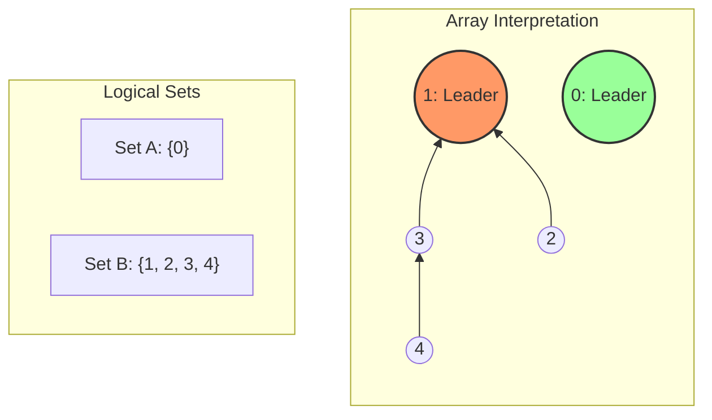
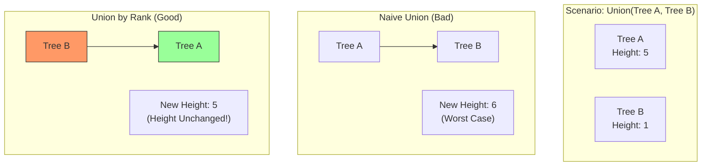
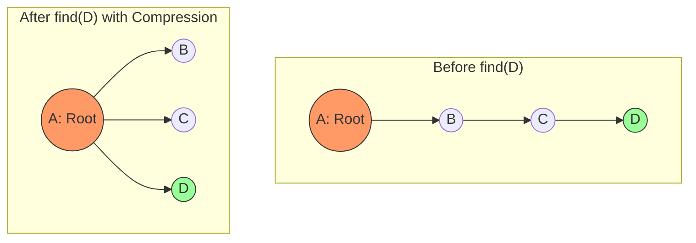

**TL;DR**: Минимальное остовное дерево (MST) — это фундамент сетевой инфраструктуры.
*   **Kruskal + Union-Find:** Ваш выбор по умолчанию для разреженных графов и задач кластеризации.
*   **Prim:** Используйте для плотных графов ($E \approx V^2$) или когда граф строится динамически.
*   **Union-Find (DSU):** Сама по себе — гениальная структура данных с амортизированным временем $O(1)$, которую вы будете использовать для отслеживания связности в реальном времени чаще, чем сами алгоритмы MST.

---

**MST (Minimal Spanning Tree)** — это задача о минимизации "стоимости связности".
В распределенных системах это не только кабели. Это минимальное дерево рассылки multicast-трафика, кластеризация данных для ML и дедупликация событий.

## 1. Disjoint-Set Union (DSU): Система Непересекающихся Множеств


> [!abstract] Проблема Динамической Связности
> Представьте, что вы прокладываете оптоволокно между городами (строите MST).
> У вас есть 10,000 городов. Изначально они изолированы.
> Вы добавляете кабель между городом А и Б. Теперь они связаны.
> Потом между В и Г. Потом между Б и В.
>
> В любой момент времени вам нужно мгновенно отвечать на вопрос: **"Есть ли уже путь между городом X и городом Y?"** (чтобы не прокладывать лишний кабель и не создать цикл).
> * **BFS/DFS:** Слишком медленно ($O(V+E)$ на каждый запрос). Если запросов миллион, алгоритм "встанет".
> * **DSU:** Отвечает на этот вопрос за **$O(\alpha(N))$**, что для всех разумных чисел во Вселенной $\le 4$ операции. Это "амортизированная константа".

### 1.1. Анатомия: Лес, растущий вверх

> [!abstract] Ментальная модель: "Кто твой босс?"
> В классических деревьях (DOM, File System) родитель знает своих детей.
> В **DSU** всё наоборот: **ребенок знает только своего родителя**.
>
> * **Зачем?** Нам не нужно спускаться вниз. Нас не волнует, кто находится в подчинении.
> * **Цель:** Нам нужно быстро узнать, к какой "банде" (множеству) принадлежит элемент. Для этого мы поднимаемся по цепочке начальников, пока не найдем "Крестного отца" (Лидера).
>
> Если у двух элементов один и тот же "Крестный отец" — значит, они в одной банде.

#### A. Структура: Массив `parent[]`

Физически DSU — это **один простой массив целых чисел**.
Никаких `struct Node`, никаких указателей `*next`, никаких `new/malloc`. Это обеспечивает идеальную **Cache Locality**.

Пусть у нас $N$ элементов, пронумерованных от $0$ до $N-1$.
Массив `parent[i]` хранит индекс родителя для вершины `i`.

##### 1. Начальное состояние (Make Set)
В начале мира каждый элемент — сам себе хозяин. Каждый образует свое собственное изолированное множество.

$$parent[i] = i$$

| Index (Node) | 0 | 1 | 2 | 3 | 4 |
| :--- | :--- | :--- | :--- | :--- | :--- |
| **Value (Parent)** | **0** | **1** | **2** | **3** | **4** |
| *Status* | Leader | Leader | Leader | Leader | Leader |

##### 2. Состояние после объединений (Union)
Допустим, мы выполнили `union(1, 2)` (2 подчинился 1) и `union(3, 4)` (4 подчинился 3). А потом `union(2, 4)` (группа 3-4 подчинилась группе 1-2).

| Index (Node) | 0 | 1 | 2 | 3 | 4 |
| :--- | :--- | :--- | :--- | :--- | :--- |
| **Value (Parent)** | **0** | **1** | **1** | **1** | **3** |

* **Node 0:** `parent[0] == 0`. Это корень (Лидер).
* **Node 1:** `parent[1] == 1`. Это корень (Лидер большого множества $\{1, 2, 3, 4\}$).
* **Node 2:** `parent[2] == 1`. Прямой потомок 1.
* **Node 3:** `parent[3] == 1`. Прямой потомок 1.
* **Node 4:** `parent[4] == 3`. Потомок 3 (а значит, "внук" 1).

#### B. Терминология DSU

1.  **Representative (Представитель / Лидер):**
    * Это уникальный элемент, который идентифицирует всё множество.
    * **Определение:** Элемент $x$ является представителем, если `parent[x] == x`.
    * В каждом множестве может быть **только один** представитель.
    * *Аналогия:* В базе данных это Primary Key группы.

2.  **Disjoint (Непересекающиеся):**
    * Важнейшее свойство. Один элемент не может принадлежать двум множествам одновременно.
    * Математически: $S_i \cap S_j = \emptyset$.
    * Структурно: У узла дерева может быть только **один** родитель. Ветвление идет только снизу вверх (слияние), но не сверху вниз.

3.  **Forest (Лес):**
    * Совокупность всех деревьев в DSU называется лесом.
    * Каждое дерево в лесу — это отдельная Компонента Связности (Connected Component).

#### C. Визуализация: От Массива к Дереву (Mermaid)

Взгляните, как плоский массив превращается в иерархию. Обратите внимание, что стрелки направлены **вверх** (к родителю).



#### D. Почему это работает быстро?

В отличие от Списков Смежности ($O(V+E)$), где связи разбросаны хаотично, DSU строго структурирует связи.
- **Путь к истине:** Чтобы узнать правду о вершине 4, нам нужно пройти путь $4 \to 3 \to 1$.
- Длина этого пути — единственное, что влияет на скорость.
- Все оптимизации DSU (сжатие путей, ранговая эвристика) направлены на то, чтобы сделать этот путь **максимально коротким** (в идеале — длиной 1).

> [!example] Пример из жизни: Корпоративное слияние
> 
> 1. Есть **Компания А** (директор Иванов) и **Компания Б** (директор Петров).
>     
> 2. Слияние (`Union`): Компания А покупает Компанию Б.
>     
> 3. Теперь Петров не директор. Петров отчитывается Иванову (`parent[Petrov] = Ivanov`).
>     
> 4. Сотрудник Сидоров работал на Петрова.
>     
> 5. Вопрос (`Find`): "Сидоров, кто твой самый главный босс?"
>     
> 6. Сидоров знает Петрова. Петров знает Иванова. Иванов никого над собой не знает.
>     
> 7. Ответ: Иванов.
>
### 1.2. Базовые операции (Naive Implementation)

```cpp
void make_set(int v) {
    parent[v] = v; // Я сам себе босс
}

int find_set(int v) {
    if (v == parent[v])
        return v;
    return find_set(parent[v]); // Рекурсивно идем вверх
}

void union_sets(int a, int b) {
    a = find_set(a); // Ищем лидера A
    b = find_set(b); // Ищем лидера B
    if (a != b)
        parent[b] = a; // Лидер B теперь подчиняется лидеру A
}
```

> [!danger] Проблема "Бамбук" (Skewed Tree)
> 
> В наивной реализации, если мы будем делать `union(1, 2)`, `union(2, 3)`, `union(3, 4)`... мы получим длинную цепочку: $4 \to 3 \to 2 \to 1$.
> 
> Операция `find(4)` потребует прохода по всем вершинам. Сложность деградирует до **$O(N)$**.
> 
> Чтобы получить $O(1)$, нам нужны две эвристики.

### 1.3. Две Эвристики: Path Compression & Union by Rank

> [!abstract] Проблема "Бамбука" (Degenerate Tree)
> Если в DSU просто присваивать `parent[b] = a` бездумно, злоумышленник может скармливать нам данные так: `union(1, 2)`, `union(2, 3)` ... `union(999, 1000)`.
> * **Результат:** Дерево вырождается в длинную линию (Linked List).
> * **Последствие:** Операция `find(1000)` будет идти по цепочке вверх 1000 шагов. Это $O(N)$.
>
> Чтобы получить $O(1)$, мы должны держать деревья **максимально плоскими** (широкими и низкими). Для этого используются две стратегии: одна при чтении (`Find`), другая при записи (`Union`).

#### A. Эвристика сжатия путей (Path Compression)

Это оптимизация операции **чтения**.
**Идея:** "Зачем мне каждый раз спрашивать менеджера, который спрашивает директора, который спрашивает CEO? Я запомню CEO сразу."

Когда мы вызываем `find(v)` и поднимаемся по рекурсии вверх до корня, мы **переподвешиваем** (re-parent) все пройденные вершины напрямую к корню.

* **До:** $A \to B \to C \to Root$. (Глубина 3).
* **Find(A):** Проходим путь, находим $Root$.
* **После:** $A \to Root$, $B \to Root$, $C \to Root$. (Глубина 1).

**Код (Магия одной строки):**
```cpp
int find(int v) {
    if (v == parent[v]) 
        return v;
    // Рекурсия сначала находит лидера, 
    // а затем присваивает его в parent[v] на обратном ходу.
    return parent[v] = find(parent[v]); 
}
```
_Результат:_ Следующий вызов `find(A)` выполнится мгновенно за $O(1)$.
#### B. Ранговая эвристика (Union by Rank / Size)

Это оптимизация операции **записи**.
**Идея:** "При слиянии компаний маленькая фирма становится отделом большой, а не наоборот."
Когда нам нужно объединить два дерева с корнями $A$ и $B$, у нас есть выбор:
1. Сделать $A$ дочерним для $B$ (`parent[A] = B`).
2. Сделать $B$ дочерним для $A$ (`parent[B] = A`).

Если дерево $A$ имеет высоту 10, а дерево $B$ — высоту 1, то глупо подвешивать $A$ к $B$ — общая высота станет $10+1=11$.
Умнее подвесить $B$ к $A$ — высота останется 10 (так как ветка $B$ спрячется под "кроной" $A$).
**Две вариации:**
1. **Union by Rank:** Храним приблизительную **высоту** дерева (`rank`). Всегда подвешиваем дерево с меньшим рангом к дереву с большим рангом.
    - Если ранги равны, подвешиваем любое и увеличиваем ранг корня на 1.
2. **Union by Size:** Храним **количество элементов** (`size`). Подвешиваем меньшее по количеству к большему.
    - _Практический совет:_ `Union by Size` часто полезнее, так как знание размера компоненты нужно в других задачах (например, "найти самую большую группу друзей").

**Код (Union by Size):**
```C++
void unite(int a, int b) {
    a = find(a);
    b = find(b);
    if (a != b) {
        // Эвристика: a должно быть больше b
        if (size[a] < size[b]) 
            swap(a, b);
        
        // Теперь мы гарантированно клеим маленькое (b) к большому (a)
        parent[b] = a;
        size[a] += size[b];
    }
}
```

#### C. Синергия: Почему именно $\alpha(N)$?

Это редкий случай в алгоритмах, когда $1 + 1 = 100$ (в смысле эффективности).
1. **Только Union by Rank:** Гарантирует, что высота деревьев будет не более $\log_2 N$. Сложность $O(\log N)$.
2. **Только Path Compression:** В среднем дает $O(\log N)$, но в худшем случае $O(N)$.
3. **Вместе:** Они компенсируют слабости друг друга.
    - `Union by Rank` не дает дереву расти вверх слишком быстро.
    - `Path Compression` срезает ветки при каждом обращении.

Математически доказано (Tarjan, 1975), что амортизированная сложность $M$ операций над $N$ элементами составляет $O(M \cdot \alpha(N))$, где $\alpha$ — **Обратная функция Аккермана**.

> [!info] Насколько медленно растет $\alpha(N)$?
> 
> $\alpha(N)$ — это число раз, которое нужно применить логарифм к $N$, чтобы получить 1... примерно.
> 
> - $\alpha(10^{80}) \le 4$. (Число атомов во Вселенной).
>     
> - $\alpha(10^{600}) \le 4$.
>     
> - Для любых задач человечества эта функция **не превышает 4**.
>     
> 
> Поэтому инженеры говорят: **DSU работает за $O(1)$**.

### D. Визуализация: "Плоское" Дерево (Mermaid)

Взгляните на разницу между "Наивным объединением" и "Умным объединением".



> [!check] Архитектурный вывод
> 
> Используйте **Path Compression** всегда (это 1 строка кода).
> 
> Используйте **Union by Rank/Size**, если вам важна максимальная скорость.
> 
> Без этих эвристик алгоритм Крускала будет работать за $O(E \cdot N)$ вместо $O(E \log E)$, что неприемлемо.
### 1.4. Идеальная Реализация (Production Ready)

```C++

struct DSU {
    vector<int> parent;
    vector<int> size; // Используем размер поддерева как эвристику

    DSU(int n) {
        parent.resize(n);
        size.resize(n, 1);
        for (int i = 0; i < n; ++i) parent[i] = i;
    }

    // O(alpha(N)) ≈ O(1)
    int find(int v) {
        if (v == parent[v]) return v;
        // Path Compression: запоминаем результат рекурсии
        return parent[v] = find(parent[v]); 
    }

    // O(alpha(N)) ≈ O(1)
    void unite(int a, int b) {
        a = find(a);
        b = find(b);
        if (a != b) {
            // Union by Size: меньшее (b) клеим к большему (a)
            if (size[a] < size[b]) swap(a, b);
            parent[b] = a;
            size[a] += size[b];
        }
    }
};
```

### 1.5. Визуализация: Магия сжатия (Mermaid)

Посмотрите, как меняется структура после вызова `find(D)` с сжатием путей.


### 1.6. Анализ Сложности: Функция Аккермана

Сложность операций DSU оценивается как $O(\alpha(N))$, где $\alpha$ — обратная функция Аккермана.

- Функция Аккермана $A(m, n)$ растет **чудовищно** быстро.
    - $A(4, 1) \approx 65536$
    - $A(4, 2) \approx 2^{65536}$ (число атомов во Вселенной отдыхает).
- Обратная функция $\alpha(N)$ растет **чудовищно** медленно.
    - Для $N = 10^{600}$ (больше, чем что-либо в физике), $\alpha(N) \le 4$.

> [!check] Инженерный вывод
> 
> Для любых практических задач (Google Maps, Social Graph, Image Pixels) считайте, что операции DSU выполняются за **константное время** $O(1)$.
> 
> Именно поэтому алгоритм Крускала сортирует ребра за $O(E \log E)$, а их добавление в DSU стоит "почти бесплатно".
## 1.7. Где применяется (кроме MST)?
1. **Поиск циклов в графе:** Если у двух вершин ребра уже одинаковый лидер (`find(u) == find(v)`), то добавление этого ребра замкнет цикл.
2. **Connected Components in Image (Computer Vision):** Сегментация объектов на бинарном изображении.
3. **Percolation Theory (Физика):** Моделирование протекания жидкости через пористый материал.
4. **Слияние друзей в соцсетях:** Быстрая проверка "знакомы ли мы через 6 рукопожатий" (в динамике).
---
## 2. Алгоритм Краскала (Kruskal’s Algorithm)

В отличие от алгоритма Прима, который "выращивает" одно дерево из конкретной точки (как плесень), алгоритм Краскала использует стратегию **Global Greedy**. Он видит граф целиком и собирает "лес" (множество разрозненных деревьев), постепенно объединяя их в единую структуру.

Это **ребро-центричный** (edge-centric) алгоритм. Вершины для нас вторичны, мы работаем со списком связей.

### 2.1. Механика работы (Step-by-Step)

Алгоритм опирается на **Свойство разреза (Cut Property)**: *Для любого разреза графа (разделения вершин на две группы) минимальное ребро, пересекающее этот разрез, гарантированно принадлежит MST.*

**Алгоритм:**

1.  **Инициализация (Лес):** Изначально каждая вершина $V$ является отдельным деревом (кластером). Мы используем структуру **DSU (Union-Find)** для отслеживания этих кластеров.
    *   `parent = [0, 1, 2, ... N]`

2.  **Сортировка (The Bottleneck):** Сортируем **все** ребра $E$ по весу в неубывающем порядке: $w_1 \le w_2 \le \dots \le w_m$.
    *   *Инженерный нюанс:* Именно здесь мы платим главную цену по CPU.

3.  **Итерация и Слияние:** Проходим по отсортированному списку ребер $(u, v)$ с весом $w$:
    *   **Cycle Check:** Проверяем, принадлежат ли $u$ и $v$ одному и тому же дереву.
        *   Выполняем `root_u = Find(u)` и `root_v = Find(v)`.
    *   **Decision:**
        *   Если `root_u != root_v`: Добавление этого ребра соединит два разрозненных компонента. Это безопасно и выгодно (так как мы идем от дешевых к дорогим).
            *   **Action:** Выполняем `Union(root_u, root_v)` и добавляем ребро в MST.
            *   *Счетчик:* Увеличиваем счетчик добавленных ребер. Если их стало $V-1$, можно досрочно выйти (оптимизация **Early Exit**).
        *   Если `root_u == root_v`: Вершины уже соединены каким-то путем из более дешевых ребер, которые мы обработали ранее. Добавление текущего ребра создаст цикл.
            *   **Action:** Игнорируем ребро (Drop).

### 2.2. Наглядный пример (Trace)

Представьте 4 серверные стойки: A, B, C, D. Стоимость прокладки оптики между ними (вес ребра):
*   (A-B): 10
*   (C-D): 15
*   (B-C): 20
*   (A-C): 35 (дорогой линк)
*   (B-D): 40

**Шаги алгоритма:**

1.  **Сортировка:** Список ребер уже упорядочен: `(A-B, 10)`, `(C-D, 15)`, `(B-C, 20)`, `(A-C, 35)`, `(B-D, 40)`.
2.  **Шаг 1:** Берем `(A-B, 10)`.
    *   `Find(A)` -> A, `Find(B)` -> B. Разные.
    *   `Union(A, B)`. Теперь у нас множество `{A, B}` и отдельные `{C}`, `{D}`. Ребро в MST.
3.  **Шаг 2:** Берем `(C-D, 15)`.
    *   `Find(C)` -> C, `Find(D)` -> D. Разные.
    *   `Union(C, D)`. Множества: `{A, B}`, `{C, D}`. Ребро в MST.
4.  **Шаг 3:** Берем `(B-C, 20)`.
    *   `Find(B)` -> A (или B, зависит от реализации), `Find(C)` -> C (или D).
    *   Главное: корни разные. Мы соединяем кластер `{A, B}` и `{C, D}`.
    *   `Union`. Теперь все `{A, B, C, D}` в одном множестве. Ребро в MST.
5.  **Шаг 4:** Берем `(A-C, 35)`.
    *   `Find(A)` -> Root, `Find(C)` -> Root. Корни совпадают!
    *   **Цикл:** Путь A-B-C уже существует и стоит $10+20=30$, что дешевле прямого 35.
    *   Ребро отбрасывается.
6.  **Итог:** MST состоит из ребер весом 10, 15, 20. Сумма = 45.

### 2.3. Анализ сложности: Где теряется производительность?

Формально: $O(E \log E)$ или $O(E \log V)$.

1.  **Сортировка:** $O(E \log E)$.
    *   Для общего случая (произвольные веса `float/double`) быстрее нельзя. Это доминирующая часть.
2.  **DSU операции:** $2E \cdot \alpha(V)$.
    *   Мы делаем 2 `Find` для каждого ребра. Функция Аккермана $\alpha(V) \approx 1$.
    *   Эта часть работает практически линейно $O(E)$.

**Вывод эксперта:** Алгоритм Краскала — это, по сути, "Сортировка + немного логики". Его производительность на 99% зависит от эффективности вашего алгоритма сортировки (`std::sort` в C++, `Arrays.sort` в Java).

### 2.4. Инженерные оптимизации (Expert Level)

Как ускорить Краскала в 10 раз в реальных системах?

1.  **Целочисленные веса (Integer Weights):**
    В сетях метрики часто целые числа (latency в микросекундах, bandwidth в гигабитах).
    Вместо QuickSort ($O(E \log E)$) используйте **Counting Sort** или **Radix Sort**.
    *   Сложность падает до $O(E + W)$, где $W$ — диапазон весов.
    *   Алгоритм становится линейным!

2.  **Параллельная сортировка:**
    Сортировка массива ребер идеально параллелится (Parallel Sort). Это делает Краскала предпочтительным на многоядерных системах по сравнению с Примом, который сложнее распараллелить (зависимость данных в очереди).

3.  **Early Exit (Досрочный выход):**
    Мы знаем, что в MST ровно $V-1$ ребер.
    Вводим переменную `edges_count = 0`.
    В блоке `if (root_u != root_v)` делаем `edges_count++`.
    Как только `edges_count == V - 1` — **break**.
    *   *Зачем:* Если граф огромный ($10^9$ ребер), а MST собрался на первом миллионе дешевых ребер, мы экономим часы работы DSU.

4.  **Детерминизм топологии:**
    Если у двух ребер одинаковый вес, результат сортировки зависит от стабильности алгоритма (Stable Sort). В распределенных системах "плавающая" топология — это ад для отладки.
    *   *Рекомендация:* При равенстве весов используйте ID ребер или вершин как тай-брейкер (Tie-breaker), чтобы сортировка всегда была детерминированной.

### 2.5. Когда НЕ использовать Краскала

Несмотря на эффективность DSU, Краскал проигрывает Приму на **очень плотных графах** ($E \to V^2$).
*   Причина: Сортировка $V^2$ элементов стоит $V^2 \log (V^2) = 2 V^2 \log V$.
*   Прим на массивах делает это за $O(V^2)$.
*   На полном графе из 10,000 вершин:
    *   Краскал: Сортировка ~50 млн ребер. Тяжело.
    *   Прим: Работа с матрицей 10k x 10k. Быстрее за счет отсутствия сортировки.

---
## 3. Алгоритм Прима (Prim’s Algorithm) — Вершинно-центричный подход

В отличие от алгоритма Краскала, который "жадно" хватает самые дешевые ребра по всему графу, алгоритм Прима **выращивает** дерево из одной точки (Seed). Это напоминает распространение плесени или кристаллизацию: у нас есть одна связная компонента, которая на каждом шаге захватывает ближайшую вершину.

### 3.1. Математический фундамент: Свойство Разреза (The Cut Property)
Инженер должен не верить, а понимать. Почему жадная стратегия Прима гарантированно дает *глобальный* оптимум?

*   **Определение Разреза (Cut):** Любое разбиение вершин графа на два непересекающихся множества: $S$ (уже в нашем дереве) и $V \setminus S$ (еще не посещенные).
*   **Crossing Edge:** Ребро, соединяющее вершину из $S$ с вершиной из $V \setminus S$.
*   **Теорема (Light Edge Rule):** Для любого разреза, если ребро $(u, v)$ имеет **минимальный вес** среди всех ребер, пересекающих разрез, то это ребро **обязано** принадлежать какому-либо MST.

**Логика Прима:** Алгоритм на каждом шаге поддерживает множество $S$. Все доступные ребра, торчащие из $S$ наружу — это "кандидаты". Мы всегда выбираем минимального кандидата. Согласно теореме, мы не можем ошибиться.

### 3.2. Внутреннее состояние (Anatomy of the Algorithm)

Для реализации (как на собеседовании, так и в продакшене) нам нужны три массива размером $V$ (количество вершин):

1.  `min_dist[v]` (Key): Минимальный вес ребра, которым можно соединить вершину `v` с *текущим* растущим деревом. Изначально $\infty$, для стартовой вершины $0$.
    *   *Важно:* Это НЕ расстояние от старта (как в Дейкстре), это длина *одного* последнего "кабеля".
2.  `parent[v]`: Индекс вершины, из которой мы "дотянулись" до `v` с весом `min_dist[v]`. Нужен для восстановления самой структуры дерева в конце.
3.  `visited[v]` (Boolean): Флаг, включена ли вершина в наше MST окончательно.

### 3.3. Структуры данных: Priority Queue vs Dense Array
Здесь кроется главное различие между "теорией" и "высокопроизводительным кодом".

#### Вариант А: Priority Queue (для разреженных графов)
Используем Min-Heap (кучу), чтобы хранить пары `(weight, vertex)` для всех вершин "фронтира" (границы дерева).

*   **Алгоритм:**
    1.  Поместить старт `(0, start_node)` в очередь.
    2.  Пока очередь не пуста:
    3.  Извлечь `u` с минимальным весом (`extract-min`).
    4.  Если `u` уже `visited`, пропустить (ленивое удаление).
    5.  Пометить `u` как `visited`.
    6.  Для каждого соседа `v` вершины `u`:
        *   Если `v` не `visited` **И** вес ребра `w(u, v) < min_dist[v]`:
            *   **Relaxation (Релаксация):** Обновляем `min_dist[v] = w(u, v)`, `parent[v] = u`.
            *   Добавляем `(min_dist[v], v)` в очередь.

*   **Сложность:** $O(E \log V)$ (с учетом того, что мы можем добавлять одну вершину в очередь многократно при улучшении пути).
*   **Проблема:** Куча требует манипуляций с указателями (или индексами в массиве) и имеет плохую локальность памяти.

#### Вариант Б: Линейный поиск (для плотных графов)
Если граф задан матрицей смежности (Adjacency Matrix) и ребер очень много ($E \approx V^2$), куча проигрывает.

*   **Алгоритм:** Вместо кучи мы на каждом шаге просто пробегаем циклом `for` по массиву `min_dist`, чтобы найти минимум среди *непосещенных*.
*   **Сложность:** $O(V^2)$.
*   **Почему это быстрее:**
    *   При $E \approx V^2$, вариант с кучей дает $O(V^2 \log V)$. Это математически медленнее, чем $O(V^2)$.
    *   **Hardware optimization:** Проход по массиву (`min_dist`) идеально векторизуется (SIMD instructions) и предсказывается процессором (prefetching). Нет "скачков" по памяти, как в куче.

### 3.4. Визуализация (Trace Table)

Представим треугольник с центром:
*   Вершины: A, B, C, D(центр).
*   Ребра: (A-B: 10), (B-C: 10), (C-A: 10).
*   Ребра к центру: (A-D: 4), (B-D: 15), (C-D: 5).

Запускаем Прима из **A**.

| Шаг | Множество $S$ (Visited) | Кандидаты (Fringe) `min_dist` | Выбор (Action) |
| :--- | :--- | :--- | :--- |
| **0** | `{}` | A=0, B=$\infty$, C=$\infty$, D=$\infty$ | Выбираем **A** (start) |
| **1** | `{A}` | **B=10** (via A), **C=10** (via A), **D=4** (via A) | Релаксация соседей A. Мин: **D (4)**. Добавляем ребро (A, D). |
| **2** | `{A, D}` | B=10 (A), C=5 (via D!), D=visited | D стал частью дерева. Обновляем соседей D. Ребро (D, C)=5 лучше, чем старое (A, C)=10. **Relaxation!** Мин: **C (5)**. Добавляем (D, C). |
| **3** | `{A, D, C}` | B=10 (A), C=visited, D=visited | C в дереве. Сосед C — это B (ребро 10). Старое B=10 (через A). Улучшения нет. Мин: **B (10)**. Добавляем (A, B) *или* (C, B) — неважно. |
| **Result** | | Ребра: (A, D), (D, C), (A, B). Вес: 4 + 5 + 10 = 19. | |

### 3.5. Fibonacci Heap — Академическая ловушка
В учебниках (Cormen) пишут, что сложность Прима можно довести до $O(E + V \log V)$ с помощью фибоначчиевой кучи.
*   **Суть:** Обычная куча делает `decrease-key` (обновление приоритета) за $O(\log V)$. Фибоначчиева — за амортизированное $O(1)$.
*   **Вердикт Архитектора:** Никогда не используйте фибоначчиевы кучи в реальном продакшене. Огромные константы и разбросанность узлов по памяти делают их медленнее бинарных куч на любых графах, помещающихся в RAM. Это тот случай, где $O$-нотация игнорирует кеш-линии.

### 3.6. Чек-лист: Когда выбирать Прима?
1.  **Плотный граф:** Если у вас матрица расстояний между городами (каждый с каждым), Прим $O(V^2)$ — единственный выбор. Краскал умрет на сортировке $N^2$ ребер.
2.  **Динамика:** Если граф растет, Прим естественным образом продолжает развитие существующего дерева.
3.  **Меньше памяти:** При реализации через массив ($O(V^2)$) не нужно хранить список всех ребер, достаточно матрицы или функции генерации веса на лету.

---
## 4. Алгоритм Борувки (Borůvka's Algorithm) — The King of Parallelism

Исторически это **первый** алгоритм поиска MST (Отакар Борувка, 1926), придуманный задолго до компьютеров для проектирования электросетей Моравии.
На полвека он был забыт в тени Прима и Краскала, но с приходом GPU (CUDA) и Big Data (Spark/Hadoop) пережил ренессанс.

**Почему это важно для архитектора:**
Прим и Краскал — **последовательные** алгоритмы.
*   Прим жестко привязан к единственной очереди приоритетов.
*   Краскал требует глобальной сортировки всех ребер.
*   Борувка позволяет обрабатывать вершины **независимо**. Это единственный алгоритм, способный загрузить 5000 ядер GPU или 1000 нод кластера.

### 4.1. Логика работы: "Выборы в каждом округе"

Алгоритм работает раундами (фазами).
Идея: Изначально каждая вершина — это отдельное маленькое дерево (компонента). На каждом шаге **каждая** компонента пытается найти "лучшего друга" — ближайшего соседа — и соединиться с ним.

**Формальный алгоритм (фаза):**
1.  **Поиск минимума (Find Min):** Для *каждой* компоненты связности $C_i$ найти ребро с минимальным весом, которое соединяет вершину из $C_i$ с вершиной *вне* $C_i$.
2.  **Добавление (Add):** Добавить найденные ребра в список MST.
3.  **Слияние (Merge/Contract):** Объединить компоненты, соединенные этими ребрами. Теперь они становятся одной большой "супер-вершиной".
4.  **Повторение:** Если осталась больше чем 1 компонента, переходим к шагу 1.

**Асимптотика:**
На каждом этапе количество компонент уменьшается **минимум в 2 раза**.
Значит, алгоритм гарантированно завершится за $O(\log V)$ фаз.
Общая сложность: $O(E \log V)$.
*На параллельной машине с $P$ процессорами:* $O(\frac{E}{P} \log V)$.

### 4.2. Наглядный пример (Trace)

Представим граф из 4 вершин (городов) с весами дорог:
*   A --(1)-- B
*   B --(2)-- C
*   C --(3)-- D
*   D --(4)-- A (замыкающий цикл)

**Инициализация:** Компоненты $\{A\}, \{B\}, \{C\}, \{D\}$.

**Фаза 1:**
1.  **Компонента A:** Ищет минимум среди ребер (A-B: 1, A-D: 4). Выбор: **(A, B)**.
2.  **Компонента B:** Ищет минимум среди (B-A: 1, B-C: 2). Выбор: **(B, A)**.
3.  **Компонента C:** Ищет минимум среди (C-B: 2, C-D: 3). Выбор: **(C, B)**.
4.  **Компонента D:** Ищет минимум среди (D-C: 3, D-A: 4). Выбор: **(D, C)**.

**Слияние:**
*   Ребра для добавления: $(A,B), (B,A), (C,B), (D,C)$.
*   Заметьте: ребро $(A,B)$ выбрано дважды (со стороны A и со стороны B). Это нормально, мы берем его один раз (Set semantics).
*   Результат: Все вершины слились в одну компоненту $\{A,B,C,D\}$.
*   Алгоритм завершен за **1 раунд**.

Для сравнения: Приму потребовалось бы 3 последовательных шага извлечения из кучи.

### 4.3. Технические детали реализации (Expert Nuances)

При реализации Борувки в production-системах (например, в графовых базах данных) возникают две проблемы, которые обязан знать инженер.

#### А. Проблема одинаковых весов (Tie-Breaking rule)
Если у вершины $X$ есть два ребра весом 10 к $Y$ и к $Z$, какое выбрать?
Если $X$ выберет $Y$, $Y$ выберет $Z$, а $Z$ выберет $X$ (все веса одинаковые) — мы получим цикл $X-Y-Z-X$ и бесконечный цикл алгоритма (компоненты не сольются в одну).

**Решение (Total Ordering):**
Сравниваем не просто веса, а пары `(weight, index_of_destination)`.
Если веса равны, выбираем то ребро, которое ведет к вершине с *меньшим ID*. Это гарантирует строгий порядок и отсутствие циклов при выборе.

#### Б. Сжатие графа (Graph Contraction) vs DSU
В теории говорят "заменим компоненту на супер-вершину".
В коде это реализуется двумя способами:
1.  **Явное перестроение:** Создаем новый граф, где вершин в 2 раза меньше. Пересчитываем ребра. Это дорого по памяти.
2.  **Использование DSU (Union-Find):** Мы не меняем структуру графа. "Компонента" — это множество в DSU.
    *   Шаг "Find Min": Проходим по *всем* ребрам $(u, v)$.
    *   Если `find(u) == find(v)`, ребро внутри компоненты — игнорируем.
    *   Если `find(u) != find(v)`, атомарно обновляем минимум для компоненты `find(u)` (используя `CAS` - Compare And Swap).

### 4.4. Borůvka в Big Data (MapReduce / Spark)

Именно этот алгоритм используется в Apache Spark GraphX. Почему?

1.  **Map Phase:** Данные (ребра) шардированы по кластеру. Каждый воркер сканирует свои локальные ребра и находит кандидатов на минимум для каждой известной ему вершины.
2.  **Reduce Phase:** Сбор результатов. Для каждой компоненты выбирается *глобальный* минимум из локальных минимумов воркеров.
3.  **Broadcast:** Информация о слияниях (`Union`) рассылается всем воркерам.
4.  **Loop:** Повторяем, пока не останется 1 компонента.

Поскольку количество итераций логарифмическое (обычно 5-10 раундов для огромных графов), сетевые накладные расходы (Network Overhead) на синхронизацию окупаются чудовищным параллелизмом на фазе Map.

### 4.5. Резюме: Когда применять?

| Характеристика | Вердикт |
| :--- | :--- |
| **CPU (Single Thread)** | Не используйте. Сложная логика проигрывает кэш-локальности Прима. |
| **GPU (CUDA/OpenCL)** | **Идеально.** Тысячи потоков ищут минимумы параллельно. |
| **Distributed (Spark)** | **Идеально.** Минимизирует количество шагов синхронизации (Barrier Synchronizations). |
| **Динамические графы** | Хорошо. Если добавляется вершина, она считается новой компонентой и быстро "вливается" в MST на следующем шаге. |

---
## 5. Архитектурный контекст: MST в сетях (The Good, The Bad, The Legacy)

Для сетевого архитектора MST — это не просто алгоритм из учебника, а фундаментальный примитив, определяющий **Topology Efficiency** (эффективность использования железа) и **Fault Tolerance** (отказоустойчивость).

### 5.1. The Legacy: STP (Spanning Tree Protocol) и "Проблема 50%"
В классическом L2 Ethernet (коммутация по MAC-адресам) у кадра (frame) нет поля **TTL** (Time To Live).
*   **Угроза:** Если в сети есть физическая петля, широковещательный кадр (ARP-запрос) будет крутиться вечно, дублируясь на каждом коммутаторе. Это называется **Broadcast Storm**, и он кладет сеть любой мощности за секунды (CPU коммутаторов уходит в 100% на прерывания).
*   **Решение (STP - IEEE 802.1D):** Коммутаторы обмениваются сообщениями BPDU (Bridge Protocol Data Units), выбирают **Root Bridge** и строят MST относительно него. Все порты, не вошедшие в MST, переходят в состояние **Blocking**.

**Почему Архитекторы ненавидят STP:**
1.  **Bisection Bandwidth Cut:** Вы купили два дорогих линка по 100Gbps для надежности (аппаратная избыточность). STP видит петлю и блокирует *один* из них.
    *   *Итог:* Вы платите за 200Gbps, а используете 100Gbps. **50% CapEx (Capital Expenditure) простаивает.**
2.  **Convergence Time (Время сходимости):** В классическом STP перестроение дерева при падении линка занимало 30-50 секунд. Для современных приложений это вечность.
    *   *Уточнение:* Протокол **RSTP (Rapid STP - 802.1w)** снизил это время до суб-секунд, но проблема блокировки линков осталась.
3.  **Sub-optimal Routing:** Трафик между соседними свитчами может пойти через корневой свитч (Root Bridge) на другом конце дата-центра, создавая "Hairpinning" (петлю трафика) и увеличивая Latency.

### 5.2. The Modern Standard: Clos Topology, L3 & ECMP
В современных ЦОД (AWS, Google, Meta) мы отказались от L2 STP в пользу **L3 Routing** (IP Fabric) и топологии **Leaf-Spine (Clos Network)**.

**Почему MST здесь не нужен:**
Мы хотим использовать *все* линки одновременно. Граф сети намеренно строится с тысячами циклов (каждый Leaf соединен с каждым Spine).

**Замена MST: ECMP (Equal-Cost Multi-Path)**
Вместо блокировки "лишних" путей, маршрутизатор (Leaf) видит, что до назначения есть, например, 4 пути с одинаковой метрикой (cost).
*   **Механизм:** Пакеты распределяются по этим 4 путям на основе хеша заголовков (5-tuple: Source IP, Dest IP, Source Port, Dest Port, Protocol).
*   **Результат:**
    *   **Full Bisection Bandwidth:** Если у вас 4 линка по 100Gbps, вы получаете трубу 400Gbps.
    *   **Graceful Degradation:** Если один линк падает, хеш пересчитывается, и трафик переливается на оставшиеся 3. Потеря пропускной способности — всего 25%, а не 100% (как при разрыве единственного активного пути в STP).

### 5.3. Где MST все еще Король: Multicast и Overlay (VXLAN)
Несмотря на смерть STP в ядре сети, алгоритмы MST доминируют в задачах доставки контента "один-ко-многим" (IPTV, обновление кэшей, репликация логов, котировки бирж).

**Проблема:** Отправить пакет от источника $S$ к группе подписчиков $G = \{R_1, R_2, ..., R_n\}$.
*   **Наивный подход (Unicast):** Источник копирует пакет $N$ раз. Нагрузка на источник $O(N)$, нагрузка на линк у источника $O(N)$. Это не масштабируется.
*   **Подход MST (Multicast):** Пакет отправляется *один* раз. Роутеры копируют его *только* в точках ветвления дерева.

**Реализация (PIM - Protocol Independent Multicast):**
1.  **Source Trees (S, G):** Строится дерево кратчайших путей (SPT - Shortest Path Tree, аналог алгоритма Дейкстры) от *каждого* источника $S$ к получателям.
    *   *Плюс:* Минимальная задержка (Latency).
    *   *Минус:* Много состояния в таблицах маршрутизации ($O(S \times G)$).
2.  **Shared Trees (*, G):** Выбирается одна точка сборки (Rendezvous Point - RP). Строится **одно общее MST**, корнем которого является RP. Все источники шлют данные в RP, а RP раздает их по дереву.
    *   *Аналогия:* Алгоритм Прима/Краскала, где мы минимизируем общий вес дерева рассылки.
    *   *Плюс:* Экономия памяти роутеров.
    *   *Минус:* Неоптимальные пути (Traffic triangle).

**VXLAN BUM Traffic:**
В виртуализированных сетях (SDN) мы строим L2 поверх L3 (Overlay). Когда виртуальная машина шлет ARP-запрос (Broadcast), он должен дойти до всех других ВМ.
Поскольку под низом у нас IP-сеть без STP, мы используем **Multicast Distribution Tree** в Underlay-сети, чтобы эффективно доставить этот бродкаст, эмулируя поведение "тупого свитча", но с эффективностью MST.

### 5.4. Терминологический словарь Архитектора

*   **Bisection Bandwidth (Бисекционная пропускная способность):** Пропускная способность сечения сети, если разрезать её на две равные части. STP режет этот показатель кратно. MST алгоритмы здесь — враг.
*   **Control Plane vs Data Plane:**
    *   *MST (алгоритм)* работает в Control Plane (CPU свитча считает топологию).
    *   *Blocking/Forwarding* происходит в Data Plane (ASIC чип).
    *   В SDN (Software Defined Networking) MST может считаться на центральном контроллере (God-box) на графе всей сети глобально, а не распределенно каждым свитчем.
*   **Microbursts:** Кратковременные всплески трафика. В STP-сетях они вызывают дропы (потери пакетов), так как узкое место — один линк. В ECMP-сетях (без MST) они сглаживаются за счет множества путей.

**Итоговый вердикт:**
*   **L2 (Campus/Enterprise):** MST (в виде RSTP/MSTP) — необходимое зло для предотвращения петель.
*   **L3 (Data Center):** MST убит и заменен на ECMP и Clos-топологии.
*   **App Level (Multicast/Stream):** MST — главный инструмент эффективности доставки данных.

---
## 6. Задача Штейнера (Steiner Tree Problem): MST на стероидах

Если MST — это "коммунизм" (подключаем всех принудительно и дешево), то Дерево Штейнера — это "корпоративная сеть" (подключаем только филиалы, используя любые транзитные узлы для экономии).

### 6.1. Фундаментальное отличие и Определения

В классической задаче MST мы обязаны включить в дерево **все** вершины графа $V$.
В задаче Штейнера множество вершин $V$ делится на два типа:
1.  **Терминалы (Terminals, $R$):** Обязательные вершины, которые должны попасть в одну компоненту связности (например, серверные стойки или офисы).
2.  **Точки Штейнера (Steiner Points, $S$):** Опциональные (транзитные) вершины, которые мы *можем* использовать как перекрестки, если это уменьшит суммарную длину пути.

**Задача:** Найти дерево $T$, которое связывает все терминалы $R \subseteq V$, такое, что сумма весов ребер минимальна.
$$ \min \sum_{e \in T} w(e) $$

### 6.2. Почему это сложно (Интуиция NP-Hard)

Представьте равносторонний треугольник со стороной 1. Три вершины — это Терминалы.
*   **Решение MST:** Мы берем два ребра (например, AB и BC). Длина = $1 + 1 = 2$.
*   **Решение Штейнера:** Мы ставим **дополнительную точку** (Точку Штейнера) в геометрическом центре треугольника и соединяем вершины с ней. Расстояние от центра до вершины = $1/\sqrt{3} \approx 0.577$. Сумма трех лучей $\approx 1.732$.
*   **Выигрыш:** $\approx 13.4\%$.

**Сложность:** В графах количество вариантов выбора и размещения этих "дополнительных точек" растет экспоненциально. Задача поиска **минимального** дерева Штейнера является **NP-hard**. Мы не знаем полиномиального алгоритма для точного решения.

### 6.3. Инженерный подход: Аппроксимация

Так как точное решение найти невозможно для больших $N$, мы используем **Metric Steiner Tree Approximation**. Этот алгоритм гарантирует решение, которое хуже оптимального не более чем в 2 раза ($2$-approximation).

**Алгоритм (Паттерн для реализации):**

1.  **Metric Closure (Метрическое замыкание):**
    Рассчитайте кратчайшие пути между *всеми парами* терминалов (используя Dijkstra или Floyd-Warshall на исходном графе).
2.  **Virtual Graph Construction:**
    Создайте новый полный граф $G'$, состоящий *только* из терминалов. Вес ребра $(u, v)$ в этом графе равен длине кратчайшего пути между $u$ и $v$ в исходном графе.
3.  **MST on Terminals:**
    Постройте обычное MST (Прима или Краскала) на графе $G'$.
4.  **Mapping Back:**
    Замените каждое виртуальное ребро в MST на реальный путь из исходного графа.
5.  **Pruning (Обрезка):**
    Если в полученном графе есть циклы — разорвите их. Если есть "висячие" листья, которые не являются терминалами — обрежьте их.

**Результат:** Вы получите дерево, соединяющее все терминалы. Доказано, что его вес $\le 2 \times \text{Optimal Weight}$.

### 6.4. Реальные сценарии использования (Use Cases)

#### A. Проектирование чипов (VLSI Design & Rectilinear Steiner Tree)
Это "Killer Feature" задачи.
*   **Контекст:** На микросхеме нужно соединить тактовый генератор (Clock) с 1000 логических блоков.
*   **Ограничение:** Провода на чипе можно прокладывать только вертикально и горизонтально (Манхэттенская метрика / $L_1$ norm).
*   **Задача:** Rectilinear Steiner Minimal Tree (RSMT).
*   **Решение:** Используются специализированные эвристики (GeoSteiner, FLUTE), так как каждый микрон провода — это лишнее тепло и задержка сигнала (RC-delay).

#### B. Сетевой Мультикаст (Multicast Routing)
*   **Контекст:** Вы стримите финал Чемпионата Мира по футболу. У вас есть один источник (Source) и 10 миллионов зрителей (Terminals).
*   **Проблема:** Отправлять отдельный поток каждому — сеть ляжет ($O(N)$ трафика).
*   **Решение:** Роутеры строят дерево рассылки. Пакет копируется только на разветвлениях (Точках Штейнера — роутерах). Протоколы PIM-SM (Protocol Independent Multicast) строят приближенное дерево Штейнера, чтобы минимизировать нагрузку на магистрали.

#### C. Биоинформатика (Филогенетические деревья)
*   **Контекст:** У нас есть ДНК 5 современных видов животных (Терминалы). Мы хотим восстановить их эволюционное дерево.
*   **Точки Штейнера:** Это гипотетические вымершие общие предки. Дерево Штейнера показывает наиболее вероятный (экономный с точки зрения мутаций) путь эволюции.

### 6.5. Чек-лист различий для Эксперта

| Характеристика | Minimum Spanning Tree (MST) | Steiner Tree |
| :--- | :--- | :--- |
| **Что соединяем** | ВСЕ вершины графа | Только подмножество (Терминалы) |
| **Доп. узлы** | Запрещены (используем только существующие) | Разрешены (Steiner Points) |
| **Сложность** | $P$ (Полиномиальная, $O(E \log V)$) | $NP-Hard$ (Экспоненциальная) |
| **Лучший алгоритм** | Prim / Kruskal | Аппроксимация (Metric Closure MST) |
| **Применение** | Broadcast, Кластеризация | VLSI, Multicast, VPN-сети |

### 6.6. Пример для наглядности (Визуализация в голове)

Представьте карту метро.
*   **Задача MST:** Соединить рельсами **каждый дом** в городе. (Дорого, глупо, но алгоритмически просто).
*   **Задача Штейнера:** Соединить только **ключевые станции** (Терминалы), прокладывая туннели где угодно (создавая пересадочные узлы — Точки Штейнера), чтобы общая длина путей была минимальна.

Если вы инженер инфраструктуры, вы почти всегда решаете задачу Штейнера, пытаясь свести её к MST через аппроксимацию.

---
## 7. Чек-лист уровня Expert

1.  **Проверка единственности:** Как за линейное время (после построения MST) проверить, является ли оно единственным?
    *   *Ответ:* Для каждого ребра $(u, v)$, не вошедшего в MST, нужно проверить, имеет ли оно тот же вес, что и самое тяжелое ребро на пути между $u$ и $v$ в дереве.
2.  **Максиминный путь (Bottleneck Path):** Вам нужно проехать на фуре между городами A и B. Вы хотите максимизировать вес *самого узкого* моста на пути.
    *   *Ответ:* Постройте **Maximum** Spanning Tree. Уникальный путь в этом дереве между A и B и будет искомым "широким" путем. Любое отклонение от этого пути заставит пройти через более узкое ребро.
3.  **Динамическое обновление:** Что если в графе меняется вес одного ребра? Нужно ли перестраивать MST заново?
    *   *Ответ:* Нет. Используйте **Dynamic Trees** (Link-Cut Trees Sleator & Tarjan), поддерживающие MST за $O(\log n)$ на операцию. Либо простой инкрементальный алгоритм:
        *   Добавили ребро $(u, v)$: образовался цикл. Найдите max ребро в цикле и удалите.
        *   Удалили ребро $(u, v)$ из дерева: дерево распалось на две части. Найдите min ребро, соединяющее части.

### Резюме архитектора
*   **Краскал:** Для разреженных графов, кластеризации и простых реализаций.
*   **Прим (Array):** Для плотных матриц смежности.
*   **Борувка:** Для параллельных вычислений (GPU/Big Data).
*   **DSU:** Для всего. Выучить наизусть.