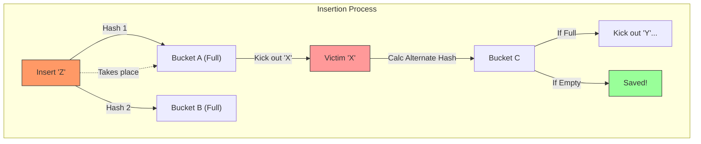
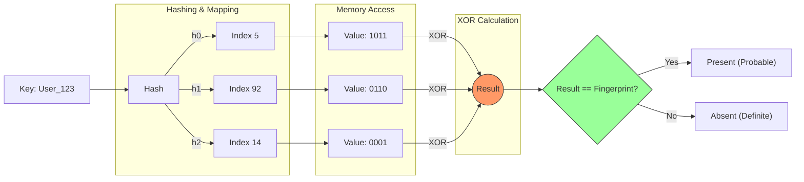

В мире Big Data мы часто не можем позволить себе хранить индексы всех данных в RAM. Вероятностные структуры — это компромисс: мы экономим 99% памяти, разрешая системе иногда ошибаться в одну сторону (False Positive), но никогда — в другую (False Negative).

## 1. Bloom Filter: Механика, Математика и Интуиция

Прежде чем говорить об оптимизациях, необходимо дать строгое определение структуры.

### 1.1. Что такое Bloom Filter? (Определение)

**Bloom Filter** — это **вероятностная структура данных** (Probabilistic Data Structure), предназначенная для проверки принадлежности элемента множеству. Она чрезвычайно эффективна по памяти (Space-Efficient), но ценой этой эффективности является вероятность ошибки определенного типа.

**Анатомия структуры:**
1.  **Битовый массив ($B$):** Последовательность из $m$ битов, изначально инициализированных нулями.
2.  **Хеш-функции ($H$):** Набор из $k$ независимых хеш-функций $h_1, h_2, \dots, h_k$. Каждая функция отображает входной элемент (ключ) в позицию бита: $h_i(x) \in [0, m-1]$.

**Операции:**
*   **ADD(x) (Добавление):**
    Мы хешируем элемент $x$ всеми $k$ функциями и устанавливаем соответствующие биты в $1$.
    $$ B[h_1(x)] = 1, \quad B[h_2(x)] = 1, \quad \dots, \quad B[h_k(x)] = 1 $$
    *Важно:* Если бит уже был равен 1, он остается 1.

*   **QUERY(x) (Проверка):**
    Мы проверяем биты по тем же индексам.
    *   Если **хотя бы один** бит равен $0$ $\rightarrow$ Элемента точно нет в множестве (**True Negative**).
    *   Если **все $k$** битов равны $1$ $\rightarrow$ Элемент, **возможно**, есть в множестве (**Positive**).

**Типы ответов:**
*   **No:** 100% гарантия отсутствия. (No False Negatives).
*   **Yes:** Элемент присутствует ИЛИ произошла коллизия хешей (False Positive).

---
### 1.2. Наглядный пример: "Кот в мешке"

Допустим, у нас есть фильтр: $m=10$ битов, $k=2$ хеш-функции. Изначально: `[0000000000]`.

1.  **Вставляем "Cat":**
    *   $h_1(\text{"Cat"}) = 3$
    *   $h_2(\text{"Cat"}) = 7$
    *   Фильтр: `[0001000100]` (биты 3 и 7 стали 1).

2.  **Вставляем "Dog":**
    *   $h_1(\text{"Dog"}) = 3$ (Коллизия с котом!)
    *   $h_2(\text{"Dog"}) = 9$
    *   Фильтр: `[0001000101]` (бит 3 уже был 1, бит 9 стал 1).

3.  **Проверяем "Bird" (которой нет):**
    *   $h_1(\text{"Bird"}) = 7$ (Бит равен 1 — "подозрительно")
    *   $h_2(\text{"Bird"}) = 9$ (Бит равен 1 — "подозрительно")
    *   **Результат:** Оба бита равны 1. Фильтр скажет **"Maybe Yes"**.
    *   **Реальность:** Это **False Positive**. Случайная комбинация битов от "Cat" и "Dog" совпала с хешами "Bird".

---
### 1.3. Математика вероятности ошибки ($p$)

Как инженеру рассчитать параметры, чтобы "Bird" не вызывала ложных срабатываний?

Пусть:
*   $n$ — количество вставленных элементов.
*   $m$ — размер битового массива.
*   $k$ — количество хеш-функций.

**Интуиция вероятности:**
Вероятность того, что конкретный бит останется $0$ после вставки одного элемента (применения $k$ хешей), примерно равна $(1 - 1/m)^k$.
После вставки $n$ элементов вероятность того, что бит все еще $0$:
$$ P(\text{bit is 0}) \approx \left(1 - \frac{1}{m}\right)^{kn} \approx e^{-kn/m} $$
*(Здесь мы используем замечательный предел $\lim_{x\to\infty}(1 - 1/x)^x = 1/e$)*.

Следовательно, вероятность того, что бит равен $1$:
$$ P(\text{bit is 1}) = 1 - e^{-kn/m} $$

**False Positive Rate ($p$):**
Ошибка происходит, когда мы проверяем *несуществующий* элемент, но все его $k$ битов случайно оказались равны $1$.
$$ p = \left( 1 - e^{-kn/m} \right)^k $$

---
### 1.4. Золотое сечение инженерии (Optimal Tuning)

У нас есть формула $p$. Как найти баланс?

**1. Оптимальное количество хешей ($k_{opt}$):**
Если взять мало хешей ($k=1$), будет много коллизий.
Если взять много хешей ($k=100$), мы сами заполним фильтр единицами слишком быстро.
Минимум функции ошибки достигается, когда:
$$ k = \frac{m}{n} \ln 2 \approx 0.7 \cdot \frac{m}{n} $$

**2. Инсайт 50% (Энтропия):**
При оптимальном $k$ вероятность того, что любой бит равен $1$, составляет ровно **1/2**.
Это **максимальная информационная энтропия**.
*   Если единиц мало (массив пустой) — мы зря тратим память.
*   Если единиц много (массив "пересолен") — различительная способность падает.
*   **Идеал:** Фильтр Блума работает лучше всего, когда он похож на случайный шум (50% нулей, 50% единиц).

**3. Сколько памяти нужно ($m$)?**
Это главная формула для SLA. Выразим $m$ через желаемый $p$ и количество данных $n$:
$$ m = - \frac{n \ln p}{(\ln 2)^2} $$

---
### 1.5. Эмпирические правила (Rules of Thumb)

Вместо калькулятора на собеседовании или дизайн-ревью используйте эти константы.
Отношение $m/n$ (бит на элемент):

*   **FPR 1% (0.01):** Требуется **9.6 бит/элемент**. Используем $k=7$.
*   **FPR 0.1% (0.001):** Требуется **14.4 бит/элемент**. Используем $k=10$.
*   **Cost of Precision:** Каждое уменьшение ошибки в 10 раз стоит **~4.8 бита** на элемент.

**Пример архитектурного решения:**
Вам нужно хранить множество из 100 миллионов вредоносных URL. Вы готовы терпеть 1 ошибку на 1000 (FPR 0.1%), так как при совпадении вы все равно пойдете проверять базу данных.
*   $n = 100,000,000$
*   Память: $100M \times 14.4 \text{ bits} \approx 1.44 \text{ Gbit} \approx 180 \text{ MB}$.
*   Это поместится в RAM любого сервера. Полный список URL занял бы гигабайты.

### 1.6. Сравнение с теоретическим пределом (Information Gap)
Теоретический минимум Шеннона для хранения множества с вероятностью ошибки $p$: $n \log_2 (1/p)$.
Для $p=1\%$ (0.01) минимум составляет $\approx 6.64$ бита/элемент.
Bloom Filter требует $9.6$ бита/элемент.
Разница в **~44%** ($ \ln 2 \approx 0.693$, фактор эффективности $\frac{1}{\ln 2} \approx 1.44$).
Именно эту неэффективность устраняют более современные структуры (Xor/Ribbon Filters), приближаясь к $6-7$ битам.

---
## 2. Физика исполнения: Cache, SIMD и The Memory Wall

На бумаге (в теории алгоритмов) доступ к памяти — это $O(1)$. В реальности доступ к памяти — это сложная иерархия задержек. Для современных CPU (3-5 GHz) оперативная память (DRAM) является экстремально медленным устройством.

### 2.1. Проблема классического Bloom Filter: "Memory Wall"

Классическая реализация фильтра Блума требует установки/проверки $k$ битов по случайным индексам.
Пусть $k=7$. Это означает 7 независимых обращений к массиву битов.

**Что происходит физически:**
1.  **Cache Misses (Промахи кэша):** Поскольку хеши случайны, а фильтр обычно больше размера L3 кэша (например, 100 МБ), вероятность того, что нужный бит уже лежит в кэше процессора, стремится к нулю.
2.  **Latency Penalty:** Каждое чтение из RAM стоит **~60-100 наносекунд**. За это время процессор мог бы исполнить **~300-400 инструкций**.
3.  **TLB Miss (Translation Lookaside Buffer):** Это часто упускают. Случайный доступ разбросан не просто по памяти, а по разным *страницам* памяти (Pages, обычно 4KB). Процессор должен транслировать виртуальный адрес в физический. TLB — это кэш трансляций. Случайные прыжки вызывают промахи и в TLB, что добавляет еще 10-20% задержки (Page Walk).

**Итог:** При проверке одного элемента процессор простаивает (Stall) 90% времени, ожидая данные из планок памяти. Это явление называется **Memory Wall**.

### 2.2. Blocked Bloom Filter: Оптимизация под Cache Line

Чтобы пробить Memory Wall, мы должны эксплуатировать принцип работы контроллера памяти.

**Определение: Cache Line (Кэш-линия)**
Минимальная единица обмена данными между RAM и CPU. В архитектуре x86-64 это **64 байта (512 бит)**.
*   *Инсайт:* Вы не можете прочитать 1 бит из памяти. Вы всегда читаете 512 бит.
*   Если ваши $k=7$ битов разбросаны далеко друг от друга, вы загружаете 7 разных кэш-линий ($7 \times 64 = 448$ байт), чтобы проверить всего 7 бит. Это катастрофическая трата пропускной способности (Bandwidth waste).

**Решение (Blocked Approach):**
Мы локализуем все $k$ битов внутри одной кэш-линии.
1.  Вычисляем хеш $H(x)$.
2.  Старшие биты $H(x)$ выбирают **блок** (конкретную кэш-линию в массиве).
3.  Остальные биты (или дополнительные хеши) выбирают позиции битов **только внутри этого блока**.

**Пример из жизни:**
Представьте, что вам нужно найти 7 книг.
*   *Классический подход:* Книги лежат в 7 разных библиотеках города. Вы тратите весь день на разъезды.
*   *Blocked подход:* Все 7 книг гарантированно лежат на одной полке в одной библиотеке. Вы едете один раз и берете всю стопку сразу.

**Результат:** Ровно **один** промах кэша (L3 miss) на операцию. Дальнейшая работа идет со скоростью регистров процессора.

### 2.3. SIMD и устранение ветвлений (Branch Prediction)

Даже если данные в кэше, классический код проверки медленный из-за условных переходов.

**Классический код (C++):**
```cpp
for (int i = 0; i < k; ++i) {
    if (!test_bit(hashes[i])) return false; // Branch Misprediction Hazard!
}
```
Процессор пытается предсказать ветвление (`if`). В фильтре Блума данные (есть/нет) случайны. Предсказатель ветвлений (Branch Predictor) ошибается в 50% случаев, вызывая сброс конвейера (Pipeline Flush) — потерю 15-20 тактов.

**SIMD (Single Instruction, Multiple Data):**
Современный подход использует векторные инструкции (AVX2 / AVX-512).
Поскольку мы работаем в рамках одного блока (512 бит = регистр ZMM в AVX-512 или два YMM в AVX2), мы можем проверить все $k$ хешей **одной инструкцией**.

**Алгоритм (упрощенно на AVX2):**
1.  Загружаем 256-битный блок данных в регистр `ymm_data`.
2.  Генерируем 256-битную маску искомых битов (из хешей) в регистр `ymm_mask`.
3.  Выполняем `_mm256_testz_si256(ymm_data, ymm_mask)`.
    *   Эта инструкция аппаратно проверяет: "Правда ли, что ВСЕ биты из маски установлены в данных?".
    *   Результат возвращается в флаг процессора.
4.  **Никаких циклов. Никаких ветвлений.** Время исполнения: ~1 наносекунда (после загрузки данных).

### 2.4. Цена оптимизации: Local Saturation

Ничего не дается бесплатно. Разбивая один большой массив на тысячи мелких блоков (по 512 бит), мы сталкиваемся с проблемой неравномерного распределения (The "Balls into Bins" problem).

*   Даже при идеальной хеш-функции, некоторые блоки будут заполнены сильнее других случайно.
*   Блок, который заполнился ("пересолен"), начинает давать высокий FPR.
*   В классическом фильтре "пересол" размазывается по всему массиву. В блочном — концентрируется локально.

**Trade-off для эксперта:**
FPR блочного фильтра будет на 10-20% выше, чем у классического (при том же объеме памяти).
*   *Классический:* FPR 1.0%
*   *Blocked:* FPR 1.15%
**Вердикт:** Этой потерей точности пренебрегают ради выигрыша в скорости в **300-500%**. В крайнем случае, просто добавляют пару бит памяти, чтобы компенсировать рост FPR.

---
### Глоссарий терминов раздела:

*   **Memory Wall (Стена памяти):** Растущий разрыв между скоростью CPU и скоростью памяти. Процессоры становятся быстрее на 30% в год, память (Latency) — только на 1-2%.
*   **Locality of Reference (Локальность ссылок):** Свойство алгоритма обращаться к данным, лежащим рядом. Blocked Bloom Filter обладает *пространственной локальностью* (Spatial Locality).
*   **SIMD / Vectorization:** Способность процессора выполнять одну операцию (например, сравнение) над вектором данных (сразу 32 байта) за один такт.
*   **Pipeline Flush:** Сброс конвейера инструкций CPU при неверном предсказании ветвления. В высоконагруженном коде `if` — это зло.

---
## 3. Эволюция вероятностных структур: Битва за биты и такты

Выбор между Bloom, Cuckoo и Xor/Ribbon — это всегда выбор между тремя вершинами треугольника: **Мутабельность** (можно ли менять данные?), **Плотность** (сколько бит на ключ?) и **Скорость** (CPU/Cache efficiency).

### 3.1. Bloom Filter: Король Распределенных Систем
Несмотря на возраст, классический Bloom Filter остается незаменимым в одной конкретной нише: **агрегация**.

*   **Уникальная фича: Mergability (Слияние).**
    Так как Bloom Filter — это просто битовый массив, мы можем объединить фильтры с двух разных серверов с помощью побитового `OR`.
    *   **Условие:** Одинаковый размер массива ($m$) и одинаковые seed-ы хеш-функций.
    *   **Пример (MapReduce / Monitoring):** У вас 100 веб-серверов. Каждый строит свой локальный фильтр "уникальных IP за минуту". Вы отправляете эти битовые маски на центральный коллектор, делаете `bitwise OR` и получаете глобальный фильтр. Ни Cuckoo, ни Xor фильтры этого не умеют (их структура зависит от истории вставок или сложной математики).

*   **Критический недостаток: No Deletion.**
    *   *Почему:* Один бит может быть выставлен в `1` десятью разными ключами (из-за коллизий). Если мы обнулим бит при удалении ключа "A", мы сломаем ключи "B", "C" и "D", которые тоже мапились на этот бит.
    *   *Workaround:* Counting Bloom Filter (счетчики вместо битов), но он потребляет в 4 раза больше памяти, теряя весь смысл компактности.

### 3.2. Cuckoo Filter: Стандарт для "Живых" Данных

> [!abstract] Проблема "Counting Bloom Filter"
> Мы выяснили, что обычный Bloom Filter **не поддерживает удаление**.
>
> Стандартное решение прошлого — **Counting Bloom Filter (CBF)**: вместо битов хранить счетчики (например, 4 бита на ячейку).
> * **Цена:** Размер вырастает в 3-4 раза.
> * **Проблема:** Это все равно не спасает от ложных удалений (False Negative при переполнении счетчика).
>
> **Cuckoo Filter** решает эту проблему элегантно: он поддерживает удаление, занимает **меньше** места, чем Bloom Filter (при низком FPR), и обеспечивает более быстрый Lookup.

#### A. Концепция: Кукушкино Хеширование

Название происходит от поведения кукушки, которая подбрасывает яйца в чужие гнезда, выталкивая яйца хозяев.

**Идея Cuckoo Hashing:**
У каждого элемента есть **два** возможных места (гнезда) в хеш-таблице.
1.  Если ячейка $A$ свободна — кладем туда.
2.  Если занята, пробуем ячейку $B$.
3.  Если и $B$ занята — **выкидываем** старый элемент из $B$, кладем туда новый, а старый элемент ("жертва") летит искать свое альтернативное место.
4.  Этот процесс может вызвать цепочку перемещений, пока все не уляжется.

**Отличие Cuckoo *Filter* от Hash Table:**
Мы храним не сами ключи (это дорого), а их **Fingerprints** (короткие хеши, например, 8-12 бит).

#### B. Математика: The XOR Trick (Partial-Key Cuckoo Hashing)

В классическом Cuckoo Hashing, чтобы переместить элемент, нам нужно знать его полный ключ, чтобы вычислить второй хеш. Но в фильтре мы храним только Fingerprint! Мы не знаем исходного ключа.

Авторы (Fan et al., 2014) придумали гениальный трюк с **XOR**.

Пусть $x$ — наш элемент, $f$ — его fingerprint.
Два индекса (bucket index) вычисляются так:

$$h_1(x) = \text{hash}(x)$$
$$h_2(x) = h_1(x) \oplus \text{hash}(f)$$

**В чем магия?**
Свойство XOR: $A \oplus B \oplus B = A$.
Зная **любой** из индексов ($i$) и fingerprint ($f$), мы можем вычислить альтернативный индекс, даже не имея исходного ключа $x$:

$$\text{AltIndex} = \text{CurrentIndex} \oplus \text{hash}(f)$$

Это позволяет перемещать элементы ("кукушат") по таблице, зная только их текущую позицию и значение отпечатка.

#### C. Операции и Асимптотика

Структура памяти: Массив бакетов. В каждом бакете обычно 4 слота под фингерпринты.

##### 1. Lookup (Поиск) — $O(1)$
Проверяем всего **два** бакета: $i_1$ и $i_2$.
Если fingerprint $f$ лежит в любом из слотов этих бакетов — возвращаем `true`.
* *Память:* Ровно 2 обращения к кэшу (Cache Lines). Это быстрее, чем $k$ обращений в Bloom Filter.

##### 2. Delete (Удаление) — $O(1)$
1.  Вычисляем $i_1, i_2$.
2.  Ищем $f$ в этих бакетах.
3.  Нашли? Удаляем (стираем fingerprint).
4.  *Важно:* Удаление безопасно и не ломает другие элементы (в отличие от Bloom).

##### 3. Insert (Вставка) — Амортизированное $O(1)$
1.  Вычисляем $i_1, i_2$.
2.  Есть место в любом из них? Вставляем.
3.  Нет места? Выбираем случайный fingerprint из этих бакетов, выкидываем его (Kick out) и занимаем его место.
4.  Жертва летит в свой альтернативный бакет. Если там занято — выкидывает следующего.
5.  Повторяем `MaxRelocations` раз (например, 500). Если не улеглось — таблица переполнена.

#### D. Сравнение: Bloom vs. Cuckoo

| Характеристика | Bloom Filter | Cuckoo Filter |
| :--- | :--- | :--- |
| **Space Efficiency** | Лучше при FPR > 3% | **Лучше при FPR < 3%** (экономит ~20-30%) |
| **Deletion** | Нет (или дорогой CBF) | **Да (нативно)** |
| **Lookup Performance** | $O(k)$ (много random reads) | **$O(1)$** (всего 2 проверки) |
| **Insert Performance** | $O(k)$ | $O(1)$ (если не переполнен) |
| **Limitations** | Растет линейно, никогда не падает | Имеет Capacity (может заполнитьcя) |
| **False Positive** | Зависит от битов ($m$) | Зависит от размера Fingerprint |

#### E. Визуализация: Процесс вытеснения (Mermaid)

Представьте, что мы вставляем элемент "Z". Оба его бакета заняты. Начинается цепная реакция.


#### F. Implementation Details (Pseudo-C++)

Реализация "XOR trick" в коде.
```C++
// 12-bit fingerprint allows for ~0.01% False Positive Rate
using Fingerprint = uint16_t; 

struct Bucket {
    Fingerprint slots[4]; // 4 slots per bucket is optimal
};

size_t get_alt_index(size_t index, Fingerprint fp) {
    // Magic happens here: XOR allows reversing the hash direction
    return index ^ hash(fp); 
}

bool insert(Item x) {
    Fingerprint fp = fingerprint(x);
    size_t i1 = hash(x);
    size_t i2 = get_alt_index(i1, fp);

    if (buckets[i1].add(fp) || buckets[i2].add(fp)) return true;

    // Both full. Randomly pick one to kick.
    size_t curr_idx = (rand() % 2 == 0) ? i1 : i2;
    
    for (int n = 0; n < MAX_KICKS; n++) {
        // Swap our item with the victim in the bucket
        Fingerprint victim = buckets[curr_idx].swap_random(fp);
        fp = victim; // Now we need to find a home for the victim
        
        curr_idx = get_alt_index(curr_idx, fp); // Jump to alt location
        
        if (buckets[curr_idx].add(fp)) return true; // Found empty spot!
    }
    
    return false; // Table is too full
}
```

> [!check] Архитектурный вывод Используйте **Cuckoo Filter**, если:
> 
> 1. Вам нужно **удалять** элементы (например, кэш сессий: сессия истекла -> удалили).
>     
> 2. Вам нужна экстремальная скорость чтения (2 доступа к памяти).
>     
> 3. Вам нужен низкий False Positive Rate (< 3%).
>     
> 
> Это де-факто стандарт для современных баз данных (например, используется в **Redis** как модуль, и в индексах LSM-деревьев).
### 3.3. Xor Filters и Ribbon Filters: Сжатие до предела

> [!abstract] Парадигма Неизменяемости (Immutability)
> Bloom и Cuckoo фильтры хороши, но они платят "налог" за возможность добавления элементов (динамичность).
>
> Но что, если данные **статичны**?
> * **Кейс:** SSTables в LSM-деревьях (RocksDB, Cassandra). Как только файл записан на диск, он никогда не меняется.
> * **Идея:** Если мы знаем *все* ключи заранее, мы можем построить идеальную структуру, которая занимает **на 15-20% меньше места**, чем Bloom Filter, и работает быстрее.
>
> **Xor Filter** и его эволюция **Ribbon Filter** — это структуры, основанные на решении систем линейных уравнений.

#### A. Теория: Фильтр как Система Уравнений

Забудьте про "закрашивание битов". Представьте фильтр как массив $B$ размера $M$.
Для каждого ключа $x$ мы вычисляем $k$ хеш-функций (обычно $k=3$) и получаем позиции $h_0, h_1, h_2$.

В Bloom Filter мы бы сказали: $B[h_0]=1, B[h_1]=1, B[h_2]=1$.
В **Xor Filter** мы ставим жесткое математическое условие:

$$B[h_0(x)] \oplus B[h_1(x)] \oplus B[h_2(x)] = \text{fingerprint}(x)$$

Где $\oplus$ — операция XOR.
Мы храним не биты наличия, а значения, которые при XOR-е дают фингерпринт ключа.

#### B. Магия Построения (The Peeling Algorithm)

Как найти такие значения для массива $B$, чтобы это уравнение выполнялось **для всех миллионов ключей одновременно**?
Это задача решения системы линейных уравнений над полем $GF(2)$.

Используется алгоритм "Очистки" (Peeling), похожий на решение Судоку:
1.  Строим граф: вершины — ячейки массива $B$, гипер-ребра — ключи (связывают 3 ячейки).
2.  Ищем "свободный край": ячейку, в которую попадает **только один** ключ.
3.  Раз этот ключ зависит только от этой ячейки (остальные две мы можем подставить потом), мы "снимаем" (peel) этот ключ и кладем в стек.
4.  Повторяем, пока не снимем все ключи.
5.  Идем по стеку в обратном порядке и присваиваем значения ячейкам так, чтобы уравнения сходились.

**Результат:**
* Если решение найдено (вероятность > 99% при правильном размере), мы получаем структуру, которая дает **0% False Negatives**.
* **False Positive Rate** зависит только от длины фингерпринта (как в Cuckoo).

#### C. Ribbon Filter: Оптимизация RocksDB

Xor Filter прекрасен, но строится долго и требует много памяти при построении ($O(N)$ random access).
Инженеры Facebook (Meta) для RocksDB придумали **Ribbon Filter**.

**Идея:**
Вместо того чтобы хешировать ключ в 3 случайные точки по всему массиву (что убивает кэш CPU), мы хешируем ключ в **"ленту" (Ribbon)** — непрерывный диапазон битов.

* Матрица уравнений становится ленточной (Band Matrix).
* Решение системы методом Гаусса на ленточной матрице работает молниеносно благодаря SIMD-инструкциям и попаданию в L1-кэш.
#### D. Сравнение "Большой Четверки"

Предположим, нам нужен FPR $\approx 1\%$ (7-8 бит на элемент).

| Характеристика | Bloom Filter | Cuckoo Filter | Xor Filter | Ribbon Filter |
| :--- | :--- | :--- | :--- | :--- |
| **Space (Bits/Key)** | ~10 bits | ~8.5 bits | **~7-8 bits** (Best) | **~7-8 bits** (Best) |
| **Lookup Speed** | Med ($k$ hashes) | Fast (2 reads) | **Very Fast** (3 reads + XOR) | Very Fast |
| **Build Speed** | Fast | Slow (relocations) | Slow | **Fast** (SIMD) |
| **Mutable?** | Add-only | Add/Delete | **Immutable** | **Immutable** |
| **Use Case** | Streaming, Logs | RAM Cache | Read-Only DB | **SSTables (Disk)** |
#### E. Code Snippet: Xor Lookup (Java/C++)

Посмотрите, насколько *смехотворно прост* код проверки элемента. Вся сложность спрятана в построении (Build), а Runtime — реактивный.

```java
// Immutable array built offline
long[] B; 
long seed;

boolean contains(long key) {
    long fp = fingerprint(key);
    
    // 3 hash functions derived from key
    int h0 = hash0(key, seed) % B.length;
    int h1 = hash1(key, seed) % B.length;
    int h2 = hash2(key, seed) % B.length;
    
    // The Check: Do the buckets XOR to the fingerprint?
    return (B[h0] ^ B[h1] ^ B[h2]) == fp;
}
```
#### F. Визуализация: Логика Проверки (Mermaid)



> [!check] Архитектурный вывод Используйте **Xor/Ribbon Filters** только в одном случае:
> 
> - У вас **Write-Once, Read-Many** (WORM) нагрузка.
>     
> - Вы создаете файл, закрываете его и больше никогда в него не пишете (архивы, бэкапы, SST-файлы, статические справочники).
>     
> 
> Экономия 20% памяти на масштабах Google или Facebook — это миллионы долларов на серверах. В обычных приложениях сложность пересоздания фильтра может не окупиться.
---
### Сводная таблица для Архитектора (Cheat Sheet)

| Характеристика | Bloom Filter | Blocked Bloom | Cuckoo Filter | Xor / Ribbon |
| :--- | :--- | :--- | :--- | :--- |
| **Основное назначение** | Стриминг, Агрегация | Высокая нагрузка (DB) | Динамические множества (Cache) | Архивы, Дисковые хранилища |
| **Мутабельность** | Append Only | Append Only | **Add & Delete** | **Immutable** (Write-Once) |
| **Space Efficiency** | Средняя ($\approx 1.44 \times$ optimal) | Ниже средней (Padding) | Высокая (зависит от заполнения) | **Экстремальная** ($\approx 1.23 \times$ optimal) |
| **CPU Cache Misses** | $k$ (Плохо) | **1** (Отлично) | 2 (Хорошо) | Не

---
## 4. Хеширование: Скорость, Качество, Безопасность 

Выбор хеш-функции для Bloom/Cuckoo фильтра — это балансирование в треугольнике: **Скорость вычисления** vs **Равномерность распределения (Avalanche)** vs **Криптостойкость**. Нельзя получить всё сразу.

### 4.1. Качество: Лавинный эффект и Равномерность
Для Bloom Filter критически важно, чтобы хеш-функция вела себя как генератор случайных чисел.

*   **Avalanche Effect (Лавинный эффект):** Если мы меняем во входных данных **один бит**, в выходном хеше должно измениться в среднем **50% битов**.
    *   *Плохой пример:* `java.lang.String.hashCode()`. Он полиномиальный. Для строк "Aa" и "BB" хеши совпадают. Это создает кластеры коллизий.
    *   *Последствие:* Если хеш-функция имеет плохой лавинный эффект, вы будете чаще попадать в одни и те же биты массива. Ваш реальный False Positive Rate будет выше расчетного (теоретического).
*   **Uniform Distribution (Равномерность):** Хеш-функция должна использовать всё битовое пространство $m$ равномерно. Если функция "любит" младшие биты и игнорирует старшие, вы платите памятью за воздух.

### 4.2. Скорость: Векторизация и ILP (Instruction Level Parallelism)
Почему `SHA-256` плох для Bloom Filter? Не только потому, что он медленный. Он избыточен. Нам не нужна криптографическая стойкость к восстановлению прообраза. Нам нужна скорость пропускной способности памяти (Memory Bandwidth).

**Лидеры индустрии (Non-Cryptographic):**

1.  **xxHash3 (XXH3):** Текущий стандарт де-факто.
    *   *Почему:* Оптимизирован под векторизацию (SIMD — SSE2, AVX2, AVX-512). Он обрабатывает данные широкими полосами, работая почти со скоростью `memcpy` (копирования памяти). На современных CPU выдает десятки ГБ/сек.
2.  **FarmHash / CityHash (Google):**
    *   Отличные функции, оптимизированные под короткие строки (типичные ключи БД). Используют специфичные инструкции CPU (CRC32c), встроенные в железо.
3.  **MurmurHash3:**
    *   Старая классика. Хорошее распределение, но не использует SIMD, поэтому проигрывает XXH3 в скорости. Используется там, где нужна детерминированность на старом железе.

**Анти-паттерн:** Использование крипто-хешей (`MD5`, `SHA1`, `SHA256`). Они в 10-100 раз медленнее. Использовать их можно только если есть жесткое требование безопасности (см. п. 4.4) или аппаратное ускорение (SHA-NI), и то с осторожностью.

### 4.3. Оптимизация Double Hashing (Kirsch-Mitzenmacher)
Вычисление $k$ независимых хешей (например, 7 раз прогнать xxHash3 с разным seed) — это дорого. Это убивает CPU.

**Математический хак:**
Доказано, что для фильтра Блума достаточно вычислить **два** 64-битных хеша ($h_1$ и $h_2$) и комбинировать их линейно.

**Формула:**
$$ g_i(x) = (h_1(x) + i \cdot h_2(x)) \pmod m $$
Где $i \in \{0, \dots, k-1\}$.

**Физический смысл (Пример):**
Представьте, что массив битов — это циферблат часов.
*   $h_1(x)$ — это **стартовая точка** (куда поставить первую фишку).
*   $h_2(x)$ — это **размер шага** (шагнуть на 5 минут вперед).
*   Мы ставим фишки на $Start$, $Start + Step$, $Start + 2 \cdot Step$...

Это работает так же эффективно, как $k$ независимых рандомов, но стоит всего **две** операции хеширования.

*Важно:* Чтобы обойти весь цикл, желательно, чтобы шаг $h_2$ был взаимно прост с размером массива $m$. В идеале $m$ — простое число. На практике, если $m$ огромно, это требование часто опускают (collision probability мала), но в строгих реализациях (например, в Guava) это учитывают.

### 4.4. Безопасность: Hash Flooding Attack (DoS)
Это уровень Principal Engineer.
Если вы используете Bloom Filter для защиты публичного API (например, "проверка, использовался ли этот промокод"), и вы используете быструю функцию (MurmurHash3, xxHash) с известным Seed (или дефолтным 0)... **вас взломают**.

**Сценарий атаки:**
1.  Злоумышленник знает алгоритм (MurmurHash3) и видит, что вы используете публичную библиотеку.
2.  Он оффлайн генерирует миллион строк, которые дают **одинаковые хеши** (коллизии) или попадают в одни и те же биты вашего фильтра.
3.  Он отправляет эти строки вам.
4.  **Результат:**
    *   Ваш Bloom Filter мгновенно "засоряется" (становится полным единиц) в нужных местах.
    *   Он начинает выдавать 100% False Positives на запросы атакующего.
    *   Система вынуждена идти в "медленное хранилище" (диск/БД) на каждый запрос.
    *   **DoS (Denial of Service):** Диск перегружен, сервис лежит.

**Решение (SipHash / HighwayHash):**
Использовать **Keyed Hash Functions** (PRF — Pseudo-Random Functions).
*   **SipHash:** Создан специально для защиты от Hash Flooding (используется по умолчанию в Python, Rust, Ruby для HashMap).
*   **Механизм:** Функция принимает секретный 128-битный ключ, известный только серверу (и который ротируется при рестарте).
*   Атакующий не может предсказать коллизии, не зная ключа.
*   **Цена:** SipHash медленнее xxHash, но безопасен.

### 4.5. Ловушка совместимости (Endianness Trap)
Частая ошибка в микросервисной архитектуре.

*   **Сервис А (C++, x86):** Пишет Bloom Filter. Архитектура Little Endian.
*   **Сервис Б (Java/Network, Big Endian logic):** Читает этот фильтр.

Если вы просто возьмете байты строки и прохешируете их, результат может отличаться в зависимости от реализации библиотеки хеширования (как она трактует многобайтовые числа).
**Правило:** При передаче фильтра между системами всегда фиксируйте:
1.  Точную версию алгоритма (xxHash32 vs xxHash64).
2.  Seed (начальное значение).
3.  Способ сериализации (Little Endian по стандарту).

### Резюме для выбора
1.  **Внутренний кэш / Аналитика (Trusted Input):** Используйте **xxHash3** + Double Hashing. Максимальная скорость.
2.  **Публичный API / Защита от DDoS (Untrusted Input):** Используйте **SipHash**. Скорость ниже, но вы будете спать спокойно.
3.  **Legacy / Совместимость:** Используйте **MurmurHash3**, если нужно читать старые данные.

---
## 5. Архитектурные паттерны с использованием вероятностных структур

Интеграция Bloom Filter — это не просто "оптимизация кода", это архитектурное решение, меняющее профиль нагрузки на I/O и Сеть.

### 5.1. Cache Penetration Protection (Щит от пробития кэша)

Это классический паттерн для High-Load бэкендов (API Gateway, E-commerce).

**Проблема:**
Стандартный паттерн "Cache-Aside" выглядит так: `Запрос -> Cache (Miss) -> DB (Read) -> Cache (Set) -> Response`.
Злоумышленник (или баг в клиенте) начинает запрашивать миллионы случайных ключей (UUID), которых **нет** в базе.
*   Cache всегда отвечает Miss.
*   База данных "ложится" под нагрузкой `SELECT ... WHERE id = ?`, каждый раз возвращая Empty Set.
*   Записать `null` в кэш нельзя, так как ключи рандомные и бесконечные (вытеснят полезные данные).

**Решение (Bloom Filter Shield):**
Перед походом в БД мы проверяем глобальный Bloom Filter, который содержит **все** существующие ID.

**Flow:**
1.  `GET /user/999`
2.  Redis Cache: Miss.
3.  **App Memory Bloom Filter:** Проверяем `999`.
    *   Результат: **"Нет"** (точно нет). -> **Возвращаем 404** немедленно. Нагрузка на БД = 0.
    *   Результат: **"Возможно"**. -> Идем в БД.
4.  Если БД вернула пустоту (это был False Positive), мы можем закешировать этот конкретный ключ как "non-existent" с коротким TTL (5 сек), чтобы погасить повторные запросы.

**Архитектурный нюанс:**
Фильтр нужно обновлять. При создании нового юзера — добавляем в фильтр. При удалении — **проблема**. Bloom Filter не поддерживает удаление.
*   *Workaround:* Используйте **Cuckoo Filter** или периодически (раз в сутки) перестраивайте Bloom Filter целиком в фоновом режиме.

---
### 5.2. "One-Hit-Wonder" Admission Policy (Фильтр входа в кэш)

Используется в CDN (Cloudflare/Akamai) и дисковых кэшах (Meta CacheLib).

**Термин:** **Admission Policy** — политика приема данных в кэш. Стандартная политика — "принимать всё". Это плохо для трафика с "длинным хвостом" (Long Tail), где 80% контента запрашивается 1 раз и никогда больше. Эти данные вымывают (evict) "горячие" данные из LRU-кэша.

**Реализация:**
Мы используем Bloom Filter как "буфер памяти" о том, что мы уже видели.

1.  **Request X:** Проверяем Bloom Filter.
    *   Ответ "Нет": Это первый запрос. **Не пишем в кэш.** Просто добавляем хеш X в фильтр. Отдаем данные с диска/ориджина.
    *   Ответ "Да": Это второй (или N-й) запрос. Элемент популярен. **Пишем X в основной RAM/SSD кэш.**

**Техническая деталь (Rotating Filters):**
Bloom Filter со временем насыщается (становится полным единиц). Как его очистить, не теряя информацию о недавних запросах?
*   Используем **два** фильтра: `Current` и `Previous`.
*   Проверяем наличие в обоих (`Current OR Previous`).
*   Пишем новые запросы только в `Current`.
*   Раз в $T$ времени (или при заполнении) сбрасываем `Previous`, делаем `Current` -> `Previous`, и создаем новый пустой `Current`.
*   Это аналог Sliding Window, который гарантирует, что мы помним историю за последние $2T$ времени.

---
### 5.3. Dynamic Partition Pruning (DPP) в Distributed SQL

Этот паттерн делает Spark/Trino/Hive запросы быстрыми.

**Проблема (The Shuffle Bottleneck):**
Join двух таблиц: `Orders` (100 TB, Fact) и `Items` (1 GB, Dimension).
Классический `Hash Join` требует пересылки (Shuffle) данных обеих таблиц по сети, чтобы строки с одинаковым `item_id` оказались на одной ноде. Пересылка 100 TB "убьет" сеть.

**Решение (Bloom Join / DPP):**
1.  **Phase 1 (Build):** Движок читает маленькую таблицу `Items`. Строит Bloom Filter по колонке `Items.id`.
2.  **Phase 2 (Broadcast):** Сериализованный фильтр (размером всего 1-2 МБ) рассылается на все воркеры, где лежат файлы таблицы `Orders`.
3.  **Phase 3 (Probe & Prune):** Воркеры сканируют `Orders`. Перед тем как отправить строку в сеть (на Shuffle), проверяют `order.item_id` через фильтр.
    *   Если фильтр говорит "Нет" (товара нет в справочнике `Items`), строка `Order` отбрасывается **локально**.
4.  **Результат:** Если мы выбираем заказы только редких товаров (селективность 1%), мы отфильтруем 99% трафика *до* сети.

**Ограничение:**
Если Bloom Filter получается слишком большим (например, `Items` тоже огромная), его отправка становится накладной. Оптимизатор запросов (CBO) должен рассчитать, выгодно ли это.

---
### 5.4. Monkey: Optimal LSM-Tree Tuning

Паттерн для разработчиков баз данных (RocksDB, Cassandra, LevelDB).

**Контекст:**
LSM-дерево состоит из уровней $L_1, L_2, \dots, L_{max}$. Размер уровня $L_{i+1}$ в 10 раз больше $L_i$. Чтобы найти ключ, нам нужно проверить Bloom Filter на *каждом* уровне.

**Наивный подход:**
Назначить одинаковый FPR (например, 1% или 10 бит/ключ) для всех уровней.

**Проблема:**
Уровень $L_{max}$ содержит 90% всех данных. Фильтр для него занимает 90% всей памяти, выделенной под фильтры. Но проверяем мы его *последним* (и часто не доходим, если нашли ключ на $L_1$).

**Паттерн Monkey (из научной статьи 2017 года):**
Нужно минимизировать **суммарное количество Disk I/O** на Lookup.
*   Мы можем позволить себе **более высокий FPR** (более "дырявый" фильтр) на последнем огромном уровне $L_{max}$, сэкономив кучу памяти.
*   Эту сэкономленную память мы инвестируем в **ультра-низкий FPR** (много бит/ключ) на нижних уровнях ($L_1, L_2$).
*   **Результат:** Мы тратим почти 0 IOPS на верхние уровни (так как фильтры там идеальные), и допускаем редкие ошибки только на самом дне. Общая производительность чтения возрастает.

---
### 5.5. Shard Routing (MapReduce & Search Engines)

Как найти данные пользователя в кластере из 1000 шардов, если у нас нет детерминированной функции (типа `hash(id) % 1000`), а данные размазаны исторически?

**Решение:**
Хранить в Master-ноде (Metadata Store) массив Bloom Filters — по одному на каждый шард данных.

**Flow:**
1.  Запрос `SELECT * WHERE user_email = 'alice@example.com'`.
2.  Master проверяет 1000 фильтров (это быстро в памяти, особенно с SIMD).
3.  Фильтры №5, №42 и №900 говорят "Возможно".
4.  Master отправляет запрос только на эти 3 шарда, а не бродкастит на все 1000.

**Важно:**
Это работает только если количество уникальных ключей на шарде умеренное. Если в шарде лежит 1 миллиард UUID, фильтр будет слишком большим для Metadata Store. В этом случае используют **Inverted Index** по диапазонам ключей.

---
## 6. Чек-лист уровня Expert (Self-Check)

1.  **Проверка нуля:** Есть ли в вашей реализации проверка `if (count == 0) return false;`? Вычисление хешей для пустого фильтра — это пустая трата циклов CPU.
2.  **Sizing Sanity:** Если разработчик просит Bloom Filter с FPR $10^{-15}$, вы должны остановить его. При такой точности хеш-отпечаток (60 бит) становится сопоставим с размером самого ключа (если это int64). Проще хранить отсортированный массив хешей.
3.  **Cross-Language Compatibility:** Если ваш фильтр создает сервис на Java, а читает сервис на C++, гарантируете ли вы идентичность реализации хеш-функций (endianness, seed, implementation details)? Это частый источник багов, когда фильтр "не работает" между микросервисами.
4.  **False Positive Management:** Готова ли ваша система к тому, что Bloom Filter соврет?
    *   *Пример:* Вы используете фильтр для проверки уникальности логинов.
    *   *Сценарий:* Пользователь вводит "admin123", фильтр ошибочно говорит "Занято". Вы блокируете регистрацию.
    *   *Решение:* Bloom Filter нельзя использовать как *единственный* источник правды для отказов. В случае "Да" нужно либо делать "медленную" проверку в БД, либо смириться с тем, что 1% валидных никнеймов будет недоступен.