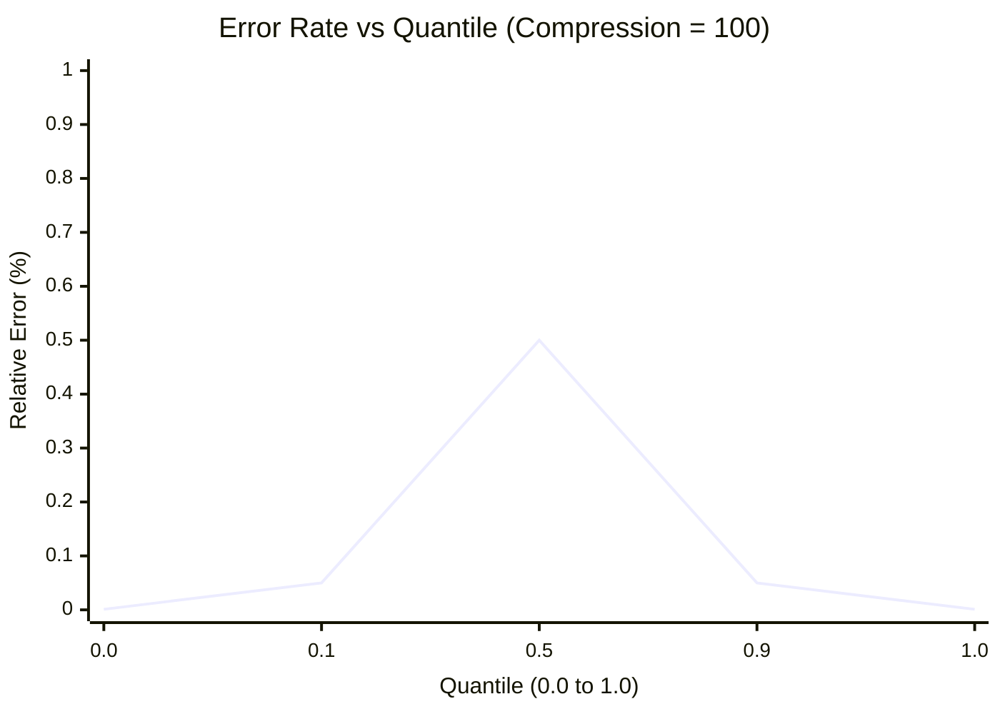
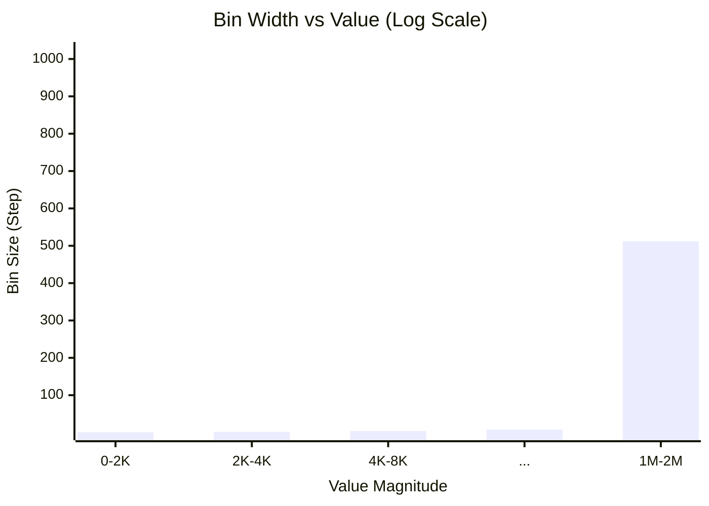
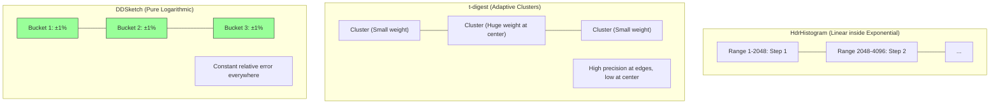

**TL;DR**: В потоковой обработке (Streaming) у вас нет доступа ко всем данным. Вы видите элемент один раз и должны принять решение: сохранить его или забыть навсегда.
*   **Reservoir Sampling** — единственный способ получить честную случайную выборку фиксированного размера из бесконечного потока.
*   **Quantiles (P99)** — никогда, запомните, **никогда не усредняйте перцентили**. Для их расчета в распределенных системах используются специальные структуры данных (Sketches), такие как **t-digest** или **DDSketch**.

---
## 1. Reservoir Sampling: Оптимизация CPU

**Задача:** Вы обрабатываете поток транзакций (`Stream`). Их количество $N$ заранее неизвестно и может исчисляться миллиардами. Вам нужно выбрать ровно $k$ транзакций (например, $k=1000$) так, чтобы *каждая* транзакция из потока имела одинаковую вероятность попасть в выборку: $P = k/N$.

**Ограничение:** В памяти можно держать только эти $k$ элементов. Нельзя сохранить все и перемешать (Shuffle).

#### 1.1. Algorithm R (Классический / Наивный)

Этот алгоритм (предложенный Vitter, 1985) является базой.

**Логика работы:**
1.  **Инициализация:** Заполняем резервуар (массив размера $k$) первыми $k$ элементами потока.
2.  **Обработка ($i > k$):** Для каждого следующего элемента с индексом $i$ (где $i$ идет от $k+1$ до $N$):
    *   Генерируем случайное число $j$ в диапазоне $[1, i]$.
    *   Если $j \le k$: заменяем элемент в резервуаре по индексу $j$ на текущий элемент $i$.
    *   Иначе: игнорируем элемент $i$.

**Математическое доказательство (Почему это работает?):**
Инженер должен уметь доказать корректность на салфетке. Докажем по индукции, что для любого шага $n$, вероятность любого элемента находиться в резервуаре равна $k/n$.

*   **База:** Для $n=k$ все элементы в резервуаре. Вероятность $k/k = 1$. Верно.
*   **Шаг:** Пусть для $n-1$ вероятность была $k/(n-1)$. Пришел элемент $n$.
    1.  **Шанс нового элемента попасть в резервуар:** По алгоритму это $k/n$. (Верно).
    2.  **Шанс старого элемента остаться:**
        Element stays = (Was already there) $\times$ (Not kicked out).
        *   Вероятность, что он уже там: $\frac{k}{n-1}$.
        *   Вероятность, что его *не выкинут*:
            *   Новый элемент входит с шансом $k/n$.
            *   Если он вошел, он вытесняет *случайного* жертву (шанс быть жертвой $1/k$).
            *   Вероятность быть выкинутым: $\frac{k}{n} \times \frac{1}{k} = \frac{1}{n}$.
            *   Вероятность *не* быть выкинутым: $1 - \frac{1}{n} = \frac{n-1}{n}$.
        *   **Итог:** $\frac{k}{n-1} \times \frac{n-1}{n} = \frac{k}{n}$.

**Вердикт:** Вероятность сохранилась. Алгоритм математически безупречен.

#### 1.2. Algorithm L (Оптимизация для High-Load)

**Проблема Algorithm R:** Если $k=1000$, а $N=1,000,000,000$, мы вызовем генератор случайных чисел 1 миллиард раз. При этом, когда $i$ становится большим (например, $i=1,000,000$), вероятность вставки $k/i = 1000/1,000,000 = 0.001$.
То есть в 99.9% случаев мы генерируем случайное число, чтобы просто сказать "нет". Мы греем воздух процессором.

**Решение (Algorithm L):**
Вместо того чтобы на каждом шаге решать "взять или нет", мы рассчитываем **сколько элементов пропустить**, прежде чем мы *гарантированно* возьмем следующий.

Количество пропускаемых элементов ($S$) подчиняется геометрическому распределению.
Формула для генерации длины прыжка:
$$S = \lfloor \frac{\log(W)}{\log(1 - k/i)} \rfloor$$
Где $W$ — случайное число $(0, 1)$, а $i$ — текущий индекс.

**Алгоритм:**
1.  Заполнили резервуар первыми $k$ элементами.
2.  Рассчитали прыжок $S$.
3.  Пропустили $S$ элементов потока (просто `stream.skip(S)` или инкремент счетчика). Это **бесплатно** для CPU.
4.  Элемент $i + S + 1$ помещаем в резервуар (на случайное место).
5.  Обновляем $i$, пересчитываем новый $S$.

**Результат:** Сложность снижается с $O(N)$ до $O(k(1 + \log(N/k)))$. Чем дальше мы по потоку, тем гигантскими становятся прыжки. Это позволяет сэмплить терабайтные логи за миллисекунды процессорного времени.

#### 1.3. Распределенный Reservoir Sampling (MapReduce / Spark)

В современных системах поток не идет через одну машину. Данные разбиты на 1000 партиций (RDD).
Как получить *глобально* честные 1000 элементов?

**Паттерн "Random Sort":**
1.  **Map Phase:** Каждому элементу $x$ приписываем случайный "вес" (приоритет) $r \in [0, 1]$.
    *   Пара: $(r, x)$.
2.  **Local Combine:** На каждом маппере берем Top-$K$ элементов с *наибольшим* весом $r$.
3.  **Reduce Phase:** Собираем все локальные Top-$K$ (всего $K \times \text{partitions}$ элементов).
4.  **Final Sort:** Сортируем этот объединенный список по $r$ и берем глобальные Top-$K$.

**Почему это работает?**
Математически это эквивалентно тому, что мы бы собрали все данные в один массив, перемешали их (Shuffle) и взяли первые $k$. Присвоение случайного $r$ — это и есть распределенная "перемешка".

---
### Пример реализации (Python: Naive vs Optimal)

Для наглядности разницы подходов.

```python
import random
import math

# 1. NAIVE (Algorithm R) - Медленно на больших N
def reservoir_sampling_naive(stream, k):
    reservoir = []
    for i, item in enumerate(stream):
        if i < k:
            reservoir.append(item)
        else:
            # Жжем CPU на генерации случайного числа каждый раз
            j = random.randint(0, i)
            if j < k:
                reservoir[j] = item
    return reservoir

# 2. OPTIMAL (Algorithm L style logic) - Быстро
def reservoir_sampling_optimal(stream, k):
    reservoir = []
    iterator = iter(stream)
    
    # Fill initial
    try:
        for _ in range(k):
            reservoir.append(next(iterator))
    except StopIteration:
        return reservoir

    i = k
    while True:
        # Рассчитываем прыжок. 
        # W = random.random()
        # Формула упрощена для примера, в реальности используется log-based формула
        # S = magic_geometric_jump_formula(i, k) 
        
        # Эмуляция прыжка для простоты понимания:
        # Чем больше i, тем больше элементов мы пропускаем в среднем
        w = random.random()
        # Геометрический прыжок (приблизительная формула)
        skip = int(math.log(w) / math.log(1 - k/float(i+1))) if (1 - k/float(i+1)) > 0 else 0
        
        # Физический пропуск элементов
        try:
            # Пытаемся пропустить 'skip' элементов
            # В реальном I/O это seek() или быстрый read()
            for _ in range(skip):
                next(iterator)
            
            # Берем следующий элемент
            next_item = next(iterator)
            
            # Заменяем случайный в резервуаре
            replace_idx = random.randint(0, k-1)
            reservoir[replace_idx] = next_item
            
            i += skip + 1
        except StopIteration:
            break
            
    return reservoir
```

### Практическое применение (Use Cases)

1.  **Аудит безопасности:** У вас есть лог доступа (Access Log) на 10 ТБ. Вы не можете проверить все записи. Вы хотите проверять 1000 запросов ежедневно, но так, чтобы злоумышленник не мог "спрятаться" в конце дня, зная, что буфер уже полон. Reservoir Sampling гарантирует, что запрос в 23:59 имеет такой же шанс быть проверенным, как и запрос в 00:01.
2.  **ML Training Data:** У вас бесконечный поток пользовательских действий. Вам нужно дообучать модель (Online Learning) на батче из 10,000 примеров. Reservoir Sampling обеспечивает репрезентативность батча по отношению ко всему потоку, избегая переобучения на данных только за последний час (Recency Bias).
3.  **A/B Testing Debug:** Собрать случайные ID сессий для ручного разбора, почему новая фича падает.

### Резюме раздела
*   **Reservoir Sampling** позволяет сжать терабайтный поток до $k$ элементов за один проход ($O(N)$ time, $O(k)$ space).
*   **Algorithm R** — прост, но использует слишком много CPU на RNG.
*   **Algorithm L** — использует математику (геометрическое распределение), чтобы "перепрыгивать" ненужные элементы, экономя ресурсы.
*   **Распределенная версия** реализуется через сортировку по случайному ключу.

---
## 2. Quantiles & Latency: Битва Скетчей (Deep Dive)

В Streaming-системах мы сталкиваемся с фундаментальным ограничением: точный расчет ранговых метрик (медиана, P99) требует сортировки всех данных, то есть $O(N)$ памяти. При потоке в 1TB логов это невозможно.

Мы используем **Summaries** (или Sketches) — вероятностные структуры данных, которые аппроксимируют распределение с контролируемой ошибкой. Выбор конкретного скетча зависит от того, *какую именно ошибку* вы готовы терпеть ради производительности.

### 2.1. Фундаментальная дилемма: Rank Error vs Relative Error

Инженеры часто путают эти два понятия, что приводит к некорректным SLA.

#### **A. Rank Error (Ошибка ранга)**
Гарантия вида: *"Если вы просите P99 (ранг 0.99), я верну вам значение элемента, чей истинный ранг лежит в диапазоне $[0.99 - \epsilon; 0.99 + \epsilon]$"*.

*   **Пример:** В потоке 1000 запросов. Истинный P99 — это 990-й самый медленный запрос (допустим, **500ms**).
*   Алгоритм с ошибкой ранга $\epsilon=0.01$ (1%) может вернуть значение любого запроса между 980-м и 1000-м.
*   **Проблема (The Long Tail Problem):** Если у вас "тяжелый хвост" (heavy-tailed distribution), где 980-й запрос = 200ms, 990-й = 500ms, а 1000-й = 10s (timeout), то алгоритм может вернуть **10s** вместо **500ms**.
*   **Вердикт:** Формально контракт соблюден (ранг рядом), но **значение** отличается в 20 раз. Это катастрофа для алертинга.
*   *Алгоритмы:* GK (Greenwald-Khanna), KLL, стандартный t-digest (в центре распределения).

#### **B. Relative Error (Относительная ошибка значения)**
Гарантия вида: *"Я верну значение $v$, такое что $|v - TrueValue| / TrueValue \le \epsilon$ "*.

*   **Пример:** Истинный P99 = **500ms**.
*   Алгоритм с относительной ошибкой 1% гарантированно вернет значение в диапазоне **[495ms; 505ms]**.
*   **Вердикт:** Это именно то, что нужно для SLA и пользовательского опыта. Неважно, какой ранг у соседа, важно значение.
*   *Алгоритмы:* DDSketch, HdrHistogram, t-digest (на краях распределения, благодаря scale function).

---
### 2.2. t-digest (Адаптивная кластеризация)

> [!abstract] Проблема Хвостов (The Tail Latency Problem)
> В мире микросервисов среднее время ответа (Average/Median) бесполезно. Оно скрывает проблемы.
> Нас волнует **99-й и 99.9-й перцентиль** ($P_{99}, P_{99.9}$).
>
> * **Reservoir Sampling** (из прошлого раздела) дает равномерную выборку. Это плохо: он тратит память на скучную "середину" распределения и теряет критически важные выбросы на краях.
> * **GK-Sketch** (Greenwald-Khanna) хорош, но сложен и дорог в объединении.
>
> **t-digest** (Ted Dunning, 2013) — это структура данных, которая **сжимает данные неравномерно**. Она сохраняет феноменальную точность на "хвостах" (краях распределения) и жертвует точностью в центре (медиане), где данные и так кучные.

#### A. Анатомия: Центроиды вместо Точек

Вместо хранения сырых чисел, t-digest кластеризует их в одномерные группы — **Центроиды**.

Каждый центроид $C$ — это структура:
1.  **Mean ($\mu$):** Средневзвешенное значение точек в кластере.
2.  **Weight ($w$):** Количество точек, попавших в этот кластер.

Если у нас есть поток `[10, 11, 12, 1000]`, t-digest может сжать его в два центроида:
* $C_1: \{ \mu=11, w=3 \}$ (представляет 10, 11, 12)
* $C_2: \{ \mu=1000, w=1 \}$ (представляет выброс)
#### B. Магия: Потенциальная функция (Scale Function)

Почему это называется "t"-digest? От "trigonometric" (изначально функции были тригонометрическими), но суть в **адаптивном размере**.

Алгоритм гарантирует, что размер центроида (его вес $w$) зависит от его положения в отсортированном ряду ($q$ — квантиль от 0 до 1).

$$k(q) = \frac{\delta}{2\pi} \arcsin(2q - 1)$$

Не пугайтесь формулы. Важен **физический смысл**:
1.  **Края ($q \to 0$ или $q \to 1$):** Здесь допустимый размер центроида очень **маленький**. Мы храним почти каждую точку отдельно. Точность максимальная.
2.  **Центр ($q \approx 0.5$):** Здесь допустимый размер центроида **большой**. Мы агрегируем много данных в одну кучу.

Это как человеческий глаз (Foveal Vision): мы видим четко то, на что смотрим (края, которые нам важны в SLA), а периферия (медиана) размыта.
#### C. Жизненный цикл: Буфер и Слияние (Merging)

Современная реализация (MergingDigest) работает так:

1.  **Buffer:** Входящие данные копятся во временном несортированном буфере.
2.  **Sort:** Когда буфер переполняется, данные сортируются.
3.  **Merge (Greedy approach):** Мы идем по отсортированным данным и "жадно" пытаемся запихнуть текущую точку в последний активный центроид.
    * *Условие:* "Если я добавлю эту точку, вес центроида не превысит лимит, разрешенный для этой позиции?"
    * **Да:** Добавляем (обновляем $\mu$ и $w$).
    * **Нет:** Закрываем текущий центроид, создаем новый.

Этот процесс очень быстр и отлично параллелится. Два t-digest'а можно слить в один (как в MapReduce), просто объединив их центроиды и запустив процедуру Merge заново.

#### D. Визуализация: Распределение ошибки (Mermaid)

Взгляните, как t-digest распределяет "бюджет памяти".


_Обратите внимание:_ Ошибка минимальна на 0.0 и 1.0 (min/max/P99) и максимальна на 0.5 (median).

#### E. Сравнение: Почему t-digest победил?

|**Характеристика**|**Q-Digest**|**GK-Sketch**|**t-digest**|
|---|---|---|---|
|**Тип данных**|Целые (Integers)|Float|**Float**|
|**Диапазон**|Нужен заранее|Любой|**Любой**|
|**Точность**|Равномерная|Равномерная|**Высокая на хвостах**|
|**Mergeable?**|Да|Сложно|**Тривиально**|
|**Скорость**|Высокая|Средняя|**Очень высокая**|

#### F. Пример кода (Концептуальный Python)

```Python
class Centroid:
    def __init__(self, mean, weight):
        self.mean = mean
        self.weight = weight

    def add(self, x, w):
        # Обновляем средневзвешенное
        self.mean = (self.mean * self.weight + x * w) / (self.weight + w)
        self.weight += w

class TDigest:
    def merge(self, points):
        # 1. Сортируем входящие точки (или центроиды)
        points.sort()
        
        current_centroid = points[0]
        total_weight = sum(p.weight for p in points)
        current_weight_so_far = 0
        
        for next_pt in points[1:]:
            # Вычисляем допустимый вес на текущей позиции q
            q = current_weight_so_far / total_weight
            limit = self.calculate_limit(q) 
            
            if current_centroid.weight + next_pt.weight <= limit:
                # Сливаем
                current_centroid.add(next_pt.mean, next_pt.weight)
            else:
                # Финализируем старый, начинаем новый
                self.centroids.append(current_centroid)
                current_weight_so_far += current_centroid.weight
                current_centroid = next_pt
```

> [!check] Архитектурный вывод
> 
> Используйте **t-digest**, если:
> 
> 1. Вам нужны метрики производительности (Latencies).
>     
> 2. Вам критически важны **P95, P99, P99.9**.
>     
> 3. Вы агрегируете данные с тысяч серверов (Mergeability).
>     
> 
> Это стандарт де-факто в **Elasticsearch**, **Prometheus**, **InfluxDB** и **Spark**. Если вы видите график перцентилей в Grafana — скорее всего, под капотом работает t-digest.

---
### 2.3. HdrHistogram (High Dynamic Range Histogram)

> [!abstract] Проблема "Линейного Ведра"
> Представьте, что вы хотите измерять задержки от 1 микросекунды до 1 часа с точностью до 1 мкс.
> * **Наивный массив:** Вам нужен массив длиной $3,600,000,000$ (3.6 млрд ячеек). Это ~14 ГБ памяти. Неприемлемо.
> * **Фиксированные бакеты:** Если сделать шаг 1 мс, вы потеряете детализацию быстрых запросов (1 мкс и 900 мкс попадут в одну кучу).
>
> **HdrHistogram** решает эту задачу, используя идею **экспоненциальных бакетов**. Он позволяет записывать значения в гигантском диапазоне (Dynamic Range) с фиксированной относительной точностью (например, 3 значащих цифры), занимая при этом ничтожные 100-200 КБ.

#### A. Архитектура: Логарифмическая линейка

HdrHistogram не хранит сами значения (как t-digest). Он хранит **счетчики** (counts) в хитро организованном массиве.
Идея похожа на представление чисел с плавающей точкой (Floating Point):
1.  **Мантисса:** Линейное разрешение.
2.  **Экспонента:** Масштаб.

**Структура Бакетов:**
Вместо одного длинного массива, мы разбиваем диапазон на уровни (powers of 2):
* **Уровень 0 (0...2047):** Шаг 1. (Точность 100%).
* **Уровень 1 (2048...4095):** Шаг 2. (Мы теряем младший бит, но сохраняем точность ~0.1%).
* **Уровень 2 (4096...8191):** Шаг 4.
* **Уровень $k$:** Шаг $2^k$.


Таким образом, относительная ошибка (Relative Error) остается постоянной по всему диапазону. Ошибка в 1 мс допустима, если задержка составляет 10 минут, но недопустима, если задержка 2 мс.

#### B. "Zero-Allocation" Philosophy

Гил Тене проектировал эту структуру для **Low-Latency Java**.
Главный враг latency — это Garbage Collector (GC).
* **t-digest** (в Java реализации) часто создает объекты `Centroid` в куче (Heap). Это нагружает GC.
* **HdrHistogram** при записи (`recordValue`) **не создает ни одного объекта**.
    * Вся структура — это один плоский примитивный массив `long[] counts`.
    * Запись значения — это просто битовые сдвиги для вычисления индекса и инкремент: `counts[idx]++`.
    * Операция занимает наносекунды ($O(1)$).

#### C. Пример: Точность "3 значащих цифры"

Самый популярный конфиг — `numberOfSignificantValueDigits(3)`.
Это гарантирует точность **99.9%** (ошибка $\le 0.1\%$).

Что это значит на практике?
* Для значения **100 микросекунд**: ошибка не более 0.1 мкс.
* Для значения **1 секунда**: ошибка не более 1 мс.
* Для значения **1 час**: ошибка не более 3.6 сек.

**Цена памяти:**
Для диапазона от 1 мкс до 24 часов с точностью 3 знака массив займет всего около **100 Кбайт**. Это позволяет держать отдельную гистограмму для каждого API-ендпоинта в приложении.

#### D. Визуализация: Ширина бакетов (Mermaid)

Взгляните, как растет "цена деления" (Bin Width) с ростом значения.


#### E. Сравнение: t-digest vs HdrHistogram

Это классический вопрос на System Design интервью.

|**Характеристика**|**HdrHistogram**|**t-digest**|
|---|---|---|
|**Тип данных**|Только целые полож. числа (`long`)|Любые числа (`float/double`)|
|**Память**|Фиксирована (напр., 100KB)|Адаптивная (напр., 1KB)|
|**Скорость записи**|**Extreme** (10-20 ns, Atomic)|Fast (100-200 ns, Locks/Buffer)|
|**Точность**|Гарантированная (Worst Case)|Вероятностная (зависит от сжатия)|
|**Слияние (Merge)**|Очень быстро (сложение массивов)|Быстро (сортировка центроидов)|
|**Use Case**|Latency Recording (внутри аппы)|Distributed Metrics (хранение в БД)|
#### F. Проблема Coordinated Omission

HdrHistogram часто упоминается вместе с термином **Coordinated Omission**.

Это не свойство структуры данных, а методология измерения, которую пропагандирует Гил Тене.

> [!warning] Ложь нагрузочного тестирования
> 
> Если ваша система зависла на 10 секунд, обычный нагрузочный тестер (JMeter/Gatling) может просто перестать слать запросы на эти 10 секунд.
> 
> В итоге в отчете: "Было 0 запросов с задержкой 10с".
> 
> HdrHistogram имеет метод `recordValueWithExpectedInterval`. Если вы ожидаете запросы раз в 1 мс, а запись пришла через 10 секунд, он **автоматически заполнит** пропущенные 10,000 значений в гистограмму как "плохие". Это показывает правдивую картину.

#### G. Code Snippet (Java)
```Java
import org.HdrHistogram.Histogram;

// 1. Создаем гистограмму
// Диапазон: от 1 до 3,600,000,000,000 (1 час в наносекундах)
// Точность: 3 значащих цифры
Histogram histogram = new Histogram(3600000000000L, 3);

// 2. Запись данных (High Frequency)
void onRequestComplete(long latencyNanos) {
    // Zero allocation here!
    histogram.recordValue(latencyNanos);
}

// 3. Чтение перцентилей (обычно раз в минуту)
void report() {
    System.out.println("P50: "  + histogram.getValueAtPercentile(50.0));
    System.out.println("P99: "  + histogram.getValueAtPercentile(99.0));
    System.out.println("Max: "  + histogram.getMaxValue());
    
    // Очистка для следующей минуты
    histogram.reset();
}
```

> [!check] Архитектурный вывод
> 
> - Используйте **HdrHistogram** внутри вашего кода (Java/Go/Rust) для сбора метрик "на лету". Это самый быстрый и честный способ.
>     
> - При отправке метрик в центральное хранилище (Prometheus/Datadog) гистограмму часто конвертируют либо в набор фиксированных бакетов, либо в **t-digest** (для экономии места на диске).
>

---
### 2.4. DDSketch (Datadog Sketch)

> [!abstract] Проблема "Масштаба и Объединения"
> Давайте честно посмотрим на предыдущих кандидатов:
> * **HdrHistogram:** Требует задать `maxValue` заранее. Если придет число больше максимума — ошибка или ресайз. Плюс работает только с `int`.
> * **t-digest:** Отлично считает медиану, но его сложность слияния (merge) растет с размером данных. А главное — он гарантирует точность по *рангу* (q-error), а не по *значению* (relative error).
>
> **DDSketch** — это ответ на вопрос: "Как мне агрегировать метрики с миллиона хостов, если я не знаю диапазон значений (от наносекунд до лет), хочу поддерживать `float` и требую, чтобы ошибка $P_{99}$ никогда не превышала 1%?"

#### A. Философия: Relative Error Guarantee

В отличие от t-digest, который говорит "Этот элемент находится где-то между 99.0% и 99.1% квантилем", DDSketch говорит: "Значение этого квантиля равно $X \pm 1\%$".

Это критически важное отличие.
* **Rank Error (t-digest):** "Ваш P99 — это какое-то значение из топа, но само значение может быть смещено".
* **Relative Error (DDSketch):** "Ваш P99 равен 150ms. Истинное значение точно лежит между 148.5ms и 151.5ms".

Для SLA (Service Level Agreement) второе часто важнее.

#### B. Математика: Логарифмические Бакеты

DDSketch разбивает ось значений на бакеты, которые растут **экспоненциально**.
Вспомните HdrHistogram: там тоже экспонента, но на базе степени двойки ($2^k$). DDSketch делает базу адаптивной.

Пусть $\alpha$ — допустимая относительная ошибка (например, $0.01$ для 1%).
Мы вычисляем коэффициент роста $\gamma$ (gamma):

$$\gamma = \frac{1 + \alpha}{1 - \alpha}$$

Бакеты формируются так:
* Бакет 0: $[1, \gamma]$
* Бакет 1: $[\gamma, \gamma^2]$
* ...
* Бакет $k$: $[\gamma^k, \gamma^{k+1}]$

Чтобы найти индекс бакета для любого числа $x$, нам не нужно перебирать массив. Мы используем логарифм:
$$k = \lceil \log_{\gamma}(x) \rceil$$

Это обеспечивает **$O(1)$** вставку для любого числа, будь то $0.0001$ или $10^{18}$.

#### C. Collapsing: Борьба с Бесконечностью

Теоретически, если придут данные с огромным разбросом, нам понадобится бесконечно много бакетов. Память не резиновая.
DDSketch имеет механизм **Collapsing** (Схлопывание).

Когда количество бакетов превышает лимит (например, 2048):
1.  Алгоритм жертвует **точностью хвоста с низкими значениями**.
2.  Он объединяет бакеты с маленькими индексами (быстрые запросы), чтобы освободить место для новых бакетов с большими индексами (медленные запросы).

**Логика:** Нам плевать, был запрос 0.1мс или 0.2мс (это всё "быстро"). Но нам критически важно отличать 10с от 20с. Поэтому DDSketch "забывает" детали слева, чтобы сохранить детали справа.

#### D. Визуализация: Разница подходов (Mermaid)

Сравним, как три алгоритма "видят" данные.


#### E. Сравнение "Большой Тройки"

Это итоговая таблица для выбора алгоритма в продакшн.

|**Feature**|**HdrHistogram**|**t-digest**|**DDSketch**|
|---|---|---|---|
|**Input Type**|Integers only|Floats|**Floats**|
|**Data Range**|Fixed (`maxValue`)|Unbounded|**Unbounded**|
|**Error Type**|Relative (Value)|Rank (Quantile)|**Relative (Value)**|
|**Merge Speed**|Fast (Add arrays)|Medium (Sort centroids)|**Fast** (Add sparse maps)|
|**Negative Values**|No (Complex hack)|**Yes**|**Yes** (Symmetric buckets)|
|**Main Drawback**|Memory if range is huge|Complex merge logic|Lower accuracy near Zero|
#### F. Архитектурный выбор: OpenTelemetry

> [!info] Стандарт Индустрии
> 
> Если вы используете **OpenTelemetry** (стандарт для метрик в Cloud Native), то вы, скорее всего, используете DDSketch.
> 
> В протоколе OTLP (OpenTelemetry Protocol) гистограммы часто передаются в формате **ExponentialHistogram**.
> 
> Это и есть реализация идей DDSketch (Base-2 exponential buckets), которая позволяет эффективно сжимать данные и мержить их на стороне бэкенда (Prometheus, Jaeger, Datadog).

#### G. Code Concept (Как это работает внутри)
```Python
import math

class DDSketch:
    def __init__(self, alpha=0.01):
        self.alpha = alpha
        # Вычисляем основание логарифма
        self.gamma = (1 + alpha) / (1 - alpha)
        self.log_gamma = math.log(self.gamma)
        self.offset = 0 # Для обработки отрицательных чисел
        
        # Храним только непустые бакеты (Sparse Storage)
        self.buckets = {} 

    def add(self, value):
        if value < 1e-9: return # Игнорируем ноль (ограничение логарифма)
        
        # Ключевая формула маппинга
        index = math.ceil(math.log(value) / self.log_gamma)
        
        self.buckets[index] = self.buckets.get(index, 0) + 1

    def get_quantile(self, q):
        # ... логика суммирования бакетов и поиска границы ...
        pass
```

> [!check] Архитектурный вывод
> 
> Используйте **DDSketch**, если:
> 
> 1. Вы строите распределенную систему мониторинга (агенты шлют метрики).
>     
> 2. Вы не знаете заранее, какие значения будут приходить (от 0.001 до 1000000).
>     
> 3. Вам нужны дробные числа (`float`).
>     
> 4. Вам важнее точность значения (100ms vs 101ms), чем точность позиции в очереди.
>

---
### 2.5. Сводная таблица для выбора архитектуры

Как архитектор, вы выбираете инструмент под задачу:

| Характеристика | t-digest | HdrHistogram | DDSketch |
| :--- | :--- | :--- | :--- |
| **Тип данных** | `double` (любые) | `long` (positive int) | `double` (любые) |
| **Гарантия ошибки** | Rank Error (но excellent at tails) | **Relative Error** (Strict) | **Relative Error** (Strict) |
| **Память** | Малая (~2-10KB), зависит от сжатия | Фиксированная (~10-100KB), зависит от range | Адаптивная, растет с разбросом данных |
| **Скорость записи** | Medium (требует буферизации) | **Extremely High** (CPU instructions) | High |
| **Слияние (Merge)** | Сложное (сортировка) | Быстрое (сложение массивов) | Быстрое (сложение бакетов) |
| **Use Case** | Elastic, Spark, ML features | Java Latency Monitoring, Aeron | Datadog, Distributed Tracing |
#### Пример для наглядности ("Ловушка ранга")

Представьте SLA: **P99 latency должен быть < 500ms**.
Вы используете алгоритм с Rank Error (например, старый GK или наивный сэмплинг).
Данные за минуту (1000 запросов):
*   980 запросов: ~50ms
*   10 запросов: ~450ms
*   **10 запросов (выброс): 5000ms (5 секунд!)**

Истинный P99 (990-й элемент) = **5000ms**. SLA нарушен жестко.

**Алгоритм с Rank Error ($\epsilon=0.01$, т.е. 10 элементов):**
Он имеет право вернуть любое значение между рангом 980 и 1000.
В диапазоне рангов [980...989] лежат значения ~450ms.
Алгоритм возвращает **455ms**.
**Мониторинг:** "Зеленый" (P99 < 500ms).
**Пользователи:** "Сайт висит по 5 секунд".
**Вывод:** Для Latency SLA всегда используйте структуры с Relative Error (Hdr/DDSketch) или t-digest с высоким compression factor.

---
## 3. "The Aggregation Problem": Математика лжет

Как архитектор, вы столкнетесь с двумя типами агрегации метрик:
1.  **Пространственная (Spatial):** У вас 500 подов микросервиса. Вам нужно одно число P99, характеризующее здоровье всего кластера прямо сейчас.
2.  **Временная (Temporal):** У вас есть данные за минуту. Вы хотите нарисовать график за день, где каждая точка — это P99 за час.

В обоих случаях, если ваша база данных метрик хранит **уже вычисленные** перцентили (пре-агрегированные значения, например, число `154ms`), вы в тупике. С этими числами нельзя делать никаких математических операций.

### 3.1. Математическое доказательство (Non-Additivity)

Метрики делятся на два класса:
*   **Аддитивные (Summable):** Количество запросов (Counts), объем переданных байт, суммарное время CPU. Если на сервере А было 5 ошибок, а на сервере Б — 10, то всего было $5+10=15$.
*   **Ранговые (Rank-based):** Перцентили, медианы, мин/макс. Они зависят от *упорядоченности* полного набора данных.

**Аксиома:** $P99(A \cup B) \neq \text{Avg}(P99(A), P99(B))$.
Более того, $P99(A \cup B)$ не равно даже взвешенному среднему. Не существует формулы, которая восстановит глобальный P99, имея на руках только локальные P99.

### 3.2. Сценарий 1: "Ложная тревога" (The False Positive)
*Ситуация, когда мониторинг будит вас ночью, но система работает нормально.*

Представьте балансировщик нагрузки (Load Balancer) и два бэкенда.
*   **Сервер А (Основной поток):** Обработал 9990 запросов. Все быстрые (1ms).
    *   Локальный P99 = **1ms**.
*   **Сервер Б (Зависший/Тестовый):** Обработал всего 10 запросов. Все медленные (100ms).
    *   Локальный P99 = **100ms**.

**Что делает наивный мониторинг (Average):**
$$\text{Cluster P99} = \frac{1ms + 100ms}{2} = 50.5ms$$
Вы получаете алерт: "Latency > 50ms!".

**Что происходит в реальности (Global P99):**
Всего запросов: $9990 + 10 = 10,000$.
Медленных запросов: 10 шт.
Это составляет всего $\frac{10}{10000} = 0.1\%$ от общего трафика.
Значит, 99.9% пользователей получили ответ за 1ms.
**Реальный Global P99 = 1ms.**
*Итог:* Вы проснулись зря. Ошибка агрегации завысила метрику в 50 раз.

### 3.3. Сценарий 2: "Скрытая катастрофа" (The False Negative)
*Это гораздо страшнее. Система лежит, клиенты уходят, а дашборд горит зеленым.*

У вас 10 серверов. 9 работают штатно, 1 сломался и тупит на каждом запросе. Нагрузка распределена равномерно (Round Robin), по 1000 запросов на сервер.

*   **Серверы 1–9 (Healthy):** P99 = **10ms**.
*   **Сервер 10 (Broken):** P99 = **1000ms** (1 секунда).

**Наивный мониторинг (Average):**
$$\text{Cluster P99} = \frac{(9 \times 10ms) + 1000ms}{10} = \frac{1090}{10} = 109ms$$
Ваш SLA (допустим, 200ms) не нарушен. Вы спокойны.

**Реальность (Global P99):**
Всего запросов: 10,000.
Из них 1000 запросов (весь трафик 10-го сервера) имеют задержку 1000ms.
Это ровно **10%** от всего трафика.
Это значит, что $P90$, $P95$ и $P99$ глобально равны **1000ms**.
Каждый десятый пользователь страдает от секундной задержки.

*Итог:* Дашборд показывает **109ms**, реальность — **1000ms**. Ошибка почти в 10 раз. Вы пропускаете аварию.

### 3.4. Архитектурное решение: Histogram Merge

Единственный способ решить эту задачу корректно — отложить вычисление перцентиля на самый последний момент (Read time), а не сохранять его в момент записи (Write time).

1.  **Сбор данных:** Агенты (Telegraf, Prometheus client, Datadog agent) на каждом поде не считают `double P99`. Они строят **Гистограмму** (или Sketch: t-digest, DDSketch).
    *   *Пример:* Сервер А отправляет бакеты: `{le="10ms": 500, le="100ms": 0}`.
2.  **Агрегация:** База данных мониторинга (Prometheus/VictoriaMetrics) при запросе графика выполняет **слияние бакетов** (Sum of histograms).
    *   Берет бакет "до 10ms" с Сервера А и складывает с бакетом "до 10ms" с Сервера Б.
3.  **Вычисление:** Функция `histogram_quantile()` применяется к *суммарной* гистограмме.

**Термины для запоминания:**
*   **Pre-computed percentiles:** Зло. Числа типа "P99=150", сохраненные в БД. Непригодны для агрегации.
*   **Raw Histograms / Sketches:** Добро. Структуры данных, которые можно складывать (Mergeable), сохраняя математическую точность распределения.

### Резюме раздела
Если вы видите в API системы мониторинга метод `avg(p99)`, бейте тревогу. Вы не можете взять среднее от "худшего случая". Вы должны собрать все случаи в одну кучу (merge sketches) и заново найти в ней "худший случай".

---
## 4. HyperLogLog (Бонус для Эксперта)

Говоря о стриминге, нельзя не упомянуть **Cardinality Estimation** (Count Distinct).
Задача: Сколько *уникальных* пользователей зашло на сайт? `Set<UserID>` съест всю память.
*   **HyperLogLog (HLL):** Использует вероятностный подсчет нулей в битовом представлении хешей.
*   **Память:** ~12 КБ для подсчета миллиардов уников с ошибкой < 1%.
*   **Инсайт:** HLL тоже мерджится (Union). Это позволяет строить OLAP-кубы: хранить HLL за каждую минуту, а потом получать уников за час/день/месяц без пересчета сырых данных.

---
## 5. Чек-лист для Solution Architect

1.  **Сериализация:** Сколько весит ваш скетч? t-digest может раздуваться до 10-20КБ. Если вы отправляете метрики каждую секунду с 1000 подов, вы забьете сеть гигабайтами трафика. Используйте компрессию или DDSketch (он часто компактнее).
2.  **Concurrency:** t-digest **не потокобезопасен** при записи. Вам нужен `ThreadLocal` буфер или спин-локи. HdrHistogram имеет Concurrent-версию (`IntCountsHistogram`), где запись — это `CAS` операции, что быстрее лока.
3.  **Неограниченные данные:** Что будет, если в DDSketch придет значение $10^{100}$? Или отрицательное число в HdrHistogram? Эксперт знает границы применимости своих структур (DDSketch требует особого handling для нуля и отрицательных чисел).
4.  **SLA на мониторинг:** Насколько быстро мы можем мерджить скетчи? В VictoriaMetrics реализация t-digest оптимизирована на Assembly, чтобы успевать обрабатывать миллионы datapoints при запросе графиков.

### Резюме по инструментам
*   **Generic Data (Double), важен P99:** t-digest.
*   **Latency (Integer), важна скорость записи:** HdrHistogram.
*   **Точность значений важнее ранга:** DDSketch.
*   **Нужен сэмпл логов для глаз:** Weighted Reservoir Sampling (Algorithm L/Efraimidis).