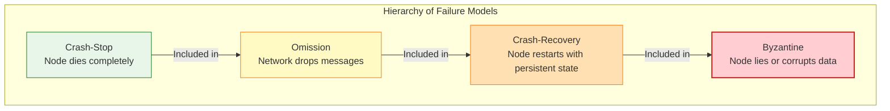
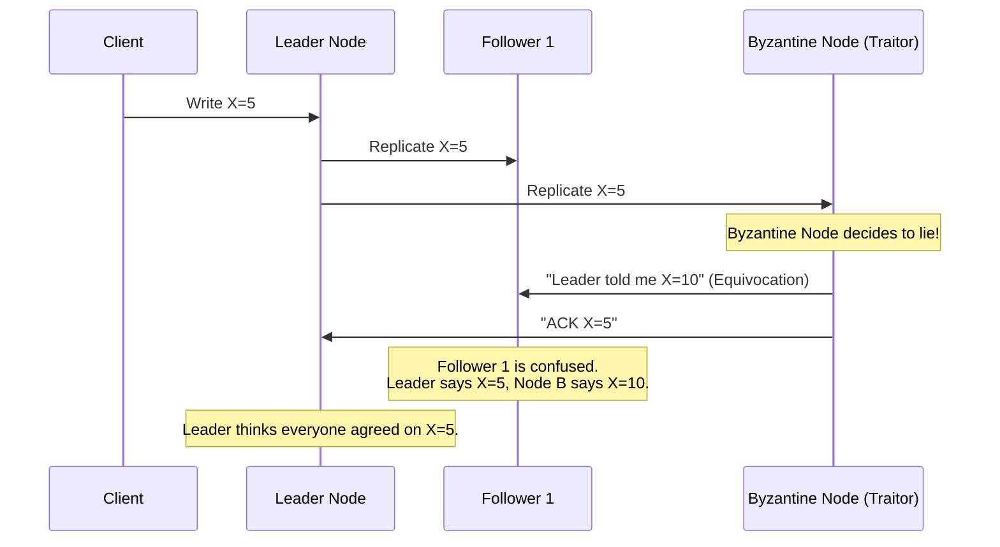

---
tags:
  - distributed-systems
  - failure-models
  - crash-stop
  - crash-recovery
  - byzantine
  - architecture
aliases:
  - Failure Models
  - Byzantine Fault Tolerance
  - Crash Recovery
---

# L1.DST.01: Модель отказов - crash-stop, crash-recovery, Byzantine

> [!abstract] О лекции
> Выбор математической модели отказов в архитектуре — это осознанный выбор того, от чего ваша система **не** будет защищаться.
> *   **Crash-Stop (Fail-Stop):** Утопичная модель для теоретиков и базовая модель для неизменяемой облачной инфраструктуры (Stateless pods в Kubernetes).
> *   **Crash-Recovery:** Жесткая реальность для любых Stateful систем (Database, Message Queues, Consensus). Главное здесь — не "восстановление" процесса в RAM, а **долговечность хранения состояния (fsync) перед ответом**.
> *   **Byzantine (Византийские отказы):** "Хардкор" для распределенного блокчейна и критических систем жизнеобеспечения (Boeing, SpaceX, кардиостимуляторы). Если вы не строите ракету, BFT вам, скорее всего, не нужен ради экономии RTT. Но **Silent Data Corruption (Тихая порча данных)** убьет вас, если вы наивно будете думать, что живете в идеальном мире Crash-Recovery.

---

В Computer Science и теории распределенных систем понятие "корректность" алгоритма не существует в вакууме. Она существует и доказывается только относительно строго выбранной **Модели Отказов (Failure Model)**. Если ваша система спроектирована и протестирована под Crash-Stop, а сетевой узел вдруг начал "врать" (Byzantine), математическое доказательство корректности мгновенно рассыпается, и вы необратимо теряете пользовательские данные.

Иерархия строгости (вложенность классов отказов от простых к сложным):
$$ 	ext{Crash-Stop} \subset 	ext{Omission} \subset 	ext{Crash-Recovery} \subset 	ext{Byzantine} $$

## 1. Crash-Stop (Fail-Stop): Идеализированная катастрофа

В академической литературе (например, у Nancy Lynch или в книге Cachin, Guerraoui, Rodrigues) часто небрежно смешивают понятия **Crash** и **Fail-Stop**. На уровне Expert вы обязаны их четко различать.

### 1.1. Строгое математическое определение (Formal Definition)
Распределенный процесс $p_i$ считается *корректным*, если он выполняет шаги предписанного алгоритма бесконечно долго без отклонений.
В строгой модели **Crash-Stop** процесс $p_i$ может совершить фатальный переход в состояние **Faulty** в некий момент физического времени $t_{crash}$.

Фундаментальные характеристики этого состояния:
1.  **Halting (Полная остановка):** После времени $t_{crash}$ процесс физически не выполняет ни одной инструкции процессора (no-op).
2.  **Silence (Абсолютное молчание):** После $t_{crash}$ процесс не отправляет в сеть ни одного байта сообщений.
3.  **Irreversibility (Необратимость):** Процесс никогда, ни при каких обстоятельствах не возвращается в строй (не воскресает). Если железный узел перезагрузился — с точки зрения математики этой модели это **совершенно новый** процесс $p_j$ (новое воплощение / incarnation), абсолютно не имеющий памяти о прошлой жизни $p_i$.
4.  **Protocol Prefix Property:** Процесс ведет себя *абсолютно корректно* (как по учебнику) и неотличимо от идеального узла вплоть до самой миллисекунды $t_{crash}$.

### 1.2. Фундаментальное различие Архитектора: Crash vs. Fail-Stop
Это самый тонкий момент теории, на котором часто "сыпятся" даже Senior инженеры на системных собеседованиях.

*   **Crash Failure (Отказ простой остановкой):** Это тупое физическое событие. Сервер внезапно обесточен в дата-центре. Ядро ушло в `kernel panic`. Провод выдернули. Это то, что происходит в суровой реальности. В асинхронной системе (Async System) другие живые узлы **вообще не знают**, произошел краш или сервер просто задумался.
*   **Fail-Stop (Отказ с остановкой и честным уведомлением):** Это "сказочная" теоретическая абстракция. Она подразумевает формулу: **Crash** + **Perfect Failure Detector** (Идеальный детектор сбоев).
    *   В модели Fail-Stop, если процесс $p_i$ падает, абсолютно *все* остальные корректные процессы $p_j$ в системе узнают об этом факте гарантированно, одновременно и за конечное, предсказуемое время.

**Инсайт Системного Архитектора:**
В реальных распределенных дата-центрах (AWS, Google Cloud, On-premise bare-metal k8s) **идеальной модели Fail-Stop физически не существует**, потому что сеть по своей природе асинхронна (пакеты могут задерживаться). Мы лишь *программно эмулируем* поведение Fail-Stop с помощью агрессивных таймаутов, тем самым искусственно превращая систему в "частично синхронную" (Partially Synchronous).

### 1.3. Теорема FLP и проблема "Ложной смерти"
Почему философское различие выше так критически важно для практики? Из-за великой теоремы **Fischer-Lynch-Paterson (FLP, 1985)**.

В полностью асинхронной сети с моделью отказов **Crash** математически невозможно построить детерминированный алгоритм консенсуса, который 100% гарантирует свойства Liveness (завершение работы) и Safety (корректность данных), если может упасть хотя бы **один единственный** узел.

*   **Причина доказательства (Indistinguishability Argument - Неразличимость):** В асинхронной сети узлу $A$ физически невозможно отличить *медленный* процесс $B$ от *упавшего* процесса $B$.
*   Если текущий Лидер кластера не отвечает 500мс, это Crash питания? Или тяжелая GC-пауза в Java на 600мс? Или сетевой лаг на свитче?
*   Если алгоритм решит, что это Crash, и выберет нового Лидера, а старый внезапно "проснется" (это явление называется **False Suspicion** - Ложное подозрение), в кластере мгновенно появится два активных лидера -> фатальное нарушение Safety (Split-Brain / Раздвоение мозга) и коррупция БД.
*   Если алгоритм будет осторожно ждать ответа вечно -> фатальное нарушение Liveness (вся система намертво висит, клиенты ждут).

**Архитектурный Вывод:** Абсолютно все реальные промышленные алгоритмы (Raft, Paxos, Apache Zab) изящно обходят жесткость FLP-Impossibility, используя **Failure Detectors** (детекторы отказов), которые по дизайну *могут ошибаться* в моменте (помечать живой узел как Suspected), но *с течением времени* (при стабилизации сети) становятся точными (так называемый Eventually Perfect Failure Detector $\diamond P$).

### 1.4. Архитектурный паттерн: Immutable / Stateless Infrastructure
Модель Crash-Stop — это "родная", идеальная модель для проектирования микросервисов, где восстановление локального состояния не имеет бизнес-смысла.

**Пример из Cloud Native: Kubernetes ReplicaSet**
Представьте под (Pod) с веб-сервером Nginx, отдающим статику.
1.  **Модель:** Если процесс Nginx падает с Segfault (Crash), системный процесс kubelet это мгновенно видит.
2.  **Реакция:** K8s **категорически не чинит** и не перезапускает процесс внутри старого контейнера. Он не пытается анализировать core dump и продолжать выполнение с той же точки.
3.  **Действие:** Он помечает этот под как Dead, безжалостно удаляет его IP из Endpoint Slice балансировщика и создает **абсолютно новый** под на другой ноде.
4.  **Анализ:** Старый под для системы умер навсегда (Irreversibility). Новый под — это новый процесс с девственно чистым стейтом.
Это 100% чистая реализация **Crash-Stop** логики в индустрии. Мы архитектурно считаем, что "ремонт" сломанного узла невозможен или экономически невыгоден.

**Пример из Telecom: Erlang/OTP "Let it crash"**
В телекоме (телефонные коммутаторы Ericsson) философия та же: если легковесный процесс (actor) столкнулся с непредвиденной ошибкой (по сети пришел битый JSON), он не пытается её аккуратно обработать блоком `try-catch`. Он делает преднамеренный Crash-Stop.
За ним бдительно следит процесс-Supervisor. Supervisor видит смерть (через механизм link/monitor) и мгновенно перезапускает актора с чистого, заводского листа.

### 1.5. Резюме по Crash-Stop для Senior-инженера

| Характеристика системы       | Описание в модели Crash-Stop                                                                                                                                                                                                                                                                       |
| :--------------------------- | :------------------------------------------------------------------------------------------------------------------------------------------------------------------------------------------------------------------------------------------------------------------------------------------------- |
| **Состояние RAM (Память)**   | Считается полностью и безвозвратно потерянным мгновенно (Volatile state is gone).                                                                                                                                                                                                                  |
| **Локальный Диск**           | Полностью игнорируется. Перезапуск = новый, пустой узел.                                                                                                                                                                                                                                           |
| **Детекция сбоя**            | В теории: идеальная и мгновенная. В практике: эмулируется через таймауты (Heartbeats / Leases).                                                                                                                                                                                                    |
| **Сложность алгоритмов**     | Низкая. Инженеру не нужно писать тяжелый код восстановления логов (Log Recovery) или соблюдать "обещания" (Promises), данные старым воплощением узла.                                                                                                                                              |
| **Главный риск (Опасность)** | False Positives (ложные срабатывания) детекторов сбоев. Если мы ошибочно посчитали живой узел мертвым и исключили его из кластера, а он всё ещё жив и пишет в общую БД — он обязан аппаратно "самоубиться" (механизм Fencing / STONITH), чтобы насильно соответствовать строгой модели Crash-Stop. |

**Важное дополнение:** Если вы проектируете систему, где узел обязан после сбоя "воскреснуть" с теми же самыми историческими данными (например, база данных PostgreSQL), модель Crash-Stop вам **категорически не подходит**. Вам нужна модель **Crash-Recovery** (раздел 2). Попытка наивно применить алгоритмы Crash-Stop к базе данных приведет к тотальной потере данных при рестарте всего кластера по питанию (correlated failure).

---
## 2. Crash-Recovery: Великая иллюзия персистентности

Эта модель является де-факто абсолютным стандартом (Baseline) для проектирования любой **Stateful** системы (Базы Данных, Брокеры сообщений типа Kafka, Координаторы типа ZooKeeper/Etcd).
**Формальное определение:** Процесс может в абсолютно любой момент непредсказуемо прекратить выполнение шагов (Crash), потерять всё содержимое оперативной памяти (Volatile State), но через конечное время физически перезапуститься (Recovery) и продолжить работу, **гарантированно восстановив свое состояние из стабильного энергонезависимого хранилища (Stable Storage)**.

В отличие от Crash-Stop, здесь процесс имеет бесконечный цикл жизни: `UP` -> `DOWN` -> `RECOVERY` -> `UP`.

### 2.1. Иерархия лжи (The Storage Hierarchy Lies)
Чтобы ваш распределенный алгоритм был математически корректен в модели Crash-Recovery, он должен четко, на уровне ОС различать, где физически живут данные в данный наносекундный момент. Джуниор думает, что системный вызов `write()` пишет данные на магнитный диск. Эксперт знает, что `write()` пишет данные в RAM.

Реальный путь багов и данных при записи:
1.  **Application Buffer:** Память процесса Java/C++ (гарантированно теряется при `kill -9` или OOM).
2.  **OS Page Cache:** Память ядра Linux (гарантированно теряется при Kernel Panic или Power Loss). Стандартный `write()` возвращает радостный `true` именно здесь!
3.  **Disk Controller Cache (On-disk cache):** Память внутри контроллера SSD/HDD (теряется при отключении питания дата-центра, если на диске нет встроенной батарейки/конденсатора PLP).
4.  **Stable Storage (Platter/NAND Flash):** Физический энергонезависимый носитель. Только здесь, на самом дне, данные переживают Crash-Recovery.

**Жесткий Императив Системного Архитектора:** Распределенная система считается корректной в модели Crash-Recovery тогда и только тогда, когда она использует жесткие примитивы системной синхронизации (`fsync()`, `fdatasync()`, флаги `O_DIRECT` или `O_DSYNC`) для принудительного аппаратного проталкивания байт до уровня 4 **строго перед тем**, как отправить сетевое подтверждение (ACK) об успехе операции внешнему клиенту или другому узлу.

### 2.2. Фундаментальная Проблема Амнезии (The Amnesia Problem)
Это самая опасная архитектурная уязвимость модели. Если узел "забыл" о своем прошлом консенсус-решении после перезагрузки, он мгновенно разрушает математическую гарантию **Safety** всей системы.

**Сценарий катастрофы (Data Loss):**
1.  Узел $A$ (Лидер) получает от клиента запрос на запись переменной $X=1$.
2.  $A$ пишет $X=1$ в свой лог транзакций, но пока только в RAM (забыв про `fsync`).
3.  $A$ по сети отправляет сообщение "Я проголосовал за $X=1$" своим последователям. Сетевой Кворум собран. Транзакция считается закоммиченной, клиент получил HTTP 200 OK.
4.  **CRASH** (питание стойки внезапно отключено до того, как сработал фоновый сброс Page Cache Linux на диск).
5.  **RECOVERY:** Питание восстановили. Узел $A$ поднимается. Его диск девственно чист (или содержит старую версию).
6.  Узел $A$ в результате выборов снова становится Лидером (или голосует в том же старом раунде), но теперь он "не помнит" про $X=1$. Приходит новый клиент и он легко принимает новую запись $X=2$ на то же самое место.
7.  **Результат:** Split-Brain или безвозвратная потеря данных (Data Loss). Мы имеем два разных, подтвержденных клиентам значения для одного исторического слота.

**Системное Решение (Паттерн Persist before Respond):**
В строгих протоколах Raft/Paxos/ZAB есть критические переменные стейт-машины, которые **обязаны** быть аппаратно сохранены на Stable Storage (через fsync) *строго до* отправки любого сетевого пакета:
*   `CurrentTerm` / `Epoch` (Текущая Эпоха голосования)
*   `VotedFor` (Кому узел уже отдал свой голос в этой эпохе)
*   `LogEntries` (Сами бизнес-данные транзакции)

### 2.3. Механика Write-Ahead Logging (WAL) и Checkpointing
Восстановление базы данных после краха физически не происходит мгновенно. Бизнес-метрика **RTO** (Recovery Time Objective — Время восстановления) здесь критична.

1.  **WAL (Журнал предзаписи / Redo Log):**
    *   Это строго append-only файл (запись только в конец). Диски (даже SSD) обожают последовательную запись.
    *   Алгоритм: Мы пишем мутацию в конец WAL файла + делаем `fsync`. И только *после* успешного fsync мы меняем сложные структуры данных в оперативной памяти (MemTable в LSM-tree или B-Tree в Postgres).
    *   *При крахе (Recovery):* Процесс читает файл WAL с самого начала и тупо "проигрывает" (replays) исторические операции в память, восстанавливая стейт до наносекунды падения.
2.  **Checkpointing (Снэпшоты / Снимки состояния):**
    *   Проблема: Если БД работает год, WAL файл будет весить 1 Терабайт. Его последовательное чтение при рестарте займет часы (недопустимый RTO).
    *   Решение: Система периодически (раз в час) фоном сбрасывает полный, сжатый "слепок" состояния оперативной памяти на диск и после этого обрезает (truncates) старый хвост WAL файла.
    *   *При крахе:* Мы мгновенно загружаем последний компактный Snapshot в RAM + быстро проигрываем только оставшийся маленький "хвост" лога WAL.

**Пример для Гуру (Архитектура RocksDB/LevelDB):**
В модели Crash-Recovery база данных обязана пережить крах питания в любую наносекунду, даже прямо **в момент** создания самого чекпоинта. Для этого используется POSIX техника **Atomic Rename** (Атомарное переименование): мы сначала полностью пишем новый файл чекпоинта `MANIFEST.tmp`, делаем системный `fsync` самой директории (чтобы записать inode), затем делаем атомарный системный вызов `rename(MANIFEST.tmp, MANIFEST)`. Старый, поврежденный файл мы удаляем только после 100% успеха.

### 2.4. Идентификация и Эпохи (Incarnations / Fencing)
Когда упавший узел физически возвращается в кластер после сбоя, для остальных живых узлов кластера это опасный "зомби".
*   У него на диске могут быть безнадежно устаревшие данные (Stale data).
*   Он (из-за амнезии таймеров) может свято думать, что он все еще законный Лидер кластера (хотя его сетевой lease истек 5 минут назад, и давно выбран новый Лидер).

**Механизм защиты (Fencing Tokens):**
Модель Crash-Recovery жестко требует внедрения монотонно возрастающих идентификаторов (Epochs / Terms).
*   Узел надежно хранит свою `Epoch` на диске.
*   При рестарте он (часто) инкрементирует эту эпоху на +1 или узнает актуальную от соседей-пиров.
*   Если "восставший" Лидер с Эпохой `5` внезапно шлет приказ на запись узлам, которые уже живут и работают в Эпохе `6`, узлы с презрением отвергают этот пакет (механизм Fencing), заставляя зомби-лидера признать поражение и стать обычным фолловером.

### 2.5. Partial Writes (Torn Pages / Разорванные страницы)
Жесткий диск (SSD/HDD) тоже может вас подвести. При внезапном отключении питания прямо во время записи аппаратной страницы (4KB или 16KB), на блин диска может физически записаться только ровно половина байт. Контрольная сумма файла (CRC) не сойдется.

**Стратегии выживания Архитектора:**
1.  **Double Write Buffer (MySQL InnoDB):** Сначала мы пессимистично пишем страницу в специальную, безопасную последовательную область на диске (System Tablespace), делаем аппаратный `fsync`. И только потом пишем эту же страницу в ее основное место обитания (в фрагментированное B-Tree). Если крах происходит посередине записи B-Tree — при рестарте мы безопасно восстанавливаем целую страницу из буфера.
2.  **Checksums (Контрольные суммы):** Каждый логический блок WAL лога (Kafka, Cassandra) снабжается криптографическим хэшем CRC32 / xxHash. При фазе восстановления, если чексумма последнего, незаконченного блока не сходится с данными — мы безжалостно **отбрасываем** этот битый блок (считаем, что запись была прервана питанием). Это абсолютно корректно для бизнеса, так как мы точно знаем, что еще не успели отправить клиенту HTTP 200 OK на эту сломанную транзакцию.

---
### Архитектурное Резюме (Crash-Recovery):
Модель **Crash-Recovery** — это жесткий юридический контракт между вашим софтом и физическим железом диска.
*   Если вы в коде не делаете системный `fsync` — вы архитектурно находитесь в слабой модели **Crash-Stop** (ваши данные живут ровно до первого рестарта ОС).
*   Если вы делаете `fsync`, но дешевый SSD диск вам врет (игнорирует команду Flush Cache ради красивых бенчмарков) — вы внезапно проваливаетесь в модель **Byzantine** (непредсказуемая Data Corruption).
*   Корректный код должен всегда параноидально предполагать, что сразу после рестарта диск находится в консистентном состоянии момента времени $t - \Delta$, где $\Delta$ — окно потери между последним успешным `fsync` и моментом отключения тока.

---
## 3. Byzantine Failures (Византийские отказы)

В строгой инженерной практике этот класс отказов правильнее и понятнее называть **Fail-Arbitrary (Произвольный, хаотичный отказ)**. Исторический термин "Проблема Византийских генералов" был введен гениями Лэмпортом, Шостаком и Пизом в 1982 году, но для современного System Architect это далеко не детская притча о генералах-предателях. Это математическое описание состояния, когда узел системы нарушает сетевой протокол абсолютно **непредсказуемым, произвольным образом** (включая злой умысел).

### 3.1. Формальное определение и Эквивокация (Двуличие)
В классической модели Crash-Recovery узел либо работает корректно по коду, либо молчит (упал). В Byzantine-модели пораженный узел может делать что угодно:
1.  **Отправлять разные данные разным пирам (Equivocation / Эквивокация):** Сказать честному узлу A "Я выбираю транзакцию X", а честному узлу B сказать — "Я выбираю транзакцию Y". Это самый опасный сценарий, ведущий к мгновенной рассинхронизации стейта (Split-brain).
2.  **Игнорировать входящие сообщения выборочно:** Активно и честно участвовать в протоколе, но тихо саботировать транзакции только от конкретного VIP-клиента.
3.  **Генерировать валидный, но семантически неверный мусор:** Подписывать корректной криптографией абсолютно пустые blocks или неверные (сфабрикованные) переходы стейт-машины (например, начислить себе 1000 BTC из воздуха).

**Важный Инсайт:** Узел не обязательно должен быть "захвачен русскими хакерами", чтобы стать византийским.
*   *Баг в коде (Software Bug):* Ошибка программиста вида `if (rand() > 0.5) return true; else return false;` в детерминированном автомате — это 100% византийское поведение для остального кластера.
*   *Битовый сбой (Bit Flip):* Космическая радиация переворачивает бит в регистре CPU, что заставляет узел отправить по сети сообщение, которое он по коду "не хотел" отправлять.

### 3.2. Математика кворумов (Почему строго $N \ge 3f + 1$ ?)
Почему для защиты от византийцев нам нужно $3f+1$ узлов? Почему не $2f+1$ (простое большинство), как в классических протоколах Raft/Paxos?
Это фундаментальный вопрос математики **пересечения кворумов (Quorum Intersection)**.

Пусть $N$ — общее число узлов в кластере, $f$ — максимально допустимое число византийских (сломанных/врущих) узлов.
Для принятия любого консенсусного решения нам нужен кворум из $Q$ голосов. Любые два собранных кворума обязаны пересекаться хотя бы по одному узлу, чтобы система помнила историю и сохраняла целостность данных.

1.  **Crash-Fault Tolerance (CFT - Модель Raft/Paxos):** Мы безусловно верим всем, кто нам ответил. Достаточно, чтобы в пересечении двух кворумов находился **хотя бы 1** узел (он физически скажет правду, так как остальные либо молчат, либо согласны).
    *   Формула: $N = 2f+1$, размер Кворума $Q = f+1$. Пересечение: $(f+1) + (f+1) - (2f+1) = 1$. Этого минимально достаточно.

2.  **Byzantine Fault Tolerance (BFT - Модель Блокчейна):** Мы **вообще никому не верим**.
    *   Если в пересечении двух кворумов есть узлы, они могут оказаться предателями. Предатель может легко сказать Кворуму 1: "Последнее значение было А", а Кворуму 2: "Последнее значение было Б".
    *   Чтобы математически отфильтровать ложь, в пересечении двух кворумов должно быть **хотя бы одно честное большинство** относительно максимального числа предателей.
    *   В общем случае (для асинхронных сетей):
        *   Если предателей $f$, то пересечение двух кворумов обязано содержать строго не менее $f+1$ узлов. Только тогда, даже если абсолютно все $f$ предателей нагло врут, в пересечении останется хотя бы 1 гарантированно честный свидетель истины.
        *   Размер пересечения вычисляется как: $2Q - N \ge f + 1$.
        *   Отсюда минимальный размер кворума: $Q \ge \frac{N+f+1}{2}$.
        *   Но кворум должен быть физически доступен для сбора, даже если $f$ узлов саботируют работу (молчат или врут, не отвечая): $Q \le N - f$.
        *   Решая жесткую систему неравенств $\frac{N+f+1}{2} \le N-f$, мы получаем фундаментальный закон природы: **$N \ge 3f+1$**.

**Наглядный Пример для $N=4, f=1$ (Минимальный работающий BFT кластер):**
*   Узлы: A, B, C, D (D - хитрый предатель).
*   A — честный лидер. Он предлагает "Значение X".
*   D говорит узлу B: "Лидер тайно предложил мне X".
*   D говорит узлу C: "Лидер тайно предложил мне Y". (Эквивокация).
*   B и C обмениваются собранной информацией. Узел B видит картину: "Лидер сказал X, D сказал X". Узел C видит: "Лидер сказал X, D сказал Y".
*   Чтобы узлы B и C гарантированно пришли к единому консенсусу, им нужно математически достаточное количество подтверждений от других честных узлов, чтобы перевесить лживый голос D. При системе из $N=3$ это математически невозможно (классическая проблема двух генералов), система остановится.

### 3.3. Классы BFT алгоритмов: Authenticated vs Unauthenticated
Эксперт-архитектор должен различать эти два сценария, так как они критически влияют на перформанс (CPU) вашей системы.

1.  **Oral Messages (Устные сообщения - Unauthenticated):**
    *   Узлы физически не используют криптографические цифровые подписи (используют только слабый HMAC или просто голый TCP).
    *   Предатель может легко подделать сообщение якобы от имени Лидера, если он является сетевым посредником (Man-in-the-Middle атака внутри закрытого кластера).
    *   Жесткое математическое требование Liveness: $N \ge 3f+1$.

2.  **Signed Messages (Подписанные сообщения / Authenticated BFT):**
    *   Используется тяжелая асимметричная криптография (RSA / ECDSA / Ed25519). Каждый узел хранит Public Key абсолютно всех остальных участников.
    *   Предатель **математически не может** подделать сообщение Лидера. Он может только саботировать (не переслать его).
    *   Это радикально упрощает логику алгоритмов, но, к сожалению, не меняет фундаментальную асимптотическую границу $3f+1$ для свойства **Liveness** (живучести) в полностью асинхронных сетях.
    *   *Цена Архитектуры:* Огромный оверхед на CPU (алгоритм вынужден верифицировать крипто-подписи на абсолютно каждое сетевое сообщение).

### 3.4. Реальные сценарии в Enterprise (Hardware & Logic)

Огромная ошибка считать, что BFT нужно изучать только для написания крипто-смарт-контрактов и Блокчейна.

*   **Пример: Amazon S3 (Silent Data Corruption)**
    В масштабах хранения Экзабайтов данных, данные физически портятся "сами по себе" из-за законов физики.
    *   Жесткий диск записал байт `0xDE`, контроллер через месяц прочитал его как `0xAD`. Контрольная сумма CRC совпала (коллизия алгоритма 1 на $2^{32}$).
    *   Для классической системы Crash-Recovery это абсолютно валидные, "законные" данные.
    *   Система S3 использует BFT-подобные техники консенсуса (избыточное Erasure кодирование, Merkle Trees), чтобы обнаружить, что конкретная реплика диска "сошла с ума" и отдает данные, кардинально отличающиеся от консенсуса других реплик в кластере.

*   **Пример: Самолет Boeing 777 (Flight Control System)**
    Система управления элеронами (Fly-by-wire) имеет 3 главных компьютера (Primary Flight Computers).
    *   Все три получают абсолютно одни и те же данные с датчиков высоты.
    *   Все три выполняют один и тот же алгоритм принятия решений.
    *   Но они произведены **намеренно разными** вендорами, работают на **разных архитектурах** процессоров (Intel, AMD, Motorola) и скомпилированы **разными** компиляторами (GCC, Clang).
    *   *Зачем такие сложности?* Чтобы стопроцентно избежать **Common Mode Failure (Отказ по общей причине)** — когда специфический скрытый баг в процессоре Intel или баг оптимизации в компиляторе GCC заставляет все 3 компьютера одновременно выдать ошибочную команду (например, "Пикируй вниз").
    *   Это классическая аппаратная защита от Byzantine Software/Hardware Faults.

### 3.5. Современные промышленные алгоритмы BFT
*   **PBFT (Practical BFT):** Дедушка-классика (статья 1999 года). Генерирует $O(N^2)$ сообщений по сети. Работает крайне медленно, практически не масштабируется больше 20-30 узлов. Требует сложнейших 3 фаз сетевого обмена: Pre-Prepare, Prepare, Commit.
*   **Tendermint / HotStuff:** Современные, гениальные алгоритмы (используются в сетях Cosmos, Facebook Libra/Diem). Линеаризуют сетевое общение (снижают до $O(N)$) за счет использования паттерна Rotate Leader (смена лидера) и криптографии пороговых подписей (Threshold Signatures). Позволяют масштабировать BFT консенсус до сотен узлов с приемлемой латентностью.

### Резюме для Enterprise Архитектора
Внедрять тяжелые алгоритмы BFT нужно только и исключительно если:
1.  Вы работаете в абсолютно **враждебной среде без доверия** (публичный интернет, узлы принадлежат разным, конкурирующим организациям в одной сети).
2.  Цена любой ошибки **недопустимо высока** (финансовые транзакции на миллиарды, жизнь людей, необратимые последствия для экологии).
3.  Вы сталкиваетесь с эффектом **Silent Data Corruption** на астрономических масштабах данных.

Во всех остальных 99% бизнес-случаях используйте связку **Crash-Recovery (Raft/Paxos) + Checksums на уровне приложения + mTLS шифрование**, так как чистый BFT снижает пропускную способность системы (Throughput) в 2-10 раз и увеличивает Latency по сравнению со стандартным Raft.

---
## 4. Omission Failures (Отказы пропуска / Потери пакетов)

В иерархии сложности отказов этот класс находится строго посередине: он математически хуже и сложнее, чем Crash-Stop, но значительно лучше, чем Byzantine.
**Формальное определение:** Процесс считается совершившим *Omission Failure*, если он не выполняет (пропускает) физическое действие, жестко предписанное его алгоритмом: например, не отправляет сообщение в сеть, которое должен был отправить, или не принимает (дропает) пакет, который был успешно доставлен ОС в его входной буфер.

В кардинальное отличие от Crash-Stop, процесс при этом **остается физически активным** (его PID существует в Linux, он исправно потребляет CPU), но для сети он становится частичной "черной дырой" для информации.

### 4.1. Анатомия пропуска: Send vs Receive

Для системного архитектора (и SRE) критически важно различать на метриках, *где именно* происходит физическая потеря. Это полностью меняет стратегию отладки инцидента.

1.  **Send Omission (Отказ отправки / Исходящий дроп):**
    Процесс успешно завершил обработку транзакции, принял бизнес-решение отправить `ACK` клиенту, вызвал `socket.send()`, но сообщение физически не ушло в кабель.
    *   *Технические Причины:* Переполнение буфера отправки ядра (Send Buffer Overflow / `SO_SNDBUF`), баг в прошивке драйвера NIC (сетевой карты), срабатывание агрессивных правил `iptables` / Firewall на исходящий трафик, Exhaustion of Ephemeral Ports (исчерпание портов).
    *   *Симптом в логах:* Ваш бэкенд думает, что он честно ответил и закрыл лог, а мобильный клиент видит долгий Timeout и ругается.

2.  **Receive Omission (Отказ приема / Входящий дроп):**
    Сетевое сообщение физически по проводам пришло на сетевую карту сервера, но процесс (ваше приложение) его так и не обработал.
    *   *Технические Причины:*
        *   **Full Backlog Queue:** Очередь ожидающих TCP-соединений ядра ОС (SYN queue) переполнена из-за DDoS.
        *   **Slow Consumer (Медленный читатель):** Приложение (на Java/Go) вошло в состояние долгой Stop-The-World GC паузы. Ядро ОС исправно принимает новые TCP пакеты, складывает их в буфер сокета, буфер переполняется (Ring Buffer full), и ядро Linux начинает молча дропать новые входящие пакеты.
        *   **Thread Pool Starvation:** У вас в пуле 1000 потоков, но абсолютно все они намертво заблокированы на I/O запросе к мертвой БД. Новый HTTP запрос висит в очереди фреймворка и отбрасывается по таймауту.
    *   *Симптом в логах:* Клиент успешно установил TCP-соединение (Handshake прошел на уровне ядра ОС), но не получает прикладного ответа (Ловит `HTTP 504 Gateway Timeout` от балансировщика Nginx).

### 4.2. Почему это "Мост к Византийщине"? (The Bridge Concept)

В классической академической теории Omission считается подмножеством более общих отказов. Почему инженеры называют это мостом к Byzantine поведению?

*   **Crash:** Узел аппаратно мертв для всех. Это бинарное состояние (1 или 0).
*   **Omission:** Узел может начать вести себя **асимметрично** и шизофренично.
    *   Он может успешно и быстро отвечать на легкие *Heartbeats* (пинги по UDP, микро-пакеты) главному контроллеру кластера (ZooKeeper/Etcd).
    *   Но он может безжалостно дропать тяжелые *Data Packets* (полезный Payload, пакеты по 5МБ) от реальных клиентов из-за фрагментации или нехватки памяти.
*   **Катастрофический Результат:** Контроллер ZooKeeper свято считает этот узел "Живым" и здоровым (Healthy) и продолжает направлять на него живой трафик пользователей. Узел этот трафик стабильно топит в черную дыру. Клиенты массово получают ошибки 500. Система входит в кошмарное состояние **Gray Failure** (частичная, серая деградация кластера).
    *   *Прямая Связь с Byzantine:* Это "полуживое" поведение ("Я говорю, что я жив, но я не выполняю свою работу") сильно напоминает коварного византийского предателя, который саботирует работу, но не лжет явно (не меняет байты данных). Это своеобразный "Пассивный саботаж" железа.

### 4.3. Пример из практики: The "Flapping" Link (Моргающий Линк)

Представьте рабочий кластер базы данных со строгой репликацией (например, MongoDB Replica Set или PostgreSQL Patroni).

1.  **Сценарий Инцидента:** На аппаратном сетевом свитче физический порт, к которому подключен Primary-узел, начинает сбоить (Bad CRC, битый кабель) и дропает ровно 50% пакетов.
2.  **Модель Omission:** Это классический аппаратный *Link Omission Failure*.
3.  **Разрушительные Последствия:**
    *   Алгоритмы Raft/Paxos устойчивы к этому феномену *математически* (они просто будут агрессивно ретраить отправку пакетов, пока чудом не наберут кворум). Латентность кластера вырастет в 100 раз, но целостность данных строго сохранится (Safety).
    *   Но **Failure Detectors** (Таймеры) сходят с ума. Узел то доступен, то нет (эффект "Flapping" / "Моргание").
    *   Кластер в панике начинает бесконечные, изматывающие выборы лидера (Leader Elections). Primary смещается, выбирается новый Лидер, старый Лидер внезапно "просыпается" (его пинг прошел), видит, что его сместили, пытается вернуть власть (кандидатство).
    *   **Бизнес-Итог:** Кластер лежит на лопатках (Downtime для клиентов), хотя ни один физический сервер в стойке не упал (Crash).

### 4.4. Защита архитектора (Defensive Design)

Если вы проектируете систему уровня Staff Engineer, вы категорически не полагаетесь на "бесконечные ретраи" протокола TCP.

1.  **Application-Level Ack (Прикладное подтверждение):** Никогда в коде не верьте, что успешный вызов `socket.write()` или `channel.send()` означает доставку клиенту. Только явный прикладной ответ от бизнес-логики (`HTTP 200 OK` или кастомный `Application ACK` в JSON) математически подтверждает отсутствие Omission.
2.  **Boundaries (Жесткие Границы):** В теории математики Omission failure может длиться бесконечно. На инженерной практике мы обязаны принудительно превращать его в **Crash Failure** ради спасения системы.
    *   *Архитектурный Паттерн (Suicide / Fencing):* "Если мой процесс не может успешно отправить 5 хартбитов подряд мастеру — я считаю свою сеть неисправной (Omission) и преднамеренно убиваю свой собственный процесс ОС (suicide)".
    *   **Почему так?** Для кластера всегда лучше быть гарантированно мертвым (Crash), чем непредсказуемо полуживым (Omission). Однозначно мертвый узел балансировщик (Ingress/Envoy) исключит из ротации за секунду, и трафик пойдет на здоровые реплики.

### Резюме по разделу

**Omission Failure** — это состояние, когда компонент системы нарушает фундаментальное свойство **Liveness** (живучести) выборочно и непредсказуемо.
*   Для строгих алгоритмов консенсуса (Paxos/Raft) это не страшно с точки зрения сохранности байтов на диске (Safety), но абсолютно катастрофично для производительности и Latency (P99 улетает в космос).
*   Ваша главная инженерная задача — быстро детектировать состояние Omission (через мониторинг метрик TCP дропов, ретраев и хвостов латентности) и мгновенно **аппаратно изолировать** такой больной узел, принудительно переводя сложный сбой в простую и понятную категорию Crash.

---
## 5. Сравнительная матрица моделей для Архитектора

| Математическая Модель | Допустимые физические действия узла | Требования к кворуму узлов ($N$) | Стоимость консенсуса (Latency / CPU) | Типичное индустриальное применение |
| :--- | :--- | :--- | :--- | :--- |
| **Crash-Stop** | Мгновенная остановка и смерть навсегда | $N > f$ (Синхронно) / $N > 2f$ (Асинхронно) | Очень низкая (Быстро) | K8s ReplicaSet, Stateless Web-серверы, Cache |
| **Crash-Recovery**| Остановка + Потеря RAM + Рестарт с диска | $N > 2f$ (Протоколы Raft/Paxos) | Средняя (+ Задержка на аппаратный `fsync`) | RDBMS (Postgres), Kafka, Etcd, ZooKeeper |
| **Omission** | Потеря, дроп или задержка сообщений | $N > 2f$ | Средняя | Network switches, UDP стриминг протоколы |
| **Byzantine (BFT)** | Ложь, обман, манипуляция данными, взлом | **$N > 3f$** (Протоколы PBFT/HotStuff) | Экстремально высокая (Крипто-подписи каждого байта) | Blockchain (Bitcoin/Ethereum), Aviation (Авионика), Hardware redundancy |

---

## 6. Архитектурный Чек-лист уровня Expert (Для собеседований)

1.  **Проблема 2-х генералов (Two Generals' Problem):** Знаете ли вы назубок, что в сетевой модели с возможностью потери сообщений (Omission) математически невозможно гарантировать *строго одновременное* скоординированное действие двух сторон? (Это является фундаментом доказательства невозможности протокола TCP закрыть сетевое соединение идеально надежно в 100% случаев).
2.  **Checksums Validation (Проверка контрольных сумм):** Если ваша распределенная система не использует кастомные CRC32/Checksums на самом прикладном уровне логики (сверх гарантий пакета TCP), понимаете ли вы, что вы **не защищены** от сетевой коррупции данных? Вы слепо доверяете сетевому аппаратному стеку свитчей, который имеет статистически ненулевую вероятность коллизии хэшей. В системах, требующих BFT или защиты от Silent Corruption, это недопустимая халатность.
3.  **Split-Brain Protection (Защита от Раздвоения):** Понимаете ли вы глубоко физику процессов: что выдача Fencing Token (в базе данных) или применение аппаратного STONITH (Shoot The Other Node In The Head - отстрел питания через IPMI) в кластерах — это жесткие архитектурные механизмы искусственного превращения потенциально опасного византийского "зомби-мастера" (который ошибочно думает, что он всё ещё лидер) в безопасную для данных модель Crash-Stop?

### Финальное Заключение
Если вы проектируете и строите современный облачный (Cloud-Native) сервис: ваша базовая архитектурная модель в 99% случаев — это **Crash-Recovery** с обязательными элементами агрессивной защиты от **Gray Failures** (через тонко настроенные таймауты и circuit breakers) и защитой от **Data Corruption** (через аппаратные checksums файлов).
Никогда не пытайтесь внедрять консенсус BFT (например, Byzantine Paxos) в корпоративную среду, если у вас нет прямых бизнес-требований защиты от злонамеренных инсайдеров или работы узлов в полностью открытом интернете — катастрофический оверхед на криптографию и лишние сетевые RTT (Round Trip Time) гарантированно убьет перформанс вашего продукта.