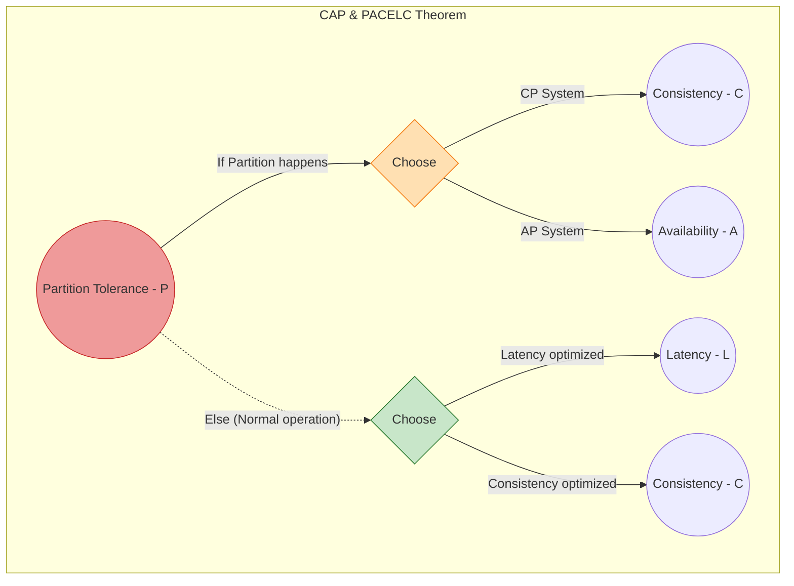
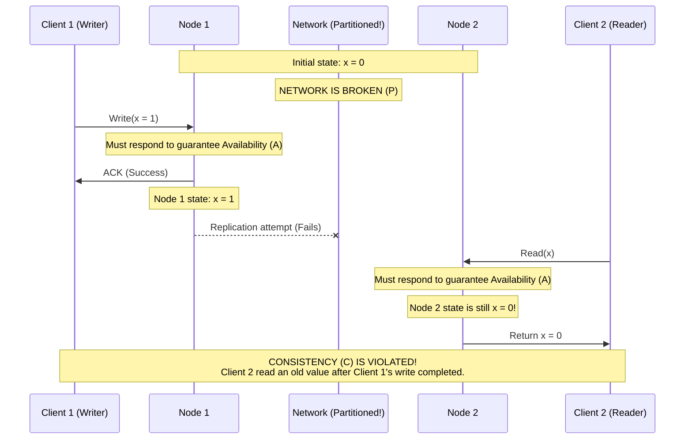
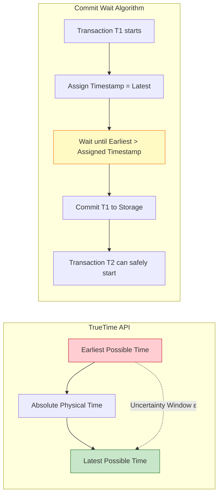

---
tags:
  - distributed-systems
  - cap-theorem
  - pacelc
  - spanner
  - consistency
  - architecture
aliases:
  - CAP Theorem
  - PACELC
  - Consistency Models
---
# L1.DST.02: CAP theorem, формулировка и ограничения интерпретации 
> [!abstract] О лекции
> На уровне Эксперта вы должны навсегда перестать повторять маркетинговую мантру джуниоров «выбери два из трех». Это грубое и опасное упрощение.
> Строгая математическая теорема (Gilbert & Lynch) гласит: **«В асинхронной сети с возможностью потери сообщений невозможно одновременно гарантировать Линеаризуемость (Linearizability) и Абсолютную Доступность (Availability)»**.
> Выбор архитектора при проектировании — это не статичная галочка в конфиге «CP» или «AP», а динамическое поведение вашей системы исключительно при наступлении события **Partition (P)**. В мирное же время (когда сеть работает нормально) вы торгуете вовсе не доступностью, а **Латентностью (Latency)** (что описывает теорема PACELC).

---
### 1. Строгая формулировка и доказательство (Gilbert & Lynch Proof)

В 2002 году исследователи Сет Гилберт и Нэнси Линч формально доказали гипотезу, выдвинутую Эриком Брюером в 2000 году. Они рассматривали **асинхронную сетевую модель** (Asynchronous Network Model). Это критически важное уточнение для физики процессов: в такой модели нет глобальных часов (Global Clock) и нет верхней границы (таймаута) времени доставки сообщения по сети.

Доказательство теоремы математически строится на противоречии трех фундаментальных свойств:

#### 1.1. P = Partition Tolerance (Устойчивость к разделению сети)
В инженерном обиходе это часто упрощают до примитивного "экскаватор порвал оптический кабель". Формально в Computer Science это **свойство физической среды (Environment Assumption)**, а не гарантия вашего софта.

*   **Определение:** Сеть может непредсказуемо терять *произвольное* количество пакетов (сообщений), отправленных от одного исправного узла к другому.
*   **Асинхронный контекст:** В асинхронной модели серверу невозможно математически отличить "соседний узел умер (Crash)" от "сосед работает, но сеть очень медленная" или "пакет потерялся". Обычные Таймауты (Timeouts) здесь не являются на 100% надежным детектором сбоя (см. FLP Impossibility).
*   **Следствие Архитектора:** Вы не можете "выбрать" или "не выбрать" букву P. Если ваша база данных распределена хотя бы по двум физическим серверам, вы **обязаны** закладываться на то, что сеть между ними может в любой момент начать вести себя как черная дыра.

#### 1.2. A = Availability (Доступность / Liveness Property)
В рамках теоремы CAP это свойство **живучести (Liveness)** алгоритма, а не бизнес-метрика.

*   **Строгое Определение:** Любой запрос к **исправному (non-failing)** узлу кластера должен обязательно завершиться корректным ответом (Response) за конечное время.
*   **Что это НЕ значит:** Это вовсе не ваш SLA 99.999% в дата-центре. Это требование *алгоритмической завершаемости* (Termination) вычисления.
*   **Что это значит на практике:** Ваш алгоритм (код) не имеет права бесконечно блокироваться (`wait`), ожидая ответа от другого узла, и не имеет права возвращать клиенту ошибку или игнорировать его запрос. Если узел жив и CPU крутится — он обязан ответить клиенту успешным результатом, даже если он абсолютно изолирован от других узлов кластера.

#### 1.3. C = Consistency (Atomic Consistency / Linearizability / Safety Property)
Это свойство **безопасности (Safety)**. Крайне важно: в CAP под буквой "C" понимается самый строжайший вид согласованности — **Линеаризуемость (Linearizability)**.

*   **Определение:** Вся распределенная система должна вести себя так, будто она является **одной единственной общей переменной** (Atomic Register), к которой доступ происходит строго последовательно.
*   **Формальное математическое условие:** Существует единый глобальный порядок всех операций в системе, который:
    1.  Полностью совпадает с реальным временем настенных часов (wall-clock time) для непересекающихся операций.
    2.  Если операция записи $W(x=v)$ успешно завершилась (клиент получил ACK) в момент времени $t_1$, то любая операция чтения $R(x)$, начавшаяся в любой момент $t_2 > t_1$ (даже на другом конце света), **жестко обязана** вернуть значение $v$ (или еще более новое значение, если была другая запись).
*   **Отличие от ACID:** В аббревиатуре транзакций ACID буква 'C' (Consistency) означает соблюдение бизнес-инвариантов базы данных (foreign keys, check constraints, баланс $> 0$). В теореме CAP буква 'C' означает актуальность (freshness) и синхронность данных на всех физических репликах.

---
### 1.4. Деконструкция доказательства (The Execution Trace)

Чтобы понять, почему невозможность абсолютна, рассмотрим минимальную систему.

*   **Дано:** Два узла: $N_1$ и $N_2$. Общий объект (регистр) $x$, начальное значение $x_0 = 0$.
*   **Событие:** Наступает событие **Partition (P)**: кабель между $N_1$ и $N_2$ перерезан экскаватором. Все пакеты теряются.

Теперь попробуем построить алгоритм, удовлетворяющий свойствам **A** и **C** одновременно в условиях **P**.

1.  **Шаг 1 (Write):** Внешний Клиент 1 отправляет запрос записи $x = 1$ на узел $N_1$.
    *   Так как наша система клянется гарантировать **Availability (A)**, узел $N_1$ *обязан* принять запись, сохранить её и вернуть подтверждение ("ACK") Клиенту 1 прямо сейчас, даже если он физически не может связаться с $N_2$.
    *   Если $N_1$ будет ждать восстановления связи, он нарушит свойство **A** (запрос зависнет и не завершится за конечное время).
    *   *Результат:* На $N_1$ теперь значение $x=1$. Клиент 1 получил "Success".

2.  **Шаг 2 (Read):** Сразу после получения ответа от $N_1$, Клиент 2 (или тот же самый Клиент 1) отправляет запрос чтения $x$ на узел $N_2$.
    *   Так как система гарантирует **Availability (A)**, узел $N_2$ *обязан* вернуть какой-то ответ немедленно. Он не имеет права заблокироваться и ждать связи с $N_1$.

3.  **Шаг 3 (Synchronization Failure - Разрыв синхронизации):**
    *   Из-за перерезанного кабеля **Partition (P)**, сообщение от $N_1$ с обновлением ("я только что записал 1") не дошло до $N_2$.
    *   Узел $N_2$ абсолютно ничего не знает о произошедшей записи. В его локальной RAM до сих пор лежит $x=0$.

4.  **Шаг 4 (Fatal Conflict):**
    *   Узел $N_2$ вынужден вернуть Клиенту 2 значение $x=0$.
    *   Это фатально нарушает свойство **Consistency (C)** (Линеаризуемость), так как операция чтения физически началась *после* того, как операция записи $x=1$ уже была подтверждена, но база данных вернула старое (stale) значение.

**Математический Вывод (Contradiction):**
В жестких условиях асинхронной сети с потерями (P), узел $N_2$ стоит перед фатальным, неразрешимым выбором:
*   Вернуть локальные данные сейчас (нарушить **C**, вернуть старое).
*   Ждать синхронизации с $N_1$ (нарушить **A**, заблокировать клиента до починки кабеля).
*   Одновременно удовлетворить обоим требованиям математически невозможно.

### 1.5. Почему это фундаментально важно для Senior Architect?

Это строгое доказательство вдребезги разрушает наивную иллюзию "мгновенной синхронизации". Как эксперт, вы понимаете:
1.  **Latency is Consistency's Cost (Задержка — это цена согласованности):** В "мирное время" (когда сеть P в порядке) задержка асинхронной репликации — это окно времени, в течение которого ваша система находится в несогласованном состоянии. Хотите строгую C? Платите ожиданием RTT (Round Trip Time) до кворума серверов.
2.  **Неявный выбор Архитектора:** Часто менеджеры говорят "нам не важна строгая консистентность, мы выбираем AP". Но если в вашей бизнес-логике есть уникальные ID (UUID генераторы), sequence numbers (счетчики) или CAS-операции (Compare-And-Swap), вы архитектурно **неявно требуете C**. В случае Split-Brain сети такие операции обязаны жестко падать (уходить в CP режим), иначе вы получите дубликаты первичных ключей, списания в минус или сломанную бизнес-логику.
3.  **Асинхронность нашего мира:** Мы физически живем в модели Гилберта-Линч. Абсолютно любая распределенная система, слепо полагающаяся только на таймауты для обеспечения корректности данных (Safety), теоретически уязвима, так как в асинхронной сети таймаут ничего не гарантирует (сеть может лагнуть на 5 минут). Именно поэтому в надежных Consensus алгоритмах типа Paxos/Raft таймауты используются исключительно для Liveness (выбора нового лидера), но **никогда** не используются для Safety (подтверждения записи на диск).

---
## 2. Анатомия невозможности: Глубокий анализ (Indistinguishability)

Доказательство Гилберта и Линч базируется на модели **асинхронной сети**. Это критически важно понять: в такой сети нет верхнего предела времени доставки пакета. Узел $N_2$ никогда не может знать наверняка причину молчания: узел $N_1$ сгорел (Crash), сеть разорвана экскаватором (Partition), или пакет просто идет очень долго (например, 10 секунд из-за тяжелой GC-паузы в Java или перегрузки буфера свитча).

### 2.1. Суть доказательства: Неразличимость состояний (Indistinguishability)

Здесь кроется вся математическая красота доказательства. Посмотрим на мир глазами изолированного узла $N_2$.

У $N_2$ есть два возможных, абсолютно легальных варианта реальности (World Views):
1.  **Мир А (Штатный):** Клиент ничего не писал в $N_1$. Значение регистра по-прежнему $v_0$. Сеть может быть разорвана, а может и нет — сообщений от $N_1$ просто не поступало.
2.  **Мир Б (Атака / Рассинхрон):** Клиент только что записал $v_1$ в $N_1$, $N_1$ ответил "ОК", но пакет с репликацией потерялся из-за Partition.

**Фундаментальная архитектурная проблема:**
В асинхронной модели с потерей сообщений входящий физический поток битов на сетевую карту узла $N_2$ в **Мире А** и в **Мире Б** **абсолютно идентичен** (ровно ноль пакетов от $N_1$).

Следовательно, код алгоритма на $N_2$ математически обязан действовать **детерминировано одинаково** в обоих этих случаях.
*   Чтобы быть корректным в **Мире А** (где записи реально не было), узел $N_2$ обязан вернуть клиенту $v_0$.
*   Но если он вернет $v_0$ в **Мире Б** (где запись $v_1$ уже завершилась на $N_1$), он фатально нарушит свойство **Linearizability** (чтение вернуло старое значение $v_0$ после успешного завершения записи $v_1$).

**Вывод:** $N_2$ физически не может отличить "штатную тишину" от "разрыва связи при живом обновлении соседа". Чтобы сохранить Availability (ответить клиенту хоть что-то), он вынужден отвечать своими локальными данными, что неизбежно нарушает Consistency при разрыве сети.

### 2.2. Пример для бизнеса: "Свадьба по телефону"

Чтобы объяснить этот парадокс не-техническому бизнесу или Product Manager'у, используйте эту аналогию.

*   **Участники:** Жених (Узел $N_1$) и Невеста (Узел $N_2$).
*   **Задача (Бизнес-инвариант):** Согласованно ответить "Да" (Consistency) или "Нет" на вопрос священника.
*   **Среда:** Они находятся в разных комнатах и могут общаться только по телефону.

**Ситуация (Partition P):** Телефонный кабель перерезан.

1.  Священник заходит к Жениху ($N_1$) и спрашивает: "Берете ли вы...?" (Write request).
2.  Жених говорит "Да". Он обязан ответить сразу (требование Availability), он не имеет права молчать вечно.
3.  Теперь Жених по закону считается "женатым" в своей комнате.
4.  Священник тут же идет в комнату к Невесте ($N_2$) и спрашивает: "Женат ли ваш партнер в соседней комнате?" (Read request).

**Дилемма Невесты (Алгоритма):**
*   Она не слышала ответа Жениха (Partition).
*   Если она скажет "Я не знаю, подождем пока починят телефон" или будет молчать — свадьба сорвана (нарушение **Availability**).
*   Если она скажет "Нет" (исходя из того факта, что 5 минут назад утром он был холост) — это ложь, так как он уже физически сказал "Да" (нарушение **Consistency**).
*   Если она угадает и скажет "Да" — это случайность, компьютерный алгоритм не может полагаться на бросок монетки.

В условиях полного отсутствия связи Невеста **физически не может** гарантировать согласованность своих ответов с Женихом, если она обязана отвечать на вопросы священника прямо сейчас.

### 2.3. Резюме для Архитектора

Доказательство Гилберта-Линч математически показывает, что выбор CP vs AP — это не выбор флага в конфигурационном файле базы данных. Это неизбежное следствие физических ограничений передачи информации со скоростью света.

*   Если вы (как бизнес) хотите **C** (чтобы Невеста знала точно и не врала), вы должны архитектурно запретить Жениху отвечать "Да", пока он по телефону не получит четкое подтверждение (ACK), что Невеста его услышала и записала (Протокол Two-Phase Commit). Но если кабель перерезан, Жених зависнет в ожидании -> потеря **A**.
*   Если вы хотите **A** (чтобы Жених отвечал священнику максимально быстро, не блокируясь), вы должны смириться с тем фактом, что Невеста какое-то время может не знать о смене его статуса и будет отвечать старыми данными -> потеря **C**.

---
## 3. Критика CAP и Теорема PACELC ("12 лет спустя")

В 2012 году автор теоремы Эрик Брюер опубликовал знаменитую статью *"CAP: Twelve Years Later: How the 'Rules' Have Changed"*, де-факто признав, что классическая мантра «выбери 2 из 3» стала сильно вредной для индустрии, так как она чрезмерно упрощает сложный архитектурный ландшафт и навязывает инженерам ложную дихотомию.

На смену пришла теорема **PACELC** (Daniel Abadi, 2010), которая гораздо точнее описывает реальность.
Расшифровка: **If Partition (P), how does the system trade off Availability (A) and Consistency (C)? Else (E), when the system is running normally, how does it trade off Latency (L) and Consistency (C)?**

Как эксперт, вы должны оперировать следующими четырьмя постулатами современной интерпретации.

### 3.1. "CA" системы — это опасная архитектурная иллюзия
Классическая, табличная трактовка CAP гласит: "CA-система — это система, которая согласована и доступна, но не устойчива к разделению сети (Partition)".
**Почему это ложь для распределенных систем:**
В любой распределенной системе (состоящей более чем из 1 узла) разделение сети ($P$) — это не опция в настройках, которую можно "выключить". Это фундаментальное свойство физической среды (сбои свитчей, перегрузка каналов, GC-паузы, которые для соседа выглядят как разрыв связи).
*   **Определение:** Отказ архитектора от поддержки $P$ означает, что при малейшей сетевой проблеме ваша система переходит в **неопределенное состояние** (undefined behavior) или падает целиком, теряя данные.
*   **Реальность:** Системы, гордо позиционируемые вендорами как "CA" (например, кластер Oracle RAC, или классическая монолитная SQL БД PostgreSQL с одним IP), на самом деле являются системами с **единой точкой отказа** (Single Point of Failure / SPOF). Они ведут себя как "CA" только до тех пор, пока сеть внутри дата-центра идеальна. Как только происходит малейший сбой сети, они вынуждены стать **CP** (остановить обслуживание запросов, уйти в read-only) или **AP** (начать принимать записи на обеих сторонах разрыва, порождая split-brain), но они физически не могут оставаться CA.
*   **Вердикт:** В серьезном контексте Distributed Systems категории CA не существует. Вы всегда проектируете систему с учетом обязательного наличия P.

### 3.2. Бинарность — зло: Спектр согласованности
Выбор между CP и AP — это не тумблер на этапе компиляции кода. Это широкий спектр, динамически управляемый настройками кворума (Read/Write Quorum) и вашей бизнес-логикой.

*   **Granularity (Гранулярность API):** CAP работает не на уровне всей гигантской системы ("весь бэкенд Facebook — это AP"), а на уровне одной конкретной бизнес-операции или подсистемы.
    *   *Пример:* В Amazon добавление товара в корзину — это жесткое **AP** (бизнесу важнее не потерять потенциальную выручку, чем обеспечить строгую синхронизацию, конфликты слияния корзин решатся потом в фоне). А вот списание реальных денег с кредитной карты в том же самом заказе — это абсолютное **CP** (строгая транзакционность, мы лучше покажем ошибку "Попробуйте позже", чем спишем дважды).
*   **Tunable Consistency (Настраиваемая согласованность):** В системах типа Dynamo (Apache Cassandra / Riak) вы сами выбираете баланс на каждый запрос:
    *   Если $Read + Write > Nodes$ (Строгий Кворум) -> вы получаете поведение, близкое к CP (вы платите высокой латентностью и недоступностью при падении части кворума).
    *   Если $Read + Write \le Nodes$ (Например $W=1, R=1$) -> вы получаете поведение AP (запись проходит мгновенно, система всегда доступна, но возможны stale reads - чтение устаревших данных).

### 3.3. Три фазы жизни системы (State Management Phases)
Брюер уточнил, что компромисс CAP актуален только и исключительно во время *самой* сетевой аварии. Архитектор обязан проектировать поведение системы в трех разных фазах:

1.  **Phase 1: Normal Operation (No Partition - Мирное время).**
    Здесь физически нет конфликта между C и A. Здесь работает вторая часть теоремы **PACELC**. Мы постоянно торгуемся и выбираем между сетевой задержкой (Latency) и согласованностью. Синхронная репликация (C) дает долгий ответ клиенту (L). Асинхронная репликация дает быстрый ответ, но есть окно потери данных.
2.  **Phase 2: Partition Mode (The Choice - Авария).**
    Сеть разорвана. Мы программно детектировали сбой. Здесь наступает жесткий выбор CAP:
    *   **CP-решение (Cancel/Wait):** Отклонить операцию записи (вернуть HTTP 503) или заблокировать чтение до восстановления кворума. *Пример: Apache HBase останавливает свой регион-сервер, если он теряет связь с Zookeeper.*
    *   **AP-решение (Proceed):** Принять запись клиента в локальный журнал (Commit Log), точно зная, что она пока не видна другим узлам кластера. Создать **Divergent State** (расходящееся, конфликтное состояние данных).
3.  **Phase 3: Partition Recovery (Consistency Restoration - Восстановление).**
    Это то, что часто упускают новички на системном дизайне. После восстановления физической сети AP-система обязана автоматически устранить все накопившиеся расхождения данных.
    *   **Механизмы слияния:**
        *   *Last-Write-Wins (LWW):* Грубо, просто по метке времени. Ведет к потере данных (Lost Update), но алгоритмически дешево.
        *   *CRDT (Conflict-free Replicated Data Types):* Математически гарантированное, бесконфликтное автоматическое слияние (счетчики, множества).
        *   *Vector Clocks / Version Vectors:* Сохранение всех версий конфликта и перекладывание ответственности за решение (Merge) на клиентское приложение (например, слияние веток в Git или корзины в Amazon).
    *   **Архитектурный Инсайт:** Главная инженерная сложность AP-систем лежит не в моменте самого сбоя, а в алгоритмической сложности моментов **восстановления** (Reconciliation costs и Anti-entropy repair).

### Пример для наглядности: "Свадьба и два зала"
Представьте, что вы (как координатор) ведете реестр подарков на свадьбе. Гости сидят в двух разных банкетных залах (Зал А и Зал Б), связь между которыми осуществляется только по телефону.

1.  **Сценарий:** Телефонная связь внезапно оборвалась (Partition P).
2.  **Действие:** Гость в Зале А хочет вычеркнуть дорогой "Тостер" из общего списка желаний (Write Operation).
3.  **Дилемма координатора (архитектора):**
    *   **Выбор CP:** Вы строго запрещаете гостю вычеркивать тостер, пока связь не починят. Гость сильно недоволен (System Unavailable), но вы железобетонно гарантируете, что в изолированном Зале Б никто случайно не купит и не подарит второй такой же тостер.
    *   **Выбор AP:** Вы разрешаете гостю вычеркнуть тостер в своем локальном блокноте Зала А. Гость счастлив. Но появляется огромный риск, что в Зале Б кто-то прямо сейчас тоже подарит тостер (Data Divergence / Double Spend).
4.  **Recovery (Фаза 3):** Когда телефонную связь чинят, вы сверяете блокноты и видите два подаренных тостера. Если это AP-система, вам нужен алгоритм (CRDT логика или волевое бизнес-решение тещи), кто именно пойдет сдавать тостер обратно в магазин.

---
## 4. Google Spanner: Атака на CAP через физику TrueTime 

Систему Google Spanner в прессе часто ошибочно называют магической базой данных, которая "победила" CAP-теорему и стала CA. На самом деле Spanner не нарушает законы физики, а меняет сами правила игры, превращая фундаментальную неопределенность времени в сетях (Time Uncertainty) в предсказуемую задержку для клиента (Latency).

### 4.1. Фундаментальная проблема: Относительность времени Эйнштейна
В классических распределенных системах (без Spanner) "время" — это понятие крайне относительное и опасное.
*   **Logical Clocks (Часы Лэмпорта / Векторные часы):** Отлично и надежно упорядочивают события *внутри* замкнутой системы, но абсолютно бессильны против причинно-следственных связей *вне* системы (out-of-band communication). Если клиент сделал заказ, позвонил другу по телефону, и друг сделал свой заказ, логические часы не смогут гарантировать порядок этих двух заказов.
*   **NTP (Wall Clocks / Кварцевые часы):** Ненадежны. Рассинхронизация (clock skew) между серверами в одном дата-центре может достигать сотен миллисекунд. Если сервер A ошибочно считает, что сейчас `12:00:01`, а сервер B (у которого отстали часы) считает — `12:00:00`, то транзакция T2 (на B) может получить timestamp *раньше*, чем транзакция T1 (на A), хотя физически в реальном мире T1 произошла раньше. Это ломает БД.

Spanner решает сложнейшую задачу обеспечения **External Consistency** (Внешней Строгой Согласованности) — математического свойства, которое еще строже, чем Linearizability.
> **Определение External Consistency:** Если транзакция $T_1$ полностью завершилась (committed) в физическом времени мира до того, как транзакция $T_2$ вообще началась, то назначенная временная метка $T_1$ должна быть математически строго меньше временной метки $T_2$ ($ts(T_1) < ts(T_2)$).

### 4.2. TrueTime API: Интервальное, а не точное время
Вместо того чтобы наивно притворяться, что операционная система знает точное время $t$, API TrueTime честно возвращает **интервал неопределенности**.

Вызов `TT.now()` возвращает структуру `{earliest, latest}`, аппаратно гарантируя, что реальное, истинное физическое время $t_{abs}$ находится строго внутри этого окна:
$$ TT.now().earliest \le t_{abs} \le TT.now().latest $$

Ширина этого интервала $\epsilon = latest - earliest$ (uncertainty window) зависит от колоссальной аппаратной инфраструктуры Google:
1.  **GPS-приемники:** Установлены на крышах дата-центров. Дают супер-точное время, но могут внезапно отказать (антенну сдуло ураганом, радиопомехи, spoofing).
2.  **Атомные часы (Rubidium / Cesium):** Стоят в стойках как резервный бэкап. Они абсолютно не зависят от внешней сети, но имеют физический дрейф (drift) со временем.
3.  **Daemon poll:** Служба на каждом сервере постоянно опрашивает набор Time Masters (GPS + Atomic).
**Уникальный Результат:** Google удается аппаратно удерживать окно неопределенности $\epsilon$ в пределах **1–7 мс** (в среднем 4 мс) по всей планете. Обычный интернет NTP дает разброс 100–250 мс.

### 4.3. Механизм Commit Wait (Мы платим Латентностью за Консистентность)
Это "магический" ингредиент базы Spanner. Чтобы железобетонно гарантировать External Consistency, Spanner **искусственно и преднамеренно замедляет** каждую операцию записи.

**Алгоритм записи:**
1.  Координатор распределенной транзакции выбирает метку времени для коммита в будущее: $S_{commit} = TT.now().latest$.
2.  **ЖЕСТКОЕ ПРАВИЛО ОЖИДАНИЯ (Commit Wait Rule):** Координатор **не имеет физического права** сообщить клиенту об успехе (ACK) и не имеет права применить данные в сторадж, пока не станет абсолютно, на 100% уверен, что выбранный момент $S_{commit}$ уже точно остался в прошлом.
3.  Координатор тупо блокируется и ждет, пока локальные часы не покажут момент времени, когда $TT.now().earliest > S_{commit}$.
4.  Только после этой паузы транзакция считается завершенной и ответ уходит клиенту.

**Пример (на пальцах для понимания):**
*   Пусть максимальная погрешность часов $\epsilon = 6$ мс.
*   Транзакция $T_1$ хочет закоммититься. Spanner запрашивает время и видит интервал `[100, 106]`.
*   Spanner назначает метку времени для $T_1 = 106$ (самый край).
*   **ЖДЕМ:** Система ставит поток на паузу и ждет, пока локальные часы не сдвинутся вперед так, чтобы гарантированное *минимальное* время стало больше 106. То есть, она ждет пока `TT.now()` не вернет интервал, например, `[107, 113]`.
*   Это ожидание длится минимум $2\epsilon$ (около 10–14 мс простоя CPU).
*   Теперь любая новая транзакция $T_2$, которая начнется физически *после* ответа клиенту о завершении $T_1$, гарантированно получит от API TrueTime интервал времени, который начинается строго *позже* 106. Хронологический порядок в БД сохранен навсегда.

### 4.4. Анализ Spanner через призму CAP и PACELC
Является ли Spanner сказочной CA-системой? **Технически и математически — НЕТ.** Это классическая, но сверхнадежная **CP** система.

1.  **Partition (P):** Если глобальная оптическая сеть Google разрывается (что случается крайне редко из-за многократного резервирования собственного Dark Fiber на дне океана), Spanner всегда бескомпромиссно выбирает **Consistency**. Пострадавшая часть кластера становится физически недоступной для записи (кворум Paxos не собирается), но данные никогда не расходятся (нет split-brain).
2.  **Availability (A):** Google в своих whitepapers заявляет "фактическую CA" (effectively CA). Доступность для клиентов составляет 99.999% не из-за нарушения законов математики, а исключительно из-за феноменальной избыточности железа и сети. Вероятность того, что *все* нужные реплики Paxos (обычно 5 штук, разбросанных в разных гео-зонах) станут недоступны одновременно, статистически ниже, чем вероятность прямого падения метеорита на дата-центр.
3.  **PACELC (Суровая реальность):** Вот где кроется истинная цена технологии.
    *   В случае нормальной работы (режим E - Else), Spanner всегда выбирает **L (Latency penalty)**.
    *   Система платит штраф (Wait Time в 10-15мс) при *абсолютно каждой* транзакции записи ради святой Consistency.
    *   Обычные реляционные базы данных (например, Postgres Async Replication) выбирают низкую латентность (C), рискуя потерять данные при сбое мастера. Spanner выбирает ждать.

### 4.5. Архитектурный вывод
Использование дорогих атомных часов (TrueTime) и паузы Commit Wait позволяет Spanner поддерживать **Globally Distributed Snapshot Reads** абсолютно без блокировок таблиц (Lock-free reads).
*   Вы можете сделать аналитический `SELECT *` по базе данных размером в Петабайты, которая размазана по трем континентам, и получить кристально чистый срез данных, который математически консистентен на конкретную микросекунду времени $T$, не заблокировав при этом ни одну операцию записи (Write).
*   Ни одна другая распределенная БД без аппаратной синхронизации времени (CockroachDB, YugabyteDB используют программную компенсацию software NTP clock skew) не может дать бизнесу таких строгих гарантий с таким низким оверхедом на координацию.

**Резюме для эксперта:** Spanner не "хакнул" законы CAP-теоремы. Он просто "купил" Consistency за счет гигантских денег (атомные часы в стойках) и времени (Commit Wait), сведя вероятность сетевой недоступности (Availability drops) к уровню статистической погрешности.

---
## 5. Иерархия моделей консистентности: Детальный разбор

В индустрии мы должны использовать строгую нотацию, принятую в академических кругах (работы Herlihy & Wing, Lamport, Viotti & Vukolić).

Для понимания архитектуры важно различать два совершенно ортогональных измерения консистентности:
1.  **Data-Centric (Свежесть и Глобальный Порядок):** Фундаментальные гарантии для всех параллельных процессов в системе (Linearizability, Sequential).
2.  **Client-Centric (Сессионные, пользовательские гарантии):** Гарантии для одного конкретного клиента/сессии (Read-Your-Writes, Monotonic Reads). Фокус на UX.

### 5.1. Strict Serializability (Золотой Грааль БД)
Это композитное объединение двух строгих понятий: **Serializability** (высший уровень изоляции из мира транзакций ACID) и **Linearizability** (свежесть данных из мира CAP / Распределенных систем).

*   **Определение:** База данных гарантирует, что распределенные транзакции выполняются так, будто они идут строго последовательно (одна за другой, без параллелизма), И этот итоговый порядок идеально соответствует реальному физическому времени.
*   **Что это значит для бизнеса:** Если клиентская транзакция $T_1$ успешно завершилась (Commit-Ack получен) в момент времени $t$, а другая клиентская транзакция $T_2$ началась в момент $t + \delta$ (хоть на миллисекунду позже), то транзакция $T_2$ **математически обязана** видеть все результаты работы $T_1$.
*   **Индустриальный Пример:** **Google Spanner**, **FoundationDB**, **FaunaDB**. Это единственная в природе модель, которая на 100% соответствует наивной интуиции человека ("если я сохранил форму в UI и увидел галочку, значит, следующий запрос в БД точно вернет эти данные").
*   **Цена Архитектуры:** Огромная латентность. Для этого нужна аппаратная синхронизация часов (Spanner) или прогон абсолютно всех чтений через тяжелый глобальный консенсус (Paxos/Raft на Read-операции), что убивает throughput.

### 5.2. Linearizability (Atomic Consistency) — та самая "C" в CAP
Это строгая модель, применяемая для **одиночных** объектов (регистров, атомарных счетчиков, ключей в KV-storage), а не для транзакций из многих таблиц.
*   **Определение:** Каждая распределенная операция математически происходит мгновенно в какой-то одной неуловимой точке времени между началом её вызова клиентом (Invocation) и моментом получения ответа (Response). Все операции над ключом выстраиваются в единую историческую линию, строго согласованную с реальным временем.
*   **Ключевое отличие от Strict Serializability:** Линеаризуемость не гарантирует транзакционной изоляции (ACID) между *группами* разных ключей. Она гарантирует свежесть только для *каждого* ключа по отдельности.
*   **Свойство локальности (Composability):** Если сложная система линеаризуема по каждому внутреннему объекту в отдельности, она автоматически линеаризуема в целом. (Свойство, которое не работает для Serializability).
*   **Пример использования:** **Etcd / ZooKeeper** (но только при строгом чтении через `quorum read`), чтение данных напрямую из узла `Master` в репликации Postgres (при условии наличия защиты от stale reads из-за скрытого split-brain).

### 5.3. Sequential Consistency (Последовательная согласованность)
Модель, предложенная Лесли Лэмпортом. Здесь мы отказываемся от жесткого требования привязки к "реальному физическому времени" (Wall-clock time), но свято сохраняем иллюзию "глобального порядка".
*   **Определение:** Результат выполнения системы для клиентов выглядит так, как если бы атомарные операции абсолютно всех процессоров выполнялись в каком-то едином последовательном порядке, и операции *каждого отдельного* клиента появлялись в этом логе строго в том порядке, в каком клиент их отправлял.
*   **Как это работает на пальцах:**
    *   Процесс A пишет в БД `X=1`.
    *   Процесс B параллельно пишет в БД `X=2`.
    *   В Sequential модели абсолютно легально и допустимо, чтобы **все** читатели в мире увидели сначала значение `2`, а потом `1` (даже если физически A нажал кнопку на секунду раньше, но пакет от B прилетел быстрее). Главное правило — чтобы **абсолютно все** реплики и клиенты увидели эту (пусть и странную) историю одинаково.
    *   *Важно:* В Linearizable модели такой финт недопустим, если запись `X=1` физически полностью завершилась до начала отправки `X=2`.
*   **Индустриальный Пример:** **ZooKeeper** (для быстрых локальных операций чтения). ZK гарантирует, что все апдейты (Writes) применяются ко всем репликам в строгом глобальном порядке (zxid), но обычное чтение клиента с локальной реплики (Follower) может вернуть "прошлое" (Stale Read, если реплика отстает от Мастера). То есть клиент всегда видит математически согласованную историю, но просто с небольшим отставанием во времени.

### 5.4. Causal Consistency (Причинная согласованность)
**Критически важный архитектурный уровень для Staff/Principal инженеров.** Это доказанный теоретический предел консистентности для любых распределенных систем, которые хотят оставаться физически доступными (Available) при разрыве сети (то есть для **AP** систем).

*   **Отношение Happens-Before (->):** Математическое отношение причинности (Causality). Событие $A$ является причиной $B$, если:
    1.  Они происходят в одном потоке/сессии, и $A$ выполнилось раньше $B$.
    2.  $A$ — это операция записи, а $B$ — это операция чтения, которая успешно увидела результат $A$.
    3.  Работает Транзитивность (A -> B, B -> C, значит A -> C).
*   **Определение Системы:** БД аппаратно гарантирует, что если $A 	o B$, то абсолютно все узлы кластера сначала применят (увидят) $A$, и только потом $B$. События, никак не связанные причинностью (Concurrent - сделанные параллельно), разные узлы могут применять в совершенно любом, разном порядке.
*   **Бизнес-Пример (The "Comments" problem в Соцсетях):**
    *   Юзер Алиса выкладывает фото на сервер (Operation A).
    *   Юзер Боб видит это фото в ленте и пишет коммент "Круто!" (Operation B). Значит, математически $A 	o B$ (коммент вызван фотографией).
    *   **В Causal системе:** Алгоритм гарантирует, что ни один пользователь в мире (ни на одной реплике) физически не сможет увидеть комментарий Боба, пока БД не реплицирует к нему саму фотографию Алисы. Логика диалога сохранена.
    *   **В слабой Eventual системе:** Вполне возможно, что маленький пакет с текстовым комментом по сети приедет на реплику в Австралию быстрее, чем тяжелая фотография. Австралийцы увидят абсурд: коммент Боба висит под пустой областью без фото.
*   **Реализации в Проде:** Протокол **COPS**, **Mongo DB** (с включенной опцией Causal Consistency в клиентских сессиях), многие умные CRDT-системы пытаются эмулировать это поведение.

### 5.5. Session Guarantees (Сессионные модели / Client-Centric)
Это максимально практический (Client-centric) взгляд на Eventual Consistency со стороны UX/UI инженеров. Если мы не можем дать глобальной правды для всего мира (дорого), давайте обеспечим комфорт хотя бы **одному конкретному пользователю** в рамках его личной HTTP-сессии.

1.  **Read-Your-Writes (Читай свои записи):** Жесткая гарантия UX. Если я (пользователь) нажал кнопку "Сохранить профиль" (записал $X$), то следующее обновление страницы (мое чтение $X$, даже если балансировщик кинул меня на другую, отстающую реплику БД) гарантированно вернет мне мое новое значение, а не старое.
    *   *Архитектурная реализация:* Версионирование кук (передача Vector Clock в HTTP Header), Sticky Sessions (балансировщик всегда кидает юзера на один и тот же сервер).
2.  **Monotonic Reads (Монотонное чтение):** Если пользователь один раз увидел версию базы $X_n$, он никогда больше (при рефреше страницы) не увидит старую версию $X_{n-1}$ (субъективное время для клиента не может идти вспять).
    *   *Бизнес-Проблема без гарантии:* Юзер обновил ленту новостей (балансировщик попал на быструю реплику мастера), увидел новый горячий пост. Нажал F5 (балансировщик кинул на отстающую реплику-follower), новый пост мистически исчез. Пользователь думает, что пост удалили. Monotonic Reads на уровне драйвера БД запрещает такие прыжки в прошлое.

### 5.6. Strong Eventual Consistency (SEC)
Категорически не путать с обычным слабым Eventual (В конечном счете).
*   **Обычная Eventual Consistency:** Слабое обещание: "Если поток новых записей полностью прекратится на пару минут, то *рано или поздно* все реплики в кластере сойдутся к одному значению". Как именно они сойдутся при конфликте — неизвестно (банальный Last-Write-Wins по таймстемпу может безжалостно затереть (потерять) важные данные клиента).
*   **Strong Eventual Consistency (SEC):** Идеальная конвергенция состояния гарантирована математически, **без какой-либо потери данных** и абсолютно без необходимости синхронной координации узлов (без блокировок).
*   **Инструмент Реализации:** **CRDT** (Conflict-free Replicated Data Types - Бесконфликтные типы данных). Для этих структур порядок доставки пакетов по сети не имеет значения. Все операции слияния коммутативны (A+B = B+A) и идемпотентны.
*   **Пример использования:** Глобальный счетчик лайков YouTube, Riak DT, совместное редактирование документов (Google Docs, Figma), Redis Enterprise (режим Active-Active репликации).

---
### Итоговая Архитектурная Таблица для принятия решений

| Модель Консистентности | Доступность при Разрыве Сети (Partition)? | Performance Cost (Цена по CPU/Latency) | Типичный Use Case в Индустрии |
| :--- | :--- | :--- | :--- |
| **Strict Serializability** | Нет (Чистый CP) | Экстремально высокая (2PC протокол, Paxos, Атомные часы) | Финансовые Core-транзакции, Глобальные инвентари складских остатков (Google Spanner). |
| **Linearizability** | Нет (Чистый CP) | Высокая (Нужен Кворум на Чтение и Запись) | Координаторы кластеров, Выборы Лидера, Распределенные локи (Etcd / Consul). |
| **Sequential** | Нет (Обычно CP) | Средняя (Допускается быстрое асинхронное чтение) | Глобальные очереди сообщений, Системы конфигурации серверов (Apache ZooKeeper). |
| **Causal** | **Да (Мощный AP)** | Низкая (Оверхед только на передачу графа метаданных) | Социальные сети, Комментарии, Чаты (везде, где важен контекст диалога). |
| **Eventual (Read-Your-Writes)**| **Да (Классический AP)** | Очень Низкая | Профиль пользователя, Настройки темы интерфейса, Корзина покупок (Amazon). |
| **Strong Eventual (CRDT)** | **Да (Математический AP)** | Низкая (Требует много памяти под метаданные CRDT) | Совместное редактирование (Google Docs), Распределенные счетчики лайков. |

### Вывод Системного Эксперта
Когда бизнес-заказчик говорит "нам на проекте нужна 100% консистентность", вы как архитектор должны уточнять: "Вам нужна строгая глобальная упорядоченность всех событий в мире (Linearizability), или для вашего бизнес-процесса достаточно просто соблюдения логических причинно-следственных связей (Causal)?". Осознанный архитектурный переход (Downgrade) от Linearizability к Causal дает кластеру колоссальный выигрыш в отказоустойчивости (Availability) и скорости ответа (Latency), при этом визуально совершенно не ломая UX для конечного пользователя.

---
## 7. Чек-лист Архитектора уровня Expert (Для собеседований)

1.  **Смерть от Split-Brain:** Что такое феномен Split-Brain в контексте CAP теоремы?
    *   *Ответ Эксперта:* Это катастрофическая ситуация Partition (P), когда кластер (например, из 4 узлов) разорвался оптикой ровно на две равные части (50/50), и обе эти части ошибочно считают именно себя главными. Строгая CP система по правилам обязана самоликвидироваться (остановить запись) в меньшем сегменте, но в ситуации 50/50 это математически невозможно решить без внешнего Tie-breaker (третьего узла-арбитра).
2.  **Тестирование Jepsen:** Знакомы ли вы с фундаментальными работами Кайла Кингсбери (Kyle Kingsbury) и его фреймворком Jepsen?
    *   *Ответ Эксперта:* Любой Senior Архитектор обязан знать, что подавляющее большинство модных NoSQL/SQL баз данных, громко заявляющих в рекламе о Strong Consistency (CP), на практике с треском проваливают хардкорные тесты Jepsen (возвращают stale reads или втихую теряют writes) при эмуляции реальных сетевых партиций `iptables`. Маркетинговые заявления вендоров о "базе данных класса CA" — это всегда ложь.
3.  **Read-repair vs Read-only:**
    В типичной AP системе (например, Apache Cassandra) при партиции (P) данные неизбежно расходятся на разных репликах. Как именно архитектура восстанавливает Консистентность (C) после починки сети?
    *   *Ответ Эксперта:* Используются механизмы: *Hinted Handoff* (сосед сохраняет данные для упавшего узла), *Read Repair* (при операции `SELECT` координатор замечает рассинхрон реплик по хэшам и чинит отставшую в фоне) и тяжелый *Anti-Entropy Repair* (сравнение гигантских Merkle Trees в фоновых джобах). В строгой CP системе (Zookeeper) процесс восстановления на порядок проще: отставший узел просто накатывает недостающий кусок лога (WAL) от текущего Лидера.
4.  **Сравнение Consistency vs Isolation:** Часто ли инженеры путают CAP-Consistency (Буква C) и ACID-Isolation (Буква I)?
    *   *Ответ Эксперта:* Линеаризуемость (C в теореме CAP) — это физическая метрика про гарантию работы с *одним конкретным* объектом и "свежесть" репликации его данных в кластере. Сериализуемость (I в аббревиатуре ACID) — это логическая метрика про атомарность сложных *транзакций*, состоящих из множества операций над разными таблицами, чтобы они не мешали друг другу. Строжайший уровень в индустрии — **Strict Serializability** (Spanner, FoundationDB) — гармонично объединяет оба этих сложнейших понятия.

### Итоговое Заключение
Глубокое понимание теоремы CAP на уровне эксперта сводится не к заучиванию аббревиатур, а к прагматичному **управлению рисками распределенных систем**.
Вы, как Архитектор, никогда не выбираете просто "две буквы" из трех. Вы математически проектируете механизм **Consensus** (алгоритмы Paxos/Raft) для ваших строгих CP-сценариев (где деньги и биллинг), или проектируете механизм **Conflict Resolution** (типы CRDT или LWW) для ваших быстрых AP-сценариев (корзины, кэши, лайки), четко и ясно осознавая цену задержки (Latency), которую ваша система ежедневно платит в "мирное время" (согласно теореме PACELC).