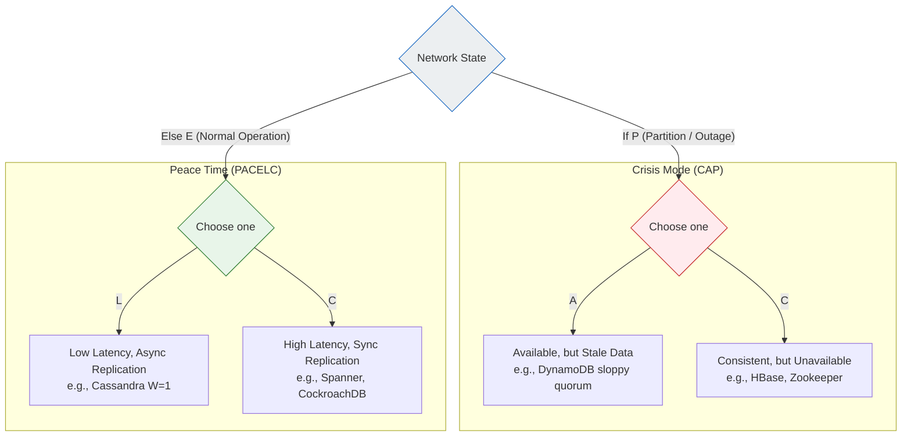
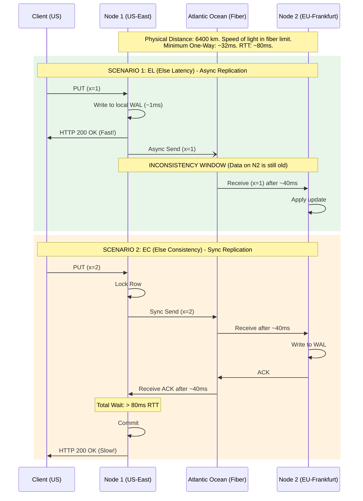

---
tags:
  - distributed-systems
  - pacelc
  - cap-theorem
  - latency
  - consistency
  - architecture
aliases:
  - PACELC Theorem
  - Latency vs Consistency
---
# L1.DST.03: PACELC - latency vs consistency tradeoffs 

> [!abstract] О лекции
> **CAP-теорема** — это исторический, и во многом уже маркетинговый лозунг 2000-х годов, который описывает жесткое поведение распределенной системы только и исключительно во время сетевой аварии (Partition). Но современные системы работают в штатном режиме (без аварий) 99.99% времени.
> **PACELC** — это реальный, повседневный математический инструмент Staff-архитектора для принятия тяжелых решений в мирное время. Он бескомпромиссно утверждает: даже когда сеть работает идеально (Else), вы физически обязаны выбирать между **L (Latency - Скоростью)** и **C (Consistency - Согласованностью)**. Вы математически не можете мгновенно (Latency -> 0) синхронизировать данные между дата-центром в Вирджинии и во Франкфурте. Физику и скорость света в оптоволокне обмануть невозможно.

---

Эта эпохальная для индустрии теорема была предложена Дэниелом Абади (Daniel Abadi) в 2010 году (спустя 10 лет после CAP), чтобы исправить ограниченность и "однобокость" классической CAP-теоремы.

## 1. PACELC: Глубокая расшифровка и физический смысл

Теорема PACELC — это не просто лексическое расширение CAP. Это строго формализованное дерево принятия архитектурных решений, описывающее поведение базы данных в двух принципиально разных состояниях физического мира.

Формула читается как классический тернарный условный оператор в коде:
$$ 	ext{System Behavior} = 	ext{IsPartitioned} \ ? \ ( 	ext{Availability} : 	ext{Consistency} ) \ : \ ( 	ext{Latency} : 	ext{Consistency} ) $$

Разберем каждую ветку с точки зрения системного архитектора.

### 1.1. Ветка "If P" (Crisis Mode - Режим Аварии)
**P = Partition (Сетевое разделение / Изоляция).**
Это состояние, когда узлы системы физически не могут общаться друг с другом по сети.
*   *Важное уточнение Архитектора:* Для распределенной системы состояние "Partition" — это далеко не только перерезанный трансатлантический кабель. Это **абсолютно любая** причина, по которой ноды не слышат друг друга дольше, чем настроенный `heartbeat_timeout`.
    *   Глубокая GC Pause (Stop-the-world) в JVM на 30 секунд — это Partition для остальных нод.
    *   Экстремальная перегрузка CPU на лидере (он не успевает отвечать на пинги) — это Partition для фолловеров.
    *   Баг BGP-маршрутизации или сбой ToR свитча в стойке — это Partition.

В этот критический момент вы стоите перед жестоким выбором:

*   **A = Availability (Приоритет Доступности).**
    *   *Философия бизнеса:* "The Show must go on" (Бизнес не должен стоять).
    *   *Поведение системы:* Система упрямо продолжает принимать операции записи (`Writes`) и чтения (`Reads`) на абсолютно всех живых сторонах "баррикады", даже если эти стороны полностью отрезаны друг от друга и не могут синхронизироваться.
    *   *Архитектурная Цена:* **Split Brain (Расщепление мозга) и Конфликты**. В сегменте дата-центра А пользователь купил последний билет на самолет. В отрезанном сегменте Б другой пользователь купил *тот же самый* последний билет (потому что счетчик билетов не синхронизировался). После восстановления сети вам придется мучительно решать бизнес-конфликты (Merge conflicts), и одному из клиентов придется возвращать деньги со скандалом.
    *   *Пример:* Корзина в интернет-магазине Amazon. Для них лучше продать товар (записать в локальную реплику) и потом извиниться за отмену, чем показать клиенту 503 ошибку и навсегда потерять выручку.

*   **C = Consistency (Приоритет Согласованности).**
    *   *Философия бизнеса:* "Не навреди" (Primum non nocere). Лучше ничего не делать, чем сделать ошибку.
    *   *Поведение системы:* Система аппаратно обнаруживает, что сетевой кворум больше не собирается (или глобальный лидер недоступен), и **жестко блокирует все операции записи** (а в строгих системах — иногда и чтения). Она возвращает ошибку 500 или висит до срабатывания тайм-аута у клиента.
    *   *Архитектурная Цена:* **Downtime (Простой)**. Бизнес полностью стоит, деньги не идут, пользователи в ярости, но зато исторические данные гарантированно не разъехались.
    *   *Пример:* Банковский процессинг (Core Banking). Категорически нельзя допустить, чтобы с одного счета сняли деньги дважды в разных изолированных дата-центрах.

---
### 1.2. Ветка "Else E" (Normal Mode - Мирное время)
**E = Else (Штатный режим работы).**
Это идеальное состояние, когда сеть работает, пакеты ходят без потерь, лаги в пределах физической нормы. В этом состоянии хорошая система проводит 99.99% своего времени жизни. Именно здесь классическая CAP-теорема стыдливо молчит, а теорема PACELC начинает диктовать жесткие правила.

Здесь фундаментальный выбор архитектора происходит между **Latency** (Скоростью ответа клиенту) и **Consistency** (Абсолютной свежестью данных на всех физических узлах кластера). Этот выбор аппаратно определяется **типом и настройками вашей репликации**.

*   **L = Latency (Приоритет экстремально низкой задержки).**
    *   *Аппаратный Механизм:* **Асинхронная репликация (Fire-and-forget)**.
    *   *Алгоритм работы:*
        1.  Пришел HTTP запрос `PUT` от клиента.
        2.  Узел записал данные в свой локальный журнал (WAL) на *одной* своей ноде.
        3.  Узел **мгновенно** ответил клиенту `200 OK`.
        4.  Где-то в фоне, асинхронно, ОС отправляет эти новые данные по сети на другие реплики.
    *   *Результат для бизнеса:* Минимально возможная задержка (local disk write speed, $< 1$ мс).
    *   *Жертва (Цена):* **Stale Reads (Чтение старых данных) и риск потери**. Если клиент запишет данные на ноду А, а через 1мс сделает F5 и прочитает с ноды Б — он не увидит своей собственной записи (баг Read-Your-Writes). Если нода А сгорит вместе с диском до фоновой репликации — данные, за которые мы уже ответили "ОК", потеряны навсегда. Данные здесь строго "eventually consistent".

*   **C = Consistency (Приоритет абсолютной согласованности).**
    *   *Аппаратный Механизм:* **Синхронная репликация (Кворум)**.
    *   *Алгоритм работы:*
        1.  Пришел HTTP запрос `PUT`.
        2.  Лидер записывает себе и синхронно отправляет пакеты данных на другие реплики.
        3.  Лидер аппаратно **блокирует поток и ждет** подтверждения (ACK) от сетевого кворума (или от всех).
        4.  И только физически получив ACK по сети, отвечает клиенту `200 OK`.
    *   *Результат для бизнеса:* Железобетонная математическая гарантия того, что любой следующий `GET` запрос к любой ноде вернет именно эти свежие данные (Linearizability).
    *   *Жертва (Цена):* **High Latency (Тормоза)**. Время ответа клиенту теперь неминуемо включает RTT (Round Trip Time) по оптоволокну до самой медленной необходимой реплики. Если реплика находится в другом гео-регионе — это долгие десятки и сотни миллисекунд простоя.

---
### 1.3. Иллюстративный пример: "Лимит кредитной карты" (Гео-распределение)

Представьте глобальную банковскую систему с серверами баз данных в **Лондоне** и **Нью-Йорке**.
У вас на карте строгий кредитный лимит $1000.
Вы находитесь в Лондоне, ваша жена с дубликатом карты в Нью-Йорке. Вы абсолютно одновременно прикладываете карты к терминалу, пытаясь купить что-то за $900.

#### Сценарий 1: База данных настроена как PA / EL (DynamoDB style)
*   **Ситуация Мира (E - Else):** Сеть под океаном работает, пинг 80мс.
    *   *Выбор L (Latency):* Вы платите в Лондоне. Лондонский сервер пишет транзакцию локально (-$900) и мгновенно говорит терминалу "ОК". Жена платит в НЙ. НЙ сервер пишет локально (-$900) и мгновенно говорит "ОК" (не связываясь с Лондоном ради скорости).
    *   *Катастрофический Итог:* Вы потратили $1800 при жестком лимите в $1000. Банк попал на технический овердрафт. Асинхронная репликация дойдет друг до друга позже и покажет отрицательный баланс -$800.
*   **Ситуация Аварии (P - Partition):** Оптический кабель на дне Атлантики перерезан якорем.
    *   *Выбор A (Availability):* Обе транзакции точно так же проходят успешно в своих изолированных дата-центрах. Конфликт двойной траты (Double Spend) будет мучительно решаться вручную операционистами банка на следующий день.

#### Сценарий 2: База данных настроена как PC / EC (CockroachDB / Spanner style)
*   **Ситуация Мира (E - Else):** Сеть работает, пинг 80мс.
    *   *Выбор C (Consistency):* Вы платите в Лондоне. Лондонский сервер (допустим, он Мастер) шлет синхронный запрос в НЙ ("Подтверди списание"). Ждет долгие 80мс (свет летит по кабелю). Получает ОК. Вы ждете у терминала лишнюю секунду, но транзакция проходит.
    *   Жена через секунду пытается заплатить. НЙ сервер видит, что лимит уже исчерпан (благодаря строгой синхронизации). Отказ в терминале.
    *   *Итог:* Капитал Банка в абсолютной безопасности. Вы платите за эту безопасность своим личным временем ожидания у кассы (Latency).
*   **Ситуация Аварии (P - Partition):** Трансатлантический кабель перерезан.
    *   *Выбор C (Consistency):* Вы пытаетесь заплатить. Лондонский сервер пытается связаться с НЙ, но не может получить сетевой кворум. Он отваливается по таймауту.
    *   *Итог:* Ваш терминал пишет "Declined / System Error". Никто на планете не может потратить деньги с этого счета, пока инженеры не восстановят связь между континентами. Система недоступна (Unavailable), но строго консистентна.

---
### Главное Резюме для Архитектора

1.  **Теорема CAP** учит нас экстремальному поведению только в аварии (P): ты либо жестко тормозишь бизнес (CP), либо осознанно рискуешь целостностью данных клиентов (AP).
2.  **Теорема PACELC** добавляет горькую правду жизни (E): даже когда всё работает хорошо, ты либо заставляешь пользователя страдать и ждать (EC), либо иногда лжешь ему, показывая устаревшие данные (EL).
3.  В природе физически **не бывает** распределенной системы "AC" (Available + Consistent) в присутствии угрозы P. И физически **не бывает** системы "LC" (Low Latency + Consistent) в присутствии физического географического расстояния между серверами.

---
## 2. Спектр систем по PACELC: Разбор движков БД

На уровне Staff/Principal Engineer вы обязаны понимать, что красивые буквы "PA/EL" или "PC/EC" в презентации вендора — это не просто строчка в документации, а прямое следствие фундаментального низкоуровневого выбора алгоритма консенсуса и топологии репликации в ядре БД.

### 2.1. Группа "Максимальная выживаемость" (PA / EL)
**Яркие Представители:** Apache Cassandra, ScyllaDB, Amazon DynamoDB (в стандартном режиме), Riak.

Эти системы архитектурно спроектированы под лозунгом: **"Операция записи (Write) должна быть принята системой любой ценой, несмотря ни на что"**. Даже если дата-центр горит, а сетевые кабели перерезаны экскаватором, `INSERT` от пользователя должен пройти.

*   **Аппаратная Механика (Under the hood):**
    *   **Leaderless Topology (Master-master / Кольцо):** Абсолютно любая нода в кластере может равноправно принять клиентскую запись (выступить как Coordinator Node). В архитектуре нет единой точки отказа (SPOF) и нет единого узкого горлышка.
    *   **Sloppy Quorum (Мягкий кворум / Подмена):** Если "родные" реплики, математически ответственные за этот ключ, недоступны (упали или Partition), запись всё равно не отбрасывается. Она сохраняется на *абсолютно любой* другой доступной ноде кластера с пометкой в метаданных: "Я сохраню это для соседа, передать владельцу, когда он вернется в строй".
    *   **Hinted Handoff (Передача подсказок):** Это именно тот инженерный механизм, который физически обеспечивает букву **A** (Availability) в PA. Временная нода-спаситель бережно хранит "подсказку" (hint) на диске и в фоне постоянно пингует и пытается отдать эти данные воскресшей родной ноде.
*   **Trade-off Архитектора (Чем мы жертвуем):**
    *   **EL (Else Latency):** В нормальном режиме мы пишем байты в память (`memtable`) + на быстрый диск (`WAL`) и сразу отвечаем клиенту, вообще не дожидаясь сетевой синхронизации всех реплик. Это дает потрясающий, стабильный миллисекундный отклик (Ultra Low Latency).
    *   **Грязное чтение (Stale Reads):** Поскольку свежая запись ушла на временную ноду (или только на 1 из 3 нужных), клиент, читающий с другой реплики, неизбежно увидит старые данные.
    *   **Read Repair (Ремонт при чтении):** Система чинит рассинхрон данных "лениво" — только в тот момент, когда кто-то физически пытается их прочитать (или тяжелым фоновым процессом Anti-Entropy / сканированием Merkle Trees).
*   **Идеальный Архитектурный кейс:**
    Вы строите гигантскую систему сбора телеметрии IoT (Интернет вещей) со смарт-счетчиков. Миллионы датчиков шлют данные непрерывно 24/7. Если БД "затупит" (высокий Latency) или отклонит запись из-за сбоя сети (CP), пакет данных потеряется навсегда (у тупого датчика нет буфера RAM для ретраев).
    *   *Ваш осознанный выбор:* **PA/EL**. Лучше криво записать показания на "случайную соседнюю" ноду и потом в фоне разобрать конфликты, чем безвозвратно потерять показания.

### 2.2. Группа "Истина превыше всего" (PC / EC)
**Яркие Представители:** Apache HBase, Google BigTable, CockroachDB, YugabyteDB, TiDB, etcd, Zookeeper.

Эти системы сурово живут по принципу: **"Лучше отказать клиенту в обслуживании (HTTP 503), чем соврать ему или записать мусор"**.

*   **Аппаратная Механика (Under the hood):**
    *   **Strong Leadership (Строгое Лидерство):** У каждого шарда данных (Range / Region) есть математически строго один уникальный Лидер (Leaseholder). Абсолютно все операции записи в этот кусок данных идут *только и исключительно* через него.
    *   **Consensus Algorithms (Raft / Paxos / Multi-Paxos):** Чтобы операция записи считалась успешной и закоммиченной, Лидер обязан отправить пакеты и получить сетевое подтверждение (ACK) от абсолютного большинства (Majority / Quorum) своих фолловеров.
*   **Почему это PC (Partition-Consistent)?**
    *   Если Лидер внезапно оказывается отрезан сетью от своего кворума (Network Partition), он по протоколу обязан **самоустраниться** (step down) или просто перестает принимать новые записи, так как не может собрать голоса большинства.
    *   Система мгновенно становится **Unavailable** (недоступной) для записи в этот конкретный шард на время перевыборов нового лидера (Election timeout, что в Raft занимает 1-3 секунды, а в ZooKeeper может занимать до 10 секунд). Ограниченное чтение может быть доступно (если бизнес разрешил stale reads), но запись — категорически нет.
*   **Почему это EC (Else-Consistency)?**
    *   В нормальном, штатном режиме работы (Else) мы жестоко жертвуем **Latency**. База не имеет права ответить клиенту "ОК", пока байты данных не пройдут Network Round Trip Time (RTT) по сети до фолловеров и физически не запишутся там на диск (fsync).
    *   *Цена:* Latency записи всегда жестко ограничена снизу законами физики: $	ext{Latency} \ge RTT / 2$ (время полета сигнала туда и обратно).
*   **Идеальный Архитектурный кейс:**
    Биллинг, ядро платежной системы, строгая инвентаризация остатков ("сколько iPhone 15 реально осталось на складе").
    Если сеть дата-центра моргнула, вы не можете продать один и тот же дорогой телефон дважды двум разным людям. Вы как бизнес готовы заставить пользователя подождать лишние 3 секунды (или даже показать обидную ошибку "Сервер перегружен, попробуйте позже"), но категорически не допустить отрицательного остатка на балансе.

### 2.3. Группа "Хамелеоны" (Tunable Consistency - Ручная настройка)
**Яркие Представители:** MongoDB, Apache Kafka, Elasticsearch.

Это самая опасная и коварная категория для неопытного архитектора, потому что поведение всей системы целиком и полностью зависит от маленького конфига `client-side` (в драйвере кода), который легко может поменять Junior-разработчик.

*   **MongoDB:**
    *   `WriteConcern: 1` -> Поведение **PA/EL**. Мы получаем радостный ACK сразу после записи в RAM/Журнал на одном праймари. Если праймари сгорит до репликации — данные клиента безвозвратно потеряны. Зато скорость феноменальная.
    *   `WriteConcern: Majority` -> Поведение **PC/EC**. Праймари блокирует клиента и ждет кворум от secondary узлов. Это медленно (RTT), но железобетонно гарантирует сохранность при любом Partition.
    *   *Архитектурная Ловушка:* Разные микросервисы в вашей компании могут по ошибке писать в одну и ту же коллекцию Mongo с абсолютно разными уровнями `WriteConcern`, создавая невидимый хаос в гарантиях надежности данных.
*   **Apache Kafka:**
    *   `acks=0` (Fire and forget) -> Экстремальный **EL**. Нулевая латентность, сеть работает как UDP. Огромный риск потери пакетов.
    *   `acks=all` + параметр `min.insync.replicas=2` -> Поведение **PC/EC**. Поток продюсера блокируется намертво, пока байты не будут физически записаны на всех здоровых репликах из списка ISR (In-Sync Replicas). Если живых реплик в кластере останется меньше, чем `min.insync`, Kafka **откажет** в записи (Availability sacrificed ради Safety).

### 2.4. Группа "Иллюзионисты" (PA / EC ?)
**Представители:** Google Spanner, FaunaDB, Azure Cosmos DB (на уровне Strong consistency).

Эти системы, созданные гениальными инженерами, пытаются "обмануть" теорему PACELC, используя сверхбыстрые приватные оптические сети и кастомное дорогое железо.

*   **В чем заключается трюк?** Математически и формально они строго относятся к группе **PC/EC** (так как внутри это системы на базе жесткого консенсуса Paxos/Raft). Но их Latency в штатном режиме (L) благодаря железу настолько мала, а окна простоя при сетевом Partition (A) настолько статистически редки (из-за резервирования кабелей), что для конечного API-пользователя они визуально выглядят как мифические системы, у которых "есть вообще всё и сразу".
*   **Google Spanner:** Использует API **TrueTime** (аппаратные атомные часы в каждой стойке), чтобы радикально уменьшить математическое время простоя при ожидании синхронизации распределенных транзакций.
*   **Azure Cosmos DB:** Уникально предлагает разработчику целых 5 гранулярных уровней консистентности (от Strong до Eventual), позволяя вам плавно и осознанно двигать ползунок компромисса PACELC прямо в Runtime через API.

---
### Главное Резюме для Архитектора

Когда вы проектируете систему и выбираете базу данных, никогда не смотрите на глянцевые маркетинговые буклеты вендоров. Смотрите под микроскопом на **Write Path (Путь записи байтов)**:

1.  **Кто именно в кластере принимает запись?**
    *   Если Любой узел (Leaderless) -> готовьтесь к архитектуре **PA/EL**, неизбежным математическим конфликтам версий и необходимости тюнить Read Repair.
    *   Если Строго только Лидер -> готовьтесь к архитектуре **PC/EC**, простоям в 5 секунд при выборах нового лидера и физически высокому Latency на запись через океан.
2.  **В какой именно наносекунде возвращается ACK клиенту?**
    *   Сразу после записи в RAM/WAL одной ноды -> Вы выбрали **L** (Latency optimized), но приняли бизнес-риск потери данных при крахе.
    *   Только после репликации и `fsync` на $N$ нод -> Вы выбрали **C** (Consistency optimized), смирившись с высоким Latency.

PACELC — это не про то, какая база данных "лучше" или "хуже". Это про то, **где именно у вас будет болеть в проде**: в скорости ответа недовольному пользователю (L) или в сложности ручной алгоритмической обработки конфликтов расходящихся данных (C).

---
## 3. Физика процесса: Почему жесткий выбор L vs C абсолютно неизбежен?

В отличие от CAP-теоремы, где буква "P" (Partition) — это *исключительное аварийное* состояние (которое может случиться раз в год), выбор между L (Latency) и C (Consistency) в теореме PACELC происходит в **абсолютно каждую миллисекунду** нормальной, штатной работы вашей распределенной системы.

Это не проблема "плохо написанного кода", "старой версии базы" или "медленного сборщика мусора в Java". Это прямое, непреодолимое следствие **специальной теории относительности Эйнштейна**. В пространственно-распределенной системе просто физически не существует единого понятия "сейчас".

### 3.1. Фундаментальный физический предел (Hard Limit)
Представим стандартный гео-распределенный кластер для отказоустойчивости: Master находится в Вирджинии (AWS `us-east-1`), Replica — во Франкфурте (`eu-central-1`).
*   **Расстояние по проложенному оптоволокну:** $\approx 6400$ км.
*   **Скорость света в кварцевом оптоволокне:** $c_{fiber} \approx 200,000$ км/с (это всего лишь около $2/3$ от скорости света в абсолютном вакууме из-за физического коэффициента преломления стекла).
*   **Теоретический абсолютный минимум One-Way Latency (в одну сторону):** $6400 / 200,000 = 32$ мс.
*   **RTT (Round Trip Time - туда и обратно):** Минимум $64$ мс. В суровой реальности, с учетом обработки пакетов коммутаторами, размеров буферов BGP маршрутизаторов на дне океана и TCP-хендшейков — **вы получите $\sim 80-100$ мс**. Никакой софт не способен это ускорить.

### 3.2. Сценарий 1: Архитектор выбирает Consistency (Модель EC — Else Consistency)
**Техническое Определение:** Система жестко гарантирует **Linearizability** (линеаризуемость). Это означает, что после того как операция записи подтверждена клиенту словом "ОК", абсолютно любая последующая операция чтения (из любой ноды в мире) гарантированно должна вернуть это новое, свежее значение.

**Физический Алгоритм (Синхронная репликация):**
1.  Американский Клиент отправляет запрос `PUT key=Value_2` (было `Value_1`) мастеру в US.
2.  Мастер аппаратно блокирует эту строку (Row Lock / Latch), чтобы никто ее не читал.
3.  **Network Hop 1:** Мастер отправляет пакет с логом репликации во Франкфурт (Время $t_0 + 40	ext{ms}$).
4.  Сервер во Франкфурте физически пишет байты в свой WAL (Write Ahead Log) на SSD и отправляет ответный ACK.
5.  **Network Hop 2:** Пакет ACK мучительно долго летит обратно в US (Время $t_0 + 80	ext{ms}$).
6.  Мастер снимает лок, коммитит транзакцию локально и только теперь отвечает клиенту "ОК".

**Бизнес-Результат:**
*   **Latency penalty:** Задержка ответа клиенту $T_{req} \ge RTT + T_{disk}$. Вы **физически и математически** не можете ответить клиенту быстрее 80 мс. Для систем HFT (High Frequency Trading на бирже) или рекламного Real-Time Bidding (где таймаут аукциона 50мс) — это целая вечность и потерянные деньги.
*   **Hidden Cost (Удар по Concurrency):** Все эти 80 миллисекунд строка в вашей БД была жестко заблокирована. Пропускная способность (Throughput) одной конкретной строки падает до смешных $1000 	ext{ms} / 80 	ext{ms} \approx 12$ операций в секунду. Масштабируемость убита.

### 3.3. Сценарий 2: Архитектор выбирает Latency (Модель EL — Else Latency)
**Техническое Определение:** Система гарантирует **Low Latency** (Мгновенный ответ). Ответ клиенту радостно отправляется сразу после локальной персистенции на мастере. Консистентность во всем кластере становится **Eventual** (достижимой только в конечном счете).

**Физический Алгоритм (Асинхронная репликация):**
1.  Клиент отправляет `PUT key=Value_2` мастеру в US.
2.  Мастер быстро пишет изменения в локальный WAL на NVMe.
3.  Мастер мгновенно отвечает клиенту "ОК" (Время $t_0 + 1	ext{ms}$).
4.  **Фоновый процесс ОС:** Мастер ставит пакет в буфер и асинхронно отправляет данные во Франкфурт (Они прилетят туда в $t_0 + 40	ext{ms}$).
5.  Франкфурт применяет изменения, когда они дойдут.

**Бизнес-Результат:**
*   **Ultra-Low Latency:** Скорость ответа клиенту $\sim 1$ мс (ограничена только скоростью локального SSD диска). Клиент счастлив.
*   **Replication Lag (Смертельное Окно уязвимости):** В физическом интервале времени от $t_0 + 1	ext{ms}$ до $t_0 + 40	ext{ms}$ (и это минимум!) распределенная система находится в разорванном, **неконсистентном состоянии**.
    *   Если европейский клиент прочитает эти данные из Франкфурта ровно в эту секунду, он получит старое значение `Value_1`. Это называется **Stale Read** (чтение протухших данных).
    *   **Бизнес-риск RPO (Recovery Point Objective) > 0:** Если ровно в эту секунду в дата-центре в US отключится питание и сгорят диски, новые данные `Value_2` будут потеряны навсегда, несмотря на то, что клиент официально получил чек с надписью "ОК".

### 3.4. Пример "Квантовая неопределенность" для Архитектора
Представьте логику банковского перевода.
*   Начальный баланс счета: 100$.
*   Транзакция А (в US): Клиент снимает 100$.
*   Транзакция Б (в EU): Жена клиента проверяет баланс.

В быстрой системе **EL (Например, MongoDB с `w=1`)**:
1.  US-нода подтвердила снятие 100$. Локальный баланс = 0.
2.  Жена в Европе делает GET запрос. Пакет с обновлением репликации еще физически летит над Атлантикой.
3.  Нода в Европе честно отвечает: "Баланс 100$".
4.  Жена радостно снимает еще 100$ в Европейском банкомате.
5.  **Double Spending (Катастрофа):** Когда репликация наконец-то долетит, у нас возникнет конфликт состояний (математический баланс -100$, что нарушает инварианты, или образуются две расходящиеся версии истории транзакций).

В строгой системе **EC (Например, CockroachDB / Spanner)**:
1.  US-нода начинает транзакцию снятия.
2.  Жена в Европе делает GET запрос.
3.  Европейская нода видит, что на записи висит "распределенный лок" (или timestamp записи в US новее, чем безопасное время чтения).
4.  Европейский сервер **принудительно ждет** (Происходит гигантский Latency spike!), пока данные из US не доедут по кабелю.
5.  И только дождавшись, Европа отвечает: "Отказ. Баланс 0$".

### 3.5. Вывод для Staff Engineer
Фундаментальный выбор между L и C — это жестокий архитектурный выбор того, **кто именно в вашем проекте будет страдать**:
1.  **Если вы выбрали L (Latency):** Страдает программист-разработчик приложения. Ему нужно писать сложнейший компенсационный код, устойчивый к бизнес-конфликтам, "путешествиям во времени", слияниям (CRDT) и потенциальной потере самых последних записей. Зато клиент видит летающий UI.
2.  **Если вы выбрали C (Consistency):** Страдает конечный пользователь (он смотрит на крутящийся спиннер лоадера при каждой кнопке) и страдает бизнес (он оплачивает огромные счета за простаивающие сервера, процессоры которых тупо ждут ACK-пакеты по сети).

**Главный постулат PACELC утверждает:** Вы математически не можете "хитро оптимизировать" этот выбор. Вы можете только сдвинуть ползунок компромисса в одну из сторон, осознанно принимая на себя соответствующие системные риски.

---
### 4. Tunable Consistency (Настраиваемая консистентность): Глубокий математический анализ

На грейде Staff Engineer вы обязаны перестать воспринимать распределенную базу данных как магический черный ящик с примитивными режимами «Быстро» и «Надежно». Вы должны оперировать строгими переменными сетевого кворума, глубоко понимая их вероятностную природу и разрушительное влияние на метрику P99 Latency.

**Tunable Consistency** — это мощная возможность клиента (вашего приложения) динамически выбирать компромисс между задержкой ответа и свежестью данных **для абсолютно каждой отдельной операции** (per-request basis), а не только статично на уровне конфигурации всего кластера.

#### 4.1. Фундаментальные Переменные уравнения (Definitions)

*   **$N$ (Replication Factor - Фактор репликации):** Грубейшая ошибка считать, что это «общее количество узлов в кластере». Это точное количество узлов, которые аппаратно хранят копию **конкретного ключа** (строки).
    *   *Нюанс Архитектора:* В гигантском кластере Cassandra из 100 узлов, при настройке $N=3$, только ровно 3 узла физически участвуют в формировании кворума для конкретного пользователя. Остальные 97 узлов — просто безучастные зрители.
*   **$W$ (Write Consistency Level - Уровень консистентности на запись):** Количество реплик (из $N$), которые физически должны подтвердить (прислать ACK) успешную запись на свой диск, *прежде* чем координатор ответит клиенту «HTTP 200 Success».
    *   *Скрытая Ловушка:* $W$ обычно означает лишь запись в *память* (WAL + MemTable ОС). Это само по себе не гарантирует вызов `fsync` на магнитный диск (Durability). Если питание выключится во всем ЦОДе одновременно, данные даже с $W=3$ могут бесследно пропасть, если `fsync` был отключен ради скорости.
*   **$R$ (Read Consistency Level - Уровень консистентности на чтение):** Количество реплик, которые узел-координатор обязан параллельно опросить по сети, чтобы собрать и вернуть данные.
    *   *Механизм (Under the hood):* Координатор делает broadcast запрос к $N$ узлам. Ждет самые первые быстрые $R$ ответов. Жестко сравнивает их версии (по timestamps или Vector Clocks). Если версии внезапно расходятся (есть конфликт) — координатор запускает тяжелый процесс **Read Repair** (фоновое лечение расхождений), выбирает победителя и только потом возвращает клиенту самую свежую версию (обычно по правилу Last Write Wins).

#### 4.2. Строгие и Мягкие Кворумы (Strict vs Sloppy Quorums)

Это именно тот фундаментальный подводный камень, на котором "горят" кандидаты на системных собеседованиях (FAANG) и падают проекты в продакшене. Магическая формула консенсуса $R + W > N$ (Принцип Голубя) математически гарантирует абсолютную Strong Consistency **только и исключительно** при использовании **Strict Quorum**.

1.  **Strict Quorum (Жесткий, Строгий кворум):**
    *   Операции записи и чтения по хэш-кольцу идут строго и только на те самые $N$ "родных" узлов (preference list), которые математически ответственны за этот хеш-диапазон ключа.
    *   Если хотя бы один из "родных" узлов упал (Crash), и мы из-за этого физически не можем набрать нужное число ответов $W$ — **операция записи жестко падает** (Система отвечает Unavailable).
    *   *Результат для CAP:* Вы получаете истинную систему типа CP (Consistency + Partition Tolerance). Данные в безопасности, но бизнес стоит.

2.  **Sloppy Quorum (Мягкий, неряшливый кворум + паттерн Hinted Handoff):**
    *   Этот паттерн агрессивно используется по умолчанию в DynamoDB, Apache Cassandra, Riak для спасения Availability.
    *   Если "родной" узел А (из числа $N$) упал или отрезан сетью, запись не отбрасывается! Она временно, как беженец, принимается абсолютно любым соседним узлом D (который "не родной" для этого ключа). Узел D сохраняет данные в специальную табличку-подсказку (hint): "Я сохраню это у себя, но при первой возможности передам узлу А".
    *   *Архитектурный Парадокс:* Математически условие $W$ выполнено (узел D честно ответил ACK). Запись прошла. Но при последующем чтении $R$ координатор пойдет опрашивать законных владельцев A, B, C. И если А уже поднялся (но D еще не успел перекачать ему данные по сети), координатор получит старые данные с B и C, и пустой ответ с A!
    *   **Катастрофический Итог:** Даже при железобетонном правиле $R + W > N$, в системах с настроенным Sloppy Quorum вы всё равно получаете только **Eventual Consistency (Слабую согласованность)** во время любых сетевых сбоев. Это чистейшее **PA/EL** поведение. Формула $R + W > N$ здесь лжет.

#### 4.3. Latency Penalties (Безжалостная математика задержек)

Ваш архитектурный выбор параметров $R$ и $W$ напрямую и радикально формирует кривую задержек (Latency Distribution - перцентили) вашего приложения.

Пусть $L_1, L_2, L_3$ — это физические задержки ответа по сети от трех реплик. Это всегда случайные, стохастические величины (из-за джиттера сети и ОС).
*   **Настройка $W=1$ (Best Case - Максимальная скорость):** $	ext{Latency} \approx \min(L_1, L_2, L_3)$. Мы ждем ответ только от самого быстрого узла. Это обеспечивает феноменально низкий и ровный P99 (99-й перцентиль), так как внезапные "тормоза" (GC пауза) на одной реплике вообще не влияют на скорость ответа клиенту.
*   **Настройка $W=N$ (Worst Case - Максимальная безопасность):** $	ext{Latency} \approx \max(L_1, L_2, L_3)$. Мы принудительно ждем ответа от самого медленного узла (straggler). Если хотя бы одна реплика из 100 ушла в GC pause или страдает от "noisy neighbor" (соседа по жесткому диску), **абсолютно весь** клиентский запрос жестко тормозит. Метрика P99 резко и катастрофически деградирует.
*   **Настройка $W=	ext{Quorum}$ (Median Case - Золотой стандарт):** $	ext{Latency} \approx 	ext{median}(L_1, L_2, L_3)$. Золотая середина инженерии. Мы математически отсекаем длинный хвост задержек (игнорируем одну самую медленную или мертвую ноду), но гарантированно дожидаемся ответа от большинства, обеспечивая безопасность данных.

#### 4.4. Сценарии настройки (Architectural Config Patterns)

Рассмотрим реальные примеры из индустрии при классическом $N=3$.

**Сценарий А: "Heavy Write / Log Ingestion" (Телеметрия IoT, Аналитика Clickstream)**
*   **Выбранная Настройка:** $W=1, R=3$ (или даже $R=1$, если потеря части логов не критична для ML-модели).
*   **Бизнес-Логика:** Нам нужно как пылесос глотать миллионы мелких событий в секунду. Блокировать шлюз записи из-за малейших тормозов сети нельзя (упадет пропускная способность). Риск потери самых последних миллисекунд данных при внезапном крахе узла до репликации — абсолютно приемлем для бизнеса.
*   **Trade-off (Расплата):** Операция чтения ($R=3$) становится очень дорогой и долгой (нужно опросить всех, чтобы найти гарантированно свежее значение).

**Сценарий B: "Read Heavy / User Profile" (Глобальные Кэши, Справочники, Настройки)**
*   **Выбранная Настройка:** $W=3, R=1$.
*   **Бизнес-Логика:** Обновления профиля крайне редки (раз в месяц). Пользователь вполне готов подождать лишнюю секунду при нажатии "Сохранить профиль". Зато при каждом логине (тяжелое чтение) мы хотим получить мгновенный ответ за 1мс от *любой* ближайшей к пользователю реплики.
*   **Скрытый Trade-off:** Настройка $R=1$ дает вам строгую консистентность *исключительно* потому, что $W=3$ (мы до этого гарантированно и мучительно обновили абсолютно все копии). Если во время записи $W$ упадет до 2 (из-за сбоя одной ноды), система обязана будет перейти в режим жесткого Read-only, иначе она потеряет гарантию консистентности для $R=1$.

**Сценарий C: "Balanced / General Purpose" (Универсальный Стандарт)**
*   **Выбранная Настройка:** $W=	ext{QUORUM} (2), R=	ext{QUORUM} (2)$.
*   **Математическая Логика:** $2+2 > 3$. Условие $R+W > N$ выполнено.
*   **Системная Гарантия:** Мы легко переживаем внезапное падение ровно 1 узла без малейшей потери данных и без потери доступности (Availability) как на запись, так и на чтение. Это золотая, стандартная конфигурация для продакшена Apache Cassandra и ScyllaDB.

#### 4.5. Probabilistic Consistency (Вероятностная сходимость: Когда $R+W \le N$)

Иногда (например, в рекомендательных системах или лайках) мы намеренно ради скорости ставим $N=3, W=1, R=1$. Формула $R+W > N$ нарушена ($1+1 < 3$).
Значит ли это, что мы *всегда* будем читать старые, протухшие данные?
**Нет.**
Даже при такой слабой конфигурации вероятность прочитать свежие данные экстремально высока, если физический интервал времени между записью (Write) и чтением (Read) математически больше, чем среднее время фоновой репликации ($t_{repl}$).
$$ P(	ext{consistent}) = 1 - e^{-(t_{read} - t_{write}) / 	ext{mean\_repl\_delay}} $$
Вы как архитектор настраиваете и мониторите систему так, чтобы в 99.9% бизнес-кейсов сетевая репликация успевала быстро пройти в фоне (за 2-3 мс) до того момента, как пользователь нажмет F5 и запросит свои данные снова.

---
**Главный Итог для Архитектора (PACELC):**
1.  Уравнение **$R+W > N$** — это необходимое, но **совершенно недостаточное** условие для обеспечения строгой согласованности (из-за коварства Sloppy Quorums и Hinted Handoff).
2.  Выбирая параноидальную настройку **$W=N$**, вы своими руками убиваете Availability (один единственный сервер из 100 упал — вся глобальная запись встала) и уничтожаете P99 Latency (всегда ждете самого тормозящего узла).
3.  Выбирая гоночную настройку **$W=1$**, вы максимизируете скорость и пропускную способность, но берете на свои плечи 100% бизнес-риски потери критических данных при внезапном крахе узла до того, как он успеет реплицировать их соседям.

---
## 5. Архитектурный Чек-лист уровня Expert (Собеседование)

1.  **Проблема Read Your Own Writes (RYOW - Прочитай свои записи):**
    Ваше мобильное приложение работает поверх базы PA/EL (например, MongoDB с асинхронной репликацией). Юзер обновил аватарку в профиле, перезагрузил страницу — и внезапно увидел свое старое фото. Это UX скандал. Как решить, не ломая скорость базы?
    *   *Архитектурное Решение:* Использовать механизм Sticky Sessions на балансировщике (заставить юзера после записи всегда читать только с мастера в течение 10 секунд), либо сделать консистентное хеширование `userID` строго на конкретную реплику. Это способ получить "User-centric Session Consistency" прямо поверх слабой Eventual Consistency базы.
2.  **Аномалия Monotonic Reads (Путешествие во времени):**
    Может ли пользователь интернет-магазина, судорожно нажимая F5, видеть в корзине то новые данные (товар есть), то старые (товара нет), испытывая эффект "путешествия во времени"?
    *   *Ответ Эксперта:* Да, абсолютно. Это классическая проблема EL систем. Если балансировщик (Round Robin) кидает HTTP запросы пользователя то на реплику А (сетевой лаг репликации 5мс), то на реплику Б (лаг репликации 500мс).
3.  **Conflict Resolution (Разрешение конфликтов):**
    Если вы осознанно выбрали путь **EL (Асинхронность)**, как ваша система физически решает конфликты при одновременной записи одних и тех же данных на разных континентах?
    *   **LWW (Last Write Wins - Последний побеждает):** Алгоритм тупо смотрит на метку времени. Требует идеальной аппаратной синхронизации часов (NTP). Молчаливая потеря данных (Lost Update) второго клиента здесь неизбежна и является нормой.
    *   **Vector Clocks / CRDT (Математическое слияние):** Математически корректное, гарантированное автоматическое слияние конфликтов без потерь (сохраняются обе ветки истории), но ценой существенного оверхеда на хранение огромных векторов метаданных в БД и RAM.

### Финальное Заключение
Теорема PACELC учит нас инженерной честности.
Когда на планировании бизнес-заказчик или Product Manager ультимативно требует: *"Мы хотим глобальную геораспределенную базу данных, 100% строгую консистентность транзакций (ACID) и чтобы latency на запись по всему миру была не больше 10мс"*, вы, как Expert/Staff Engineer, твердо отвечаете: **"Это требование физически нарушает законы Вселенной и скорость света. Вы обязаны выбрать только два из трех: 1) Глобальное Гео-распределение, 2) Строгий ACID, 3) Миллисекундная Скорость".**