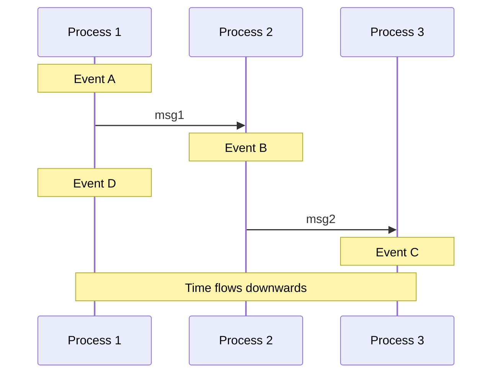

---
tags:
  - distributed-systems
  - consistency-models
  - linearizability
  - eventual-consistency
  - causal-consistency
  - architecture
aliases:
  - Consistency Models
  - Strong vs Eventual Consistency
---
# L1.DST.04: Eventual, causal, strong consistency 

> [!abstract] О лекции
> На архитектурном уровне Expert вы обязаны раз и навсегда перестать думать о концепции "согласованности" (Consistency) как о примитивном бинарном переключателе "включено/выключено". Консистентность — это **богатый спектр (иерархия) математических моделей**, каждая из которых строго определяет допустимый порядок видимости системных событий.
> *   **Strong (Строгая / Linearizability):** Распределенная система ведет себя так, будто это одна единственная машина с одним регистром. Это идеальная иллюзия, но она стоит очень дорого, работает медленно и падает при обрывах сети (состояние CP в CAP).
> *   **Causal (Причинная):** Математически уважает причинно-следственные связи ("ответ" Боба физически не может появиться в БД раньше "вопроса" Алисы), но при этом свободно допускает совершенно разный порядок применения *независимых* событий на разных репликах. Это теоретический потолок (лучший выбор) для High Availability систем (AP).
> *   **Eventual (В конечном счете):** Слабая гарантия. Гарантирует только то, что система "когда-нибудь" сойдется (снимет расхождения) в состоянии полного покоя (без новых записей). Критически требует механизмов разрешения конфликтов (потери через LWW или сложной математики CRDT).

---
В Computer Science **Cогласованность (Consistency)** — это строгий юридический контракт между распределенной системой хранения и программистом (клиентом) о том, какие именно **истории исполнения** (histories) и перестановки операций являются допустимыми, а какие — багом.

```mermaid
graph TD
    subgraph "Consistency Models Spectrum (Strictness)"
        SS[Strict Serializability<br>Spanner, FoundationDB]
        LIN[Linearizability<br>Etcd, Zookeeper Reads]
        SEQ[Sequential Consistency<br>Zookeeper Writes]
        CAU[Causal Consistency<br>MongoDB Sessions, COPS]
        RYW[Session Guarantees<br>Read-Your-Writes, Monotonic]
        SEC[Strong Eventual Consistency<br>CRDTs, Riak]
        EVE[Eventual Consistency<br>Cassandra, DynamoDB async]
        
        SS -->|Implies| LIN
        LIN -->|Implies| SEQ
        SEQ -->|Implies| CAU
        CAU -->|Implies| RYW
        RYW -->|Implies| SEC
        SEC -->|Implies| EVE
    end
    
    style SS fill:#ffcdd2,stroke:#c62828
    style LIN fill:#ffcdd2,stroke:#c62828
    style SEQ fill:#ffe0b2,stroke:#f57f17
    style CAU fill:#c8e6c9,stroke:#2e7d32
    style SEC fill:#bbdefb,stroke:#1565c0
    style EVE fill:#e1bee7,stroke:#1565c0
```

## 1. Фундамент: Математическое Отношение "Happened-Before" (->)

В 1978 году гениальный Лесли Лэмпорт опубликовал фундаментальную статью *"Time, Clocks, and the Ordering of Events in a Distributed System"*. Это был момент "Большого взрыва" для всей теории распределенных вычислений. Лэмпорт математически доказал, что в распределенной системе без единого общего тактового генератора (точных физических часов) само понятие "времени" абсолютно бессмысленно и иллюзорно. Единственное, что имеет физический смысл и значение для логики — это **относительный порядок событий**.

### 1.1. Проблема физического времени (Иллюзия синхронности)
В распределенной системе физические кварцевые часы на материнских платах крайне ненадежны:
1.  **Clock Skew (Сдвиг / Рассинхрон):** Часы на разных серверах всегда показывают разное время. Даже с настроенным NTP демоном разница может постоянно составлять от 1 мс (внутри одной стойки датацентра) до сотен мс (при передаче через океан).
2.  **Clock Drift (Дрейф):** Кварцевые генераторы тикают с разной скоростью в зависимости от температуры сервера.
3.  **Непредсказуемость (Парадокс Эйнштейна):** Вы не можете в суде доказать, что лог-событие с меткой `12:00:00.001` на сервере A физически произошло раньше события `12:00:00.002` на сервере B. Метка времени — это просто локальное число, не имеющее глобального веса.

Поэтому для упорядочивания операций мы навсегда заменяем физическое время на **Логическое время**, строго основанное на причинности.

### 1.2. Формальное определение Лэмпорта (Happened-Before)

Отношение "Happened-Before" (Произошло до, обозначается стрелкой ->) математически определяет **строгий частичный порядок** (Strict Partial Order) на гигантском множестве абсолютно всех событий в системе.

Событие $A$ гарантированно произошло перед событием $B$ (мы пишем $A 	o B$), если выполняется **любое** из трех строгих условий:

1.  **Process Order (Локальный порядок выполнения):**
    События $A$ и $B$ происходят в рамках **одного и того же процесса** (или одного потока ОС), и инструкция $A$ физически выполняется в коде раньше, чем инструкция $B$.
    *   *Суть:* Одно ядро процессора выполняет машинный код строго последовательно. Тут все детерминировано.

2.  **Message Passing (Причинная связь через сообщение по сети):**
    Событие $A$ — это факт отправки байт сообщения ($send(m)$) одним процессом в сокет, а событие $B$ — это факт успешного получения **этого же самого** сообщения ($receive(m)$) другим процессом на другом конце провода.
    *   *Суть физики:* Следствие не может произойти раньше своей причины. Вы не можете получить TCP пакет до того, как он был физически отправлен. Это единственный "мост", надежно соединяющий таймлайны двух независимых машин.

3.  **Transitivity (Свойство Транзитивности):**
    Если доказано, что $A 	o B$ и $B 	o C$, то математически следует, что $A 	o C$.
    *   *Суть:* Это позволяет алгоритмам логически строить длинные, многокилометровые цепочки причинно-следственных связей через всю распределенную систему микросервисов.

### 1.3. Потенциальная причинность (Potential Causality)

Почему это абстрактное понятие критически важно для Staff Architect?
Математическое отношение $A 	o B$ означает, что любая информация (или эффект от программного бага, или изменение значения переменной в памяти) из события $A$ **потенциально могла** повлиять на исход события $B$.
*   Это дерево называется **Causal History** (Причинная история транзакции).
*   Даже если событие $A$ на самом деле логически никак не повлияло на $B$, сетевой путь для потенциального потока информации физически существовал, и алгоритм консенсуса обязан это учитывать.

### 1.4. Конкурентность (Concurrency) и Иллюзия одновременности

Это самое сложное понятие для понимания начинающими инженерами.
Два любых события $A$ и $B$ называются математически **конкурентными** (обозначается знаком параллельности $A \parallel B$), если:
$$ A 
ot	o B \quad 	ext{И} \quad B 
ot	o A $$

**Расшифровка парадокса для эксперта:**
1.  Это **абсолютно не** означает, что они произошли ровно в одну и ту же наносекунду физического времени по часам.
2.  Это означает лишь то, что **между ними не было никакого пути передачи информации (причинной связи)**. Процесс $A$ ничего не знал о существовании процесса $B$, и наоборот. Они действовали абсолютно независимо, в вакууме.
3.  В системе с частичным порядком понятие "сейчас" или "одновременно" (Simultaneity) крайне относительно. Для внешнего наблюдателя на сервере в Нью-Йорке событие $A$ могло прийти раньше $B$, а для наблюдателя в Токио — наоборот. Поскольку причинной связи между $A$ и $B$ нет, **оба эти наблюдения математически верны и легальны**.

**Пример из жизни программиста (Git Merge):**
*   Разработчик Алиса делает коммит `C1` в ветку `main` и пушит его.
*   Разработчик Боб (забыв сделать `git pull` перед работой) делает свой коммит `C2` в свою локальную копию кода.
*   Даже если Алиса сделала коммит рано утром в 10:00, а Боб сделал свой коммит в 12:00, для системы Git эти события являются **конкурентными** ($C1 \parallel C2$). Боб в 12:00 физически не видел изменений Алисы от 10:00.
*   Результат системы: **Merge Conflict**. Конфликт в распределенной БД — это и есть физическая материализация конкурентности.

### 1.5. Визуализация: Space-Time Diagram (Диаграмма пространства-времени)

Представьте диаграмму Минковского, где время неумолимо идет сверху вниз, а процессы (сервера) — это вертикальные линии.

**Глубокий Анализ графа:**
1.  $A 	o B$ (связь установлена через успешную доставку сообщения `msg1`).
2.  $B 	o C$ (связь через сообщение `msg2`).
3.  $A 	o C$ (сработало правило транзитивности: процесс $P1$ опосредованно повлиял на стейт $P3$ через посредника $P2$).
4.  **А что насчет событий $D$ и $B$?**
    *   Событие $D$ произошло локально на узле $P1$ уже *после* того, как он отправил пакет `msg1`.
    *   Нет никакого сетевого пути от события $D$ к $B$. И нет пути от $B$ к $D$.
    *   **Жесткий Вывод:** $D \parallel B$ (Они конкурентны). Даже если физически на настенных часах $D$ случилось на целую секунду позже $B$, распределенная система этого не знает и доказать не может. Они абсолютно независимы для базы данных.

### Резюме раздела
Глубокое понимание графов "Happened-Before" критично для архитектора, потому что **все без исключения распределенные системы — это системы с частичным порядком**.
*   Любая архитектурная попытка "натянуть" жесткий полный порядок (Total Order) на систему с частичным порядком (например, генерировать монотонные ID транзакций) требует тяжелой глобальной синхронизации (алгоритмы Paxos/Raft) и мгновенно убивает производительность кластера.
*   Понимание $A 	o B$ позволяет инженерам строить **Vector Clocks (Векторные часы)**, делать согласованные распределенные бекапы/снапшоты (элегантный алгоритм Чанди-Лэмпорта) и отлаживать сложнейшие гонки данных (Race Conditions) в микросервисах.

---
## 2. Strong Consistency (Строгая согласованность / Элита)

Как эксперт, вы обязаны четко различать в уме согласованность по **реальному времени** (Real-time recency guarantees) и согласованность по **порядку выполнения транзакций** (Isolation levels).

В распределенных системах понятие "строгости" определяется тем, насколько поведение огромного кластера из 100 серверов математически неотличимо от работы **одного старого одноядерного компьютера вообще без кэшей L1/L2**. Однако дьявол кроется в деталях: какой именно аспект одиночного компьютера мы сейчас эмулируем — неумолимое реальное время или просто иллюзию последовательности операций?

### 2.1. Linearizability (Линеаризуемость) / Atomic Consistency

**Суть:** Это жесткая гарантия **свежести данных** (Recency guarantee). Это свойство применяется только к **одному объекту** (например, атомарному регистру процессора, одному счетчику или одному ключу в KV-store вроде Redis).

**Формальное определение (Maurice Herlihy & Jeannette Wing, 1990):**
Исполнение всей системы является линеаризуемым, если существует легальная перестановка абсолютно всех параллельных операций в единую, строгую полную последовательность (Total Order), которая удовлетворяет двум жестким условиям:
1.  **Корректность логики (Sequential Spec):** Любое чтение из переменной обязано возвращать значение самой последней успешной записи в нее.
2.  **Соблюдение реального времени (Real-time constraint):** Если операция записи $A$ физически завершилась (клиент успешно получил по сети ответ `OK`) в момент времени $t_1$, а операция чтения $B$ физически началась (клиент отправил TCP запрос) в момент $t_2$, и $t_1 < t_2$, то в глобальной последовательности операция $A$ **жестко обязана** стоять перед операцией $B$.

**Ключевое свойство для архитектора — Композируемость (Composability):**
Математическая магия: Если каждый отдельный объект в вашей системе (ключи $x, y, z$) линеаризуем по отдельности сам по себе, то и вся гигантская система целиком автоматически становится линеаризуемой. Это уникальное свойство позволяет легко строить сложнейшие надежные системы из простых линеаризуемых компонентов-кубиков (например, строить кластеры Kubernetes на базе Etcd/Zookeeper).

**Понятный Пример "Футбол и Телефон":**
*   *Сценарий:* Идет финал ЧМ по футболу. На табло счет 1:0.
*   *Alice* смотрит прямую трансляцию (через линеаризуемый Web-сервис) и видит счет 1:0. Впечатленная, она берет мобильный и звонит *Bob*.
*   *Bob* поднимает трубку (это физическое событие гарантированно происходит *позже* по времени, чем Alice увидела счет). Услышав новость, Bob открывает тот же сервис в браузере, чтобы проверить счет.
*   **Linearizability жестко гарантирует:** Bob увидит счет 1:0 или еще новее (например 1:1, если забили гол). Он **никогда, ни при каких условиях** не увидит старый счет 0:0 или кэшированные "старые" данные, потому что запрос чтения Alice (увидевшей 1:0) полностью завершился до начала сетевого запроса Bob.
*   *Без гарантии Linearizability:* Bob легко мог бы балансировщиком попасть на отстающую (stale) реплику БД в другом дата-центре и увидеть 0:0, что сломало бы мозг и нарушило причинно-следственную связь, установленную людьми через "внеполосный" физический канал связи (сотовый телефонный звонок).

**Техническая реализация в ядре БД:**
Линеаризуемость не дается бесплатно. Она требует внедрения тяжелого консенсуса (Raft / Paxos) или строгой Chain Replication. Даже простые операции чтения (`SELECT`) часто требуют полного прогона через сетевой кворум или использования механизма `ReadIndex` (когда лидер пингует фолловеров, чтобы убедиться, что он всё еще законный лидер), чтобы исключить фатальное чтение со "зомби-лидера", оказавшегося в изоляции (minority partition) при сетевом разрыве.
*   Именно Линеаризуемость — это та самая гордая буква **"C"** (Consistency) в классической CAP-теореме.

---
### 2.2. Serializability (Сериализуемость)

**Суть:** Это гарантия **изоляции параллельных транзакций** (Isolation guarantee). Это свойство применимо к **группе операций** (много `SELECT` и `UPDATE`), выполняемых над **множеством разных объектов** таблиц. Это та самая буква **"I"** в известной аббревиатуре ACID реляционных БД.

**Формальное определение:**
Параллельное исполнение 100 транзакций (даже если они физически идут одновременно на 100 разных шардах и ядрах CPU) в итоге приводит к абсолютно такому же финальному состоянию базы данных, как если бы все эти транзакции выполнялись **строго последовательно** (одна за другой, блокируя всю БД) в каком-то случайном порядке.

**Критический архитектурный нюанс (Ловушка для эксперта):**
Внимание: Serializability **вообще никак не гарантирует** соблюдение порядка реального физического времени!
*   Если клиентская Транзакция $T_1$ успешно завершилась с коммитом в 12:00, а Транзакция $T_2$ стартовала в 12:05, ядро базы данных имеет полное математическое право поставить их в логе в обратном порядке $T_2 	o T_1$, если алгоритм планировщика докажет, что они не пересекаются по изменяемым строкам.
*   **Архитектурная Аномалия:** Клиент может успешно записать данные в таблицу, радостно получить пакет `COMMIT OK`, но его же следующий моментальный запрос (даже с того же самого TCP соединения!) может не увидеть этих данных, если база в целях оптимизации пропускной способности (throughput) решит переупорядочить транзакции внутри себя. Для пользователя это выглядит как мистическое "путешествие во времени в прошлое".

**Слабость - Отсутствие композируемости:**
Сериализуемость математически не композируется. Если у вас в микросервисах работают две идеально сериализуемые базы данных (Postgres A и Postgres B), распределенная транзакция клиента, затрагивающая одновременно обе базы, не обязательно будет сериализуемой глобально без внедрения чудовищно медленного внешнего координатора транзакций (протокол Two-Phase Commit - 2PC).

---
### 2.3. Strict Serializability (Строгая сериализуемость)

**Суть:** "Святой Грааль" распределенных баз данных. Гармоничное математическое объединение двух мощнейших предыдущих моделей.
$$ 	ext{Strict Serializability} = 	ext{Serializability (Изоляция транзакций ACID)} + 	ext{Linearizability (Свежесть CAP)} $$

**Определение:**
Сложные транзакции над множеством таблиц выполняются так, как будто они всегда идут строго последовательно, И этот выстроенный последовательный порядок железно уважает реальное настенное время.
*   Если транзакция $T_1$ закоммитилась до начала старта $T_2$, то $T_1$ гарантированно будет стоять перед $T_2$ в глобальном логе порядка сериализации.

**Эталонный Пример реализации — Google Spanner:**
*   БД Spanner использует аппаратное **TrueTime API** (атомные часы + GPS приемники в каждой стойке), чтобы аппаратно обеспечить Strict Serializability.
*   Транзакции получают точные временные метки. Если физические часы на серверах гарантируют, что интервалы неопределенности времени двух транзакций не перекрываются, база принудительно и без блокировок упорядочивает их по этому времени.
*   Это позволяет банковским клиентам на 100% "доверять часам" и гарантирует External Consistency (внешнюю абсолютную согласованность).

---
### 2.4. Сводная матрица для принятия архитектурных решений

Как Staff Architect, вы несете ответственность за выбор базы данных. Отдел маркетинга вендора кричит вам на презентации: "Наша база данных поддерживает Strong Consistency!". Вы, как эксперт, должны холодно спросить: "Какую именно из трех?"

| Архитектурная Характеристика | **Linearizability (CAP-C)** | **Serializability (ACID-I)** | **Strict Serializability (Святой Грааль)** |
| :--- | :--- | :--- | :--- |
| **Область действия (Scope)** | Single Object (один регистр/строка) | Multiple Objects (сложная транзакция) | Multiple Objects (сложная транзакция) |
| **Связь с реальным временем** | **Real-time** (вижу строго самое последнее) | Нет (легально могу видеть старое прошлое) | **Real-time** (вижу строго самое последнее) |
| **Гарантия порядка (Ordering)** | Примитивная (только чтение/запись ключа) | **Total Order** (полный порядок транзакций) | **Total Order** (полный порядок транзакций) |
| **Слабость / Проблема** | Не атомарна для группы из 10 ключей | Эффект "Путешествие во времени" для клиента | Высочайшая цена (Huge Latency / Complexity) |
| **Примеры из индустрии** | Etcd, Zookeeper (reads via leader), ABD alg. | Oracle (в режиме Serializable), SSI (Postgres) | Google Spanner, CockroachDB, FoundationDB |

**Инсайт Эксперта:**
Подавляющее большинство классических "ACID" реляционных баз данных по умолчанию (работая на уровнях изоляции Read Committed / Repeatable Read) **вообще не обеспечивают** ни одну из этих строгих гарантий в полной мере, жертвуя ими ради скорости (Throughput).
*   **PostgreSQL** в максимальном режиме `SERIALIZABLE` обеспечивает п. 2.2 (Serializability), но он математически не гарантирует п. 2.1 (Linearizability) при наличии хоть одной реплики (асинхронной).
*   Для получения честной Strict Serializability в кластере Postgres вам потребуется включить жесткую синхронную репликацию + ожидать подтверждения коммита от кворума реплик на каждый `UPDATE`, что убьет ваш RPS.

### Резюме раздела
*   Если вашему бизнесу критично нужно, чтобы отправленный "лайк" под постом появился мгновенно у всех пользователей в мире — вам нужна **Linearizability**.
*   Если вам нужно безопасно перевести деньги со счета на счет (обновить две таблицы) без потери атомарности, но при этом бизнесу не важна миллисекундная свежесть баланса для внешнего наблюдателя в дашборде — вам нужна **Serializability**.
*   Если вам кровь из носу нужно и то, и другое одновременно (банковский процессинг реального времени по всей стране) — вы неизбежно платите за **Strict Serializability** гигантскими задержками на сетевую координацию (протоколы 2PC + Paxos).

---
## 3. Causal Consistency (Причинная согласованность / Золотая середина)

Это не просто "какая-то еще одна из многих моделей". Это математически доказанный **теоретический максимум (потолок)** согласованности, которого вообще в принципе можно достичь в распределенной системе, которая спроектирована быть устойчивой к разделению сети (Partition Tolerant) и при этом всегда оставаться доступной для записи (Available). В жестких терминах теоремы CAP: Causal Consistency — это абсолютный венец эволюции для AP-систем.

Если вы как архитектор хотите получить Ultra Low Latency (хотите мгновенно принимать записи пользователя в его локальном, ближайшем дата-центре без тормозящей синхронной репликации на другой континент) и при этом категорически не хотите, чтобы ваша система вела себя как сумасшедшая в глазах пользователя (ответы приходят раньше вопросов) — вам нужна именно Causal Consistency.

### 3.1. Формализация: Поток Информации и Зависимости
Основа этой модели — разобранное выше отношение **"Happened-Before"**, введенное Лесли Лэмпортом. Это не физическое время на часах (wall-clock), это строгий направленный **поток причинности**.

Событие $a$ причинно предшествует (вызвало) событию $b$ ($a 	o b$), если выполняется одно из условий:
1.  **FIFO Execution:** $a$ и $b$ выполняются в одном потоке пользователя (процессе), и $a$ произошло раньше $b$ по коду.
2.  **Message Passing:** $a$ — это отправка сообщения, а $b$ — прием *этого же самого* сообщения другим процессом.
3.  **Transitivity:** Существует промежуточное событие $c$, такое что $a 	o c$ и $c 	o b$.

**Техническое Определение Causal Consistency:**
Система БД считается причинно согласованной тогда и только тогда, когда для абсолютно любой пары операций чтения и записи, если $W(x) 	o W(y)$ (запись X причинно, логически повлияла на запись Y), то **абсолютно все** узлы кластера в мире обязаны увидеть и применить $W(x)$ строго перед применением $W(y)$.

*Важнейший математический нюанс:* Если $a 
ot	o b$ и $b 
ot	o a$, то эти события признаются **конкурентными** ($a \parallel b$). Причинная согласованность **вообще не навязывает** никакого строгого порядка для конкурентных событий. Узел в Америке может применить их в лог как $(a, b)$, а Узел в Европе как $(b, a)$. Именно это ослабление правил и позволяет такой системе бесконечно масштабироваться по всему миру без блокировок.

### 3.2. Архитектурный пример: "Аномалия отсутствующего предка"
Почему причинность критична для кибер-безопасности, а не только для правильного порядка сообщений в чатах.

**Сценарий уязвимости (ACL Violation):**
1.  **Админ (работает на Replica A):** Жестко удаляет уволенного пользователя `Bob` из секретной группы `SecretProject`. (Назовем это Операция $O_{rem}$).
2.  **Тот же Админ (Replica A):** Уверенный в безопасности, публикует новый документ `passwords.txt` в эту же группу `SecretProject`. (Операция $O_{pub}$).
3.  Очевидно и доказуемо, что $O_{rem} 	o O_{pub}$ (так как они произошли в рамках одной сессии Админа одна за другой).

**В слабой системе с Eventual Consistency (Обычная NoSQL):**
*   Реплика B (которую читают обычные юзеры) может получить эти два обновления по сети в абсолютно обратном порядке (из-за асинхронной многопоточной репликации и непредсказуемых сетевых лагов).
*   Уволенный `Bob` сидит и читает ленту с Реплики B. Он внезапно видит прилетевшую операцию $O_{pub}$ (документ добавлен), но Реплика B еще не успела получить $O_{rem}$ (удаление Боба).
*   **Катастрофический Результат:** Боб спокойно скачивает файл `passwords.txt`, к которому у него уже не должно быть доступа. Утечка данных.

**В умной системе с Causal Consistency:**
*   Операция $O_{pub}$ аппаратно несет в себе прикрепленные метаданные вектора: *"Внимание, я логически завишу от выполнения операции $O_{rem}$"*.
*   Реплика B, получив по сети пакет с $O_{pub}$ раньше, чем $O_{rem}$, **физически не покажет** его пользователям БД. Она умно положит $O_{pub}$ в скрытый буфер отложенных операций (hold buffer) и будет заморожено ждать, пока по сети не придет ее "предок" $O_{rem}$ (missing dependency). Безопасность сохранена.

### 3.3. Реализация под капотом: Векторные часы и Explicit Causality
Как это магия работает "под капотом" движков БД? Как распределенная система понимает зависимости без единого центра?

1.  **Vector Clocks (Векторные часы):**
    *   Каждый серверный процесс поддерживает в RAM массив-вектор $V = [t_1, t_2, ..., t_n]$, где $t_i$ — это инкрементальный счетчик событий $i$-го узла кластера.
    *   При отправке любого сообщения процесс "приклеивает" к нему свой текущий вектор $V$.
    *   При приеме пакета процесс математически сравнивает свой локальный вектор с полученным из сети. Если в полученном векторе есть события, которых локальный узел еще не видел (выявлены пропуски в нумерации), сообщение блокируется и задерживается в очереди.
    *   **Проблема масштабируемости:** Размер передаваемого вектора линейно равен числу всех участников $N$. В системе мобильного приложения с 10 миллионами клиентов прикреплять вектор на 40 МБ к каждому мегабайтному сообщению — это убить сеть.

2.  **Explicit Causality (Явная причинность) / Client Context Token:**
    *   Этот паттерн используется в самых современных сверхмасштабных системах (например, **Facebook/Meta TAO**, глобальный **Azure Cosmos DB**).
    *   Вместо передачи гигантского глобального вектора, БД при каждой записи просто возвращает клиенту компактный хэш `ConsistencyToken` (или `CausalContext`).
    *   При следующем своем чтении или новой записи клиентский драйвер принудительно отправляет этот токен обратно на сервер в Header: *"Сервер, пожалуйста убедись, что твое текущее состояние в RAM включает в себя абсолютно все операции из этого токена. Если нет - я подожду"*.
    *   Это гениально перекладывает ответственность за хранение "состояния своего мира" на самого клиента, полностью разгружая память и сеть сервера.

### 3.4. Определение Causal+ (Causal Plus)
Термин, часто встречающийся в whitepapers (например, в описании распределенного алгоритма COPS - Clusters of Order-Preserving Servers).

Обычная Causal Consistency говорит нам, что зависимые (причинные) операции жестко упорядочены. Но она коварно молчит про судьбу конкурентных операций ($a \parallel b$).
Если я пишу `x=1` на узле A в США, а вы пишете `x=2` на узле B в Азии абсолютно одновременно:
*   Узел C (в Европе) может получить пакеты и увидеть `x=1`, потом `x=2`. Итог для него: $x=2$.
*   Узел D (в Африке) может получить пакеты и увидеть `x=2`, потом `x=1`. Итог для него: $x=1$.
Состояние реплик в мире разошлось навсегда (Divergence). Это баг.

**Causal+ Consistency** = Это (Обычная Causal Consistency) + **Convergent Conflict Handling (Функция слияния)**.
Это математическая гарантия того, что даже для полностью независимых конкурентных операций все реплики *в конечном счете* (eventually) придут к единому, консенсусному значению (например, алгоритмически используя правило Last-Write-Wins по таймстемпу или умную merge функцию из CRDT).

### 3.5. Границы применимости для Архитектора (Trade-offs)

**Мощные Плюсы:**
*   Полное отсутствие сетевых блокировок на запись (Высочайшая Write Availability).
*   Полное отсутствие блокировок на чтение (Высочайшая Read Availability).
*   Интуитивность и предсказуемость для живого пользователя (время не идет вспять, вопросы в форуме не появляются после ответов на них).

**Минусы (Цена архитектуры):**
1.  **Throughput Penalty (Удар по пропускной способности):** Сеть и диски вынуждены передавать и хранить тяжелые графы зависимостей или векторы версий (оверхед на метаданные).
2.  **Liveness Delay (Задержка видимости):** Если реплика БД с "предком" ($O_{rem}$) внезапно упала, то реплика с "потомком" ($O_{pub}$) не имеет права применить и показать обновление. Новые данные "застревают" в буфере очереди, мучительно ожидая доставки зависимостей. Система технически доступна, но *свежие* данные могут быть искусственно скрыты (невидны) часами.
3.  **Сложность ограничений:** Глобальные бизнес-инварианты (например, уникальность `login` при регистрации нового юзера) математически невозможны в этой модели. Causal Consistency физически не может предотвратить регистрацию двух разных пользователей с логином `admin`, если они сделали это абсолютно одновременно в разных географических регионах. (Для таких строгих задач вам неминуемо понадобится Strong Consistency / Consensus).

---
## 4. Eventual Consistency: Анатомия хаоса, надежды и сходимости

В AP-системах (согласно теореме CAP) мы осознанно жертвуем мгновенной, строгой согласованностью ради обеспечения 100% доступности (Availability) при любых сетевых разрывах кабелей. Но фраза "согласованность в конечном счете" — это слишком поэтичный и расплывчатый термин для инженерии. Senior разработчик должен ясно видеть за ним конкретные механизмы репликации пакетов и математические гарантии сходимости матриц.

### 4.1. Формальное определение и (отсутствие) гарантий
**Базовое определение (которое дал Werner Vogels, CTO Amazon):**
Распределенная система считается Eventual Consistent (согласованной в конечном счете), если при жестком условии полного отсутствия новых обновлений (пишущих `PUT`/`POST` запросов) для объекта, спустя некоторый, заранее неизвестный промежуток времени (Inconsistency Window), абсолютно все обращения ко всем репликам в мире будут стабильно возвращать **одно и то же, последнее записанное значение**.

**Архитектурная декомпозиция этого обещания:**
1.  **Liveness Guarantee (Гарантия живучести/прогресса):** Модель EC философски гарантирует, что система не стоит на месте, она *старается прогрессировать* к единому согласованному состоянию ("Something good eventually happens").
2.  **Lack of Safety (Полное отсутствие безопасности):** Внутри этого темного окна несогласованности (Inconsistency Window) система **вообще не дает программисту никаких гарантий**.
    *   Вы можете легально прочитать значение, которого в бизнес-логике никогда не существовало (если ядро БД использует некорректную функцию слияния конфликтов).
    *   Вы можете стать жертвой "путешествия во времени" (прочитать самую новую версию 5, а через секунду при рефреше получить старую версию 3).
    *   Вы можете безвозвратно потерять данные (Lost Updates) при коллизии таймстемпов.

### 4.2. Механики сходимости данных (Convergence Mechanisms)
Магическое "в конечном счете" не наступает само по себе по воле божьей. Это тяжелый результат постоянной работы конкретных фоновых системных процессов. Вы как архитектор должны знать их цену по CPU и I/O.

1.  **Read Repair (Ленивое исправление при чтении):**
    *   *Механизм:* Клиент запрашивает данные (`SELECT`) у $N$ реплик. Если версии вернувшихся данных различаются, координатор (или умный драйвер клиента) на лету вычисляет победителя, возвращает его пользователю и тут же, асинхронно отправляет команду `UPDATE` на те реплики, которые вернули устаревший мусор, чтобы починить их.
    *   *Cost (Цена):* Сильно увеличивает P99 latency на операцию чтения (Read), так как требует ожидания сбора ответов от нескольких узлов по сети.
2.  **Anti-Entropy (Анти-энтропия / Active Background Repair):**
    *   *Механизм:* Тяжелые фоновые демоны-процессы (например, compaction в Apache Cassandra / ScyllaDB) периодически, по расписанию сканируют и математически сравнивают гигабайты данных между узлами.
    *   *Реализация:* Чтобы не гонять терабайты сырых данных по сети (что убьет канал), используются **Merkle Trees** (Деревья криптографических хешей). Быстро сравниваются только легкие хеши веток; если хеш корня совпадает — гигабайты данных идентичны, спим дальше. Если нет — рекурсивно спускаемся ниже по дереву, пока не найдем один конкретный различающийся блок 4KB, и копируем только его.
    *   *Cost (Цена):* Экстремально высокая фоновая нагрузка на CPU процессора и Disk I/O (чтение диска).
3.  **Gossip Protocol (Протокол Сплетен):**
    *   Узлы кластера каждую секунду случайным образом выбирают соседа и обмениваются с ним микро-пакетами с информацией о состоянии ("Эй, я видел версию X ключа K, а ты?"). Это эпидемический, вирусный алгоритм логарифмического распространения обновлений по кластеру.

### 4.3. Управление конфликтами записи: Syntactic vs Semantic
В слабой модели EC мы архитектурно разрешаем абсолютно одновременную запись в разные географические реплики ($A \parallel B$). Это неминуемо создает **конфликт версий** на уровне хранилища.

**A. Syntactic Resolution (Синтаксическое решение: Last Write Wins — LWW):**
Это грубый стандарт де-факто для Cassandra / ScyllaDB (по умолчанию).
*   Каждая пользовательская запись на уровне драйвера снабжается меткой времени (Wall-Clock Timestamp операционной системы).
*   При коллизии всегда бездумно побеждает запись с самым большим (новым) значением `timestamp`. Старая удаляется.
*   **Катастрофа архитектора:** Часы на серверах Linux физически никогда не синхронизированы идеально (проблема NTP drift). Если аппаратные часы сервера A отстают всего на 100мс от сервера B, критичные бизнес-данные, записанные на сервере A физически "позже", будут безжалостно и тихо перезаписаны "старой" (но с большим таймстемпом) записью с сервера B.
*   **Итоговый Результат:** Молчаливая, невидимая в логах потеря данных клиентов (Lost Update).

**B. Semantic Resolution (Семантическое решение: Siblings & Vector Clocks):**
Более умный стандарт для БД Riak / Amazon Dynamo (из original paper).
*   Система БД сама не пытается тупо выбрать победителя. Она бережно сохраняет на диске **обе** конфликтующие версии данных (создает "братьев" / siblings).
*   При следующем чтении клиент-приложение внезапно получает из БД массив: `[ValueA, ValueB]`.
*   **Vector Clocks (Векторные часы):** Используются базой для точного определения причинности. Если вектор $V_A < V_B$, то БД сама понимает, что B новее, и молча заменяет A. Но если векторы математически несравнимы (изменены параллельно) — это истинный конфликт.
*   *Задача разработчика (Боль):* Написать сложный код прямо на клиенте (на бэкенде), который умеет бизнес-логикой правильно сливать (мерджить) две корзины покупок (`Cart A Union Cart B`) и принудительно писать обратно в БД уже объединенную, разрешенную версию.

### 4.4. Strong Eventual Consistency (SEC) и магия CRDT
Это самый современный, научный ответ индустрии на все боли и потери данных обычного EC.
**Определение:** Система гордо называется SEC, если она Eventual Consistent И при этом математический способ разрешения любых конфликтов **строго детерминирован, всегда коммутативен (A+B=B+A) и ассоциативен**.

**CRDT (Conflict-free Replicated Data Types - Бесконфликтные типы данных):**
Это специализированные структуры данных, которые гарантируют идеальную математическую сходимость на всех узлах вообще без участия кода клиента и без блокировок.
*   **G-Counter (Grow-only Counter):** Распределенные счетчики, которые могут только расти (лайки). Слияние двух реплик = простая функция `max()`. Конфликтов не бывает в принципе.
*   **PN-Counter (Positive-Negative):** Поддержка безопасного декремента (внутри хитро хранит два независимых G-счетчика: массив инкрементов и массив декрементов).
*   **LWW-Element-Set:** Множество элементов, где для каждого отдельного элемента внутри хранится свой таймстемп добавления и таймстемп удаления.

**Пример из индустрии (Redis Enterprise, Riak DT, Yjs):**
Вам больше не нужно мучительно мерджить конфликтующие json-версии корзины покупок вручную. Вы просто используете встроенный в БД тип данных `CRDT Map`. База данных сама, на уровне математики гарантирует, что даже если трансатлантический кабель перерезали на неделю, после восстановления связи абсолютно все реплики в мире сами тихо придут к одному общему состоянию, и ни один товар из корзины не пропадет (при правильном соблюдении семантики типа разработчиком).

### 4.5. Probabilistic Bounded Staleness (PBS - Вероятностная оценка)
Как бизнесу ответить на вопрос: Насколько долго физически длится ваше "Eventually" (В конечном счете)?
Вместо абстрактного бинарного ответа, Senior-эксперт использует математическую модель PBS (разработана учеными из команды Berkeley).
*   Она предсказывает точную вероятность $P$ того, что операция чтения вернет устаревшие данные, основываясь на настройках кластера $N, R, W$ (параметры кворума) и текущих задержках сети.
*   *Индустриальный Инсайт:* Практика показывает, что в нормальных условиях дата-центра (без сбоев свитчей) "eventual consistency" в Dynamo-подобных системах сходится (реплицируется) за фантастические **< 200 мс**. Окно уязвимости крошечное, но оно есть.

### 4.6. Пример из жизни: "Воскресший Зомби-объект" (Deleted Item Resurgence)
Это классическая, легендарная проблема EC баз данных, о которой постоянно забывают новички при проектировании.

1.  Узел A и Узел B стабильно хранят объект `Key1`.
2.  Узел A падает или отрезается сетью (Partition P).
3.  Клиент шлет запрос `DELETE Key1` на живой Узел B. Узел B честно удаляет объект (физически стирает с диска).
4.  Через час Узел A поднимается. На его диске `Key1` все еще жив и здоров.
5.  В фоне запускается процесс сплетен (Gossip / Anti-entropy) для синхронизации.
6.  Узел A сканирует узлы и видит, что у B почему-то нет `Key1`, а у него есть. Узел A наивно думает по логике EC: "О, бедный Узел B пропустил важную операцию записи `Key1` пока я спал!" и заботливо отправляет старый `Key1` обратно на Узел B.
7.  **Итог Катастрофы:** Удаленный час назад пользователем объект мистически воскрес из мертвых.

**Архитектурное Решение (Паттерн Tombstones):**
В системах класса EC категорически запрещено физически (через `rm`) удалять данные сразу при команде `DELETE`. Вместо этого в БД пишется специальный системный маркер — **Tombstone** (Могильный камень) с настроенным TTL (например, 14 дней). Этот маркер означает "Запись удалена". При любом сетевом слиянии (merge) маркер Tombstone имеет приоритет и побеждает старые "живые" данные, убивая их на других узлах. Физическая очистка диска (GC / Compaction) происходит только по истечении 14 дней, когда мы на 100% гарантированно уверены, что все спящие узлы в кластере уже получили этот маркер Tombstone.

---
## 5. Client-Centric Consistency (Сеансовые гарантии комфорта)

В отличие от суровых Data-Centric моделей (Strong, Causal), которые строго описывают глобальное состояние всей системы (то, что видят *все* узлы и абстрактный бог), Client-Centric модели фокусируются исключительно на комфорте **одного конкретного клиента** (или рамках его одной HTTP сессии).

**Суть Бизнес-проблемы:** В любой распределенной системе (например, огромный кластер Cassandra или при банальном чтении баланса с асинхронных Read Replicas в PostgreSQL) клиентские запросы через балансировщик могут хаотично переключаться между разными физическими узлами.
*   HTTP Запрос 1 случайно попал на `Replica_A` (она очень быстрая, данные свежие).
*   HTTP Запрос 2 через секунду попал на `Replica_B` (она отстающая на 5 секунд из-за репликационного лага).
Без внедрения специальных гарантий на уровне драйвера, клиент своими глазами увидит "путешествие во времени назад" (данные моргнут и исчезнут), что мгновенно разрушает логику UI приложения и доверие пользователя.

Ученый Терри Дуги (Terry Doug, 1994) формализовал четыре изящные гарантии, которые решают эту UX проблему без жесткой блокировки всей глобальной системы.

### 5.1. Read Your Writes (RYW - Читай свои записи)
Самая важная и востребованная гарантия для любых пользовательских веб-интерфейсов.
*   **Определение:** Результат успешной операции записи (Write), выполненной конкретным клиентом, всегда и безусловно должен быть виден этому же самому клиенту во всех его последующих операциях чтения (Read).
*   **Формально:** Если операция $W(x)$ выполнена клиентом $C$, то любая последующая операция $R(x)$ тем же самым клиентом $C$ (даже с другого устройства) должна вернуть значение, записанное в $W(x)$, или еще более новое от других.
*   **Сценарий провала (Violation в проде):**
    1.  Пользователь меняет фото аватарки (POST запрос летит на `Master` БД).
    2.  Браузер делает редирект, страница перезагружается, браузер делает GET запрос аватарки (балансировщик кидает его на отстающую `Replica_1`).
    3.  Пользователь видит старую аватарку и в ярости думает, что система сломалась или кнопка "Сохранить" не сработала.
*   **Реализация Архитектором:**
    1.  **Sticky Sessions (Липкие сессии):** На уровне балансировщика (HAProxy/Nginx) привязать пользователя по куке к одной и той же реплике (плохо масштабируется и ломается при падении этого узла).
    2.  **Smart Versioning (Токены):** БД возвращает клиенту токен версии его последней записи ($V_{last}$). При следующем чтении клиентский драйвер шлет этот $V_{last}$ в заголовке. Реплика, получив запрос, проверяет: "Мой внутренний лог уже догнал версию $V_{last}$?". Если нет — реплика ставит поток на паузу и ждет репликации, либо проксирует (перенаправляет) запрос напрямую на мастер.

### 5.2. Monotonic Reads (Монотонное чтение - Только вперед)
Гарантия принципа "время не идет вспять".
*   **Определение:** Если клиент хотя бы один раз успешно увидел версию данных $V_1$, то абсолютно любые последующие чтения этим же клиентом (даже с других реплик) обязаны возвращать только версию $V_2$, такую что хронологически $V_2 \ge V_1$.
*   **Сценарий провала (Violation):**
    1.  Пользователь читает список писем в Gmail, видит новое "Письмо от начальника" (запрос попал на Replica A, она свежая).
    2.  Пользователь жмет кнопку "Обновить страницу" (запрос попадает на Replica B, которая отстает по логам на 10 сек).
    3.  Письмо от начальника мистически исчезает из списка. Пользователь в панике.
*   **Отличие от RYW:** Гарантия RYW касается исключительно *своих собственных* записей. Monotonic Reads защищает от моргания *чужих* записей, которые мы уже однажды успели заметить в UI.

### 5.3. Writes Follow Reads (WFR) / Session Causality
Очень часто забываемая джуниорами, но критически важная для смысловой целостности данных гарантия.
*   **Определение:** Если клиент сначала прочитал версию $V_1$ объекта $X$, а затем, основываясь на этом, делает запись объекта $Y$, то эта запись $Y$ математически должна быть причинно зависима от $V_1$. Абсолютно любая реплика в мире, принимающая запись $Y$, обязана *сначала* получить и применить у себя версию $V_1$ (или более новую).
*   **Сценарий провала (Violation на форуме):**
    1.  Клиент читает пост и видит крайне агрессивный, гневный комментарий (читает с Replica A).
    2.  Клиент не выдерживает и пишет ответ под ним: "Успокойся!" (запись попадает на Replica B).
    3.  Replica B еще физически не получила по сети исходный гневный комментарий (лаг репликации).
    4.  В итоге в базе данных появляется ответ "Успокойся!", который технически висит в воздухе (указывает на несуществующий ID) или прикреплен не к тому контексту диалога. Нарушена логическая причинность *с точки зрения клиента*.

### 5.4. Monotonic Writes (Монотонная запись)
Гарантия строгого порядка выполнения пишущих операций внутри одной сессии пользователя.
*   **Определение:** Записи одного конкретного клиента всегда применяются абсолютно всеми репликами базы данных строго в том же самом порядке, в котором они были отправлены с телефона/браузера.
*   **Сценарий провала (Violation API):**
    1.  Клиент делает API вызов, создавая библиотеку: `CREATE LIBRARY "MyBooks"` (Write 1).
    2.  Затем клиентский код делает второй вызов: `ADD BOOK "Dune" TO "MyBooks"` (Write 2).
    3.  Из-за странных сетевых гонок и маршрутизации TCP пакетов, Write 2 прилетает на удаленную реплику быстрее, чем Write 1.
    4.  Операция 2 падает с ошибкой Foreign Key `Library not found`, хотя клиентский код все сделал в правильном синхронном порядке.

---
### 5.5. Архитектурный Deep Dive: Как это физически реализовать?

На высоком грейде Staff Architect вы не пишете эти низкоуровневые гарантии с нуля в коде контроллеров, вы осознанно выбираете готовый middleware или настраиваете драйвер базы.

1.  **Векторные часы на клиенте (Causal Context Tokens):**
    *   Сервер БД при каждом ответе возвращает клиенту (в HTTP Header) маленькую непрозрачную строку-токен (сжатый Vector Clock состояния сессии).
    *   Клиент (фронтенд или мобилка) кэширует этот токен и **обязан** прислать его обратно со своим следующим запросом.
    *   Load Balancer (или координатор БД), получив запрос, распаковывает токен и понимает: "Ага, этот клиент уже видел данные версии 100. Я — отстающий узел, у меня версия всего 90. Я физически не имею права отвечать ему, иначе нарушу Monotonic Reads". Узел блокирует запрос и ждет репликации, либо проксирует его.
    *   *Примеры из индустрии:* **Azure Cosmos DB** (Режим Session Consistency level), **Mongo DB** (Механизм Causal Consistency в сессиях драйвера).

2.  **Sticky Routing (Pinning / Липкая маршрутизация):**
    *   Самый тупой, но дешевый способ получить все 4 гарантии сразу (до тех пор, пока выбранный узел жив).
    *   На уровне Nginx/Envoy весь трафик с `Cookie: UserID=123` направляется всегда, жестко на бэкенд `Node-5`.
    *   *Архитектурный Риск:* Hot spotting (перекос нагрузки, когда один VIP-пользователь кладет одну ноду) и полная, внезапная потеря всех сессионных гарантий (глюки UI) при штатном редеплое K8s или случайном падении этого узла.

### Итог для эксперта по Сессиям
Client-Centric Consistency — это гениальный компромисс инженерии. Вы получаете абсолютно логичное, предсказуемое поведение для конечного пользователя, не платя чудовищную цену (Latency) за глобальную линеаризуемость и синхронную репликацию (Synchronous replication).
*   **Главный Trade-off:** В случае аварийного сбоя части узлов в дата-центре, клиент с "продвинутой" сессией (сохраненным токеном $V_{100}$) может внезапно потерять доступность (availability) и получать ошибки 503, так как все оставшиеся живые узлы могут оказаться "слишком старыми" ($V_{90}$) для его высоких требований (они еще не догнали его Session Token, и отказываются ему отвечать, чтобы не нарушить гарантии).

---
## 6. Чек-лист Архитектора уровня Expert (Интервью)

1.  **Скрытая проблема Stale Reads:**
    Может ли система, заявленная как Линеаризуемая (Linearizable), легально вернуть данные из кэша?
    *   *Ответ Эксперта:* Только и исключительно в том случае, если этот локальный кэш криптографически валидирован (через строгий lease check с лидером) или если мы используем линеаризуемые операции чтения (Quorum Read через механизм Raft ReadIndex). Обычный, наивный локальный кэш сервера без проверки мгновенно и фатально нарушает линеаризуемость.
2.  **Сравнение производительности:**
    Что в продакшене физически работает быстрее: Causal Consistency или Strong Consistency?
    *   *Ответ Эксперта:* Causal Consistency работает в разы быстрее (и остается доступной при Network Partition). Она математически не требует тяжелого глобального консенсуса (Paxos) для координации всех узлов, от нее требуется только локальное отслеживание графа зависимостей. Но метаданные (токены/вектора), летающие по сети, "тяжелее" и съедают часть пропускной способности.
3.  **Границы Применимости (Use-cases):**
    Почему банк никогда не может использовать Eventual Consistency для хранения баланса счета?
    *   *Ответ Эксперта:* Потому что жесткий бизнес-инвариант $Balance \ge 0$ (нельзя уйти в минус) физически не может быть гарантирован без глобальной координации узлов при проверке. Снятие реальных денег бескомпромиссно требует Strong Consistency (или, в крайнем случае, Causal с хитрыми числовыми типами CRDT, но в реальности банки используют старые добрые транзакции и локи).
4.  **Скрытая угроза ACID баз данных:**
    Может ли база данных быть строго Serialisable (ACID), но при этом НЕ быть Linearizable (CAP)?
    *   *Ответ Эксперта:* Да, абсолютно. База данных может легально (в целях оптимизации) выполнить транзакцию $T_2$ (которая началась по времени *после* успешного завершения $T_1$) *перед* $T_1$ в своем внутреннем сериальном логе, если их данные никак не пересекаются. Пользователь, анализирующий логи, с удивлением увидит "путешествие в прошлое".

### Финальное Заключение
Выбор математической модели согласованности при проектировании — это всегда жестокий компромиссный выбор между законами физики **скоростью света** (Latency) и **человеческим здравым смыслом** (Consistency).
*   Без колебаний используйте **Strong / Strict Serializability**, если ваши данные — это реальные деньги, финансовые транзакции, биллинг или мета-конфигурация кластера (где ошибка стоит миллионы).
*   Смело используйте дешевую **Eventual**, если ваши данные — это лайки, счетчики просмотров YouTube, кэши картинок или аналитика (где потеря 1% данных никого не волнует).
*   Инвестируйте время в изучение **Causal / Client-Centric**, если вы строите современный мессенджер, соцсеть или collaborative editing tool (Figma, Notion), где важен безупречный UX и логика диалога, но важна и скорость ответа.