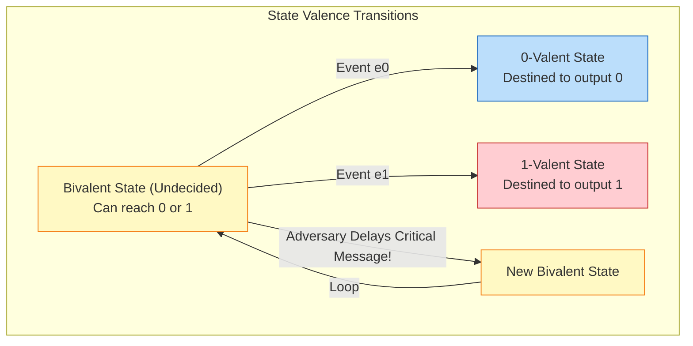

---
tags:
  - distributed-systems
  - consensus
  - flp-impossibility
  - failure-detectors
  - architecture
aliases:
  - Consensus Problem
  - FLP Impossibility
---
# L1.DST.06: Consensus Problem, FLP Impossibility 

> [!abstract] О лекции
> **Проблема консенсуса** — это бьющееся ядро любых отказоустойчивых распределенных систем. Легендарная теорема **FLP** (Fischer, Lynch, Paterson, 1985) математически доказывает, что в полностью асинхронной распределенной системе (где нет гарантий времени доставки пакетов) даже при наличии всего **одного** возможного сбоя (crash failure), ни один детерминированный алгоритм консенсуса не может 100% гарантировать свое завершение (свойство liveness). 
> Для уровня Staff/Principal Architect вы обязаны глубоко понимать не только *что* это невозможно, но и математически *почему* (через концепции бивалентности и неразличимости), и *как именно* мы обходим это жесткое ограничение в реальности (используя Failure Detectors и Partial Synchrony), на которых построены современные индустриальные гиганты: Paxos, Raft и ZooKeeper (Zab).

---
## 1. Формализация Проблемы Консенсуса

В бытовой инженерной практике мы часто небрежно говорим "наши узлы договорились кто будет мастером". В суровой компьютерной теории мы обязаны перевести это на строгий язык предикатов над трассами исполнения (execution traces). Проблема консенсуса — это задача надежного согласования единого значения между множеством процессов в суровых условиях, когда локальное состояние каждого процесса физически изолировано, а сеть между ними ненадежна.

Мы рассматриваем систему как совокупность вычислительных процессов $P = \{p_1, p_2, ..., p_n\}$, где $N \ge 2$.

### 1.1. Модель Процесса (I/O Automata)

Каждый процесс $p_i$ в кластере можно представить как конечный автомат (State Machine), который имеет:
*   **Входное состояние (Input):** Локальное начальное значение $x_p \in V$. Для упрощения математического доказательства (без потери общности) исследователи всегда рассматривают Бинарный Консенсус, где возможные значения $V = \{0, 1\}$.
*   **Выходное состояние (Output / Decision):** Переменная принятого решения $y_p$. Изначально она не определена ($y_p = \bot$, система находится в так называемом *bivalent* state). В момент окончательного принятия решения она принимает жесткое значение $v \in V$.
*   **Свойство Необратимости (Write-Once):** Это критический аспект для баз данных. Как только процесс официально установил и подтвердил $y_p = v$, он больше **никогда не имеет права** изменить его на другое значение. Это состояние является финальным и терминальным (absorbing state) с точки зрения переменной решения. (Слово не воробей).

### 1.2. Свойства Корректности Алгоритма (Correctness Properties)

Любой распределенный алгоритм (будь то Raft или Paxos) решает задачу консенсуса тогда и только тогда, когда в **любом** допустимом исполнении (admissible execution, при любых лагах сети) неукоснительно выполняются следующие три свойства. Мы классифицируем их на классы **Safety** (гарантия, что ничего плохого не случится) и **Liveness** (гарантия, что что-то полезное в итоге обязательно произойдет).

#### A. Agreement (Согласованность / Единогласие) — Safety Property
**Строгое Определение:** Никакие два процесса в кластере не могут принять разные финальные решения.
$$ \forall p_i, p_j \in P: (y_i 
eq \bot \land y_j 
eq \bot) \implies y_i = y_j $$

*   **Пояснение для Architect:** Это свойство гарантирует абсолютную целостность данных вашего бизнеса. В распределенной транзакционной базе данных это означает, что физически не может быть ситуации (Split-Brain), когда одна реплика сделала `COMMIT` транзакции (списала деньги), а другая реплика сделала `ABORT` (отменила списание).
*   **Нюанс для Scholar:** Обратите внимание на формулу, определение касается *всех* процессов, принявших решение, а не только "корректных" (выживших). Если умирающий процесс успел записать решение $0$ на свой диск перед смертью, а выжившие процессы приняли $1$ — это фатальное нарушение Agreement (которое вскроется после рестарта узла).

#### B. Validity (Валидность / Осмысленность) — Safety Property
**Определение:** Если какой-либо процесс принял итоговое решение $v$, то это значение $v$ обязательно было предложено (было начальным значением $x$) хотя бы одним из процессов системы. Никакой магии из воздуха.
$$ \forall p_i: (y_i 
eq \bot) \implies \exists p_j: x_j = y_i $$

*   **Зачем это нужно инженерам:** Без этого жесткого свойства существует примитивный, тривиальный алгоритм, который идеально удовлетворяет Agreement и Termination: "Ребята, давайте всегда, при любых условиях выбирать 0", абсолютно игнорируя входящие запросы клиентов. Такой алгоритм безопасен, но абсолютно бесполезен для бизнеса.
*   **Сильная Валидность (Strong Validity):** Если абсолютно все процессы единогласно предложили одно и то же значение $v$, то итоговым решением системы *обязано* быть $v$.
    $$ (\forall p_i: x_i = v) \implies (\forall p_j: y_j = v) $$

#### C. Termination (Завершение / Живучесть) — Liveness Property
**Определение:** Каждый **корректный** (non-faulty) процесс в системе в конечном счете обязательно примет какое-то финальное решение. Никто не будет висеть в бесконечном цикле.
$$ \forall p_i \in Correct(P): \lim_{t 	o \infty} y_i(t) 
eq \bot $$

*   **Определение Корректного Процесса:** Процесс $p$ называется математически корректным, если он не испытывает аппаратного сбоя на протяжении всего бесконечного исполнения. В классической модели FLP рассматриваются только *Crash Failures* (чистые сбои остановки по питанию). Некорректный процесс просто прекращает выполнять инструкции CPU в какой-то момент времени.
*   **Суть парадокса FLP:** Теорема FLP доказывает, что в асинхронной системе (как интернет) математически **невозможно гарантировать** это свойство (Termination) при обязательном строгом сохранении свойств Agreement и Validity, если в системе возможен хотя бы один (даже самый маловероятный) сбой узла.

---
### 1.3. Индустриальный Пример (Mapping to Reality: 2PC)

Чтобы заземлить сухую теорию, рассмотрим классический паттерн **Распределенной Транзакции (Two-Phase Commit - 2PC)**.

**Бизнес-Сценарий:** У нас есть лидер (координатор транзакции) и две изолированные базы данных (участники: Склад и Биллинг).
*   **Вход ($x_i$):** Каждый участник локально проверяет свои локи, может ли он записать данные (хватает ли товара и денег).
    *   $x_i = 1$ (Yes / Голосую за Commit)
    *   $x_i = 0$ (No / Голосую за Abort — например, нарушение Constraint или диск физически переполнен).
*   **Решение ($y_i$):** Глобальное, неотвратимое действие.
    *   $y = 1$ (Global Commit - Транзакция успешна)
    *   $y = 0$ (Global Abort - Транзакция откатана)

**Проверка свойств на практике:**
1.  **Agreement:** Если Node A (Биллинг) успешно списала деньги, а Node B (Склад) вернула ошибку и откатилась, деньги клиента исчезли в пустоту. Это бизнес-катастрофа. Все узлы обязаны либо вместе закоммитить, либо вместе откатить.
2.  **Validity:** Координатор не имеет права принять решение "Commit", если Node B четко сказала "у меня нет места на диске" (предложила 0). Решение должно быть логически обосновано вводами.
3.  **Termination:** Если сам Координатор внезапно упал по питанию, Node A и Node B не должны бесконечно (годами) держать жесткие блокировки (Row locks) на строках таблиц, ожидая его решения. Они должны прийти к финальному решению (обычно Abort по таймауту), чтобы разблокировать ресурсы для других клиентов.

**Смертельный Конфликт FLP в этом примере:**
Если сеть полностью асинхронна (мы не знаем наверняка, упал ли Координатор, или просто пакет с его ответом идет по интернету 5 минут), Node A и Node B **физически не могут** узнать состояние друг друга со 100% уверенностью без координатора.
*   Если Node A решит локально сделать "Abort" (ради спасения свойства Termination и снятия локов), а Координатор на самом деле был жив и секунду назад уже сказал Node B "Commit", мы получим грязную базу и нарушим святое **Agreement**.
*   Если Node A будет осторожно ждать решения Координатора вечно, мы намертво заблокируем БД и нарушим **Termination**.

В этом и заключается великая трагедия теоремы FLP: **Как Архитектор, вы всегда обязаны выбрать между риском рассинхрона и порчи данных (Violation of Agreement) и риском полного зависания системы (Violation of Termination). Получить и то, и другое невозможно.**

---
## 2. Системная модель для доказательства теоремы FLP

Теорема FLP (Fischer, Lynch, Paterson, 1985) доказывает невозможность консенсуса для *очень сильной, идеализированной* модели системы. То есть, даже в весьма "комфортных" тепличных условиях (сеть не теряет ни одного сообщения, нет злобных хакеров и византийских сбоев), одна только фундаментальная неопределенность времени делает детерминированное завершение невозможным.

Мы определяем эту систему через четыре ключевых системных измерения.

### 2.1. Асинхронная временная модель (Asynchrony)

Это самое жесткое и разрушительное условие теоремы. В асинхронной системе полностью отсутствуют какие-либо временные гарантии (Time Bounds).

1.  **Отсутствие синхронизированных часов:** Процессы не имеют доступа к единому глобальному времени (TrueTime). У них может быть локальное понятие "тактов процессора", но они не могут сказать соседу "сейчас ровно 12:00".
2.  **Неограниченная скорость процессов:** Относительная скорость работы процессоров может быть абсолютно произвольной. Один быстрый процесс может сделать 1 шаг, пока другой делает $10^{9}$ шагов. Или процесс ОС может внезапно "заснуть" на неопределенное время (например, Stop-the-world Garbage Collection в Java или глубокий свопинг страниц на диск), а затем проснуться как ни в чем не бывало.
3.  **Неограниченная задержка сообщений:** Время доставки пакета $d$ больше нуля, но конечно ($0 < d < \infty$). Пакет дойдет. Однако **верхней границы (Maximum Timeout) для $d$ в природе не существует**.

**Фундаментальное следствие для Architect:** В такой модели **физически и математически невозможно отличить медленный процесс/сеть от аппаратно упавшего процесса**.
*   Если вы (как балансировщик) не получаете Heartbeat от сервера, это может означать, что сервер сгорел (Crash), или что сетевой пакет просто застрял в гигантском буфере BGP-маршрутизатора (Delay).
*   В асинхронной модели любой ваш настроенный таймаут (Timeout=5s) является лишь *статистической догадкой*, а не *достоверным фактом*.

### 2.2. Коммуникационная модель (Network & Message Buffer)

FLP предполагает абстрактную, но 100% надежную сеть.

*   **Надежная доставка (Absolute Reliability):** Если процесс $p_1$ отправил сообщение $m$ процессу $p_2$, и $p_2$ физически не сгорел, то $p_2$ *в конечном итоге (когда-нибудь)* обязательно получит $m$. Сообщения не теряются в проводах безвозвратно (No loss).
    *   *Примечание для Scholar:* Это крайне важно! Теорема "Генералов Византии" или "Двух Генералов" доказывает невозможность на *ненадежных* (теряющих пакеты) каналах. Гениальность FLP в том, что она доказывает, что консенсус невозможен *даже при идеально надежных проводах*.
*   **Абстрактный буфер сообщений:** В математической модели доказательства "сеть" представляется как гигантское **мультимножество (Set)** сообщений, находящихся "в полете" (in transit).
    *   Операция `Send(p, m)`: мгновенно добавляет $m$ в этот глобальный пул.
    *   Операция `Receive(p)`: некий абстрактный "Планировщик" выбирает *какое-то* сообщение из пула, адресованное $p$, и доставляет его. Или коварно доставляет `null` (пустоту), даже если сообщения в пуле есть (так математически моделируется сетевая задержка).
*   **Переупорядочивание:** Порядок доставки пакетов вообще не гарантирован (свойство FIFO отсутствует, пакет отправленный позже может прийти раньше).

### 2.3. Детерминированная модель процессов (Determinism)

Это критическое алгоритмическое ограничение теоремы.

*   **Определение:** Состояние любого процесса в момент времени $t+1$ на 100% жестко и предсказуемо определяется его состоянием в момент $t$ и входящим событием (содержимым полученного сообщения).
    $$ State_{next} = f(State_{current}, Message_{incoming}) $$
*   **Запрет на случайность (No RNG):** Процессы не имеют аппаратного доступа к генераторам случайных чисел (Random). Они не могут сказать "если мы застряли, я подброшу монетку, чтобы решить конфликт".
*   **Почему это важно знать:** Если в систему разрешить добавить случайность (Randomized Consensus, например, математический алгоритм Ben-Or или Rabin), теорема FLP элегантно обходится. Вероятностные алгоритмы способны достичь консенсуса с вероятностью 1 (Almost Surely), но теорема FLP жестко требует именно *детерминированной (100%)* гарантии.

### 2.4. Модель сбоев (Failure Model)

Теорема блестяще доказывает невозможность для очень "мягкого" и простого типа сбоев, что делает её результат еще более шокирующим для инженеров.

*   **Crash Failures (Fail-Stop):** Процесс работает абсолютно корректно, честно выполняя алгоритм, но в любой случайный момент может внезапно остановиться (потерять питание) и больше никогда не выполнять никаких действий. Он не лжет (как византиец).
*   **Отсутствие восстановления:** В контексте одного "раунда" доказательства, упавший процесс считается мертвым навсегда (no recovery).
*   **Количество сбоев ($f=1$):** Теорема безапелляционно утверждает: "Невозможно достичь детерминированного консенсуса, если возможен **хотя бы один единственный** сбой ($N \ge 2, f=1$)".
    *   *N.B.* Нам вовсе не нужно, чтобы половина кластера упала. Достаточно *математической возможности* отказа всего одного случайного узла, чтобы алгоритм навсегда потерял способность гарантировать завершение.

---
### 2.5. Концепция Планировщика (The Adversary / Злой Демон)

Для уровня Scholar важно понимать неявного, но главного участника математической модели — **Планировщика (Scheduler / Adversary)**.

В доказательстве FLP мы рассматриваем работу системы как антагонистическую игру (шахматы) между **Алгоритмом** (который пытаются придумать умные программисты) и **Планировщиком** (который управляет асинхронностью сети и питанием узлов).

*   Планировщик решает, какой именно процесс сделает шаг вычисления следующим.
*   Планировщик решает, какое сообщение из облачного буфера будет доставлено прямо сейчас, а какое будет коварно "придержано" (задержано на неопределенный срок).
*   **Главная Задача Планировщика:** Назло разработчикам, подобрать такую хитрую последовательность событий (задерживать правильные сообщения, активировать процессы в неудачный момент), чтобы система бесконечно долго колебалась между решением "0" и "1", никогда не достигая финального консенсуса.

Доказательство FLP сводится к тому, что в описанной выше модели у Планировщика *математически всегда* есть выигрышная стратегия против абсолютно любого придуманного детерминированного алгоритма при наличии хотя бы одного возможного сбоя.

### Сводная таблица для проверки знаний (Taxonomy Check)

| Параметр физической модели | Значение в теореме FLP | Почему это усложняет жизнь Архитектору? |
| :--- | :--- | :--- |
| **Время (Timing)** | Асинхронное | Физически нельзя использовать Timeouts для точного (100%) обнаружения сбоев соседей. |
| **Сбои (Failures)** | Crash (всего 1 узел) | Система должна быть готова работать без одного узла, но она не может узнать, жив он или нет. |
| **Порядок сообщений** | Произвольный (Хаос) | Нельзя полагаться на очередность запросов клиентов (Log replication становится сложным). |
| **Логика кода** | Детерминированная | Нельзя выйти из вечного "клинча" (live-lock) простым случайным выбором (броском кубика). |

Эта модель — теоретический пессимум (худший сценарий). Однако она диктует жесткие фундаментальные ограничения для всех реальных промышленных систем (Kafka, Zookeeper, etcd). Мы строим эти системы в параноидальном предположении, что модель FLP верна, и искусственно добавляем допущения (например, "сеть когда-нибудь станет стабильной"), чтобы обойти эту невозможность.

---
## 3. Доказательство FLP: Глубокое математическое погружение

В этом разделе мы разберем механику самого доказательства (без сложных формул, на уровне логики). Наша цель — построить **бесконечное исполнение** (infinite execution), в котором система работает, пыхтит, гоняет трафик, но никогда не достигает согласия, при этом свято соблюдая все правила протокола. Это доказывается классическим методом "от противного" (Reductio ad absurdum).

**Гипотеза:** Предположим, существует идеальный детерминированный алгоритм консенсуса, который 100% гарантирует свойства *Agreement*, *Validity* и *Termination* в асинхронной системе с одним возможным сбоем ($N \ge 2, f=1$).

Мы сейчас покажем, что "злой" Планировщик (Adversary) всегда может найти такую стратегию доставки сообщений, которая заставит этот алгоритм работать вечно, фатально нарушая свойство *Termination*.

### 3.1. Фундаментальные понятия: Конфигурация и Валентность

Чтобы рассуждать о "судьбе" системы, ученые ввели гениальное понятие валентности (Valence).

*   **Конфигурация ($C$):** Полный, побитовый снимок состояния всей системы в моменте (содержимое RAM и регистров всех процессов + содержимое буфера всех недоставленных сообщений сети).
*   **Валентность ($V(C)$):** Это множество всех возможных финальных решений, достижимых из конфигурации $C$ во абсолютно всех возможных будущих ветках исполнения (в зависимости от лагов сети).
    *   **0-валентная (0-valent):** Из текущей $C$ все возможные пути в будущем ведут *только* к итоговому решению `0`. Судьба системы уже решена, даже если узлы еще об этом не знают.
    *   **1-валентная (1-valent):** Из $C$ все возможные пути ведут *исключительно* к решению `1`. Судьба решена.
    *   **Унивалентная (Univalent):** Обобщение: Конфигурация либо 0-валентна, либо 1-валентна. Система жестко встала "на рельсы", неизбежно ведущие к конкретному итогу.
    *   **Бивалентная (Bivalent / Неопределенная):** Из $C$ существует хотя бы один путь развития событий к решению `0` и хотя бы один путь к решению `1`. Результат еще не предопределен и критически зависит от того, в каком порядке Планировщик доставит следующие сообщения.

**Ключевая идея доказательства:** Пока система находится в **бивалентном** состоянии, консенсус физически не достигнут. Задача Планировщика — вечно удерживать систему в этом бивалентном состоянии неопределенности.

---
### 3.2. Лемма 1: Начальная неопределенность (Initialization)

**Математическое Утверждение:** Существует такая начальная стартовая конфигурация системы (набор нулей и единиц на входах), которая является бивалентной (неопределенной с самого старта).

**Логика Доказательства:**
Представьте все возможные стартовые конфигурации как цепочку, где каждая соседняя конфигурация отличается начальным значением ($x_p$) только у одного единственного процесса.
1.  Конфигурация, где абсолютно все процессы имеют на входе `0`, обязана быть 0-валентной (по жесткому свойству *Validity*).
2.  Конфигурация, где все процессы имеют на входе `1`, обязана быть 1-валентной.
3.  Следовательно (по непрерывности), где-то в этой цепочке должен существовать "переходный барьер": конфигурация $C_{0}$ (которая 0-валентна) и соседняя с ней $C_{1}$ (которая 1-валентна), которые отличаются входом только одного процесса $p$.

Если Планировщик "убьет" (сделает crash) этот единственный отличающийся процесс $p$ в самую первую наносекунду, остальные живые процессы не смогут различить, находятся ли они в мире $C_{0}$ или в мире $C_{1}$, так как они не получат от $p$ ни одного сообщения, чтобы узнать его вход.
Следовательно, поведение выживших процессов должно быть абсолютно одинаковым в обоих случаях. Но в одном мире они обязаны решить `0`, а в другом `1`. Это логическое противоречие означает, что существует начальное состояние, где итоговое решение еще не предопределено (система стартует бивалентной).

---

### 3.3. Лемма 2: Критический шаг в пропасть (The Inductive Step)

Это самая сложная, глубокая и красивая часть теоремы. Мы должны доказать, что **из любой бивалентной конфигурации Планировщик всегда может перевести систему в другую бивалентную конфигурацию** (то есть сделать шаг, не решив проблему).

Пусть система находится в бивалентной конфигурации $C$. Пусть $e = (p, m)$ — это событие "процесс $p$ получает сообщение $m$", которое Планировщик готов применить.

Планировщик хочет "обмануть" алгоритм. Он рассуждает так: "Если я доставлю сообщение $m$ процессу $p$ прямо сейчас, система может сорваться в унивалентность (принять решение). Могу ли я оттянуть этот момент?"

Доказательство рассматривает два возможных сценария:

#### Сценарий А: События независимы (Disjoint sets)
Если Планировщик активирует какой-то другой процесс $q$ с сообщением $m'$, и $q 
eq p$, то эти события физически не влияют друг на друга напрямую. Мы можем применить их в абсолютно любом порядке (свойство коммутативности независимых событий). Это позволяет Планировщику хитро "проматывать" время вперед, игнорируя опасный процесс $p$, пока система остается бивалентной.

#### Сценарий Б: Тупик и сокрытие информации (Critical Configuration)
Предположим, что Планировщик загнан в угол, и мы достигли такой "критической" конфигурации $C$, где:
1.  Система все еще бивалентна.
2.  Но **абсолютно любой** следующий возможный шаг неминуемо делает её унивалентной (решает судьбу).

Пусть событие $e_1$ (доставка пакета процессу $p_1$) переводит систему в 1-валентное состояние.
Пусть событие $e_0$ (доставка пакета процессу $p_0$) переводит систему в 0-валентное состояние.

**В чем кроется подвох?**
Если процессы $p_1$ и $p_0$ — это физически разные узлы кластера, то события независимы. Планировщик мог бы применить $e_1$, а затем $e_0$.
*   Путь 1: $C \xrightarrow{e_1} D_1$ (система стала 1-валентной) $\xrightarrow{e_0} ...$ (обязана остаться 1-валентной).
*   Путь 2: $C \xrightarrow{e_0} D_0$ (система стала 0-валентной) $\xrightarrow{e_1} ...$ (обязана остаться 0-валентной).
*   Но так как графы $D_1$ и $D_0$ в итоге сходятся в одну физическую точку (из-за коммутативности независимых событий), мы получаем чудовищное математическое противоречие: система должна быть одновременно и 0-валентной, и 1-валентной.

**Вывод: Значит, $p_1$ и $p_0$ не могут быть разными узлами. Это обязаны быть одним и тем же процессом $p$.**
То есть, вся судьба системы зависит от того, какое именно из двух сообщений этот процесс $p$ обработает первым. Он — точка бифуркации.

Здесь Планировщик достает свой главный "козырь" из рукава — **сбой процесса (Crash)**.
Планировщик может просто **жестко убить** процесс $p$ (или бесконечно не доставлять ему сообщения). Поскольку наш алгоритм по условиям теоремы обязан быть устойчив к отказу одного процесса ($f=1$), остальные живые процессы должны суметь как-то прийти к решению БЕЗ участия $p$.
Но без информации от $p$ система физически не знает, какое событие ($e_1$ или $e_0$) произошло бы первым в параллельной вселенной. Оставшаяся система остается в полном неведении и неопределенности.

**Вывод Леммы 2:** Планировщик может либо найти обходной путь, который сохраняет бивалентность (Сценарий А), либо использовать искусственную задержку сообщения к самому критическому процессу (Сценарий Б), чтобы изящно "проскочить" опасный момент принятия решения и вернуть систему обратно в состояние бесконечной неопределенности.

---

### 3.4. Итог доказательства: Бесконечный цикл (Live-lock)

Объединяя логику Леммы 1 и Леммы 2, мы получаем беспроигрышную стратегию Планировщика:

1.  Начать работу системы с бивалентной конфигурации (Лемма 1 математически гарантирует, что она есть).
2.  Выбрать случайное сообщение $m$ для процесса $p$ из сетевого буфера.
3.  Использовать Лемму 2, чтобы провести систему через хитрую цепочку событий, которая заканчивается в **абсолютно новой бивалентной конфигурации**, при этом сообщение $m$ в конечном итоге честно доставляется (чтобы соблюсти условие корректности исполнения и не морить процессы вечным сетевым голодом).
4.  Повторять шаг 2 до бесконечности.

Таким образом, мы строго построили **допустимое бесконечное исполнение** (все сообщения честно доставлены, процессы активно работают, CPU загружен), в котором **финальное решение никогда не принимается**. Свойство *Termination* фатально нарушено. Теорема доказана.

---
### 3.5. Интерпретация для Staff Engineer: Что это значит в Production?

Высшая математика выше доказывает, что в распределенной системе (интернете) **неопределенность неустранима**.

1.  **Проблема остановки (Halting Problem) в сети:** Теорема FLP — это, по своей сути, вариация неразрешимой Проблемы Остановки Тьюринга для распределенных систем. Мы принципиально не можем написать код, чтобы знать наверняка, завершится ли алгоритм согласования в данный конкретный момент времени.
2.  **Невозможность идеального детектора сбоев:** Всё доказательство опирается на тот физический факт, что мы по сети не можем отличить "очень медленный" процесс от "мертвого". Если бы у нас был магический идеальный детектор сбоев, мы могли бы разорвать "бивалентность", просто с уверенностью исключив тормозящий узел из кворума.
3.  **Metastability (Метастабильные сбои):** Бивалентное состояние в FLP пугающе похоже на метастабильные сбои в реальных high-load системах (например, цепная реакция retry-штормов). Система "застревает" в промежуточном состоянии, яростно потребляя ресурсы (100% CPU, забитая сеть), но вообще не выполняя полезную работу для бизнеса (не принимая решения).

**Резюме для архитектора:** Когда вы ночью видите в логах продакшен-кластера (Etcd, Zookeeper, Kafka) панические сообщения типа `Leader election loop`, `Split vote` или `Context deadline exceeded` при попытке простой записи — вы своими глазами наблюдаете математику теоремы FLP в действии. Система осознанно жертвует Liveness (зависает, отказывая клиентам), чтобы ни в коем случае не допустить Split-brain (сохранить святое Safety).

---
## 4. Архитектурные импликации (Почему это критично для Staff+)

Раздел "Архитектурные импликации" для уровня **Staff/Principal** — это смысловой мост между абстрактной теоремой 1985 года и конкретными инженерными решениями современности (Design Doc). Вы на ревью не можете просто сказать джуниору "это невозможно по FLP". Вы обязаны объяснить, **какую именно системную цену** мы платим в реальных движках (Kubernetes, Kafka Kraft, Cassandra, DynamoDB), чтобы обойти это ограничение, и какие бизнес-риски при этом возникают.

Для Solution Architect теорема FLP — это не законодательный запрет на создание систем, а строгое ограничение пространства возможных решений. Она диктует, что абсолютно любой практический алгоритм консенсуса (Paxos, Raft, Zab, Viewstamped Replication) аппаратно обязан быть либо **частично синхронным (использовать таймауты)**, либо **вероятностным (рандомным)**.

Мы больше не ищем "идеальный 100% алгоритм". Мы выбираем, каким свойством пожертвовать в моменты сетевой нестабильности.

### 4.1. Дилемма Таймаутов: Неизбежность ложных срабатываний (False Positives)

В модели FLP нельзя отличить **Slow Process** от **Crashed Process**. В суровой реальности серверов мы используем таймеры (**Timeouts**) как грубую аппроксимацию детектора сбоев.

*   **Импликация для Настроек:** Любой механизм Failover (автоматическое переключение лидера) основан на *догадке*.
    *   Если вы настроите таймаут слишком малым ($T_{out} \approx T_{RTT}$): Ваша система будет жестоко страдать от "Flapping" (постоянные хаотичные перевыборы). Вы получите частые **False Positives** (считаем живого, но чуть-чуть загруженного лидера мертвым). Кластер будет простаивать, выбирая лидеров.
    *   Если таймаут слишком велик (например 30 секунд): Вы получаете неприемлемо высокое время недоступности системы (High MTTR) при реальном железном сбое ноды.

*   **Индустриальный Пример (Kubernetes Controller Manager):**
    У компонента `kube-controller-manager` есть важный параметр `--leader-elect-lease-duration` (по умолчанию 15s). Если текущий лидер "зависнет" (например, глубокая GC-пауза Java или перегрузка CPU контейнера) на 16 секунд, другие реплики контроллера по таймеру решат, что он умер, и выберут нового лидера (перехватят Lease в Etcd). Когда старый лидер внезапно "проснется", он все еще будет свято думать, что он лидер! Это прямое следствие FLP: мы не могли знать наверняка, умер он или просто спал.

### 4.2. Safety over Liveness: Почему базы данных "зависают"

Подавляющее большинство систем "строгой согласованности" (CP в терминах теоремы CAP, например, Etcd, ZooKeeper, HashiCorp Consul) при жестоком выборе между свойствами FLP всегда жертвуют **Termination (Liveness)** ради сохранения целостности **Agreement (Safety)**.

*   **Механизм Зависания:** Если кластер не может собрать необходимый сетевой кворум (Majority) или сеть слишком медленная (асинхронность лагов превышает границы таймаутов), алгоритм намеренно и жестко **останавливает весь прогресс записей**.
*   **Отказ в обслуживании (Downtime):** С точки зрения клиента мобильного приложения, система становится "мертвой" и недоступной (запросы на запись бесконечно висят или отваливаются по таймауту 504). Но с точки зрения системного архитектора баз данных — это единственно "правильное поведение". Лучше не отвечать вовсе и потерять выручку за 5 минут, чем допустить Split-Brain и списать деньги с баланса дважды.

*   **Пример (Etcd / Raft):**
    Представьте кластер K8s Etcd из 3 узлов. Если связь между ними падает (Network Partition, все 3 узла изолированы), ни один узел физически не может набрать 2 голоса для лидерства. Выборы лидера (Election Timeout) будут происходить бесконечно (в цикле), пока сеть не восстановят.
    *   *Эффект FLP:* Система находится в состоянии вечной математической "бивалентности" (пытается выбрать лидера, но не может завершить шаг кворумом), следовательно, свойство Termination разрушено.

### 4.3. Проблема "Зомби-процессов" и паттерн Fencing Tokens

Поскольку FLP математически запрещает нам точно знать, что процесс умер навсегда, мы обязаны проектировать систему так, чтобы "восставшие из мертвых" зомби-процессы не могли повредить новые данные. Это порождает важнейший паттерн **Fencing (Ограждение)**.

*   **Бизнес-Проблема:** Старый Лидер (Leader A) был отрезан от сети дата-центра, но его процесс ОС не упал. Кластер запаниковал и выбрал нового Лидера B. Лидер A внезапно (через минуту) получает доступ к диску/сети и пытается записать свои старые, закешированные данные клиентов.
*   **Решение Архитектора (Epochs / Terms):** Мы вводим в протокол монотонно возрастающие счетчики эпох (поле `Term` в Raft, `ZXID` в ZK).
*   **Импликация:** Абсолютно каждая операция записи в лог должна быть аппаратно валидирована кворумом с проверкой номера эпохи. "Зомби" (старый лидер с Term=1) будет с позором отвергнут фолловерами (у которых уже Term=2), так как его эпоха устарела.

*   **Пример из Big Data (HDFS NameNode HA):**
    При аварийном переключении (Failover) активной NameNode в Hadoop используется жесткий аппаратный механизм STONITH (Shoot The Other Node In The Head). Прежде чем новая нода станет Активной, она должна гарантированно отрезать старую ноду от общего хранилища (выключить ей питание через IPMI розетку или отозвать ключи), потому что мы *не имеем права доверять* тому, что старая нода действительно выключилась сама (следствие недоверия из-за асинхронности).

### 4.4. Сдвиг парадигмы: От жесткого детерминизма к вероятности (Probabilistic Finality)

В некоторых специфичных доменах (например, Blockchain или торрент P2P-системы) "остановка мира и бизнеса" ради свойства Safety абсолютно неприемлема. Здесь архитекторы осознанно выбирают **Liveness** в ущерб **детерминированному Agreement**.

*   **Nakamoto Consensus (Bitcoin / Ethereum PoW):**
    Вместо мгновенного математического консенсуса (как в Raft - либо 0, либо 1), мы имеем *вероятность* того, что транзакция будет отменена, которая экспоненциально стремится к нулю с ростом числа подтверждающих блоков (обычно ждут 6 блоков).
    *   *Как это обходит FLP:* Это алгоритмически **не детерминированный** алгоритм. Теорема FLP запрещает только *гарантированное* 100% завершение. Bitcoin честно не дает 100% гарантии (теоретически всегда возможна атака 51% и реорганизация цепи любой глубины, хоть и с ничтожной вероятностью $10^{-10}$), поэтому он работает на практике, обходя FLP стороной.

### 4.5. Влияние на выбор "Железа": Hardware Assisted Consistency

Если программно (в коде) проблему асинхронности решить нельзя (из-за неопределенности обычных часов ОС), мега-корпорации пытаются решить её аппаратно, делая систему **синхронной** (нарушая главную предпосылку FLP об асинхронности).

*   **Google Spanner & TrueTime API:**
    Инженеры Google устанавливают настоящие атомные часы (Rubidium) и GPS-антенны в каждой стойке своих дата-центров, чтобы аппаратно гарантировать, что максимальное расхождение времени ($\epsilon$) между любыми серверами жестко ограничено и известно (например, строго $< 7ms$).
    *   **Архитектурный хак:** Это превращает систему из *Асинхронной* в *Синхронную* (с известными математическими границами задержек). Это позволяет Spanner обеспечивать External Consistency (линеаризуемость транзакций) глобально, фактически обходя непреодолимые ограничения FLP за счет "грубой физики" и железа, а не программной математики.

---
### Резюме для Architect (На защите проекта)
При проектировании отказоустойчивой системы (System Design Interview) вы должны явно, вслух ответить на вопрос: **"Как моя спроектированная система поведет себя в худшем сценарии FLP (Network Partition + GC Pause)?"**

1.  **Fail-Stop vs Fail-Recover:** Если зависший процесс внезапно "оживет" после 5 минутной паузы, есть ли у меня в архитектуре жесткий механизм (Epochs/Fencing Tokens), чтобы БД поняла, что его запросы фатально устарели?
2.  **Timeout Tuning:** Понимаю ли я, что мои ручные настройки таймаутов в конфигах `application.yaml` — это всегда компромиссная балансировка между Availability (как быстро мы заметим сбой и выберем нового лидера) и Stability (как часто мы будем падать из-за ложных перевыборов при сетевом шторме)?
3.  **Client Retry Logic (Защита клиента):** Если консенсус БД "завис" из-за потери кворума (нарушено Termination), как микросервисы-клиенты должны реагировать? Экспоненциальный Backoff с Jitter — это единственный способ не "добить" (DDoS) и без того страдающий кластер, когда сеть восстановится.

---
## 5. Обход FLP: Как индустриальные системы работают в реальности?

Поскольку теорема FLP железобетонно доказала невозможность консенсуса в модели {Асинхронность + Детерминизм + 1 Сбой}, для построения реальных рабочих систем (Paxos, Raft, Apache Zab, Viewstamped Replication) мы обязаны искусственно **изменить правила игры**. Мы делаем это, усиливая системную модель дополнительными гарантиями (Oracles) или слегка ослабляя требования к самому алгоритму.

В Computer Science существует три канонических способа легального "обхода" (Circumvention) теоремы FLP.

### 5.1. Детекторы Сбоев (Failure Detectors): Подход Чандры-Туэга

В 1996 году исследователи Чандра и Туэг (Chandra & Toueg) формализовали гениальный способ обойти FLP, искусственно добавив в абстрактную асинхронную систему внешний модуль-оракул — **Детектор Сбоев (Failure Detector)**.

*   **Концепция:** Каждый процесс имеет постоянный доступ к локальному модулю детектора (демону), который периодически выдает ему список процессов, подозреваемых в сбое на данный момент.
*   **Смысл обхода:** Детектор **не обязан быть идеальным**. Он имеет полное право ошибаться (подозревать живого соседа из-за лага) и менять свое мнение туда-сюда.

#### Классификация и Минимальные Требования
Для успешного решения консенсуса детектор должен обладать двумя статистическими свойствами:
1.  **Полнота (Completeness):** Если процесс действительно аппаратно упал, он *рано или поздно (когда-нибудь)* будет заподозрен абсолютно всеми корректными процессами кластера. (Слабая полнота).
2.  **Точность (Accuracy):** Определяет, как часто детектор может врать системе (подозревать живых).

**Теоретический прорыв (Scholar Insight):**
Учеными было математически доказано, что для успешного решения консенсуса достаточно самого слабого детектора класса **Eventually Weak ($\diamond W$)**.
*   *Свойство:* Достаточно, чтобы в кластере существовал хотя бы *один единственный* корректный процесс, который начиная с некоторого момента времени $t$ перестанет ошибочно подозреваться остальными процессами.
*   *Перевод на язык инженера:* Если интернет-сеть в конце концов стабилизируется настолько, что Лидер кластера просто перестанет получать ложные timeout-ы от своих фолловеров, консенсус будет немедленно достигнут.

**Реализация в индустрии (Raft / Paxos):**
Во всех современных БД роль детектора сбоев выполняют примитивные **таймауты (Heartbeats)**.
*   Если Лидер молчит $X$ мс ->мы *подозреваем* его в сбое -> начинаем новые выборы (Term/Epoch change).
*   Алгоритм Raft математически гарантирует **Safety (Безопасность данных)** даже если детектор нагло врет (у нас может временно быть два лидера, но лидер с меньшим Term не сможет записать данные в кворум и будет проигнорирован).
*   Алгоритм Raft гарантирует **Liveness (Прогресс записей)** только в те моменты, когда детектор перестанет врать (сеть станет достаточно стабильной, чтобы лидер успевал рассылать heartbeats быстрее, чем истекает таймаут выборов).

### 5.2. Частичная Синхронность (Partial Synchrony): Подход Дворк-Линч-Стокмайер

Это наиболее реалистичная и прагматичная математическая модель для WAN-сетей дата-центров и Интернета (используется в строгом обосновании корректности алгоритмов Tendermint/Cosmos Blockchain и классического PBFT).

Вместо хаоса полной асинхронности мы вводим понятие **GST (Global Stabilization Time - Глобальное Время Стабилизации)**.

*   **Фаза 1 (Хаос, До GST):** Система работает как полностью асинхронная. Сообщения могут задерживаться произвольно долго, теряться, дублироваться. В этот плохой период **Liveness алгоритма не гарантируется** (система может висеть и отказывать клиентам), но **Safety строго сохраняется** (данные не портятся).
*   **Фаза 2 (Порядок, После GST):** Наступает некий неизвестный нам момент времени $t_{GST}$, после которого сеть "чинится" и начинает вести себя как предсказуемая синхронная: существует известная граница задержки $\Delta$, такая что абсолютно все пакеты гарантированно доставляются за время $d < \Delta$.

**Архитектурный смысл (Как мы пишем код):**
Алгоритмы, построенные на этой модели (например, византийский PBFT или обычный Raft в Kubernetes), спроектированы так:
*   Они **никогда** не нарушают целостность данных (Safety), даже во время жестокого "шторма" пакетов в сети.
*   Они начинают успешно "прогрессировать" (принимать и коммитить транзакции клиентов) только когда наступает период стабильности сети (GST).

*Пример из Ops:* Когда в дата-центре флапает (моргает) сетевой свитч, кластер etcd переизбирает лидера бесконечно, ни одна пода k8s не может запуститься (Liveness broken). Как только админы физически починили свитч (наступило время GST), выборы лидера завершаются успехом за секунду, и штатная работа продолжается.

### 5.3. Рандомизация (Randomized Consensus)

Поскольку доказательство FLP опирается на тот факт, что "злобный планировщик" может заранее просчитать и предсказать следующий шаг детерминированного алгоритма (чтобы задержать именно "нужное", критическое сообщение), мы можем лишить его этой магической способности, просто добавив в код случайность (Random).

*   **Алгоритм Ben-Or (1983):** Если процесс не может прийти к детерминированному решению из-за конфликтов сети, он тупо подбрасывает локальную алгоритмическую "монетку" (Coin Flip), чтобы случайно выбрать следующее предпочтительное значение (0 или 1).
*   **Суть обхода:** Случайный выбор математически разрушает симметрию тупикового бивалентного состояния. Вероятность того, что система *бесконечно долго* будет неудачно подбрасывать монетки и оставаться в неопределенности, стремится к абсолютному нулю с каждым новым раундом: $\lim_{r 	o \infty} P(	ext{no decision}) = 0$.

**Применение в индустрии:**
Используется реже в классических базах данных (etcd/ZK предпочитают таймауты), но активно и массово применяется в **безальтернативных сетях (Blockchain / P2P)**, таких как Algorand или Avalanche, где задать жесткие таймауты невозможны из-за глобального масштаба сети. Здесь мы осознанно меняем "100% гарантированное завершение" на "завершение с вероятностью 1 (очень близко к 100%)".

---
### 5.4. Сводная таблица архитектурных стратегий (Staff Reference)

Как архитектор, выбирая конкретную технологию или базу данных, вы де-факто выбираете, какое именно строгое условие теоремы FLP вы готовы ослабить для бизнеса:

| Архитектурная Стратегия | Какое условие FLP мы ослабляем? | Практическая реализация в коде | Пример системы в Проде |
| :--- | :--- | :--- | :--- |
| **Fail-Stop Assumption** | Детерминизм (меняем алгоритм на вероятностный) | Gossip protocols (Сплетни), Probabilistic voting | Avalanche, Algorand, Cassandra (Gossip) |
| **Failure Detectors** | Асинхронность (добавляем Оракула времени и Таймауты) | Heartbeats (Пинги) + Election Timeout | **ZooKeeper (Zab), etcd (Raft), Spanner (Paxos)** |
| **Partial Synchrony** | Асинхронность (добавляем концепцию GST) | View-change протоколы (Смена эпох) | PBFT, Tendermint (Cosmos SDK Blockchain) |

### 5.5. Деталь реализации: Лидерство (Leader-Based) как спасительная оптимизация

Подавляющее большинство промышленных инженерных систем (Google Spanner, Kafka Kraft, etcd, MongoDB) используют подход с **Единственным Сильным Лидером (Strong Leader)**.

*   **Связь с FLP:** Сами по себе выборы лидера — это, по сути, форма решения задачи распределенного консенсуса.
*   **Почему это блестяще работает на практике:**
    1.  Пока Лидер жив и сеть стабильна -> система ведет себя как идеально синхронная. Все запросы идут в одну точку (высокая производительность, никаких конфликтов предложений). Консенсус достигается в 1 RTT (Round Trip Time).
    2.  Если Лидер падает или отрезается сетью -> мы мгновенно попадаем в "грязную" зону риска теоремы FLP. Система принудительно останавливается (Availability drop, HTTP 503).
    3.  Включается механизм Failure Detector (истекает таймаут аренды лидера).
    4.  Запускается тяжелый алгоритм консенсуса, выбирается новый Лидер.
*   **Вывод Архитектора:** Мы осознанно платим временной недоступностью (Downtime на время перевыборов, обычно от 1 до 5 секунд) за обход FLP. Мы безжалостно жертвуем Termination (завершаемостью запросов) в редкие моменты сетевой нестабильности ради сохранения абсолютного, святого Safety (чтобы не потерять деньги).

> **Главный урок для Scholar / Staff Engineer:** Вы физически не можете "решить" проблему консенсуса в 100% асинхронной сети. Вы можете только элегантно переместить проблему неопределенности в плоскость **Trade-off (компромисса) между временем простоя бизнеса (Latency / Availability) и вероятностью согласованности данных**. Теорема FLP математически доказывает, что этот компромисс неизбежен.

---
## 6. Самопроверка для уровня Scholar (Системный Дизайн)

Для подтверждения квалификации эксперта вы должны уверенно отвечать на следующие каверзные вопросы на интервью:

1.  **Вопрос:** Почему теорема FLP математически не применима к блокчейн-алгоритмам типа Proof-of-Work (Nakamoto Consensus в Bitcoin)?
    *   *Ответ Scholar:* Nakamoto Consensus по своему дизайну **не гарантирует детерминированную финальность** (свойство Safety). Он дает лишь *вероятностную* гарантию (чем больше блоков сверху, тем меньше шанс отката). FLP же строго требует 100% детерминированного Agreement. Кроме того, PoW неявно использует частичную синхронность (время ожидания блоков и сложность привязаны к физическому времени).

2.  **Вопрос:** Наш проект использует алгоритм Raft (etcd). Означает ли теорема FLP, что наш кластер в проде может навсегда зависнуть (live-lock)?
    *   *Ответ Scholar:* Теоретически — да. Если задержки сети будут "злонамеренно" подстроены (или так совпадет джиттер) так, чтобы срывать выборы каждый раз (livestock scenario / split votes, когда кандидаты получают поровну голосов), кластер зависнет. Практически в инженерии — мы используем **рандомизированные (randomized) таймауты выборов** (например, от 150мс до 300мс), что разрушает симметрию и делает вероятность вечного цикла исчезающе малой.

3.  **Вопрос:** В чем фундаментальная разница между словом "Impossible" (Невозможно) в теореме FLP и словом "Impossible" в теореме CAP?
    *   *Ответ Scholar:* FLP утверждает невозможность *достижения самого факта согласия (Termination)* в асинхронной среде даже при 1 аппаратном сбое узла. CAP утверждает невозможность одновременного обеспечения *доступности (A) и строгой согласованности (C)* при физическом разделении сети (P). FLP — это более глубокое, фундаментальное ограничение алгоритмической разрешимости (ближе к машине Тьюринга), а CAP — это системное макро-ограничение свойств. Теорема FLP, по сути, является низкоуровневым обоснованием того, *почему именно* в "P" (Partition) сценарии CAP-теоремы мы технически вынуждены выбирать между C и A (так как мы не можем отличить Partition от Crash).