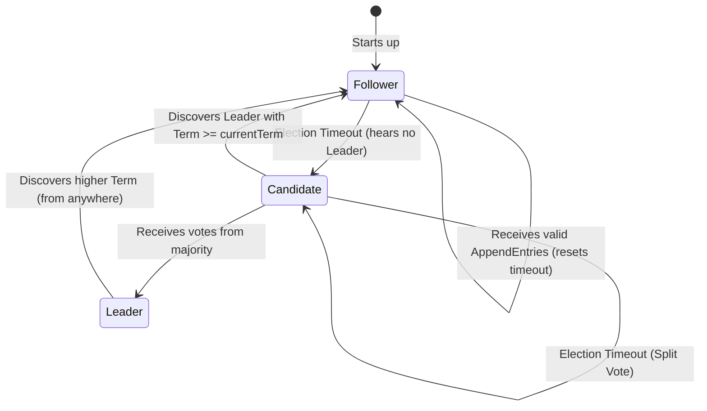

---
tags:
  - "#distributed-systems"
  - "#consensus"
  - "#raft"
  - "#architecture"
aliases:
  - Raft Consensus Algorithm
  - Leader Election
  - Log Replication
---
# L1.DST.09 Raft: Выборы лидера, Репликация лога и Смена конфигурации 

> [!abstract] Определение и философия (TL;DR)
> **Raft** — это алгоритм консенсуса, созданный Диего Онгаро и Джоном Оустерхаутом (Stanford University) с конкретной и осознанной целью: **быть понятным** (Understandability). 
> В отличие от семейства Paxos, которое выводит консенсус из абстрактных математических свойств асинхронной системы (и часто требует десятилетий для создания корректной production-ready реализации), Raft декомпозирует сложную задачу (распределенный state machine replication) на три независимых и жестко разделенных подзадачи: 
> 1.  **Выборы Лидера (Leader Election)**
> 2.  **Репликация Лога (Log Replication)**
> 3.  **Безопасность (Safety)**
> 
> Для уровня **Scholar / Staff Engineer** вы должны понимать не только *как алгоритмически* работает Raft, но и *почему* его осознанные ограничения (такие как Strong Leader constraint, Log Matching Property) делают его математически безопасным на 100%. Более того, вы обязаны знать "темные углы" и нюансы реализации реальных систем (etcd, Consul, TiKV), такие как проблема "Figure 8" (косвенный коммит), защита от Disruptive Servers через Pre-Vote, и тюнинг ReadIndex для масштабирования чтений.

---
Raft — это алгоритм **Strong Leader (Строгий Лидер)**. В функционирующей системе всегда (в нормальном рабочем режиме) существует ровно один легитимный лидер, который берет на себя абсолютную монополию и всю ответственность за управление распределенным логом. 
Данные и команды в Raft текут **только в одном направлении**: $Leader \rightarrow Follower$. Фолловеры никогда не пересылают данные друг другу (в отличие от Gossip-протоколов или некоторых вариаций Paxos), что кардинально упрощает топологию сети и разрешение конфликтов.

---
## 1. Leader Election (Выборы Лидера)

В Raft, в отличие от оригинального Paxos (где лидер — это лишь оптимизация производительности для предотвращения dueling proposers, но любой узел технически может предложить значение), лидер — это **необходимое условие** прогресса. Лидер — это "Диктатор" на время своего Термина (эпохи). Без лидера система полностью останавливается на запись.

### 1.1. Логическое Время: Термины (Terms)

В распределенных системах нет глобальных физических часов (физическое время подвержено дрейфу, скачкам NTP и leap seconds). Время в Raft дискретно и делится на **Термины (Terms)**.

*   **Определение:** $Term$ — это монотонно возрастающее 64-битное целое число ($T_1, T_2, T_3, \dots$), выступающее в роли строгих Логических Часов (Lamport Logical Clocks).
*   **Свойство Эксклюзивности:** Каждый термин начинается с фазы выборов. В одном конкретном термине может быть **выбран максимум один** легитимный лидер. В некоторых терминах выборы могут провалиться (раздвоение голосов), тогда термин завершается вообще без лидера, и немедленно начинается следующий.
*   **Инвариант Подчинения:** Если любой узел (даже если он текущий безоговорочный Лидер) в любой момент получает по сети сообщение с $Term > currentTerm$, он **обязан** немедленно:
    1. Обновить свой локальный `currentTerm` до этого нового значения.
    2. Сбросить свои лидерские или кандидатские амбиции.
    3. Перейти в состояние `Follower`.
    *Это железобетонная защита от Split-Brain и возвращения "старых" лидеров из сетевой изоляции (network partition).*

### 1.2. Конечный Автомат Узла (State Machine Transitions)

Каждый сервер в кластере Raft в любой момент времени находится ровно в одном из трех состояний. Для системного инженера критически важно понимать точные триггеры переходов между этими состояниями:



1.  **Follower (Последователь):** Пассивное состояние. Узел только отвечает на входящие RPC-запросы.
    *   *Поведение:* Отвечает на `AppendEntries` (сердцебиение/логи от Лидера) и `RequestVote` (просьбы о голосовании от Кандидатов). 
    *   *Таймаут:* Запускает внутренний таймер (watchdog). Если не слышит легитимного Лидера (или валидного Кандидата) в течение случайного `ElectionTimeout` ($T_{election}$), он делает вывод, что лидер мертв, и переходит в состояние Candidate.
2.  **Candidate (Кандидат):** Активное состояние "претендента на трон".
    *   *Поведение:* Инкрементирует свой Термин ($T_{new} = T_{old} + 1$), голосует за себя, и рассылает `RequestVote` RPC всем остальным узлам.
    *   *Исход 1 (Победа):* Если получает подтверждающие ответы (голоса) от строгого большинства узлов $\rightarrow$ Переходит в Leader.
    *   *Исход 2 (Поражение):* Если видит `AppendEntries` от другого узла, объявляющего себя Лидером, и чей $Term \ge currentTerm$ Кандидата $\rightarrow$ Признает поражение, переходит в Follower.
    *   *Исход 3 (Ничья):* Если `ElectionTimeout` истек, а победителя в кластере нет (произошел Split Vote) $\rightarrow$ Увеличивает термин и начинает новые выборы (оставаясь Candidate).
3.  **Leader (Лидер):** Активное состояние "абсолютной власти".
    *   *Поведение:* Немедленно по вступлении в должность рассылает пустые `AppendEntries` (Heartbeats) всем узлам, чтобы утвердить свою власть и сбросить их таймеры выборов.
    *   *Правило понижения:* Лидер **никогда** не может добровольно стать Кандидатом и сложить полномочия, пока не увидит более высокий Термин в сети.

---
### 1.3. Процедура Голосования (The Voting Logic)

Процесс выборов в Raft — это элегантная попытка быстро и безопасно нарушить симметрию кластера (когда все узлы равны).

**Псевдокод RPC запроса `RequestVote` (Интерфейс):**
```protobuf
message RequestVoteRequest {
  uint64 term         = 1; // Термин кандидата
  uint64 candidateId  = 2; // Кто просит голос
  uint64 lastLogIndex = 3; // Индекс последней записи в логе кандидата
  uint64 lastLogTerm  = 4; // Термин последней записи в логе кандидата
}

message RequestVoteResponse {
  uint64 term         = 1; // Текущий термин избирателя
  bool   voteGranted  = 2; // Отдал ли голос?
}
```

**Алгоритм Кандидата (Инициатора):**
1.  Инкрементирует $currentTerm \leftarrow currentTerm + 1$.
2.  Голосует за себя: $votedFor \leftarrow self$.
3.  Сбрасывает свой таймер выборов (чтобы не начать новые выборы слишком рано).
4.  Шлет асинхронные RPC `RequestVote` всем узлам кластера в параллель.

**Алгоритм Избирателя (Voter):**
Узел $V$ отдает голос кандидату $C$ (`voteGranted = true`) **тогда и только тогда, когда выполняются ВСЕ три строгих условия**:

1.  **Проверка Термина (Term check):** $Term_C \ge Term_V$. Избиратель никогда не голосует за кандидата из прошлого. Если $Term_C < Term_V$, запрос мгновенно отвергается.
2.  **Защита от двойного голосования (Double Voting check):** Переменная `votedFor` на узле $V$ должна быть либо пустой (`null`), либо равна `candidateId`. 
    *   *Важно:* Один избиратель может отдать только один голос за один конкретный Термин. Так как для победы нужно большинство ($> N/2$), математически невозможно, чтобы два разных кандидата собрали большинство в одном и том же Термине (пересечение множеств большинства всегда содержит хотя бы один узел, а он не мог проголосовать дважды).
3.  **Проверка Полноты Лога (Log Completeness check):** Лог кандидата должен быть " актуальнее или таким же" как лог избирателя.

#### Детализация "Log Completeness Check" [Scholar / Architecture Insight]
Это самое критическое место безопасности (Safety) в алгоритме Raft. Протоколам вроде VRR (Viewstamped Replication) приходится пересылать логи от последователей к новому лидеру, выясняя, кто что сохранил. Raft подошел радикальнее: **Он физически запрещает становиться лидером узлу, у которого нет всех закоммиченных (Committed) данных**.

Как Raft сравнивает логи, чтобы понять, чей лог "новее" или "полнее"?
Сравнение происходит лексикографически путем сопоставления всего лишь двух чисел от конца лога: пары $\langle LastTerm, LastIndex \rangle$.
Лог Кандидата ($A$) считается "свежее или равным" логу Избирателя ($B$), если выполняется булева логика:

$$ (LastTerm_A > LastTerm_B) \lor ((LastTerm_A = LastTerm_B) \land (LastIndex_A \ge LastIndex_B)) $$

*   *Пример 1:* Лог A заканчивается записью `[Term 4, Index 10]`. Лог B заканчивается `[Term 3, Index 1000]`. Кандидат A победит, потому что его последний термин новее (4 > 3), несмотря на то, что лог короче. (B просто наплодил много незакоммиченного мусора в старой эпохе).
*   *Пример 2:* Лог A `[Term 5, Index 50]`. Лог B `[Term 5, Index 51]`. Избиратель B откажет кандидату A, так как при одинаковых терминах лог B длиннее, следовательно, он содержит больше потенциально закоммиченных команд.

**Почему это фундаментально важно?**
Это гарантирует главное свойство Raft: любая закоммиченная на прошлом лидере запись (которая разошлась на большинство) гарантированно присутствует в логе **нового** легитимного лидера. Нам не нужно сложное слияние (merging) логов. Новый Лидер всегда абсолютно прав, и данные всегда текут только в одну сторону ($Leader \rightarrow Follower$), безвозвратно затирая конфликтующие "хвосты" отстающих узлов.

---
### 1.4. Проблема Разделения Голосов (Split Vote Problem)

**Сценарий конфликта (Live-lock):**
Представьте кластер из 4 узлов конфигурации $\{A, B, C, D\}$. (Да, четное число узлов не рекомендуется, но возможно при отказах). Или кластер из 5 узлов, где один мертв. 
Два узла $A$ и $B$ одновременно не дождались хартбита от старого лидера. Оба одновременно объявляют выборы (становятся Candidates).
*   $A$ голосует за себя, и успевает послать `RequestVote` узлу $C$. $C$ голосует за $A$.
*   $B$ голосует за себя, и успевает послать `RequestVote` узлу $D$. $D$ голосует за $B$.
*   Итог: $A$ имеет 2 голоса, $B$ имеет 2 голоса. Никто не набрал спасительное большинство (3 из 4).
Без умного механизма это продолжилось бы в новом термине, создавая вечный Live-lock, когда кластер живет, шлет пакеты, но полезно не работает.

**Элегантное решение Raft: Рандомизация таймеров**
Вместо сложной криптографии или приоритезации по IP-адресам, Raft вводит контролируемый хаос.
`ElectionTimeout` для каждого узла выбирается **строго случайно** из заданного интервала $[T, 2T]$ (например, от 150ms до 300ms) каждый раз, когда таймер сбрасывается.

*   Это аппаратно "размазывает" момент начала выборов. Узел $A$ проснется через 155ms, а узел $B$ через 280ms.
*   Узел $A$ проснется раньше, увеличит Термин, проголосует за себя и успеет собрать голоса других $B$ (ведь $B$ всё еще Follower и спит), установив свою власть до того, как $B$ вообще поймет, что лидера нет.
*   *Инженерный нюанс:* Даже если Split Vote всё же случился чудесным образом (таймеры совпали), кандидаты понимают, что таймаут истек без результата. Они увеличивают термин и пробуют снова, но **с новыми случайными таймерами**. Вероятность 2, 3 или 4 совпадений подряд стремится к математическому нулю экспоненциально.

---
### 1.5. Проблема "Disruptive Server" и Фаза Pre-Vote [Staff Level / Production Reality]

Оригинальная статья Raft описывает алгоритм, который математически безопасен, но имеет огромную дыру в **доступности (Availability)** при сетевых партициях. Это сценарий "Disruptive Server", из-за которого падали ранние версии Consul и etcd.

**Реальный сценарий аварии (Disruptive "Zombie" Server):**
1.  Ваш Production-кластер из 5-ти узлов стабильно работает в $Term=10$. Узел $S_1$ — лидер.
2.  Сервер $S_5$ (из-за бага в свитче) попадает в сетевую изоляцию (Symmetric Network Partition: он не видит никого, его не видит никто).
3.  $S_5$ перестает получать Heartbeats от $S_1$.
4.  Через 150ms `ElectionTimeout` истекает. $S_5$ переходит в Candidate, делает $Term=11$, голосует за себя. Никто не отвечает (сеть лежит).
5.  Таймаут истекает снова. $S_5$ делает $Term=12$... $Term=13$...
6.  Спустя 2 часа изоляции, сетевики чинят коммутатор. $S_5$ возвращается в кластер. Внутри $S_5$ на счетчике $Term=45000$.
7.  $S_5$ немедленно шлет любой пакет (например, свой очередной `RequestVote`) живому и здоровому Лидеру $S_1$.
8.  Лидер $S_1$ (работавший на $Term=10$) видит входящий пакет с $Term=45000$. По жесткому инварианту Raft (см. пункт 1.1), он **обязан** признать, что он безнадежно отстал по времени. $S_1$ сбрасывает с себя полномочия лидера, переходит в Follower и кластер замирает.
9.  Начинаются выборы в Термине 45000. $S_5$ никогда не станет лидером (его лог отстал на 2 часа, он не пройдет Log Completeness check у узлов $S_1-S_4$). В итоге лидером станет кто-то из $S_1-S_4$ (например, $S_2$ в Термине 45001).

**Итог катастрофы:** Из-за возвращения в строй дохлого узла, абсолютно здоровый кластер потерял лидера, прервал все TCP сессии клиентов и ушел в перевыборы, создав даунтайм. Это недопустимо.

**Решение индустрии: Расширение Pre-Vote (Фаза 0)**
Алгоритм Raft был дополнен неофициальной, но обязательной в Production фазой. Перед тем как увеличить реальный $currentTerm$ и стать самоубийственным Кандидатом, сервер, у которого истек таймаут, переходит в промежуточное состояние `Pre-Candidate`.

*Алгоритм Pre-Vote:*
1.  Узел отключается от Лидера (таймаут). Он шлет `PreVote` RPC с текущим термином (НЕ увеличивая его).
2.  Другие узлы, получив `PreVote`, отвечают "Да" или "Нет", **не меняя** и не инкрементируя свой текущий термин в памяти.
3.  **Ключевое правило проверки:** Фолловер ответит "Да" на `PreVote` **только если** он сам считает, что лидера сейчас нет (например, он *не* получал Heartbeats от Лидера в течение как минимум `ElectionTimeout`). Если фолловер стабильно получает пинги от живого Лидера (как узлы $S_1-S_4$ в нашем примере), он отвергнет `PreVote` зомби-сервера $S_5$.
4.  Если `Pre-Candidate` ($S_5$) получает отказ от большинства, он понимает, что он отрезан от мира, а мир жив. Он остается в статусе `Pre-Candidate` или возвращается в `Follower`, **так и не увеличив** глобальный $currentTerm$. 
5.  Кластер спасен от бессмысленного возмущения терминами.

---
### 1.6. Timing Constraints (Жёсткая физика времени)

Для того чтобы Raft работал стабильно (не входил в цикл постоянных и нескончаемых перевыборов из-за слишком коротких таймаутов), физическая инфраструктура должна гарантировать выполнение следующего неравенства:

$$ \text{BroadcastTime} \ll \text{ElectionTimeout} \ll \text{MTBF} $$

Где $\ll$ означает "по крайней мере на порядок (в 10-100 раз) меньше".

1.  **BroadcastTime (Время вещания):** Тотальное время (Network RTT + CPU Serialization + TCP kernel buffers), необходимое Лидеру, чтобы физически дослать Heartbeat (`AppendEntries`) во все концы кластера и получить сетевые подтверждения.
    *   *Реальность:* Обычно составляет от $0.5ms$ до $20ms$ в LAN-сетях. Лидер должен успевать "бить в барабан" сильно быстрее, чем у самых нетерпеливых фолловеров закончится `ElectionTimeout`.
2.  **ElectionTimeout (Таймаут выборов):** Случайное окно (например, 150ms - 300ms), в течение которого ожидающий фолловер решает инициировать свержение власти.
3.  **MTBF (Mean Time Between Failures):** Среднее время между аппаратными отказами сервера (месяцы или годы).

**Пример из практики для Software Architect:** 
Представьте, что вы написали реализацию Raft на Java или Go, и ваш процесс имеет конфигурацию `ElectionTimeout = 100ms` (для быстрой реакции на сбои). Под пиковой нагрузкой сборщик мусора (GC) запускает фазу Stop-The-World (когда все потоки приложения замирают). Пауза GC длится `150ms`. 
Во время этой паузы Лидер физически не может послать Heartbeat. Фолловеры (или часть из них, у которых GC отработал быстрее) видят, что $150ms > 100ms$, решают, что Лидер мертв, и начинают выборы. 
*Следствие:* Кластер постоянно флапает (flapping) лидера без реальных сетевых/аппаратных сбоев, только из-за пауз JIT компиляции или GC. 
*Решение уровня Staff:* Тщательный тюнинг JVM/Go runtime, либо увеличение `ElectionTimeout` до значений, превосходящих любую (даже p99.9) системную паузу (например, до 1500ms-3000ms для тяжелых Java баз).


---
## 2. Log Replication (Репликация Лога)

Раздел "Репликация Лога" в оригинальной статье Raft и многих туториалах кажется обманчиво простым ("Лидер просто отправляет данные фолловерам и ждет подтверждений"). Но именно здесь кроются самые тонкие нюансы производительности и гарантии сохранности данных (Data Safety). Для уровня **Staff Engineer** понимание репликации не ограничивается фразой "лидер шлет Heartbeats". Вам необходимо глубоко понимать механику индуктивного обнаружения конфликтов, оптимизацию восстановления (Fast Recovery Protocol) и строгие правила фиксации прошлых терминов (The Figure 8 Commitment Rules).

В Raft распределенный Лог — это не просто журнал истории или WAL (Write-Ahead Log) для бэкапов. Это **единственный источник абсолютной истины** для детерминированного конечного автомата (State Machine Replica). Если кластер Raft обслуживает базу данных (например, K/V хранилище etcd), то база данных просто читает последовательно этот лог и применяет команды `SET x=1, SET y=2`. Если узел имеет закоммиченную (Committed) запись в своем логе, Raft гарантирует математически, что эта операция выполнена (или в будущем будет выполнена) абсолютно одинаково на всех живых узлах кластера.

### 2.1. Анатомия Лога и Жизненный Цикл Записи

Каждая запись лога (Log Entry) представляет собой иммутабельный кортеж:
$$ Entry_i = \langle Index, Term, Command \rangle $$

*   **Index:** Строгий порядковый номер в массиве лога ($1, 2, 3 \dots$). Идентифицирует позицию команды в истории. Индексы никогда не пропускаются в нормальном режиме.
*   **Term:** Номер эпохи (Термин), в которую эта запись была *изначально* создана Лидером. Это критически важное свойство для обнаружения скрытых несогласованностей (Inconsistency Detection). Запись *навсегда* сохраняет свой изначальный Term, даже если она реплицируется Лидерами из будущих Терминов.
*   **Command:** Произвольная полезная нагрузка (Payload) для клиентской State Machine (например, бинарный блоб `SET user_id=5 status=active`). Raft не понимает семантику команд.

**Жизненный цикл типичной операции (Write Pipeline):**
1.  **Append (Локальная запись):** Лидер получает пользовательскую команду. Он назначает ей следующий `Index` и свой текущий `Term`, добавляет её в свой локальный лог памяти и **обязательно** сбрасывает на диск (через `fsync` в WAL), прежде чем продолжить. (Пока команда *невидима* для всех).
2.  **Replicate (Рассылка RTT 1):** Лидер параллельно (асинхронно) отправляет RPC `AppendEntries` всем доступным Фолловерам, вшивая в пакет саму команду и проверочные хеши.
3.  **Majority Acknowledge:** Лидер ждет подтверждения (`SUCCESS=true`) успешной физической записи от строгого большинства узлов (от $N/2 + 1$), включая самого себя. 
4.  **Commit (Фиксация):** Как только большинство набрано, Лидер локально переводит команду в статус "вечной". Он продвигает свой внутренний указатель `commitIndex`. С этого момента транзакция "продетонировала" — ее уже невозможно отменить.
5.  **Apply (Применение State Machine):** Лидер применяет команду к своей локальной State Machine (например, меняет значение в HashMap) и возвращает результат клиенту (`HTTP 200 OK`). Этот шаг может быть асинхронным.
6.  **Notify (Уведомление Фолловеров RTT 2):** В следующем регулярном пакете `AppendEntries` (даже если это пустой Heartbeat), Лидер присылает обновленное значение `leaderCommit`. Фолловеры видят, что индекс вырос, понимают, что транзакция стала безопасной, и тоже применяют ее локально к своим State Machines.

---
### 2.2. Log Matching Property (Фундаментальный Индуктивный Инвариант)

Безопасность (Safety) всего алгоритма Raft строится на **Свойстве Совпадения Логов**. Это элегантное свойство позволяет распределенным узлам бесконечно доверять друг другу, проверяя только одну, самую свежую запись по сети, а не скачивая мегабайты истории.

Инвариант звучит так: "Если два разных лога на любых разных машинах содержат запись с одинаковыми $Index$ $i$ и $Term$ $t$, то:"
1.  **Прямое свойство (Локальное совпадение):** Обе эти записи гарантированно содержат одну и ту же бинарную `Command`.
    *   *Математическое обоснование:* Строгий Лидер создает только одну запись для данного лог-индекса в рамках своего одного Термина. И лог-записи никогда не меняют свою позицию в логе. Таким образом, $\langle Index, Term \rangle$ является абсолютно уникальным составным первичным ключом для команды.
2.  **Индуктивное свойство (Глобальное совпадение префиксов):** Логи на обеих машинах абсолютно **идентичны** во всех записях, предшествующих $i$ (от нулевого индекса $0$ вплоть до позиции $i-1$).
    *   *Математическое обоснование:* Это гарантируется жесткой проверкой `Consistency Check` (см. пункт 2.3) при обработке каждого пакета `AppendEntries`.

**Значение для Архитектора:** Если медленный Фолловер подтвердил получение и запись пакета с `Index=100`, Лидеру не нужно запрашивать checksums для записей 1–99. Индуктивное свойство математически исключает сценарий, при котором запись 100 совпадает, а запись 98 отличается. Лидер "бесплатно" уверен в консистентности терабайтной истории.

---
### 2.3. Consistency Check и Обработка Конфликтов (Backtracking)

При сетевых сбоях (network partitions) логи неизбежно расходятся. Старый Фолловер, который 5 минут был Лидером в своей "отрезанной" части сети (но не мог коммитить), может иметь десятки лишних незакоммиченных и ошибочных записей (Dirty Tail). 

Как Raft, который не пересылает историю целиком, удаляет этот мусор?

**Механизм RPC `AppendEntries` с "застежкой" (Zipper mechanic):**
В каждом отправляемом запросе на репликацию (даже пустом пинге) Лидер посылает не только новые данные для записи, но и "проверочную пару" (Checksum Anchor) самой последней **предыдущей** известной записи:

```protobuf
message AppendEntriesRequest {
  uint64 term         = 1; 
  uint64 leaderId     = 2;
  uint64 prevLogIndex = 3; // Якорь: Индекс предыдущей записи на лидере
  uint64 prevLogTerm  = 4; // Якорь: Термин предыдущей записи
  repeated LogEntry entries = 5; // Новые данные
  uint64 leaderCommit = 6; 
}
```

**Алгоритм Фолловера (Индуктивный откат):**
1.  Фолловер берет якорь Лидера (`prevLogIndex`) и заглядывает в свой локальный файловый WAL.
2.  **Сценарий A (Дыра):** Если по индексу `prevLogIndex` вообще **нет** никакой записи (Фолловер сильно отстал).
    *   Фолловер отвергает запрос возвращая `SUCCESS = false`.
3.  **Сценарий B (Конфликт Терминов):** Если запись есть, но её локальный Термин **не совпадает** с присланным `prevLogTerm` (Это значит, что "грязный" хвост Фолловера уходит далеко в прошлое).
    *   Фолловер отвергает запрос возвращая `SUCCESS = false`.
4.  **Сценарий C (Успех):** Если $\langle prevLogIndex, prevLogTerm \rangle$ идеально совпадают!
    *   Фолловер радостно возвращает `SUCCESS = true`, **ПЕРЕЗАПИСЫВАЯ** все данные начиная с `prevLogIndex + 1` содержимым массива `entries` из запроса Лидера. Любой "грязный хвост" (вплоть до будущих индексов) безвозвратно удаляется (Truncated).

**Поиск Точки Расхождения (Backtracking / The Zipper):**
Если Фолловер ответил `false` Лидеру, Лидер понимает, что "застежка сломана". В наивной академической реализации Raft Лидер просто берет переменную состояния этого Фолловера `nextIndex` (которую он хранит в RAM), уменьшает её на $1$, и повторяет отправку `AppendEntries` для предыдущего куска истории. Он продолжает отматывать назад по одному пакету, пока не найдет точку совпадения (The Pivot).

*   *Инженерная проблема:* Если Фолловер был отключен неделю, отстал на $50,000$ записей, то наивный Лидер потратит 50,000 RTT (сетевых перелетов) только чтобы найти общую точку. В глобальных WAN-сетях (задержка 150ms) это $50,000 * 150ms = 2$ часа простоя протокола. Это катастрофа.

**Оптимизация Scholar-уровня (Fast Recovery / Hinted Backtracking):**
В индустриальных базах (TiDB, CockroachDB) вместо просто `false`, умный Фолловер возвращает подсказку (Conflict Hint).
*   Если у фолловера **нет** записи по индексу `prevLogIndex` (Сценарий A), он возвращает длину своего лога. Лидер сразу перепрыгивает в этот конец.
*   Если есть **конфликт Термина** (Сценарий B), Фолловер возвращает этот конфликтный Термин $T_{bad}$ и индекс **первой** записи в логе, которая имеет этот $T_{bad}$.
*   *Результат:* Лидер, получив подсказку, прыгает назад не на одну позицию ($-1$), а перепрыгивает целые Термины, обрезая тысячи ошибочных записей за один RTT. Время синхронизации падает с 2 часов до 1 секунды.

---
### 2.4. Safety: Непостижимая Проблема Фиксации прошлых терминов (The Figure 8 Issue)

Это, возможно, самый сложный для интуитивного понимания аспект Raft, отличающий его от простого правила "большинство реплик подтвердило = закоммичено навсегда".

**Абсолютная Аксиома Raft:** Лидер **НИКОГДА не имеет права** считать логическую запись (Log Entry), созданную прошлыми Лидерами (из предыдущих терминов), закоммиченной, **просто посчитав большинство реплик**. Подсчет голосов большинства для немедленного коммита работает только для записей, созданных в **текущем Термине**.

**Детальный разбор катастрофы, если бы этой аксиомы не было (The Figure 8 Scenario):**

Состояния кластера из 5 серверов ($S_1-S_5$). Каждый бокс показывает лог узла.

```text
Сценарий (a):
S1 (Leader T2): [T1, T2] <- Запись "Y" (Term 2) реплицирована только на S2
S2:             [T1, T2]
S3:             [T1]
S4:             [T1]
S5:             [T1]
S1 упал.

Сценарий (b): S5 становится Лидером (собрал голоса S3, S4, S5).
S1:             [T1, T2] (Спит)
S2:             [T1, T2] (Спит)
S3:             [T1]
S4:             [T1]
S5 (Leader T3): [T1, T3] <- В тот же Индекс 2 он пишет команду "X" (Term 3)
S5 упал до репликации.

Сценарий (c): S1 просыпается, становится Лидером в Термине 4.
Он продолжает реплицировать свою старую "желтую" запись "Y" (Term 2).
S1 (Leader T4): [T1, T2] 
S2:             [T1, T2]
S3:             [T1, T2] <- Запись реплицирована!
S4:             [T1]
S5:             [T1, T3] (Спит)
```

**Остановка и Анализ (Момент X):**
Запись `[T1, T2]` ("Y") сейчас находится на $S_1, S_2, S_3$. Это большинство! Это кворум 3 из 5!
Может ли Лидер $S_1$ радостно закоммитить запись (Index 2, Term 2) и ответить клиенту, что "Все Ок"?
*   Если бы он это сделал, он мог бы продвинуть `commitIndex=2` и вернуть "OK" пользователю.

Но тут случается сбой. $S_1$ снова падает.

```text
Сценарий (d): S5 просыпается. У него Термин 3 в логе. 
Может ли он стать лидером в Термине 5? Да!
По правилам голосования, его лог [T1, T3] (индекс 2, термин 3) оказывается НОВЕЕ, чем логи S2, S3 и S4, которые заканчиваются на [T1, T2] (ведь Term 3 > Term 2!).
S5 забирает голоса S2, S3, S4.
S5 (Leader T5): [T1, T3]
```

Став Лидером, $S_5$ начинает рассылать мощный `AppendEntries`. Он видит несоответствие логов на фолловерах.
По правилу Лидера, $S_5$ **силой перезаписывает** Index 2 (стерши "Y" и записав свое старое "X") на узлах $S_2$ и $S_3$.
**Итог:** Запись "Y" удалена навсегда, хотя ранее (в Момент X) мы посчитали ее "закоммиченной" большинством и ответили клиенту "OK".
Это фундаментальная потеря Safety.

**Решение Raft (Indirect Commitment / Косвенный Коммит):**

Raft запрещает $S_1$ (В моменте X) напрямую коммитить запись `Term 2`, просто считая реплики, потому что $S_1$ сейчас в `Term 4`.
Raft диктует железное правило: Лидер ($S_1$) имеет право коммитить (продвигать `commitIndex`) путем подсчета кворумных реплик **ТОЛЬКО записи своего персонального, текущего Термина** (`Term 4`).

Как же закоммитить старую запись? **Косвенно!**
*   В сценарии (c), Лидер $S_1$ (Term 4) должен создать минимум одну НОВУЮ пустую запись No-Op (Index 3, Term 4) и попытаться реплицировать её.
*   Как только `[Term 4, Index 3]` наберет большинство (станет присутствовать на $S_1, S_2, S_3$), она коммитится "легально", как запись текущего термина.
*   И в эту же секунду, автоматически, все записи до Индекса 3 (включая ту злополучную запись Term 2 в Индексе 2) **считаются закоммиченными** (на основании Индуктивного Свойства лога из пункта 2.2).
*   Если после этого $S_1$ упадет, то проснувшийся Сценарий (d) с $S_5$ уже **невозможен**. $S_5$ со своим устаревшим `[T1, T3]` не наберет голоса ни у $S_1$, ни у $S_2$, ни у $S_3$, потому что все они будут иметь `[... Term 4]`, что больше 3. Safety спасена.

---
### 2.5. Разделение понятий: Commit Index vs Last Applied (Декомпозиция I/O)

Для инженера, пишущего production код или тюнящего метрики Prometheus, критично различать два важнейших указателя в системе Raft:

*   `commitIndex`: Индекс самой высокой записи, о которой сетевому кластеру Рафт известно, что она безопасно реплицирована (принята кворумом RAM+Disk). Это свойство **Консенсуса (Сетевой Надежности)**. Обновляется Лидером при получении ответов.
*   `lastApplied`: Индекс самой высокой записи, которая физически была скормлена и "переварена" (Applied) State Machine (вашей реальной базой данных/бизнес-логикой). Это свойство **Локального Исполнения (CPU Execution)**. Обновляется локальным процессом по мере выполнения команд.

**Инженерный Цикл исполнения и Bottlenecks:**
**Жесткое Правило:** `lastApplied` всегда отстает от или равен `commitIndex`. ($lastApplied \le commitIndex$).
В фоновом потоке, каждый узел Raft (и Лидер, и Фолловер) имеет асинхронный `applyLoop`:
```go
for {
    <-commitIndexUpdatedTrigger
    while (lastApplied < commitIndex) { 
        lastApplied++
        applyToStateMachine(log[lastApplied])
    }
}
```

**Критическая важность для архитектуры:**
Сетевая репликация (консенсус) в Raft феноменально быстра, так как это просто запись в бинарный append-only WAL. 
А вот `applyToStateMachine(log[lastApplied])` (накатывание транзакции в базу, построение индексов B-Tree) может быть катастрофически медленным (блокировки, вычисления). 
Разделение этих двух индексов гарантирует мощную изоляцию компонентов приложения (Component Asynchrony). Raft (сетевой слой) не блокируется медленным парсером JSON в бизнес-логике. Он продолжает собирать `commitIndex`, позволяя `lastApplied` "догонять" его в своем темпе (создавая буфер backpressure). 
Если ваш кластер имеет большой разрыв `(commitIndex - lastApplied)`, это сигнализирует в Grafana, что ваша State Machine "захлебнулась" от пропускной способности консенсуальной трубы.

---
## 3. Membership Change (Динамическое Изменение Конфигурации Кластера)

Раздел о смене конфигурации (Membership Change / Reconfiguration) исторически является самым слабым местом в ментальной модели инженеров, изучающих Raft, хотя именно здесь происходят самые катастрофические и необратимые аварии в production-кластерах (расщепление мозга, потеря данных, бесконечные live-locks при масштабировании оркестраторов вроде Kubernetes).

Оригинальное описание Raft довольно сжато и сухо, а предложенный там "Joint Consensus" (Совместный Консенсус) настолько сложен в безошибочной кодовой реализации, что даже авторы etcd признавались, что потратили месяцы на отладку корнер-кейсов. В современной индустриальной практике (Consul, CockroachDB) безоговорочно доминирует математически доказанный, но более поздний подход "Single-Server Changes" (Изменения по одному серверу). Обе архитектуры требуют детального разбора для Staff Engineer.

---

Статические кластеры, в которые гвоздем забиты IP-адреса `10.0.0.1, 10.0.0.2, 10.0.0.3` перед сборкой бинарника, — это утопия 90-х годов. Серверы сгорают, AWS-зоны падают, нагрузка растет, мы постоянно делаем автоматический `scale-out` (добавление новых узлов) или горячую замену оборудования (hardware rotation). 

Главная проблема любого протокола изменения конфигурации — **безопасность транзитного периода (The Transition Gap)**. Мы физически не можем (свойства CAP-теоремы и асинхронных сетей) остановить кластер ("stop-the-world"), гарантированно обновить конфигурационный файл на всех узлах на один и тот же такт миллисекунды и запустить их снова синхронно. Мы обязаны менять $C_{old}$ (старую историческую конфигурацию серверов) на $C_{new}$ (новую целевую) "на лету", не прерывая поток обслуживания клиентов "ни на один пинг". 

### 3.1. Фундаментальная Архитектурная Угроза: Проблема Дизъюнктных Кворумов

Почему мы не можем просто послать административную команду "Эй, кластер, переключись на новую конфигурацию с завтрашнего дня"?
Потому что часы, скорость сети и I/O-задержки у всех участников разные. Некоторые узлы переключатся мгновенно, другие (после GC паузы) — через 5 секунд. 

**Сценарий катастрофы (Неустранимый Split Brain):**
Представьте работающий кластер из 3 старых узлов: $C_{old} = \{A, B, C\}$. Размер кворума (большинство) для принятия решений в нем = 2.
Мы решили сделать scale-out и добавляем *сразу* 2 новых узла: $C_{new} = \{A, B, C, D, E\}$. Размер кворума в новой 5-узловой конфигурации = 3.

Допустим, сервер $A$ получил административную команду (RPC) `UpdateConfig(C_new)`, обработал ее и перешел на $C_{new}$ (он видит 5 серверов). Сервер $B$ (из-за лага сети или диска) еще не получил команду и остался жить в "мире" $C_{old}$ (он видит только 3 сервера).
Теперь (на момент падения лидера) в системе открывается портал в ад: возможна легитимная математическая ситуация существования **двух абсолютно независимых легитимных лидеров**:

1.  **Лидер 1 (Сервер B):** Живет в старой парадигме $C_{old}$. Он увеличивает свой Term, голосует за себя и просит голос у $C$. Сервер $C$ (тоже лагающий) отдает ему голос. Вместе подмножество $\{B, C\}$ составляют большинство (2 из 3) для $C_{old}$. Для мира $C_{old}$ сервер $B$ — абсолютно законный Лидер. Он начинает принимать клиентские транзакции и коммитить их, разрушая историю.
2.  **Лидер 2 (Сервер A):** Живет в новой парадигме $C_{new}$. Он увеличивает свой Term (допустим, такой же, что и у B), просит голоса у новеньких, пустых, но амбициозных $D$ и $E$. Вместе $\{A, D, E\}$ составляют легитимное большинство (3 из 5 узлов) *для парадигмы* $C_{new}$. Для мира $C_{new}$ сервер $A$ — законный Лидер. Он коммитит *другие, параллельные* транзакции в лог.

**Результат:** Абсолютное, легитимное, неустранимое нарушение Safety. Два независимых лидера, не знающих друг о друге, но собравших "свои" непересекающиеся (Disjoint) кворумы, одновременно изменяют, казалось бы, один глобальный лог. Это Split Brain (Расщепление мозга), после которого базу данных можно только выбросить и восстановить из бэкапа вчерашнего дня.

---
### 3.2. Подход 1: Joint Consensus (Совместный Двойной Консенсус)

Оригинальная академическая статья Raft предлагает мощное, универсальное, но тяжеловесное решение — Joint Consensus. Оно позволяет безопасно менять (удалять/добавлять) *любое произвольное* количество серверов в кластере за один раз (например, полная миграция кластера из дата-центра DC1 в новый дата-центр DC2: из $\{A,B,C\}$ в $\{X,Y,Z\}$).

Концептуальная идея заключается во введении четко определенного промежуточного (транзитного) состояния $C_{old,new}$, где правила голосования требуют маниакального согласия (кворумов) **обоих миров одновременно**.

#### Детальная Механика перехода (Двухфазный коммит конфигурации):
Процесс разбивается на две строгие фазы консенсусной записи специальных 'configuration log entries' в стандартный лог транзакций:

1.  **Фаза 1: Вход в состояние Joint Consensus ($C_{old,new}$).**
    *   Лидер (работающий еще в $C_{old}$) получает от администратора команду на переезд.
    *   Он создает специальную запись(Entry) конфигурации типа $C_{old,new}$ (буквально, объединяя множества серверов и новые правила игры) и помещает её в свой WAL-лог.
    *   **Магическое Правило Кворума Фазы 1:** Чтобы закоммитить *любое* решение (будь то выборы нового лидера или клиентская запись `SET x=1`) в состоянии $C_{old,new}$, Лидер обязан собрать **непересекающееся большинство из подмножества $C_{old}$ И, независимо от него, большинство из подмножества $C_{new}$**.
    *   **Пример:** Переход от $\{A,B,C\}$ ($C_{old}$) к $\{A,B,C,D,E\}$ ($C_{new}$). Решение принято, только если за него проголосовали (2 из 3 старых: например, A, B) $\land$ (3 из 5 новых: например, A, B, D).
    *   **Смысл:** Это "железобетонный мост" между континентами. Ни старое лобби $C_{old}$, ни новая кровь $C_{new}$ математически не могут принять ни одного решения единолично. Невозможно выбрать двух лидеров, так как для победы каждому нужен голос от пересекающихся узлов.
    *   Как только *любой* сервер просто получает эту Entry в лог по сети (даже до стадии Commit!), он немедленно активирует этот "двойной" кворум для своих будущих проверок и голосований.

2.  **Фаза 2: Выход в $C_{new}$ (Сжигание мостов).**
    *   Как только транзитная запись $C_{old,new}$ надежно закоммичена на кворуме (обеих сторон), Лидер $C_{old,new}$ создает финальную системную запись $C_{new}$.
    *   Как только Фолловер получает эту запись, он отключает проверку старой конфигурации. В этот момент правила кворума снова становятся простыми (стандартное большинство только из $C_{new}$).
    *   И вот только в эту секунду — как только запись $C_{new}$ зафиксирована (committed) — Лидер имеет право элегантно отключить узлы, не входящие в новую конфигурацию (shutdown old nodes), и завершить миграцию.

**Недостатки и критика:**
Чрезвычайно сложная алгоритмическая реализация (конечный автомат раздувается в 3 раза). Нужно педантично обрабатывать сбои и откаты изменений на всех узлах, если лидер неожиданно упадет во время нахождения в промежуточном состоянии.

---
### 3.3. Подход 2: Single-Server Changes (Стандарт индустрии)

В диссертации Онгаро (опубликованной позже знаменитой статьи на USENIX) было опубликовано элегантное доказательство того, что если на уровне администратора/оператора ограничить топологические изменения кластера **исключительно добавлением или удалением только одного узла строго за раз (One-by-One)**, то мучительный Joint Consensus вообще не нужен для Safety.

#### Математическое обоснование и Элегантность:
Пусть мы переходим от кластера размером $N$ серверов к $N+1$ (добавление) или $N-1$ (удаление).
*   Допустим, Лидер инициирует конфигурацию $C_{new}$ (размер $N+1$). Часть узлов уже получила $C_{new}$, часть еще сидит в $C_{old}$ (размер $N$).
*   **Теорема Пересечения Большинств:** Любое строгое большинство множества из $N$ элементов (прошлое) **всегда имеет хотя бы один гарантированный общий (пересекающийся) узел** с любым строгим большинством множества из $N+1$ элементов (будущее).

*Математический пример защиты от расщепления:*
Было $C_{old} = \{A, B, C\}$ (кворум 2). Стало $C_{new} = \{A, B, C, D\}$ (кворум 3).
Допустим, произошло разделение и кластер хочет выбрать двух лидеров (из $C_{old}$ и из $C_{new}$).
*   Кто-то (Лидер 1) должен собрать большинство старых: например, $\{A, B\}$.
*   Кто-то другой (Лидер 2) должен собрать большинство новых: например, $\{B, C, D\}$.
*   **Пересечение (Crux):** Узел $\{B\}$ обязан присутствовать в **обеих** группах большинства!
*   **Итог:** Так как пересекающийся элемент $B$ обязан отдать голос *обоим* кандидатам, а по правилам алгоритма Raft (пункт 1.3) узел легитимно может проголосовать только "Один раз за один Термин", математически невозможно, чтобы и Лидер 1, и Лидер 2 победили одновременно. Один из них заблокирует другого (отказав в голосе по причине `term check` или `double voting`). Split brains and disjunctive quorums are dead.

**Staff-level implementation details (Как это в коде etcd):**
1.  Лидер получает транзакцию `AddServer(node_D)`.
2.  Лидер сериализует административную команду и добавляет в свой WAL-лог новую запись $C_{new}$.
3.  **Критический момент:** Сервер переключается на новые правила конфигурации **сразу же**, как только синтаксически записывает этот Entry конфигурации в свой локальный лог диска (он не ждет фазы "Commit"!). 
4.  Если лидер падает до коммита этой спец-записи, новый выбранный лидер может либо:
    *   Продолжить работать в $C_{new}$ (если запись $C_{new}$ случайно выжила при смене лидера на его диске).
    *   Безопасно откатиться назад к $C_{old}$ (если запись не успела долететь по сети до выбранного нового лидера).
5.  Оба исхода 100% безопасны. Кластер не "зависает" навсегда.

---
### 3.4. Инженерные ловушки в Production (Operational Pitfalls)

Для хорошего системного архитектора знать теорию недостаточно, нужно уметь предсказывать падения боевых систем. Наиболее частые аварии при использовании "Single-Server Change".

#### А. Проблема недоступности при масштабировании (The Add-Node Availability Gap)

Вы наняли Junior DevOps. Ваш высоконагруженный кластер Consul $\{A, B, C\}$ приближается к пределу CPU. Девопс запускает скрипт для быстрого добавления нового сервера $D$. 

*   Когда Лидер добавляет новый, абсолютно чистый и пустой сервер $D$ (у которого нет ни одного лога), кворум мгновенно вырастает с требуемых 2 узлов (в старом $C3$) до 3 (в новом $C4$).
*   Новый узел $D$ не может голосовать на коммиты транзакций (он не знает данных). Лидеру нужно время, чтобы передать на $D$ гигабайтный Snapshot базы данных и переслать `AppendEntries`-логи. 
*   **Новая суровая реальность:** До тех пор, пока пустой узел $D$ не скачает базу (несколько минут), для обработки *любого* клиентского запроса лидер обязан опираться на ответы $\{A, B, C\}$. У него нет права на ошибку.
*   **Катастрофа:** Если во время этой синхронизации узла $D$ временно моргнет сеть на старом сервере $A$, количество активных голосов упадет до 2. А кворум теперь 3! 
*   **Результат:** Момент попытки улучшить кластер (добавление узла) мгновенно приводит к потере Liveness (Доступности). Кластер падает на запись (Availability Drop).

**Архитектурное Решение-Паттерн: Learners (Non-voting members) или Промоушен:**
В etcd добавили статус **Learner (Ученик)**.
Новый узел $D$ инициируется в кластер как Learner.
1.  Learner полностью прозрачен для консенсуса. Он **не меняет** конфигурацию $C_{old}$ и не влияет на подсчет кворума большинства.
2.  Он жадно потребляет репликацию лога (Snapshots + `AppendEntries`).
3.  Лидер фоном отслеживает метрику его отставания (Catch-up delay).
4.  Только когда отставание становится $0$ (или доли секунды), Лидер автоматически генерирует транзакцию конфигурации $C_{new}$ ("Полноценный Участник $D$"). Узел промоутится в **Voter** мгновенно и безболезненно. Availability gap устранен на 100%.

#### Б. Удаление самого Лидера (Leader Step Down)

Что делать, если Devops-скрипт выполняет HTTP-вызов `RemoveServer(A)`, и по фатальному совпадению именно узел $A$ является текущим Лидером, обрабатывающим этот вызов?

Наивная реализация убьет и повесит кластер.
Правильная (Staff-level) архитектура:
1.  Лидер $A$ генерирует и принимает в свой лог системную запись $C_{new}$ (в которой списка серверов $A$ больше не существует!).
2.  Парадокс: Лидер $A$ обязан зареплицировать эту запись на оставшиеся узлы, *будучи уже логически исключенным* из кластера. На этом этапе $A$ больше не считает свой собственный голос при вычислении большинства (ведь его нет в $C_{new}$).
3.  Как только запись успешно закоммичена на кворуме оставшихся узлов, $A$ немедленно должен добровольно сложить с себя полномочия (**Step Down**). Он переходит в статус Follower, рубит TCP коннекты к другим, и (в разных реализациях) завершает свой процесс (Exit).
4.  В "осиротевшем", но сохраненном кластере штатно срабатывают `ElectionTimeout`, начинаются новые выборы, и выбирается новый Лидер.

#### В. Изолированные Зомби при удалении (The Removed Disruptive Server)

Мы удалили сервер $X$ скриптом.
Удаленный сервер $X$ продолжает работать. Он больше не получает Heartbeats. Его таймер выборов срабатывает 5 раз в секунду. Он думает: "Мой Лидер умер!". Он увеличивает свой Термин (становится Термин 400), становится Кандидатом и отчаянно рассылает по локальной сети широковещательные крики `RequestVote(Candidate=X, Term=400)`.

*Недосмотр проектировщика:* Оставшийся живой здоровый кластер (который прекрасно знает, что $X$ удален) *мог бы* просто игнорировать его. НО! Протокол Raft — это протокол Терминов. Любой узел Raft (даже Лидер), получив пакет с Термином 400 (который больше его Термина 20), обязан **безусловно** сбросить полномочия.
*Итог:* Один удаленный "по крику" зомби-сервер, который забыли отключить от питания в стойке, будет каждые $T$ миллисекунд убивать лидера и отправлять весь здоровый кластер в бесконечный цикл выборов и даунтаймов.

**Защитное Решение: Pre-Vote Check (Фаза 0) и Leader Liveness Check:**
Узлы в производстве должны модифицировать базовый фильтр `RequestVote`: 
"Если я уверен, что мой текущий Лидер жив и здоров (т.е. я получал от него валидный Heartbeat менее чем `1 x ElectionTimeout` назад), я **игнорирую** и **отвергаю** ЛЮБЫЕ входящие запросы `RequestVote` и `PreVote`, независимо от их гигантского Термина".
Это элегантное правило (официально предложенное в диссертации Онгаро) аппаратно блокирует Зомби-серверам возможность шантажировать здоровый кластер своими астрономическими Терминами, полностью стабилизируя систему при конфигурационных сдвигах.


---
## 4. Инженерные аспекты уровня Staff (Performance & Optimizations)

Raft в его чистом академическом виде (свод правил из раздела 2) гарантирует 100% безопасность, но крайне неэффективен для реальных HighLoad нагрузок. На каждый запрос (даже на чтение!) чистому Raft требуется полная сериализация, запись на SSD диск (I/O fsync), отправка по сети к большинству фолловеров и ожидание кворума ACK-ов. С такой архитектурой кластер на жестких дисках выдаст 100 RPS и умрет.
В современном Production (TiKV, CockroachDB, etcd, Consul) мы применяем ряд сложнейших оптимизаций, которые существенно усложняют код, но жизненно необходимы для достижения сотен тысяч RPS и субмиллисекундных задержек (Latency).

### 4.1. Линеаризуемые Чтения (Linearizable Reads) — Протокол ReadIndex

В распределенных SQL-базах 95% трафика — это чтение (SELECT).
**Фундаментальная Проблема:** Если клиент спросит Лидера базу данных "Какой баланс у юзера X?", Лидер не может просто прочитать свое локальное состояние из RAM и вернуть результат. Почему? Из-за угрозы **Split Brain**. Лидер может быть уже 5 секунд отрезан от сети (Network Partition), а в другой части дата-центра выбран новый Лидер, который уже изменил баланс юзера. Если старый Лидер вернет старое значение из памяти, это будет **Stale Read (Возврат устаревших данных)** — катастрофическое нарушение Линеаризуемости (Linearizability / Strong Consistency).

**Решение: Протокол ReadIndex (Бездисковое чтение).**
Этот механизм позволяет читать абсолютно свежие данные, не записывая *ничего* в тяжелый дисковый лог Raft, но сохраняя математическую гарантию Linearizability.

**Алгоритм обработки GET-запроса (Step-by-Step):**
1.  **Запрос:** Лидер получает запрос от клиента `GET(balance)`.
2.  **Фиксация Горизонта (Index Capture):** Лидер мгновенно запоминает свой *текущий* локальный `commitIndex` и сохраняет его в переменную `readIndex`. Это "горизонт событий". Любое чтение обязано вернуть данные, актуальные *как минимум* на этот `readIndex`.
3.  **Проверка Кворума (The Heartbeat Pounding):** Лидер обязан убедиться, что он всё еще легитимен. Он асинхронно посылает пустые легковесные сообщения (Heartbeats) всем фолловерам в кластере (только через сеть, без диска!). 
    *   *Смысл:* Если лидер получает `ACK` от строгого большинства, он математически доказывает себе: "Прямо в эту миллисекунду я — единственный законный лидер. Никакой новый лидер не мог успеть закоммитить новые данные, потому что большинство живо и отвечает мне".
4.  **Ожидание Применения (Wait for Apply):** Лидер ждет в цикле (или через future), пока его локальный `lastApplied` (индекс последней команды, физически примененной к его БД) станет $\ge readIndex$.
    *   *Зачем:* Даже если мы доказали лидерство, запись (например, `SET balance=10`) могла быть закоммичена консенсусом (`commitIndex`), но еще лежать в фоне в очереди на выполнение в State Machine. Если мы прочитаем память до физического выполнения (apply), мы вернем старые данные.
5.  **Ответ:** Лидер читает значение из локальной State Machine (RAM/B-Tree) и возвращает клиенту.

**Критический архитектурный нюанс "No-Op Entry":**
Только что избранный Лидер в первый момент своего термина не знает точного `commitIndex` предыдущего лидера (суть индуктивного дизайна Raft). Чтобы Протокол `ReadIndex` работал корректно (и не вернул данные до применения старых записей), каждый новый Лидер **обязан**, в самом начале своего термина, записать и закоммитить одну специальную пустую команду (**No-Op entry**). Только после коммита No-Op он имеет право отвечать на клиентские чтения.

---
### 4.2. Lease Reads (Лидерские Лизы) — Чтение со скоростью памяти

Метод `ReadIndex` хорош, так как убирает дисковый I/O. Но он все еще требует одного 1 RTT (сетевого прохода) для Heartbeat кворуму. В глобальных WAN-сетях этот RTT может занимать 100ms. Можно ли читать абсолютно локально, за 1 микросекунду?

**Решение: Leader Leases (Временная Аренда Власти).**
*   **Идея:** Мы встраиваем понятие физического времени в алгоритм. Когда Фолловер отвечает Лидеру на Heartbeat, он негласно подписывает контракт-обещание: "Я клянусь, что я аппаратно не буду голосовать ни за какого другого кандидата в течение следующих $T$ миллисекунд".
*   **Механика:** Лидер, собрав кворум таких обещаний, знает, что в течение "Окна Безопасности" ($T_{start} + T_{lease}$) никакой другой лидер физически не может возникнуть (так как кворум заблокирован клятвой).
*   **Радикальный Результат:** В течение этого временного окна Лидер может отвечать на 100% клиентских чтений **абсолютно локально**, из своей оперативной памяти, вообще не обращаясь ни к дискам, ни к сети. RPS кластера улетает в космос (миллионы чтений в секунду).

**Главный Риск для Architect (Clock Drift Liability):**
Это решение жестко зависит от физического хода времени (NTP демонов и кварцевых генераторов на материнской плате). Если часы на сервере-Лидере "мчатся" быстрее реального времени (или часы Фолловеров безнадежно отстают), Лидер может думать, что его Лиза еще действует (и раздавать старые данные), а Фолловеры *уже* считают, что время давно вышло, и давно выбрали нового Лидера, который пишет новые данные!
*   *Следствие:* Катастрофическое нарушение Линеаризуемости (Stale Read in Production).
*   *Способ смягчения (Mitigation):* Никогда не использовать wall-clock API (`gettimeofday()`). Использовать только аппаратно-монотонные часы (`CLOCK_MONOTONIC`). Кроме того, Архитектор обязан закладывать надежный запас на дрейф часов: $T_{lease} = T_{election} - MaxPredictedClockDrift$.

---
### 4.3. Follower Reads (Масштабирование Чтений на весь кластер)

Raft по своей природе (Strong Leader) — это колоссальное "узкое горлышко" (Bottleneck) на CPU и сетевой карте одного-единственного сервера (Лидера). Весь трафик мира (и чтение, и запись) идет к нему. Можно ли обслуживать GET-запросы с десятков реплик (Фолловеров)?

**Проблема:** Реплика (Follower) всегда, по определению, математически отстает от Лидера. Просто взять и прочитать значение переменной `balance` с реплики — это гарантированно вернуть клиенту The Stale Read (Грязные данные). Фолловер может вернуть баланс $100$, в то время как Лидер секунду назад уже закоммитил и списал до $0$.

**Решение-мост: ReadIndex routing through Followers.**
1.  Клиент шлет тяжелый аналитический `SELECT` к ближайшему Фолловеру в своей зоне.
2.  Фолловер делает крошечный, дешевый RPC запрос к Лидеру: "Брат, какой у тебя сейчас актуальный `ReadIndex`?".
3.  Лидер выполняет процедуру из пункта 4.1 (проверяет кворум) и возвращает Фолловеру индекс (например, $1000500$).
4.  Фолловер покорно ждет в цикле, пока его локальный асинхронный процесс репликации не накатит все логи в базу и его `lastApplied` не станет $\ge 1000500$.
5.  Только когда Фолловер "догнал" Лидера, он локально исполняет тяжелый `SELECT` (возможно, сканируя таблицы в памяти) и отдает сотни мегабайт данных клиенту по своему быстрому каналу.

**Trade-off Архитектора:**
*   Мы критически разгружаем *сетевые интерфейсы* и *CPU* Лидера от сериализации и отдачи гигантских объемов ответа.
*   Мы по-прежнему нагружаем Лидера постоянными запросами индекса (хоть они и микроскопические по размеру O(1) байт).
*   Латентность (Latency) для клиента вырастает минимум на 1-2 сетевых хопа внутри дата-центра.

---
### 4.4. Log Compaction и Snapshots (Управление СХД и Хранилищем)

Без управления логом Raft-файл будет расти бесконечно на миллионы гигабайт. В реальности, диск переполнится (`No space left on device`) через несколько часов под нагрузкой. Более того, при перезапуске сервера (Crash Recovery) переигровка петабайтного лога с нуля (Replay) займет месяцы.

**Парадигма Snapshotting (Снимки состояния):**
Периодически (настраивается либо по количеству новых коммитов, скажем, каждые $100,000$ команд, либо по таймеру) State Machine делает монолитный снимок (Snapshot) своего полного состояния на диск (в отдельный файл, например, RocksDB sstables или JSON-дамп памяти).
После успешного `fsync` этого снимка на диск, лог Raft до позиции `lastApplied` в момент снимка **навсегда обрезается (Truncated) и удаляется** операционной системой.

**Инженерные Production Вызовы (Что вас спросят на собеседовании на Senior/Staff):**
1.  **Блокировка мира (Stop-The-World I/O):** Проведение дампа 50 гигабайт памяти на медленный HDD не должно останавливать кластер (не должно блокировать обработку текущих `AppendEntries`). 
    *   *Решение:* Использование copy-on-write паттернов ОС (вызов `fork()` системного процесса, где ребенок долго сбрасывает память на диск и умирает, как в Redis BGSAVE), либо использование MVCC-деревьев (как RocksDB/LevelDB), которые снепшотятся и мерджатся (LSM tree compaction) в фоне без блокировок чтения.
2.  **Зараза медленного фолловера (The Catch-up Crisis):**
    *   Лидер за последние сутки очистил свой лог (Truncated) с индекса 1 по 9,000,000. У него на диске лежат только индексы `[9000001 ... 9005000]`.
    *   Упавший на выходные Фолловер сгорел, был заменен на пустой, проснулся и просит у Лидера репликацию начиная с индекса 1.
    *   Лидер смотрит в свой WAL и понимает, что физически не имеет этой записи! Протокол обычного индуктивного `AppendEntries` невозможен.
    *   **Спасение: `InstallSnapshot` RPC.** Лидер переходит в специальный режим и начинает потоково пересылать (chunk by chunk) Фоллверу весь свой гигабайтный бинарный файл Снапшота по сети. 
    *   *Риск Архитектора:* Этот процесс — абсолютный убийца пропускной способности сети (Network Saturation) дата-центра. Вы должны настраивать алерты (Prometheus) на частоту `InstallSnapshot` — если она непрерывно высока, значит, ваши Фолловеры хронически не справляются с I/O репликацией и постоянно падают в отставание (OOM-killed or disk-throttled).

---
### 4.5. Детерминизм Конечного Автомата (State Machine Determinism Violations)

Raft реплицирует не состояние (как Rsync), а **последовательность входящих команд (Inputs)**. Формула гласит: если вы возьмете две идентичные State Machines и подадите им на вход один и тот же массив команд ($C_1, C_2, C_3$), они математически обязаны прийти в **битово-идентичное**, абсолютно зеркальное состояние.

**Смертельные грехи имплементации (Non-Determinism Bugs):**
Написание State Machine требует хирургической чистоты (состояние должно быть Functional Pure).

1.  **Функции от времени (Clock Dependent Logic):** Пользователь шлет SQL-команду `INSERT INTO users (created_at) VALUES (NOW())`. 
    *   Если Фолловер 1 применит её в 12:00:00, а Фолловер 2 применит в 12:00:05 (из-за лага), базы данных разойдутся (Data Divergence). Консенсус будет сломан навсегда.
    *   *Правильное решение:* Сам Лидер (а не SM) должен вычислять детерминированное время `NOW` на этапе получения запроса, подставлять его как литерал в запрос (`VALUES ('12:00:00')`) и реплицировать уже зашитый результат по Raft.
2.  **Вызовы генератора случайных чисел:** Команда `UPDATE user SET pass_hash = RANDOM()`. Приведет к хаосу на репликах.
    *   *Правильное решение:* Как и со временем, Лидер вычисляет псевдослучайный Seed (или готовый хэш) и рассылает его как часть Log Entry.
3.  **Побочные эффекты API (Side Effects in applyLoop):** Ваша State Machine при получении команды `PAY_INVOICE` делает синхронный внешний HTTP-запрос (curl) к платежному шлюзу Stripe.
    *   Катастрофа случится при рестарте сервера. Raft, восстанавливая состояние БД, начнет заново переигрывать (Replay) весь лог транзакций с самого начала. При каждом старте сервиса с вашего счета будут списываться деньги!
    *   *Правильное решение:* State Machine должна изменять ТОЛЬКО свою локальную in-memory или дисковую структуру (K/V store). Все внешние интеграции (Slack, Billing, Emails) должны обслуживаться строго **асинхронно**, с использованием паттерна Outbox или вычитывания лога (Change Data Capture) отдельным воркером с дедубликацией.

---
## 5. Битва Титанов: Raft vs. Paxos (Глубокий Анализ)

Существует очень опасное и распространенное в индустрии заблуждение, что Raft и Paxos — это два совершенно независимых и противоположных алгоритма. С точки зрения строгой теоретической информатики, классический Raft — это **подмножество (оптимизированный частный случай)** протокола Multi-Paxos с набором жестко зафиксированных диктаторских ограничений пространства состояний (State Space Restriction). Эти ограничения упрощают код и доказательство корректности, но сужают архитектурное пространство для экстремальных гео-глобальных оптимизаций.

### 5.1. Топология потока данных: Звезда против Децентрализованного Меша

*   **Raft (Жесткое ограничение сильного лидера — Strong Leader Constraint):**
    *   *Архитектура:* Централизованная топология "Звезда" (Hub-and-Spoke). Поток данных и команд всегда и неотвратимо направлен графом: $Leader \rightarrow Followers$. Только Лидер читает. Только Лидер пишет.
    *   *Преимущество:* Радикальное упрощение логики кода репликации. Фолловеры "тупые" и пассивные. Им никогда не нужно резолвить конфликты между собой.
    *   *Каскадная цена (Network Bottleneck):* **The Single Point of Serialization**. Лидер становится бутылочным горлышком не только для генерации порядковых номеров (sequencing), но и для прокачки гигабайтов физического I/O сетевого трафика (data replication). Если Лидер находится в зоне падения AWS с узким сетевым каналом (packet loss 10%), тормозит не только он, тормозит весь кластер целиком.

*   **Paxos (Промискуитетный Дата-Флоу — Promiscuous / Mesh Flow):**
    *   *Архитектура:* Любой узел (Proposer/Learner) может передать свое знание о мире любому другому. Если Follower A узнал валидное значение слота от Proposer'а, он имеет законное право переслать его Follower'у B, минуя Лидера (Dueling proposers or mesh learning).
    *   *Оптимизация Архитектуры:* Эта анархия позволяет строить сложнейшие P2P-ориентированные топологии репликации в Google Spanner. Например: Tree-based (древовидная рассылка), когда Лидер шлет одному узлу в регионе Азии, а тот раздает по всему Азиатскому ДЦ, экономя трансатлантический трафик Лидера. Raft запрещает такую иерархию (по умолчанию).

### 5.2. Непрерывность Лога: Проклятие Head-of-Line Blocking

Это самое фундаментальное алгоритмическое отличие, определяющее латентность под шквальной нагрузкой.

*   **Raft (Log Matching Property = Строгая Последовательность):**
    *   Raft навязывает фанатичный инвариант индуктивности: "Если у меня закоммичен индекс $N$, значит, я аппаратно гарантирую, что у меня есть все закоммиченные индексы от $1 \dots N-1$". Лог — это цельный, неразрывный монолит.
    *   *Сценарий Аварии:* Клиент шлет пачку из 5 параллельных запросов (Индексы 4, 5, 6, 7, 8). Сетевой свитч "проглотил" пакет TCP с записью номер 5 (Packet Drop). Фолловер получает 6, 7 и 8.
    *   *Последствие:* Raft-Фолловер **отвергнет** (SUCCESS=false) новые записи 6, 7 и 8 (из-за поломки якоря `prevLogIndex`). Он заставит Лидера сделать RTT-Backtrack, найти дыру, перезаслать пакет номер 5, и *только потом* примет 6, 7 и 8.
    *   *Вердикт:* Возникает феномен **Head-of-Line (HoL) Blocking**. Одна крошечная задержка одного потерянного пакета в начале физической очереди защемляет (блокирует) процесс Apply/Commit всех последующих гигабайтов данных.

*   **Multi-Paxos (Out-of-Order Commit = Параллельный Хаос):**
    *   Paxos рассматривает каждый отдельный $Slot$ (индекс в логе) как независимый, не связанный с другими инстанс консенсуса (алгоритма Synod). Логически, это "массив ячеек".
    *   *Сценарий:* Сеть потеряла пакет слота 5. Фолловерам долетели сообщения для слотов 6, 7, 8.
    *   *Последствие:* Paxos-узлы радостно принимают, голосуют и **коммитят** слоты 6, 7, 8. В массиве лога временно образуется зияющая физическая "дыра" (hole) на 5 позиции.
    *   *Выигрыш (Concurrency):* Это позволяет распараллеливать обработку абсолютно независимых команд! Если команда в слоте 5 была `SET color=red` (в таблице настроек), а команда в слоте 6 — `PAY_INVOICE 100` (в финансовой БД), то Paxos-архитектура позволяет движку БД исполнить Инвойс (6), не дожидаясь восстановления пакета Настроек (5). Это дает колоссальный прирост параллелизма. 
    *   В Raft это принципиально невозможно — транзакция 6 будет заморожена в ожидании 5, даже если они касаются разных таблиц и пользователей. Обойти это в Raft можно только через архитектурное усложнение — разбиение системы на сотни независимых "осколков" кластеров (Multi-Raft / Sharding / Range Replicas, как это сделано в CockroachDB).

### 5.3. Гео-глобальные сети (The Defeat of WAN Latency)

В рамках одной стойки (LAN дата-центра со скоростью 100 Гбит/с и пингом <0.5ms) разница в производительности между Raft и Paxos статистически незначима. В масштабах Планеты (WAN, межконтинентальные линки 150-300ms) классический Paxos и его дети (EPaxos) выигрывают с разгромным счетом за счет гибкости инициативы.

*   **Raft:** Тоталитарный режим. Все 100% операций записи (Writes) планеты Земля обязаны физически пролететь в сетевом пакете к единственному Лидеру. Если Лидер (Master DC) расположен в Вашингтоне (США), а японский клиент в Токио хочет записать `[name=Akira]` в токийскую реплику (которая будет читаться только в Токио), этот TCP-пакет должен переплыть Тихий Океан туда (до США) и подтвердиться обратно. Латентность записи $\ge 200ms$ навсегда.
*   **EPaxos (Egalitarian Paxos - Равноправный Паксос):** Новейший вариант Paxos (используемый в распределенных NewSQL), где полностью отсутствует выделенный долгосрочный Лидер. Заменена на Peer-to-Peer парадигму.
    *   Если команды японца и нью-йоркца не конфликтуют синтаксически (они редактируют профили разных пользователей в разных базах), **ЛЮБОЙ** узел (даже реплика в Токио) может мгновенно стать `Proposer` для *одной конкретной* транзакции и закоммитить её за 1 локальный RTT (Round-Trip) с кворумом азиатских серверов.
    *   *Вердикт:* Задержка записи для клиента будет $1-5ms$ вместо $200ms$, так как транзакция обслуживается "локально" и асинхронно мерджится с глобальным графом операций. Это архитектурно инопланетная структура, несовместимая со строгим лексикографическим логом Raft.

---
### 5.4. Сложность реализации и Цена (Understandability Tax)

И всё же... Если Multi-Paxos так хорош, быстр и уклоняется от сетевого лага, почему 90% индустрии облачных координаторов (Kubernetes/etcd, HashiCorp Consul, Docker Swarm, Apache Kudu, RabbitMQ Quorum Queues, Neo4j, MongoDB ReplicaSets) окончательно и бесповоротно выбрали именно Рафт?

**Бритва Оккама на практике:**
*   **Paxos (Как наука):** Знаменитая оригинальная статья Лампорта "The Part-Time Parliament" и последующая (Synod) описывает математику надежного консенсуса, занимая ровно 1 страницу псевдокода для одного слота. Но чтобы сделать из этого `while(true)` цикла реальную Production-систему (которая должна уметь чистить диски через Snapshots, корректно расширять кластер узлами, отдавать Read Leases, восстанавливаться с диска после перезагрузки), системному программисту нужно с нуля *изобрести* еще 10 нетривиальных алгоритмических слоев-менеджеров базы данных, которые... **не описаны** и не доказаны в академических работах про Paxos. 
    *   *Итог:* Каждая реализация Paxos в FAANG компаниях — это всегда уникальный, неповторимый проприетарный "велосипед", который годами страдает от невероятных corner-case багов. Например, инженеры Google (создатели Chubby ZooKeeper-аналога) признавались: "Система Chubby в реальности так обросла костылями, что ее код больше не похож на алгоритм Paxos".
*   **Raft (Как спецификация):** Диссертация Диего Онгаро — это не просто алгоритм, это готовый **архитектурный чертеж (Specification Blueprint)** под ключ. Там скрупулезно, в виде state-machine кода специфицировано всё: как делать и скачивать снапшоты, как безопасно менять конфиг без Split-Brain'a, как обрабатывать падение магнитных дисков, как защищаться от зомби через PreVote.
    *   *Для Staff Architect'a:* Выбирая Raft для нового корпоративного проекта, вы выбираете **ментальную стандартизацию**. Библиотеки Raft (вроде `hashicorp/raft` или `etcd/raft`) математически строги, имеют TLA+ спецификации и взаимозаменяемы концептуально. Любой новый Senior-разработчик за пару недель въедет в код "Лога Фолловера". В кастомный "Асинхронный Заполнитель Дыр" Паксоса он не въедет никогда.

---
## 6. Самопроверка для уровня Scholar & Staff Interviewer

Вы должны уметь отвечать на эти вопросы без заминки в 3 часа ночи.

> [!question] Вопрос №1 (Safety vs Liveness Boundary): 
> Представьте, что часы в операционных системах всех серверов кластера Raft (NTP) сошли с ума и идут в 10 раз быстрее (или медленнее), хаотично прыгая вперед-назад. Повредит ли это данные? Потеряет ли Raft свои гарантии?
> *   ***Ответ Expert:*** Конфиденциальность логов и Корректность (Safety) **абсолютно не зависит от времени**! Raft математически опирается только на асинхронные логические часы (монотонные Термины). Никакие скачки системного времени не задокументируют ложные транзакции или не спровоцируют Split Brain (так как большинство не перекроется). От времени в Raft зависит ТОЛЬКО **Живучесть (Liveness & Availability)**. Если таймеры Elections сходят с ума, кластер будет раз в миллисекунду уходить в перевыборы, сменяя лидеров, отменяя клиентам транзакции, и будет стоять в состоянии Live-lock (докеры будут работать на 100% CPU без прогресса State Machine).

> [!question] Вопрос №2 (Log Storage Corruption): 
> Если Лидер подтвердил коммит (Commit) записи клиенту ("Валюта зачислена! HTTP 200"), может ли Raft когда-либо отменить и переписать эту историю (Data Loss / Split)?
> *   ***Ответ Expert:*** С точки зрения математической абстракции и сетевого протокола — **Никогда**, до тех пор пока количество сбоев узлов меньше кворума (($N/2$)). `Term -> Index` нерушим. В реальном Production (Operations Reality) — да, может, в одном-единственном случае: если вы как дилетант отключили вызов `fsync()` на диск для ускорения, и в этот момент произошел сбой питания целой стойки дата-центра (Correlated failure). Лидер записал в оперативную память `RAM`, разослал двум друзьям (которые тоже записали в `RAM`), ответил клиенту "200 Ок", и электричество пропало на секунду. Все они проснулись пустыми. Кворум (Majority) потерян физически. Raft бессилен перед отказом носителя.

> [!question] Вопрос №3 (Invariants Design Principle): 
> Зачем и почему в каждом элементе лога Raft принудительно сохраняет номер старого Термина (`Term`), когда запись была сгенерирована Лидером? Разве монотонного `Index` не достаточно, если лог — это просто упорядоченный массив?
> *   ***Ответ Expert:*** Абсолютно не достаточно. Поле `Term` необходимо не для поиска команды, а для обнаружения **Скрытых Конфликтных Историй** (Inconsistencies validation) при проверке Log Matching Property (шаг проверки `prevLogTerm == entry.term`). Индекс `N` говорит только "ГДЕ находится ячейка памяти", а Термин `T` говорит "КАКАЯ династия царей положила этот манускрипт". Если бы не было Терминов, лидер новой эпохи, имея запись на Индексе 5, не смог бы отличить свою, правильную запись от ошибочной незакоммиченной записи старого лидера, тоже лежащей на Индексе 5 у отставшего Фолловера. Термины позволяют лидеру мгновенно понять: "Ага, хвост лога этого серванта принадлежит эпохе побежденного короля, я обязан отрезать (Truncate) его и перезаписать своей версией реальности".

### Эпилог (Final Words)
Raft — это не идеал математики консенсуса, это шедевр и триумф сурового инженерного прагматизма. Он умышленно жертвует 15-20% теоретической пиковой производительности в специфических географических WAN-сценариях (создавая "бутылочное горлышко лидера") ради кристально-понятной декомпозиции и ментальной ясности программиста. Именно эта простота и исчерпывающая спецификация всех пограничных случаев (Снапшоты, Смена серверов, Линеаризуемость чтений) позволила Raft за какие-то 5-7 лет вытеснить Paxos из индустрии и создать целую экосистему самых надежных Cloud-Native оркестраторов и баз данных (Kubernetes, HashiCorp). Знание Raft на уровне, превышающем прочтение "TL;DR", доказывает способность Software Architect'а строить отказоустойчивые системы, которые выживут при падении коммутатора в полночь субботы.


