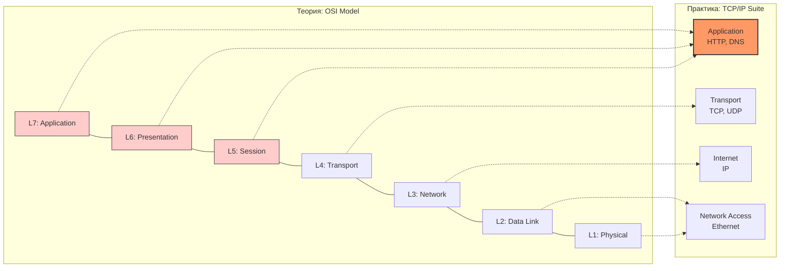
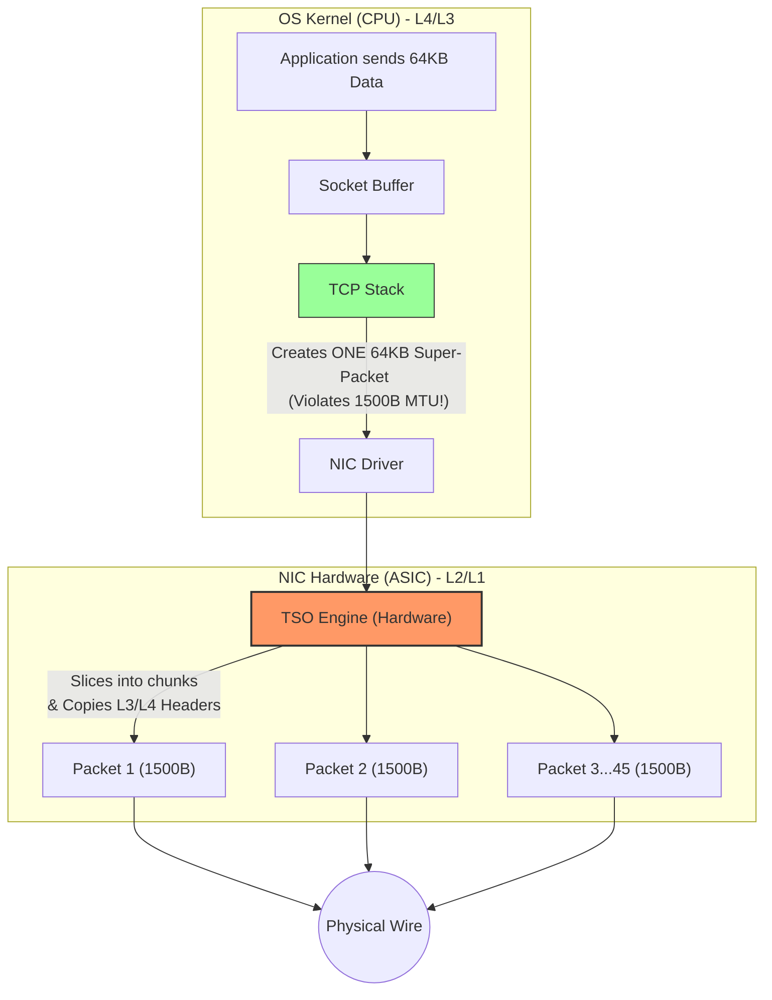

**TL;DR**: Для Staff/Principal инженера модель OSI — это не мнемоническое правило ("Please Do Not Throw Sausage Pizza Away"), а карта потенциальных ботлнеков.
*   **L2** — это про MTU, ARP-штормы и Offloading сетевых карт.
*   **L3** — это про ECMP хеширование и фрагментацию.
*   **L4** — это про Congestion Control (BBR vs CUBIC) и эфемерные порты.
*   **Encapsulation** — это математика оверхеда, которая убивает производительность в Overlay-сетях (K8s CNI, VXLAN), если вы забыли настроить MSS Clamping.

---
## 1. Ложь модели OSI и правда TCP/IP 

> [!abstract] Парадокс Сетевой Инженерии
> Если вы откроете любой академический учебник, первые 50 страниц будут посвящены модели OSI. 
> **Инженерная реальность:** В современном интернете нет ни одного устройства, которое работало бы по "чистому" стеку протоколов OSI. Интернет работает на **TCP/IP**.
> 
> Почему же мы продолжаем учить OSI? Потому что OSI — это идеальная *языковая и концептуальная модель* (Reference Model). Это общий словарь, позволяющий сетевику, программисту и безопаснику понимать друг друга. Мы строим системы на TCP/IP, но ругаемся на "проблемы на 7-м уровне" или "широковещательные штормы на L2".

### 1.1. Классическая модель OSI (Семиуровневая утопия)

Модель OSI (Open Systems Interconnection) была разработана комитетом ISO в конце 1970-х годов как попытка создать идеальный, универсальный стандарт сетей до того, как эти сети были реально построены.

Она состоит из 7 уровней (снизу вверх):

1. **L1. Физический (Physical):** Как передать бит `1` или `0` через медь, стекло (оптику) или радиоэфир. (Напряжение, частоты, пины кабеля RJ-45).
2. **L2. Канальный (Data Link):** Как передать кадр (Frame) от одного узла к другому в пределах *одной локальной сети*. Здесь появляются MAC-адреса и коммутаторы (Switches).
3. **L3. Сетевой (Network):** Как маршрутизировать пакет (Packet) между *разными сетями* через весь мир. Здесь царствуют IP-адреса и маршрутизаторы (Routers).
4. **L4. Транспортный (Transport):** Как гарантировать (или не гарантировать) доставку данных между двумя приложениями на разных концах Земли. Здесь работают TCP (надежно) и UDP (быстро), появляются Порты.
5. **L5. Сеансовый (Session):** Управление сессиями диалога между приложениями (открытие, закрытие, чекпоинты).
6. **L6. Представительский (Presentation):** Форматирование данных, кодировки (ASCII/UTF-8), сжатие и шифрование, чтобы разные ОС понимали друг друга.
7. **L7. Прикладной (Application):** Интерфейс для взаимодействия с пользователем или приложением. (HTTP, SMTP, FTP).

### 1.2. Почему OSI — это "Ложь"?

Модель OSI проиграла "Войну Протоколов" в 1980-х и 1990-х годах. 
Она разрабатывалась бюрократами (ISO). Они годами проектировали идеальную архитектуру, описывая тысячи страниц стандартов для протоколов, которых еще не существовало.

**Главные провалы OSI на практике:**
1. **Сложность:** Стандарты были слишком тяжеловесными для компьютеров того времени.
2. **Мертвые уровни:** Уровни 5 (Session) и 6 (Presentation) оказались практически бесполезными как самостоятельные сущности. В реальном коде программисту гораздо удобнее реализовать шифрование (L6) и управление сессией (L5) прямо внутри прикладного протокола (L7) или библиотеки.
3. **Время:** Пока комитет ISO спорил о стандартах, инженеры уже тянули кабели.

### 1.3. Правда TCP/IP (Четырехуровневый прагматизм)

Стек TCP/IP (Internet Protocol Suite) был разработан по заказу Министерства обороны США (ARPANET). 
Его делали инженеры-практики по принципу: *"Нам нужно, чтобы компьютеры могли общаться даже в случае ядерного удара. Пишем код, потом документируем"*.

TCP/IP не пытался быть идеальным. Он пытался *работать*. Изначально в нем выделяли 4 уровня:

1. **Network Access (Канальный/Физический):** TCP/IP вообще не волнует, как вы передаете данные физически. Он просто говорит: "Дайте мне драйвер сетевой карты". (Ethernet, Wi-Fi).
2. **Internet (Межсетевой):** Аналог L3 в OSI. Царство протокола IP. Доставка пакетов по кратчайшему пути.
3. **Transport (Транспортный):** Аналог L4 в OSI. TCP и UDP.
4. **Application (Прикладной):** Аналог L5, L6 и L7 в OSI вместе взятых. В TCP/IP всё, что выше L4 — это просто "данные приложения". (HTTP, DNS, SSH).

### 1.4. Гибридная модель: Как мы говорим сегодня

Сегодня в индустрии и современных учебниках (например, "Computer Networking" Kurose & Ross) используется **Пятиуровневая гибридная модель**. Она берет реальные протоколы из TCP/IP, но использует нумерацию из OSI для нижних уровней.

| Номер в OSI | Название OSI | Реальность (Стек TCP/IP) | Что там живет (Протоколы) | Единица данных (PDU) |
| :--- | :--- | :--- | :--- | :--- |
| **L7** | Application | \multirow{3}{*}{**Application** (Прикладной)} | HTTP, HTTPS, DNS, SSH | Данные (Data) |
| **L6** | Presentation | | TLS/SSL, JSON, JPEG | Данные |
| **L5** | Session | | WebSockets, RPC | Данные |
| **L4** | Transport | **Transport** (Транспортный) | **TCP, UDP** | Сегмент (Segment) |
| **L3** | Network | **Internet** (Межсетевой) | **IPv4, IPv6**, ICMP, IPSec | Пакет (Packet) |
| **L2** | Data Link | \multirow{2}{*}{**Network Access** (Доступ к сети)} | **Ethernet**, Wi-Fi (802.11) | Кадр (Frame) |
| **L1** | Physical | | Витая пара, Оптика, Радио | Бит (Bit) |

### 1.5. Визуализация: "Поедание" уровней (Mermaid)



> [!check] Архитектурный вывод (Зачем нам это знать?) Когда вы слышите термины:
> 
> - **"L2 Switch"** — это коммутатор, который смотрит только на MAC-адреса. Он не знает ничего про IP.
>     
> - **"L3 Switch / L3 Router"** — это устройство, которое понимает IP-адреса и строит маршруты.
>     
> - **"L4 Load Balancer"** (например, HAProxy в tcp-режиме) — он балансирует трафик на основе IP + Порт, не заглядывая внутрь HTTP-запроса. Это очень быстро.
>     
> - **"L7 Load Balancer"** (например, Nginx) — он расшифровывает TLS, читает HTTP-заголовки (cookies, URL paths) и принимает умные решения о маршрутизации, но тратит больше CPU.
>     
> 
> Знание уровней L2-L7 позволяет вам точно описывать границы ответственности компонентов вашей архитектуры.

### 1.6. Leaky Abstractions: Проблема протекающих абстракций
Джоэл Спольски сформулировал закон: "Все нетривиальные абстракции протекают". В сетях это означает, что L7 (приложение) не может игнорировать физику L2 (кабеля), а L2 оборудование лезет в логику L4 (TCP).

#### А. NIC Offloading (Аппаратная разгрузка) — Нарушение границы L2/L4
Процессор общего назначения (CPU) плох в перекладывании байтов. Обработка каждого пакета требует прерываний и переключения контекста. Чтобы выдать 100 Gbit/s, сетевая карта (NIC — L2 устройство) должна понимать протоколы верхних уровней (IP/TCP — L3/L4).

1.  **TSO (TCP Segmentation Offload):**
    *   *Как это работает:* Операционная система (L4 стек) не нарезает данные на пакеты по 1500 байт (MTU). Она отдает карте огромный кусок данных (например, 64 КБ). Сетевая карта *сама* парсит TCP-заголовок, сама нарезает данные на MTU-фреймы, сама считает контрольные суммы (Checksum Offload) и отправляет их в провод.
    *   *Эффект наблюдателя (tcpdump):* Если вы запустите `tcpdump` на отправляющем хосте, вы увидите гигантские пакеты по 64 КБ. Новичок скажет: "Сеть сломана, пакеты больше MTU!". Эксперт знает: это **иллюзия**. Этих пакетов нет в проводе, они существуют только в буфере ядра до того, как NIC их нарежет.
2.  **LRO/GRO (Large/Generic Receive Offload):**
    *   Обратный процесс. Карта принимает тысячи мелких пакетов, склеивает их в один большой "супер-пакет" и отдает процессору одним прерыванием. Это снижает нагрузку на CPU в разы.

#### Б. QUIC и HTTP/3 — Революция в User-Space (Отказ от L4 ядра)
Традиционный подход: "Ядро отвечает за надежность (TCP), приложение — за данные".
Проблема: Обновление ядра на миллионах серверов и телефонов занимает годы. TCP-стек закостенел (OSSification).

*   **QUIC (Quick UDP Internet Connections):** Google и IETF решили перенести логику транспортного уровня (надежность, порядок пакетов, Congestion Control) из **ядра (Kernel Space)** в **приложение (User Space)**.
*   *Как это выглядит:*
    *   **L4 (OS):** Тупой UDP. Ядро просто перекидывает датаграммы, не заботясь о доставке.
    *   **L7 (App):** Внутри браузера или бэкенда крутится сложнейший стейт-машина, которая делает то, что раньше делал TCP (ретрансмиты, Flow Control), плюс TLS 1.3 шифрование.
*   *Инсайт:* Это полное нарушение модели OSI. Приложение теперь управляет перегрузкой сети. Зато внедрение нового алгоритма Congestion Control (например, BBRv3) требует просто обновления бинарника приложения, а не пересборки ядра Linux.

### 1.7. Cross-Layer Interactions (Взаимодействие слоев)
В высоконагруженных системах информация с нижних уровней должна быть доступна верхним для принятия решений.

*   **ECN (Explicit Congestion Notification):**
    *   Роутер (L3), у которого переполняется буфер, ставит специальный бит в IP-заголовке пакета, вместо того чтобы дропнуть его.
    *   Принимающий хост видит этот бит на L3, передает информацию на L4 (TCP).
    *   TCP-стек уменьшает скорость отправки.
    *   *Без этого:* Мы узнаем о проблеме только по факту потери пакета (слишком поздно).

### 1.4. Итог: Как думать об этом Архитектору

Вместо жестких 7 уровней, мыслите тремя плоскостями:

1.  **Data Plane (Fast Path):** Всё, что касается пересылки пакетов. Здесь правят бал "нарушители" OSI — TSO, XDP (eBPF), DPDK. Задача — обойти ядро и стандартный стек, чтобы выжать максимум PPS (Packets Per Second).
2.  **Control Plane:** Маршрутизация (BGP, OSPF), ARP, Discovery. Здесь OSI/TCP-IP модель работает более-менее классически.
3.  **Management Plane:** То, как мы этим управляем (SSH, gRPC, SNMP).

**Пример для собеседования/проектирования:**
Если вас спрашивают: *"На каком уровне работает балансировщик нагрузки?"*
*   *Ответ Junior:* "На 4 или 7".
*   *Ответ Expert:* "Зависит от режима. **L4-балансировщик** (IPVS, Maglev) смотрит только заголовки пакетов (NAT/Tunneling), часто реализуется в ядре или на железе. Он очень быстр, но не умеет 'умную' маршрутизацию. **L7-балансировщик** (Nginx, Envoy) терминирует TCP-сессию, собирает HTTP-запрос (буферизация), принимает решение по URL/Header и открывает *новое* соединение к бэкенду. Это в 10 раз дороже по CPU, но дает гибкость".

---
## 2. L2: Data Link Layer (Ethernet) — Поле битвы за пакеты

На этом уровне мы оперируем **Кадрами (Frames)** и **MAC-адресами**. Основная задача L2 — доставка данных внутри одного широковещательного домена (Broadcast Domain) или VLAN.

Здесь абстракция течет сильнее всего: настройки драйвера влияют на потребление CPU, а настройки свитча определяют, пройдет ли ваш трафик вообще.

### 2.1. Анатомия Кадра и "Честный" MTU
В конфигурации интерфейса (`ifconfig` / `ip link`) вы видите `MTU 1500`. Это **L3 MTU** — максимальный размер полезной нагрузки (IP-пакета), который влезает в кадр.

**Физическая реальность (On-wire size):**
Чтобы передать 1500 байт данных, по проводу пройдет больше:
1.  **Payload (IP Packet):** 1500 байт.
2.  **Ethernet Header:** 14 байт (6 Dst MAC + 6 Src MAC + 2 EtherType).
3.  **FCS (Frame Check Sequence):** 4 байта (CRC32 контрольная сумма в конце).
4.  **Preamble + SFD:** 8 байт (синхронизация физического уровня).
5.  **Inter-frame Gap (IFG):** 12 байт тишины между кадрами (технологический зазор).

**Итого:** 1538 байт на проводе для 1500 байт данных.
**Почему это важно эксперту:** При расчете **Line Rate** (полезной пропускной способности) на мелких пакетах оверхед заголовков убивает перформанс.
*   *Пример:* Для пакетов по 64 байта (минимум Ethernet) полезная нагрузка может быть всего ~40%. Вы никогда не получите 10Gbps полезного трафика на мелких пакетах — вы упретесь в PPS (Packets Per Second) и оверхед заголовков.

### 2.2. VLAN (802.1Q) и QinQ
VLAN добавляет 4-байтовый тег в заголовок Ethernet.
*   **Сценарий провала:** Вы настроили MTU 1500 на сервере. Свитч настроен жестко на прием кадров не больше 1518 байт (стандарт). Вы включаете VLAN tagging на карте.
*   Размер кадра становится: 14 (Header) + 4 (VLAN) + 1500 (Data) + 4 (FCS) = **1522 байта**.
*   Свитч дропает кадр как "Oversized / Giant".
*   **QinQ (802.1ad):** Вложенные VLAN (провайдерский тег + клиентский тег) добавляют уже 8 байт.
*   **Решение:** В современных сетях на свитчах всегда ставят L2 MTU с запасом (например, 9216), чтобы пропускать любые теги и инкапсуляции.

### 2.3. ARP и ND: "Штормы" и Кэши
L2 не знает IP-адресов. Чтобы отправить пакет на IP `192.168.1.5`, нужно узнать его MAC.
*   **ARP (Address Resolution Protocol) для IPv4:** Broadcast запрос "Кто имеет 192.168.1.5?".
*   **ND (Neighbor Discovery) для IPv6:** Multicast запрос.

**Термин: BUM Traffic (Broadcast, Unknown-unicast, Multicast).**
Трафик, который свитч обязан размножить (Flood) на все порты VLAN.

**Архитектурная проблема: ARP Storm / Thundering Herd.**
В плоских сетях (большой L2 домен на 10,000 хостов) broadcast-трафик от ARP может "положить" CPU слабых устройств.
*   *Пример:* Вы переносите Kubernetes кластер в устаревшую L2 сеть. 5000 подов одновременно пытаются разрезолвить Gateway. Свитчи захлебываются.
*   *Решение:* L3-to-the-Edge (избавляемся от L2 растягивания), Proxy ARP, или использование SDN, который отвечает на ARP без бродкаста (как это делает kube-proxy в IPVS режиме или OVN).

### 2.4. NIC Offloading: Когда карта умнее CPU

> [!abstract] Нарушение границ OSI ради скорости
> В сетях 10 Gbps, 40 Gbps и 100 Gbps процессор сервера физически не успевает обрабатывать каждый отдельный сетевой пакет. На скорости 10 Gbps (при стандартном MTU 1500 байт) сервер принимает около **800,000 пакетов в секунду**. Если CPU будет вручную считать контрольные суммы и нарезать данные на кусочки, он будет загружен на 100% только сетью, не оставив ресурсов для вашей базы данных или приложения.
> 
> **Решение:** Делегировать рутинную работу сетевой карте (Network Interface Card — NIC). Это называется **Hardware Offloading**.

#### A. Столкновение с классической моделью OSI

Чтобы понять суть аппаратной разгрузки, давайте вспомним классическую академическую модель OSI и то, кто за что *должен* отвечать.

| Уровень OSI | Название | Традиционная зона ответственности |
| :--- | :--- | :--- |
| **L7-L5** | Прикладные | Процесс приложения (User Space: Nginx, Postgres) |
| **L4** | Транспортный | Ядро ОС (OS Kernel: стек TCP/IP) |
| **L3** | Сетевой | Ядро ОС (OS Kernel: IP-маршрутизация) |
| **L2** | Канальный | **Сетевая карта (NIC)** и драйвер |
| **L1** | Физический | **Сетевая карта (NIC)**, трансиверы, кабель |
**В чем парадокс?**
Строго по модели OSI сетевая карта — это тупое устройство уровней L1-L2. Она должна только переводить биты в электричество/свет и проверять MAC-адреса.
Но **NIC Offloading** нарушает это правило: современная сетевая карта "залезает" на уровни L3 и L4, забирая работу у центрального процессора.

#### B. Три кита аппаратной разгрузки

Сетевые карты научились делать три критически важные вещи, которые раньше делала операционная система.

##### 1. Checksum Offloading (CSUM)
* **Теория:** Протоколы IPv4 (L3), TCP и UDP (L4) имеют поля "Контрольная сумма" (Checksum) для проверки целостности данных. Вычисление сумм для гигабайтов данных — дорогая математическая операция.
* **Оффлоадинг:** Ядро ОС оставляет поля контрольных сумм пустыми. Сетевая карта (имеющая специализированные ASIC-чипы) на лету вычисляет и вписывает эти суммы прямо перед отправкой пакета в кабель.

##### 2. TSO (TCP Segmentation Offload) / LSO (Large Send Offload)
* **Теория:** Максимальный размер кадра в Ethernet (MTU) — 1500 байт. Если приложение хочет отправить 64 КБ данных, ядро ОС должно разбить их на ~45 мелких TCP-сегментов, прикрепить к каждому копию IP- и TCP-заголовков и отправить по одному.
* **Оффлоадинг:** Ядро ОС формирует **один гигантский пакет** (Super-packet) размером до 64 КБ с одним заголовком и отдает его сетевой карте. Сетевая карта *сама* нарезает его на куски по 1500 байт, клонирует заголовки, проставляет правильные Sequence Numbers (L4) и отправляет в сеть.

##### 3. GRO (Generic Receive Offload) / LRO (Large Receive Offload)
* Это TSO наоборот.
* Когда из сети летит шквал из тысяч мелких пакетов по 1500 байт, NIC не дергает процессор прерыванием (Interrupt) на каждый пакет.
* Карта собирает эти мелкие пакеты в памяти, склеивает их в один огромный блок (до 64 КБ) и передает ядру ОС одним куском. Процессор обрабатывает один большой пакет вместо сорока пяти маленьких.

#### C. Визуализация TSO (Mermaid)

Посмотрите, как TSO смещает границу работы ядра и железа.


#### D. SmartNICs и DPU: Эволюция продолжается

Индустрия не остановилась на L3/L4. Сегодня в дата-центрах (AWS, Azure) используются **SmartNICs** (или DPU — Data Processing Units). Это сетевые карты, на которых установлен собственный многоядерный ARM-процессор и своя операционная система (обычно Linux).
**Что они умеют оффлоадить?**
- **L6/L7 (TLS/SSL Offloading):** Карта сама шифрует и расшифровывает HTTPS-трафик. Основной CPU сервера вообще не тратит такты на криптографию.
- **L3/L2 (Open vSwitch / SDN):** Вся логика виртуальных сетей (VPC, VXLAN, Firewall правила) выполняется прямо на карте. Если пакет нужно заблокировать (Drop), он даже не доходит до шины PCIe сервера.

> [!danger] Инженерная ловушка: "Ложь" tcpdump Если вы запустите сниффер `tcpdump` или `Wireshark` на современном Linux-сервере, вы можете увидеть исходящие TCP-пакеты размером 15,000 или 64,000 байт.
> 
> _Новичок скажет:_ "У нас сломался MTU! В сети не может быть пакетов больше 1500 байт!" _Опытный инженер ответит:_ "Успокойся, это **TSO**. `tcpdump` перехватывает пакеты на уровне ядра ОС, **до того**, как они попали в сетевую карту. Ядро отдает 64 КБ, и сниффер видит 64 КБ. В физическом кабеле эти пакеты уже нарезаны по 1500 байт сетевой картой."
> 
> _Совет:_ Если вам нужно отключить оффлоадинг для честной отладки, используйте утилиту `ethtool`: `ethtool -K eth0 tso off gso off gro off`

> [!check] Архитектурный вывод Модель OSI — это отличная теория для понимания логики. Но в высоконагруженных системах протоколы не прибиты к физическим устройствам гвоздями. Ради спасения CPU мы переносим логику Транспортного (L4) и даже Прикладного (L7) уровней глубоко в "кремний" на Физический уровень (L1).
---

---
## 3. L3: Network Layer (IP) — Маршрутизация, Forwarding и Control Plane

Для архитектора L3 — это слой, обеспечивающий **связность (connectivity)** между разными подсетями. Главная задача здесь — не просто найти маршрут, а обеспечить его **сходимость (convergence)** при отказах и эффективность утилизации каналов (ECMP).

### 3.1. Разделение плоскостей: RIB vs FIB
В реальном сетевом оборудовании (и в ядре Linux) существует четкое разделение:

1.  **Control Plane (RIB — Routing Information Base):**
    *   Здесь живут протоколы динамической маршрутизации (BGP, OSPF, IS-IS).
    *   Это "мозг". Он строит карту сети, рассчитывает метрики и выбирает лучшие пути. Процесс медленный (секунды или миллисекунды).
    *   Результат работы: "Лучший путь к 10.0.0.0/24 — через шлюз A".
2.  **Data Plane (FIB — Forwarding Information Base):**
    *   Это "мышцы". Оптимизированная, сжатая таблица, загруженная в ASIC (на свитчах) или в кэш ядра.
    *   Используется для пересылки каждого пакета на скорости линии (wire speed).
    *   **Инсайт архитектора:** Когда "падает сеть", проблема обычно в **Control Plane** (BGP сессия упала, пересчет маршрутов). Когда "потери пакетов при высокой нагрузке" — проблема в **Data Plane** (переполнен буфер ASIC, коллизии хешей ECMP или лимит записей в TCAM).

### 3.2. Логика пересылки: Longest Prefix Match (LPM)
В отличие от L2 (где поиск MAC-адреса — это точное совпадение/Exact Match), L3 использует принцип **наиболее длинной маски**.
*   Если у роутера есть маршруты:
    *   `10.0.0.0/16` $\to$ Interface A
    *   `10.0.5.0/24` $\to$ Interface B
*   Пакет для `10.0.5.55` уйдет в **Interface B**, так как `/24` — более специфичная (длинная) маска.
*   **Аппаратная реализация (TCAM):** В дорогих роутерах используется Ternary Content-Addressable Memory. Она позволяет искать LPM за **один такт** ($O(1)$). Дешевые роутеры или софтверные решения (Linux) используют структуры Trie (деревья), где поиск зависит от длины адреса ($O(32)$ или $O(128)$ для IPv6).

### 3.3. Фрагментация: Анатомия катастрофы производительности

Фрагментация — это процесс разделения IP-пакета, который больше MTU (Maximum Transmission Unit) исходящего интерфейса.

**Почему это "зло" для Expert уровня:**
1.  **Потеря Goodput:** Если исходный пакет 10 КБ разбит на 7 фрагментов, и **потерян всего один** фрагмент, получатель отбросит **все** остальные 6 фрагментов, так как не сможет собрать L4 (TCP/UDP) сегмент. Весь пакет в 10 КБ придется пересылать заново. Это называется **Packet Loss Amplification**.
2.  **CPU Interrupt Storm:** Сборка фрагментов требует хранения состояния в памяти ядра. Это вектор для DDoS-атаки (Fragment Flood), переполняющей буферы сборки.
3.  **Stateless Firewalls Failure:** Файрволы и ECMP-роутеры часто смотрят только заголовки L4 (порты TCP/UDP). Но L4 заголовок есть только в **первом** фрагменте. Остальные фрагменты не содержат портов. Файрвол может их пропустить (дыра в безопасности) или дропнуть (потеря данных).

**Механика:**
*   **IPv4:** Поле `Flags` (3 бита).
    *   **DF (Don't Fragment):** Если бит установлен в 1 и пакет больше MTU $\to$ Роутер **обязан** дропнуть пакет и отправить обратно ICMP Type 3 Code 4 ("Fragmentation Needed").
    *   **MF (More Fragments):** Установлен у всех фрагментов, кроме последнего.
*   **IPv6:** Роутеры **никогда** не фрагментируют. Это обязанность отправителя (Sender). Если пакет велик, роутер шлет ICMPv6 "Packet Too Big".

**Пример из жизни:**
Вы настроили VPN (IPsec/GRE). Оверхед заголовков туннеля съел 50 байт. MTU туннеля стало 1450. Сервер приложения шлет 1500 байт с флагом DF. Пакеты доходят до VPN-шлюза, тот видит, что не влезает, и дропает.
*   *Симптом:* `ping` (маленький) работает, `curl` (TLS Handshake, большой) виснет.
*   *Лечение:* **MSS Clamping** на сетевом оборудовании (подмена значения MSS в TCP SYN пакетах) или правильная настройка MTU на серверах.

### 3.4. ECMP (Equal-Cost Multi-Path): Балансировка внутри фабрики

В современном дата-центре (Leaf-Spine топология) между двумя серверами может быть 16 или 32 равноценных физических пути. Как выбрать один?

**Алгоритм 5-tuple hash:**
Роутер вычисляет хеш (обычно CRC16 или CRC32) от заголовков:
1.  Source IP
2.  Destination IP
3.  Protocol (TCP/UDP)
4.  Source Port
5.  Destination Port

`Link_Index = Hash(5-tuple) % Number_of_Links`

**Проблемы для архитектора:**
1.  **Hash Polarization (Поляризация хеша):** Если у вас два слоя роутеров (Tier-1 и Tier-2), и они используют **одну и ту же** хеш-функцию, трафик может распределяться неравномерно.
    *   *Пример:* Первый роутер отфильтровал трафик так, что на второй роутер пришли пакеты только с четными хешами. Второй роутер, используя тот же алгоритм, кинет их всех в один линк, оставив остальные пустыми.
    *   *Решение:* Использовать `Unique Seed` (соль) для хеширования на каждом устройстве.
2.  **Elephant Flows (Слоновьи потоки):**
    *   Бэкап базы данных: Один TCP-сокет, терабайты данных.
    *   У этого потока **один** 5-tuple. Хеш константа.
    *   Весь терабайт летит через **один** физический кабель (например, 10G), забивая его на 100%. В это время остальные 3 кабеля в ECMP-группе простаивают.
    *   В результате растут задержки (Latency) для всех остальных пакетов на этом загруженном линке.
    *   *Решение:* Приложение должно открывать много параллельных соединений (multi-threading download), чтобы варьировать `Source Port` и утилизировать все линки.

### 3.5. Anycast: Архитектурный паттерн L3

Anycast — это когда один IP-адрес (например, `8.8.8.8`) анонсируется из множества географических точек одновременно через BGP.

*   **Как это работает:**
    *   Америка анонсирует `8.8.8.8/32`.
    *   Европа анонсирует `8.8.8.8/32`.
    *   Глобальная маршрутизация (BGP) выбирает "кратчайший путь" (в терминах AS-path). Пользователь из Берлина попадет в Европейский дата-центр.
*   **Сложность (Route Flapping):**
    *   Если связь "мигает", пользователь может отправить пакет №1 в Европу, а пакет №2 в Америку.
    *   Для TCP это разрыв соединения (Stateful). Для UDP (DNS) — нормально.
    *   Поэтому Anycast идеален для DNS/CDN (UDP или короткие TCP-сессии), но сложен для долгих Database-соединений.

### Резюме раздела L3
*   **Control Plane** строит карту, **Data Plane** водит машину.
*   **LPM** — это алгоритм поиска маршрута, дорогой и сложный.
*   **Фрагментация** убивает производительность; используйте **PMTUD** и **MSS Clamping**.
*   **ECMP** распределяет нагрузку на основе хеша заголовков (L3/L4). Один толстый поток не балансируется.

---
## 4. L4: Transport Layer (TCP/UDP) — Анатомия доставки

L4 отвечает за доставку данных между **процессами** (Process-to-Process delivery), в отличие от L3, который доставляет пакеты между хостами. Главные примитивы здесь — **Порты** и **Сокеты**, обеспечивающие мультиплексирование.

### 4.1. TCP: Состояние, Мультиплексирование и Жизненный цикл

TCP (Transmission Control Protocol) — это потоковый протокол (byte-stream), ориентированный на соединение.

*   **Мультиплексирование (5-tuple):**
    Ядро идентифицирует уникальное соединение по кортежу из 5 элементов:
    `{Src IP, Src Port, Dst IP, Dst Port, Protocol (TCP)}`.
    *   *Миф:* "Сервер может держать только 65535 соединений, потому что портов всего 65k".
    *   *Реальность:* Сервер может держать миллионы соединений на порту 443, пока уникальны пары `{Src IP, Src Port}` клиентов. Ограничение — это память (TCB - Transmission Control Block) и файловые дескрипторы.

*   **Диаграмма состояний (State Machine) — Точки боли:**
    1.  **TIME_WAIT (Active Close):** Сторона, *инициировавшая* разрыв (`FIN`), переходит в `TIME_WAIT` на время `2*MSL` (Maximum Segment Lifetime, обычно 60 сек). Это нужно, чтобы:
        *   Гарантировать, что `ACK` на последний `FIN` дошел.
        *   Дать старым "блуждающим" пакетам умереть в сети, чтобы они не испортили новое соединение на том же порту.
        *   *Проблема:* При большом RPS исходящих соединений (например, Nginx proxy $\to$ Upstream) заканчиваются **эфемерные порты** (Ephemeral Ports, диапазон `net.ipv4.ip_local_port_range`).
    2.  **CLOSE_WAIT (Passive Close):** Если вы видите на сервере тысячи сокетов в `CLOSE_WAIT` — это **баг приложения**. Сторона получила `FIN` от удаленного хоста, ядро ответило `ACK`, но само приложение не вызвало `close()` для сокета. Приложение "зависло" и держит ресурс.

### 4.2. Flow Control vs Congestion Control (Критическое различие)

На уровне Staff вы обязаны различать эти два механизма. Они оба ограничивают скорость, но по разным причинам.

#### A. Flow Control (RWND — Receive Window)
**Цель:** Защитить **Получателя**, чтобы он не захлебнулся.
*   Получатель анонсирует в заголовке TCP поле `Window Size` (RWND). Это количество байт, которое он готов принять в свой буфер прямо сейчас.
*   **Zero Window:** Если приложение тормозит и не вычитывает сокет, буфер заполняется, RWND становится 0. Отправитель прекращает передачу и шлет только пробные пакеты (Zero Window Probe).
*   **Window Scaling (RFC 1323):** В заголовке под окно всего 16 бит (65 КБ макс). Для современных сетей (10Gbps) этого мало. Опция `Window Scale` позволяет множить это число на $2^S$.

#### B. Congestion Control (CWND — Congestion Window)
**Цель:** Защитить **Сеть**, чтобы не создать пробку на роутерах.
*   `CWND` — это **внутренняя переменная** отправителя (её нет в заголовке пакета).
*   Отправитель шлет данные по формуле: $\min(RWND, CWND)$.
*   **Bandwidth-Delay Product (BDP):** Емкость "трубы". $BDP = \text{Bandwidth} \times \text{RTT}$.
    *   Чтобы утилизировать канал 10Gbps с пингом 100мс, нужно держать в полете $10^9 \times 0.1 / 8 \approx 125$ МБ данных *без* подтверждения. Если буферы TCP меньше BDP, вы никогда не получите полную скорость.

### 4.3. Алгоритмы Congestion Control (CC)

Как отправитель узнает, какое значение выставить в `CWND`?

1.  **Loss-based (Reno, CUBIC — стандарт Linux):**
    *   Считают потерю пакета сигналом перегрузки.
    *   Работают по циклу: "Растим окно экспоненциально (Slow Start), потом линейно, пока не потеряем пакет $\to$ Резко снижаем окно (обычно на 30-50%) $\to$ Повторяем".
    *   **Проблема:** Плохо работают на "длинных толстых каналах" (LFN) и WiFi, где потери могут быть случайными, а не из-за перегрузки. Вызывают **Bufferbloat** (забивают буферы роутеров до отказа).

2.  **Model-based (BBR — Bottleneck Bandwidth and RTT):**
    *   Создан Google. Не реагирует на потери пакетов как на сигнал "стоп".
    *   Периодически измеряет RTT и пропускную способность. Строит модель сети.
    *   Пытается работать в точке **Kleinrock's operating point**: максимальная пропускная способность при минимальном RTT (пустые буферы).
    *   *Применение:* Must-have для CDN, видео-стриминга и сетей с потерями.

### 4.4. Производительность: Nagle’s Algorithm и Delayed ACK

Классическая проблема "Request-Response" RPC вызовов.

*   **Nagle’s Algorithm:** "Не шли мелкие пакеты. Накопи данных хотя бы на MSS (Maximum Segment Size) или подожди ACK предыдущего пакета". Создан для защиты от оверхеда заголовков (синдром маленького пакета).
*   **Delayed ACK:** "Не шли ACK сразу. Подожди 40-500мс, вдруг приложение захочет ответить данными (Piggybacking), тогда пошлем ACK вместе с ними".
*   **Смертельный танец:**
    1.  Приложение шлет запрос (Write) — он маленький. Nagle отправляет его.
    2.  Приложение делает второй маленький Write. Nagle видит, что ACK на первый еще не пришел $\to$ **Ждет**.
    3.  Получатель получил первый пакет. Но Delayed ACK говорит "подожди, не шли ACK сразу" $\to$ **Ждет**.
    4.  **Итог:** Задержка 40-200мс на пустом месте.
*   **Решение:** В микросервисах всегда ставьте опцию сокета `TCP_NODELAY` (отключает Nagle), так как латентность важнее оверхеда заголовков.

### 4.5. UDP (User Datagram Protocol) и Kernel Bypass

UDP — это "IP с портами". Никаких гарантий, никаких рукопожатий, никакого контроля потока.

*   **Head-of-Line (HoL) Blocking:**
    *   В TCP потеря пакета №5 заставляет получателя ждать его повторной отправки, даже если пакеты №6, 7, 8 уже пришли. Приложение их не увидит, пока не придет №5.
    *   В HTTP/3 (QUIC поверх UDP) стримы независимы. Потеря пакета одного стрима не тормозит другие.
*   **Kernel Bypass (DPDK, XDP, Solarflare):**
    *   Стандартный путь пакета: NIC $\to$ IRQ $\to$ Kernel Driver $\to$ IP Stack $\to$ TCP Stack $\to$ Socket Buffer $\to$ Context Switch $\to$ User App. Это слишком долго для HFT (High-Frequency Trading) или 100G роутинга.
    *   **Kernel Bypass:** Приложение мапит память сетевой карты прямо в свое адресное пространство. Ядро ОС исключается из процесса обработки данных.

### Прикладной пример: Траблшутинг `ss -it`

Как эксперт, вы не смотрите `netstat`. Вы смотрите `ss -it` (socket statistics + tcp_info internal).

```bash
# Пример вывода для нагруженного соединения
State      Recv-Q Send-Q Local Address:Port  Peer Address:Port
ESTAB      0      14600  10.0.0.1:443        192.168.1.5:54321
         cubic wscale:7,7 rto:204 rtt:5/2.5 mss:1460 cwnd:10 ssthresh:8 ...
```

**Что здесь видит эксперт:**
1.  `Send-Q`: 14600 байт в буфере отправки (не подтверждены). Если это число постоянно высокое — сеть не справляется (или получатель медленный).
2.  `cubic`: Используется алгоритм CUBIC.
3.  `wscale:7,7`: Window Scaling включен ($2^7 = 128$). Окно может быть большим.
4.  `rtt:5/2.5`: Ping 5мс, вариация (jitter) 2.5мс.
5.  `cwnd:10`: Congestion Window всего 10 MSS ($10 \times 1460$ байт). Это очень мало (начало соединения или была потеря пакетов). Канал недогружен.
6.  `ssthresh:8`: Slow Start Threshold. Мы в режиме Congestion Avoidance.

---
*Дополнительно, для уровня Staff:*
**SACK (Selective ACK):** Позволяет подтверждать получение разрозненных блоков данных. Если потерян пакет 5, а пришли 6, 7, 8, получатель скажет "Жду 5, но получил [6-8]". Без SACK пришлось бы пересылать всё, начиная с 5. SACK обязателен для LFN (Long Fat Networks).

---
## 5. L7: Application Layer — Семантика, Оверхед и Латентность

На уровнях L1–L4 сеть оперирует «битами» и «пакетами», ничего не зная о содержимом. На уровне **L7** появляется **смысл** (семантика).
Здесь мы платим налог за удобство разработки (JSON, HTTP) ценой процессорного времени (CPU) и лишних байтов (Bandwidth).

### 5.1. Serialization & Parsing Cost: Цена человекочитаемости
Самый скрытый "пожиратель" ресурсов в микросервисах — это сериализация.

*   **Text-based (JSON, XML):**
    *   *Определение:* Данные передаются в текстовом виде.
    *   *Проблема:* Парсинг JSON — это **CPU-bound** операция. Чтобы прочитать поле `{"price": 100}`, процессор должен сканировать строку посимвольно, искать кавычки, двоеточия и скобки. Это приводит к огромному количеству ветвлений (branch mispredictions).
    *   *Пример:* На парсинг 1 ГБ JSON-лога может уйти несколько секунд работы ядра CPU. В высоконагруженном шлюзе (API Gateway) до 40% CPU может уходить просто на `JSON.parse` / `JSON.stringify`.

*   **Binary (Protobuf, Avro, FlatBuffers, Thrift):**
    *   *Определение:* Данные передаются в бинарном формате с жесткой схемой (Schema).
    *   *Механика:* `Protobuf` использует **Varints** (Variable integers) и теги полей. Число `150` займет 2 байта, а не 3 байта текста "150".
    *   *Zero-Copy (FlatBuffers/Cap'n Proto):* Позволяют читать поля сообщения *без* декодирования и выделения памяти, просто по смещению указателя (pointer arithmetic).
    *   *Выигрыш:* Снижение нагрузки на CPU в 5-10 раз, уменьшение объема трафика в 2-3 раза.

### 5.2. Эволюция HTTP: Борьба с блокировками (Head-of-Line Blocking)
Как архитектор, вы должны выбирать версию протокола под задачу.

*   **HTTP/1.1 — Keep-Alive и Pipelining:**
    *   *Keep-Alive:* Позволяет не закрывать TCP-соединение после каждого запроса (экономим на Handshake).
    *   *L7 HoL Blocking:* Главная проблема. В рамках одного соединения запросы должны идти строго по очереди. Если вы послали тяжелый запрос (генерация PDF), все следующие легкие запросы (получение иконки) встанут в очередь за ним.
    *   *Костыль:* Браузеры открывают по 6 параллельных TCP-соединений на домен (Domain Sharding), чтобы обойти это.

*   **HTTP/2 — Multiplexing (Мультиплексирование):**
    *   *Механика:* Одно TCP-соединение делится на множество логических **стримов** (Streams). Фреймы разных стримов перемешаны.
    *   *Решение:* Тяжелый запрос больше не блокирует легкие на уровне приложения.
    *   *HPACK:* Сжатие заголовков. В HTTP/1.1 вы шлете `User-Agent` (100 байт) в каждом запросе. В H2 он шлется один раз и кешируется по ID.
    *   *Новая проблема (L4 HoL Blocking):* Поскольку все стримы идут в *одном* TCP-соединении, потеря **одного** IP-пакета вызывает ретрансмиссию на уровне TCP, останавливая **все** стримы сразу. На плохих сетях (Mobile/3G) HTTP/2 работает хуже, чем HTTP/1.1.

*   **HTTP/3 (QUIC) — UDP Revolution:**
    *   Перенос надежности и контроля потока (congestion control) из ядра (TCP) в User-space (поверх UDP).
    *   Потеря пакета в одном стриме не влияет на остальные. Идеально для нестабильных сетей.

### 5.3. TLS: Криптография и Handshake RTT
TLS (Transport Layer Security) формально относится к прослойке Presentation, но де-факто это часть L7 стека.

1.  **Handshake Latency (Цена рукопожатия):**
    *   **TLS 1.2:** Требует **2 RTT** (Round Trip Time) до начала передачи данных.
        1. `ClientHello` -> `ServerHello`
        2. `KeyExchange` -> `ChangeCipherSpec` -> `Finished`
    *   **TLS 1.3:** Оптимизирован до **1 RTT**. Ключи (Key Share) отправляются сразу в первом пакете `ClientHello`.
    *   **0-RTT (Resumption):** Если клиент уже заходил раньше, он может отправить зашифрованные данные *сразу* в первом пакете (вместе с `ClientHello`), используя PSK (Pre-Shared Key).
        *   *Риск:* Replay Attack (злоумышленник может перехватить и повторить 0-RTT пакет, например, повторно списать деньги). Идемпотентность API здесь критична.

2.  **Symmetric vs Asymmetric:**
    *   **Дорого:** Асимметричная криптография (RSA, ECDSA) используется только при Handshake. Это "тяжелая математика".
    *   **Дешево:** Симметричное шифрование (AES-GCM, ChaCha20) используется для данных. Современные CPU имеют инструкции **AES-NI**, шифрующие гигабайты в секунду с минимальной нагрузкой.
    *   *Вывод:* HTTPS не тормозит на передаче файлов, он тормозит на установке соединений. Используйте Connection Pooling!

### 5.4. DNS (Domain Name System): Самый важный L7 протокол
Если DNS медленный, ваше супер-оптимизированное приложение будет казаться медленным.

*   **UDP vs TCP:** Обычно DNS — это один UDP пакет (запрос) и один UDP (ответ). Но если ответ > 512 байт (много записей, DNSSEC), включается механизм **EDNS0**, а при превышении MTU происходит переключение на TCP (TrunCation bit set). Это дополнительные RTT.
*   **Happy Eyeballs (RFC 8305):** Современный алгоритм в клиентах (браузерах/curl).
    *   Клиент делает DNS-запросы на A (IPv4) и AAAA (IPv6) *одновременно*.
    *   Пытается подключиться к тому адресу, который отрезолвился быстрее (с небольшим приоритетом IPv6). Это скрывает проблемы "сломанного IPv6" у провайдеров.
*   **Negative Caching (TTL):** DNS кеширует не только успешные ответы, но и ошибки (`NXDOMAIN`). Если вы случайно удалили запись в DNS, клиенты могут "запомнить" отсутствие записи на час (SOA TTL), даже если вы восстановите её через минуту.

### 5.5. gRPC vs REST: Архитектурный выбор
Пример того, как выбор L7 протокола влияет на систему:

| Характеристика | REST (HTTP/1.1 + JSON) | gRPC (HTTP/2 + Protobuf) |
| :--- | :--- | :--- |
| **Семантика** | Ресурсо-ориентированная (GET /users/1) | Действие-ориентированная (GetUserRequest) |
| **Формат** | Текстовый (читаем глазами, тяжелый парсинг) | Бинарный (компактный, нужна схема .proto) |
| **Стриминг** | Сложно (WebSockets или Chunked encoding) | Нативно (Bidirectional streaming) |
| **Контракт** | Слабый (OpenAPI/Swagger опционален) | Строгий (Proto-файл обязателен) |
| **Use Case** | Публичные API (Public Web) | Внутренние коммуникации (Inter-service) |

**Резюме раздела L7:**
Оптимизация на L7 дает самый большой выигрыш для конечного пользователя. Переход с JSON на Protobuf или включение Keep-Alive может снизить латентность и нагрузку на CPU сильнее, чем замена 10GbE сетевой карты на 25GbE.

---
# 6. Deep Dive: Encapsulation & Tunneling (Overlay Networks)

## 6.1. Концепция: Underlay vs Overlay
Для начала разделим два мира, чтобы не путаться.

*   **Underlay Network (Физическая подложка):** Это реальные кабели, свитчи, маршрутизаторы и оптические линки. Здесь живут реальные IP-адреса серверов (Host IP) и работает физическая маршрутизация (OSPF/BGP).
    *   *Задача:* Просто переслать IP-пакет от физической ноды A к ноде B.
*   **Overlay Network (Виртуальная накладная сеть):** Это логическая сеть, построенная *поверх* физической.
    *   В Kubernetes это Pod Network (Flannel, Calico VXLAN).
    *   В AWS это VPC.
    *   *Задача:* Сделать так, чтобы Контейнер 1 (10.0.1.5) мог говорить с Контейнером 2 (10.0.2.5), даже если они находятся на разных физических серверах в разных подсетях, и чтобы физические свитчи вообще не знали о существовании IP-адресов контейнеров.

**Механизм:** Инкапсуляция. Мы берем пакет виртуальной сети и заворачиваем его в пакет физической сети, как письмо в конверт, а этот конверт — в бандероль.

## 6.2. Анатомия Пакета: VXLAN (Virtual Extensible LAN)
VXLAN — это стандарт де-факто для современных Overlay-сетей. Разберем "матрешку" заголовков, чтобы понять математику оверхеда.

Представьте, что Pod A отправляет HTTP-запрос в Pod B.

1.  **Inner Frame (Внутренний пакет - Payload):**
    *   Это то, что сгенерировал под.
    *   `[ Inner MAC | Inner IP (Pod IP) | TCP Header | HTTP Data ]`
    *   Размер (например): 1460 байт данных + 40 байт заголовков = 1500 байт.

2.  **Encapsulation (Происходит на VTEP - Virtual Tunnel Endpoint):**
    *   Ядро хоста (или сетевая карта) берет этот пакет и добавляет заголовки туннеля.
    *   **VXLAN Header (8 байт):** Содержит VNI (Virtual Network ID) — идентификатор виртуальной сети (аналог VLAN ID, но 24 бита, что дает 16 млн сетей).
    *   **Outer UDP Header (8 байт):** VXLAN работает поверх UDP. Порт источника вычисляется хешем от внутреннего пакета (для работы ECMP в Underlay), порт назначения обычно 4789.
    *   **Outer IP Header (20 байт):** IP-адреса физических серверов (Host IP).
    *   **Outer Ethernet Header (14 байт):** MAC-адреса физических портов.

**Итоговый оверхед VXLAN:** $8 + 8 + 20 + 14 = \mathbf{50}$ **байт**.

Если ваш физический интерфейс (Underlay) имеет стандартный **MTU 1500**, то максимальный размер внутреннего пакета (Overlay MTU) может быть только $1500 - 50 = \mathbf{1450}$ байт.

> **Примечание эксперта (AWS Geneve):** AWS использует протокол **Geneve** (Generic Network Virtualization Encapsulation). Он похож на VXLAN, но позволяет вставлять TLV (Type-Length-Value) метаданные переменной длины в заголовок. Это позволяет AWS передавать информацию о Security Groups или VPC ID прямо в пакете. Оверхед Geneve **переменный**, но обычно принимается за те же 50+ байт.

## 6.3. Кризис MTU: Fragmentation vs Drop

Что происходит, если вы неправильно настроили MTU?
Сценарий: Приложение в Docker-контейнере не знает, что оно в VXLAN. Оно видит виртуальный интерфейс `eth0` с дефолтным MTU 1500.

1.  Приложение шлет пакет размером 1500 байт.
2.  Драйвер VXLAN добавляет 50 байт заголовков $\to$ 1550 байт.
3.  Пакет попадает на физический интерфейс (`eth0` хоста).
4.  Физический интерфейс имеет MTU 1500. Пакет не влезает.

У системы два пути:

### Путь А: Фрагментация (Плохо, но работает)
Если у пакета **не** установлен бит **DF (Don't Fragment)** в IP-заголовке, роутер/хост разобьет его на два куска: 1500 байт и 50+заголовки.
*   *Минусы:*
    *   Рост CPU (фрагментация — программная операция).
    *   Рост PPS (Packets Per Second) в 2 раза.
    *   Если один фрагмент потеряется, пересылать придется весь пакет целиком (в TCP).
    *   Многие фаерволы блокируют фрагменты (считая их атакой).

### Путь Б: DF Bit и Black Hole (Катастрофа)
В современном мире (TCP) бит **DF установлен почти всегда** (для работы Path MTU Discovery).
1.  Хост видит пакет 1550 байт с флагом DF=1.
2.  Фрагментировать нельзя.
3.  **Пакет отбрасывается (Drop).**
4.  Хост пытается отправить отправителю (поду) ICMP сообщение (Type 3, Code 4): *"Fragmentation Needed and DF set. Next-Hop MTU is 1500"*.
5.  **Проблема:** Часто ICMP заблокирован на фаерволах или в Security Groups ("мы разрешаем только TCP 80/443").
6.  **Результат:** Отправитель не знает о проблеме. Он просто видит, что пакет ушел и ACK не пришел. Он делает Retransmit. Снова Drop.
    *   *Симптомы:* `ping` (мелкий пакет) работает, `curl -v` виснет после `Client Hello` (крупный пакет). Это называется **MTU Black Hole**.

## 6.4. Решения проблемы

Как Staff Architect, вы должны выбрать стратегию.

### Стратегия 1: Jumbo Frames в Underlay (Идеал)
Если вы контролируете "железо" (On-Premises, частное облако).
*   Настраиваем на физических свитчах и сетевых картах серверов **MTU 9000** (Jumbo Frames).
*   Внутри Overlay (контейнеров) оставляем стандартный MTU 1500.
*   Пакет 1500 + 50 (VXLAN) = 1550 легко пролетает в трубу 9000.
*   *Бонус:* Снижение нагрузки на CPU за счет меньшего числа прерываний.

### Стратегия 2: Занижение MTU в Overlay (Реальность)
Если вы в публичном облаке, где Underlay MTU фиксирован (обычно 1500, в AWS — 9001, но не везде).
*   Настраиваем CNI плагин (Calico/Flannel/Cilium) так, чтобы он выставлял на виртуальных интерфейсах контейнеров **MTU 1450** (или меньше, с запасом, например 1400 для IPsec).
*   Приложение видит интерфейс с MTU 1450 и само нарезает данные по 1410 байт. Инкапсуляция влезает в физические 1500.

### Стратегия 3: MSS Clamping (Спасение для TCP)
Что если мы не можем поменять настройки приложения или ОС внутри контейнера?
*   **MSS (Maximum Segment Size)** — это параметр TCP Handshake. Клиент говорит: "Я могу принять кусок данных макс 1460 байт".
*   **MSS Clamping:** Промежуточное устройство (iptables на хосте или VPN-шлюз) перехватывает SYN-пакеты.
*   Оно грубо **переписывает** значение MSS в заголовке TCP "на лету".
    *   Было: `MSS=1460`
    *   Стало: `MSS=1400`
*   Сервер видит 1400 и шлет маленькие сегменты. Никакой фрагментации.
*   *Ограничение:* Работает **только для TCP**. UDP-трафик (QUIC, WebRTC, DNSSEC) все равно будет дропаться или фрагментироваться, если приложение не умеет в PMTUD.

## 6.5. IPsec: Тяжелая артиллерия

Если VXLAN — это "тонкий конверт" для ЦОДа, то IPsec (Internet Protocol Security) — это "бронированный инкассаторский грузовик" для передачи данных через враждебную среду (Internet). Здесь мы платим налог не только за инкапсуляцию, но и за криптографию.

### 6.5.1. Архитектура: Tunnel vs Transport Mode
Прежде чем считать байты, нужно понять режим работы. Это фундаментальный выбор архитектора.

1.  **Tunnel Mode (Туннельный режим):**
    *   **Стандарт для Site-to-Site VPN.**
    *   Мы берем *весь* оригинальный IP-пакет (включая оригинальные IP-адреса) и шифруем его. Получившийся зашифрованный блоб (Payload) заворачиваем в **новый** внешний IP-заголовок (обычно публичные IP шлюзов).
    *   **Оверхед:** Максимальный (New IP Header + ESP Headers + IV + Padding + ICV).

2.  **Transport Mode (Транспортный режим):**
    *   Используется только когда мы шифруем трафик между двумя хостами напрямую, либо **в связке с GRE/VXLAN**.
    *   Мы шифруем только Payload оригинального пакета (TCP/UDP данные), оставляя оригинальный IP-заголовок открытым (для маршрутизации).
    *   **Оверхед:** Меньше (нет внешнего IP-заголовка), но обычно это используется как `GRE over IPsec`, где GRE добавляет свои 24 байта, нивелируя выгоду.

### 6.5.2. Анатомия пакета ESP (Encapsulating Security Payload)
IPsec использует протокол ESP (IP Proto 50) для шифрования данных. Давайте препарируем пакет, чтобы найти, куда пропадают байты.

Представим отправку пакета 1400 байт через туннель AES-256-CBC + SHA-256.

Структура оверхеда:
1.  **Outer IP Header (20 байт):** Новый заголовок для маршрутизации по интернету.
2.  **ESP Header (8 байт):**
    *   `SPI` (Security Parameter Index, 4 байта): Идентификатор туннеля.
    *   `Sequence Number` (4 байта): Защита от Replay-атак.
3.  **IV (Initialization Vector) (16 байт для AES-CBC):**
    *   Случайные данные, чтобы одинаковые пакеты шифровались по-разному. Размер зависит от алгоритма (8-16 байт).
4.  **Padding (Выравнивание) (0–255 байт):**
    *   Блочные шифры (AES-CBC) работают с блоками фиксированной длины (обычно 16 байт). Если данные не делятся на 16, добавляется мусор.
    *   *Пример:* Если payload + трейлеры = 1401 байт, мы добавим 15 байт паддинга. Это делает оверхед **переменным**.
5.  **Pad Length & Next Header (2 байта):** Указывают длину паддинга и тип зашифрованного протокола.
6.  **ICV (Integrity Check Value) (16 или 32 байта):**
    *   Хеш-сумма (HMAC-SHA256) для проверки целостности.

**Формула расчета ("Налог на безопасность"):**
Для AES-CBC + SHA256 средний оверхед составляет **~73 байта**, но в худшем случае (из-за паддинга) может доходить до **88 байт** и выше.

> **Совет эксперта (AES-GCM):** Используйте алгоритмы **AEAD** (Authenticated Encryption with Associated Data), такие как **AES-GCM**. Они не требуют отдельного шага HMAC (SHA), быстрее работают на современном CPU и имеют чуть меньший оверхед (обычно IV 8 байт и ICV 16 байт).

### 6.5.3. NAT-Traversal (Скрытый убийца MTU)
Это классическая ловушка. Протокол ESP (IP Proto 50) не имеет портов. Он не проходит через NAT (PAT) в офисных роутерах и облачных шлюзах, которым нужны TCP/UDP порты для маппинга сессий.

Для решения включается **NAT-T (NAT Traversal)**:
*   IPsec понимает, что он за NAT, и заворачивает ESP-пакет внутрь **UDP (порт 4500)**.
*   **Дополнительный оверхед:** UDP-заголовок (8 байт).
*   Теперь наш "бутерброд" выглядит так: `Outer IP | UDP (4500) | ESP | ...Encrypted Data...`

### 6.5.4. Практический расчет MTU (Пример)
Вы настраиваете VPN между AWS Site-to-Site VPN и офисом.
Интернет MTU = 1500.

1.  Берем физику: **1500**.
2.  Минус Outer IP: **-20** (1480).
3.  Минус UDP (NAT-T, на всякий случай закладываем): **-8** (1472).
4.  Минус ESP Header + IV + ICV + Pad/Next (для AES-128-GCM это примерно 40-50 байт, но для надежности берем запас на CBC): **-72**.
5.  **Итоговый MTU туннельного интерфейса:** $1500 - 100 (\text{запас}) = \mathbf{1400}$ **байт**.
6.  **TCP MSS:** $1400 (\text{Tunnel MTU}) - 40 (\text{IP+TCP headers}) = \mathbf{1360}$ **байт**.

**Вердикт:** Если вы не зажмете MSS (MSS Clamping) до **1360** на шлюзе, пользователи будут жаловаться на "открывается Яндекс, но не открывается Jira" (висящие TLS handshake).

### 6.5.5. Performance: Throughput vs CPU
IPsec — это не просто добавление заголовков, это математика над каждым байтом Payload.

*   **Software Encryption:** На чистом CPU (без инструкций AES-NI) ядро Linux с трудом прожует 300-500 Mbps на одно ядро.
*   **AES-NI:** Современные процессоры (Intel/AMD) имеют инструкции для шифрования. Это поднимает скорость до 2-5 Gbps на ядро.
*   **QAT / Hardware Offload:** Для скоростей 10-40+ Gbps используются специальные карты (Intel QuickAssist) или SmartNIC (DPU), которые берут шифрование на себя.
*   **Async Crypto overhead:** В Linux переключение контекста для отправки данных на крипто-акселератор и обратно может стоить дороже, чем шифрование на месте, если пакеты мелкие (Small Packets problem).

### 6.5.6. VTI (Virtual Tunnel Interface) vs Policy-Based
Для Staff-архитектора важно, *как* трафик попадает в туннель.
*   **Policy-Based VPN (Legacy):** Вы пишете правила "Трафик из 10.0.1.0/24 в 10.0.2.0/24 шифровать". Это кошмар для отладки и маршрутизации.
*   **Route-Based VPN (VTI):** Создается виртуальный интерфейс `vti0`. Вы просто прописываете маршрут `ip route add 10.0.2.0/24 dev vti0`.
    *   *Плюс:* Можно запускать **OSPF/BGP** поверх туннеля.
    *   *Плюс:* Работает привычный `tcpdump -i vti0`.
    *   *Плюс:* MSS Clamping вешается прямо на интерфейс.
    *   **Рекомендация:** Всегда используйте VTI / Route-based VPN в современных инсталляциях.

## 6.6. Hardware Offloading (Разгрузка железом)
Современные сетевые карты (Mellanox ConnectX, Intel X710) "умные". Они понимают VXLAN/Geneve.
*   **Tx/Rx Checksum Offload:** NIC может считать контрольные суммы *внутреннего* пакета (Inside TCP/UDP), даже если он завернут в VXLAN.
*   **TSO (TCP Segmentation Offload) on Overlay:** ОС отдает карте огромный кусок данных (64KB). Карта сама нарезает его на сегменты MTU, сама добавляет заголовки TCP, IP и **сама заворачивает каждый в VXLAN**.
*   Без поддержки этой фичи (Encapsulation Offload) производительность VXLAN на Linux падает в разы, так как CPU приходится делать инкапсуляцию для каждого MTU-пакета вручную.

---
## 7. Чек-лист уровня Expert

1.  **Head-of-Line (HoL) Blocking:**
    *   L4 (TCP): Потеря одного пакета тормозит всю очередь (все стримы HTTP/2). Решение $\to$ HTTP/3 (QUIC) на UDP.
    *   L7 (HTTP/1.1): Долгий запрос блокирует соединение. Решение $\to$ Multiplexing в HTTP/2.
2.  **Zero Window:**
    *   Если в TCP-дампе вы видите `Window Size: 0`, это значит, что *приложение* (L7) не успевает вычитывать буфер сокета. Сеть не виновата, виноват медленный бэкенд/GC.
3.  **Encapsulation Overhead:**
    *   Вы используете IPsec tunnel mode? Добавьте ~60-80 байт оверхеда. Учтите это при расчете пропускной способности канала (Goodput vs Throughput).
4.  **Promiscuous Mode:**
    *   Для работы снифферов (Wireshark) или программных свитчей (Open vSwitch) сетевая карта должна принимать трафик не только со своим MAC-адресом. В облаках (AWS) это часто заблокировано по умолчанию.

### Заключение
Понимание OSI для эксперта — это понимание "налога", который платит каждый бит данных, проходя через слои абстракций.
*   **L2/L3** — это физика и маршруты.
*   **L4** — это динамика потока (скорость, потери).
*   **Encapsulation** — это скрытый налог на размер пакета.
Если ваше приложение "тормозит сетью", в 90% случаев это: DNS (L7), TCP Retransmits (L4 потери), или MTU Drop (L2/L3 misconfiguration).