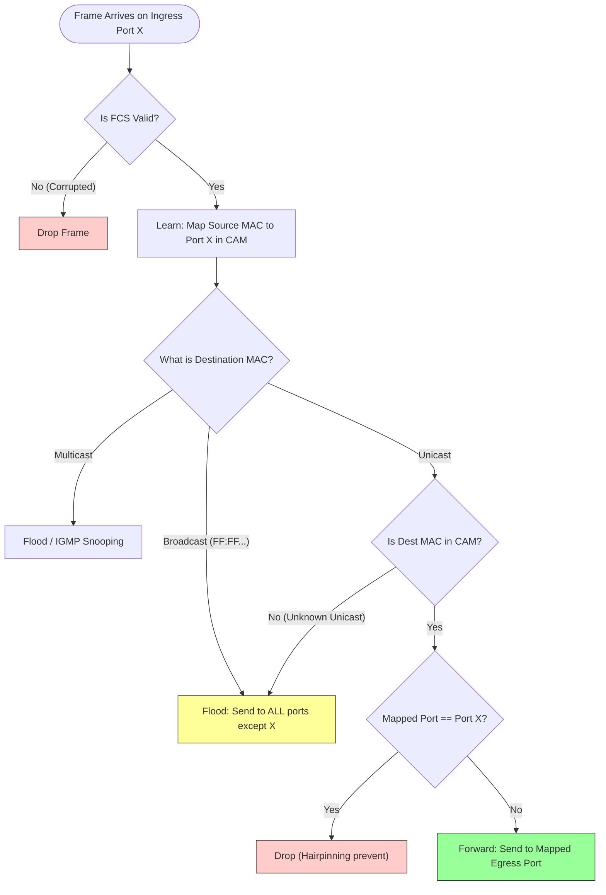

---
tags:
  - networking
  - ethernet
  - vlan
  - stp
  - lacp
  - l2
aliases:
  - L2 Fundamentals
  - Ethernet and Switching
---
# L1.NET.02: Ethernet, VLAN, STP, Link Aggregation

> [!abstract] О лекции
> Данный материал представляет собой глубокое погружение в технологии 2-го уровня модели OSI (Канальный уровень). Понимание этих концепций критически важно для сетевых инженеров, DevOps-специалистов и системных архитекторов. Без знания "нижнего" уровня невозможно эффективно проектировать высоконагруженные облачные инфраструктуры (VPC, Kubernetes CNI) и траблшутить сетевые аномалии.

**TL;DR (Краткая выжимка)**: 
*   **Ethernet** — это фундамент, "ассемблер" современной сети. Это протокол, определяющий, как именно электрические сигналы превращаются в осмысленные кадры данных.
*   **VLAN (802.1Q)** — технология логической изоляции. Главная цель — не безопасность (хотя она присутствует), а **уменьшение размера широковещательных (Broadcast) доменов**, чтобы "белый шум" сети не убил её производительность.
*   **STP (Spanning Tree Protocol)** — исторически необходимый протокол для предотвращения петель коммутации. В современных дата-центрах его стараются избегать (переходя на маршрутизацию L3 Leaf-Spine), но глубокое понимание STP обязательно для предотвращения аварий в классических сетях.
*   **Link Aggregation (LACP)** — объединение физических линков в логические. Ключевое заблуждение: это не "сложение скоростей" для одного потока, а статистическое балансирование (хеширование) разных потоков по разным кабелям.

---
## 1. Ethernet Switching: Анатомия L2-коммутации

> [!info] Терминология: Уровни OSI
> *   **L1 (Физический уровень):** Кабели, радиоволны, электрические импульсы. Устройства: Репитеры, Концентраторы (Hubs).
> *   **L2 (Канальный уровень):** Формирование кадров (Frames), MAC-адресация, обнаружение ошибок. Устройства: Коммутаторы (Switches).
> *   **L3 (Сетевой уровень):** IP-маршрутизация, пакеты. Устройства: Маршрутизаторы (Routers).

> [!abstract] Эволюция: От крика в толпе к приватной беседе
> На заре сетей балом правили **Концентраторы (Hubs)**. Хаб работал исключительно на L1. Он получал электрический сигнал на один порт и слепо копировал его на все остальные. Это была общая шина — как если бы все люди в комнате пытались говорить одновременно. Если говорили двое, происходила **коллизия** (Collision), сигналы накладывались друг на друга, и данные разрушались.
> 
> **Коммутатор (Switch)** изменил правила игры, переведя логику на L2. Коммутатор не копирует электричество, он накапливает сигнал, читает **Кадры (Frames)** и принимает осознанное решение, куда их направить. Он изолирует коллизии, создавая микро-сегменты, где каждый порт — это приватный полнодуплексный канал связи.

### 1.1. Что читает коммутатор? (Ethernet Frame)

Чтобы коммутировать трафик, коммутатору нужно понимать, кто кому пишет. Для этого он анализирует исключительно заголовок Ethernet-кадра. 
В отличие от маршрутизатора (L3), который ищет IP-адреса, коммутатору (L2) абсолютно плевать на IP-адреса. Его интересуют только **MAC-адреса** (Media Access Control) — физические адреса сетевых адаптеров, зашитые на заводе.

> [!info] Формат MAC-адреса
> MAC-адрес состоит из 6 байт (48 бит), обычно записывается в виде `AA:BB:CC:DD:EE:FF`. 
> *   Первые 3 байта (24 бита) — это **OUI** (Organizationally Unique Identifier), код производителя (например, Cisco или Intel).
> *   Последние 3 байта — уникальный серийный номер конкретной сетевой карты.

**Структура базового Ethernet-кадра (802.3):**
1.  **Preamble & SFD (8 байт):** Чередование единиц и нулей для синхронизации частот генераторов на сетевых картах (L1). Последний байт (SFD) дает сигнал: "Внимание, дальше начинаются данные!".
2.  **Destination MAC (6 байт):** Куда летит кадр (Кому). *Именно это поле использует коммутатор для принятия решения о пересылке.*
3.  **Source MAC (6 байт):** Откуда летит кадр (От кого). *Это поле используется для обучения.*
4.  **EtherType (2 байта):** Указывает протокол верхнего уровня, лежащий внутри (Payload). Например:
    *   `0x0800` — внутри лежит IPv4-пакет.
    *   `0x86DD` — внутри лежит IPv6-пакет.
    *   `0x0806` — внутри лежит ARP-запрос.
5.  **Payload (46 - 1500 байт):** Сами данные. Если данных меньше 46 байт, кадр дополняется нулями (Padding).
6.  **FCS (Frame Check Sequence, 4 байта):** Контрольная сумма алгоритма CRC32 для проверки целостности кадра. Если кадр "битый" (например, из-за электромагнитных помех на кабеле), коммутатор молча его уничтожит (Drop).

### 1.2. Мозг коммутатора: CAM-таблица

Как коммутатор понимает, на какой порт отправить кадр с определенным Destination MAC? Он использует "шпаргалку" — **MAC-таблицу**.

В промышленном оборудовании (Cisco, Juniper, Arista) эта таблица хранится не в обычной оперативной памяти (RAM), а в специальной аппаратной памяти **CAM (Content Addressable Memory)**.

> [!info] В чем магия CAM?
> *   **Обычная RAM (Random Access Memory)** работает по принципу массива: *"Дай мне индекс (адрес памяти), и я верну данные, которые там лежат"*. Поиск нужного значения в RAM требует перебора (занимает время O(N)).
> *   **CAM** работает как аппаратная хэш-таблица: *"Вот тебе значение (MAC-адрес), скажи мне сразу, по какому адресу (номеру порта) оно находится"*. Поиск в аппаратной CAM выполняется ровно за один такт процессора/ASIC — за **$O(1)$**, независимо от того, в таблице 10 записей или 128,000. 

### 1.3. Три кита коммутации (Learning, Forwarding, Flooding)

Вся логика работы коммутатора строится на трех простейших, но гениальных правилах, которые обрабатываются аппаратно (на специализированных чипах ASIC).

> [!example] Практический пример: PC-A пингует PC-B
> Представим коммутатор. В порт 1 включен PC-A (MAC: `AA:AA...`), в порт 2 включен PC-B (MAC: `BB:BB...`). CAM-таблица коммутатора пуста.

#### Шаг 1: Обучение (Learning)
*Правило: Коммутатор всегда изучает SOURCE MAC (адрес отправителя).*
Кадр от PC-A заходит в Порт 1. Свитч смотрит на поле Source MAC и думает: "Кадр пришел с Порта 1, а его отправитель — `AA:AA...`. Значит, устройство с таким MAC находится за Портом 1". 
Он делает запись в CAM-таблицу: `[MAC AA:AA... -> Port 1, Таймер: 300 сек]`.
*(Таймер старения — Aging time — обычно 5 минут. Если устройство молчит 5 минут, запись удаляется, чтобы не забивать память).*

#### Шаг 2: Принятие решения (Decision) и Пересылка (Forwarding)
*Правило: Коммутатор ищет DESTINATION MAC (адрес получателя) в таблице.*
Свитч смотрит на поле Destination MAC (`BB:BB...`). Ищет его в CAM-таблице. 

* **Исход А (Неизвестный получатель — Unknown Unicast):** MAC `BB:BB...` в таблице нет (ведь мы только включили коммутатор). 
    * **Действие — Flooding (Лавинная рассылка):** Свитч не может просто удалить кадр. Он вынужден аппаратно скопировать его и отправить во **ВСЕ** активные порты, *кроме того, откуда он пришел* (то есть во все, кроме Порта 1). PC-B получит кадр, а остальные устройства отбросят его на уровне своих сетевых карт, так как MAC не совпадет.
* **Исход Б (Известный получатель — Known Unicast):** Допустим, PC-B уже ответил, и его MAC записан за Портом 2.
    * **Действие — Forwarding (Пересылка):** Свитч берет кадр из Порта 1 и аппаратно перекладывает его строго в Порт 2. Никто другой в сети этот кадр не увидит. Это обеспечивает безопасность (нельзя подслушать чужой трафик обычным сниффером) и высокую пропускную способность.

> [!danger] Broadcast (Широковещание) — Легальный Flooding
> Если устройству нужно найти кого-то (например, протоколу ARP нужно узнать MAC по IP-адресу `192.168.1.5`), оно отправляет кадр на специальный широковещательный MAC-адрес: `FF:FF:FF:FF:FF:FF`.
> Коммутатор **обязан** обработать такой кадр алгоритмом **Flooding** — отправить его всем.

### 1.4. Визуализация логики ASIC (Mermaid)

Точная блок-схема того, как ASIC-чип обрабатывает каждый кадр за наносекунды (без участия центрального процессора свитча).

*(Примечание к схеме: "Hairpinning prevent" — защита от ситуации, когда свитч думает, что получатель находится за тем же портом, откуда пришел кадр. В нормальной сети такого быть не должно, поэтому кадр дропается).*

### 1.5. Смерть CSMA/CD и концепции доменов

В старых учебниках много пишут про алгоритм **CSMA/CD** (Carrier Sense Multiple Access with Collision Detection) — как устройства "слушают" медный кабель перед отправкой, и если сталкиваются (коллизия), то ждут случайное время (Backoff).

**Инженерная реальность:** В современном Ethernet этого больше не происходит. Благодаря коммутаторам и режимам **Full-Duplex** (полный дуплекс — кабель витой пары имеет физически разные жилы для приема (RX) и передачи (TX)), коллизии невозможны по законам физики.

> [!info] Домен коллизий vs Широковещательный домен
> *   **Collision Domain (Домен коллизий):** Зона сети, где возможна коллизия. В современной сети с коммутаторами каждый порт коммутатора — это **отдельный** домен коллизий из одного устройства.
> *   **Broadcast Domain (Широковещательный домен):** Зона сети, до которой долетает широковещательный (Broadcast `FF:FF...`) пакет. По умолчанию, весь коммутатор (и все соединенные с ним коммутаторы) — это один гигантский широковещательный домен. Роутеры (L3) обрезают широковещательные домены.

> [!check] Архитектурный вывод: Предел масштабирования L2
> Коммутаторы L2 работают потрясающе быстро. Почему бы не построить весь интернет на одном гигантском L2-коммутаторе? Ответ кроется в операции **Flooding** и протоколе ARP. 
> Каждый ARP-запрос, каждый поиск DHCP-сервера порождает широковещательный (Broadcast) трафик, который рассылается **всем**. Если объединить 10,000 серверов в один L2-домен, они убьют сеть "белым шумом" из Broadcast-запросов (**Broadcast Storm**). Сетевые карты будут тратить 100% ресурсов своего CPU просто на то, чтобы парсить и отбрасывать чужой мусор.
> 
> Именно поэтому L2-домены нужно "резать" на части (сегментировать). И для этого используется технология **VLAN**.

---
## 2. VLAN (802.1Q): Виртуализация L2 и сегментация

**VLAN (Virtual Local Area Network)** — это механизм логического разделения одного физического коммутатора (или группы коммутаторов) на множество изолированных виртуальных коммутаторов. Технология регламентируется стандартом IEEE 802.1Q.

**Фундаментальное правило:** Трафик между разными VLAN на уровне L2 невозможен. ARP-запрос из VLAN 10 **никогда** не достигнет хоста в VLAN 20. Для связи между ними *обязательно* требуется устройство 3-го уровня (L3): маршрутизатор (Router) или L3-свитч (Multilayer Switch). Процесс их связывания называется Inter-VLAN Routing.

### 2.1. Анатомия 802.1Q тега (Bit-level Deep Dive)
Стандарт 802.1Q не просто инкапсулирует кадр, он **взламывает** его, раздвигая оригинальный заголовок и вставляя 4 байта (32 бита) между полем `Source MAC` и полем `EtherType`.

Структура 4-байтового тега 802.1Q:
1.  **TPID (Tag Protocol Identifier) — 16 бит:**
    *   Всегда имеет значение `0x8100`. Это маркер для сетевой карты устройства: "Внимание, этот кадр тегированный!".
    *   Если несовместимое устройство (например, старая сетевая карта) получает такой кадр, оно читает `0x8100`, не понимает, что это за протокол, и отбрасывает кадр (Drop).
2.  **TCI (Tag Control Information) — оставшиеся 16 бит:**
    *   **PCP (Priority Code Point) — 3 бита:** Используется для **QoS** (Quality of Service) на канальном уровне (стандарт 802.1p). Позволяет маркировать кадры приоритетом от 0 (обычный) до 7 (высший). 
        *   *Пример:* Трафику IP-телефонии (VoIP) или СХД (iSCSI) присваивают PCP 5. Если линк перегружен, коммутатор будет ставить в очередь и дропать кадры с приоритетом 0, но пропускать кадры с приоритетом 5 без задержек.
    *   **DEI (Drop Eligible Indicator) — 1 бит:** Флаг, указывающий, можно ли пожертвовать этим кадром при перегрузке (congestion) сети.
    *   **VID (VLAN Identifier) — 12 бит:** Самое важное поле, сам номер VLAN.
        *   Диапазон: от $0$ до $4095$ (так как $2^{12} = 4096$).
        *   VLAN 0 и 4095 зарезервированы системой.
        *   **Архитектурный лимит:** Максимум 4094 рабочих VLAN в одной сети. Для корпоративной сети этого хватает, но для облачных провайдеров (AWS, Яндекс Cloud) это критическое ограничение, которое привело к созданию технологии **VXLAN** (где используется 24 бита, что дает 16 миллионов изолированных сетей).

> [!danger] Влияние на MTU (Baby Giant Frames)
> Стандартный максимальный размер кадра Ethernet (без заголовков) равен 1500 байт. С базовыми заголовками — 1518 байт.
> Добавление 4 байт 802.1Q тега увеличивает размер кадра до **1522 байт**.
> В прошлом старые сетевые карты, жестко настроенные на прием ровно 1518 байт, отбрасывали тегированные кадры, считая их "гигантскими" (Giant frames) и ошибочными. Сегодня все современные чипы поддерживают "Mini-Jumbo" кадры (1522+ байта) из коробки.

### 2.2. Типы портов и логика коммутации

1.  **Access Port (Порт доступа):**
    *   Служит для подключения конечных устройств (ПК, Серверов, принтеров), которые "не знают" о существовании VLAN.
    *   *Вход (Ingress):* Когда "чистый" кадр от ПК приходит на коммутатор, коммутатор сам "вешает" на него тег (PVID — Port VLAN ID), настроенный на этом порту (например, VLAN 10).
    *   *Выход (Egress):* Когда коммутатор отправляет кадр из порта доступа в сторону ПК, он **срезает (untag)** заголовок 802.1Q. Устройство получает обычный, чистый Ethernet-кадр.
2.  **Trunk Port (Магистральный/Транковый порт):**
    *   Служит для подключения коммутатора к другому коммутатору, маршрутизатору или гипервизору (ESXi, KVM, Proxmox), где работают виртуальные машины из разных VLAN.
    *   Передает кадры **с сохранением 802.1Q тега**. Благодаря этому принимающая сторона понимает, какому VLAN принадлежит кадр.
> [!check] Best Practice: VLAN Pruning (Обрезка транка)
По умолчанию транк пропускает все 4094 VLAN. Это плохо: широковещательный мусор из VLAN 10 полетит на соседний коммутатор, даже если там нет портов в VLAN 10. Правило хорошего тона — разрешать в транке только *строго необходимые* VLAN: `switchport trunk allowed vlan 10,20`.
3.  **Hybrid Port (Гибридный порт):**
    *   Термин, используемый вендорами вроде MikroTik, HP, Huawei. По сути, это порт, который позволяет передавать несколько VLAN с тегами (как транк) и один VLAN без тега (как access). В терминологии Cisco это Транк с настроенным Native VLAN.

### 2.3. Native VLAN и атака VLAN Hopping (Прыжок между VLAN)

На транковом порту всегда существует понятие **Native VLAN** (по умолчанию это VLAN 1).
Особенность Native VLAN: кадры, принадлежащие этому VLAN, передаются через транк **БЕЗ тега 802.1Q**.

**Сценарий атаки "Double Tagging" (Двойное тегирование):**
Представим, что злоумышленник подключен к порту, который находится в Native VLAN (VLAN 1). Он хочет отправить пакет в изолированный серверный сегмент (VLAN 100), куда ему доступ запрещен маршрутизатором.
1.  Хакер (используя спец. софт вроде Yersinia) формирует вредоносный кадр с **двумя** заголовками 802.1Q вложенными друг в друга:
    *   Внешний тег: `VLAN 1`.
    *   Внутренний тег: `VLAN 100`.
2.  Свитч злоумышленника получает кадр. Он должен передать его через Trunk-порт на следующий свитч (ядро сети).
3.  Свитч видит внешний тег (`VLAN 1`). Так как VLAN 1 является Native для этого транка, правило гласит: "Native VLAN передается без тега". Свитч **срезает** внешний тег `VLAN 1` и отправляет кадр в транк.
4.  Свитч ядра получает кадр. Он смотрит в заголовок и видит оставшийся "внутренний" тег — `VLAN 100`.
5.  Свитч ядра думает: "О, это легальный тегированный кадр для VLAN 100" и послушно доставляет его серверу-жертве, в обход всех проверок безопасности L3.

> [!check] Защита архитектора:
> 1.  **VLAN 1 is Dead:** Никогда не используйте VLAN 1 для пользовательских данных или управления.
> 2.  **Tag Native VLAN:** Включите глобальную настройку (например, `vlan dot1q tag native` на Cisco), которая заставляет свитч тегировать *абсолютно все* VLAN в транке, включая Native. Атака становится физически невозможной.
> 3.  **Unused Native:** Установите на всех транках Native VLAN ID на несуществующий/неиспользуемый "черный" номер (например, `switchport trunk native vlan 999`).

### 2.4. Private VLANs (PVLAN): Изоляция внутри подсети

Частая задача в ЦОД, хостинг-центрах или гостиницах: клиенты находятся в одной IP-подсети (например, `192.168.1.0/24`), но они **не должны** иметь возможность пинговать друг друга или сканировать порты соседа. Они должны видеть только шлюз по умолчанию (роутер). 
Создавать под каждого клиента отдельный VLAN с маской `/30` — безумие: это исчерпает лимит в 4094 VLAN и потратит огромное количество IP-адресов на адреса сети и броадкаста.

**Решение — технология PVLAN (Private VLAN):**
PVLAN разделяет один обычный VLAN (Primary) на внутренние подтипы (Secondary) и меняет логику коммутации:
1.  **Promiscuous Port (P-Port):** "Беспорядочный" порт. Обычно сюда подключается роутер/шлюз или общая СХД. Он может общаться абсолютно со всеми портами в PVLAN.
2.  **Isolated Port (I-Port):** "Изолированный" порт. Сюда подключаются клиенты. Порт типа Isolated может общаться **только** с Promiscuous-портом. Два изолированных порта не видят друг друга, даже если находятся в одном коммутаторе и одной IP-сети.
3.  **Community Port (C-Port):** "Сообщество". Группа портов, которые могут общаться друг с другом внутри своей группы (Community) и с Promiscuous-портом, но изолированы от других Community и Isolated портов.

### 2.5. QinQ (802.1ad): Metro Ethernet

Когда интернет-провайдер (ISP) предоставляет услугу объединения двух офисов клиента через городскую оптику (Metro Ethernet), возникает конфликт. Клиент в своих офисах уже использует свои теги (VLAN 10 для бухгалтерии, VLAN 20 для IT). Провайдеру же нужно инкапсулировать *весь* трафик этого клиента в свой транспортный VLAN (например, VLAN 1005), чтобы провести его через свою магистраль и не смешать с трафиком других клиентов.

**Технология QinQ (802.1ad) — легальное двойное тегирование:**
Провайдерский свитч берет уже тегированный кадр клиента и "оборачивает" его во второй, внешний тег.
*   **C-Tag (Customer Tag):** Внутренний тег клиента (сохраняет стандартный TPID `0x8100`).
*   **S-Tag (Service Tag / Provider Tag):** Внешний тег провайдера. Чтобы коммутаторы не путались, S-Tag использует другой маркер протокола: TPID **`0x88A8`**.
*   *Требование:* Размер кадра вырастает еще на 4 байта (итого 1526 байт). Инженеру провайдера необходимо увеличить показатель MTU на всех магистральных интерфейсах (System MTU Jumbo).

---
## 3. STP (Spanning Tree Protocol): Анатомия и Патология L2-сетей

**Определение:** STP (стандарт IEEE 802.1D) и его современные версии (RSTP, MSTP) — это протоколы канального уровня, предназначенные для динамического устранения "петель" (loops) в физической топологии сети путем перевода резервных (избыточных) кабелей в режим блокировки.

> [!danger] Фундаментальная проблема Ethernet: Отсутствие TTL
> В заголовке IP-пакета (L3) есть поле **TTL (Time To Live)**. С каждым прыжком через роутер TTL уменьшается на 1. Если TTL = 0, пакет убивается. Пакет не может блуждать вечно.
> 
> В заголовке Ethernet-кадра (L2) **нет поля TTL**.
> *   **Сценарий (Петля):** Три коммутатора соединены треугольником для надежности.
> *   **Событие:** Сервер отправляет один Broadcast-кадр (например, ARP-запрос).
> *   **Последствие (Broadcast Storm / Широковещательный шторм):** Свитч А получает кадр и, по правилу Flooding, дублирует его на Свитч Б и В. Свитч Б дублирует его обратно на А и В. Кадр начинает бесконечно циркулировать по кольцу, реплицируясь (размножаясь) на каждом шаге. 
> *   **Итог:** За считанные миллисекунды трафик в кольце достигает 100% емкости портов. Центральные процессоры коммутаторов зависают, пытаясь обработать этот мусор. Вся сеть компании полностью парализуется.

Чтобы этого не произошло, был придуман STP. Он находит петлю и логически "разрывает" её, отключая один из портов.

### 3.1. Ключевые термины и Определения

Для дебага проблем с STP (а они будут), нужно знать механику протокола:

1.  **BPDU (Bridge Protocol Data Unit):** "Сердцебиение" STP. Это маленькие служебные кадры, которые свитчи посылают друг другу по специальному Multicast MAC-адресу (`01:80:C2:00:00:00`) каждые 2 секунды (Hello Time). BPDU несет информацию о топологии. Если BPDU перестают приходить на заблокированный порт, свитч понимает: "Ага, основной линк упал, можно разблокировать резервный!".
2.  **Bridge ID (BID):** Уникальный "паспорт" коммутатора (размер 8 байт), используемый для выборов главного в сети. Состоит из двух частей:
    *   `Priority` (Приоритет, 2 байта): По умолчанию на всех свитчах равен `32768`. Администратор может менять его шагами по 4096 (0, 4096, 8192 и т.д.).
    *   `MAC Address` (6 байт): Заводской MAC самого свитча.
    *   **Железное правило выборов:** В мире STP побеждает тот, у кого значение **МЕНЬШЕ**. Сначала сравнивается Priority (у кого 4096, тот победит 32768). Если приоритеты равны, побеждает свитч с более "старым" (меньшим) MAC-адресом.
3.  **Path Cost (Стоимость пути):** У каждого линка есть "стоимость". Чем быстрее линк, тем она меньше.
    *   *Историческая справка:* По старому стандарту 1 Gbps стоил `4`. По новому стандарту (Long Mode, IEEE 802.1t) 1 Gbps стоит `20,000`, а 10 Gbps стоит `2,000`. 
    *   *Инсайт для инженера:* При объединении старых и новых свитчей всегда проверяйте, чтобы они использовали одну шкалу Cost (обычно включают `spanning-tree pathcost method long`), иначе дерево построится непредсказуемо.

### 3.2. Алгоритм построения дерева (4 шага)

Сеть должна прийти к стабильному состоянию (Convergence), где между любыми двумя свитчами есть ровно один рабочий маршрут.

1.  **Выбор Root Bridge (Корневой мост):**
    *   При включении все свитчи рассылают BPDU и кричат: "Я — Root!".
    *   Сравнив BID соседей, все признают победителем коммутатор с минимальным BID. (В правильной архитектуре администратор *вручную* ставит Priority = 4096 на самых мощных коммутаторах Ядра сети, чтобы они стали Root).
2.  **Выбор Root Ports (RP):**
    *   Каждый не-Корневой свитч должен найти кратчайший путь к Корню. Он складывает Cost всех пройденных линков. Порт, который смотрит на маршрут с минимальным Cost, становится **Root Port**. На свитче может быть только ОДИН Root Port.
3.  **Выбор Designated Ports (DP):**
    *   На каждом физическом проводе (сегменте) между двумя свитчами нужно выбрать, кто будет передавать трафик. Выбирается порт того свитча, чей путь до Корня "дешевле". Этот порт становится **Designated Port** (Назначенный порт).
4.  **Блокировка (Blocking):**
    *   Все оставшиеся порты, которые не смогли стать ни RP, ни DP (резервные кабели), переводятся в состояние **Blocking (Discarding)**. Они продолжают слушать BPDU, но замолкают и перестают пересылать пользовательские данные. Петля разорвана.

### 3.3. Эволюция: Почему оригинальный 802.1D умер

В классическом (старом) STP смена топологии — это катастрофа для современных приложений.
Если основной кабель обрывается, резервный (заблокированный) порт не может включиться сразу. Он обязан перестраховаться от создания новой петли и проходит длительные фазы прослушивания:
*   *Blocking* (ждем 20 сек — Max Age таймер истекания BPDU)
*   *Listening* (слушаем новые BPDU 15 сек)
*   *Learning* (изучаем новые MAC-адреса 15 сек)
*   $	o$ *Forwarding* (наконец-то передаем трафик).
**Итог: 50 секунд полного простоя (Downtime).** Для кластеров баз данных, iSCSI хранилищ или голосовых звонков пауза в 50 секунд равносильна аварии.

### 3.4. RSTP (802.1w): Rapid Spanning Tree

Сегодня стандартом де-факто является RSTP (или его производные). Он обеспечивает сходимость при обрывах за **время менее 1 секунды** (часто миллисекунды).

**Механизм ускорения (Proposal / Agreement Handshake):**
Вместо того чтобы пассивно ждать таймеры по 15 секунд, свитчи в RSTP активно ведут переговоры (Handshake):
1.  Свитч А отправляет специальный BPDU: "Я предлагаю (Proposal) сделать этот линк активным, мой путь до Корня лучше".
2.  Свитч Б мгновенно блокирует все свои остальные порты (процесс Sync), чтобы гарантированно не создать петлю, и отвечает: "Согласен (Agreement)".
3.  Линк между А и Б немедленно, без таймеров, переходит в состояние Forwarding.

**Критически важная настройка: Edge Port (PortFast)**
Если к порту коммутатора подключен ПК или Сервер (конечное устройство), этот порт **никогда** не вызовет петлю. В RSTP такие порты настраиваются как **Edge Port** (терминология Cisco — `spanning-tree portfast`).
При включении кабеля в такой порт, свитч пропускает все проверки и переводит порт в рабочее состояние (Forwarding) за 0 секунд. Без этой настройки у вас могут "отваливаться" загрузки по сети (PXE/DHCP) на ПК, так как свитч будет держать порт заблокированным первые 30 секунд загрузки ОС.

### 3.5. MSTP (802.1s): Multiple Spanning Tree

В сетях Cisco исторически работал протокол **PVST+** (Per-VLAN Spanning Tree). Он запускал отдельную копию STP-дерева для каждого VLAN. Если у вас 500 VLAN, процессор свитча вынужден обсчитывать 500 деревьев, что приводит к перегрузке CPU.

**MSTP (Multiple STP)** решает эту проблему элегантно: он позволяет группировать десятки и сотни VLAN в логические **Инстансы (MSTI)**.
*   **Пример:** Мы относим VLAN с 1 по 500 к Instance 1. VLAN с 501 по 1000 — к Instance 2.
*   **Балансировка нагрузки (Load Balancing):**
    *   Мы настраиваем Левый Корневой коммутатор быть Root для Instance 1. Трафик VLAN 1-500 идет по левому резервному кабелю.
    *   Мы настраиваем Правый Корневой коммутатор быть Root для Instance 2. Трафик VLAN 501-1000 идет по правому кабелю.
*   *Результат:* Оба дорогих высокоскоростных линка (правый и левый) утилизируются и передают трафик, а не просто висят в блокировке, как это было бы в базовом STP.

### 3.6. Механизмы защиты (Stability Features / Hardening)

Инженер обязан внедрять защитные механизмы, чтобы пользователи или аппаратные сбои не развалили STP-топологию.

1.  **BPDU Guard:**
    *   *Суть:* Настраивается на пользовательских портах (Access / Edge Ports). Если на такой порт внезапно прилетает пакет BPDU (что означает, что кто-то вместо компьютера воткнул в розетку свитч), порт немедленно уходит в защитную блокировку (Err-Disable).
    *   *Зачем:* Спасает от "очумелых ручек" сотрудников, которые приносят домашние роутеры/хабы и втыкают их в офисную сеть.
2.  **Root Guard:**
    *   *Суть:* Если порт получает BPDU с приоритетом, претендующим на статус Корневого (Superior BPDU), порт блокируется.
    *   *Зачем:* Гарантирует, что старый глючный свитч, случайно подключенный где-то на периферии, не объявит себя Корнем сети и не "всосет" в свой слабый гигабитный линк весь трафик дата-центра. Настраивается на Downlink-портах свитчей ядра.
3.  **Loop Guard / UDLD (Unidirectional Link Detection):**
    *   *Суть:* Оптические кабели состоят из двух жил (RX и TX). Иногда одна жила ломается (загрязняется коннектор). Возникает односторонняя связь. STP-порт перестает получать BPDU (RX мертв), думает, что обрыва нет, но Корня больше нет, и разблокирует резервный порт. Создается петля, так как TX жила все еще шлет данные.
    *   *Зачем:* Протокол UDLD постоянно проверяет двунаправленность линка. Если ломается одна жила, UDLD гасит весь физический порт.

---
## 4. Link Aggregation (LACP / 802.3ad / 802.1ax)

Технология объединения нескольких физических кабелей (линков) в один логический канал (Port-Channel, Bond, Trunk, LAG).
Архитектор не может просто сказать "объедините два порта 10G, чтобы получить 20G". Нужно глубоко понимать механику распределения пакетов (Load Balancing), иначе вы получите неравномерную загрузку (Polarization), потерю пакетов и проблемы с TCP.

### 4.1. Static LAG vs Dynamic LACP

Существует два способа собрать агрегированный канал:
1.  **Static LAG (Режим "On"):** 
    *   Администратор просто принудительно включает агрегацию. Свитч не проверяет, правильно ли настроен сосед.
    *   *Риск Архитектора (Black Hole):* Представьте, что между сервером и свитчем стоит медиа-конвертер. Если кабель обрывается за конвертером, свитч видит, что порт физически `UP`. Так как LAG статический, свитч продолжает распределять 50% трафика в этот "мертвый" порт. Половина данных безвозвратно исчезает.
2.  **LACP (Link Aggregation Control Protocol, 802.3ad):** 
    *   Интеллектуальный протокол. Свитч и Сервер постоянно обмениваются кадрами-пульсами **LACPDU**.
    *   Порт добавляется в канал *только* если получено подтверждение от соседа. Если LACPDU перестают приходить (обрыв, завис сервер), порт моментально исключается из группы передачи, и 100% трафика переводится на оставшиеся живые провода.
> [!check] Вердикт: В production среде используйте **исключительно** динамический LACP (Mode Active).
> 
### 4.2. Механика LACP и Таймеры

В LACP есть понятие **System Priority** и **System MAC**. Вместе они образуют System ID. Устройство с меньшим приоритетом становится Мастером (Master) и диктует правила (например, если объединяется 4 линка, но свитч поддерживает только 2 активных, Мастер решает, какие порты будут в состоянии Active, а какие в Standby).

**Таймеры LACP (LACP Rate):**
*   **Slow (По умолчанию):** Пакеты LACPDU отправляются раз в 30 секунд. LACP объявит линк мертвым только после потери 3 пакетов (Failover = 90 секунд). Для дата-центров это неприемлемо долго.
*   **Fast:** Пакеты LACPDU отправляются 1 раз в секунду. Failover time $\approx$ 3 секунды.
   > [!check] Совет для Linux: При настройке `bonding` всегда явно указывайте параметр `lacp_rate=fast` (или `1`), иначе при сбое кабеля виртуалки на сервере уйдут в таймаут.

### 4.3. Data Plane: Алхимия хеширования (Load Balancing)

Самое распространенное заблуждение новичка: *"Я собрал Bond из 2x10Gbps серверов. Значит, я смогу скопировать один большой файл по сети со скоростью 20Gbps"*. 
**Ответ: Нет, скорость одного файла будет максимум 10Gbps.**

#### Почему так? Проблема TCP Reordering
Протокол TCP крайне чувствителен к порядку прихода пакетов. Если кусок файла (Пакет 1) пойдет по первому кабелю (который чуть нагружен), а Пакет 2 пойдет по второму кабелю (который свободен), Пакет 2 прилетит на принимающий сервер быстрее. 
TCP воспримет это как потерю Пакета 1, начнет слать DupACK (дублированные запросы) и включит механизмы спасения сети (уменьшит окно передачи). Скорость рухнет до мегабитов.
**Железный закон агрегации:** Все пакеты **одного потока** (Flow/Session) всегда должны передаваться строго по **одному** физическому кабелю. Агрегация не ускоряет одну машину, она позволяет *множеству* разных машин работать вместе без заторов.

#### Стратегии хеширования (Hashing Policies)
Как чип (ASIC) решает, в какой кабель закинуть конкретный пакет? Он берет заголовки пакета, прогоняет их через математическую функцию (Хеш) и делит с остатком на количество рабочих кабелей.

1.  **Layer 2 Hashing (Src MAC XOR Dst MAC):**
    *   Свитч смотрит только на MAC-адреса.
    *   *Проблема (Поляризация трафика):* Представьте сервер виртуализации (Hyper-V). Все ВМ на нем общаются с внешним миром через шлюз по умолчанию (Router). Это значит, что для 99% пакетов Destination MAC = MAC-адрес Роутера. Хеш будет постоянно выдавать одно и то же число. Весь трафик дата-центра ляжет в **один** физический кабель, а второй будет стоять пустым с нагрузкой 0%. Это катастрофа.
2.  **Layer 3+4 Hashing (IP + Port) — Золотой стандарт:**
    *   Свитч лезет глубоко в пакет (считает 5-tuple: `Src IP, Dst IP, Protocol, Src Port, Dst Port`).
    *   *Почему это идеально:* Даже если вы качаете файл с одного и того же сервера (IP те же), современный софт использует многопоточность. Каждый поток открывает новый Source TCP-порт (например, 51322, 51323, 51324). Из-за разных портов хеш получается разным $	o$ пакеты идеально равномерно размазываются по всем доступным физическим кабелям.

> [!check] Настройка Linux:
> Для максимальной утилизации линков (особенно в Kubernetes или средах с VXLAN) всегда проверяйте параметр модуля bonding: `xmit_hash_policy=layer3+4` (или `encap3+4`).

### 4.4. MLAG (Multi-Chassis Link Aggregation)

Классический LACP по стандарту требует, чтобы все объединяемые порты на другой стороне принадлежали **одному логическому устройству** (одинаковый System ID). Это создает единую точку отказа (SPOF) — если этот единственный свитч сгорает по питанию, сервер теряет сеть, несмотря на наличие 4-х кабелей в него.

**Решение: MLAG (Arista), vPC (Cisco Nexus), MC-LAG (Juniper)**
Два независимых физических коммутатора объединяются в пару с помощью толстого линка синхронизации (Peer Link / Inter-Switch Link).
1.  Коммутаторы договариваются между собой вещать серверу по LACP **один фиктивный общий System MAC**.
2.  Сервер смотрит на провода и думает, что он подключен к одному гигантскому сверхнадежному свитчу.
3.  Трафик балансируется между двумя шасси. Если один свитч сгорает, сервер продолжает работу через второй без единого разрыва TCP-сессий.

**Архитектурный риск: Split-Brain (Расщепление мозга)**
Самый страшный сон инженера. Если центральный кабель синхронизации (Peer Link) между коммутаторами рвется (оптику задели в стойке), но сами коммутаторы живы. Оба свитча начинают думать, что сосед умер, и оба становятся "Главными", вещая серверам противоречивую информацию по LACP. Сеть начинает "штормить", пакеты теряются.
*   *Защита:* Внедрение **Keepalive Link**. Это отдельный, тонкий L3-линк (часто пробрасывается через менеджмент-сеть или медный 1Gbps порт). Его задача: проверять сердцебиение "соседа" в обход основного Peer Link. Если Peer Link упал, но по Keepalive слышно, что сосед жив — значит это обрыв кабеля, а не смерть свитча. В этом случае один из свитчей (Secondary) добровольно гасит все свои порты к серверам, чтобы предотвратить конфликт (Split-brain recovery).

---
## 5. Чек-лист уровня Practitioner (Траблшутинг)

1.  **ARP Table vs MAC Table:** Четко понимайте разницу на собеседованиях и при дебаге.
    *   *MAC Table (Слой L2):* Работает на коммутаторах. Отвечает на вопрос "За каким физическим портом находится устройство с MAC `X`?".
    *   *ARP Table (Слой L3):* Работает на ПК, Серверах, Роутерах. Отвечает на вопрос "Какой MAC-адрес принадлежит IP-адресу `Y`?".
2.  **LACP не балансирует (Один линк забит на 100%, второй 0%):**
    *   *Диагностика:* Проверить метод хеширования (`xmit_hash_policy` на Linux сервере, `port-channel load-balance` на коммутаторе). Вероятно, включен дефолтный Layer 2 хеш, и весь трафик летит в шлюз.
3.  **В офисе загадочным образом легла сеть (Индикаторы на свитчах бешено моргают):**
    *   *Причина:* Broadcast Storm из-за петли коммутации. Уборщица переткнула кабель, или сотрудник воткнул патч-корд из розетки 1 в розетку 2.
    *   *Что не было настроено:* `BPDU Guard` на портах доступа.

> [!abstract] Заключение
> L2 Ethernet — это высокопроизводительная, но потенциально **нестабильная** зона. Широковещательные штормы, долгие STP-перестроения, нюансы LACP-хеширования делают огромные плоские L2-сети бомбой замедленного действия.
> Главная задача современного архитектора дата-центра:
> 1.  Минимизировать размер L2-доменов.
> 2.  Вынести L3-маршрутизацию максимально близко к серверам (архитектура Leaf-Spine / IP Fabric).
> 3.  А если серверам обязательно нужен единый L2 для миграции виртуалок — инкапсулировать этот L2-трафик внутрь L3-туннелей (например, технология **VXLAN**).