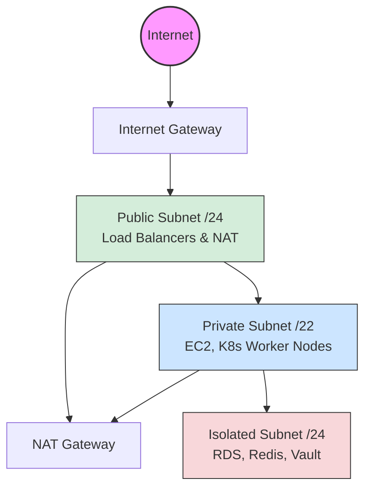
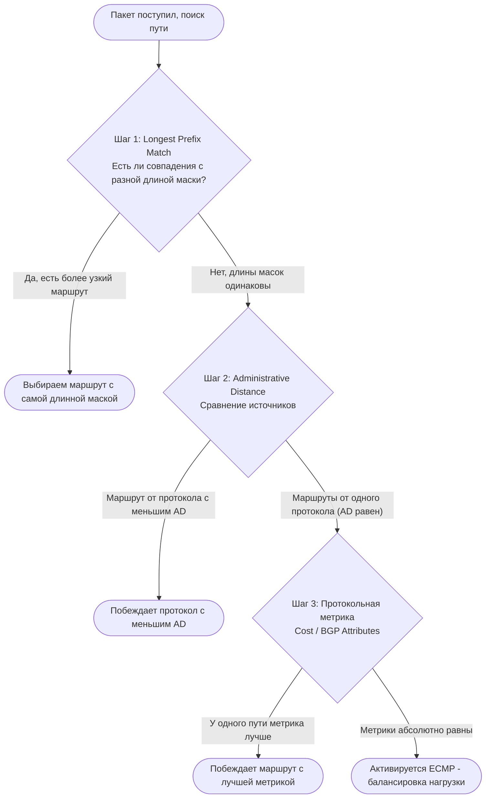
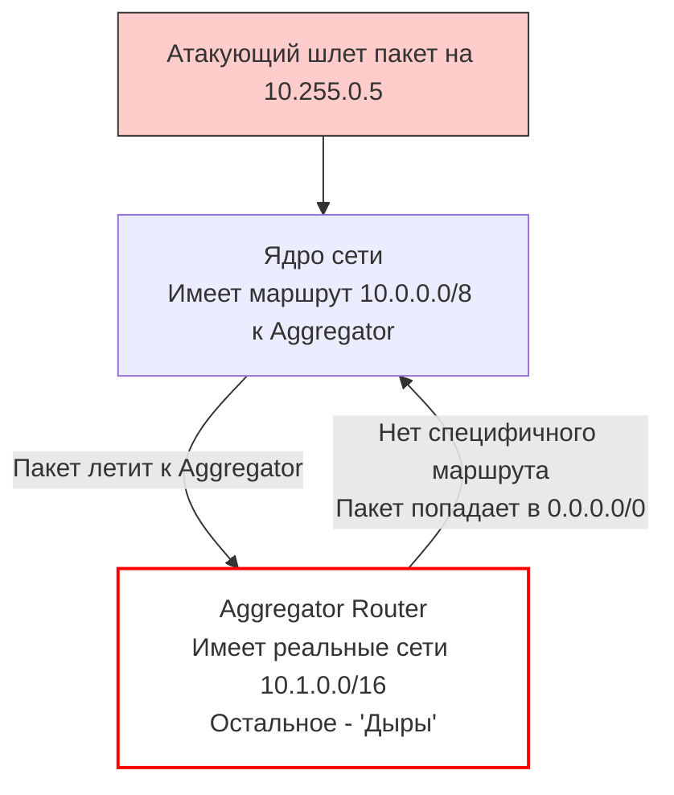
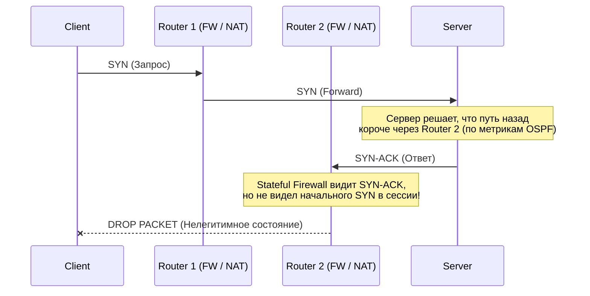

---
tags:
  - networking
  - ipam
  - cidr
  - routing
  - architecture
  - vpc
aliases:
  - L3 Fundamentals
  - Routing Basics
---
# L1.NET.03: IP addressing, subnetting, CIDR, routing basics

> [!abstract] О лекции
> Сетевой уровень (L3 модели OSI) — это кровеносная система любой инфраструктуры. Ошибки на уровне коммутации (L2) приводят к локальным сбоям, но ошибки проектирования L3 (IP-адресации и маршрутизации) закладывают фундаментальный технический долг. В этом материале мы разбираем, как мыслят Staff-архитекторы при планировании адресного пространства облаков, как аппаратно работают таблицы маршрутизации и как избежать катастроф при масштабировании кластеров и интеграции сетей.

## 1. Стратегия IP-адресации (IPAM) и Планирование пространства

**IPAM (IP Address Management)** — это не просто Excel-таблица со списком занятых адресов. Это полноценная инженерная дисциплина и стратегия управления **дефицитным ресурсом** (пространством IPv4), которая должна гарантировать бесшовную масштабируемость сети компании на 5-10 лет вперед. В современных реалиях IPAM автоматизируется инструментами вроде NetBox, Infoblox или AWS IPAM.

> [!danger] Главная боль: IP Overlap (Пересечение адресных пространств)
> **Что это:** Две разные логические сети случайно (или из-за плохой координации) используют один и тот же блок адресов, например, `10.0.0.0/16`.
> **Когда возникает:** Чаще всего при слияниях и поглощениях (M&A), когда ваша компания покупает стартап, или при хаотичном создании VPC разными командами.
> **Следствие:** Вы физически не сможете соединить эти сети напрямую (через VPC Peering, VPN Site-to-Site или AWS Direct Connect). Маршрутизаторы не будут знать, куда отправлять пакет: на локальный `10.0.1.5` или на удаленный `10.0.1.5`.
> **Цена ошибки:** Инженерам придется внедрять **Double NAT** (SNAT и DNAT с обеих сторон туннеля). Это чудовищный "костыль", который:
> 1. Полностью убивает сквозную видимость реальных IP-адресов (Source IP visibility), ломая аудит безопасности и логирование.
> 2. Создает узкое место (bottleneck) по CPU на NAT-устройствах.
> 3. Ограничивает количество одновременных TCP-сессий из-за исчерпания портов (Port Exhaustion).

### 1.1. RFC1918: Частные сети (Private Address Space)

Документ RFC1918 (1996 год) зарезервировал три диапазона IP-адресов для локального использования. Эти адреса **не маршрутизируются** в глобальном интернете — провайдеры (ISP) обязаны отбрасывать пакеты с такими адресами на своих границах (Bogon filtering).

1.  **`10.0.0.0/8` (10.0.0.0 – 10.255.255.255)**
    *   **Емкость:** ~16.7 млн адресов ($2^{24}$).
    *   **Вердикт:** **Золотой стандарт Enterprise.**
    *   **Стратегия использования (Hierarchical Design):** Это единственное пространство, обладающее достаточной емкостью для глубокой макро-сегментации. Архитекторы никогда не выдают этот блок целиком. Они делят его иерархически.
    *   *Пример правильной нарезки (Top-Down Planning):*
        *   `10.0.0.0/8` — Глобальный пул компании.
        *   `10.16.0.0/12` — Выделено на регион Европа (EU-West).
        *   `10.16.0.0/16` — Внутри Европы: VPC Production.
        *   `10.17.0.0/16` — Внутри Европы: VPC Staging.
        *   `10.32.0.0/12` — Выделено на регион США (US-East).

2.  **`172.16.0.0/12` (172.16.0.0 – 172.31.255.255)**
    *   **Емкость:** ~1 млн адресов ($2^{20}$).
    *   **Вердикт:** **"Токсичная" зона (Использовать с осторожностью).**
    *   **Проблема:** Исторически этот диапазон стал де-факто стандартом для коробочных решений и виртуализации. 
        *   **AWS Default VPC** всегда создается в подсети `172.31.0.0/16`.
        *   **Docker Bridge Network** (на ноутбуках разработчиков и серверах) монополизирует диапазон `172.17.0.0/16`.
    *   *Риск:* Если вы построите ядро корпоративной сети на `172.17.0.0/16`, разработчики не смогут к ней подключиться через VPN. Локальная ОС разработчика увидит, что сеть `172.17.x.x` принадлежит локальному интерфейсу `docker0` (Directly Connected маршрут всегда имеет высший приоритет). Весь трафик к вашей базе данных уйдет в локальный контейнер и пропадет.
    *   *Совет:* Оставьте этот диапазон для legacy-систем, изолированных OOB (Out-of-Band) Management-сетей или тестовых песочниц.

3.  **`192.168.0.0/16` (192.168.0.0 – 192.168.255.255)**
    *   **Емкость:** 65 536 адресов ($2^{16}$).
    *   **Вердикт:** **The "SOHO" Trap (Ловушка малого офиса).**
    *   **Проблема:** Это индустриальный стандарт для 99% домашних роутеров (D-Link, TP-Link, Keenetic) и публичных Wi-Fi сетей (кафе, отели, аэропорты). Они раздают адреса `192.168.0.x` или `192.168.1.x` по DHCP.
    *   *Сценарий катастрофы:* Ваш сотрудник работает удаленно. Роутер в отеле выдал ему IP `192.168.0.15/24`. Ваша корпоративная VPC тоже настроена на `192.168.0.0/24`. При включении VPN-клиента (без форсированного full-tunnel) маршруты конфликтуют. Ноутбук не знает, куда слать пакет — в туннель или на роутер отеля. Итог: полная потеря связности.
    *   *Совет:* **Никогда** не используйте `192.168.x.x` для облачных VPC или серверных сегментов Дата-Центров. Оставьте его исключительно для гостевого Wi-Fi в ваших офисах.

### 1.2. RFC6598: Carrier-Grade NAT (CGNAT) / Shared Space

*   **Диапазон:** **`100.64.0.0/10`** (100.64.0.0 – 100.127.255.255). Емкость: ~4.1 млн адресов.
*   **История:** Введен для интернет-провайдеров (ISP), чтобы они могли выдавать "серые" IP своим абонентам для трансляции через Carrier-Grade NAT (технология NAT444), не конфликтуя с домашними роутерами клиентов (RFC1918).
*   **Применение для Архитектора (Pro Tip):** Это ваше "секретное оружие". В крупных энтерпрайзах классический `10.0.0.0/8` быстро фрагментируется и заканчивается. Блок `100.64.0.0/10` **не пересекается** ни с RFC1918, ни с реальными белыми (Public) IP-адресами интернета.
    *   **Идеально подходит для:**
        1.  **Kubernetes Pod/Service CIDR:** Контейнеры (Поды) живут недолго и общаются преимущественно внутри кластера. Выделяя им огромные блоки из `100.64.x.x` (например, `/16` на каждый кластер), вы экономите драгоценные адреса `10.x.x.x` для реальных виртуальных машин (EC2) и баз данных.
        2.  **Транзитные сети:** Линковочные подсети (Point-to-Point `/30` или `/31`) между вашими корпоративными маршрутизаторами, Transit Gateways или VPN-пирами.

### 1.3. Стратегия "Разреженного выделения" (Sparse Allocation)

Главная, фатальная ошибка новичка при IPAM — выделять подсети "впритык" друг к другу, пытаясь сэкономить биты адресации. Облачная инфраструктура всегда растет, и плотное выделение приводит к жесткой фрагментации таблиц маршрутизации.

*   **Плохой дизайн (Плотное выделение):**
    *   VPC A: `10.0.1.0/24`
    *   VPC B: `10.0.2.0/24`
    *   *Проблема:* Если проект "VPC A" выстрелит и ему срочно потребуется больше IP-адресов, вы **не сможете** просто раздвинуть его маску до `/23` (чтобы получить `10.0.0.0/23`), так как диапазон `10.0.2.x` уже занят соседним VPC B. Вам придется добавлять VPC A совершенно новый, несмежный (discontiguous) CIDR, например `10.0.5.0/24`. Управление правилами Security Groups и таблицами маршрутов усложнится вдвое.

*   **Хороший дизайн (Bit Boundary Planning / Sparse Allocation):**
    Всегда выделяйте блоки с огромным запасом (с прицелом на рост), опираясь на границы степеней двойки, и сознательно оставляйте "темное пространство" (резервные пустоты) между выделенными блоками.
    *   VPC A: `10.0.0.0/20` (занимает адреса от 0.0 до 15.255)
    *   **RESERVED GAP:** `10.0.16.0/20` (осознанно пустой резерв на случай роста VPC A)
    *   VPC B: `10.0.32.0/20` (занимает адреса от 32.0 до 47.255)
    *   *Преимущество:* Если VPC A вырастет, вы просто отдадите ему резервный блок `10.0.16.0/20`. Математика битов позволит вам объединить их в единый супер-маршрут (Supernet) `10.0.0.0/19`, не затрагивая VPC B и не раздувая таблицу маршрутизации.

### 1.4. Типовой шаблон облачного дизайна (VPC Tiering)

Для безопасности и стандартизации во всех аккаунтах (AWS/Azure/GCP) необходимо использовать шаблонную "слоистую" нарезку подсетей (Tiering). Допустим, архитекторы выделили на один VPC крупный блок **`/20`** (4096 адресов).

| Тип подсети (Tier) | Размер (CIDR) | Описание и паттерны использования | Пример (из 10.0.0.0/20) |
| :--- | :--- | :--- | :--- |
| **Public (DMZ)** | `/24` (на каждую Availability Zone) | "Грязная зона". Имеет дефолтный маршрут (`0.0.0.0/0`) напрямую в Internet Gateway. Здесь живут **только** точки входа: Load Balancers (ALB/NLB), NAT Gateways, VPN-концентраторы и Bastion Hosts. | `10.0.0.0/24` (AZ1) `10.0.1.0/24` (AZ2) |
| **Private (App)** | `/22` (на каждую Availability Zone) | "Зона вычислений". Для Application-серверов и K8s Worker Nodes. У ресурсов здесь **нет** публичных IP. В интернет они выходят исключительно через NAT. Это **самый большой потребитель IP** из-за автоскейлинга. | `10.0.4.0/22` (1024 IP) `10.0.8.0/22` (1024 IP) |
| **Data (Isolated)** | `/24` (на каждую Availability Zone) | "Хранилище". Для RDS, Redis, баз данных. Максимальная паранойя: **вообще нет маршрута в интернет** (даже через NAT). Защита от Data Exfiltration. Потребляет мало IP. | `10.0.12.0/24` `10.0.13.0/24` |
| **Spare (Резерв)** | Остаток | Пустое пространство на случай добавления новых слоев (например, выделенные подсети под AWS Transit Gateway, VPC Endpoints, Lambda-функции). | `10.0.14.0/23` |

> [!info] Почему Private Tier (`/22`) в 4 раза больше Public Tier (`/24`)?
> Типичная ошибка новичков — нарезать все сети ровными кусками по `/24`. В Public сетях инфраструктуры обычно находятся единичные ресурсы (2 балансировщика, 2 NAT шлюза). В Private сетях работают группы Auto Scaling (ASG), которые во время нагрузок (Черная пятница) могут порождать сотни и тысячи инстансов. Им физически необходим огромный пул свободных IP.

---
## 2. Subnetting и CIDR: Архитектурная математика

### 2.1. CIDR (Classless Inter-Domain Routing): Строгое определение

CIDR (представлен в RFC 1519, 1993 год) — это бесклассовая маршрутизация, которая отменила жесткие классы A, B и C и позволила двигать маску подсети с точностью до 1 бита.

**Анатомия нотации `A.B.C.D/n`:**
*   **Prefix Length (`/n`):** Число бит (отсчет слева направо), отведенных под адрес **сети** (Network ID). Эти биты *заморожены* — они абсолютно одинаковы для всех устройств в этой подсети.
*   **Host Bits (Биты хоста):** Остаток от 32 бит (формула `32 - n`). Эти биты используются для адресации конкретных ПК/серверов внутри сети.
*   **Емкость подсети:** Считается по формуле $2^{(32-n)}$.

**Пример:** Сеть `10.0.0.0/20`
*   Сетевая часть: 20 бит.
*   Хостовая часть: $32 - 20 = 12$ бит.
*   Количество адресов: $2^{12} = 4096$ адресов.

### 2.2. Ментальная арифметика: Правило "Сдвига"

Сетевой инженер не должен каждый раз открывать IP-калькулятор. Достаточно запомнить базовые "якоря".

**Главный якорь:** Маска **`/24`** — это ровно **256** адресов (занимает весь последний, 4-й октет).

*   **Движение влево (-1 бит к маске):** Умножает емкость сети на 2.
    *   `/23` = 256 $	imes$ 2 = **512** адресов.
    *   `/22` = 512 $	imes$ 2 = **1024** адресов.
    *   `/21` = 1024 $	imes$ 2 = **2048** адресов.
    *   `/20` = 2048 $	imes$ 2 = **4096** адресов.

*   **Движение вправо (+1 бит к маске):** Делит сеть пополам.
    *   `/25` = 256 / 2 = **128** адресов.
    *   `/26` = 128 / 2 = **64** адреса.
    *   `/27` = 64 / 2 = **32** адреса.
    *   `/28` = 32 / 2 = **16** адресов.

> [!example] Лайфхак: Вычисление границ сети (Block Size)
> Если вы видите маску `/28`, размер ее блока — 16 адресов. Это значит, что новые подсети в этом диапазоне всегда начинаются на числах, кратных 16: `.0`, `.16`, `.32`, `.48`, `.64`...
> Если вам дают IP-адрес `10.0.0.35/28`, вы мысленно проверяете кратности: 35 находится между 32 и 48. Следовательно, Network Address (адрес самой сети) — это `10.0.0.32`, а Broadcast Address (последний адрес) — `10.0.0.47`.

### 2.3. Справочная таблица архитектора (Architect's Cheat Sheet)

Ниже приведены размеры масок, которые имеют строгий архитектурный смысл.

| CIDR | Subnet Mask | Всего IP | Usable IPs (Legacy) | Usable IPs (Cloud) | Архитектурный паттерн |
| :--- | :--- | :--- | :--- | :--- | :--- |
| **`/32`** | 255.255.255.255 | 1 | 1 | 1 | **Host / Loopback.** Указывает на конкретный инстанс. Часто используется для Virtual IP (VIP) балансировщиков. |
| **`/31`** | 255.255.255.254 | 2 | 2 | N/A | **Modern P2P Link (RFC 3021).** Стандарт для физических линков между роутерами в ЦОД. Экономит IP, так как исключает Network и Broadcast адреса. В облаках (AWS) не поддерживается. |
| **`/30`** | 255.255.255.252 | 4 | 2 | 0 | **Legacy P2P.** Классический размер для VPN-туннелей (IPsec VTI) и старого железа. |
| **`/28`** | 255.255.255.240 | 16 | 14 | **11** | **Минимальная подсеть в облаках.** Меньше создать нельзя (AWS). Подходит для сверх-изолированных компонентов (Transit Gateway, VPC Endpoints). |
| **`/24`** | 255.255.255.0 | 256 | 254 | **251** | **Standard Block.** Удобен для восприятия. В Kubernetes часто выделяется на *одну* физическую Worker-ноду для адресации запущенных на ней подов. |
| **`/20`** | 255.255.240.0 | 4096 | 4094 | 4091 | **Production Subnet.** Отличный, рекомендуемый размер для одной Зоны Доступности (AZ) в продакшене. Дает колоссальный запас для автомасштабирования. |
| **`/16`** | 255.255.0.0 | 65k | 65k | 65k | **Max VPC Size.** Максимальный разрешенный размер одного VPC во многих облаках. Также дефолтный размер для Kubernetes Service CIDR. |

### 2.4. The "Cloud Tax" (Налог облака) и скрытые ограничения

Критическое отличие облаков от "железных" сетей. 
В традиционных сетях в каждой подсети вы теряете только **2 адреса**: Network Address (первый) и Broadcast (последний).

В облаках (AWS, Azure, GCP) работает технология SDN (Software-Defined Networking), которая **забирает себе 5 адресов из каждой подсети!**
Пример резервирования (на базе AWS для сети `10.0.0.0/24`):
1.  `10.0.0.0`: Network address (стандартно).
2.  `10.0.0.1`: Зарезервирован AWS для **VPC Router** (шлюз по умолчанию).
3.  `10.0.0.2`: Зарезервирован AWS для **Amazon Provided DNS** (сервер имен).
4.  `10.0.0.3`: Зарезервирован AWS (резерв для будущих сервисов).
5.  `10.0.0.255`: Network broadcast address (в облаках нет физического броадкаста, но адрес заблокирован для корректной работы гостевых ОС).

> [!warning] Пример архитектурной катастрофы (Сбой апгрейда)
> Вы выделяете "безопасную" подсеть `/29` (всего 8 адресов) для кластера баз данных RDS в трех зонах доступности.
> *   Доступно вам: $8 - 5 	ext{ (Налог облака)} = \mathbf{3}$ адреса.
> *   Вы разворачиваете: Primary DB (1 IP), Standby DB (1 IP) и систему резервного копирования (1 IP). Места больше нет.
> *   При плановом апгрейде версии движка RDS (Blue/Green deployment) AWS попытается поднять временный теневой инстанс параллельно старому. **Ему нужен еще 1 IP.**
> *   В подсети нет свободных IP. Процесс апгрейда БД с треском падает в критическую ошибку.
> *   **Железное правило:** Никогда не используйте подсети меньше `/28` для облачных вычислительных ресурсов (EC2, RDS, ElastiCache).

### 2.5. Кейс уровня Staff: Kubernetes (EKS) IP Exhaustion

Задача на сайзинг, с которой сталкиваются все при миграции в Kubernetes.

**Дано:** Вы планируете EKS кластер. Вы выделяете подсеть `/24` (251 доступный IP после налога облака) для группы серверов (Worker Nodes).
**Проблема (Native Routing):** По умолчанию плагин **AWS VPC CNI** работает в режиме нативной маршрутизации. Это значит, что каждому контейнеру (Поду) выдается **настоящий IP-адрес** прямо из подсети VPC (через механизм Secondary ENI IPs).
*   Воркер-нода (например, `m5.large`) не запрашивает IP-адреса по одному. Она резервирует их "про запас" пачками (Warm Pool), чтобы при скейлинге поды стартовали за миллисекунды, не дожидаясь медленных ответов от API облака.
*   Из-за этой особенности одна пустая нода может мгновенно "съесть" резерв из **30 IP-адресов**, даже если на ней сейчас работает всего 5 микросервисов.

**Расчет катастрофы:**
$$ \frac{251 	ext{ доступных IP в подсети}}{30 	ext{ резервируемых IP на одну Ноду}} \approx \mathbf{8 	ext{ Нод (Серверов)}} $$

**Результат:** Выделив маску `/24`, вы физически и навсегда ограничили максимальный размер своего кластера всего **8 серверами**. Для Production это недопустимо.
**Решения:**
1.  Выделять под EKS кластеры огромные маски (`/19` или `/18`).
2.  Включить функцию **AWS VPC CNI Custom Networking**: настроить K8s так, чтобы сами железные Ноды жили в корпоративной сети `/24`, а IP для эфемерных Подов брались из дополнительно прикрепленного к VPC изолированного блока CGNAT (`100.64.0.0/16`), адреса в котором не жалко тратить тысячами.

---
## 3. Глубокое погружение: Логика маршрутизации (Routing Logic)

Маршрутизация — это не магия, а строго детерминированный алгоритм, который ядро Linux или ASIC-чип маршрутизатора выполняет для **каждого** проходящего пакета.

> [!note] Фундаментальное различие: RIB vs FIB
> *   **RIB (Routing Information Base):** База данных маршрутов в памяти процесса (Control Plane, работает на CPU). Здесь хранятся *все* известные маршруты от всех включенных протоколов (OSPF, BGP, статика), включая резервные, неактивные и худшие пути. Это "черновик" роутера.
> *   **FIB (Forwarding Information Base):** Оптимизированная кэш-таблица в аппаратной памяти чипа (TCAM, Data Plane). Сюда попадают **только абсолютные победители** отбора из RIB. Чип пересылает пакеты на скорости линии (Line Rate), смотря исключительно в FIB.

### 3.1. Алгоритм выбора маршрута (Tie-Breaking Process)

Как роутер решает, какой маршрут отправить в FIB? Он прогоняет все варианты через строгую иерархию фильтров (Tie-Breakers). Если победитель (наилучший путь) выявлен на шаге 1, шаг 2 **игнорируется**.

#### Шаг 1: Longest Prefix Match (LPM) — Самый длинный префикс
Это **абсолютный закон маршрутизации**. Длина маски всегда, при любых обстоятельствах, важнее протокола, административных метрик, стоимости линка и здравого смысла. **Более специфичный (узкий) маршрут всегда побеждает менее специфичный (широкий).**

*   **Сценарий:** Пакет летит на IP-адрес: `10.1.1.5`. В таблице роутера есть 3 записи:
    *   Маршрут A (быстрый OSPF): `10.1.0.0/16` (Охватывает 10.1.x.x)
    *   Маршрут B (надежная Статика): `10.0.0.0/8` (Охватывает 10.x.x.x)
    *   Маршрут C (медленный BGP): `10.1.1.0/24` (Охватывает 10.1.1.x)
*   **Логика ядра:** IP `10.1.1.5` математически попадает во все три диапазона. Начинаем сравнивать длины масок. `/24` (24 совпавших бита) > `/16` > `/8`.
*   **Победитель:** Маршрут C. Пакет уйдет туда. Тот факт, что маршрут B прописан админом вручную, игнорируется.
*   *Инсайт:* Этот механизм используется для создания "Host Routes" (`/32`). Если вы хотите завернуть трафик от конкретного сервера `10.1.1.5` в VPN-туннель для дебага, не ломая связь всей подсети `/24`, вы добавляете специфичный маршрут `10.1.1.5/32 -> VPN`. Благодаря LPM он автоматически "перебьет" правило `/24`.

#### Шаг 2: Administrative Distance (AD) — Рейтинг доверия
Если в таблице есть два абсолютно идентичных префикса (например, мы узнали маршрут к сети `10.1.1.0/24` и по OSPF, и по BGP), роутер смотрит на AD. Это рейтинг "доверия" операционной системы роутера к источнику маршрута. Шкала от 0 до 255. **Меньше — надежнее.**

| Источник маршрута | AD (Стандарт Cisco) | Пояснение эксперта |
| :--- | :--- | :--- |
| **Connected** | 0 | Прямо подключенная сеть. Кабель воткнут физически. Оспорить невозможно. Высший приоритет. |
| **Static** | 1 | "Администратор прописал это руками". Считается истиной в последней инстанции. |
| **eBGP** | 20 | Внешний BGP (маршруты от других провайдеров интернета). Очень высокое доверие. |
| **OSPF** | 110 | Внутренний динамический протокол состояния каналов. Доверяем, но проверяем. |
| **iBGP** | 200 | Внутренний BGP. Доверие искусственно занижено, чтобы внешние BGP-маршруты не перебили ваши внутренние OSPF-маршруты и не создали петлю (blackhole). |
| **Unknown** | 255 | Неизвестный маршрут. Ядро никогда не установит его в FIB. |

*   **Архитектурный трюк: Floating Static Route (Плавающий маршрут).**
    У вас есть дешевый оптический канал (Основной, на нем работает OSPF с AD 110) и дорогой резервный канал через спутник (помегабайтная оплата).
    Вы прописываете статический маршрут через спутник, но искусственно завышаете его AD: `ip route 0.0.0.0 0.0.0.0 1.1.1.1 120`.
    *   Пока жив OSPF, его AD (110) лучше, чем у статики (120). Статический маршрут "прячется" в RIB и не мешает.
    *   Как только оптика обрывается, маршрут OSPF исчезает. Статика с AD 120 внезапно становится лучшим (и единственным) кандидатом, "всплывает" в FIB, и трафик бесшовно уходит на спутник.

#### Шаг 3: Metric (Cost) — Стоимость пути
Если и префиксы (LPM), и протоколы (AD) совпадают (например, мы имеем два пути от OSPF к сети `/24`), в бой вступает внутренняя метрика протокола.
*   **Важно:** Нельзя математически сравнивать метрики разных протоколов (например, OSPF и RIP).
*   В **OSPF** метрика (Cost) зависит от пропускной способности линка: 10Gbps линк (Cost 1) "дешевле" и лучше, чем линк на 1Gbps (Cost 10).
*   В **BGP** нет понятия "одной метрики", там используется гигантский многошаговый Path Selection Algorithm (Weight $	o$ Local Pref $	o$ AS_PATH $	o$ MED).

### 3.2. ECMP (Equal-Cost Multi-Path)
Что делает роутер, если совпадают все три параметра (Префикс, AD и Метрика абсолютно равны)? Он может установить в FIB **сразу несколько** параллельных путей (Next-Hops) и начать балансировать трафик. Это называется ECMP.

> [!danger] Миф о балансировке
> ECMP **никогда** не разбрасывает пакеты по принципу "один налево, один направо" (Round-Robin). Это привело бы к тому, что часть пакетов пришла бы по длинному линку быстрее, нарушился бы их порядок (Out-of-Order Delivery), и протокол TCP резко бы обрушил скорость скачивания до нуля.

**Механика (Flow Pinning / Hashing):**
Чип роутера вычисляет хеш от заголовков пакета (обычно 5-tuple: `Source IP, Destination IP, Source Port, Dest Port, Protocol`).
Все миллионы пакетов **одной TCP/UDP-сессии (потока)** всегда дадут одинаковый хеш и полетят строго в **один и тот же** физический кабель.
ECMP балансирует только *количество* соединений, размазывая разные сессии по разным линкам.

### 3.3. Recursive Lookup (Рекурсивная маршрутизация)
Обычно маршрут выглядит просто: "Чтобы попасть в сеть `A`, отправь пакет в физический порт `eth0`".
В BGP маршруты выглядят сложнее: "Чтобы попасть в подсеть Гугла `8.8.8.0/24`, отправь пакет на Next-Hop IP `192.168.50.1` (который находится где-то далеко)".

*   **Логика ядра:** Роутер не знает, где физически находится `192.168.50.1`. Он делает **второй проход (рекурсию)** по таблице маршрутизации, ища путь к этому Next-Hop.
*   Он находит, что `192.168.50.0/24` доступна через протокол OSPF на порту `eth0`.
*   Только после этого "склеивания" пакет может быть отправлен.
*   **Архитектурная опасность:** Если внутренний OSPF маршрут до Next-Hop упадет, внешний BGP-маршрут до Гугла также станет невалидным, даже если BGP-сессия с провайдером работает идеально!

### 3.4. PBR (Policy-Based Routing) — "Красная кнопка"
Иногда логику LPM (маршрутизацию только по адресу назначения) нужно грубо сломать.
*Например:* Весь офис ходит в интернет через дешевого провайдера. Но трафик от серверов процессинга (Source IP `10.20.0.5`) должен всегда идти через дорогой Direct Connect канал.
*   **Инструмент:** Policy-Based Routing (В Cisco это Route-Maps, в Linux — `ip rule`).
*   PBR проверяется **ДО** основной таблицы маршрутизации. Он позволяет принимать решения на основе Source IP, Source Port или DSCP меток.
*   **Вердикт Staff Engineer:** PBR — это огромный технический долг. Используйте его только в крайних случаях. Его не видно в стандартном выводе маршрутов (`show ip route`), его сложно дебажить, он ломает асимметрию и часто обрабатывается медленным центральным процессором (CPU), а не аппаратным ASIC, что снижает скорость сети до минимума.

---
## 4. Supernetting и Route Aggregation (Суммирование маршрутов)

Это фундаментальный механизм защиты плоскости управления сети (Control Plane) от перегрузок и нестабильности. Он позволяет сжимать тысячи маршрутов в одну запись.

### 4.1. Терминология: Supernetting vs Aggregation
*   **Supernetting (Надсети):** Математический процесс. Берем несколько мелких смежных подсетей (например, четыре `/24`) и объединяем их в одну крупную сеть с меньшей маской (в `/22`).
*   **Route Aggregation:** Процесс в протоколах маршрутизации (BGP/OSPF), когда роутер (ABR) искусственно скрывает топологию дочерних сетей и анонсирует соседям только один "суммарный" маршрут-супернет.

### 4.2. Механика: Правило смежности и бинарная магия
Чтобы агрегация сработала, сети должны соответствовать жестким правилам: они должны идти подряд (быть смежными) и их количество должно быть степенью двойки.

**Пример архитектора ("Бит-матчинг"):**
Есть 4 сети региональных филиалов:
1.  `192.168.0.0/24` $	o$ `...000000 00` (последние биты 3-го октета)
2.  `192.168.1.0/24` $	o$ `...000000 01`
3.  `192.168.2.0/24` $	o$ `...000000 10`
4.  `192.168.3.0/24` $	o$ `...000000 11`

*Анализ:* У всех 4 сетей первые 22 бита (включая часть 3-го октета) абсолютно идентичны. Меняются только последние 2 бита сети, и они полностью покрывают все $2^2 = 4$ возможные комбинации.
*Результат:* Мы сдвигаем маску влево на 2 бита. Вместо анонса четырех маршрутов `/24`, мы анонсируем один идеальный суммарный маршрут (Supernet): **`192.168.0.0/22`**.

### 4.3. Главная цель: Stability (Стабильность и локализация сбоев)
Представьте OSPF сеть корпорации из 1000 роутеров.
1.  **Без агрегации (Flat Network):** В одном из филиалов начинает "искрить" плохой оптический кабель (Route Flapping). Маршрут `/24` то пропадает, то появляется. При каждом изменении генерируется LSA апдейт, который разлетается на **все 1000 роутеров**. Каждый роутер тратит ресурсы CPU на пересчет алгоритма Дейкстры (SPF). Вся сеть компании лихорадит.
2.  **С агрегацией (Hierarchical Network):** Пограничный маршрутизатор района скрывает детали и отдает в ядро сети только агрегат `/22`. Пока внутри района "искрит" кабель одного филиала, три других живы! Следовательно, агрегат `/22` **остается стабильным (UP)**. Пограничный роутер поглощает эти колебания (Flapping) внутри себя. Падение линка невидимо для ядра сети.

### 4.4. Архитектурный смертельный риск: Routing Loops (Петли)
Самая частая ошибка на собеседованиях. При настройке суммирования вы можете случайно создать петлю маршрутизации, которая "положит" сеть.

**Сценарий Петли:**
*   Вы (Aggregator) анонсировали в ядро сети агрегат `10.0.0.0/8`, заявив: "Весь трафик на адреса `10.x.x.x` шлите мне".
*   В реальности вы используете только малую часть адресов (например, `10.1.0.0/16`). Остальные IP (например, `10.255.0.5`) — это свободные, пустые "дыры", серверов там нет.
*   Злоумышленник из ядра сети шлет пакет на "дырявый" адрес `10.255.0.5`.
*   Ядро видит агрегат и пересылает пакет вам (Aggregator).
*   Ваш роутер получает пакет. Он смотрит в свою таблицу: "У меня нет сети для `10.255.x.x`". Но у него настроен Default Gateway (`0.0.0.0/0`), который смотрит... обратно в ядро сети!
*   Роутер кидает пакет обратно в ядро. Ядро снова кидает его вам. Возникает **Routing Loop**, пакет носится по кругу со скоростью света, пока не истечет TTL, забивая канал на 100%.

**Решение (Discard Route / Blackhole):**
При создании агрегата вы **обязаны** вручную добавить локальный маршрут-заглушку в виртуальную "корзину" (интерфейс `Null0` в Cisco или `blackhole` в Linux).
*   Конфиг: `ip route 10.0.0.0 255.0.0.0 Null0`.
*   Логика: Легитимный трафик (на `10.1.x.x`) дойдет нормально, так как сработает правило **LPM** (маска `/16` точнее, чем `/8`). А весь "мусорный" трафик, попавший в пустые зоны агрегата, сматчится с `/8` и уйдет в `Null0` (будет тихо уничтожен). Петля разорвана.

### 4.5. Trade-off: Sub-optimal Routing
Недостаток агрегации — потеря точности (Traffic Engineering).
Если вы скрыли две разные подсети за одним большим агрегатом, вы не сможете направить трафик для первой подсети по быстрому оптическому каналу, а для второй — по дешевому медному. Ядро сети будет видеть только один большой блок и слать весь трафик по одному пути.

---
## 5. Практические архитектурные паттерны и диагностика

### 5.1. Паттерн: Асимметричная маршрутизация (The Silent Killer)
Сложная проблема, возникающая в мульти-путевых корпоративных топологиях (например, когда у вас два BGP-провайдера или резервирование VPN + Direct Connect).

*   **В чем суть проблемы?**
    Роутер 2 в большинстве современных сетей является **Stateful Firewall** (файрволом с отслеживанием состояний). Он отслеживает процесс TCP 3-way handshake. Он видит ответный пакет (`SYN-ACK`), но не видел начального запроса (`SYN`), потому что запрос прошел через Роутер 1. Файрвол считает этот пакет попыткой TCP State Bypass атаки и отбрасывает (Drop) его.
*   **Симптом:** Приложение зависает (Time Out). Утилита `tcpdump` на сервере показывает, что пакеты приходят и сервер отвечает, но клиент не получает ответы.
*   **Решения архитектора:**
    1.  **Source NAT (SNAT):** Настроить Роутер 1 так, чтобы он подменял IP клиента на свой внутренний IP. Сервер будет обязан отвечать именно на Роутер 1, гарантируя симметрию (минус: сервер перестает видеть реальные IP пользователей).
    2.  **State Sync:** Настроить кластеризацию (Active/Active State Sync) между файрволами, чтобы они мгновенно делились таблицами TCP-сессий по выделенному кабелю.
    3.  **BGP AS-Path Prepending:** Искусственно ухудшить входящие BGP-маршруты через Роутер 2, заставив и входящий, и исходящий трафик ходить строго через Роутер 1.

### 5.2. Инструментарий диагностики (Beyond Ping)

Staff Engineer не доверяет обычному `ping` при дебаге сложных инфраструктур.

1.  **`ip route get <dst_ip> from <src_ip>`** (Linux):
    *   Команда `ip route show` просто выводит плоскую таблицу. Команда `get` **симулирует** логику работы ядра Linux. Она учитывает скрытые правила PBR (`ip rule`), метрики и Policy Routing. Это единственный способ точно узнать, как ядро распорядится конкретным пакетом.
2.  **`mtr` (My Traceroute) с флагом `-z` (показывать AS номера):**
    *   Комбинирует traceroute и ping в реальном времени.
    *   *Навык чтения mtr:* Если на хопе №3 вы видите красные потери (Loss 50%), а на финальном хопе (сервер) потери 0% — это **НЕ означает** проблему в сети. Транзитные роутеры в интернете часто применяют механизм **ICMP Rate Limiting** (защита плоскости управления от флуда) и намеренно отбрасывают "лишние" пинги, адресованные им самим. На пересылку транзитного трафика данных (Data Plane) это не влияет. Беспокоиться нужно только если потери начинаются на хопе №3 и продолжаются до самого конца.
3.  **VPC Flow Logs / NetFlow:**
    *   Собирает телеметрию (5-tuple: IP/Порты) без захвата самого содержимого пакетов (Payload).
    *   *Кейс:* Если в логах AWS вы видите статус **REJECT**, значит пакет успешно долетел до виртуальной машины, но был заблокирован облачным файрволом (Security Group или NACL) до того, как попал в ядро ОС (iptables).
4.  **`tcpdump` и скрытая проблема MTU (Maximum Transmission Unit):**
    *   *Симптом (Black Hole Router):* Обычный `ping` (маленький пакет 64 байта) проходит отлично. А вот SSH-подключение или HTTPS-сайт (где пакеты по 1500 байт из-за обмена ключами) зависают намертво.
    *   *Причина:* Пакет с установленным флагом `DF` (Don't Fragment) упирается в "узкое горлышко" (например, VPN-туннель с MTU 1400 байт). Роутер отбрасывает пакет, но из-за жестких настроек безопасности не может отправить серверу ICMP-уведомление `Fragmentation Needed`. Сервер не знает о проблеме и просто ждет. TCP-соединение замирает.

---
## 6. Чек-лист уровня Practitioner (Вопросы для самопроверки)

1.  **Gateway of Last Resort:**
    Что такое `0.0.0.0/0`?
    *   *Ответ:* Маршрут по умолчанию (Default Route). Маска `/0` означает "ноль бит совпадений обязательно". Из-за механики LPM, это правило сработает как ловушка (Bucket) для абсолютно любого пакета, которому не нашлось более точного, специфичного маршрута в таблице. Без него невозможен выход в глобальный интернет.
2.  **Loopback Interface (`lo`):**
    Зачем вешать административный IP-адрес роутера или сервиса (например, `1.1.1.1/32`) на виртуальный Loopback-интерфейс, а не на физический порт `eth0`?
    *   *Ответ:* Физический порт может выйти из строя (кабель оборвался, статус Link Down), и привязанный к нему IP исчезнет. Loopback интерфейс виртуален, он **активен всегда**, пока ОС сервера загружена. Это критически важно для стабильности BGP-сессий (BGP Router-ID): сессия не упадет из-за обрыва одного кабеля, если есть резервный путь маршрутизации до Loopback.
3.  **Proxy ARP:**
    Вам кажется, что хосты находятся в одной сети, но вы ошиблись в масках (у ПК-1 маска `/24`, у ПК-2 маска `/25`). При этом почему-то `ping` между ними успешно проходит. Как это возможно?
    *   *Ответ:* Если между ними стоит роутер с включенной функцией Proxy ARP, он "слышит" ARP-запросы к чужой подсети и, зная реальный маршрут, отвечает на них своим собственным MAC-адресом (подменяет себя). Роутер начинает прозрачно проксировать трафик, создавая иллюзию локальной связности (L2) и маскируя ошибку конфигурации.
4.  **Bogon Filtering:**
    Какое базовое правило безопасности должно стоять на вашем Internet Gateway (стык с интернетом)?
    *   *Ответ:* Обязательный Ingress ACL (список доступа), жестко отбрасывающий любой входящий из интернета пакет, если его Source IP (адрес отправителя) принадлежит частным сетям (RFC1918: `10.x`, `192.168.x`) или списку нераспределенных адресов (Bogons). Такой пакет физически не может прийти из публичного интернета легитимным путем — это явный признак атаки подмены адреса (**IP Spoofing**).
