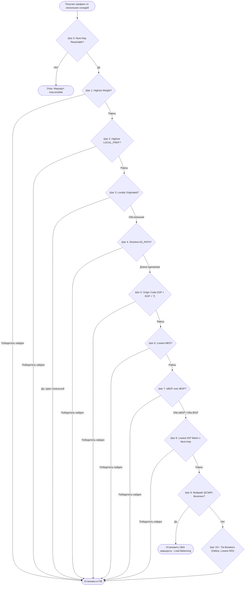
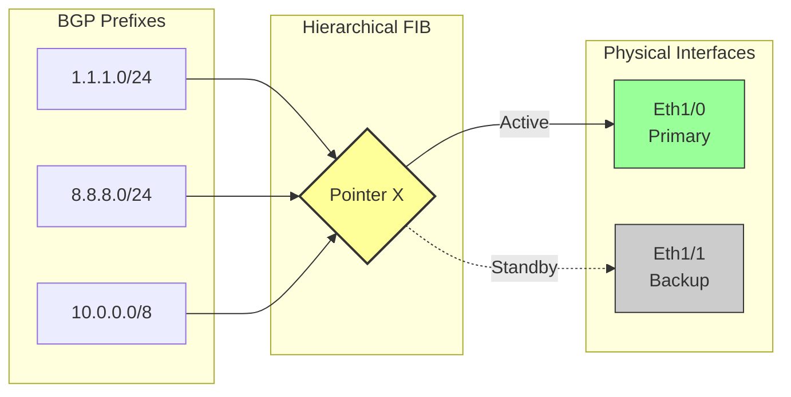
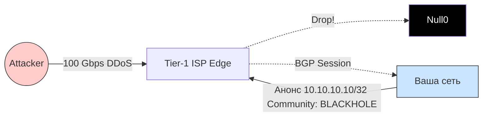

---
tags:
  - networking
  - bgp
  - routing
  - architecture
  - convergence
aliases:
  - BGP Deep Dive
  - Border Gateway Protocol
---
# L1.NET.04: BGP - Path Selection, Convergence, Route Flapping, Communities (Максимально детализированный конспект)

> [!abstract] О лекции
> Данный материал покрывает продвинутые аспекты работы протокола BGP (Border Gateway Protocol) — клея, на котором держится весь интернет. Для Staff/Expert инженера понимание "магии" выбора пути (Path Selection Algorithm), механик быстрой сходимости (BGP PIC), деградации сетей из-за флаппинга и принципов маркировки трафика (Communities) является критическим. Вы научитесь управлять трафиком (Traffic Engineering) без создания петель и аномалий.

---
## 1. Алгоритм выбора пути (Path Selection): Взгляд изнутри

Процесс выбора пути в BGP строго детерминирован и работает как конвейер. Роутер применяет фильтры последовательно. Если победитель выявлен на шаге $N$, следующие шаги **игнорируются**. Понимание этого процесса — базовый навык для траблшутинга асимметричной маршрутизации.



### Шаг 0. Валидность Next-Hop (Sanity Check)
Это "нулевой" шаг, который убивает маршрут до начала соревнований.
*   **Правило:** Маршрут считается валидным только если IP-адрес, указанный в атрибуте `NEXT_HOP`, достижим через таблицу маршрутизации (IGP, такую как OSPF или IS-IS, либо через Static route).
*   **Recursive Lookup (Рекурсия):** BGP часто указывает на IP, который не подключен напрямую (например, на Loopback-интерфейс удаленного PE-роутера провайдера). Роутер должен сделать второй проход и найти путь к этому Loopback'у через OSPF/IS-IS.
  > [!danger] Архитектурный риск: Зависимость от IGP
    > Если внутренний OSPF-маршрут к Loopback'у исчезает (например, из-за физического обрыва кабеля — flapping link), зависящий от него BGP-маршрут становится `inaccessible` мгновенно, даже если TCP-сессия BGP формально жива.
    > *Пример:* BGP получил маршрут с `NEXT_HOP = 10.0.0.1`. В таблице маршрутизации адрес `10.0.0.1` доступен через соседний роутер `192.168.1.2`. Если интерфейс к `192.168.1.2` падает, BGP маршрут немедленно инвалидируется.

### Шаг 1. Weight (Cisco Proprietary / Vendor specific)
*   **Логика:** Самое большое значение побеждает (по умолчанию 0, для локально сгенерированных 32768).
*   **Scope (Область действия):** **Сугубо локально** для конкретного роутера. Атрибут *не передается* никому, даже внутренним iBGP соседям.
*   **Expert Verdict:** Использовать `Weight` для управления политикой всей Автономной Системы (AS) — **грубая архитектурная ошибка**. Это создает "островки конфигурации". Если у вас 10 бордер-роутеров, вам придется настраивать Weight на каждом из них вручную, что убивает масштабируемость и автоматизацию.
    *   *Исключение:* Ситуация "выхода со двора". Если вам нужно, чтобы *конкретно этот* роутер слал определенный трафик в интерфейс `eth0` при прочих равных условиях, Weight — самый быстрый и локальный "грязный" способ.

### Шаг 2. Local Preference (LOCAL_PREF)
*   **Логика:** Самое большое значение побеждает (Default = 100).
*   **Scope:** **Вся iBGP область (ваша AS)**. Атрибут передается всем роутерам внутри вашей автономной системы, но отрезается при выходе наружу (в eBGP сессиях).
*   **Суть:** Это главный, архитектурно правильный рычаг управления **исходящим** трафиком вашей компании.
  > [!example] Пример применения
    > *   Provider A (дорогая оптика, Low Latency): ставим `LocalPref 200` на Ingress Route-Map.
    > *   Provider B (дешевый спутниковый канал, Backup): ставим `LocalPref 90`.
    > *   Результат: Весь трафик AS гарантированно уйдет через Provider A, независимо от длины AS_PATH. Роутер в другом городе получит маршрут по iBGP с `LOCAL_PREF=200` и поймет, что это лучший путь.

### Шаг 3. Locally Originated
*   **Логика:** Маршрут, порожденный *этим* конкретным роутером, лучше, чем полученный извне от соседа.
*   **Детали приоритета (от высшего к низшему):**
    1.  `default-originate` (самый высокий приоритет для дефолтного маршрута).
    2.  `network` command (явное объявление сети, если она есть в RIB).
    3.  `redistribute` (импорт из IGP/Static в BGP).
    4.  `aggregate-address` (суммарный маршрут).

### Шаг 4. AS_PATH Length
*   **Логика:** Чем короче путь (меньше транзитных Автономных Систем), тем лучше.
*   **Важные детали агрегации:**
    *   **AS_SET:** При агрегации нескольких маршрутов (aggregation) теряется точная последовательность AS. Чтобы не создать петлю, номера AS записываются в неупорядоченное множество (например, `{AS1, AS2}`). Критично знать, что весь этот набор считается за **ровно 1 хоп** длины при подсчете, независимо от количества AS внутри фигурных скобок.
    *   **AS_CONFED_SEQ:** Атрибуты внутренних конфедераций *не учитываются* при выборе пути за пределами конфедерации в глобальном интернете.
   > [!info] Prepend Myth (Миф об удлинении пути)
> Инженеры часто делают `AS-path prepend`, дублируя номер своей AS (например `65000 65000 65000`), чтобы "удлинить" путь и отвести входящий трафик от узкого резервного канала.
    > *Реальность:* Это работает, *только* если у вашего апстрим-провайдера нет жесткой политики `LocalPref`. Если апстрим выставил на ваши префиксы `LocalPref 200` (как для Customer routes), вы можете добавить хоть 50 препендов — его LocalPref сработает на Шаге 2, и он полностью проигнорирует длину вашего пути (Шаг 4).

### Шаг 5. Origin Code
*   **Логика:** `IGP (i)` < `EGP (e)` < `Incomplete (?)`. Меньше — лучше, значит статус IGP побеждает.
*   **Исторический контекст:** Раньше это различало маршруты из очень старого протокола EGP. Сейчас это означает:
    *   `i` — маршрут добавлен командой `network`.
    *   `?` — маршрут добавлен через перераспределение (`redistribute`).
*   **Use Case:** Часто используется инженерами как "последний легальный способ" (или "грязный хак") повлиять на выбор пути, если политика компании запрещает трогать MED или AS_PATH.

### Шаг 6. MED (Multi-Exit Discriminator)
*   **Логика:** Самое *низкое* значение побеждает (в отличие от LocalPref). Дефолт = 0.
*   **Scope:** Передается только соседней AS, но не идет дальше транзитом (Non-transitive атрибут).
*   **Суть (Cold Potato Routing):** Вы говорите соседу: "У нас два общих линка. Забери трафик у меня вот через этот конкретный линк, мне так удобнее и дешевле".
 > [!danger] Проблема детерминизма (The "BGP Wedgie" - RFC 4264)
    > По умолчанию (в реализациях Cisco и других) MED сравнивается **только** если маршруты пришли от одной и той же соседней AS (то есть First AS в AS_PATH совпадает).
    > Команда `bgp always-compare-med` заставляет роутер сравнивать MED от *разных* провайдеров. Это крайне опасно! Provider A может слать MED=0 (по дефолту), а Provider B шлет MED=1000. Включив эту команду, вы навсегда перекосите трафик на Provider A, даже если у Provider B канал в разы лучше и короче. Это ломает логику маршрутизации, создавая нестабильные состояния (BGP Wedgies).

### Шаг 7. eBGP over iBGP
*   **Логика:** Маршрут, полученный от внешнего соседа (eBGP, AD=20), строго лучше, чем от внутреннего (iBGP, AD=200).
*   **Смысл (Hot Potato Routing):** Принцип горячей картошки: нужно покинуть свою сеть как можно скорее. Если мы стоим на границе и знаем прямой выход наружу, надо использовать его, а не тащить чужой трафик через всю свою внутреннюю магистраль к другому бордер-роутеру.

### Шаг 8. IGP Metric to Next-Hop (Критический шаг)
*   **Логика:** Если все BGP атрибуты равны, выбираем тот `Next-Hop`, до которого **ближе бежать внутри нашей сети** (ориентируясь на метрику внутреннего протокола OSPF/IS-IS).
*   **Архитектурный инсайт:** Это точка сопряжения Overlay (BGP) и Underlay (IGP).
    *   *Сценарий аварии:* Вы меняете OSPF cost на линке между Франкфуртом и Берлином (просто чтобы разгрузить кабель). Внезапно весь гигантский транзитный трафик на Google начинает уходить не через Франкфурт, а через Мюнхен, потому что IGP-метрика до Мюнхенского бордера стала на 1 меньше. Это самая частая причина "необъяснимых" сдвигов внешнего трафика в ядре сети.

### Шаг 9. Multipath (ECMP) — Точка остановки
В современном Data Center (в топологиях IP Fabric / Spine-Leaf) на этом шаге процесс **должен остановиться**.
*   Если на роутере настроен `maximum-paths` (Multipath), и атрибуты (обычно до шага IGP metric включительно) полностью совпадают, роутер не выбирает одного победителя, а инсталлирует **все** равнозначные маршруты в FIB.
*   Трафик балансируется по ним, хешируя 5-tuple потоков (per-flow hashing, ECMP).

### Шаг 10+. Tie-Breakers (Арбитры последней надежды)
Если Multipath не включен, роутеру нужно выбрать строго *один* маршрут любой ценой, чтобы избежать неопределенности и петель.
1.  **Oldest Path (Самый старый путь):** Выбираем маршрут, который был получен раньше всех. (Смысл: Стабильность важнее Оптимальности. Мы не хотим переключать трафик туда-сюда при малейших изменениях).
    *   *Внимание:* Многие вендоры (Cisco) по умолчанию пропускают этот шаг (включая команду `bgp bestpath compare-routerid`), чтобы выбор был строго детерминированным. Иначе после перезагрузки роутера "лучший" путь может случайным образом измениться просто из-за тайминга прихода апдейтов.
2.  **Lowest Router ID:** Побеждает сосед с самым маленьким BGP Router ID (обычно это IP-адрес Loopback). Это чистая случайность с точки зрения сетевой архитектуры, но она работает как надежный тай-брейкер.
3.  **Lowest Neighbor IP:** Если даже Router ID одинаков (например, у вас два параллельных линка к одному и тому же удаленному роутеру), побеждает тот путь, который пришел через интерфейс с наименьшим IP-адресом.

---
### Итоговый пример для закрепления (Hot Potato)
Представьте, что вы — провайдер (ISP). У вас есть линки в Internet Exchange (IX) в Москве (MSK) и Санкт-Петербурге (SPB).
К вам прилетает маршрут `8.8.8.8/24` от Google через оба города. Как выберет путь ваш роутер, стоящий у клиента в Твери?
1.  **Weight:** Игнорируем (по дефолту 0 на обоих).
2.  **LocalPref:** Одинаковый (дефолт 100).
3.  **AS_PATH:** Одинаковый (оба через Google AS15169).
4.  **Origin:** IGP (одинаково).
5.  **MED:** Google не шлет MED (или шлет 0 на оба).
6.  **eBGP/iBGP:** Оба маршрута получены по eBGP (одинаково).
7.  **IGP Metric (Шаг 8):**
    *   IGP метрика от роутера в Твери до бордера в MSK = 10.
    *   IGP метрика от Твери до бордера в SPB = 15.
    *   **Решение:** Роутер в Твери выберет путь через **MSK**.
Это классический пример **Hot Potato Routing**: "сбрось пакет в ближайший выход из нашей сети, не неси его далеко за свой счет".

---
## 2. Convergence (Сходимость) и BGP PIC: Битва за наносекунды

Для инженера уровня Staff/Expert понимание сходимости четко делится на две плоскости: **Control Plane** (процесс BGP, работающий на CPU) и **Data Plane** (аппаратная пересылка пакетов на ASIC-чипе).
В таблице Full View (глобальный интернет) сегодня около 1 млн префиксов. Стандартная сходимость Control Plane при падении линка — это катастрофа. Если падает оптический кабель, CPU должен перебрать 1 млн записей в памяти, прогнать алгоритм выбора пути (Path Selection) для каждой и по одной загрузить их в чип (FIB). Это занимает долгие минуты простоя.
**Решение:** Перенести логику переключения целиком в аппаратный Data Plane.

### 2.1. BGP PIC (Prefix Independent Convergence)
**Определение:** Технология (архитектура памяти), позволяющая времени восстановления связности **не зависеть** от количества префиксов. С PIC переключение 10 маршрутов и 1,000,000 маршрутов занимает одно и то же время (в идеале < 50 миллисекунд).

#### Механизм работы: Иерархический FIB (Hierarchical FIB / Indirection)
Без PIC таблица FIB является "плоской".
*   *Плоский FIB (Legacy):*
    `Prefix A (8.8.8.0/24) -> Interface Eth1/0 (NextHop 1.1.1.1)`
    `Prefix B (1.1.1.0/24) -> Interface Eth1/0 (NextHop 1.1.1.1)`
    ... (и так 1 миллион раз).
    При падении кабеля `Eth1/0`, процессор вынужден перезаписать 1 миллион строк в памяти чипа.

*   *Иерархический FIB (С использованием PIC):*
    Вводится промежуточный слой абстракции — указатели (Pointers) или общие индексы.
    1.  **Ingress Leaf:** Все миллион префиксов указывают не на порт, а на программный **Pointer X**.
        `Prefix A -> Pointer X`
        `Prefix B -> Pointer X`
    2.  **Egress Object (Pointer X):** Сам поинтер указывает на физический путь и содержит резерв.
        `Pointer X -> { Primary: NextHop 1.1.1.1 (Eth1/0), Backup: NextHop 2.2.2.2 (Eth1/1) }`



**Сценарий аппаратного отказа:**
Когда чип ASIC (или оптика) обнаруживает физическое падение `Primary NextHop` (Loss of Signal или через протокол BFD):
1.  Он **вообще не трогает** миллион строк с префиксами.
2.  Он меняет **ровно одну запись** в памяти: переключает статус `Pointer X` на Backup (`Eth1/1`).
3.  Сложность операции: $O(1)$ вместо $O(N)$. Трафик мгновенно уходит в резервный порт.

### 2.2. PIC Core vs. PIC Edge
Архитектор/эксперт должен строго различать, где именно произошел отказ инфраструктуры.

1.  **BGP PIC Core:**
    *   **Сценарий:** Отказ происходит глубоко внутри вашей транзитной сети (в IGP домене, упал линк между P-роутерами MPLS Core). При этом сам eBGP сосед жив, но внутренний IGP путь до его `Next-Hop` изменился.
    *   **Решение:** Процессу BGP вообще не нужно пересчитывать маршруты! Поскольку BGP полагается на рекурсию (`Next-Hop` резолвится через IGP), как только протокол OSPF/IS-IS сходится (что происходит очень быстро), иерархический FIB автоматически начинает указывать на новый исходящий интерфейс. BGP отдыхает.

2.  **BGP PIC Edge:**
    *   **Сценарий:** Падает сам `Next-Hop` (например, оборвался внешний eBGP линк до провайдера или CE-роутера клиента).
    *   **Условие:** Чтобы аппаратное переключение $O(1)$ сработало, роутер должен *заранее* знать о существовании резервного пути и заранее установить его в FIB как неактивный (Backup Path).

### 2.3. Необходимые условия: Откуда берется Backup Path?
Технология PIC не сработает (некуда переключать Pointer), если в таблице BGP роутера есть только один путь. Роутеру нужно установить в FIB "второй лучший" (Second Best) путь. Но откуда его взять?

*   **Проблема протокола:** По умолчанию (согласно RFC), BGP выбирает только один Best Path и только его анонсирует соседям и отправляет в RIB/FIB.
*   **Решение 1 (Add-Path / Best External):** В топологиях Data Center (с Route Reflector (RR)) или iBGP Full Mesh, роутер может банально не знать о резервном пути, потому что сосед-RR ему его не прислал (ведь RR шлет только Best).
    *   Необходимо включить фичу **BGP Add-Path** (например, `bgp additional-paths install` в Cisco), чтобы разрешить роутерам обмениваться несколькими путями и устанавливать backup-пути в FIB аппаратно. Без Add-Path PIC Edge не имеет смысла.
*   **Решение 2 (Shadow RIB):** Роутер прекалькулирует второй лучший маршрут (Second Best) из тех, что у него есть, и программирует его в "теневой" слот ASIC заранее.

**Пример для наглядности (Самолет):**
Представьте, что вы летите в самолете (пакет) по посадочному талону (маршрут FIB).
*   *Без PIC:* Аэропорт назначения внезапно закрыт. Самолет садится, вам нужно вернуться на стойку регистрации, и уставший сотрудник вручную выписывает новый бумажный билет каждому из 200 пассажиров. Это долго.
*   *С PIC:* В вашем посадочном билете сразу (заранее) напечатано: "Летим на Gate A. Если Gate A закрыт — идите на Gate B". Пассажиры (пакеты) сами, без помощи персонала (CPU), поворачивают на Gate B.

### 2.4. Fast Peering Failure Detection (Детекция отказа)
PIC — это механизм *действия* (action). Но прежде чем переключить Pointer, нужно *обнаружить* (detection) аварию.

1.  **BFD (Bidirectional Forwarding Detection):**
    *   Стандартные BGP таймеры (Keepalive 60s, Hold 180s) абсолютно непригодны для современного бизнеса.
    *   Протокол BFD шлет легковесные "хеллоу" пакеты каждые 10-50 мс на уровне Data Plane (часто обрабатывается прямо на чипе линейной карты, не загружая CPU).
    *   При пропуске 3 пакетов BFD сессия мгновенно рвется, сигнал летит в BGP процесс, триггеря PIC.
2.  **BGP Next-Hop Tracking (NHT):**
    *   **Как это работает:** Процесс BGP напрямую подписывается на события изменения в таблице ядра (Routing Information Base, RIB).
    *   **Event-Driven (Событийная модель):** Как только IGP (OSPF) удаляет маршрут к 1.1.1.1, ядро пушит событие, и BGP *мгновенно* помечает все свои маршруты с `Next-Hop 1.1.1.1` как невалидные. Ему больше не нужно ждать 60 секунд, пока таймер "BGP Scanner" пройдется по всей гигантской таблице.
    *   **Expert Tuning (Тонкая настройка):** Очень важно настроить задержку `bgp nexthop trigger delay`. Если ваш IGP (OSPF) "штормит" и пересчитывает SPF каждые 10 миллисекунд, вы не хотите, чтобы тяжелый BGP пересчитывал свой миллион маршрутов каждые 10 мс (CPU сгорит). Разумная задержка (wait timer) — 500-1000 мс, чтобы OSPF успел успокоиться.

### 2.5. Update Groups и проблема "Slow Peer"
Специфичная архитектурная проблема: вам нужно отправить BGP Update с 1 млн маршрутов сразу 50 соседям (например, вы — Route Reflector).
*   **Оптимизация (Update Groups):** Роутер группирует соседей с *абсолютно идентичной* исходящей политикой (Outbound Policy) в единую **Update Group**. Сообщение (пакет BGP) формируется в памяти один раз и просто копируется в выходные буферы 50 интерфейсов.
*   **Проблема "Slow Peer" (Медленный сосед):** Что если в этой быстрой группе из 50 роутеров затесался один старый коммутатор с медленным CPU или забитым 10-мегабитным линком? Его TCP-буфер переполняется.
*   **Последствия:** В старых реализациях ОС этот медленный сосед тормозил *всю группу* (классический Head-of-Line Blocking). Пока он не переварит апдейт, никто другой его не получит.
*   **Современное решение (Dynamic Update Peer Groups):** Механизм обнаруживает "Медленного" соседа и динамически выкидывает его из оптимизированной группы в отдельную "медленную" очередь (или временно отключает). Это гарантирует, что один слабый линк не замедлит конвергенцию всего Дата-Центра.

### Резюме для архитектора
Сходимость BGP — это не магия, а сумма трех жестких метрик:
1.  **Детекция (Обнаружение):** BFD + Interface Event (< 50 мс).
2.  **Распространение (Propagation):** Оптимальная iBGP топология (Route Reflectors), Update generation (< сотен мс).
3.  **Применение (FIB Installation):** BGP PIC Edge/Core (< 50 мс вне зависимости от размера BGP таблицы).

> **Вердикт:** Если в вашем дизайне нет PIC и BFD, вы физически не можете гарантировать SLA для Real-Time трафика (голос, видео, финтех) при наличии Full View, даже если у вас куплены самые дорогие и быстрые роутеры в мире.

---
## 3. Route Flapping и Route Dampening: Глубокий анализ

Для Staff Architect маршрутная нестабильность (Instability / Flapping) — это враг доступности №1. Когда маршрут постоянно появляется и исчезает (например, "дребезжит" плохой оптический коннектор), это вызывает лавину BGP UPDATE и WITHDRAW сообщений.
Поскольку BGP — это протокол класса Distance Vector (пусть и Path Vector), любое изменение топологии в одной точке может вызвать рекурсивный пересчет таблиц маршрутизации на всех магистральных маршрутизаторах в глобальном интернете (Global Routing Table convergence). Это съедает ресурсы процессоров всей планеты.

### 3.1. Механика BGP Route Dampening (RFC 2439)

Route Dampening — это встроенный механизм подавления нестабильных маршрутов на входе (Ingress Policy). Он работает как "накопитель штрафных баллов" с математикой экспоненциального затухания.

**Ключевые параметры (State Machine):**

1.  **Penalty (Штраф):** Фиксированное число очков, начисляемое маршруту за каждое изменение его состояния.
    *   *Re-advertisement (Поднялся/Up):* Обычно 0.
    *   *Withdrawal (Упал/Down):* 1000 очков (стандарт де-факто Cisco).
    *   *Attribute Change (Смена метрик):* 500 очков.
2.  **Half-Life ($H$):** Время (в минутах), за которое накопленный штраф уменьшится ровно в 2 раза, при условии, что маршрут остается абсолютно стабильным.
3.  **Suppress Limit ($L_{suppress}$):** Порог бана. При превышении этого порога маршрут помечается как `dampened` (подавлен). Он немедленно удаляется из таблицы пересылки (FIB) и перестает анонсироваться BGP-пирам, даже если физически линк прямо сейчас светится "UP".
4.  **Reuse Limit ($L_{reuse}$):** Порог амнистии. При снижении штрафа ниже этой отметки маршрут снова считается "чистым" и возвращается в работу.
5.  **Max Suppress Time ($T_{max}$):** Максимальное время ("тюремный срок"), на которое маршрут может быть заблокирован, независимо от того, насколько гигантский штраф он успел накопить (обычно ограничено 60 минутами).

**Математика распада (Decay Function):**
Текущий штраф $P(t)$ через время $t$ после последнего флапа рассчитывается по формуле радиоактивного распада:
$$ P(t) = P_{initial} \cdot 2^{-\frac{t}{H}} $$

> **Пример для наглядности (Как это убивает сеть):**
> *   **Конфигурация:** Penalty=1000, Half-Life=15 мин, Suppress=2000, Reuse=750.
> *   **Хронология катастрофы:**
>     1.  `T=0`: Линк падает (Withdraw). Начислен штраф = 1000. (Маршрут физически недоступен, но история штрафа сохранена в памяти).
>     2.  `T=1 мин`: Линк поднялся (Update). Штраф = 1000. (1000 меньше порога Suppress 2000, маршрут устанавливается, трафик идет).
>     3.  `T=2 мин`: Линк снова упал. Штраф успел немного "остыть": $1000 \cdot 2^{-1/15} \approx 954$. Плюс новый штраф за падение 1000. Итого $\approx 1954$.
>     4.  `T=3 мин`: Линк снова поднялся. Штраф не изменился (1954). Трафик идет.
>     5.  `T=4 мин`: Линк снова упал. Штраф "остыл": $\approx 1954 \cdot 2^{-1/15} \approx 1865$ + 1000 = 2865.
>     6.  **Результат:** 2865 > 2000. Маршрут уходит в жесткий бан (`dampened`).
>     7.  **Вопрос:** Когда он вернется? Нам нужно, чтобы штраф упал с 2865 до Reuse порога 750. Математика говорит, что это займет почти 2 периода Half-Life, то есть около **30 минут**.
>     **Бизнес-итог:** Из-за трех кратковременных "миганий" кабеля в течение 5 минут (которые чинятся заменой патч-корда), ваш сервис жестко заблокирован роутером на долгие полчаса.

### 3.2. Архитектурная проблема: Path Exploration (Почему Dampening — Зло)

Почему комитеты RIPE (документ **RIPE-580**) и мировые Network Operator Groups (NOGs) настоятельно рекомендуют **отключать** Dampening в ядре глобального интернета?

Проблема в том, что алгоритм Dampening слишком примитивен: он не отличает реальный "сломанный кабель на вашей стороне" от абсолютно нормального и здорового процесса сходимости сети, который называется **Path Exploration**.

**Сценарий ложного срабатывания (Катастрофа ложного бана):**
1.  У вас есть стабильный маршрут к префиксу `P` через Primary ISP (путь `A-B-C`).
2.  Где-то далеко (в другой стране) падает линк `B-C`.
3.  Протокол BGP во всем мире начинает искать альтернативу. Ваш апстрим-роутер посылает вам `Withdraw` для старого пути.
4.  Ваш роутер получает этот Withdraw. (Начисляет +1000 штрафа префиксу `P`).
5.  Через 1 секунду глобальный BGP находит резерв, и к вам приходит анонс нового, более длинного пути через ISP2 (путь `A-D-E-F-C`). (+0 штрафа, это новый легитимный анонс).
6.  Но этот резервный путь оказывается перегруженным, и через 5 секунд глобальная BGP таблица находит оптимальный путь и присылает вам Update с изменением атрибутов (например, сменился MED или Community на более удачный). (Ваш роутер начисляет +500 штрафа).
7.  В процессе глобальной сходимости (Global Convergence) к вашему роутеру могут прилететь 3-4 таких варианта маршрута за короткое время (10-20 секунд), прежде чем сеть успокоится и найдет Best Path.
8.  **Итог:** Ваш локальный роутер видит 4 апдейта, считает, что маршрут `P` "флапает", накапливает штраф > 2000 и "банит" префикс.
9.  **Результат для бизнеса:** Глобальная сеть починилась и нашла обходной путь за 10 секунд. Но ВАШ роутер заблокировал вам доступ к ресурсу на 45 минут из-за ложного срабатывания Dampening.

### 3.3. Современная стратегия (Golden Config / RIPE-580)

Как Expert Architect, вы должны применять Dampening крайне **избирательно**.

1.  **BGP Core / Transit (Ядро сети и магистрали):** **СТРОГО DISABLE.** Никогда не включайте Dampening на стыках с Tier-1 провайдерами, на Internet Exchanges (IX) или внутри своего ядра. Вы физически не сможете отличить локальный флап от глобальной конвергенции интернета (Path Exploration).
2.  **BGP Edge / Customers (Стыки с клиентами):** **ENABLE (Conservative).** Если вы провайдер и подключаете конечного клиента (предприятие), его "последняя миля" может реально физически "дребезжать" из-за плохого медиаконвертера. Здесь Dampening критически важен: он защищает ресурсы CPU вашего ядра от клиентского мусора.

**Рекомендованные параметры (RIPE-580 "Leaf" policy):**
Забудьте жесткие дефолты Cisco (H=15m, Limit=2000). Используйте современные, "мягкие" настройки, которые прощают Path Exploration:
*   **Penalty:** 1000
*   **Half-Life:** 15 min
*   **Suppress Limit:** **6000** (Мы разрешаем ~6 флапов подряд, а не 2-3, чтобы пропустить фазу глобального поиска пути).
*   **Reuse Limit:** 750
*   **Max Suppress Time:** **30 min** (Нельзя банить маршрут клиента навечно).

### 3.4. Альтернативы Dampening (The Architect's Toolkit)

Если Dampening опасен, какие еще инструменты есть у архитектора для защиты от нестабильности?

1.  **IP Event Dampening (Interface Soaking):**
    Защита на самом нижнем, физическом уровне (L1/L2), настраивается прямо на физическом интерфейсе (`eth0`).
    *   *Логика:* Если интерфейс упал (Link Down), сообщить об этом демону BGP мгновенно (Fast Failover). Но если интерфейс поднялся (Link Up), **подождать** (Soak timer) X секунд (например, 30с) перед тем, как сообщать ядру ОС и BGP, что он UP.
    *   *Почему это круто:* Это предотвращает саму возможность установки TCP сессии BGP на "мигающем" линке. Физика гасит флап до того, как о нем узнает BGP, не наказывая логические маршруты.

2.  **Graceful Restart (RFC 4724):**
    Технология, разделяющая Control Plane (BGP daemon, CPU) и Data Plane (FIB, ASIC).
    *   *Суть:* Если BGP процесс внезапно крашится и перезагружается (или кратковременно флапает TCP-сессия), роутер не удаляет маршруты. Он сохраняет их как "Stale" (устаревшие) и продолжает пересылать пакеты аппаратно, ожидая, что BGP сосед скоро вернется. Это маскирует кратковременные сбои Control Plane от реального трафика пользователей (0 downtime).

3.  **Route Refresh (RFC 2918) vs Soft Reconfiguration:**
    *   *Проблема старых сетей:* Чтобы применить новые фильтры `route-map` без разрыва BGP-сессии, админы включали `Soft Reconfiguration Inbound`. Это заставляло роутер хранить в памяти нетронутую копию *абсолютно всех* маршрутов от соседа. Это удваивало потребление RAM (катастрофа для Full View).
    *   *Современное решение:* Использовать возможность **Route Refresh**. Вместо хранения мусора в RAM, роутер просто шлет соседу специальное сообщение: "Пришли мне всю свою таблицу заново, я хочу применить новые фильтры". Это радикально снижает Memory Pressure и повышает общую стабильность системы (защита от OOM).

---
## 4. Communities: Метаданные и Управление Политиками

BGP Community — это опциональный, транзитивный атрибут (передается от соседа к соседу), который позволяет прикреплять к маршрутам любые "теги" или "маркеры". Это позволяет группировать тысячи маршрутов по логическому смыслу, а не по маскам IP-адресов.
Без грамотно спроектированной системы Communities, управление сетью Tier-1/Tier-2 уровня превращается в ад из десятков тысяч строк неуправляемых IP Prefix-листов.

### 4.1. Эволюция и Типизация (RFC Standards)

Сетевой эксперт обязан различать три поколения этого атрибута, так как легаси-оборудование на пути может отбрасывать новые форматы или искажать их.

#### A. Standard Communities (RFC 1997) — "Классика"
*   **Формат:** 32 бита. Традиционно записывается в консоли как `ASN:Value` (16 бит : 16 бит).
*   **Лимит архитектора (Кризис):** Поскольку реальные номера ASN в интернете давно стали 32-битными (например, `200123`), они физически **не влезают** в первую (16-битную) часть классического комьюнити (там максимум 65535).
*   **Костыль:** Операторам с 32-битными ASN приходится использовать чужие или приватные Private ASN в первой части для обозначения своих политик, что создает глобальный риск коллизий (совпадения тегов у разных провайдеров).
*   **Well-Known значения (Hardcoded RFC теги, которые знают все роутеры):**
    *   `NO_EXPORT (0xFFFFFF01)`: Команда роутеру "Ни при каких условиях не анонсируй этот маршрут за пределы нашей локальной AS (наружу в eBGP)". Критично для удержания служебного трафика внутри компании.
    *   `NO_ADVERTISE (0xFFFFFF02)`: Высшая степень изоляции. "Не анонсируй вообще никому, даже своим iBGP соседям". Маршрут умирает прямо на этом роутере.

#### B. Extended Communities (RFC 4360) — "Спецназ"
*   **Формат:** 64 бита (Type + Value).
*   **Назначение:** Изначально они были созданы не для маршрутизации публичного интернета, а для сложных корпоративных сетей **MPLS VPN** (L3VPN).
*   **Ключевые подтипы:**
    *   `Route Target (RT)`: Управляет тем, в какую именно виртуальную таблицу (VRF) клиента нужно импортировать данный маршрут.
    *   `Route Origin (SOO - Site of Origin)`: Сложный механизм защиты от петель в топологиях, где клиент подключен к провайдеру несколькими линками (Dual-Homed).
    *   `Link Bandwidth`: Используется для продвинутой неравномерной балансировки трафика (UCMP) в сетях MPLS TE.

#### C. Large Communities (RFC 8092) — "Золотой стандарт современности"
Это то, что каждый архитектор обязан внедрять в проектах **сегодня**.
*   **Формат:** 96 бит (12 байт). Состоит из трех полноразмерных 32-битных чисел:
    `Global Administrator : Local Data Part 1 : Local Data Part 2`
    *(Обычно читается как: `MyASN : Function : Parameter`)*
*   **Преимущество:** Полная и нативная поддержка 32-битных ASN. Коллизии невозможны: вы являетесь абсолютным владельцем namespace (пространства имен) в первом поле (вашем ASN).
*   **Пример:** `64496:1:10` может быть задокументировано как: "Внутри AS 64496 (Это мы), применить Функцию 1 (Управление LocalPref), задать Значение 10 (Низкий приоритет)".

---
## 4.2. Таксономия Communities: Architectural Design Pattern

Не вешайте комьюнити хаотично и бессистемно. Архитектор должен разработать, задокументировать (в публичном Routing Registry, например RADb) и поддерживать строгую систему классификации. Обычно выделяют три глобальных класса политик:

### Класс 1: Информационные (Informational / Tracking)
Отвечают на вопросы: "Где вошел этот маршрут в нашу сеть?", "Кто нам его прислал?". Навешиваются исключительно **на входе** (Ingress Policy).
*   **Geo-tagging (География):** Маркировка маршрутов по континенту, стране или конкретному дата-центру входа (EU, US-East, APAC). Позволяет на выходе (Egress) писать простые фильтры: "Не анонсировать US-маршруты нашим пирам в Азии".
*   **Peer-type (Тип соседа):** Классификация источника: Клиент (платит нам), Пир (бесплатный обмен), Транзит (мы платим ему).
    *   *Пример:* `64496:1000:1` (Это Клиент), `64496:1000:2` (Это Транзит).
    *   *Железная логика (Фильтр Долины / Valley-Free routing):* "Никогда не анонсировать маршруты с тегом 'Транзит' в канал другого 'Транзита' или 'Пира'". Это защищает вас от Free-riding — ситуации, когда вы за свои деньги транзитируете чужой трафик.

### Класс 2: Управляющие (Action / Control)
Отвечают на вопрос: "Что сеть должна сделать с этим маршрутом?". Могут навешиваться вашим клиентом (чтобы управлять вашей сетью) или вашим же инженером.
*   **Traffic Engineering (TE):** Команды для управления `Local Preference` (Выбор лучшего пути внутри сети) и `AS-Path Prepend` (Манипуляция входящим трафиком).
*   **Scope Control:** Ограничение радиуса распространения маршрута (например: анонсировать только внутри страны, не выпускать на другие континенты).

### Класс 3: Сигнальные (Blackholing / Security & Ops)
Специфические команды операционного воздействия, защиты инфраструктуры от DDoS и вывода оборудования в maintenance.

---
## 4.3. Пример реализации Traffic Engineering (BGP Action Communities)

Представьте, вы — крупный провайдер (ISP). У вас есть Клиент, подключенный к двум вашим дата-центрам (PoP - Points of Presence). Клиент хочет динамически управлять тем, какой линк основной, а какой резервный, **не открывая тикеты и не звоня в вашу техподдержку**. Вы решаете это через Communities.

**Ваша Публичная Политика (Route Map on Ingress):**
Вы публикуете в интернете документацию для своих клиентов:
*   Пришлите тег `64496:90:x` — мы установим `Local Preference` для вашего маршрута в значение `x`.
*   Пришлите тег `64496:100:x` — мы сделаем `AS-Path Prepend` (добавим номер AS) `x` раз перед анонсом дальше.

**Сценарий клиента (Failover):**
1.  Клиент шлет вам свой маршрут `1.2.3.0/24` на линк А во Франкфурте.
2.  Клиент хочет, чтобы этот линк А был **резервным** (Backup), а основной трафик шел через линк Б.
3.  Клиент настраивает свой роутер: добавить к анонсу на линк А тег `64496:90:80` (Large Community).
4.  Ваш бордер-роутер на входе принимает анонс и прогоняет через `route-map` (match community):
    ```text
    if community matches "64496:90:(.*)" then
       set local-preference <значение из 3-й группы, то есть 80>
    ```
5.  **Итог автоматизации:** Внутри всей вашей AS маршрут через линк А получает LocalPref = 80 (что ниже дефолтного 100). Глобальный трафик автоматически уходит на линк Б. Клиент счастлив, техподдержка спит.

> [!warning] Важный нюанс конфигурации (Additive)
> При настройке политик изменения комьюнити в `route-map` всегда используйте ключевое слово **additive** (если не хотите уничтожить старые теги).
> *   *Грубая ошибка:* `set community 64496:1:1`. Это **сотрет** все существующие Информационные и Geo-теги, которые маршрут собрал по пути.
> *   *Правильно:* `set community 64496:1:1 additive`. Это просто допишет ваш новый тег в конец длинного списка существующих тегов.

---

## 4.4. RTBH: Remotely Triggered Black Hole (Архитектура защиты)

Это стандарт де-факто для защиты сетей от объемных (Volumetric) DDoS атак.

**Бизнес-проблема:** Ваш магистральный канал в 100 Gbps забит мусорным UDP-флудом на IP-адрес одного вашего клиента (`10.10.10.10`). Весь остальной сервис провайдера деградирует (пакеты дропаются). Пытаться фильтровать это на локальном Firewall бесполезно — канал *до* файрвола уже физически забит.
**Задача:** Убить трафик, предназначенный для `10.10.10.10`, **на самой дальней границе сети** (на стыках с Tier-1 апстримами), чтобы мусор даже не заходил в ваши каналы.



**Механизм решения (RFC 7999):**
1.  **Trigger Router (Командный центр):** Вы (или автоматика защиты от DDoS) на специальном изолированном роутере управления создаете статический маршрут `10.10.10.10/32` с направлением в `Null0` (корзину).
2.  **BGP Activation:** Этот маршрут-убийца редистрибьютится в протокол BGP.
3.  **Signaling (Магия Комьюнити):** К маршруту обязательно цепляется **Well-Known Community BLACKHOLE** (числовое значение `65535:666` или просто алиас `BLACKHOLE` в современных CLI).
4.  **Propagation:** Маршрут мгновенно разлетается по iBGP всем вашим пограничным Edge-роутерам. Более того, если у вас есть договоренность (BGP peering policy), он улетает внешним апстрим-провайдерам.
5.  **Action (Казнь пакетов):**
    *   Пограничный роутер апстрима (или ваш Edge) получает маршрут, видит тег `65535:666`.
    *   Срабатывает триггерная политика: `if community is 666 -> set ip next-hop Null0`.
    *   В аппаратный FIB загружается правило дропа. Гигабиты DDoS-трафика отбрасываются максимально близко к источнику атаки. Магистраль спасена. (Жертва `10.10.10.10`, увы, полностью отрезана от интернета, но остальные 99% клиентов спасены).

---
## 4.5. Graceful Shutdown (GSHUT - RFC 8326)

Частый операционный кейс (Maintenance): вам нужно обновить прошивку или перезагрузить магистральный роутер.
Если вы просто сделаете `shutdown` на интерфейсе, BGP сессия упадет мгновенно, но удаленные роутеры в интернете узнают об этом только когда до них долетит пакет `Withdraw` или истечет таймер. В эти драгоценные секунды трафик клиентов будет лететь в ваш отключенный порт (в "черную дыру"). Это недопустимо для SLA 99.99%.

**Элегантное решение с GSHUT:**
1.  За несколько минут перед началом технических работ вы применяете политику, которая вешает на все исходящие BGP-анонсы этого роутера специальное комьюнити **`GRACEFUL_SHUTDOWN`** (`65535:0`).
2.  Соседние роутеры, поддерживающие этот RFC, парсят комьюнити и автоматически, плавно снижают `Local Preference` для всех путей через вас до 0.
3.  Трафик в интернете плавно и без разрывов перетекает на резервные линки.
4.  Вы мониторите счетчики интерфейса. Только когда объем трафика падает до нуля (Traffic is drained), вы спокойно гасите физический линк и делаете перезагрузку. Даунтайм для пользователей равен нулю.

---
### Резюме изменений для эксперта (Mental Shift):
*   Забудьте про жестко закодированные абстрактные типы. Выделяйте **Large Communities (RFC 8092)** как единственный масштабируемый и правильный выбор для построения новой архитектуры в 2025 году.
*   Строго внедряйте классификацию на **Информационные** (Где и От кого) и **Управляющие** (Что делать) теги. Не смешивайте их в логике роутера.
*   Детально понимайте механизм **BGP сигналинга**: клиент или система мониторинга может управлять сетью провайдера (TE, Blackholing) без участия человека.
*   Уточненные стандарты **RFC 7999 (RTBH)** и **RFC 8326 (GSHUT)** — это обязательные операционные паттерны (Ops Patterns), отсутствие которых на собеседовании уровня Staff является красным флагом.

---
## 5. Чек-лист уровня Expert (Для самопроверки)

1.  **BGP Wedgies (RFC 4264):**
    Понимаете ли вы, как создать состояние (Wedgie), когда трафик физически идет одним путем, а возвращается другим (Асимметрия), и протокол BGP *не может сам* прийти в стабильное состояние из-за конфликтующих, скрытых политик двух провайдеров (например, один провайдер хочет Load Balance, а другой жестко настроил Primary/Backup через LocalPref)? Это состояние требует "сброса" сессии (ручного вмешательства инженера).
2.  **iBGP Full Mesh vs Route Reflectors vs eBGP Clos:**
    Почему в современных дата-центрах (архитектура Clos Network / Spine-Leaf) мы используем исключительно **eBGP** (RFC 7938) между коммутаторами Spine и Leaf, полностью отказываясь от iBGP?
    *   *Ответ:* В iBGP существует фундаментальное правило защиты от петель (Split-Horizon): маршрут, полученный по iBGP, нельзя передать другому iBGP соседу. Это заставляет инженеров строить Full Mesh (что не масштабируется) или настраивать сложные Route Reflectors. Дизайн на базе eBGP избавлен от этого ограничения: петли легко обнаруживаются и отбрасываются благодаря аппаратному атрибуту AS_PATH, что позволяет элементарно балансировать трафик (ECMP) и автоматизировать развертывание.
3.  **Soft Reconfiguration Inbound vs Route Refresh:**
    Храните ли вы копию всех полученных апдейтов в памяти роутера (`soft-reconfiguration inbound`) для изменения фильтров без разрыва сессии?
    *   *Вердикт:* В 2025 году это моветон, убивающий RAM (удвоение памяти на таблицу Full View). Современный архитектор использует исключительно **Route Refresh (RFC 2918)** (запрос соседу динамически переслать все маршруты заново через живую сессию).
4.  **BGP Security (RPKI/ROA):**
    Валидируете ли вы Origin AS (владельца префикса)? Эксперт обязан внедрять RPKI (Route Origin Validation), чтобы роутер сверялся с криптографической базой данных и автоматически отбрасывал маршруты со статусом `Invalid`. Это единственная рабочая защита от глобальных утечек маршрутов (BGP Hijacking / Route Leaks).

### Заключение
Для Staff Architect протокол BGP — это не просто маршрутизация, это механизм обеспечения глобального SLA и бизнес-логики.
*   Используйте **BGP PIC** совместно с **BFD** для гарантии субсекундной аппаратной сходимости.
*   Внедряйте строгую иерархию **Large Communities** для делегирования Traffic Engineering и автоматизации.
*   Осторожнее с дефолтным **Route Dampening** (отключайте в ядре, смягчайте на границе).
*   Глубоко понимайте физику **Multipath (ECMP)** в современных фабриках данных, где BGP управляет миллионами потоков.