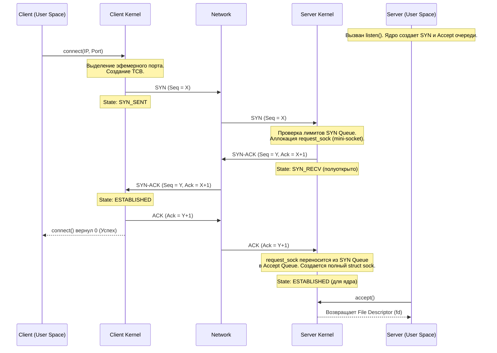
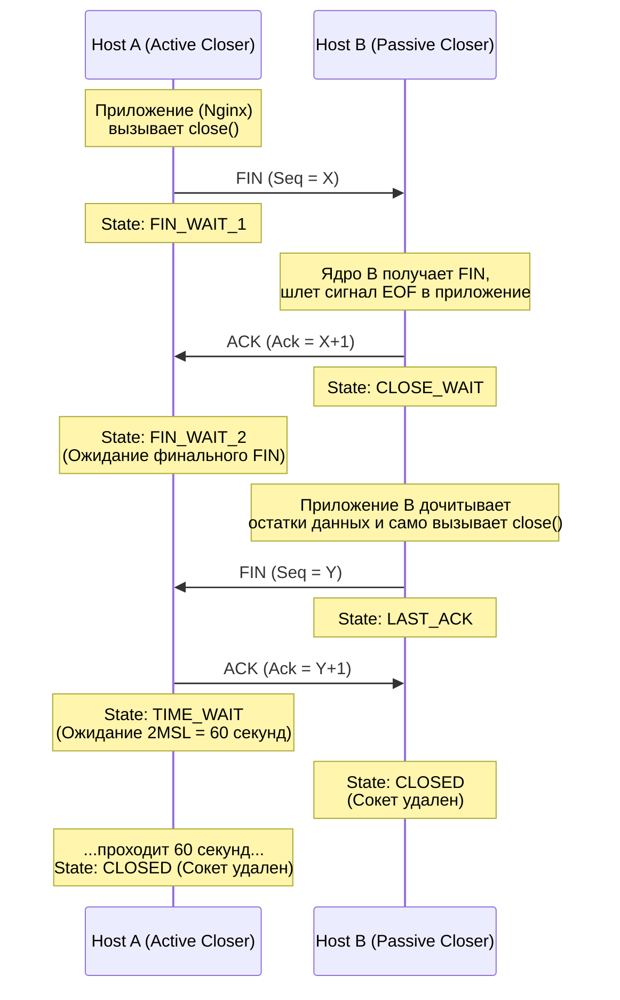
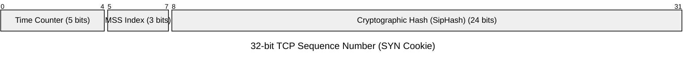

---
tags:
  - networking
  - tcp
  - kernel
  - sysctl
  - architecture
aliases:
  - TCP State Machine
  - TIME_WAIT
  - 3-Way Handshake
---
# L1.NET.06: TCP 3-Way Handshake, Connection States, TIME_WAIT

> [!abstract] О лекции
> Для Staff/Senior инженера TCP — это не просто абстрактный транспортный протокол. Это сложный автомат состояний (State Machine), который тесно и жестко интегрирован с ядром операционной системы (Linux). В этом материале мы глубоко разбираем механику выделения памяти под сокеты, физику `TIME_WAIT` и защиту от SYN-флуда. Понимание этих процессов позволяет с первого взгляда отличать баги в коде приложения (например, `CLOSE_WAIT`) от нормального поведения сети и грамотно настраивать `sysctl` для High-Load систем без ущерба для безопасности данных.

---
## 1. TCP 3-Way Handshake и Механика Очередей Ядра

Процесс установки соединения — это не просто обмен сетевыми флагами (SYN/ACK). В реальности это сложный процесс создания, валидации и перемещения структур данных (Socket Control Blocks) между различными очередями памяти внутри ядра Linux. Ошибки или переполнения на этом этапе стоят очень дорого, так как они происходят на уровне ОС, **до того**, как ваше приложение (Nginx, Node.js или Java-процесс) вообще узнает о попытке подключения клиента.

### 1.1. Пошаговая анатомия (Kernel Perspective)

Давайте рассмотрим, что происходит "под капотом", когда клиент делает системный вызов `connect()`, а сервер ожидает на `accept()`.



**Детальный разбор шагов:**

#### Шаг 1: Client sends `SYN` (state: SYN_SENT)
*   **Клиент:** Системный вызов `connect()` инициирует выделение свободного локального порта (эфемерного) и создание базовой структуры **TCB (Transmission Control Block)**. Клиент генерирует случайный `ISN_c` (Initial Sequence Number) и отправляет `SYN` сегмент.
*   **Сервер:** Сетевая карта (NIC) получает пакет $	o$ генерирует аппаратное прерывание $	o$ драйвер передает пакет в стек TCP/IP ядра (softirq).
*   **Kernel Check:** Ядро проверяет: есть ли процесс, слушающий этот порт? Не переполнена ли очередь полуоткрытых соединений?
*   **Allocation:** Если проверки пройдены, ядро создает **облегченную структуру** `request_sock` (mini-socket). Важно понимать, что это *не* полноценный файловый дескриптор, это крошечная структура (~96 байт), созданная исключительно для защиты от исчерпания памяти при DoS-атаках. Эта структура помещается в **SYN Queue**.

#### Шаг 2: Server sends `SYN-ACK` (state: SYN_RECV)
*   **Сервер:** Ядро отправляет свой `ISN_s` и подтверждает клиентский номер (`ACK = ISN_c + 1`).
*   **Ретрансмиты (Защита от потерь):** Если клиент не отвечает (его ACK потерялся в сети или это SYN-флуд с поддельным IP), сервер будет перепосылать `SYN-ACK` с экспоненциально растущими интервалами.
    *   *Expert Tuning:* Параметр `net.ipv4.tcp_synack_retries` по умолчанию равен 5 (что может означать удержание зависшего соединения больше минуты). В High-Load системах (особенно Edge-балансировщиках) его часто снижают до 2 или 3, чтобы быстрее очищать SYN Queue от "мертвых душ".

#### Шаг 3: Client sends `ACK` (state: ESTABLISHED)
*   **Клиент:** Получив `SYN-ACK`, клиент переходит в `ESTABLISHED` и отправляет `ACK = ISN_s + 1`. С точки зрения ОС клиента, соединение полностью готово, и приложение может немедленно начинать слать данные (вызывать `write()`).
*   **Сервер (Самый критический момент):**
    1.  Получает финальный `ACK`.
    2.  Ищет соответствующий `request_sock` в хеш-таблице (SYN Queue).
    3.  Пытается **переместить** соединение в **Accept Queue** (очередь готовых к приему соединений).
    4.  Только на этом этапе ядро выделяет память под полноценную, "тяжелую" структуру `struct sock` (которая содержит все буферы приема/передачи, таймеры и метрики).
    5.  Соединение переходит в статус `ESTABLISHED` (для ядра), но само приложение-сервер о нем еще не знает!
    6.  Приложение (например, Nginx) вызывает `accept()`, извлекая готовый сокет из Accept Queue, и только тогда получает файловый дескриптор для работы.

---
### 1.2. Две очереди (The Tale of Two Queues)

Это фундаментальная концепция для траблшутинга входящих соединений. Параметр `backlog` в системном вызове `listen(fd, backlog)` исторически означал разные вещи в разных ОС (например, в старых BSD), но в современном ядре Linux (начиная с 2.2) он регулирует **исключительно** Accept Queue.

#### A. SYN Queue (Incomplete Connection Queue)
Очередь полуоткрытых соединений. Хранит структуры `request_sock` для клиентов, находящихся в состоянии `SYN_RECV`.
*   **Глобальный лимит:** Управляется параметром ядра `net.ipv4.tcp_max_syn_backlog`.
*   **Переполнение:** Если эта очередь переполняется, ядро (по дефолту) просто **молча отбрасывает (Drop)** новые входящие `SYN` пакеты. Клиент не получает сообщение об отказе (`RST`), он просто не получает никакого ответа. Клиент думает, что сеть лагает, и ждет 1-3 секунды (таймаут) для повторной отправки SYN.
*   **Механизм защиты:** Если в ядре включена опция `net.ipv4.tcp_syncookies = 1`, то при переполнении запись в памяти вообще не создается (подробный разбор в Разделе 5).

#### B. Accept Queue (Complete Connection Queue)
Очередь готовых соединений. Хранит полноценные сокеты, которые ждут, когда приложение (User Space) заберет их через системный вызов `accept()`.
*   **Эффективный лимит:** Вычисляется как минимум из двух значений: `min(backlog, net.core.somaxconn)`.
    *   *Архитектурная ловушка:* Если вы пропишете в конфиге Nginx `listen 80 backlog=8192`, но в `sysctl` на сервере остался старый дефолт `net.core.somaxconn=128`, то реальный размер очереди будет жестко обрезан до **128**. При резком всплеске трафика (burst) 129-й клиент будет отброшен.
*   **Мониторинг эксперта:** Команда `ss -lnt` (Socket Statistics).
    *   **Внимание:** Для слушающих сокетов (State = `LISTEN`) логика вывода отличается от обычных! Колонка `Send-Q` показывает *текущий* размер Accept Queue (сколько клиентов сейчас ждут `accept()`), а колонка `Recv-Q` показывает *максимальный* лимит этой очереди. Если значения совпадают — у вас проблемы.

---
### 1.3. Сценарий катастрофы: Переполнение Accept Queue

Самый интересный вопрос: что делает ядро Linux, когда клиент прислал финальный `ACK` (успешно завершив шаг 3 со своей стороны), но **Accept Queue на сервере переполнена** (потому что Nginx/Tomcat завис на сборке мусора и не успевает делать `accept()`)?

Это тончайший момент, который полностью определяется параметром ядра `net.ipv4.tcp_abort_on_overflow`.

**Сценарий 1: `tcp_abort_on_overflow = 0` (По умолчанию, Рекомендуется для Web)**
1.  Ядро видит полную Accept Queue и **игнорирует** (дропает) пришедший от клиента `ACK` пакет, как будто он потерялся в оптике.
2.  Ядро **не создает** полноценный сокет и оставляет `request_sock` в SYN Queue (в состоянии SYN_RECV).
3.  **Сторона Клиента:** Клиент думает, что соединение установлено (`ESTABLISHED`), и немедленно шлет полезные данные (например, `HTTP GET` с флагом `PSH-ACK`).
4.  **Сторона Сервера:** Ядро сервера игнорирует и эти пакеты с данными тоже.
5.  **Ретрансмит (Магия спасения):** Сервер, находясь в состоянии `SYN_RECV`, "думает", что клиент просто не получил его `SYN-ACK`, и по таймеру **перепосылает `SYN-ACK` снова**.
6.  **Архитектурный итог:** Это гениальный хак. Он дает вашему приложению драгоценные миллисекунды (или секунды), чтобы "разгрести" затор в очереди. Соединение "подтормаживает", клиент видит лаг, но TCP сессия **не разрывается**. Приложение успевает выжить.

**Сценарий 2: `tcp_abort_on_overflow = 1` (Fail Fast)**
1.  Ядро, видя полную Accept Queue, немедленно отправляет клиенту пакет `RST` (Reset).
2.  Клиент мгновенно получает жесткую ошибку `Connection reset by peer`.
3.  **Архитектурный итог:** Это подходит для микросервисных архитектур, где нам выгоднее сразу отказать клиенту (чтобы он сделал retry на другой инстанс балансировщика), чем заставлять его висеть в ожидании (Fail Fast). Однако включение этого параметра на публичных интернет-роутерах может сломать логику старых клиентов.

---
### 1.4. TCP Fast Open (TFO): Оптимизация на уровне Staff

Для мобильных сетей (с высоким RTT) и микросервисов критически важно экономить задержки. Как убрать целый RTT (Round Trip Time) из процесса хендшейка? Использовать стандарт RFC 7413 (TCP Fast Open).

**Проблема классического TCP:**
1. `SYN` (0 байт данных) $	o$
2. $\leftarrow$ `SYN-ACK`
3. `ACK` (0 байт данных) $	o$
4. `PSH+ACK` (Ваш HTTP Request) $	o$ **Только на 4-м шаге (через 1 RTT) сервер получает payload.**

**Механика решения TFO:**
1.  **Первое (холодное) соединение:** Клиент вкладывает в пакет `SYN` запрос на получение TFO Cookie. Сервер генерирует криптографическую куку (обычно AES-CMAC, вычисляемый от IP клиента и секретного ключа ядра) и отдает её в опциях `SYN-ACK`.
2.  **Повторное (горячее) соединение:**
    *   **Клиент:** Шлет `SYN + Cookie + HTTP Request (Data)` в самом первом пакете.
    *   **Сервер:** Валидирует куку. Если хеш совпал (защита от IP Spoofing пройдена), сервер создает сокет и передает данные приложению **ДО** отправки своего `SYN-ACK`.
    *   Приложение (веб-сервер) начинает парсить HTTP-запрос мгновенно (экономия 1 RTT).

**Нюансы имплементации:**
TFO не работает "само по себе".
*   Сервер должен включить поддержку в ядре: `net.ipv4.tcp_fastopen = 3` (разрешить использование и как клиенту, и как серверу).
*   Приложение должно быть написано с поддержкой TFO: клиент должен использовать флаг `MSG_FASTOPEN` в функции `sendto()`, либо `TCP_FASTOPEN_CONNECT` в `setsockopt`.

---
### 1.5. Visual Trace (Анализ дампа tcpdump)

Ниже приведен пример из реальной жизни, показывающий, как выглядит переполнение Accept Queue для сетевого аналитика.
*(Легенда флагов: `S` = SYN, `.` = ACK, `P` = Push, `R` = Reset)*

**Здоровый процесс установки:**
```text
1. 10.0.0.1 -> 10.0.0.2: Flags [S], seq 100
2. 10.0.0.2 -> 10.0.0.1: Flags [S.], seq 500, ack 101
3. 10.0.0.1 -> 10.0.0.2: Flags [.], seq 101, ack 501
   --- В этот момент соединение установлено, Accept Queue принимает сокет ---
4. 10.0.0.1 -> 10.0.0.2: Flags [P.], seq 101:151, ack 501, length 50 (HTTP GET payload)
```

**Катастрофа переполнения (с `abort_on_overflow=0`):**
```text
1. 10.0.0.1 -> 10.0.0.2: Flags [S], seq 100
2. 10.0.0.2 -> 10.0.0.1: Flags [S.], seq 500, ack 101
3. 10.0.0.1 -> 10.0.0.2: Flags [.], seq 101, ack 501
   --- СЕРВЕР МОЛЧА ДРОПАЕТ ЭТОТ ПАКЕТ (Очередь заполнена!) ---
4. 10.0.0.1 -> 10.0.0.2: Flags [P.], seq 101:151, length 50 (Клиент шлет GET, думая что все ок)
   --- СЕРВЕР ДРОПАЕТ И ДАННЫЕ ТОЖЕ ---
   ... (проходит 1 секунда, RTO таймер ядра сервера истекает) ...
5. 10.0.0.2 -> 10.0.0.1: Flags [S.], seq 500, ack 101 (Повторная передача SYN-ACK от сервера)
6. 10.0.0.1 -> 10.0.0.2: Flags [.], seq 151, ack 501 (Клиент снова шлет ACK)
   --- Для пользователя в браузере это выглядит как необъяснимый лаг в 1-3 секунды ---
```

---
## 2. Разрыв соединения: 4-Way Handshake и состояние Half-Close

В отличие от установления соединения (3-Way Handshake), разрыв по протоколу требует **четырех** этапов. Это не ошибка в дизайне протокола, а прямое следствие **Full-Duplex** (полнодуплексной) природы TCP.

Каждое направление данных (Клиент $	o$ Сервер и Сервер $	o$ Клиент) — это абсолютно независимый логический поток. Стороны должны закрыть каждый поток по отдельности. Это порождает важнейшую концепцию **Half-Close** (полузакрытого соединения), логику которого часто не понимают бэкенд-разработчики.

### 2.1. Пошаговая анатомия разрыва

Рассмотрим сценарий: **Active Closer** (инициатор разрыва, например, балансировщик Nginx, закрывающий idle-сессию) разрывает соединение с **Passive Closer** (например, приложением-бэкендом на Java).



**Детальное описание шагов:**
1.  **Шаг 1 (Инициация):** Active Closer вызывает системный вызов `close()` или `shutdown()`. Его ядро формирует сегмент с флагом **FIN** (Finish). С точки зрения Sequence Numbers, флаг FIN занимает ровно 1 логический байт. Состояние меняется на `FIN_WAIT_1`.
2.  **Шаг 2 (Passive Close Start):** Ядро Passive Closer получает FIN и **немедленно** автоматически отвечает **ACK**. Одновременно с этим ядро генерирует сигнал `EOF` (End of File) для процесса-получателя. Passive Closer переходит в состояние `CLOSE_WAIT`. Active Closer, получив ACK, переходит в состояние `FIN_WAIT_2`. *(Важно: на этом этапе соединение Half-Closed. Active Closer больше не может слать данные, но всё еще может их получать от Passive Closer).*
3.  **Шаг 3 (Application Closure):** Приложение Passive Closer видит `EOF` (функция `read()` возвращает 0 байт), завершает свои внутренние дела и (обязательно!) само вызывает `close()`. Ядро генерирует встречный **FIN** и переходит в `LAST_ACK`.
4.  **Шаг 4 (Teardown):** Active Closer получает финальный FIN, отвечает **ACK** и проваливается в состояние защиты `TIME_WAIT`. Passive Closer, получив ACK, переходит в `CLOSED` и немедленно освобождает ресурсы.

---
### 2.2. Детальный анализ состояний и Troubleshooting

Как Staff Architect, вы обязаны уметь ставить диагноз системе исключительно по снимку состояний из утилиты `ss -tan` или `netstat`.

#### A. CLOSE_WAIT (Вина программиста)
Это состояние означает: *"Сетевой стек (ядро) получил FIN от удаленной стороны, автоматически подтвердил его (ACK), но наше локальное приложение (User Space) так и не соизволило закрыть свой дескриптор"*.
*   **Норма:** Сокет должен находиться в этом состоянии единицы миллисекунд.
*   **Патология (Leak):** Если мониторинг показывает тысячи сокетов, висящих в `CLOSE_WAIT` часами — у вас **серьезная утечка ресурсов (Socket Leak)**.
*   **Причина:** 
    1. Программист забыл прописать `close()` в блоке `finally` (или `defer` в Go).
    2. Поток обработки (Thread) жестко завис (Deadlock) на запросе к БД и физически не может дойти до строчки кода, обрабатывающей разрыв сети.
*   **Решение Архитектора:** Изменение `sysctl` таймеров вам **не поможет**, так как с точки зрения локальной ОС соединение всё еще "живое" и используется приложением. Поможет только рестарт сервиса (`kill -9`) и аудит исходного кода (профилирование блокировок).

#### B. FIN_WAIT_1 (Проблемы сетевого пути)
Мы (Active Closer) отправили свой `FIN`, но не получили ответный `ACK`.
*   **Причина:** Жесткий обрыв связи, перегрузка маршрутизаторов на пути (Packet Loss) или удаленный хост физически сгорел ("power cord pulled") в момент нашего закрытия.
*   **Механизм:** Ядро ОС будет упрямо ретраить отправку FIN пакета. Если ответа так и не будет, соединение в итоге умрет по системному тайм-ауту (параметр `tcp_retries2`).

#### C. FIN_WAIT_2 (Состояние "Лимбо")
Мы корректно закрыли свою половину (отправили FIN и получили ACK), но ленивый собеседник (Passive Closer) никак не присылает свой финальный `FIN`.
*   **Сценарий:** Клиент отключился, а сервер "задумался" на долгих вычислениях и забыл закрыть сокет.
*   **Риск:** Утечка памяти в ядре (структура `tcp_sock` не может быть освобождена).
*   **Тюнинг (Защита):** Параметр `net.ipv4.tcp_fin_timeout` (по умолчанию в Linux 60 секунд) работает как "гильотина". Если соединение стало "осиротевшим" (orphan — то есть приложение уже сделало `close`, и у него нет файлового дескриптора), ядро принудительно убьет такой сокет из `FIN_WAIT_2` в обход правил, чтобы спасти RAM.

#### D. LAST_ACK (Последний вздох)
Мы — Passive сторона. Мы отправили свой `FIN`, но не получаем финальный `ACK` от инициатора разрыва.
*   **Поведение:** Мы будем перепосылать `FIN`. Если клиент к этому моменту уже перезагрузился или неправомерно рано вышел из `TIME_WAIT`, он получит наш `FIN` и ответит грубым `RST`. Для нас это будет означать "Закрыто", но логика приложения может получить Exception.

---
### 2.3. `close()` vs `shutdown()`: Тонкости Half-Close

Это различие критично для проектирования потоковых протоколов (gRPC, Video Streaming).

1.  **Системный вызов `close(sockfd)`:**
    *   Уменьшает счетчик ссылок (Reference count) на файловый дескриптор в ядре.
    *   Если счетчик достигает нуля, ядро посылает в сеть `FIN`.
    *   **Критично:** Полностью и жестко закрывает сокет. Приложение больше не может ни читать (`read`), ни писать (`write`). Если после `close()` от пира придут какие-то задержавшиеся данные, ядро немедленно ответит `RST` (сброс), что может фатально сломать логику пира (он решит, что произошла ошибка).

2.  **Системный вызов `shutdown(sockfd, SHUT_WR)`:**
    *   Ядро посылает `FIN` ("Я все сказал, данных больше не будет").
    *   **НО:** Оставляет сокет открытым для **чтения**.
    *   **Паттерн использования:** Вы пишите утилиту, которая отправляет гигантский файл на сервер и ждет хэш-сумму в ответ. Вы делаете `write(весь_файл) -> shutdown(SHUT_WR)`. Сервер получает файл, видит EOF, понимает, что загрузка окончена, считает хеш и отправляет вам. Ваша утилита спокойно читает ответ и только потом делает `close()`. Если бы вы сразу сделали `close()`, вы бы убили сокет и не смогли бы прочитать ответ.

### 2.4. Edge Case: Simultaneous Close (Одновременное закрытие)
Редкий, но абсолютно легальный с точки зрения RFC 793 случай. Оба хоста принимают решение разорвать соединение (вызывают `close`) в одну и ту же миллисекунду.
*   Оба отправляют `FIN` и оба переходят из `ESTABLISHED` в `FIN_WAIT_1`.
*   Пакеты скрещиваются в сети. Оба хоста получают встречный `FIN` вместо ожидаемого `ACK`.
*   Протокол TCP элегантно обрабатывает это: хосты переходят в специальное состояние **`CLOSING`**.
*   Каждый отправляет `ACK` на чужой `FIN` и проваливается в `TIME_WAIT`.
*(Не пугайтесь состояния `CLOSING` в мониторинге, это нормальное разрешение коллизии).*

---
## 3. TIME_WAIT: Хранитель целостности данных

Состояние `TIME_WAIT` — это самое мифологизированное и неправильно понимаемое состояние в TCP. 90% администраторов и разработчиков инстинктивно воспринимают его как "мусор" или "утечку" и ищут в Google способы его отключить или обрезать.

**Постулат Архитектора:** Состояние `TIME_WAIT` — это **не ошибка**, не баг и не утечка. Это фундаментальный архитектурный барьер протокола TCP, спроектированный для абсолютного предотвращения **повреждения данных (Data Corruption)**. Отключить его — значит согласиться на то, что случайные файлы в вашей БД будут изредка записываться с битыми кусками.

### 3.1. Кто именно попадает в TIME_WAIT?
Это важнейшее правило:
> **В состояние TIME_WAIT переходит ИСКЛЮЧИТЕЛЬНО та сторона, которая первой инициировала разрыв (сделала Active Close).**

Пассивная сторона, получившая FIN первой, через `TIME_WAIT` не проходит вообще.

**Примеры из реального мира:**
*   **Сценарий A (HTTP/1.0 без Keep-Alive):** Веб-сервер отдает клиенту HTML-страницу и сразу сам закрывает сокет. *Сервер* совершил Active Close $	o$ Сервер будет держать этот сокет в `TIME_WAIT`.
*   **Сценарий B (HTTP/1.1 Proxy):** Nginx проксирует трафик на бэкенд (Node.js) с пулом соединений (Keep-Alive). Бэкенд молчит. Nginx решает, что соединение простаивает (Idle Timeout), и закрывает его. Nginx совершил Active Close $	o$ *Nginx (клиент относительно бэкенда)* будет держать сокет в `TIME_WAIT`.

### 3.2. Магия числа 2MSL (Длительность наказания)
Время нахождения в `TIME_WAIT` строго регламентировано и равно удвоенному времени жизни сегмента (**2MSL** — Maximum Segment Lifetime).
*   **MSL (Maximum Segment Lifetime):** Это теоретическое максимальное время, которое IP-пакет может "блуждать" в маршрутизаторах интернета до того, как истечет его поле TTL (Time To Live), и он будет уничтожен.
*   **RFC 793:** Изначально советовал MSL = 2 минуты (итого 4 минуты в TIME_WAIT).
*   **Linux Hardcode:** В современных ядрах Linux значение MSL жестко зашито в исходном коде (`include/net/tcp.h`) как **30 секунд** (`#define TCP_TIMEWAIT_LEN (60*HZ)`).
*   **Итог:** В Linux сокет "заморожен" в TIME_WAIT ровно на **60 секунд**. Вы **не можете** изменить это значение через `sysctl`. Для изменения придется патчить исходники ядра и перекомпилировать его (что крайне не рекомендуется).

### 3.3. Причина существования №1: "Призраки прошлого" (Old Duplicate Segments)
Это главная причина. Почему мы не можем просто удалить сокет сразу?

**Сценарий катастрофы (Если бы TIME_WAIT не было):**
1.  Установлено активное соединение **Сессия-1** между `Client (IP:A, Port:1000)` и `Server (IP:B, Port:80)`.
2.  Сервер отправляет важный пакет с данными (например, `Sequence = 500`). Но этот пакет попадает в routing loop провайдера и "застревает" в буфере где-то в Атлантическом океане.
3.  Приложение завершает работу, соединение **Сессия-1** закрывается. (TIME_WAIT выключен, порт 1000 свободен).
4.  Сразу же стартует новое приложение на Клиенте. Оно случайно получает тот же самый локальный порт 1000 и подключается к тому же Серверу. Создается **Сессия-2** (Кортеж IP:Port абсолютно идентичен!).
5.  В этот самый момент роутер провайдера "прочихивается" и доставляет тот самый "заблудший" пакет (Seq=500) из старой Сессии-1 на Сервер.
6.  Сервер принимает пакет. Если текущее ожидаемое окно (Receive Window) в Сессии-2 случайно включает в себя Sequence номер 500, TCP стек посчитает этот пакет легитимным куском новых данных!
7.  **Итог (Data Corruption):** В скачиваемый бинарный файл, картинку или транзакцию базы данных вклинивается кусок старых, чужих байтов. Файл безвозвратно испорчен.

**Защита:** Удерживая кортеж `IP:Port` в состоянии `TIME_WAIT` на протяжении 2MSL, ядро гарантирует, что все возможные "призраки" из прошлого физически вымрут в сети до того, как мы разрешим использовать этот порт повторно.

### 3.4. Причина существования №2: Надежность полного закрытия (Last ACK lost)
Мы послали последний `ACK` в ответ на `FIN` соперника. Но сеть нестабильна.
*   Что если наш финальный `ACK` потеряется?
*   Соперник (висящий в `LAST_ACK`) по таймауту решит: "Он не получил мой FIN!" и перепошлет `FIN` снова.
*   Если мы уже стерли сокет из памяти (обошли TIME_WAIT), то при получении этого дубля `FIN` наше ядро не найдет контекста сессии и ответит грубым пакетом `RST` (Сброс).
*   Соперник получит Exception `Connection reset by peer` вместо чистого закрытия. Это нарушает гарантии надежного завершения сеанса TCP. `TIME_WAIT` сохраняет контекст сессии специально для того, чтобы "вежливо" перепослать `ACK` на заплутавшие дубликаты `FIN`.

### 3.5. Impact Analysis: Когда TIME_WAIT реально становится проблемой?

Для инженера важно понимать разницу между сервером, принимающим трафик, и сервером, инициирующим трафик.

**Ситуация А: TIME_WAIT на Сервере (входящие Inbound соединения)**
*   *Контекст:* Nginx принимает соединения на порт 443 от миллионов разных пользователей интернета.
*   *Ограничение:* Только объем RAM и размер хеш-таблицы ядра.
*   *Оценка:* Структура `tcp_timewait_sock` в ядре предельно мала. Сервер с 32 ГБ RAM может спокойно удерживать в памяти миллион сокетов в `TIME_WAIT`, потребляя ничтожный процент памяти. Исчерпания портов тут быть не может (ведь локальный порт жестко зафиксирован — 443, а IP и порты клиентов всегда разные, кортеж 4-tuple уникален).
*   *Вердикт Архитектора:* **Это вообще не проблема.** Не пытайтесь это чинить, не трогайте sysctl.

**Ситуация Б: TIME_WAIT на Клиенте (исходящие Outbound соединения)**
*   *Контекст:* Балансировщик нагрузки (или бэкенд микросервиса) делает запросы к одному конкретному внутреннему серверу Базы Данных (один DstIP и один DstPort).
*   *Ограничение:* **Исчерпание эфемерных портов (Ephemeral Port Exhaustion)**.
*   *Математика коллапса:* Клиент ограничен диапазоном локальных (исходящих) портов. По дефолту в Linux это ~28 000 портов (`ip_local_port_range`).
*   Если каждый закрытый сокет блокирует один порт на 60 секунд (из-за TIME_WAIT), то максимальная пропускная способность вашего прокси будет:
    $$ 	ext{MAX\_RPS} = \frac{	ext{Кол-во портов}}{	ext{Таймаут TIME\_WAIT}} \approx \frac{28000}{60} \approx \mathbf{466 	ext{ запросов в секунду (conn/sec)}} $$
*   **Итог:** Как только нагрузка превысит жалкие 466 RPS, новые вызовы `connect()` начнут падать с ошибкой `EADDRNOTAVAIL` (Cannot assign requested address).
*   *Вердикт Архитектора:* **Критическая проблема**. Требует немедленного вмешательства через `sysctl` (`tcp_tw_reuse`) или рефакторинга кода на использование пулов постоянных соединений (Connection Pooling / Keep-Alive).

---
## 4. Sysctl Tuning: Тонкая настройка сетевого стека для High-Load

Оптимизация параметров ядра (`/etc/sysctl.conf`) — это баланс между соблюдением строгих стандартов RFC и реалиями высоконагруженных ЦОД. Копипаст параметров из старых блогов — кратчайший путь к outage.

### 4.1. Управление TIME_WAIT: Recycle vs Reuse

Это самая опасная и запутанная тема. Нужно четко понимать разницу между двумя параметрами.

> [!danger] **Анти-паттерн (Убийца продакшена): `net.ipv4.tcp_tw_recycle = 1`**
> **Статус:** Параметр полностью **удален** из исходников ядра Linux, начиная с версии 4.12 (2017 год).
> **Механизм (как это работало):** Ядро агрессивно и быстро убивало `TIME_WAIT`, запоминая последний Timestamp пришедшего пакета от конкретного IP-адреса. Если следующий пакет от этого IP приходил с меньшим Timestamp, ядро считало его "призраком" и молча дропало.
> **Сценарий инцидента:** 90% интернета сидит за NAT (офисные роутеры, сотовые операторы).
> *   За одним публичным IP-шлюзом оператора MTC сидят Вася и Петя.
> *   Ноутбук Васи имеет аптайм 100 дней (его внутренний генератор Timestamp огромный).
> *   Смартфон Пети только что включился (Timestamp маленький).
> *   Вася заходит на ваш сайт. Роутер запоминает его большой Timestamp.
> *   Петя заходит следом. Его пакет приходит с меньшим Timestamp.
> *   Ваше ядро с включенным `tcp_tw_recycle` **молча отбрасывает (Drop)** пакеты Пети. Петя не может открыть сайт.
> **Вердикт:** Если у вас старые ОС (CentOS 7, Ubuntu 16) — немедленно проверьте и установите этот параметр в `0`.

> [!check] **Best Practice: `net.ipv4.tcp_tw_reuse = 1`**
> **Механизм:** Разрешает ядру "красть" (переиспользовать) локальный порт у сокета, находящегося в состоянии `TIME_WAIT`, для установки **нового исходящего** соединения.
> **Условия работы:** Работает *только* для клиента (когда вы делаете `connect`). Работает *только*, если включены TCP Timestamps (`net.ipv4.tcp_timestamps = 1`). На входящие соединения (серверный listen) влияния не оказывает.
> **Физика процесса (PAWS — Protection Against Wrapped Sequences):** Это абсолютно безопасно. RFC 1323 описывает механизм PAWS. Ядро сравнивает Timestamp нового пакета SYN с Timestamp-ом старого закрытого соединения. Поскольку время идет вперед, Timestamp нового пакета будет строго больше. Ядро математически доказывает: "Это точно новое легитимное соединение, а не дубль из прошлого". После этого старый `TIME_WAIT` безопасно перезаписывается.
> **Вердикт:** Обязательно к включению на всех Load Balancers, Proxy-серверах и микросервисах, делающих много исходящих HTTP-вызовов (особенно при отсутствии Keep-Alive).

### 4.2. Расширение диапазона портов (Ephemeral Ports)

Для борьбы с лимитом портов на исходящих соединениях (описанным в п.3.5), необходимо расширить диапазон доступных эфемерных портов.

*   **Параметр:** `net.ipv4.ip_local_port_range`
*   **Дефолт в Linux:** `32768 60999` (всего ~28k портов).
*   **Рекомендация эксперта:** Расширить до безопасного максимума:
    ```ini
    net.ipv4.ip_local_port_range = 1024 65535
    ```
    *(Примечание: Порты с 0 по 1023 являются привилегированными и отдавать их под эфемерный пул нельзя).*

### 4.3. Аварийный тормоз: `tcp_max_tw_buckets`

Многие неопытные инженеры видят это название и думают, что оно как-то регулирует таймер "времени жизни" `TIME_WAIT`. **Это не так.**

*   **Суть:** Это жесткий лимит (потолок) на максимальное **количество** структур `TIME_WAIT`, которые ядру разрешено держать в оперативной памяти одновременно.
*   **Поведение при переполнении:** Если число `TIME_WAIT` сокетов достигает этого лимита, ядро перестает создавать новые. Оно просто **мгновенно уничтожает** закрывающиеся сокеты (без перехода в `TIME_WAIT`) и пишет в системный лог `dmesg` зловещее предупреждение: `TCP: time wait bucket table overflow`.
*   **Риск:** Уничтожая сокет без выдержки 2MSL, вы намеренно нарушаете гарантии протокола TCP ради экономии RAM, возвращая риск Data Corruption.
*   **Тюнинг:** Изначально этот лимит был придуман в эпоху серверов с 256 МБ памяти для защиты от простейших DoS-атак. Сегодня, если у вашего сервера 64 или 128 ГБ оперативной памяти, вам **нужно увеличивать** это значение (например, до `262144` или выше), чтобы позволить TCP-стеку работать правильно и безопасно обслуживать сотни тысяч соединений.

### 4.4. Борьба с "призраками": `net.ipv4.tcp_fin_timeout`

Этот параметр не имеет отношения к `TIME_WAIT`! Он контролирует тайм-аут для состояния **`FIN_WAIT_2`** (см. п. 2.3.C).

*   **Дефолт:** 60 секунд.
*   **Проблема:** Представьте высоконагруженный Edge-сервер. Сотни тысяч мобильных клиентов внезапно уходят в туннель метро. Вы закрываете сессии (`FIN_WAIT_1` $	o$ `FIN_WAIT_2`), но клиенты пропадают и не шлют вам встречный FIN. Структуры `tcp_sock` копятся в памяти, пожирая гигабайты RAM.
*   **Решение Архитектора:** Жестко снизить этот таймер до **15 или 30 секунд**. Это позволит ядру гораздо быстрее принудительно убивать такие "осиротевшие" (orphan) соединения и освобождать память. Вы немного нарушаете RFC, но спасаете стабильность узла.

### 4.5. Socket Options (Уровень программиста vs Уровень ядра)

Эти параметры задаются не в `sysctl`, а системным вызовом `setsockopt()` внутри кода вашего приложения (Nginx, Go, Java). Инфраструктурный инженер должен требовать от разработчиков их корректного использования.

#### **`SO_REUSEADDR`**
*   **Проблема:** Вы написали свой сервис на порту 8080. Произошел краш, или вы делаете перезапуск сервиса. Сервис пытается выполнить `bind()` на порт 8080. Но ядро отказывает: `Address already in use`. Почему? Потому что предыдущие сессии старого процесса всё еще висят в состоянии `TIME_WAIT`! Вам придется ждать 60 секунд.
*   **Решение:** Флаг `SO_REUSEADDR` говорит ядру: "Разреши мне привязать (bind) приложение к порту, даже если на нем висят старые сокеты в состоянии TIME_WAIT". Это абсолютный *Must Have* для всех серверных (listen) сокетов.

#### **`SO_REUSEPORT` (Введено в Linux 3.9+)**
*   **Проблема (Thundering Herd - Проблема стада):** Исторически, только один процесс мог сделать `bind` на порт. Многопроцессные серверы (как Nginx) порождали 10 воркеров (процессов), и все они через блокировки боролись (spin locks) за вызов `accept()` на единственном общем сокете. Это приводило к диким накладным расходам CPU (lock contention).
*   **Архитектурное решение:** Флаг `SO_REUSEPORT` позволяет сразу **нескольким независимым процессам** открыть слушающий сокет на **одном и том же IP:Port**.
*   **Магия балансировки:** Ядро Linux берет на себя роль L4-балансировщика. При получении входящего `SYN`-пакета, ядро вычисляет хеш (от 4-tuple) и отправляет пакет в очередь к *конкретному* процессу-воркеру. Это обеспечивает идеальную шардированную балансировку нагрузки на многоядерных процессорах без конфликтов блокировок.

### 4.6. Сводная таблица рекомендованных настроек (Expert Cheat Sheet)

Для High-Load Edge-сервера (Nginx, HAProxy, Envoy) в `sysctl.conf`:

```ini
# --- Исходящие соединения (Решаем проблему нехватки портов) ---
net.ipv4.ip_local_port_range = 1024 65535
net.ipv4.tcp_timestamps = 1
net.ipv4.tcp_tw_reuse = 1
# net.ipv4.tcp_tw_recycle = 0 # ЗАПРЕЩЕНО/УДАЛЕНО

# --- Входящие соединения (Очереди 3-way handshake) ---
# Увеличить лимит Accept Queue (требует также правки конфига приложения, напр. backlog в nginx)
net.core.somaxconn = 8192
# Увеличить лимит SYN Queue (полуоткрытые соединения)
net.ipv4.tcp_max_syn_backlog = 8192

# --- Очистка зависших ресурсов (RAM) ---
net.ipv4.tcp_fin_timeout = 15
net.ipv4.tcp_max_tw_buckets = 524288 # Зависит от объема RAM

# --- Защита от SYN Flood ---
net.ipv4.tcp_syncookies = 1
net.ipv4.tcp_synack_retries = 2
```

---

## 5. Глубокий анализ: SYN Flood и механизм SYN Cookies

Для Staff Engineer атака SYN Flood — это не просто "хакеры шлют много трафика". Это фундаментальная атака на **асимметрию ресурсов** сетевого стека.

*   **Затраты атакующего:** Минимальны. Он генерирует крошечный пакет (60 байт), не выделяет под него память, и часто подделывает обратный IP-адрес (IP Spoofing). Это полностью Stateless (без сохранения состояния) операция.
*   **Затраты жертвы (Ядра ОС):** Колоссальны. Ядро обязано выделить структуру памяти `request_sock` (mini-socket), вставить её в хеш-таблицу (SYN Queue), выделить таймер для ретрансмиссии SYN-ACK, отправить ответ и ждать. Это тяжелая Stateful операция.

### 5.1. Механика истощения (State Exhaustion)
Как описано в разделе 1.2, пришедшие `SYN` пакеты занимают слоты в SYN Queue. Лимит очереди — `tcp_max_syn_backlog`.
*   При атаке ботнет заполняет эту очередь поддельными запросами за долю секунды.
*   Как только лимит достигнут, ядро начинает жестко **отбрасывать (DROP)** любые новые входящие `SYN` пакеты.
*   Легитимный пользователь, пытающийся зайти на сайт, попадает под дроп и видит в браузере `Connection Timed Out`. Сервис лежит, хотя CPU и канал (Bandwidth) могут быть свободны на 90%.

### 5.2. SYN Cookies: Концепция Stateless Handshake (RFC 4987)

**SYN Cookies** — это гениальный механизм *последней надежды*. По умолчанию (если `tcp_syncookies=1`), он активируется **только** в тот момент, когда SYN Queue переполняется.

**Суть архитектурной идеи:** А давайте вообще не выделять память при получении SYN!
Но как тогда сервер восстановит контекст соединения (IP, порты, MSS), когда клиент пришлет финальный ACK?
**Решение:** Сервер должен математически закодировать всё необходимое состояние и отправить его клиенту внутри поля Sequence Number. Сервер забывает сессию, но заставляет клиента "носить" память о сессии в себе.

### 5.3. Математика "Печеньки" (Cookie Construction)

Ядро Linux использует криптографически стойкую функцию (SipHash), чтобы сгенерировать 32-битное число, которое отправляется клиенту в поле `ISN` (Initial Sequence Number) внутри пакета `SYN-ACK`.



1.  **Time Counter ($t$):** Медленно растущий счетчик (меняется каждую минуту). Необходим, чтобы старые куки "протухали", защищая от атак повторного воспроизведения (Replay Attacks).
2.  **MSS Index:** Выделять память под точный MSS (Maximum Segment Size) клиента нельзя. Поэтому ядро берет предложенный клиентом MSS и округляет его до одного из 8 стандартных жестко зашитых значений (например, 1460, 1440, 536), кодируя индекс в 3 бита.
3.  **Hash:** 24 бита занимают результат криптографической хэш-функции: `SipHash(SrcIP, DstIP, SrcPort, DstPort, t, SECRET)`. Переменная `SECRET` — это ключ ядра, генерируемый случайно при каждой загрузке ОС. Без него хакер не может подделать Cookie.

**Как происходит "чудесное" восстановление сессии:**
1.  **Server:** Получает `SYN`. Очередь переполнена.
2.  **Server:** На лету вычисляет `Cookie`. Формирует пакет `SYN-ACK` с `SEQ = Cookie`. **Никакая память в ядре не выделяется.**
3.  **Client:** Легитимный клиент (браузер) получает `SYN-ACK`. Следуя строго протоколу TCP, он обязан подтвердить получение, отправив `ACK` с номером подтверждения `ACK_NUM = SEQ + 1 = Cookie + 1`.
4.  **Server:** Получает `ACK`. Он вычитает 1 из номера подтверждения, получая исходный `Cookie`.
5.  **Server:** Заново, на лету вычисляет Хеш от адресов пакета и секретного ключа. Если вычисленный хеш совпал с тем, что "принес" клиент в куке — **БИНГО!** Клиент реален (ведь спуфленный IP никогда бы не получил ответный SYN-ACK и не прислал бы правильный ACK_NUM). Ядро тут же создает полноценный сокет и кладет его в Accept Queue.

### 5.4. Цена защиты (Trade-offs)
SYN Cookies — это компромисс. Почему мы не используем его постоянно?

1.  **Потеря Advanced TCP Options:** Протокол TCP развивается. В 32 бита ISN влезает только базовый MSS. Мы безвозвратно теряем важнейшие опции из первого SYN-пакета:
    *   **Window Scale (WScale):** Без него максимальное окно ограничено 64 КБ. Скорость скачивания на толстых каналах (LFN) упадет с гигабит до жалких 5 Мегабит в секунду (подробности в лекции 08).
    *   **SACK (Selective ACK):** Критично для эффективного восстановления потерь пакетов на плохих каналах.
    *   *Хак ядра Linux (Workaround):* Современный Linux пытается кодировать эти потерянные опции в младшие биты опции **TCP Timestamps**. Но если клиент или файрвол отключает timestamps — вы обречены на медленную работу.
2.  **CPU Intensive (Убийство процессора):** Вычисление криптографического хеша SipHash на *каждый* из миллионов входящих мусорных пакетов невероятно сильно грузит процессор. Атака на переполнение памяти (State Exhaustion) превращается в успешную атаку на истощение процессора (CPU Exhaustion). Сервер все равно падает, просто по другой причине.

### 5.5. Современная защита гиперскейлеров: XDP и eBPF (Expert Level)

На уровне инженера инфраструктуры вы должны понимать: защита внутри стандартного сетевого стека ядра (`netfilter`, `conntrack`, встроенные syncookies) безнадежно устарела при мощных DDoS атаках на 10+ Mpps (Миллионов пакетов в секунду). Ядро тратит слишком много микросекунд на парсинг метаданных и аллокации.

**Решение индустрии:** Вынос логики SYN Cookies на уровень **XDP (eXpress Data Path)**.
*   Мы компилируем программу на eBPF и вешаем её напрямую на драйвер сетевой карты (NIC).
*   Когда прилетает пакет, программа XDP анализирует его прямо в кольцевом буфере карты (RX queue), **до того**, как ядро ОС вообще узнает о его существовании и попытается выделить память.
*   BPF-программа сама, на скорости шины PCIe, генерирует SYN Cookie и отправляет `SYN-ACK` обратно в сеть (или дропает пакет).
*   Это позволяет одному обычному x86 серверу без труда отбивать SYN-флуд на скорости линии (Line Rate, например 40-100 Gbps), оставляя процессор свободным для бизнес-логики.
*   *(Технологии: Cloudflare L4Drop, Meta Katran).*

---

## 6. Чек-лист уровня Expert (Для самопроверки Архитектора)

1.  **RST вместо FIN (`SO_LINGER`):**
    В каких специфичных архитектурных случаях оправдано выставлять опцию `linger` в 0 байт, вызывая немедленную отправку грубого `RST` и уничтожение буферов при закрытии?
    *   *Ответ:* Это "ядерная кнопка". Применяется во внутренних высоконадежных кластерах (например, между балансировщиками L4 или в распределенных БД), когда узлу нужно мгновенно (за 0 RTT) просигнализировать соседям о своей жесткой смерти или перегрузке, чтобы они не ждали системных таймаутов, и нам абсолютно плевать на потерю недоставленных транзитных байт в буферах.
2.  **Server-side TIME_WAIT:**
    Почему гигантское количество `TIME_WAIT` на сервере (например, Nginx слушает порт 443) менее опасно, чем на клиенте?
    *   *Ответ:* Сокет уникально идентифицируется 4-tuple. Входящие соединения к серверу всегда имеют разные IP или разные Source Порты клиентов. Сервер может держать миллион сокетов в `TIME_WAIT` — порты у него физически не закончатся (так как его локальный порт всегда один — 443). Единственное ограничение сервера — объем RAM на структуры ядра (около 2-3 КБ на сокет), чего на современных серверах в избытке.
3.  **Spurious Retransmissions (Мнимые ретрансмиты):**
    Что означает, если вы снимаете дамп Wireshark и видите паттерн: частые `SYN` от клиента, затем `SYN-ACK` от сервера, затем **снова** `SYN` от того же клиента?
    *   *Ответ:* Это классический симптом переполненной `Accept Queue` на сервере с дефолтным параметром `abort_on_overflow=0`. Сервер получает финальный `ACK` от клиента, видит, что очередь полна, и молча дропает его. Клиент считает, что связь установлена, а сервер "думает", что `SYN-ACK` затерялся, и ретраит его. Получив нежданный `SYN-ACK` посреди сессии, клиент впадает в ступор и часто сбрасывает соединение, начиная хендшейк заново (`SYN`).
4.  **Connection Pooling (Keep-Alive):**
    Почему архитекторы категорически настаивают на установке пулов соединений к базам данных (PgBouncer, встроенные пулы Java/Go)?
    *   *Ответ:* Во-первых, Базы данных (особенно PostgreSQL) крайне плохо масштабируются на процесс установки 3-Way Handshake (каждый коннект форкает тяжелый процесс БД, сжигая CPU). Во-вторых, частые короткие подключения (Connect $	o$ Query $	o$ Close) приводят к катастрофическому исчерпанию эфемерных портов из-за массового перехода сокетов приложения в состояние `TIME_WAIT` на стороне вызывающего сервиса. Пул держит ограниченное число соединений вечно в состоянии `ESTABLISHED`.