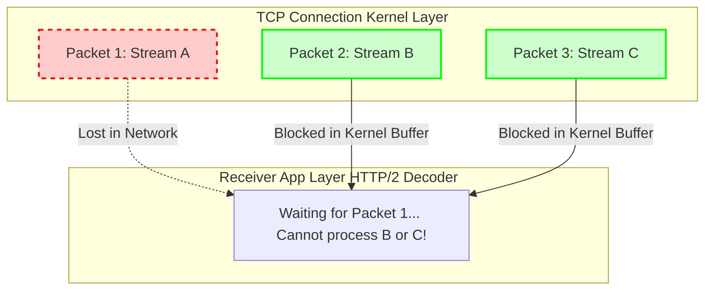
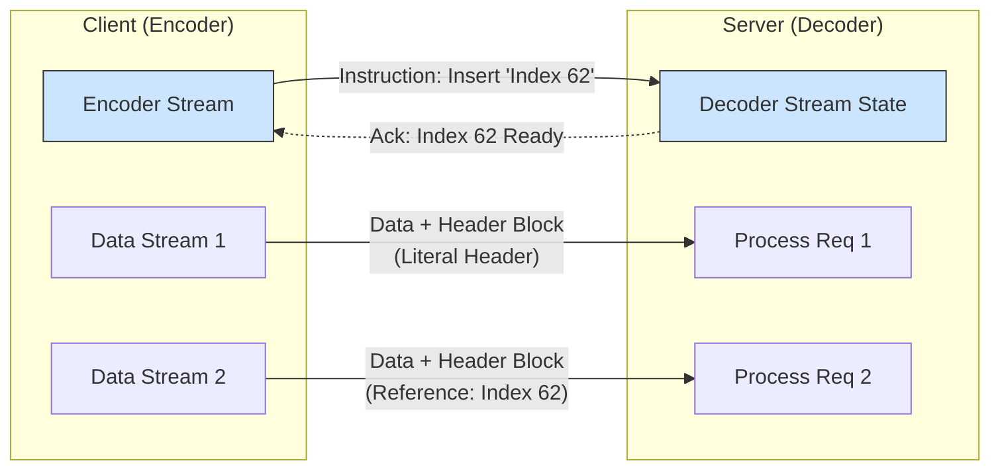
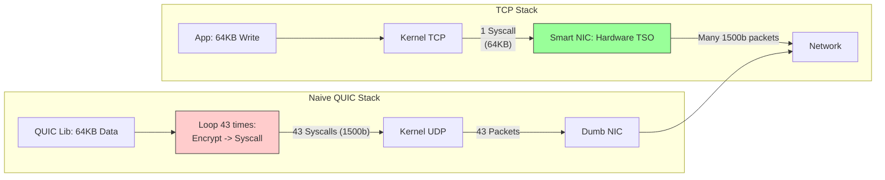

---
tags:
  - networking
  - http
  - quic
  - performance
  - architecture
aliases:
  - HTTP Protocol Evolution
  - HoL Blocking
---
# L1.NET.11: HTTP/1.1 vs HTTP/2 vs HTTP/3, Multiplexing, HoL Blocking (Максимально детализированный конспект)

> [!abstract] О лекции
> Переход от HTTP/1.1 к HTTP/2 был амбициозной попыткой обмануть протокол TCP, но фундаментальную физику сети не обманешь. Последующий переход от HTTP/2 к HTTP/3 (на базе QUIC) — это историческая капитуляция инженеров перед ограничениями старого ядра ОС и "окаменелой" инфраструктурой (Ossified Middleboxes). Для Staff Architect разница между протоколами заключается не в банальной "скорости загрузки картинки", а в том, где именно происходит вычисление **Congestion Control**, как математически работает **Flow Control** на уровне микро-потоков и почему использование **UDP** в User-Space требует в 2-3 раза больше мощности CPU (если не использовать современные оффлоады ядра).

---
## 1. Фундаментальная проблема: Head-of-Line (HoL) Blocking

**Определение:** Head-of-Line Blocking (Блокировка начала очереди) — это универсальный феномен деградации производительности. Он возникает в любой системе, когда обработка всей последовательности задач полностью приостанавливается из-за задержки *первого* элемента в очереди. Остальные элементы, даже если они уже готовы к обработке сервером или к передаче по сети, вынуждены простаивать и ждать завершения проблемного элемента.

В контексте эволюции веба и протокола HTTP мы имеем дело с двумя совершенно различными видами HoL, которые инженеры часто путают на собеседованиях:
1.  **Application Layer (L7) HoL:** Логическая проблема дизайна самого протокола HTTP/1.1.
2.  **Transport Layer (L4) HoL:** Физическая проблема протокола TCP, которая стала критичной и убийственной для HTTP/2.

---
### 1.1. HTTP/1.1: Application Layer HoL (Сериализация запросов)

В протоколе HTTP/1.1 (даже с использованием оптимизации постоянных соединений `Connection: Keep-Alive`) модель коммуникации строго **синхронна и сериализована** внутри одного открытого TCP-соединения.

#### Механика проблемы (Протокольный дизайн)
Клиент отправляет запросы в строгом порядке, и Сервер **обязан** возвращать ответы в том же самом порядке (Принцип FIFO — First In, First Out). В классическом HTTP/1.1 просто не существует встроенного механизма идентификации запросов (Request ID), который позволил бы клиенту понять, к какому именно запросу относится внезапно пришедший кусок данных. Поэтому порядок нерушим.

**Сценарий катастрофы на бэкенде:**
1.  **Запрос A:** `GET /heavy-report.pdf` (Генерация сложного аналитического отчета на бэкенде и обращение к БД занимает 5000 мс).
2.  **Запрос B:** `GET /status.json` (Легкий статичный файл из кеша Redis, отдается за 1 мс).

Если оба запроса отправлены в одно TCP соединение, даже если ваш мощный сервер сгенерировал `status.json` мгновенно, он физически **не имеет права** отправить его в сеть, пока не закончит полную генерацию и отправку тяжелого `heavy-report.pdf`. Буфер отправки (Send Buffer) блокируется первым запросом. Клиент (браузер) видит "крутящийся спиннер" 5 секунд, хотя нужные ему данные (JSON для обновления UI) уже давно готовы на сервере.

#### Почему провалился HTTP Pipelining?
В стандарте HTTP/1.1 (RFC 2616) была попытка решить эту проблему через механизм **Pipelining** (конвейерную обработку): клиент мог послать сразу целую пачку запросов (A, B, C) один за другим в сокет, не дожидаясь ответов на предыдущие.
*   **Архитектурное ограничение:** Сервер все равно был обязан выстроить и вернуть ответы в строгом порядке A, B, C. Если "A" застрял — стоят все.
*   **Смерть технологии (Middleboxes):** Промежуточные узлы в глобальном интернете (Transparent Proxies операторов связи, старые Load Balancers, антивирусы) массово некорректно обрабатывали конвейер. Некоторые буферизировали ответы до предела RAM, некоторые путали их порядок, отдавая куски чужих файлов, некоторые просто обрывали соединение. Из-за этой тотальной ненадежности (OSSification) разработчики всех браузеров (Chrome, Firefox) навсегда отключили Pipelining по умолчанию.

#### Костыль архитектора: Domain Sharding (Шардирование доменов)
Чтобы хоть как-то обойти Application L7 HoL, браузеры пошли на хитрость: они открывают **сразу несколько параллельных TCP-соединений** к одному серверу (обычно хардкод-лимит в браузерах равен 6 соединениям на один Origin/Домен).
*   **Domain Sharding:** Чтобы обойти лимит в 6 соединений, инженеры десятилетиями специально разносили статические файлы по разным "фейковым" поддоменам (`img1.cdn.com`, `img2.cdn.com`). Для браузера это разные сайты, и он мог открыть 12, 18 или 24 параллельных TCP-соединения одновременно.
*   **Цена решения (Огромный Overhead):**
    1.  **TCP Slow Start:** Каждое из 24 новых соединений начинает передачу с минимальной скорости (малое стартовое окно перегрузки `cwnd`). Канал утилизируется неэффективно.
    2.  **TLS Handshake Overhead:** Для *каждого* из 24 соединений нужно проводить полный и тяжелый криптографический хендшейк (трата CPU клиента, CPU сервера и потери RTT).

---
### 1.2. HTTP/2: TCP Layer HoL (Абстракция байтового потока)

Протокол HTTP/2 триумфально решил проблему Application Layer (L7) HoL через введение **мультиплексирования**. Появились понятия **Фрейма (Frame)** и **Стрима (Stream ID)**.
*   Мы теперь можем нарезать гигантский `heavy-report.pdf` на мелкие кусочки (фреймы).
*   Мы можем легально вклинить фрейм со `status.json` прямо между фреймами тяжелого PDF.
*   *L7 HoL устранен:* Легкий запрос проскакивает вперед, UI браузера не висит.

**НО** HTTP/2 совершил фундаментальную архитектурную ошибку: ради экономии ресурсов он сложил абсолютно все яйца (все логические стримы) в одну единственную корзину (одно физическое TCP-соединение). И здесь мы жестко упираемся в математические гарантии самого протокола TCP.

#### Механика TCP (Byte Stream Abstraction)
Протокол TCP предоставляет уровню приложения (L7) абстракцию **абсолютно надежного, строго упорядоченного потока байт**.
Для ядра операционной системы (TCP Stack) не существует никаких "стримов HTTP/2", "заголовков" или "фреймов". Для него это просто бесконечная "колбаса" байт, пронумерованных порядковыми номерами (Sequence Numbers): `Seq 100`, `Seq 200`, `Seq 300`...

**Сценарий катастрофы (Packet Loss в HTTP/2):**
Представьте, что мы передаем данные трех независимых микросервисных стримов (ID:1 - CSS, ID:2 - JSON, ID:3 - Image) внутри одного TCP-соединения.
Эти логические данные ядро нарезает и упаковывает в физические IP-пакеты (MTU ~1500 байт):
*   **Пакет 1 (Seq 1-1000):** Содержит данные Стрима 1 (CSS).
*   **Пакет 2 (Seq 1001-2000):** Содержит данные Стрима 2 (JSON).
*   **Пакет 3 (Seq 2001-3000):** Содержит данные Стрима 3 (Image).

Допустим, на перегруженном транзитном роутере провайдера **Пакет 1 потерялся** (Dropped). Пакеты 2 и 3 успешно проскочили и дошли до сетевой карты вашего ноутбука.

#### Что происходит в ядре ОС (Kernel Space)?
1.  Сетевая карта принимает Пакеты 2 и 3, генерирует прерывание.
2.  TCP-стек ядра смотрит в буфер и видит: "У меня есть кусок байт 1001-3000. Но я всё еще жду байт №1!".
3.  Из-за жесткой гарантии сохранения порядка (**Ordered Delivery**) TCP **не имеет права** передать байты 1001-3000 вверх приложению (браузеру или Nginx-декодеру), пока математически не заполнит "дырку".
4.  Пакеты 2 и 3 ложатся мертвым грузом в **Receive Buffer** ядра (Socket Buffer) и ждут.
5.  Ваше приложение (HTTP/2 декодер в Chrome) "голодает". Оно физически не знает, что нужные ему данные для Стрима 2 (JSON) уже давно лежат в оперативной памяти компьютера. Процесс рендеринга страницы заморожен. Он ждет, пока сервер по таймауту не перепошлет потерянный Пакет 1.



#### Итог для Эксперта (Приговор HTTP/2)
Это явление и есть **TCP Head-of-Line Blocking**.
Потеря сетевого пакета, содержащего байты, относящиеся к *одному* логическому стриму, фатально блокирует обработку *абсолютно всех остальных* стримов в этом едином соединении.

**Сравнительный парадокс производительности:**
В условиях мобильных сетей или Wi-Fi с плохим качеством приема (где Packet Loss > 2%) современный HTTP/2 работает **медленнее**, чем устаревший HTTP/1.1.
*   В HTTP/1.1 (при 6 открытых соединениях): потеря пакета блокирует только 1 конкретное соединение из 6. Остальные 5 потоков продолжают параллельно качать данные.
*   В HTTP/2 (где всего 1 соединение на домен): потеря единственного пакета полностью парализует **весь** обмен данными с сайтом, пока не сработает механизм Fast Retransmit (что стоит минимум 1 RTT) или RTO (Retransmission Timeout, что еще дольше).

Именно этот фундаментальный конфликт между желанием L7 мультиплексировать данные и жесткими математическими гарантиями порядка L4 TCP привел инженеров к мысли: TCP больше не подходит. Нам нужен QUIC поверх UDP.

---
## 2. HTTP/2: The Binary Framing Layer (Бинарная революция)

Важно понимать: HTTP/2 (RFC 7540) **не менял** бизнес-семантику HTTP. Все ваши любимые методы (`GET`, `POST`), статус-коды (`200 OK`, `404 Not Found`) и текстовые заголовки (`User-Agent`) остались абсолютно прежними. Революция произошла исключительно в том, **как** эти данные кодируются и упаковываются «в проводе» (on the wire).

Вместо медленного текстового протокола, где сообщения разделялись переносами строк, мы получили строгий, высокопроизводительный **бинарный протокол с пакетной коммутацией**.

### 2.1. Анатомия Фрейма (The Frame)

Базовая и неделимая единица коммуникации в H2 — это **Frame (Фрейм)**. Это не абстрактное понятие из учебника, это жестко заданная структура байтов, которую парсит машина. Непрерывный поток TCP превращается в последовательность этих дискретных фреймов.

**Структура заголовка фрейма (ровно 9 байт):**
```text
 +-----------------------------------------------+
 |                 Length (24 bits)              |
 +---------------+---------------+---------------+
 |   Type (8)    |   Flags (8)   |
 +---------------+---------------+---------------+
 |R|                 Stream ID (31 bits)         |
 +-----------------------------------------------+
 |                 Frame Payload (*)           ...
```

1.  **Length (24 бита):** Размер полезной нагрузки фрейма. Максимальный размер payload по умолчанию мал — 16 КБ ($2^{14}$ байт), но может быть расширен до 16 МБ через фрейм `SETTINGS`.
    *   *Expert Note (Тюнинг):* Использование огромных фреймов (по 16 МБ) вредно для мультиплексирования. Если вы шлете огромный монолитный кусок в 16 МБ, вы физически забиваете сетевой канал для всех остальных мелких стримов, вызывая Jitter (дрожание задержки). Идеальный фрейм должен быть маленьким для частой ротации стримов.
2.  **Type (8 бит):** Определяет назначение фрейма (DATA - байты файлов, HEADERS - заголовки запроса, PRIORITY, RST_STREAM - отмена, SETTINGS, PUSH_PROMISE, PING - keepalive, GOAWAY - грациозное закрытие сессии, WINDOW_UPDATE, CONTINUATION).
3.  **Flags (8 бит):** Битовые модификаторы типа. Например, флаг `END_STREAM` говорит, что этот фрейм последний в данном запросе, а `END_HEADERS` означает, что блок заголовков закончен.
4.  **Stream ID (31 бит):** Уникальный идентификатор виртуального потока, к которому принадлежит фрейм. (Один бит "R" всегда зарезервирован и равен 0).
    *   `ID = 0`: Зарезервирован для служебного управления всем физическим соединением (передача фреймов SETTINGS, WINDOW_UPDATE, PING).
    *   Нечетные ID (`1, 3, 5...`): Потоки, инициированные Клиентом (ваши GET запросы).
    *   Четные ID (`2, 4, 6...`): Потоки, инициированные Сервером (механизм Server Push).

### 2.2. Мультиплексирование и Потоки (Streams)

**Stream (Поток)** — это чисто виртуальная, двунаправленная последовательность фреймов внутри одного физического TCP-соединения.

**Механика интерливинга (Interleaving / Чередование):**
В H1.1, чтобы сервер мог отправить клиенту `index.html` и `style.css`, он должен был отправить сначала все 100% байт HTML-файла, и только после этого начать передачу байт CSS.
В H2 сервер на лету разбивает оба файла на мелкие фреймы `DATA` и перемешивает их (чередует) в сокете:
`[Stream 1: DATA (HTML part 1)]` $	o$ `[Stream 3: DATA (CSS part 1)]` $	o$ `[Stream 1: DATA (HTML part 2)]`...

**Жизненный цикл и Защита (Memory Exhaustion DoS):**
*   Стримы невероятно "дешевы". В отличие от TCP сокетов, они не требуют системных вызовов ОС. Они существуют только как 31-битный ID в заголовке фрейма.
*   **Архитектурный лимит (`SETTINGS_MAX_CONCURRENT_STREAMS`):** Сразу при коннекте сервер отправляет эту настройку клиенту (в Nginx дефолт равен 128). Это жизненно важная защита сервера от истощения памяти (OOM DoS). Если бы клиент мог открыть 10 000 параллельных стримов, серверу пришлось бы выделить в RAM 10 000 буферов и контекстов сжатия для их обработки, что убило бы бэкенд.

### 2.3. Flow Control: Система кредитов (Credit-Based System)

Это критически важная, но часто упускаемая на собеседованиях часть протокола H2. У самого протокола TCP есть свой Flow Control (механизм Receive Window). Но HTTP/2 понадобился **свой собственный**, дублирующий механизм управления потоком на уровне приложения (L7). Почему? Потому что внутри одного сокета теперь живут сотни разных стримов, и один медленный стрим (где клиент медленно читает данные) не должен заблокировать весь TCP-сокет.

**Как работает кредитная экономика H2:**
1.  Система основана на выдаче "разрешений" (кредитов на отправку байт).
2.  Каждый отправитель отслеживает **Send Window**, каждый получатель — **Receive Window**.
3.  При инициализации окна по дефолту равны 65,535 байт.
4.  Когда сервер шлет фрейм `DATA` размером X байт (например, 10 КБ видео), он немедленно вычитает X из своего Send Window. Если окно падает до 0 или ниже, **отправка данных физически блокируется**, сервер замолкает.
5.  Клиент (браузер), приняв и обработав данные, шлет серверу служебный фрейм `WINDOW_UPDATE`, в котором говорит: "Я освободил буфер, возвращаю тебе кредит на X байт". Окно сервера увеличивается, и он снова может слать данные.

**Двухуровневое регулирование (Expert Architecture Nuance):**
Flow Control в H2 работает на двух уровнях абстракции **одновременно**:
1.  **Per-Stream (Локальный):** "В Стрим №5 можно послать еще максимум 10 КБ". Это предотвращает ситуацию, когда один медленно парсящийся JSON забивает память всего соединения.
2.  **Per-Connection (Глобальный, на Stream 0):** "Во всё физическое соединение суммарно можно передать еще 1 МБ". Это защищает глобальный буфер процесса (Nginx) от переполнения.

**Скрытая проблема производительности (BDP Mismatch):**
Если сетевая задержка (RTT) высокая, а фреймы `WINDOW_UPDATE` от клиента приходят с запозданием, сервер исчерпает свои кредиты и остановит отправку, **даже если окно самого TCP еще открыто настежь**. Для High-Throughput систем (например, передача гигабайтных файлов через gRPC) дефолтное окно H2 в 65КБ — это бутылочное горлышко. **Тюнинг `Initial Window Size`** в конфигах Nginx или Envoy до мегабайтных значений — это стандартная задача Performance-инженера для H2/gRPC.

### 2.4. HPACK: Stateful Header Compression (Сжатие с состоянием)

HTTP/2 не сжимает тела запросов (payload). Это по-прежнему прерогатива алгоритмов gzip, brotli, zstd. HTTP/2 сжимает гигантские и повторяющиеся заголовки (Headers).
Алгоритм **HPACK (RFC 7541)** — это не просто потоковый компрессор типа zip, это **сложный, синхронизированный конечный автомат состояний** (State Machine), живущий параллельно в памяти и клиента, и сервера.

#### Три магических компонента HPACK:
1.  **Static Table (Статическая таблица, Индексы 1-61):** Жестко захардкоженный, неизменяемый список самых популярных заголовков.
    *   *Пример:* Индекс `2` всегда и везде означает пару `:method: GET`. Индекс `32` означает `404 Not Found`.
    *   *Профит:* Вместо отправки текстовой строки из 13 байт (`:method: GET`), мы шлем ровно 1 байт (бинарный индекс 2).
2.  **Dynamic Table (Динамическая таблица, Индексы 62+):** FIFO буфер в RAM, который наполняется "на лету" в процессе жизни соединения.
    *   *Сценарий:* Ваш браузер шлет жирный токен аутентификации `Authorization: Bearer <500_байт_JWT>`.
    *   В самом первом запросе браузер отправляет полные 500 байт текста, но помечает их спец. флагом: "Эй, сервер, запомни это и положи в свою Динамическую Таблицу под Индексом 62".
    *   Во всех последующих (сотнях) запросов в этой сессии браузер будет слать просто число `62` (1 байт).
    *   **Экономия:** Тысячи байт повторяющегося мусора превращаются в единицы байт.
3.  **Huffman Encoding:** Для тех строк, которых еще нет в таблицах (уникальные значения), используется статический код Хаффмана. Дерево Хаффмана жестко зашито в RFC и было математически оптимизировано на основе статистического анализа миллиардов HTTP-заголовков в интернете.

**Архитектурный риск (HoL Blocking на уровне компрессии):**
Поскольку состояние Динамической Таблицы мутирует с каждым отправленным заголовком, **порядок декодирования абсолютно критичен**.
Если TCP соединение теряет пакет, в котором была инструкция "Добавь этот токен в таблицу", то все последующие фреймы `HEADERS` в других стримах физически **нельзя декодировать**, даже если их пакеты успешно дошли, так как индексы сместились и ссылаются в никуда. В HTTP/3 (QUIC) эта уязвимость блестяще исправлена новым алгоритмом **QPACK**, но в H2 это реальная головная боль.

### 2.5. Server Push (Мертвая технология / Deprecated)

Фича, о которой кричали маркетологи, но которая умерла на практике. (Браузер Chrome полностью удалил поддержку Push в 2022 году). Важно знать историю её провала.

*   **Идея:** Клиент запрашивает `index.html`. Умный Сервер анализирует код и понимает: "Ага, ему 100% потребуется `main.css` и `logo.png`". Сервер не ждет, пока клиент распарсит HTML и сделает новые запросы, он агрессивно "пушит" эти файлы прямо в TCP сокет.
*   **Механика:** Сервер формирует служебный фрейм `PUSH_PROMISE` (смысл: "Клиент, я сейчас пришлю тебе файл, веди себя так, будто ты его сам у меня запросил"), а затем отправляет данные в новом стриме с четным ID.
*   **Почему индустрия убила Server Push:**
    1.  **Cache Awareness (Слепота к кешу):** Сервер не имеет доступа к локальному диску браузера клиента. Сервер пушит тяжелый `main.css`, не зная, что этот файл уже лежит в кеше браузера со вчерашнего дня. В итоге сервер впустую тратит драгоценную полосу пропускания клиента.
    2.  **Complexity (Сложность):** Реализация корректного Flow Control и отмены (Cancel) ненужных пуш-стримов оказалась слишком сложной задачей для разработчиков серверов.
*   **Современная альтернатива:** Индустрия перешла на заголовки **HTTP 103 Early Hints** и HTML теги `<link rel="preload">`. Теперь сервер просто дает легкую подсказку, а браузер сам, осознанно решает, нужно ли ему скачивать файл.

### 2.6. Upgrade Dance: h2 vs h2c (Согласование протокола)

Если у нас один порт (443), как браузер и сервер в долю секунды решают, на каком протоколе им говорить: H1 текстовом или H2 бинарном?

1.  **`h2` (Over TLS - Защищенный):** Индустриальный стандарт для публичного интернета.
    *   Согласование идет через криптографическое расширение TLS **ALPN** (Application-Layer Protocol Negotiation, см. лекцию 10).
    *   Браузер в пакете `ClientHello` шлет строковый список: "Предпочитаю `h2`, затем `http/1.1`". Сервер отвечает: "Выбираю `h2`".
    *   Происходит за 0 RTT (встроено в TLS).
2.  **`h2c` (Cleartext - Без шифрования):** HTTP/2 поверх открытого TCP порта 80.
    *   Браузер шлет обычный текстовый HTTP/1.1 запрос с заголовками `Upgrade: h2c` и `Connection: Upgrade`.
    *   Сервер отвечает текстовым кодом `101 Switching Protocols`, и со следующего байта оба переключают парсеры на бинарный H2.
    *   *Expert Note:* **Ни один современный браузер не поддерживает `h2c`**. Они требуют TLS. Однако `h2c` или "H2 with prior knowledge" (когда мы шлем бинарные фреймы сразу, без Upgrade-запросов, так как 100% уверены в сервере) массово используется **внутри дата-центров** для общения между Ingress балансировщиком и бэкендами (особенно в gRPC архитектурах).

---
**Итог для Архитектора (Раздел 2):**
Внедрение HTTP/2 — это создание умного микро-туннеля внутри тупого TCP, где само приложение берет на себя управление потоками, приоритетами и кредитными буферами. Это решило проблему "пробок" из тяжелых запросов, но сделало общую производительность критически зависимой от одной вещи: физической надежности TCP-кабеля.

---
## 3. HTTP/3 & QUIC: The UDP Revolution (Побег из ядра)

HTTP/3 (RFC 9114) — это не просто очередной апдейт структуры заголовков. Это тектонический сдвиг парадигмы. Индустрия приняла решение полностью забрать ответственность за "Транспортный уровень" (Transport Layer) из зоны ответственности ядра операционной системы (TCP) и перенести его в "Пространство пользователя" (User Space), создав протокол QUIC поверх "глупого" UDP.

### 3.1. Почему именно UDP? Проблема "Окостенения" (Protocol Ossification)
Почему инженеры Google (создатели QUIC), столкнувшись с проблемами TCP, не написали просто "TCP версии 2" или не создали принципиально новый L4 протокол (например, с Protocol ID 146 поверх IP)?

*   **Термин: Ossification (Окостенение сети интернета).**
    Сетевой путь от вашего смартфона до серверов Google пролегает через десятки промежуточных коробок (Middleboxes): домашние NAT-роутеры за 10$, корпоративные файрволы Palo Alto, системы DPI (Deep Packet Inspection) провайдеров.
    Эти коробки аппаратно "окостенели". Их прошивки годами не обновляются. Они знают только два правила:
    1.  Если IP Protocol ID = 6 (TCP) — парсим флаги SYN/ACK, следим за состоянием (Stateful firewall), пропускаем. Если видим незнакомый флаг TCP — **Drop!**.
    2.  Если IP Protocol ID = 17 (UDP) — это просто "тупой" стриминг (DNS, VoIP, Игры). Состояний нет, просто пропускаем.
    3.  Если IP Protocol ID = что-то новое (SCTP, DCCP, Ваш Новый Протокол) — **DROP!** Устройство не знает, как применить к этому правила безопасности, и блокирует трафик "на всякий случай".

*   **Гениальное решение (Маскировка):**
    Инженеры решили использовать протокол UDP не по прямому назначению, а исключительно как **транспортный конверт** (substrate). Для всех тупых железок в интернете трафик HTTP/3 выглядит просто как поток зашифрованного "мусора" по протоколу UDP. На самом же деле, внутри payload-а этого UDP-пакета спрятан полноценный, написанный с нуля TCP, с контролем доставки, окнами перегрузки и криптографией.

### 3.2. Настоящее решение HoL Blocking: Независимые байтовые потоки

В HTTP/2 мы мультиплексировали независимые запросы в один TCP-стрим. Для TCP все эти данные были единой "трубой".

*   **Решение QUIC:**
    Протокол QUIC изначально спроектирован с учетом мультиплексирования на самом нижнем уровне.
    1.  Каждый инкапсулированный QUIC-фрейм имеет заголовок, содержащий `Stream ID` (к какому потоку он принадлежит).
    2.  Если UDP-пакет, содержащий кусок Стрима А (CSS файл), потерялся в интернете, библиотека QUIC замечает это.
    3.  Но когда следом прилетает следующий UDP-пакет, содержащий кусок Стрима B (JS файл), библиотека QUIC парсит его, видит другой ID, и понимает, что контексты независимы.
    4.  **Магия:** Библиотека **моментально** отдает данные Стрима B вверх приложению (браузеру) для обработки!
    5.  В буфере перепосылки (Retransmit buffer) зависает и ждет повторной доставки только один-единственный поврежденный Стрим А.
    *Итог:* Потеря одного пакета больше не парализует весь сайт.

### 3.3. Встроенное и тотальное шифрование (Mandatory TLS 1.3)

В старом стеке (TCP + TLS) криптография была "нашлепкой" (L6 Presentation Layer) поверх открытого транспорта. Все метаданные TCP (Sequence Numbers, ACK-флаги, Timestamps) передавались в абсолютно открытом виде.

В протоколе QUIC шифрование и транспорт **слиты воедино** и не могут быть разъединены.

*   **Deep Packet Inspection (DPI) слепнет:**
    В QUIC зашифрован не только Payload (запрос), но и большая часть заголовка самого пакета QUIC (включая Packet Numbers). Промежуточный "умный" файрвол корпорации или провайдера больше не может "подсмотреть" номера пакетов, не может подменить ACK или злонамеренно разорвать соединение (TCP RST injection), так как он не обладает криптографическими ключами сессии.
*   **Faster Handshake:**
    Поскольку транспорт и криптография объединились, Handshake происходит за 1 RTT (Request-Trip Time).
    *   *TCP+TLS:* `SYN` $	o$ `SYN/ACK` $	o$ `ACK` (TCP established) $	o$ `ClientHello` $	o$ ... (TLS Handshake).
    *   *QUIC:* `Initial Packet` (содержит и данные транспорта, и `ClientHello` сразу).

### 3.4. Connection Migration (Бесшовная миграция соединения)

Это "киллер-фича", перевернувшая архитектуру мобильного веба и потокового видео. (Известная как "The Parking Lot Problem").

*   **Трагедия TCP:**
    Жизнь TCP-соединения жестко вшита в **4-tuple** кортеж: `Source IP, Source Port, Dest IP, Dest Port`.
    Представьте, вы скачиваете фильм на 5 ГБ, выходя из офиса. Вы покидаете зону Wi-Fi, и телефон переключается на вышку сотовой связи LTE. Ваш IP-адрес (`Source IP`) мгновенно меняется.
    Для сервера вы стали абсолютно новым, неизвестным клиентом. Старое TCP соединение разрывается с ошибкой. Загрузка файла падает, ее нужно начинать заново с установкой новых хендшейков.

*   **Решение QUIC (Connection ID - CID):**
    QUIC абстрагируется от сетевых адресов. Он вводит логический **Connection ID** (например, 64-битный уникальный UUID), который генерируется при первом хендшейке и вставляется в открытую часть каждого QUIC-пакета.
    1.  Телефон меняет IP с Wi-Fi на LTE.
    2.  Телефон просто отправляет следующий QUIC-пакет с нового LTE IP-адреса, указывая в заголовке **старый Destination CID**.
    3.  Сервер принимает пакет, парсит открытый CID, и находит в своей RAM контекст прошлой сессии.
    4.  Сервер понимает: "О, это же тот самый клиент, он просто сменил сеть". Сервер обновляет у себя привязку CID к новому IP и продолжает отдавать байты фильма *без единого разрыва*.

*   **Security Nuance (Защита от DDoS Amplification):**
    Чтобы хитрый хакер не мог подделать Source IP в пакете с валидным CID и "перенаправить" весь поток 5 ГБ видео на компьютер жертвы (совершив DDoS), спецификация QUIC требует процедуру **Path Validation**. Прежде чем направить тяжелый поток на новый IP, сервер отправляет туда легкий криптографический пробный пакет (`PATH_CHALLENGE`). Только получив правильный ответ (`PATH_RESPONSE`), сервер доверяет новому пути.

### 3.5. User-Space Implementation: Космическая скорость эволюции

Чтобы обновить алгоритм контроля перегрузок (например, внедрить BBRv3) или исправить уязвимость в реализации TCP, инженерам корпораций приходилось ждать годами: нужно дождаться патча ядра Linux, протестировать его, а затем запланировать окно даунтайма (Maintenance) для жесткой перезагрузки десятков тысяч серверов парка. На смартфонах Android обновления ядра вообще редко доходят до конечных пользователей.

**Архитектурный переворот:** Протокол QUIC реализован как обычная библиотека (User-space library), скомпилированная вместе с вашим приложением:
*   `Google Quiche` (написана на C++).
*   `MsQuic` (библиотека Microsoft).
*   `quic-go` (популярна в экосистеме Golang).

Теперь обновление транспортного протокола интернета эквивалентно простому обновлению бинарника вашего Nginx или выкату новой версии браузера Chrome через автоапдейт. Это позволяет индустрии тестировать и внедрять новые транспортные алгоритмы за недели, а не десятилетия.

---
## 4. QPACK vs HPACK: Цена независимости в HTTP/3

Когда транспорт (QUIC) стал независимым (Out-of-Order UDP), это сломало все старые механизмы компрессии, которые полагались на строгий порядок доставки.

### 4.1. Почему HPACK ломается в QUIC? (Зависимость от порядка)

Вспоминаем лекцию выше: HPACK в HTTP/2 использует глобальное состояние — **Dynamic Table** (таблицу индексов).
*   **Сценарий:** Вы шлете два запроса в одном соединении QUIC, но в разных стримах (Stream A и Stream B).
*   **Stream A (Пакет 1):** Несет заголовок `X-Token: ABC`. Кодировщик HPACK добавляет его в свою таблицу под индексом 62 и шлет по сети.
*   **Stream B (Пакет 2):** Шлет этот же токен, но ради сжатия просто указывает: "Используй значение из Индекса 62".

**Катастрофа UDP:**
В UDP пакеты обгоняют друг друга. Пакет 2 (от Stream B) прилетает на сервер *раньше*, чем Пакет 1.
Сервер видит команду: "Смотри Индекс 62". Но в его таблице еще нет 62 элемента!
Чтобы не упасть с ошибкой, декодеру HTTP/3 пришлось бы поставить обработку Стрима B "на паузу" и ждать, пока по сети долетит потерявшийся Пакет 1 от Стрима А.
*Итог:* Мы своими руками вернули **Head-of-Line Blocking** на уровне компрессора, убив все преимущества QUIC!

### 4.2. QPACK: Архитектура разделения потоков (Decoupling)

Инженеры IETF (RFC 9204) создали QPACK. Главная идея — вынести логику обновления словаря в **отдельные служебные каналы**, не блокирующие полезные запросы.



Внутри одного QUIC-соединения создаются два дополнительных служебных потока (Unidirectional Streams), которые работают "сбоку" от основных запросов:
1.  **Encoder Stream:** Отправитель шлет сюда инструкции мутации: "Добавь заголовок X", "Измени словарь".
2.  **Decoder Stream:** Получатель шлет подтверждения: "Я получил и применил твои вставки".

### Ключевые изменения:
1.  **Абсолютная индексация:** Вместо "скользящих" индексов (как в HPACK, где 1 — это всегда самый новый элемент), QPACK использует абсолютные индексы (0, 1, 2...), которые никогда не меняются для конкретной записи. Это позволяет ссылаться на запись, даже если в таблицу добавили что-то еще.
2.  **Явные ссылки:** Блок заголовков (Header Block) в самом запросе содержит поле `Required Insert Count`. Оно говорит: "Для расшифровки этого запроса тебе нужно состояние динамической таблицы, включающее минимум $N$ вставок".

### 4.3. Дилемма архитектора: Риск Блокировки против Максимального Сжатия

QPACK отдает контроль разработчику. Энкодер может выбирать стратегию для каждого запроса "на лету".

**Стратегия 1: "Рискованная" (Максимальное сжатие - High Compression)**
*   Энкодер шлет инструкцию в *Encoder Stream* ("Создай индекс 62").
*   И в ту же миллисекунду шлет запрос в *Request Stream* с ссылкой "Юзай индекс 62".
*   *Риск:* Если пакет энкодера затеряется в UDP-сети, запрос заблокируется на сервере в ожидании обновления таблицы. Это **локальный HoL Blocking** (заблокируется только этот конкретный стрим, остальные продолжат работать).

**Стратегия 2: "Безопасная" (Минимальная задержка - Low Latency)**
*   Энкодер не пытается использовать динамические ссылки для новых заголовков. Он отправляет заголовок целиком как обычную строку (Literal), сжатую алгоритмом Хаффмана. И только фоном, неспеша, отправляет инструкцию в *Encoder Stream* для будущих запросов.
*   *Плюс:* Запрос физически **невозможно** заблокировать зависимостями. Он расшифруется автономно в момент получения.
*   *Минус:* Чуть больший размер пакета (трата байтов).

**Настройка (Tuning):** Инфраструктурный инженер может жестко запретить серверу рисковать. Настройка `QPACK_BLOCKED_STREAMS = 0` скажет клиенту: "Я запрещаю тебе присылать запросы, которые зависят от еще не дошедших состояний словаря". Это увеличит объем трафика, но полностью исключит Jitter (скачки задержки) в нестабильных мобильных сетях.

---
## 5. Performance: Userspace vs Kernel (Финансовая цена QUIC)

Перенос сложнейшего транспортного протокола (TCP) из высокооптимизированного годами ядра Linux в ваше User-Space приложение (Nginx/Envoy) имеет гигантскую цену. Без понимания системных оптимизаций, внедрение HTTP/3 приведет к тому, что ваши сервера начнут потреблять **в 2-3 раза больше CPU** для обслуживания того же объема трафика.

### 5.1. Проблема "Syscall Storm" (Шторм системных вызовов)

*   **Классика TCP:** Веб-сервер делает один системный вызов `sendfile()` или `write()`, отдавая ядру сразу 1 Мегабайт данных. Ядро само, в фоне, режет этот мегабайт на сотни мелких сегментов по 1500 байт и отдает сетевой карте. Это стоит копейки CPU.
*   **Наивный UDP (QUIC):** Разработчик формирует UDP-пакет в памяти приложения. MTU в интернете ~1500 байт. Чтобы отправить 1 МБ данных видеопотока, приложение должно сделать **$\approx 700$ вызовов** функции `sendmsg()`. Каждый системный вызов — это Context Switch (переключение процессора из режима User в режим Kernel и обратно). Это разрушает кэши процессора L1/L2 и "сжигает" такты CPU впустую.

### 5.2. Потеря аппаратного оффлоадинга (Offloading Gap)

Сетевые карты (NIC) от Intel, Mellanox — это микрокомпьютеры, которые десятилетиями оптимизировались под протокол TCP.
*   **TSO (TCP Segmentation Offload):** Ядро скидывает карте монолитный кусок в 64 КБ, и процессор на самой сетевой карте аппаратно нарезает его на мелкие пакеты TCP и считает крипто-суммы.
*   Сетевые карты смотрят на пакет QUIC и видят просто "неизвестный зашифрованный мусор по UDP". Они не могут аппаратно нарезать его, так как внутри каждого микро-пакета зашифрован уникальный Packet Number. Вся черновая работа падает на центральный процессор сервера (CPU).



### 5.3. Решения: Modern Linux Optimizations (Спасение архитектора)

Чтобы гонять гигабиты QUIC трафика в продакшене без перегрева серверов, архитекторы используют современные механизмы ядра Linux (от версии 4.18 и выше). Вы обязаны проверять их наличие.

1.  **UDP GSO (Generic Segmentation Offload):**
    Программная эмуляция спасительного TSO. Библиотека QUIC формирует в памяти один гигантский "мега-пакет" (до 64 КБ), содержащий уже зашифрованные маленькие QUIC-пакеты, склеенные в ряд. Приложение делает **ровно один** сисколл `sendmsg()` с флагом `UDP_SEGMENT`. Ядро Linux перед самой отдачей драйверу эффективно разрубает этот мега-пакет по швам на части MTU. Количество сисколлов падает в десятки раз.
2.  **UDP GRO (Generic Receive Offload):**
    Зеркальная система для приема (Ingress). Сетевая карта (или ядро) ловит из сети кучу мелких входящих UDP-пакетов от одного IP-адреса, программно "склеивает" их в одну длинную ленту и отдает вашему приложению за один системный вызов `recvmsg()`.
3.  **io_uring (Асинхронная революция):**
    Самый современный интерфейс ввода-вывода (замена старому `epoll`). Приложение и ядро ОС общаются через два кольцевых буфера (Submission / Completion), размещенных в общей разделяемой памяти (Shared Memory). При использовании режима полинга (IOPOLL) ядро может отправлять и получать UDP-пакеты вообще без системных вызовов (`Zero-Syscall`), что поднимает производительность серверов HTTP/3 до уровня TCP.

---
## 6. Чек-лист уровня Expert (Проверка Архитектора)

1.  **Congestion Control Isolation:**
    Где физически находится и исполняется код алгоритма контроля перегрузок (CUBIC или BBR) в протоколах HTTP/2 и HTTP/3?
    *   *Ответ:* В HTTP/2 (базирующемся на TCP) алгоритм находится строго в **ядре операционной системы (Ring 0)**. Обновление алгоритма требует обновления или перекомпиляции ядра Linux. В HTTP/3 (QUIC) TCP-стек отключен, и алгоритм BBR находится в **Userspace-библиотеке** вашего приложения. Вы можете выкатить новый патч Congestion Control просто перезапустив бинарник Nginx.
2.  **Смерть Приоритетов (Prioritization):**
    В стандарте HTTP/2 была описана сложнейшая система приоритизации потоков (когда браузер строил дерево зависимостей: "Качай CSS до картинок"). В HTTP/3 от нее полностью отказались. Почему?
    *   *Ответ:* Механизм H2 был переусложнен и потерпел крах в реальном интернете. Во-первых, половина веб-серверов игнорировала эти деревья. Во-вторых, даже если сервер отдавал CSS с высшим приоритетом, пакеты все равно попадали в единый буфер TCP на сервере и в огромные очереди (Bufferbloat) на роутерах, где смешивались с низкоприоритетным мусором. H3 внедрил простейшую систему "Extensible Prioritization Scheme" (Уровень + Флаг инкрементальности).
3.  **Port 443 UDP Blocking (Корпоративные Файрволы):**
    Что произойдет, если пользователь сидит в корпоративной сети банка, где администратор жестко заблокировал исходящий UDP-трафик (оставив только TCP 80/443)? Как отработает HTTP/3?
    *   *Ответ:* Механизм **Alt-Svc (Alternative Services)**. Браузер всегда делает первый стартовый запрос по классическому TCP (HTTP/2). Сервер отвечает и добавляет заголовок `Alt-Svc: h3=":443"`. Браузер читает это и запускает фоновый процесс (Happy Eyeballs race) — пытается параллельно установить QUIC соединение по UDP. Если UDP пакеты дропаются файрволом банка, фоновый процесс падает по таймауту, и браузер абсолютно незаметно для юзера продолжает использовать старый добрый TCP (Fallback).

### Архитектурное Заключение
*   **HTTP/1.1:** Прост как топор, отлично подходит для межсервисного (Backend-to-Backend) общения без шифрования, но убийственно медленен для загрузки современных сайтов из сотен ассетов (Head-of-Line Blocking L7).
*   **HTTP/2:** Решил проблему веба (мультиплексирование), внедрил бинарность и сжатие заголовков (HPACK). Идеален внутри стабильных дата-центров (базис для **gRPC**). Но катастрофичен на мобильных сетях с потерей пакетов (Head-of-Line Blocking TCP).
*   **HTTP/3 (QUIC):** Вершина эволюции. Решает все сетевые блокировки, дает мгновенный хендшейк (0-RTT) и бесшовный роуминг при смене IP. **Обязателен к включению на Edge-балансировщиках и CDN**, но требует глубокого тюнинга серверов (GSO, io_uring), чтобы не "сожрать" все CPU-ресурсы компании.