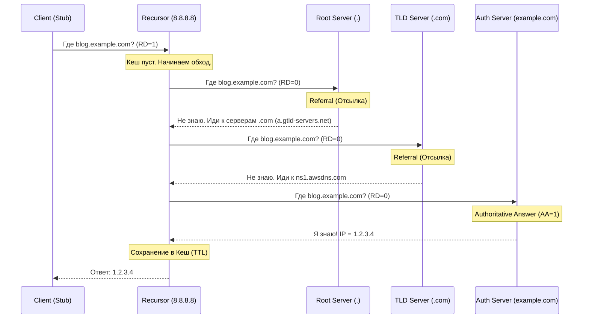

---
tags:
  - networking
  - dns
  - dnssec
  - load-balancing
  - architecture
aliases:
  - DNS Architecture
  - Global Server Load Balancing
---
# L1.NET.12: DNS, DNSSEC, Load Balancing via DNS 

> [!abstract] О лекции
> В этом материале мы глубоко погружаемся в систему доменных имен (DNS) — самую критичную точку отказа (SPOF) современного интернета. Вы узнаете, почему DNS является ужасным балансировщиком соединений, но гениальным диспетчером глобального трафика. Мы разберем анатомию DNSSEC, чтобы понять, почему внедрение криптографии в старый протокол порождает кошмары эксплуатации (усиление DDoS и проблемы MTU), и научимся обходить архитектурные "грабли" вроде CNAME в корне зоны (Zone Apex) и задержек в Kubernetes.

---
## 1. Механика резолвинга: Что скрыто под капотом

**DNS (Domain Name System)** — это не просто "телефонная книга", это гигантская, глобально распределенная, иерархическая и агрессивно кеширующая база данных. Архитектору критически важно понимать не просто "как получить IP по домену", но и четко осознавать, на каком именно этапе цепочки резолвинга возникают сетевые задержки (Latency), где происходит "отравление" кеша и где находятся единые точки отказа (Single Points of Failure).

Процесс превращения удобочитаемого `www.google.com` в машинный IP `142.250.185.68` — это сложнейший танец между клиентом, провайдерами-посредниками и корневыми держателями истины. Разберем акторов и типы запросов.

### 1.1. Акторы (Actors)

В инфраструктуре DNS нет единого понятия "сервер". Система разделена на три строгие роли.

1.  **Stub Resolver (Заглушка / Клиентская библиотека ОС):**
    *   Это **не** полноценный DNS-сервер. Это системная библиотека внутри операционной системы (например, сисколл `getaddrinfo(3)` в `glibc` на Linux, или `DnsClient` в ядре Windows).
    *   **Поведение:** Абсолютно "тупое". Stub Resolver не умеет ходить по иерархии интернета, не знает, что такое корневые сервера. Он умеет только одно: сформировать пакет, отправить запрос (с выставленным битом `RD=1` — Recursion Desired) на локальный IP-адрес, указанный в файле `/etc/resolv.conf`, и терпеливо ждать готового ответа.
    *   **Нюанс архитектуры для Linux:** В современных десктопных и серверных дистрибутивах (Ubuntu, Fedora) Stub Resolver часто общается не напрямую с интернетом, а с локальным фоновым демоном-кешером (например, `systemd-resolved`, который слушает локальный адрес `127.0.0.53` или `dnsmasq`). Этот демон уже выступает как локальный прокси для оптимизации скорости.

2.  **Recursive Resolver (Рекурсор / Full Service Resolver):**
    *   Это настоящая "рабочая лошадка" интернета (DNS вашего провайдера ISP, публичные сервера Google `8.8.8.8`, Cloudflare `1.1.1.1` или ваш корпоративный внутренний Bind/Unbound).
    *   **Поведение:** Он принимает "ленивый" запрос от Stub Resolver'а и берет на себя всю грязную работу по поиску конечного ответа. Он самостоятельно совершает многоступенчатый **итеративный** обход дерева DNS по всему миру.
    *   **Кеш:** Именно на этих серверах живет основной глобальный кеш интернета. От их эффективности зависит скорость загрузки веб-страниц у миллионов людей.

3.  **Authoritative Nameserver (Авторитетный сервер / Держатель Зоны):**
    *   Сервер, который физически хранит конфигурационный файл **зоны** (фрагмент дерева DNS, например, зону `example.com`).
    *   Он **точно знает** окончательный ответ (так как является первоисточником истины) и отвечает на запрос с установленным флагом `AA=1` (Authoritative Answer).
    *   Он **никогда не** ходит к другим серверам. Если его спрашивают о домене, которого у него нет, он просто отдает ошибку `NXDOMAIN` (домен не существует) или реферал (ссылку на тех, кто может знать).

### 1.2. Типы запросов: Recursive vs Iterative

Любой сетевой инженер обязан различать эти два фундаментальных понятия, чтобы уметь читать дампы трафика в `tcpdump` / Wireshark.

*   **Recursive Query (Рекурсивный запрос):** "Найди мне готовый ответ любой ценой, а я пока подожду".
    *   Отправляется по маршруту: *Клиент (Браузер) $	o$ Рекурсор (8.8.8.8)*.
    *   В заголовке UDP-пакета жестко установлен бит **RD** (Recursion Desired).
*   **Iterative Query (Итеративный запрос):** "Скажи мне ответ прямо сейчас, а если не знаешь — просто скажи, кого мне спросить следующим".
    *   Отправляется по маршруту: *Рекурсор $	o$ Авторитетные сервера интернета*.
    *   В заголовке пакета бит **RD** обычно снят (или просто игнорируется авторитетным сервером, так как авторитеты не занимаются рекурсией). Авторитетный сервер отвечает не конечным IP-адресом сайта, а списком других, нижележащих NS-серверов (Этот ответ называется **Referral** / Отсылка).

### 1.3. Алгоритм "Tree Walking" (Проход по дереву)

Представим худший сценарий: кеш рекурсора абсолютно пуст (Cold Start), или кто-то запросил уникальный домен впервые в мире. Клиент запрашивает адрес `blog.example.com.`.



1.  **Root Hints (Корневые подсказки):**
    Рекурсор (тот же `8.8.8.8`) после перезагрузки не знает, где находятся серверы зоны `.com`. Но у него в конфигурации ОС "жестко вшит" текстовый файл корневых подсказок (Root Hints file) — IP-адреса 13 корневых серверов зоны `.` (от `a.root-servers.net` до `m.root-servers.net`, которые управляются ICANN/IANA).
2.  **Root Query (Запрос к корню):**
    *   Рекурсор шлет UDP-пакет $	o$ Root Server: "Где `blog.example.com`?"
    *   Root Server отвечает: "Я не храню IP конкретных сайтов. Но я знаю, что за зону `.com` отвечают сервера компании Verisign (например, `a.gtld-servers.net`). Вот их IP-адреса". (Это типичный ответ типа **Referral**).
3.  **TLD Query (Top-Level Domain - Домен верхнего уровня):**
    *   Рекурсор идет по полученному IP $	o$ TLD Server (`.com`): "Где `blog.example.com`?"
    *   TLD Server смотрит в свою базу регистраторов и отвечает: "Я не знаю IP самого сайта, но вижу, что управление доменом `example.com` делегировано (Delegation) серверам амазона `ns1.awsdns.com`. Вот их IP". (Снова Referral).
4.  **Authoritative Query (SLD - Second Level Domain):**
    *   Рекурсор $	o$ Auth Server Амазона (отвечающий за `example.com`): "Где `blog.example.com`?"
    *   Auth Server проверяет файл зоны: "О, это мой домен! Я знаю! Это запись типа A, адрес `1.2.3.4`". (Отправляет финальный ответ с флагом **AA**).
5.  **Final Answer:**
    Рекурсор кладет результат `1.2.3.4` в свою оперативную память (кеширует на время TTL) и отдает его ожидающему Stub Resolver'у клиента.

### 1.4. Glue Records (Клей) — Проблема курицы и яйца

Это элегантный хак в протоколе DNS для разрыва циклической зависимости.

**Ситуация:** Вы регистрируете домен `example.com` у регистратора. Из соображений контроля (или паранойи) вы хотите поднять свои собственные NS-сервера (Bind9) прямо внутри этого же домена: `ns1.example.com` и `ns2.example.com`.

**Парадокс бесконечного цикла:** Чтобы сторонний рекурсор мог узнать IP для `www.example.com`, он должен спросить `ns1.example.com`. Но чтобы отправить пакет на `ns1.example.com`, ему нужно узнать его IP. А чтобы узнать IP поддомена `ns1.example.com`, рекурсору нужно обратиться к... NS-серверам `example.com` (то есть к самому `ns1`). Цикл замкнулся, запрос завис навсегда.

**Архитектурное Решение (Glue Records):**
На уровне вышестоящей, родительской зоны (в базе регистратора зоны `.com`) вместе с NS-записью делегирования ("За `example.com` отвечает `ns1.example.com`") **явно и принудительно** прописывается A-запись с IP-адресом: `ns1.example.com IN A 93.184.216.34`.
Эта спасительная A-запись в чужой зоне называется "клеем" (Glue Record). Без неё ваш домен, использующий in-bailiwick NS-сервера, мгновенно перестанет резолвиться во всем мире.

### 1.5. Слои кеширования (The Layers of Lies - Уровни лжи)

Главная причина, почему вы не можете использовать DNS для мгновенного Failover (переключения при сбоях), заключается в многослойном кэшировании. Указание `TTL=60` в панели Cloudflare абсолютно не гарантирует, что через 60 секунд весь мир увидит ваш новый IP-адрес.

Ваш ответ может застрять на 4 уровнях "лжи":
1.  **Browser Cache:** Chrome/Firefox/Safari имеют свой собственный внутренний DNS-кеш (обычно живущий около 60 секунд). Они часто нагло игнорируют короткие TTL вашей записи (даже если там TTL=1), чтобы не тормозить серфинг по сети из-за постоянных запросов.
2.  **OS Cache:** Операционная система Windows (служба `DNS Client Service`) или Linux (демоны `systemd-resolved`, `nscd`, `dnsmasq`) жестко кешируют все ответы. (Команда сброса: `ipconfig /flushdns` или `resolvectl flush-caches`).
3.  **Recursive Resolver Cache:** Кеш провайдера (Ростелеком) или публичного резолвера (8.8.8.8). Именно здесь официально работает механика TTL.
    *   *Важно для эксплуатации:* Многие жадные ISP-провайдеры настраивают **Minimum Cache TTL** (например, 1 час). Даже если вы отдаете `TTL=0` (хочу, чтобы не кешировали вообще), провайдер принудительно будет держать старую запись в памяти, чтобы защитить свои сервера от шторма запросов.
4.  **Application Cache (Самый опасный уровень):** Фреймворки и языки программирования. В Java класс `InetAddress` исторически кеширует успешный резолвинг **навсегда** (буквально, до перезапуска процесса JVM), если DevOps не настроил параметр `networkaddress.cache.ttl` в файле `java.security`. Это классическая причина ночных P1 инцидентов, когда база данных переехала на другой IP, а приложение на Java упорно продолжает стучаться в старый, уже мертвый IP.

### 1.6. EDNS0 и механизм ECS (Уточнение гео-локации)

Классический оригинальный пакет DNS (RFC 1035) был жестко ограничен 512 байтами при использовании UDP. Этого катастрофически мало для современных нужд (передача IPv6 адресов, тяжелые крипто-ключи DNSSEC и метаданные).
**EDNS0 (Extension Mechanisms for DNS - RFC 6891)** — это механизм, позволяющий клиенту и серверу договориться и расширить размер принимаемого UDP-пакета до 4096+ байт, добавляя дополнительные псевдо-записи (OPT pseudo-RR).

**Гениальное расширение: ECS (EDNS Client Subnet - RFC 7871):**
В классическом DNS авторитетный сервер видит *только* IP-адрес последней мили — IP самого рекурсора (например, IP публичного сервера Google DNS где-то в дата-центре Калифорнии).
С включенным механизмом ECS, умный рекурсор добавляет в пакет специальный хедер: "Я спрашиваю от имени подсети клиента `203.0.113.0/24`".
*   **Архитектурный Use Case:** Это основа работы современных CDN (GeoDNS). Это позволяет вашему умному `ns1.example.com` понять реальное местоположение конечного пользователя и вернуть IP-адрес сервера в Токио для клиента, сидящего в Токио, даже если тот зачем-то использует для резолвинга DNS-сервер, расположенный в США.

---
## 2. Global Server Load Balancing (GSLB) via DNS: Анатомия Трафика

**GSLB** — это технология распределения глобального входящего трафика между серверами, находящимися в разных географических локациях (Data Centers / AWS Regions / Availability Zones). В отличие от локального железного балансировщика (L7 Nginx, HAProxy или AWS ALB), который терминирует живые TCP-соединения и перекладывает байты, DNS GSLB работает исключительно с **намерениями** пользователей (DNS resolution requests). Он управляет гигантскими потоками трафика на самом раннем этапе — еще *до* того, как клиент попытается установить TCP-соединение (3-way handshake).

### 2.1. Round Robin DNS: Иллюзия балансировки
Самый старый, простой и примитивный метод. На одно единственное доменное имя вешается сразу несколько A-записей.

*   **Механика:** Authoritative Nameserver (например, BIND) при каждом новом запросе просто ротирует список IP-адресов в ответе "по кругу".
*   **Нюанс клиента (Client-Side Behavior - почему это ломается):**
    *   Согласно сетевым стандартам **RFC 3484 / RFC 6724** (Default Address Selection for IPv6/IPv4), клиент (ядро ОС или браузер) **не обязан** слепо брать самый первый IP-адрес из полученного списка. ОС может сама отсортировать список по близости подсети к своему собственному IP (по префиксу).
    *   **Happy Eyeballs (RFC 8305):** Современные браузеры (Chrome) стали невероятно умными. Если они получают несколько IP (IPv6 и IPv4), они могут начать открывать TCP-соединения (SYN пакеты) к нескольким IP *одновременно* и использовать то соединение, которое физически установится быстрее, разрывая остальные. Это делает "балансировку" на стороне сервера абсолютно непредсказуемой.
*   **Фундаментальная проблема кэширования:** Если сервер 1.2.3.4 сгорел, и вы срочно удалили этот IP из DNS-зоны, миллионы клиентов (или кеши их ISP) будут упрямо помнить этот старый "мертвый" IP до истечения TTL (иногда часами). Балансировка рушится, пользователи видят таймауты.
*   **Пример ответа (в консоли `dig`):**
    ```bash
    # Ответ DNS сервера (порядок строк будет меняться при повторном запросе)
    example.com.  60  IN  A  1.2.3.4  (Сервер US-East)
    example.com.  60  IN  A  5.6.7.8  (Сервер EU-Central)
    ```

### 2.2. GeoDNS (Geolocation-based Routing): Топология на карте

Маршрутизация на основе физического местоположения пользователя.

*   **Как это работает "под капотом":**
    1.  Приходит DNS Query на авторитетный сервер.
    2.  Сервер смотрит на **Source IP** пакета (или на поле ECS, если оно есть).
    3.  Сервер делает быстрый Lookup в in-memory GeoIP базе данных (MaxMind, Neustar, внутренняя база AWS).
    4.  Определяет регион (Country / Continent / ASN провайдера).
    5.  Возвращает IP-адрес, жестко привязанный администратором к этому региону (Например: "Всем из RU отдавать сервер в Москве").
*   **Критическая проблема "Last Mile" и ECS:**
    *   Большинство пользователей сегодня сидят за публичными резолверами (Google 8.8.8.8, Cloudflare 1.1.1.1).
    *   *Без ECS (Слепота):* Ваш GSLB видит Source IP сервера Google (США), хотя реальный пользователь сидит в Москве со смартфоном. GSLB ошибается и отправляет москвича на сервер в США (Latency 150ms).
    *   *С ECS (EDNS Client Subnet - Прозрение):* Резолвер Google заботливо добавляет хедер в пакет: "Я, гугл, спрашиваю от имени подсети клиента `188.123.0.0/24`". Ваш GSLB парсит ECS, видит московскую подсеть и корректно отправляет пользователя на московский узел (Latency 5ms).
*   **Пример конфигурации (Архитектурный паттерн Bind View / GeoDNS):**
    ```bind
    view "Europe" { 
        match-clients { 185.0.0.0/8; 89.0.0.0/8; ... }; /* Гигантский список подсетей Европы */
        zone "example.com" { file "eu-servers.db"; }; 
    };
    view "US" { 
        match-clients { 4.0.0.0/8; ... }; 
        zone "example.com" { file "us-servers.db"; }; 
    };
    ```

### 2.3. Latency-Based Routing (LBR): Реальная скорость сети

География $eq$ Скорость в интернете. Оптоволокно может быть перебито экскаватором, и кратчайший сетевой путь пакета из "Парижа в Лондон" может внезапно пойти через дно океана до Нью-Йорка и обратно. Простая гео-база (GeoDNS) этого не знает и пошлет трафик по длинному пути. LBR — знает реальную обстановку.

*   **Механизм (Internet Weather Map - Погодная карта интернета):**
    *   Крупный провайдер DNS (AWS Route53, NS1, Cloudflare) 24/7 постоянно замеряет сетевые задержки (RTT, пинги) между всеми основными сетями провайдеров мира (ISP ASNs) и своими развернутыми дата-центрами.
    *   Когда приходит запрос от пользователя из сети московского Билайна (`AS1234`), умный DNS отдает IP того дата-центра (например, во Франкфурте), до которого сетевая задержка именно из `AS1234` прямо сейчас минимальна, игнорируя географию.
*   **Real User Monitoring (RUM) Steering (Уровень Enterprise):** Самый продвинутый метод балансировки (предоставляют NS1, Cloudflare).
    *   В ваш клиентский JS-код на сайте (или в мобильное приложение) встроен невидимый "маячок", который в фоне пингует или скачивает 1-байтный пиксель с разных ваших POP (Points of Presence).
    *   Данные о *реальной* скорости загрузки с устройств живых пользователей сливаются через API обратно в DNS-провайдер.
    *   Политика маршрутизации DNS обновляется в реальном времени на основе телеметрии.

### 2.4. Weighted Round Robin (WRR): Канареечные релизы и миграции

WRR (Взвешенный роутинг) используется архитекторами не для скорости, а для **управления бизнес-рисками** и плавных миграций инфраструктуры.

*   **Сценарий (Cloud Migration):** Вы мигрируете критическую базу/бэкенд из старого On-Premise (DC1) в модный AWS Cloud (DC2). Вы (и бизнес) не хотите переключать 100% клиентского трафика сразу, чтобы не "положить" новое облако скрытыми багами.
*   **Реализация:**
    *   Вы настраиваете в Route53 веса: `IP_DC1 (Weight=90)`, `IP_DC2 (Weight=10)`.
    *   Умный DNS сервер статистически (бросая кубик) в 10% случаев возвращает IP облака, а в 90% — старого ЦОД.
*   **Важное предупреждение для Архитектора (Caveat):** Из-за агрессивного кеширования DNS на промежуточных узлах ISP (один кеширующий сервер провайдера может обслуживать 100 000 клиентов), точного математического распределения 90/10 **никогда не будет**. Будет грубое "примерно 90/10". Для миллиметрового, точного шейпинга трафика (на уровне отдельных запросов) вам необходим L7 Load Balancer (Envoy/Nginx/Istio), а не DNS.

### 2.5. Health Checks & Failover (Активный мониторинг)

Весь механизм DNS GSLB абсолютно бесполезен без непрерывной проверки "здоровья" конечных серверов. DNS не должен отдавать IP мертвого сервера.

*   **Synthetic Probes (Синтетические зонды):** Из дата-центров DNS-провайдера специальные воркеры каждую секунду отправляют реальные HTTP/TCP запросы на ваши конечные сервера (эндпоинты), например `GET /health`.
*   **DNS Failover Workflow (Механика сбоя):**
    1.  Probe детектирует жесткий таймаут или ошибку 500/502 на сервере `1.2.3.4`.
    2.  Счетчик ошибок превышает заданный порог защиты от флаппинга (Threshold, например, 3 провала подряд).
    3.  DNS-сервис обновляет конфигурацию зоны в оперативной памяти: убирает запись `1.2.3.4` из списка ответов.
    4.  **Время сходимости (Convergence Time) — Катастрофа SLA:**
        $$ T_{failover\_downtime} = (T_{probe\_interval} 	imes N_{threshold}) + T_{DNS\_propagation\_delay} + \mathbf{TTL_{client\_cache}} $$
    *   *Расчет катастрофы:* Пингуем раз в 10 сек, ждем 3 попытки (30 сек). Внутреннее обновление распределенной базы провайдера DNS (еще 5 сек). TTL зоны настроен на 60 сек. Итого: $30+5+60 = \mathbf{95 	ext{ секунд}}$. В течение почти 2 минут часть пользователей будет пытаться открыть мертвый IP и видеть ошибку в браузере. **Архитектурный закон: DNS Failover никогда не бывает мгновенным.**

### 2.6. Разница между Anycast DNS и Unicast GSLB

Это частая путаница на архитектурных собеседованиях. Инженеры смешивают сетевой уровень (BGP) и прикладной (DNS).

1.  **Anycast DNS (Магия Сетевого уровня, BGP):**
    *   Сам **сервер DNS** (его публичный IP, например, гугловский `8.8.8.8` или амазоновский `ns1.awsdns.com`) доступен по одному и тому же IP-адресу из тысяч физических точек по всему миру одновременно.
    *   Это ускоряет *доставку самого DNS-запроса* (UDP-пакета) до ближайшего к вам сервера имен.
    *   *Цель:* Обеспечить 100% доступность DNS-инфраструктуры (пережить падение ЦОД или гигантский DDoS).
2.  **GSLB (Магия Прикладного уровня, Логика DNS):**
    *   DNS-сервер (даже если пакет долетел до него по Anycast) запускает программную логику: парсит запрос, смотрит в базу GeoIP, проверяет HealthChecks и решает, какой **IP-адрес вашего веб-сервера** (бэкенда) сейчас оптимально отдать клиенту.
    *   Ваши веб-сервера (Nginx, ALB) при этом обычно имеют **Unicast** IP (уникальные IP в конкретном дата-центре).
    *   *Цель:* Маршрутизировать конечного пользователя на оптимально работающий и ближайший бэкенд.

**Архитектурный паттерн High Availability:** Крупные системы всегда комбинируют оба подхода. Запрос летит по BGP Anycast к ближайшему DNS-узлу Cloudflare за 5мс, там отрабатывает логический скрипт GSLB, и пользователю возвращается обычный Unicast IP ближайшего к нему сервера приложений AWS.

---
## 3. DNSSEC: Chain of Trust (Криптографическая Цепочка Доверия)

**DNSSEC** (Domain Name System Security Extensions) — это колоссальный набор расширений от IETF, добавляющий к хрупкой, открытой системе DNS две критические фичи: **аутентификацию источника данных** (кто это отправил?) и **целостность данных** (не изменили ли IP-адрес по пути?).
*Важнейшее уточнение:* DNSSEC **не шифрует** сами данные. Весь трафик по-прежнему летит открытым текстом (plaintext). Он лишь использует асимметричную криптографию (ЭЦП), чтобы гарантировать, что полученный вами ответ ("IP адрес банка `bank.com` равен `1.2.3.4`") действительно был создан владельцем домена и не был подменен хакером в кафе (MITM, атака Cache Poisoning). Для шифрования нужны протоколы DoH/DoT.

### 3.1. Фундаментальные примитивы (Building Blocks / Новые типы записей)

Архитектор безопасности обязан понимать назначение каждой специальной криптографической записи, добавленной в протокол DNS:

1.  **RRset (Resource Record Set — Набор записей):**
    В архитектуре DNSSEC криптографически подписывается не каждая отдельная запись (A, TXT), а сразу *весь набор* записей одного типа (RRset). Например, если у `www.example.com` есть три балансировочные A-записи, они группируются в один RRset, и подпись ставится на этот монолитный набор.
    *   *Почему так сложно:* Если бы подписывались отдельные строчки, злоумышленник (MITM) мог бы незаметно удалить из ответа одну из A-записей (Replay attack / Downgrade), и подпись оставшихся была бы технически валидна. Подпись целого RRset гарантирует абсолютную атомарность — "получай всё или ничего".

2.  **RRSIG (Resource Record Signature — Сама подпись):**
    Это огромная бинарная строка — сама цифровая подпись. Она содержит криптографический хеш от RRset, зашифрованный (подписанный) закрытым приватным ключом вашей зоны.
    *   *Пример дампа:* Рядом с привычной `A 1.2.3.4` в ответ прилетает гигантская `RRSIG A 13 2 60 20241101000000 ... [binary garbage]`.

3.  **DNSKEY (Public Key — Открытый ключ):**
    Публичный ключ зоны (домена), с помощью которого внешние резолверы будут проверять (расшифровывать) подписи RRSIG.
    Для обеспечения операционной безопасности и удобства ротации, ключи разделяют на два логических типа (Split Key Signing):
    *   **ZSK (Zone Signing Key):** Ключ для ежедневной подписи обычных данных (ваших A, MX, TXT записей) внутри зоны. Он короче (быстрее проверяется процессорами), и администратор может менять (ротировать) его часто и самостоятельно.
    *   **KSK (Key Signing Key):** Главный ключ. Он подписывает *только* набор ключей DNSKEY (то есть подписывает сам ZSK). Он намного длиннее и надежнее (например, 2048+ bit RSA или ECDSA). Он меняется крайне редко (раз в несколько лет), так как смена KSK требует сложного ручного взаимодействия с вышестоящим родителем (регистратором домена).

4.  **DS (Delegation Signer — Клей доверия):**
    Это криптографический мост между зонами. DS-запись содержит просто **хеш** (fingerprint) главного KSK-ключа вашей дочерней зоны (`example.com`). Уникальность в том, что эта запись хранится **в вышестоящей, родительской зоне** (например, на серверах зоны `.com`).
    *   *Суть для безопасности:* Доверенная зона `.com` публично заявляет: "Я доверяю зоне `example.com` только в том случае, если она при обмене предъявит ключ, криптографический хеш которого в точности совпадает с этой моей сохраненной DS-записью".

### 3.2. Логика валидации (The Chain Validation Logic)

Как именно ваш современный браузер (или рекурсивный резолвер провайдера 1.1.1.1) аппаратно убеждается, что сайт `www.example.com` — настоящий и его IP не подменен хакером? Он строит длинную цепочку доверия (Chain of Trust) снизу вверх, вплоть до Корня интернета.

**Сценарий проверки:** Мы резолвим и проверяем `www.example.com`.

1.  **Level 0 (Доверенный якорь / Trust Anchor):** Резолвер "из коробки" (с завода) знает публичный ключ самой главной, корневой зоны `.` (Root KSK). Это аксиома доверия, зашитая в код Linux/Windows.
2.  **Level 1 (Проверка Корня `.`):**
    *   Резолвер запрашивает у Корня: "Кто отвечает за зону `.com`?"
    *   Корень отдает `NS` записи серверов `.com` + **свою DS запись** для `.com` + **свою подпись RRSIG** (сделанную секретным корневым ключом).
    *   Резолвер берет заводской Root KSK и математически проверяет RRSIG Корня. Если подпись сошлась — мы официально верим содержимому DS-записи для `.com`.
3.  **Level 2 (Проверка зоны TLD `.com`):**
    *   Резолвер идет к серверам Verisign (`.com`). Запрашивает открытые ключи `DNSKEY` для зоны `.com`.
    *   Резолвер вычисляет хеш от полученного KSK `.com` и сверяет с той самой DS-записью, которую он только что получил и поверил от Корня. Если байты совпали — мы официально доверяем ключу зоны `.com`.
    *   Теперь резолвер спрашивает у `.com`: "Кто отвечает за ваш поддомен `example.com`?"
    *   Зона `.com` отдает `NS` записи Амазона + **свою DS запись** для `example.com` + подпись RRSIG (сделанную доверенным ключом `.com`).
4.  **Level 3 (Проверка Пользовательской зоны `example.com`):**
    *   Резолвер идет к `ns1.example.com`. Запрашивает ключи `DNSKEY` домена.
    *   Сверяет хеш главного ключа с DS-записью, полученной от `.com`. Доверие к вашему домену установлено!
    *   Наконец, резолвер запрашивает A-запись сайта `www`. Получает RRset (`1.2.3.4`) + подпись RRSIG.
    *   Проверяет эту последнюю RRSIG ключом ZSK `example.com`.
    *   **PROFIT (AD flag):** Вся криптографическая цепочка успешно замкнулась. Данные валидны. Резолвер возвращает клиенту пакет с установленным флагом **AD (Authenticated Data)**. Клиент может безопасно открывать сайт.

### 3.3. Authenticated Denial of Existence (Криптографическое доказательство отсутствия)

В обычном старом DNS, если вы запрашиваете домен, которого нет (опечатка `ww.example.com`), сервер просто возвращает короткую текстовую ошибку `NXDOMAIN`. В параноидальном мире DNSSEC этого абсолютно недостаточно: хитрый злоумышленник может перехватить запрос и "на лету" подделать пакет с ответом `NXDOMAIN`, совершив DDoS типа "отказ в обслуживании" (вы не сможете зайти на живой сайт).
Авторитетный Сервер должен **криптографически доказать** клиенту, что записи действительно не существует.

Но как математически подписать "ничто" (пустоту)? Инженеры придумали изящный алгоритм:

*   **NSEC (Next Secure):**
    Все существующие записи (имена) в вашей зоне предварительно жестко сортируются по алфавиту. Специальная NSEC запись говорит: "Я, сервер, официально подтверждаю, что между существующим именем `alpha.com` и следующим существующим именем `delta.com` никаких имен в словаре не существует". Она связывает два реальных имени и подписывается ключом зоны. Если клиент спрашивает `beta.com`, ему отдают эту NSEC запись, и клиент по алфавиту понимает, что `beta` должна быть там, но её нет. Доказано.
    *   *Уязвимость (Zone Walking - Прогулка по зоне):* Хакер может последовательно, как по словарю, запрашивать NSEC записи и, читая их, восстановить **абсолютно полный список всех скрытых поддоменов** вашей корпоративной зоны (например, `secret-dev-db.corp.com`). Это фатальное раскрытие внутренней инфраструктуры.

*   **NSEC3 (Hashed Next Secure):**
    Чтобы предотвратить атаку Zone Walking, был внедрен NSEC3. Теперь имена доменов не пишутся в открытую. Они многократно хешируются (с добавлением криптографической соли). NSEC3 запись говорит: "Между хешем `A1B2...` и хешем `C3D4...` записей нет".
    *   Это усложняет жизнь хакеру (теперь для взлома словаря нужно брутфорсить хеши, как пароли), но одновременно **экстремально нагружает CPU** самих авторитативных серверов, так как им приходится постоянно вычислять хеши при ответе на каждый "мусорный" запрос.

### 3.4. Операционные кошмары архитектора (Dark side of DNSSEC)

Внедряя DNSSEC в своей компании (ради галочки от безопасников), вы берете на себя колоссальные операционные риски, способные "положить" весь ваш бизнес.

1.  **Amplification DDoS (Катастрофическое усиление атак):**
    DNS использует UDP, где легко подделать Source IP (IP-Spoofing).
    *   Запрос хакера: `dig ANY example.com` (занимает жалкие 60 байт).
    *   Ответ сервера **без** DNSSEC: ~100-200 байт обычного текста.
    *   Ответ сервера **с** DNSSEC (RRSIG, гигантские ключи DNSKEY...): раздувается **до 2000-3000 байт**.
    *   Коэффициент усиления атаки (Amplification factor) мгновенно вырастает в 30-50 раз. Инфраструктура ваших DNS-серверов превращается в идеальное, самое мощное оружие (пушку) для отраженных DDoS-атак на сторонних жертв (чей IP подделал хакер). Для защиты от самого себя вам потребуется внедрение строгих политик Rate Limiting (RRL) на DNS-серверах.

2.  **IP Fragmentation & TCP Fallback (Черные дыры пакетов):**
    *   Проблема старого железа: Многие корпоративные сетевые экраны (Cisco PIX, старые Juniper) или дешевые домашние роутеры запрограммированы отбрасывать любые UDP-пакеты крупнее классических 512 байт или пакеты, подвергшиеся IP-фрагментации (считая их атакой).
    *   DNSSEC заставляет пакеты чудовищно раздуваться. Если гигантский ответ DNSSEC (на 2500 байт) не пролезает в стандартный MTU кабеля (1500 байт), происходит IP-фрагментация, которую часто блокирует оборудование на пути.
    *   Резолвер клиента не получает куски UDP-пакета, сдается и вынужден делать Fallback — переключаться на медленный TCP-протокол (шлет запрос с флагом `TC=1` — Truncated). Это добавляет гигантскую задержку на TCP 3-way handshake к каждому DNS запросу.
    *   *Архитектурное Решение:* Жестко отказаться от старых алгоритмов RSA в DNSSEC и использовать исключительно криптографию на эллиптических кривых — **ECDSA (Elliptic Curve P-256)**. Ключи и бинарные подписи ECDSA в несколько раз короче RSA, благодаря чему ответы DNSSEC снова элегантно влезают в один безопасный, нефрагментированный UDP пакет.

3.  **Key Rollover Failure (Авария при смене ключей — Выстрел в ногу):**
    *   Самая частая причина глобальных сбоев у крупных компаний (Slack, HBO).
    *   Ключи нужно регулярно менять (Rollover). Если администратор сменил главный KSK ключ на своих DNS-серверах, но по забывчивости, из-за ошибки API или задержки регистратора (GoDaddy/Route53/RU-CENTER) **не обновил соответствующую DS-запись** в родительской зоне, криптографическая цепочка доверия мгновенно рвется с оглушительным треском.
    *   Результат: Весь современный мир (все резолверы, валидирующие DNSSEC) перестает резолвить ваш домен. Они видят, что хеш в старой DS-записи не совпадает с вашим новым ключом. Они помечают ответ как `BOGUS` (подделка) и отбрасывают его. Ваш сайт превращается в "Зомби-домен" и может быть недоступен часами (пока не истечет долгий TTL старой, невалидной DS-записи в кешах провайдеров по всему миру). Ваш бизнес стоит.

**Совет эксперта:** В 2025 году, если вы вынуждены настраивать DNSSEC, выбирайте алгоритм **13 (ECDSAP256SHA256)**. Он математически быстрее, пакеты компактнее, фрагментации нет, и он поддерживается 99% устройств в мире. Категорически избегайте старого, раздувающего пакеты RSA (алгоритмы 5, 7, 8, 10).

---
## 4. Архитектурные паттерны и "Грабли" (Pitfalls & Patterns)

В этом практическом разделе мы разберем кровавые ситуации, где сухая спецификация протокола (RFC 80-х годов) жестко сталкивается с реалиями и требованиями современной облачной инфраструктуры (AWS/Kubernetes).

### 4.1. Проблема CNAME в корне зоны (Zone Apex / Naked Domain)

**Терминология:**
*   **Zone Apex (Naked / Bare Domain):** Чистое корневое имя домена, например, `example.com` (без `www`, `api` или любых других префиксов поддоменов).
*   **RR (Resource Record):** Запись в базе данных DNS.

**Суть фундаментальной проблемы (RFC 1034):**
Согласно самому древнему и святому стандарту интернета **RFC 1034**, правило гласит: если для какого-либо имени существует запись типа `CNAME` (псевдоним/ярлык), то для этого же имени физически **не может** существовать никаких других записей (A, TXT, MX). CNAME должен быть эксклюзивным правителем имени.
Но в самом корне зоны (Zone Apex, `example.com`) по правилам DNS **обязаны** находиться служебные записи инфраструктуры: `SOA` (Start of Authority) и `NS` (Name Servers).
*   *Конфликт (Дедлок):* Вы математически не можете создать `CNAME` запись для корневого домена `example.com`, так как она мгновенно вступит в конфликт с системными, обязательными записями `SOA` и `NS`.

**Сценарий из жизни ("Грабли разработчика"):**
Вы, как DevOps, разворачиваете современное приложение в облаке на AWS Application Load Balancer (ALB), платформе Heroku или используете CDN (Cloudflare / CloudFront). Главная проблема облачных балансировщиков — у них **нет статических IP-адресов** (они постоянно меняют IP для автомасштабирования). Облако дает вам для интеграции только длинное DNS-имя (hostname): `my-app-12345.us-east-1.elb.amazonaws.com`.
Маркетологи требуют, чтобы сайт открывался по красивому короткому адресу `example.com` (корень), а не только по `www.example.com`.
*   *Ошибка конфигурации:* Вы заходите в панель старого DNS-сервера (BIND или обычный регистратор) и пытаетесь прописать `example.com IN CNAME my-app...`. DNS-сервер выругается красным цветом и выдаст фатальную ошибку конфигурации зоны. Вы в тупике.

**Архитектурное Решение: CNAME Flattening (Технологии ALIAS / ANAME)**
Чтобы обойти этот древний запрет RFC, разработчики современных "умных" DNS-провайдеров (Route53, Cloudflare, NS1) придумали нестандартные, проприетарные типы записей (ALIAS).

*   **Как это работает "под капотом" (Synthetic Response / Синтетический ответ):**
    1.  Вы настраиваете в красивой панели управления провайдера алиас: `example.com ALIAS my-app.elb.amazonaws.com`. В публичную зону эта запись не выгружается.
    2.  Когда приходит запрос от реального клиента "Дай IP для `example.com`", **Authoritative DNS-сервер провайдера** берет паузу, выступает в роли локального рекурсора и *сам, внутри себя* резолвит длинное амазоновское имя `my-app.elb.amazonaws.com` до конкретных живых IP-адресов (например, `1.2.3.4` и `5.6.7.8`).
    3.  DNS-провайдер динамически формирует синтетический пакет и отдает клиенту обычную **A-запись** с этими IP-адресами (`example.com A 1.2.3.4`).
    4.  *Результат:* Клиент видит обычный IP, балансировщик работает, стандарт RFC не нарушен (так как слова CNAME в финальном ответе по сети нет), все счастливы.

*   **Скрытый Риск (Expert Nuance - Потеря Гео-локации):**
    При использовании ALIAS вы рискуете потерять точность GeoDNS. 
    Если ваш "умный" DNS-провайдер делает внутренний резолв амазоновского CNAME *со своих собственных серверов* (например, из ЦОДа во Франкфурте), то амазоновский CDN/ALB увидит запрос от IP-адреса этого DNS-сервера во Франкфурте, а не IP-адрес вашего реального клиента из Москвы. Амазон "оптимизирует" трафик и выдаст IP-адреса немецких серверов. Клиент из Москвы будет страдать от высокого пинга до Германии, вместо того чтобы получить московские IP-адреса CloudFront.
    *   *Fix:* Идеальные провайдеры (Route53) умеют пробрасывать оригинальный **EDNS Client Subnet (ECS)** клиента внутрь своего скрытого процесса Flattening-а, чтобы целевой балансировщик амазона отдал правильные гео-IP.

> [!danger] Важное предупреждение про MX-записи (Потеря почты)
> Если вы, каким-то хакерским способом, всё же умудритесь повесить CNAME-запись на какой-то поддомен (например, на `mail.example.com`), то **все MX-записи (и TXT для спам-фильтров SPF), висящие на этом же поддомене, будут полностью проигнорированы всем интернетом**. Стандарт почтовых систем требует: если почтовик видит CNAME, он обязан бросить всё и следовать за псевдонимом (перейти на другой домен). Это самая частая административная причина полной потери входящей электронной почты в компаниях.

---
### 4.2. Split-Horizon DNS (Разделение видимости / Двуликий Янус)

**Определение паттерна:**
Архитектурный паттерн безопасности, при котором один и тот же DNS-сервер компании возвращает совершенно разные IP-адреса на один и тот же вопрос (запрос домена) в зависимости от того, какой **Source IP** (адрес источника) у спрашивающего клиента.

**Сценарий применения (Корпоративный портал):**
Есть внутренний ресурс (Gitlab) `git.corp.com`.
*   **View "Internal" (Взгляд изнутри):** Если запрос пришел из офисной сети или VPN (`Source IP 10.0.0.0/8`), DNS-сервер отвечает "сырым" серым адресом: `10.20.1.50` (прямой, быстрый доступ в локальной сети, минуя файрволы).
*   **View "External" (Взгляд снаружи):** Если запрос пришел из дикого интернета (Source IP любой), DNS-сервер не выдает серый IP (так как он немаршрутизируемый), а отвечает публичным белым адресом: `203.0.113.5` (Публичный IP мощного VPN-шлюза или защитного WAF-экрана, который требует 2FA).

**Практическая реализация (BIND View):**
В популярном сервере BIND это настраивается через мощные директивы `view`:
```bind
view "internal_office" {
    // Триггер: срабатывает только для офисных подсетей
    match-clients { 10.0.0.0/8; 192.168.1.0/24; };
    // Отдает "секретную" зону с серыми IP
    zone "corp.com" { type master; file "corp.internal.db"; };
};

view "external_world" {
    // Триггер: для всех остальных (интернета)
    match-clients { any; };
    // Отдает публично-безопасную зону
    zone "corp.com" { type master; file "corp.external.db"; };
};
```

**Грабли эксплуатации (Nightmares of Split-Horizon):**
1.  **DNS Leaks (Утечки) через DoH (DNS over HTTPS):**
    Современные браузеры (Google Chrome, Firefox) по умолчанию очень умные и приватные. Они могут полностью проигнорировать ваш локальный системный корпоративный DNS-сервер (который выдал DHCP и который "знает" про разделение Split-Horizon) и пойти за резолвингом напрямую к Cloudflare (`1.1.1.1`) через зашифрованный туннель HTTPS (порт 443).
    *   *Катастрофа (Симптом):* Сотрудник сидит в офисе, но не может открыть внутрикорпоративный `git.corp.com` (висит бесконечно). Почему? Потому что браузер спросил внешний 1.1.1.1. Внешний 1.1.1.1 попал во View "External" и вернул внешний, публичный IP WAF-экрана (`203.0.113.5`). Браузер изнутри офиса стучится на внешний белый IP своей же компании. Офисный фаервол (без хитро настроенного NAT Loopback / Hairpinning) просто дропает пакет, пытающийся выйти наружу и тут же вернуться внутрь.
    *   *Решение Архитектора:* На корпоративных фаерволах необходимо жестко блокировать известные IP-адреса публичных DoH-провайдеров, либо использовать механизм Canary domains (запрет фиктивных доменов, которые заставляют Firefox отключить встроенный DoH).
2.  **Roaming Laptops (Проклятие ноутбуков):**
    Сотрудник открыл Gitlab в офисе, закрыл крышку ноутбука, приехал домой и открыл крышку. Локальный кэш DNS (или кэш Chrome) на ноутбуке намертво запомнил внутренний "серый" IP `10.20.1.50`. Домашний роутер не умеет маршрутизировать трафик на `10.20...`. Сайт "лежит", пока сотрудник не перезагрузит браузер или не очистит кеш ОС.
    *   *Решение:* Использовать агрессивно низкий параметр TTL (например, 60 секунд) для всех зон, участвующих в Split-Horizon роутинге.

---
### 4.3. Negative Caching (Кеширование ошибок — Засада для DevOps)

**Ключевой Термин:** `NXDOMAIN` (Non-Existent Domain — Запрошенного домена физически не существует в природе).

**Суть коварной проблемы:**
Все мы знаем, что DNS кеширует успешные ответы на время `TTL`. Но согласно стандарту **RFC 2308**, рекурсивные резолверы обязаны кешировать не только факты *наличия* записи, но и факты её **отсутствия** (Negative Caching), чтобы защитить корневые сервера от шторма запросов (DDoS) к битым или несуществующим доменам.
*Главный вопрос:* Если записи не существует, откуда взять таймер `TTL`, чтобы понять, как долго кешировать эту "пустоту"?
*Ответ:* Время жизни негативного кеша определяется полем **MINIMUM TTL** (самое последнее число), которое жестко прописано в глобальной записи **SOA** (Start of Authority) на самом верху вашей зоны. Обычно это значение выставлено регистратором в 1 час (3600 секунд) или даже сутки.

**Сценарий катастрофы (Fail-деплой):**
1.  **09:00:** Инженер готовится к миграции критичной базы данных. Новая БД будет жить по красивому адресу `db.new.service.com`. Но инженер *еще не создал* запись в AWS Route53.
2.  **09:01:** CI/CD скрипт или нетерпеливый инженер решает проверить связность заранее: запускает с консоли сервера `ping db.new.service.com`.
3.  **Ответ системы:** DNS-резолвер дата-центра делает запрос, не находит домен и отдает локальной ОС ответ `NXDOMAIN`.
4.  **Скрытый процесс:** Ядро ОС и кеширующий DNS дата-центра (Unbound) сохраняют результат `NXDOMAIN` ("этого домена нет") в свою память на **1 час** (согласно SOA MINIMUM).
5.  **09:02:** Инженер официально, через Terraform, создает A-запись `db.new.service.com` в Route53 с IP `10.0.0.5`. Запись мгновенно разлетается по всем авторитативным серверам Амазона.
6.  **09:05:** Запускается релизный скрипт или стартует приложение. Скрипт падает с ошибкой `UnknownHostException`. Почему? Потому что локальный резолвер сервера всё еще помнит свою ложь (`NXDOMAIN`) и будет помнить её до 10:01! Инфраструктура лежит, инженеры в панике смотрят в Route53, где "всё зеленое".

**Решение и Правила выживания:**
*   Перед масштабными миграциями и созданием новых критичных имен всегда проверяйте параметр `SOA MINIMUM TTL` вашей зоны и временно занижайте его до 60 секунд.
*   **Главное правило:** Никогда, ни при каких обстоятельствах не делайте "проверочных" (pre-flight) запросов (`ping`, `curl`) к новому, еще не созданному DNS-имени с серверов, где работают кеширующие резолверы.
*   Для проверки факта создания записи всегда используйте утилиту `dig +trace db.new.service.com`. Флаг `+trace` заставляет утилиту полностью игнорировать любые промежуточные кеши и пошагово спускаться от корневых серверов прямо к вашему авторитативному NS-серверу, показывая реальную картину мира.

---
### 4.4. Search Domains и параметр `ndots` (Тихий убийца производительности Kubernetes)

Это проблема не самого протокола DNS, а скорее механизма конфигурации резолверов в Linux (`/etc/resolv.conf`), которая стала главной болью платформенных инженеров в эпоху Kubernetes.

**Механизм (Как это задумано):**
В файле `/etc/resolv.conf` внутри любого контейнера Linux прописываются две важные директивы: `search` и `options ndots:N`.
*   `search namespace.svc.cluster.local svc.cluster.local cluster.local`: Это список суффиксов. Он нужен для удобства разработчика. Благодаря ему разработчик может написать в коде просто `curl my-database`, а ОС автоматически, невидимо для кода, подставит хвост и превратит это в `my-database.namespace.svc.cluster.local`.
*   `ndots:5`: Это "пороговое значение лени". Ядро Linux читает это так: "Если в имени, которое запросило приложение, содержится **СТРОГО МЕНЬШЕ 5 точек**, значит имя короткое и неполное. Я **обязан СНАЧАЛА** попробовать перебрать и приклеить к нему все суффиксы из списка `search`, и только если все эти попытки провалятся, я отправлю запрос на абсолютное имя как есть".

**Сценарий катастрофы нагрузки (K8s "Грабли"):**
Микросервис, живущий в поде Kubernetes, делает API запрос к внешнему, публичному ресурсу: `api.google.com` (В нем всего **2 точки**).
Так как точек (2) меньше, чем порог `ndots` (5 в стандарте K8s), резолвер Linux (glibc) начинает неистово "спамить" внутренний DNS-сервер кластера (CoreDNS):
1.  Попытка 1: `api.google.com.namespace.svc.cluster.local?` $	o$ CoreDNS возвращает `NXDOMAIN`.
2.  Попытка 2: `api.google.com.svc.cluster.local?` $	o$ `NXDOMAIN`.
3.  Попытка 3: `api.google.com.cluster.local?` $	o$ `NXDOMAIN`.
4.  ...И только на **четвертый раз** ядро сдается и шлет нормальный запрос: `api.google.com.` (с абсолютной корневой точкой на конце), который CoreDNS проксирует наружу и получает IP.

**Масштаб трагедии:**
*   Радикальное увеличение Latency (задержки) на *каждый* внешний DNS запрос микросервиса (из-за 3 холостых сетевых походов).
*   **Трехкратная-пятикратная паразитная нагрузка** (CPU Load) на инфраструктуру CoreDNS / NodeLocal DNS. В крупных кластерах это заставляет держать десятки подов CoreDNS просто для того, чтобы они отбивали мусорные запросы ответами `NXDOMAIN`.

**Решения Архитектора:**
1.  **На уровне кода (Best Practice):** Заставьте разработчиков всегда использовать **FQDN** (Full Qualified Domain Name) с абсолютной точкой на конце при указании внешних ресурсов в конфигурационных файлах и URL-ах (например: `https://api.google.com.`). Точка на конце мгновенно отключает логику перебора `search` доменов.
2.  **На уровне Инфраструктуры (Pod Spec):** Настраивайте блок `dnsConfig` в манифестах `Deployment` тяжелых подов, принудительно уменьшая значение `ndots` (например, до 1 или 2), если микросервис общается в основном с внешним миром и не использует внутрикластерные короткие имена Kubernetes.

---
## 5. Чек-лист уровня Practitioner (Вопросы для собеседования)

1.  **Концепция Glue Records (Клей):**
    Если ваш NS сервер (например, `ns1.example.com`) физически находится внутри доменной зоны, которую он сам же и обслуживает (`example.com`), вы обязаны создать Glue Record (А-запись для `ns1`) на уровне родительского регистратора зоны `.com`. Если вы этого не сделаете, возникнет неразрешимая циклическая зависимость: "чтобы узнать IP `example.com`, спроси `ns1`, а чтобы узнать IP `ns1`, спроси сервера `example.com`". Домен исчезнет из интернета.
2.  **Магия Trailing Dot (Точка на конце):**
    Понимаете ли вы разницу между `example.com` и `example.com.`?
    *   В конфигурационных файлах систем (Nginx, Bind, resolv.conf) доменное имя без точки в конце часто считается *относительным* (relative), и система (или парсер) имеет право автоматически приклеить к нему суффикс `$ORIGIN` или строку из `search domain`. Домен с точкой (`example.com.`) является **Абсолютным (FQDN)**, и система обязана резолвить его точно "как есть". Всегда используйте FQDN с точкой в серверных скриптах и конфигах инфраструктуры!
3.  **Wildcard Records (Звезда Смерти):**
    Запись вида `*.example.com`.
    *   *Опасность:* Будьте предельно осторожны. Wildcard перехватывает абсолютно всё, что явно не определено ниже по списку. Из-за этого вы можете случайно направить служебный трафик "в никуда". Кроме того, некорректно настроенный Wildcard (затмевающий служебные поддомены) блокирует работу Let's Encrypt и мешает автоматическому получению SSL сертификатов через валидационный процесс DNS-01 challenge.
4.  **DNS over HTTPS (DoH) / Угроза корпоративному периметру:**
    Как архитектор корпоративной защищенной сети (Enterprise Network), вы обязаны знать, что протоколы DoH/DoT позволяют браузерам сотрудников обходить ваши корпоративные DNS-фильтры, системы мониторинга (DLP) и тонкие Split-Horizon настройки, обращаясь напрямую к серверам Google (8.8.8.8) или Cloudflare (1.1.1.1) по зашифрованному стандартному порту HTTPS (443). Контроль над DNS перестает быть гарантированным контролем над трафиком.

### Заключение
Понимание DNS для инфраструктурного практика — это инструмент управления **доступностью и надежностью (Availability)**.
*   Используйте **GSLB** для обеспечения отказоустойчивости (DR) между целыми географическими регионами и ЦОДами.
*   Никогда не полагайтесь на DNS как на инструмент для *мгновенной* балансировки (всегда учитывайте паразитную инерцию **TTL** и хаотичное поведение кеширующих провайдеров).
*   Внедряйте **DNSSEC** только в том случае, если этого жестко требует комплаенс или заказчик, и вы на 100% понимаете риски операционной поддержки (Key Management). Ошибка админа при ротации ключей в DNSSEC намного страшнее для бизнеса, чем полное отсутствие DNSSEC.