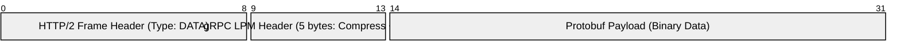

---
tags:
  - networking
  - grpc
  - http2
  - streaming
  - architecture
aliases:
  - gRPC Architecture
  - HTTP/2 Framing
---
# L1.NET.13: gRPC - HTTP/2 Framing, Streaming, Deadlines, Interceptors 

> [!abstract] О лекции
> На уровне Junior разработчик воспринимает gRPC просто как "удаленный вызов функции". На уровне Staff/Expert архитектора gRPC — это сложный бинарный **протокол поверх HTTP/2**, использующий мультиплексирование, жесткое управление окном передачи (Flow Control) и распределенный контекст. Вы обязаны понимать, как `LPM` (Length-Prefixed Message) упаковывается в `DATA` фреймы, почему HTTP-заголовки `Trailers` критичны для обработки ошибок, и как `RST_STREAM` реализует безопасную отмену запросов (Cancellation propagation), спасая кластер от перегрузки.

---
## 1. Анатомия на проводе: HTTP/2 Framing и gRPC

gRPC — это не просто вызов методов. Это **строгая проекция** (mapping) семантики вызова удаленных процедур на транспортные примитивы протокола HTTP/2.

Ключевая концепция архитектуры: **Один логический gRPC вызов = Один HTTP/2 Stream.**
HTTP/2 соединение (физический TCP connection) разделяется на множество виртуальных логических потоков (Streams), каждый из которых имеет уникальный идентификатор (`Stream ID`). Это обеспечивает настоящее **мультиплексирование**: вы можете отправить 100 параллельных запросов внутри одного TCP-сокета, и ответы на них могут приходить в абсолютно любом порядке, не блокируя друг друга (на уровне HTTP, но помните про физический TCP Head-of-Line blocking).

### 1.1. Фаза 1: Инициализация (Request HEADERS)
Абсолютно любой вызов gRPC начинается с отправки клиентом фрейма типа `HEADERS`.

**Техническая деталь: HPACK Compression**
HTTP/2 не шлет заголовки обычным текстом (ASCII), как это делал старый HTTP/1.1. Используется сложный алгоритм **HPACK**.
*   **Static Table:** Индексы для самых частых стандартных заголовков. Например, метод `POST` всегда кодируется одним байтом (индекс 2), схема `https` — индекс 7.
*   **Dynamic Table:** Если вы отправляете кастомный заголовок (например, токен авторизации `authorization: Bearer <jwt>`), он отправляется полностью как строка только один раз. Сервер кеширует его в своей динамической таблице, и во всех следующих запросах этого соединения клиент отправляет только короткий индекс (например, `63`).
   > [!danger] Инсайт эксперта (Утечка памяти / Оверхед)
    > Если ваши клиенты часто меняют метаданные в каждом запросе (например, вы прокидываете уникальный `request-id` или `trace-id` как ключ хедера, а не его значение), динамическая таблица HPACK мгновенно переполняется. Это вызывает постоянную эвикцию (eviction - удаление старых записей) и принудительную повторную отправку полных строк в сеть. Это скрытый источник колоссального оверхеда трафика и CPU.

**Состав HEADERS фрейма (Что летит по сети):**
1.  **Flags:** Флаг `END_HEADERS` установлен (заголовки закончились). Флаг `END_STREAM` **не** установлен (так как за заголовками обязательно последуют данные тела).
2.  **Pseudo-headers (начинаются с двоеточия, обязательны по RFC):**
    *   `:method`: Всегда строго `POST`. gRPC вообще не использует GET, PUT или DELETE.
    *   `:scheme`: `http` (внутри дата-центра) или `https` (снаружи).
    *   `:path`: Формат `/{ServiceName}/{MethodName}`. Это основа роутинга. Nginx или gRPC-сервер смотрит именно сюда, чтобы вызвать нужный хендлер (метод).
    *   `:authority`: Аналог `Host` хедера из HTTP/1.1 (DNS имя целевого сервиса).
3.  **Call Metadata (Специфичные gRPC заголовки):**
    *   `content-type`: Строго `application/grpc` (или вариации `application/grpc+proto`, `application/grpc+json`).
    *   `te`: `trailers`. **Критически важный хедер.** Он сообщает серверу и всем транзитным прокси: "Я (клиент) умею читать трейлеры (хвост запроса)". Если глупый прокси (например, неправильно настроенный старый Nginx) обрежет этот хедер, gRPC сломается, так как итоговый статус вызова передается сервером именно в трейлерах.
    *   `grpc-timeout`: `100m` (миллисекунд), `1S` (секунда). Передача дедлайна вызова по сети.
    *   `grpc-encoding`: `gzip`, `identity`, `snappy`. Указывает, какой алгоритм сжатия *разрешено* использовать для данных payload.

---
### 1.2. Фаза 2: Передача данных (Request DATA & LPM)
После отправки хедеров клиент отправляет тело запроса. Здесь кроется главное архитектурное отличие от REST/JSON.

**Термин: Length-Prefixed Message (LPM)**
gRPC не просто вываливает сериализованный Protobuf в тело HTTP/2 фрейма. Он бережно оборачивает каждое отдельное Protobuf-сообщение в специальный конверт из 5 байт.

**Структура конверта LPM (5 байт Header + Payload):**
*   **Byte 0 (Compression Flag):**
    *   `0`: Данные не сжаты.
    *   `1`: Данные сжаты алгоритмом, который ранее был согласован в `grpc-encoding`.
    *   *Важно:* Это позволяет интеллектуально сжимать *отдельные сообщения* внутри длинного стрима (например, сжать большой JSON, но не сжимать уже сжатую картинку JPEG), а не сжимать весь TCP-стрим целиком.
*   **Bytes 1-4 (Message Length):** Длина последующего сообщения в виде 32-битного Big Endian integer. Максимальный теоретический размер — 4GB, но на практике gRPC фреймворки жестко лимитируют его настройками (обычно 4MB по умолчанию, защита от OOM).
*   **Payload:** Сами бинарные сериализованные байты (Protobuf message).

**Фрагментация HTTP/2 (Frame Sizing):**
Это критично понимать для дебага пакетов.
Протокол HTTP/2 имеет настройку `SETTINGS_MAX_FRAME_SIZE` (по дефолту всего 16KB).
Если ваше одно цельное gRPC сообщение (LPM) весит 100KB:
1.  Оно будет принудительно разбито ядром gRPC на **7 фреймов** типа `DATA`.
2.  Первые 6 фреймов будут ровно по 16KB, последний — остаток.
3.  И только на последнем HTTP/2 фрейме, содержащем хвост последнего сообщения, будет стоять флаг `END_STREAM` (означающий, что клиент закончил отправку данных).



---
### 1.3. Фаза 3: Ответ сервера (Initial HEADERS)
Сервер, получив запрос, подтверждает получение и готовность обрабатывать данные.

*   Сервер шлет свой фрейм `HEADERS`.
*   Устанавливает псевдо-заголовок `:status`: `200`.
   > [!warning] Важнейший нюанс (Коды ошибок)
    > Этот статус `200 OK` на уровне HTTP означает **исключительно** то, что "Я (сервер HTTP/2) успешно получил и понял твой запрос и запустил gRPC хендлер". Это абсолютно **не** означает успех бизнес-операции! Даже если вызов с треском упадет с ошибкой `Permission Denied` или `Internal Server Error`, HTTP статус в заголовках почти всегда будет `200 OK`. Исключение — ошибки на уровне балансировщика L7 или грубые нарушения протокола (тогда вы увидите 4xx/5xx).

---
### 1.4. Фаза 4: Завершение (Trailers HEADERS)
После отправки всех полезных данных (`DATA` фреймов ответа), сервер **обязан** отправить статус завершения операции gRPC. Поскольку заголовки уже были отправлены в начале, статус отправляется отдельным, замыкающим блоком заголовков — **Trailers** (Трейлеры).

*   Сервер шлет финальный фрейм `HEADERS`.
*   Флаги: `END_STREAM` (теперь стрим закрыт полностью со стороны сервера).
*   **Ключевые gRPC-трейлеры:**
    *   `grpc-status`: Числовой код результата (0=OK, 1=CANCELLED, 2=UNKNOWN, 16=UNAUTHENTICATED).
    *   `grpc-message`: ASCII-строка, содержащая сообщение об ошибке (для чтения программистом). На неё нельзя полагаться в логике кода (парсить текст).
    *   `grpc-status-details-bin`: (Опционально). Бинарный `base64` блоб. Содержит структуру `Google.Rpc.Status` (Protobuf) с глубокими деталями ошибки, массивами локализаций, валидационными ошибками полей и стектрейсом.

**Сценарий "Trailers-Only Response" (Короткое замыкание):**
Если ошибка бизнес-логики произошла мгновенно (например, неверный токен авторизации или не пройден Rate Limit), серверу нет смысла посылать начальные заголовки HTTP 200, а потом пустые данные. Сервер сразу отправляет **один единственный** блок `HEADERS`, который содержит одновременно и HTTP статус 200, и gRPC статус ошибки, и флаг `END_STREAM`.
*   Клиентские библиотеки gRPC написаны так, чтобы корректно обрабатывать этот "короткий путь".

---
### Резюме для Архитектора (Выбор транспорта)

1.  **Parsing CPU Cost (Цена процессора):** gRPC не бесплатен. Он требует постоянного парсинга HTTP/2 фреймов (HPACK) + парсинга конвертов LPM + тяжелой десериализации самого Protobuf. Это дешевле текстового JSON, но значительно "дороже" и медленнее (по CPU), чем сырой бинарный TCP-сокет с кастомным протоколом.
2.  **Streaming $eq$ TCP Stream:** Стриминг в gRPC — это последовательность дискретных LPM сообщений. Границы сообщений жестко заданы длиной (4 байта). Вы не можете прочитать "половину сообщения" на уровне приложения — фреймворк gRPC буферизует его целиком в RAM перед тем, как отдать в ваш код. Учитывайте это при стриминге гигантских чанков.
3.  **HTTP/2 Multiplexing Bottleneck:** Мультиплексирование позволяет избежать открытия 100 TCP соединений. Но если вы начнете передавать гигантские файлы через gRPC в одном стриме, эти данные забьют буферы ОС и могут замедлить ("задушить") соседние мелкие, критичные ко времени RPC-вызовы в том же самом TCP-соединении.

---
## 2. Streaming & Flow Control (Backpressure)

Для эксперта Стриминг — это не просто "удобная фича скачивать файлы частями". Это **асинхронный канал с активным управлением скоростью (Flow Control)**.
Главная цель этого механизма — **Backpressure (Обратное давление)**: архитектурный способ заставить слишком быстрого отправителя (Producer) притормозить, если получатель (Consumer) тупит, завис на диске или не успевает парсить данные. Без Backpressure быстрый сервис просто взорвет буферы памяти (OOM) медленному сервису.

### 2.1. HTTP/2 Flow Control: Кредитная система

gRPC не изобретает велосипед. Для Backpressure он нативно использует механизм `Flow Control` из стандарта HTTP/2. Это классическая **кредитная система**.

*   **Initial Window Size:** При установке соединения стороны (клиент и сервер) договариваются о размере окна (по умолчанию очень мало — 65,535 байт). Это ваш стартовый "кредит доверия".
*   **Списание средств:** Когда Отправитель (Sender) отправляет в сеть `DATA` фрейм размером $N$ байт, он немедленно вычитает $N$ из своего доступного кредитного окна.
*   **Блокировка (Throttle):** Если размер окна падает $\le 0$, Отправитель **обязан аппаратно прекратить отправку** новых `DATA` фреймов. Процесс (горутина) блокируется.
*   **Пополнение (Refill):** Когда Получатель (Receiver) *реально вычитывает* данные из своего буфера (приложение вызывает `stream.Recv()`), его ядро gRPC отправляет служебный фрейм `WINDOW_UPDATE`, сообщая Отправителю: "Я освободил $X$ байт, возвращаю тебе кредит, можешь слать дальше".

### 2.2. Двухуровневая защита (Two-Tier Flow Control)
Это критический нюанс HTTP/2, который часто упускают при отладке производительности. Кредитные окна существуют на двух уровнях независимо:

1.  **Stream Level (Уровень логического стрима):** У каждого отдельного RPC-вызова есть своё окно. Если стрим №5 забился (клиент медленно читает данные), он блокируется, но это **никак не влияет** на стримы №7 и №9.
2.  **Connection Level (Уровень физического TCP-соединения):** Есть глобальное окно для всего TCP-соединения (которое мультиплексирует N стримов).
    *   *Сценарий катастрофы:* У вас 100 активных стримов. Каждый посылает по чуть-чуть. Ни один не исчерпал свой личный лимит. НО суммарно они исчерпали *глобальное* окно соединения (Stream 0). В этот момент встанут **ВСЕ 100** стримов.
    *   *Вывод архитектора:* В High-Load системах необходимо выводить в дашборды и мониторить метрику `grpc_server_msg_received_waiting_flow_control` (или аналог в Prometheus).

### 2.3. Взаимодействие Code $\leftrightarrow$ Wire (Сценарий из жизни)

Рассмотрим Server Streaming (клиент качает большой массив данных).

1.  **Server (Producer):** Сервер в цикле `for` делает вызовы `stream.Send(chunk)`.
    *   gRPC runtime смотрит в свое кредитное Window Size.
    *   Если окно $> 0$ $	o$ пишет данные в TCP сокет.
    *   Если окно $0$ $	o$ метод `Send()` **жестко блокируется** (thread block) или переходит в режим ожидания (async/await). Поток сервера "засыпает", экономя CPU.
2.  **Network:** Данные пролетают по сети и ложатся в буферы HTTP/2 на стороне клиента.
3.  **Client (Consumer):**
    *   *Вариант А (Хороший):* Клиент быстро в цикле вызывает `stream.Recv()`. Данные забираются, gRPC мгновенно шлет `WINDOW_UPDATE`, сервер просыпается и шлет следующую порцию.
    *   *Вариант Б (Медленный):* Клиент делает тяжелую ML-обработку каждого чанка. Он не вызывает `Recv()` по 5 секунд. Буферы заполняются. Sender (сервер) получает 0 window size и встает на паузу.
    *   **Результат:** Сервер автоматически, без строчки вашего кода, подстраивается под скорость работы клиента. Никаких переполнений очередей и падений процессов по памяти.

### 2.4. Типологии стриминга и архитектурные нюансы

#### A. Unary (Request/Response)
Да, даже обычный одиночный Unary-вызов под капотом — это стрим. Просто он отправляет один `DATA` фрейм, сразу выставляет флаг `END_STREAM` и ждет ответа. Flow control здесь работает, но редко срабатывает (сообщения обычно меньше дефолтного окна в 64KB).

#### B. Server Streaming / Client Streaming
Классический паттерн "Pipe" (Труба).
*   *Use Case:* Выгрузка таблицы базы данных (Server Streaming) или аплоад огромного файла (Client Streaming).
*   *Особенность:* Backpressure работает ярко выраженно в одну сторону.

#### C. Bidirectional Streaming (Bidi) — Высший пилотаж
Самый сложный тип. Два абсолютно независимых потока данных в обе стороны.

*   **Independent Streams:** Клиент и Сервер могут слать данные в абсолютно любой момент, не дожидаясь "вопрос-ответ".
*   **Синхронизация:** Протокол gRPC **не гарантирует** синхронизацию между отправкой и получением внутри Bidi. Это задача вашего приложения.
    *   *Пример (Chat):* Клиент шлет сообщение. Сервер шлет сообщение. Никто никого не ждет.
   > [!danger] Риск Deadlock'а (Логического Дедлока)
    > Если серверный код написан криво: "Я не прочитаю следующий запрос клиента, пока не отправлю ответ на предыдущий".
    > А клиентский код написан так же: "Я не прочитаю ответ сервера, пока не отправлю следующий запрос".
    > И оба уперлись в лимиты Flow Control (окна забиты).
    > Возникает **Application-Level Deadlock**, оба процесса висят. TCP и HTTP/2 тут не помогут.
    > *Совет архитектора:* В Bidi-стриминге операции чтения (`Recv`) и записи (`Send`) обязаны выполняться в **разных независимых горутинах/тредах** или через мультиплексор событий (`select` в Go).

### 2.5. Tuning: Bandwidth-Delay Product (BDP)

Для эксперта дефолтный размер окна в 64KB — это "детский сад".
На высокоскоростных корпоративных каналах (10 Gbps) с большой задержкой (например, 50ms RTT между дата-центром в США и Европе) дефолтное окно убьет пропускную способность стриминга.

*   **Формула BDP:** $Capacity = Bandwidth 	imes RTT$.
*   *Пример:* 1 Gbps канал, 100ms RTT.
    $10^9 	ext{ bits/s} 	imes 0.1 	ext{ s} = 10^8 	ext{ bits} \approx 12.5 	ext{ Мегабайт}$.
*   Если ваше окно 64KB, вы используете канал на $64KB / 12.5MB \approx \mathbf{0.5\%}$. Сервер будет ждать `WINDOW_UPDATE` 99.5% времени.

**Решение (Dynamic BDP):**
В gRPC есть мощный механизм **BDP Probing (Dynamic Window Sizing)**. Фреймворк может сам "пинговать" канал, математически вычислять BDP и динамически расширять окно HTTP/2 "на лету" до мегабайтов. Архитектор должен убедиться, что эта опция включена (настройки `grpc.KeepaliveParams` и `Initial Window Size`), если система гоняет большие объемы данных через WAN.

---
## 3. Deadlines & Cancellation (Распределенный контроль)

В классическом монолите вызов функции `function_call()` занимает процессорное время, и его очень трудно прервать извне, если пользователь отменил действие. В микросервисной распределенной среде gRPC механизмы **Deadline** и **Cancellation** — это критические паттерны защиты кластера от каскадных сбоев (Cascading Failures). Если клиент (браузер) перестал ждать ответ, сервер **обязан** мгновенно прекратить тяжелую работу, чтобы освободить CPU/RAM для живых клиентов.

### 3.1. Терминология: Timeout vs Deadline
Многие путают эти понятия, но на уровне протокола разница принципиальна.

*   **Deadline (Дедлайн - Метка):** Абсолютная временная метка (например, `2023-10-27 15:00:00.500`), к которой запрос обязан быть завершен. Используется внутри рантайма приложения (например, `context.Deadline()` в Go).
*   **Timeout (Таймаут - Дельта):** Относительная продолжительность времени (например, `500ms`). Используется **исключительно на проводе** (on the wire) для передачи.

**Почему по сети передается Timeout, а не Deadline?**
Передача абсолютного времени (Timestamp) между двумя разными машинами крайне опасна из-за проблемы **Clock Skew** (рассинхронизации аппаратных часов). Даже с идеально настроенным NTP разница между серверами может составлять 5-10 миллисекунд, что критично для Low Latency систем. Сервер А может решить, что дедлайн истек, хотя на сервере Б время еще есть. Поэтому gRPC передает "остаток времени".

**Wire Format (Заголовок `grpc-timeout`):**
Значение передается в HTTP/2 хедере в простом ASCII формате: `Value + Unit`.
*   Примеры: `100m` (100 миллисекунд), `1S` (1 секунда).
*   *Инсайт:* Максимальная точность ограничена 8 цифрами.

### 3.2. Deadline Propagation (Механизм сквозного распространения)

В микросервисной архитектуре дедлайн является **сквозным контекстом** (cross-cutting concern). Он должен течь сквозь всю цепочку серверов.

**Сценарий:** `Frontend` $	o$ `Svc A` $	o$ `Svc B`.
1.  **Frontend:** Разработчик устанавливает дедлайн: "Пользователь не будет ждать дольше 1 секунды".
    *   gRPC клиент отправляет запрос в `Svc A` с хедером `grpc-timeout: 1S`.
2.  **Network:** Запрос идет по сети 50 мс.
3.  **Svc A:**
    *   Получает HTTP хедер `1S`. gRPC Runtime засекает время начала.
    *   Создает локальный `Context` с абсолютным дедлайном `Now() + 950ms` (минус время в сети).
    *   Выполняет свою часть бизнес-логики (которая занимает 200 мс).
    *   Делает исходящий вызов к `Svc B`. Рантайм gRPC вычисляет остаток времени: $950 - 200 = \mathbf{750ms}$.
    *   Отправляет запрос в `Svc B` с новым хедером `grpc-timeout: 750m`.
4.  **Svc B:** Получает запрос. Создает контекст со строгим запасом 750 мс.

> [!danger] Критическая ошибка разработчика (Orphaned Computation)
> Если сервис `Svc A` не прокинет родительский контекст при вызове `Svc B` (например, программист по ошибке сделает `context.Background()`), то `Svc B` начнет "новую жизнь" без таймаутов. Если Frontend отвалится по таймауту, `Svc A` умрет, а вот `Svc B` (и база данных за ним) продолжит жечь процессоры впустую. Это называется "Потерянные вычисления" (Orphaned Computation).

### 3.3. Cancellation: Cooperative Multitasking (Кооперативная отмена)

Отмена запроса в gRPC — это не системный сигнал `kill -9`. Это **кооперативная отмена**. Сервер должен *согласиться* умереть.

**Два базовых сценария прерывания:**
1.  **Deadline Exceeded:** Время истекло по часам. Статус gRPC: `DEADLINE_EXCEEDED (4)`.
2.  **Explicit Cancellation:** Клиент явно передумал (пользователь закрыл вкладку, мобильное приложение ушло в фон). Статус gRPC: `CANCELED (1)`.

**Механика RST_STREAM (На проводе):**
Когда клиент отменяет запрос (или срабатывает локальный дедлайн на клиенте):
1.  Клиент шлет служебный HTTP/2 фрейм **RST_STREAM** (Reset Stream) с кодом ошибки `CANCEL (0x8)`.
2.  Сервер получает этот аппаратный фрейм. Сетевой стек gRPC на сервере мгновенно меняет состояние контекста этого запроса на `Done`.
3.  **Самое важное:** Поток исполнения бизнес-логики (Thread в Java / Goroutine в Go) на сервере **не убивается** магическим образом! Он продолжает работать.

### 3.4. Реализация на стороне сервера (Code Patterns)

Поскольку отмена кооперативная, серверный код **обязан** активно, на каждой итерации, проверять состояние контекста. Без этого механизма Cancellation абсолютно бесполезен.

**Пример (Golang): Select Pattern**
В языке Go отмена реализуется через прослушивание канала `ctx.Done()`.

```go
func (s *server) HeavyCalculation(ctx context.Context, req *pb.Request) (*pb.Response, error) {
    // Этап 1: Быстрая проверка "А нужен ли я еще?" перед началом тяжелой работы
    if ctx.Err() != nil {
        return nil, status.Error(codes.Canceled, "client cancelled")
    }

    // Этап 2: Запуск тяжелого вычисления в отдельном фоне
    resultCh := make(chan Result)
    go func() {
        resultCh <- doExpensiveMath() // Вычисление занимает 5 секунд
    }()

    // Этап 3: Кооперативное ожидание (Race condition между результатом и отменой)
    select {
    case res := <-resultCh:
        // Успех: вычисление завершилось раньше дедлайна
        return &pb.Response{Value: res}, nil
    case <-ctx.Done():
        // Провал: Дедлайн истек ИЛИ Клиент прислал RST_STREAM (отменил)
        // Мы немедленно возвращаем ошибку, освобождая основной поток сервера!
        // Внимание: горутина doExpensiveMath() утечет (leak), если не передать контекст и в неё!
        return nil, status.FromContextError(ctx.Err()).Err()
    }
}
```

**Database Interaction (Главный инсайт Архитектора):**
Самое узкое место любой системы — это база данных. Если gRPC запрос отменен, вы **обязаны** отменить и запущенный SQL запрос в БД.
*   **Правильно:** Использовать драйверы БД с полной поддержкой Context.
    *   Java JDBC: Не поддерживает нативно, но Hibernate/JPA имеют timeout-ы.
    *   Go: `db.QueryContext(ctx, "SELECT ...")`.
    *   PostgreSQL: Драйвер, увидев отмену контекста, пошлет по протоколу команду `PG_CANCEL_REQUEST` (которая сгенерирует сигнал `SIGINT` воркер-процессу Postgres), реально остановив сканирование диска в БД.

### 3.5. Опасность: "Дедлайны по умолчанию" (Defensive Programming)

Мобильные и веб-клиенты часто пишутся лениво, и разработчики не ставят дедлайны (`deadline = Infinity`).
Это прямая уязвимость для DDoS. Один повисший SQL-запрос может занять поток навсегда.

**Защитный паттерн (Server-Side Defaults):**
Архитектор должен использовать Интерсепторы (Interceptors) для принудительной установки "дедлайна по умолчанию" на стороне сервера, если клиент его не прислал.

```java
// Java gRPC Interceptor Example
public <ReqT, RespT> ServerCall.Listener<ReqT> interceptCall(
    ServerCall<ReqT, RespT> call, Metadata headers, ServerCallHandler<ReqT, RespT> next) {
    
    // Проверяем: "Прислал ли клиент хедер grpc-timeout?"
    if (!headers.containsKey(GRPC_TIMEOUT_HEADER)) {
        // Защищаем себя: даем запросу максимум 5 секунд жизни
        Context ctx = Context.current().withDeadlineAfter(5, TimeUnit.SECONDS, scheduler);
        return Contexts.interceptCall(ctx, call, headers, next);
    }
    return next.startCall(call, headers);
}
```

---
## 4. Interceptors (Интерсепторы / Middleware)

Интерсепторы в gRPC — это классическая реализация паттерна **AOP (Aspect-Oriented Programming)**. Это легальный, архитектурно чистый способ внедрить служебную логику (Логирование, Метрики, Авторизацию, Трейсинг) *до* и *после* вызова метода, не загрязняя бизнес-логику самого метода.

В gRPC интерсепторы работают по принципу **"Луковицы" (Onion Model)** или паттерна **Chain of Responsibility**.
*   Управление передается от внешнего (первого) интерсептора ко второму, затем к третьему ... $	o$ **Ваш Handler** (ядро бизнес-логики) $	o$ возврат результатов обратно через третий, второй, первый.
*   **Архитектурное правило:** Порядок регистрации (Chain Order) критичен. Например, интерсептор метрик (Prometheus) должен быть самым **внешним** (первым в цепи), чтобы он мог замерять время *включая* время, затраченное на работу интерсептора авторизации и парсинг токенов.

### 4.1. Server Interceptors: Два разных мира

На сервере механизмы перехвата жестко разделены для одиночных вызовов и для стриминга.

#### A. Unary Server Interceptor
Самый простой и понятный тип. Это обычная функция-обертка.

**Анатомия (на примере Go):**
`func(ctx, req, info, handler)`
1.  **ctx:** Контекст запроса (Deadline, Cancellation signal). Самое важное место для модификации. Здесь вы можете внедрить `User-ID` после проверки токена.
2.  **req:** Уже десериализованный объект запроса (Protobuf Message). Вы можете прочитать его поля или даже подменить объект целиком (опасно).
3.  **info:** Статические метаданные о методе (имя сервиса, имя метода: `/user.UserService/GetUser`).
4.  **handler:** Замыкание (Closure), которое вызывает следующий интерсептор в цепи или финальную реализацию метода.

**Expert Pattern: Context Injection (Внедрение зависимостей)**
Самый частый юзкейс — Authentication Middleware.
1.  Читаем заголовок `Authorization: Bearer <token>` из метаданных (`metadata.FromIncomingContext`).
2.  Идем в базу или проверяем подпись JWT, валидируем токен.
3.  Создаем **абсолютно новый** контекст, вкладывая в него данные пользователя (`context.WithValue(ctx, "user", userData)`).
4.  Вызываем `handler` с этим **новым** контекстом.

```go
// Пример на Go: Enterprise Middleware для логирования и защиты от падения
func RecoveryInterceptor(
    ctx context.Context, 
    req interface{}, 
    info *grpc.UnaryServerInfo, 
    handler grpc.UnaryHandler,
) (resp interface{}, err error) {
    // 1. Pre-processing (До вызова метода)
    start := time.Now()
    
    // Defer для перехвата паники (чтобы баг в коде не уронил весь сервер gRPC)
    defer func() {
        if r := recover(); r != nil {
            err = status.Errorf(codes.Internal, "Panic: %v", r)
            log.Printf("Critical Panic in %s: %v", info.FullMethod, r)
        }
    }()

    // 2. Call Chain
    // Передаем управление дальше внутрь "луковицы". Здесь выполняется бизнес-логика.
    resp, err = handler(ctx, req)

    // 3. Post-processing (После вызова метода)
    // Логируем метод, время выполнения и статус ошибки
    log.Printf("Method: %s, Duration: %v, Error: %v", 
        info.FullMethod, time.Since(start), err)

    // Паттерн: Error Mapping (Маскировка ошибок)
    // Если err содержит сырую ошибку базы данных (SQL syntax error), 
    // мы подменяем её на общую "Internal", чтобы не светить кишки клиенту.
    return resp, err
}
```

#### B. Stream Server Interceptor (Сложность: Высокая)
Здесь 90% архитекторов допускают ошибку при проектировании.
Стриминг-интерсептор вызывается **только один раз** в момент открытия стрима (сразу после получения заголовков). Он **не вызывается автоматически** на каждое пролетающее сообщение (LPM)!

Чтобы перехватывать сами сообщения (`SendMsg`, `RecvMsg`) для логирования или модификации, вы должны применить ООП-паттерн **Decorator (Wrapper)**. Вы должны обернуть стандартный объект `grpc.ServerStream` в свой собственный объект, переопределив его методы.

**Как это работает (схема):**
1.  Клиент открывает стрим (шлет HEADERS).
2.  `StreamInterceptor` перехватывает это событие инициализации.
3.  Вы делаете одноразовые проверки (Auth токена).
4.  Вы создаете кастомную структуру `WrappedStream`, в которую вкладываете оригинальный объект `stream`.
5.  В этой структуре вы переопределяете метод `RecvMsg(m interface{})`.
6.  Вызываете `handler(srv, wrappedStream)`.
7.  Позже, когда ваша бизнес-логика вызовет `stream.Recv()`, она фактически попадет в ваш переопределенный `wrappedStream.RecvMsg()`.

**Пример реализации обертки (Go):**

```go
// 1. Обертка вокруг стандартного стрима
type WrappedStream struct {
    grpc.ServerStream // Встраивание (Embedding) оригинального интерфейса (наследование)
}

// 2. Переопределение метода получения сообщений
func (w *WrappedStream) RecvMsg(m interface{}) error {
    // А: Логика ДО физического получения (например, лимит размера, rate limit)
    
    // Б: Реальное чтение из сети (Blocking call)
    err := w.ServerStream.RecvMsg(m)
    
    // В: Логика ПОСЛЕ получения (например, логирование пэйлоада или валидация)
    if err == nil {
        log.Printf("Received msg in stream: %+v", m)
    }
    return err
}

// 3. Сам интерсептор инициализации
func StreamLoggingInterceptor(
    srv interface{}, 
    ss grpc.ServerStream, 
    info *grpc.StreamServerInfo, 
    handler grpc.StreamHandler,
) error {
    log.Println("Stream opened:", info.FullMethod)
    
    // Создаем обертку
    wrapped := &WrappedStream{ServerStream: ss}
    
    // Передаем ОБЕРТКУ дальше в бизнес-логику вместо оригинального стрима
    err := handler(srv, wrapped)
    
    log.Println("Stream closed:", info.FullMethod)
    return err
}
```

### 4.2. Client Interceptors

На клиенте интерсепторы выполняют роли автоматизации:
1.  **Header Attachment:** Автоматическое и прозрачное добавление `API Key` или `JWT токена` во все метаданные (заголовки) исходящих запросов. Программисту не нужно делать это руками перед каждым `Call()`.
2.  **Retry & Circuit Breaker:** Если сеть моргнула (Transient Failure), клиентский интерсептор может перехватить ошибку и переповторить запрос 3 раза прозрачно для кода приложения (настраивается также через Service Config).
3.  **Client-Side Metrics (Телеметрия):** Замер латентности "глазами клиента" (что включает время на резолв DNS, установку TCP и очередь ожидания HTTP/2, а не только чистую работу сервера).

### 4.3. Опасности и Best Practices [Expert Level]

1.  **Blocking Operations (Убийство производительности):** Интерсепторы выполняются синхронно, прямо в горутине/потоке обработки запроса.
    *   *Ошибка:* Делать тяжелый синхронный запрос в БД (например, проверять сложные права ACL длинным SQL join-ом) внутри интерсептора авторизации.
    *   *Последствие:* Вы добавляете +50мс latency ко **абсолютно всем** вызовам сервера, убивая throughput. Используйте in-memory кэши (Redis/Memcached) для Auth-мидлвар.

2.  **Payload Logging (Утечка PII):**
    Никогда не логируйте объекты `req` и `resp` целиком в продакшене без маскирования (PII/GDPR masking). gRPC часто гоняет огромные бинарники или пароли. Интерсептор — идеальное, централизованное место, чтобы подключить библиотеку маскирования полей Protobuf.

---
## 5. KeepAlive и Connection Management (Балансировка)

В мире gRPC фундаментальное понятие "Соединение" (TCP Channel) и "Запрос" (HTTP/2 Stream) жестко разделены. Один открытый TCP-сокет может годами мультиплексировать миллионы последовательных запросов. Это создает знаменитую архитектурную проблему **L4 Stickiness (Залипание балансировки)**: если "тупой" балансировщик (L4) один раз направил TCP-соединение от клиента на конкретный под (Pod A), то все последующие миллионы RPC пройдут именно на этот Pod A, даже если рядом поднимутся свежие, пустые Pod B и Pod C.

### 5.1. Стратегии жизненного цикла соединений (Life Cycle Policies)

Поскольку клиент всегда стремится держать TCP-соединение вечно (для экономии RTT), Сервер **обязан** принудительно управлять временем их жизни, чтобы дать шанс балансировщикам сети перераспределить нагрузку.

### A. MAX_CONNECTION_AGE и MAX_CONNECTION_AGE_GRACE
Это самый элегантный и надежный способ борьбы с дисбалансом нагрузки (Load Imbalance) без внедрения тяжелых Service Mesh (Istio/Linkerd).

1.  **MAX_CONNECTION_AGE (Абсолютный лимит):** Максимальное время жизни TCP-соединения (например, 30 минут).
2.  **Механизм (HTTP/2 GOAWAY Frame):** Когда таймер (30 минут) истекает, сервер **не разрывает** сокет мгновенно, так как это убило бы текущие запросы клиентов.
    *   Сервер отправляет специальный HTTP/2 фрейм `GOAWAY`.
    *   В этом фрейме сервер указывает поле `Last-Stream-ID`.
    *   **Семантика для клиента (Graceful Drain):** Клиент, получив `GOAWAY`, понимает: "Я (сервер) больше не принимаю *новых* стримов на этом конкретном TCP-соединении. Но я дообработаю те стримы, что мы уже запустили (in-flight)". Клиент послушно открывает новое TCP-соединение фоном для новых запросов.
3.  **MAX_CONNECTION_AGE_GRACE (Время на дожитие):** Период (например, 1 минута), даваемый старым запросам на завершение. Если спустя 1 минуту активные стримы не завершились, сервер посылает `RST_STREAM` и жестко закрывает TCP сокет (`FIN/RST`), убивая зависшие вызовы.

**Пример конфигурации (Go Server):**
```go
kp := keepalive.ServerParameters{
    MaxConnectionAge:      30 * time.Minute, // Каждые 30 мин принудительная ротация соединений
    MaxConnectionAgeGrace: 5 * time.Second,  // Даем 5 сек на завершение текущих RPC
}
s := grpc.NewServer(grpc.KeepAliveParams(kp))
```
**Результат:** Клиенты вынуждены регулярно пересоздавать соединения, что заставляет их заново делать DNS Lookup (забирая новые IP из Service Discovery) и переподключаться к новым подам. Нагрузка выравнивается.

### B. MAX_CONNECTION_IDLE (Сборка мусора)
Если соединение открыто, но по нему не идут RPC запросы, оно тратит ресурсы ОС (память на буферы, файловые дескрипторы, записи в таблицах NAT/Conntrack).
*   Сервер элегантно закрывает соединение (через `GOAWAY`), если оно простаивало без активности дольше заданного времени (например, 5 минут).
*   Это критично для публичных API (Mobile Clients), чтобы не держать миллионы "зомби-сокетов".

---
### 5.2. KeepAlive: Борьба с NAT и "висячими" соединениями (Blackholes)

Самая частая и трудноуловимая проблема в облаках (AWS/GCP) и мобильных сетях: **Silent Connection Drop (Тихий обрыв)**.
Промежуточный Load Balancer или NAT Gateway провайдера имеет внутренний тайм-аут (idle timeout), например, 10 минут. Если по gRPC каналу не бегают данные 11 минут, NAT удаляет запись из своей таблицы трансляции.
*   Клиент *думает*, что TCP-соединение живо (сокет открыт).
*   Клиент отправляет RPC вызов.
*   Пакет уходит в "черную дыру" (NAT его отбрасывает, не отправляя ответный RST).
*   Приложение клиента висит вечность (или пока не сработает TCP Retransmission timeout ОС, что займет ~15 минут).

### Механизм HTTP/2 PING
Для решения этого gRPC использует **Application-Layer KeepAlive** (отправку HTTP/2 PING фреймов), а не полагается на медленный TCP KeepAlive от ядра ОС.
1.  **Time (Интервал):** Как часто слать пинг, если нет данных (например, раз в 30 сек). *Архитектурное правило:* Этот интервал должен быть строго меньше, чем таймаут самого агрессивного NAT на пути.
2.  **Timeout (Ожидание):** Сколько ждать ACK (PONG фрейм) от серверу (например, 5 сек). Если PONG не пришел за 5 секунд — соединение считается мертвым (Dead), клиент переходит в состояние `TRANSIENT_FAILURE` и немедленно начинает реконнект, не дожидаясь ошибки от ОС.

### Ловушка "ENHANCE_YOUR_CALM"
Здесь кроется опасная ловушка для экспертов. По умолчанию многие серверы gRPC жестко блокируют KeepAlive пинги от клиентов, если в данный момент нет активных RPC-стримов (чтобы защититься от DDOS атак "пинг-флудом").

*   **Сценарий ошибки:** Неопытный разработчик клиента настроил агрессивный `KeepAliveTime = 10s`, но серверная настройка `PermitWithoutCalls` равна `false`.
*   Приложение простаивает 10 секунд. Клиент шлет пинг.
*   Сервер видит пинг без активных стримов. Он расценивает это как атаку.
*   Сервер разрывает соединение с ошибкой: `status: RESOURCE_EXHAUSTED`, `description: "too_many_pings"`, `debug_data: "ENHANCE_YOUR_CALM"`.
*   *(Интересный факт: `ENHANCE_YOUR_CALM` — это официальный текстовый код ошибки протокола HTTP/2 (0xB), отсылка разработчиков спецификации к фильму "Разрушитель").*

**Решение:** Синхронизировать настройки. Если вы настраиваете агрессивный пинг на клиентах, вы обязаны разрешить `PermitWithoutCalls = true` на сервере и установить `MinTime` сервера меньше, чем интервал клиента.

---
### 5.3. Балансировка нагрузки (Load Balancing): L4 vs L7 vs Client-side

Чтобы кластер gRPC работал в масштабе и равномерно утилизировал CPU, нужно решить, КТО выбирает целевой бэкенд для *каждого* отдельного RPC запроса.

### L4 Balancing (Connection Level) — "Плохой" вариант
Стандартный Kubernetes Service типа `ClusterIP` (на базе iptables) или AWS NLB (Network Load Balancer).
*   Балансировщик работает на уровне сырых пакетов TCP (маршрутизация 4-tuple).
*   Как только TCP Handshake завершен, балансировщик "забывает" про соединение, просто пересылая байты. Он не видит HTTP/2 фреймы.
*   **Итог (Дисбаланс):** Если у вас 3 пода бэкенда, и один "жирный" клиент (например, другой монолит) установил одно соединение с Подом А, он будет слать 10 000 RPC/sec только в Под А. Поды Б и В будут простаивать с 0% CPU. L4 балансировка для gRPC бесполезна.

### L7 Balancing (Request Level / Service Mesh) — "Правильный инфраструктурный" вариант
Прокси-сервер (Envoy, Nginx с модулем grpc, Istio, Linkerd) аппаратно понимает границы бинарных HTTP/2 фреймов.
*   Он терминирует (расшифровывает) TLS.
*   Он читает заголовки, видит каждый новый `Stream ID`.
*   Он берет Стрим 1 и отправляет его в TCP-соединение к Серверу А, а Стрим 2 — в TCP-соединение к Серверу Б.
*   **Итог:** Идеальная балансировка по запросам (per-request), но ценой добавления extra network hop (лишнего сетевого прыжка) и затрат CPU на проксирование.

### Client-Side Load Balancing (Thick Client / Балансировка на клиенте)
Если вы не хотите внедрять тяжелый Service Mesh, gRPC клиент может сам стать умным балансировщиком ("Толстый клиент").
1.  **Resolver (Обнаружение):** Клиент делает DNS-запрос к Headless Service Kubernetes. Получает список всех IP подов: `[10.0.1.1, 10.0.1.2, 10.0.1.3]`.
2.  **Subchannels (Пулы соединений):** Внутренний объект gRPC Channel (логическое понятие) открывает сразу 3 физических TCP-соединения (Subchannels) — по одному к каждому IP-адресу.
3.  **Picker (Роутер):** Внутри клиентской библиотеки активируется алгоритм (например, Round Robin), который для каждого вашего вызова `client.GetResource()` решает, в какой из трех Subchannels отправить HTTP/2 `HEADERS` фрейм.

**Пример конфигурации (Golang Client):**
```go
// Включаем клиентский Round Robin Load Balancing
conn, err := grpc.Dial(
    "dns:///my-headless-service:8080", // Scheme 'dns' активирует встроенный Resolver
    grpc.WithDefaultServiceConfig(`{"loadBalancingPolicy":"round_robin"}`),
    // ... TLS options
)
```
> *Внимание:* Без магической строки `round_robin`, gRPC-клиент по умолчанию использует политику `pick_first`. Он выберет первый IP из списка DNS, подключится к нему и будет слать 100% трафика только туда, игнорируя остальные поды!

---
## 6. Чек-лист уровня Expert (Для самопроверки)

1.  **Trailers-Only Response (Оптимизация ошибок):**
    Что произойдет на уровне HTTP/2 фреймов, если ошибка (например, нет токена) возникла в интерсепторе мгновенно, до начала обработки и отправки тела (DATA)?
    *   *Ответ:* Сервер сэкономит трафик. Он не будет отправлять стандартный блок `HEADERS (200 OK)` и пустые DATA. Он отправит ровно один блок `HEADERS`, содержащий `:status: 200`, `grpc-status: 16`, `end_stream: true`. Блока `DATA` не будет вообще. Библиотека клиента должна уметь парсить такой "короткий ответ".
2.  **Head-of-Line Blocking (HoL):**
    Решил ли протокол gRPC проблему HoL (блокировки начала очереди)?
    *   *Ответ:* И да, и нет. Он решил её только на уровне приложения (HTTP/2 L7 HoL) благодаря мультиплексированию стримов. Но **TCP L4 HoL** остался. Если потерян один физический TCP-пакет, встанут "намертво" **все** мультиплексированные gRPC стримы внутри этого TCP-соединения, ожидая ретрансмита. Для окончательного решения этой проблемы индустрия переходит на **gRPC over QUIC (HTTP/3)**.
3.  **Error Model (Бизнес ошибки):**
    Почему считается антипаттерном возвращать доменные (бизнес) ошибки приложения (например, "Недостаточно средств") в виде стандартного кода `grpc-status: INVALID_ARGUMENT`?
    *   *Ответ:* `grpc-status` — это узкий набор кодов транспорта/протокола (всего 14 предопределенных кодов), он не предназначен для богатой бизнес-логики. Для передачи деталей (validation errors, debug info, бизнес-коды) архитекторы используют механизм `Google.Rpc.Status` (Rich Error Model). Этот объект со всеми деталями сериализуется в бинарный Protobuf, кодируется в Base64 и прозрачно кладется в специальный HTTP-трейлер `grpc-status-details-bin`.

### Заключение
Понимание gRPC на экспертном уровне [E] означает умение мысленно дебажить систему с помощью `tcpdump` / Wireshark, видя отдельные HTTP/2 фреймы и LPM-префиксы.
Вы знаете, что "зависший" запрос — это часто проблема с недоставленным `WINDOW_UPDATE` (Flow Control), а "отмененный" клиентом запрос требует корректной обработки контекста в коде (`ctx.Done()`), чтобы сервер не жег CPU впустую на осиротевшие вычисления. Вы используете интерсепторы не только для примитивных логов, но и для системного внедрения Distributed Tracing (OpenTelemetry), метрик RED и паттернов Circuit Breaking.