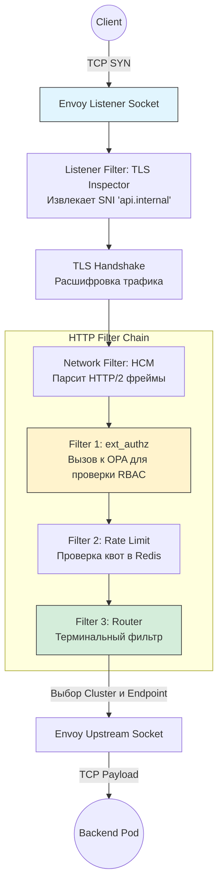

---
tags:
  - networking
  - service-mesh
  - envoy
  - mtls
  - architecture
aliases:
  - Service Mesh Architecture
  - Envoy Deep Dive
---
# L1.NET.14: Service Mesh - Envoy, sidecar, mTLS, xDS APIs 

> [!abstract] О лекции
> Service Mesh (в реализации Envoy / Istio) радикально меняет парадигму разработки. Он агрессивно выносит всю сетевую логику (повторные попытки, Circuit Breaking, шифрование mTLS, телеметрию) из кода самого приложения в независимый инфраструктурный слой. 
> На уровне **Expert Архитектора** недостаточно знать, как написать YAML-манифест. Вы должны понимать:
> 1.  **Threading Model Envoy:** Почему этот C++ сервер не блокируется и как он достигает линейной масштабируемости без мьютексов.
> 2.  **xDS Protocol:** Как обеспечить Eventual Consistency (согласованность конфигурации) в кластере из 10,000 подов за миллисекунды.
> 3.  **Traffic Interception:** Магию ядра Linux (`iptables` / `eBPF`), которая перенаправляет TCP-пакеты в sidecar абсолютно прозрачно для бизнес-приложения.
> 4.  **Performance Cost:** За всю эту абстракцию нужно платить (CPU, Latency, Memory), и архитектор должен уметь это математически квантифицировать.

---
## 1. Envoy Proxy: Анатомия Data Plane (Слой данных)

**Envoy** — это не просто очередной reverse-proxy. Это **высокопроизводительная программируемая сетевая абстракция** (L3/L4 и L7), написанная на современном C++. Его архитектура фундаментально отличается от легаси-серверов вроде классического Nginx (process-based worker model) или старого HAProxy, так как Envoy был спроектирован инженерами Lyft специально для эпохи эфемерных микросервисов, долгоживущих мультиплексированных соединений (HTTP/2, gRPC) и непрерывно меняющейся (dynamic) конфигурации.

### 1.1. Threading Model: Архитектура "Shared Nothing" (Ничего общего)

На уровне Staff Engineer вы обязаны понимать, как именно Envoy утилизирует CPU. Это объясняет, почему он показывает идеальную линейную масштабируемость, но при этом имеет неочевидные нюансы с балансировкой нагрузки (Load Balancing).

1.  **Single Process, Multi-Threaded:**
    *   Envoy всегда запускается как один-единственный системный процесс ОС.
    *   **Main Thread (Control Plane):** Управляющий поток. Он отвечает за старт процесса, чтение конфигурации по сети (xDS gRPC стримы), сбор глобальных метрик со всех воркеров и обработку сигналов ОС (SIGTERM). Важнейшее правило: Main Thread **никогда** не касается ввода-вывода самих пакетов данных. Если этот поток заблокируется (например, на тяжелом парсинге гигантского JSON/YAML конфига), транзитный трафик клиентов не пострадает ни на миллисекунду.
    *   **Worker Threads (Data Plane):** Количество воркеров обычно строго равно количеству выделенных аппаратных ядер процессора (параметр `--concurrency <num_cores>`). Каждый такой поток — это абсолютно изолированный мир.

2.  **Event Loop (Libevent + Epoll):**
    *   Каждый воркер крутит внутри себя свой собственный **Non-blocking Event Loop** (на базе асинхронной библиотеки `libevent`, которая внутри оборачивает сверхбыстрый сисколл `epoll` в Linux).
    *   **Dispatcher:** Объект внутри воркера, который непрерывно мультиплексирует события ввода-вывода (появились данные в сокете для чтения, сокет готов к записи) и срабатывания таймеров.
    *   Вся обработка HTTP-запроса (парсинг заголовков, тяжелый TLS handshake, проход по цепочке фильтров) происходит строго **синхронно** в рамках одного такта этого Event Loop. 
    *   *Следствие:* **Никаких `sleep()`, долгих циклов или блокирующих (blocking I/O) вызовов** в коде фильтров Envoy не допускается! Блокировка воркера хотя бы на 10 мс означает простой целого ядра CPU и мгновенный рост latency для тысяч других TCP-соединений, привязанных к этому ядру.

3.  **Listener Sharding & `SO_REUSEPORT`:**
    *   Как 64 независимых потока слушают один и тот же порт (например, Ingress порт 443) без конфликтов?
    *   Envoy использует опцию сокета ядра Linux **`SO_REUSEPORT`**. Это позволяет каждому воркеру создать свой собственный файловый дескриптор (FD) для одного и того же биндинга `IP:PORT`.
    *   **Kernel Hashing:** Ядро Linux само аппаратно/программно распределяет новые входящие TCP-соединения (пакеты SYN) между этими воркерами, используя математический хеш от 4-tuple (SrcIP, SrcPort, DstIP, DstPort).
    *   **Отсутствие глобального Accept Lock:** Благодаря этому в Envoy полностью решена классическая проблема "Thundering Herd" (когда все процессы одновременно просыпаются и дерутся за один мьютекс, чтобы сделать `accept()` на одном сокете, сжигая CPU).

4.  **Silo Effect (Жесткая изоляция ресурсов):**
    *   Поскольку воркеры не шарят память (Shared Nothing), Envoy работает без блокировок (Mutex/Locks). Но у этого есть цена.
    *   **Connection Pools (Пулы соединений):** Пул открытых TCP-соединений к апстримам (вашим бэкендам) **сугубо локален для каждого потока**.
        *   *Архитектурная ловушка:* Если у вас настроено 10 воркеров Envoy, и вы в конфиге (Circuit Breaker) установили жесткий лимит `max_connections: 1` к сервису внешней БД, в реальности кластер может открыть до **10 соединений** (по 1 на каждый независимый воркер). Лимиты нужно делить на количество ядер!
    *   **Stats (Metrics):** Счетчики Prometheus инкрементируются в `Thread Local Storage (TLS)` без дорогостоящих атомарных операций (`std::atomic`). Main Thread раз в секунду проходит по всем потокам и агрегирует эти цифры для отправки наружу. Это дает экстремальную производительность записи метрик (миллионы инкрементов в секунду без деградации CPU).

> [!danger] Инсайт Архитектора: Дисбаланс долгоживущих соединений
> Если на воркер №1 прилетело "тяжелое" gRPC соединение по скачиванию файла (Elephant flow), а на воркер №2 — 100 легких пингов, ядро Linux не перебалансирует их. Воркер №1 будет загружен на 100%, а №2 будет простаивать. Envoy физически не может "мигрировать" активное TCP-соединение между своими потоками. Это осознанная цена (Trade-off) за сверхбыструю архитектуру без блокировок.

### 1.2. Жизненный цикл пакета: Listener, Network, & HTTP Filters

Envoy обрабатывает сетевой трафик как модульный слоеный пирог (FilterChain). Понимание этой иерархии абсолютно критично для отладки проблем ("на каком конкретно этапе Envoy отбросил пакет с 503 ошибкой?").

#### Терминология Envoy
*   **Downstream (Нижний поток):** Клиент, который подключается к вашему Envoy (Мобильное приложение, Браузер, другой Sidecar Envoy в цепочке).
*   **Upstream (Верхний поток):** Целевой сервис, к которому Envoy проксирует и отправляет запрос (Ваш Backend, База данных).

#### Уровни фильтрации (Слои)

**1. Listener Filters (Pre-Connection / L3-L4):**
Работают с сырыми байтами *до* установления полноценной прикладной сессии (зачастую прямо во время TCP Handshake).
*   *Цель:* Извлечь первичные метаданные для выбора правильной цепочки фильтров из сотен возможных.
*   *Яркий пример:* **TLS Inspector**. Он "подглядывает" в самое начало бинарного пакета `ClientHello` (до начала шифрования), чтобы достать доменное имя **SNI** (Server Name Indication) и желаемый протокол **ALPN** (h2/http1.1). Это позволяет одному процессу Envoy (на одном порту 443) обслуживать разные сертификаты для разных сайтов или роутить бинарный трафик MySQL и текстовый HTTP трафик в совершенно разные цепочки обработки!

**2. Network Filters (L3/L4 TCP/UDP):**
Работают с сырым потоком байт (События сокета: Read/Write).
*   *Цель:* TCP проксирование баз данных, Rate Limiting (ограничение запросов по IP), базовая авторизация на уровне соединений (RBAC L4).
*   *Ключевой фильтр-гигант:* **HTTP Connection Manager (HCM)**.
    *   С точки зрения архитектуры C++, HCM — это просто *один из* Network фильтров. Но внутри он самый сложный. Его задача — вычитывать байты из TCP-буфера, применять нужный парсер (HTTP/1.1 строковый парсер или HTTP/2 бинарный фреймер) и превращать "мертвые байты" в богатую объектную абстракцию "HTTP Request" с заголовками и телом.

**3. HTTP Filters (L7 Application):**
Работают уже с абстракцией Заголовков (Headers), Тела (Body/Data) и Трейлеров (Trailers).
*   Выстраиваются в строгую цепочку (Chain).
*   Имеют две симметричные фазы работы:
    *   **Decode Path (Downstream $	o$ Upstream):** Обработка входящего от клиента запроса.
    *   **Encode Path (Upstream $	o$ Downstream):** Обработка исходящего от сервера ответа (изменение заголовков ответа, сжатие gzip).

#### Пример прохождения пакета сквозь цепочку (Real-world scenario)
Представьте вызов микросервиса: `POST /payment`.



1.  **Downstream (Client) $	o$ Envoy Kernel Socket**
2.  **Listener Filter:** Видит TLS пакет, читает SNI=`api.internal`. Выбирает соответствующий `FilterChain` для этого домена.
3.  **TLS Handshake:** Происходит глубоко в ядре Envoy (на базе библиотек OpenSSL/BoringSSL). Входящий трафик расшифровывается.
4.  **Network Filter (HCM):** Парсит расшифрованный HTTP. Создает C++ объект Request. Запускает HTTP цепочку.
5.  **HTTP Filter 1: External Authz (ext_authz)**
    *   Приостанавливает обработку (асинхронно). Делает быстрый gRPC вызов к OPA (Open Policy Agent) или вашему Auth-сервису.
    *   Если OPA отвечает `403 Forbidden`, фильтр мгновенно обрывает цепочку и возвращает ответ клиенту. Если `OK` — пропускает дальше.
6.  **HTTP Filter 2: Rate Limit**
    *   Проверяет квоты пользователя (например, делая асинхронный вызов к Envoy Rate Limit Service, который опирается на Redis).
7.  **HTTP Filter 3: Router (Terminal Filter / Последняя миля)**
    *   Это всегда последний фильтр в цепочке. Он берет URL `/payment` и смотрит в `RouteTable`.
    *   Находит совпадение: `Cluster: payment-service`.
    *   Выбирает конкретный `Endpoint` (IP-адрес целевого пода) из пула, используя алгоритм балансировки (Round Robin / Least Request).
    *   Сериализует HTTP объект обратно в сырые байты и пишет их в сокет Upstream'а.

### 1.3. Буферизация и Backpressure (Защита от OOM)

На уровне Staff вы обязаны думать о памяти и пределах системы. Что произойдет, если Downstream-клиент шлет данные (например, upload 10 GB видеофайла) со скоростью 1 Gbps, а медленный Upstream-бэкенд может их принимать и писать на диск только со скоростью 10 Mbps?

*   Без защиты прокси-сервер бы забуферизовал все 10 GB в свою оперативную память (RAM) и "упал" с ошибкой OOM (Out of Memory), утащив за собой весь узел.
*   Envoy реализует классический **Flow Control (Backpressure)** через механизм "Watermarks" (ватерлиний).
*   **High Watermark Trigger:** Если внутренний буфер Envoy для этого конкретного стрима заполняется выше установленного лимита (например, достигает 1MB), Envoy осознанно **перестает читать байты из сокета Downstream'а** (перестает вызывать системный `read()` на сокете).
*   **Реакция ОС:** Сетевой TCP-буфер ядра Linux для этого клиента стремительно заполняется.
*   **TCP Window Update:** Ядро Linux, защищая себя, отправляет клиенту-отправителю пакет `Zero Window` (или просто радикально уменьшает `Receive Window`). Клиент аппаратно и физически замедляет отправку пакетов (срабатывает TCP Flow Control).
*   **Результат:** Envoy предотвращает собственный OOM, изящно и прозрачно перекладывая физическое "давление" (backpressure) по цепочке обратно на самого отправителя файла.

### 1.4. xDS: Eventual Consistency (Согласованность в конечном счете)

Envoy — это Data Plane. Он **не ходит** напрямую в API Kubernetes, чтобы узнать об изменениях (появление нового пода). Он ждет, пока Control Plane (например, Istio Pilot/Istiod) пришлет ему готовый скомпилированный "снэпшот" (слепок) мира.
*   Это абсолютно асинхронный, распределенный процесс.
*   В каждый конкретный момент времени разные инстансы Envoy в огромном кластере могут (и будут) иметь *разные* версии конфигурации (разную версию `RouteTable` или разный список IP-адресов). Это нормально.
*   **Drain & Hot Restart (Нулевой даунтайм):** При обновлении бинарного файла самого Envoy (апгрейд версии) или при изменении критических статических параметров, которые нельзя обновить по сети, используется крутой механизм. Запускается второй процесс Envoy. Старый процесс бережно передает новому свои слушающие сокеты (Listeners) через UDS (Unix Domain Socket). Старый процесс перестает принимать новые коннекты, ждет полного завершения всех старых транзакций (Draining) и тихо умирает. Ни одно TCP-соединение пользователя не разрывается (`0-downtime`).

> **Резюме раздела:** Envoy — это математически выверенный, высокоэффективный асинхронный движок для перекладывания байтов с накрученной сложной логикой L7 поверх него. Его абсолютная сила заключается в архитектуре без блокировок (C++ Event Loops). Его главная слабость — в чудовищной кривой обучения и невероятной сложности диагностики для новичка, когда что-то идет не так глубоко внутри бесконечной цепочки фильтров или при взаимодействии с буферами ядра ОС.

---
## 2. Sidecar Pattern и перехват трафика (Traffic Interception)

В классической архитектуре Kubernetes (например, в Istio Service Mesh до появления архитектуры Ambient без сайдкаров) в каждом вашем Поде (Pod) живут два контейнера: ваше бизнес-приложение (`app`) и инфраструктурный прокси (`istio-proxy` / Envoy). 
Они делят один общий **сетевой намспейс (Network Namespace)**. Это значит, что для операционной системы у них на двоих один IP-адрес (`PodIP`), один стек TCP/IP, один `localhost` и одна общая таблица правил `iptables`.

**Фундаментальная задача Mesh:** Ваше Java-приложение делает тривиальный вызов `connect("192.168.1.50", 80)` (обращается к другому микросервису). Как заставить этот TCP-пакет магическим образом "повернуть" и попасть в процесс Envoy, который тихо слушает порт `localhost:15001`, при этом **не меняя ни единой строчки кода** самого бизнес-приложения?

### 2.1. Инициализация: `istio-init` и системные привилегии
До старта вашего Java/Go контейнера и до старта самого Envoy, Kubernetes запускает специальный **Init Container** (в Istio он называется `istio-init`). 
Этому одноразовому контейнеру выдаются высокие системные привилегии (`CAP_NET_ADMIN`), чтобы он имел право модифицировать правила фаервола `iptables` внутри изолированного неймспейса пода.
Он настраивает жесткий перехват: он переписывает цепочки `PREROUTING` (для входящего трафика) и `OUTPUT` (для исходящего трафика) в таблице `nat`.

**Ключевое архитектурное правило (The UID Exclusion - Защита от бесконечных петель):**
Если мы завернем *все* исходящие пакеты пода в Envoy, то когда сам Envoy попытается отправить пакет наружу (настоящему адресату), `iptables` снова "завернет" его пакет обратно в Envoy. Возникнет бесконечный Routing Loop (петля), и пакет умрет по TTL.
*   *Гениальное решение:* Процесс Envoy запускается под жестко заданным, специальным пользователем с выделенным UID (в Istio по умолчанию это UID `1337`).
*   Правило `iptables` формулируется так: "Если пакет создан процессом, владельцем которого является **UID 1337** — не трогай его, пропусти наружу как есть (`RETURN`). А вот абсолютно все остальные TCP-пакеты от других процессов (то есть от вашего приложения) — жестко заверни в порт Envoy".

### 2.2. Механика обмана: `REDIRECT` и `SO_ORIGINAL_DST`
Это самый тонкий момент низкоуровневой магии, на котором сыплются на архитектурных интервью.

1.  **Intercept (Физический перехват):**
    Приложение (Java) отправляет пакет, адресованный на `192.168.1.50:80`.
    `iptables` (в цепочке `OUTPUT`) ловит этот пакет на лету, проверяет правило и делает жесткий `DNAT` (Destination NAT) с помощью цели `REDIRECT` на локальный адрес `127.0.0.1:15001`.
    *В эту микросекунду Destination IP пакета заменяется ядром ОС с целевого на локальный.*

2.  **Listener Acceptance (Прием в Envoy):**
    Envoy честно слушает порт `15001`. Ядро передает ему TCP-соединение.
    **Проблема (Потеря контекста):** Envoy видит входящее соединение от приложения, но на уровне сокета пакет адресован на локальный `127.0.0.1`. Как бедному Envoy узнать, с кем *на самом деле* хотело соединиться приложение (`192.168.1.50`)? Если он не восстановит этот оригинальный IP, он не сможет выбрать правильный Upstream кластер маршрутизации и не сможет проверить mTLS сертификат!

3.  **The Magic Syscall (Восстановление истины):**
    Envoy использует специальную, малоизвестную опцию сокета ядра Linux — **`SO_ORIGINAL_DST`**.
    Вызывая сисколл `getsockopt(fd, SOL_IP, SO_ORIGINAL_DST, ...)`, Envoy буквально спрашивает у модуля netfilter ядра ОС: "Я знаю, что ты подменил адрес. Скажи мне, какой был Истинный Destination Address у этого пакета *до* того, как ты применил к нему правило NAT?".
    Ядро ищет запись в своей локальной таблице трансляций **conntrack** и честно возвращает Envoy исходный кортеж `192.168.1.50:80`.

4.  **Virtual Listener Matching:**
    Получив реальный целевой IP и порт, Envoy идет в свою загруженную конфигурацию (LDS) и ищет там подходящий виртуальный обработчик (Virtual Listener), чтобы правильно применить бизнес-логику к этому запросу.

### 2.3. TPROXY vs REDIRECT (Нюанс уровня Expert)
В Linux существует два фундаментальных метода перехвата трафика для прокси:
1.  **REDIRECT (DNAT):** То, что подробно описано выше. Метод меняет IP пакета. Он надежен, прост, но при нем теряется часть контекста (например, сложнее работать с прозрачным пробросом Source IP клиента в сложных цепочках).
2.  **TPROXY (Transparent Proxy - Прозрачный прокси):** Более современный и продвинутый модуль ядра.
    *   Он позволяет процессу Envoy создать слушающий сокет со специальным флагом `IP_TRANSPARENT`.
    *   `iptables` (или правила маршрутизации `ip rule`) **не меняют** IP-адрес назначения в самом пакете! Они просто ставят на пакет внутреннюю метку ядра (fwmark) и искусственно маршрутизируют его прямо в локальный сокет Envoy.
    *   **Зачем это Архитектору:** Этот метод позволяет сохранить исходные Destination и Source IP пакета абсолютно нетронутыми в IP-заголовке. Это критически важно для некоторых сложных корпоративных сетевых политик, работы UDP-протоколов и значительно упрощает отладку (tcpdump показывает реальные IP, а не сплошные коннекты на 127.0.0.1). Современные версии Service Mesh (Cilium, Istio) активно мигрируют на `TPROXY` по умолчанию.

### 2.4. Loopback Hell: Налог на производительность (The Sidecar Tax)
Архитектор обязан ясно понимать "физический" путь каждого байта данных в системе. В архитектуре Sidecar каждый пакет проходит через тяжелый стек TCP/IP ядра ОС **трижды** (вместо одного раза в мире без Mesh):

1.  **App $	o$ Kernel:** Ваше приложение пишет байты в сокет. Пакет проходит полный путь сквозь стек TCP/IP (формирование сегментов, вычисление чексумм).
2.  **Kernel $	o$ Envoy (Inbound):** `iptables` заворачивает пакет на Loopback. Envoy читает его. Это вызывает дорогостоящее переключение контекста (Context Switch) из режима Kernel в режим User-space.
3.  **Envoy Processing:** Envoy парсит HTTP, прогоняет через фильтры, выбирает маршрут, зашифровывает в mTLS.
4.  **Envoy $	o$ Kernel (Outbound):** Envoy пишет зашифрованные байты в абсолютно другой (исходящий) сокет. Пакет **СНОВА** проходит весь стек TCP/IP ядра с нуля.
5.  **Kernel $	o$ Network Interface:** Реальная отправка пакета в физический кабель (или виртуальный veth).

**Горький итог:** Увеличение Latency на 2-3 миллисекунды на каждый прыжок (на пустом месте) и значительный рост потребления CPU (до +30-50% оверхеда) исключительно на бесполезное перекладывание одних и тех же байтов между буферами сокетов в ядре (Socket Buffer Copying).

### 2.5. eBPF: Socket Splicing (Будущее оптимизации)
Новые прорывные технологии вроде **Cilium Service Mesh** или **Istio Ambient Mesh (компонент ztunnel)** используют технологию ядра **eBPF**, чтобы полностью устранить этот чудовищный "налог".

**Механизм `sock_ops` и `sk_msg` (Магия eBPF):**
Специальная eBPF-программа (написанная на C и загруженная прямо в ядро Linux) прикрепляется к событиям создания сокетов.
Когда eBPF-ядро обнаруживает, что два сокета (сокет вашего приложения и сокет локального Envoy-сайдкара) находятся на одной физической ноде/поде и логически "связаны" между собой для перехвата:
*   eBPF использует прием **Socket Splicing (Short-circuiting - Короткое замыкание)**.
*   Байты данных копируются **напрямую** из буфера передачи (TX buffer) сокета приложения в буфер приема (RX buffer) сокета Envoy.
*   **Революционный результат:** Полный и абсолютный обход гигантского стека TCP/IP и правил `iptables`. Пакет больше не дробится на сегменты, для него не вычисляются TCP контрольные суммы, он не проходит через ресурсоемкий модуль `conntrack`. Данные "телепортируются" между процессами.
*   **Выигрыш для бизнеса:** Производительность обмена (Throughput) вырастает почти до уровня "прямого сетевого соединения без прокси", при этом сохраняя все функции L7 фильтрации Envoy!

### Пример конфигурации для глубокого понимания (`iptables -L`)
Если вы, как эксперт, зайдете внутрь любого пода с Istio (командой `kubectl exec -it <pod> -c istio-proxy -- sudo iptables -t nat -L`), вы увидите примерно следующую картину:

```bash
# Цепочка OUTPUT перехватывает весь исходящий трафик пода
Chain ISTIO_OUTPUT (1 references)
target     prot opt source               destination
RETURN     all  --  anywhere             anywhere             owner UID match 1337  <-- ВАЖНО: Исключение пакетов самого Envoy! Летите на свободу!
ISTIO_REDIRECT  all  --  anywhere        anywhere             <-- Заворот абсолютно всего остального трафика (от приложения) в ловушку

# Цепочка перенаправления (Ловушка)
Chain ISTIO_REDIRECT (1 references)
target     prot opt source               destination
REDIRECT   tcp  --  anywhere             anywhere             tcp dpt:!15001 redir ports 15001 <-- Принудительный DNAT на порт Envoy
```

**Резюме для архитектора:**
Вся "магия" классического Service Mesh держится на трех костылях ОС: `iptables` (для агрессивного захвата), `SO_ORIGINAL_DST` (для восстановления утерянного контекста назначения) и исключении по UID (для предотвращения смертельных петель). Глубокое понимание этого механизма абсолютно необходимо, чтобы мгновенно диагностировать проблемы вида "почему мой UDP/ICMP трафик не попадает в Mesh?" (Потому что правило `REDIRECT` в Istio по умолчанию работает *только* с TCP, если не настроен TPROXY/eBPF) или "откуда у нас взялось 5ms latency на локальных вызовах?" (Тройной проход по стеку ядра ОС).

---
## 3. xDS APIs: The Universal Data Plane API (Протокол синхронизации)

**xDS (Discovery Service API)** — это не просто набор скучных REST-ручек для скачивания конфигов. Это мощный, стандартизированный, асинхронный (streaming-based) протокол, созданный для достижения **Eventual Consistency** (согласованности в конечном счете) между единым Control Plane (CP, «мозгом» кластера, например Istiod) и десятками тысяч инстансов Data Plane (DP, Envoy proxy).

### 3.1. Механизм транспорта: gRPC Streams (Потоки)

В отличие от традиционных устаревших поллинговых систем (когда агент раз в минуту скачивает конфиг, как Nginx reload или Consul Template), протокол xDS работает исключительно поверх **постоянных, долгоживущих двунаправленных gRPC стримов (Bidirectional streams)**. Это дает задержку обновления конфига во всем кластере в единицы миллисекунд.

**Цикл запроса-ответа (The Protocol Dance):**
1.  **DiscoveryRequest (Envoy $	o$ Control Plane):** Envoy отправляет запрос, содержащий:
    *   `node_id`: Строгая идентификация "Кто я?" (например, метаданные: `sidecar~10.1.1.2~payment-service~cluster.local`).
    *   `version_info`: "Какая версия конфигурации применена у меня прямо сейчас?" (пусто при старте).
    *   `resource_names`: "На какие конкретно ресурсы (Cluster X, Route Y) я хочу подписаться?".
    *   `nonce`: Токен последней успешной транзакции (используется для подтверждений ACK/NACK).
2.  **DiscoveryResponse (Control Plane $	o$ Envoy):** CP "пушит" (push) обновление в открытый стрим, как только конфигурация в K8s меняется.
    *   `resources`: Сами скомпилированные объекты конфигурации (Listeners, Clusters...).
    *   `version_info`: Новая глобальная версия (например, хеш коммита или UUID: `v2`).
    *   `nonce`: Уникальный ID этого ответа (сессия транзакции).
3.  **ACK (Успех: Envoy $	o$ CP):** Если Envoy смог успешно распарсить и применить конфиг в памяти, он шлет новый `DiscoveryRequest`, в котором указывает `version_info` = `v2`. CP понимает, что узел обновлен.
4.  **NACK (Отказ: Envoy $	o$ CP):** Если новый конфиг валиден синтаксически (YAML правильный), но **неверен логически** (например, в Route правиле есть ссылка на удаленный или несуществующий Cluster), Envoy отвергает его! Он шлет `DiscoveryRequest` с **предыдущей** рабочей (stable) `version_info` (`v1`) и заполняет поле `error_detail` текстом ошибки.

> [!check] Инсайт эксперта (Безопасность конфигураций)
> Механизм NACK — это гениальная защита. Он позволяет Control Plane мгновенно (по дашбордам метрик) узнать, что 5 из 10,000 подов "подавились" вашим новым релизом конфигурации (Configuration Rejection). Главное — Envoy **продолжит работать на старой, рабочей конфигурации (`v1`)**, он не переведет живой трафик пользователей на сломанную топологию и не уронит продакшн.

---
### 3.2. Таксономия и Граф Зависимостей (The Big Four - Большая Четверка)

Все ресурсы xDS образуют строгий направленный граф зависимостей. Envoy физически не может "слушать порт" (LDS), пока не знает, по каким правилам роутить трафик (RDS), а роутить нельзя, пока не описаны целевые кластеры (CDS). Порядок загрузки ресурсов критичен.

#### 1. LDS (Listener Discovery Service) — Врата (Точка входа)
Отвечает на фундаментальный вопрос: **"На каких портах (сокетах) мне слушать трафик и как парсить приходящие байты?"**
*   Содержит биндинг IP:Port (например, `0.0.0.0:80`).
*   Определяет всю цепочку фильтров (Filter Chains) для этого порта.
*   **Архитектурный пример:** "Открой сокет на 80 порту, повесь на него `http_connection_manager` (HCM), настрой в нем таймауты и скажи ему искать правила маршрутизации в ресурсе RDS с именем `local_route`".

#### 2. RDS (Route Discovery Service) — Логика ветвления (L7)
Отвечает на бизнес-вопрос: **"В какой логический кластер микросервисов я должен отправить запрос `GET /api/v1/users`?"**
*   Определяет Virtual Hosts (домены, например `service-a.com`).
*   Содержит Routes (правила матчинга по префиксам URI `/api`, по регулярным выражениям, по HTTP-заголовкам).
*   Управляет Traffic Splitting (Canary deployment: "отправь 90% веса трафика на кластер `v1`, а 10% на кластер `v2`").
*   Результатом успешного матчинга всегда является **имя кластера** (простая строка), а не IP адрес!

#### 3. CDS (Cluster Discovery Service) — Описание Апстрима (Топология)
Отвечает на вопрос: **"Как именно мне общаться и настраивать пул соединений для логического кластера с именем `backend-v1`?"**
*   Здесь задаются таймауты TCP-соединений, настройки Keep-Alive, параметры mTLS сертификатов для этого конкретного сервиса.
*   **Circuit Breakers (Предохранители):** Максимальное количество соединений, максимальное число пендинг реквестов в очереди (защита от перегрузки).
*   **Load Balancing Policy:** Как балансировать внутри кластера (Round Robin, Least Request, Maglev Hash).
*   Тип Discovery: Откуда брать IP адреса? Типы `STATIC` (захардкожено), `STRICT_DNS` (Envoy сам резолвит DNS) или `EDS` (спросить у Control Plane).

#### 4. EDS (Endpoint Discovery Service) — Динамика физических IP
Отвечает на конкретный вопрос: **"Какие именно физические IP-адреса и порты в эту секунду соответствуют логическому кластеру `backend-v1`?"**
*   Это самая высоконагруженная и "шумная" (часто изменяемая) часть xDS. EDS меняется при каждом автоскейлинге (HPA), редеплое пода или падении узла.
*   Содержит список объектов `LbEndpoint` (IP + Port + Метаданные зоны доступности + Статус здоровья `HealthStatus`).

---
### 3.3. Визуализация Конфигурации (Связь сущностей)

Чтобы кристально ясно понять связь, проследим путь конфигурации (написанной на YAML, хотя Envoy потребляет бинарный Protobuf).

**1. LDS (Listener):**
```yaml
name: listener_0
address: { socket_address: { address: 0.0.0.0, port_value: 80 } }
filter_chains:
  - filters:
      - name: envoy.filters.network.http_connection_manager
        typed_config:
          # Жесткая ссылка на ресурс RDS с именем "local_route"
          rds: { route_config_name: "local_route", config_source: { ads: {} } }
```

**2. RDS (Route):**
```yaml
name: local_route
virtual_hosts:
  - name: backend_service
    domains: ["*"] # Ловим любой домен
    routes:
      - match: { prefix: "/api" }
        # Если URL начинается с /api, направить в логический кластер (CDS)
        route: { cluster: "my_backend_cluster" } 
```

**3. CDS (Cluster):**
```yaml
name: my_backend_cluster
type: EDS # Мы не пишем IP здесь. Мы говорим Envoy: "Спроси IP у EDS"
connect_timeout: 0.25s
eds_cluster_config:
  eds_config: { ads: {} }
```

**4. EDS (Endpoint):**
```yaml
cluster_name: my_backend_cluster
endpoints:
  - lb_endpoints:
      # Реальные физические адреса подов
      - endpoint: { address: { socket_address: { address: 10.1.2.3, port_value: 8080 } } }
      - endpoint: { address: { socket_address: { address: 10.1.2.4, port_value: 8080 } } }
```

---
### 3.4. ADS (Aggregated Discovery Service): Проблема гонки и согласованности

В асинхронной распределенной системе вы физически не можете гарантировать, что новые ответы RDS и CDS придут по сети одновременно, если они передаются по разным TCP/gRPC стримам.

**Сценарий смертельной гонки (Race Condition):**
1.  DevOps применяет новый Canary манифест в Istio.
2.  Envoy получает по стриму новый RDS: "Теперь шли 10% трафика на новый логический кластер `payment-v2`".
3.  Envoy послушно применяет RDS. В эту же миллисекунду приходит запрос от клиента на оплату.
4.  Envoy по правилу ищет кластер `payment-v2`.
5.  Но пакет CDS с техническим описанием кластера `payment-v2` **еще не прилетел** (застрял в сети). Кластера нет в памяти Envoy!
6.  **Результат для бизнеса:** Клиент получает ошибку `503 Service Unavailable` (no cluster match).

**Инженерное Решение (ADS):**
Внедряется Aggregated Discovery Service (ADS). Envoy открывает **один единственный** gRPC стрим для передачи *абсолютно всех* типов ресурсов (LDS/RDS/CDS/EDS) вперемешку.
Control Plane (Istiod), обладая глобальными знаниями графа зависимостей, гарантирует строгий порядок отправки (Ordering):
1.  Сначала шлем `CDS` (Даем команду создать оболочку кластера `payment-v2`).
2.  Затем шлем `EDS` (Наполняем оболочку `payment-v2` живыми IP-адресами).
3.  В самом конце шлем `LDS/RDS` (Начинаем маршрутизировать реальный трафик туда).
Эта секвенция реализует фундаментальный принцип безопасных систем **"Make before Break"** (Сначала создай новое, потом ломай/переключай старое).

---
### 3.5. SotW vs. Delta xDS (Битва за масштабируемость)

*   **SotW (State of the World - Состояние всего мира):** Изначальный и самый простой подход. Если в кластере из 5000 подов один под `backend-v1` перезагрузился (сменил IP), Control Plane формирует и шлет Envoy *весь* гигантский массив из 5000 эндпоинтов для этого кластера целиком.
    *   *Катастрофическая проблема:* Сетевой трафик и нагрузка на парсинг в CPU растут по экспоненте $O(N^2)$ при масс-рестартах или скейлинге крупных кластеров.
*   **Delta xDS:** Современный индустриальный стандарт. CP шлет только инкрементальные обновления (патчи диффов):
    *   `resources_to_add`: `[Добавить endpoint_X (новый под)]`
    *   `resources_to_remove`: `[Удалить endpoint_Y (убитый под)]`
    *   Envoy поддерживает у себя в памяти локальный кэш "Состояния мира" и просто применяет к нему этот легкий патч.
    *   *Вердикт:* Это единственная причина, почему Service Mesh физически способен работать в кластерах Kubernetes с 10,000+ подов, где постоянное "дрожание" (pod churn / автоскейлинг) при старом подходе генерировало бы гигабиты паразитного конфигурационного трафика.

### 3.6. Внутренняя архитектура Control Plane (Для контрибьюторов)

Для Staff Architect важно понимать не только Envoy, но и как писать свой собственный Control Plane (или как тюнить Istiod/Kuma):
*   **Snapshot-based (На основе снимков):** CP генерирует полный, тяжелый снимок (Snapshot) конфигурации для всей сети сразу, версионирует его и кладет в кэш. Envoy-клиенты просто забирают последнюю версию снимка. Это легко запрограммировать, но это сжирает гигабайты памяти на сервере CP при большом количестве уникальных сайдкаров.
*   **Incremental / On-demand (Ленивая генерация):** CP генерирует конфиг *лениво* и индивидуально. Только когда конкретный Envoy (указав `resource_names` в своем gRPC запросе) явно попросил данные о кластере X (потому что к нему пошел трафик), CP вычисляет маршруты для X и отдает. Это невероятно сложно реализовать без багов и дедлоков, но это абсолютно необходимо для гипер-масштабирования (hyper-scale) уровня Google/AWS.

---
## 4. mTLS & Identity: Архитектура SPIFFE и Zero Trust Networks

В традиционной сетевой безопасности (Perimeter Security / Модель Замка и Рва) "доверие" определялось физической сетевой топологией: "Если пакет с Source IP-адресом `10.0.1.5` пришел из доверенной подсети `Private-VLAN-Backend`, значит, это точно наш безопасный сервер базы данных, пропускаем". 
В облаках и кластерах Kubernetes, где IP-адреса эфемерны, постоянно переиспользуются, а поды разных команд хаотично мигрируют (переезжают) между физическими нодами, этот подход (IP-based security) мертв.

Service Mesh реализует парадигму **Zero Trust** (Никому не доверяй) через открытый стандарт **SPIFFE** (Secure Production Identity Framework For Everyone). В этой концепции Идентичность (Identity) — это не IP-адрес и не строчка в ACL брандмауэра. Идентичность — это строгий криптографический документ.

### 4.1. SVID: Паспорт процесса

**SVID (SPIFFE Verifiable Identity Document)** — это защищенный документ, безоговорочно удостоверяющий личность работающего микросервиса. В контексте Envoy, Istio и 99% реализаций Service Mesh SVID представляет собой стандартный криптографический сертификат формата **X.509** (TLS-сертификат).

**Ключевое отличие mTLS Mesh от публичного HTTPS:**
В обычном интернете (при заходе на Google или Amazon) идентичность сервера проверяется браузером по полю сертификата `Subject: CN` (Common Name) или расширению DNS SAN (Subject Alternative Name). 
В закрытом Service Mesh идентичность кодируется в совершенно другом, специальном расширении сертификата — **URI SAN** (Uniform Resource Identifier Subject Alternative Name).

**Структура SPIFFE ID (Формат строки):**
```text
spiffe://<trust_domain>/<workload_identifier>
```
*   **Trust Domain (Домен доверия):** Уникальная область, управляемая единым корневым центром сертификации (Root CA). Например, `prod.aws.mycompany.com` или стандартный `cluster.local` в K8s. Сервисы из разных доменов доверия по умолчанию не доверяют друг другу; для их общения требуется явная настройка федерации (Trust Bundles).
*   **Workload Identifier (Идентификатор нагрузки):** Логический путь, уникально определяющий сервис. В Kubernetes этот путь обычно жестко и криптографически привязан к объекту **Service Account** пода.

**Практический пример (Kubernetes):**
Если у вас есть под в неймспейсе `billing`, запущенный от имени K8s Service Account `payment-processor`, его уникальный SPIFFE ID (зашитый в его TLS-сертификат) будет выглядеть так:
`spiffe://cluster.local/ns/billing/sa/payment-processor`

> **Инсайт Эксперта Безопасности:** Во время двустороннего mTLS рукопожатия (когда и клиент проверяет сервер, и сервер проверяет клиента), прокси Envoy **вообще не обращает внимания на HTTP заголовок "Host"** или IP-адрес. Он извлекает этот `URI SAN` из криптографического сертификата пира и жестко сверяет его с декларативной политикой авторизации (AuthorizationPolicy в Istio). Это делает физически невозможными любые атаки типа "Man-in-the-Middle" (MITM) или подделку (Spoofing) заголовков, так как подделать криптографическую подпись Root CA невозможно.

### 4.2. Workload Attestation: Как доказать, кто ты такой?

Самый сложный и уязвимый вопрос архитектуры: откуда "глупый" Envoy (сайдкар в поде) получает этот сверхсекретный сертификат с правильным `spiffe://` ID? Envoy не имеет права и не умеет генерировать его сам. Это делает внешний доверенный компонент — **SPIRE Agent** (или `pilot-agent` в архитектуре Istio), который работает как DaemonSet на уровне физической Node (сервера).

Процесс безопасной выдачи сертификата называется **Attestation (Аттестация)**:

1.  **Workload API Call:** Когда Envoy стартует, он стучится в локальный Unix Domain Socket (UDS), который расшарен с хоста и который слушает Агент. Envoy умоляет: "Привет, я новый процесс, дай мне мою идентичность и сертификат!".
2.  **Kernel Introspection (Допрос ядра):** Агент (SPIRE) никому не верит на слово. Агент обращается напрямую к ядру ОС Linux (через вызов `getsockopt` с флагом `SO_PEERCRED`), чтобы безошибочно узнать системный **PID** (ID процесса) того, кто стучится в сокет с другой стороны.
3.  **Selectors Discovery (Сбор улик):** Зная точный PID, Агент начинает расследование на уровне хоста:
    *   В каком Linux Cgroup (контрольной группе) запущен этот PID?
    *   К какому Docker/Containerd Container ID принадлежит этот Cgroup?
    *   Какие у этого процесса Environment Variables (переменные окружения)?
    *   (В случае K8s) Агент обращается к Kubelet или API Server кластера: "Скажи мне, какому логическому Pod-у в кластере соответствует этот физический Container ID, в каком неймспейсе он живет и какой Service Account к нему привязан админом?".
4.  **Signing (Вынесение вердикта):** Если все собранные "улики" (селекторы) идеально совпадают с политиками регистрации, Агент генерирует пару ключей (или берет CSR-запрос от Envoy), просит центральный Server CA подписать этот SVID сертификат и **безопасно отдает его Envoy прямо в память** через сокет.

**Почему этот механизм гениален:** Если злоумышленник через уязвимость (RCE) захватит соседний контейнер на ноде и запустит там вредоносный bash-скрипт, который постучится в тот же сокет Агента с криком "Дай мне сертификат супер-админа!", Агент откажет. Ядро Linux сообщит Агенту, что PID вредоносного скрипта принадлежит совершенно другому cgroup и service-account, у которого нет прав на этот сертификат. Идентичность математически привязана к инфраструктуре.

### 4.3. SDS (Secret Discovery Service) vs File Mounts (Файлы)

На уровне Staff Architect и DevSecOps вы должны строго **запрещать** монтирование любых приватных ключей и сертификатов через физические файлы (даже через Kubernetes Secrets).

**Почему файлы (File Mounts) — это зияющая дыра в безопасности:**
1.  **Risk at Rest (Угроза покоя):** Приватный ключ физически лежит на диске файловой системы (пусть это даже виртуальный RAM-диск `tmpfs`). Если злоумышленник получит ограниченный доступ к чтению ФС (через уязвимость Path Traversal в приложении или скомпрометировав ноду), он просто скопирует файл `tls.key` и украдет личность сервиса навсегда.
2.  **Rotation Lag (Задержка ротации):** Сертификаты в Mesh "живут" очень недолго (часы или минуты). Чтобы обновить сертификат в файле Kubernetes Secret, требуется время на синхронизацию Kubelet, а Envoy должен использовать глючный `inotify` (сигнал ядра об изменении файла), который часто не срабатывает. Приходится перегружать Envoy (Hot Restart).
3.  **Race Conditions:** Есть риск, что Envoy начнет читать файл ровно в ту микросекунду, когда оркестратор будет его перезаписывать. Envoy прочитает битый ключ и упадет.

**Enterprise Решение: SDS (Secret Discovery Service)**
SDS — это специализированный gRPC API в рамках протокола xDS Envoy.
1.  Envoy при старте подписывается на ресурс типа `secrets` по gRPC каналу.
2.  Доверенный Агент (SPIRE/Istiod) "пушит" готовую пару (Ключ + Сертификат) **напрямую в защищенное виртуальное адресное пространство (RAM)** процесса Envoy через сетевой стрим. Файлы на диске не создаются вообще.
3.  При ротации сертификата (каждые 12-24 часа) Агент просто пушит новый набор байт в стрим.
4.  Envoy атомарно (за 1 такт) переключает внутренний `SSL Context` на новые ключи. Активные TCP соединения не разрываются, все новые коннекты мгновенно начинают использовать свежий сертификат.
**Результат:** Приватный ключ **никогда** не касается диска сервера. Это жесткое требование для прохождения строгих аудитов безопасности (FIPS 140-2, PCI-DSS в банковской сфере).

### 4.4. Производительность mTLS: Мифы и Суровая Реальность

Бизнес (и неопытные разработчики) часто панически боится внедрять Service Mesh из-за страха "чудовищных тормозов от тотального шифрования". Эксперт должен уметь аргументированно развеять эти мифы, оперируя физикой процессоров.

1.  **Symmetric Crypto (Data path - Передача данных):** После успешного завершения mTLS рукопожатия, весь трафик (payload) шифруется симметричным сессионным ключом (алгоритмы AES-256-GCM или ChaCha20). Абсолютно все современные серверные процессоры (Intel Xeon, AMD EPYC, AWS Graviton) имеют на кристалле аппаратные инструкции **AES-NI**. Они шифруют и расшифровывают гигабиты трафика в секунду аппаратно, с оверхедом на CPU **менее 1-2%**. Это вообще не узкое место.
2.  **Asymmetric Crypto (Handshake - Рукопожатие):** Вот здесь кроется реальная проблема. Математические операции с асимметричными ключами (RSA подписи, ECDSA проверки кривых для каждого сертификата) выполняются программно и стоят очень дорого (CPU Cycles). Если каждый ваш HTTP-микрозапрос будет открывать совершенно новое TLS-соединение, Latency (задержка) вырастет на 20-50 мс, а CPU сервера сгорит.
    *   **Архитектурное Решение 1 (Connection Pooling):** Envoy по умолчанию держит кэш (пул) горячих, уже зашифрованных TCP соединений (`Keep-Alive`) ко всем нужным подам. Дорогое рукопожатие происходит один раз, а затем внутри этого зашифрованного туннеля бесплатно пролетают миллионы HTTP/2 запросов (мультиплексирование).
    *   **Архитектурное Решение 2 (Session Resumption):** Если физическое соединение все же разорвалось (сработал таймаут сети), Envoy использует стандарт **RFC 5077 (Session Tickets / PSK)**. Вместо полного рукопожатия (которое стоит 2 RTT и "жжет" процессор на проверке подписей), происходит мгновенное сокращенное восстановление сессии по билету (стоит 1 RTT, использует дешевую симметричную криптографию). Подробно см. Лекцию 10.

### 4.5. Trust Bundles и Федерация сетей

Сложнейшая топологическая задача: Что делать, если Микросервис A (находится в кластере AWS EKS, домен доверия `aws.corp.com`) должен по безопасному mTLS поговорить с Легаси-Сервисом B (находится в железном On-Premise дата-центре, домен доверия `dc.corp.com`)? 
Их Root CA (Корневые Центры Сертификации) абсолютно разные. По умолчанию они отвергнут сертификаты друг друга как "недоверенные".

*   **Trust Bundle (Связка/Пакет доверия):** Это файл или набор в памяти, содержащий публичные корневые сертификаты (Root CA certificates) тех внешних доменов, которым мы решили доверять.
*   В конфигурации Envoy (в настройках TLS Context -> `validation_context`) архитектор загружает не один единственный свой Root CA, а целый склеенный массив доверенных CA для нужных Trust Domains.
*   При mTLS хендшейке Envoy проводит двойную проверку:
    1.  **Транспортный уровень:** Подписан ли предъявленный сертификат пира хотя бы одним из Root CA из моего Trust Bundle? (Да, подписан CA из On-Premise).
    2.  **Прикладной уровень (Авторизация):** Соответствует ли извлеченный `spiffe://` ID пира моему списку разрешенных клиентов (`match_subject_alt_names`)? (Да, это легаси-сервис, пускаем).

**Пример конфигурации Envoy mTLS (концептуально):**
```yaml
transport_socket:
  name: envoy.transport_sockets.tls
  typed_config:
    common_tls_context:
      # Моя личность: откуда мне брать свой сертификат (через защищенный SDS)
      tls_certificate_sds_secret_configs: 
      - name: "spiffe://cluster.local/ns/my-app/sa/default"
      
      validation_context:
        # Кому я доверяю: пакет корневых сертификатов (включает AWS и On-Premise CA)
        trusted_ca:
          filename: /etc/ssl/certs/mesh-federation-bundle.pem 
          
        # Строгая Авторизация на уровне L4 транспорта:
        match_subject_alt_names: 
        # Пускать только сервис Payments из кластера!
        - exact: "spiffe://cluster.local/ns/payments/sa/api" 
```

### Резюме для уровня Expert (mTLS & Identity)
1.  **SPIFFE ID (поля URI SAN)** — это единственный криптографически надежный фундамент идентификации. IP-адреса и DNS-имена внутри Mesh полностью игнорируются при проверке прав доступа.
2.  **Attestation (Аттестация)** полагается на неподкупные проверки ядра ОС Linux (Cgroups, PID), а не на слепое доверие к процессу в контейнере.
3.  **SDS (Secret Discovery Service)** обеспечивает мгновенную доставку ключей straight-to-memory (прямо в RAM), полностью исключая векторы атак на файловую систему.
4.  Математическая "стоимость" mTLS полностью нивелируется за счет **Keep-Alive** пулов соединений и аппаратного ускорения алгоритма AES на CPU.

---
## 5. Resilience: Circuit Breakers & Outliers (Обеспечение выживаемости)

В экосистеме Envoy (и управляющих им Istio / Consul) механизмы отказоустойчивости работают строго на уровне **Data Plane (Плоскости данных)**. Это фундаментально важно: решения о том, чтобы "заблокировать падающий сервис", принимаются локально за микросекунды на основе метрик конкретного sidecar-прокси. Envoy не ждет и не делает запросов к центральному Control Plane (Istiod), чтобы спросить разрешения. Это гарантирует выживаемость сети даже при падении самого Control Plane.

### 5.1. Circuit Breaking: Управление перегрузкой (Backpressure)

В классическом понимании (библиотеки Netflix Hystrix, Resilience4j на Java) Circuit Breaker ("Предохранитель") — это программный конечный автомат с состояниями "Open / Closed / Half-Open", который прерывает выполнение куска кода, если видит высокий процент ошибок (Error Rate).

В философии Envoy **Circuit Breaker** означает нечто иное — это жесткий **Локальный Ограничитель Ресурсов (Resource Limiter)**. Его главная архитектурная задача — предотвратить физическое исчерпание ресурсов (оперативной памяти, сетевых сокетов, файловых дескрипторов) на стороне *вызывающего* сервиса (самого Envoy) и защитить *вызываемый* целевой сервис от фатальной перегрузки (принцип "Backpressure" - давления назад).

### Основные примитивы настройки (The Big Four):

1.  **`max_connections` (L4 / HTTP1.1 Guard):**
    *   **Определение:** Максимально допустимое количество одновременно открытых TCP-соединений к целевому кластеру (апстриму).
    *   **Физический смысл:** Это критически важный параметр для legacy-приложений, работающих по протоколу HTTP/1.1 (где 1 запрос требует 1 выделенного TCP соединения). Если целевой бэкенд (или БД) начинает отвечать медленно, задерживая ответы, новые клиенты продолжают приходить и открывать всё новые и новые соединения. Это мгновенно истощает пул эфемерных портов Linux и сжирает оперативную память на структуры сокетов.
    *   **Expert Advice:** Если ваша инфраструктура работает по современным мультиплексированным протоколам (HTTP/2 и gRPC), этот параметр становится менее важным. Ставьте его искусственно гигантским (например, $10^9$), иначе вы бессмысленно ограничите пропускную способность всего своего gRPC-туннеля одним единственным TCP-каналом!

2.  **`max_pending_requests` (The Queue Guard - Страж Очереди):**
    *   **Определение:** Максимальное число запросов, которые Envoy будет держать в своей оперативной памяти в очереди ожидания, если прямо сейчас нет свободного TCP-соединения или логического HTTP/2 стрима для отправки.
    *   **Физический смысл:** Это ваша главная защита от скрытой проблемы **Queueing Delay (Задержка в очереди)**. Если свободных соединений нет (бэкенд перегружен и все потоки заняты обработкой), Envoy ставит новые запросы в очередь (Pending). Если эта очередь бесконтрольно растет — значит, математическая пропускная способность вашей системы меньше, чем входящий трафик. Система не справляется.
    *   **Сценарий Спасения:** Бэкенд "тупит". Очередь Envoy заполняется до заданного лимита (например, 1024). Как только прилетает 1025-й запрос, Envoy активирует **Fast Failure** (Быстрый отказ) и мгновенно возвращает клиенту ошибку `503 Service Unavailable` с флагом `URX` (Upstream Retry Limit Exceeded). Envoy **не занимает** свою драгоценную память под буферизацию этого мертвого трафика. Мы отбрасываем мусор на подлете.

3.  **`max_requests` (The Concurrency Guard - Страж Параллелизма):**
    *   **Определение:** Абсолютно максимальное число *активно обрабатываемых* (in-flight) запросов к кластеру в любую секунду времени.
    *   **Физический смысл:** Для протоколов HTTP/2 и gRPC это означает максимальное суммарное количество активных стримов, открытых поверх всех TCP-соединений. Это самый точный и честный показатель реальной нагрузки на бэкенд.
    *   **Математика Архитектора (Формула Литтла):** $L = \lambda W$. Если вы из нагрузочного тестирования знаете максимальную пропускную способность вашего сервиса ($\lambda$ запросов в секунду) и жестко требуемое по SLA допустимое время ответа ($W$ в секундах), вы можете математически точно рассчитать идеальный безопасный лимит `max_requests` ($L$).

4.  **`max_retries` (The Retry Storm Guard - Защита от шторма повторов):**
    *   **Определение:** Максимальное количество *одновременно* выполняющихся фоновых повторных попыток (retries) к кластеру со стороны всех воркеров Envoy.
    *   **Критическая важность:** Самый страшный и разрушительный антипаттерн в распределенных микросервисных системах — это **Retry Storm (Шторм повторов)**. Представьте: целевой сервис слегка "прилег" и начал отвечать 500-ми ошибками. Если 1000 клиентов получат ошибку и одновременно, наивно сделают Retry 3 раза подряд, нагрузка на падающий сервис мгновенно возрастет в 3-4 раза (3000 RPS), окончательно и гарантированно "добивая" сервис и базу данных под ним.
    *   **Настройка:** Этот параметр обязан быть *очень маленьким* (например, 3 или 10% от активного трафика). Это глобальный "бюджет" Envoy на ретраи. Если 3 запроса прямо сейчас уже ретраятся в фоне, четвертому запросу, получившему ошибку, ретрай будет аппаратно **запрещен** (Envoy просто отдаст исходную ошибку клиенту, защищая сеть от шторма).

---
### 5.2. Outlier Detection: Пассивный мониторинг здоровья (Санитар кластера)

Стандартный Active Health Check (когда Kubelet или Envoy шлет синтетический пинг `GET /healthz` раз в 10 секунд) часто нагло врет. Сервис может бодро отвечать "200 OK" на примитивный пинг, но при этом с треском валиться с 500-й ошибкой на реальных, тяжелых транзакциях к базе данных.
**Outlier Detection** (Обнаружение аномалий / Passive Health Check) работает умнее. Он молча наблюдает за *реальным, живым пользовательским трафиком*. Если он видит, что конкретный IP-адрес пода работает хуже остальных, он безжалостно выбрасывает ("ejects") эту "паршивую овцу" из пула балансировки на карантин.

### Алгоритмы детектирования (Detection Types):

1.  **Consecutive 5xx (Подряд идущие 5xx ошибки):**
    *   Самый простой, понятный и агрессивный алгоритм. Настраивается логика: "Если конкретный физический хост вернул 5 ошибок (HTTP 5xx) *подряд* на реальные запросы — немедленно в бан его".
    *   *Профит:* Позволяет за миллисекунды (быстрее любого K8s readiness probe) реагировать на внезапно "сгоревший" или повисший под, спасая трафик.

2.  **Success Rate (Statistical Outlier Detection - Статистический анализ):**
    *   **Уровень Expert:** Этот алгоритм использует сложный математический и статистический анализ. Envoy накапливает окно данных (например, за 10 секунд), считает средний Success Rate (процент успешных 200 OK ответов) по *всему кластеру* (mean) и вычисляет стандартное отклонение (standard deviation - stdev).
    *   **Математическое Правило:** Если Success Rate одного конкретного хоста падает ниже динамически вычисленной границы `ClusterMean - (stdev * factor)`, этот хост признается статистической аномалией и выбрасывается в карантин.
    *   **Зачем это нужно:** Это единственный способ поймать сложнейшие "серые сбои" (Gray Failures). Пример: в кластере из 10 подов на одном поде "посыпалась" плашка оперативной памяти. Из-за этого он отвечает с ошибкой в 20% случаев (каждый пятый запрос падает), а остальные 9 подов отвечают с ошибкой 0.1%. Простой алгоритм "Consecutive 5xx" эту проблему **не поймает никогда** (ведь 5 ошибок *подряд* не случается, между ними проскакивают успешные 200 OK). А статистический алгоритм мгновенно увидит, что 20% радикально отличается от среднего по кластеру (0.1%), и выкинет сломанный под.

### Механизм Ejection (Карантин и Изгнание):
*   **Base Ejection Time:** Базовое время бана (штраф), на которое под исключается из балансировки (например, 30 секунд). При повторных залётах это время экспоненциально умножается (30с, 60с, 120с...).
*   **Jitter (Дрожание):** Обязательная случайная миллисекундная добавка к времени бана, чтобы все отбракованные хосты не вышли из карантина и не вернулись в строй *абсолютно синхронно* в одну секунду, что вызвало бы Thundering Herd problem на бэкенде.
*   **Max Ejection Percent:** (Критически важный параметр!) Это защита от самоубийства системы. Настройка: "Не выкидывать в карантин более 10% или 50% хостов в кластере, даже если абсолютно все они показывают плохую статистику". Почему? Потому что если весь кластер "болен", выкидывать ноды бессмысленно. Лучше размазывать нагрузку (и ошибки) равномерно на все 100% больных хостов, чем выкинуть 90% хостов и насмерть положить оставшиеся 10% "здоровых" чудовищной перегрузкой трафика, спровоцировав каскадный обвал.

---
### 5.3. Panic Mode (Режим глобальной паники) — Critical Concept

Это концепция, о которой стабильно забывают джуниоры, и на которой регулярно "горят" синьоры, расследуя падения дата-центров.

**Сценарий Катастрофы (Cascading Failure):**
У вас в дата-центре произошел масштабный сетевой сбой (проблема с DNS) или выкатили баг в коде бэкенда. Алгоритмы Outlier Detection (из благих побуждений) начинают агрессивно выкидывать хосты из балансировки один за другим, считая их сломанными.
1.  В кластере было 100 рабочих хостов.
2.  Envoy выкинул в карантин 20 "ошибающихся" хостов. Весь 100% трафик лег на оставшиеся 80 хостов. Нагрузка (CPU/RPS) на них резко выросла.
3.  Оставшиеся 80 хостов не выдерживают возросшей нагрузки. Они начинают жестко тормозить и тоже сыпать 500-ми ошибками (таймаутами) из-за перегрузки.
4.  Envoy видит ошибки и выкидывает в карантин еще 40 хостов.
5.  Осталось всего 40 выживших хостов, на которые льется лавина 100% трафика системы. Полная и безоговорочная смерть сервиса (каскадный обвал) неизбежна.

**Решение спасения Envoy: Panic Threshold (Порог паники).**
В Envoy жестко вшит механизм безопасности. По умолчанию порог паники равен 50% (настраивается).
Если количество здоровых, не-карантинных хостов в пуле кластера внезапно падает ниже этого порога (осталось меньше 50 из 100), Envoy **мгновенно отключает алгоритм Outlier Detection** и начинает полностью игнорировать статусы здоровья подов!
*   **Логика Архитектора:** "Если более 50% хостов в моей сети внезапно стали 'больными', значит, проблема не в конкретных серверах. Проблема глобальная — в самой системе (перегруз базы, сеть легла). В такой критической ситуации слепая балансировка на все 100% серверов (даже на откровенно больных и мертвых) математически безопаснее и лучше, чем бездумное убийство последних выживших".
*   Трафик снова насильно размазывается по всем 100 хостам. Да, клиенты будут видеть много ошибок, но ядро сервиса не будет уничтожено перегрузкой, и система сможет восстановиться, когда первопричина (база данных) "оживет".

---
### 5.4. Пример из реальной жизни (Architecture Scenario)

Представьте микросервисную систему гигантского E-commerce (Amazon/Ozon). Критичный сервис `Checkout` (Оформление заказа) синхронно вызывает сервис `Payment` (Оплата).

**Конфигурация Envoy-сайдкара на стороне `Checkout` для вызова кластера `Payment`:**
*   `max_requests` (Активные стримы H2): 1024
*   `max_pending_requests` (Очередь): 128
*   `max_retries` (Бюджет повторов): 10
*   `OutlierDetection`: consecutive_5xx = 5, base_ejection_time = 30s.

**Инцидент (Хронология выживания):**
1.  Один из 100 подов `Payment` (Pod A) из-за сетевого глюка теряет коннект к Базе Данных платежей. Он начинает мгновенно (за 1мс) отвечать на все запросы `500 Internal Server Error`.
    *   **Reaction (Реакция системы):** Срабатывает **Outlier Detection**. Envoy видит 5 ошибок подряд. Pod A безжалостно вылетает из пула балансировки на 30 секунд. Клиенты практически не замечают проблем, 99.9% трафика идет на 99 живых подов. SLA спасен.

2.  Но вдруг сама База Данных `Payment` начинает тормозить глобально (например, кто-то запустил аналитический JOIN). Абсолютно все 100 подов `Payment` начинают тупить и отвечать за 5 секунд вместо положенных 100мс.
    *   **Reaction (Реакция системы):** Пользователи продолжают кликать "Оплатить" на сайте. Сервис `Checkout` непрерывно шлет новые запросы.
    *   Поскольку поды `Payment` зависли на 5 секунд, активные (in-flight) запросы стремительно накапливаются в памяти Envoy и за секунды заполняют лимит `max_requests` (1024).
    *   Все последующие запросы от пользователей начинают падать в очередь ожидания Envoy (`max_pending_requests`). Очередь забивается до отказа (128 слотов).
    *   **Circuit Breaker Trip (Щелчок предохранителя):** 129-й запрос от пользователя мгновенно, за 0 миллисекунд получает от своего же локального Envoy отлуп `503 Service Unavailable` с флагом "Upstream overflow". Запрос даже не выходит в физическую сеть!
    *   **Архитектурный Результат:** Мы спасли память нашего Envoy (Checkout) от взрывного переполнения OOM. И что еще важнее, мы не отправляем мусорные запросы в умирающий `Payment`, давая ему и его базе данных жизненно важное "окно тишины", чтобы распарсить скопившуюся очередь транзакций и "ожить". Система элегантно "отрезала" избыточную нагрузку на уровне Data Plane.

### Резюме для архитектора (The Golden Triad)
*   **Circuit Breakers (Предохранители)** — это жесткая защита локальной ноды от *физического исчерпания ресурсов* (RAM/CPU/Sockets) и защита от бесконечных *очередей*. Они делают отказы быстрыми (Паттерн Fail Fast).
*   **Outlier Detection (Детектор аномалий)** — это санитар-хирург кластера. Он изолирует и удаляет локальные, единичные железные/софтовые сбои конкретных инстансов, повышая общий SLA кластера.
*   **Panic Mode (Порог паники)** — это "стоп-кран" системы, критическая защита всей платформы от полного каскадного коллапса при масштабных инфраструктурных сбоях.

Если в вашей Service Mesh инфраструктуре не настроены (или стоят бесконечными) лимиты Circuit Breakers, ваши сервисы будут регулярно падать с OOM (Out Of Memory) и вечно висеть в сетевых таймаутах. Если вы не настроили Outlier Detection, один сломанный (но пингующийся) под испортит SLA всему кластеру.

---
## 6. Чек-лист уровня Expert (Проверка квалификации)

1.  **Zero-Downtime Updates (Hot Restart):**
    Как именно Envoy может обновить свой бинарный файл (или загрузить новый статический конфиг), не потеряв при этом ни единого активного TCP-соединения пользователя?
    *   *Ответ:* Механизм Hot Restart. Запускается совершенно новый процесс Envoy (в той же песочнице/поде). Старый процесс (через специально созданные Unix Domain Sockets - UDS) аккуратно передает новому процессу файловые дескрипторы (FD) всех слушающих портов ОС. Новый процесс начинает принимать новый трафик (Listen). Старый процесс переходит в режим "дренажа" (draining state), ждет логического завершения всех своих текущих старых запросов (таймаут или закрытие стрима) и только после этого безопасно убивает сам себя.
2.  **Head-of-Line Blocking (HOL) в Mesh:**
    Почему использование HTTP/2 мультиплексирования между Envoy-сайдкарами внутри дата-центра значительно лучше и эффективнее, чем HTTP/1.1 с Keep-Alive?
    *   *Ответ:* Радикальная экономия ресурсов ОС. В HTTP/1.1 Envoy был бы вынужден держать в ядре Linux гигантский пул открытых TCP-соединений к каждому апстриму (по одному соединению на каждый параллельный HTTP запрос). В HTTP/2 Envoy открывает буквально **одно (или несколько)** TCP соединений к целевому поду и прогоняет через этот узкий туннель тысячи независимых виртуальных стримов (запросов) одновременно. Это кардинально снижает нагрузку на ядро (fewer file descriptors, меньше контекст свитчей), экономит память (RAM) и избавляет от фазы медленного TCP Slow Start при всплесках трафика.
3.  **Config Dump (Отладка черного ящика):**
    У вас сломался продакшн. Запрос возвращает `404 Not Found` от Envoy, хотя под с приложением жив. Вы не можете открыть логи Control Plane (Istiod). Как отладить проблему локально?
    *   *Ответ:* Использовать Admin API самого сайдкара: `curl localhost:15000/config_dump`. Expert Engineer обязан уметь читать и парсить сырой гигантский JSON дамп всех активных политик (Listeners, Routes, Clusters) прямо из оперативной памяти Envoy, чтобы математически вычислить, какой именно фильтр или отсутствующий Route сбросил конкретный запрос.
4.  **Zone Aware Routing (Экономия денег на трафике):**
    В AWS/GCP трафик между разными Availability Zones (Кросс-АЗ трафик) стоит огромных денег. Как Envoy в Service Mesh помогает экономить бюджет компании (Cloud Billing)?
    *   *Ответ:* Благодаря топологическому роутингу. Envoy, получая информацию от EDS, точно знает метаданные: в какой именно географической зоне (Region/AZ) физически запущен он сам, и в каких зонах запущены все целевые IP-адреса апстримов (бэкендов). Внутренний балансировщик (Load Balancer) Envoy можно настроить так, чтобы он всегда приоритезировал и направлял трафик **только на те endpoints, которые находятся в его локальной зоне доступности**, и переливал трафик в чужие зоны только в случае полного локального отказа. Это обнуляет затраты на кросс-зоновый трафик провайдера.

### Архитектурное Заключение
**Service Mesh (на базе Envoy)** — это монументальный сдвиг. Вы изымаете невероятную сетевую сложность из $N$ различных микросервисов (написанных зоопарком из Java, Node.js, Go) и централизуете её в одном мощном, абстрактном инфраструктурном C++ слое.
Но на уровне Staff/Principal Engineer вы должны осознавать: вы **платите за это удобство невероятной сложностью отладки (Debugging Complexity)**. Глубокое понимание того, как именно байты пакета проходят сквозь ядро ОС, `iptables` и цепочку фильтров C++ Envoy, а также понимание того, как протокол xDS математически обеспечивает целостность всего этого зоопарка — это то единственное, что отличает джуниора, который "умеет копировать YAML манифесты Istio", от эксперта, способного починить лежащий продакшн во время глобального сетевого шторма.