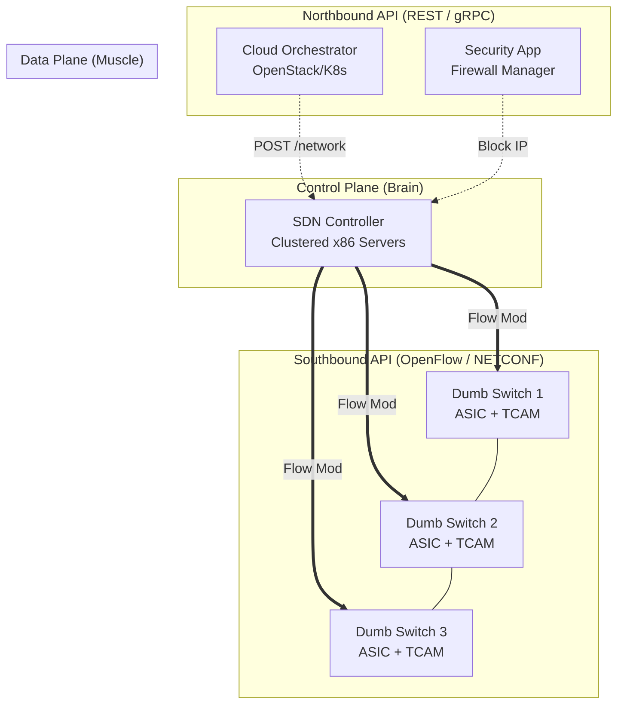
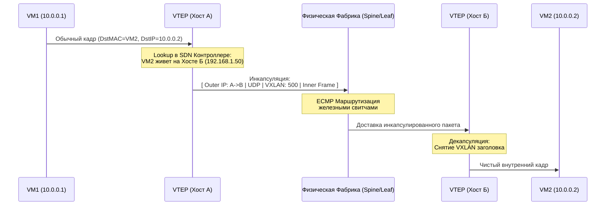

---
tags:
  - networking
  - sdn
  - openflow
  - vxlan
  - architecture
aliases:
  - Software-Defined Networking
  - Control Plane vs Data Plane
---
# L1.NET.15: SDN - OpenFlow, control plane vs data plane 

> [!abstract] О лекции
> **SDN (Software-Defined Networking)** — это радикальный архитектурный подход, при котором "мозги" сети (Control Plane) физически и логически отделяются от "мышц" (Data Plane). Вместо того чтобы вручную настраивать каждый железный роутер отдельно через CLI по протоколу SSH, вы программируете всю инфраструктуру целиком через центральный контроллер. Для современного IT-Архитектора важно понимать: если вы сегодня используете AWS VPC, Kubernetes CNI (Cilium/Calico) или корпоративный SD-WAN — вы уже используете технологии SDN каждый день. 

---
## 1. Фундаментальный сдвиг: Control Plane vs Data Plane

Чтобы до конца понять революционность SDN, архитектор должен четко видеть внутреннюю анатомию сетевого устройства. Абсолютно любое сетевое оборудование (от дешевого домашнего WiFi-роутера TP-Link до гигантского магистрального маршрутизатора ядра Cisco) всегда оперирует в трех логических плоскостях.

В традиционных сетях 90-х и 00-х годов эти плоскости были жестко спаяны внутри одного металлического корпуса (Monolithic Router). В эпоху SDN мы их безжалостно распиливаем и физически разделяем.

### 1.1. Data Plane (Forwarding Plane) — Плоскость данных
Это "глупое железо", работающее на безумной скорости линии (Line Rate, терабиты в секунду).

*   **Функция:** Непосредственная физическая обработка транзитных пакетов пользователей. Задача плоскости: принять пакет на интерфейсе In (Вход), посмотреть его заголовок, найти быстрое совпадение в таблице, модифицировать пакет (уменьшить TTL, пересчитать контрольную сумму IP, наложить или снять VLAN тег) и выплюнуть в интерфейс Out (Выход).
*   **Ключевая структура данных — FIB (Forwarding Information Base):** Это оптимизированная, скомпилированная "база данных", созданная исключительно для сверхбыстрого поиска адреса.
*   **Аппаратная реализация:**
    *   **ASIC (Application-Specific Integrated Circuit):** Специализированные кремниевые чипы, которые аппаратно "прошиты" на перекладывание пакетов. Они не умеют думать, у них нет ОС в привычном понимании, они умеют делать одну и ту же операцию миллиарды раз в секунду.
    *   **TCAM (Ternary Content-Addressable Memory):** Сверхбыстрая, энергоемкая и очень дорогая память, позволяющая искать правило по маске за **один такт процессора** ($O(1)$), независимо от того, сколько тысяч записей в таблице. Используется для хранения правил FIB и ACL (Access Control Lists).
*   **Аналогия:** Рабочий-робот на конвейере. Он вообще не знает, зачем эта деталь едет по ленте и куда она поедет в итоге. Он знает только одну зашитую инструкцию: "Если приехала зеленая коробка — наклей на неё штрихкод и толкай влево".

### 1.2. Control Plane — Плоскость управления (Мозги)
Это "интеллект" роутера, математически определяющий глобальную топологию сети.

*   **Функция:** Обмен сложной сигнальной информацией с соседями для построения карты всей сети. Именно здесь "живут" и работают протоколы динамической маршрутизации (OSPF, BGP, EIGRP), протоколы ARP-резолвинга, STP (Spanning Tree для защиты от петель), LACP (для агрегации линков).
*   **Ключевая структура данных — RIB (Routing Information Base):** Это гигантская, полная карта всех известных маршрутов от всех протоколов. Control Plane анализирует RIB, выбирает *самый лучший* маршрут (алгоритм Best Path Selection) и инсталлирует его "вниз", в FIB (в Data Plane).
*   **Аппаратная реализация:** General Purpose CPU (обычный процессор архитектуры x86 или ARM) и плашки оперативной памяти (RAM), установленные внутри роутера.
*   **Аналогия:** Логистический центр диспетчеров. Здесь сидят умные менеджеры, смотрят на карты дорог (всю топологию), читают сводки о пробках (метрики интерфейсов OSPF) и принимают решение: "Сегодня фуры пойдут через объездную трассу".

### 1.3. Management Plane — Плоскость администрирования
Третья плоскость, которую часто забывают, но которая критична для понимания концепции SDN.

*   **Функция:** Интерфейс внешнего взаимодействия устройства с человеком (администратором) или скриптом. Это порты и протоколы SSH, CLI (например, классический Cisco IOS), SNMP, Syslog, современный NETCONF/YANG.
*   **В традиционной сети:** Инженер (или Ansible-скрипт) вынужден заходить через Management Plane на *каждое отдельное* устройство в сети, чтобы настроить поведение его локального Control Plane.

---
### 1.4. Традиционная модель vs SDN Модель

#### Традиционная модель: Распределенный интеллект (Distributed Control Plane)
В классической корпоративной сети каждый роутер абсолютно автономен и эгоистичен.
*   **Процесс:** Роутер А говорит Роутеру Б по протоколу: "Привет, я вижу сеть `10.0.0.0/8`". Роутер Б обновляет свою базу RIB, запускает тяжелый пересчет графа алгоритмом Дейкстры (SPF) и обновляет свой локальный FIB.
*   **Проблема 1 (Convergence / Сходимость):** Если где-то упал оптический линк, информация об этом (LSA) должна распространиться по всей сети цепной реакцией (flooding). Пока *все* роутеры не получат апдейт и не договорятся о новой топологии (Convergence time, может занимать секунды), в сети возникают маршрутные петли (loops) или черные дыры (blackholes), куда проваливается трафик.
*   **Проблема 2 (Боль Архитектора):** Чтобы внедрить сложную бизнес-политику (например, Policy Based Routing: "видео-трафик пускать только через дорогой канал"), инженеру нужно вручную, скриптами перенастроить Control Plane на 50 устройствах по пути следования, сильно рискуя создать конфликт конфигураций ("Configuration Drift").

#### SDN Модель: Централизованный интеллект (Disaggregated Control Plane)
Мы вырываем "мозги" (Control Plane) из железного корпуса роутера и переносим их на центральный сервер (x86 кластер).

1.  **Dumb Switches (Data Plane only):** Сетевые устройства (так называемые White box switches) оставляют внутри себя только быстрые ASIC и TCAM. Они больше не запускают тяжелые процессы OSPF или BGP. У них пустые "мозги". Они просто ждут внешних инструкций.
2.  **SDN Controller (Global Control Plane):** Мощный высокодоступный кластер серверов, который видит **абсолютно всю** сеть как математический граф с высоты птичьего полета.
3.  **Southbound Interface (Южный API):** Протокол аппаратного общения Контроллера со Свитчами (например, **OpenFlow**, OpFlex, OVSDB или NETCONF). Контроллер напрямую, минуя посредников, программирует FIB (TCAM) свитчей.
4.  **Northbound Interface (Северный API):** Открытый REST/gRPC API для ваших бизнес-приложений. Вы (как код) говорите контроллеру: `POST /path {source: App_A, dest: App_B, bandwidth: high_priority}`. Контроллер сам вычисляет оптимальный путь и решает, какие конкретно бинарные правила залить в 5 нужных свитчей.

---
### 1.5. Наглядный бизнес-пример: "Elephant Flow" (Тяжелый поток)

Представьте, что в сети дата-центра предприятия каждую ночь идет бэкап базы данных (10 Терабайт) между серверами А и Б.

**Сценарий Катастрофы в Традиционной сети (с OSPF):**
1.  OSPF настроен по классической метрике "физическая скорость порта".
2.  Алгоритм решает, что кратчайший путь лежит через центральный корневой свитч ядра (Core Switch).
3.  Ночной бэкап стартует и мгновенно забивает этот гигабитный канал на 100% (Elephant flow).
4.  Срочная IP-телефония (VoIP) колл-центра и видеозвонки гендиректора, идущие через этот же корневой свитч, начинают "лагать", "квакать" и дропаться (Microbursts / Tail drops).
5.  *Решение старой школы:* Разбуженный ночью админ должен руками зайти по SSH на 3 роутера и экстренно настроить сложный QoS или PBR, чтобы принудительно завернуть бэкап в обход. Это реактивно, медленно и чревато опечатками.

**Сценарий Магии в SDN сети:**
1.  Свитч на входе видит новый, аномально мощный поток пакетов (Elephant flow) и отправляет телеметрию на Контроллер (или Контроллер сам опрашивает статистику портов `sFlow`).
2.  SDN Контроллер через API программно знает бизнес-контекст: "Этот порт принадлежит серверу бэкапов (низкий приоритет), а основной канал уже загружен на 90%".
3.  Контроллер анализирует глобальный граф и видит свободный, но физически более "длинный" путь через резервные свитчи на другом краю здания.
4.  Контроллер **мгновенно (за миллисекунды)** отправляет команду (`Flow Mod`) только на затронутые свитчи: "Весь трафик от IP_A к IP_B перенаправить в резервный порт X".
5.  Data Plane переключается. VoIP (короткие мышиные потоки) продолжает комфортно работать по кратчайшему основному каналу, тяжелый бэкап уходит в обход. Люди не заметили проблемы, админ спит.

**Итог для архитектора:** SDN превращает сложную сетевую проблему "настройки протоколов" в простую задачу "программирования бизнес-логики". Вы управляете сетью декларативно (как кодом).

---
## 2. OpenFlow: Анатомия первого стандарта SDN

**OpenFlow** — это революционный протокол коммуникации (открытый стандарт), который впервые стандартизировал взаимодействие между **Control Plane** (Внешним Контроллером) и **Data Plane** (Сетевым устройством) разных вендоров.

В архитектуре SDN это называется **Southbound API** ("Южный интерфейс").
*   *Northbound API:* Интерфейс общения программиста с контроллером.
*   *Southbound API:* Интерфейс, через который контроллер приказывает железу (Broadcom чипам): "Запиши эти байты прямо в TCAM-память". Это и есть зона ответственности OpenFlow.

### 2.1. Концепция "Flow" (Потока) и Таблиц (Flow Tables)
В традиционном роутинге решение (куда слать) принимается на основе только destination IP (маршрутизация L3) или destination MAC (коммутация L2). OpenFlow полностью унифицировал это, представив любой пролетающий пакет как единый набор полей (Tuples).

Свитч в парадигме OpenFlow представляется как конвейер (Pipeline) из одной или нескольких **Flow Tables** (Таблиц Потоков).
Каждая запись в такой таблице (**Flow Entry**) состоит из ключевых компонентов, которые архитектор обязан знать:

1.  **Match Fields (Критерии совпадения / Условия):**
    Это бинарный шаблон для поиска. OpenFlow позволяет матчить пакеты одновременно по 12+ полям (в версии 1.0) и до 40+ полям (в версии 1.3+):
    *   *L1:* Входящий физический порт свитча (Ingress Port).
    *   *L2:* Ethernet source/dest MAC, VLAN ID, VLAN Priority (802.1p).
    *   *L3:* IP source/dest, маски подсетей, IP Protocol (TCP/UDP/ICMP), DSCP.
    *   *L4:* TCP/UDP source/dest ports.
    *   *MPLS:* Labels.
    *   *Metadata:* Виртуальные поля (регистры), которые передаются вместе с пакетом между таблицами внутри одного свитча (важно для сложной логики).

2.  **Instructions & Actions (Инструкции и Действия):**
    Что железо должно сделать с пакетом, если все поля совпали?
    *   **Forward:** Отправить пакет в физический порт X, во все порты (Flood), или отправить его "наверх" обратно контроллеру для анализа (сообщение `Packet-In`).
    *   **Drop:** Молча отбросить пакет (Реализация логики Firewall).
    *   **Modify Field (Set-Field):** Переписать биты в заголовке на лету! Например, изменить TTL, заменить MAC-адреса (сделать NAT), снять (Pop) или добавить (Push) новый VLAN тег.
    *   **Goto-Table:** Передать пакет в следующую таблицу конвейера (для реализации сложной пайплайн-логики: Таблица 0 делает L2 switching, если успешно -> Таблица 1 делает L3 routing, Таблица 2 делает ACL).

3.  **Counters (Счетчики статистики):**
    Аппаратная статистика: точное количество совпавших пакетов, сумма байт, длительность существования данного потока. Это золотая жила для биллинга провайдеров и систем телеметрии (Observability).

4.  **Priority (Приоритет):**
    Порядок проверки. TCAM память проверяет всё за 1 такт, но если пакет подходит сразу под два широких правила (например, "Дропать всё" и "Разрешить порт 80"), сработает то, у которого жестко задан более высокий приоритет.

5.  **Timeouts (Жизненный цикл правила):**
    *   *Hard Timeout:* Удалить это правило из TCAM через X секунд (независимо от того, идет по нему трафик или нет).
    *   *Idle Timeout:* Удалить правило только в том случае, если трафик по нему не шел X секунд (механизм автоматической "сборки мусора" для умерших сессий, спасает дорогую память TCAM).

### 2.2. Механика взаимодействия: Reactive vs Proactive

Глубокое понимание этих двух режимов работы критично для архитектора, проектирующего latency-sensitive (чувствительные к задержкам) системы.

#### А. Реактивный режим (Reactive) — "Packet-In Loop"
Это классический, первоначальный академический SDN. При старте таблицы свитча абсолютно пустые.
1.  **Packet Arrival:** В свитч прилетает самый первый пакет новой TCP-сессии (SYN) от клиента.
2.  **Table Miss:** Свитч не находит ни одного совпадения в TCAM. Срабатывает встроенное дефолтное правило: "Отправить заголовок пакета (или весь пакет) на Контроллер по управляющему линку". Это называется сообщение **`Packet-In`**.
3.  **Controller Decision:** Контроллер (на медленном x86 сервере) парсит этот пакет, смотрит в базу данных, проверяет права доступа (AuthZ) и строит маршрут через весь ЦОД.
4.  **Flow-Mod:** Контроллер отправляет свитчу команду (`Flow Modification`): "Я подумал. Установи новое правило в TCAM: всем пакетам с такими IP/Port идти в порт 5".
5.  **Packet-Out:** Контроллер возвращает исходный задержанный пакет обратно свитчу, чтобы тот отправил его по назначению.

*   **Фатальная Проблема:** Огромная задержка самого первого пакета (First-packet latency). Контроллер может "захлебнуться" от тысяч новых сессий в секунду (DDoS атака убьет Control Plane).
*   **Применение:** Лабораторные стенды, сложные Security-политики вроде Captive Portal в отелях (где первый HTTP запрос перехватывается на страницу авторизации).

#### Б. Проактивный режим (Proactive) — "Pre-programmed"
Это то, как работают абсолютно все современные Enterprise SDN (SD-WAN, Cisco ACI, OVN).
Контроллер заранее (до появления трафика) знает топологию и все бизнес-политики.
1.  **Pre-provisioning:** Контроллер заранее "заливает" (пушит) в свитчи агрегированные правила: "Вся подсеть `10.0.1.0/24` доступна через порт 3".
2.  **Packet Arrival:** Пакет приходит и мгновенно матчится в железе.
3.  **Zero Controller Interaction:** Data Plane работает полностью автономно на гигабитной скорости провода (Line Rate). Задержки нет. Контроллер может даже временно отключиться — сеть продолжит работать.

---
### 2.3. Пример для наглядности (Чтение Flow Entry)

Представьте, что вы (как инженер) реализуете программный Load Balancer на базе OpenFlow без покупки дорогого железа F5.

**Задача:** Перенаправить весь входящий внешний HTTP трафик (Port 80), идущий на красивый виртуальный IP `1.2.3.4` (VIP), на скрытый реальный внутренний сервер `10.0.0.5`.

**Flow Entry (Запись в таблице TCAM свитча):**

| Поле | Значение (Байты) | Человеческий Комментарий |
| :--- | :--- | :--- |
| **Priority** | 100 | Высокий приоритет (выше дефолтного Drop) |
| **Match (Условие)** | `EthType=0x0800` (IPv4)   `IP_Dst=1.2.3.4`   `IP_Proto=6` (TCP)   `TCP_Dst=80` | Ловим строго HTTP запросы к VIP адресу |
| **Actions (Действие)** | `Set-Field: IP_Dst=10.0.0.5`   `Set-Field: Eth_Dst=AA:BB:CC:DD:EE:FF`   `Output: Port 7` | Делаем аппаратный DNAT   Меняем MAC на реальный MAC сервера   Выплевываем пакет в порт №7 |
| **Counters** | `Pkts=520, Bytes=45000` | Статистика метрик для Prometheus |

*Что произойдет:* Если придет хакерский пакет на порт 443 (HTTPS) или SSH (22), он не совпадет с этим правилом `Match` и пойдет дальше по конвейеру таблиц (где, скорее всего, попадет в Table-Miss Drop политику и будет отброшен).

---
### 2.4. Наследие OpenFlow: От OVS до языка P4

Важно понимать, почему "чистый" аппаратный OpenFlow (версии 1.3) постепенно уступает место новым парадигмам.
*   **Ограниченность полей (The Header Problem):** В протоколе OpenFlow список полей для матчинга жестко "зашит" в стандарт IETF. Если в мире появлялся новый протокол инкапсуляции (например, VXLAN в 2012 году), старые аппаратные свитчи OpenFlow просто не могли "заглянуть" внутрь него — нужно было физически менять чипы (ASIC) или ждать годами обновления прошивок.
*   **Эволюция в язык P4 (Programming Protocol-independent Packet Processors):** Современный подход к SDN. Язык P4 позволяет инженеру перепрограммировать *сам парсер пакетов* в чипе свитча. Вы можете написать код и сказать аппаратному чипу: "Смотри на 12-й байт после IP-заголовка, назови это поле 'MyCustomHeader' и применяй к нему правила маршрутизации". Это абсолютная гибкость (Data Plane Programmability).

**Резюме раздела:** OpenFlow совершил революцию: он превратил глупые свитчи из проприетарных "черных ящиков" Cisco в прозрачный "кэш правил маршрутизации". Даже если вы сегодня не пишете код на сыром C++ OpenFlow, вы используете его логику каждый раз, когда работаете с виртуальным коммутатором **Open vSwitch (OVS)** внутри нод Kubernetes или облаках OpenStack.

---
## 3. Современный SDN: Архитектура Overlay и Underlay

Для Staff Architect категорически важно понимать: современный гигантский ЦОД (Data Center) — это не одна физическая сеть проводов, а **две независимые сети**, существующие параллельно друг над другом. Разделение архитектуры на Underlay и Overlay решило фундаментальную проблему облаков: как масштабировать старые VLAN (лимит 4096) и как обеспечить "переезд" виртуальных машин (Live Migration) без смены IP-адресов.

### 3.1. Underlay Network: Физический железобетонный фундамент (The Fabric)

**Underlay** — это физическая "железная" инфраструктура: оптические кабели, SFP трансиверы, коммутаторы (Top-of-Rack, Spine) и маршрутизаторы ядра.

*   **Главная инженерная цель:** Обеспечить максимально тупую, но сверхстабильную и высокоскоростную IP-связность между любыми двумя хостами/серверами (Any-to-Any IP reachability). Underlay ничего не знает о ваших "нежных" виртуальных машинах, Docker-контейнерах, клиентах-арендаторах (Tenants) или сложных политиках безопасности. У него одна задача — доставить пакет от IP сервера А к IP сервера Б.
*   **Топология Spine-Leaf (Clos Network Фабрика):**
    *   В отличие от старой хрупкой трехуровневой архитектуры (Core-Aggregation-Access) с STP (Spanning Tree), здесь используется широкая неблокирующая "фабрика".
    *   Каждый нижний Leaf-свитч физически подключен к *каждому* верхнему Spine-свитчу.
    *   **Магия ECMP (Equal-Cost Multi-Path):** Протоколы маршрутизации Underlay (почти всегда используется **eBGP**) видят 4-8 одинаковых путей наверх и балансируют трафик по *всем* оптическим линкам одновременно. Это дает колоссальную, математически предсказуемую пропускную способность (Cross-sectional bandwidth) и мгновенную отказоустойчивость при обрыве кабеля (без перестроения STP деревьев).
*   **Характеристики Underlay:**
    *   *Статичность:* Конфигурация Underlay меняется крайне редко (только при физическом добавлении новой стойки серверов в ЦОД).
    *   *MTU:* Здесь абсолютно всегда на портах включаются **Jumbo Frames** (MTU 9000+ байт), чтобы внутри пролезали толстые инкапсулированные пакеты Overlay без фрагментации.

**Аналогия:** Underlay — это жесткий асфальт и развязки на шоссе. Дороге все равно, едет по ней скорая помощь (VoIP) или грузовик с навозом (Hadoop Backup), и кто там внутри сидит. Ее единственная задача — не иметь ям и иметь много полос.

### 3.2. Overlay Network: Логическая виртуальная абстракция

**Overlay (Оверлей)** — это полностью виртуальная сеть, создаваемая программно поверх Underlay-фундамента с помощью технологий туннелирования. Именно здесь "живет" и правит настоящий современный SDN.

*   **Главная цель:** Создать для клиента (или пода) идеальную иллюзию прямой локальной L2-связности между виртуальными машинами, даже если они физически находятся в разных стойках или разных зданиях ЦОДа (концепция L2 over L3).
*   **Механика Инкапсуляции (Encapsulation):**
    *   Исходный Ethernet-кадр (Payload), сгенерированный гостевой ОС, программно заворачивается в дополнительный, внешний UDP-пакет.
    *   Для железной Underlay-сети этот "бутерброд" выглядит как просто очередной обычный IP-пакет, который нужно доставить от физического IP Гипервизора А к физическому IP Гипервизора Б.
*   **Протоколы-Технологии:**
    *   **VXLAN (Virtual Extensible LAN):** Стандарт де-факто в индустрии. Революционно расширяет тесное пространство сегментов сети с 12 бит (максимум 4096 VLANs) до **24 бит (более 16 миллионов VNIs - VXLAN Network Identifiers)**. Это окончательно решило проблему "VLAN Exhaustion" в публичных облаках (Multi-tenancy).
    *   **GENEVE (Generic Network Virtualization Encapsulation):** Эволюция VXLAN. Активно используется в AWS и открытом OVN (Open Virtual Network). Его киллер-фича — позволяет вставлять в заголовок туннеля произвольные метаданные (TLV поля), что критично для проброса телеметрии и контекста безопасности (Security Tags) сквозь фабрику.

**Аналогия:** Overlay — это зашифрованный VPN-туннель (WireGuard), который вы кидаете поверх публичного, грязного интернета. Для провайдера (Underlay) ваш трафик — это нечитаемый шум, но внутри туннеля у вас своя чистая корпоративная сеть с серыми IP-адресами (`192.168.x.x`).

### 3.3. Ключевой компонент: VTEP (VXLAN Tunnel Endpoint)

Чтобы понять, как абстракция превращается в байты, нужно знать архитектурный термин **VTEP**. Это точка физического входа/выхода из VXLAN-туннеля. VTEP выполняет тяжелую работу: инкапсуляцию (при отправке) и декапсуляцию (при приеме) пакетов.

VTEP может быть реализован в двух местах инфраструктуры:
1.  **Host-based SDN (Программный VTEP / Software):** Туннель начинается и заканчивается прямо на CPU гипервизора (например, внутри Open vSwitch или Linux Bridge). Аппаратные свитчи в стойке (ToR) видят только чистый UDP трафик и не напрягаются. Это подход публичных облаков, VMware NSX, OpenStack и Kubernetes (Calico/Cilium).
2.  **Hardware VTEP (Аппаратный):** Туннель начинается на порту физического железного свитча (Top-of-Rack) на базе ASIC-чипов. Используется для интеграции Legacy "голого железа" (Bare Metal серверов, баз данных Oracle), которые не умеют в VXLAN, в общую виртуальную сеть SDN ЦОДа.

### 3.4. Пример прохождения пакета (Packet Walk)

Представьте, что Виртуальная Машина VM1 (IP `10.0.0.1`) на физическом Хосте А хочет отправить пакет к VM2 (IP `10.0.0.2`), которая "переехала" на Хост Б.

### 3.5. Инженерные вызовы (Pain Points - За что мы платим)

1.  **MTU Tax (Налог на инкапсуляцию):**
    *   Протокол VXLAN безжалостно добавляет 50 байт оверхед заголовков к каждому пакету (Outer MAC + Outer IP + UDP + VXLAN Header).
    *   Если гостевая VM попытается отправить полный пакет размером 1500 байт, итоговый пакет, выходящий с гипервизора, будет 1550 байт.
    *   Если Underlay сеть админы забыли настроить на Jumbo Frames (и там стоит стандартный MTU 1500), этот 1550-байтовый пакет будет жестко фрагментирован на уровне железа (что убьет CPU) или вообще тихо отброшен (Drop).
    *   **Решение архитектора:** Физический Underlay *обязан* поддерживать Jumbo Frames (обычно порты ставят на 9000 или 9216 байт), а на виртуальных интерфейсах (vNIC) виртуальных машин MTU часто программно занижают (например, до 1450), чтобы избежать любых рисков фрагментации (MSS Clamping).
2.  **Troubleshooting Gap (Проблема Отладки):**
    *   Обычный `ping` внутри Overlay проходит успешно, но вы видите высокую latency. В чем дело?
    *   Классический `traceroute` запущенный из VM покажет вам всего **1 хоп** (якобы прямая связь кабелем), хотя в суровой реальности физический пакет прошел через 5 Spine-Leaf свитчей Underlay-сети! Оверлей лжет инструментам ОС.
    *   Для отладки сетевым инженерам требуются современные Observability инструменты, умеющие заглядывать "внутрь" UDP туннелей (Deep Packet Inspection) или коррелировать графики Underlay потоков с Overlay сессиями (например, средства VMware vRealize Network Insight).

---
## 4. Где вы встречаете SDN как Архитектор? (Deep Dive & Use Cases)

На уровне Staff Architect вы взаимодействуете с SDN не через настройку портов коммутатора, а через проектирование высокоуровневых **абстракций**. Вы ожидаете от платформы, что сеть будет полностью эластичной, программно-определяемой (Infrastructure as Code) и прозрачной (Observable). Рассмотрим 5 ключевых доменов, где SDN правит миром.

### 4.1. Публичные облака: VPC как великая иллюзия (Cloud Virtualization)
Каждый раз, когда вы создаете новую сущность VPC (Virtual Private Cloud) в AWS, GCP или Azure, вы на самом деле нарезаете кусок от одной из самых масштабных SDN-систем в мире (например, проприетарной **AWS Nitro** или **Google Andromeda**).

*   **Суть обмана:** Физическая железная сеть дата-центра облака — это гигантский плоский L3-фабрик (маршрутизация только IP-адресов самих хостов). Ваша пользовательская VPC с её подсетями `10.x` — это полностью изолированный **Overlay** (виртуальная наложенная сеть), существующий только в оперативной памяти.
*   **Механика облачного SDN:**
    *   Когда EC2 инстанс A (IP `10.0.0.5`) пытается отправить пакет инстансу B (IP `10.0.0.6`) в той же VPC, он отправляет его в свой виртуальный сетевой адаптер (vNIC).
    *   **Hypervisor vSwitch / Nitro Card (Data Plane):** Мгновенно перехватывает пакет. Он не засоряет физическую сеть глупыми ARP-броадкаст запросами. Он тихо обращается к локальному кеширующему агенту или центральному Mapping Service.
    *   **Mapping Service (Control Plane):** Сообщает Дата Плейну: "IP `10.0.0.6` этого клиента прямо сейчас физически запущен на железном хосте `192.168.1.50` в стойке 4".
    *   **Инкапсуляция AWS:** Пакет заворачивается (в проприетарный протокол VPC-encap), стремительно летит по физической сети на хост получателя, там разворачивается гипервизором и отдается внутрь инстанса B. Инстансы считают, что они соединены проводом.
*   **Архитектурный импакт (Security Groups):**
    *   Облачные **Security Groups (SG)** — это не один большой брандмауэр на входе. Это гениальный **Stateful Distributed Firewall** (Распределенный фаервол). Правила SG применяются гипервизором SDN *непосредственно на порту vNIC* каждого конкретного инстанса индивидуально. Это позволяет архитекторам реализовать глубокую микросегментацию без традиционных "узких мест" (choke points) в виде физических железных фаерволов, которые бы "упали" от терабитного внутреннего трафика (East-West traffic).

### 4.2. Kubernetes Networking: CNI и эволюция Data Plane
Оркестратор Kubernetes сам по себе не диктует, как должны передаваться байты по сети. Он отдает эту тяжелую работу на откуп плагинам стандарта **CNI (Container Network Interface)**. Абсолютно любой CNI — это реализация SDN.

*   **Старая школа (Iptables / IPVS):** Классические плагины вроде Calico (в стандартном режиме), Flannel или Weave.
    *   **Control Plane (Kube-proxy):** Системный демон следит за изменениями в K8s API (создался новый Pod, обновился Service) и реактивно генерирует сотни строчек правил для фаервола `iptables` на каждой Worker-ноде.
    *   **Проблема (Узкое место):** Если в кластере 5000+ сервисов, цепочка правил `iptables` становится чудовищно огромной. Поиск нужного правила в ядре становится линейным $O(N)$. Это начинает нещадно "жрать" CPU (в режиме System) и добавляет паразитный latency к каждому вызову микросервиса.
*   **Новая школа (eBPF - Будущее сети, например Cilium):**
    *   **Data Plane на стероидах:** Использует технологию **eBPF (Extended Berkeley Packet Filter)** — защищенную, верифицируемую песочницу внутри ядра Linux. Высокоуровневая логика маршрутизации и безопасности (написанная на C) компилируется в байт-код JIT и работает прямо в ядре на скоростях, близких к аппаратному железу, часто полностью **минуя классический медленный стек TCP/IP хоста**.
    *   **Практический Пример:** Cilium CNI может проанализировать и дропнуть вредоносный пакет от "неавторизованного пода" на уровне хука сетевой карты XDP, еще **до того**, как ядро ОС вообще выделит память (skb) под этот пакет, экономя такты процессора.
*   **Архитектурный термин: Network Policy (Сетевая политика).** Это чистый SDN-конструкт. Правило: "Frontend Namespace может ходить по TCP:80 в Backend Namespace, но запрещен доступ к Database". В физическом старом мире это потребовало бы заявок сетевикам, настройки VLAN и ACL на железных свитчах. В мире K8s это простой декларативный манифест YAML, который CNI-контроллер за миллисекунды превращает в eBPF-программы фильтрации на лету.

### 4.3. SD-WAN и SASE: Умный край сети (Intelligent Edge)
Эпоха, когда корпоративная сеть строилась на аренде безумно дорогих выделенных линий провайдеров (MPLS VPN), закончилась благодаря SDN технологиям.

*   **Бизнес-Проблема:** У филиала компании в регионе есть дорогой, надежный, но узкий канал MPLS (для базы данных) и дешевый, широкий, но нестабильный канал Интернет (для серфинга). Как обеспечить премиум качество Zoom-звонков и CRM, не переплачивая за MPLS?
*   **SDN решение (Application-Aware Routing - Роутинг с пониманием приложения):**
    *   **Control Plane:** Центральный облачный оркестратор (vManage) через графический UI пушит единые глобальные политики (Intent-based) на все железные роутеры во всех тысячах филиалов (Edge devices).
    *   **Data Plane (DPI - Deep Packet Inspection):** SD-WAN роутер смотрит не просто на тупой IP-адрес назначения (как старые железки). Он "заглядывает" внутрь пакета (DPI) и сходу определяет тип приложения (Это сигнатура трафика Zoom, это Office 365, а это торренты).
*   **Сценарий магии:** SD-WAN роутер филиала видит важные пакеты Zoom (UDP/8801). Он непрерывно измеряет качество (Jitter/Packet Loss/Delay) на дешевом интернет-канале. Если потери пакетов превышают SLA > 1%, роутер **на лету** (per-packet load balancing), не разрывая TCP/UDP сессию, "перекидывает" поток на запасной MPLS канал или 4G-модем. Пользователь даже "не моргнул" на видео.
*   **Термин SASE (Secure Access Service Edge):** Это современная эволюция SD-WAN. Объединение "умной трубы" с "умной безопасностью" в облаке. Трафик филиала не тащится через всю страну в штаб-квартиру для проверки на толстом Firewall-е (Backhauling). Трафик проверяется антивирусом и DLP прямо на Edge-коробочке SD-WAN или заворачивается в ближайший облачный фильтрующий узел провайдера (PoP).

### 4.4. Service Mesh (L7 SDN на уровне приложения)
Istio, Linkerd, Consul Connect — это логическое перенесение и применение классических принципов SDN с уровня IP-пакетов (L3/L4) на уровень самих приложений и протоколов (Layer 7 HTTP/gRPC).

*   **Глубокая Аналогия с OpenFlow:**
    *   **Sidecar Proxy (Envoy):** Выступает в роли "глупого" свитча **Data Plane**. Он устанавливается рядом с каждым микросервисом. Он перехватывает *абсолютно все* входящие и исходящие TCP/HTTP запросы (через iptables).
    *   **Control Plane (Istiod):** Выступает в роли SDN-контроллера. Он хранит глобальную конфигурацию маршрутов, лимитов и криптографические сертификаты.
*   **Что это дает архитектору (Business Value):**
    *   **Traffic Shifting (Сложный Canary Deployment):** Вы можете сказать контроллеру: "Отправлять 5% трафика, у которого в HTTP заголовке есть `User-Agent: iPhone 15` и cookie `beta-tester`, на экспериментальную версию пода v2, а остальных на v1". Это умная маршрутизация на основе контента, физически невозможная для классических железных L3/L4 SDN.
    *   **mTLS (Mutual TLS):** SDN инфраструктура берет на себя черную работу: автоматически выдает и ротирует X.509 сертификаты подам, и прозрачно шифрует трафик между сервисами. Вы полностью выносите сложную логику шифрования и строгой аутентификации из кода бизнес-приложения в слой инфраструктуры.

### 4.5. Software Load Balancers (L4 SDN - Программные балансировщики)
Дорогие, аппаратные железные балансировщики-монолиты (типа F5 Networks, Citrix ADC) постепенно умирают в масштабных облачных средах. На их место пришли горизонтально масштабируемые программные L4 балансировщики (например, **Katran** от инженеров Meta/Facebook или **Maglev** от Google).

*   **Принцип (Anycast + BGP):** Группа из десятков обычных серверов x86 (балансировщиков) использует протокол BGP, чтобы одновременно анонсировать ядру сети один и тот же VIP (Virtual IP) адрес сервиса. Роутеры ECMP раскидывают клиентские TCP SYN пакеты по всем этим серверам.
*   **Data Plane на стероидах:** Внутри балансировщика логика пересылки реализована на eBPF/XDP. Пакет обрабатывается на уровне драйвера сетевой карты, не доходя до ядра Linux. Это позволяет "прожевывать" десятки миллионов пакетов в секунду (Mpps) на обычном commodity-сервере.
*   **Consistent Hashing (Согласованное хеширование):** Самая сложная математическая часть. Алгоритм внутри балансировщиков (например, кольцо Maglev) гарантирует, что все пакеты одной открытой TCP-сессии клиента всегда и гарантированно попадают на один и тот же целевой backend-сервер, даже если в этот момент в кластер балансировщиков добавляются новые узлы или старые "сгорают". Это чистый, эталонный SDN-подход к решению проблемы масштабирования Edge-входа в гигантский дата-центр.

---
## 5. Чек-лист уровня Awareness (Самопроверка)

Вы как Архитектор действительно понимаете сдвиг парадигмы SDN, если можете защитить на ревью следующие утверждения:

1.  **Тотальная Централизация (Global View):** Главное, неоспоримое преимущество SDN перед старыми протоколами — это наличие глобального (God-mode) вида на всю сеть сразу. SDN-Контроллер может проложить путь (Traffic Engineering) не просто по кратчайшему расстоянию (как тупой алгоритм OSPF), а по *наименее загруженному* пути, потому что контроллер видит загрузку (Utilization) абсолютно всех линков в реальном времени.
2.  **Programmability (Программируемость API):** Сеть наконец-то становится программным кодом ("Infrastructure as Code"). Вы больше не пишете непонятные CLI-конфиги в текстовые консоли роутеров. Вы (или ваш CI/CD пайплайн) делаете структурированный POST-запрос с JSON-ом в API контроллера (например, через Terraform провайдер).
3.  **SPOF (Single Point of Failure - Риски):** Выделенный центральный контроллер — это потенциальный риск (единая точка отказа). Однако, если он "упадет", Data Plane (железные свитчи) **продолжат работать** и пересылать трафик на основе последних известных "старых" правил в TCAM. Сеть не ляжет мгновенно! Но контроллер не сможет реагировать на новые события (падения линков, новые сессии). Поэтому SDN-контроллеры всегда разворачиваются как высокодоступные, консенсусные (Raft/Paxos) кластеры (HA).
4.  **White Box Switching (Экономика Commoditization):** SDN уничтожил монополию вендоров. Он позволил гиперскейлерам покупать дешевое азиатское "голое железо" (коммутаторы без операционной системы от Cisco/Juniper) и накатывать на них свою, открытую сетевую ОС на базе Linux (например, SONiC от Microsoft или Cumulus Linux), которая слушает команды от центрального контроллера.

### Итоговое Заключение
**SDN (Software-Defined Networking)** — это фундаментальный исторический переход отрасли от "ручной настройки черных коробок" к абстрактному "программированию потоков байтов".
Для современного Software Архитектора это означает следующее:
*   Сеть больше не является статичным, жестким "гранитом". Она эластична, как вычислительные ресурсы CPU.
*   Безопасность (Micro-segmentation / Zero Trust) теперь внедряется глубоко *внутрь* самой сети на каждый порт (vNIC), а не только висит одиноким фаерволом на периметре дата-центра.
*   Полная сквозная автоматизация (Automation) и развертывание сети становится таким же рутинным и естественным процессом, как деплой очередного микросервиса.