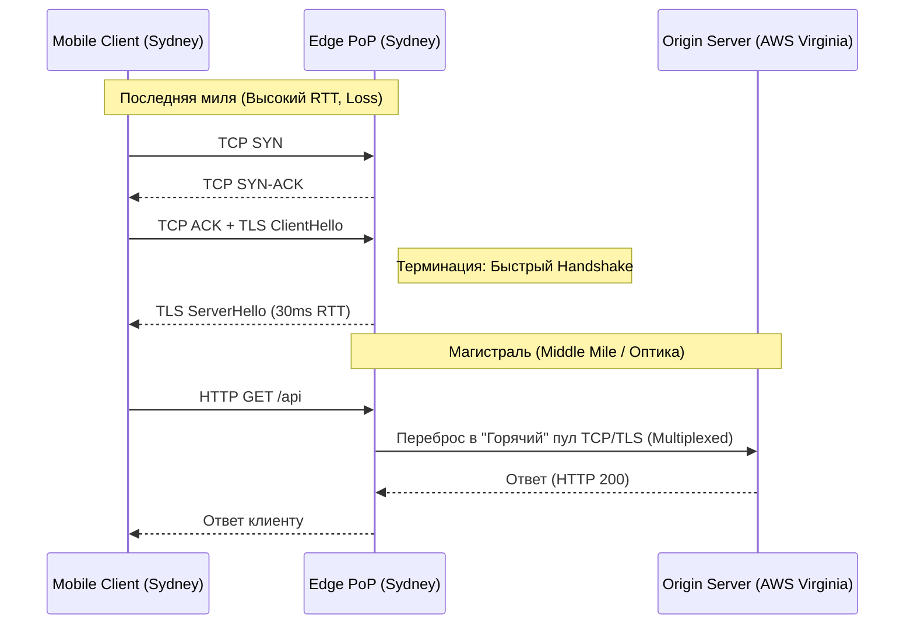

---
tags:
  - networking
  - cdn
  - anycast
  - geo-routing
  - bgp
  - architecture
aliases:
  - Edge PoP
  - CDN Architecture
---
# L1.NET.16: Anycast-CDN, edge-pop, geo-routing 

> [!abstract] О лекции
> В этом материале мы глубоко погружаемся в архитектуру глобальной доставки контента. Чтобы ваш сервис работал молниеносно в Австралии, пока его главный сервер (Origin) физически стоит во Франкфурте, вы не можете просто "оптимизировать код бэкенда". Вам нужно обмануть саму физику и скорость света в оптоволокне.
> *   **Edge PoP** — это архитектурный паттерн выноса тяжелого "рукопожатия" (TCP/TLS) максимально близко к клиенту.
> *   **Anycast** — это магия протокола BGP, когда весь мир стучится на *один и тот же* IP-адрес, но попадает в разные физические дата-центры.
> *   **Geo-routing** — это умный механизм выбора на уровне DNS (L7), куда именно отправить пользователя на основе его координат.

---
## 1. Edge PoP (Point of Presence): Архитектура «Края» и физика задержек

**Edge PoP** (Point of Presence, Точка присутствия) — это специализированная физическая инфраструктура (стойки с мощными серверами кэширования и проксирования), размещенная в стратегических центрах обмена трафиком (**IXP** — Internet Exchange Points) или непосредственно глубоко внутри сетей провайдеров (ISP), максимально близко к конечному пользователю (на «краю» сети).

Для IT-архитектора Edge PoP — это не просто тупой "кэш статики" (картинок/JS). Это мощный, **интеллектуальный прокси-шлюз**, который аппаратно разделяет (splits) TCP/TLS соединение на две независимые части: нестабильную «Последнюю милю» и идеальную «Магистраль».

### 1.1. Фундаментальная проблема: Налог на скорость света (Latency Tax)
В распределенных системах пропускную способность (Bandwidth) можно купить за деньги (положив еще один кабель), но задержку (Latency) неумолимо диктует физика. Скорость света в оптоволокне $\approx 200,000$ км/с (что на 30% медленнее скорости света в вакууме из-за коэффициента преломления стекла).

**Архитектурный Сценарий:** Пользователь в Сиднее (с мобильного телефона 4G) открывает ваш сайт, Origin-сервер которого физически находится в Вирджинии (AWS `us-east-1`).
*   **RTT (Round Trip Time):** Физическое время полета пакета туда-обратно составляет $\approx 250$ мс.
*   **Cold Connection Setup (Налог на старт):** Прежде чем клиент сможет отправить хотя бы 1 байт полезного HTTP-запроса (`GET /`), нужно поднять защищенное соединение.
    1.  **TCP Handshake (SYN, SYN-ACK, ACK):** Занимает 1 полный RTT.
    2.  **TLS Handshake (ClientHello, Key Exchange...):** Занимает 2 RTT (для старого стандарта TLS 1.2) или 1 RTT (для нового TLS 1.3).
    3.  **Итоговая математика:** 3-4 RTT $\approx \mathbf{750-1000}$ мс только на установку связи.
**Катастрофический результат:** Пользователь видит абсолютно белый экран в браузере целую секунду, даже если ваш сверхбыстрый Go-сервер генерирует ответ за 1 миллисекунду.

### 1.2. Механизм 1: TCP/TLS Termination (Терминация соединений на краю)
Здесь в игру вступает Edge PoP (например, узел Cloudflare или AWS CloudFront), физически расположенный прямо в Сиднее. Он жестко перехватывает этот запрос.

*   **Плечо Client $\leftrightarrow$ Edge:** RTT = 10 мс (трафик ходит внутри одного города).
    *   Сложный TCP/TLS handshake проходит за молниеносные $3 	imes 10 = \mathbf{30}$ мс.
    *   Вся тяжелая криптография (генерация ключей RSA / Elliptic Curves) выполняется аппаратно на мощных многоядерных процессорах Edge-узла, полностью разгружая центральный Origin-сервер от этой CPU-bound работы.
*   **Плечо Edge $\leftrightarrow$ Origin:** RTT = 240 мс (через океан).
    *   Здесь происходит главная магия. Соединение между Edge и Origin **уже было установлено заранее** и постоянно поддерживается прогретым (Keep-Alive).

**Эффект для бизнеса:** Пользователь начинает отправлять полезные данные HTTP-запроса через 30 мс, а не через 800 мс. Ощущение "мгновенности" приложения.

### 1.3. Механизм 2: Connection Pooling & Warmup (Магистральная оптимизация)
Это ключевая концепция для **Dynamic Content Acceleration (DCA)** — технологии ускорения *некэшируемого* контента, например, тяжелых `POST`-запросов к GraphQL/REST API, записи в базу данных или потокового видео.

Edge PoP постоянно держит в оперативной памяти **пул постоянных, зашифрованных (Keep-Alive) соединений** к вашему Origin-серверу (в Вирджинии).
*   Когда приходит "холодный" запрос от юзера в Сиднее, Edge не делает новый, мучительный TCP Handshake через океан с Origin. Он берет уже готовое, открытое TCP соединение из пула.
*   **TCP Slow Start Bypass (Обход медленного старта):** Любое новое TCP-соединение начинается с микроскопического окна перегрузки (Congestion Window, `cwnd` ~10 пакетов). Оно должно "разогнаться" (экспоненциально увеличивая окно), прежде чем сможет слать данные на скорости 1 Gbps. 
    Долгоживущее (Keep-Alive) соединение Edge-Origin уже давно разогнано и имеет **огромное окно** (например, `cwnd` > 1000). Это позволяет Edge узлу "выплюнуть" мегабайты данных клиента (upload) мгновенно через Тихий океан, без мучительной раскачки и ожидания подтверждений (ACK).

### 1.4. Механизм 3: Протокольная оптимизация (Protocol Enhancement)
Edge PoP выступает как "интеллектуальный адаптер" (прокси) между грязной, нестабильной "последней милей" (сотовая связь) и идеальным, контролируемым магистральным каналом (Middle Mile / Backbone).

1.  **HTTP Version Bridging (Мост протоколов):**
    *   Клиент (например, старый браузер или Android) может использовать устаревший, медленный HTTP/1.1 с проблемой блокировки (Head-of-line blocking).
    *   Edge PoP принимает это, а дальше преобразует и упаковывает этот запрос в современный **HTTP/2** или **HTTP/3 (QUIC)** туннель до вашего Origin-сервера. Он мультиплексирует сотни клиентских запросов в один TCP-сокет. Это радикально экономит системные ресурсы ядра ОС на вашем Origin (требуется в 100 раз меньше открытых файловых дескрипторов).
2.  **Congestion Control Algorithms (Алгоритмы контроля перегрузки):**
    *   На плече *Client $\leftrightarrow$ Edge* (через Wi-Fi или плохой LTE) часто и неизбежно теряются пакеты (Packet Loss). Стандартный алгоритм TCP Cubic в Linux при потере хотя бы одного пакета паникует и аппаратно режет скорость передачи ровно вдвое.
    *   Продвинутые Edge-сервера (Google, Cloudflare) часто используют кастомный алгоритм **TCP BBR** (Bottleneck Bandwidth and Round-trip propagation time). BBR игнорирует случайные радио-потери пакетов, математически ориентируясь исключительно на общую пропускную способность канала. Это дает прирост скорости загрузки на "шумных" мобильных сетях до 30-40%.
3.  **TLS Session Resumption (Восстановление сессии):**
    *   При первом коннекте Edge может выдать мобильному клиенту Session Ticket. Если связь у клиента прервалась в метро и он переподключился (даже к другому физическому серверу внутри того же самого Edge PoP), TLS handshake пройдет за **0-1 RTT** без тяжелой асимметричной криптографии (потому что используется закэшированный симметричный ключ).

### 1.5. Наглядный математический пример (Life of a Request)

Представьте, что вы загружаете фото (`POST /api/upload`, некэшируемый запрос) из Сиднея на сервер в Вирджинии.

**Сценарий A: Без Edge PoP (Direct Routing):**
1.  Сидней $	o$ Вирджиния (SYN) $	o$ Сидней (SYN-ACK) $	o$ Вирджиния (ACK). [Потеряно: 250ms]
2.  Сидней $	o$ Вирджиния (ClientHello) $	o$ Сидней (ServerHello) $	o$ ... $	o$ Cipher Change. [Потеряно: 500ms]
3.  *TCP Slow Start:* Отправка первых байт заголовков HTTP, долгое ожидание ACK из США, медленное увеличение окна. [Потеряно: 250ms]
4.  Фактическая обработка БД на сервере. [50ms]
5.  Ответ (200 OK) летит обратно. [125ms]
**Итоговая задержка (TTFB):** $\approx \mathbf{1.2 	ext{ секунды}}$. Бизнес теряет конверсию.

**Сценарий B: С Edge PoP (Accelerated Routing):**
1.  Сидней $	o$ Локальный Edge Сидней (Локальный Handshake). [Потеряно всего: 30ms]
2.  Edge "перекладывает" пришедший HTTP-запрос в *уже существующий*, вечно открытый и прогретый HTTP/2 канал до Вирджинии. [Потеряно: 0ms на handshake]
3.  Отправка данных по трансокеанскому каналу с максимальным TCP окном (`cwnd`). Пакеты летят сплошным потоком со скоростью света, не ожидая подтверждений каждые 14кб. [125ms в одну сторону]
4.  Фактическая обработка БД на сервере. [50ms]
5.  Ответ летит обратно на Edge. [125ms]
6.  Edge $	o$ Клиент. [10ms]
**Итоговая задержка:** $\approx \mathbf{340 	ext{ мс}}$.

**Главный вывод архитектора:** Edge PoP ускоряет динамику для бизнеса почти **в 4 раза** совершенно не за счет мифического "кэширования в RAM", а исключительно за счет глубокой математической оптимизации транспортного уровня (Transport Layer Optimization) и обхода TCP-лимитов ОС клиента.

---
## 2. IP Anycast: Архитектура Глобальной Адресации

На уровне системного архитектора вы обязаны понимать Anycast не как какую-то "магию CDN", а как **чистую эксплуатацию стандартных механизмов древнего протокола BGP** (Border Gateway Protocol). 
Anycast — это метод сетевой маршрутизации, при котором один и тот же публичный IP-адрес (или префикс сети `/24`) анонсируется в глобальный интернет из нескольких географически разнесенных дата-центров (PoP) абсолютно одновременно.

### 2.1. Механика BGP: Как это работает "под капотом"

Чтобы понять Anycast, нужно детально вспомнить, как работает Интернет на уровне AS (Autonomous Systems — Автономных Систем).

1.  **Анонсирование (Advertisement):**
    У вас (или вашего CDN) есть купленный блок IP-адресов, например, `203.0.113.0/24`.
    *   *В классическом Unicast-мире* вы анонсируете этот префикс из одного единственного дата-центра (например, с AS64500 во Франкфурте). Весь трафик мира потечет туда.
    *   *В Anycast-мире* вы настраиваете BGP-демоны (софт типа Bird, Quagga/FRR, или железные роутеры Juniper) в **20 разных дата-центрах** (Токио, Нью-Йорк, Лондон, Сидней) на **анонсирование абсолютно одного и того же префикса** `203.0.113.0/24` с одним и тем же номером AS (Origin AS).

2.  **Распространение (Propagation):**
    Эти 20 одинаковых анонсов, как круги по воде, расходятся по глобальной таблице маршрутизации интернета (DFZ — Default-Free Zone). Соседние транзитные провайдеры (Upstreams/Peers) получают конфликтующую, на первый взгляд, информацию: "Я могу достичь префикса `203.0.113.0/24` через Токио" и одновременно "Я могу достичь его через Лондон".

3.  **Выбор пути (Route Selection):**
    Физическая магия происходит на роутерах локальных провайдеров (вашего домашнего ISP). Согласно жесткому математическому алгоритму выбора лучшего пути (BGP Best Path Selection Algorithm), роутер провайдера выбирает **всего один** наилучший маршрут из всех доступных и инсталлирует его в свою аппаратную таблицу пересылки (FIB).
    *   **Критерий 1 (AS-Path Length):** В 90% случаев побеждает самый топологически короткий путь (тот маршрут, в котором пакет пройдет через наименьшее количество транзитных автономных систем-провайдеров). Это *косвенно* совпадает с географической близостью, но не всегда.
    *   **Критерий 2 (Business Policy / Local Preference):** Если длины путей равны (или если так жестко настроена политика админа провайдера), провайдер выберет тот путь, за который ему **дешевле платить** (например, выберет бесплатный Direct Peering в точке обмена трафиком вместо платного Transit-канала).

### 2.2. Термин: Catchment Area (Зона притяжения)

Это фундаментальное, базовое понятие для архитектора при проектировании своего собственного CDN.

*   **Определение:** Catchment Area (Зона охвата/захвата) конкретного PoP (например, узла в Лондоне) — это географическое множество пользователей (точнее, их публичных IP-подсетей), трафик от которых, по воле BGP роутеров, маршрутизируется именно в этот лондонский PoP.
*   **Динамика и Непредсказуемость:** Границы этих зон захвата **крайне нестабильны**. Вы их не контролируете. Если крупный провайдер `Tier-1` (например, Level3) в Лондоне изменит настройки BGP или у него упадет оптический линк, половина пользователей из Франции может мгновенно и непредсказуемо "перетечь" из вашего Парижского PoP в ваш Лондонский PoP, вызвав там лавинообразный перегруз (Capacity Planning Nightmare).
*   **Иллюстрация:** Представьте карту мира, разбитую на неровные "лоскуты" (математическая диаграмма Вороного). Центр каждого лоскута — ваш сервер. Границы этих лоскутов определяются топологией кабелей на дне океана и коммерческими договорами провайдеров, а не государственными границами.

### 2.3. Главный архитектурный риск: Route Flapping и разрыв TCP-сессий

В отличие от протокола UDP (например, DNS запросов), который является stateless (без сохранения состояния — отправил и забыл), протокол TCP жестко требует сохранения состояния соединения (Stateful) на сервере (Sequence Numbers, TCP Windows, буферы).

**Сценарий катастрофы (Why TCP Anycast is hard):**
1.  Пользователь из Берлина начинает скачивать тяжелый файл в браузере (TCP соединение). BGP-маршрутизация интернета стабильно направляет его пакеты во Франкфурт (ближайший ваш узел).
2.  На 50-й секунде скачивания где-то на магистрали временно падает или "моргает" оптический линк между провайдерами (Link Flap).
3.  Топология глобальной сети мгновенно меняется. Роутеры пересчитывают пути. Теперь для берлинского провайдера "ближайший" BGP-маршрут к вашему Anycast IP `1.1.1.1` ведет не во Франкфурт, а в Варшаву.
4.  Следующий пакет этой же самой TCP-сессии (например, пакет ACK) прилетает на ваш сервер в Варшаве.
5.  **Результат для клиента:** Сервер в Варшаве физически ничего не знает об этом скачивании (у него в ядре ОС нет объекта TCB — Transmission Control Block для этого сокета). Он расценивает этот пакет как мусорный или хакерский и агрессивно отвечает клиенту пакетом **RST (Reset)**. Соединение мгновенно разрывается. Пользователь получает ненавистную ошибку браузера `"Connection Reset by Peer"`. Скачивание прервано.

**Как это решают Senior инженеры (Mitigation Strategies):**
*   **Стабильность анонсов:** Сетевые инженеры жестко настраивают механизмы "Route Dampening" на роутерах и стараются никогда не менять свои BGP-анонсы без крайней физической нужды.
*   **Пост-IP идентификация (Эпоха QUIC):** Массовое внедрение протоколов типа **QUIC (основа HTTP/3)**. В QUIC (построенном поверх UDP) есть понятие `Connection ID`, которое зашито в сам заголовок пакета. Оно позволяет умному балансировщику (L4 Load Balancer, работающему на eBPF) корректно перенаправить пакет на нужный сервер или обработать миграцию сессии, даже если IP-адрес клиента (Wi-Fi $	o$ 4G) или маршрут интернета кардинально изменились. Хотя при смене физического дата-центра это все равно остается сложнейшей задачей (требуется меж-ЦОДовая синхронизация состояния сессий, что редко и дорого реализуется, например, в архитектуре Cloudflare Unimog).

### 2.4. ECMP (Equal-Cost Multi-Path) внутри PoP

Архитектор должен понимать, что Anycast работает всегда как матрешка, на двух уровнях:
1.  **Global Anycast:** Выбор на уровне континентов и городов (Токио vs Лондон) средствами BGP интернета.
2.  **Local Anycast (Внутри ЦОДа через ECMP):** Внутри дата-центра в Лондоне на IP `1.1.1.1` стоит не один несчастный сервер, а кластер из 64 серверов. Пограничный роутер дата-центра получает пакет на `1.1.1.1` и видит 64 равноценных линка (ECMP) к серверам, обслуживающих этот IP.
    *   Аппаратный роутер использует математический алгоритм **Consistent Hashing** (хеширование обычного 5-tuple: SrcIP, DstIP, SrcPort, DstPort, Protocol), чтобы гарантировать, что все пакеты одной конкретной TCP-сессии клиента всегда и без исключений попадали на один и тот же железный сервер (блейд) внутри стойки.
    *   *Критический нюанс (Blast Radius):* Если вы, как DevOps, добавите или уберете один сервер в этот кластер, хеширование на роутере может пересчитаться (Rebalancing), и часть *локальных* чужих активных TCP-сессий разорвется. Для решения этого программные балансировщики используют сложные техники вроде **Maglev Hashing** (от Google) или Katran (от Meta), чтобы минимизировать reshuffling (перетасовку) соединений при изменении размера кластера.

### 2.5. Пример: Google Public DNS (8.8.8.8)

Для абсолютной наглядности рассмотрим самый известный Anycast IP в мире.
*   **IP-адрес:** `8.8.8.8`
*   Это не один супер-компьютер в подвале Google. Это десятки тысяч серверов в сотнях физических локаций по всему миру.
*   Если вы сделаете команду `traceroute 8.8.8.8` из квартиры в Москве, вы увидите путь длиной в 5-7 хопов, который заканчивается сервером на узле обмена трафиком MSK-IX (задержка 2-3 мс).
*   Если вы сделаете тот же `traceroute 8.8.8.8` из кафе в Нью-Йорке, вы увидите абсолютно другой путь, заканчивающийся на сервере в Манхэттене (задержка те же 2-3 мс).
*   Для обоих пользователей целевой сервер "называется" одинаково, но физически они общаются с абсолютно разными машинами. 
*   **Отказоустойчивость:** Если Московский узел полностью сгорит от пожара (и перестанет анонсировать BGP маршрут), глобальные BGP маршруты интернета автоматически перестроятся за 30-60 секунд. Весь московский трафик молча потечет, например, в узел в Стокгольме или Франкфурте. Задержка (ping) у москвичей вырастет с 2 мс до 30 мс, но **сервис не упадет**. Клиенты даже не узнают об аварии.

### Резюме для Архитектора (Trade-offs)
Внедряя Anycast, вы совершаете архитектурный обмен: вы меняете **Точный Контроль Трафика (Latency/Load Control)** (который возможен через умный DNS) на **Абсолютную Доступность и Простоту (Availability & Simplicity)**.
Вы навсегда теряете возможность сказать: "Я хочу, чтобы этот конкретный платный пользователь из Москвы шел именно на этот мощный сервер А, а бесплатные шли на сервер Б". Но взамен вы получаете инфраструктуру, которая аппаратно и самостоятельно лечит сама себя при пожарах в ЦОДах и способна "проглотить" гигантские DDoS-атаки (терабиты трафика), тупо размазывая ударную волну хакеров по всей карте мира (каждый PoP принимает на себя лишь малую часть атаки из своего региона).

---
## 3. Geo-Routing: Битва уровней OSI (L7 vs L3)

Маршрутизация глобального трафика к "наилучшему" дата-центру — это фундаментальная задача архитектора высоконагруженных глобальных систем. Существует два диаметрально противоположных концептуальных подхода: **Geo-DNS** (программный интеллект на уровне приложения/DNS — L7) и **Anycast** (аппаратный интеллект на сетевом уровне роутеров — L3).

### 3.1. Geo-DNS (Unicast Routing) — "Умный диспетчер"

В этом подходе центральный авторитативный DNS-сервер вашего домена берет на себя тяжелую роль глобального балансировщика нагрузки. Он динамически (на лету) генерирует ответ (`A record`), основываясь на том, *кто именно* спрашивает.

#### Механика работы (Step-by-step)
1.  **Lookup:** Клиент запрашивает IP для API `edge.example.com`.
2.  **Resolution:** UDP-запрос проходит через цепочку рекурсивных резолверов провайдера (ISP DNS) и попадает на ваш умный авторитативный DNS (например, сервисы NS1, AWS Route53, Akamai).
3.  **Decision (Логика):** Ваш DNS-сервер парсит Source IP пришедшего пакета, сопоставляет его с гигантской платной базой GeoIP (например, MaxMind) и делает вывод: "Ага, этот запрос пришел из подсети провайдера в Берлине (Германия)".
4.  **Answer:** Сервер выбирает из пула ваших Unicast IP-адресов тот, который по карте жестко привязан к европейскому региону (например, `eu-central-1` во Франкфурте), и отдает клиенту конкретный IP `35.158.x.x`.

#### Критическая проблема: EDNS Client Subnet (Механизм ECS, RFC 7871)
Главный исторический недостаток классического Geo-DNS: авторитативный сервер физически видит IP-адрес **рекурсивного резолвера** (например, IP сервера Google 8.8.8.8), а не IP самого конечного **пользователя**.
*   *Сценарий провала:* Пользователь сидит в Москве, но он параноик и использует корпоративный VPN или приватный DNS от Cloudflare (1.1.1.1), чей выходной транзитный узел резолвинга физически находится в Финляндии (Хельсинки).
*   *Результат:* Ваш "умный" Geo-DNS видит финский IP, думает, что пользователь реально в Хельсинки, и направляет его в стокгольмский дата-центр. А реальный пользователь в Москве страдает от высокого пинга, хотя у вас есть московский дата-центр!
*   **Решение архитектора (ECS):** Продвинутые резолверы Google/OpenDNS добавляют в DNS-запрос специальное расширение (EDNS subnet), которое аккуратно раскрывает подсеть реального исходного клиента (например, `109.252.0.0/24`, скрывая последние октеты для приватности). Архитектор обязан технически убедиться, что его Authoritative DNS-провайдер и внутренняя конфигурация умеют читать и поддерживать ECS, иначе Geo-DNS будет промахиваться.

#### Latency-Based Routing (LBR - Роутинг по задержкам)
Это продвинутая, математическая версия Geo-DNS. "Ближайший" по карте километров в интернете — абсолютно не значит "быстрейший" по сети (из-за пиринговых войн провайдеров и прокладки кабелей).
*   Крупные DNS-провайдеры (например, AWS Route53) непрерывно (24/7) собирают телеметрию и статистику реальных сетевых задержек из миллионов разных подсетей интернета до своих облачных регионов.
*   Решение "куда направить" принимается не по географической карте (в км), а по динамической погодной карте сети с метрикой RTT (в миллисекундах).

### 3.2. Anycast Routing (BGP Layer) — "Единый фасад"

Здесь мы полностью отказываемся от программной сложности умного DNS. Ваш "тупой" DNS всегда статично отдает **один и тот же IP** (например, `1.1.1.1`) абсолютно для всех пользователей планеты. Вся сложная магия маршрутизации переносится на аппаратный уровень протокола BGP (Border Gateway Protocol).

#### Механика работы (Catchment Areas)
Вы (через вашего провайдера) анонсируете этот единый IP-префикс из всех своих PoP (точек присутствия) одновременно.
*   Интернет — это математический граф автономных систем (AS).
*   Роутеры провайдеров жестко выбирают путь с **наименьшим количеством AS-прыжков** (AS-Path length), игнорируя километры.
*   **Catchment Area (Зона захвата):** Это "ареалы обитания", области в сети, трафик из которых по законам физики гравитирует (притягивается) к конкретному, топологически "ближайшему" PoP.

#### Тюнинг Anycast: Инструменты BGP Prepending и Communities
*Фундаментальная Проблема:* Алгоритм BGP выбирает лучший путь по *количеству* логических прыжков, а не по *качеству* линии (он не видит задержку RTT или пропускную способность кабеля). Иногда "короткий" путь намертво перегружен трафиком и пакеты теряются.
Как сетевой практик может управлять этим хаосом?
1.  **AS-Path Prepending (Отравление пути):** Вы искусственно и намеренно "удлиняете" длину пути до вашего перегруженного PoP. В анонсе вы добавляете свой собственный номер AS несколько раз подряд (выглядит как `AS65000 AS65000 AS65000`). Соседние глупые роутеры в интернете видят, что путь внезапно стал "очень длинным" (3 прыжка вместо 1), и послушно перенаправляют трафик пользователей в соседний, менее нагруженный PoP (до которого, например, 2 прыжка).
2.  **BGP Communities (Тегирование):** Вы маркируете свои анонсируемые маршруты специальными числовыми тегами, сообщая вышестоящему транзитному провайдеру: "Пожалуйста, в твоем дата-центре в Европе используй этот маршрут с пониженным приоритетом (Local Preference)". Это работает хирургически точно, но требует поддержки со стороны провайдера.

### 3.3. Сравнительный анализ для принятия решений (Trade-off Matrix)

| Характеристика (Требование) | Geo-DNS (Unicast) | Anycast |
| :--- | :--- | :--- |
| **Точность маршрутизации** | **Очень Высокая** (при наличии ECS). Можно программно направить конкретный город на конкретный сервер. | **Грубая и непредсказуемая**. Границы зон определяются графом топологии сети, а не вашим желанием. |
| **Failover (Отказоустойчивость при падении ЦОД)** | **Медленный и опасный**. Зависит от TTL DNS (обычно минуты). Плохие клиенты (Java) могут кэшировать старый, мертвый IP часами. | **Мгновенный (Секунды)**. Алгоритмы BGP перестраивают маршруты на лету. Нет никакой зависимости от клиентских DNS кэшей. |
| **DDoS защита (Устойчивость к атакам)** | Низкая/Средняя. Хакер может узнать IP конкретного регионального сервера и "уронить" именно его целевой атакой. | **Максимальная**. Атака физически "размазывается" по всем PoP мира. Хакер в Азии бьет по Азиатским серверам, не задевая сервера в США. |
| **Stateful соединения (Долгие TCP/WebSockets)** | Стабильные. Пользователь жестко привязан к конкретному Unicast IP-адресу на весь срок сессии. | **Высокий Риск разрыва**. При флаппинге (изменении) маршрута BGP в интернете пакеты могут внезапно улететь в другой дата-центр. Решается только через QUIC / Anycast-aware hashing в балансировщиках. |
| **Data Sovereignty (Юридический Комплаенс GDPR / ФЗ-152)** | **Идеально**. Дает бизнесу строгую юридическую гарантию, что IP `x.x.x.x` физически находится на территории Германии. | **Невозможно/Сложно**. Трафик может случайно "протечь" через границу в чужую страну, если так внезапно решит алгоритм маршрутизации BGP. |

### 3.4. Реальный архитектурный пример: Гибридная модель (Hybrid Model)

Как строят системы уровня HighLoad (Netflix, Facebook, Amazon)? Они никогда не выбирают что-то одно, они используют **симбиоз обоих подходов**.

1.  **Входная воронка (Anycast Edge):** Пользователь запрашивает DNS и всегда получает единый Anycast IP. Трафик летит в его ближайший Edge PoP провайдера CDN. Это дает мгновенную терминацию TCP/TLS (Low Latency Handshake) и надежную защиту от амплификаций DDoS.
2.  **Интеллектуальное управление трафиком (L7 Steering на бэкенде):**
    *   Edge PoP принимает расшифрованный HTTP-запрос.
    *   Процесс Nginx/Envoy на Edge сервере смотрит на текущую загрузку бэкендов в разных странах, проверяет статус здоровья (Health checks) регионов или парсит URL, чтобы понять, на каком конкретном шарде базы данных лежат данные этого пользователя.
    *   Edge прозрачно проксирует запрос по своей выделенной магистрали (Backbone) или перенаправляет (`HTTP 307 Temporary Redirect`) пользователя на конкретный, точный **Unicast-кластер** нужного дата-центра.

**Жесткий Итог для системного архитектора:**
*   Если бизнесу нужна **скорость первого байта (TTFB)**, простая эксплуатация и железобетонная **DDoS-устойчивость** — вы обязаны выбирать **Anycast**.
*   Если бизнесу нужна **юридическая изоляция данных** (чтобы данные граждан не покидали страну) или нужна **сложнейшая логика балансировки** (например, Canary deployment на 5% пользователей только из района Берлина) — вы обязаны выбирать **Geo-DNS/LBR**.

---
## 4. Практические сценарии и "Грабли" (The Pain Points)

На уровне Staff Engineer вы постоянно сталкиваетесь с суровой реальностью: абсолютно все абстракции "протекают" (Leaky Abstractions). Anycast кажется магией, но под капотом это тупая BGP-маршрутизация, которая *физически ничего не знает* о сетевых задержках (Latency в миллисекундах) или о загрузке CPU ваших серверов (Load). Она знает только одну глупую метрику — "количество прыжков" (AS-Path length).

### 4.1. Проблема "Catchment Area" и BGP Latency Mismatch
**Термин:** *Catchment Area (Зона охвата)* — это географическая область, трафик из которой маршрутизируется в конкретный PoP. В идеальном рекламном мире облаков эти зоны охвата идеально совпадают с границами стран с минимальной задержкой. В суровой реальности — нет.

**Реальный Сценарий (The "Vladivostok Loop" / Владивостокская петля):**
Пользователь физически находится во Владивостоке. Ближайший к нему физический PoP вашего CDN находится в Токио (задержка по оптике всего 40 мс RTT). Однако пользователь жалуется на лаги, и вы видите, что его трафик почему-то попадает на ваш PoP в Москве (задержка 120 мс RTT через всю тайгу).

*   **Техническая причина аномалии:**
    Глобальная маршрутизация BGP всегда выбирает путь на основе длины AS-Path (числа пройденных транзитных сетей/компаний).
    *   Путь пакета во Владивосток через Токио: `User ISP -> Uplink A -> Международный Tier-1 (Japan) -> Ваш CDN` (Итого 3 логических прыжка-договора).
    *   Путь пакета через Москву: `User ISP -> Национальный Телеком РФ (Ростелеком) -> Ваш CDN` (Итого 2 логических прыжка).
    *   **Глупый алгоритм BGP уверенно выбирает Москву**, так как $2 < 3$, полностью игнорируя законы физики, километраж и скорость света в оптоволокне через всю гигантскую Евразию.

*   **Решение Архитектора (Traffic Engineering - Инженерия трафика):**
    1.  **BGP Prepending (AS-Path Poisoning / Отравление пути):** Вы (или ваш сетевой инженер) намеренно "портите" анонс маршрута, исходящий из Московского PoP для определенных пиров. Вы добавляете свой собственный номер автономной системы (AS) несколько раз в заголовок BGP-пакета (`AS64000 AS64000 AS64000`). Это искусственно и обманно удлиняет путь через Москву для провайдеров. Роутер провайдера во Владивостоке видит, что путь через Москву стал равен 5 прыжкам, а через Токио остался 3. Он переключает (отдает предпочтение) путь через Токио (40мс). Проблема решена.
    2.  **BGP Communities:** Вы отправляете магистральному провайдеру специальные числовые теги (community tags) вместе с вашим маршрутом, буквально говоря его роутерам: "Пожалуйста, принудительно понизь приоритет (Local Preference) для этого маршрута в регионе Россия-Запад". Это требует прямых контрактов (Peering) с операторами связи, но работает гораздо надежнее, чем хак с препендингом.

### 4.2. "Route Flapping" и смерть TCP-сессий
**Термин:** *ECMP (Equal-Cost Multi-Path)* — аппаратный механизм балансировки, когда роутер видит несколько равнозначных путей с одинаковой "стоимостью" к одному IP-адресу и распределяет поток пакетов между ними (обычно используя математическое хеширование 5-tuple: src_ip, dst_ip, src_port, dst_port, protocol).

**Сценарий Инцидента:**
Вы используете единый Anycast IP для долгих, "тяжелых" соединений (передача видео WebSocket, загрузка гигантского файла File Upload, туннель SSH). Разработчик клиента пишет гневный тикет: жалуется на постоянные обрывы связи с ошибкой ядра ОС `Connection Reset by Peer`.

*   **Техническая причина:**
    Маршрут в интернете (по пути от клиента к вам) внезапно изменился (Route Flap) — например, упал оптический линк между двумя транзитными провайдерами в Европе. Топология к Anycast IP перестроилась на лету.
    *   Пакет №1 (Начало скачивания) благополучно прилетел в ваш PoP во Франкфурте. Там в RAM ядра Linux создан полновесный контекст TCP-сессии (окна, буферы).
    *   Пакет №2 (из-за перестроения маршрута BGP в интернете или из-за "кривого" ECMP хеширования у провайдера) улетел в ваш соседний PoP в Амстердаме!
    *   Ядро Linux на сервере в Амстердаме видит левый пакет с чужим Sequence Number, ничего не знает про этот TCP Handshake и по стандарту RFC жестко отвечает пакетом `RST` (Reset), мгновенно убивая соединение клиента.

*   **Решение Архитектора (Resilience Patterns):**
    1.  **Connection ID (QUIC / HTTP/3):** Внедряйте современные протоколы. Протокол QUIC (основа современного HTTP/3) имеет встроенный, криптографический идентификатор соединения (Connection ID), который сохраняется неизменным даже при полной смене IP-адреса клиента (вышел из зоны Wi-Fi на 4G) или сервера (в пределах умного балансировщика кластера). Это делает Anycast концептуально безопасным для UDP-based трафика.
    2.  **Pop-to-Pop Tunneling (Внутрисетевой роутинг):** Если сервер в Амстердаме получает пакет от "чужой", незнакомой сессии, он не должен сразу кидать `RST`. Он должен уметь определить (по специальному хешу или ID в L4 балансировщике), что этот пакет изначально предназначался узлу во Франкфурте, и прозрачно переслать (Forward) его туда по внутренней сверхбыстрой сети дата-центров (Backbone), а не сбрасывать. Это архитектурно крайне сложно в реализации для In-House, но именно так под капотом работают коммерческие монстры Cloudflare и Google Cloud Load Balancing.
    3.  **Отказ от Anycast для Stateful:** Прагматичный подход. Использовать мощь Anycast **исключительно** для первичного, короткого этапа: резолв DNS или легкий `HTTP 302 Redirect`. А саму "тяжелую" загрузку файла или долгий WebSocket направлять напрямую на выданный (в редиректе) конкретный Unicast IP-адрес конкретного физического сервера (Node IP).

### 4.3. Data Sovereignty (Суверенитет данных) и Юридические капканы
Природа и дух Anycast игнорируют государственные границы и таможню. Пакеты летят там, где настроен BGP.

**Сценарий из реального бизнеса:**
Жесткое законодательство (например, GDPR в Евросоюзе, 152-ФЗ в РФ или законы Китая) под угрозой гигантских штрафов требует, чтобы персональные данные граждан обрабатывались и хранились строго на серверах, физически находящихся внутри границ их страны.

*   **Архитектурная Проблема:** При использовании единого глоба Anycast IP вы физически и математически **не можете гарантировать** аудитору безопасности, что пакет с трафиком жителя Мюнхена (Германия) внезапно не пойдет обрабатываться через Цюрих (Швейцария, которая не в EU) или Варшаву в случае банальной аварии (отключения электричества) немецкого PoP во Франкфурте.
*   **Решение Архитектора (Hybrid Routing Policy):**
    *   Для "всего остального мира" (где нет строгих законов): Используем мощный **Anycast** (один IP).
    *   Для строго регулируемых юридических регионов (DE, RU, CN): Мы вынуждены использовать **Geo-DNS** с отдельными, выделенными Unicast IP-адресами (например, домен `de.api.service.com` резолвится строго в `Уникальный IP во Франкфурте`).
    *   На уровне настроек DNS вы жестко привязываете IP-адреса локальных немецких резолверов провайдеров исключительно к немецким серверам, осознанно жертвуя глобальной BGP-отказоустойчивостью и защитой от перегрузок ради юридического комплаенса и спокойствия юристов.

### 4.4. Debugging & Observability: Проклятие вопроса "Где я?"
Когда клиент из Сибири пишет в техподдержку "ваш сайт безбожно тормозит", и вы оба из консоли пингуете публичный IP `google.com` (Anycast), вы, по сути, **пингуете абсолютно разные физические сервера**, находящиеся в тысячах километров друг от друга. Вы не можете воспроизвести проблему клиента из своего офиса!

**Инструментарий Эксперта для отладки:**
1.  **Looking Glass (Зеркала провайдеров):** Никогда не верьте своему домашнему `traceroute`. Как профессионал, зайдите на публичный веб-интерфейс Looking Glass крупного магистрального провайдера (например, Level3, Telia/Arelion, Hurricane Electric) именно в проблемном регионе клиента и сделайте трассировку (BGP route lookup) к вашему Anycast IP оттуда (изнутри сети). Вы увидите реальный BGP-путь трафика и поймете, почему трафик летит "в обход".
2.  **L7 Debug Headers (Инъекция заголовков):** Ваш слой CDN/Edge обязан аппаратно добавлять в каждый исходящий HTTP ответ специальный заголовок отладки.
    *   *Пример Amazon:* `X-Amz-Cf-Pop: IAD66` (Трафик прошел через AWS CloudFront, узел в аэропорту Dulles, Вирджиния).
    *   *Пример Cloudflare:* `CF-Ray: 8a5f...-DME` (Трафик прошел через Московский узел в аэропорту Домодедово).
    *   *Совет архитектора:* Настройте агрессивное логирование этих заголовков прямо на самом клиенте (в коде Mobile App / SPA Web). Чтобы потом в системах мониторинга Sentry/Datadog/Crashlytics видеть четкую корреляцию между всплесками HTTP 5xx ошибок и тем фактом, что все они пошли через один конкретный сбойный PoP (например, `FRA` - Франкфурт).
3.  **Synthetic Probes (Синтетические зонды - RIPE Atlas):** Использование мощной глобальной сети аппаратных зондов (тысячи микро-роутеров, разбросанных по домам и офисам всего мира) для регулярного измерения реальной задержки (ICMP/TCP) к вашему Anycast IP. Это единственный надежный инженерный способ нарисовать карту реальных "Catchment Areas" и увидеть, как "дышит" ваша сеть, а не как она выглядит в теории на бумаге.

### Итог для раздела 4 (Путь от джуниора к практику)
Настоящий эксперт не просто "нажимает кнопку" включения Anycast в панели управления CDN. Он:
1.  Маниакально мониторит реальные границы **Catchment Areas** через инструменты вроде RIPE Atlas и Catchpoint.
2.  Виртуозно использует **BGP Communities** для хирургически точной настройки (traffic steering) маршрутов у магистральных провайдеров.
3.  Осознанно применяет **гибридный архитектурный подход** (комбинация Anycast + GeoDNS) там, где бизнесу нужна хирургическая юридическая точность (Data Sovereignty) или максимальная стабильность долгих Stateful-сессий (WebSockets).

---
## 5. Чек-лист уровня Practitioner (Готовность к Production)

1.  **Проблема Cold Start (Холодный старт кэша):**
    Понимаете ли вы глубоко механику, что самый первый запрос пользователя в новый, "свежий" географический Edge PoP (который вы только что подняли) будет мучительно медленным (событие Cache Miss), так как этот PoP обязан открыть TCP соединение и физически сходить за данными на ваш центральный Origin? Опытный практик всегда настраивает архитектуру **Origin Shield** (мощный промежуточный "зонтичный" слой кэширования между всеми Edge PoP и базой данных), чтобы не "положить" или не убить свою уязвимую базу данных (Thundering Herd) при одновременном массовом сбросе кэша CDN по всему миру.
2.  **Purge / Invalidation (Инвалидация распределенного кэша):**
    Как быстро вы (как система) можете удалить битый или удаленный файл из памяти на 1000 кэширующих серверах по всей планете? (В современных топовых CDN это занимает фантастические < 150мс, в устаревших системах — мучительные минуты, в течение которых пользователи видят старые цены). Понимаете ли вы критическую архитектурную разницу между Soft Purge (элегантно пометить объект как устаревший, но продолжать молча отдавать его клиентам с заголовком `stale-while-revalidate`, пока сервер в фоне асинхронно обновляет данные) и агрессивным Hard Purge (удалить немедленно, заставив следующего клиента ждать загрузки с Origin)?
3.  **Split Horizon DNS (Разделение горизонтов):**
    Используете ли вы (и умеете ли настраивать) технологию BIND/Route53 Views, чтобы выдавать совершенно разные (внутренние, серые IP) DNS ответы для внутренних микросервисов в VPN-контуре, и абсолютно другие (публичные, белые Anycast IP) для внешних пользователей из интернета, при запросе одного и того же доменного имени?

### Архитектурное Заключение
Используйте топологию **Anycast** для публичных, массовых веб-сервисов (API, статика, DNS), чтобы получить практически "бесплатную" и самую надежную защиту от глобальных DDoS-атак и максимальную простоту управления инфраструктурой без сложной логики балансировщиков.
Используйте умный **Geo-DNS**, если вам нужно юридически и железно гарантировать, что данные ваших немецких корпоративных пользователей никогда (даже при аварии оптики) не покинут пределы физического сервера во Франкфурте (закон Data Sovereignty).
Но всегда помните главное: аппаратный **Edge PoP** — это ваш самый лучший и мощный союзник для радикального снижения Latency (налога на скорость света). Он спасает конверсию даже в тех случаях, когда генерируемый вашим бэкендом контент является полностью динамическим, уникальным для каждого пользователя и его в принципе нельзя "закешировать" (сохранить) на диске (например, корзина интернет-магазина или лента соцсети).