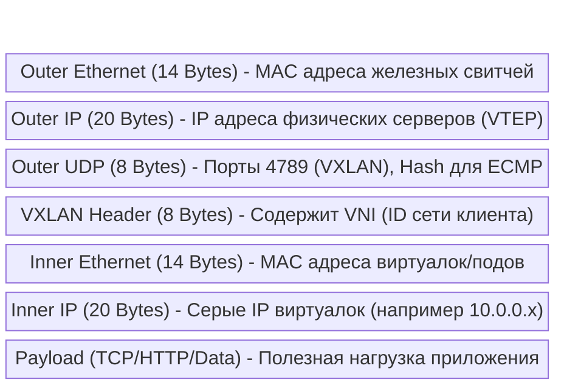

---
tags:
  - networking
  - vxlan
  - sdn
  - overlay
  - underlay
  - architecture
aliases:
  - Network Virtualization
  - Overlay Networks
---
# L1.NET.17: Network Virtualization - VXLAN, Geneve, Overlay networks internals 

> [!abstract] О лекции
> Современный глобальный дата-центр (или публичное облако AWS/GCP/Azure) — это уже давно не просто куча медных проводов, воткнутых в один гигантский свитч. Это строгая, двухуровневая архитектура: **Underlay** (физическая железная сеть, работающая как простое, скоростное IP-такси) и **Overlay** (виртуальная программная сеть, которая "возит" пакеты ваших виртуальных машин в инкапсулированных туннелях). Если вы дебажите Kubernetes CNI (Cilium/Calico) или настраиваете Private Cloud на OpenStack, вы как эксперт *обязаны* понимать, почему обычный пинг проходит между хостами, но таинственно падает между подами (спойлер: всё дело в MTU и магии инкапсуляции).

---
## 1. Проблема: Почему старый добрый VLAN (802.1Q) умер в эру Cloud Native?

Чтобы фундаментально понять, почему индустрия пришла к сложным протоколам VXLAN и Geneve, нужно разобрать анатомию классического VLAN и упереться в его непреодолимые архитектурные границы.

### 1.1. Ликбез: Что такое VLAN?
**VLAN (Virtual Local Area Network)** — это древний стандарт IEEE 802.1Q. По сути, это простейший аппаратный механизм логического разделения одной физической кабельной сети на несколько полностью изолированных сегментов на уровне L2 (канальном уровне OSI).

**Как это выглядит физически "на проводе":**
В стандартный кадр Ethernet (ровно между полями Source MAC и EtherType) жестко вставляется 4-байтовый тег (802.1Q Tag).
*   **TPID (Tag Protocol Identifier):** 2 байта, обычно значение `0x8100` — это маркер для свитча "Внимание, дальше идет VLAN-фрейм".
*   **TCI (Tag Control Information):** 2 байта метаданных, содержащие:
    *   Priority (CoS / 802.1p): 3 бита для аппаратного QoS (качество обслуживания голоса/видео).
    *   CFI/DEI: 1 бит (индикатор допустимости отбрасывания кадра при перегрузке).
    *   **VID (VLAN ID):** **Ровно 12 бит** — это и есть сам уникальный идентификатор сети.

Свитч аппаратно смотрит на VID. Если порт (или транк) не принадлежит этому VID, кадр молча отбрасывается. Это обеспечивает базовую изоляцию: отдел бухгалтерии (VLAN 10) физически не видит broadcast-трафик инженеров (VLAN 20).

---
### 1.2. Ограничение №1: Масштабируемость (Проклятие 4K лимита)
**Суть математической проблемы:** Поле VID занимает всего 12 бит памяти.
$$ 2^{12} = 4096 	ext{ уникальных математических идентификаторов}. $$
Из них VID 0 и 4095 зарезервированы стандартом для служебных целей. Итого: **4094** физически доступных сети на весь дата-центр.

**Почему это стало катастрофой для облаков (Multi-tenancy):**
В традиционном предприятии начала 2000-х годов 4000 изолированных сетей — это за глаза. Но представьте, что вы строите публичный AWS или Private Cloud на OpenStack/Kubernetes.
*   У вас 1 000 клиентов (Tenants).
*   Каждому клиенту для соблюдения ИБ нужна базовая изоляция окружений: `Dev`, `Stage`, `Prod`, `DMZ`, `Database Network`. Итого: минимум 5 сетей на клиента.
*   $1000 	imes 5 = 5000$ требуемых изолированных сетей.
*   **Лимит 4094 жестко исчерпан.** Вы больше не можете продавать услуги облака новым клиентам, архитектура не масштабируется.

*Попытка спасения (Протокол QinQ / 802.1ad):* Инженеры пытались придумать "костыль" — вкладывать один тег в другой тег (VLAN внутри VLAN), расширяя адресное пространство до $4096 	imes 4096$. Но это жутко усложнило железо (требовалась повсеместная поддержка увеличенного MTU и сложнейшая логика на каждом свитче), и главное — это абсолютно не решило следующие две фундаментальные проблемы.

---
### 1.3. Ограничение №2: Топология и STP (Убийца пропускной способности)
VLAN концептуально подразумевает единый, плоский широковещательный домен (Broadcast Domain). Чтобы виртуальная сеть работала и машины могли пинговать друг друга по ARP, этот L2-сегмент должен быть физически "растянут" между всеми сотнями стоек (Racks) в дата-центре.
В протоколе Ethernet петли маршрутизации (routing loops) смертельны: у кадра нет поля TTL (Time To Live), поэтому пакет будет крутиться по кругу со скоростью света вечно, пока сеть не ляжет от Broadcast Storm. Для защиты от этого исторически используется **Spanning Tree Protocol (STP)**.

**Как деструктивно работает STP:** Он строит логическое дерево, **принудительно блокируя (гася)** все резервные и избыточные линки.
*   **Сценарий:** Вы как архитектор купили и проложили два оптических кабеля по 100 Gbps между дорогими свитчами для надежности и скорости.
*   **Действие STP:** Протокол блокирует один кабель полностью, чтобы не было петли.
*   **Результат для бизнеса:** Вы заплатили миллион долларов за 200 Gbps пропускной способности, а реально используете только 100 Gbps. Половина ЦОДа простаивает. В современных дата-центрах, где горизонтальный трафик "East-West" (трафик между самими серверами: микросервисы, репликация баз данных) составляет 80% всего объема, потеря 50% пропускной способности сети просто недопустима.

*Для сравнения: в отличие от STP, умные протоколы маршрутизации уровня L3 (OSPF/BGP) используют ECMP (Equal-Cost Multi-Path) — они умеют балансировать трафик по **всем** доступным кабелям одновременно, загружая все 200 Gbps.*

---
### 1.4. Ограничение №3: MAC Address Explosion (Взрыв таблиц) и дорогая TCAM
Это самая технически сложная, низкоуровневая и дорогая для бизнеса проблема.

**Исторический Контекст:**
*   **Раньше (Bare Metal):** 1 физический сервер = 1 Операционная Система = 1 аппаратный MAC-адрес сетевой карты. Серверная стойка из 40 серверов генерировала всего 40 MAC-адресов.
*   **Сейчас (Virtualization/Kubernetes):** 1 мощный физический сервер = 50 виртуальных машин + 500 Docker контейнеров. Каждый контейнер имеет свой виртуальный MAC. Одна стойка генерирует **20,000 MAC-адресов**.

**Аппаратная проблема роутеров:**
Свитчи используют специальную, сверхбыструю память **TCAM** (Ternary Content Addressable Memory), чтобы за 1 такт кристалла понять, в какой конкретно порт нужно отправить пакет с `Dest MAC: AA:BB:CC...`.
*   Память TCAM невероятно дорогая в производстве, сильно греется и её физически мало на чипе (обычно от 32K до 128K записей MAC-адресов на один дорогой свитч).

**Сценарий полного отказа ЦОДа (Failure Mode):**
1.  Core-свитч ядра (Spine) дата-центра, чтобы правильно коммутировать классический L2 трафик, обязан знать и держать в TCAM памяти MAC-адреса *абсолютно всех* виртуалок и контейнеров во *всех* стойках.
2.  Таблица TCAM физически переполняется (например, кластер K8s задеплоил > 128k подов).
3.  Свитч больше не может запоминать новые адреса. Он переходит в режим паники — **Unknown Unicast Flooding**.
4.  **Эффект:** Любой пакет, идущий на неизвестный (вытесненный из памяти) MAC-адреса, тупо дублируется (Flood) во **все** порты всех VLAN-ов, как в 1995 году на дешевых хабах (hub).
5.  Вся сеть мгновенно ложится от колоссального шторма паразитного трафика. Вы падаете.

---
### 1.5. Итог: Архитектурная смена парадигмы (L2 over L3)
Архитекторы сетей (Cisco, VMware, Google) поняли, что пытаться растянуть капризный протокол L2 (Ethernet) на тысячи стоек — это инженерный тупик.

**Гениальное Решение (Overlay):**
1.  **Underlay (Физика):** Строим кабельную сеть исключительно на уровне L3 (IP-маршрутизация).
    *   Никаких VLAN и L2-доменов между свитчами.
    *   Никакого STP. Все линки активны и балансируют трафик (BGP ECMP).
    *   Железные свитчи ядра знают только IP-адреса самих 1000 физических серверов-хостов (их мало), а не адреса миллионов виртуалок. Таблицы TCAM никогда не переполняются.
2.  **Overlay (Виртуализация):** Виртуальные L2 сети для клиентов создаются чисто программно, поверх IP-сети.
    *   Маленький VLAN ID (12 бит) заменяется на гигантский VNI (24 бита) в протоколе VXLAN.
    *   Физические свитчи ядра больше не вникают в MAC-адреса контейнеров. Они видят просто UDP-пакеты, летящие от сервера А к серверу Б, и пересылают их.

Именно на этом принципе работают абсолютно все современные программно-определяемые сети: Kubernetes (плагины CNI), OpenStack (Neutron), AWS VPC и Azure VNet.

---
## 2. Анатомия Overlay (Наложенной сети)

На высоком уровне архитектуры, Overlay-сеть — это механизм изящной абстракции, который жестко разделяет **идентификацию** (Кто я такой? $	o$ IP/MAC самой виртуалки) и **локацию** (Где я сейчас физически нахожусь в дата-центре? $	o$ IP железного хоста).

### 2.1. Концептуальная модель: Инкапсуляция (Матрёшка) и Туннелирование

Представьте, что вы (Виртуалка А) отправляете обычное физическое письмо (Inner Packet) для Виртуалки Б. Вместо того чтобы просто бросить его в ящик и надеяться, что почта разберется с вашими внутренними адресами, система (Гипервизор) берет ваше письмо, кладет его в другой, **больший конверт** (Outer Packet), пишет на нем понятный почте адрес (IP) почтового отделения (Сервера Б) другого города и отправляет. Почта (Underlay сеть) доставляет большой конверт. Сервер Б вскрывает его, видит ваше оригинальное письмо и передает его адресату.

С точки зрения байтов (tcpdump), это выглядит как классическая **Матрёшка**:



### 2.2. Ключевые архитектурные компоненты

#### **A. VTEP (Virtual Tunnel Endpoint)**
Это альфа и омега любых Overlay-сетей. VTEP — это программная или аппаратная сущность, которая физически выполняет инкапсуляцию (encap - упаковку в туннель) при отправке и декапсуляцию (decap - распаковку) при приеме.
*   **Типы реализации VTEP:**
    1.  **Software VTEP (Программный):** Реализуется CPU гипервизора сервера. Примеры: **Open vSwitch (OVS)** встроенный в ядро Linux, **VPP** (userspace роутер), **eBPF**-программы (как в Cilium). Это максимально гибко, но потребляет такты CPU хоста на математику заголовков.
    2.  **Hardware VTEP (Аппаратный):** Реализуется аппаратно на ASIC-чипах Top-of-Rack свитча (Cisco Nexus, Arista). Это позволяет "глупым" физическим серверам без гипервизоров (Bare Metal БД) прозрачно общаться с облачными виртуалками, находясь в той же VXLAN сети. Туннель собирает свитч.
*   **Forwarding Table (FDB):** Каждый VTEP хранит в памяти локальную таблицу маппинга: `MAC_виртуалки_Б -> IP_физического_сервера_Б`.

#### **B. Underlay Network (Физический Транспорт)**
Это физическая инфраструктура кабелей и коммутаторов (обычно в топологии Spine-Leaf).
*   **Задача:** Обеспечить сверхбыструю IP-связность между самими VTEP-ами (Host A $\leftrightarrow$ Host B).
*   **Протоколы:** Обычно eBGP, реже OSPF или IS-IS.
*   **Ключевая особенность:** Underlay сеть **ничего не знает** о существовании ваших виртуалок и Kubernetes. Она видит только транзитный трафик между хостами (UDP пакеты). Она не хранит в TCAM MAC-адреса VM, что навсегда спасает память физических свитчей от переполнения.

#### **C. Overlay Network (Сервисный слой)**
Это сама виртуальная наложенная L2 или L3 сеть, которую видят клиенты.
*   **Идентификатор:** VNI (VXLAN Network Identifier) или VNU (в Geneve). 24 бита дают 16 миллионов изолированных сегментов.
*   **Жесткая Изоляция:** VM из сети `VNI 100` физически не может отправить пакет напрямую в `VNI 200`, даже если обе эти виртуалки работают на одном процессоре одного физического хоста. Для связи им потребуется внешний виртуальный роутер.

---
### 2.3. Step-by-Step: Жизненный цикл пакета (Packet Walk)

Разберем наглядный пример, который спрашивают на интервью, чтобы закрепить понимание магии оверлея.

**Дано (Инфраструктура):**
*   **Host A:** Физический IP `192.168.1.10`, работает VTEP A.
*   **Host B:** Физический IP `192.168.1.20`, работает VTEP B.
*   **VM 1 (запущена на Host A):** Виртуальный серый IP `10.0.0.1`, виртуальный MAC `AA:AA`.
*   **VM 2 (запущена на Host B):** Виртуальный серый IP `10.0.0.2`, виртуальный MAC `BB:BB`.
*   Сеть клиента: Изолированный VXLAN туннель с `VNI 5000`.

**Процесс прохождения Ping от VM 1 к VM 2:**

1.  **Origin (Генерация внутри VM 1):**
    *   ОС внутри VM 1 хочет отправить ICMP пакет на `10.0.0.2`.
    *   Локальный ARP Lookup (или кэш гостевой ОС) говорит, что IP `10.0.0.2` имеет MAC-адрес `BB:BB`.
    *   Ядро VM 1 формирует "наивный" **Inner Ethernet Frame**: `Src MAC: AA:AA`, `Dst MAC: BB:BB`. Выталкивает его в свой виртуальный сетевой интерфейс `eth0`. Виртуалка уверена, что она в локальной сети.

2.  **Interception (Перехват на VTEP A):**
    *   Программный виртуальный свитч хоста (например, OVS) перехватывает этот кадр на выходе из виртуалки.
    *   **L2 Lookup:** OVS смотрит в свою таблицу FDB (наполненную заранее через Control Plane) для изолированной сети `VNI 5000`.
    *   *Находит запись:* "Внимание, виртуальный MAC `BB:BB` физически находится за сервером (VTEP) `192.168.1.20`".
    *   *Действие:* Начать процесс инкапсуляции.

3.  **Encapsulation (Сборка Матрёшки на VTEP A):**
    VTEP собирает новые внешние заголовки вокруг оригинального пакета:
    *   **VXLAN заголовок:** Пишет `VNI=5000`.
    *   **UDP заголовок:** `Dst Port = 4789` (стандарт VXLAN). `Src Port = Hash(Inner_Header)` — вычисляет энтропийный хеш от внутренних IP/портов (очень важно для балансировки).
    *   **IP заголовок:** `Src IP = 192.168.1.10` (Сам Host A), `Dst IP = 192.168.1.20` (Целевой Host B).
    *   **Ethernet заголовок:** `Src MAC = NIC Host_A`, `Dst MAC = MAC_Next_Hop_Router` (ближайший физический свитч в стойке).

4.  **Transport (Полет через Underlay):**
    *   Тяжелый пакет (с оверхедом 50 байт) летит через физические свитчи ЦОДа.
    *   **Важнейший нюанс архитектуры (ECMP):** Физические свитчи видят этот пакет просто как UDP трафик от хоста А к хосту Б. Чтобы выбрать один из 4-х доступных оптических кабелей наверх (Uplink), свитчи хешируют 5-tuple, включая UDP порты. Благодаря тому, что VTEP сгенерировал псевдослучайный `SrcPort` на основе внутренних данных виртуалки, трафик сотен виртуалок внутри одного туннеля равномерно размазывается (балансируется) по всем кабелям дата-центра. Если бы порт был статичным, один кабель бы сгорел от нагрузки, а три бы простаивали.

5.  **Decapsulation (Распаковка на VTEP B):**
    *   Физический Host B получает пакет на свой UDP порт 4789.
    *   Ядро Linux понимает, что это VXLAN трафик, и передает его процессу VTEP.
    *   VTEP "срезает" внешние заголовки IP и UDP.
    *   Видит внутри тег `VNI 5000`. Понимает, что это данные для виртуальной сети "Клиента X".
    *   Смотрит на распакованный внутренний заголовок: `Dst MAC: BB:BB`.
    *   Находит локальный виртуальный порт (vPort), к которому подключена VM 2.

6.  **Delivery (Доставка в VM 2):**
    *   Пакет "впрыскивается" в виртуальный интерфейс VM 2.
    *   Гостевая ОС VM 2 видит абсолютно чистый, оригинальный кадр от `AA:AA` к `BB:BB`. Она понятия не имеет, что этот пакет только что пережил сложное путешествие через инкапсуляцию, хеширование и L3 роутинг. Для неё это магия локальной сети.

---
### 2.4. Архитектурный нюанс: UDP Checksum Zero (Оптимизация производительности)

При глубоком анализе дампов трафика (Wireshark) Overlay сетей вы часто увидите странную вещь: поле `UDP Checksum = 0` во внешнем заголовке (проверка отключена).
*   **Почему это делают:** Вычисление контрольной суммы всего огромного UDP пакета программно (включая весь payload виртуалки) — это очень дорогая операция для процессора сервера. Поскольку *внутренний* оригинальный пакет (например, TCP) уже имеет свою собственную надежную TCP-контрольную сумму, а *внешний* физический Ethernet имеет аппаратный CRC32 на уровне сетевой карты, дополнительная третья проверка на уровне туннеля UDP считается избыточной тратой CPU.
*   **Допустимый Риск:** Если сломанное физическое оборудование (битая память свитча) повредит 1 бит именно внутри заголовка VXLAN (сменив VNI 5000 на 5001), VTEP может ошибочно доставить пакет в чужую сеть. Однако, в современных дата-центрах с надежной оптикой и механизмом FEC (Forward Error Correction) этот микроскопический риск осознанно принимается индустрией ради резкого повышения пропускной способности.

---
## 3. VXLAN (Virtual Extensible LAN) — Индустриальный стандарт

**VXLAN (Описан в RFC 7348)** — это фундаментальный протокол туннелирования, который позволяет создавать логические (виртуальные) сети второго уровня (L2) поверх физической масштабируемой сети третьего уровня (L3). Простым языком, это способ "растянуть" длинный виртуальный Ethernet-кабель между странами через маршрутизируемый IP-интернет.

Для архитектора важно понимать не только *что* это за протокол, но и *почему* именно он безоговорочно победил всех конкурентов (таких как Microsoft NVGRE или VMware STT): VXLAN максимально элегантно использует уже существующее дешевое железо (Commodity Hardware свитчей) и его аппаратные механизмы балансировки нагрузки (ECMP) за счет использования UDP портов.

#### 3.1. Анатомия пакета: Overhead (Налог на размер) и Структура
VXLAN оборачивает (инкапсулирует) оригинальный Ethernet-кадр в UDP-пакет. Это действие безусловно добавляет **50 байт "мертвого" оверхеда** (заголовков) к каждому пересылаемому пакету данных. Если вы, как архитектор, не учтете эту математику при настройке MTU (Maximum Transmission Unit) сети, ваша сеть будет молча отбрасывать пакеты баз данных или страдать от чудовищной программной фрагментации.

**Структура VXLAN-пакета (от внешнего физического слоя к внутреннему полезному):**

| Уровень абстракции | Заголовок | Размер | Описание и Роль в архитектуре |
| :--- | :--- | :--- | :--- |
| **L2 Underlay** | **Outer Ethernet** | 14 байт | MAC-адреса физических серверов (или транзитных роутеров). Эти адреса перезаписываются на каждом прыжке (хопе) между физическими свитчами. |
| **L3 Underlay** | **Outer IP** | 20 байт | IP-адреса самих VTEP (серверов, точек входа и выхода туннеля). Вся физическая маршрутизация в ЦОДе идет исключительно по этим адресам. |
| **L4 Transport**| **Outer UDP** | 8 байт | **Dst Port:** Всегда `4789` (Стандарт IANA для VXLAN). <br>**Src Port:** Умный динамический хеш от внутренних данных (обеспечивает распределение нагрузки). |
| **Overlay Protocol** | **VXLAN Header** | 8 байт | Заголовок протокола. Содержит **VNI** (24 бита, ID вашей сети) и служебные флаги. |
| **L2 Inner (Гость)** | **Inner Ethernet** | 14 байт | Оригинальный Ethernet заголовок, созданный виртуальной машиной (MAC Src VM $	o$ MAC Dst VM). |
| **Payload** | **Original IP/Data**| N байт | Реальная полезная нагрузка клиента (IP заголовки, TCP сегменты, HTTP JSON). |

**Итоговый минимальный Overhead:** $14 + 20 + 8 + 8 = \mathbf{50 	ext{ байт}}$.

#### 3.2. Обработка BUM-трафика (Broadcast, Unknown Unicast, Multicast)
Самая большая проблема любого L2-оверлея: что делать, если VM-A (в облаке) наивно отправит широковещательный ARP-запрос "Эй, у кого тут IP 10.0.0.2?" (Broadcast MAC `FF:FF:FF:FF:FF:FF`)?
VTEP (гипервизор) не знает, кому конкретно переслать этот пакет (он же для всех). В стандарте VXLAN исторически есть два пути решения:

1.  **Multicast (Native / Старый подход):** VTEP инкапсулирует этот кадр и отправляет пакет в специальную Multicast-группу физической сети (например, на IP `239.1.1.1`). Физические свитчи аппаратно размножают его, и все VTEP-ы в ЦОДе, подписанные на этот VNI клиентской сети, получают копию пакета.
    *   *Минус Архитектуры:* Требует невероятно сложной настройки протоколов IGMP/PIM на всем физическом оборудовании сети. Это хрупко, падает под нагрузкой и невозможно дебажить.
2.  **Head-End Replication (Unicast / Современный подход):** VTEP на сервере-отправителе хранит в памяти актуальный список IP-адресов *всех* остальных VTEP в этой сети VNI. Он программно делает N копий (клонирует) исходный пакет и по очереди отправляет его обычным Unicast-ом (один на один) каждому VTEP по своему списку.
    *   *Плюс Архитектуры:* Вообще не требует поддержки Multicast от физической сети (Underlay). Работает поверх любого тупого интернета. Этот подход используется в 99% современных SDN (где списками узлов управляет умный BGP EVPN control plane).

---
## 4. Geneve (Generic Network Virtualization Encapsulation) — Стандарт Будущего

**TL;DR**: Протокол VXLAN был создан в 2014 году, чтобы тупо решить проблему емкости (от 4096 VLANs перейти к 16 миллиона VNIs). Протокол **Geneve (RFC 8926)**, созданный консорциумом гигантов (VMware, Microsoft, Red Hat, Intel), был разработан, чтобы решить современную проблему **Контекста (Метаданных)**. 
В современном облачном мире (Microservices/Zero Trust) пакет не просто летит из точки А в точку Б; он обязан нести вместе с собой информацию о том, *почему* он летит, к какой группе безопасности (Security Group) относится процесс-отправитель, и через какие цепочки проверки (Service Chaining / DPI) он уже прошел. Geneve — это идеальный, расширяемый транспортный контейнер для этих метаданных.

Geneve объединяет в себе лучшие черты предшественников: от VXLAN он взял транспорт поверх UDP (для ECMP балансировки), от NVGRE — логическую гибкость, от STT — возможность аппаратного ускорения.

### 4.1. Архитектурная необходимость: Проблема жесткого фиксированного заголовка VXLAN
В классическом заголовке VXLAN (размером 8 байт) полезную нагрузку несет только поле VNI (3 байта). Остальное — это поле `Reserved` и пара флагов. На протяжении лет инженеры K8s CNI пытались "хакнуть" стандарт, запихивая в эти резервные биты свои проприетарные данные (например, флаги политик).
*   **Сценарий Архитектора:** Вы используете OVN (Open Virtual Network) для кластера. Вам нужно реализовать фичу **Distributed Firewall (Распределенный фаервол без центральной железки)**.
*   **Проблема VXLAN:** Когда инкапсулированный пакет прилетает на гипервизор сервера назначения, принимающий VTEP знает только VNI (ID сети). Он понятия не имеет: был ли этот пакет *уже проверен* файрволом на исходящем узле? Принадлежит ли процесс-отправитель к доверенной группе "Prod-DB-Access"?
*   **Костыльное решение VXLAN:** Принимающий узел вынужден делать долгий синхронный lookup (запрос) в гигантскую централизованную базу данных состояний (что медленно) или гонять весь трафик ЦОДа через единый центральный Gateway-шлюз (что создает страшное "узкое горлышко" пропускной способности).
*   **Изящное решение Geneve:** Мы просто записываем ID группы безопасности и статус проверки пакета прямо в заголовок самого пакета! Пакет несет свой паспорт с собой.

### 4.2. Структура заголовка Geneve (Анатомия бесконечной гибкости)

Geneve, как и VXLAN, работает поверх стандартного UDP (официальный IANA порт **6081**).

`[ Outer ETH | Outer IP | UDP (Port 6081) | Geneve Base Header | Variable Options (TLV метаданные) | Inner Payload ]`

#### Base Header (Базовый Фиксированный заголовок, 8 байт):
1.  **Ver (2 бита):** Версия протокола (сейчас строго 0).
2.  **Opt Len (6 бит):** Критически важное поле производительности! Указывает длину всех последующих опций в 4-байтных словах.
    *   *Зачем это аппаратуре:* Это позволяет "тупому" аппаратному парсеру на сетевой карте (NIC) сразу за один такт пропустить все непонятные ему метаданные и перепрыгнуть (Offset) прямо к началу реальных данных (Inner Payload), чтобы начать вычислять их контрольную сумму (Offloading).
3.  **O (OAM Bit):** Флаг "Operations, Administration, and Management". Если бит `O=1`, это не данные пользователя, а служебный пакет плоскости управления (пинг туннеля, трейсинг). Аппаратные свитчи должны перехватить его (Trap to CPU) и отдать локальному контроллеру.
4.  **Protocol Type (16 бит):** Стандартный EtherType вложенного контента.
    *   *Киллер-фича:* В отличие от старого VXLAN (который исторически обязан нести внутри себя полные L2 Ethernet фреймы с MAC-адресами), Geneve умеет переносить чистые "голые" L3 IP-пакеты, или MPLS кадры. Это позволяет строить чистые L3-Overlay сети без паразитного оверхеда бессмысленных виртуальных MAC-адресов.
5.  **VNI (24 бита):** Virtual Network Identifier (идентификатор сети, как в VXLAN).

#### Variable Options (Опции переменной длины / TLV — Type, Length, Value):
Это бьющееся сердце стандарта Geneve. Опции-метаданные могут динамически занимать от 0 до 252 байт в каждом пакете (ограничено размером поля Opt Len).

Формат каждой опции:
*   **Option Class (16 бит):** Глобальное пространство имен (Vendor ID). Например, значение `0x0100` зарезервировано для Linux/OVN, `0x0101` — для Open vSwitch. Это строгая гарантия того, что вставленные метаданные от микрософта случайно не сломают парсинг метаданных от VMware в гибридном облаке.
*   **Type (8 бит):** Конкретный тип данных внутри класса вендора (например, тип "ID исходной группы безопасности").
*   **C (Critical Bit - Бит Критичности):** Самый важный флаг для системного архитектора при дебаге.
    *   Если `C=1` (Критично): Если гипервизор-приемник получает пакет и понимает, что он не умеет парсить эту конкретную опцию, он по стандарту **обязан немедленно дропнуть (уничтожить) пакет**. (Пример использования: опция "Этот пакет зашифрован ключом X" — если не понимаешь как расшифровать, уничтожь, не пускай дальше).
    *   Если `C=0` (Информационно): Если приемник не понимает опцию, он имеет полное право игнорировать её и успешно обработать пакет дальше. (Пример: опция "Trace ID для распределенного сбора логов").
*   **Length (5 бит):** Длина самих данных опции.
*   **Data:** Сами сырые байты метаданных.

### 4.3. Практический пример: Как работает OVN Distributed Firewall

Рассмотрим наглядно, как эта гибкость метаданных Geneve используется в `OVN` (стандартный SDN-мозг для современных платформ Red Hat OpenStack и высоконагруженных K8s через OVN-Kubernetes CNI).

1.  **Ingress (Старт):** Pod A (Микросервис Web) генерирует пакет для Pod B (База Данных).
2.  **Source VTEP (Гипервизор отправителя):**
    *   Перехватывает пакет. Смотрит локальные правила Network Policy K8s. Видит, что Pod A логически привязан к Security Group ID = `1005`.
    *   Проверяет таблицу состояний `conntrack` (состояние TCP соединения в ядре). Видит, что это не SYN пакет, а уже установленное доверенное соединение (флаг `ESTABLISHED`).
    *   Формирует заголовок Geneve пакета.
    *   Прямо в опции OVN (Class `0x0100`) VTEP "выжигает":
        *   Метаданные `Logical Source Port` = ID порта пода А (1005).
        *   Метаданные `Metadata` = `ct_state: ESTABLISHED` (статус из ядра).
3.  **Transit (Транзит):** Упакованный Geneve пакет летит по физической кабельной сети ЦОДа. Железные свитчи Cisco/Arista не понимают Geneve опций, они видят просто обычный UDP-пакет и маршрутизируют его аппаратно.
4.  **Destination VTEP (Гипервизор получателя):**
    *   Получает UDP пакет. Парсит Geneve заголовки.
    *   Читает вложенные опции. Ему больше **не нужно** делать долгий сетевой запрос к центральному API Kubernetes, чтобы узнать "А кто такой Pod A и какие у него права?". ID прав уже прилетел в самом пакете!
    *   Ему **не нужно** заново запускать тяжелый механизм ядра `conntrack` для проверки соединения, потому что флаг доверия `ESTABLISHED` уже криптографически передан узлом-отправителем (в пределах доверенной закрытой сети гипервизоров).
    *   Он за микросекунду применяет локальный ACL-фильтр для Pod B и отдает пакет внутрь.

**Итог для Архитектора:** Линейное, бесконечное масштабирование сложных политик безопасности (Zero Trust) на 100 000 подов без создания единого центрального узкого места (Choke Point).

### 4.4. Аппаратная проблема производительности (SmartNICs)

Если Geneve так хорош, почему он не вытеснил старый VXLAN полностью "еще вчера"? Из-за физики железа.

1.  **Сложность для кремния (ASIC):**
    *   Классические сетевые карты (NIC) и дешевые свитчи любят жесткие, фиксированные смещения (Offsets) в байтах. Их чипы аппаратно прошиты правилом: "Отсчитай ровно 42 байта от начала кадра, там всегда будет лежать IP адрес".
    *   В протоколе Geneve начало оригинального IP адреса (Inner Packet) "плавает" и динамически сдвигается в зависимости от длины вложенных опций (поле `Opt Len`).
    *   Старые сетевые карты (выпуска до 2018 года) физически не умеют "парсить" плавающий заголовок. Они не могут применить аппаратные ускорения **RSS (Receive Side Scaling)** и не могут вычислять контрольные суммы (**CSUM Offload**) для Geneve пакетов. В результате весь тяжелый процессинг (разбор пакета) падает на центральный процессор сервера (CPU). $	o$ Наблюдается катастрофическое падение пропускной способности сети с аппаратных 40 Gbps до жалких программных 3-5 Gbps, при 100% загрузке ядер хоста.

2.  **Архитектурное Решение — Эпоха SmartNIC / DPU:**
    *   Современные "умные" сетевые карты (Mellanox ConnectX-5/6, Intel E810) имеют на борту программируемые парсеры протоколов. Вендоры обновили микрокод, и теперь вы можете аппаратно "научить" карту понимать плавающий заголовок Geneve.
    *   Новые карты класса DPU (Data Processing Unit, например NVIDIA BlueField) вообще представляют собой полноценный микрокомпьютер (P4-программируемый свитч) на входе в сервер. Они аппаратно терминируют Geneve-туннели, применяют OVN-фаерволы на скорости 100 Gbps, отдавая в CPU гипервизора уже чистые "голые" пакеты. CPU хоста вообще не замечает работы SDN.

### 4.5. Резюме для выбора технологий (Tech Radar)

Как Архитектору вам придется выбирать базис для вашего Private Cloud или K8s кластера:
1.  **Выбирайте Geneve**, если вы строите масштабную, сложную программную SDN-систему (Kubernetes с CNI Cilium / OVN-Kubernetes, крупный OpenStack), где критически требуется сквозная передача метаданных (политики Zero Trust, распределенный трейсинг, Service Chaining) между вычислительными узлами на высоких скоростях. Это выбор современных гиперскейлеров.
2.  **Выбирайте VXLAN**, если вам нужна железная стабильность, максимальная совместимость с устаревшим или простым "глупым" железом (интеграция через Hardware VTEP на коммутаторах Arista/Cisco, которые часто в силу возраста ASIC не умеют парсить Geneve), или если вы используете базовые, примитивные оверлеи без сложных политик (старый Flannel, Docker Swarm).
3.  **Калькуляция MTU (Боль и слезы):** Для Geneve расчет MTU — это головная боль девопса.
    *   Базовый (Base) overhead: 50 байт.
    *   Максимальный размер опций: 252 байта.
    *   *Практический совет Эксперта:* В системах с включенным Geneve (например, внутри AWS VPC или Red Hat OVN) оверхед динамический для каждого пакета, но чтобы спать спокойно, архитекторы закладывают запас прочности (MTU Tax) **строго минимум в 100 байт** (а лучше 150), вместо 50 для обычного VXLAN. Это гарантия того, что вы внезапно не получите тотальную IP-фрагментацию в сети при будущем включении новой фичи eBPF-трассировки (которая добавит 20 байт TLV-метаданных в каждый пакет).

---
## 5. Control Plane: Discovery & Address Learning 

Самый концептуально сложный технический вопрос в архитектуре любых Overlay-сетей заключается не в том «как физически упаковать пакет» (инкапсуляция понятна), а **«как, черт возьми, сервер VTEP A вообще узнает, что нужный ему виртуальный MAC-адрес машины VM2 физически находится именно за IP-адресом конкретного сервера VTEP B (из тысяч возможных в ЦОДе)?»**.

В индустрии за 10 лет эволюции сформировалось две фундаментальные стратегии поиска соседей: **Data Plane Learning** (устаревший, "шумный" подход) и **Control Plane Learning** (интеллектуальный стандарт современного энтерпрайза).

### 5.1. Стратегия 1: Data Plane Learning (Метод Flood-and-Learn)

Этот древний метод почти дословно эмулирует поведение обычного физического тупого Ethernet-свитча, но растягивает эту "тупость" на масштабы гигантской IP-сети маршрутизаторов.

*   **Механизм (Шаги):** Изначально при включении питания таблицы всех VTEP абсолютно пусты.
    1.  **BUM Traffic (Инициация):** Если виртуальная машина VM1 пытается впервые связаться с VM2, она шлет стандартный ARP-запрос («Кто имеет IP 10.0.0.2? Tell 10.0.0.1»). Это широковещательный Broadcast пакет.
    2.  **Underlay Multicast (Затопление):** Сервер VTEP A обязан гарантированно доставить этот Broadcast-пакет **абсолютно всем** остальным VTEP-серверам в рамках этой изолированной клиентской сети (VNI). Для этого в железной физической сети (Underlay) используется протокол IP Multicast. VTEP A отправляет пакет на мультикаст-группу (например, `239.1.1.1`), а физические свитчи размножают его.
    3.  **Learning (Обучение на лету):** Когда сервер VTEP B наконец-то получает этот мультикаст-пакет от VTEP A (и видит внутри него оригинальный кадр с `Source MAC = MAC_VM1`), он "на лету" делает логический вывод (учится): *«Ага! Раз пакет от MAC_VM1 пришел ко мне из туннеля, исходящего от внешнего IP-адреса VTEP A, значит MAC_VM1 физически живет на сервере VTEP A!»*. Он кэширует эту драгоценную запись в свою таблицу (Forwarding Database - FDB). Когда VM2 отправит ответ (Unicast), VTEP B уже будет знать, куда точно слать туннель, без рассылки Broadcast.

*   **Почему это архитектурно ужасно для Production:**
    1.  **BUM Storms (Широковещательные штормы):** В сети на 10,000 виртуалок обычный фоновый ARP-трафик в оверлее превращается в разрушительный мультикаст-шторм в физической железной сети, перегружая CPU коммутаторов и убивая полезную пропускную способность (Goodput) всего дата-центра.
    2.  **Cloud Limitations (Ограничения облаков):** Публичные провайдеры (AWS, Azure и Google Cloud) ради безопасности и защиты от штормов на уровне гипервизоров аппаратно **строго блокируют любой Multicast** трафик клиентов на уровне своей физической сети. Там этот "наивный" метод просто физически не заработает.

---
### 5.2. Стратегия 2: Control Plane Learning (BGP EVPN)

Это современный индустриальный стандарт (описан в RFC 7432), который используется в продвинутых ЦОДах и Kubernetes-инсталляциях. Вместо того чтобы «кричать» в сеть (Flood) и мучительно ждать ответа, все VTEP-серверы интеллигентно и заранее обмениваются структурированной информацией о том, кто где живет, используя мощный математический протокол маршрутизации.

В качестве универсального "языка общения" используется **MP-BGP (Multi-Protocol BGP)** со специализированным расширением **EVPN (Ethernet VPN)**.

#### А. Архитектура работы (Step-by-step)
1.  **Local Learning (Локальное событие):** Программный VTEP на сервере (например, демон Cilium или Open vSwitch) узнает о появлении новой локальной виртуалки (через вызов CNI плагина от Kubelet или через API самого гипервизора KVM). Он достоверно знает её новый виртуальный MAC и IP адрес.
2.  **Advertisement (BGP Анонс):** VTEP (в котором запущен BGP-клиент, например FRR или GoBGP) программно формирует стандартное BGP Update сообщение и отправляет его по TCP на центральный рефлектор маршрутов (BGP Route Reflector - RR).
3.  **Distribution (Дистрибуция):** Центральный RR мгновенно, как брокер сообщений, рассылает это обновление всем остальным VTEP-серверам в кластере (которые подписаны на данную VNI сеть).
4.  **Installation (Применение):** Другие VTEP получают BGP-маршрут и молча, без единого пакета в сеть данных, добавляют готовую запись в свои таблицы ядра: `Если спросят MAC_VM2 -> Отправляй инкапсулированный туннель на IP_VTEP_B`.

#### Б. Типы маршрутов BGP EVPN (Критично для Troubleshooting)
В громоздком стандарте BGP EVPN специфицировано множество типов маршрутов (Route Types), но настоящий сетевой практик (Troubleshooter) обязан наизусть знать два самых главных:

*   **Type-2 Route (MAC/IP Advertisement Route - Анонс конкретного хоста):**
    *   **Суть данных:** BGP пакет несет сообщение: «В моей зоне ответственности поднялся новый хост. Его MAC-адрес `AA:BB:CC:DD:EE:FF`, и у него IP `10.0.0.5`».
    *   **Архитектурное назначение:** Это основа для построения плоской L2-связности (эмуляция свитча) и, что критично важно, база для реализации продвинутого **ARP Suppression** (см. ниже пункт 5.3).
*   **Type-5 Route (IP Prefix Route - Анонс подсети):**
    *   **Суть данных:** BGP пакет несет сообщение: «За моим сервером находится целая маршрутизируемая подсеть `10.0.10.0/24`».
    *   **Архитектурное назначение:** Позволяет прозрачно маршрутизировать трафик между совершенно разными подсетями клиентов (Концепция L3 VPN) без необходимости создания единых гигантских L2 доменов. Это технологическая основа паттерна **Distributed L3 Gateway** (Распределенный шлюз), когда абсолютно каждый физический сервер-хост выступает в роли "умного роутера" для своих локальных виртуалок, устраняя пинг-понг трафика через центральные роутеры (Hairpinning).

---
### 5.3. ARP Suppression (Магия устранения "широковещательного шума")

Это абсолютная киллер-фича (преимущество) подхода Control Plane Learning. Как навсегда избавить дата-центр от мусорных ARP-запросов (Broadcast), которые десятилетиями являются главной чумой и ограничителем масштабирования любых L2 сетей?

**Сценарий магии в реальном времени:** Виртуалка VM1 хочет впервые отправить IP-пакет, но ей нужно узнать MAC-адрес для IP `10.0.0.2` (машины VM2).
1.  Гостевая ОС VM1 наивно шлет стандартный `ARP Request: Who has 10.0.0.2?` (на широковещательный адрес `FF:FF:FF:FF:FF:FF`).
2.  **Перехват гипервизора:** Умный VTEP (OVS/eBPF) на физическом локальном хосте (Host 1) жестко перехватывает этот ARP-запрос еще до того, как он коснется физической сетевой карты. Он **запрещает** отправлять этот мусорный broadcast в физическую сеть.
3.  **Локальный Lookup:** VTEP молча смотрит в свою локальную оперативную память (таблицу ядра), которую он ранее заботливо наполнил благодаря прилетевшим фоном **BGP EVPN Type-2** маршрутам от других серверов. Он делает мгновенный поиск и находит ответ: `IP 10.0.0.2 математически соответствует MAC-адресу MAC_VM2`.
4.  **Proxy Response (Ответ от имени друга):** VTEP выступает как "Proxy". Он мгновенно, за микросекунды сам генерирует и отправляет ответ виртуалке VM1 от имени VM2: `ARP Reply: IP 10.0.0.2 находится по адресу MAC_VM2`.
5.  **Блистательный Итог:** VM1 получила нужный MAC-адрес мгновенно. При этом **ни один** мусорный широковещательный пакет физически не покинул пределы процессора Host 1! В реальную физическую сеть (Underlay) отправится уже сразу готовый, целевой (unicast) VXLAN пакет с полезными данными, не нагружая коммутаторы дата-центра.

---
### 5.4. Пример из жизни: Жизненный цикл контейнера в Kubernetes (Cilium/Calico BGP)

Давайте проследим по техническим шагам, что происходит "под капотом" ядра Linux при старте обычного Pod-а в современном K8s кластере, чтобы закрепить понимание.

**Дано (Топология):**
*   **Node A (Worker 1):** Физический IP `192.168.1.10`.
*   **Node B (Worker 2):** Физический IP `192.168.1.20`.
*   В кластере K8s развернут SDN-мозг: BGP EVPN Control Plane (например, Cilium с включенным BGP Control Plane).

**Процесс развертывания сети (Network Provisioning):**
1.  **Start:** Kubelet на ноде Node B запускает контейнер Pod `nginx` с выданным IP `10.2.0.5` и сгенерированным виртуальным MAC `66:55:44:33:22:11`.
2.  **Local Learn:** CNI плагин (вызванный Kubelet-ом) настраивает локальный виртуальный интерфейс (veth pair) и по API сообщает локальному демону BGP (например, встроенному FRRouting или GoBGP) о появлении нового эндпоинта маршрутизации.
3.  **BGP Update (Выход в сеть):** Демон на Node B мгновенно формирует и отправляет в сеть BGP сообщение (Type-2 Route):
    *   Поле NLRI (Network Layer Reachability Information): `MAC: 66:55...`, `IP: 10.2.0.5`.
    *   Поле Next Hop: `192.168.1.20` (адрес самого сервера Node B).
    *   Поле VNI: `100` (ID изолированной сети Kubernetes).
4.  **Propagation:** Демон на Node A получает это BGP сообщение по TCP сессии.
5.  **Data Plane Update (Программирование ядра Linux):** Управляющий процесс на Node A распаковывает BGP пакет и программирует сетевой стек ядра Linux (обновляя FDB - Forwarding Database моста и ARP-кеш соседа):
    *   Ядро выполняет эквивалент: `arp -s 10.2.0.5 66:55...` (Запись в ARP: IP пода имеет такой-то MAC).
    *   Ядро выполняет эквивалент: `bridge fdb add 66:55... dev vxlan0 dst 192.168.1.20` (Запись в FDB: Пакеты для этого MAC заворачивай в VXLAN-интерфейс и пуляй на IP ноды 192.168.1.20).

**Практический Результат:** В ту секунду, когда другой Pod, запущенный на Node A, захочет отправить HTTP запрос на IP `10.2.0.5`:
1.  Ядро ОС Node A уже достоверно знает MAC-адрес назначения (из BGP ARP-кеша).
2.  Ядро ОС Node A уже аппаратно знает, в IP какого удаленного сервера-VTEP нужно инкапсулировать этот MAC (в `192.168.1.20`).
3.  UDP-Пакет улетает в оптику мгновенно, без микро-задержек на резолвинг ARP (поиск соседа) и без создания паразитного броадкаст-шума в сети.

---
### 5.5. Centralized Control Plane (Централизованные SDN Контроллеры)

Для полноты архитектурной картины: в гигантских публичных облаках (таких как компоненты AWS VPC) и в серьезных корпоративных on-premise системах типа **OVN (Open Virtual Network - сердце OpenStack)** в качестве Control Plane используется не распределенный протокол BGP, а архитектура **Централизованной базы данных** (например, OVSDB, использующая алгоритм консенсуса Raft).
*   Абсолютно все гипервизоры (VTEP) в дата-центре держат постоянное TCP-подключение к центральному кластеру SDN-контроллера (SDN Controller).
*   Контроллер собирает глобальное состояние всего ЦОДа и "пушит" (Push) готовые, просчитанные изменения таблиц потоков (Flows, OpenFlow rules) напрямую в память гипервизоров.
*   **Архитектурный Плюс:** Идеальная видимость всей сети (Global View). Контроллер может строить сложнейшие графы безопасности и мгновенно программировать политики.
*   **Архитектурный Минус:** Кластер контроллеров — это единая точка отказа (SPOF) и потенциальное узкое горлышко масштабирования (Scalability bottleneck), хотя современные реализации (база OVN Southbound DB) оптимизированы так, что легко масштабируются на десятки тысяч вычислительных узлов.

### Резюме архитектурного раздела 5
*   **Flood-and-Learn (Data Plane)** = Много шума, грязь в сети, катастрофически плохая масштабируемость. Архитекторы используют это только для тестирования и крошечных лаб.
*   **BGP EVPN (Control Plane)** = Идеальная чистота эфира, строгий порядок, аппаратное подавление ARP (ARP Suppression). Де-факто отраслевой стандарт для серьезных Private Cloud и bare-metal Kubernetes кластеров.
*   **Type-2 Route (BGP)** переносит по сети информацию о маппинге MAC+IP (обеспечивая виртуальную L2 связность).
*   **Type-5 Route (BGP)** переносит по сети информацию о целых подсетях (обеспечивая распределенную L3 маршрутизацию без узких мест).

---
## 6. Боль и страдания практика: MTU и Offloading (Пожиратели производительности)

В любых виртуализованных Overlay сетях существует физический, невидимый разработчику "налог" на каждый отправленный по кабелю байт. Если вы, как DevOps или Сетевой Инженер, не уплатите этот налог правильно при настройке операционной системы (MTU), ваша сеть будет коварно и молча отбрасывать пакеты, приводя к самым загадочным, труднодиагностируемым багам в приложениях ("Heisenbugs" — "почему curl висит бесконечно, а пинг идет?").

## 6.1. Суровая Математика Инкапсуляции: Откуда берутся лишние "паразитные" байты?

Когда операционная система виртуалки (VM/Pod) генерирует и отправляет стандартный Ethernet-кадр (например, 1500 байт), для гипервизора (VTEP) этот кадр становится просто куском данных — "полезной нагрузкой" (Payload). Чтобы безопасно доставить его через чужую транзитную IP-сеть, VTEP обязан программно "обернуть" его и добавить свои собственные транспортные заголовки.

### Декомпозиция оверхеда (Пример протокола VXLAN)
Представьте, что внутри VM процесс хочет отправить ровно 1500 байт (стандартный максимум MTU сетевой карты по умолчанию).
Программный VTEP гипервизора начинает добавлять слои:
1.  **Inner Ethernet Header (от виртуалки):** $14$ байт (оригинальные MAC адреса).
2.  **VXLAN Protocol Header:** $+8$ байт (содержит заветный номер сети VNI).
3.  **Outer Transport UDP Header:** $+8$ байт (порты источника и назначения 4789).
4.  **Outer Transport IP Header:** $+20$ байт (IP адреса серверов-гипервизоров VTEP-ов).
5.  **Outer Physical Ethernet Header:** $+14$ байт (MAC адреса физических свитчей ЦОДа).

**Итого физический налог (Overhead инкапсуляции):** $8 + 8 + 20 + 14 = \mathbf{50 	ext{ байт}}$.
*(Примечание для педантов: иногда сетевики считают 50 байт оверхеда уровня L3, а иногда 54 байта, если в физической сети учитывается железный FCS или VLAN-тег порта коммутатора. Но 50 байт — это железобетонный базовый минимум, о котором нужно помнить всегда).*

**Фундаментальная Проблема Физики:** Если ваш физический сетевой интерфейс в сервере (`eth0`) настроен на классический MTU в 1500 байт, то итоговый сформированный пакет размером $1500 (	ext{данные}) + 50 (	ext{заголовки}) = \mathbf{1550 	ext{ байт}}$ в него **просто физически не пролезет**, так как превышает разрешенный размер буфера сетевой карты.

## 6.2. Анатомия "Тихой смерти" соединения (The Silent Drop Problem)

У джуниора возникает резонный вопрос: "Почему сеть просто не фрагментирует (не разрежет) этот большой пакет на два маленьких? Ведь в протоколе IPv4 есть встроенный механизм фрагментации!".

1.  **DF Bit (Флаг Don't Fragment):** Почти абсолютно весь современный прикладной TCP-трафик (HTTP запросы API, SSH сессии, коннекты к базам данных PostgreSQL) по умолчанию формируется ядром Linux с жестко установленным битом `DF=1` в заголовке IPv4. Это делается из соображений производительности: программная фрагментация на роутерах и последующая сборка (Reassembly) кусков на сервере-приемнике — это чудовищно тяжелая и дорогая операция для процессора (CPU penalty). ОС говорит сети: "Никогда не режь мой пакет, лучше убей его".
2.  **Хронология катастрофы (Сценарий провала):**
    *   Приложение в VM генерирует тяжелый пакет 1500 байт (например, кусок файла) с флагом `DF=1`.
    *   VTEP гипервизора послушно оборачивает его в туннель, получая "жирный" пакет размером 1550 байт.
    *   VTEP пытается "выплюнуть" его в физический интерфейс сервера (`eth0` с MTU 1500) или физический свитч пытается передать его дальше.
    *   Сетевой стек (или роутер) видит конфликт: пакет (1550) больше физического лимита трубы (1500), а дробить (фрагментировать) его категорически запрещено флагом (`DF=1`).
    *   **Неизбежный Результат:** Ядро или роутер просто молча уничтожают (Drop) этот пакет.
3.  **Смерть ICMP (Blackhole):**
    *   По строгим стандартам RFC, маршрутизатор или сервер, убивший (дропнувший) такой пакет, обязан сгенерировать и вернуть отправителю специальное служебное ICMP-сообщение об ошибке: **Type 3 Code 4 (Fragmentation Needed and DF set)**, в котором прямым текстом сказано: "Твой пакет слишком жирный, мой локальный MTU трубы равен 1500 байт, пришли размер поменьше".
    *   Этот механизм обратной связи называется **PMTUD (Path MTU Discovery)**.
    *   **Реальность Cloud Native:** Суровые "безопасники" (SecOps), параноидальные админы или криво настроенные облачные Security Groups (AWS/GCP) в 90% случаев тупо блокируют и режут **весь** ICMP трафик ("чтобы не пинговали и не DDoS-или"). 
    *   **Смертельный паттерн:** Из-за блокировки ICMP, ядро сервера-отправителя так и не получает спасительного уведомления об ошибке. TCP стек отправителя (ваше приложение) искренне думает, что пакет просто случайно потерялся в сети (Packet Loss). TCP ждет таймаут и упрямо переотправляет этот же "жирный" пакет (1500 байт) снова и снова. И его снова и снова молча дропают. Соединение "зависает" навсегда.

**Классический Симптом (Как распознать):** `ping google.com` работает идеально (потому что по умолчанию размер ping-пакета крошечный, всего 64 байта, и он со свистом влезает в трубу даже вместе с VXLAN-оверхедом). А вот `curl https://google.com` или `kubectl logs` висит бесконечно и отваливается по таймауту (потому что TLS Handshake или передача блоков данных генерируют огромные TCP-сегменты по 1500 байт, которые убиваются туннелем).

## 6.3. Инженерные Стратегии выживания (Fixing MTU)

Как системный архитектор платформы, вы имеете три пути архитектурного решения этой проблемы.

### Путь А: Jumbo Frames (Единственно правильный, "Hardware" путь)
Если вы физически контролируете железо и свою магистральную оптическую сеть (ваша компания владеет On-Premise дата-центром).
*   **Решение:** Радикально и с запасом увеличить размер MTU на физическом транспортном уровне ("Underlay").
*   Вы (или сетевики) прописываете на всех портах аппаратных свитчей (Spine/Leaf), магистральных роутерах и в настройках физических сетевых карт (NIC) серверов параметр **MTU 9000** (или хотя бы 1600 байт). Это называется включением Jumbo Frames.
*   MTU виртуальных интерфейсов внутри гостевых виртуалок (или K8s подов) вы строго оставляете стандартным: **1500 байт**.
*   **Идеальный Результат:** "Жирный" пакет инкапсулированного оверлея размером 1550 байт со свистом и без задержек пролетает в огромную физическую "трубу" размером 9000 байт. Нет никакой фрагментации, PMTUD работает идеально, достигается абсолютная максимальная аппаратная эффективность и пропускная способность сети ЦОДа.

### Путь Б: Уменьшение Overlay MTU (Вынужденный путь Облака)
Если физическая транспортная сеть вам не принадлежит (вы арендуете виртуалки в AWS, GCP или гоняете туннели прямо через дикий Интернет), вы физически не можете заставить провайдера поднять MTU на магистральных роутерах.
*   **Решение:** Программно "сжать" (занизить лимит) размер внутреннего пакета (полезной нагрузки), генерируемого самой операционной системой гостя.
*   Вы настраиваете виртуальный сетевой интерфейс (`eth0` / `cni0`) *внутри* самой виртуалки или Docker-пода по строгой формуле: `Virtual_MTU = Physical_Underlay_MTU - Tunnel_Overhead`.
*   Для стандартного протокола VXLAN (оверхед 50): $1500 - 50 = \mathbf{1450 	ext{ байт}}$.
*   Для продвинутого протокола Geneve (базовый оверхед ~60, плюс возможны метаданные): $1500 - 60 = \mathbf{1440 	ext{ байт}}$ (архитекторы часто перестраховываются и занижают до 1400).
*   Для шифрованного туннеля WireGuard (используется в Calico/Cilium encryption): $1500 - 80 = \mathbf{1420 	ext{ байт}}$.
*   **Как это делается на практике:** В Kubernetes это настраивается одним глобальным флагом конфигурации (например, `--veth-mtu` в настройках DaemonSet вашего CNI плагина - Calico/Flannel/Cilium). Плагин сам применит это ко всем новым подам.

### Путь В: Магия TCP MSS Clamping (Грязный хак / Спасательный круг)
Что делать администратору, если вы не контролируете сеть, и при этом физически не можете или не имеете прав поменять настройки MTU внутри самой гостевой виртуалки (например, это закрытый вендорский Virtual Appliance, черный ящик из 2010 года, или ядро старой Windows)?
*   **Теория MSS (Maximum Segment Size):** Это параметр внутри заголовка протокола TCP (работающий во время стадии 3-way handshake). Этим параметром сервер "А" говорит серверу "Б": "Я физически готов принять от тебя кусок полезных данных размером не более X байт". По стандартам математики TCP, $MSS = 	ext{Текущий\_MTU_Интерфейса} - 40 	ext{ байт}$ (отнимается 20 байт на заголовок IP и 20 байт на базовый заголовок TCP).
*   **Гениальное Решение (Перехват):** Вы настраиваете подмену пакетов прямо на уровне фаервола хоста-гипервизора (iptables / nftables), на котором крутится эта виртуалка.
*   **Команда Linux (заклинание сисадмина):**
    ```bash
    # Заставляем ядро на лету инспектировать транзитный TCP трафик (SYN пакеты) 
    # и принудительно переписывать значение MSS под реальный физический MTU канала
    iptables -t mangle -A FORWARD -p tcp --tcp-flags SYN,RST SYN -j TCPMSS --clamp-mss-to-pmtu
    ```
*   **Как работает эта магия:** Когда тупая виртуалка (с неверным MTU 1500) начинает устанавливать TCP соединение (шлет первый SYN пакет), правило `iptables` ядра гипервизора ловит этот пакет, вскрывает TCP-заголовок "на лету" переписывает в нем значение поля MSS, искусственно занижая его (например, с 1460 до 1410). Виртуалка-отправитель продолжает наивно думать, что у неё доступен MTU 1500, но сервер-собеседник на другом конце провода, получив подмененное "письмо", будет принудительно нарезать и слать ей в ответ только маленькие пакеты по 1400 байт. В итоге трафик пролезает в туннель!
*   **Критический недостаток:** Этот грязный хак (Clamping) работает **исключительно и только для протокола TCP**. Любой тяжелый трафик протокола UDP (а это потоковое видео, DNSSEC ответы, протокол QUIC/HTTP3) всё равно будет безжалостно дропаться сетью, потому что в UDP нет поля MSS и стадии согласования (handshake).

---
## 6.4. Hardware Offloading: Почему горят ядра CPU серверов?

Программная инкапсуляция Overlay сетей в ядре Linux — это бесконечное, изматывающее копирование мегабайтов памяти (RAM) и математически тяжелое вычисление контрольных сумм для каждого отдельного пакета. Если заставлять делать эту низкоуровневую работу центральный процессор общего назначения (x86 CPU Intel/AMD), вы легко потратите 30-50% ресурсов мощного вычислительного ядра (в статусе `sys` / `softirq`) исключительно на глупое перекладывание байтов из буфера в буфер. Сервер за $10k будет работать как роутер за $100.

### TSO (TCP Segmentation Offload) — Аппаратная Классика L2
В мире без туннелей ОС Linux не делит гигабайты данных на мелкие пакеты по 1500 байт сама. ОС отдает аппаратной сетевой карте (NIC) огромный кусок сырых данных (супер-буфер размером 64 Килобайта) и дает аппаратную команду: "Сама аппаратно нарежь эту глыбу на правильные пакеты по 1500 байт, сама аппаратно посчитай для каждого кусочка контрольную сумму IP (IP checksum), контрольную сумму TCP (TCP checksum) и сразу выплюнь в оптический кабель". Это великое изобретение экономит ядру сотни тысяч аппаратных прерываний (Interrupts) в секунду.

### Encapsulated Offloading (Inner TSO / VxLAN Offload) — Зона Экспертов
В сложных Overlay сетях сетевая карта физически "видит" только **внешний** транспортный заголовок (Outer IP/UDP).
*   **Сценарий A: Если сетевая карта "глупая" (старая, нет аппаратной поддержки VXLAN/Geneve):** Она не может понять, что внутри этого жирного UDP-пакета глубоко внутри запрятан еще один TCP-заголовок гостевой виртуалки. Она физически не может сделать умный аппаратный TSO для "внутреннего" пакета. В результате ядро ОС Linux (процессор хоста) вынуждено сдаться: CPU сам программно нарезает данные на кусочки по 1450 байт, CPU сам программно инкапсулирует каждый кусочек в индивидуальный VXLAN UDP-заголовок и программно считает математику чексумм. **Физическая пропускная способность сервера (Throughput) катастрофически падает с возможных аппаратных 40 Gbps до жалких программных 2-3 Gbps.**
*   **Сценарий B: Использование SmartNIC (Современные чипы Mellanox ConnectX-5+, Intel X710/E810):** Эта умная сетевая карта аппаратно на уровне кремния умеет глубоко парсить структуру VXLAN/Geneve протоколов.
    1.  Драйвер ОС Linux дает умной карте буфер на 64 КБ с данными виртуалки и говорит: "Вот данные, заверни их все в этот шаблонный VXLAN туннель".
    2.  Карта (ASIC) *сама* аппаратно и со скоростью света нарезает внутренний пэйлоад.
    3.  Карта *сама* математически вычисляет и подставляет **Inner Checksum** (для виртуального заголовка TCP гостя) и **Outer Checksum** (для физического заголовка UDP хоста).
    4.  CPU сервера абсолютно свободен и может заниматься полезной бизнес-логикой (крутить базы данных). Сеть работает на честных 40-100 Gbps.

### RSS (Receive Side Scaling) и фундаментальная проблема энтропии хеширования
Когда лавина пакетов со скоростью миллионов в секунду (Mpps) прилетает из оптики на сервер (входящий трафик), сетевая карта обязана аппаратно раскидать эти пакеты по разным аппаратным очередям RX (чтобы их параллельно обрабатывали разные ядра CPU). Распределение происходит на основе математического хеша `(SrcIP, DstIP, SrcPort, DstPort)`.
*   **Фатальная Проблема Туннелей:** В упакованном VXLAN туннеле внешние `SrcIP` и `DstIP` — это IP адреса двух физических гипервизоров. Они *абсолютно одинаковые* для десятков тысяч разных логических соединений виртуалок, запакованных внутри этого туннеля!
*   Если глупая сетевая карта смотрит только на эти внешние IP заголовки, её алгоритм выдаст один и тот же хеш. **Весь гигабитный трафик гигантского туннеля "упадет" в одну-единственную аппаратную очередь и намертво повесит одно-единственное ядро CPU (100% `softirq`)**. Это ядро захлебнется и начнет отбрасывать пакеты, в то время как остальные 63 ядра сервера будут мирно спать с 0% загрузки.
*   **Аппаратное Решение:** Современная сетевая карта аппаратно обязана (фича Inner RSS) заглядывать "сквозь" внешний заголовок UDP/VXLAN **внутрь** пакета, находить там скрытые IP/Port адреса гостевой виртуалки, и считать математический хеш именно по ним! Только это позволяет идеально равномерно размазать входящую сетевую нагрузку виртуалок по всем 64 ядрам мощного хоста-сервера.

### Практикум: Пример системной диагностики (Командная строка)
Если у вас в высоконагруженном Kubernetes кластере (на железных серверах) наблюдается необъяснимо низкая скорость сети между подами (при свободных CPU), выполните на проблемной физической Worker-ноде (с правами root) команду диагностики:
```bash
ethtool -k eth0 | grep vxlan
```
Для высокой производительности (10g+) вы **обязаны** увидеть в выводе включенные аппаратные оффлоады (состояние `on`):
```text
tx-udp_tnl-segmentation: on  <-- Самое важное: Карта физически умеет резать большие куски VXLAN туннеля (Inner TSO)
tx-checksum-ip-generic: on   <-- Карта физически умеет вычислять сложные двойные checksum для туннелей
rx-udp_tunnel-port-offload: on <-- Карта умеет правильно парсить входящие туннели для раскидывания по ядрам (RSS)
```
Если вы видите там грустное `off` (или поля вообще отсутствуют) — это приговор. Срочно обновляйте драйверы ядра, прошивайте firmware сетевой карты (NIC Firmware Update) или выкидывайте устаревшее железо, иначе ваша модная Software-Defined Overlay сеть всегда будет непреодолимым "узким аппаратным горлышком" для всего бизнеса.

---
## 7. Чек-лист уровня Practitioner (Вопросы для Senior DevOps / NetEng)

1.  **Дебаг внутри туннелей (Inception Mode):**
    Как вы будете анализировать (дампить) HTTP-трафик конкретного K8s пода, который уже упакован внутри VXLAN?
    *   *Ответ Эксперта:* Классический `tcpdump -i eth0 port 4789` на физическом интерфейсе покажет вам только бесполезные внешние UDP-заголовки (вы увидите просто поток нечитаемых байт). Чтобы увидеть реальную "внутрянку" (Inner payload, заголовки HTTP), опытный инженер должен запустить `tcpdump` либо внутри сетевого неймспейса (Network Namespace) самого пода, либо "слушать" трафик на расшифрованном виртуальном VTEP интерфейсе моста на хосте (например, интерфейс `vxlan0`, `cilium_vxlan` или `flannel.1`). Альтернатива: сохранить сырой UDP дамп в файл `.pcap`, открыть его в GUI Wireshark и принудительно сказать анализатору: `Analyze -> Decode As -> UDP port 4789 -> VXLAN`, чтобы Wireshark сам разобрал "матрешку".
2.  **UDP Порты (Боль Firewall-ов):**
    Какой транспортный порт вы обязаны открыть в строгом корпоративном железом файрволе (Hardware Firewall) для успешной работы современного Kubernetes Overlay?
    *   *Ответ Эксперта:* Зависит от протокола абстракции. Официальный IANA порт для **VXLAN — это UDP 4789** (используется во Flannel, старом Calico, NSX). Для протокола **Geneve — это UDP 6081** (используется в OVN-Kubernetes и AWS). Если ваш кластер использует шифрование трафика "на лету" (например, WireGuard шифрование в современном Cilium или Calico) — вы обязаны открыть **UDP 51820**. Если сетевики заблокируют этот конкретный UDP порт между физическими Worker-нодами в ЦОДе — сеть контейнеров мгновенно и полностью развалится, поды перестанут видеть друг друга (хотя сами ноды будут прекрасно пинговаться по ICMP).
3.  **Архитектура L2 vs L3 (Проблема Broadcast Domain):**
    Протокол VXLAN дает идеальную иллюзию единого плоского L2 кабеля. Значит ли это, что мы можем смело и безнаказанно растянуть один единственный Broadcast Domain (одну IP-подсеть `/16`) на гигантский кластер из 10,000 серверов?
    *   *Ответ Эксперта:* Математически и технически — да, физика это позволяет. Но архитектурно — это отложенное системное самоубийство (гарантированный Broadcast/ARP storm, который рано или поздно убьет CPU всех VTEP-ов). Грамотные архитекторы используют VXLAN исключительно как транспортную абстракцию для соединения нод/подов, но жестко стараются логически разбивать большие сети на маленькие подсети `/24` на уровне продвинутого **L3 Overlay** (когда распределенная маршрутизация IP трафика и фильтрация происходит прямо внутри самого Overlay-я на каждом хосте - Distributed L3 Gateway), либо (в крайнем случае) фанатично внедряют механизмы жесткого подавления широковещательного трафика (BGP ARP Suppression).

### Итоговое Архитектурное Заключение
Для практикующего платформенного инженера технологии **VXLAN / Geneve** — это не абстрактная магия из учебника. Это низкоуровневый промышленный **клей**, который берет и превращает хаотичный набор разрозненных, глупых железных серверов в единое, эластичное, программируемое приватное Облако (Private Cloud).
Золотые правила эксплуатации:
*   Абсолютно **Всегда** параноидально маниторьте и перепроверяйте настройки **MTU** на каждом стыке физики и виртуализации. Это причина 90% сетевых инцидентов в K8s.
*   Помните, что весь этот гигантский объем критичного трафика баз данных технически летит как "ненадежный" **UDP** трафик с точки зрения физической сети.
*   Четко понимайте, что мощный протокол **BGP (EVPN)** — это тот самый глобальный распределенный интеллект (Мозг), который дирижирует и управляет этими миллионами виртуальных туннелей в серьезных, высоконагруженных Enterprise-инсталляциях.