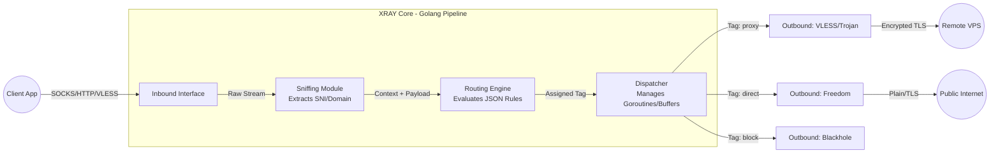
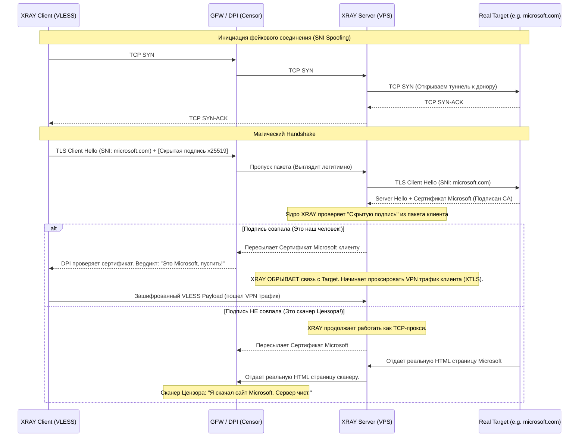

---
tags:
  - networking
  - vpn
  - xray
  - vless
  - xtls
  - architecture
aliases:
  - VPN internals
  - DPI Evasion
  - XRAY Core
---
# L1.NET.18: VPN, VLESS, XRAY

> [!abstract] О лекции
> Если вы, как инженер, искренне думаете, что современный VPN — это IPsec, OpenVPN или даже новенький WireGuard, вы застряли архитектурно в 2015 году. В современных условиях тотального и агрессивного DPI (Deep Packet Inspection), машинного обучения на трафике и государственной цензуры (GFW в Китае, ТСПУ в РФ, корпоративные ML-фаерволы) любые классические VPN-протоколы блокируются по сигнатурам заголовков за доли секунды.
> В этой лекции мы разбираем совершенно новую парадигму:
> *   **XRAY (Project X)** — это не просто VPN, это мощный, модульный, программируемый сетевой фреймворк для асинхронной маршрутизации и глубокой маскировки любого TCP/UDP трафика.
> *   Связка **VLESS + XTLS-Reality** — это текущий мировой "Gold Standard" (Золотой стандарт) обхода блокировок, позволяющий вашему нелегальному трафику выглядеть как абсолютно скучный, легитимный HTTPS-запрос к сайтам Microsoft или Apple, делая его криптографически неотличимым от обычного веб-серфинга даже для самых агрессивных методов активного зондирования (Active Probing).

---
## 1. Фундамент и Эволюция: От классических туннелей к стеганографии

Чтобы технически понять, почему ваш любимый, быстрый и современный WireGuard блокируется провайдером за 3 секунды при пересечении границы, нужно вернуться к базовым сетевым определениям.

### 1.1. Что такое VPN (Virtual Private Network)?

В строгом академическом и инженерном смысле, VPN — это комплексная технология, позволяющая программно создать защищенное логическое соединение (туннель) поверх другой, враждебной или менее защищенной физической сети (обычно Интернета).

**Анатомия любого классического VPN строится на трех китах:**
1.  **Инкапсуляция (Encapsulation):** Мы берем оригинальный IP-пакет приложения (например, HTTP-запрос к Google) и целиком заворачиваем его внутрь другого, внешнего транспортного пакета (UDP/TCP). Это "конверт, вложенный в конверт". Для внешней сети внутренний IP-адрес невидим.
2.  **Шифрование (Encryption):** Содержимое внутреннего конверта (включая оригинальные заголовки) математически превращается в нечитаемый криптографический шум (Ciphertext), чтобы никто на промежуточных транзитных узлах (ISP) не прочитал данные и не понял, куда они идут.
3.  **Аутентификация (Authentication):** Строгая криптографическая гарантия (через сертификаты или PSK) того, что вы установили сессию именно со своим легитимным сервером, а не с устройством "товарища майора" или хакера (защита от Man-In-The-Middle - MITM).

**Ключевое различие архитектурных уровней (OSI):**
*   **Layer 3 VPN (Network Layer / TUN interface):** К этому классу относятся IPsec, OpenVPN, WireGuard. Они перехватывают и передают "сырые" L3 IP-пакеты целиком. Для ядра ОС клиента это выглядит как полноценная виртуальная физическая сетевая карта (`tun0` / `wg0`). Весь трафик системы маршрутизируется туда. Это надежно, но это огромный оверхед.
*   **Layer 4/5/7 Proxy (Transport/Session/App Layer):** Shadowsocks, VLESS, Trojan, SOCKS5, HTTP Proxy. Формально, с точки зрения архитектуры, это *прокси*, работающие на уровне конкретных приложений или TCP-сессий. Они пересылают не IP-пакеты, а байтовые потоки данных (TCP/UDP streams). Однако для конечного пользователя результат тот же — прозрачный доступ к заблокированному ресурсу. Разница лишь в том, что прокси намного легче прятать.

---
### 1.2. Антагонист: DPI (Deep Packet Inspection)

В корпоративных энтерпрайз сетях и на уровне магистральных государственных фаерволов (Great Firewall of China - GFW, ТСПУ в России) работает тяжелая аппаратная артиллерия — системы DPI. Это программно-аппаратный комплекс, который не просто тупо смотрит на заголовки `IP:Port` (как обычный L3/L4 Firewall), но и аппаратно "заглядывает" глубоко внутрь полезной нагрузки (Payload) каждого пролетающего пакета на скорости десятков гигабит в секунду.

**Методы обнаружения VPN (Эвристика DPI):**
1.  **Сигнатурный анализ (Signature Matching):** Базовый метод. Поиск жестко фиксированных магических байтов или строк в самом начале TCP/UDP соединения (на этапе Handshake).
2.  **Анализ длины и таймингов (Packet Size & Timing Analysis):** Даже если трафик зашифрован, DPI анализирует размеры пакетов. Например, если в первые секунды сессии всегда летят пакеты размером ровно 148, 256 и 64 байта с интервалом в 10мс — это математический паттерн рукопожатия конкретного VPN.
3.  **Анализ энтропии (Entropy Analysis):** Зашифрованные блочными шифрами (AES) данные имеют математически предельную высокую энтропию (выглядят как идеальный белый статистический шум, $H \approx 8$). Обычный живой интернет-трафик (текст, HTML, сжатый JSON, видео) имеет четко выраженную структуру и меньшую энтропию. Если сессия на 100% состоит из идеального шума с самого первого байта — это VPN. DPI может просто резать (throttling) любые полностью "шумные" неизвестные UDP потоки.
4.  **Active Probing (Активное зондирование / Реверс-инжиниринг):** Самый агрессивный метод. DPI пассивно видит подозрительное соединение от клиента к серверу X. DPI аппаратно "замораживает" пакет, а затем сам (от имени клиента или своего IP) отправляет на этот сервер X свои, специально сформированные, искаженные ("мусорные") пакеты. Если сервер X реагирует в точности как сервер Shadowsocks или OpenVPN (отвечает определенным кодом ошибки или просто молча сбрасывает TCP-сокет), DPI делает вывод: "Это VPN-сервер. Заблокировать IP-адрес X навсегда".

---
### 1.3. Почему "классика" умерла для обхода блокировок?

#### OpenVPN: Бронированный инкассаторский грузовик
OpenVPN использует надежные стандарты SSL/TLS для шифрования управляющего канала, но добавляет свои собственные кастомные заголовки и протокол мультиплексирования.
*   **Проблема:** У него яркий, кричащий уникальный отпечаток. В начале каждой сессии OpenVPN отправляет пакет с жестко заданным **OpCode** (код операции, например `P_CONTROL_HARD_RESET_CLIENT_V2`).
*   **Для DPI:** Это как бронированный инкассаторский грузовик с мигалками, едущий по трассе. Его физически невозможно вскрыть на лету (шифрование AES надежное), но его *отлично видно* за 5 километров. DPI просто ставит шлагбаум: "Грузовикам проезд запрещен. Drop".
*   **Статус:** Блокируется китайским GFW и ТСПУ по TCP/UDP сигнатуре мгновенно.

#### WireGuard: Спортивный болид Формулы-1
WireGuard — это шедевр минималистичной инженерной мысли (всего ~4000 строк кода): работает глубоко в ядре Linux, использует сверхбыструю современную криптографию (фреймворк Noise protocol, шифры ChaCha20-Poly1305), невероятно быстр на мобильных устройствах.
*   **Проблема:** Это протокол, созданный криптографами исключительно для *безопасности* передачи, а абсолютно не для *скрытности*. Он работает только по протоколу UDP. У него жестко фиксированный заголовок пакета (первый байт всегда равен `1`, `2`, `3` или `4` в зависимости от типа сообщения). Он принципиально спроектирован так, чтобы не отвечать на мусорные пакеты от неизвестных клиентов (техника Silent Drop), что само по себе уже подозрительно для открытых сетей.
*   **Для DPI:** Это ярко-красная Ferrari без глушителя. Она едет очень быстро, но очень громко. Блокировать любые подозрительные UDP-протоколы цензорам проще всего (включается шейпинг / Throttling скорости до 10 Kbps или полный дроп UDP).
*   **Статус:** Практически бесполезен против государственных фаерволов в чистом виде. Требует сложных архитектурных "оберток" (туннелирование WireGuard поверх TCP через утилиты `UDP2RAW`, `Shadowsocks+Plugin` или `WSTunnel`, что убивает его скорость и смысл).

#### Shadowsocks: Первый камуфляж (Первая кровь)
Shadowsocks (SS) исторически создавался китайскими разработчиками специально для обхода GFW. Он не имеет фазы рукопожатия открытым текстом. Он притворяется обычным бессмысленным TCP-потоком случайных данных.
*   **Проблема:** Пал жертвой ML (Machine Learning) анализа энтропии. Поток SS выглядит *слишком* случайным и идеальным. Обычный живой интернет (даже HTTPS) так не выглядит (в TLS есть открытые нешифрованные заголовки ClientHello). Плюс, старые версии SS оказались фатально уязвимы к Active Probing (серверы Shadowsocks можно было 100% детектировать, отправляя специальный мусор и анализируя тайминги закрытия TCP-окна).
*   **Статус:** Классический SS детектируется и блокируется. Современные версии (с протоколом SS-2022 и AEAD шифрами) пока еще держатся, но гонка вооружений продолжается, и энтропийный анализ их скоро догонит.

---
### 1.4. Новая эра: Стеганография (Проекты V2Ray / XRAY)

Индустрия обхода цензуры пришла к фундаментальной концепции: **"Если хочешь спрятать дерево — не строй вокруг него стальную стену. Просто спрячь его в огромном лесу"**.

Вместо создания своего нового "уникального и непобедимого" протокола, современные инструменты (XRAY) архитектурно имитируют поведение самого массового, легального и критически важного для экономики трафика в интернете — **веб-трафика HTTPS (TLS 1.3)**. Если цензор заблокирует весь HTTPS — в стране остановится банкинг, магазины и жизнь.

*   **Маскировка (Obfuscation / Camouflage):** Трафик вашего VPN математически и поведенчески выглядит как обычная загрузка веб-страницы Википедии, просмотр видео или вызов REST API.
*   **Связка VLESS + XTLS-Reality:** Это абсолютная вершина эволюции на сегодняшний день.
    *   **Пример для наглядности (The Analogy):**
        *   *OpenVPN (Старая школа):* Вы несете секретное письмо в бронированном стальном сейфе. Охранник на границе (DPI) видит подозрительный сейф, понимает, что вы что-то скрываете, и просто не пускает вас.
        *   *XRAY Reality (Новая школа):* Вы берете обычный, глянцевый журнал (например, популярный сайт Microsoft.com или Apple.com), аккуратно вклеиваете свое секретное письмо между страницами с помощью клея (математическая стеганография) и несете журнал в руках. Охранник видит журнал, берет его в руки, проверяет обложку (анализирует TLS SNI, проверяет подписи сертификатов) — всё 100% настоящее, сертификат выдан корпорации Microsoft. Охранник возвращает журнал и с улыбкой вас пропускает.

**Главный Итог:** "Смерть" OpenVPN и WireGuard в контексте обхода блокировок означает не их техническую несостоятельность (они по-прежнему прекрасны для Site-to-Site VPN корпоративных сетей), а их **фундаментальную неспособность мимикрировать**. В современной сетевой войне (Cyber Warfare) выживает не самый криптографически защищенный пакет, а самый незаметный пакет.

---
## 2. XRAY Core: Внутренняя Архитектура и поток данных

**XRAY Core** (форк проекта V2Ray) — это сложная, многопоточная, событийная (event-driven) платформа маршрутизации, написанная на языке Go (Golang). Архитектурно она реализует классический паттерн **Pipeline (Конвейер)** с использованием мощи горутин (goroutines). Любой трафик, попадающий в ядро, проходит через строгую, настраиваемую последовательность стадий. Понимание этого внутреннего потока абсолютно критично для системного администратора при отладке сложных правил маршрутизации (Routing) и диагностике проблем с производительностью или утечками памяти.

### 2.1. Жизненный цикл запроса (The Life of a Packet inside XRAY)

Внутри процесса XRAY данные (байты) движутся по строгому маршруту:
**Source (Inbound) $	o$ Sniffing (Optional) $	o$ Router $	o$ Dispatcher $	o$ Sink (Outbound)**



1.  **Inbound (Входящий интерфейс - Receiver):** Точка входа в процесс. Здесь происходит открытие слушающего сокета (Listen), принятие TCP/UDP соединения, десериализация протокола (парсинг заголовков socks5, http, vless, trojan) и расшифровка (если трафик пришел в TLS оболочке). На выходе из Inbound подсистема формирует абстрактный внутренний объект Golang `Context`, содержащий чистые метаданные: Source IP, Target IP/Domain, Port, User.
2.  **Sniffing (Сниффинг - Инспекция на лету):** Критически важный этап. Если входящий трафик — это "сырой" TCP (например, захваченный через интерфейс Dokodemo-door с роутера), XRAY может аккуратно "подсмотреть" (peek) первые несколько байт пакетов данных (например, распарсить заголовок TLS Client Hello или HTTP Host header), чтобы извлечь реальный целевой **SNI (доменное имя)**. Это гениально: это позволяет XRAY маршрутизировать трафик клиентов по доменным именам (например, `netflix.com` в туннель, а `yandex.ru` напрямую), **вообще не расшифровывая** само зашифрованное тело чужого TLS запроса!
3.  **Routing (Маршрутизатор - Мозг):** Математический "Мозг" системы. Он берет `Context` запроса и на основе декларативных правил (`rules` из JSON конфига) назначает этому запросу конкретный **Tag (тег)** исходящего интерфейса.
4.  **Dispatcher (Диспетчер потоков):** Низкоуровневый системный компонент, связывающий Inbound и Outbound. Он запускает горутины, управляет буферами памяти (copy buffers) для перекладывания байт и физически передает поток данных (io.Reader / io.Writer) в нужный, выбранный роутером Outbound.
5.  **Outbound (Исходящий интерфейс - Sender):** Точка выхода из ядра. Сериализует сырые данные обратно в нужный целевой протокол (например, заворачивает TCP поток в VLESS, затем оборачивает в Websocket), шифрует всё это в TLS и через системный вызов отправляет в физическую сеть.

### 2.2. Ключевые архитектурные компоненты (Deep Dive)

Разберем компоненты, которыми вы, как DevOps, будете жонглировать в конфигурационном файле `config.json`.

#### A. Inbounds (Входы)
Это не просто "открытый порт сервера". Это полноценные адаптеры протоколов.
*   **Dokodemo-door (Произвольная дверь / Any-Port):** Самый низкоуровневый и мощный инбаунд. Принимает абсолютно *любой* TCP/UDP трафик на указанном порту и перенаправляет его в ядро. Используется сетевиками для создания прозрачных прокси (Transparent Proxy) на шлюзах (когда вы настраиваете правила `iptables` на OpenWRT роутере заворачивать весь трафик квартиры в этот порт XRAY).
*   **Socks / HTTP:** Стандартные высокоуровневые прокси-интерфейсы. Слушают на `127.0.0.1` для подключения вашего локального браузера (SwitchyOmega) или Telegram.
*   **VLESS / VMess / Trojan:** Защищенные инбаунды для установки на облачном VPS для приема зашифрованного трафика от удаленных клиентов через интернет.

#### B. Outbounds (Выходы)
Определяют механику, **как** и **куда** физически уйдет трафик из памяти сервера.
*   **Freedom (Свобода):** Самый простой. Прямое соединение с целевым сайтом (Direct). XRAY выступает просто как TCP-клиент: выполняет DNS-запрос для домена и открывает обычный сокет к IP адресата. Используется для "белого" (не заблокированного) или внутреннего трафика.
*   **Blackhole (Черная дыра):** Системная заглушка (`/dev/null`). Трафик мгновенно дропается (уничтожается). Широко используется для блокировки рекламы, майнеров или трекеров на уровне шлюза. Может возвращать клиенту статический HTTP ответ (например, `HTTP 403 Forbidden`), чтобы браузер не ждал таймаута.
*   **Proxy protocols (VLESS/Shadowsocks/etc):** Инкапсуляция и отправка трафика на *другой* удаленный прокси-сервер (Upstream). Это позволяет строить сложные, многоуровневые цепочки (Chains / Cascades): `Client App -> Локальный XRAY (Socks-In) -> (VLESS-Out) -> Удаленный VPS XRAY (VLESS-In) -> (Freedom-Out) -> Target Website`.

#### C. Routing & Balancer (Маршрутизация и Балансировка)
Это тот интеллектуальный слой, ради которого XRAY используют в энтерпрайзе.

*   **Rule-based Routing (Правила):** Правила применяются в JSON строго сверху вниз (по порядку). Первое же совпадение выигрывает (Short-circuit).
    *   *Критерии фильтрации:* `domain` (включая regex и огромные компилированные базы `.dat` типа geosite), `ip` (включая CIDR подсети и базы geoip), `port`, `network` (tcp/udp), `protocol` (http, tls, bittorrent), `inboundTag` (откуда пришел пакет), `user` (email конкретного пользователя для биллинга).
*   **Balancer (Балансировщик апстримов):** Стратегия выбора конкретного Outbound, если их несколько (балансировка между 5-ю разными VPS серверами для надежности).
    *   *Random:* Случайный выбор из группы (аналог Round-Robin).
    *   *LeastPing:* Киллер-фича. XRAY запускает фоновый процесс (Observatory), который постоянно активно пингует все настроенные апстрим-серверы (через HTTP/TCP пинги) и динамически шлет трафик пользователя через тот туннель, который прямо сейчас показывает наименьший RTT. Идеально для отказоустойчивости (Failover).

### 2.3. Концепция "Tags" (Тегирование как шина)

Архитектурная красота XRAY в том, что в нем нет прямой жесткой связи "этот вход `A` физически привязан к выходу `B`". Связь между компонентами происходит **исключительно виртуально, через систему тегов (Tags)**.
Это классическая архитектура шины данных (Event Bus architecture) или Pub/Sub.

*   Каждый объект `inbound` в конфиге имеет свое уникальное имя - тег (например, `"tag": "ingress-client"`).
*   Каждый объект `outbound` имеет свой тег (например, `"tag": "egress-direct"`, `"tag": "egress-tor"`).
*   Правила маршрутизации (Routing rules) выполняют роль клея. Они говорят: "Если трафик пришел из тега `inbound`, от `user: alice` и идет на домен `netflix.com`, повесь на него бирку и отправь его в тег выхода `egress-usa`".

### 2.4. Пример архитектурного конфига (Декларативный JSON)

Для наглядности рассмотрим архитектуру домашнего роутера-шлюза (на базе Linux), который умным образом блокирует рекламу, пускает локальный RU-трафик напрямую (без VPN), а весь остальной зарубежный трафик прозрачно заворачивает в защищенный туннель на VPS.

```json
{
  "log": { "loglevel": "warning" },
  "inbounds": [
    {
      "tag": "socks-in", // Точка входа для локальных приложений (браузера)
      "port": 1080,
      "protocol": "socks",
      "sniffing": {
        "enabled": true,
        "destOverride": ["http", "tls"] // ВАЖНО: Аппаратно извлекать домены из TLS Client Hello для роутинга
      }
    }
  ],
  "routing": {
    "domainStrategy": "IPIfNonMatch", // Оптимизация: Если домен не совпал с базами, резолвим IP и прогоняем через правила для IP-адресов
    "rules": [
      {
        "type": "field",
        "outboundTag": "block-out", // Правило 1: Отправляем рекламу в черную дыру
        "domain": ["geosite:category-ads-all"]
      },
      {
        "type": "field",
        "outboundTag": "direct-out", // Правило 2: Локальные сайты напрямую провайдеру (экономим трафик VPS)
        "domain": ["geosite:ru", "geosite:yandex"], // Огромные базы данных доменов
        "ip": ["geoip:private", "geoip:ru"] // Не гонять локальные 192.168.x.x в VPN
      },
      {
        "type": "field",
        "outboundTag": "proxy-out", // Правило 3 (Catch-all): Абсолютно всё остальное - в защищенный туннель
        "network": "tcp,udp" 
      }
    ]
  },
  "outbounds": [
    {
      "tag": "proxy-out",
      "protocol": "vless", // Заворачиваем в туннель и отправляем на наш удаленный VPS
      "settings": { /* ... UUID, IP сервера ... */ } 
    },
    {
      "tag": "direct-out",
      "protocol": "freedom" // Прямой выход через интерфейс хоста в интернет
    },
    {
      "tag": "block-out",
      "protocol": "blackhole" // Уничтожение пакета
    }
  ]
}
```
*(Базы `geosite` и `geoip` — это предкомпилированные бинарные файлы `.dat`, содержащие миллионы записей, загружаемые в оперативную память при старте XRAY для поиска за $O(1)$)*.

### 2.5. API и Динамическое управление (Staff Level Automation)

XRAY — это не просто статичный демон с JSON конфигом, который нужно постоянно перезапускать командой `systemctl restart`. В его ядро встроен мощный **gRPC API** и поддержка Stats (Статистики).
Это позволяет Software Архитектору строить поверх него огромные управляемые коммерческие VPN-сервисы с биллингом:
*   Вы можете скриптами добавлять и удалять конкретных пользователей (их UUID) в запущенном Inbound *на лету, без перезагрузки* процесса и без сброса активных сессий других клиентов.
*   Вы можете читать точную телеметрию трафика (Traffic Stats) по каждому конкретному `user@email.com` (bytes uplink / bytes downlink) в реальном времени для тарификации.
*   Вы можете динамически менять правила роутинга на лету (Inject rules).

Именно на базе этого мощного gRPC API строятся все популярные графические панели управления серверами, такие как **3x-ui** (Web-интерфейс) или **Marzban** (Панель на Python/FastAPI).

---
*Это был архитектурный фундамент. Теперь, понимая внутренний потоковый конвейер данных и концепцию тегов, мы можем осознанно перейти к настройке самого криптографического протокола VLESS в следующем разделе.*

---
## 3. Протокол VLESS (Versatile Lighter Proxy)

**VLESS** (Означает VMess Less - "Меньше чем VMess") — это невероятно легковесный протокол передачи данных, разработанный с одной революционной идеей: **отказ от собственного прикладного шифрования**. В архитектурной иерархии XRAY VLESS — это не замена протоколу TLS, а тонкая **бессостоятельная надстройка аутентификации** поверх него.

Если его легендарный предшественник (протокол VMess) был создан в параноидальную эпоху (до TLS 1.3), когда мы в принципе не доверяли транспорту и фанатично шифровали всё сами на уровне приложения (AES-128-GCM), то протокол VLESS архитектурно спроектирован для современной эпохи, когда криптографически стойкий HTTPS (TLS 1.3) стал фундаментальным, непробиваемым стандартом де-факто во всем мире.

### 3.1. Архитектурная Философия: Отказ от Double Encryption (Двойного шифрования)

Чтобы полностью оценить изящество VLESS, инженер должен понять фатальную проблему его предшественника — протокола VMess.

*   **Проблема архитектуры VMess (The CPU & MTU Penalty):** Когда для обеспечения скрытности вы запускаете зашифрованный протокол VMess *поверх* зашифрованного транспортного протокола TLS (что является стандартной практикой обхода DPI: `VMess over Websocket over TLS`), физически в ядре процессора происходит следующее:
    1.  Ядро XRAY берет полезные данные вашего браузера и математически шифрует их сложным блочным шифром (AES-128-GCM или ChaCha20-Poly1305), добавляя свои крипто-заголовки аутентификации.
    2.  Затем этот "зашифрованный кусок" (payload) передается в транспортный слой операционной системы или библиотеки (TLS слой).
    3.  Протокол TLS, не зная, что внутри уже зашифрованный мусор, берет этот кусок и **снова** математически шифрует его уже своим ключом (еще один проход алгоритма AES/ChaCha).
    *   **Физический Результат:** Вы впустую тратите драгоценные такты CPU (и батарею смартфона) на бессмысленное повторное шифрование уже надежно зашифрованных данных. На мобильных устройствах это вызывает сильный нагрев и быстрый разряд аккумулятора. На высокоскоростных гигабитных каналах сервера — двойное шифрование становится аппаратным "бутылочным горлышком" (CPU Bottleneck). Кроме того, двойные заголовки "съедают" MTU пакета, вызывая IP фрагментацию.

*   **Изящное решение VLESS (Zero-encryption Protocol):** Дизайнеры протокола VLESS сказали: «Я полностью доверяю внешнему защитному слою (стандартному TLS 1.3 или XTLS). Я принципиально не буду тратить процессор на шифрование тела запроса. Моя единственная задача — передать заголовки маршрутизации и проверить аутентификацию клиента (пароль), а дальше я просто перелью байты как есть (io.Copy)».
    *   **Результат для бизнеса:** Оверхед (накладные системные расходы) при передаче данных близок к абсолютному нулю. Скорость VPN туннеля ограничена исключительно физической пропускной способностью кабельной сети и скоростью первичного хендшейка. Батареи смартфонов "живут" в разы дольше.

### 3.2. Механика работы и Аутентификация

В отличие от сложного VMess, VLESS — это полностью **stateless** (бессостоятельный) протокол. В нем нет механизма синхронизации состояний (nonces/counters) и, что крайне важно для поддержки, он **не зависит жестко от точного системного времени**. (Старый протокол VMess падал с ошибкой HMAC Fail, если часы на телефоне клиента и сервере расходились более чем на 90 секунд. VLESS решает эту боль техподдержки, хотя базовая синхронизация часов через NTP всё равно строго рекомендуется для корректной валидации сертификатов X.509 самим транспортом TLS).

**Бинарная структура запроса VLESS (Упрощенно):**
1.  **Version:** Версия протокола (обычно 1 байт).
2.  **UUID (User ID):** 16 байт. Это стандартный GUID/UUID. Он выступает в роли единственного аналога логина и пароля. Никаких юзернеймов.
3.  **Addons (Дополнения):** Блок расширений, передающий информацию о том, какой специфичный тип трафика или фичи ожидается (например, запрос на включение XTLS Flow).
4.  **Command (Инструкция):** Куда именно сервер должен переслать этот поток (команда TCP/UDP, целевой домен `youtube.com` или IP-адрес и порт назначения).

**Процесс обработки ядром:**
При коннекте клиент отправляет свой UUID в незашифрованном виде (но внутри надежно зашифрованного TLS-туннеля!). Сервер XRAY получает поток, читает UUID и проверяет его наличие в массиве разрешенных `clients` конфигурации.
*   Если переданный UUID найден в массиве $	o$ аутентификация пройдена, виртуальное соединение установлено, данные TCP/UDP извлекаются и проксируются дальше в интернет.
*   Если UUID не совпал (взломщик перебирает пароли) или бинарный формат заголовка вообще не похож на VLESS (DPI сканирует порт) $	o$ ядро XRAY не сбрасывает TCP-соединение, а молча активирует защитный механизм **Fallback** (Резервное падение).

### 3.3. Гениальный механизм Fallback: Защита от активного зондирования (Active Probing)

Это главная архитектурная киллер-фича протоколов экосистемы V2Ray/XRAY, делающая их практически идеальными инструментами для маскировки серверов от Великого Китайского Файрвола.

**Сценарий атаки цензора (Active Probing / Сканирование портов):**
Анализатор цензора (DPI) видит, что некий клиент установил TLS-соединение с вашим сервером на порт 443 и начал гонять гигабайты данных. DPI подозревает, что это VPN, но доказать не может (трафик зашифрован). Тогда робот-цензор (из пула IP-адресов Китая или РФ) открывает новый сокет к вашему IP-адресу на порт 443. Бот не знает вашего UUID пароля. Он просто притворяется обычным Chrome-браузером и посылает туда стандартный текстовый HTTP-запрос (например, `GET / HTTP/1.1`) или вообще шлет случайный бинарный мусор (Fuzzing), чтобы посмотреть, **как именно ядро вашего сервера отреагирует на аномалию**.
*   *Поведение классики (OpenVPN / Shadowsocks):* Получив мусор, они сразу агрессивно обрывают TCP-соединение пакетом `RST` или просто "зависают" в таймауте (Drop). Для робота-цензора это аномалия (Красный флаг). Легитимный веб-сервер типа Nginx или Apache **никогда так не делает**; он должен ответить классической HTTP ошибкой `400 Bad Request` или вернуть веб-страницу `404 Not Found`. Сервер разоблачен и IP отправляется в бан.
*   *Поведение XRAY (VLESS Fallback):* Когда бот шлет `GET / HTTP/1.1`, ядро XRAY (слушающее 443 порт) парсит запрос. Оно видит, что это не бинарный заголовок VLESS. В этот момент срабатывает логика Fallback. XRAY выступает как прозрачный Reverse Proxy (Reverse SNI Proxy) и **аккуратно перенаправляет (проксирует) весь этот левый трафик бота** на другой, скрытый локальный порт на сервере (например, на `127.0.0.1:8080`).

**Архитектура маскировки с Fallback (Схема):**
```text
[Public Internet / DPI Scanner] ---> [TCP Port 443: Процесс XRAY VLESS]
                                               |
                                               |--- (IF: Это валидный UUID) ---> [Router -> Outbound: Freedom] ---> Youtube.com
                                               |
                                               +--- (ELSE: Это мусор / Простой HTTP GET) ---> [Fallback: Redirect to 127.0.0.1:8080] ---> [Процесс Nginx: Фейковый сайт]
```
На порту `8080` у вас заранее поднят настоящий веб-сервер Nginx (или Apache), который отдает красивый, полноценный шаблонный веб-сайт (например, статический блог про кулинарию, скачанный из интернета, или заглушку "Under Construction").
**Итог для цензора:** Бот DPI сканирует ваш порт 443, делает HTTP-запрос и получает в ответ красивый HTML с рецептом борща и валидными HTTP-заголовками `Server: nginx/1.18`. Для любого внешнего наблюдателя (включая человека, который введет IP в браузер) ваш секретный VPN-сервер выглядит и ведет себя как абсолютно скучный, легитимный, публичный веб-сайт блога. Это делает автоматизированную блокировку по "белым спискам" (Whitelisting) крайне затруднительной задачей для государственного цензора.

### 3.4. Транспортная агностичность (Модульность)

VLESS — это абстрактный "язык общения" (синтаксис Payload), на котором клиент вежливо просит сервер открыть сокет. То, в какой конкретно транспортный "конверт" (Трубу) будут упакованы эти команды для полета через интернет, определяется в конфиге отдельным мощным блоком `streamSettings`. Вы можете комбинировать VLESS с чем угодно:

1.  **VLESS over TCP (Raw TCP):** Самый быстрый и эффективный по CPU метод. Пакеты VLESS идут прямо в непрерывном TCP-потоке. **Архитектурное правило:** Этот метод **абсолютно обязательно** требует включения дополнительного слоя шифрования (`security: "tls"` или `"reality"`).
2.  **VLESS over WebSocket (WS):** Трафик VLESS заботливо упаковывается в стандартные бинарные фреймы протокола WebSocket (как в браузерных чатах). Зачем? Это позволяет элегантно **прятать сервер за глобальными CDN** (например, Cloudflare, GCore, Fastly). CDN-провайдеры видят легитимный HTTP Upgrade запрос, понимают WebSocket и проксируют его на ваш Origin-сервер, скрывая ваш реальный IP-адрес. Это "оружие последней надежды", если ваш IP уже жестко заблокирован по IP (IP Ban).
3.  **VLESS over gRPC:** Вместо WS используется современный транспорт gRPC (поверх мультиплексированного HTTP/2). Позволяет упаковывать сотни параллельных VPN-сессий клиента (открытие вкладок) в одно единственное физическое TCP-соединение до сервера (устраняет налог на Handshake). Зарекомендовал себя как очень устойчивый протокол для мобильных сетей с высоким процентом потерь пакетов (Packet Loss).

### 3.5. Предупреждение Архитектора по Безопасности (Critical Security Warning)

Как инженер и практик, вы должны вытатуировать это архитектурное правило на подкорке:

> **ПРОТОКОЛ VLESS САМ ПО СЕБЕ ФИЗИЧЕСКИ НЕ ШИФРУЕТ ВАШИ ДАННЫЕ.**

Если вы, по ошибке конфигурации, настроите VLESS поверх "чистого", голого TCP (отключив шифрование, поставив `security: "none"`), структура вашего трафика на проводе будет выглядеть примерно так (как в старом HTTP):
`[Бинарный заголовок VLESS] [Ваш секретный UUID открытым текстом] [Оригинальный запрос браузера: GET /pornhub.com/video... HTTP/1.1]`

В таком сценарии любой DPI-анализатор провайдера, или даже просто любопытный админ публичного Wi-Fi в кафе со сниффером Wireshark мгновенно увидит:
1.  Ваш секретный пароль (`UUID`) в открытом виде (и навсегда получит административный доступ к ресурсам вашего сервера).
2.  Куда именно вы маршрутизируете трафик.
3.  Весь контент (файлы, пароли), если конечный сайт назначения почему-то не использует HTTPS.

**Инженерный Вывод:** Использование протокола VLESS категорически допустимо **исключительно и только** внутри надежно защищенного, криптографического внешнего канала (будь то TLS, XTLS, механизм Reality, или классический SSH-туннель). Использование параметра `security: "none"` в конфиге VLESS имеет смысл только для локальных тестов (loopback) или внутри 100% доверенной закрытой корпоративной локальной сети.

### 3.6. Пример конфигурации (Server Side Configuration)

Ниже приведен эталонный пример (фрагмент) `inbound` части конфигурации в `config.json` для настройки защищенного сервера, принимающего VLESS:

```json
{
  "tag": "vless-in",
  "port": 443, // Слушаем стандартный порт HTTPS (маскировка)
  "protocol": "vless",
  "settings": {
    "clients": [
      {
        "id": "550e8400-e29b-41d4-a716-446655440000", // Ваш секретный UUID
        // Включение режима XTLS Vision (для оптимизации передачи внутри Reality/TLS)
        "flow": "xtls-rprx-vision", 
        "level": 0
      }
    ],
    // Явное указание ядру не тратить CPU на шифрование payload (делегирование транспорту)
    "decryption": "none", 
    "fallbacks": [
      {
        // Механизм защиты от DPI: 
        // Если пришедший на 443 порт пакет не является нашим VPN-клиентом с UUID, 
        // тихо пересылаем этот "мусорный" TCP-поток на наш локальный веб-сервер Nginx (порт 8080)
        "dest": "8080" 
      }
    ]
  },
  "streamSettings": {
    "network": "tcp", // Гоняем VLESS прямо поверх сырого TCP (максимальная скорость)
    "security": "reality", // Включаем магию маскировки REALITY (см. следующий огромный раздел)
    "realitySettings": {
       // ... криптографические настройки подмены домена ...
    }
  }
}
```

**Резюме по архитектуре протокола:** VLESS — это индустриальный стандарт высокой производительности и гибкости. Он хирургически убирает лишнее двойное шифрование (Double Encryption), полностью делегируя защиту нижележащему транспортному уровню (TLS), и предоставляет мощнейший архитектурный механизм Fallback (Резервный прокси) для надежной защиты серверов от активного сканирования фаерволами.

---
## 4. XTLS и REALITY: Технологии маскировки "Уровня Бога" (DPI Evasion)

Мы переходим к самой технологически сложной, передовой и интересной теме современного интернета. Если протокол VLESS — это "костяк" и "скелет" (механизм передачи данных), то технологии **XTLS** и **REALITY** — это "кожа", "голограмма" и "мимикрия", которые делают этот скелет абсолютно невидимым (Stealth) для систем глобального DPI (Deep Packet Inspection).

Вам, как Практику-архитектору, нужно навсегда забыть устаревшую концепцию "чтобы спрятаться, нужно просто зашифровать трафик". Современный государственный DPI больше даже не пытается расшифровать ваш AES-256 (математически это невозможно без квантовых компьютеров). DPI анализирует **Метаданные (Metadata)**: точную длину каждого пакета (в байтах), тайминги между пакетами (timing analysis), математическую энтропию потока и уникальные бинарные отпечатки (fingerprints) самого процесса TLS рукопожатия. На основе метаданных ML-модель фаервола с вероятностью 99% предсказывает: "Это не человек листает Инстаграм, это работает туннель V2Ray". И нажимает кнопку Drop.

В этом разделе мы разберем, как обмануть ML-модели цензоров.

### 4.1. Эволюция транспорта: от простого TLS к XTLS-Vision

Чтобы глубоко понять архитектуру REALITY (где мы сейчас), нужно проследить историю гонки вооружений между разработчиками и цензурой (GFW).

1.  **Standard TLS (Классика):** Наивный подход. Просто заворачиваем пакеты VLESS в стандартный туннель HTTPS (TLS 1.2/1.3).
    *   *Проблема (Уязвимость паттерна):* У TLS туннелей с VPN внутри есть характерные поведенческие паттерны длины. Например, сразу после успешного рукопожатия TLS, клиент VLESS мгновенно отправляет заголовок с UUID. DPI-анализатор видит паттерн: "TLS Handshake успешно завершен $	o$ мгновенно полетел пакет длиной ровно 50 байт (заголовок VLESS) $	o$ короткая пауза $	o$ затем пошел тяжелый поток данных". Это **вообще не похоже** на поведение живого браузера, который после хендшейка обычно шлет HTTP GET запрос (сотни байт заголовков) и ждет скачивания HTML/JS/CSS. Фаервол фиксирует аномалию и банит IP.
2.  **XTLS (Original / Direct / Старая магия):** Прорывная технология, которая позволяла серверу аппаратно копировать буферы данных внутри ядра Linux (сисколлы `splice` или `sendfile` / zero-copy) напрямую из входящего сокета в исходящий, если ядро видело, что внутри туннеля *уже* летит зашифрованный TLS трафик (например, к целевому сайту HTTPS). Это давало скорость, равную скорости сетевой карты без нагрузки на процессор.
    *   *Статус Архитектуры:* **Полностью устарела и физически удалена из кода ядра XRAY.** В 2022 году китайские исследователи доказали, что XTLS (Direct) уязвим к изощренным видам активного анализа фаервола по таймингам пакетов.
3.  **XTLS-Vision (Текущий безопасный стандарт):** Это развитие идей XTLS, но акцент смещен с экстремальной "прямой передачи данных" на **параноидальную маскировку поведения (Traffic Shaping)**.
    *   **Механизм (Как это обманывает DPI):** Протокол Vision активно и агрессивно вмешивается в процесс TLS 1.3 рукопожатия и передачи первых байт. Он рандомизирует длины пакетов, добавляет "мусорные" паддинги (padding - пустые байты), искусственно фрагментирует пакеты на куски и микроскопически меняет временные задержки отправки (jitter) так, чтобы поток байт VLESS стал статистически (для ML-моделей) абсолютно неотличим от обычного, скучного браузерного трафика к веб-сайту.
    *   **Ограничение Применения:** XTLS-Vision используется в конфигурациях, когда у вас есть **свой собственный домен** и вы сами выпустили **свой собственный валидный сертификат** (Let's Encrypt).

### 4.2. REALITY: Тотальная смена парадигмы (The Game Changer)

**REALITY** — это революционная замена классическому TLS для VPN. Это технология, которая архитектурно позволяет вам использовать для прикрытия **чужой, известный мировой домен** и **чужой публичный сертификат**.

**В чем была фатальная проблема классического подхода (со своим доменом):**
Раньше, чтобы поднять "невидимый" VPN, вам нужно было:
1. Купить доменное имя у регистратора (оставляет ваш цифровой след, данные карты, email).
2. Настроить DNS A-записи на ваш "грязный" VPS в дата-центре (DPI видит маппинг).
3. Получить бесплатный сертификат Let's Encrypt для домена.
Абсолютно все выданные в мире TLS сертификаты автоматически и публично логируются в открытую глобальную базу **Certificate Transparency Logs (CTL)**. 
Продвинутый цензор (например, GFW или системы РКН) в реальном времени непрерывно сканирует базу логов CTL. Он видит событие: "Ага! Вася Пупкин 5 минут назад получил сертификат на свой новый домен `vasya-vpn-super.ru`, и этот домен указывает на дешевый хостинг DigitalOcean в Амстердаме". Цензор включает скрипт и **превентивно банит (отправляет в Blacklist)** этот IP-адрес еще до того, как вы успели подключиться к нему в первый раз со своего телефона! Ваш сервер мертв при рождении.

**Гениальное Решение REALITY (Кража личности во благо):**
Архитектура REALITY работает по принципу атаки "Man-in-the-Middle" (Человек посередине), но вы делаете это сами с собой. Ваш сервер притворяется клиентом для большого сайта. У вас нет своего домена, нет DNS-записей, нет своего сертификата в логах. Вы берете "личность" гиганта (Microsoft, Yahoo, Apple).

#### Механизм работы REALITY (Step-by-Step Anatomy):



Представьте, что вы (VPS) маскируетесь под домен `learn.microsoft.com` (Сайт-донор).

1.  **Client Hello (Имитация):** Ваш VPN-клиент на смартфоне стучится на "голый" IP-адрес вашего VPS сервера. Но внутри первого пакета в поле SNI (Server Name Indication) клиент нагло открытым текстом пишет: "Хочу подключиться к `learn.microsoft.com`".
2.  **Proxying (Транзит):** XRAY-сервер (VPS) видит этот входящий запрос. Он немедленно открывает *настоящее* TCP-соединение к реальным, "белым" серверам корпорации Microsoft.
3.  **Server Hello (Получение сертификата):** Реальный сервер Microsoft отвечает на запрос VPS, присылая свой настоящий, криптографически валидный публичный SSL-сертификат (выданный доверенным Удостоверяющим Центром - CA).
4.  **Forwarding (Обман цензора):** XRAY-сервер (VPS) просто пересылает (Forward) этот настоящий сертификат Microsoft обратно вашему смартфону-клиенту.
5.  **DPI Check (Проверка фаерволом):** Цензор (ТСПУ), стоящий на магистрали между вашим смартфоном и сервером VPS, глубоко анализирует пакеты и видит:
    *   SNI: Клиент запросил `learn.microsoft.com`.
    *   Cert: Сервер в ответ прислал Сертификат, криптографически подписанный настоящим корневым центром Microsoft (RSA/ECC CA). Сертификат математически валиден (не подделан).
    *   **Вердикт Фаервола:** "Судя по всему, клиент нашел какое-то хитрое зеркало или CDN-узел Microsoft. Это на 100% легитимный трафик к белому сайту. Блокировать нельзя, иначе сломаем Windows Update в стране. Пропустить трафик!".
6.  **The Reality Magic (Скрытая Аутентификация):**
    *   Как XRAY сервер отличает вашего клиента от бота цензора, если пароля VLESS еще не было (он шифруется позже)?
    *   Во время самого первого пакета (TLS 1.3 Client Hello), клиентский XRAY **незаметно подмешивает зашифрованную крипто-сигнатуру** в псевдослучайные поля расширений TLS (используя мощные эфемерные ключи алгоритма `Curve25519` - x25519).
    *   *Сценарий А (Свой):* Если XRAY сервер (VPS) расшифровывает эти байты Client Hello своим приватным ключом (PrivateKey) и находит математическое совпадение с ключом клиента $	o$ он понимает "Это мой хозяин". Сервер мгновенно **перехватывает** (Hijack) это соединение на себя. Связь с реальным сервером Microsoft обрывается (Drop). Канал зашифрованной связи (VPN туннель) устанавливается исключительно между клиентом и вашим сервером.
    *   *Сценарий Б (Чужой / Сканер):* Если магической сигнатуры в Client Hello нет (это значит, что на ваш 443 порт стучится бот-анализатор цензора или случайный прохожий) $	o$ XRAY сервер ничего не делает. Он "прикидывается ветошью" и продолжает работать как абсолютно прозрачный, глупый TCP-прокси (Forwarder). Сканер цензора проваливается сквозь ваш сервер и получает в ответ реальную, настоящую HTML-веб-страницу `learn.microsoft.com`. Сканер уходит довольным.

**Итог архитектуры:** У вас физически нет своего домена. У вас в системе нет купленного сертификата Let's Encrypt. Ваш сервер для всего внешнего агрессивного мира — это безупречное, валидное "зеркало" сайта Microsoft.

### 4.3. Технология uTLS: Идеальный Камуфляж клиента (Client Fingerprinting)

REALITY защищает ваш Сервер (он маскируется под Microsoft). Но кто защитит ваше устройство (Клиента)?

**Проблема Client Fingerprinting (Дактилоскопия клиента):**
Программные библиотеки, на которых написаны стандартные VPN-клиенты (Golang `net/http`, Java, Python скрипты), формируют стартовый пакет TLS `Client Hello` технически *совсем иначе*, чем это делают настоящие живые браузеры (Google Chrome, Firefox или Apple Safari на iOS). У каждой программы свой "отпечаток пальца":
*   Разный, уникальный порядок списка поддерживаемых шифров (Cipher Suites).
*   Разный набор и порядок расширений TLS (Extensions).
*   Разные поддерживаемые алгоритмы сжатия и версии эллиптических кривых.
*   **Реакция Цензора (DPI):** Алгоритм фаервола смотрит на пакет и видит: "SNI говорит, что мы идем на Microsoft.com. Окей. Но структура пакета `Client Hello` математически сформирована стандартной библиотекой языка Golang (или скриптом). Обычные живые люди-пользователи не заходят читать новости на Microsoft.com через консольные Go-скрипты без интерфейса. Это аномалия. Это 100% бот или VPN. **БЛОК!**".

**Решение: uTLS (Micro TLS)**
uTLS — это специализированная форк-библиотека (переписанный порт стандартного `crypto/tls` пакета Golang), которая умеет математически точно **имитировать (spoofing)** криптографические отпечатки популярных пользовательских браузеров.
Работая с Reality, в конфигурации VPN-клиента (например, v2rayN или NekoBox) вы **обязаны** жестко указать параметр `fingerprint`:
*   `chrome` (В этом режиме XRAY байт-в-байт имитирует отпечаток браузера Google Chrome версии 100+).
*   `ios` (XRAY досконально имитирует системный сетевой стек Safari / iOS Network Framework).
*   `firefox`
*   `randomized` (Случайный выбор отпечатка при каждом коннекте — иногда это опасно, так как выглядит подозрительно, лучше использовать фиксированный популярный, например `chrome`).

**Железное Правило Архитектора:** Использование технологии сервера REALITY без включения маскировки `uTLS` на стороне клиента — это архитектурная ошибка (бессмыслица). Вас мгновенно вычислят и заблокируют именно по отпечатку клиента, несмотря на идеальный сервер.

### 4.4. Инженерия маскировки: Как правильно выбирать "Dest" (Сайт-Донор)

Вы не можете (и не должны) просто вписать в конфигурацию `google.com` или `apple.com` и надеяться на чудо. Существуют строгие инженерные критерии для выбора идеального "сайта-донора" (Target / Dest):

1.  **Технология TLS 1.3 и H2:** Сервер сайта-донора обязан поддерживать современный протокол TLS 1.3 и HTTP/2 (ALPN: `h2`). Без этого XTLS-Reality не сможет работать корректно (так как он требует фич TLS 1.3).
2.  **Географическая физика (RTT Matching):** Физический сервер донора должен располагаться географически и топологически (маршрутами BGP) **максимально близко** к вашему арендованному VPS.
    *   *Плохая архитектура:* Ваш VPS находится в Амстердаме (Европа), а в качестве донора вы выбрали сайт `gov.ru` (сервера в Москве). Когда бот DPI из России пропингует ваш VPS в Амстердаме, он увидит задержку RTT = `50 мс`. Но когда бот попытается установить TLS-хендшейк (когда ваш VPS пересылает сертификаты из Москвы), физическое время на проксирование пакета из Амстердама в Москву и обратно добавит еще 50 мс. Бот увидит, что время обработки `ServerHello` аномально велико для "сервера, стоящего в Амстердаме". Эта простейшая Тайминг-атака (Timing attack) мгновенно выдаст факт наличия проксирования (Man-in-the-Middle).
    *   *Хорошая архитектура:* Ваш VPS в Амстердаме (хостинг Hetzner), донор — `amazon.de` или сервера немецкого телекома (которые физически хостятся в соседнем дата-центре во Франкфурте с задержкой 1-2 мс между ними). Тайминги сойдутся идеально.
3.  **Не заблокирован (Whitelist):** Сайт-донор должен быть на 100% легален и открыт (доступен) в стране клиента (из которой вы пытаетесь обойти блокировку). Если вы маскируетесь под `rutracker.org`, цензор заблокирует ваш туннель на уровне первого же пакета просто прочитав строчку `rutracker` в поле SNI.
4.  **OCSP Stapling (Уровень паранойи):** Желательно, чтобы сайт-донор использовал механизм OCSP Stapling (предварительная "сшивка" ответов о статусе отзыва сертификата от CA прямо в TLS хендшейке). Это сильно усложняет жизнь DPI-анализаторам и повышает "достоверность" вашего фейкового хендшейка.

*Инструмент Инженера для проверки:* Подключившись по SSH на ваш VPS, запустите встроенную утилиту: `xray tls ping <domain>`. Она просканирует донора и покажет поддерживаемые им версии TLS и ALPN.

### 4.5. Пример конфигурации протокола REALITY (JSON сервера)

Это сложный рабочий фрагмент блока `streamSettings` для вашего `inbound` интерфейса. Именно эти настройки делают сервер "невидимым".

```json
"streamSettings": {
  "network": "tcp", // Транспорт (в данном случае сырой TCP)
  "security": "reality", // Включаем ядро Reality (вместо обычного tls)
  "realitySettings": {
    "show": false, // False для продакшена (не показывать отладочную инфу сертификатов в логах)
    "dest": "learn.microsoft.com:443", // Кем мы физически притворяемся (Ядро XRAY будет открывать TCP коннект на этот IP:Port)
    "serverNames": [
      // Белый список SNI: Клиент обязан прислать в Client Hello один из этих доменов,
      // иначе сработает механизм Fallback (перенаправление на фейковый сайт).
      "learn.microsoft.com", 
      "www.microsoft.com"
    ],
    // КРИТИЧНО: Ваш сверхсекретный приватный ключ алгоритма x25519.
    // Генерируется один раз консольной командой: `xray x25519`
    "privateKey": "wH4...<Секретный Базовый Ключ>...", 
    "shortIds": [
      // Массив "Коротких ID" для дополнительного уровня аутентификации.
      // Генерируются утилитой xray: `openssl rand -hex 8`
      "1a2b3c4d", 
      ""          // Пустой ID (длина 0 байт) тоже допустим стандартом для совместимости
    ],
    "fingerprint": "chrome" // Дефолтный отпечаток (uTLS), используемый ядром для Fallback-соединений к донору
  }
}
```

**Резюме раздела (The Big Picture):**
Протокол `XTLS-Vision` нужен исключительно в тех случаях, когда у вас есть свой легальный ("белый") домен и вы не боитесь светить его в логах интернета.
Технология `REALITY` необходима, если вы находитесь в условиях жесткой охоты на VPN и хотите "спрятать дерево в лесу", паразитируя (в хорошем смысле) на чужом мощном домене и чужом сертификате (Amazon/Microsoft/Yandex), полностью избегая любых цифровых следов покупки DNS-инфраструктуры. Это архитектурный "Золотой стандарт" обхода цензуры на сегодняшний день (2024+ год).

---
## 5. Транспорты: TCP, WebSocket, gRPC (Трубы для VPN)

VLESS — это модульный протокол. Он абстрагирован от физического метода передачи байт и может работать поверх совершенно разных транспортных протоколов ("труб"). Выбор правильного транспорта архитектором зависит от состояния сетей провайдера и задач инфраструктуры.

| Транспорт (Protocol) | Техническое Описание и Оверхед | Архитектурное Применение (Use Case) |
| :--- | :--- | :--- |
| **TCP + Reality** | **Самый быстрый и легкий.** Трафик идет потоком поверх "сырого" TCP-сокета. Минимум накладных расходов (оверхеда) на заголовки. Идеально имитирует поведение HTTPS (благодаря Reality). | **Дефолтный выбор (Must Have)** для личного скоростного VPN-туннеля на выделенном VPS. Дает пинг и скорость, близкие к чистому железу. |
| **WebSocket (WS)** | Трафик упаковывается в бинарные фреймы протокола WebSocket (RFC 6455). Огромный оверхед на первичное открытие: требуется полноценный тяжелый HTTP-хендшейк (отправка заголовков `Upgrade: websocket`), прежде чем полетят байты VPN. Работает поверх стандартного TLS. | **Архитектура Спасения (CDN Proxying).** Если IP-адрес вашего VPS уже "наглухо" забанен (IP Ban) в стране по IP, вы физически не сможете открыть к нему TCP-сокет. Вы привязываете свой домен к бесплатной CDN (Cloudflare), и роутите Websocket трафик *через сервера Cloudflare*. Провайдер видит коннект к белым IP Cloudflare и пускает трафик. CDN читает заголовки, понимает Websocket и проксирует его на ваш скрытый (забаненный) VPS. (Это работает в разы медленнее, повышает пинг, но *работает* пробивая любые IP-баны). |
| **gRPC** | Использует мощный протокол Google RPC поверх новейшего стандарта транспортного уровня **HTTP/2**. Встроенно умеет **Мультиплексирование** (Multiplexing - передача сотен логических запросов внутри одного единственного физического TCP-соединения, избегая Head-of-Line Blocking на уровне приложения). | Идеально подходит для работы при **нестабильной, "рваной" мобильной сети** (Edge/3G/плохой 4G) с высоким процентом потерь пакетов (Packet Loss), так как HTTP/2 лучше справляется с восстановлением. Также иногда намного лучше "пробивает" глупые корпоративные Enterprise-прокси сервера (BlueCoat, Squid), которые заточены на пропуск HTTP/2 трафика. |

---
## 6. Client-Side Routing (Smart Routing / Умная маршрутизация клиента)

Как грамотного ИТ-архитектора и инженера, вас абсолютно не устроит примитивный подход "Весь трафик телефона/ПК тупо отправлять в VPN туннель" (Global Proxy). 
Почему? Это полностью убивает пропускную способность (скорость падает, пинг растет при обращении к локальным ресурсам), ломает работу банковских приложений (Сбербанк/Тинькофф блокируют доступ с IP-адресов дата-центров Германии или Голландии) и бессмысленно расходует платный терабайтный лимит трафика на вашем VPS (зачем гонять торренты или местный YouTube через сервер в Амстердаме?).

В современных клиентах на базе ядра XRAY (таких как программы v2rayN на Windows, Nekoray/NekoBox на ПК, Streisand/V2ray Tun на iOS, v2rayNG на Android) используется мощнейшая система **внутренней локальной маршрутизации на стороне клиента (Client-Side Routing)**.

Клиент (программа) анализирует каждый исходящий запрос браузера и "на лету", за микросекунды, решает, куда именно отправить этот конкретный пакет (в туннель VPN, напрямую провайдеру, или просто заблокировать).

**Пример структуры `config.json` клиента (упрощенно для понимания):**
```json
"routing": {
  "rules": [
    // Правило 1: Адблокер на уровне ядра VPN (экономит трафик и батарею)
    {
      "type": "field",
      "domain": ["geosite:category-ads-all"], // Если домен совпал с базой рекламных сетей...
      "outboundTag": "block" // ...отправить пакет в черную дыру (запретить загрузку баннера)
    },
    // Правило 2: "Белый список" (Умный обход) - Гоним в VPN только то, что заблокировано государством
    {
      "type": "field",
      "domain": ["geosite:google", "geosite:netflix", "domain:medium.com", "domain:instagram.com"],
      "outboundTag": "proxy" // ...отправить эти домены в зашифрованный туннель XRAY (на VPS)
    },
    // Правило 3: Локальный трафик (Патриотичный роутинг) - Банки, Госуслуги, Местный поиск
    {
      "type": "field",
      "ip": ["geoip:ru", "geoip:private"], // Если целевой IP физически находится в РФ или локальной сети роутера...
      "domain": ["geosite:ru", "domain:sberbank.ru"], // ...или домен принадлежит рунету
      "outboundTag": "direct" // ...отправить пакет НАПРЯМУЮ через местного провайдера (минуя туннель VPS!)
    }
  ]
}
```

**Как это работает технологически (Механизм баз данных `.dat`):**
*   **Geosite / Geoip:** Это не просто текстовые списки. Это гигантские, предкомпилированные бинарные базы данных файлов (обычно `geosite.dat` и `geoip.dat`), которые поддерживаются и ежедневно обновляются open-source сообществом (например, репозитории v2fly/domain-list-community). Эти базы содержат сотни тысяч категорированных доменов (категория `category-ads`, категория `ru` - все домены рунета) и миллионы IP-сетей стран мира. 
*   **Производительность:** При старте клиента на телефоне, эти бинарные базы парсятся и загружаются прямо в оперативную память (RAM) в виде высокооптимизированных структур (Trie / Prefix Trees). Это позволяет ядру XRAY производить математический поиск нужного домена (матчинг) по базе из 100,000 записей за $O(1)$ или $O(log N)$ микросекунд, совершенно не замедляя открытие веб-страниц в браузере.
*   **Бизнес-ценность:** Это позволяет настроить систему "настроил и забыл" (Set and Forget). Вы прозрачно обходите все государственные блокировки, но при этом ваш Сбербанк открывается моментально напрямую, а реклама режется на уровне сетевых запросов. Вам больше никогда не нужно вручную включать/выключать кнопку VPN на телефоне.

---
## 7. Чек-лист уровня Practitioner (Тюнинг для Экспертов)

Если вы подняли свой первый сервер с Reality, это только начало. Настоящий DevOps-эксперт выжимает из инфраструктуры максимум. Проверьте себя по этому списку:

1.  **Алгоритм BBR (Bottleneck Bandwidth and RTT Congestion Control):**
    Вы купили мощный VPS в Европе, провайдер обещает 1 Гигабит, но скорость скачивания VPN на вашем ПК в России не превышает жалких 10 Мегабит?
    *   *Техническая причина:* Классические алгоритмы контроля перегрузок (Congestion Control) в ядре Linux, такие как TCP Cubic или Reno, проектировались в 80-е годы. При возникновении даже крошечной потери пакетов (Packet Loss = 1-2%, что норма для трансокеанских или мобильных линков), алгоритм Cubic паникует и аппаратно "режет" окно отправки пакетов (скорость) в два раза. На длинных дистанциях (высокий RTT) Cubic никогда не сможет "разогнаться" до предела канала.
    *   *Действие Эксперта (Тюнинг ядра):* Подключитесь по SSH и включите алгоритм **Google BBR** (а также планировщик пакетов `fq` qdisc) на уровне ядра Linux сервера. (Команды: добавить `net.core.default_qdisc = fq` и `net.ipv4.tcp_congestion_control = bbr` в файл `/etc/sysctl.conf` и выполнить `sysctl -p`). BBR игнорирует случайные потери и математически оценивает физическую "ширину трубы". Для VPN-туннелей на длинных трансконтинентальных дистанциях это дает магический прирост пропускной способности (скорости) в 5-10 раз!
2.  **Time Sync (Жесткая синхронизация Времени):**
    Все современные криптографические протоколы (VMess, VLESS, TLS) фатально критичны к дельтам времени.
    *   *Скрытая Проблема:* Если системное время на смартфоне клиента и на Linux-сервере VPS отличается (drift) более чем на 90 секунд (или 2 минуты), математическая аутентификация клиента просто не пройдет (возникнет ошибка HMAC verification fail или "Rejected: invalid user"). Туннель не поднимется, и в логах будет тишина или загадочные ошибки.
    *   *Решение Архитектора:* Всегда жестко настраивайте и проверяйте службу синхронизации времени NTP (`systemd-timesyncd` или `chrony`) на вашем Linux сервере VPS. Время должно идти идеально точно.
3.  **Client Fingerprinting (Важность настройки uTLS):**
    Даже если вы блестяще настроили серверную технологию Reality (вы спрятали сервер под маской Microsoft), ваш *клиентский* софт (приложение на телефоне) может глупо и мгновенно "выдать" себя (отличиться от браузера) уникальным машинным порядком набора шифров в пакете Client Hello при подключении.
    *   *Решение:* Использовать современные клиенты (v2rayN, Nekobox), в которых есть аппаратная поддержка **uTLS** (мимикрия под сетевой стек браузеров Chrome/Firefox/iOS). В JSON конфиге вашего клиента параметр `fingerprint` обязан быть выставлен, например, в значение `chrome`.
4.  **Проверка Fallback (Механизм защиты от сканеров):**
    Как проверить, что ваша защита Reality работает корректно и вас не забанят завтра?
    *   *Действие (Тест):* Просто возьмите и вбейте "голый" IP-адрес вашего секретного VPS сервера по протоколу HTTPS прямо в адресную строку обычного десктопного браузера Chrome (например: `https://123.45.67.89`).
    *   *Правильный результат:* Браузер должен показать вам загруженную страницу-заглушку (фейковый сайт на Nginx) или выполнить прозрачный HTTP 301/302 редирект на тот самый белый сайт-донор, под который вы маскируетесь. 
    *   *Фатальная ошибка:* Если ваш браузер "вечно грузится" (timeout), показывает пустую белую страницу без кода, или выдает системную ошибку обрыва соединения (ERR_CONNECTION_CLOSED) — это красный флаг. Для робота-сканера цензуры (DPI) такое поведение — это сигнал "Здесь работает нестандартный демон, скорее всего VPN. Внести IP в черный список". Ваша задача — настроить Fallback так, чтобы выглядеть как обычный веб-сервер при любых нестандартных обращениях.

### Финальное Архитектурное Заключение
Для современного ИТ-практика, связка **XRAY Core + протокол VLESS + технология маскировки Reality** — это единственный научно обоснованный и надежный технологический стандарт гарантированного обхода государственной или корпоративной цензуры.
*   Навсегда забудьте про OpenVPN и WireGuard для личного туннелирования (Bypass) в агрессивных и враждебных сетевых средах с активным DPI (Оставьте их для соединения офисов по выделенным каналам).
*   Используйте маскировку **Reality**, чтобы сэкономить деньги на покупке доменов, не "светиться" в базах сертификатов и полностью защитить IP сервера от прощупывания активными сканерами цензора.
*   Настраивайте **Routing rules (умную маршрутизацию)** на клиентах, чтобы не гонять тяжелое 4K видео с локальных, не заблокированных видеохостингов через ваш узкий и платный сервер в Амстердаме, разгружая сеть и экономя собственные деньги.