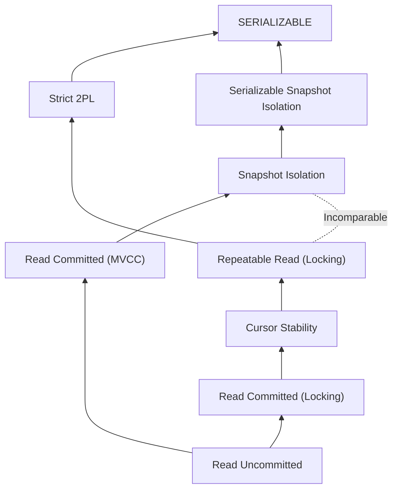

**TL;DR**: Стандарт SQL-92 фундаментально сломан и не описывает реальность современных MVCC-баз. Изоляция — это не линейная лестница, а частично упорядоченное множество (Partial Order). На уровне Scholar мы оперируем терминами **Conflict Serializability**, **View Serializability** и анализируем графы зависимостей (Serialization Graph).

---
## 1. Фундаментальная теория: Расписания, Эквивалентность и Сериализуемость

В теории конкурентного доступа (Concurrency Control Theory) мы абстрагируемся от физических страниц и блокировок. Мы рассматриваем выполнение транзакций как **частично упорядоченное множество операций**.

### 1.1. Формальная модель (Alphabet of Theory)

В теории управления конкурентным доступом (Concurrency Control) мы абстрагируемся от физической природы данных (диски, страницы, B-деревья) и семантики значений (числа, строки). Мы работаем с **абстрактными символами** и **отношениями порядка** на них.

### 1.1.1. Базовые примитивы и Пространство данных

Пусть $D = \{x, y, z, ...\}$ — фиксированное множество именованных элементов данных (Database Items).
Состояние базы данных — это отображение $State: D \to Val$, где $Val$ — область допустимых значений.

Определим **Алфавит операций** $\Sigma$:
1.  **Read ($r_i[x]$)**: Операция чтения элемента $x$ транзакцией $T_i$. Возвращает текущее значение $x$ в локальную переменную транзакции. Не меняет состояние БД.
2.  **Write ($w_i[x]$)**: Операция записи элемента $x$ транзакцией $T_i$. Переводит состояние базы данных из $S$ в $S'$, обновляя значение $x$.
3.  **Terminal Operations**:
    *   **Commit ($c_i$)**: Успешное завершение. Гарантирует персистентность изменений $T_i$.
    *   **Abort ($a_i$)**: Аварийное завершение. Аннулирует все эффекты $w_i[x]$ (восстанавливает состояние, предшествующее первой операции $T_i$).

---

### 1.1.2. Транзакция как Частичный порядок

На инженерном уровне транзакцию считают последовательностью. На уровне Scholar транзакция $T_i$ моделируется как кортеж $T_i = (\Sigma_i, <_i)$, где:

1.  $\Sigma_i \subset \Sigma$ — множество операций, принадлежащих транзакции $i$.
2.  $<_i$ — отношение **порядка выполнения** (ordering relation) между операциями.

**Аксиомы корректности транзакции (Well-formed Transaction):**
1.  **Atomicity of Termination**: $T_i$ содержит ровно одну терминальную операцию ($c_i$ или $a_i$), и эта операция является последней в порядке $<_i$ для всех остальных операций из $\Sigma_i$.
2.  **Read-Write Dependency**: Если $T_i$ читает $x$, а затем пишет $x$, то $r_i[x] <_i w_i[x]$.
3.  **Total Ordering (Упрощение)**: В классической теории (Page Model) мы полагаем, что порядок $<_i$ является **линейным (total)**. То есть транзакция — это строго последовательная программа.
    *   *Примечание*: В теории распределенных систем порядок может быть частичным (параллельные ветки внутри одной транзакции), но для анализа сериализуемости это сводится к набору линейных перестановок.

**Пример формальной записи:**
$$T_1 = r_1[x] \to r_1[y] \to w_1[x] \to c_1$$

---

### 1.1.3. Теория Конфликтов и Коммутативность

Самое важное понятие теории. Почему порядок операций вообще имеет значение?
В математике операции $A$ и $B$ **коммутативны**, если $A \circ B = B \circ A$ (результат применения не зависит от порядка).

**Определение конфликта (Conflict Definition):**
Две операции $p \in \Sigma_i$ и $q \in \Sigma_j$ находятся в конфликте, если выполнены три условия одновременно:
1.  **Different Transactions**: Они принадлежат разным транзакциям ($i \neq j$).
2.  **Same Data Item**: Они обращаются к одной и той же единице данных ($x$).
3.  **Non-Commutativity (Write involved)**: Хотя бы одна из операций является записью ($w$).

Если операции не конфликтуют, их можно менять местами в расписании, не меняя финального состояния базы данных (View) и значений, прочитанных транзакциями.

**Матрица совместимости (Compatibility Matrix):**

| Операция 1 / 2 | $r_j[x]$ | $w_j[x]$ |
| :--- | :--- | :--- |
| **$r_i[x]$** | ✅ **Commute** (Shared-Shared) | ❌ **Conflict** (Read-Write dependency) |
| **$w_i[x]$** | ❌ **Conflict** (Write-Read dependency) | ❌ **Conflict** (Write-Write dependency) |

---

### 1.1.4. Типология конфликтов (Академическая классификация)

Каждый тип конфликта порождает специфический класс аномалий, если порядок операций не контролируется.

1.  **WR-Conflict (Dirty Read / Dependency)**:
    *   Формула: $w_i[x] <_S r_j[x]$ (где $<_S$ — порядок в глобальном расписании).
    *   *Семантика*: $T_j$ читает данные, измененные $T_i$.
    *   *Риск*: Если $T_i$ сделает Abort ($a_i$), то $T_j$ прочитала данные, которых "не существует".

2.  **RW-Conflict (Unrepeatable Read / Anti-Dependency)**:
    *   Формула: $r_i[x] <_S w_j[x]$.
    *   *Семантика*: $T_i$ прочитала $x$, а затем $T_j$ изменила (перезаписала) его.
    *   *Риск*: $T_i$ "инвалидируется". Если $T_i$ прочитает $x$ снова, она получит другое значение. Это препятствует линеаризуемости.

3.  **WW-Conflict (Lost Update / Overwrite Dependency)**:
    *   Формула: $w_i[x] <_S w_j[x]$.
    *   *Семантика*: $T_j$ затирает запись, сделанную $T_i$.
    *   *Риск*: "Слепая запись". Если мы не учитываем этот конфликт, мы можем потерять результат работы $T_i$.

### 1.1.5. Почему это важно для "Serializable"?

Вся теория сериализуемости строится на **Теореме о перестановках (Commutativity Rule)**:

> Расписание $S$ эквивалентно расписанию $S'$, если $S'$ можно получить из $S$ путем последовательной перестановки соседних **неконфликтующих** операций.

Если с помощью таких перестановок мы можем превратить хаотичное чередование ($r_1, w_2, w_1...$) в строго последовательное ($T_1 \to T_2$), значит, конфликты не создали "замкнутого круга" зависимостей.

**Иллюстрация "Стены" (Wall Analogy):**
Представьте конфликт как бетонную стену между операциями.
*   $r_1[x]$ и $r_2[x]$ — воздуха нет, можно менять местами.
*   $w_1[x]$ и $r_2[x]$ — между ними бетонная связь. Если в расписании $w_1$ стоит перед $r_2$, вы не можете переставить $r_2$ перед $w_1$, не сломав логику программы (ибо $r_2$ прочитает другое значение).

Граф сериализации (Serialization Graph), который мы обсуждали ранее, — это по сути карта этих "бетонных связей". Цикл в графе означает, что транзакции замуровали друг друга.

### 1.2. Расписания (Schedules / Histories)

Если транзакция — это абстракция программы, то **Расписание (Schedule)** (в академической литературе часто называемое **History**) — это абстракция процесса выполнения множества программ в единой среде с разделяемыми ресурсами.

С математической точки зрения, расписание — это функция отображения частичных порядков множества транзакций в один глобальный порядок выполнения.

### 1.2.1. Формальное определение (Set-Theoretic Definition)

Пусть $T = \{T_1, T_2, ..., T_n\}$ — множество транзакций, где каждая $T_i$ имеет свой набор операций $\Sigma_i$ и локальный порядок $<_i$.

**Расписание $S$** над множеством $T$ — это кортеж $(\Sigma_S, <_S)$, удовлетворяющий следующим условиям:

1.  **Полнота состава (Membership)**: $\Sigma_S = \bigcup_{i=1}^{n} \Sigma_i$. Расписание содержит все операции всех участвующих транзакций.
2.  **Сохранение локального порядка (Local Order Preservation)**:
    $\forall T_i \in T, \forall p, q \in \Sigma_i$: если $p <_i q$, то $p <_S q$.
    *   *Пояснение*: Если внутри кода транзакции написано "сначала чтение, потом запись", планировщик (Scheduler) не имеет права менять их местами.
3.  **Тотальность (Total Ordering - для Page Model)**:
    Для любых двух различных операций $p, q \in \Sigma_S$ выполняется либо $p <_S q$, либо $q <_S p$.
    *   *Пояснение*: Даже если операции выполняются на многоядерном процессоре "одновременно", на уровне доступа к конкретному атому данных (page/tuple latch) они всегда выстраиваются в очередь. Поэтому мы моделируем расписание как линейную последовательность.

---
### 1.2.2. Проекции и Коммит (The Concept of Projection)

Это критический момент, который опускают в инженерных руководствах.
В реальном расписании смешаны транзакции, которые закоммитятся ($c_i$), и те, которые откатятся ($a_i$).

Для анализа корректности (ACID Consistency) имеют значение **только** закоммиченные транзакции. Откаченные транзакции должны исчезнуть бесследно (свойство Atomicity).

**Определение**: Проекция коммита (Committed Projection) $C(S)$.
Это новое расписание, полученное из $S$ путем удаления всех операций, принадлежащих транзакциям, которые не завершились успешно (нет $c_i$ в $S$).

$$C(S) = S \setminus \{ op \in T_i \mid c_i \notin S \}$$

*   **Scholar Axiom**: Расписание $S$ считается корректным (Serializable), только если его проекция $C(S)$ эквивалентна последовательному расписанию. Мы не требуем корректности от "мертвых" транзакций, при условии, что они не нарушили данные живых (проблема Dirty Read/Dirty Write).

---
### 1.2.3. Классификация Расписаний по структуре

Мы различаем три фундаментальных типа организации потока инструкций.

#### А. Последовательное расписание (Serial Schedule)
Расписание $S$ называется последовательным, если для любых двух транзакций $T_i$ и $T_j$, либо все операции $T_i$ предшествуют всем операциям $T_j$, либо наоборот.

*   **Формально**: $\nexists p \in \Sigma_i, q \in \Sigma_j$ таких, что $start(T_i) <_S p <_S q <_S end(T_j)$ при условии, что $T_i$ выполняется "вокруг" операций $T_j$.
*   **Свойство**: Serial Schedule всегда переводит базу данных из одного консистентного состояния в другое (по индукции).
*   **Проблема**: $Throughput \approx \frac{1}{\sum duration(T_i)}$. Это блокирует систему.

#### Б. Чередующееся расписание (Interleaved / Concurrent Schedule)
Расписание, в котором операции различных транзакций перемешаны.
*   *Пример*: $r_1[x] \to r_2[x] \to w_1[x] \to w_2[y] \dots$
*   *Мотивация*: **Masking I/O Latency**. Пока $T_1$ ждет загрузки страницы с диска, процессор выполняет вычисления для $T_2$. Это основа производительности СУБД.

#### В. Полное vs Частичное расписание (Complete vs Partial)
*   **Полное расписание**: Все транзакции в $S$ завершены ($c$ или $a$). Теоремы доказываются для полных расписаний.
*   **Частичное расписание**: Это "снэпшот" работы системы в данный момент времени. Некоторые транзакции активны.
    *   *Задача Scheduler-а*: Гарантировать, что *текущее* частичное расписание является **префиксом** некоторого корректного полного расписания.

---
### 1.2.4. Иллюстрация: От последовательного к хаосу

Рассмотрим две транзакции:
*   $T_1$: Перевод 100$ от A к B.
    $T_1 = r_1[A] \to w_1[A] \to r_1[B] \to w_1[B] \to c_1$
*   $T_2$: Начисление 10% на счет A.
    $T_2 = r_2[A] \to w_2[A] \to c_2$

**Вариант 1: Serial Schedule ($S_{serial}$)**
$$r_1[A] \to w_1[A] \to r_1[B] \to w_1[B] \to c_1 \xrightarrow{\text{Gap}} r_2[A] \to w_2[A] \to c_2$$
*   *Итог*: A уменьшился на 100, потом остаток увеличился на 10%. (Или наоборот, если $T_2 \to T_1$). Оба варианта корректны.

**Вариант 2: Interleaved Schedule ($S_{conc}$)**
$$r_1[A] \to \mathbf{r_2[A]} \to w_1[A] \to \mathbf{w_2[A]} \to c_2 \to r_1[B] \dots$$
*   *Анализ*:
    1. $T_1$ прочитала A.
    2. $T_2$ прочитала то же A (до списания).
    3. $T_1$ записала новое A (списала 100).
    4. $T_2$ записала новое A (начислила % на *старую* сумму, затерев списание $T_1$).
    5. **Lost Update**.
*   *Вердикт*: Хотя $S_{conc}$ является валидным расписанием (сохраняет локальный порядок), оно **не эквивалентно** ни одному Serial Schedule. Оно некорректно.

---
### Резюме для эксперта

1.  **Расписание** — это гомоморфизм времени. Это линейная проекция параллельных процессов.
2.  **Correctness criteria** (Критерий корректности) определяется через сравнение $S$ с классом Serial Schedules.
3.  Мы всегда работаем с **Committed Projection**. СУБД имеет право допускать временные аномалии для транзакций, которые в итоге будут отменены (Abort), при условии, что эти аномалии не "протекут" в закоммиченные транзакции (Cascading Aborts).

---
### 1.3. Теория Эквивалентности (The Equivalence Definitions)

Ключевой вопрос теории: *Как доказать, что параллельное выполнение (хаос) привело к тому же результату, что и последовательное (порядок), не зная заранее значений данных?*

---

В теории транзакций мы не можем сравнивать состояния базы данных "в лоб" (сравнивать биты на диске), так как пространство состояний бесконечно. Вместо этого мы сравниваем **операционную историю**.

Существует две фундаментальные модели эквивалентности:
1.  **View Equivalence (VSR)** — Семантическая истина (что *реально* произошло с потоком данных).
2.  **Conflict Equivalence (CSR)** — Синтаксическое приближение (как *безопасно* переставить операции).

### 1.3.1. View Equivalence (Эквивалентность по представлению)

Это самое мощное и интуитивно правильное определение. Два расписания $S$ и $S'$ эквивалентны по представлению ($S \approx_v S'$), если "ни одна транзакция не заметила разницы".

Для формализации нам нужны два вспомогательных понятия:

1.  **Отношение "Reads-From" (RF)**:
    Мы говорим, что транзакция $T_j$ читает $x$ от транзакции $T_i$ в расписании $S$, если:
    *   $w_i[x]$ предшествует $r_j[x]$.
    *   Транзакция $T_i$ не откатилась ($c_i \in S$).
    *   Между $w_i[x]$ и $r_j[x]$ нет другой операции записи $w_k[x]$ (нет перехвата записи).
    *   *Примечание*: Чтение начального состояния БД моделируется как чтение от фиктивной транзакции $T_0$.

2.  **Множество "Final Write" (FW)**:
    Для каждого элемента $x$ множество $FW(S)$ содержит транзакцию $T_i$, которая выполнила *последнюю* запись $w_i[x]$ в расписании $S$.

**Определение VSR**:
Расписания $S$ и $S'$ называются View Equivalent, если:
1.  $RF(S) = RF(S')$ — Потоки данных идентичны. Каждая транзакция получила те же входные данные от тех же авторов.
2.  $FW(S) = FW(S')$ — Итоговое состояние БД идентично. Последние писатели для каждой переменной совпадают.

**View Serializability (VSR)**: Расписание $S$ является VSR, если существует *какое-либо* последовательное расписание $S_{serial}$, такое что $S \approx_v S_{serial}$.

---
### 1.3.2. Conflict Equivalence (Эквивалентность по конфликтам)

Это "инженерное" определение, основанное на перестановках.

**Определение CSR**:
Два расписания $S$ и $S'$ называются Conflict Equivalent ($S \approx_c S'$), если $S'$ можно получить из $S$ путем серии перестановок соседних **неконфликтующих** операций.

**Conflict Serializability (CSR)**: Расписание $S$ является CSR, если $S \approx_c S_{serial}$ для некоторого последовательного расписания.

*   **Теорема**: $S$ является CSR $\iff$ Граф сериализации $G(S)$ ацикличен.
*   **Сложность**: Проверка CSR занимает полиномиальное время $O(N^2)$, где $N$ — число транзакций (построение графа и поиск циклов).

---
### 1.3.3. Разрыв VSR и CSR: Аномалия "Слепой записи"

На уровне Scholar вы обязаны понимать и доказывать, почему $CSR \subset VSR$. Почему множество VSR шире? Почему существуют корректные расписания, которые БД отвергают?

Ответ кроется в **Blind Writes (Слепых записях)** — записи данных без предварительного чтения ($w[x]$ без $r[x]$).

**Пример (The VSR-but-not-CSR anomaly):**

Пусть у нас есть три транзакции:
*   $T_1$: Пишет $x$.
*   $T_2$: Пишет $x$.
*   $T_3$: Пишет $x$.
(Никто не читает $x$. Все пишут "вслепую").

Рассмотрим расписание $S$:
$$S = w_1[x] \to w_2[x] \to w_1[y] \to w_3[x]$$
(Для усложнения добавим $y$, чтобы создать цикл, но для чистоты примера достаточно рассмотреть конфликты на $x$).

Давайте сконструируем более наглядный пример, который ломает CSR, но валиден в VSR.
Пусть:
*   $T_1$: $w_1[x]$
*   $T_2$: $w_2[x]$
*   $T_0$: (Initial state)
*   $T_f$: (Final transaction reading result)

Рассмотрим расписание **$S_{problem}$**:
$$w_1[x] \to w_2[x] \to w_1[y]$$
(Это не совсем корректный пример, давайте возьмем классический из учебника Weikum/Vossen).

**Классический пример:**
$T_1: w_1[x]$
$T_2: w_2[x], w_2[y]$
$T_3: w_3[y]$

Расписание $S$:
$$w_1[x] \to w_2[x] \to w_2[y] \to w_3[y]$$

**1. Анализ CSR (Граф конфликтов):**
*   $w_1[x]$ перед $w_2[x]$ $\Rightarrow T_1 \to T_2$
*   $w_2[y]$ перед $w_3[y]$ $\Rightarrow T_2 \to T_3$
*   Граф: $T_1 \to T_2 \to T_3$. Ацикличен. Это CSR.
*   Эквивалент: $T_1, T_2, T_3$.

**Теперь "сломанный" пример (Blind Write Anomaly):**
Транзакции:
*   $T_1: w_1[x], w_1[y]$
*   $T_2: w_2[x], w_2[y]$
*   $T_3: w_3[x]$

Расписание $S_{blind}$:
$$w_1[x] \to w_2[x] \to w_2[y] \to w_1[y] \to w_3[x]$$

**Анализ CSR:**
1.  $w_1[x] \dots w_2[x] \Rightarrow T_1 \to T_2$
2.  $w_2[y] \dots w_1[y] \Rightarrow T_2 \to T_1$
3.  **Цикл!** $T_1 \leftrightarrow T_2$.
4.  **Вердикт**: Расписание $S_{blind}$ **не является CSR**. Планировщик Postgres/InnoDB убьет одну из транзакций (Deadlock detection).

**Анализ VSR:**
Давайте посмотрим на потоки данных (Reads-From) и итог (Final Write).
*   **Reads-From**: Пусто (никто ничего не читает). Условие тривиально выполнено.
*   **Final Write**:
    *   Кто записал финальный $x$? $w_3[x]$ (Транзакция $T_3$).
    *   Кто записал финальный $y$? $w_1[y]$ (Транзакция $T_1$).
*   Существует ли последовательное расписание, которое дает тот же результат (Final $x$ от $T_3$, Final $y$ от $T_1$)?
    *   Попробуем $S_{serial} = T_2, T_1, T_3$.
    *   $T_2$ пишет $x, y$.
    *   $T_1$ перезаписывает $x, y$. (Текущее состояние: $x$ от $T_1$, $y$ от $T_1$).
    *   $T_3$ перезаписывает $x$. (Итог: $x$ от $T_3$, $y$ от $T_1$).
*   **Совпадение!** $S_{blind} \approx_v (T_2, T_1, T_3)$.
*   **Вердикт**: Расписание $S_{blind}$ **является VSR**.

---
### 1.3.4. Проблема NP-полноты VSR (Почему мы используем CSR)

Вы спросите: *"Профессор, если VSR допускает больше валидных сценариев (выше concurrency), почему мы не используем его?"*

Ответ кроется в алгоритмической сложности.
Чтобы проверить VSR для расписания $S$, мы должны ответить на вопрос: "Существует ли последовательное расписание $S'$ такое, что $RF(S)=RF(S')$ и $FW(S)=FW(S')$?"

Проблема в том, что "Слепые записи" делают граф зависимостей неоднозначным. Если $T_1$ пишет $x$, а потом $T_2$ пишет $x$ (и никто это не читал), то с точки зрения внешнего мира *не важно*, кто был первым. Мы можем выкинуть $T_1$ из истории $x$ вообще (Useless Write).
Но компьютер этого не знает. Ему нужно перебрать все $N!$ вариантов перестановок.
**Задача проверки View Serializability является NP-полной** (Papadimitriou, 1979).

**Вывод для Архитектора**:
1.  Базы данных используют **Conflict Serializability (CSR)**, потому что это дешево ($O(N^2)$ или даже $O(N)$ в online-алгоритмах) и безопасно.
2.  CSR — это **пессимистичное приближение**. Оно запрещает некоторые сценарии (как в примере выше), которые технически корректны, но выглядят подозрительно для алгоритма. Мы платим чуть меньшей пропускной способностью за возможность быстро принимать решения о коммите.

---
### 1.4. Граф Сериализации (The Serialization Graph Theorem)

Как мы можем доказать, что сложная "переплетенная" история выполнения транзакций ($S$) корректна, не пытаясь перебирать миллионы перестановок? Мы сводим задачу проверки расписания к задаче **поиска циклов в ориентированном графе**.

### 1.4.1. Конструирование Графа ($SG$)

Для любого расписания $S$ мы строим ориентированный граф $SG(S) = (V, E)$, называемый **Графом Сериализации** (или Графом Предшествования / Precedence Graph).

**1. Вершины ($V$)**:
Множество вершин соответствует множеству **закоммиченных** транзакций в расписании $S$.
$$V = \{ T_i \mid T_i \in S \land c_i \in S \}$$
*(Примечание: Активные или откаченные транзакции не влияют на персистентную корректность истории).*

**2. Ребра ($E$)**:
Ребро $T_i \to T_j$ существует тогда и только тогда, когда в расписании $S$ есть операция $p \in T_i$ и операция $q \in T_j$, такие что:
1.  $p$ предшествует $q$ во времени ($p <_S q$).
2.  $p$ и $q$ находятся в **конфликте** (доступ к одному элементу, одна из операций — запись).

Семантически ребро $T_i \to T_j$ означает: *"В любом эквивалентном последовательном расписании $T_i$ ОБЯЗАНА выполниться перед $T_j$".*

### 1.4.2. Типология ребер (The Dependency Triad)

В академической теории мы различаем три типа зависимостей, формирующих ребра графа. Это критически важно для понимания того, как работают разные уровни изоляции (например, MVCC игнорирует некоторые типы ребер).

1.  **wr-dependency (Flow Dependency / True Dependence)**
    *   *Сценарий*: $T_i$ пишет $x$, затем $T_j$ читает $x$.
    *   *Формально*: $w_i[x] <_S r_j[x]$.
    *   *Смысл*: $T_j$ читает результат работы $T_i$. $T_j$ зависит от $T_i$.
    *   *Влияние*: $T_j$ не может начать выполнение раньше $T_i$ в последовательном мире.

2.  **ww-dependency (Output Dependency)**
    *   *Сценарий*: $T_i$ пишет $x$, затем $T_j$ пишет $x$.
    *   *Формально*: $w_i[x] <_S w_j[x]$.
    *   *Смысл*: Финальное значение $x$ определяется $T_j$. Если переставить их местами, $x$ будет затерт старым значением от $T_i$.
    *   *Влияние*: Порядок записи должен сохраниться.

3.  **rw-dependency (Anti-dependency)** — *Самый коварный тип*
    *   *Сценарий*: $T_i$ читает $x$, затем $T_j$ перезаписывает $x$.
    *   *Формально*: $r_i[x] <_S w_j[x]$.
    *   *Смысл*: $T_i$ успела прочитать "старое" значение. Если бы мы запустили $T_j$ перед $T_i$, то $T_i$ прочитала бы "новое" значение.
    *   *Влияние*: Чтобы сохранить иллюзию последовательности (где $T_i$ видит старое значение), $T_i$ обязана стоять **ДО** $T_j$.
    *   *Важно*: Именно игнорирование анти-зависимостей приводит к аномалиям **Non-Repeatable Read** и **Write Skew**.

---
### 1.4.3. Теорема Сериализуемости (The CSR Theorem)

Это центральная теорема классической теории баз данных.

> **Теорема**: Расписание $S$ является конфликт-сериализуемым (CSR) **тогда и только тогда**, когда граф сериализации $SG(S)$ является **ациклическим**.

**Доказательство (интуиция через Топологическую сортировку):**

1.  **Если ($G$ ацикличен $\Rightarrow$ CSR)**:
    Если в графе нет циклов, мы можем применить алгоритм **топологической сортировки**. Он выстроит транзакции в линейную цепочку $T_{k1}, T_{k2}, ..., T_{kn}$ так, что все стрелки зависимостей идут слева направо.
    Эта цепочка и есть **эквивалентное последовательное расписание** ($S_{serial}$). Так как все конфликты (ребра) учтены и направлены вперед, результат выполнения $S_{serial}$ будет идентичен $S$.

2.  **Если (Цикл $\Rightarrow$ Не CSR)**:
    Предположим, есть цикл $T_1 \to T_2 \to T_1$.
    *   Ребро $T_1 \to T_2$ требует, чтобы $T_1$ была в прошлом относительно $T_2$.
    *   Ребро $T_2 \to T_1$ требует, чтобы $T_2$ была в прошлом относительно $T_1$.
    *   Это временной парадокс. Невозможно построить линейную последовательность, удовлетворяющую обоим условиям. Следовательно, расписание не сериализуемо.

---
### 1.4.4. Пример: Анализ аномалии через Граф

Рассмотрим классическую аномалию **Lost Update**, чтобы увидеть цикл.

**Расписание $S$:**
1. $r_1[x]$ ($T_1$ читает $x=10$)
2. $r_2[x]$ ($T_2$ читает $x=10$)
3. $w_2[x]$ ($T_2$ пишет $x=20$)
4. $w_1[x]$ ($T_1$ пишет $x=30$)
5. $c_1, c_2$

**Построение Графа $SG(S)$:**

1.  **Анализ пары ($r_1[x], w_2[x]$)**:
    *   $T_1$ читает $x$ до того, как $T_2$ его перезапишет.
    *   Это **rw-dependency** (анти-зависимость).
    *   Ребро: **$T_1 \to T_2$**. (Значит, в истории $T_1$ должна быть *до* $T_2$).

2.  **Анализ пары ($r_2[x], w_1[x]$)**:
    *   $T_2$ читает $x$ до того, как $T_1$ его перезапишет.
    *   Это **rw-dependency**.
    *   Ребро: **$T_2 \to T_1$**. (Значит, $T_2$ должна быть *до* $T_1$).

3.  **Анализ пары ($w_2[x], w_1[x]$)**:
    *   $T_2$ пишет раньше $T_1$.
    *   Это **ww-dependency**.
    *   Ребро: **$T_2 \to T_1$**. (Подтверждает предыдущее).

**Итог**: В графе есть ребра $T_1 \to T_2$ и $T_2 \to T_1$.
**Цикл**: $T_1 \leftrightarrow T_2$.
**Вердикт**: Расписание **не сериализуемо**. База данных обязана была заблокировать одну из операций или откатить транзакцию.

---
### 1.4.5. Связь с реальными алгоритмами (Professor's Insight)

Как это знание применяется внутри движков БД?

1.  **Strict 2PL (SQL Server, DB2, MySQL Locking)**:
    *   Не строит граф явно.
    *   Протокол блокировок гарантирует, что цикл *не может сформироваться*. Если транзакция пытается создать ребро, закрывающее цикл, она натыкается на блокировку и ждет.
    *   Если возникает взаимная блокировка (Deadlock), это и есть "попытка создать цикл" в графе ожидания. БД убивает транзакцию.

2.  **Optimistic Concurrency Control (OCC)**:
    *   Транзакции выполняются в приватных буферах.
    *   В момент коммита происходит фаза **Validation**. Система проверяет, не создаст ли коммит этой транзакции ребер, ведущих к циклу с уже завершенными транзакциями. Если создаст — Abort.

3.  **Serializable Snapshot Isolation (PostgreSQL SSI)**:
    *   Это самый продвинутый современный метод.
    *   Postgres *не блокирует* читателей. Вместо этого он динамически отслеживает `rw-dependencies` (анти-зависимости) в памяти.
    *   Алгоритм ищет специфический паттерн в графе: **"Dangerous Structure"** (два последовательных rw-ребра: $T_{in} \xrightarrow{rw} T_{pivot} \xrightarrow{rw} T_{out}$).
    *   Доказано, что любой цикл в истории Snapshot Isolation обязан содержать такую структуру. Убивая транзакцию-"пивот", Postgres предотвращает аномалии, сохраняя non-blocking reads.

### Резюме для Scholar

Граф сериализации — это **истина в последней инстанции**.
*   **Ребра ($wr, ww, rw$)** — это ограничения порядка.
*   **Цикл** — это логическое противоречие.
*   Все уровни изоляции слабее Serializable (Read Committed, Repeatable Read) определяются через то, какие типы ребер или циклов они **игнорируют** ради производительности. Например, Snapshot Isolation игнорирует циклы, если в них нет двух анти-зависимостей подряд.

---
### 1.5. Тонкий момент: VSR vs CSR и "Слепая запись"

В иерархии корректности расписаний существует строгое включение:
$$CSR \subset VSR \subset AllSchedules$$

Это означает, что **любое** конфликт-сериализуемое расписание (CSR) является view-сериализуемым (VSR), но **не наоборот**. Существует "серая зона" ($VSR \setminus CSR$) — множество расписаний, которые корректны с точки зрения данных, но отвергаются стандартными алгоритмами блокировок и графов.

Причина существования этой зоны — феномен **Слепой записи (Blind Write)**.

### 1.5.1. Определение Слепой записи

Операция $w_i[x]$ называется **слепой записью**, если в транзакции $T_i$ ей не предшествует чтение того же элемента $r_i[x]$.
Транзакция пишет значение "вслепую", полностью игнорируя предыдущее состояние $x$.

*   *Семантическое значение*: Слепая запись разрывает поток информации. Если $T_1$ записала $x$, а затем $T_2$ сделала слепую запись в $x$, то значение от $T_1$ становится **бесполезным (Useless Write)**, если никто не успел его прочитать между $w_1$ и $w_2$.

### 1.5.2. Доказательство: Контрпример ($S \in VSR \land S \notin CSR$)

Рассмотрим классический пример, доказывающий, что CSR является лишь аппроксимацией VSR.

Дано три транзакции:
*   $T_1$: Читает $y$, пишет $x$. ($r_1[y], w_1[x]$)
*   $T_2$: Пишет $x$, пишет $y$. ($w_2[x], w_2[y]$) — *Внимание: две слепые записи.*
*   $T_3$: Пишет $x$. ($w_3[x]$) — *Слепая запись.*

Рассмотрим расписание $S_{hybrid}$:
$$S_{hybrid} = r_1[y] \to w_2[x] \to w_2[y] \to w_1[x] \to w_3[x]$$

#### Шаг А: Анализ CSR (Синтаксический подход)
Построим граф конфликтов $SG(S)$.

1.  **Пара ($r_1[y], w_2[y]$)**:
    *   $T_1$ читает $y$ *до* того, как $T_2$ его пишет.
    *   Тип: **rw-dependency** (анти-зависимость).
    *   Ребро: $T_1 \to T_2$.
2.  **Пара ($w_2[x], w_1[x]$)**:
    *   $T_2$ пишет $x$ *до* того, как $T_1$ его пишет.
    *   Тип: **ww-dependency**.
    *   Ребро: $T_2 \to T_1$.

**Результат**: Граф содержит цикл $T_1 \leftrightarrow T_2$.
**Вывод CSR**: Расписание **некорректно**. Планировщик (Postgres/Oracle) обязан убить одну из транзакций.

#### Шаг Б: Анализ VSR (Семантический подход)
Давайте посмотрим на поток данных "с высоты птичьего полета". Нам нужно найти такое последовательное расписание $S_{serial}$, которое дает тот же результат.

1.  **Кто что читал (Reads-From View)?**
    *   В $S_{hybrid}$: $T_1$ читает $y_0$ (начальное состояние), так как $w_2[y]$ происходит позже.
    *   Остальные ничего не читают.
2.  **Кто записал финал (Final Write View)?**
    *   В $S_{hybrid}$:
        *   Финал $x$: Записан $T_3$ (операция $w_3[x]$ последняя).
        *   Финал $y$: Записан $T_2$ (операция $w_2[y]$ последняя).
        *   *Заметьте*: Запись $w_1[x]$ была затерта $T_3$. Запись $w_2[x]$ была затерта $T_1$ и потом $T_3$. Они стали "бесполезными".

Попробуем последовательное расписание **$S' = <T_1, T_2, T_3>$**:
1.  **$T_1$**: Читает $y_0$. Пишет $x$ (затерто позже).
2.  **$T_2$**: Пишет $x$ (затерто позже). Пишет $y$ (финальное!).
3.  **$T_3$**: Пишет $x$ (финальное!).

**Сравнение**:
*   Reads-From: И там, и там $T_1$ читает $y_0$. (Совпало).
*   Final Write: И там, и там $x$ от $T_3$, $y$ от $T_2$. (Совпало).

**Вывод VSR**: $S_{hybrid} \approx_v S'$. Расписание **корректно**!

### 1.5.3. Дилемма сложности: P vs NP-Complete

Почему базы данных отвергают корректное расписание $S_{hybrid}$?
Почему мы используем граф конфликтов, который "врет" (дает false negative), находя цикл там, где данные не страдают?

Ответ дал Христос Пападимитриу (Christos Papadimitriou) в 1979 году:

> **Теорема**: Задача проверки, принадлежит ли произвольное расписание $S$ классу VSR, является **NP-полной**.

**Доказательство (интуиция)**:
Чтобы доказать VSR, нужно найти *хотя бы одну* перестановку транзакций из $N!$ возможных, которая совпадает по View. Из-за слепых записей "бесполезные" транзакции могут быть вставлены в любое место последовательности, что взрывает пространство поиска.

**Сравнение сложности:**
1.  **CSR (Graph Cycle)**: Поиск цикла в графе — это $O(V + E)$. Это очень быстро. Можно делать в runtime.
2.  **VSR (View Equivalence)**: NP-Complete. Если у вас 100 активных транзакций, проверка займет больше времени, чем возраст Вселенной.

### 1.5.4. Практическое применение: Правило Томаса (Thomas Write Rule)

Единственное место, где VSR применяется на практике — это системы с **Timestamp Ordering** (например, ранние версии распределенных БД).

**Thomas Write Rule (TWR)**:
*   Ситуация: Транзакция $T_{old}$ (со старым timestamp) пытается записать $x$, но видит, что $x$ уже обновлен более молодой транзакцией $T_{new}$.
*   Стандартный подход (CSR): Abort $T_{old}$, так как нарушен порядок сериализации ($w_{new}$ произошло перед $w_{old}$, а должно быть наоборот).
*   Оптимизация (VSR): Мы знаем, что запись $T_{old}$ все равно будет затерта $T_{new}$ (или более поздней). Эта запись — "слепая" и "бесполезная".
*   **Решение**: Мы просто **игнорируем** запись $w_{old}[x]$, но позволяем транзакции $T_{old}$ продолжить работу и закоммититься.
*   Это легальное использование VSR, которое повышает concurrency, игнорируя WW-конфликты.

### Резюме для Scholar

1.  **CSR — это достаточное, но не необходимое условие** корректности.
2.  **VSR — это необходимое и достаточное условие**, но оно вычислительно неподъемно (intractable).
3.  Разница между ними — в трактовке **WW-конфликтов**.
    *   CSR считает, что порядок *всех* записей важен.
    *   VSR понимает, что важна только *последняя* запись, если промежуточные не были прочитаны.
4.  Мы живем в мире CSR (Postgres, MySQL, Oracle), потому что мы предпочитаем **быстро** ошибиться и перезапустить транзакцию (Abort), чем **вечно** вычислять, была ли она корректной.

---
### Резюме для эксперта

1.  **Сериализуемость** — это свойство **расписания**, а не транзакции.
2.  Мы используем **Conflict Serializability (CSR)**, потому что проверка графа конфликтов на ацикличность эффективна.
3.  Любой движок, реализующий Serializable (через 2PL или SSI), по сути, занимается динамическим построением графа зависимостей и разрывом циклов в нем.

---
## 2. Критика стандарта SQL-92 (The Berenson Paper 1995)

Стандарт SQL-92 совершил классическую ошибку в дизайне систем: он смешал **спецификацию** (что мы хотим получить) и **реализацию** (как мы это делаем).

Работа 1995 года *"A Critique of ANSI SQL Isolation Levels"* (авторы: Hal Berenson, Phil Bernstein, Jim Gray, Jim Melton, Elizabeth O'Neil) является фундаментальной, так как она доказала, что "карта не есть территория".

---

В 1992 году комитет ANSI попытался определить уровни изоляции транзакций, не привязываясь к математике (теории сериализуемости), а используя "язык аномалий" (phenomena-based definitions). Они полагали, что изоляцию можно определить через список того, что **не должно** происходить.

### 2.1. Фундаментальная ошибка: "Locking Bias" (Смещение блокировок)

Авторы стандарта ментально находились в парадигме **System R** (первой SQL БД от IBM), которая использовала **Two-Phase Locking (2PL)**.

Стандарт определил уровень `Serializable` как:
> "Уровень, на котором невозможны: Dirty Read, Non-Repeatable Read и Phantom Read".

*   **В мире 2PL**: Это утверждение верно. Если вы держите строгие блокировки (Strict 2PL) на диапазонах, вы действительно предотвращаете все аномалии и получаете Serializability.
*   **В мире MVCC (Multi-Version Concurrency Control)**: Это утверждение **ложно**. В Oracle (который использует Snapshot Isolation) невозможны Dirty Read, Non-Repeatable Read и Phantoms. Однако, Oracle (в режиме SI) допускает аномалию **Write Skew**.
    *   *Следствие*: База данных соответствует определению `Serializable` по стандарту SQL-92 (формально), но **не обеспечивает** сериализуемость транзакций (математически). Это привело к маркетинговой лжи Oracle на десятилетия (они называли SI уровнем Serializable).

---
### 2.2. Расширенная таксономия феноменов (The Extended Taxonomy)

Беренсон и коллеги показали, что стандартные определения P1, P2 и P3 были либо **двусмысленными**, либо **недостаточными**.

#### P0: Dirty Write (Грязная запись) — Упущенный фундамент

Стандарт вообще забыл упомянуть эту аномалию, полагая её невозможной. Однако формально она допустима в рамках слабых определений.

*   **Определение**: Транзакция $T_1$ изменяет элемент данных $x$. Затем транзакция $T_2$ изменяет $x$ *до того*, как $T_1$ закоммитилась или откатилась.
    $$w_1[x] \dots w_2[x] \dots ((c_1/a_1) \land (c_2/a_2))$$
*   **Почему это катастрофа (Recovery Impossibility)**:
    Если $T_1$ делает `ROLLBACK`, она должна восстановить $x$ к состоянию "до $T_1$". Но при этом она затрет запись $T_2$. Если $T_2$ уже закоммитилась, мы нарушим Durability (потеряем $w_2[x]$). Если мы не откатим $x$, мы нарушим Atomicity $T_1$.
*   **Scholar Verdict**: Защита от P0 обязательна для **всех** уровней изоляции, начиная с Read Uncommitted. Это достигается через долгоживущие эксклюзивные блокировки на запись (Long Duration Exclusive Locks), даже в MVCC.

#### P1: Dirty Read (Грязное чтение) — Проблема "Strict" vs "Broad"

Стандарт SQL-92 определил P1 слишком узко.

*   **Strict P1 (ANSI)**: $T_1$ изменяет строку. $T_2$ читает эту строку до коммита $T_1$.
*   **Broad P1 (Critique)**: $T_1$ изменяет *любые* данные. $T_2$ читает эти данные до коммита $T_1$.
    *   *Нюанс*: Что если $T_1$ не обновил строку, а *вставил* новую? Технически, по стандарту ANSI, чтение "грязной вставки" не подпадало под Dirty Read, что абсурдно. Критика потребовала расширительного толкования: чтение *любых* незафиксированных данных (Update/Insert/Delete) есть Dirty Read.

#### P3: Phantom (Фантом) — Самый большой провал

Стандарт определил Фантом исключительно через **INSERT**.

*   **ANSI P3**: Транзакция $T_1$ читает набор строк по условию (`WHERE score > 10`). $T_2$ *вставляет* новую строку, удовлетворяющую условию. $T_1$ повторяет чтение и видит новую строку.
*   **Critique P3**: Фантом возникает не только при вставке.
    *   *Пример*: $T_2$ делает `UPDATE users SET score = 11 WHERE id = 5`.
    *   Строка с `id=5` существовала ранее, но она *не попадала* в предикат $T_1$. После обновления она *начала попадать*. Для $T_1$ она возникла "из ниоткуда", как призрак.
    *   **Scholar Verdict**: Фантом — это любое изменение множества строк, возвращаемых предикатом, вызванное Insert, Update или Delete.

---
### 2.3. Аномалии, пропущенные стандартом

Работа 1995 года ввела новые определения для аномалий, специфичных для неблокирующих систем (Snapshot Isolation).

#### A5A: Read Skew (Перекос чтения)
Ситуация, когда транзакция видит базу данных в несогласованном состоянии (видит часть обновлений другой транзакции, но не все), но при этом *не читает* грязные данные.

*   *Сценарий*: $x=50, y=50$. Инвариант $x=y$.
    1.  $T_1$ читает $x=50$.
    2.  $T_2$ пишет $x=25, y=25$ и делает Commit.
    3.  $T_1$ читает $y=25$.
*   *Итог*: $T_1$ видит $x=50, y=25$. Инвариант нарушен.
*   Это не Dirty Read (мы читали закоммиченное). Это не Non-Repeatable Read (мы читали разные переменные). Стандарт SQL-92 был слеп к этому.

#### A5B: Write Skew (Перекос записи)
Главная "дыра" в Snapshot Isolation.

*   *Сценарий*: Два врача на дежурстве ($Doc_A, Doc_B$). Инвариант: "Хотя бы один врач должен дежурить".
    1.  $T_1$ ($Doc_A$): `SELECT count(*) WHERE on_call=true` -> возвращает 2.
    2.  $T_2$ ($Doc_B$): `SELECT count(*) WHERE on_call=true` -> возвращает 2.
    3.  $T_1$: `UPDATE doctors SET on_call=false WHERE name='Doc_A'`. (Уходит с дежурства, думая, что остался $Doc_B$).
    4.  $T_2$: `UPDATE doctors SET on_call=false WHERE name='Doc_B'`. (Уходит с дежурства, думая, что остался $Doc_A$).
    5.  **Commit $T_1$, Commit $T_2$**.
*   *Результат*: 0 врачей. Инвариант нарушен.
*   *Анализ*: Ни $T_1$, ни $T_2$ не видели "грязных" данных. Никто не менял данные, которые читал другой (они читали индекс, а писали в запись).
*   **Вывод**: Snapshot Isolation $\neq$ Serializable.

---
### 2.4. Истинная иерархия уровней изоляции

Статья Беренсона доказала, что уровни изоляции нельзя выстроить в единую линию. Это **Частично Упорядоченное Множество (Poset)**.

```mermaid
graph TD
    S[Serializable] --> SSI[Serializable Snapshot Isolation]
    S --> S2PL[Strict 2PL]
    SSI --> SI[Snapshot Isolation]
    S2PL --> RR[Repeatable Read (Locking)]
    SI --> RC[Read Committed]
    RR --> RC
    RC --> RU[Read Uncommitted]
```

*   **Snapshot Isolation (SI)** находится "сбоку".
    *   Он сильнее `Read Committed`.
    *   Он не сравним с `Repeatable Read` (ANSI): SI предотвращает фантомы (лучше чем RR), но допускает Write Skew (в то время как Strict RR на блокировках предотвращает Write Skew, блокируя ресурсы).
    *   Он строго слабее `Serializable`.

### 2.5. Почему это важно сегодня?

Эта критика разделила мир БД на два лагеря:
1.  **Лагерь "Честных" (PostgreSQL, CockroachDB)**: Реализуют `Serializable` через SSI (Serializable Snapshot Isolation), который математически ловит Write Skew.
2.  **Лагерь "Прагматичных" (Oracle, MySQL InnoDB)**:
    *   Oracle `Serializable` = Snapshot Isolation (допускает Write Skew). Они просто игнорируют критику.
    *   MySQL `Repeatable Read` = Snapshot Isolation (на чтение) + Gap Locks (на запись). Это гибрид, который предотвращает фантомы, но все еще уязвим к некоторым видам Write Skew без явных блокировок (`FOR UPDATE`).

### Резюме для Scholar

Критика 1995 года учит нас: **Не определяйте сложные системы через список того, что в них "не ломается"**. Определяйте их через **инварианты** и **графы зависимостей**.
*   SQL-92 пытался определить "Здоровье" как "Отсутствие насморка, кашля и температуры".
*   Беренсон показал, что можно не иметь этих симптомов, но умереть от "Write Skew" (рака).
*   Единственное верное определение Serializable — это **Conflict Serializability** (отсутствие циклов в графе).

---
## 3. Полная таксономия феноменов (P0 — P4): От ANSI к Реальности

Мы используем обозначение **$P$ (Phenomenon)**, а не $A$ (Anomaly), потому что на определенных уровнях изоляции (например, Read Committed) эти события являются *допустимым поведением*, а не ошибкой системы.

Определим нотацию операций:
*   $r_1[x]$: Транзакция $T_1$ читает объект $x$.
*   $w_1[x]$: Транзакция $T_1$ пишет (изменяет) объект $x$.
*   $r_1[P]$: Транзакция $T_1$ читает набор строк, удовлетворяющих предикату $P$ (например, `WHERE age > 10`).
*   $c_1, a_1$: Коммит или Аборт $T_1$.

---
Я продолжу лекцию в роли профессора (PhD) в области теории баз данных.

Мы остановились на строгой формализации феноменов (аномалий), определенных в фундаментальной работе Беренсона-Бернштейна. Это алфавит, которым мы описываем нарушения целостности данных.

---
### P0: Dirty Write (Грязная запись) — Игнорируемый фундамент

Это аномалия, которую стандарт SQL-92 не упоминал, полагая её невозможной. Однако формально она существует и является **абсолютным табу** для любой системы, претендующей на ACID.

*   **Определение**: Транзакция $T_1$ изменяет элемент $x$. Транзакция $T_2$ изменяет $x$ до того, как $T_1$ завершилась (Commit или Abort).
    $$w_1[x] \dots w_2[x] \dots ((c_1 \lor a_1) \land (c_2 \lor a_2))$$
*   **Почему это недопустимо (Recovery Impossibility)**:
    Нарушается свойство атомарности и возможность отката. Представьте, что $T_1$ нужно откатить ($a_1$). Система должна восстановить $x$ к состоянию *до* $T_1$.
    *   Если мы восстановим старое значение, мы уничтожим запись $w_2[x]$ (нарушение Durability для $T_2$, если она успела закоммититься).
    *   Если мы оставим значение от $T_2$, мы нарушим Atomicity $T_1$ (частично примененные изменения).
*   **Решение**: Все уровни изоляции (даже Read Uncommitted) предотвращают P0, удерживая **долгоживущие эксклюзивные блокировки** (Long-duration Write Locks) на изменяемых строках.

---
### P1: Dirty Read (Грязное чтение) — Проблема зависимости от Аборта

*   **Определение**: Транзакция $T_1$ изменяет данные. $T_2$ читает эти данные *до* того, как $T_1$ закоммитилась.
    $$w_1[x] \dots r_2[x] \dots (a_1 \text{ или } c_1)$$
*   **Семантический риск**:
    1.  **Reading Non-Existent Data**: Если $T_1$ откатится ($a_1$), то $T_2$ работала с данными, которых никогда не существовало в истории БД.
    2.  **Cascading Aborts**: Если БД разрешает P1, то при откате $T_1$ система обязана принудительно откатить и $T_2$ (и всех, кто читал от неё). В реальных системах каскадные откаты слишком дороги, поэтому P1 запрещают на уровне Read Committed.

---
### P2: Non-repeatable Read (Неповторяемое / Нечеткое чтение)

Здесь мы переходим к нарушению изоляции внутри одной транзакции.

*   **Определение**: $T_1$ читает $x$. $T_2$ изменяет или удаляет $x$ и коммитится. $T_1$ снова читает $x$ и видит другое значение (или ошибку).
    $$r_1[x] \dots w_2[x] \dots c_2 \dots r_1[x]$$
*   **Суть**: Нарушение инварианта "стабильности видимого состояния". С точки зрения $T_1$, данные мутируют под ногами.
*   **В графе сериализации**: Это создает ребро $T_1 \xrightarrow{rw} T_2$ (анти-зависимость). Если $T_1$ позже попытается записать что-то, что прочитает $T_2$ (или перезапишет), возникнет цикл.

---
### P3: Phantom Read (Фантом) — Проблема Предикатов

Самый сложный для понимания феномен, часто путаемый с P2. Разница в **области действия**. P2 касается конкретной строки, P3 касается *множества строк*, удовлетворяющих условию.

*   **Определение**: $T_1$ выполняет запрос с предикатом $P$ (напр., `WHERE age > 18`). $T_2$ создает данные (INSERT/UPDATE), которые начинают удовлетворять $P$. $T_1$ повторяет запрос и получает другой набор строк.
    $$r_1[P] \dots w_2[y \in P] \dots c_2 \dots r_1[P]$$
*   **Почему это важно**: P2 можно предотвратить блокировкой строк (Row Locks). P3 нельзя предотвратить блокировкой существующих строк, так как новой строки ($y$) еще нет. Нужны **Predicate Locks** или **Gap Locks** (блокировка "воздуха" между записями в индексе).
*   **Scholar Insight**: В MVCC системах (Postgres) P3 на уровне чтения предотвращается (вы не видите новые версии), но P3 на уровне *записи* (Write Skew) остается возможным.

---
### P4: Lost Update (Потерянное обновление) — Слепая зона

Формально это вариация P0, но на уровне логики приложения.

*   **Определение**: $T_1$ читает $x$. $T_2$ читает $x$. $T_1$ пишет $x$ (на основе прочитанного). $T_2$ пишет $x$ (на основе своего прочитанного). Запись $T_1$ затерта.
    $$r_1[x] \dots r_2[x] \dots w_1[x] \dots w_2[x]$$
*   **В графе**: Цикл $T_1 \to T_2$ (rw-зависимость) и $T_2 \to T_1$ (ww-зависимость).
*   **Реальность**: Стандартный Read Committed **не защищает** от P4. Разработчики должны явно использовать `SELECT FOR UPDATE` или атомарные операции (`UPDATE x = x + 1`). Уровни Repeatable Read и выше обязаны предотвращать P4.

---
## 4. Аномалии MVCC: Skew Phenomena

В мире блокировок (2PL) конфликты предотвращаются "грубой силой": если вы читаете данные, никто не может их изменить. В мире MVCC действует правило: **"Readers do not block Writers, and Writers do not block Readers"**.

Это достигается за счет того, что транзакция работает с **согласованным снимком (Snapshot)** базы данных на момент своего начала ($StartTimestamp$). Однако, принимая решения на основе *прошлого* состояния, транзакция может нарушить целостность *будущего*.

### 4.1. A5A: Read Skew (Перекос чтения)

Этот феномен иллюстрирует разницу между уровнем `Read Committed` и `Snapshot Isolation`.

*   **Определение**: Транзакция $T_1$ читает данные $x$ и $y$, между которыми существует логическая связь (инвариант $C(x, y)$). В процессе чтения транзакция $T_2$ изменяет $x$ и $y$ и фиксирует изменения. $T_1$ видит одну часть данных из "прошлого" (до $T_2$), а другую — из "будущего" (после $T_2$).
    
*   **Формальный сценарий**:
    Пусть инвариант $x + y = 100$. Исходно $x=50, y=50$.
    1.  $T_1$: `SELECT x` $\to$ получает 50.
    2.  $T_2$: `UPDATE x=25, y=75; COMMIT`. (Инвариант сохранен: $25+75=100$).
    3.  $T_1$: `SELECT y` $\to$ получает 75 (читает новую версию).
    4.  $T_1$: Вычисляет сумму $50 + 75 = 125$.
    
*   **Анализ**:
    *   Инвариант нарушен внутри $T_1$.
    *   Это **не** Dirty Read (все прочитанные данные были закоммичены).
    *   Это **не** Non-Repeatable Read (мы не читали $x$ дважды).
    *   В терминах графов это ребро зависимости, пересекающее границы версий.

**Вердикт Архитектора**: В базах данных с честным Snapshot Isolation (Postgres `REPEATABLE READ`, Oracle `SERIALIZABLE`) **Read Skew невозможен**. Транзакция $T_1$ на шаге 3 увидит *старую* версию $y=50$, так как $T_2$ закоммитилась *после* начала $T_1$. Однако в режиме `READ COMMITTED` (дефолт для большинства БД) Read Skew является штатным поведением.

---
### 4.2. A5B: Write Skew (Перекос записи) — "Тихий убийца"

Это самая важная аномалия для инженера. Она возникает **только** в Snapshot Isolation и является причиной, почему SI не равен Serializable.

*   **Суть**: Две транзакции читают **пересекающиеся** наборы данных, принимают решение на основе прочитанного, и вносят изменения в **непересекающиеся** (disjoint) наборы данных. Каждая транзакция по отдельности сохраняет инвариант, но вместе они его нарушают.
*   **Почему это сложно поймать**: Здесь нет конфликта "Запись-Запись" (WW-conflict). Транзакции пишут в разные строки, поэтому блокировки строк (Row Locks) не помогают.

#### Классический пример: "Дежурные врачи" (The Doctors Example)

*   **Схема**: Таблица `doctors` с колонками `id`, `name`, `on_call` (bool).
*   **Бизнес-правило (Инвариант)**: В любой момент времени должен дежурить минимум один врач (`COUNT(on_call=true) >= 1`).
*   **Состояние**: Дежурят двое — Алиса ($Doc_A$) и Боб ($Doc_B$).

**Хронология провала в Snapshot Isolation:**

1.  **$T_1$ (Алиса)**: Хочет уйти в отпуск. Проверяет, можно ли:
    `SELECT COUNT(*) FROM doctors WHERE on_call = true`
    *   Результат: 2. (Она видит снимок, где Боб тоже дежурит).
    *   Логика приложения: $2 \ge 2$, уходить можно.
2.  **$T_2$ (Боб)**: Тоже хочет уйти. Проверяет:
    `SELECT COUNT(*) FROM doctors WHERE on_call = true`
    *   Результат: 2. (Он видит снимок, где Алиса тоже дежурит).
    *   Логика: $2 \ge 2$, уходить можно.
3.  **$T_1$ (Алиса)**: Снимает себя с дежурства.
    `UPDATE doctors SET on_call = false WHERE name = 'Doc_A'`
    *   *Конфликт?* Нет. Она меняет строку Алисы.
4.  **$T_2$ (Боб)**: Снимает себя с дежурства.
    `UPDATE doctors SET on_call = false WHERE name = 'Doc_B'`
    *   *Конфликт?* Нет. Он меняет строку Боба.
5.  **Commit $T_1$**. Успех.
6.  **Commit $T_2$**. Успех.

**Результат**: `COUNT = 0`. Инвариант нарушен. Больница пуста.

#### Формальный анализ (Граф сериализации)

Давайте построим граф для Write Skew. Обозначим $P$ как предикат `on_call=true`.
*   $T_1$ читает множество по $P$ (видит Боба). $T_2$ изменяет строку Боба (меняет множество $P$).
    *   Это **rw-dependency** (анти-зависимость): $r_1[P] \xrightarrow{rw} w_2[Bob]$.
    *   Семантика: $T_1$ должна была выполниться *до* $T_2$.
*   $T_2$ читает множество по $P$ (видит Алису). $T_1$ изменяет строку Алисы.
    *   Это **rw-dependency** (анти-зависимость): $r_2[P] \xrightarrow{rw} w_1[Alice]$.
    *   Семантика: $T_2$ должна была выполниться *до* $T_1$.

**Итог**: Цикл $T_1 \leftrightarrow T_2$, состоящий из двух rw-ребер.
В системах блокировок (2PL) первая транзакция наложила бы `Shared Lock` на чтение, и вторая не смогла бы сделать `UPDATE`. В MVCC блокировок на чтение нет, поэтому цикл замыкается.

---
### 4.3. A5B-2: Read-Only Transaction Anomaly (Аномалия только-читающей транзакции)

Это уровень **Scholar+**. Мало кто знает, что даже если писатели работают корректно, добавление `READ ONLY` транзакции может сломать сериализуемость в Snapshot Isolation.

*   **Сценарий**:
    *   $T_1$ (RW): Делает депозит.
    *   $T_2$ (RW): Начисляет проценты.
    *   $T_3$ (RO): Формирует отчет (Баланс + Проценты).
*   В Snapshot Isolation возможна ситуация, когда $T_3$ видит состояние, которое **невозможно** ни в одной последовательной перестановке ($T_1 \to T_2$ или $T_2 \to T_1$), хотя $T_1$ и $T_2$ корректны.
*   Это происходит потому, что $T_3$ выбирает точку снимка (Snapshot Point) в прошлом, которая геометрически не согласуется с порядком коммитов $T_1$ и $T_2$.
*   **Решение**: PostgreSQL (SSI) умеет убивать даже Read-Only транзакции, если обнаруживает, что они видят "сломанную" историю.

---
### Резюме раздела

1.  **Read Skew ($A5A$)** — это чтение несогласованных данных из разных временных точек. Предотвращается Snapshot Isolation, но процветает в Read Committed.
2.  **Write Skew ($A5B$)** — это нарушение **межстрочных ограничений** (Cross-row constraints), когда две транзакции изменяют разные данные, полагаясь на общее устаревшее состояние. Это главная уязвимость Oracle/MySQL в дефолтных режимах.
3.  **Защита от Write Skew**:
    *   **В SQL**: Использовать явные блокировки `SELECT ... FOR UPDATE` (превращает чтение в намерение записи).
    *   **В схеме**: Материализовать конфликт. Создать таблицу `DutyRoster`, где будет всего одна строка, которую нужно обновить, чтобы уйти с дежурства. Это принудительно создаст WW-конфликт.
    *   **В движке**: Использовать `Serializable` уровень в PostgreSQL (SSI).

---
## 5. Истинная иерархия уровней изоляции

Я продолжаю лекцию в роли профессора (PhD) в области теории баз данных.

Раздел об иерархии уровней изоляции требует полной деконструкции. Большинство инженеров (и даже многие архитекторы) живут в парадигме **линейной шкалы** SQL-92, где `Repeatable Read` "круче", чем `Read Committed`, а `Serializable` — просто "самый строгий".

На уровне **Scholar** мы обязаны разрушить этот миф. Реальность — это не лестница, а **Частично Упорядоченное Множество (Partially Ordered Set, Poset)**. Существуют уровни изоляции, которые **нельзя сравнить**: один лучше в одном, но хуже в другом.

Ниже представлен академически строгий анализ этой иерархии.

---

# 5. Истинная иерархия уровней изоляции: Poset, а не Лестница

В 1995 году Беренсон, Бернштейн и Грей доказали, что попытка уложить все модели поведения БД в линейку ANSI SQL обречена на провал. Причина в том, что разные механизмы реализации (Блокировки vs Мультиверсионность) предотвращают разные классы феноменов.

### 5.1. Определение "Строгости" (Strictness)

Прежде чем строить граф, определим математически, что значит "Уровень A строже Уровня B" ($L_A > L_B$).

Пусть $H(L)$ — множество всех допустимых историй (расписаний) для уровня изоляции $L$.
*   $L_A$ **строже** $L_B$, если $H(L_A) \subset H(L_B)$. (То есть $A$ допускает *меньше* сценариев, чем $B$).
*   $L_A$ **несопоставим** (incomparable) с $L_B$, если существуют истории, допустимые в $A$, но запрещенные в $B$, и наоборот. ($H(L_A) \not\subseteq H(L_B)$ и $H(L_B) \not\subseteq H(L_A)$).

---
### 5.2. Две ветви эволюции

Современная карта изоляций выглядит как дерево, расходящееся от корня (Read Uncommitted) и сходящееся в вершине (Serializable), но имеющее два принципиально разных ствола.



#### Ветвь 1: Пессимистичная (Locking Family)
Исторически первая ветвь (System R, DB2, SQL Server). Основана на удержании блокировок.
1.  **Read Committed (Locking):** Читатель берет `Shared Lock` на строку, читает и **сразу отпускает**. Писатель держит `Exclusive Lock` до конца транзакции.
    *   *Проблема:* Non-Repeatable Read (так как лок на чтение снят).
2.  **Cursor Stability (CS):** Важный уровень, пропущенный в ANSI. Читатель держит лок на строке, **пока курсор стоит на ней**. Если курсор сдвинулся, лок снят.
    *   *Защищает от:* Lost Update (P4) для текущей строки. Стандарт де-факто для мейнфреймов и многих SQL-систем.
3.  **Repeatable Read (Locking):** Читатель берет `Shared Lock` на все прочитанные строки и **держит их до конца транзакции**.
    *   *Защищает от:* Fuzzy Read (P2).
    *   *Уязвим к:* Phantoms (P3). Новые строки могут быть вставлены в "промежутки", так как заблокированы только существующие записи.

#### Ветвь 2: Оптимистичная (Snapshot Family)
Ветвь MVCC (Oracle, PostgreSQL, Firebird). Основана на чтении старых версий.
1.  **Read Committed (MVCC):** Каждый *запрос* (statement) внутри транзакции видит снимок данных на момент *начала запроса*.
    *   *Особенность:* Не блокирует читателей.
2.  **Snapshot Isolation (SI):** Вся *транзакция* видит снимок данных на момент *начала первой операции*.
    *   *Защищает от:* Fuzzy Read (P2) и Phantoms (P3) (для чтения). Вы не видите изменений, сделанных после вашего старта.
    *   *Уязвим к:* Write Skew (A5B).

---
### 5.3. Зона несопоставимости: Repeatable Read vs Snapshot Isolation

Это самый тонкий момент для Staff Engineer.
Почему **Locking Repeatable Read** и **Snapshot Isolation** находятся на одной высоте, но не эквивалентны?

| Критерий | Locking Repeatable Read (ANSI RR) | Snapshot Isolation (Oracle/PG "RR") |
| :--- | :--- | :--- |
| **Фантомы (чтение)** | ❌ **Допускает**. Можно сделать `INSERT` в диапазон, который читает другая транзакция (если нет Gap Locks). | ✅ **Предотвращает**. Снимок фиксирован, новые строки невидны. |
| **Write Skew** | ✅ **Предотвращает**. Блокировка чтения запрещает другой транзакции менять данные, на которых мы основываем решение. | ❌ **Допускает**. Две транзакции могут менять разные данные на основе устаревших снимков. |
| **Блокировки** | Блокирует читателей и писателей. | Читатели никогда не блокируют писателей. |
| **Реализация** | DB2, MS SQL (default) | PostgreSQL, Oracle, MS SQL (Snapshot option) |

**Доказательство несопоставимости:**
1.  История с *Фантомом* допустима в Locking RR, но невозможна в SI.
2.  История с *Write Skew* (дежурные врачи) допустима в SI, но невозможна в Locking RR (попытка изменить статус врача наткнется на Shared Lock читателя).
3.  **Вывод**: Ни один из уровней не является "более строгим". Они ортогональны.

---
### 5.4. Вершина: Как они становятся Serializable?

Чтобы достичь идеала (Serializable), каждая ветвь должна закрыть свои уязвимости.

1.  **Locking Family $\to$ Strict 2PL (S2PL):**
    *   Добавляем **Index-Range Locks** (или Gap Locks, Next-Key Locks). Теперь мы блокируем не только строки, но и "воздух" между ними.
    *   *Результат:* Фантомы невозможны. Граф ацикличен.
2.  **Snapshot Family $\to$ Serializable Snapshot Isolation (SSI):**
    *   Добавляем детектор **rw-антизависимостей** (как в PostgreSQL).
    *   *Результат:* Write Skew обнаруживается и прерывается. Граф ацикличен.

---
### 5.5. Практические выводы для Архитектора

1.  **PostgreSQL "Repeatable Read" — это ложь.**
    В документации Postgres уровень называется `REPEATABLE READ`, но технически это **Snapshot Isolation**. Он строже, чем ANSI RR (нет фантомов), но допускает Write Skew. Не полагайтесь на название, смотрите на механику.
2.  **Oracle "Serializable" — это маркетинговый трюк.**
    В старых версиях Oracle (и по сей день в некоторых конфигурациях) режим `SERIALIZABLE` реализует Snapshot Isolation. Он **не** гарантирует истинную сериализуемость (допускает Write Skew). Честный Serializable в Oracle требует дополнительных усилий.
3.  **MS SQL Server — гибрид.**
    Он поддерживает оба мира. Вы можете выбрать `READ COMMITTED` (Locking) или `READ COMMITTED SNAPSHOT` (MVCC). Выбор зависит от того, что вам важнее: пропускная способность (выбирайте Snapshot) или защита от Lost Update "из коробки" (выбирайте Locking/Cursor Stability).

**Scholar Summary:**
Иерархия изоляции — это не лестница качества. Это выбор "яда":
*   В **Locking** ветке вы платите дедлоками и ожиданием за консистентность записи.
*   В **Snapshot** ветке вы платите памятью (под версии) и риск-фактором Write Skew за скорость чтения.
Истинный **Serializable** объединяет лучшее, но стоит дороже всего (CPU на анализ графа в SSI или контеншн в S2PL).

---
## 6. Serializable: Реализации и SSI

Согласно теореме, расписание является сериализуемым, если его **Граф Сериализации ($SG$) ацикличен**.
Однако, проверка ацикличности полного графа в реальном времени ($O(N^2)$) невозможна для высоконагруженных систем. Поэтому базы данных используют методы, которые гарантируют ацикличность конструктивно (by design), не строя полный граф.

Существует два фундаментальных подхода:
1.  **Пессимистичный (Pessimistic):** Запрещать опасные состояния заранее через блокировки (S2PL).
2.  **Оптимистичный / MVCC (Optimistic):** Позволять транзакциям работать, но выявлять паттерны, ведущие к циклу, и убивать (Abort) виновных (SSI).

---
### 6.1. Pessimistic: Strict Two-Phase Locking (S2PL) + Gap Locks

Это классический подход, используемый в **MySQL (InnoDB)**, **SQL Server** и **DB2**.

#### Механизм
Протокол S2PL (Strict 2PL) требует удержания блокировок до конца транзакции. Но простой блокировки строк ($Row Lock$) недостаточно, так как она не защищает от **Фантомов** (P3). Если транзакция читает диапазон `WHERE age > 10`, блокировка существующих строк `11, 15, 20` не мешает другой транзакции вставить `12`.

Для достижения Serializable используется **Index-Range Locking** (или **Next-Key Locking**):
1.  **Shared Lock ($S$)** накладывается на найденные записи.
2.  **Gap Lock** накладывается на *промежутки* между индексными ключами.

**Пример (MySQL InnoDB):**
В индексе есть значения `10` и `20`.
*   $T_1$: `SELECT * FROM t WHERE id > 10 FOR UPDATE`.
*   InnoDB вешает блокировку на запись `20` **И** на промежуток `(10, 20]`.
*   $T_2$: `INSERT INTO t VALUES (15)`.
*   $T_2$ пытается взять блокировку на вставку (Insert Intention Lock) в промежуток `(10, 20]`, натыкается на Gap Lock от $T_1$ и **блокируется**.

#### Анализ графа
S2PL предотвращает возникновение циклов, запрещая возникновение ребер "из будущего в прошлое", пока транзакция активна.
*   Если $T_1$ держит лок, $T_2$ не может создать зависимость (ребро), конфликтующую с $T_1$.
*   **Цена:** Конкуренция (Contention). Читатели блокируют писателей (через Gap Locks). В высоконагруженных системах это приводит к очередям.

---
### 6.2. Modern: Serializable Snapshot Isolation (SSI)

Этот метод совершил революцию в конце 2000-х. Внедрен в **PostgreSQL (c v9.1)** и **CockroachDB**. Он позволяет достичь Serializable **без блокировки читателей** (Non-blocking reads), сохраняя преимущества MVCC.

#### Теоретический фундамент (Fekete et al., 2005; Cahill et al., 2008)
Авторы доказали, что любой цикл в графе сериализации, который может возникнуть в системе Snapshot Isolation (где единственная проблема — это Write Skew), **обязан** содержать специфический паттерн, называемый **"Опасной структурой" (Dangerous Structure)**.

**Dangerous Structure:**
Два последовательных ребра анти-зависимости (rw-dependency):
$$T_{in} \xrightarrow{rw} T_{pivot} \xrightarrow{rw} T_{out}$$

*   **$T_{pivot}$ (Пивот):** Транзакция, которая имеет *входящее* rw-ребро и *исходящее* rw-ребро.
*   **Семантика**:
    *   $T_{in} \xrightarrow{rw} T_{pivot}$: $T_{in}$ прочитала версию данных, которую $T_{pivot}$ позже перезаписала. ($T_{pivot}$ проигнорировала чтение $T_{in}$).
    *   $T_{pivot} \xrightarrow{rw} T_{out}$: $T_{pivot}$ прочитала версию данных, которую $T_{out}$ позже перезаписала.

**Scholar Insight:** В обычном цикле могут быть разные ребра. Но в SI-цикле *обязательно* есть две анти-зависимости подряд. Почему? Потому что ww-конфликты (First-Committer-Wins) и wr-конфликты (чтение своих записей) SI обрабатывает корректно. "Дырка" в защите SI — это именно игнорирование устаревания чтений.

#### Алгоритм SSI (на примере PostgreSQL)
Вместо построения полного графа, Postgres ищет в памяти этот паттерн из двух `rw`-ребер.

1.  **SIREAD Locks**: Когда транзакция читает данные, она не ставит физический лок, но оставляет в памяти "метку" (SIREAD lock), что "я прочитала этот диапазон/строку".
2.  **Conflict Detection**:
    *   Когда $T_{pivot}$ пишет данные, она проверяет, есть ли на них SIREAD-метки от других транзакций (обнаружение $T_{in} \xrightarrow{rw} T_{pivot}$).
    *   Когда $T_{pivot}$ коммитится, она проверяет, перезаписал ли кто-то данные, которые она читала ранее (обнаружение $T_{pivot} \xrightarrow{rw} T_{out}$).
3.  **Resolution**: Если система видит, что одна транзакция участвует в обоих типах конфликтов (является Пивотом), она **принудительно откатывает** (Abort) эту транзакцию.

**Пример Write Skew (Врачи) в SSI:**
*   $T_1$ (Алиса) читает статус Боба. (Метка SIREAD на строку Боба).
*   $T_2$ (Боб) читает статус Алисы. (Метка SIREAD на строку Алисы).
*   $T_1$ обновляет Алису.
    *   Система видит: $T_2$ читала Алису, $T_1$ пишет Алису. Ребро $T_2 \xrightarrow{rw} T_1$.
*   $T_2$ обновляет Боба.
    *   Система видит: $T_1$ читала Боба, $T_2$ пишет Боба. Ребро $T_1 \xrightarrow{rw} T_2$.
*   **Детекция**:
    *   Для $T_1$ есть входящее rw ($T_2 \to T_1$) и исходящее rw ($T_1 \to T_2$).
    *   Для $T_2$ аналогично.
    *   Обе транзакции — "Dangerous Pivots". Система убивает первую попытавшуюся закоммититься. Инвариант спасен.

---
### 6.3. False Positives (Ложные срабатывания)

SSI — это эвристика. Теорема утверждает: *"Если есть цикл, то есть Dangerous Structure"*.
Но обратное неверно: *"Если есть Dangerous Structure, то обязательно есть цикл"*.

$$ \text{Cycle} \implies \text{Dangerous Structure} $$
$$ \text{Dangerous Structure} \nRightarrow \text{Cycle} $$

Паттерн $T_1 \xrightarrow{rw} T_2 \xrightarrow{rw} T_3$ может существовать без замыкания в круг (например, $T_3$ завершилась и не конфликтует с $T_1$).
Однако SSI "перестраховывается" и убивает $T_2$ на всякий случай.
*   **Следствие для инженера:** В режиме `SERIALIZABLE` (SSI) вы должны быть готовы к повышенному уровню `Serialization Failure (40001)` ошибок. Ваше приложение **обязано** иметь логику повтора (Retry Loop).

---
### 6.4. Сравнительная матрица: S2PL vs SSI

Это выбор между CPU и I/O, между Latency и Throughput.

| Характеристика | S2PL (MySQL, SQL Server) | SSI (PostgreSQL, CockroachDB) |
| :--- | :--- | :--- |
| **Механизм** | Блокировки (Pessimistic) | Отслеживание графа (Optimistic) |
| **Чтение блокирует запись?** | **Да** (при конфликтах диапазонов) | **Нет** (никогда) |
| **Реакция на конфликт** | Ожидание (Wait) / Deadlock | Немедленный откат (Abort) |
| **Overhead** | Контеншн (Context switching) | CPU/RAM (на хранение SIREAD locks) |
| **Лучший сценарий** | Короткие транзакции, высокая конкуренция на *одну* строку (Hot Row). | Длинные чтения, сложная аналитика + редкие записи (Read-Heavy). |
| **Худший сценарий** | Длинные транзакции (держат локи). | Высокая конкуренция (много абортов). |

**Scholar Takeaway:**
SSI — это единственная известная нам технология, которая дает гарантии Serializable и при этом масштабируется на чтение линейно (как Snapshot Isolation). Это "Святой Грааль" для аналитических (OLAP) и смешанных (HTAP) нагрузок, где вы не можете позволить отчету заблокировать продажи. Но для простых обновлений счетчиков (OLTP) старый добрый S2PL может быть эффективнее из-за отсутствия оверхеда на рестарты транзакций.

---
## 7. Практические следствия (S-level Takeaways)

1.  **Маркетинг vs Математика**: Если вендор БД заявляет `Isolation Level = Serializable`, проверьте документацию. Часто (особенно в старых версиях Oracle) это просто Snapshot Isolation, который не защищает от Write Skew. Ищите упоминание SSI или 2PL.
2.  **Закон CAP в транзакциях**: В распределенных системах "Serializability" (упорядоченность транзакций) часто путают с "Linearizability" (упорядоченность в реальном времени).
    *   Jepsen тесты показывают, что многие БД теряют сериализуемость при разделении сети (Network Partitions).
3.  **Выбор уровня**:
    *   Используйте **Read Committed** как дефолт, но помните про Lost Update (используйте атомарные апдейты или `SELECT FOR UPDATE`).
    *   Используйте **Repeatable Read (PG/MySQL)**, если нужна консистентная отчетность (аналитика по статичному снэпшоту).
    *   Используйте **Serializable**, если бизнес-логика содержит сложные перекрестные ограничения (Cross-table constraints), которые нельзя выразить через `UNIQUE` индексы (как в примере с врачами).

**Scholar Conclusion**: Сериализуемость — это свойство глобального графа зависимостей. Все аномалии — это лишь частные случаи циклов в этом графе. Понимание этого переводит работу с БД из разряда "шаманства с флагами" в разряд строгой инженерии.

**Финальное определение для Scholar**:
> **Serializable** — это такой режим выполнения, при котором граф сериализации (Serialization Graph) гарантированно ацикличен, а для распределенных систем также соблюдается **Linearizability** (соответствие реальному времени).