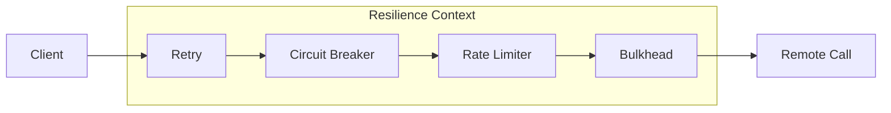

---
tags:
  - architecture/resilience
  - pattern/circuit-breaker
  - pattern/bulkhead
  - pattern/retry
  - level/expert
created: 2026-01-26
status: seed
---

> [!abstract] **TL;DR**
> Надежность (Resilience) в распределенных системах — это не "как избежать сбоев", а "как изящно деградировать".
> * **Retry (Нападение):** Попытка скрыть *Transient Failure* (временный сбой). Опасен, так как умножает нагрузку. Требует **Jitter** и **Budget**.
> * **Circuit Breaker (Защита):** Предохранитель. Предотвращает каскадные сбои и дает бэкенду время на восстановление ("Fail Fast").
> * **Bulkhead (Изоляция):** Отсеки корабля. Гарантирует, что сбой в одной подсистеме (Payment) не потопит весь процесс (Checkout).
>
> **Главное правило:** Эти паттерны нельзя использовать изолированно. Их порядок выполнения (Order of Operations) критичен для выживания.

---
## 1. Анатомия Отказа: Почему системы падают каскадно?

> [!danger] Metastable Failure (Метастабильный отказ)
> Это состояние системы, в котором **наличие нагрузки** поддерживает состояние сбоя.
>
> * **Стабильное состояние:** Система работает, ресурсы свободны.
> * **Триггер:** Кратковременный сбой (GC Pause на 500мс, сетевой лаг).
> * **Метастабильное состояние (Смерть):** Триггер исчез, но система не восстанавливается. Почему? Потому что накопившаяся очередь и ретраи создают нагрузку, превышающую Capacity, не давая системе "встать с колен".
>
> **Инсайт Архитектора:** Система не может выйти из метастабильного отказа сама по себе. Требуется вмешательство (рестарт, сброс трафика). Паттерны Circuit Breaker и Bulkhead нужны именно для того, чтобы предотвратить переход в это состояние.

### 1.1. The Death Spiral (Спираль Смерти)

Разберем физику процесса пошагово. Представьте микросервис `OrderService`, который имеет пул из 100 потоков и таймаут 5 секунд.

**Phase 1: Latency Spike (Триггер)**
Бэкенд (БД) замедляется на 10%. Запросы, которые выполнялись за 50мс, теперь занимают 500мс.
* *Физика:* Согласно Закону Литтла ($L = \lambda W$), если Latency выросло в 10 раз, количество занятых потоков ($L$) тоже вырастает в 10 раз.
* *Результат:* Пул потоков (Thread Pool) внезапно заполняется.

**Phase 2: Saturation (Насыщение)**
Новые запросы приходят, но свободных потоков нет. Они попадают в **Очередь (Backlog)** операционной системы или фреймворка.
* *Результат:* Время ожидания в очереди добавляется к Latency. Теперь пользователь ждет не 500мс, а 2 секунды.

**Phase 3: Timeout & Retries (Амплификация)**
Клиент (Gateway или Mobile App) имеет таймаут 2 секунды.
* Клиент отваливается по таймауту (`Client Timeout`).
* Сервис **продолжает** обрабатывать запрос (он не знает, что клиент ушел). Это **Wasted Work** (Мусорная работа).
* Клиент делает **Retry**.

**Phase 4: The Cliff (Обрыв)**
На систему обрушивается двойная нагрузка:
1.  Старые (мертвые) запросы, которые все еще занимают потоки.
2.  Новые запросы (Ретраи), которые встают в очередь.
* *Физика:* Нагрузка превышает пропускную способность. Throughput падает, Latency стремится к бесконечности.

### 1.2. Throughput vs. Goodput (Иллюзия работы)
В состоянии сбоя мониторинг может врать.

* **Throughput (Пропускная способность):** Общее количество обработанных запросов. В момент "смерти" оно может быть *максимальным* (CPU 100%). Сервер молотит ретраи и выдает ошибки.
* **Goodput (Полезная работа):** Количество запросов, завершившихся успешно и *вовремя* (до таймаута клиента).

> [!failure] Парадокс отказа
> В точке метастабильного отказа:
> $$Throughput \to Max, \quad Goodput \to 0$$
> Сервер работает на износ, нагревая атмосферу, но не принося бизнес-ценности.

### 1.3. Примеры "Киллеров" (Resource Exhaustion)

Что именно заканчивается первым?

1.  **Thread Pool / Goroutines:** Классика блокирующих систем. 100 потоков заняты ожиданием I/O.
2.  **DB Connection Pool:** 50 коннектов к Postgres заняты транзакциями, которые ждут лока.
3.  **Ephemeral Ports (TCP):** Если вы делаете много исходящих вызовов с коротким таймаутом, порты зависают в состоянии `TIME_WAIT`. Операционная система перестает открывать новые сокеты.
4.  **Heap Memory:** Очередь запросов — это объекты в памяти. Если очередь растет бесконечно $\to$ `OutOfMemoryError` $\to$ CrashLoopBackOff.

---
## 2. Retry with Jitter: The Dangerous Weapon

> [!danger] Архитектурное самоубийство
> **Retry** — это единственный паттерн надежности, который **увеличивает** нагрузку на систему во время сбоя.
>
> Если ваш сервис упал из-за перегрузки (CPU 100%), и вы включаете Retry (3 попытки) — вы мгновенно превращаете 100% нагрузку в 400%. Вы превращаете локальный сбой в DDoS-атаку на самого себя (**Retry Storm**).
>
> **Правило Эксперта:** Retry — это механизм для скрытия *редких, транзитных* сбоев сети. Он **не должен** использоваться для обработки перегрузок.

### 2.1. Математика Усиления (Work Amplification)

Почему безобидные "3 ретрая" убивают базы данных? Проблема в **вложенности** (Call Graph Depth).

Представьте цепочку вызовов: `Mobile App` $\to$ `API Gateway` $\to$ `Service A` $\to$ `Service B` $\to$ `Database`.
У каждого звена настроен `MaxRetries = 3`.

**Сценарий:** База Данных моргнула (Transient Fail).
1.  `Service B` делает запрос + 3 ретрая = 4 запроса к БД.
2.  `Service A` получает таймаут от B. Он делает запрос + 3 ретрая к B.
    * Каждый запрос от A порождает 4 запроса от B.
    * Итого: $4 \times 4 = 16$ запросов к БД.
3.  `Gateway` делает запрос + 3 ретрая к A.
    * Итого: $4 \times 16 = 64$ запроса к БД.
4.  `Mobile App` делает 3 ретрая.
    * **Итого:** $4 \times 64 = 256$ запросов к БД.

**Результат:** Один неудачный клик пользователя превращается в **256 транзакций** на БД. Это называется **Geometric Explosion**.

> [!tip] Solution: Retry Budget Propagation
> Передавайте заголовок `X-Retry-Count` вниз по цепочке.
> Если `Service B` видит `X-Retry-Count: 2`, он понимает: "Этот запрос уже дважды падал выше по течению. Я **не имею права** делать свои локальные ретраи. Я должен сделать 1 попытку и вернуть ошибку".

### 2.2. The Physics of Jitter (Рассинхронизация)

> [!danger] Физика Резонанса (Coupled Oscillators)
> В распределенных системах независимые клиенты могут внезапно начать вести себя как **связанные осцилляторы**.
>
> **Механизм возникновения:**
> 1.  Общий сигнал: Сбой сервера в момент времени $T_0$.
> 2.  Общая реакция: Все клиенты получают ошибку одновременно.
> 3.  Общий алгоритм: Все клиенты запускают `Backoff(1s)`.
> 4.  **Результат:** В момент $T_0 + 1s$ происходит новый удар, который снова валит сервер.
>
> Этот феномен называется **Thundering Herd** (Эффект стада). Jitter (Джиттер) — это внесение шума (энтропии) для разрушения этой когерентности.

#### A. Почему простой Random() недостаточен?
Многие инженеры делают так:
`wait = backoff + random(-50ms, +50ms)`
Это **Addititve Jitter**. При экспоненциальной задержке в 10 секунд вариация в ±50мс ничтожна. Клиенты все равно придут "пачкой", просто чуть более размытой.
Нам нужен джиттер, который масштабируется вместе с временем ожидания.

#### B. Алгоритмы Джиттера (Taxonomy)
Рассмотрим три стратегии вычисления задержки $T$ на $n$-й попытке.
Пусть $Cap$ — максимальное время ожидания, $Base$ — начальное (например, 100ms).

**1. Full Jitter (Полный Хаос)**
$$T = Random(0, \min(Cap, Base \times 2^n))$$
* *Механика:* Мы берем стандартную экспоненту и выбираем любое число от 0 до неё.
* *Плюсы:* Максимальное "размазывание" нагрузки. Лучше всего спасает сервер.
* *Минусы:* Высокая вероятность выбрать $T \approx 0$. Клиент может ретраить мгновенно, не дав сети передышки, и потратить свой бюджет попыток впустую.

**2. Equal Jitter (Сбалансированный)**
$$Temp = \min(Cap, Base \times 2^n)$$
$$T = \frac{Temp}{2} + Random(0, \frac{Temp}{2})$$
* *Механика:* Мы гарантируем половину паузы, а вторую половину рандомим.
* *Результат:* Клиент всегда ждет хотя бы чуть-чуть. Снижает нагрузку на сервер хуже, чем Full Jitter, но предсказуемее для клиента.

**3. Decorrelated Jitter (Декоррелированный — The Expert Choice)**
Идея из статьи "AWS Architecture Blog": мы разрываем зависимость от номера попытки ($n$). Следующее ожидание зависит только от *предыдущего* значения и рандома.
$$T_{new} = \min(Cap, Random(Base, T_{prev} \times 3))$$
* *Механика:* Это марковский процесс. Мы не просто умножаем на 2. Мы умножаем предыдущее (уже рандомное) значение на 3 и берем рандом.
* *Результат:* "Пляшущая" экспонента. Она растет в среднем, но может иногда уменьшаться.
* *Use Case:* **Client-Side Throttling**. Это лучший алгоритм для случаев, когда сервер не отдает заголовки `Retry-After`. Он генерирует максимальный шум и предотвращает любые паттерны синхронизации.

#### C. Сравнительная таблица (Trade-off Analysis)

| Алгоритм | Нагрузка на Сервер | Client Latency (P99) | Реализация |
| :--- | :--- | :--- | :--- |
| **No Jitter** | ☠️ Extreme (Spikes) | Low (Deterministic) | Trivial |
| **Full Jitter** | ✅ Minimal (Best) | ❌ High (Variability) | Easy |
| **Equal Jitter** | 🔸 Medium | 🔸 Medium | Easy |
| **Decorrelated** | ✅ Low | 🔸 Medium | Advanced |

> [!example] Code Implementation (Go)
> Пример реализации **Decorrelated Jitter**:
> ```go
> type Backoff struct {
>     Base   time.Duration
>     Cap    time.Duration
>     Last   time.Duration
> }
>
> func (b *Backoff) Next() time.Duration {
>     // Formula: min(Cap, random(Base, Last * 3))
>     upper := b.Last * 3
>     if upper < b.Base { 
>         upper = b.Base 
>     }
>     
>     // Random value in range [Base, Upper)
>     diff := int64(upper - b.Base)
>     res := b.Base + time.Duration(rand.Int63n(diff + 1))
>     
>     if res > b.Cap {
>         res = b.Cap
>     }
>     
>     b.Last = res
>     return res
> }
> ```

#### D. The Latency Cost (Плата за надежность)
Внедряя Jitter, вы ухудшаете **Tail Latency (P99)** вашей системы.
Если без джиттера все ждали 1.0с, то с джиттером кто-то ждет 0.1с, а кто-то 1.9с.
Пользователь, попавший в 1.9с, будет недоволен.

**Вывод Архитектора:** Мы жертвуем счастьем единичных пользователей (Latency), чтобы спасти жизнь всей системы (Availability). Это осознанный компромисс.

### 2.3. Retry Budget (Token Bucket for Failures)

> [!abstract] Экономика сбоя
> **Static Retry Limit** (`max_retries=3`) — это локальная оптимизация, которая ведет к глобальной катастрофе.
> * Если у сервиса 0.1% ошибок, 3 ретрая — это ОК.
> * Если у сервиса 100% ошибок (полный отказ), 3 ретрая превращают 10k RPS в 40k RPS.
>
> **Retry Budget** вводит глобальное ограничение: "В данный момент времени система имеет право потратить на ретраи не более 20% от своего общего бюджета запросов".
> Это предотвращает **Retry Storm**, гарантируя, что даже при полном падении бэкенда амплификация нагрузки не превысит 1.2x.

#### A. Механика: Reverse Token Bucket
В отличие от Rate Limiting (где токены дают право на *вход*), здесь токены дают право на *повтор*.

**Переменные:**
* `BudgetBalance`: Текущий счет (изначально полный).
* `DepositRatio`: Сколько токенов кладем за успех.
* `WithdrawCost`: Сколько токенов стоит один ретрай.
* `MinRetriesPerSec`: Минимальный резерв (для систем с низким трафиком).

**Алгоритм (Finagle / Linkerd Style):**
1.  **Request Success:** `Balance += 1` (но не больше Max).
2.  **Request Failure:** Мы *хотим* сделать ретрай.
3.  **Check:** `if Balance >= WithdrawCost`:
    * `Balance -= WithdrawCost`
    * **Action:** DO RETRY.
4.  **Else:**
    * **Action:** FAIL FAST (Возвращаем ошибку без попыток).

#### B. Математика "Withdrawal Ratio"
Как выбрать стоимость ретрая? Это определяет максимально допустимый процент "паразитного" трафика.

Пусть мы хотим, чтобы ретраи составляли не более **20%** от всего трафика (Ratio 0.2).
$$Cost = \frac{1}{Ratio} = \frac{1}{0.2} = 5$$
* За каждый успешный запрос: +1 токен.
* За каждый ретрай: -5 токенов.

**Пример сценария:**
* Идет поток 100 RPS. Все успешно. Бюджет полон.
* Вдруг 100% запросов начинают падать.
* Первые ~20 запросов проходят ретрай (сжигая накопленный бюджет).
* Бюджет падает в 0.
* Оставшиеся 80 запросов в секунду получают отказ **мгновенно** (без ретрая).
* **Итог:** Нагрузка на бэкенд выросла со 100 до 120 RPS, а не до 400 RPS (как было бы при `retries=3`).

#### C. Проблема "Low Traffic" (Min Retries)
Если сервис получает 1 запрос в минуту, и он упал, токенов на ретрай нет (накопить не успели). Бюджет будет вечно пуст.

**Решение:** `MinRetriesPerSecond`.
Мы разрешаем делать (например) 10 ретраев в секунду "бесплатно", игнорируя бюджет. Бюджет включается только при превышении этого порога.
Это защищает HighLoad, не ломая LowLoad.

#### D. Implementation: Where does it live?
Retry Budget — это **Client-Side** паттерн. Он должен жить там, где принимается решение о повторной отправке.

1.  **Service Mesh (Sidecar):**
    * Envoy Proxy / Linkerd автоматически ведут бюджет для каждого апстрима.
    * *Плюс:* Разработчик вообще не пишет код ретраев. Инфраструктура сама решает, когда можно ретраить.
2.  **Rich Client (SDK):**
    * Библиотеки типа `Finagle` (Scala) или `Resilience4j` (Java) реализуют это внутри процесса.

> [!tip] Архитектурный совет
> Если вы используете **Envoy**, настройте `retry_budget`:
> ```yaml
> retry_policy:
>   retry_on: "5xx,connect-failure"
>   num_retries: 3 # Локальный максимум
> retry_budget:
>   budget_percent: 20 # Глобальное ограничение (The Safety Valve)
>   min_retry_concurrency: 10
> ```
> Это **Safety Valve** (Аварийный клапан). `num_retries: 3` работает, пока все хорошо. `retry_budget` перехватывает управление, когда все плохо.

### Comparison: Retry Limit vs Retry Budget

| Feature         | Static Limit (`max=3`) | Retry Budget (`20%`)                 |
| :-------------- | :--------------------- | :----------------------------------- |
| **Scope**       | Per Request (Local)    | Aggregate Traffic (Global)           |
| **Outage Load** | 400% (Death Spiral)    | 120% (Controlled)                    |
| **Fairness**    | Все запросы равны      | Ретраи получают те, кто успел (FIFO) |
| **Complexity**  | Low                    | Medium (Stateful)                    |
| **Use Case**    | Скрипты, Cron-jobs     | **Microservices, HighLoad API**      |

### 2.4. Semantic Retries (Idempotency Contract)

> [!abstract] The Two Generals' Problem (Проблема двух генералов)
> В распределенных системах мы никогда не знаем наверняка, что произошло при **Read Timeout**.
> * **Сценарий:** Вы отправили `POST /payment`. Сервер молчит.
> * **Вариант А:** Запрос не дошел до сервера (сеть упала *по пути туда*). $\to$ Ретраить **безопасно**.
> * **Вариант Б:** Сервер списал деньги, но ответ не дошел до вас (сеть упала *по пути обратно*). $\to$ Ретраить **смертельно опасно** (Double Spending).
>
> **Аксиома:** Вы не имеете права внедрять автоматические ретраи для неидемпотентных методов (`POST`, `PATCH`) без ключей идемпотентности.

#### A. Decision Matrix: To Retry or Not To Retry?

Не все ошибки одинаковы. Клиент (SDK) должен классифицировать ошибку перед тем, как уменьшить счетчик попыток.

| Тип Ошибки | Примеры | Физика процесса | Решение |
| :--- | :--- | :--- | :--- |
| **Connection Errors** | `ConnectTimeout`, `ConnectionRefused`, `UnknownHost` | TCP Handshake не завершен. Байты не покинули клиента. | ✅ **SAFE RETRY** (Immediate or Fast Backoff) |
| **Server Busy** | `503 Service Unavailable`, `429 Too Many Requests` | Сервер отверг запрос *до* обработки. Состояние не изменено. | ✅ **SAFE RETRY** (With Backoff + Jitter) |
| **Data Plane Errors** | `ReadTimeout`, `SocketTimeout`, `500 Internal Error`, `504 Gateway Timeout` | Запрос попал в "черный ящик". Состояние сервера **неизвестно**. | ⚠️ **CONDITIONAL RETRY** (Только с Idempotency Key) |
| **Terminal Errors** | `400 Bad Request`, `401 Unauthorized`, `403 Forbidden`, `422 Unprocessable` | Ошибка в логике или правах. Повтор не поможет. | ⛔ **NO RETRY** (Throw Exception) |
#### B. The Idempotency Key Pattern
Чтобы безопасно ретраить `ReadTimeout`, мы должны гарантировать **Exactly-Once Processing** поверх **At-Least-Once Delivery**.

1.  **Client Responsibility:**
    * Генерирует уникальный UUIDv4 для каждого *бизнес-действия*.
    * Передает его в заголовке `Idempotency-Key` (или `X-Request-ID`).
    * **Важно:** При ретрае (повторной попытке того же действия) ключ **не меняется**. Если пользователь нажал "Купить" еще раз (новое действие) — генерируется новый ключ.

2.  **Server Responsibility (The State Machine):**
    Сервер должен помнить обработанные ключи (обычно 24-48 часов).

#### C. Server-Side Implementation Patterns
Как реализовать проверку на сервере, чтобы избежать Race Conditions?

**Pattern 1: The Atomic Lock (Redis `SETNX`)**
Используем Redis как быстрый слой координации.

```python
def process_payment(request):
    key = request.headers['Idempotency-Key']
    
    # 1. Пытаемся захватить лок "в полете"
    # SET key "PROCESSING" NX EX 60s
    if redis.set(key, "PROCESSING", nx=True, ex=60):
        try:
            # 2. Выполняем тяжелую логику
            result = db.execute_payment()
            # 3. Сохраняем результат
            redis.set(key, json.dumps(result), ex=86400) # 24h TTL
            return result
        except Exception:
            # Откат лока при ошибке, чтобы разрешить ретрай
            redis.delete(key)
            raise
            
    # 4. Если ключ уже есть
    cached_val = redis.get(key)
    if cached_val == "PROCESSING":
        # The Zombie Problem: Первый запрос еще работает!
        return 409 Conflict # "Подожди и попробуй позже"
    else:
        # Вернуть готовый результат (Идемпотентный ответ)
        return json.loads(cached_val)

```

**Pattern 2: Unique Constraint (Database Level)** Если у вас нет Redis или нужна строгая консистенция (ACID).
- Создаем таблицу `idempotency_log (key PRIMARY KEY, response JSON)`.
- Вставляем запись в той же транзакции, что и бизнес-логика.
- _Минус:_ "Раздувание" БД и нагрузка на диск (Write Amplification).

#### D. The Zombie Transaction Problem (In-flight Conflicts)

Что делать, если клиент отвалился по таймауту (2с), а сервер все еще молотит данные (5с)? Клиент делает ретрай через 3с.
- В этот момент в базе данных сервера статус ключа — `PROCESSING`.
- **Стратегия A (Wait):** Второй запрос "висит" на Redis Spinlock, ожидая завершения первого. (Опасно, забивает потоки).
- **Стратегия B (Bounce):** Вернуть `409 Conflict` или `425 Too Early`. Клиент должен понять это как "Подожди чуть дольше перед следующим ретраем".

#### E. Side Effects & External Systems

Идемпотентность внутри вашей БД — это легко. Но что если ваш сервис вызывает чужой API (Stripe, Twilio)?

- Вы не можете откатить отправку Email или SMS.
- **Решение:** Ваш сервис должен требовать идемпотентности от внешних провайдеров.
    - Передавайте _свой_ `Idempotency-Key` во внешний API.
    - Если внешний API не поддерживает идемпотентность — вы в беде. Вы не можете гарантировать надежность своего API выше, чем надежность ваших зависимостей.

> [!check] Архитектурный Чек-лист
> 
> 1. [ ] **Header:** Все `POST/PATCH` методы поддерживают `Idempotency-Key`.
>     
> 2. [ ] **Storage:** Ключи хранятся в Redis/DynamoDB с TTL (минимум время жизни токена клиента + джиттер).
>     
> 3. [ ] **Locking:** Реализована защита от параллельного выполнения (Concurrent Retries) одного и того же ключа.
>     
> 4. [ ] **Payload Check:** (Hardcore) Проверяем, что хэш тела запроса совпадает с сохраненным. (Защита от ситуации, когда ключ тот же, а параметры изменились — это атака или баг).
>

---
> [!check] Checklist для реализации Retry
> 1.  [ ] **Only Transient:** Ретраим только сеть и 503.
> 2.  [ ] **Backoff:** Экспоненциальная задержка + **Jitter**.
> 3.  [ ] **Cap:** Максимальное время ожидания ограничено (не ждем 10 минут).
> 4.  [ ] **Total Timeout:** Есть глобальный таймаут на всю операцию (включая все ретраи).
> 5.  [ ] **Idempotency:** Включена для всех POST/PATCH.
> 6.  [ ] **Circuit Breaker:** Если CB открыт, ретраи отменяются мгновенно.

---
## 3. Circuit Breaker (Предохранитель): Fail Fast

> [!abstract] Философия Fail Fast
> В электрике предохранитель сгорает, чтобы спасти проводку от перегрева и пожара.
> В ПО Circuit Breaker (CB) "размыкает цепь", чтобы спасти:
> 1.  **Caller (Клиента):** Освободить потоки/сокеты, которые иначе бы висели в ожидании таймаута (Resource Conservation).
> 2.  **Callee (Сервер):** Дать умирающей системе передышку (Breathing Room) от нагрузки, чтобы она могла восстановиться или перезагрузиться.
>
> **Главное отличие от Retry:** Retry — это надежда на успех. Circuit Breaker — это признание поражения ради выживания.

### 3.1. The State Machine (Конечный автомат)

> [!abstract] Формальная логика защиты
> Circuit Breaker — это не просто `if/else`. Это **Finite State Machine (FSM)**, которая управляет потоком трафика на основе эвристик здоровья.
>
> Основная задача автомата — сбалансировать два противоречивых требования:
> 1.  **Safety:** Как можно быстрее изолировать сбойный компонент.
> 2.  **Liveness:** Как можно быстрее восстановить работу при починке компонента.

#### A. Core States (Автоматические состояния)

**1. CLOSED (Замкнут / Нормальный режим)**
В этом состоянии ток идет по цепи. Запросы проходят к бэкенду.
* **Behavior:** Pass-through. Мы прозрачно проксируем вызовы.
* **Side Effect:** Мы записываем результат *каждого* вызова (Success/Failure/Latency) в метрики (Sliding Window).
* **Transition Logic:**
    * Если метрики накоплены (прошел `MinimumNumberOfCalls`).
    * И если $ErrorRate \ge Threshold$ (например, 50%).
    * ИЛИ если $SlowCallRate \ge Threshold$ (например, 50% ответов > 2с).
    * $\to$ Переход в **OPEN**.

**2. OPEN (Разомкнут / Режим защиты)**
Цепь разорвана. Мы защищаем бэкенд от добивания, а себя — от зависания потоков.
* **Behavior:** Fail Fast. Вызов метода немедленно выбрасывает исключение `CallNotPermittedException` (Java) или `ErrCircuitOpen` (Go).
    * **Важно:** Сетевое соединение даже не открывается. Нагрузка на CPU минимальна.
* **Timer:** При входе в состояние запускается таймер "Остывания" (`WaitDurationInOpenState`). Обычно от 10с до 60с.
* **Transition Logic:**
    * Когда таймер истекает $\to$ Автоматический переход в **HALF-OPEN**.

**3. HALF-OPEN (Полуоткрыт / Режим разведки)**
Самое критическое состояние. Система пытается "нащупать" пульс бэкенда.
* **Behavior:** Rate Limiting + Canary.
    * Мы разрешаем пройти строго ограниченному числу запросов $N$ (`PermittedNumberOfCallsInHalfOpen`), например, 10.
    * Все запросы сверх $N$ (11-й, 12-й...) все еще получают Fail Fast (как в OPEN).
    * *Зачем:* Чтобы предотвратить мгновенный шквал нагрузки на только что проснувшуюся базу данных (Cold Start protection).
* **Transition Logic:**
    * Мы ждем завершения этих $N$ пробных запросов.
    * **Сценарий А (Success):** Если *все* (или заданный %) пробных запросов успешны $\to$ Переход в **CLOSED** (Reset metrics). Кризис миновал.
    * **Сценарий Б (Failure):** Если *хотя бы один* пробный запрос упал $\to$ Переход назад в **OPEN**.
    * *Penalty:* Часто время ожидания в OPEN увеличивается экспоненциально при повторном падении (Exponential Backoff for CB).

#### B. Administrative States (Ручное управление)
Во время крупных инцидентов (SEV-1) SRE-инженерам нужно перехватывать управление у автоматики.

**4. DISABLED (Принудительно Закрыт / Always Allow)**
* **Логика:** "Игнорировать ошибки, пускать всё".
* **Use Case:**
    * Мы знаем, что ошибки вызваны неработающим health-check'ом или багом в метриках CB.
    * Миграция БД, когда ошибки ожидаемы, но мы хотим продавить трафик любой ценой (Fail-Open strategy).
    * Метрики продолжают собираться, но переходов состояний не происходит.

**5. FORCED_OPEN (Принудительно Открыт / Always Deny)**
* **Логика:** "Заблокировать трафик, даже если сервис жив".
* **Use Case:**
    * Мы знаем, что бэкенд скоро упадет (плановые работы), и хотим заранее переключить пользователей на Fallback.
    * Экстренная остановка записи в БД при обнаружении коррупции данных.
    * Блокировка фичи, которая вызывает уязвимость безопасности.

#### C. Матрица Переходов (Summary Table)

| Текущее состояние | Событие / Условие | Новое состояние | Действие |
| :--- | :--- | :--- | :--- |
| **CLOSED** | Failure Rate > Threshold | **OPEN** | Stop Traffic, Start Timer |
| **OPEN** | Timer Expired | **HALF-OPEN** | Allow $N$ probes |
| **OPEN** | Request Arrives | **OPEN** | Throw Exception (Fast) |
| **HALF-OPEN** | Probes Successful | **CLOSED** | Resume Traffic, Reset Metrics |
| **HALF-OPEN** | Probe Failed | **OPEN** | Stop Traffic, Restart Timer |
| *Any* | Admin Command: Disable | **DISABLED** | Allow All |
| *Any* | Admin Command: Force Open | **FORCED_OPEN** | Block All |

> [!danger] Нюанс многопоточности (Concurrency)
> В состоянии **HALF-OPEN** крайне важно обеспечить атомарность счетчика пробных запросов.
> Если вы разрешили 10 проб, а из-за Race Condition проскочило 1000 — вы можете снова уронить базу, которая только что поднялась.
> Качественные реализации (Resilience4j) используют `AtomicInteger` или семафоры для строгого контроля $N$.
### 3.2. Storage Implementation: Sliding Windows

> [!abstract] Проблема Памяти vs Проблема Точности
> Хранить историю всех запросов (`List<Result> history`) невозможно — это вызовет `OutOfMemory` за минуты.
> Хранить простой счетчик (`int errors`) нельзя — ошибка недельной давности будет влиять на решение сегодня.
>
> Решение — **Sliding Window (Скользящее окно)**. Это структура данных фиксированного размера, которая автоматически "забывает" старые данные.
> Выбор типа окна (Count-based vs Time-based) — это выбор между **статистической значимостью** и **актуальностью во времени**.

#### A. Count-based Sliding Window (Окно по количеству) — The High-Load Standard
Мы принимаем решение на основе последних $N$ запросов.

* **Реализация (Circular Array / Ring Buffer):**
    Представьте массив размера $N$ (например, 10).
    Мы пишем результаты в ячейки по кругу. Когда доходим до конца, начинаем перезаписывать начало.
    * Index 0: Success
    * Index 1: Failure
    * ...
    * Index 9: Success
    * *Next Request (Index 0):* Перезаписывает старый результат.

* **Оптимизация (BitSet):**
    В библиотеках типа **Resilience4j**, для экономии памяти используется не массив объектов, а битовая маска.
    * `0` = Success, `1` = Failure.
    * Окно в 100 запросов занимает всего **100 бит** (12.5 байт) памяти. Это невероятно эффективно для CPU кэша (L1/L2).

* **Проблема (The Low Traffic Trap):**
    Если $N=100$, а трафик — 1 запрос в час.
    * Чтобы заполнить окно и вытеснить старую ошибку, потребуется 100 часов.
    * **Риск:** Сервис починили вчера, но Circuit Breaker все еще думает, что Error Rate = 50%, потому что старые ошибки не ушли из буфера.
    * **Решение:** Count-based подходит *только* для систем с постоянным потоком (RPS > 1).

#### B. Time-based Sliding Window (Окно по времени) — The Temporal Approach
Мы принимаем решение на основе запросов за последние $T$ секунд.

* **Реализация (Partial Aggregation / Buckets):**
    Мы не храним timestamp каждого запроса (это дорого). Мы разбиваем окно на **Бакетов (Buckets)**.
    * Window: 10 секунд.
    * Buckets: 10 штук (по 1 секунде каждый).
    * Текущий бакет аккумулирует счетчики (`success++`, `failure++`).
    * Каждую секунду мы "сдвигаем" массив: выбрасываем самый старый бакет и создаем новый пустой.

* **Суммарная статистика:**
    `TotalFailures = Sum(Bucket[0]...Bucket[9])`.

* **Плюсы:** Данные гарантированно протухают. Ошибка 11-секундной давности исчезает, даже если новых запросов не было.
* **Минусы:**
    1.  **CPU Overhead:** Требуется фоновый процесс или ленивая калькуляция для ротации бакетов.
    2.  **Jitter:** Данные исчезают "скачками" (по бакетам), а не плавно.
    3.  **Memory:** Требует больше памяти (храним объекты-счетчики, а не биты).

#### C. Decision Matrix: Какой тип выбрать?

| Критерий | Count-based (Last 100 calls) | Time-based (Last 60 sec) |
| :--- | :--- | :--- |
| **High Load (>100 RPS)** | 🏆 **Ideal.** Очень быстрый, Thread-safe через атомики/BitSet. | ⚠️ Тяжелее для CPU (агрегация бакетов). |
| **Low Load (<1 RPS)** | ❌ **Dangerous.** Данные застревают (Stale Data). | 🏆 **Ideal.** Гарантирует сброс ошибок. |
| **Burst Traffic** | ✅ Сглаживает пики (берет N последних). | ❌ Может открыть CB из-за короткого спайка в 1 сек. |
| **Memory Usage** | Minimal (Bits). | Medium (Objects). |

> [!example] Реальный пример конфигурации (Resilience4j)
> **Сценарий:** Платежный шлюз.
> * Мы не хотим, чтобы CB открывался от одного случайного сбоя.
> * Мы хотим, чтобы он реагировал быстро (за секунды).
>
> **Config:**
> * `slidingWindowType`: **COUNT_BASED**
> * `slidingWindowSize`: **100**
> * `minimumNumberOfCalls`: **50** (Не принимать решений, пока не наберем статистику).
> * Почему не Time-based? При 1000 RPS Time-based окно в 10 секунд будет содержать 10,000 запросов. Агрегировать такую статистику сложнее, а 100 последних запросов (Count-based) достаточно репрезентативны.

### 3.3. Failure Criteria: Error Rate vs. Slow Call Rate

> [!danger] The "Slow Death" Paradox
> Интуитивно кажется, что ошибка `500 Internal Server Error` — это плохо.
> На самом деле, быстрый ответ `500` (за 5ms) — это **благо** для высоконагруженной системы. Он мгновенно освобождает поток, сокет и память.
>
> Настоящий убийца — это **успешный** ответ `200 OK`, который занял 29 секунд (при таймауте 30с).
> Такие "зомби-запросы" вызывают **Thread Starvation** (Голодание потоков), исчерпывают пул коннектов к БД и каскадно обрушивают все вызывающие сервисы.
>
> **Circuit Breaker обязан реагировать на тормоза агрессивнее, чем на ошибки.**

#### A. The Math of Starvation (Little's Law)
Почему Latency убивает пропускную способность?
Вспомним Закон Литтла: $L = \lambda \times W$
* $L$ — количество одновременных запросов (Load/Concurrency).
* $\lambda$ — входящий трафик (RPS).
* $W$ — время обработки (Latency).

**Сценарий:** У вас есть Thread Pool на 100 потоков. Трафик 50 RPS.
1.  **Normal Mode:** Latency = 0.1s.
    $$L = 50 \times 0.1 = 5 \text{ threads used.}$$
    *System Health:* ✅ (5% утилизации).
2.  **Slow Mode:** Бэкенд тормозит. Latency = 5.0s.
    $$L = 50 \times 5.0 = 250 \text{ threads needed.}$$
    *System Health:* 💀 (Потребность 250 > Емкость 100).
    *Result:* Пул исчерпан за 2 секунды. Сервис перестает отвечать вообще всем, даже на `health_check`.

#### B. Dual Threshold Strategy (Стратегия Двойного Порога)
Современный Circuit Breaker (например, Resilience4j) имеет два независимых триггера для перехода в состояние OPEN.

1.  **Failure Rate Threshold (Порог Ошибок):**
    * *Метрика:* Процент запросов, завершившихся с `Exception` или `5xx`.
    * *Цель:* Защита от багов и явных падений.
    * *Стандарт:* 50%.

2.  **Slow Call Rate Threshold (Порог Медленных Запросов):**
    * *Метрика:* Процент запросов, которые длились дольше `SlowCallDurationThreshold` (даже если они успешны!).
    * *Цель:* Защита от **Thread Starvation**.
    * *Стандарт:* 50% запросов медленнее 2 секунд.
    * **Важно:** `SlowCallDuration` должно быть значительно *меньше* сетевого таймаута.
        * Timeout: 30s (Hard limit).
        * Slow Threshold: 2s (Quality of Service limit).

#### C. What is a "Failure"? (Semantic Filtering)
Не любая ошибка должна открывать Circuit Breaker.

**1. Infrastructure Errors (COUNT):**
CB должен реагировать только на то, что говорит о проблемах *на той стороне*.
* `java.net.ConnectException` (Сервер лежит).
* `java.net.SocketTimeoutException` (Сервер тормозит).
* `HTTP 503 / 504` (Сервер перегружен).

**2. Business Errors (IGNORE):**
CB **не должен** открываться, если клиент шлет мусор.
* `HTTP 400 Bad Request` (Кривой JSON).
* `HTTP 401/403` (Нет прав).
* `HTTP 404 Not Found` (Запрошен несуществующий ресурс).
* *Почему:* Если злоумышленник начнет сканить 404-е урлы, он не должен "выбить пробки" и положить сервис для легитимных пользователей.

#### D. Пример Конфигурации (Resilience4j / YAML)

Это эталонная конфигурация для микросервиса `Payment`.

```yaml
resilience4j.circuitbreaker:
  instances:
    paymentService:
      # 1. Размер окна (Count-based)
      slidingWindowSize: 100
      minimumNumberOfCalls: 20
      
      # 2. Триггер ошибок (явные сбои)
      failureRateThreshold: 50       # Если >50% ошибок -> OPEN
      
      # 3. Триггер тормозов (скрытые сбои)
      slowCallRateThreshold: 40      # Если >40% запросов медленные -> OPEN
      slowCallDurationThreshold: 2s  # "Медленно" — это дольше 2с
      
      # 4. Фильтр исключений
      recordExceptions:
        - java.net.TimeoutException
        - org.springframework.web.client.HttpServerErrorException
      ignoreExceptions:
        - com.example.BusinessException # "Недостаточно средств" — это не сбой системы
```         
> **Архитектурный вывод:** Если ваш Circuit Breaker настроен только на `Error Rate`, вы **не защищены** от самого частого типа сбоев в Cloud Native среде — деградации производительности (Performance Degradation). Включайте `SlowCallRateThreshold` всегда.

### 3.4. The "Flapping" Problem (Дребезг контактов)

> [!danger] Эффект "Пилы" (Sawtooth Pattern)
> Самая частая болезнь наивных Circuit Breaker'ов — это **Flapping** (Дребезг/Хлопанье).
>
> **Сценарий:**
> 1.  БД перегружена (100% CPU). CB открывается.
> 2.  Нагрузка падает в 0. БД "остывает" (CPU падает до 5%).
> 3.  Таймер CB истекает. Мы пропускаем 1 пробный запрос. Он успешен (ведь БД пустая!).
> 4.  CB закрывается.
> 5.  В ту же миллисекунду на БД обрушивается 10,000 отложенных запросов.
> 6.  БД умирает мгновенно. CB снова открывается.
>
> Система входит в бесконечный цикл: `Dead -> Recover -> Instant Death -> Dead`.
> Вы не чините систему, вы мучаете её электрошоком.

#### A. Проблема "Lucky Packet" (Ошибка репрезентативности)
В состоянии **HALF-OPEN** мы принимаем решение о здоровье всей системы на основе малой выборки.

Если вы разрешаете всего **1 пробный запрос** (`PermittedNumberOfCallsInHalfOpen = 1`), это русская рулетка.
* Запрос может пройти успешно случайно (попал в момент GC паузы на бэкенде).
* Запрос может пройти успешно, потому что кэш еще теплый.

**Решение: The Probing Wave (Волна зондирования)**
Мы должны пропускать микро-батч трафика, чтобы получить статистически значимый результат.
* *Config:* `PermittedNumberOfCallsInHalfOpen: 10` (или 20).
* *Logic:* CB закроется только если, скажем, 80% из этих 10 запросов будут успешны.
* Это гарантирует, что бэкенд способен выдержать хотя бы минимальную конкуренцию (Concurrency).

#### B. Exponential Backoff (Наказание за рецидив)
Если CB открывается, потом закрывается, и сразу снова открывается — значит, проблема не решена. "Остывания" на 10 секунд не хватило.

Мы должны внедрить **Гистерезис** — свойство системы сопротивляться изменению состояния.
Чем чаще система падает, тем дольше она должна лежать.

**Алгоритм:**
1.  First Open: wait 10s.
2.  Retry $\to$ Fail.
3.  Second Open: wait 20s.
4.  Retry $\to$ Fail.
5.  Third Open: wait 40s.

Это дает инженерам время (и ресурсы бэкенда) на восстановление, предотвращая бесконечный цикл рестартов в секунду.

#### C. The Ultimate Fix: Smooth Ramp-Up (Плавный разгон)
Даже если мы починили Half-Open, момент перехода в **CLOSED** остается опасным. В этот момент мы открываем шлюзы на 100%.

**Pattern: Warm-Up Rate Limiter**
При переходе `HALF-OPEN` $\to$ `CLOSED`, мы не включаем полный поток. Мы временно активируем локальный Rate Limiter, который плавно поднимает лимит.

* **T=0s (Transition):** Limit 10 RPS.
* **T=1s:** Limit 50 RPS.
* **T=5s:** Limit 100% (Unlimited).

В библиотеке **Resilience4j** это не встроено напрямую в CB, но достигается комбинацией `CircuitBreaker` + `RateLimiter` или использованием специфичных настроек тайм-аутов.

#### D. Пример конфигурации (Resilience4j Anti-Flapping)

```yaml
resilience4j.circuitbreaker:
  instances:
    backendA:
      # 1. Защита от Lucky Packet
      permittedNumberOfCallsInHalfOpen: 10  # Нужно 10 успешных проб, а не 1
      
      # 2. Ожидание в OPEN (Static)
      waitDurationInOpenState: 30s
      
      # 3. Гистерезис (Exponential Backoff)
      # В R4j это делается через 'maxWaitDurationInOpenState'
      enableAutomaticTransitionFromOpenToHalfOpen: true
      automaticTransitionFromOpenToHalfOpenEnabled: true
      
      # Экспертная настройка:
      # Если Half-Open провалился, следующее ожидание будет больше.
      # (Требует кастомной реализации IntervalFunction в Java коде)
```
> **Вердикт Эксперта:** **Flapping** хуже, чем просто **Downtime**. Во время Flapping пользователи видят то ошибки, то успех. Это вызывает хаос в данных (частично прошедшие транзакции) и сводит с ума мониторинг. Лучше лежать "мертво" 5 минут и подняться гарантированно, чем 5 минут биться в конвульсиях. Настраивайте `PermittedNumberOfCalls` агрессивно (минимум 10-20).
### 3.5. Ignored Exceptions (Whitelist)

> [!abstract] Философия Вины (The Blame Game)
> Circuit Breaker должен защищать бэкенд, когда тот **неспособен** обрабатывать запросы.
>
> * **Сценарий А:** Бэкенд возвращает `500 OutOfMemory` или `ConnectionRefused`.
>     * *Вина:* Бэкенд.
>     * *Реакция:* **RECORD FAILURE**. (Увеличиваем счетчик ошибок).
> * **Сценарий Б:** Клиент присылает кривой JSON (`400 Bad Request`) или запрашивает несуществующий ID (`404 Not Found`).
>     * *Вина:* Клиент. Бэкенд жив, здоров и корректно обработал запрос, сказав "ты не прав".
>     * *Реакция:* **IGNORE**. (Считаем это успешным вызовом или игнорируем вовсе).
>
> **Правило:** Если вы считаете 4xx ошибки за сбой, вы даете злоумышленникам пульт управления вашим рубильником.

#### A. Вектор Атаки: DoS через 404
Почему нельзя ставить дефолтную настройку "Считать все Exceptions"?

Представьте API: `GET /users/{id}`.
Circuit Breaker настроен открываться при 50% ошибок.

1.  **Атака:** Хакер запускает скрипт, запрашивающий случайные GUID: `/users/random-guid-1`, `/users/random-guid-2`.
2.  **Ответ:** Бэкенд честно отвечает `404 Not Found` (очень быстро).
3.  **Circuit Breaker:** Видит, что 100% запросов завершаются с ошибкой `Http404Exception`.
4.  **Результат:** Цепь размыкается (OPEN).
5.  **Impact:** Легитимные пользователи, запрашивающие существующие ID, получают отказ в обслуживании.
    * Хакер положил ваш сервис, не создавая высокой нагрузки, просто испортив статистику ошибок.

#### B. Taxonomy of Errors (Классификация)

При настройке CB вы должны четко разделить исключения на две корзины.

| Тип Ошибки | Примеры | Семантика | Действие CB |
| :--- | :--- | :--- | :--- |
| **Infrastructure** | `ConnectTimeout`, `SocketTimeout`, `UnknownHost`, `503 Service Unavailable`, `502 Bad Gateway` | "Я не смог даже поговорить с сервером" или "Сервер признался, что болен". | 🔴 **RECORD** (Считаем как сбой) |
| **Business Logic** | `400 Bad Request`, `401 Unauthorized`, `403 Forbidden`, `404 Not Found`, `422 Unprocessable Entity` | "Сервер отработал штатно и отверг запрос по правилам". | 🟢 **IGNORE** (Считаем как успех) |
| **The Gray Area** | `429 Too Many Requests` | Сервер говорит "Притормози". | 🟡 **Expert Decision:** Обычно **RECORD**, так как это признак перегрузки бэкенда. CB поможет снизить давление. |
| **Unexpected** | `500 Internal Server Error`, `NullPointerException` | Баг в коде сервера. | 🔴 **RECORD** (Обычно). Если сервер кидает NPE, он нестабилен. |

#### C. Стратегии Конфигурации: Whitelist vs Blacklist

Большинство библиотек (Resilience4j, Sentinel) поддерживают оба подхода.

**1. Blacklist Strategy (Ignore List) — Рекомендуется**
Мы считаем всё ошибкой, *кроме* явного списка исключений.
* *Логика:* "Все, что я не знаю — опасно".
* *Плюс:* Если появится новый вид сетевой ошибки, CB сработает.
* *Минус:* Нужно тщательно перечислить все бизнес-исключения.

```yaml
# Resilience4j Config Example
recordExceptions:
  - java.lang.Throwable # По умолчанию считаем всё ошибкой
ignoreExceptions:
  - com.example.exceptions.UserNotFoundException
  - com.example.exceptions.ValidationException
  - org.springframework.web.client.HttpClientErrorException # 4xx
```    
**2. Whitelist Strategy (Record List)** Мы считаем ошибкой _только_ указанный список.
- _Логика:_ "Я реагирую только на потерю связи".
- _Риск:_ Если база начнет кидать `SqlException` (которого нет в списке), CB будет думать, что всё хорошо, пока база умирает.
#### D. The Predicate Pattern (Продвинутая фильтрация)
Иногда класс исключения один (`HttpServerErrorException`), а суть разная (код 500 или 503). Простого списка классов недостаточно. Используйте **Предикаты** (Lambda-функции).

```Java
// Java / Resilience4j Example
Predicate<Throwable> recordFailurePredicate = (throwable) -> {
    if (throwable instanceof HttpServerErrorException) {
        int status = ((HttpServerErrorException) throwable).getStatusCode().value();
        // Считаем ошибкой только 500 и 503.
        // Игнорируем экзотику типа 501 Not Implemented.
        return status == 500 || status == 503; 
    }
    // Сетевые ошибки всегда фатальны
    if (throwable instanceof IOException) return true;
    
    return false; // Всё остальное - не повод рвать цепь
};
```
---
## 4. Bulkhead (Переборки): Containment Strategy

> [!abstract] Метафора Титаника
> Термин пришел из судостроения. Корабль разделен на герметичные отсеки (Bulkheads).
> Если торпеда пробивает носовой отсек, вода заполняет только его. Корабль теряет дифферент, но остается на плаву.
>
> **В IT:** Если сервис "Рекомендаций" начал тормозить, он не должен утянуть за собой сервис "Оплаты".
> **Цель:** Превратить тотальный отказ (Total Blackout) в частичную деградацию (Partial Availability).

### 4.1. Физика заражения (Thread Starvation)

> [!danger] Эффект "Грязной Раковины"
> Представьте кухню в ресторане. У вас есть 200 чистых тарелок (Потоки).
> * Если посудомойка работает быстро, тарелки возвращаются в оборот немедленно.
> * Если посудомойка замедлилась (Latency выросло), грязные тарелки накапливаются.
> * **Итог:** Повар (CPU) готов готовить, официанты (Network) готовы нести, но **класть еду некуда**. Ресторан встает, даже если продуктов полно.
>
> В сервере приложений это называется **Resource Starvation** (Голодание ресурсов).

#### A. Модель "Global Thread Pool" (Единая точка отказа)
Большинство Enterprise-серверов (Tomcat, Jetty, Undertow, gRPC Server) по умолчанию используют **Shared Worker Pool**.

* **Конфигурация:** `max_threads = 200`.
* **Назначение:** Этот пул обслуживает **все** входящие HTTP-запросы: и критический `POST /checkout`, и второстепенный `GET /avatars`.
* **Механика (Synchronous Blocking):**
    1.  Запрос приходит.
    2.  Поток (`Thread-1`) берется из пула.
    3.  Поток делает вызов к БД или внешнему API.
    4.  **Поток блокируется** (WAIT state), ожидая ответа. Он не потребляет CPU, но он *занимает слот* в пуле и удерживает стек памяти (Stack Memory).

#### B. Анатомия Каскадного Сбоя (Timeline of Death)
Рассмотрим, как медленный сервис "Рекомендаций" убивает быстрый сервис "Платежей".

**Дано:**
* Пул: 200 потоков.
* Трафик: 100 RPS всего (50 RPS на Оплату, 50 RPS на Рекомендации).
* SLA: Оба сервиса отвечают за 50ms.

**Хронология катастрофы:**
1.  **T=0s (Здоровье):**
    * Нагрузка (Concurrency) по Закону Литтла: $L = 100 \times 0.05 = 5$ потоков.
    * Пул занят на 2.5% (5/200). Все летает.

2.  **T=1s (Триггер - Latency Spike):**
    * Сервис Рекомендаций (внешний API) начинает тормозить. Время ответа вырастает с 50ms до **10 секунд**. (Важно: он не падает с ошибкой, он просто "тупит").

3.  **T=2s (Заражение / Saturation):**
    * Новые запросы на Рекомендации продолжают поступать (50 в секунду).
    * Каждый запрос захватывает поток и "паркуется" на 10 секунд.
    * Скорость заполнения пула: 50 потоков в секунду.
    * **Результат:** Через 4 секунды ($50 \times 4 = 200$) **весь пул исчерпан**.

4.  **T=5s (Total Blackout):**
    * Приходит VIP-клиент с запросом `POST /checkout` (Оплата).
    * Сервер пытается выделить поток. Потоков нет (`ThreadPoolExhaustedException` или просто зависание в очереди сокета).
    * **Отказ:** Платеж не проходит.
    * **Health Check Failure:** Кубернетес (K8s) посылает `GET /health`. Для обработки этого запроса тоже нужен поток! Потока нет. K8s считает под мертвым и перезагружает его.

**Вывод:** Один второстепенный метод API, который даже не вернул ошибку, уничтожил весь бизнес-процесс. Это и есть **отсутствие Bulkhead-изоляции**.

#### C. Нюанс Асинхронности (Async / Non-blocking)
Частое заблуждение: *"Я пишу на Node.js / Go / WebFlux, у меня нет блокирующих потоков, мне не нужен Bulkhead"*.

**Это ошибка.** В асинхронных системах меняется *тип* ресурса, который заканчивается, но физика заражения остается.

1.  **Go (Goroutines):**
    * Горутины дешевые, их можно создать миллионы. Thread Starvation маловероятен.
    * **Узкое место:** DB Connection Pool, File Descriptors, или **Memory**.
    * Если 100k горутин висят и ждут ответа 30 секунд, каждая удерживает контекст запроса. Вы получите OOM (Out Of Memory).

2.  **Node.js (Event Loop):**
    * Потоков нет (он один).
    * Если вы не используете Semaphore/Bulkhead для исходящих вызовов, вы можете забить очередь задач (Microtask Queue) тысячами висящих промисов (Pending Promises), что приведет к росту Latency и потреблению RAM.

> [!summary] Определение для Архитектора
> **Bulkhead** — это паттерн ограничения **Concurrency** (параллелизма) для конкретной зависимости.
> Мы переходим от парадигмы "Один общий пул на всех" к парадигме "Квоты ресурсов на каждую функцию".
### 4.2. Strategy A: Thread Pool Bulkhead (Heavyweight)

> [!abstract] Модель Hystrix (Legacy, но актуально)
> Этот подход был популяризирован библиотекой **Netflix Hystrix**.
> Идея радикальна: мы не доверяем чужому коду выполняться в наших потоках.
>
> Вместо того чтобы вызывать `RecommendationService` в потоке обработки HTTP-запроса (Tomcat Thread), мы упаковываем задачу в объект `Command` и передаем её в **отдельный, изолированный Thread Pool**.
>
> * **Девиз:** "Если ты умрешь (зависнешь), ты умрешь в своей песочнице, не трогая мои ресурсы".
#### A. Механика: Handover & Queuing
Изоляция через пулы потоков работает сложнее, чем просто счетчик. Это асинхронная передача работы.

1.  **Submission:** Главный поток (Tomcat-1) получает запрос и создает задачу (`Runnable/Callable`).
2.  **Queueing:** Задача кладется в очередь (`BlockingQueue`) конкретного пула (например, `Pool-Payment`).
    * *Check:* Если очередь полна $\to$ **Immediate Reject** (`RejectedExecutionException`).
3.  **Execution:** Свободный поток из `Pool-Payment` (Worker-1) забирает задачу и выполняет её.
4.  **Result:** Worker-1 возвращает результат через `Future`, который ждет Tomcat-1.

**Ключевое отличие от Семафора:**
Код выполняется **не в потоке вызывающего**.
Это дает защиту от **Poison Pill** (Ядовитой таблетки) — кода, который входит в бесконечный цикл `while(true)` или вызывает Deadlock.
* В модели Семафора такой код навсегда заблокировал бы поток Tomcat.
* В модели Thread Pool он заблокирует только Worker-поток. Поток Tomcat отвалится по таймауту `Future.get(1s)` и продолжит жить.

#### B. The Cost of Isolation (Налог на надежность)
За полную изоляцию мы платим высокую цену производительностью.

1.  **Context Switching (Переключение контекста):**
    Чтобы передать задачу из потока A в поток B, процессор должен сохранить регистры, сбросить кэш L1/L2 и загрузить контекст нового потока.
    * *Overhead:* ~5-50 микросекунд на вызов. При нагрузке 10k RPS это сжигает значительную часть CPU.
2.  **Memory Footprint (Память):**
    В Java каждый поток имеет свой стек (Stack). По умолчанию это **1 MB** (можно уменьшить `-Xss`).
    * Если вы создаете 10 пулов по 100 потоков = 1 GB RAM просто на "воздух", даже если они простаивают.
3.  **Queue Latency:**
    Время нахождения в очереди пула добавляется к общему времени ответа.

#### C. Sizing Strategy (Математика настройки)
Как выбрать размер пула и очереди?
Используем формулу Netflix:

$$Threads = PeakRPS \times P99Latency + Buffer$$

**Пример:**
* Сервис `Payment` держит 30 RPS.
* Обычно отвечает за 0.2с (200ms).
* $$Threads = 30 \times 0.2 = 6 \text{ threads.}$$
* Добавляем буфер на случай микро-спайков: ставим **10 потоков**.

**Queue Size (Важно!):**
Многие ставят огромные очереди (`LinkedBlockingQueue` без лимита). Это ошибка.
* Если потоки заняты, задача падает в очередь.
* Если очередь большая (1000), задача пролежит там 5 секунд, прежде чем её возьмет поток.
* К этому времени клиент уже отвалится по таймауту. Мы потратим CPU на обработку мертвого запроса.
* **Правило:** Очередь должна быть **маленькой** (или вообще 0, `SynchronousQueue`). Лучше отказать сразу (Fail Fast), чем заставить ждать в очереди и все равно отказать.

#### D. Decision Matrix: Thread Pool vs Semaphore

Когда использовать этот "тяжелый" метод?

| Критерий | Thread Pool Bulkhead | Semaphore Bulkhead |
| :--- | :--- | :--- |
| **I/O Model** | **Blocking I/O** (JDBC, Old HTTP Clients) | **Non-blocking / Async** (Netty, WebFlux, Go) |
| **Isolation Level** | 🛡️ **Total.** Защищает даже от зависшего CPU. | ⚠️ **Partial.** Защищает только от перегрузки по кол-ву. |
| **Overhead** | 🔴 High (CPU, RAM). | 🟢 Near Zero. |
| **Use Case** | Вызов легаси SOAP-сервиса, тяжелые вычисления (Crypto), работа с диском. | Вызов современных микросервисов по gRPC/HTTP2. |

> [!example] Реализация в Java (Custom Executor)
> ```java
> // Создаем изолированный "отсек" для сервиса аналитики
> ThreadPoolExecutor analyticsPool = new ThreadPoolExecutor(
>     5, 10, // Core / Max threads
>     1, TimeUnit.SECONDS,
>     new ArrayBlockingQueue<>(10), // Жесткий лимит очереди!
>     new ThreadFactoryBuilder().setNameFormat("bulkhead-analytics-%d").build(),
>     new ThreadPoolExecutor.AbortPolicy() // Fail Fast при переполнении
> );
> 
> // Использование
> try {
>     Future<String> result = analyticsPool.submit(() -> callAnalytics());
>     return result.get(1, TimeUnit.SECONDS);
> } catch (RejectedExecutionException e) {
>     // Очередь полна - Bulkhead сработал
>     return "Analytics Unavailable (Fallback)";
> }
> ```

### 4.3. Strategy B: Semaphore Bulkhead (Lightweight) — The Modern Choice

> [!abstract] Философия "Билета на вход"
> В отличие от Thread Pool Bulkhead, мы не выделяем отдельные ресурсы (потоки) для выполнения задачи. Мы выделяем **квоту** на выполнение.
>
> **Метафора:** Ночной клуб.
> * **Thread Pool:** Мы строим отдельную VIP-комнату на 10 человек. Если она полна, вы ждете снаружи. Внутри вас обслуживает отдельный персонал.
> * **Semaphore:** Мы ставим вышибалу (Bouncer) со счетчиком кликов. В клубе может быть не более 10 человек. Вы заходите сами, танцуете сами. Если счетчик показывает 10, вышибала вас не пускает.
>
> Это **Accountancy Pattern** (Паттерн бухгалтерского учета), а не Execution Pattern.

#### A. Механика: Acquire & Release
Семафор — это атомарный счетчик, защищающий критическую секцию.

**Алгоритм:**
1.  **Request:** Приходит запрос.
2.  **Acquire:** Пытаемся уменьшить счетчик разрешений (`permits--`).
    * Если `permits > 0` $\to$ Успех, входим.
    * Если `permits == 0` $\to$ **MaxWaitDuration**. Мы можем подождать (например, 10мс) освобождения слота. Если не дождались $\to$ `BulkheadFullException`.
3.  **Execution:** Выполняем бизнес-логику **в потоке вызывающего** (Caller Thread). Никакого переключения контекста.
4.  **Release:** В блоке `finally` возвращаем разрешение (`permits++`).

#### B. The Async Revolution (Почему это Modern Choice?)
В эпоху микросервисов мы переходим на **Non-blocking I/O** (Netty, NodeJS, Go). Потоков мало (обычно равно числу CPU ядер), и они на вес золота. Создавать Thread Pool на каждый чих — слишком дорого.

Семафор идеально ложится на реактивную модель:
* **Разрешение (Permit)** удерживается на время *логической* операции.
* Пока идет I/O (запрос в базу), поток освобождается (возвращается в Event Loop), но **разрешение Семафора остается занятым**.
* Когда база отвечает, мы возвращаем разрешение.

Это позволяет ограничивать нагрузку на бэкенд (Concurrency), не расходуя память на стеки потоков.

#### C. The Blocking Trap (Смертельная ловушка)
Самая частая ошибка Junior-разработчиков при переходе на Semaphore Bulkhead.

> [!danger] Внимание: Выполнение в потоке родителя!
> Так как Семафор не переключает поток, если вы внутри него вызовете **Блокирующую операцию** (JDBC, `Thread.sleep`, синхронный HTTP call), вы заблокируете **родительский поток**.
>
> *Сценарий:*
> 1. У вас сервер на Tomcat (200 потоков).
> 2. Вы поставили Semaphore Bulkhead (limit=50) на сервис Рекомендаций.
> 3. Внутри семафора вы делаете синхронный вызов, который висит 30 секунд.
> 4. **Итог:** Вы спасли сервис Рекомендаций (на него ушло только 50 запросов), но вы **убили 50 потоков Tomcat**. Они стоят и ждут.
>
> **Вывод:** Semaphore Bulkhead безопасен *только* если код внутри него либо супер-быстрый (in-memory), либо полностью неблокирующий (Async).

#### D. Implementation Examples

**1. Java (Resilience4j) — Functional Style**
```java
// Создаем Bulkhead с лимитом 10 одновременных вызовов
BulkheadConfig config = BulkheadConfig.custom()
    .maxConcurrentCalls(10)
    .maxWaitDuration(Duration.ofMillis(0)) // Fail Fast (не ждать в очереди)
    .build();

Bulkhead bulkhead = Bulkhead.of("paymentService", config);

// Оборачиваем вызов (Декоратор)
Supplier<String> decoratedSupplier = Bulkhead
    .decorateSupplier(bulkhead, () -> backendService.doWork());

// Выполняем (в текущем потоке!)
Try.ofSupplier(decoratedSupplier)
   .recover(BulkheadFullException.class, "Fallback Response");
```

**2. Go (Buffered Channels)** В Go нет класса Semaphore, потому что буферизированный канал — это и есть семафор.
``` Go
// Инициализация (Limit = 10)
sem := make(chan struct{}, 10)

func CallService() error {
    // 1. Acquire (Non-blocking check)
    select {
    case sem <- struct{}{}:
        // Успешно заняли слот
        defer func() { <-sem }() // 3. Release
    default:
        // Канал полон
        return errors.New("Bulkhead Full")
    }

    // 2. Execution
    return doNetworkCall()
}
```

#### E. Comparison Summary

|**Характеристика**|**Thread Pool Bulkhead**|**Semaphore Bulkhead**|
|---|---|---|
|**Изоляция сбоев**|**Полная.** Зависший поток не влияет на родителя.|**Частичная.** Зависший блокирующий вызов вешает родителя.|
|**Ресурсы (RAM)**|Высокое потребление (Stacks).|Почти ноль (Atomic Counters).|
|**CPU Overhead**|Context Switching.|Atomic Compare-And-Swap (CAS).|
|**Очередь**|Может иметь свою BlockingQueue.|Обычно нет (или очень короткая `maxWaitDuration`).|
|**Best For**|Legacy Blocking Apps (Spring MVC + JDBC).|Modern Reactive Apps (Spring WebFlux, Vert.x).|

> [!tip] Рекомендация Архитектора
> 
> Если вы пишете **Greenfield** проект на современном стеке (Kotlin Coroutines, Go, Java Virtual Threads) — используйте **только Semaphore Bulkhead**.
> 
> Thread Pool Bulkhead оставьте для изоляции легаси-кода, который вы не можете переписать на async.

### 4.4. Bulkhead vs Rate Limiter: В чем разница?

> [!abstract] Ортогональные измерения защиты
> Эти два паттерна часто путают, потому что оба они говорят "Нет" лишним запросам. Но они защищают от разных врагов.
>
> * **Rate Limiter (RL)** управляет **Скоростью ($\lambda$)**. Он защищает от **Объема** (Volume).
>     * *Враг:* Маркетинговая рассылка, DDoS, скрипт в бесконечном цикле.
> * **Bulkhead (BH)** управляет **Емкостью ($L$)**. Он защищает от **Латентности** (Latency).
>     * *Враг:* Зависшая база данных, медленный диск, Deadlock.
>
> **Аксиома:** Rate Limiter не может спасти вас от исчерпания ресурсов (Thread Exhaustion), если время ответа растет.

#### A. Математическое доказательство (Why RL is not enough?)
Вспомним Закон Литтла: $$L = \lambda \times W$$
* $L$ = Concurrency (Количество занятых потоков/сокетов).
* $\lambda$ = RPS (Rate Limit).
* $W$ = Latency (Время ответа).

**Сценарий "Медленная Смерть":**
У вас стоит Rate Limiter на **100 RPS**. Вы думаете, что вы в безопасности.
1.  **Норма:** Latency = 0.1s.
    $$L = 100 \times 0.1 = 10 \text{ threads.}$$
    Сервер дышит легко.
2.  **Сбой:** Бэкенд начинает тормозить. Latency вырастает до **30s**.
    Rate Limiter продолжает пропускать 100 RPS (ведь лимит не превышен!).
    $$L = 100 \times 30 = 3000 \text{ threads.}$$
3.  **Итог:** Ваше приложение падает с `OutOfMemory` или `ThreadLimitExceeded`, хотя Rate Limiter "честно" выполнял свою работу.

**Вывод:** Rate Limiter контролирует $\lambda$, но он не контролирует $W$. Bulkhead жестко ограничивает $L$, делая систему нечувствительной к росту $W$.

#### B. Сравнительная Таблица (Decision Matrix)

| Характеристика | Rate Limiter | Bulkhead |
| :--- | :--- | :--- |
| **Основная метрика** | **Requests Per Second (RPS)** | **Concurrent Calls (Semaphore count)** |
| **Вопрос** | "Как часто вы приходите?" | "Сколько вас сейчас внутри?" |
| **Аналогия** | **Турникет в метро.** Пропускает 1 человека в секунду, чтобы не было давки на эскалаторе. | **Сидячие места в вагоне.** Не больше 50 человек. Если поезд встал в туннеле, новые люди не зайдут, даже если турникет свободен. |
| **Тип отказа** | `429 Too Many Requests` (Клиент виноват/Слишком быстро). | `503 Service Unavailable` (Сервер занят/Нет ресурсов). |
| **Расположение** | Обычно **Global / Ingress** (защищает API целиком). | Обычно **Local / Client** (защищает конкретный вызов метода). |
| **Защищает от** | Brute-force, DDoS, Heavy Users. | Slow Database, Third-party timeouts. |

#### C. Layered Defense (Эшелонированная защита)
В правильной архитектуре эти паттерны работают в тандеме.

1.  **Layer 1 (Gateway): Rate Limiter.**
    * Отсекает ботов и агрессивных клиентов. Снижает общий шум.
2.  **Layer 2 (Service): Bulkhead.**
    * Оборачивает вызовы к каждой *отдельной* зависимости.
    * `Bulkhead(Payment)`: макс 20 потоков.
    * `Bulkhead(Analytics)`: макс 5 потоков.
    * Если Аналитика зависла, Rate Limiter этого не увидит (RPS тот же), но Bulkhead мгновенно заблокирует новые вызовы к Аналитике, спасая Платежи.

#### D. Пример сценария: Black Friday
* **Ситуация:** Распродажа. 10,000 пользователей.
* **Rate Limiter:** Настроен на 1000 RPS. Он срезает пики, все идет ровно.
* **Проблема:** Из-за нагрузки БД начинает отвечать за 2 секунды вместо 0.2с.
* **Без Bulkhead:** 1000 RPS $\times$ 2s = 2000 потоков. Сервер ложится.
* **С Bulkhead:**
    * На БД стоит лимит `MaxConcurrent = 200`.
    * Как только 200 запросов повисли, 201-й получает мгновенный отказ (Fail Fast).
    * БД обрабатывает свои 200 запросов, освобождается, берет новые.
    * **Результат:** Сервис работает медленно, но он **работает** и не падает.

> [!tip] Правило большого пальца
> * Если вы боитесь **пользователей** (слишком много запросов) $\to$ ставьте **Rate Limiter**.
> * Если вы боитесь **зависимостей** (слишком медленные ответы) $\to$ ставьте **Bulkhead**.
> * В 99% случаев вам нужно и то, и другое.


> [!example] Пример взаимодействия
> 
> - **Rate Limiter:** "Я пропускаю 100 RPS".
>     
> - **Backend:** Внезапно начал отвечать за 10 секунд.
>     
> - **Результат:** 100 RPS $\times$ 10s = 1000 одновременных потоков. Сервер падает по OutOfMemory.
>     
> - **Bulkhead:** "Я держу макс 50 потоков". Как только 50 потоков заняты (за 0.5 сек), Bulkhead начинает отбрасывать запросы, спасая память сервера, даже если RPS ниже лимита.
>     

### 4.5. Sizing: Как выбрать размер пула?

Не гадайте. Используйте **Закон Литтла**.

$$Capacity = TargetRPS \times P99Latency \times Buffer$$

**Пример:**
- Мы хотим держать нагрузку 50 RPS к сервису Рекомендаций.
- Обычно он отвечает за 0.2с (200ms).
$$Capacity = 50 \times 0.2 = 10 \text{ permits.}$$
    
- Добавляем буфер (Headroom) на случай небольших спайков: $\times 1.5$.
- **Итог:** `MaxConcurrentCalls = 15`.

Если сервис начнет отвечать за 1с, то 15 слотов заполнятся при нагрузке всего 15 RPS. Остальные 35 RPS будут отброшены. **Это и есть желаемое поведение** (Load Shedding тормозящего сервиса).

> [!check] Архитектурный совет
> 
> Всегда оборачивайте вызовы к **Third-Party API** (Stripe, Twilio, Maps) в жесткий Bulkhead.
> 
> Вы не контролируете их SLA. Если Google Maps зависнет, он не должен положить вашу логистику.

---
## 5. Orchestration: Как они работают вместе?

> [!abstract] Эффект Матрешки (The Decorator Pattern)
> В реальном коде (особенно в Java/Spring или Go Middlewares) паттерны не живут изолированно. Они наслаиваются друг на друга как капуста или матрешка.
>
> **Фундаментальное правило:** Порядок вложенности определяет поведение системы.
> `Retry( CircuitBreaker( Func ) )` $\neq$ `CircuitBreaker( Retry( Func ) )`.
>
> Мы должны построить **Resilience Pipeline**, где каждый слой выполняет свою функцию и передает управление глубже, либо отбрасывает запрос.

### 5.1. The Canonical Stack (Эталонный порядок)

> [!abstract] Топология Матрешки
> Resilience паттерны — это не набор ингредиентов в салатнице, это **строго упорядоченные слои**.
> В функциональном программировании это композиция функций:
> $$Result = Retry(CircuitBreaker(RateLimiter(Bulkhead(Function()))))$$
>
> Ошибка в порядке слоев (Aspect Precedence) приводит к двум фатальным последствиям:
> 1.  **Deadlock/Exhaustion:** Удержание ресурсов во время ожидания (sleep).
> 2.  **Logical Nonsense:** Попытка ретраить ошибку, которая говорит "Стоп".

#### A. The Pipeline Visualization (От Клиента к Ядру)

Представьте путь запроса как проход через серию КПП. Каждый слой может либо пропустить запрос глубже, либо развернуть его с ошибкой.


#### B. Разбор Слоев (Why this order?)

**1. Layer 1: Retry (The Driver) — Внешний слой**
- **Логика:** Управляет повторными попытками _всей операции_.
- **Почему снаружи:**
    - Если Circuit Breaker открыт, или Rate Limiter заблокировал, или Bulkhead полон — мы можем захотеть повторить попытку (через паузу).
    - Если Retry поместить _внутрь_ CB, то при открытом CB мы не сможем сделать ретрай (так как внешний CB заблокирует вызов).

**2. Layer 2: Circuit Breaker (The Switch) — Предохранитель**
- **Логика:** Проверяет здоровье удаленной системы.
- **Почему здесь:**
    - Это самый дешевый check ("If open, throw exception").
    - **Fail Fast:** Если удаленный сервис мертв, нет смысла тратить токены Rate Limiter'а или занимать слот в Bulkhead. Мы должны отказать максимально рано.

**3. Layer 3: Rate Limiter (The Throttle) — Клиентский лимит**
- **Логика:** Ограничивает _исходящую_ частоту вызовов (Client-side throttling), чтобы не получить бан от провайдера.
- **Почему здесь:**
    - Мы проверяем квоту _перед_ тем, как выделить потоки/семафоры (Bulkhead).
    - Если мы превысили лимит (например, 100 RPS к Google API), мы должны отказать до входа в критическую секцию.

**4. Layer 4: Bulkhead (The Resource Guard) — Внутренний слой**
- **Логика:** Ограничивает параллелизм (Concurrency).
- **Почему внутри (CRITICAL):**
    - Bulkhead захватывает физический ресурс (Семафор или Поток).
    - **Rule:** Ресурс должен удерживаться **минимально возможное время**.
    - Мы захватываем слот _только_ в момент, когда точно решили делать вызов (прошли CB и RL).
    - Как только `Function` вернула ответ (или ошибку), слот мгновенно освобождается.

#### C. Code Example: Functional Composition (Java/Resilience4j)

В коде это реализуется через паттерн **Decorator**. Обратите внимание на порядок обертывания (`decorate`) и порядок выполнения.
``` Java
// 0. Базовая функция (Сетевой вызов)
Supplier<String> backendCall = () -> httpClient.get("/api/resource");

// 1. Оборачиваем в Bulkhead (Самый внутренний)
// Если семафоров нет -> BulkheadFullException
Supplier<String> bulkheaded = Bulkhead.decorateSupplier(bulkhead, backendCall);

// 2. Оборачиваем в RateLimiter
// Если лимит превышен -> RequestNotPermitted
Supplier<String> limited = RateLimiter.decorateSupplier(rateLimiter, bulkheaded);

// 3. Оборачиваем в CircuitBreaker
// Если цепь открыта -> CallNotPermittedException
// Важно: CB будет мерить время выполнения всей цепочки внутри (RL + BH + Call)
Supplier<String> protectedCall = CircuitBreaker.decorateSupplier(circuitBreaker, limited);

// 4. Оборачиваем в Retry (Самый внешний)
// Ловит исключения от всех слоев ниже
Supplier<String> finalCall = Retry.decorateSupplier(retry, protectedCall);

// 5. Выполнение
try {
    String result = finalCall.get(); 
} catch (Exception e) {
    // Обработка окончательного провала после всех ретраев
}
```
#### D. The "Hold Time" Fallacy (Ошибка времени удержания)

Почему нельзя поставить **Retry внутри Bulkhead**? Это самая опасная ошибка конфигурации.
- **Scenario:** Вы делаете `Bulkhead( Retry( Function ) )`.
- **Flow:**
    1. Запрос входит. Занимаем 1 слот Bulkhead (всего 10).
    2. `Function` падает.
    3. `Retry` решает подождать 2 секунды (Backoff).
    4. **Проблема:** В течение этих 2 секунд мы **ДЕРЖИМ** слот Bulkhead, ничего не делая.
    5. Приходит 10 таких запросов $\to$ Все слоты заняты спящими потоками.
    6. Сервис встал колом (Starvation).
        
- **Правильный Flow (Retry снаружи):**
    1. Запрос входит в Retry.
    2. Попытка 1: Входим в Bulkhead (заняли слот) $\to$ Fail $\to$ Выходим из Bulkhead (освободили слот).
    3. Retry ждет 2 секунды (Слот свободен для других!).
    4. Попытка 2: Входим в Bulkhead...

> [!check] Архитектурное правило
> 
> **Bulkhead** должен быть максимально близко к **Function**.
> 
> **Retry** должен быть максимально близко к **Client**.
### 5.2. The Conflict: Retry vs. Circuit Breaker
Это классическая архитектурная ошибка, которая приводит к **Busy Loop** (Бешеному циклу).

**Anti-Pattern:** `Retry` пытается повторить ошибку, выброшенную `Circuit Breaker`.

**Сценарий:**
1.  CB перешел в состояние **OPEN**.
2.  Приходит запрос.
3.  CB мгновенно выбрасывает `CallNotPermittedException` (за 0.001ms).
4.  **Retry (настроенный неверно):**
    * Ловит исключение.
    * Думает: "О, ошибка! Давай попробуем еще раз".
    * Делает Retry 1... (Fail).
    * Делает Retry 2... (Fail).
    * Делает Retry 3... (Fail).
5.  **Результат:**
    * Вместо того чтобы защитить систему, мы сжигаем CPU клиента, совершая миллионы пустых циклов в секунду (если нет Backoff).
    * Логи забиваются мусором.

**Solution (Фильтрация исключений):**
Retry должен быть **умным**. Он должен знать, что некоторые ошибки (от Circuit Breaker) ретраить *бесполезно*.

```java
// Resilience4j Example
RetryConfig config = RetryConfig.custom()
    .maxAttempts(3)
    .retryExceptions(IOException.class, TimeoutException.class)
    // ВАЖНО: Игнорируем ошибку открытого CB
    .ignoreExceptions(CallNotPermittedException.class) 
    .build();
```

### 5.3. The Conflict: Retry vs. Bulkhead

> [!danger] The Resource Holding Fallacy (Ошибка удержания ресурса)
> Самый быстрый способ убить систему при частичном сбое — это поместить **Retry внутрь Bulkhead**.
>
> **Физика проблемы:**
> Когда Retry делает паузу (Backoff) между попытками, поток (или корутина) ничего не делает. Он спит.
> Но если этот сон происходит *внутри* Bulkhead, вы **продолжаете удерживать слот семафора**.
> Вы превращаете полезный ресурс (слот обработки) в бесполезный "зал ожидания".
#### A. Scenario A: The Anti-Pattern (Retry INSIDE Bulkhead)
**Конфигурация:** `Bulkhead( Retry( Function ) )`
Представьте, что Bulkhead — это парковка у магазина на 10 мест. Retry — это ваша стратегия покупок.

**Хронология катастрофы:**
1.  **Acquire:** Вы заезжаете на парковку (занимаете 1 слот). Мест осталось 9.
2.  **Fail:** Магазин закрыт на перерыв (ошибка сервиса).
3.  **Backoff (Ошибка):** Ваша стратегия Retry говорит: "Подожди 5 секунд и попробуй снова".
    * Вы **не уезжаете** с парковки. Вы глушите мотор и сидите в машине 5 секунд.
    * Слот занят. Никто другой не может встать на ваше место, даже если магазин откроется через секунду.
4.  **Amplification:** Если приедет всего 10 таких покупателей, парковка будет полностью заблокирована спящими водителями.
    * Пропускная способность системы падает до **НУЛЯ**, хотя сервис, возможно, уже поднялся.

**Математика ущерба:**
* Bulkhead: 10 слотов.
* Service Latency: 50ms.
* Retry Backoff: 1000ms.
* *Normal Capacity:* $10 / 0.05 = 200$ RPS.
* *Broken Capacity:* $10 / (0.05 + 1.0) \approx 9$ RPS.
* **Результат:** Падение производительности на **95%** из-за одного правила конфигурации.

#### B. Scenario B: The Correct Pattern (Retry OUTSIDE Bulkhead)
**Конфигурация:** `Retry( Bulkhead( Function ) )`

**Хронология успеха:**
1.  **Retry Start:** Начинаем операцию.
2.  **Acquire:** Заезжаем на парковку (Bulkhead). Заняли слот.
3.  **Fail:** Магазин закрыт.
4.  **Release (Ключевой момент):** Так как вызов внутри Bulkhead завершился (ошибкой), мы **покидаем парковку**. Слот свободен!
5.  **Backoff:** Мы ждем 5 секунд *на улице* (вне критической секции).
    * В это время парковочное место может использовать другой клиент, которому повезет больше.
6.  **Retry Loop:** После паузы мы снова пытаемся заехать на парковку.

#### C. Decision Matrix & Nuances

| Характеристика | Retry ВНУТРИ Bulkhead ❌ | Retry СНАРУЖИ Bulkhead ✅ |
| :--- | :--- | :--- |
| **Время удержания слота** | `Latency + (Backoff * Attempts)` | Только `Latency` (одной попытки) |
| **Поведение при сбое** | Исчерпание пула (Starvation) | Увеличение очереди на входе, но пул жив |
| **Использование ресурсов** | "Сжигаем" слоты на ожидание (`Thread.sleep`) | Слоты тратятся только на работу (CPU/IO) |
| **Справедливость** | Первые 10 неудачников блокируют всех | Справедливая конкуренция за слоты |

#### D. Исключение: Когда Retry внутри допустим?
Есть один редкий кейс, когда `Bulkhead( Retry( Func ) )` имеет смысл.

Если **Retry супер-агрессивный и короткий** (без Backoff).
* Например: `Fast Retry` при сетевом моргании UDP пакета.
* Пауза = 0ms.
* Цель: Скрыть микро-сбой от внешнего мира, не выпуская ресурс, чтобы не потерять приоритет.
* **Но в 99% веб-сервисов это антипаттерн.**

> [!example] Resilience4j Correct Implementation
> ```java
> // Правильный порядок декораторов
> Supplier<String> supplier = () -> service.hello();
> 
> // 1. Сначала ограничиваем параллелизм (Внутренний слой)
> supplier = Bulkhead.decorateSupplier(bulkhead, supplier);
> 
> // 2. Потом лимитируем частоту
> supplier = RateLimiter.decorateSupplier(rateLimiter, supplier);
> 
> // 3. Потом защищаем от падений
> supplier = CircuitBreaker.decorateSupplier(circuitBreaker, supplier);
> 
> // 4. И только снаружи - Ретраим (Внешний слой)
> supplier = Retry.decorateSupplier(retry, supplier);
> ```

> [!tip] Архитектурное правило
> **Ресурсоемкие паттерны (Bulkhead) — ближе к Ядру.**
> **Управляющие паттерны (Retry, Cache) — ближе к Клиенту.**

### 5.4. Distributed Orchestration (Mesh Level)

> [!danger] Проблема "Невидимой Инфраструктуры"
> В эру Kubernetes и Istio/Linkerd, ваш код больше не владеет сетью.
> Вы пишете `http.get()`, но на самом деле вы говорите с локальным **Sidecar Proxy** (Envoy), который говорит с удаленным Sidecar, который говорит с сервисом.
>
> **Конфликт:** Если разработчик настроил `Resilience4j` (3 ретрая), а DevOps настроил `Istio VirtualService` (3 ретрая), вы получаете не 3+3, а **мультипликативный эффект**.

#### A. The Multiplier Effect (Математика катастрофы)
Почему ретраи умножаются, а не складываются?

Представьте цепочку: `App A` $\to$ `Sidecar A` $\to$ `Network` $\to$ `Sidecar B` $\to$ `App B`.

1.  **App A** делает запрос.
2.  **Sidecar A** пытается отправить его. Сеть моргает.
3.  **Sidecar A** делает 3 попытки (Retry Policy в Mesh). Все неудачны.
4.  **Sidecar A** возвращает `503` в **App A**.
5.  **App A** (Resilience4j) видит ошибку и делает свой **2-й ретрай**.
6.  Этот новый запрос снова попадает в **Sidecar A**, который *снова* делает 3 попытки в сеть.

**Формула усиления:**
$$TotalAttempts = (AppRetries + 1) \times (MeshRetries + 1)$$
Если везде стоит по 3 ретрая: $(3+1) \times (3+1) = 16$ попыток на один логический вызов.
Это гарантированный способ устроить **Self-Inflicted DDoS**.

#### B. Strategy 1: Dumb App, Smart Mesh (Offloading) — Recommended
Переносим всю логику надежности в инфраструктуру.

* **Философия:** Приложение должно заниматься бизнесом, а сетью — прокси.
* **Реализация:**
    * В коде (Java/Go): `max_retries = 0`.
    * В Istio/Envoy: Настраиваем `retries`, `timeouts`, `circuit_breaking`.
* **Плюсы:**
    * **Polyglot Consistency:** Не важно, на чем написан сервис (Node, Python, Rust) — политики ретраев одинаковые и управляются централизованно через YAML.
    * **Observability:** Mesh дает идеальные метрики ретраев из коробки.
* **Минусы:**
    * **Loss of Context:** Envoy не знает, идемпотентен ли этот конкретный POST-запрос. Он видит только HTTP метод. Вам придется настраивать политики очень аккуратно (например, ретраить только GET и 503).

#### C. Strategy 2: Smart App, Dumb Mesh (Business Logic)
Иногда решение о ретрае зависит от данных, недоступных прокси.

* **Сценарий:** GraphQL или API, который всегда возвращает `200 OK`, но с полем `errors: ["Try again"]` в JSON. Envoy не парсит тело запроса.
* **Реализация:**
    * Отключаем ретраи в Mesh для этого маршрута.
    * Реализуем сложную логику ретраев ("Retry only if user_tier != free") в коде.
* **Риск:** Если вы ошибетесь в коде, SRE не смогут быстро поправить конфиг в рантайме.

#### D. Strategy 3: Cooperative Retries (Header Propagation) — The Expert Way
Самый продвинутый подход, где приложение и прокси общаются.

**Механизм 1: Envoy Attempt Count**
Envoy добавляет заголовок `x-envoy-attempt-count` к каждому запросу.
* *Сценарий:* Mesh сделал 2 ретрая и сдался, вернув запрос в приложение.
* *Код:* Приложение проверяет хедер.
    ```java
    int attempts = request.getHeader("x-envoy-attempt-count");
    if (attempts > 1) {
        // Mesh уже пытался и не смог. 
        // Локальные ретраи бесполезны (сеть лежит).
        throw new GiveUpException();
    }
    ```

**Механизм 2: App-Controlled Mesh**
Приложение может указывать прокси, как вести себя с конкретным запросом, через заголовки.
* `x-envoy-max-retries`: Приложение динамически выставляет `0` для неидемпотентной транзакции.
* `x-envoy-upstream-rq-timeout-ms`: Приложение задает жесткий дедлайн для прокси.

#### E. Request Hedging (Parallel Retries)
Экзотический паттерн, доступный в Service Mesh (называется `Hedge Policy` в Envoy).

* **Логика:** "Если сервис не ответил за 50ms, я не отменяю первый запрос, а **шлю второй параллельно**".
* **Win:** Первый, кто ответит, побеждает. Резко снижает Tail Latency (P99).
* **Cost:** Удваивает нагрузку. Безопасно только для идемпотентных `GET` запросов (Read-only).

> [!example] Istio Config Example
> Пример правильной настройки "Smart Mesh" для идемпотентного сервиса.
>
> ```yaml
> apiVersion: networking.istio.io/v1alpha3
> kind: VirtualService
> spec:
>   http:
>   - route:
>     - destination:
>         host: payment-service
>     retries:
>       attempts: 3
>       perTryTimeout: 2s
>       retryOn: "connect-failure,refused-stream,503" 
>       # ВАЖНО: Не ретраим все 5xx. Ретраим только явные сбои связи.
>       # 500 Internal Error может означать баг логики -> No Retry.
> ```

> [!check] Checklist Интеграции
> 1.  [ ] **Deduplication:** Проверено, что ретраи включены ЛИБО в коде, ЛИБО в Mesh (для одного и того же кейса).
> 2.  [ ] **Idempotency Awareness:** Конфигурация Mesh различает `GET` (Safe) и `POST` (Unsafe) при ретраях.
> 3.  [ ] **Timeout Budget:** Суммарный таймаут (App Timeout) больше, чем `(Mesh Retry Count * Per Try Timeout)`. Иначе приложение оборвет соединение раньше, чем Mesh закончит попытки.


> [!check] Checklist Оркестрации
> 
> 4. [ ] **Порядок:** Проверен ли порядок аспектов? (`Retry > CB > RL > BH`).
>     
> 5. [ ] **Исключения:** Настроен ли Retry на _игнорирование_ `CircuitBreakerOpenException`?
>     
> 6. [ ] **Bulkhead:** Гарантировано ли освобождение семафора перед ожиданием в Retry Backoff?
>     
> 7. [ ] **Mesh:** Нет ли дублирования конфигурации ретраев в коде и в Sidecar?
>
---
## 6. War Games: Компромиссы и Реальность 

> [!quote] The Reliability Paradox
> "Чем надежнее вы делаете систему (добавляя ретраи, буферы, очереди), тем сложнее и катастрофичнее становится её отказ".
>
> В этом разделе мы моделируем ситуации, где "Best Practices" из учебника приводят к авариям. В инженерном деле нет правильных решений, есть только выбор того, чем мы пожертвуем.

### Scenario A: The "Gray Failure" (Zombie Service)
**Context:** Сервис `Inventory` не упал (TCP порт открыт), но отвечает за 59 секунд при таймауте клиента 60 секунд.
**Environment:**
* Rate Limiter: 1000 RPS.
* Circuit Breaker: Error Rate Threshold 50%.
* Bulkhead: Отсутствует.

**The Trap:**
С точки зрения Circuit Breaker всё отлично: ошибок (5xx) нет, есть успешные ответы `200 OK` (спустя 59с). Цепь остается **CLOSED**.
С точки зрения пользователя: Приложение висит минуту, потом показывает результат.
**Physic of Failure:**
1.  Пользователи начинают массово жать F5 (Refresh).
2.  На уровне TCP/HTTP сервера пул потоков (Thread Pool) забивается "висящими" запросами.
3.  Очередь сокета переполняется.
4.  Сервис перестает отвечать на `Liveness Probe` (Health Check).
5.  Kubernetes убивает под (`SIGKILL`). Поднимается новый под, который тут же забивается тем же трафиком. **CrashLoopBackOff**.

**The Expert Move (Adaptive Shedding):**
1.  **Aggressive Client Timeouts:** Клиент *обязан* иметь таймаут меньше, чем сервер. (Например, Client=2s, Server=5s).
2.  **Slow Call Rate Threshold:** Настроить Circuit Breaker на открытие не по ошибкам, а по тормозам (если >50% запросов медленнее 1с).
3.  **Concurrency Limit (Bulkhead):** Если бы стоял лимит `MaxConcurrent=50`, то 51-й запрос получил бы мгновенный отказ (Fail Fast), спасая потоки для Health Check'а.

---
### Scenario B: The "Recovery Storm" (Cold Start Problem)
**Context:** Кэш (Redis) упал. База данных (Postgres) жива, но не выдержит 100% трафика.
**Status:** Circuit Breaker на сервисе открыт (OPEN). Трафик остановлен. Бэкенд отдыхает.

**The Trap:**
1.  Redis поднимается.
2.  Circuit Breaker переходит в `CLOSED`.
3.  В ту же миллисекунду **10,000 RPS** обрушиваются на систему.
4.  Так как кэш пустой (Cold Cache), все 10,000 запросов идут в Postgres (Cache Stampede).
5.  Postgres падает от CPU 100%.
6.  Circuit Breaker снова открывается.
7.  Цикл повторяется: `Recover -> Spike -> Death -> Recover`. Это "Эффект Пилы" (Sawtooth).

**The Expert Move (Smooth Ramp-Up):**
Нельзя открывать шлюзы мгновенно.
1.  **Warm-Up Period:** При переходе в `CLOSED`, Circuit Breaker должен линейно наращивать трафик (1% -> 10% -> 50% -> 100%) в течение, скажем, 1 минуты.
2.  **Probabilistic Early Expiration (Cache):** (Продвинутая техника). Не давать всем ключам кэша протухнуть одновременно, добавляя рандом (Jitter) к TTL.

---
### Scenario C: The "Priority Inversion" (Bulkhead Saturation)
**Context:** У нас есть `PublicAPI` (Free Tier) и `EnterpriseAPI` (Paid Tier).
**Architecture:** Оба API обслуживаются одним микросервисом с общим `SemaphoreBulkhead(100)`.

**The Trap:**
1.  Начинается маркетинговая акция. Тысячи бесплатных пользователей набегают на сервис.
2.  Они занимают все 100 слотов Семафора.
3.  Приходит VIP-клиент (Enterprise), который платит $1M/год.
4.  Он получает `503 Service Unavailable` (Bulkhead Full).
5.  **Итог:** Мы пожертвовали самым ценным клиентом ради толпы "халявщиков". Технически Bulkhead сработал правильно (защитил сервер), но с точки зрения бизнеса — это провал.

**The Expert Move (Semantic Bulkheading):**
Изоляция должна быть не только физической, но и семантической.
1.  **Tiered Bulkheads:**
    * `Bulkhead_Free`: Max 20 concurrent calls.
    * `Bulkhead_Paid`: Max 80 concurrent calls.
2.  **Adaptive Concurrency Control:**
    * Если сервер перегружен, начинать отбрасывать запросы с низким приоритетом (`Load Shedding`), но сохранять резерв для `X-Priority: High`.

---
### Scenario D: The "Database Lock Storm" (Retry Side Effects)
**Context:** Сервис `Billing` обновляет баланс пользователя в транзакции (`SELECT FOR UPDATE`).
**Setup:** Клиент настроен на 3 ретрая при таймауте.

**The Trap:**
1.  Транзакция А захватывает лок на строку `User:1`, но БД тормозит (Disk I/O).
2.  Клиент получает таймаут (2с) и делает **Retry**.
3.  Транзакция Б (Ретрай) пытается обновить ту же строку `User:1`.
4.  Она встает в очередь ожидания лока (Lock Wait).
5.  Транзакция А все еще висит (или пытается сделать Rollback, но ресурсы заняты).
6.  Клиент делает **Второй Retry**. Транзакция В встает в очередь.
7.  **Deadlock/Contention:** БД забита процессами, ожидающими один и тот же лок. Даже если I/O починится, очередь локов будет разгребаться минуты.

**The Expert Move (Idempotency & Deadline Propagation):**
1.  **No Retry on Locks:** Если ошибка связана с конкуренцией (Serialization Failure), ретрай должен быть с **очень большим** Backoff + Jitter.
2.  **Deadline Propagation:** Транзакция в БД должна знать, что клиент *уже* ушел по таймауту.
    * Если запрос пришел с `X-Deadline: 12:00:01`, а сейчас `12:00:02`, база должна сделать `ROLLBACK` немедленно, не пытаясь коммитить. Зачем работать для клиента, которого нет?

---
### 6.1. Final Resilience Checklist [E]

Перед выходом в прод проверьте эти пункты. Если хоть один **НЕТ**, вы не готовы к HighLoad.

- [ ] **Orchestration:** Порядок аспектов верный? (`Retry(CB(Bulkhead(Func)))`).
- [ ] **Retry:**
    - [ ] Есть ли Jitter?
    - [ ] Есть ли глобальный Retry Budget (max 10-20% трафика)?
    - [ ] Отключены ли ретраи для `4xx` ошибок?
- [ ] **Circuit Breaker:**
    - [ ] Включен ли `SlowCallRateThreshold`? (Защита от лагов).
    - [ ] `PermittedNumberOfCallsInHalfOpen` >= 10? (Защита от Lucky Packet).
- [ ] **Bulkhead:**
    - [ ] Критические пути изолированы от некритических?
    - [ ] Используется Semaphore для Async / ThreadPool для Blocking?
- [ ] **Timeouts:**
    - [ ] `ConnectionTimeout` (быстрый, ~100-500ms).
    - [ ] `ReadTimeout` (разумный, < SLA).
    - [ ] `Client Timeout` < `Server Timeout`?

---
## 7. Summary Checklist for Implementation

> [!quote] The Zero-Trust Architecture
> "Надейтесь на лучшее, но конфигурируйте так, будто бэкенд уже горит."
>
> Этот чеклист предназначен для **Code Review** и **Load Testing** фаз.
> Если вы не можете поставить галочку напротив пункта — вы не готовы к HighLoad.

### 7.1. Retry Strategy (The Aggressor)
*Помните: Ретраи — это атака. Они должны быть подавлены по умолчанию.*

- [ ] **Jitter Algorithm:**
    - [ ] Используется **Decorrelated Jitter** или **Full Jitter**?
    - [ ] ❌ *Blocker:* Использование фиксированного интервала (`Thread.sleep(1000)`).
- [ ] **Exponential Backoff:**
    - [ ] Есть ли множитель (multiplier > 1.5)?
    - [ ] Есть ли жесткий потолок (**Max Wait Duration**), например 2с? (Не заставляйте пользователя ждать 10 минут).
- [ ] **Retry Scope:**
    - [ ] Включен ли фильтр ошибок? (Ретраим **только** `IOException`, `503`, `ConnectionRefused`).
    - [ ] ❌ *Blocker:* Ретраить `4xx` (кроме 429) или `500` (если это NullPointer/Bug).
- [ ] **Safety Valve (Budget):**
    - [ ] Реализован ли **Retry Budget** (Token Bucket)? (Например, не более 20% трафика могут быть ретраями).
    - [ ] Реализована ли проверка **Deadline**? (Если таймаут клиента истек, отменяем ретрай).
- [ ] **Idempotency:**
    - [ ] Все `POST`/`PATCH` запросы, обернутые в Retry, имеют заголовок `Idempotency-Key`?

### 7.2. Circuit Breaker Configuration (The Protector)
*Помните: CB должен защищать от лагов так же, как от ошибок.*

- [ ] **Triggers:**
    - [ ] Включен ли **Slow Call Rate Threshold**? (Реакция на тормоза, а не только на падения).
    - [ ] Настроен ли `MinimumNumberOfCalls`? (Минимум 20-50, чтобы избежать срабатывания на 1 ошибке при старте).
- [ ] **Exception filtering:**
    - [ ] Добавлены ли `400`, `404`, `401`, `ValidationException` в **Ignore List**? (Иначе сканеры уязвимостей положат ваш API).
- [ ] **Recovery Strategy:**
    - [ ] `PermittedNumberOfCallsInHalfOpen` $\ge$ 10? (Защита от случайного успешного пакета).
    - [ ] `MaxWaitDuration` в Open state достаточно велико (>10s)?
- [ ] **Scope:**
    - [ ] CB настроен на уровне **Instance** (host:port), а не Cluster (service-name)? (Если упал один под, не надо банить весь сервис).

### 7.3. Bulkhead & Isolation (The Container)
*Помните: Изолируйте критическое от второстепенного.*

- [ ] **Mechanism Selection:**
    - [ ] **Semaphore** для Reactive/Async приложений.
    - [ ] **ThreadPool** для Blocking I/O приложений.
- [ ] **Sizing:**
    - [ ] Размер пула рассчитан по формуле Литтла: $RPS_{peak} \times Latency_{p99} \times Buffer$?
- [ ] **Queue Management (для ThreadPool):**
    - [ ] Очередь (BlockingQueue) имеет жесткий лимит? (Рекомендуется 0 или очень малое значение).
    - [ ] ❌ *Blocker:* Unbounded Queue (Бесконечная очередь = утечка памяти и скрытая латентность).
- [ ] **Granularity:**
    - [ ] Отдельные Bulkheads для разных внешних зависимостей? (Stripe, S3, Email).

### 7.4. Orchestration & Timeouts (The Composition)
*Помните: Порядок имеет значение.*

- [ ] **Aspect Order:**
    - [ ] `Retry( CircuitBreaker( RateLimiter( Bulkhead( Func ) ) ) )`.
    - [ ] ❌ *Blocker:* `Bulkhead( Retry( ... ) )` — удержание ресурса во время сна.
- [ ] **Timeout Budgeting:**
    - [ ] $Timeout_{Client} < Timeout_{Gateway} < Timeout_{Service}$.
    - [ ] `ConnectTimeout` (TCP) настроен агрессивно (< 500ms)?
    - [ ] `ReadTimeout` (Socket) настроен разумно (< SLA)?

### 7.5. Observability (The Eyes)
*Вы не можете управлять тем, что не видите.*

- [ ] **Metrics:**
    - [ ] Есть метрика `circuit_breaker_state` (0=Closed, 1=Open, 2=HalfOpen).
    - [ ] Есть метрика `bulkhead_concurrent_calls` (Текущая загрузка).
    - [ ] Есть метрика `retry_count_total` (с тегами `outcome=success/failure`).
- [ ] **Logs:**
    - [ ] При срабатывании Circuit Breaker пишется лог уровня `WARN` (не ERROR, чтобы не будить зря, если это ожидаемо).
    - [ ] Логи содержат причину отказа (напр. "Bulkhead Full" vs "Circuit Open").

---
### 🚨 RED FLAGS: Блокировка релиза

Если вы видите это в Pull Request — **Reject** немедленно.

| Паттерн | Почему это опасно |
| :--- | :--- |
| **Retry на `4xx`** | Вы будете долбить сервер, который говорит "Валидный запрос неверен". Бесполезно. |
| **Infinite Retry** | (`while(!success)`) Приводит к вечному зависанию потока. |
| **Sleep внутри Lock** | Если Retry внутри Bulkhead/Transaction — вы держите ресурсы всей системы в заложниках. |
| **Unbounded Queue** | "Мы обработаем всё... когда-нибудь". Приводит к OOM Killer. |
| **No Jitter** | Приводит к синхронизированным атакам (Thundering Herd). |
| **Default Timeouts** | HTTP-клиенты по умолчанию часто имеют `Timeout = Infinity`. |

