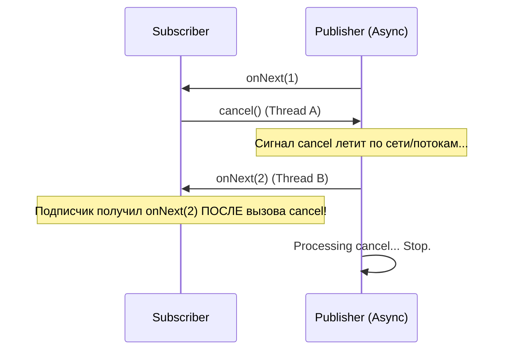
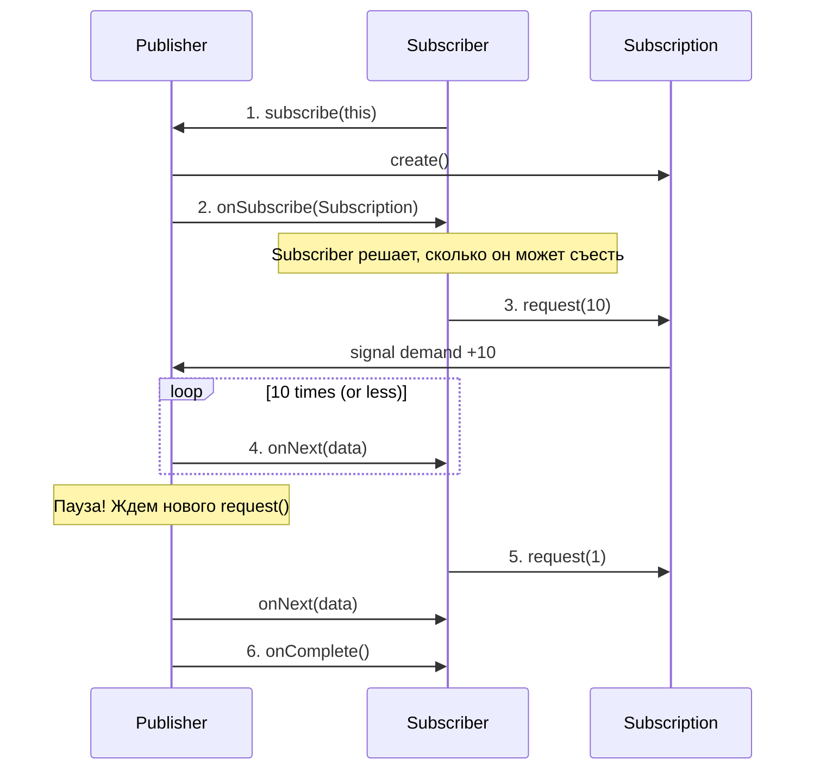

---
tags:
  - architecture/reactive
  - pattern/backpressure
  - java/flow
  - level/expert
created: 2026-01-26
status: seed
---


> [!abstract] **TL;DR**
> В синхронном мире Backpressure бесплатен: если сервер БД тормозит, тред приложения блокируется. Если все треды заблокированы, мы перестаем принимать новые запросы.
>
> В асинхронном мире (Async/Non-blocking) треды не блокируются. Producer (источник) может генерировать события в 1000 раз быстрее, чем Consumer (получатель) их обрабатывает.
> **Backpressure** — это механизм *динамического управления потоком*, позволяющий Consumer'у сказать Producer'у: "Притормози, я не успеваю". Без этого механизма любая async-система обречена на **OOM (Out Of Memory)**.

---
## 1. Физика Потока: Проблема Быстрого Продюсера

> [!abstract] Фундаментальный закон сохранения
> В любой системе передачи данных работает уравнение баланса:
> $$Rate_{accumulation} = Rate_{input} - Rate_{output}$$
>
> * Если $Rate_{input} \le Rate_{output}$, система стабильна.
> * Если $Rate_{input} > Rate_{output}$, данные накапливаются в буфере.
> * Так как $Buffer_{size}$ (RAM) конечен, при сохранении дисбаланса время до отказа ($T_{crash}$) неизбежно и конечно.
>
> **Backpressure (Обратное давление)** — это механизм обратной связи, который заставляет $Rate_{input}$ снизиться, чтобы соответствовать $Rate_{output}$.

### 1.1. Synchronous Model: Implicit Backpressure (Естественный тормоз)

В классическом блокирующем программировании (Java Servlet, JDBC, Python Sync) мы редко думаем о переполнении памяти. Почему? Потому что **Call Stack (Стек вызовов)** работает как естественный механизм передачи давления.

**Механика блокировки (Upstream Propagation):**
Представьте цепочку: `Client` $\to$ `App` $\to$ `Database`.

1.  **Stop:** БД начинает тормозить (Disk I/O).
2.  **Wait:** Поток приложения (Thread), вызвавший `db.query()`, переходит в состояние `BLOCKED/WAITING`. Он не потребляет CPU, но и *не может принять новые задачи*.
3.  **Kernel Queue:** Так как приложение не читает данные из входного сокета (Socket Receive Buffer), буфер ядра заполняется.
4.  **TCP Zero Window:** Ядро ОС отправляет клиенту TCP пакет с флагом `Window Size = 0`.
5.  **Sender Halt:** Ядро ОС клиента блокирует системный вызов `write()` на стороне отправителя.
6.  **Result:** Клиент физически перестает отправлять данные.


> [!check] Итог
> В синхронном мире **медленный потребитель автоматически останавливает быстрого производителя**.
> Цена за это — **Thread Starvation**. Мы платим простаивающими потоками (памятью стека) за безопасность данных.

### 1.2. Asynchronous Model: The Decoupling Trap (Ловушка развязки)

В реактивном/асинхронном программировании (Node.js, WebFlux, Kafka Consumers) мы разрываем жесткую связь между Producer и Consumer ради производительности (C10K problem).

**Механика катастрофы:**
Мы вводим промежуточный буфер (Queue/RingBuffer) между этапами обработки, чтобы Producer не ждал Consumer.

1.  **Fast Producer:** Источник (например, парсер CSV файла в памяти) генерирует 1,000,000 объектов/сек (`onNext`).
2.  **Slow Consumer:** Приемник (запись в Network/DB) может обработать только 1,000 объектов/сек.
3.  **Non-blocking:** Producer *не блокируется*. Он просто кладет объект в очередь и бежит дальше.
4.  **Accumulation:**
    $$Delta = 1,000,000 - 1,000 = 999,000 \text{ obj/sec}$$
    Каждую секунду в Heap накапливается ~1 миллион объектов.
5.  **The Crash:**
    * Сначала включается агрессивный **GC (Garbage Collector)**, пытаясь очистить память. CPU взлетает до 100% (GC thrashing).
    * Через несколько секунд: `java.lang.OutOfMemoryError: Java heap space`.


> [!danger] Unbounded Buffers (Бездонные очереди)
> Главный враг асинхронности — **неограниченные очереди** по умолчанию.
> Многие наивные реализации (`List<Data>`, `new LinkedBlockingQueue<>()`) бесконечны.
> Без явного сигнала "Стоп" (Backpressure) асинхронная система ведет себя как **DDoS-атака на саму себя**.

### 1.3. Типология Источников: Cold vs Hot

Стратегия Backpressure зависит от того, контролируем ли мы источник.

| Тип Источника | Описание | Примеры | Backpressure Strategy |
| :--- | :--- | :--- | :--- |
| **Cold Source (Холодный)** | Пассивный. Генерирует данные только по запросу. Можно поставить на "Паузу". | Файл на диске, Результат SQL-запроса, Iterable Collection, Lazy Generator. | **Pull Model.** "Дай мне еще 10 строк". Идеально работает. |
| **Hot Source (Горячий)** | Активный. Генерирует данные независимо от подписчиков. Нельзя остановить, не потеряв данные. | Движения мыши, Биржевой тикер, Данные с UDP сокета, Kafka Topic (условно*). | **Overflow Strategy.** Buffer, Drop, Sample или Fail. Мы вынуждены терять данные или буферизировать до предела. |

*\*Kafka — гибридный случай. Она "Горячая" для продюсера, но "Холодная" для консьюмера (мы можем не читать топик, данные лежат на диске).*

### 1.4. Why Now? (Почему это стало проблемой?)
В монолитах память была общей.
В микросервисах мы получили **Network Boundary**.
* Сервис А (Producer) шлет HTTP/RPC запросы Сервису Б (Consumer).
* Если Сервис Б не реализует Application-Level Backpressure (например, RSocket или HTTP/2 Flow Control), Сервис А просто "зальет" его трафиком, пока не забьет сетевые буферы или не вызовет OOM на входе.

---
## 2. Reactive Streams Specification (The Standard)

> [!abstract] Это не библиотека, это Закон
> **Reactive Streams** (JEP 266, `java.util.concurrent.Flow`) — это **SPI (Service Provider Interface)**.
> Это набор интерфейсов и правил (TCK), которым должны следовать библиотеки (Project Reactor, Akka Streams, RxJava), чтобы уметь общаться друг с другом.
>
> **Главная инновация:** Смена парадигмы с "Push" или "Pull" на **Hybrid Push-Pull**.
> * Данные летят вниз (Push).
> * Сигнал контроля летит вверх (Pull).

### 2.1. The Interfaces (Четыре Всадника)

> [!abstract] Инверсия Управления (Inversion of Control)
> В императивном программировании (`Iterator`, `InputStream`) приложение **тянет** данные: `T data = source.next()`. Поток управления принадлежит потребителю.
>
> В Reactive Streams поток управления инвертирован. Данные **вталкиваются** (`Push`), но только тогда, когда потребитель выдал "разрешение" (`Pull request`).
>
> 4 интерфейса (`Publisher`, `Subscriber`, `Subscription`, `Processor`) описывают **машину состояний** этого гибридного процесса.

#### A. Publisher`<T>` (Издатель / Источник)
Абстракция потенциально бесконечного источника данных.
* **Семантика:** "Я ничего не делаю, пока меня не попросят". Это определяет **Ленивость (Laziness)** реактивных стримов.
* **Метод:**
    * `void subscribe(Subscriber<? super T> s)`
* **Ключевой момент:** Метод возвращает `void`. Почему?
    * Потому что подписка — это асинхронный процесс. Мы не можем вернуть результат мгновенно. Мы просто "регистрируем" интерес. Реальная передача управления произойдет позже, через вызов `onSubscribe` у подписчика.

#### B. Subscriber`<T>` (Подписчик / Потребитель)
Тот, кто получает сигналы. В отличие от `Observer` из старой Java (GoF Pattern), этот подписчик активен — он управляет краном.

**Методы (Signal Handlers):**
1.  **`void onSubscribe(Subscription s)`** — **Самый важный метод.**
    * Вызывается строго **первым**.
    * Издатель передает подписчику объект `Subscription` — "пульт управления".
    * Именно здесь подписчик должен сделать первый шаг: вызвать `s.request(n)`, иначе поток данных никогда не начнется.
2.  **`void onNext(T t)`** — Получение данных.
    * Вызывается 0, 1 или N раз.
    * **Контракт:** Не может быть вызван больше раз, чем было запрошено через `request()`.
    * **Конкурентность:** Вызовы всегда **сериализованы** (Serialized). `onNext` никогда не будет вызван параллельно в двух потоках для одного подписчика. Вам не нужно `synchronized` внутри `onNext`.
3.  **`void onError(Throwable t)`** — Терминальный сбой.
    * Стрим умер. Больше никаких сигналов не будет.
    * Подписчик *не* должен пытаться перезапустить стрим отсюда (для этого нужна переподписка снаружи).
4.  **`void onComplete()`** — Успешный финал.
    * Данные закончились. Стрим закрыт.

> [!warning] Terminal States
> Состояния `onError` и `onComplete` являются **Терминальными**.
> После вызова любого из них `Subscription` аннулируется. Вызов `onNext` после терминального сигнала — это нарушение спецификации.

#### C. Subscription (Подписка / Канал связи)
Это уникальный объект, создаваемый для пары `Publisher + Subscriber`. Если вы подпишетесь на один Publisher дважды, будет создано два разных объекта `Subscription`.
Это "Линия Жизни" потока.

**Методы:**
1.  **`void request(long n)`** — **The Gas Pedal (Педаль газа).**
    * Аргумент `n`: "Я готов обработать еще $N$ элементов".
    * `n > 0`: Строго положительное число. Запрос $\le 0$ вызывает `IllegalArgumentException` через `onError`.
    * **Накопительный эффект:** Если вы вызвали `request(2)`, а потом `request(3)`, Publisher обязан отправить суммарно 5 элементов.
    * **Бесконечность:** `request(Long.MAX_VALUE)` означает "шли всё, что есть, без ограничений" (отключение Backpressure).
2.  **`void cancel()`** — **The Brake (Стоп-кран).**
    * Просит издателя прекратить отправку данных и очистить ресурсы.
    * *Нюанс:* Это асинхронная просьба. После вызова `cancel()` к вам еще может прилететь пара "летящих по сети" пакетов `onNext`. Вы должны быть к этому готовы.

#### D. Processor`<T, R>` (Труба / Трансформер)
Интерфейс, который наследует одновременно и `Subscriber<T>`, и `Publisher<R>`.
* **Роль:** Принимает данные типа T, обрабатывает их (map, filter, buffer) и отдает данные типа R.
* **Backpressure Propagation:** Процессор обязан транслировать Backpressure.
    * Если *Downstream* (подписчик справа) попросил 5 элементов, Процессор должен попросить у *Upstream* (источника слева) столько элементов, сколько нужно для генерации этих 5 (это может быть 5, или 1, или 100 в зависимости от логики оператора).

> [!danger] Anti-Pattern: Custom Processors
> В 99% случаев вам **не нужно** реализовывать этот интерфейс.
> Написание корректного `Processor`, который соблюдает все правила `request(n)` с обеих сторон и обеспечивает потокобезопасность (thread-safety) — это задача уровня "Hardcore Library Developer".
> Используйте операторы библиотек (`Flux.map`, `Flowable.filter`), они реализуют Processor внутри себя.

### Пример Жизненного Цикла (Handshake Visualization)

```java
// 1. Создание (Cold State)
Publisher<String> pub = ...;
Subscriber<String> sub = ...;

// 2. Инициализация (Connect)
pub.subscribe(sub); 
// --> Publisher создает SubscriptionImpl

// 3. Передача управления (Handshake)
// Publisher вызывает:
sub.onSubscribe(subscription);

// 4. Запрос (Backpressure Demand)
// Внутри onSubscribe подписчик решает:
// "Я готов к работе, дай 1 элемент"
subscription.request(1);

// 5. Поток данных (Data Flow)
// Publisher видит спрос и шлет:
sub.onNext("Data 1");

// 6. Пауза (Idling)
// Publisher молчит. Спрос удовлетворен (1 из 1).
// Подписчик обработал "Data 1" и просит добавки:
subscription.request(2);

// 7. Продолжение
sub.onNext("Data 2");
sub.onNext("Data 3");

// 8. Финал
sub.onComplete();
```

### 2.2. The Protocol: Strict Lifecycle (Конечный автомат)

> [!abstract] Формула Жизни (The Reactive Regex)
> Весь жизненный цикл подписчика описывается одним регулярным выражением:
> $$onSubscribe \cdot onNext^* \cdot (onError \mid onComplete)^?$$
>
> **Расшифровка:**
> 1.  `onSubscribe` вызывается **ровно один раз** в самом начале.
> 2.  `onNext` вызывается **ноль или более раз** (но не более, чем запрошено).
> 3.  Заканчивается всё **либо** `onError` (сбой), **либо** `onComplete` (успех), **либо** ничем (бесконечный стрим).
> 4.  После терминального сигнала (`onError`/`onComplete`) никаких событий быть не может.

#### A. Serializability Guarantee (Закон Одного Потока)
Спецификация дает мощнейшую гарантию, которая спасает нас от `synchronized` блоков в бизнес-логике.

* **Правило:** Вызовы методов `Subscriber` (`onSubscribe`, `onNext`, `...`) всегда **последовательны** (Happens-Before relationship).
* **Смысл:** Even if the Publisher is multi-threaded, он **обязан** сериализовать вызовы. Нельзя вызвать `onNext(A)` в потоке T1 и `onNext(B)` в потоке T2 одновременно для одного и того же подписчика.
* **Практика:** Внутри метода `onNext(T item)` вы находитесь в **Thread-Safe** зоне (относительно этого стрима). Вам не нужны локи для обновления внутреннего состояния подписчика.

#### B. The Recursion Trap (Re-entrancy Problem)
Это самый тонкий момент спецификации (Rule 3.3).

**Сценарий:**
1.  Subscriber в `onSubscribe` вызывает `request(1)`.
2.  Publisher (синхронный) тут же внутри `request` вызывает `onNext(1)`.
3.  Subscriber в `onNext(1)` решает, что хочет еще, и вызывает `request(1)`.
4.  Publisher тут же вызывает `onNext(2)`.
5.  ...
6.  **Итог:** Стек вызовов растет бесконечно: `req -> next -> req -> next ...` $\to$ `StackOverflowError`.

**Решение (Trampoline Pattern):**
Правильная реализация `Subscription` должна обнаруживать рекурсию и переключаться на цикл (Trampolining). Вместо немедленного вызова, она кладет задачу в очередь и возвращает управление, разматывая стек.

#### C. Cancellation & The "Async Gap"
Что происходит, когда вы дергаете стоп-кран `subscription.cancel()`? Остановка мгновенна?
**Нет.**



**Правило:** Подписчик должен быть готов получить несколько "фантомных" сигналов `onNext` (или даже `onError`) _после_ вызова `cancel()`.
- **Latency:** Между отправкой приказа "Стоп" и реальной остановкой конвейера есть задержка.
- **Игнорирование:** Хороший Subscriber проверяет флаг `isCancelled` внутри `onNext` и молча дропает лишние данные.

#### D. State Machine Diagram
Представьте подписчика как конечный автомат:
1. **UNSUBSCRIBED:** Начальное состояние.
    - $\xrightarrow{onSubscribe}$ **SUBSCRIBED** (Idle).
2. **SUBSCRIBED (Idle):** Контракт получен, но данных нет.
    - $\xrightarrow{request(n)}$ **ACTIVE** (Streaming).
    - $\xrightarrow{cancel}$ **TERMINATED**.
3. **ACTIVE:** Идет передача данных.
    - $\xrightarrow{onNext}$ **ACTIVE** (счетчик спроса уменьшается).
    - Если счетчик спроса = 0 $\to$ **SUBSCRIBED** (Paused).
    - $\xrightarrow{onComplete / onError}$ **TERMINATED**.
4. **TERMINATED:** Конец.
    - Любые вызовы (`request`, `cancel`, `onNext`) игнорируются или (в случае `onNext`) считаются багом Publisher'а.

> [!danger] Zombie Subscribers
> 
> Если Publisher нарушает протокол и шлет `onNext` после `onComplete`, это называется "Зомби-сигналы".
> 
> Спецификация требует, чтобы такие сигналы дропались. В библиотеках типа Reactor есть операторы (`Operators.cancelledSubscription()`), которые помогают безопасно глушить такие аномалии.

Правила взаимодействия строги. Любое нарушение карается исключением или неопределенным поведением.

**Sequence Flow:**


**Аксиомы Спецификации:**
1. **Total Order:** Вызовы `onSubscribe`, `onNext`, `onError/onComplete` строго последовательны. Нельзя вызвать `onNext` параллельно в разных потоках для одного подписчика. (Happens-Before relationship).
2. **Demand Law:** Publisher **не имеет права** вызвать `onNext` больше раз, чем суммарно запрошено через `request(n)`.
$$Sent \le Requested$$
3. **Recursion Safety:** Вызов `request(n)` может быть вызван изнутри `onNext` (синхронно). Реализация должна избегать `StackOverflowError`.

### 2.3. The Magic of `request(n)` (Dynamic Demand)

> [!abstract] Экономика Реактивности
> Представьте `request(n)` не как "запрос данных", а как **перевод денег на счет**.
> * **Subscriber** — это покупатель, который пополняет баланс (выдает кредиты).
> * **Publisher** — это продавец, который отгружает товар (данные), списывая по 1 кредиту за каждую единицу.
> * **Баланс (Pending Demand):** `CurrentRequest = TotalRequested - TotalDelivered`.
>
> Пока Баланс > 0, Publisher имеет право слать данные (`onNext`).
> Как только Баланс = 0, Publisher обязан замолчать.

#### A. Арифметика Спроса (Additivity)
Метод `request(n)` обладает **накопительным эффектом** (Cumulative).

* **Сценарий:**
    1.  `request(2)` $\to$ Баланс = 2.
    2.  Publisher ничего не послал (медленный).
    3.  `request(3)` $\to$ Баланс = 2 + 3 = 5.
    4.  Publisher проснулся и обязан послать 5 элементов (если они есть).

**Математика переполнения:**
Спецификация требует обработки переполнения `long`.
Если текущий спрос $10$, а вы делаете `request(Long.MAX_VALUE - 5)`, результат должен быть **капирован** (capped) на `Long.MAX_VALUE`. Ошибка или отрицательное число недопустимы.

#### B. Три Режима Работы (Push, Pull, Hybrid)

В зависимости от значения `n`, система переключается между разными физическими моделями доставки.

**1. Pure Pull (Stop-and-Wait)**
* **Код:** `request(1)`
* **Механика:** Subscriber просит 1 элемент $\to$ ждет $\to$ обрабатывает $\to$ просит следующий.
* **Плюсы:** Абсолютная безопасность. OOM невозможен.
* **Минусы:** Ужасная производительность из-за Latency.
    * Если RTT (Round Trip Time) до сервера = 50ms, вы получите макс 20 RPS ($1000/50$). Канал будет простаивать 99% времени.

**2. Pure Push (Unbounded / Fast Path)**
* **Код:** `request(Long.MAX_VALUE)`
* **Механика:** Subscriber говорит: "Я бездонный, лей по максимуму".
* **Оптимизация:** Publisher видит это "магическое число" и **отключает** проверки счетчика (`if (demand > 0)`). Данные летят в "горячем цикле".
* **Плюсы:** Максимальная пропускная способность (миллионы RPS).
* **Минусы:** Нет Backpressure. Если Subscriber подавится — OOM.

**3. Hybrid Push-Pull (Prefetching) — The Industry Standard**
Это то, как работают `WebFlux` и `Reactor` по умолчанию. Мы используем **батчинг** запросов для скрытия латентности.

* **Алгоритм (Replenishing Optimization):**
    1.  Subscriber имеет буфер (например, 256 слотов).
    2.  На старте: `request(256)`. (Заполняем буфер).
    3.  Publisher начинает слать данные (Push).
    4.  Subscriber обрабатывает данные. Как только обработано **75%** (low tide watermark), он шлет *асинхронно* дозаказ: `request(192)`.
* **Результат:** Publisher никогда не останавливается (канал всегда загружен), но буфер Subscriber'а никогда не переполняется больше чем на 256 элементов.
* **Итог:** Скорость Push с безопасностью Pull.

#### C. Sentinel Value: `Long.MAX_VALUE`
Число `9,223,372,036,854,775,807` играет особую роль в спецификации.

* Это не просто "очень много". Это **флаг бесконечности**.
* **Правило:** Если Publisher получил `request(Long.MAX_VALUE)`, он может считать спрос бесконечным *навсегда*.
* Даже если Subscriber потом вызовет `request(1)`, спрос не станет `MAX + 1`. Он останется "Бесконечным". Обратного пути к Backpressure (ограниченному режиму) обычно нет.

> [!example] Визуализация Логики Publisher'а
> ```java
> void request(long n) {
>     if (demand == Long.MAX_VALUE) return; // Уже в режиме Push
>     
>     demand += n;
>     if (demand < 0) demand = Long.MAX_VALUE; // Cap at MAX (Overflow check)
>     
>     tryDrainLoop(); // Попытка отправить данные
> }
> 
> void tryDrainLoop() {
>     while (queue.hasData()) {
>         if (demand > 0) {
>             // 1. Send
>             subscriber.onNext(queue.poll());
>             
>             // 2. Decrement Credit (если не бесконечность)
>             if (demand != Long.MAX_VALUE) {
>                 demand--;
>             }
>         } else {
>             break; // STOP! Нет кредитов (Backpressure applied)
>         }
>     }
> }
> ```

#### D. The "Hang" Problem (Почему `request(0)` запрещен?)
Спецификация запрещает `request(0)` или отрицательные числа.
* Почему? Потому что `request` — это сигнал **изменения** состояния. Сказать "Я хочу еще 0 элементов" — это спам, который не меняет баланс, но тратит CPU.
* Если Subscriber вызывает `request(0)` $\to$ Publisher обязан кинуть `IllegalArgumentException` в `onError`.
* Если вы хотите остановить стрим — просто **не вызывайте** `request()`. Молчание — это и есть пауза.

### 2.4. Warning: Do NOT Implement This Yourself

> [!danger] Аксиома Архитектора
> **Никогда. Не реализуйте. Интерфейс. Publisher. Сами.**
>
> Reactive Streams — это не просто API, это **протокол со строгой спецификацией поведения** (Behavioral Specification).
> Существует набор тестов **TCK (Technology Compatibility Kit)**, содержащий более 40 жестких проверок на граничные случаи.
>
> Вероятность того, что вы напишете `implements Publisher<T>` и пройдете TCK с первого раза, равна нулю. Даже авторы RxJava и Project Reactor тратили месяцы на отладку своих базовых классов.

#### A. The Three Deadly Sins of Custom Implementation

Почему это так сложно? Вот три главных "убийцы", которые не видны в простом коде, но всплывают под нагрузкой.

**1. Re-entrancy & Stack Overflow (Синхронная рекурсия)**
Спецификация разрешает вызывать `request(n)` синхронно изнутри `onNext`.
* **Сценарий:**
    1.  Publisher шлет `onNext(1)`.
    2.  Subscriber в теле `onNext` решает: "Хочу еще!" и вызывает `subscription.request(1)`.
    3.  Publisher (наивный) видит спрос и тут же, в том же потоке, вызывает `onNext(2)`.
    4.  Subscriber снова вызывает `request(1)`.
* **Результат:** Бесконечная рекурсия `onNext -> request -> onNext` убивает стек (`StackOverflowError`) за миллисекунды.
* **Правильное решение:** Publisher должен использовать **Trampolining** (цикл-батут). Вместо прямого вызова, он должен ставить задачу в очередь и возвращать управление, превращая рекурсию в плоский цикл `while`. Написать это без багов — искусство.

**2. Concurrency Race Conditions (Гонка состояний)**
Спецификация требует, чтобы вызовы `onNext` были строго последовательны (Happens-Before), даже если `request` и `cancel` прилетают из разных потоков.
* **Сценарий:**
    * Thread A вызывает `request(10)`.
    * Thread B вызывает `cancel()`.
    * Thread C (внутренний цикл Publisher) пытается вызвать `onNext()`.
* **Проблема:** Вы должны гарантировать, что после `cancel()` ни один `onNext` не будет вызван (или будет проигнорирован). Без использования `AtomicLong`, `Volatile` и сложных CAS-операций (Compare-And-Swap) вы получите "Zombie Signals" или утечку памяти.

**3. Long Overflow Math (Арифметика Бесконечности)**
Спецификация требует корректной обработки переполнения `long`.
* В Java: `Long.MAX_VALUE + 1 = Long.MIN_VALUE` (отрицательное число).
* В Reactive Streams: `Long.MAX_VALUE + 1 = Long.MAX_VALUE` (насыщение).
* **Ошибка:** Если вы напишете `currentDemand += n`, и результат станет отрицательным, ваш Publisher мгновенно завершит работу с ошибкой (так как спрос < 0 запрещен), хотя на самом деле спрос был огромным. Вы обязаны использовать методы типа `Operators.addCap(a, b)`.

#### B. The Right Way: Generators & Delegates

Как создать свой источник данных, если нельзя имплементить интерфейс?
Используйте фабрики, которые уже прошли TCK.

**1. Synchronous Generation (`Flux.generate`)**
Для простых состояний (например, счетчик или чтение файла по строкам).
```java
Flux.generate(
    () -> 0, // Initial State
    (state, sink) -> {
        sink.next("Value " + state); // Генерируем 1 элемент
        if (state == 10) sink.complete();
        return state + 1; // New State
    }
);
// Внутри Reactor сам управляет request(n), циклом и потокобезопасностью.

### 2.5. Пример ментальной модели (Код)

Чтобы понять физику, посмотрите на упрощенную (наивную) реализацию `Subscription`.
``` Java
class SimpleSubscription implements Flow.Subscription {
    private final Iterator<String> data;
    private final Flow.Subscriber<? super String> subscriber;
    private final AtomicLong demand = new AtomicLong(0); // Счетчик спроса

    // ВНИМАНИЕ: Это упрощение. В реальности нужен "drain loop" для thread-safety
    @Override
    public void request(long n) {
        if (n <= 0) subscriber.onError(new IllegalArgumentException());
        
        // 1. Увеличиваем спрос (атомарно)
        long currentDemand = demand.addAndGet(n);
        
        // 2. Пытаемся удовлетворить спрос
        while (currentDemand > 0 && data.hasNext()) {
            String item = data.next();
            subscriber.onNext(item);
            currentDemand = demand.decrementAndGet(); // Уменьшаем спрос
        }
        
        if (!data.hasNext()) subscriber.onComplete();
    }

    @Override
    public void cancel() { /* stop sending */ }
}
```
Здесь видно, что `request(n)` — это **спусковой крючок**, который запускает цикл отправки данных. Если `demand` равен 0, цикл `while` не выполнится ни разу. Данные останутся в источнике.

**2. Asynchronous Bridging (`Flux.create` / `Flux.push`)** Для интеграции с Listener-based API (например, RabbitMQ listener или GUI Events).

``` Java
Flux.create(sink -> {
    MyListener listener = new MyListener() {
        void onMessage(String msg) {
            // Reactor сам буферизирует или дропает, если нет спроса
            sink.next(msg); 
        }
    };
    server.register(listener);
    
    // Cleanup callback
    sink.onDispose(() -> server.unregister(listener));
}, FluxSink.OverflowStrategy.BUFFER); // Явное управление Backpressure
```

**3. Extending Base Classes (Если очень нужно)** Если вам _действительно_ нужно создать свой оператор, наследуйтесь от абстрактных классов фреймворка, которые берут на себя сложность TCK.
- **Reactor:** `BaseSubscriber<T>`
- **RxJava:** `DisposableSubscriber<T>` или `SafeSubscriber<T>`

> [!check] Expert Tip Единственное место, где допустимо писать `implements Publisher` вручную — это когда вы пишете свой собственный Reactive Framework для академических целей. В продакшене это **Technical Debt** уровня "Critical".

---
## 3. Strategies for Overflow (Когда нельзя притормозить)


> [!abstract] Дилемма Горячего Источника
> Механизм `request(n)` работает идеально, только если источник может "притормозить" (Cold Source: File, DB Cursor).
>
> Но что, если источник — это **Hot Source** (Сетевой сокет UDP, движения мыши пользователя, биржевой фид)?
> Вы не можете сказать пользователю "не двигай мышкой", пока вы перерисовываете UI.
> Вы не можете сказать бирже "останови торги", пока вы пишите в базу.
>
> В этом случае Backpressure превращается из **Flow Control** (Управления потоком) в **Overflow Strategy** (Стратегию сброса). Мы должны решить: **чем мы пожертвуем** — памятью (Latency) или данными (Loss)?

### 3.1. Strategy A: Buffering (Накопление / Эластичность)


> [!abstract] Эластичность против Емкости
> Буферизация не решает проблему скорости. Она **смещает проблему во времени**.
> * **Суть:** Мы превращаем всплеск трафика (Traffic Spike) в увеличение задержки (Latency).
> * **Аналогия:** Зал ожидания у врача. Он не позволяет врачу лечить быстрее. Он просто позволяет пациентам не стоять на улице под дождем.
>
> **Главное правило:** Буфер полезен только для сглаживания *кратковременных* (bursty) всплесков. Если $V_{prod} > V_{cons}$ на длинной дистанции, любой буфер (даже на 1TB) переполнится.

#### A. The Unbounded Buffer (Спираль Смерти)
Использование `Unbounded Queue` (например, `onBackpressureBuffer()` без аргументов или дефолтный `LinkedBlockingQueue`) в продакшене — это архитектурное преступление.

**Физика катастрофы:**
1.  **Накопление:** Producer быстрее Consumer'а на 10%. Очередь растет линейно.
2.  **GC Pressure:**
    * В Java каждая запись в `LinkedList` — это объект `Node` (overhead 24-32 байта + ссылка).
    * При 10 млн элементов в очереди, GC должен сканировать 10 млн объектов при каждой сборке мусора.
    * CPU тратится не на бизнес-логику, а на GC ("GC Thrashing").
3.  **Latency Explosion:**
    * Данные в начале очереди "протухают".
    * Если очередь выросла до 1 часа обработки, то Consumer сейчас обрабатывает данные, которые устарели час назад.
    * Даже если Producer остановится, Consumer будет час разгребать "мертвый груз".
4.  **OOM:** Финал неизбежен. Приложение падает с `OutOfMemoryError: Heap Space`.

#### B. The Bounded Buffer (Ring Buffer Optimization)
Единственный допустимый вариант — **Ограниченный Буфер**. Но не все ограниченные буферы одинаковы.

**Почему Ring Buffer (Кольцевой буфер)?**
Библиотеки вроде **Reactor** и **LMAX Disruptor** используют массивы фиксированного размера (`Array`), а не связные списки.
1.  **Memory Layout:** Массив занимает непрерывный участок памяти.
2.  **CPU Cache Friendly:** Процессор загружает в L1/L2 кэш сразу пачку элементов (Cache Line). Доступ к массиву в разы быстрее, чем "хождение по ссылкам" в Linked List.
3.  **Zero GC:** Массив аллоцируется один раз при старте. Нет создания/удаления объектов-оберток (`Node`) при вставке элементов.

> [!example] Reactor Code
> ```java
> flux.onBackpressureBuffer(
>     1024, // Capacity: Строго ограничено
>     BufferOverflowStrategy.DROP_OLDEST // Что делать, если пришел 1025-й?
> );
> ```

#### C. The Overflow Policy (Стратегия переполнения)
Ограниченный буфер ставит перед фактом: "Мест нет". Что делать с 1025-й записью?

1.  **Error (Default):** Бросить исключение `Exceptions.failWithOverflow`.
    * *Смысл:* "Я не справляюсь, перезагрузи меня". Жестко, но честно.
2.  **Drop Latest (Reject):** Отбросить *новый* элемент.
    * *Смысл:* "Очередь занята важными делами, приходите позже". Подходит для Web-серверов (503 Service Unavailable).
3.  **Drop Oldest (Evict Head):** Выкинуть *самый старый* элемент из начала очереди, вставить новый в конец.
    * *Смысл:* "Свежие данные важнее старых".
    * *Use Case:* Телеметрия. Если мы не успели отправить температуру за 12:00, а уже 12:05 — выкиньте данные за 12:00, они никому не нужны.

#### D. The Math of Latency (Little's Law)
Почему большой буфер — это зло? Вспомним Закон Литтла из теории массового обслуживания:

$$W = \frac{L}{\lambda}$$

* $W$ — Среднее время ожидания в очереди (Latency).
* $L$ — Длина очереди (Buffer Size).
* $\lambda$ — Скорость обработки (Consumer Rate).

**Пример:**
* $L = 10,000$ (размер буфера).
* $\lambda = 100$ msg/sec (скорость записи в БД).
* $$W = \frac{10,000}{100} = 100 \text{ seconds.}$$

**Вывод:** Если вы ставите буфер на 10,000 элементов, вы **гарантируете**, что при полной загрузке ваши данные будут отставать от реальности на 100 секунд.
Если бизнес-требование SLA говорит "задержка не более 1 сек", ваш буфер не имеет права быть больше $1 \times 100 = 100$ элементов.

> [!check] Архитектурный совет
> Рассчитывайте размер буфера (`capacity`) исходя из допустимого **времени задержки** (Latency Budget), а не исходя из доступной оперативной памяти.
> Память дешевая, а старые данные — бесполезны.

### 3.2. Strategy B: Dropping (Сброс / Жертва данными)

> [!abstract] Философия Частичной Потери
> В распределенных системах существует аксиома: **"Свежие данные важнее полных данных"** (для определенных классов задач).
>
> Если Consumer перегружен, попытка обработать *всё* приведет к тому, что вы не обработаете *ничего* вовремя (Latency вырастет до бесконечности).
> **Load Shedding** (Сброс нагрузки) — это защитный механизм, который жертвует частью трафика, чтобы сохранить **Latency** в пределах SLA для оставшейся части.
>
> Вопрос лишь в том, *кого* мы приносим в жертву: тех, кто уже ждет (Oldest), или тех, кто только пришел (Newest)?

#### A. Drop Newest (Tail Drop / Reject) — "Очередь в Клуб"
Это стандартное поведение переполненной очереди в сетевом оборудовании (Router Tail Drop) и веб-серверах.

* **Механика:**
    * Буфер полон ($L = Max$).
    * Приходит новый элемент $E_{new}$.
    * $E_{new}$ немедленно отбрасывается (в `/dev/null` или DLQ).
    * Состояние очереди **не меняется**.
* **Семантика:** "Я занят старой работой. Не отвлекай меня".
* **Физический смысл:** Мы защищаем *уже принятые* обязательства. Если запрос попал в очередь, мы обещаем его обработать. Новым мы отказываем.
* **Use Case:**
    * **Transactional API:** Если мы приняли заказ на оплату, мы обязаны его процессить. Новые заказы получают `503 Service Unavailable`.
    * **DDoS Protection:** Нет смысла принимать запросы, если CPU уже 100%.

> [!example] Reactor Code
> ```java
> flux.onBackpressureDrop(dropped -> {
>     log.warn("Dropped: {}", dropped); // Логируем потерю
>     metrics.counter("dropped").increment();
> });
> ```

#### B. Drop Oldest (Head Drop / Eviction) — "Видеорегистратор"
Более агрессивная стратегия, оптимизированная под **Real-Time**.

* **Механика:**
    * Буфер полон.
    * Приходит новый элемент $E_{new}$.
    * Мы удаляем $E_{oldest}$ из "головы" очереди (Head).
    * Мы вставляем $E_{new}$ в "хвост" (Tail).
* **Семантика:** "Старое уже не важно. Давай свежее".
* **Концепция Value Decay:**
    Ценность данных падает со временем экспоненциально.
    * Координата GPS, полученная 1 секунду назад — бесценна.
    * Координата GPS, полученная 10 секунд назад — мусор.
    * Зачем тратить CPU на обработку мусора, если есть свежие данные?
* **Use Case:**
    * **Telemetry / IoT:** Датчики шлют 100 значений в секунду. Если сеть лагнула, нам не нужно отправлять историю за 5 секунд. Нам нужно текущее состояние.
    * **Video Streaming:** Если кадр опоздал, нет смысла его рендерить (будут артефакты). Лучше дропнуть его и показать следующий ключевой кадр (I-frame).

> [!example] Reactor Code
> Реализуется через ограниченный буфер с политикой переполнения:
> ```java
> flux.onBackpressureBuffer(10, BufferOverflowStrategy.DROP_OLDEST);
> ```

#### C. Sampling (Rhythmic Dropping) — "Стробоскоп"
Это частный случай Dropping, но управляемый не переполнением, а **временем**.

* **Механика:**
    * Producer генерирует 1000 событий/сек.
    * Consumer говорит: "Давай мне только одно событие каждые 100мс".
    * Остальные 99 событий дропаются молча.
* **Отличие от Throttle:**
    * `Throttle` часто подразумевает задержку (delay).
    * `Sample` подразумевает потерю (loss).
* **Use Case:**
    * **UI Rendering:** Отрисовка графика загрузки CPU. Данные приходят миллисекундами, но глаз человека воспринимает только 60 FPS (16мс). Рендерить чаще бессмысленно.

#### D. Decision Matrix: Newest vs. Oldest

| Характеристика | Drop Newest (Tail) | Drop Oldest (Head) |
| :--- | :--- | :--- |
| **Приоритет** | Стабильность обязательств | Свежесть данных |
| **Что страдает** | Доступность (Availability) для новых клиентов | Целостность истории (History) |
| **Latency** | Может быть высоким (т.к. очередь полная) | **Минимальное** (очередь всегда свежая) |
| **Тип данных** | Заказы, Платежи, Файлы | Котировки, Метрики, Координаты |
| **Аналогия** | Переполненный автобус (не берет новых) | Видеорегистратор (стирает старое) |

> [!tip] Архитектурный совет
> Для **User-Facing** систем (где ждет человек) часто лучше использовать `Drop Oldest`.
> Пример: Пользователь двигает слайдер цены. Если бэкенд тормозит, и мы используем `Drop Newest`, пользователь отпустит мышь, а слайдер еще 5 секунд будет ползти (обрабатывая старые события из очереди).
> Если `Drop Oldest` — слайдер сразу перепрыгнет в актуальную позицию.

### 3.3. Strategy C: Conflation (Схлопывание / Агрегация)

> [!abstract] Сжатие с Потерями (Lossy Compression)
> **Conflation (Схлопывание)** — это стратегия, при которой мы уменьшаем количество событий, сохраняя их **смысл** (Semantics), но жертвуя **историей** (History).
>
> * **Физика:** Если $Rate_{in} = 1000$ Hz, а $Rate_{out} = 10$ Hz, мы должны превратить каждые 100 входных событий в 1 выходное.
> * **Метод:** Мы не просто выбрасываем случайные 99 событий (как в Dropping). Мы агрегируем их:
>     * Или берем самое последнее (актуальное).
>     * Или вычисляем среднее/сумму.
>     * Или собираем их в пакет (List).
#### A. Keep Latest (Sampling) — "Биржевой Тикер"
Самая агрессивная форма conflation. Мы используем буфер размером **ровно в 1 элемент**.

* **Механика:**
    1.  Поток генерирует: `A`, `B`, `C`...
    2.  Consumer занят обработкой `A`.
    3.  В буфер попадает `B`.
    4.  Приходит `C`. `B` немедленно перезаписывается на `C` (Conflated).
    5.  Приходит `D`. `C` перезаписывается на `D`.
    6.  Consumer освободился $\to$ берет `D`.
    7.  **Итог:** `B` и `C` исчезли бесследно.
* **Семантика:** "Меня интересует только **текущее состояние** мира. Как мы к нему пришли — неважно".
* **Use Case:**
    * **GUI Rendering:** Координаты мыши. Если вы рисуете Drag&Drop, вам нужно знать только где мышь *сейчас*. Рисовать траекторию, по которой она прошла 10мс назад, бессмысленно — это создаст эффект "лага".
    * **Stock Prices:** Если цена менялась `100 -> 101 -> 102`, а мы пишем в БД раз в секунду, нам достаточно записать `102`.

> [!example] Reactor Code
> ```java
> flux.onBackpressureLatest(); // Автоматический буфер на 1 слот
> // ИЛИ
> flux.sample(Duration.ofMillis(100)); // Отдавать последний элемент каждые 100мс
> ```

#### B. Debounce (Stabilization) — "Поисковая Строка"
Самый частый вопрос на собеседованиях: *"В чем разница между Debounce и Throttle?"*

* **Логика (Quiet Period):** "Передавай данные, только если поток **замолчал** на N миллисекунд".
* **Механика:**
    1.  Приходит событие `A`. Таймер запускается (например, 300ms).
    2.  Через 100ms приходит `B`. Таймер сбрасывается и запускается заново. Событие `A` выбрасывается.
    3.  Через 100ms приходит `C`. Таймер сбрасывается. `B` выбрасывается.
    4.  Тишина 300ms.
    5.  Таймер срабатывает $\to$ Эмитится `C`.
* **Use Case:**
    * **Typeahead / Autocomplete:** Пользователь печатает "Java".
        * `J` -> (wait) -> `a` (reset) -> `v` (reset) -> `a` (reset) -> ...Silence... -> Send "Java".
    * Без Debounce вы отправите 4 запроса в базу. С Debounce — только 1.

#### C. Throttle (Pacing) — "Пулемет"
* **Логика (Max Frequency):** "Передавай данные не чаще, чем раз в N миллисекунд".
* **Механика:**
    1.  Приходит `A`. Эмитится сразу. Включается "Cooldown" (300ms).
    2.  Приходят `B`, `C`. Игнорируются (или накапливаются, зависит от настройки), так как идет Cooldown.
    3.  Таймер истек.
    4.  Приходит `D`. Эмитится сразу.
* **Use Case:**
    * **Button Clicks:** Защита от Double-Submit. Пользователь кликнул "Купить" 10 раз подряд. Throttle пропустит только первый клик, остальные проигнорирует.
    * **Scroll Events:** Пересчитывать макет страницы при скролле. Делать это на каждый пиксель дорого. Делать это раз в 16мс (60 FPS) — нормально.

#### D. Buffering (Micro-batching) — "Группировка"
Это превращение потока `Stream<T>` в поток `Stream<List<T>>`.

* **Механика:**
    * Вместо того чтобы обрабатывать элементы по одному, мы накапливаем их в пачку (например, до 1000 штук или до 1 секунды ожидания) и отдаем списком.
* **Зачем? (I/O Optimization):**
    * Вставка 1000 записей в БД по одной (`INSERT INTO ...`) — это 1000 сетевых вызовов (RTT) и 1000 транзакций (fsync). Это очень медленно.
    * Вставка списка (`INSERT INTO ... VALUES (...), (...), (...)`) — это 1 сетевой вызов и 1 транзакция.
    * **Profit:** Увеличение пропускной способности (Throughput) в 10-100 раз.
* **Цена:** Latency. Первый элемент в батче ждет, пока наберется последний.

> [!example] Reactor Code (Smart Batching)
> ```java
> // "Собери 100 элементов ИЛИ подожди 1 секунду, что наступит раньше"
> flux.bufferTimeout(100, Duration.ofSeconds(1)); 
> ```

#### E. Decision Matrix: Conflation Types

| Оператор | Логика | Когда эмитит? | Use Case |
| :--- | :--- | :--- | :--- |
| **Sample** | Ритмичная выборка | Каждые N сек (последний) | Метрики, Графики UI |
| **Debounce** | Детектор тишины | После паузы в потоке | Поиск, Ввод текста |
| **Throttle** | Лимитер частоты | Сразу, потом пауза | Клики кнопок, Скролл |
| **Buffer** | Агрегация (List) | По размеру или времени | Batch Insert (DB/Kafka) |
| **Latest** | Очередь = 1 | Когда Consumer свободен | GUI Drag&Drop |

> [!check] Архитектурный совет
> Если ваша система пишет в **Базу Данных** или **Kafka** под высокой нагрузкой, вы **обязаны** использовать `buffer()` (Micro-batching).
> Без батчинга вы упретесь в IOPS диска или Network RTT задолго до того, как закончится CPU.

### 3.4. Strategy D: Fail (Аварийная остановка)

> [!abstract] Философия "Лучше смерть, чем ложь"
> В отличие от стратегий сброса (Drop/Conflate), которые молча уничтожают данные ради сохранения потока, стратегия **Fail** уничтожает сам поток ради сохранения целостности.
>
> **Принцип:** Если мы не можем обработать данные *вовремя* и *полностью*, мы должны немедленно уведомить об этом отправителя.
> * **Drop:** "Я пропустил пару ударов, но продолжаю работать".
> * **Fail:** "Я перегружен. Я останавливаюсь. Разбирайся сам".
>
> Это реализация паттерна **Fail Fast** в реактивных системах.
#### A. Механика: Terminal Signal (Конец Игры)
Это самая жесткая реакция на переполнение.

1.  **State:** Буфер (если он есть) заполнен. Downstream (потребитель) не запрашивает новые элементы (`demand = 0`).
2.  **Trigger:** Producer пытается сделать `onNext(T)`.
3.  **Action:**
    * Оператор не выбрасывает элемент.
    * Оператор **отменяет подписку** (`Subscription.cancel()`).
    * Оператор посылает вниз сигнал `onError(BufferOverflowException)`.
4.  **Result:** Стрим переходит в **Терминальное состояние**. Он мертв. Никакие данные больше не пройдут через эту трубу, пока клиент не подпишется заново (Retry).

#### B. Use Case: Критические Данные (Zero Data Loss)
Почему мы выбираем смерть?

Представьте систему обработки банковских транзакций.
* **Вход:** Поток платежных поручений.
* **Ситуация:** База данных встала (Lock Wait Timeout). Очередь в памяти заполнилась.
* **Варианты:**
    * *Buffer (Unbounded):* Приложение упадет с OOM. Мы потеряем *все* транзакции в памяти (тысячи). **Недопустимо.**
    * *Drop:* Мы молча выкинем транзакцию №1005. Клиент будет думать, что она прошла (или зависла). Деньги исчезнут. **Недопустимо.**
    * *Fail:* Мы мгновенно вернем ошибку. Клиент (Mobile App) увидит красный крестик: "Повторите позже". Деньги останутся на счету. Клиент нажмет "Повторить", когда база оживет. **Единственный выход.**

#### C. Transformation to HTTP (Backpressure Propagation)
В микросервисной архитектуре `BufferOverflowException` внутри сервиса должно транслироваться в понятный сетевой код.

* **Внутри (Reactor):** `Flux.onBackpressureError()` бросает исключение.
* **На границе (WebFlux/Spring MVC):** `ExceptionHandler` ловит его.
* **В сети (HTTP):** Возвращается **`503 Service Unavailable`** (или `429 Too Many Requests`).
    * Это сигнал для Load Balancer'а: "Этот инстанс болен, убери трафик".
    * Это сигнал для Client Circuit Breaker'а: "Открой цепь".

#### D. Сравнение с Timeout (Push vs Pull Failure)
Отказ может произойти по двум причинам. Важно их различать при отладке.

| Тип Отказа | Кто виноват? | Механизм | Исключение |
| :--- | :--- | :--- | :--- |
| **Overflow (Push)** | **Producer** слишком быстр. | Producer пытается запихнуть данные в полный буфер. Consumer даже не знает об этом. | `BufferOverflowException` |
| **Timeout (Pull)** | **Consumer** слишком медленен. | Producer ждал, пока Consumer запросит данные, но таймер истек. Данные даже не были сгенерированы (или устарели). | `TimeoutException` |

> [!example] Reactor Code (Strict Mode)
> ```java
> paymentStream
>     // Буфер минимален. Если мы не можем записать в БД сразу - падаем.
>     .onBackpressureBuffer(10, BufferOverflowStrategy.ERROR) 
>     .doOnError(e -> log.error("System overloaded, shedding load completely"))
>     .subscribe();
> ```

> [!check] Архитектурный совет
> Используйте стратегию **Fail** для всех операций, которые **не являются идемпотентными** (Non-Idempotent).
> Если повторная обработка того же события опасна (например, "Списать $100"), лучше упасть с ошибкой до начала обработки, чем зависнуть посередине.
### 3.5. Decision Matrix: Что выбрать?

Как архитектор, вы должны выбрать стратегию для каждого горячего стрима.

| Критерий                | Buffer                         | Drop / Sample            | Conflate (Latest)    | Fail                  |
| :---------------------- | :----------------------------- | :----------------------- | :------------------- | :-------------------- |
| **Природа данных**      | Транзакции, Логи               | Телеметрия, Видео        | Котировки, Состояния | Критические данные    |
| **Допустимость потерь** | ❌ Нет                          | ✅ Да (частично)          | ✅ Да (промежуточные) | ❌ Нет                 |
| **Влияние на Latency**  | 🔴 Высокое (растет с очередью) | 🟢 Низкое (Zero latency) | 🟢 Низкое            | ⚪ N/A (Crash)         |
| **Требования к памяти** | 🔴 High                        | 🟢 Low                   | 🟢 Low (1 слот)      | 🟢 Low                |
| **Пример**              | Запись заказов в Kafka         | GPS трекер               | Курс USD/EUR         | Банковский процессинг |

> [!check] Reactor Implementation
> В Project Reactor эти стратегии выбираются *декларативно*:
> ```java
> hotSource
>     .onBackpressureBuffer(1000)  // Strategy A
>     .onBackpressureDrop()        // Strategy B
>     .onBackpressureLatest()      // Strategy C
>     .subscribe(dbWriter);
> ```

---
## 4. Backpressure across Network (TCP & RSocket)

> [!abstract] Проблема "Импеданса"
> Внутри одной JVM (Reactive Streams) Backpressure передается мгновенно через вызов метода `request(n)`.
>
> Когда мы выходим в сеть (Microservices), мы сталкиваемся с физикой:
> 1.  **Latency:** Сигнал "Стоп" идет миллисекунды. За это время в "трубе" уже летит гигабайт данных.
> 2.  **Granularity:** Приложение мыслит *Объектами* (Customer, Order), а сеть мыслит *Байтами* и *Пакетами*.
>
> Нам нужен механизм, транслирующий логическое `request(10 items)` в сетевое торможение.
### 4.1. TCP Flow Control (Layer 4: The Brute Force)

> [!abstract] Последний рубеж обороны
> Если вы не реализовали Backpressure в приложении (Reactive Streams), вас спасет **TCP Flow Control**.
> Но это спасение методом "грубой силы". TCP не понимает нюансов вашей бизнес-логики. Он работает как рубильник: "Буфер полон — остановить всё".
>
> **Механизм:** Sliding Window (Скользящее окно).
> **Инструмент:** Поле `Window Size` в заголовке TCP пакета.
#### A. Анатомия Механизма (Kernel Space Mechanics)

Backpressure здесь происходит не в вашем коде, а глубоко в недрах операционной системы (Linux Network Stack).

**Участники:**
1.  **Receive Buffer (RecvQ):** Кольцевой буфер в памяти ядра получателя (настраивается через `sysctl -w net.ipv4.tcp_rmem`).
2.  **Advertised Window (rwnd):** Число байт, которое получатель готов принять *прямо сейчас*.
    $$rwnd = BufferSize - BufferedData$$

**Цикл Обратного Давления:**
1.  **Application Lag:** Ваше Java/Go приложение занято (GC пауза или сложные вычисления) и перестает вызывать системный вызов `read()` из сокета.
2.  **Buffer Fill:** Пакеты продолжают прилетать из сети и складываться в `RecvQ` ядра. Значение `BufferedData` растет.
3.  **Window Shrink:** Ядро вычисляет новое `rwnd`. Оно уменьшается.
4.  **Update:** Получатель отправляет пустой ACK-пакет отправителю с обновленным заголовком: `WIN=4096` $\to$ `WIN=1024` $\to$ `WIN=0`.
5.  **Sender Halt:** Ядро отправителя получает `WIN=0` (**Zero Window**). Оно блокирует вызов `write()` (или возвращает `EAGAIN`) для приложения-отправителя.

> [!info] Zero Window Probe (Зомби-режим)
> Когда окно закрывается (`WIN=0`), передача данных полностью останавливается. Соединение не разрывается, оно "замерзает".
> Отправитель запускает таймер (Persistence Timer) и периодически шлет **Zero Window Probes** (пакеты с 1 байтом данных), спрашивая: "Место освободилось?".
> Если приложение-получатель так и не прочитает данные, соединение может висеть в этом состоянии часами (пока не сработает Keep-Alive).

#### B. The Granularity Problem (Проблема Крупного Помола)

Почему TCP Flow Control недостаточно для микросервисов?

**Проблема:** TCP работает с **Байтами**, а не с **Запросами**.
TCP ничего не знает о том, что внутри потока байт лежат разные HTTP-запросы. Для него это просто труба.

**Сценарий: Head-of-Line (HoL) Blocking**
Представьте, что вы используете HTTP/1.1 с **Keep-Alive** (или HTTP/2 без правильного управления стримами). В одном TCP-соединении мультиплексируются запросы разных типов.

1.  **Канал:** Одно TCP соединение между `API Gateway` и `Service A`.
2.  **Трафик:**
    * Запрос 1: "Тяжелый отчет" (требует 10 сек CPU).
    * Запрос 2: "Health Check" (требует 1мс).
3.  **Блокировка:**
    * Сервис начинает процессить "Отчет". Поток занят. `read()` не вызывается.
    * TCP буфер заполняется телом "Отчета".
    * Ядро шлет `WIN=0`.
4.  **Жертва:**
    * Gateway пытается отправить "Health Check".
    * Но TCP-соединение заблокировано (`WIN=0`).
    * Health Check даже не уходит в сеть.
    * Gateway по таймауту считает сервис мертвым и убивает под.

**Вывод:** Используя TCP Flow Control как единственный механизм, вы позволяете одному "тяжелому" запросу убить доступность всего сервиса.

#### C. Flow Control vs. Congestion Control (Не путать!)

Это два разных тормоза в одной машине.

| Характеристика | Flow Control (Управление потоком) | Congestion Control (Управление перегрузкой) |
| :--- | :--- | :--- |
| **Кого защищаем?** | **Получателя** (Конкретный сервер). | **Сеть** (Роутеры, Каналы). |
| **Причина** | Приложение не успевает читать данные (CPU/Disk bottleneck). | Пакеты теряются в пути или растут очереди на роутерах. |
| **Механизм** | `Advertised Window` (Явный сигнал от получателя). | `Congestion Window` (cwnd) — скрытый параметр у отправителя. |
| **Сигнал** | `WIN=0` в заголовке. | Потеря пакетов (Packet Loss) или ECN (Explicit Congestion Notification). |
| **Реакция** | Пауза передачи. | Уменьшение скорости (Slow Start / Congestion Avoidance). |

> [!check] Expert Insight
> Когда вы видите "пилу" на графике пропускной способности сети — это работает **Congestion Control** (TCP ищет предел канала).
> Когда вы видите "полку" (flat line), которая ниже пропускной способности сети — это работает **Flow Control** (уперлись в производительность приложения).

### 4.2. HTTP/1.1 & REST (The "Broken" Layer 7)

> [!abstract] Архитектурная несовместимость
> HTTP/1.1 — это протокол типа **Request-Response**.
> * Клиент просит: "Дай мне ресурс".
> * Сервер отвечает: "На, держи всё, что есть".
>
> В этом диалоге **нет места для переговоров о скорости**.
> Как только сервер начал отправлять тело ответа (`Body`), он будет пытаться записать его в сокет с максимальной скоростью сети.
> Единственный способ для клиента притормозить сервер — это **перестать читать TCP-сокет** (Transport Level Backpressure).
>
> **Результат:** В REST API нет Application-Level Backpressure. Вы не можете сказать: "Пришли мне первые 10 JSON-объектов, а потом подожди".
#### A. The Illusion of Chunked Encoding
Многие разработчики ошибочно полагают, что заголовок `Transfer-Encoding: chunked` решает проблему стриминга.

* **Что это такое:** Это механизм *фрейминга*. Он позволяет серверу начать отправку данных, не зная их итогового размера (`Content-Length`). Сервер шлет данные кусками (Chunks): `Length + Data + CRLF`.
* **Чего здесь нет:** Здесь нет **Flow Control**.
    * Сервер: "Вот кусок 1".
    * Сервер: "Вот кусок 2".
    * Сервер: "Вот кусок 3".
    * Сервер не ждет подтверждения (ACK) от клиента на уровне HTTP, что кусок 1 обработан. Он просто "плюет" данные в трубу.
* **Итог:** `Chunked Encoding` полезен для уменьшения *Time To First Byte* (TTFB), но бесполезен для предотвращения переполнения памяти клиента.

#### B. Manual Backpressure: Pagination (Poor Man's Flow Control)
Поскольку протокол не умеет делать `request(n)`, индустрия придумала костыль на уровне API — **Пагинацию**.

* **Механика:**
    1.  Клиент: `GET /orders?page=0&size=50` (Эквивалент `request(50)`).
    2.  Сервер: Отдает 50 записей и **закрывает транзакцию** (или завершает ответ).
    3.  Клиент: Обрабатывает данные (Backpressure пауза).
    4.  Клиент: `GET /orders?page=1&size=50`.
* **Проблемы (Overhead):**
    * **Latency:** На каждый "батч" данных нужно устанавливать новое соединение (или переиспользовать старое), проходить Auth, парсить заголовки.
    * **Consistency:** Пока клиент обрабатывал страницу 1, в БД могли вставить запись на страницу 0. В итоге на странице 2 клиент увидит дубликат или пропустит запись ("Database Drift").
    * **Efficiency:** Это не стриминг. Это дискретный поллинг.

#### C. Server-Side Hazard: Blocking vs Non-Blocking Writers

Что происходит на сервере, когда вы пишете большой JSON в медленного клиента?

**Сценарий 1: Blocking IO (Spring MVC / Tomcat)**
```java
// Servlet API (Blocking)
outputStream.write(hugeJsonBytes); // БЛОКИРУЕТСЯ
```
- Если клиент медленный (TCP Window = 0), поток Tomcat'а (worker thread) засыпает на строке `write`.
- **Backpressure:** Реализован через **Thread Starvation**.
- **Цена:** Один медленный мобильный клиент с Edge-интернетом может заблокировать один серверный поток на минуты. 200 таких клиентов — и сервер встал (`Connection Pool Exhausted`).
**Сценарий 2: Non-Blocking IO (Spring WebFlux / Netty)**
``` java
// Netty (Async)
response.writeWith(flux);
```
- Netty не блокирует поток. Он пишет в **In-Memory Buffer** (DirectByteBuffer) и возвращает управление.
- **Опасность:** Если `Flux` генерирует данные быстрее, чем сеть может их отправить, Netty будет аллоцировать всё новые и новые буферы в памяти (Off-Heap).
- **Backpressure:** Реализуется через проверку `channel.isWritable()`.
    - Реактивный веб-сервер должен подписаться на `onWriteabilityChanged`.
    - Если сокет полон $\to$ `channel.isWritable() == false` $\to$ Сервер должен послать `request(0)` вверх по стриму (остановить генерацию JSON).
        
- _В Spring WebFlux это работает "из коробки", но в самописных серверах это частое место утечек памяти._

#### D. Long Polling & SSE (Server-Sent Events)

Попытка превратить HTTP в стрим.
- **Server-Sent Events (SSE):**
    - Тот же HTTP/1.1, но `Content-Type: text/event-stream`.
    - Соединение держится открытым бесконечно.
    - Сервер пушит данные: `data: ... \n\n`.
        
- **Backpressure:**
    - **Отсутствует.** Это чистый Push-канал.
    - Если клиент отвалился или тормозит, сервер (в зависимости от реализации) либо буферизирует сообщения в памяти, либо рвет соединение.
    - Единственный способ клиента сказать "стоп" — закрыть TCP-соединение (`RST`).
        
> [!danger] REST Anti-Pattern
> 
> Никогда не используйте **HTTP Streaming** (Chunked/SSE) для передачи критически важных данных между микросервисами, если скорость генерации ($V_{prod}$) выше скорости обработки ($V_{cons}$).
> 
> Вы неминуемо получите либо OOM на сервере (буфер отправки), либо OOM на клиенте (буфер приема).
> 
> Используйте **gRPC** или **RSocket**, где есть встроенный контроль потока.
### 4.3. HTTP/2 & gRPC (The Stream Control)

> [!abstract] Виртуализация Транспорта
> HTTP/2 решает главную проблему HTTP/1.1 — отсутствие мультиплексирования.
> Теперь одно TCP-соединение — это **шоссе**, разделенное на тысячи виртуальных полос (**Streams**).
>
> **Революция Backpressure:**
> В HTTP/2 механизм `Flow Control` встроен в сам протокол (Application Layer), а не зависит только от TCP (Transport Layer).
> Это позволяет остановить передачу данных по *одному* тормозящему стриму, не блокируя остальные.
#### A. Анатомия HTTP/2: Streams, Frames & Windows

Чтобы понять Backpressure в gRPC, нужно понять механику HTTP/2.

1.  **Stream (Стрим):** Виртуальный двунаправленный канал внутри TCP-соединения. У каждого стрима есть уникальный ID.
2.  **Frame (Фрейм):** Единица передачи данных. HTTP-запрос больше не летит куском текста. Он дробится на бинарные фреймы (`HEADERS`, `DATA`).
3.  **Credit System (Кредитная Система):**
    * При открытии соединения стороны договариваются о начальном размере окна (Initial Window Size, по умолчанию 65,535 байт).
    * Отправитель имеет счетчик `quota`. При отправке `DATA` фрейма длиной $L$ байт, `quota = quota - L`.
    * Если `quota <= 0`, отправка данных по этому стриму **блокируется**.

#### B. The `WINDOW_UPDATE` Frame (Аналог `request(n)`)
Это механизм пополнения кредитов.
Когда получатель (Consumer) прочитал и обработал данные из буфера, он отправляет специальный служебный фрейм: `WINDOW_UPDATE`.

* **Семантика:** "Я освободил буфер. Можешь прислать еще $N$ байт".
* **Важно:** Это работает на уровне **байт**, а не сообщений.

#### C. Two-Layer Flow Control (Двухуровневая защита)
HTTP/2 уникален тем, что имеет два независимых окна Flow Control:

1.  **Stream Level (Локальный):**
    * Защищает конкретный обработчик запроса.
    * Если Стрим A тормозит (например, пишет в медленную БД), его окно закрывается. Стримы B и C продолжают летать на полной скорости.
    * *Решает проблему Application Head-of-Line Blocking.*
2.  **Connection Level (Глобальный):**
    * Защищает всё TCP-соединение и сетевой интерфейс.
    * Сумма пропускной способности всех стримов не может превысить это окно.
    * Если глобальное окно закроется (`WINDOW_UPDATE` не приходит на Connection ID 0), встанут **все** стримы.

#### D. The gRPC Bridge: Mapping `Items` to `Bytes`
Самая сложная часть — это как gRPC связывает Reactive Streams (`request(1 item)`) с HTTP/2 (`WINDOW_UPDATE(1024 bytes)`).

**Проблема Импеданса:**
* Приложение: "Дай мне 1 объект `User`".
* gRPC: Не знает, сколько байт весит `User` (100 байт? 1 МБ?), пока не сериализует его (Protobuf).

**Алгоритм (упрощенно в Netty/Java):**
1.  **Buffer:** gRPC поддерживает внутренний буфер десериализации.
2.  **Watermarks:** Используются "High Water Mark" и "Low Water Mark" (пороги заполнения байтового буфера).
3.  **Translation:**
    * Когда приложение вызывает `request(1)`, gRPC берет объект из буфера.
    * Буфер освобождается на $X$ байт.
    * Если свободное место > порога, gRPC отправляет HTTP/2 фрейм `WINDOW_UPDATE(X bytes)` серверу.
    * Сервер видит пополнение окна и шлет следующие байты.

> [!warning] The Granularity Pitfall (Ловушка гранулярности)
> Если ваши сообщения очень маленькие (10 байт), а окно огромное (1 МБ), Backpressure будет работать с большой задержкой (Batching).
> Если сообщения огромные (10 МБ), а окно маленькое (64 КБ), передача встанет в режим "Stop-and-Wait" (Ping-Pong), что убьет пропускную способность.
> **Tuning:** В gRPC (Netty) параметр `flowControlWindow` критически важен для производительности High-Load систем.

#### E. Итоговая Цепочка (The Full Chain)

Вот как сигнал "Стоп" проходит от базы данных до клиента в другой стране:

1.  **DB:** Тормозит.
2.  **Service B (Server):** Буфер JDBC заполнен. Поток блокируется.
3.  **Service B (gRPC Handler):** Перестает вызывать `onNext`.
4.  **Service B (HTTP/2 Server):** Перестает отправлять `WINDOW_UPDATE` фреймы клиенту.
5.  **Network:** Окно HTTP/2 для Стрима №5 закрывается (`quota = 0`).
6.  **Service A (Client gRPC Stub):** Поток отправки блокируется (или `StreamObserver` перестает принимать данные).
7.  **Service A (App Logic):** Получает сигнал Backpressure (не может отправить запрос).

> [!check] Вывод
> HTTP/2 + gRPC — это первый массовый стандарт, который позволяет прокинуть Backpressure через сеть **без потери семантики стрима**.
> В отличие от REST, где отказ — это ошибка (503), здесь отказ — это **пауза**.

### 4.4. RSocket (The Reactive Native)

> [!abstract] Устранение Импеданса (Impedance Mismatch)
> Все предыдущие протоколы (REST, gRPC) страдают от одной фундаментальной проблемы: **Разрыв Семантики**.
> * Ваше приложение мыслит объектами (`Customer`, `Order`).
> * Сеть мыслит байтами и пакетами.
>
> **RSocket** (созданный Netflix и Facebook) — это первый протокол 5/6 уровня (OSI), который делает **Backpressure гражданином первого класса**.
> Он не транслирует "дай мне 1 объект" в "дай мне 1024 байта". Он передает саму команду "дай мне 1 объект" через сеть.
#### A. The `REQUEST_N` Frame: Logical Flow Control
В сердце RSocket лежит фрейм `REQUEST_N`. Это прямой сетевой эквивалент вызова `Subscription.request(long n)`.

**Как это работает (The Credit Exchange):**
1.  **Consumer:** Отправляет фрейм `REQUEST_N(5)`.
    * *Смысл:* "Я готов обработать 5 логических сообщений".
    * Не важно, какого они размера — 1 байт или 1 гигабайт.
2.  **Network:** Фрейм летит к Продюсеру.
3.  **Producer:** Получает `REQUEST_N(5)`.
    * Он увеличивает свой внутренний счетчик разрешений на 5.
    * Он начинает отправлять `PAYLOAD` фреймы.
4.  **Limits:** После отправки 5-го фрейма, Продюсер **обязан** остановиться на уровне протокола. Ему не нужно проверять TCP-окно или буфер сокета. Он просто знает: "Кредиты кончились".

**Преимущество перед gRPC (HTTP/2):**
В gRPC (HTTP/2) Flow Control основан на байтах (`WINDOW_UPDATE`).
* Если вы просите 1 объект, gRPC должен *угадать*, сколько байт окна открыть.
* Если объект оказался больше прогноза $\to$ стрим встанет (Stall).
* В RSocket такой проблемы нет. 1 кредит = 1 фрейм данных.

#### B. Four Interaction Models (Полиморфизм Общения)
RSocket не ограничивается "Запрос-Ответ". Он стандартизирует 4 паттерна поведения, покрывающие 99% нужд микросервисов.

| Модель | Аналог в коде | Описание | Backpressure? |
| :--- | :--- | :--- | :--- |
| **Request-Response** | `Mono<T>` | Стандарт. Шлю 1, жду 1. | ✅ (Неявный `request(1)`) |
| **Fire-and-Forget** | `Mono<Void>` | "Швырнул и забыл". Оптимизация (нет ACK). Потери допустимы. | ❌ (Нет ACK = Нет контроля) |
| **Request-Stream** | `Flux<T>` | Конечный или бесконечный поток. Коллекции, подписки. | ✅✅ (**Полный контроль**) |
| **Request-Channel** | `Flux` $\leftrightarrow$ `Flux` | Двунаправленный стрим. Чат, игры, синхронизация состояния. | ✅✅ (В обе стороны) |
#### C. Leasing (Лизинг): The Server-Side Backpressure
Это "секретное оружие" RSocket, которого нет в gRPC.

Обычно Backpressure защищает **Клиента** от Сервера (Consumer от Producer).
Но что, если **Сервер** перегружен запросами от тысяч Клиентов?
В HTTP/1.1 сервер просто упадет или начнет возвращать `503`. В RSocket есть **Leasing**.

**Механика:**
1.  Сервер (Responder) отправляет клиенту (Requester) специальный фрейм `LEASE`.
2.  **Смысл:** "Я выдаю тебе право сделать 10 запросов в течение следующих 5 секунд".
3.  Клиент **не имеет права** отправить запрос (`REQUEST_RESPONSE`), если у него нет активного лиза (Lease).
4.  Если сервер перегружен, он просто перестает выдавать лизы. Трафик останавливается *на стороне клиента*.

> [!tip] Use Case
> Это идеально для **Serverless** и **FaaS**.
> Если ваши воркеры заняты, вы просто не выдаете лизы на Gateway. Запросы копятся в очереди Gateway (или дропаются), но не убивают сами функции.

#### D. Transport Agnostic (Вездесущность)
RSocket работает поверх любого дуплексного канала.
* **TCP:** Для общения backend-to-backend (Zero Copy, Ultra Low Latency).
* **WebSocket:** Для браузеров и мобильных клиентов. RSocket пробивает файрволы через 80/443 порт.
* **Aeron (UDP):** Для High-Frequency Trading (HFT), где нужна микросекундная задержка.

#### E. Resume & Keep-Alive (Мобильная Надежность)
RSocket имеет встроенный механизм **Session Resumption**.
Если вы едете в лифте и Wi-Fi переключился на LTE:
1.  TCP-соединение рвется.
2.  Клиент переподключается.
3.  RSocket отправляет фрейм `RESUME` с ID последней полученной позиции.
4.  Сервер досылает только потерянные пакеты.
*В REST вам пришлось бы реализовывать сложную логику идемпотентности и ретраев вручную.*

#### F. Code Example (Java / Spring Boot)

```java
// Controller (Server)
@MessageMapping("stock.stream")
public Flux<StockPrice> stockStream(String symbol) {
    return stockService.getHistory(symbol)
        .delayElements(Duration.ofMillis(100)); // Имитация работы
}

// Client (Requester)
rsocketRequester
    .route("stock.stream")
    .data("AAPL")
    .retrieveFlux(StockPrice.class)
    // ВАЖНО: Backpressure управляется оператором limitRate
    .limitRate(10) // RSocket будет слать REQUEST_N(10) фреймы
    .subscribe(price -> System.out.println(price));
```
### 4.5. Архитектурный Выбор: Где граница?

> [!abstract] Горизонт Событий Архитектуры
> Главный вопрос архитектора не "Какой протокол выбрать?", а **"Где должен остановиться отказ?"**.
>
> **Backpressure Horizon** — это граница, до которой распространяется сигнал "Стоп".
> * **Extended Horizon (gRPC/RSocket):** Если база данных в Сервисе Б встала, Сервис А (Producer) физически перестает генерировать запросы. Система ведет себя как единый монолит.
>     * *Плюс:* Абсолютная надежность данных. Zero Data Loss.
>     * *Минус:* Жесткая связность (Tight Coupling). Отказ одной части тормозит всю цепь.
> * **Severed Horizon (Kafka/REST):** Мы намеренно разрываем цепь обратной связи.
>     * *Плюс:* Изоляция отказа. Если Б упал, А продолжает работать (скидывая данные в буфер/диск).
>     * *Минус:* Лаг данных (Data Staleness) и риск переполнения буфера (Disk Full).
#### A. Pattern 1: The Reactive Pipe (End-to-End Flow)
Используется для **Low-Latency** систем, где свежесть данных критична (Trading, Real-time Analytics, Gaming).

**Стек:** `App A (Reactor)` $\leftrightarrow$ `RSocket/gRPC` $\leftrightarrow$ `App B (Reactor)`.

* **Механика:**
    * Приложение Б (Consumer) контролирует скорость генерации событий в Приложении А.
    * Это "Прозрачная труба".
* **Когда применять:**
    1.  **Request-Response:** Когда клиент *ждет* ответа. Нет смысла принимать запрос, если мы не можем его обработать.
    2.  **Hot Streams:** Телеметрия, котировки, курсоры мыши.
* **Риск:** **Cascading Latency.** Если один микросервис в глубине стека (например, Logger Service) начнет тормозить, и у вас везде настроен Backpressure, вся ваша система (вплоть до фронтенда) замедлится.

#### B. Pattern 2: The Dam (Breaking the Chain)
Используется для **High-Throughput** систем, где важна пропускная способность и независимость сервисов (E-commerce, Logging, Analytics).

**Стек:** `App A` $\to$ `Kafka / RabbitMQ` $\to$ `App B`.

* **Механика:**
    * Брокер сообщений выступает в роли **Гигантского Буфера** на диске.
    * Backpressure превращается в **Consumer Lag**.
    * Producer (App A) работает на полной скорости, пока диск брокера не заполнится.
    * Consumer (App B) читает со своей скоростью.
* **Почему это "Разрыв":**
    * App A *не знает*, что App B умерло. Сигнал "Стоп" не доходит до источника.
* **Когда применять:**
    1.  **Asynchronous Processing:** Отправка email, генерация отчетов.
    2.  **Peak Shaving:** Сглаживание пиков нагрузки (Black Friday).
* **Риск:** **Data Staleness.** Если Consumer не справляется, данные в Kafka устаревают. Пользователь нажал "Купить", а письмо пришло через 4 часа.

#### C. Pattern 3: The Edge Adapter (Resilience at the Gateway)
Что делать, если у вас реактивное ядро (Core), но клиенты — это обычные мобильные приложения (REST/HTTP1.1)?

Вам нужен **Backpressure Adapter** на границе системы (API Gateway / BFF).

**Сценарий:**
1.  **Client:** Шлет HTTP POST запросы (без Backpressure).
2.  **Gateway:**
    * Принимает запрос.
    * Пытается отправить в Reactive Service через gRPC/RSocket.
    * **Конфликт:** Service говорит "Стоп" (Backpressure), но Client продолжает слать.
3.  **Решение (Overflow Strategy):** Gateway *обязан* применить стратегию сброса (Fail/Drop) *прямо здесь*.
    * Gateway возвращает клиенту **`429 Too Many Requests`** или **`503 Service Unavailable`**.
    * Это трансформирует внутренний "Silent Backpressure" в явный внешний "Client Retry".
#### D. Comparative Matrix (Decision Cheat Sheet)

| Характеристика | REST (HTTP/1.1) | gRPC (HTTP/2) | RSocket | Kafka (Broker) |
| :--- | :--- | :--- | :--- | :--- |
| **Backpressure** | ❌ (TCP Only) | ✅ (Byte Level) | ✅✅ (Logical) | ⚠️ (Broken/Storage) |
| **Связность (Coupling)** | Low (Stateless) | Medium | High (Stateful) | Very Low (Decoupled) |
| **Отказ Consumer'а** | Ошибка 503 у Producer | Пауза Producer | Пауза Producer | Рост Лага (Lag) |
| **Тип нагрузки** | Public API, CRUD | Internal Microservices | Real-time Streaming | Event Driven Arch |
| **Сложность Ops** | Низкая (Nginx) | Средняя (Envoy) | Высокая (Specialized) | Высокая (Zookeeper/KRaft) |
#### E. Expert Recommendation: The Hybrid Approach

Не пытайтесь построить "чисто реактивную" систему от кнопки в браузере до диска БД. Это утопия.

**Золотой Стандарт Архитектуры:**
1.  **Frontend $\to$ Gateway:** Изолируйте внешний мир через **Rate Limiter** (защита от DDOS) и **Fail Fast** (HTTP 503). Не пускайте бесконечный поток внутрь.
2.  **Core Services (Sync):** Между критическими микросервисами (Payment $\leftrightarrow$ Ledger) используйте **gRPC/RSocket** с Backpressure. Это гарантирует, что вы не примете платеж, который не сможете записать.
3.  **Auxiliary Services (Async):** Для всего остального (Notifications, Analytics, Audit) используйте **Kafka**. Разрывайте цепь, чтобы тормоза аналитики не остановили продажи.

> [!check] Итоговое правило
> * Если **Consistency** > Availability (Банк) $\to$ **Extend Horizon** (gRPC/RSocket).
> * Если **Availability** > Consistency (Соцсеть) $\to$ **Sever Horizon** (Kafka/REST).

---
## 5. War Games: Реальные сценарии 

> [!quote] The Leaky Abstraction
> "Реактивные стримы спасают от OOM, но не спасают от глупости."
>
> Backpressure работает только тогда, когда **вся цепочка** операторов сохраняет целостность сигнала `request(n)`.
> Стоит разорвать цепь в одном месте (например, блокирующим вызовом или "грязным" хаком), и вся защита рушится.

### Scenario A: The "Parallelism Explosion" (flatMap Trap)
**Context:** У вас есть поток ID пользователей (100k штук). Для каждого ID нужно сходить в UserProfileService (HTTP Call, 50ms).
**The Trap (Naive Implementation):**
```java
// Плохой код
Flux.fromIterable(userIds)
    .flatMap(id -> userClient.getProfile(id)) // <-- THE KILLER
    .subscribe();
```
**Analysis:**
- Оператор `flatMap` по умолчанию в Project Reactor имеет `concurrency = 256` (в ранних версиях) или `Small Buffer Size`.
- Он жадно подписывается на 256 внутренних стримов одновременно.
- Если `userClient` быстрый, а сеть медленная, вы мгновенно открываете **256 HTTP соединений**.
- Если вы увеличите префетч или используете другой оператор, вы можете случайно открыть 10,000 соединений.
- **Результат:** `ConnectionPoolTimeoutException` или DDoS атака на UserProfileService. Backpressure не успевает сработать, потому что вы сами попросили "максимальной параллельности".

**The Expert Move (Controlled Concurrency):** Вы обязаны явно ограничивать параллелизм (Bulkhead pattern внутри стрима).
```Java
// Правильный код
Flux.fromIterable(userIds)
    .flatMap(id -> userClient.getProfile(id), 
             10) // <-- MAX CONCURRENCY (Семафор)
    .subscribe();
```
Теперь `flatMap` держит не более 10 активных подписок. 11-й запрос уйдет только тогда, когда один из 10 завершится. Это и есть Backpressure в действии.

---
### Scenario B: The "Blocking Operator" (Event Loop Freeze)

**Context:** Вы пишете реактивный код, но используете старую библиотеку JDBC (Postgres Driver). **The Trap:**
```Java
Flux.fromIterable(items)
    .map(item -> {
        // Блокирующий вызов внутри Event Loop!
        return jdbcRepo.save(item); 
    })
    .subscribe();
```
**Analysis:**
1. Reactor работает на малом числе потоков (равно числу ядер CPU).
2. Оператор `map` выполняется в потоке `reactor-http-nio-1`.
3. `jdbcRepo.save` блокирует этот поток на 50мс.
4. Если у вас 4 ядра, достаточно 4 параллельных запросов, чтобы **остановить весь сервер**.
5. Health Check перестает отвечать. Kubernetes убивает под.
6. Backpressure здесь бессилен, потому что сигнал `request` даже не может быть обработан — поток, отвечающий за логику, спит.

**The Expert Move (Offloading):** Изолируйте блокирующий код в отдельный Thread Pool (`BoundedElastic`).
```Java
Flux.fromIterable(items)
    .flatMap(item -> Mono.fromCallable(() -> jdbcRepo.save(item))
        .subscribeOn(Schedulers.boundedElastic())) // <-- Context Switch
    .subscribe();
```
---
### Scenario C: The "Cardinality Bomb" (groupBy Memory Leak)

**Context:** Вы обрабатываете поток событий кликов и хотите сгруппировать их по `userId`. **The Trap:**
``` Java
clickStream
    .groupBy(click -> click.getUserId())
    .flatMap(groupedFlux -> groupedFlux
        .buffer(Duration.ofSeconds(10))
        .map(this::processBatch))
    .subscribe();
```
**Analysis:**
- `groupBy` создает новый `GroupedFlux` (отдельный стрим) для **каждого уникального ключа**
- Если у вас 1 миллион уникальных пользователей (High Cardinality) за час:
    - В памяти создается 1,000,000 объектов стримов.
    - Для каждого стрима создается свой буфер.
- Даже если пользователь сделал 1 клик и ушел, его `GroupedFlux` может висеть в памяти, ожидая новых данных (если не настроен таймаут).
- **Результат:** `OutOfMemoryError` из-за миллионов маленьких очередей.

**The Expert Move (Low Cardinality only):** Используйте `groupBy` только если ключей мало (например, `region` или `device_type`). Для юзеров используйте внешнее хранилище (Redis) или оконные функции без группировки.

---
### Scenario D: The "Broken Chain" (Subscribe inside Subscribe)

**Context:** Разработчик не понял, как комбинировать стримы, и сделал вложенность. **The Trap:**
``` Java
source.map(data -> {
    // ВНУТРИ map вызываем subscribe!
    dbService.save(data).subscribe(); 
    return data;
}).subscribe();
```
**Analysis:**
- Это **Fire-and-Forget**.
- Внешний стрим (`source`) думает, что обработка завершена (как только `map` вернул значение).
- Он шлет следующий элемент.
- Внутренний `subscribe` запускает асинхронную задачу сохранения, которая живет своей жизнью **вне контроля Backpressure**.
- Если `source` быстрый, вы запустите миллион "летящих" сохранений, забив Connection Pool базы данных, и никакой механизм `request(n)` вас не спасет.

**The Expert Move (Flattening):** Всегда используйте `flatMap` / `concatMap` / `switchMap` для асинхронных вызовов. Они связывают `completion` внутреннего стрима с прогрессом внешнего.

---
### Scenario E: The "Timeout Mismatch" (Zombie Connections)

**Context:**
- Gateway Timeout = 5s.
- Service Timeout = 10s.
- Service делает долгую работу.

**The Trap:**
1. Клиент (Gateway) отваливается по таймауту (5s) и шлет `CANCEL` сигнал.
2. Сервис (Project Reactor) получает `cancel()`.
3. **НО:** Если сервис делает блокирующую операцию ввода-вывода (IO) или долгую математику без проверок `isCancelled`, он **продолжит работать** еще 5 секунд впустую.
4. Мы жжем CPU и держим коннекты к БД для клиента, которого уже нет.

**The Expert Move (Checkpointing):** В реактивном коде прерывание обычно работает хорошо. Но в смешанном коде нужно проверять статус. Или использовать оператор `.timeout(Duration.ofSeconds(5))` на стороне сервиса, чтобы он сам убивал свою работу синхронно с клиентом.

### 5.1. The Resilience Checklist 

- [ ] **Concurrency Limit:** Везде, где есть `flatMap`, стоит ли явный лимит (`concurrency`)?
- [ ] **Blocking Calls:** Нет ли скрытых блокировок (`block()`, `sleep()`, JDBC) в Event Loop?
- [ ] **Unbounded Buffers:** Используются ли операторы `collectList()`, `cache()` или `replay()` на бесконечных стримах? (Это бомбы).
- [ ] **Error Handling:** Есть ли `onErrorResume`? Реактивный стрим умирает при первой ошибке. Если не поймать её — процесс встанет.
- [ ] **Backpressure Strategy:** Для всех `create/push` источников определена стратегия (`BUFFER/DROP/ERROR`)?
---
## 6. Implementation Checklist

> [!quote] The Asynchronous Confidence
> "В синхронном коде вы боитесь `NullPointerException`. В реактивном коде вы должны бояться `OutOfMemoryError` и `Hang` (зависаний)."
>
> Этот список составлен на крови (из реальных Post-Mortems). Если вы не можете поставить галочку напротив пункта — ваш сервис не готов к HighLoad.

### 6.1. Source & Boundary Analysis (Входные данные)
*Контролируем ли мы то, что входит в систему?*

- [ ] **Hot vs Cold Identification:**
    - [ ] Для каждого источника (`Flux.create`, `KafkaReceiver`) определено: он Горячий или Холодный?
    - [ ] Если **Hot**: Явно настроена стратегия переполнения (`onBackpressureBuffer/Drop/Latest`).
    - [ ] ❌ *Blocker:* Использование `Flux.create()` без указания `OverflowStrategy`. (По умолчанию это `BUFFER`, который приведет к OOM).
- [ ] **Blocking Call Detection:**
    - [ ] Подключен ли **BlockHound** в тестах? (Инструмент, который кидает исключение, если вы блокируете поток `reactor-nio`).
    - [ ] Все вызовы JDBC / File IO завернуты в `subscribeOn(Schedulers.boundedElastic())`.
- [ ] **Unbounded Structures:**
    - [ ] Проверен код на наличие `.collectList()`, `.cache()`, `.replay()` на стримах без явного `.take(N)` или `.timeout()`.
    - [ ] ❌ *Blocker:* `.collectList()` на HTTP стриме (опасно для памяти при больших пейлоадах).

### 6.2. Operator Hygiene & Tuning (Процессинг)
*Как мы обрабатываем данные?*

- [ ] **Concurrency Control (The `flatMap` check):**
    - [ ] Во всех операторах `flatMap` / `parallel` установлен явный параметр `concurrency` (например, 10 или 50).
    - [ ] *Дефолт:* Reactor использует `256`. Для I/O операций это может быть ОК, но для Heavy-CPU задач это смерть контекстным переключением.
- [ ] **Prefetch Tuning:**
    - [ ] *Определение:* **Prefetch** — это размер батча, который оператор запрашивает у апстрима (`request(n)`).
    - [ ] Для мелких сообщений: Дефолт (256) ОК.
    - [ ] Для крупных сообщений (1MB+): Prefetch должен быть снижен до 1 (`prefetch=1`), иначе вы загрузите в RAM 256MB данных на каждого подписчика.
- [ ] **Discard Support (Memory Leaks):**
    - [ ] Если мы используем `Netty DataBuffer` (Pooled Memory), операторы сброса (`filter`, `take`, `overflow`) должны корректно освобождать память (`ReferenceCountUtil.release`).
    - [ ] *Note:* В Reactor 3.4+ это часто делается автоматически через интерфейс `DiscardSupport`, но кастомные операторы могут течь.

### 6.3. Resilience & Lifecycle (Живучесть)
*Что происходит, когда все идет не так?*

- [ ] **Error Isolation:**
    - [ ] Используется ли `.onErrorResume()` или `.onErrorContinue()`?
    - [ ] *Правило:* Ошибка в одном элементе (битый JSON) не должна убивать весь стрим (Consumer Kafka). Стрим должен логировать ошибку и продолжать работу.
- [ ] **Timeout Propagation:**
    - [ ] Есть ли оператор `.timeout()` на каждом внешнем вызове?
    - [ ] При срабатывании таймаута, происходит ли реальная отмена (`cancel`) I/O операции? (Проверка через логи `doOnCancel`).
- [ ] **Empty Signals:**
    - [ ] Есть ли обработка `.switchIfEmpty()`? (Частая ошибка: стрим завершился пустым, а подписчик ждет данных вечно или падает с `NoSuchElementException` при вызове `.single()`).

### 6.4. Observability (Глаза и Уши)
*Реактивные системы — это "Черные ящики". Без метрик вы слепы.*

- [ ] **Metrics:**
    - [ ] Включены ли метрики `.metrics()` (Micrometer) на критических стримах?
    - [ ] Отслеживается ли **Malformed Source**: `reactor.flow.demand` (Спрос) vs `reactor.flow.delay` (Задержка).
- [ ] **Hooks:**
    - [ ] Настроен ли `Hooks.onOperatorDebug()` (или ReactorDebugAgent) для нормальных StackTraces?
    - [ ] *Проблема:* Без этого стектрейс ошибки покажет внутренности Reactor, но не покажет строку вашего кода, где произошел сбой.
- [ ] **Context Propagation:**
    - [ ] Пробрасывается ли `MDC` (TraceID) через реактивный контекст (`contextWrite`)? Иначе логи будут бесполезны.

### 🚨 RED FLAGS: Блокировка релиза

Если вы видите эти паттерны на Code Review — **Reject**.

| Паттерн | Почему это опасно |
| :--- | :--- |
| **`.block()` / `.blockFirst()`** | В продакшене (не в тестах) это убивает реактивность. Вы блокируете ценный тред. |
| **`new Thread()` / `Executors...`** | Не управляйте потоками вручную. Используйте `Schedulers`. |
| **Nested Subscriptions** | `.map(x -> repo.save(x).subscribe())`. Это "Fire-and-Forget" без контроля ошибок и Backpressure. Используйте `flatMap`. |
| **`AtomicInteger` для стейта** | Внутри стрима не нужен Atomic. Стрим сериализован. Но если вы шарите стейт *между* стримами — это Race Condition. |
| **Ignored `.subscribe()`** | Вызов метода, возвращающего `Mono`, без подписки. Ничего не произойдет. (Hot Source исключение). |
| **`request(Long.MAX_VALUE)`** | В ручном Subscriber'е. Вы только что отключили Backpressure. Уверены, что памяти хватит? |

