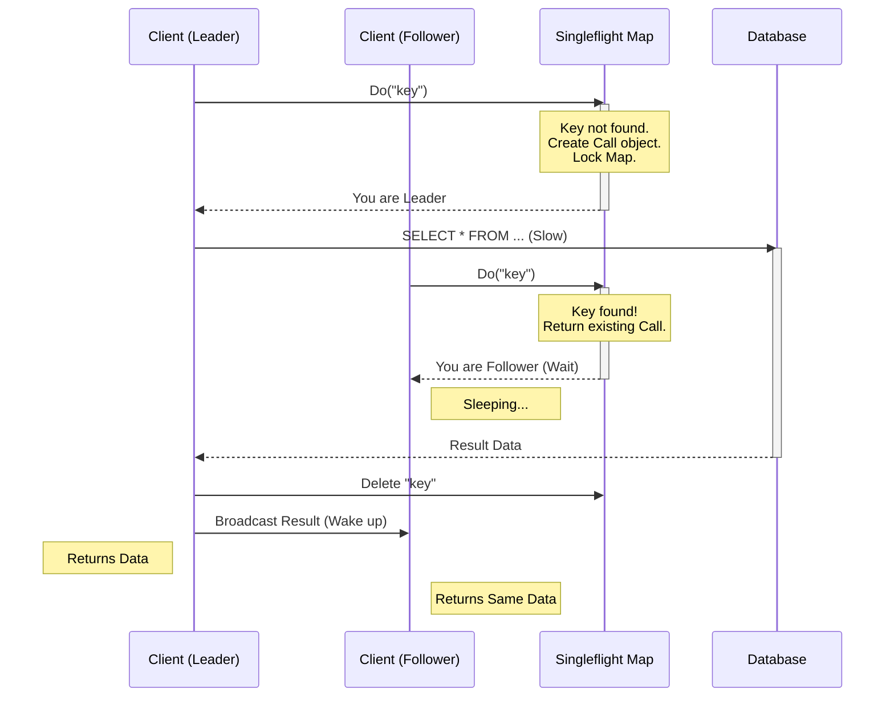

> [!abstract] Эффект 00:00 UTC
> 
> Представьте, что все будильники в городе звонят в одну секунду, и все жители одновременно спускают воду в туалете. Водопроводная система взорвется.
> 
> В IT это происходит, когда:
> 
> 1. Истекает TTL популярного ключа в кэше (**Cache Stampede**).
>     
> 2. Сервис перезагружается, и 100к клиентов делают Reconnect одновременно (**Connection Storm**).
>     
> 3. Планировщик (Cron) запускает тяжелую задачу на 1000 серверах синхронно.
>     
> 
> **Thundering Herd** — это проблема **синхронизации**. Ваша задача как архитектора — внести **хаос** (Jitter) и **порядок** (Coalescing), чтобы размазать нагрузку.

---
## 1. The Physics of the Herd: Why systems die?

> [!abstract] High Load vs. High Concurrency
> Инженеры часто путают **RPS (Throughput)** и **Concurrency (Parallelism)**.
>
> * **High Load (10k RPS):** Если запросы приходят равномерно (каждые 0.1 мс), сервер спокойно обрабатывает их один за другим.
> * **Thundering Herd (10k Concurrent):** Если эти же 10,000 запросов приходят **одновременно** (в одну микросекунду), сервер умирает.
>
> **Физика краха:** При мгновенном всплеске конкуренции система перестает делать полезную работу и начинает тратить 99% CPU на борьбу за ресурсы (Locks, Context Switches, Handshakes). Это называется **Resource Thrashing**.

### 1.1. The Origin Story: Unix Kernel Storm

> [!abstract] Эффект "Голодных Пираний"
> Представьте бассейн, в котором плавают 100 пираний (процессов). Они голодны и ждут еды.
> Вы бросаете в воду **один** маленький кусочек мяса (TCP соединение).
>
> **Логика ядра (до патчей):** Ядро посылает электрический импульс во весь бассейн: "ЕДА!".
> * **Реакция:** Все 100 пираний бросаются в точку падения. Вода кипит.
> * **Результат:** Одна пиранья съедает мясо. Остальные 99, потратив энергию на рывок, возвращаются на места голодными.
>
> В мире CPU эта "кипящая вода" называется **Context Switch Storm** и **Cache Thrashing**.
#### A. The Pre-Fork Architecture (Apache 1.x Era)
Проблема стала очевидной в конце 90-х с ростом интернета.
В то время стандартом был **Pre-fork model** (как в Apache `mpm_prefork` или PHP-FPM).

1.  **Setup:** Сервер запускает N (например, 100) дочерних процессов.
2.  **Sharing:** Все процессы наследуют **один и тот же** слушающий сокет (File Descriptor, например `fd 3`), привязанный к порту 80.
3.  **Blocking:** Все процессы вызывают блокирующий системный вызов `accept(fd 3)` и уходят в сон.
    * Внутри ядра они добавляются в структуру `wait_queue` этого сокета. Статус процесса меняется с `TASK_RUNNING` на `TASK_INTERRUPTIBLE` (Sleep).

#### B. The Anatomy of the Disaster
Что происходит, когда приходит *один* SYN-пакет (клиент хочет соединиться)?

1.  **Interrupt:** Сетевая карта (NIC) дергает CPU прерыванием. Драйвер обрабатывает пакет и завершает TCP Handshake.
2.  **Kernel Wake-up:** Сокет становится "читаемым" (Readable). Ядро вызывает функцию `wake_up_interruptible()` для очереди ожидания этого сокета.
3.  **The Storm (O(N) Wakeup):**
    * Старая реализация ядра проходила по *всему* списку `wait_queue` и будила **все** процессы.
    * 100 процессов помечаются как `TASK_RUNNING`.
    * Планировщик (Scheduler) видит 100 готовых к работе процессов и начинает распихивать их по ядрам CPU.
4.  **The Context Switch Cost:**
    * Процессор должен выгрузить текущие задачи, загрузить регистры и таблицы страниц памяти (TLB) для процесса Apache.
    * **L1/L2 Cache Pollution:** Самое страшное. Пока 100 процессов просыпаются, они вытесняют из кэша процессора полезные данные других программ.
5.  **The Race Condition:**
    * Все 100 процессов выходят из сна внутри функции `accept()`.
    * Они пытаются захватить **Spinlock** сокета, чтобы забрать соединение.
    * **Победитель:** Один процесс забирает соединение, `accept()` возвращает ему новый файловый дескриптор.
    * **Проигравшие:** 99 процессов видят, что очередь соединений пуста. `accept()` возвращает им ошибку `EAGAIN` (или блокируется снова).
6.  **Sleep:** 99 процессов снова делают системный вызов и уходят в сон.

> [!danger] Математика потерь
> Если пробуждение и засыпание одного процесса стоит 10 микросекунд (условно), то для 100 процессов мы тратим **1 миллисекунду** чистого времени CPU впустую.
> При нагрузке 1000 запросов в секунду сервер тратит **100% времени** просто на пробуждение процессов, не обрабатывая ни байта данных.

#### C. The Evolution of the Fix (Как это чинили)
Линукс разработчики боролись с этим годами.

1.  **WQ_FLAG_EXCLUSIVE (Linux 2.6+):**
    * В ядро добавили флаг для элементов очереди ожидания.
    * Теперь `accept()` добавляет процесс в очередь с флагом "Exclusive".
    * Функция пробуждения видит этот флаг: "Разбуди первого, кто Exclusive, и **остановись**". Остальные продолжают спать.
    * *Результат:* Проблема решена для блокирующего `accept()`.

2.  **The Epoll Problem (Nginx/Node.js Era):**
    * С приходом асинхронных серверов (Event Loop) процессы перестали блокироваться на `accept()`. Они стали блокироваться на `epoll_wait()`.
    * *Новая проблема:* Когда сокет становится активным, `epoll` снова будил всех, кто следил за этим сокетом. Thundering Herd вернулся!
    * *Решение Nginx:* Они реализовали **Accept Mutex** в userspace. Воркеры передавали друг другу токен: "Только тот, у кого токен, может добавлять слушающий сокет в epoll". Сложно, но работало.

3.  **EPOLLEXCLUSIVE (Linux 4.5+, 2016 год):**
    * Финальное решение. Теперь можно добавить файловый дескриптор в `epoll` с флагом `EPOLLEXCLUSIVE`.
    * Ядро гарантирует, что при событии будет разбужен только **один** процесс из тех, кто мониторит этот сокет.
    * Nginx и другие серверы удалили свои костыли (Accept Mutex) и стали полагаться на ядро.

#### D. Why it still matters today? (Application Layer Herd)
Хотя ядро Linux теперь умное, мы часто воспроизводим ту же ошибку в коде приложений.

* **Пример на Go/Java:**
    * У вас есть `Condition Variable` (cond var), на которой ждут 1000 горутин/потоков.
    * Вы вызываете `cond.Broadcast()` (разбудить всех) вместо `cond.Signal()` (разбудить одного).
    * **Результат:** Userspace Thundering Herd. Все просыпаются, дерутся за Mutex, один побеждает, остальные спят. CPU горит.

### 1.2. Taxonomy of Modern Herds

> [!abstract] Эффект Синхронизации
> В распределенных системах мы стремимся к **Shared Nothing Architecture** (Архитектура без разделения ресурсов).
> Но в реальности у нас всегда есть точки соприкосновения (Shared Resources): База Данных, Балансировщик, Сетевой Свитч, DNS.
>
> Thundering Herd возникает, когда **независимые** акторы (клиенты/процессы) решают обратиться к **общему** ресурсу в **один и тот же** момент времени.
#### Type A: Cache Stampede (Dogpiling)
*Классический убийца баз данных.*

* **Сценарий:**
    * У вас есть "дорогой" запрос: `SELECT * FROM products ORDER BY rating` (занимает 2 секунды).
    * Результат лежит в Redis с TTL = 60s.
    * Трафик: 1000 RPS.
* **Механика Сбоя (The Kill Chain):**
    1.  **TTL Expiry:** В момент $T=60.00$ ключ исчезает.
    2.  **The Gap:** Следующая запись появится в кэше только в $T=62.00$ (время вычисления).
    3.  **The Rush:** В эти 2 секунды ("окно уязвимости") приходят 2000 запросов.
    4.  **Miss:** Все 2000 видят `nil` в Redis.
    5.  **Stampede:** Все 2000 идут в Postgres с тяжелым запросом.
* **Почему это убивает:**
    * Дело не в пропускной способности сети. Дело в **Context Switching** базы данных.
    * Когда 2000 сессий пытаются выполнить сортировку в памяти одновременно, CPU уходит в полку, и время выполнения запроса растет с 2с до 30с. Очередь накапливается, и БД падает.

#### Type B: Connection Storm (The Handshake Doom)
*Убийца балансировщиков и Auth-сервисов.*

* **Сценарий:**
    * Обрыв связи в дата-центре (BGP flap) или массовый рестарт подов (Rolling Update).
    * 100,000 IoT-устройств или мобильных приложений теряют сокет.
* **Механика Сбоя:**
    1.  **Synchronized Retry:** Клиенты имеют простую логику `while(!connected) { connect(); sleep(1s); }`.
    2.  **The Wave:** Как только сеть поднимается, 100,000 `SYN` пакетов прилетают на Load Balancer (Nginx/HAProxy) одновременно.
    3.  **Crypto Cost:** Проблема не в TCP. Проблема в **TLS Handshake**.
        * Установить TCP соединение дешево.
        * Выполнить асимметричную криптографию (RSA/ECDSA key exchange) — очень дорого.
    4.  **CPU Saturation:** CPU балансировщика взлетает до 100%. Он начинает отбрасывать новые рукопожатия.
    5.  **Feedback Loop:** Отвергнутые клиенты уходят в `sleep(1s)` и приходят снова через секунду, усиливая волну.

> [!danger] The Auth Bottleneck
> Часто Connection Storm превращается в **Auth Storm**. Даже если балансировщик выжил, 100,000 клиентов тут же шлют токен на проверку. Сервис аутентификации (обычно Redis или JWT verification) ложится под нагрузкой, которую он никогда не видел в штатном режиме.

#### Type C: Cron Storm (The Artificial DDoS)
*Убийца внутренней инфраструктуры.*

* **Сценарий:**
    * Инфраструктура из 5000 серверов.
    * Везде стоит `daily_backup.sh` или агент безопасности, настроенный на запуск в `00:00`.
    * NTP (Network Time Protocol) работает идеально, синхронизируя часы с точностью до миллисекунд.
* **Механика Сбоя:**
    1.  **Zero Hour:** Ровно в 00:00:00.000 срабатывают триггеры на 5000 машинах.
    2.  **Shared Resource:** Все 5000 машин начинают резолвить DNS (`backup.internal`) или заливать файлы в S3.
    3.  **TCP Incast:** Свитчи (Network Switches) имеют ограниченные буферы. Когда 5000 портов начинают лить трафик в один Uplink (ведущий к S3), буфер переполняется за микросекунды. Пакеты дропаются.
    4.  **Global Outage:** Из-за перегрузки DNS или сети начинают падать *другие*, критически важные сервисы, которые вообще не связаны с бэкапами.

#### Type D: Event-Driven Lag (The Consumer Flood)
*Новый тип, специфичный для микросервисов.*

* **Сценарий:**
    * Вы остановили консьюмеры Kafka на час для багфикса.
    * В очереди накопилось 10 миллионов сообщений (Lag).
    * Вы запускаете консьюмеры.
* **Механика Сбоя:**
    1.  Консьюмеры пытаются "догнать" очередь, читая с максимальной скоростью (например, 50k msg/sec вместо обычных 1k msg/sec).
    2.  Каждое сообщение порождает вызов к стороннему API или БД.
    3.  **Downstream Death:** Сервисы, стоящие *после* консьюмера, не рассчитаны на х50 нагрузку. Они падают.
    4.  Консьюмеры начинают фейлиться и уходят в бесконечные ретраи, забивая DLQ (Dead Letter Queue).

### 1.3. Metastable Failures (Точка невозврата)

> [!abstract] Ловушка Гистерезиса
> В физике **стабильная система** возвращается в равновесие после снятия возмущения.
> **Метастабильная система** имеет два устойчивых состояния:
> 1.  **High Throughput / Low Latency:** (Нормальная работа).
> 2.  **Zero Throughput / High Latency:** (Кома).
>
> **Суть кошмара:** Thundering Herd — это триггер, который переталкивает систему из состояния 1 в состояние 2.
> Самое страшное: **система остается в состоянии 2, даже если всплеск нагрузки прошел.** Нагрузка возвращается к норме, но система продолжает лежать. Это называется **Гистерезис**.
#### A. The Feedback Loop Mechanics (Механика Петли)
Почему система не поднимается сама? Потому что в метастабильном состоянии **стоимость восстановления** создает новую нагрузку, которая удерживает систему на дне.

Рассмотрим это на примере **Timeout-Retry Loop**:

1.  **Stable State:** Сервер обрабатывает запрос за 100мс. Клиентский таймаут — 1с. Все счастливы.
2.  **The Trigger (Herd):** Пришел всплеск. Очередь переполнилась. Время обработки выросло до 1.5с.
3.  **The Feedback (Amplification):**
    * Клиент ждет 1с, получает Timeout и отваливается.
    * **Wasted Work:** Сервер *продолжает* обрабатывать этот запрос еще 0.5с, сжигая CPU впустую (результат отправить некому).
    * **Retry:** Клиент тут же шлет *повторный* запрос.
4.  **The Trap:**
    * Теперь сервер обрабатывает 2 запроса (старый мертвый + новый живой).
    * Нагрузка удвоилась. Latency вырос до 3с.
    * Теперь *все* запросы падают по таймауту.
    * **Результат:** 100% CPU Usage, 0% полезной работы (Goodput). Даже если исходный всплеск уйдет, ретраи от "обычного" трафика будут держать сервер в этом состоянии вечно.

#### B. Goodput vs. Throughput (Иллюзия работы)
Критически важное различие для диагностики.

* **Throughput (Пропускная способность):** Сколько бит/запросов сервер перемалывает (включая ошибки, ретраи, работу впустую).
* **Goodput (Полезная производительность):** Сколько успешных ответов получает клиент.

Во время метастабильного отказа вы видите на графиках:
* **Throughput:** Максимальный (Сервер работает на износ!).
* **CPU:** 100%.
* **Goodput:** 0 (Клиенты не получают ничего).

Это классический признак **Death Spiral**.
#### C. Common Metastable Scenarios
Где еще прячется эта ловушка?

1.  **GC Death Spiral (Java/Go/Python):**
    * Нагрузка растет $\to$ Растет выделение памяти.
    * Память кончается $\to$ GC запускается чаще и на дольше.
    * GC ест 50% CPU $\to$ Запросы обрабатываются медленнее.
    * Запросы копятся в очереди $\to$ Очередь занимает еще больше памяти.
    * GC запускается непрерывно (GC Thrashing). Система встала.
2.  **Cold Cache Trap:**
    * Система работает только потому, что кэш горячий (Hit Ratio 99%).
    * Рестарт (сброс кэша) $\to$ БД не вывозит нагрузку.
    * БД тормозит $\to$ Кэш не успевает наполняться (timeout при записи).
    * Кэш остается холодным $\to$ БД продолжает лежать.
3.  **Connection Storm overhead:**
    * Сервер аутентификации может проверить 10k токенов в секунду.
    * Но если приходят 20k соединений, он тратит 80% CPU на TLS Handshake.
    * На проверку токенов остается 20% CPU (2k токенов).
    * Очередь растет.

#### D. The Only Way Out (Как выйти?)
Вы не можете "починить" метастабильный сбой, просто добавляя ресурсы или ожидая. Вы должны **разорвать петлю**.

1.  **Load Shedding (Сброс нагрузки):**
    * Искусственно отбрасывать 90% трафика (вернуть 503 мгновенно).
    * Это даст серверу передышку, чтобы разгрести очередь, завершить GC или прогреть кэш.
    * Медленно повышать трафик (Throttling).
2.  **Restart with Backoff:**
    * Если вы рестартуете серверы, убедитесь, что клиенты имеют **Exponential Backoff**. Если они придут мгновенно после рестарта, вы снова уйдете в штопор.
3.  **Circuit Breaker:**
    * Автоматический выключатель, который размыкается при росте ошибок, давая системе "остыть".

> [!check] Архитектурный вывод
> Если ваша система зависит от кэша для выживания (т.е. БД не держит 100% трафика без кэша) — она **метастабильна по определению**.
> Вы должны иметь "План Б" (например, кнопку "Включить агрессивный троттлинг"), потому что однажды кэш упадет.

### 1.4. Summary: The Contention Equation

> [!abstract] Парадокс Масштабируемости
> Интуиция говорит: "Если один сервер держит 1000 запросов, то два сервера выдержат 2000".
> Реальность (при Thundering Herd): "Два сервера выдержат 1500. А десять серверов выдержат 500".
>
> Это называется **Retrograde Scalability** (Отрицательная масштабируемость).
> Чем больше нагрузка, тем меньше *полезной* работы делает система, потому что вся энергия уходит на координацию (Coherency).
#### A. The Formula: Universal Scalability Law (Gunther's Law)
Модель, разработанная доктором Нилом Гюнтером, описывает пропускную способность $C(N)$ в зависимости от конкурентности $N$:

$$C(N) = \frac{N}{1 + \alpha(N-1) + \beta N(N-1)}$$

Где:
* **$N$ (Concurrency):** Количество одновременных пользователей или процессов.
* **$\alpha$ (Alpha): Contention (Конкуренция).**
    * Это **очереди**. Часть работы, которая не может быть распараллелена (закон Амдала).
    * *Пример:* Ожидание блокировки БД (Row Lock) или единственного потока записи в лог.
    * *Влияние:* Линейное замедление. Кривая просто выполаживается.
* **$\beta$ (Beta): Coherency (Согласованность).**
    * Это **коммуникация**. Затраты на то, чтобы все участники договорились о состоянии данных. Это Crosstalk.
    * *Пример:* Проверка валидности кэша в распределенной системе, CPU Cache Coherency, TLS Handshake negotiation.
    * *Влияние:* **Квадратичное падение ($N^2$).** Это и есть убийца.

#### B. The Physics of the Crash
Как Thundering Herd влияет на переменные уравнения?

1.  **Normal State (Low N):**
    * $\alpha \approx 0, \beta \approx 0$.
    * Рост линейный. Добавили ядро — получили скорость.
2.  **High Load ($\alpha$ dominates):**
    * Очереди растут. Мы упираемся в бутылочное горлышко (например, пропускную способность диска).
    * Производительность перестает расти ("Diminishing returns"), но система **стабильна**.
3.  **Thundering Herd ($\beta$ explodes):**
    * В момент шторма (Cache Stampede) все 1000 процессов начинают бороться за одни и те же ресурсы.
    * Количество взаимодействий растет как $N(N-1)$.
    * Вместо того чтобы работать, процессоры занимаются **Cache Thrashing** (перекидыванием кэш-линий между ядрами) или ожиданием спинлоков.
    * **Результат:** График загибается вниз. Добавление нагрузки *снижает* пропускную способность.

#### C. Real World Analogy: The Kitchen
Представьте кухню ресторана.

* **Linear ($N=1 \to 2$):** Один повар жарит котлеты. Добавляем второго. Производительность х2.
* **Contention ($\alpha$, $N=5$):** У нас 5 поваров, но только **один нож**.
    * Повара стоят в очереди за ножом. Производительность растет, но медленно. Это $\alpha$.
* **Coherency ($\beta$, Thundering Herd, $N=20$):**
    * В кухню набилось 20 поваров. Ножей хватает.
    * Но они постоянно сталкиваются локтями, кричат друг другу "Осторожно!", роняют кастрюли и тратят 90% времени на то, чтобы не врезаться друг в друга.
    * В итоге 20 поваров готовят **меньше** еды, чем 2 повара. Это $\beta$.

#### D. Architect’s Takeaway (Как это лечить?)
Вы не можете изменить математику, но вы можете изменить архитектуру, чтобы уменьшить коэффициенты.

| Коэффициент | Источник проблемы | Решение (Mitigation) |
| :--- | :--- | :--- |
| **High $\alpha$** (Очереди) | Shared Resources (DB, Disk, Mutex) | **Sharding:** Разбить ресурс на части, чтобы уменьшить длину очереди к каждому куску. |
| **High $\beta$** (Хаос) | Thundering Herd, Cache Coherence | **Shared Nothing:** Архитектура, где воркерам не нужно общаться друг с другом. **Jitter:** Рассинхронизация запросов, чтобы снизить мгновенное $N$. |

> [!check] Golden Rule
> Если ваша система демонстрирует **Retrograde Scalability** (падает под нагрузкой), значит, у вас проблема с **Coherency ($\beta$)**.
> Ищите места, где все процессы пытаются обновить одну и ту же область памяти или одну строку в БД одновременно.

---
## 2. Strategy A: Request Coalescing (Queueing / Singleflight)

> [!abstract] Принцип "Одного Гонца"
> **Request Coalescing** (также известно как *Request Collapsing*, *Deduplication* или *Thundering Herd Protection*) — это техника объединения множества идентичных входящих запросов в один исходящий.
>
> **Математика выгоды:**
> Если 10,000 пользователей одновременно запрашивают `/product/123`:
> * **Без Coalescing:** БД получает 10,000 SQL-запросов. Нагрузка $O(N)$.
> * **С Coalescing:** БД получает **1** SQL-запрос. Нагрузка $O(1)$.
>
> Это превращает шторм в легкий бриз.
### 2.1. The Mechanics: Leader & Followers

> [!abstract] Паттерн "Строительный Барьер"
> Представьте, что 100 человек бегут к обрыву (запрос к БД).
>
> 1.  **Leader (Первый):** Подбегает к краю, видит, что моста нет. Он начинает строить мост.
> 2.  **Followers (Остальные 99):** Подбегают, видят, что Первый уже работает. Они не прыгают в пропасть. Они останавливаются и **ждут** (паркуются), глядя на спину Первого.
> 3.  **Barrier Release:** Как только Первый кладет последнюю доску, барьер падает. Все 100 человек перебегают мост одновременно (получают результат).
>
> Технически это: **Mutex** (для защиты карты) + **WaitGroup/Future** (для ожидания) + **Atomic Reference** (для результата).
#### A. Internal Architecture (Anatomy of a Flight)
Чтобы реализовать это, нам нужны две сущности в памяти процесса:

1.  **The Registry (`Group`):**
    * Это потокобезопасная карта: `map[key]*Call`.
    * Она хранит *текущие* выполняющиеся запросы.
    * Защищена глобальным `Mutex`.
2.  **The Call (`Promise` / `Future`):**
    * Это объект, который представляет собой *один конкретный полет* за данными.
    * Содержит:
        * `WaitGroup` (или канал): примитив синхронизации, на котором висят Фолловеры.
        * `val`: результат работы (данные).
        * `err`: ошибка (если БД упала).
        * `dups`: счетчик дубликатов (сколько Фолловеров мы собрали).

#### B. The Lifecycle of a Coalesced Request
Разберем по тактам (на примере Go/Java семантики):

**Phase 1: Registration (Critical Section)**
* Приходят 100 потоков. Все входят в критическую секцию (Lock Registry Mutex).
* **Поток 1 (Leader):**
    * Проверяет карту: ключа `product:123` нет.
    * Создает объект `Call` (инкрементирует WaitGroup +1).
    * Кладет `Call` в карту.
    * Отпускает Mutex Реестра.
    * **Статус:** Идет выполнять работу.
* **Потоки 2..100 (Followers):**
    * Входят под Lock.
    * Проверяют карту: ключ `product:123` есть!
    * Берут ссылку на существующий `Call`.
    * Отпускает Mutex Реестра (чтобы не блокировать другие ключи).
    * **Статус:** Вызывают `Call.WaitGroup.Wait()` и засыпают (Park).

**Phase 2: Execution (The Gap)**
* В этот момент работает **только Поток 1**.
* Остальные 99 потоков спят и не потребляют CPU (кроме памяти на стек).
* Если Поток 1 работает 500мс, все 99 потоков добавляют 500мс к своему Latency.

**Phase 3: Completion & Broadcast**
* **Поток 1** получает данные из БД.
* Он сохраняет данные в поле `Call.val`.
* **The Atomic Switch:** Он удаляет ключ `product:123` из Реестра (под локом). Это важно сделать *до* пробуждения остальных, чтобы новые запросы (101-й) начали новый цикл.
* **Release:** Поток 1 вызывает `Call.WaitGroup.Done()`.

**Phase 4: Wake Up**
* Планировщик ОС видит, что событие ожидания завершилось.
* Все 99 Фолловеров просыпаются.
* Они читают `Call.val` (теперь это безопасно, так как есть "Happens Before" гарантия через WaitGroup).
* Все возвращают данные клиенту.

#### C. Visual Flow (Mermaid)


#### D. Crucial Nuance: "Forgetting"

Что делать, если мы хотим кэшировать "шторм", но не хотим кэшировать результат навечно внутри Singleflight?
- Стандартный `Singleflight` удаляет ключ из карты **сразу после завершения**.
- Это означает, что если через 1 микросекунду придет 101-й запрос, он снова станет Лидером и пойдет в БД.
- **Forget Method:** Иногда нам нужно удалить ключ _раньше_, чем закончится запрос (например, если мы хотим запустить фоновое обновление). Но в 99% случаев автоматическое удаление — это то, что нужно.

> [!danger] Panic Propagation (Риск Паники) Что произойдет, если Лидер "паникует" (бросает Runtime Exception, Segmentation Fault)?
> 
> - **Naive implementation:** Лидер умирает, `WaitGroup` никогда не открывается. Фолловеры висят вечно (Memory Leak + Hang).
>     
> - **Robust implementation (Go):** `defer` перехватывает панику Лидера, записывает её в `Call.panicError`, открывает `WaitGroup` и **ре-паникует** во всех Фолловерах.
>     
> - **Урок:** Убедитесь, что ваша библиотека Singleflight умеет корректно транслировать панику/исключения, иначе один баг в коде "Лидера" положит весь кластер по цепочке.
>

### 2.2. The Local vs. Distributed Gap

> [!abstract] Проблема Масштаба (The Multiplier Effect)
> Локальный Singleflight работает в памяти **одного** процесса. Он ничего не знает о других репликах вашего сервиса.
>
> **Математика Сбоя:**
> * `R` = Количество реплик (подов/серверов).
> * `N` = Количество входящих запросов.
>
> 1.  **No Protection:** Нагрузка на БД = $N$. (50,000 RPS $\to$ 50,000 DB Ops).
> 2.  **Local Coalescing:** Нагрузка на БД = $R$. (500 подов $\to$ 500 DB Ops).
> 3.  **Distributed Coalescing:** Нагрузка на БД = $1$. (Весь кластер $\to$ 1 DB Op).
>
> **Вывод:** Local Coalescing спасает от *локального* всплеска, но Distributed Coalescing спасает от *архитектурного* масштаба.
#### A. In-Process Coalescing (Local Strategy)
Это то, что делают библиотеки типа `golang.org/x/sync/singleflight`, `Caffeine` (Java) или `DataLoader` (Node.js).

* **Механизм:** Использует примитивы синхронизации ОС (Mutex/Semaphores) внутри RAM.
* **Скорость:** Наносекунды. Оверхед нулевой.
* **Изоляция:** Каждый под защищает себя сам.
* **Blind Spot (Слепая зона):** Если кэш холодный во всем кластере, то при рестарте (Rolling Update) каждый новый поднявшийся под пойдет в БД за "горячими" данными. Если подов много, это создает **Micro-Stampede**.

#### B. Infrastructure Coalescing (Collapsed Forwarding)
Это решение на уровне инфраструктуры, часто называемое **Collapsed Forwarding** в терминологии CDN и Varnish.

* **Где живет:**
    * **Layer 7 Load Balancers:** Nginx (`proxy_cache_lock`), Varnish, HAProxy.
    * **CDN:** Cloudflare, Akamai (Request Collapsing).
    * **Redis/Memcached:** Через распределенные блокировки.
* **Механизм (Nginx Example):**
    1.  Nginx получает 1000 запросов к `/api/heavy-report`.
    2.  Он видит, что этого ключа нет в кэше.
    3.  Он пропускает **только один** запрос к бэкенду.
    4.  Остальные 999 соединений "паркуются" на уровне Nginx.
    5.  Когда бэкенд отвечает, Nginx отдает результат всем 1000 клиентам и кладет его в кэш.
* **Trade-off:** Вносит задержку (Latency). Клиенты ждут на балансировщике. Это Single Point of Failure для логики слияния.
#### C. The Hybrid Approach: Consistent Hashing
Как получить эффективность Distributed Coalescing со скоростью Local Coalescing?
**Ответ:** Умный роутинг.

Если мы гарантируем, что **все** запросы за ключом `product:123` всегда приходят на **один и тот же под** (Pod A), то локальный Singleflight на Поде А автоматически становится глобальным.

* **Техника:** Используйте Consistent Hashing на Load Balancer (например, `hash $request_uri consistent` в Nginx) или Sharding в Kafka.
* **Результат:**
    * Нагрузка на БД = 1 (так как работает только Под А).
    * Нет нужды в распределенных блокировках (Redis Lock).
    * Нет лишних сетевых хопов.

#### D. Comparison Matrix

| Характеристика | Local Coalescing | Distributed Coalescing (Lock-based) | Collapsed Forwarding (LB/CDN) | Consistent Hashing Routing |
| :--- | :--- | :--- | :--- | :--- |
| **Сложность внедрения** | Низкая (Библиотека) | Высокая (Нужен Redis/ZooKeeper) | Средняя (Конфиг Nginx) | Средняя (Конфиг LB) |
| **Нагрузка на БД** | $O(Replicas)$ | $O(1)$ | $O(1)$ | $O(1)$ |
| **Latency Penalty** | 0 ms | Network RTT (Lock acquisition) | 0 ms (но нагрузка на CPU LB) | Возможно неравномерное распределение нагрузки (Hot Spots) |
| **Отказоустойчивость** | Высокая (Изоляция) | Низкая (Зависит от Lock Service) | Высокая | Средняя (Перебалансировка при падении пода) |

> [!check] Expert Recommendation
> 1.  **Всегда** включайте **Local Singleflight** в коде. Это бесплатно и защищает от локальных штормов.
> 2.  Если $R$ (кол-во реплик) < 20, локального слияния обычно достаточно. База выдержит 20 параллельных запросов.
> 3.  Если $R$ > 100 или запрос *экстремально* тяжелый (генерация PDF, транскодинг видео) — используйте **Collapsed Forwarding** на Nginx/CDN или переходите на **Consistent Hashing**.

### 2.3. The Danger Zone: Head-of-Line Blocking

> [!danger] Принцип "Разделенной Судьбы" (Shared Fate)
> Включая Singleflight, вы переходите от модели "Каждый сам за себя" к модели "Один за всех".
>
> **Head-of-Line (HOL) Blocking** здесь проявляется так: если Лидер (первый запрос) замедляется, зависает или падает, страдают **все** подписчики.
> * **Latency Spike:** Если Лидер ловит GC pause или сетевой лаг, все 1000 клиентов видят лаг.
> * **Cascading Error:** Если Лидер получает `Connection Refused`, все 1000 клиентов получают ошибку мгновенно.
> * **Deadlock:** Если Лидер зависает навечно, вы получаете утечку горутин размером во весь входящий трафик.
#### A. Scenario 1: The Infinite Hang (The Black Hole)
Самый страшный сценарий для памяти.

* **Ситуация:** Лидер делает запрос в БД. Сеть "моргнула", пакеты потерялись, но TCP-соединение осталось открытым (нет `RST`).
* **Ошибка:** В коде Лидера **нет таймаута** на запрос к БД.
* **Результат:**
    1.  Лидер висит в ожидании ответа бесконечно.
    2.  Фолловеры (10,000 шт) висят на `WaitGroup.Wait()`, ожидая Лидера.
    3.  Клиенты (браузеры) начинают отваливаться по своему таймауту, но **на сервере горутины продолжают висеть**.
    4.  **OOM (Out Of Memory):** Каждая висящая горутина держит стек (2-8KB) + буферы сокета. Память кончается, процесс падает.

> [!check] Решение: Hard Timeouts
> Внутри замыкания `singleflight.Do` **всегда** создавайте новый контекст с жестким таймаутом.
> Не надейтесь на дефолтные настройки драйвера БД.
> `ctx, cancel := context.WithTimeout(parent, 2*time.Second)`

#### B. Scenario 2: The Abandoned Leader (Context Cancellation)
Классический баг в Go.

* **Ситуация:**
    1.  Пользователь А (Лидер) запрашивает тяжелый отчет.
    2.  Пользователи Б, В, Г (Фолловеры) запрашивают тот же отчет и ждут.
    3.  Пользователь А передумал и закрыл вкладку браузера / нажал "Отмена".
* **Механика сбоя:**
    * Веб-сервер отменяет `http.Request.Context` пользователя А.
    * Если вы передали этот контекст напрямую в БД, запрос к БД отменяется (`context canceled`).
    * **Катастрофа:** Singleflight видит, что Лидер завершился с ошибкой. Он возвращает эту ошибку (`context canceled`) **всем** Фолловерам (Б, В, Г), хотя они не отменяли свои запросы!
* **Результат:** Невинные пользователи получают 500-ку или обрыв связи просто потому, что какой-то "левый" человек закрыл браузер.

> [!tip] Решение: Context Shielding (Detached Context)
> Лидер должен выполнять работу в **независимом** контексте (или контексте с отдельным таймаутом), но не в контексте входящего HTTP-запроса.
> Если Лидер уходит (Client Disconnect), работа должна продолжиться для Фолловеров.
> *В Go:* `context.WithoutCancel(ctx)` (Go 1.21+) или создание нового `context.Background()`.

#### C. Scenario 3: Panic Propagation
Что если Лидер — камикадзе?

* **Ситуация:** В коде, который выполняется внутри `Do`, есть баг, вызывающий `panic` (или Unchecked Exception в Java).
* **Naive Singleflight:**
    * Поток Лидера падает. Стек разматывается.
    * Если библиотека не перехватывает панику, `mutex` реестра может остаться заблокированным навсегда.
    * Или `WaitGroup` никогда не сделает `Done()`.
* **Результат:** Фолловеры зависают навечно (Deadlock). Новые запросы не могут зайти в секцию (если Mutex не отпущен).

> [!check] Решение: Panic Recovery
> Production-ready реализация Singleflight обязана оборачивать вызов функции в `defer/recover`.
> Если Лидер паникует:
> 1.  Перехватить панику.
> 2.  Сохранить Stack Trace как ошибку.
> 3.  Разблокировать Фолловеров.
> 4.  **Ре-паниковать** (по желанию) или вернуть ошибку всем.

#### D. Visualizing the "Shielded" Pattern
Как правильно писать код, чтобы избежать проблемы "Брошенного Лидера".

```go
func SafeGet(w http.ResponseWriter, r *http.Request, key string) {
    // 1. Context клиента (может быть отменен клиентом)
    clientCtx := r.Context()

    // 2. Singleflight
    v, err, shared := g.Do(key, func() (interface{}, error) {
        // --- CRITICAL ZONE ---
        // НЕ ИСПОЛЬЗУЙТЕ clientCtx здесь напрямую для запроса в БД!
        // Если ClientA уйдет, он убьет запрос для всех остальных.
        
        // Создаем "Щит". Этот контекст живет, пока жива работа,
        // независимо от капризов клиента.
        // Но наследуем значения (trace id) из clientCtx если нужно.
        dbCtx, cancel := context.WithTimeout(context.Background(), 5*time.Second)
        defer cancel()
        
        return database.Query(dbCtx, key)
        // --- END ZONE ---
    })

    // 3. Обработка результата
    // А вот ждать результата мы должны с учетом clientCtx.
    // Если клиент ушел, пока мы ждали - выходим.
    select {
    case <-clientCtx.Done():
        // Клиент ушел. Нам все равно, что там с Singleflight.
        return 
    default:
        if err != nil {
            http.Error(w, err.Error(), 500)
            return
        }
        json.NewEncoder(w).Encode(v)
    }
}
```
### Summary Checklist: Is your Singleflight safe?

|**Риск**|**Симптом**|**Решение**|
|---|---|---|
|**Hangs**|Утечка горутин, OOM|**Hard Timeout** внутри `Do()`|
|**Abandoned Leader**|Ошибки `context canceled` у других юзеров|**Context Decoupling** (Background Context)|
|**Panic**|Deadlock, зависшие запросы|**Panic Recovery** внутри библиотеки|
|**Slow Leader**|Высокий p99 для всех|Мониторинг времени выполнения внутри `Do()`|
### 2.4. Implementation: Production-Grade 

> [!abstract] Beyond "Hello World"
> Стандартный пример из документации Go (`v, err, _ := g.Do(...)`) опасен для продакшена.
>
> **Требования к Production-Grade реализации:**
> 1.  **Type Safety:** Мы не хотим делать `v.(MyStruct)` и ловить панику `interface conversion` в рантайме. Используем Generics.
> 2.  **Context Shielding:** Мы должны отвязать жизненный цикл запроса к БД от капризов HTTP-клиента.
> 3.  **Observability:** Мы должны знать `Coalescing Ratio` — насколько эффективно мы "сжимаем" трафик.

#### A. The Generic Wrapper (Type Safety)
С появлением Go 1.18+ мы можем написать типизированную обертку. Это предотвращает ошибки приведения типов и делает код чистым.

Вместо:
```go
val, _ := g.Do("key", func() (interface{}, error) { return User{}, nil })
user := val.(User) // Unsafe!
```
Мы хотим:
``` Go
user, err := group.Do(ctx, "key", fetchUserFn) // Returns (User, error)
```
#### B. The "Detached Context" Pattern

Как обсуждалось в Разделе 2.3, если мы передадим `ctx` входящего запроса внутрь `Do`, то отмена запроса Лидером убьет работу для всех Фолловеров.

Мы должны использовать технику **Context Detaching**.
Мы создаем новый контекст, который:
1. **Игнорирует отмену** родительского контекста.
2. Но **наследует значения** (Values) родительского контекста (Trace ID, Logger).
3. Имеет свой собственный, жесткий таймаут для работы с БД.
#### C. The Ultimate Go Implementation
Вот готовый к использованию компонент.
``` Go
package coalescing

import (
	"context"
	"fmt"
	"time"
	"golang.org/x/sync/singleflight"
)

// Group - типизированная обертка над singleflight
type Group[T any] struct {
	sf singleflight.Group
	// Метрики (интерфейс для Prometheus/StatsD)
	metrics MetricsRecorder 
}

func NewGroup[T any](m MetricsRecorder) *Group[T] {
	return &Group[T]{metrics: m}
}

// Do выполняет дедупликацию вызовов
func (g *Group[T]) Do(
	reqCtx context.Context, 
	key string, 
	fn func(ctx context.Context) (T, error),
) (T, error) {
	
	// 1. Вызов singleflight
	v, err, shared := g.sf.Do(key, func() (interface{}, error) {
		// --- CRITICAL SECTION (Выполняется 1 раз) ---
		
		// 2. Context Shielding
		// Создаем независимый контекст для БД.
		// TraceID из reqCtx перенесется (если использовать правильные провайдеры),
		// но Cancel от reqCtx НЕ повлияет на dbCtx.
		// Важно: context.WithoutCancel появился в Go 1.21
		detachedCtx := context.WithoutCancel(reqCtx)
		
		// 3. Hard Timeout
		// Защита от зависания БД.
		dbCtx, cancel := context.WithTimeout(detachedCtx, 5*time.Second)
		defer cancel()

		return fn(dbCtx)
		// --- END CRITICAL SECTION ---
	})

	// 4. Observability
	if shared {
		g.metrics.IncShared(key) // Мы сэкономили этот вызов!
	} else {
		g.metrics.IncExecuted(key) // Этот вызов реально пошел в БД
	}

	// 5. Type Safety & Error Handling
	if err != nil {
		var zero T
		return zero, err
	}

	// Безопасное приведение типа благодаря Generics
	return v.(T), nil
}
```

#### D. Integration with Cache (Read-Through)

Singleflight сам по себе — не кэш. Он не хранит данные дольше времени выполнения запроса.
Обычно он используется как "Gatekeeper" перед кэшем.
**Паттерн:** `GetFromCache` -> `Miss` -> `Singleflight` -> `GetFromDB` -> `SetCache`.

``` Go
func GetUser(ctx context.Context, id string) (User, error) {
    // 1. Try Cache
    if u, ok := cache.Get(id); ok {
        return u, nil
    }

    // 2. Cache Miss -> Singleflight Guard
    // Если 1000 запросов пришли сюда, только 1 пройдет внутрь.
    return userGroup.Do(ctx, id, func(dbCtx context.Context) (User, error) {
        // 3. Database Fetch
        u, err := db.FetchUser(dbCtx, id)
        if err != nil {
            return User{}, err
        }
        
        // 4. Populate Cache (TTL 1 min)
        // Делаем это внутри Do, чтобы Фолловеры получили данные
        // и в следующий раз уже нашли их в кэше.
        cache.Set(id, u, time.Minute)
        
        return u, nil
    })
}
```

#### E. Java Alternative (Caffeine)

В экосистеме Java/JVM стандарт де-факто — библиотека **Caffeine**.
Она реализует `Singleflight` (Coalescing) автоматически внутри метода `get()`.
``` Java
// LoadingCache автоматически делает Request Coalescing для одного ключа
LoadingCache<String, User> cache = Caffeine.newBuilder()
    .refreshAfterWrite(1, TimeUnit.MINUTES)
    .build(key -> {
        // Этот код выполняется атомарно для ключа 'key'.
        // Если 100 потоков вызовут cache.get(key), 
        // 99 заблокируются здесь, пока 1 загружает данные.
        return db.fetchUser(key); 
    });

// Usage
User u = cache.get("user_123"); // Thread-safe & Coalesced
```

> [!check] Expert Checklist
> 
> Перед деплоем проверьте:
> 
> 1. **Timeout:** Есть ли жесткий таймаут внутри замыкания `Do`? (Иначе OOM).
>     
> 2. **Generics:** Используете ли вы типизированную обертку? (Иначе Panic).
>     
> 3. **Metrics:** Видите ли вы график `Singleflight Savings %`?
>     
>     - Формула: $\frac{TotalRequests - RealDBExecutions}{TotalRequests} \times 100\%$.
>         
>     - Если этот % близок к 0 во время инцидента, значит, ключи слишком уникальны (плохой ключ шардирования), и Singleflight бесполезен.
>
### 2.5. Alternatives in Other Stacks

| **Язык/Технология** | **Инструмент**              | **Описание**                                                                                                                          |
| ------------------- | --------------------------- | ------------------------------------------------------------------------------------------------------------------------------------- |
| **Java / JVM**      | `Caffeine` / `LoadingCache` | Метод `get(key)` автоматически блокирует другие потоки, запрашивающие тот же ключ, пока первый загружает его. Это атомарная операция. |
| **Node.js**         | `DataLoader`                | Стандарт для GraphQL. Собирает запросы в рамках одного Event Loop тика и делает Batch Request (или Single Request).                   |
| **Nginx**           | `proxy_cache_lock`          | Если включено, только один запрос идет на upstream, остальные ждут записи в кэш.                                                      |
| **Redis**           | `LOCK` / `PubSub`           | Можно реализовать распределенный Singleflight: первый берет Lock, остальные подписываются на канал ответа. (Сложно, но мощно).        |

> [!check] Архитектурное правило
> 
> Используйте **Request Coalescing** для любых _дорогих_ и _идемпотентных_ операций чтения (GET).
> 
> Никогда не используйте его для `POST/PUT` или быстрых операций (где накладные расходы на синхронизацию выше самой работы).

---
## 3. Strategy B: Pre-warming & Probabilistic Expiration

> [!abstract] Философия "Вечного Кэша"
> 
> **Request Coalescing (Singleflight):** Снижает нагрузку на БД, но заставляет первых пользователей ждать (Latency Spike).
> 
> **Pre-warming:** Устраняет ожидание полностью. Пользователь всегда получает данные из памяти (0ms latency).
> 
> **Суть:** Мы разделяем понятие **"Срок жизни данных"** (Freshness) и **"Срок хранения данных"** (Availability). Данные могут быть "протухшими" (Stale), но доступными, пока мы их обновляем в фоне.

### 3.1. Probabilistic Early Recomputation (PER / X-Fetch)

> [!abstract] Упреждающий Удар (The Pre-emptive Strike)
> Традиционный подход к кэшированию бинарен: данные либо "свежие", либо "мертвые". Это создает обрыв (Cliff), с которого падают все клиенты одновременно.
>
> **PER** превращает этот обрыв в пологий спуск.
> Мы не ждем смерти ключа. Мы нанимаем "добровольца" из потока текущих читателей, чтобы он обновил ключ *незадолго* до смерти.
>
> **Магия:** Выбор добровольца происходит без координации, без общения между серверами и без блокировок. Только математика.
#### A. The Mathematical Foundation (Vattani's Formula)
Алгоритм основан на том, что вероятность обновления должна расти экспоненциально по мере приближения к концу TTL.

Мы запускаем пересчет (Refresh), если выполняется неравенство:

$$Time_{now} - (Expiry - Gap) \ge 0$$

Где $Gap$ (интервал упреждения) рассчитывается для *каждого* запроса индивидуально:

$$Gap = \Delta \cdot \beta \cdot \ln\left(\frac{1}{rand()}\right)$$

Или в более привычном виде условия "Осталось ли мало времени?":

$$TTL_{remaining} < \Delta \cdot \beta \cdot (-\ln(rand()))$$

#### B. Decoding the Variables (Что есть что?)

1.  **$\Delta$ (Delta): Время пересчета**
    * *Смысл:* Сколько времени займет поход в БД для генерации этого значения?
    * *Значение:* Например, 200 мс (`0.2s`).
    * *Важность:* Если вы укажете слишком мало (1 мс), алгоритм сработает слишком поздно, и ключ успеет протухнуть. Если слишком много (10с) — вы будете обновлять кэш слишком часто.
    * *Best Practice:* Храните `delta` прямо внутри значения кэша (замеряйте время при каждой генерации).

2.  **$\beta$ (Beta): Коэффициент агрессивности**
    * *Смысл:* Настройка вероятности.
    * *Значение:* Обычно `1.0`.
    * `Beta < 1.0`: Экономим ресурсы, рискуем получить Miss (Cache Stampede).
    * `Beta > 1.0`: Параноидальный режим. Обновляем сильно заранее, нагружаем БД, но гарантируем отсутствие миссов.

3.  **$rand()$: Генератор Хаоса**
    * *Смысл:* Случайное число в диапазоне $(0, 1]$.
    * *Функция $-\ln(rand())$:* Это генератор **экспоненциального распределения**.
    * *Как это работает:*
        * В 99% случаев `rand` выдаст число, при котором $-\ln(rand)$ будет маленьким (например, 0.5). $Gap$ будет маленьким. Условие не сработает.
        * В редких случаях `rand` будет очень близок к 0 (например, 0.01). $-\ln(0.01) \approx 4.6$. $Gap$ станет огромным.
        * Именно этот редкий случай заставит *одного* рандомного клиента подумать: "Ого, до конца осталось мало времени (с учетом моего огромного Gap), пора обновлять!".

#### C. The Execution Flow (Алгоритм работы клиента)

Представим, что у ключа TTL = 60с, $\Delta$ = 1с, $\beta$ = 1.

1.  **T=10s (Далеко от конца):**
    * Приходит запрос. Осталось 50с.
    * Генерируем `rand()`. Допустим, 0.5. Gap = $1 \cdot 1 \cdot 0.69 = 0.69s$.
    * $50s < 0.69s$? **False**.
    * **Действие:** Отдаем данные из кэша.

2.  **T=58s (Опасная зона):**
    * Приходят 100 запросов. Осталось 2с.
    * Для 99 клиентов `rand()` выпадает обычный. Gap $\approx$ 0.5...1.5с.
    * $2s < 1.5s$? **False**. Они читают старые данные.
    * Для **одного** клиента (Счастливчика) выпадает `rand() = 0.05`.
    * Gap = $1 \cdot 1 \cdot 2.99 = 3s$.
    * $2s < 3s$? **True!**
    * **Действие (Volunteer):**
        1.  Этот клиент *игнорирует* данные из кэша (или использует их, но запускает задачу).
        2.  Идет в БД.
        3.  Записывает новое значение в Redis с TTL=60с.
    * **Результат:** Кэш обновлен на T=58s. Stampede предотвращен.

#### D. Implementation Example (Python)
Реализация, которую можно использовать как декоратор или middleware.

```python
import time
import random
import math

# Структура данных в Redis:
# {
#   "v": "payload", 
#   "d": 0.250,       # Delta: время, затраченное на создание (сек)
#   "e": 1718000000   # Expiry: Hard TTL timestamp
# }

def get_with_per(redis, key, factory_func, beta=1.0):
    """
    factory_func: функция, которая идет в БД и возвращает (value, execution_time)
    """
    
    # 1. Читаем кэш
    cached = redis.get(key)
    
    # Cache Miss (PER не спас, ключ уже умер или его не было)
    if not cached:
        return _fetch_and_cache(redis, key, factory_func)
    
    data = json.loads(cached)
    value = data['v']
    delta = data['d']   # Время генерации прошлого значения
    expiry = data['e']  # Когда ключ умрет физически
    
    now = time.time()
    time_left = expiry - now
    
    # 2. Hard Expiry Check (на случай рассинхрона часов или если PER не сработал)
    if time_left <= 0:
        return _fetch_and_cache(redis, key, factory_func)
    
    # 3. PER Algorithm Check
    # Используем random(), дающий float [0.0, 1.0)
    # Защита от log(0): добавляем epsilon или берем диапазон (0, 1]
    r = random.random()
    if r == 0: r = 0.00001
    
    gap = delta * beta * (-math.log(r))
    
    if time_left < gap:
        # 4. Мы стали Добровольцем!
        # Опционально: можно использовать 'soft lock' в Redis, 
        # чтобы другие добровольцы в эту же секунду не делали то же самое.
        # Но PER статистически уже минимизирует коллизии.
        
        # Log: print(f"PER Triggered for {key}. Left: {time_left:.4f}, Gap: {gap:.4f}")
        return _fetch_and_cache(redis, key, factory_func)
        
    # 5. Возвращаем "старые" данные (Stale but Valid)
    return value

def _fetch_and_cache(redis, key, factory_func):
    start = time.time()
    new_val = factory_func()
    duration = time.time() - start
    
    # Устанавливаем Hard TTL = 60s
    hard_ttl = 60
    payload = {
        "v": new_val,
        "d": duration, # Сохраняем реальную длительность для следующего PER
        "e": start + hard_ttl
    }
    
    redis.set(key, json.dumps(payload), ex=hard_ttl)
    return new_val
```

> [!tip] Архитектурный нюанс: Lock-free Прелесть PER в том, что нам **не нужны** распределенные блокировки (`SETNX`). Даже если нагрузка огромна, и в момент "T=58s" условие сработает у 3-х клиентов одновременно — это 3 запроса к БД, а не 10,000. Это "Good Enough" для High Load систем, и это намного быстрее, чем возиться с Redlock.
### 3.2. Logical vs. Hard TTL (The "Stale-While-Revalidate" Pattern)

> [!abstract] Иллюзия Мгновенности
> В классическом кэшировании: `TTL истек` $\to$ `Данные удалены` $\to$ `User waits`.
> В паттерне SWR: `TTL истек` $\to$ `Данные помечены как Stale` $\to$ `User gets Stale` $\to$ `Server updates`.
>
> **Суть:** Мы полностью разрываем связь между **временем ответа пользователю** и **временем генерации данных**.
> * **Availability:** 100% (данные всегда в памяти).
> * **Latency:** 0ms (чтение из RAM).
> * **Freshness:** Eventual Consistency (отставание на время пересчета).
#### A. The Data Structure (Anatomy of a Key)
Чтобы это работало, Redis не должен управлять жизненным циклом данных через нативный `EXPIRE` (или он должен быть очень большим). Логика переезжает в `value` (payload).

**Пример хранения (JSON):**
```json
{
  "payload": { "price": 100, "stock": 50 },
  "logical_ttl": 1710000000,  // Soft Deadline: когда данные считаются "несвежими"
  "hard_ttl": 1710003600      // Hard Deadline: (опционально) когда данные становятся опасными и их нельзя отдавать
}
```
- **Native Redis TTL:** Ставим `Infinity` (или `Logical TTL + 1 day`), чтобы ключ не исчез физически.
#### B. The Algorithm: Hit, Stale, Refresh
Как ведет себя система при чтении:
1. **Hit:** Клиент читает ключ. Он _всегда_ существует.
2. **Check:** Клиент проверяет: $Time_{now} > logical\_ttl$?
3. **Fast Path (Valid):** Если `False` — отдаем данные. Задержка минимальна.
4. **Slow Path (Stale):** Если `True` — данные протухли.
    - **Step 1:** Немедленно отдаем пользователю _старые_ данные. **Latency = 0ms.**
    - **Step 2:** Запускаем процесс обновления (Revalidation).
#### C. The Hidden Trap: Background Stampede
Вот где 90% разработчиков совершают ошибку.
Если 10,000 пользователей одновременно прочитали "протухший" ключ:
- Все 10,000 получили ответ мгновенно (Ура!).
- Все 10,000 увидели, что ключ протух.
- Все 10,000 запустили **фоновую задачу** на обновление.
- **Результат:** Ваша очередь задач (Celery/Kafka) или пул горутин взрывается. Вы убили бэкенд фоновой нагрузкой.

**Решение: Debouncing (Locking)**
Нужен механизм координации, чтобы обновлять кэш начал только _один_ поток.
1. Видим, что ключ протух.
2. Пытаемся взять **Non-blocking lock** (например, `SETNX update_lock:key 1 EX 10`).
3. **Успех (Lock Acquired):** Я — избранный. Я запускаю пересчет в фоне.
4. **Неудача (Lock Busy):** Кто-то уже обновляет. Я просто отдаю старые данные и ничего не делаю.
#### D. Implementation: Go (Background Goroutine with Debounce)

В Go это реализуется идеально, так как мы можем запустить `go func()` без накладных расходов.

``` Go
type CacheItem struct {
    Data       string `json:"data"`
    LogicalTTL int64  `json:"l_ttl"`
}

func GetWithSWR(ctx context.Context, redisClient *redis.Client, key string) (string, error) {
    // 1. Always Hit (данные всегда есть, если система прогрета)
    val, err := redisClient.Get(ctx, key).Result()
    if err == redis.Nil {
        // Cold start case: приходится ждать
        return computeAndCache(ctx, key) 
    } else if err != nil {
        return "", err
    }

    var item CacheItem
    json.Unmarshal([]byte(val), &item)

    // 2. Freshness Check
    if time.Now().Unix() > item.LogicalTTL {
        // 3. Stale detected!
        // Пытаемся захватить право на обновление.
        // Lock key живет 10 секунд (достаточно для обновления).
        lockKey := "lock:" + key
        acquired, _ := redisClient.SetNX(ctx, lockKey, "1", 10*time.Second).Result()
        
        if acquired {
            // 4. Background Update (Fire and Forget)
            // Запускаем в отдельной горутине, не блокируя пользователя
            go func() {
                // Создаем Detached Context, чтобы работа не прервалась
                bgCtx := context.Background()
                newValue := computeHeavyData(bgCtx)
                
                newItem := CacheItem{
                    Data:       newValue,
                    LogicalTTL: time.Now().Add(1 * time.Minute).Unix(),
                }
                serialized, _ := json.Marshal(newItem)
                
                // Сохраняем данные и удаляем лок (хотя TTL лока сам истечет)
                redisClient.Set(bgCtx, key, serialized, 0) // TTL 0 = infinite
                redisClient.Del(bgCtx, lockKey)
            }()
        }
    }

    // 5. Return Stale Data Immediately
    return item.Data, nil
}
```
#### E. Applicability Matrix (Где это использовать?)

|**Use Case**|**Подходит для SWR?**|**Почему?**|
|---|---|---|
|**Product Pricing**|✅ Да|Цена меняется редко. Если юзер увидит старую цену на 5 сек дольше — не страшно (валидация будет в корзине).|
|**News Feed**|✅ Да|Идеально. Мгновенная загрузка ленты. Новые посты подтянутся при следующем рефреше.|
|**Dashboard / Analytics**|✅ Да|Тяжелые запросы. Юзер лучше увидит отчет 5-минутной давности сразу, чем будет ждать 30 сек.|
|**User Balance**|❌ **НЕТ**|Критично. Нельзя показать, что денег нет, если они есть. Требует Strong Consistency.|
|**Feature Flags**|✅ Да|Флаги раскатки фич можно кэшировать с SWR на 30-60 сек.|

> [!info] HTTP Standard
> 
> Этот паттерн настолько популярен, что он стандартизирован в RFC 5861 для заголовка `Cache-Control`.
> 
> `Cache-Control: max-age=60, stale-while-revalidate=300`
> 
> Это говорит CDN и браузерам: "Считай данные свежими 60 секунд. С 60-й по 360-ю секунду можешь отдавать протухшее, но в фоне сделай запрос к серверу за новым".

### 3.3. Implementation: Python PER Wrapper

> [!abstract] Эволюция через Измерение
> Самая большая ошибка при реализации PER — пытаться угадать параметр $\Delta$ (время, необходимое на пересчет).
> * Если вы угадаете слишком мало: PER сработает поздно, и ключ протухнет.
> * Если слишком много: PER будет срабатывать слишком часто, перегружая БД.
>
> **Правильный подход:** Мы храним $\Delta$ *внутри* самого кэша.
> Каждый раз, когда мы обновляем значение, мы замеряем `duration` и сохраняем его вместе с данными.
> Таким образом, вероятность пересчета автоматически адаптируется к текущей производительности вашей БД.
#### A. The Data Schema (Storage Format)
Чтобы алгоритм работал, в Redis мы храним не "голую" строку, а конверт (Envelope).
Используем JSON для наглядности (в проде лучше `msgpack` или `protobuf` для компактности).

```json
{
  "v": "Payload Data...",  // Полезная нагрузка
  "e": 1715000000.0,       // Hard Expiry (Timestamp)
  "d": 0.245               // Delta: Сколько секунд заняла генерация этого значения в прошлый раз
}
```
#### B. The Production Code

Ниже представлена реализация, готовая к вставке в ваш `utils.py`. Она обрабатывает граничные случаи (деление на ноль, отсутствие данных) и реализует самоадаптацию.

``` Python
import time
import json
import math
import random
import logging
from typing import Callable, Any, Optional

# Настройка логгера
logger = logging.getLogger(__name__)

class PERCache:
    def __init__(self, redis_client, default_delta: float = 1.0, beta: float = 1.0):
        self.redis = redis_client
        self.default_delta = default_delta # Если данных нет, считаем, что запрос долгий
        self.beta = beta

    def get(self, key: str, fetch_func: Callable[[], Any], ttl: int) -> Any:
        """
        Retrieves data using Probabilistic Early Recomputation.
        
        :param key: Redis key
        :param fetch_func: Функция без аргументов, возвращающая данные (Heavy operation)
        :param ttl: Время жизни кэша (секунды)
        """
        
        # 1. Читаем сырые данные
        raw_data = self.redis.get(key)
        
        # Scenario A: Cold Start (Кэша нет вообще)
        if raw_data is None:
            logger.info(f"Cache miss for {key}. Fetching synchronous.")
            return self._fetch_and_save(key, fetch_func, ttl, self.default_delta)

        try:
            payload = json.loads(raw_data)
            value = payload['v']
            expiry = payload['e']
            last_delta = payload.get('d', self.default_delta)
        except (KeyError, json.JSONDecodeError):
            # Если формат битый - считаем это промахом
            return self._fetch_and_save(key, fetch_func, ttl, self.default_delta)

        now = time.time()
        time_left = expiry - now

        # Scenario B: Hard Expiry (Кто-то удалил TTL, но не данные, или PER не сработал)
        if time_left <= 0:
            logger.warning(f"Hard expiry hit for {key}. Blocking fetch.")
            return self._fetch_and_save(key, fetch_func, ttl, last_delta)

        # Scenario C: The PER Calculation
        # Генерируем "силу" нашего желания обновить кэш.
        # random() -> [0.0, 1.0). Защита от log(0).
        r = random.random()
        if r == 0: r = 0.00001
        
        # Формула Ваттани: Gap растет экспоненциально при малых r
        gap = last_delta * self.beta * (-math.log(r))
        
        if time_left < gap:
            logger.info(f"PER Triggered for {key}. TimeLeft: {time_left:.3f}s < Gap: {gap:.3f}s")
            
            # Мы - избранный (Volunteer).
            # Мы обновляем кэш ПРЯМО СЕЙЧАС (Synchronous Refresh).
            # Почему синхронно? Чтобы гарантировать, что к моменту Hard Expiry данные будут.
            # Старые данные мы игнорируем (или отдаем, если fetch упадет - зависит от логики)
            try:
                return self._fetch_and_save(key, fetch_func, ttl, last_delta)
            except Exception as e:
                logger.error(f"PER refresh failed: {e}. Serving stale data.")
                return value # Fallback to Stale
        
        # Scenario D: Cache Hit (Мы в безопасности)
        return value

    def _fetch_and_save(self, key: str, fetch_func: Callable, ttl: int, old_delta: float) -> Any:
        start_time = time.time()
        
        # --- HEAVY LIFTING ---
        new_value = fetch_func()
        # ---------------------
        
        duration = time.time() - start_time
        
        # Adaptive Delta Smoothing (Скользящее среднее)
        # Не доверяем одному замеру на 100%. 
        # Если вдруг был GC pause, мы не хотим, чтобы delta стала огромной навсегда.
        # NewDelta = 80% OldDelta + 20% CurrentDuration
        new_delta = (old_delta * 0.8) + (duration * 0.2)
        
        # Payload
        payload = {
            "v": new_value,
            "e": start_time + ttl, # Hard Expiry
            "d": new_delta         # Self-learned parameter
        }
        
        # Atomic Write
        # Используем set(ex=ttl), чтобы Redis сам удалил мусор, если мы перестанем читать
        self.redis.set(key, json.dumps(payload), ex=ttl)
        
        return new_value
```
#### C. Why Synchronous Refresh?
Вы можете спросить: _"Зачем мы блокируем клиента в строке `_fetch_and_save`? Разве мы не должны делать это в фоне?"_
Это ключевое отличие **PER** от **Stale-While-Revalidate**:
1. **SWR (Background):** Оптимизирует _Latency_. Клиент всегда получает ответ мгновенно, но рискует получить старые данные. Риск "Background Stampede" (очередь задач забивается).
2. **PER (Synchronous):** Оптимизирует _Consistency_ и _Safety_.
    - "Доброволец" платит цену за обновление (ждет ответа БД).
    - Взамен он **гарантирует**, что кэш будет свежим для следующих 1000 клиентов.
    - Благодаря вероятностной природе, "доброволец" выбирается _до_ того, как кэш протухнет полностью.
    - Если волонтер упадет с ошибкой, следующий "бросок костей" выберет нового волонтера через миллисекунду.
#### D. Integration Tip (Decorators)
В Python коде это удобнее всего использовать как декоратор:
``` Python
cache_manager = PERCache(redis_client)

@per_cache(cache_manager, key_pattern="user:{user_id}", ttl=60)
def get_user_profile(user_id):
    # Этот код будет вызван только при Cold Start 
    # или если PER решит, что пора обновляться
    return db.query("SELECT ... WHERE id = ?", user_id)
```

> [!check] Архитектурная заметка Этот код идеально работает в **многопоточной** среде (Gunicorn threads) и в **распределенной** среде (Kubernetes pods). Ему не нужна координация. Если 3 пода одновременно решат обновить ключ (редкое событие) — это 3 запроса к БД. Это приемлемая цена за отсутствие сложных распределенных блокировок (Redlock).
### 3.4. Comparison Matrix: When to use what?

| **Характеристика** | **Strategy A: Singleflight (Coalescing)** | **Strategy B1: PER (Probabilistic)**                | **Strategy B2: Logical TTL (Background)**  |
| ------------------ | ----------------------------------------- | --------------------------------------------------- | ------------------------------------------ |
| **User Latency**   | **High** (при протухании все ждут БД)     | **Low** (почти всегда Hit, редкий счастливчик ждет) | **Zero** (всегда Hit, обновление в фоне)   |
| **Consistency**    | **Strong** (все видят новые данные сразу) | **Eventual** (есть окно старых данных)              | **Eventual** (старые данные отдаются явно) |
| **Implementation** | Middleware / Library                      | Сложная логика на клиенте                           | Требует Queue/Worker infrastructure        |
| **Infrastructure** | Minimal                                   | Minimal                                             | Requires Async Workers                     |
| **Best for...**    | Строгие требования к свежести данных      | High Load Read-Heavy (News, Products)               | Аналитика, Дашборды, Медленные отчеты      |

> [!check] Архитектурный совет
> 
> **Комбинируйте стратегии.**
> 
> Используйте **Singleflight** как защиту последнего рубежа (если кэш все-таки протух или Redis упал).
> 
> Используйте **PER** или **Logical TTL** как основной механизм работы, чтобы максимизировать Hit Ratio и минимизировать Latency.
> 
> _Идеальный стек:_ Nginx (Cache Lock) $\to$ App (PER) $\to$ Singleflight $\to$ DB.

---
## 4. Strategy C: Jitter (De-synchronization)

> [!abstract] Философия "Организованного Хаоса" (Entropy Injection)
> В природе системы стремятся к синхронизации (эффект маятников Гюйгенса).
> В IT это приводит к катастрофе:
> 1.  Если 10,000 клиентов получили ошибку в 12:00:00.
> 2.  И у всех стоит "умный" Backoff в 1 секунду.
> 3.  То в 12:00:01 они ударят снова. Вместе.
>
> **Jitter (Джиттер)** — это намеренное внесение энтропии (шума) в тайминги системы. Мы превращаем "пики" нагрузки (Spikes) в "плато" (Noise), которое система может переварить.
### 4.1. The Physics of Synchronization (Почему они сбиваются в стаи?)

> [!abstract] Эффект "Марширующих Солдат"
> В 1831 году Бротонский подвесной мост в Англии обрушился из-за того, что по нему маршировал отряд солдат. Частота их шагов совпала с собственной частотой колебаний моста (**Резонанс**).
>
> В IT происходит то же самое:
> * **Солдаты:** Ваши клиенты/микросервисы.
> * **Мост:** База данных или Load Balancer.
> * **Шаг:** Цикл `Request -> Error -> Sleep -> Retry`.
>
> Проблема в том, что в компьютерных системах "солдаты" начинают маршировать в ногу **самопроизвольно**. Сбой — это команда "Смирно!", после которой начинается синхронный марш.
#### A. The Alignment Mechanism (Как рождается "Стадо")
Рассмотрим анатомию возникновения синхронизации.

**Состояние 1: Хаос (Норма)**
* У вас 10,000 клиентов.
* Они делают запросы асинхронно. Распределение нагрузки во времени — **Uniform Distribution** (Равномерное).
* Сервер видит ровный поток: 100 RPS.

**Состояние 2: The Great Filter (Сбой)**
* Происходит кратковременный сбой (Network Blip, Deploy, Leader Election).
* Длительность: 500мс.
* За эти 500мс сервер отвергает (или не отвечает) 50 запросов.
* **Ключевой момент:** Все эти 50 клиентов получили ошибку/таймаут **практически одновременно** (в окне 500мс).

**Состояние 3: The Lockstep (Синхронный марш)**
* У всех клиентов одинаковый конфиг: `retry_interval = 1000ms`.
* В момент $T_{crash} + 1000ms$ все 50 клиентов приходят снова. **Вместе.**
* Они образуют **Импульс** (Spike).
* Если сервер не может обработать 50 запросов мгновенно, он снова отвергает их (или часть).
* Группа неудачников уходит спать еще на 1000мс.
* **Результат:** Вместо ровного потока мы получаем пульсирующую нагрузку (Pulse Wave).

#### B. Constructive Interference (Почему волна растет?)
В физике волн есть понятие **Конструктивной Интерференции**: когда пики двух волн совпадают, их амплитуда складывается.

В распределенных системах это работает так:
1.  У нас уже есть пульсирующая группа А (50 клиентов).
2.  При следующем ударе они перегружают сервер чуть сильнее, чем раньше.
3.  Из-за перегрузки сервер начинает тормозить и для "обычных" (новых) клиентов.
4.  Новые клиенты получают таймаут и **присоединяются** к пульсирующей группе А.
5.  Группа растет: 50 $\to$ 100 $\to$ 500.
6.  **Global Synchronization:** В итоге все 10,000 клиентов начинают бить в сервер синхронно. Нагрузка в пике превышает емкость сервера в 100 раз, хотя *средняя* нагрузка может быть низкой.

> [!danger] The Dirac Delta Function
> Математически вы превращаете нагрузку из константы $f(t) = C$ в серию дельта-функций Дирака:
> $$L(t) = \sum \delta(t - k \cdot T)$$
> Ни один сервер не рассчитан на бесконечную мгновенную нагрузку, даже если паузы между ударами длинные.

#### C. The Huygens Effect (Spontaneous Synchronization)
В 1665 году Христиан Гюйгенс заметил, что два маятниковых часа, висящих на одной балке, со временем начинают тикать синхронно (в противофазе).
**Причина:** Микровибрации общей балки передают энергию между часами.

**В IT:**
* Ваши сервисы — это "часы".
* Общая база данных — это "балка".
* Когда БД тормозит (из-за чьего-то тяжелого запроса), она замедляет ответы *всем* клиентам.
* Это заставляет разные клиенты завершать свои циклы (получать ответы или таймауты) **одновременно**.
* **Вывод:** Общий ресурс сам по себе выступает синхронизатором. Система *стремится* к самосинхронизации (Mode Locking). Единственный способ разорвать эту связь — внести хаос (Jitter).

#### D. Visual Analogy: The Traffic Jam
Представьте пробку на светофоре.
1.  **Красный свет (Сбой):** Останавливает поток машин. Машины накапливаются.
2.  **Зеленый свет (Восстановление):**
    * Если бы машины стартовали мгновенно и одновременно (как TCP пакеты), они бы врезались друг в друга.
    * В жизни есть задержка реакции водителя (естественный Jitter).
    * В IT, если убрать Jitter, "машины" (пакеты) стартуют одновременно и забивают канал (Incast Congestion).

> [!check] Архитектурный урок
> Детерминизм в обработке ошибок — это уязвимость.
> Если ваша логика ретраев выглядит как `wait(const)`, вы строите систему, которая **усиливает** любой сбой.
> Вы должны добавить энтропию: `wait(const + random)`.

### 4.2. Retry Strategies: Evolution of Algorithms

> [!abstract] Битва за "Work Conservation"
> Цель алгоритма ретраев — максимизировать **Work Conservation** (сохранение полезной работы).
> * Если мы ретраим слишком агрессивно $\to$ Мы перегружаем сервер и не делаем полезной работы.
> * Если мы ретраим слишком редко $\to$ Мы увеличиваем Latency для пользователя.
>
> **Эволюция:**
> `Naive` (DDoS) $\to$ `Constant` (Synchronized) $\to$ `Exponential` (Spaced) $\to$ `Jitter` (Randomized).
#### Level 0: The Spin Loop (No Backoff)
Самый примитивный и опасный подход.

$$Wait = 0$$

* **Код:** `while(!success) { try(); }`
* **Физика:** Вы превращаете свой клиент в генератор нагрузки для DDoS-атаки.
* **Результат:** CPU клиента и сервера уходит в 100% за секунды. Это "Brownout" (падение напряжения) системы.

#### Level 1: Constant Backoff (The Metronome)
Попытка дать серверу передышку.

$$Wait(i) = C$$

* **Пример:** `sleep(1000ms)` после каждой ошибки.
* **Проблема (Clustering):** Это не решает проблему синхронизации (см. Раздел 4.1).
* **Сценарий:** Если в 12:00:00 упала база данных, и 1000 запросов ушли в ошибку, то ровно в 12:00:01 они вернутся. Вы создали **стоячую волну** нагрузки.

#### Level 2: Exponential Backoff (The Standard)
Стандарт де-факто в TCP и Ethernet (CSMA/CD).

$$Wait(i) = \min(Cap, Base \cdot 2^i)$$

* **Переменные:**
    * $i$: Номер попытки (0, 1, 2...).
    * $Base$: Базовая задержка (например, 100ms).
    * $Cap$: Максимальная задержка (например, 10s), чтобы не ждать годами.
* **Ряд:** 100ms, 200ms, 400ms, 800ms...
* **Анализ:**
    * Это быстро снижает *среднюю* нагрузку на систему (Rate Limiting).
    * **Фатальный недостаток:** Это **детерминированный** алгоритм. Если 1000 клиентов начали цикл одновременно, они будут приходить одновременно на 1-й, 2-й и 3-й попытке. Пики нагрузки становятся реже, но их амплитуда остается убийственной.

#### Level 3: Full Jitter (The AWS Solution)
Алгоритм, популяризированный Марком Брукером (AWS). Мы добавляем случайность в *каждый* шаг.

$$Wait(i) = rand(0, \min(Cap, Base \cdot 2^i))$$

* **Логика:** Мы вычисляем экспоненциальный потолок, а затем выбираем *случайное* число от 0 до этого потолка.
* **Ряд (Пример):**
    * Попытка 1 (max 100): `rand(0, 100)` $\to$ 34ms.
    * Попытка 2 (max 200): `rand(0, 200)` $\to$ 156ms.
    * Попытка 3 (max 400): `rand(0, 400)` $\to$ 12ms.
* **Почему это работает:**
    * Это превращает "пики" (Spikes) в "шум" (Noise).
    * Сервер получает запросы равномерно размазанными по времени.
    * **Контринтуитивно:** Иногда мы ждем меньше (12ms на 3-й попытке), чем раньше. Но статистически это дает наилучшую пропускную способность кластера.

#### Level 4: Decorrelated Jitter (The "Contention" Solution)
Используется в системах с экстремально высокой конкуренцией (например, шина I2C или высоконагруженный API). Предложен Netflix/Google.

$$Wait(i) = \min(Cap, rand(Base, LastSleep \cdot 3))$$

* **Суть:** Мы забываем номер попытки $i$. Мы отталкиваемся только от *предыдущей* задержки.
* **Эффект:** Это создает **случайное блуждание** (Random Walk).
* **Сравнение:**
    * *Exponential:* Все клиенты увеличивают задержку синхронно.
    * *Decorrelated:* Каждый клиент получает уникальную траекторию задержек. Один может быстро вырасти до Cap, другой будет колебаться внизу. Это максимально "перемешивает" клиентов, не давая им ни малейшего шанса совпасть по фазе.

#### Level 5: Equal Jitter (The Compromise)
Если вы боитесь, что `Full Jitter` выдаст `0ms` (слишком быстрый ретрай), используйте гибрид.

$$Wait(i) = \frac{Ceiling}{2} + rand\left(0, \frac{Ceiling}{2}\right)$$
где $Ceiling = \min(Cap, Base \cdot 2^i)$.

* **Логика:** Мы гарантируем минимум 50% от экспоненты, а остальные 50% — рандом.
* **Пример (max 200):** $100 + rand(0, 100)$ $\to$ от 100ms до 200ms.

---
### Comparison Matrix: Which one to choose?

| Алгоритм | Нагрузка (Calls) | Время завершения (Latency) | Нагрузка на сервер (Concurrency) | Вердикт |
| :--- | :--- | :--- | :--- | :--- |
| **Exponential** | Низкая | Среднее | **Высокая (Spikes)** | ❌ Избегать в High Load |
| **Full Jitter** | Средняя | **Минимальное** | Низкая (Constant) | ✅ **Золотой стандарт** |
| **Equal Jitter** | Низкая | Среднее | Низкая | ✅ Для БД с жесткими локами |
| **Decorrelated** | Вариативная | Высокое | **Минимальная** | ✅ Для фоновых задач и IoT |

> [!check] Expert Code Snippet (Go)
> Не пишите велосипеды. Используйте правильную формулу.
>
> ```go
> // Full Jitter implementation
> func GetWaitTime(attempt int, base int, cap int) int {
>     // 1. Вычисляем экспоненциальный потолок
>     // Bit shifting is faster than Math.Pow
>     ceil := base << attempt 
>     
>     // 2. Clamping (ограничение сверху)
>     if ceil > cap {
>         ceil = cap
>     }
>     
>     // 3. Jitter Injection
>     // rand.Intn(n) returns [0, n)
>     return rand.Intn(ceil + 1)
> }
> ```

### 4.3. Server-Side Jitter (Cron Staggering)
### 4.3. Server-Side Jitter: Breaking the Synchronization Gridlock [Deep Dive]

> [!abstract] Эффект "00:00 UTC"
> Если у вас есть 5000 серверов, и на каждом настроен бэкап в полночь, то в 00:00:00 ваша сеть превращается в тыкву.
>
> **Проблема:**
> 1.  **NTP:** Благодаря точной синхронизации времени, разброс запуска составляет менее 10мс.
> 2.  **Shared Resource:** Все 5000 серверов одновременно резолвят DNS (`s3.aws.com`), открывают TCP-сессии и начинают лить трафик.
> 3.  **Microburst:** Буферы свитчей переполняются мгновенно. Пакеты дропаются. API провайдера возвращает `429 Too Many Requests`.
>
> **Server-Side Jitter** — это искусство искусственного размазывания (Smearing) запланированных задач по временному окну.


#### A. The Strategies: Random vs. Deterministic
Есть два пути внедрения хаоса. Выбор зависит от того, насколько вы любите читать логи.

**1. Random Staggering (Просто, но грязно)**
Мы просто спим случайное время перед стартом.
* **Код:** `sleep $(($RANDOM % 600)) && /bin/backup.sh`
* **Плюс:** Очень легко внедрить.
* **Минус (Debug Hell):** Вчера бэкап начался в 00:05, сегодня в 00:09. Если бэкап влияет на производительность (грузит диск), вы увидите просадку метрик в *разное* время каждый день. Это затрудняет корреляцию инцидентов.

**2. Deterministic Staggering (Выбор Архитектора)**
Мы вычисляем задержку на основе неизменного атрибута сервера (Hostname, IP, UUID).
* **Формула:** $$Delay = Hash(Hostname) \pmod{WindowSize}$$
* **Механика:** Сервер `db-01` *всегда* ждет 143 секунды. Сервер `db-02` *всегда* ждет 12 секунд.
* **Плюс:**
    * **Стабильность:** График нагрузки одинаковый каждый день.
    * **Отладка:** Вы точно знаете, когда ждать старта задачи на конкретной машине.
    * **Равномерность:** Хеш-функция (например, MD5/FNV) гарантирует идеальное равномерное распределение, в отличие от плохого `rand()` в Bash.

#### B. Implementation: The Layers of Defense

**Layer 1: Modern Linux (Systemd Timers)**
Забудьте про старый `cron`. Systemd имеет нативную поддержку джиттера, которая работает на уровне планировщика ОС.

```ini
# /etc/systemd/system/maintenance.timer
[Unit]
Description=Daily Maintenance with Jitter

[Timer]
OnCalendar=daily
# Самая важная директива:
# Задача запустится между 00:00 и 01:00 (равномерное распределение)
RandomizedDelaySec=3600
# Сохраняет состояние, если сервер был выключен (run immediately on boot if missed)
Persistent=true

[Install]
WantedBy=timers.target
```
**Layer 2: Kubernetes (CronJob Wrapper)** Kubernetes `CronJob` **не имеет** встроенного поля `jitter`. Если вы запустите 1000 подов по расписанию `0 0 * * *`, вы убьете мастер-ноду или API сервер.

Вам нужен Entrypoint-скрипт с детерминированным джиттером:
``` Bash
#!/bin/sh
# k8s-jitter-entrypoint.sh

# 1. Определяем окно джиттера (по умолчанию 600 сек)
WINDOW=${JITTER_WINDOW:-600}

# 2. Вычисляем хэш от имени пода (HOSTNAME в k8s всегда уникален для StatefulSet)
# Или используем UID пода.
# cksum возвращает "CRC32 BYTE_COUNT", берем первое поле.
DELAY=$(echo "$HOSTNAME" | cksum | cut -f1 -d' ')

# 3. Нормализуем по модулю окна
WAIT_TIME=$((DELAY % WINDOW))

echo "Jitter: Sleeping for ${WAIT_TIME}s (derived from host $HOSTNAME)..."
sleep $WAIT_TIME

# 4. Запускаем реальную команду
exec "$@"
```
**Layer 3: Application Polling (Phase Shift)** Если у вас 100k мобильных клиентов опрашивают сервер конфигов каждые 10 минут.
- **Плохо:** `Timer(interval=600s)` стартует при запуске приложения. Если сервер рестартанул, все клиенты реконнектятся и сбрасывают таймер на 0. Теперь они синхронизированы.
- **Хорошо:** `Interval = BaseInterval + rand(-10%, +10%)`.
- **Архитектурный трюк (Global Smear):**
    - Сервер может сам возвращать клиенту время следующего опроса в заголовке: `Retry-After: 642`.
    - Сервер вычисляет это время так, чтобы заполнить "провалы" в графике своей нагрузки (Load Balacing over Time).
#### C. Code Example: Python Deterministic Jitter
Функция для использования в ваших скриптах автоматизации.
``` Python
import hashlib
import socket
import time
import logging

def sleep_deterministic(window_seconds: int, salt: str = "backup"):
    """
    Спит уникальное для этого хоста время.
    salt: позволяет разным задачам на одном хосте иметь разное смещение.
    """
    hostname = socket.gethostname()
    # Комбинируем хостнейм и соль задачи
    unique_id = f"{hostname}:{salt}".encode('utf-8')
    
    # Считаем SHA256 и берем первые байты как число
    hex_digest = hashlib.sha256(unique_id).hexdigest()
    # Преобразуем хекс в int
    hash_int = int(hex_digest, 16)
    
    # Модульная арифметика
    delay = hash_int % window_seconds
    
    logging.info(f"Deterministic Jitter: {hostname} will sleep for {delay}s (Window: {window_seconds}s)")
    time.sleep(delay)

if __name__ == "__main__":
    # Разбросать запуск в течение 10 минут (600 сек)
    sleep_deterministic(600, salt="daily_report")
    # ... run logic ...
```
#### D. War Game: The "Microburst" Reality
Почему это важно даже для малых окон?
Представьте, что вы отправляете метрики в Prometheus/Datadog каждые 15 секунд (`*/15 * * * *`).
- **Без джиттера:** Каждые 15 секунд (00, 15, 30, 45) сетевой интерфейс получает ударную нагрузку.
- **С джиттером:** Вы используете `Sleep(Hash % 15)`.
- **Результат:** Вместо 4 "стен" трафика в минуту вы получаете ровную линию ("White Noise").
- **Бонус:** Это снижает вероятность коллизий пакетов в Ethernet (CSMA/CD остался в прошлом, но переполнение буферов свитчей — реальность).

> [!check] Архитектурное правило Любая периодическая задача (`interval < 1h`) должна иметь джиттер `±10-20%` от интервала. Любая задача по расписанию (`cron`) должна иметь джиттер, равный `Window / N`, где N — ожидаемое количество одновременных задач, которое может выдержать бэкенд.

### 4.4. Implementation Examples

#### A. Go: Decorrelated Jitter Implementation
```go
package backoff

import (
	"math/rand"
	"time"
)

type Backoff struct {
	base  time.Duration
	cap   time.Duration
	last  time.Duration
}

func New(base, cap time.Duration) *Backoff {
	return &Backoff{base: base, cap: cap, last: base}
}

// Next возвращает время ожидания по алгоритму Decorrelated Jitter
func (b *Backoff) Next() time.Duration {
	// Formula: min(cap, random(base, last * 3))
	
	// 1. Calculate upper bound for random: last * 3
	upper := b.last * 3
	if upper > b.cap {
		upper = b.cap
	}
	
	// 2. Generate random duration between base and upper
	// Note: rand.Int63n panics if argument <= 0
	window := int64(upper - b.base)
	if window <= 0 {
		return b.base
	}
	
	extra := rand.Int63n(window)
	sleep := b.base + time.Duration(extra)
	
	b.last = sleep
	return sleep
}
```
#### B. Infrastructure: Systemd Timer

В Linux `systemd` имеет встроенную поддержку джиттера. Никогда не используйте чистый `OnCalendar` для массовых задач.
``` Ini, TOML
# /etc/systemd/system/backup.timer
[Unit]
Description=Daily Backup with Jitter

[Timer]
OnCalendar=daily
# Самая важная строка:
# Задача запустится в случайное время между 00:00 и 01:00
RandomizedDelaySec=3600 
Persistent=true

[Install]
WantedBy=timers.target
```
### 4.5. Summary Checklist: Where to inject Chaos?

|**Компонент**|**Проблема**|**Тип Jitter'а**|**Решение**|
|---|---|---|---|
|**HTTP Client**|Retry Storm при сбое API|**Full Jitter**|Exponential Backoff + Random(0, N)|
|**Mobile App**|Reconnect Storm при старте|**Initial Jitter**|`sleep(rand(0, 5s))` перед _первым_ запросом после старта|
|**Cron Jobs**|Одновременный запуск на флоте|**Deterministic**|`Hash(Hostname) % Window`|
|**Database**|Cache Expiry Stampede|**Probabilistic**|PER (см. раздел 3)|
|**Periodic Poll**|Клиенты опрашивают статус (Polling)|**Phase Shift**|Интервал опроса = `30s + rand(-5s, 5s)`|

> [!check] Golden Rule of Resilience
> 
> **Никогда** не пишите `sleep(1000)` или `interval = 60s`.
> 
> Это бомба замедленного действия.
> 
> Ваша рука должна автоматически писать `sleep(1000 + rand(200))` или `interval = 60s +/- 10%`.
> 
> **Randomness is Reliability.**

---
## 5. Summary Checklist: Anti-Herd Protocol

> [!abstract] Доктрина "Work Conservation"
> Главная цель этого протокола — сохранить свойство **Work Conservation** (Сохранение Полезной Работы).
>
> Во время шторма (Thundering Herd) система стремится к состоянию, где 100% ресурсов тратится на:
> * Конкуренцию за локи (Lock Contention).
> * Рукопожатия TLS (Handshakes).
> * Переключение контекста (Context Switching).
> * Обработку ошибок (Error Handling).
>
> **Задача:** Гарантировать, что даже при 100x нагрузке система продолжает выполнять *полезную* работу (Goodput), отсекая лишнее, а не коллапсирует под собственным весом.
### Layer 1: The Client (Source Control)
Мы не можем доверять клиентам, но мы можем навязать им правила игры через SDK или Mobile App.

* [ ] **Jittered Backoff:**
    * Реализован ли `Full Jitter` или `Decorrelated Jitter` во всех циклах ретраев?
    * *Audit:* Проверьте код на наличие `sleep(const)`. Это баг.
* [ ] **Retry Budget (Token Bucket):**
    * Есть ли ограничение на *количество* ретраев в минуту?
    * *Standard:* Клиент может делать ретраи, только если у него есть "токены". Токены копятся при *успешных* запросах. (Например: 1 ретрай на 10 успехов). Если токенов нет — Fail Fast без запроса к сети.
* [ ] **Initial Jitter (Spread Start):**
    * Используют ли мобильные клиенты случайную задержку (`rand(0, 5s)`) перед соединением при старте приложения или после восстановления сети?

### Layer 2: The Gateway (Traffic Control)
Ваш Ingress/Load Balancer — это волнорез.

* [ ] **Collapsed Forwarding (Request Coalescing):**
    * Включен ли `proxy_cache_lock` (Nginx) или аналог на CDN?
    * *Goal:* Бэкенд должен получать только **один** запрос на генерацию тяжелого отчета, даже если 1000 юзеров просят его.
* [ ] **Global Rate Limiting:**
    * Есть ли жесткий лимит RPS на критические эндпоинты (`POST /login`, `POST /order`)?
    * Используется ли **Adaptive Concurrency Control** (Envoy/Istio)? (Лимит не статичный, а зависит от здоровья бэкенда).
* [ ] **Shedding (Load Shedding):**
    * Умеет ли Gateway возвращать `503` мгновенно, если очередь запросов к бэкенду переполнена?
    * Лучше отбросить 50% трафика и обслужить остальных, чем принять 100% и упасть по таймауту для всех.

### Layer 3: The Application (Concurrency Control)
Как сервис управляет своими потоками.

* [ ] **Singleflight (In-Memory Coalescing):**
    * Обернуты ли все идемпотентные `READ` запросы (GetById, Search) в `singleflight.Group`?
    * *Audit:* Проверьте самые горячие пути к БД.
* [ ] **Pre-warming (Stale-While-Revalidate):**
    * Используется ли паттерн PER или SWR для данных, которые "дорого" считать?
    * *Goal:* 0% Cache Misses в штатном режиме.
* [ ] **Bulkheading (Отсеки):**
    * Изолированы ли пулы потоков/соединений?
    * *Сценарий:* Если падает внешний API (Tracking), он не должен сожрать все потоки, обслуживающие Checkout.
* [ ] **Context Propagation:**
    * Отменяется ли запрос к БД, если клиент разорвал соединение (Client Cancel)?
    * *Audit:* Проверьте, прокидывается ли `ctx` во все SQL-драйверы.

### Layer 4: The Storage (The Last Bastion)
Защита самого ценного актива.

* [ ] **Max Connections (Hard Limit):**
    * Настроен ли `max_connections` в Postgres/MySQL ниже, чем точка деградации производительности?
    * Лучше вернуть ошибку `Too Many Connections` приложению, чем вогнать БД в своп.
* [ ] **Statement Timeouts:**
    * Есть ли жесткий таймаут на стороне сервера БД (`statement_timeout` в Postgres)?
    * Приложение может "забыть" отменить запрос, БД должна убить его сама.
* [ ] **Circuit Breaker:**
    * Есть ли на клиенте БД (в приложении) автоматический выключатель?
    * Если БД лежит, приложение должно перестать долбить её на 30 секунд.

---
### War Game: Certification Scenarios
Система считается защищенной от Thundering Herd, только если она выживает в следующих симуляциях.

#### Scenario A: "The Cache Flush"
1.  **Setup:** Подаем нагрузку 50k RPS (Read-Heavy). Кэш горячий.
2.  **Action:** Выполняем `FLUSHALL` в Redis.
3.  **Expected Behavior:**
    * Latency подскакивает, но не уходит в бесконечность.
    * CPU базы данных растет, но не упирается в 100%.
    * Ошибки `500/503` возможны (Fail Fast), но система восстанавливает кэш за секунды.
4.  **Fail Condition:** База данных ложится, поды уходят в CrashLoopBackOff, восстановление требует ручного вмешательства (выключения трафика).

#### Scenario B: "The Blackout Recovery"
1.  **Setup:** Блокируем весь входящий трафик на фаерволе на 5 минут.
2.  **Accumulation:** За это время накапливается 1 миллион активных мобильных клиентов, пытающихся сделать реконнект.
3.  **Action:** Снимаем блокировку (открываем шлюз).
4.  **Expected Behavior:**
    * Трафик растет плавно (благодаря Jitter).
    * Load Balancer держит нагрузку на Handshake.
    * Нет "синхронных волн" на графиках.
5.  **Fail Condition:** Load Balancer падает по CPU, Auth-сервис ложится, клиенты входят в резонанс (Retry Storm).

> [!check] Final Verdict
> Если вы прошли этот чеклист:
> * Ваши графики под нагрузкой будут похожи на **Белый Шум** (Random Noise).
> * Графики незащищенной системы похожи на **Зубья Пилы** (Sawtooth Wave).
>
> **Хаос (Шум) — признак здоровья. Порядок (Пила) — признак смерти.**

---
## 6. War Game: The Redis Flush Disaster
## 6. War Game: The Redis Flush Disaster [Simulation]

> [!abstract] Сценарий "Impedance Mismatch" (Несоответствие сопротивлений)
> **Дано:**
> * **Traffic:** 50,000 RPS (Read Heavy).
> * **Cache Hit Ratio:** 99%.
> * **DB Capacity:** Максимум 2,000 RPS (прежде чем CPU уйдет в 100%).
> * **Событие:** Инженер случайно выполняет `FLUSHALL` на кластере Redis (или происходит Network Partition).
>
> **Математика Смерти:**
> 1.  В обычное время до БД долетает 500 RPS ($1\%$ от 50k). База скучает.
> 2.  В момент $T=0$, кэш пуст.
> 3.  В момент $T+1ms$, **все 50,000 RPS** летят в БД.
> 4.  **Перегрузка:** $25x$ (50k / 2k).
> 5.  **Итог:** База данных не просто замедляется. Она входит в состояние **Livelock**, занимаясь только переключением контекста и отклонением соединений.


### Phase 1: The Collapse (Анатомия падения)
Как именно умирает система без защиты (Naive Implementation)?

1.  **The Pool Exhaustion:**
    * Приложение имеет пул соединений к БД (например, 100 коннектов).
    * Первые 100 запросов забирают соединения. Они отправляют SQL.
    * Из-за нагрузки БД отвечает медленно (2с вместо 10мс).
    * Соединения заняты на 2 секунды.
2.  **The Queue Buildup (Backpressure):**
    * Следующие 49,900 запросов (за эту секунду) ждут освобождения соединения в очереди драйвера приложения.
    * Память приложения начинает расти (каждый HTTP-запрос держит горутину/поток + буферы).
3.  **The Timeout & Retry Storm:**
    * Клиенты (Nginx/Mobile) отваливаются по таймауту (например, 1с).
    * Они тут же шлют повторный запрос.
    * Приложение еще не успело очистить старые (мертвые) запросы, а уже пришли новые.
4.  **OOM Killer:**
    * Либо падает БД (Too Many Connections), либо падает Приложение (Out Of Memory).
    * Kubernetes перезапускает поды.
    * Свежие поды с *пустым* локальным кэшем снова бьют в лежачую БД.
    * **Цикл замкнулся.**

### Phase 2: The Defense (Anti-Herd Architecture)
Как выживает система, спроектированная экспертом?

#### Defense 1: Singleflight (Request Coalescing)
* **Механика:** Приложение видит 50,000 запросов. Из них 10,000 — это запросы к `product:123`, 5,000 — к `product:456`.
* **Результат:** Singleflight схлопывает 50,000 запросов в **~100 уникальных SQL-запросов**.
* **Нагрузка на БД:** 100 RPS.
* **Вердикт:** БД даже не заметит, что Redis упал. Пользователи увидят небольшую задержку (время ответа БД), но получат данные.

#### Defense 2: Circuit Breaker (Fail Fast)
* **Механика:** Если Singleflight не справился (запросы уникальны) и БД начала отвечать медленнее 500мс.
* **Действие:** Circuit Breaker размыкается.
* **Результат:** Приложение мгновенно отдает `503 Service Unavailable` или (лучше) `Stale Data` из локального LRU-кэша, не пытаясь долбить БД.
* **Польза:** Мы сохраняем потоки приложения свободными.

#### Defense 3: Rate Limiting (Concurrency Limit)
* **Механика:** Мы знаем, что БД держит 2000 RPS.
* **Настройка:** Ставим жесткий лимит (Semaphore) на количество параллельных запросов к БД = 2000.
* **Результат:** 2001-й запрос получает отказ *внутри приложения*, не доходя до БД. БД работает на пределе (Max Capacity), но не в перегрузке (Overload). Она продолжает отдавать ответы.

### Phase 3: The Recovery (Resurrecting the Dead)
Если система все-таки легла (защиты не было), как её поднять?
Просто "рестартнуть всё" не поможет — вы снова получите удар 50k RPS в холодную систему.

#### Strategy: The "Warm-up" Ramp
Нужно прогреть кэш, не убив базу.

1.  **Block Traffic:** Закрываем Ingress (возвращаем статику/заглушку).
2.  **Scale Down:** Оставляем минимальное количество подов приложения (чтобы ограничить пул коннектов к БД физически).
3.  **Warm-up Script (Optional):** Запускаем скрипт, который проходит по ТОП-1000 популярных ключей и кладет их в Redis.
4.  **Traffic Ramping (Canary):**
    * Открываем 1% трафика.
    * Ждем 1 минуту. (Redis наполняется "горячими" данными).
    * Открываем 10%. Ждем.
    * Открываем 50%.
    * Открываем 100%.

### 4. Code Example: Adaptive Warm-up Middleware (Go)
Вместо ручного кручения ручек на балансировщике, приложение может само решать, сколько трафика пускать, основываясь на здоровье кэша.

```go
package middleware

import (
	"math/rand"
	"net/http"
	"sync/atomic"
	"time"
)

// Global Cache Health Indicator
// 0 = Dead, 1 = Healthy
var cacheHealthScore int32 = 1

func MonitorCacheHealth() {
    // В фоне проверяем доступность Redis
    for {
        if redis.Ping() == nil {
            atomic.StoreInt32(&cacheHealthScore, 1)
        } else {
            atomic.StoreInt32(&cacheHealthScore, 0)
        }
        time.Sleep(1 * time.Second)
    }
}

func AntiStampedeMiddleware(next http.Handler) http.Handler {
	return http.HandlerFunc(func(w http.ResponseWriter, r *http.Request) {
		// 1. Проверяем здоровье кэша
		isHealthy := atomic.LoadInt32(&cacheHealthScore) == 1

		// 2. Если кэш мертв, включаем режим "Спасения БД"
		if !isHealthy {
			// Panic Mode:
			// Пропускаем только 5% трафика, чтобы БД могла отвечать хоть кому-то.
			// Остальным 95% отдаем 503 мгновенно.
			// Это позволяет "счастливчикам" наполнить кэш (если Redis поднялся),
			// не убивая БД массовостью.
			if rand.Intn(100) > 5 {
				w.Header().Set("Retry-After", "30")
				http.Error(w, "System Warming Up", http.StatusServiceUnavailable)
				return
			}
		}

		next.ServeHTTP(w, r)
	})
}
```

> [!check] Expert Takeaway **Кэш — это не надежность. Кэш — это оптимизация.** Если ваша система _падает_ без кэша — значит, она спроектирована неправильно (Under-provisioned Database).
> 
> **Правильная архитектура:** При падении кэша система должна:
> 
> 1. Включить троттлинг (сбросить лишнее).
>     
> 2. Продолжить обслуживать приоритетный трафик (VIP users / Critical paths) напрямую из БД.
>     
> 3. Деградировать функционал (отключить рекомендации, комменты), но оставить ядро (покупка, чтение).
>
---
## 7. Concrete Implementation: PER (The "X-Fetch" Algorithm) [Code]

> [!abstract] Парадигма "Умного Значения" (Smart Value)
> В обычном кэшировании мы храним: `Key -> Value`. Redis сам следит за TTL.
> В PER мы храним: `Key -> Envelope { Value, Delta, Expiry }`.
>
> **Зачем?**
> Алгоритму нужно знать не только *что* лежит в кэше, но и **как долго** это вычислялось ($\Delta$), чтобы рассчитать правильный момент для упреждающего обновления.
> Если запрос к БД быстрый (1мс), мы можем обновить его за 2мс до смерти. Если медленный (5с) — нужно начинать за 10с.
### 7.1. The Data Schema
В Redis мы будем писать JSON (или Protobuf/MsgPack для экономии памяти).

```json
{
  "v": "Payload (HTML, JSON, Number)",
  "d": 0.250,        // Delta: время в секундах, затраченное на последнее вычисление
  "e": 1740000000.0  // Hard Expiry: Timestamp, когда данные умрут окончательно
}
```
### 7.2. Production-Grade Python Implementation

Этот код реализует алгоритм Vattani (X-Fetch) с защитой от граничных случаев (деление на ноль, отсутствие метаданных).

``` Python
import time
import json
import math
import random
import logging
from typing import Callable, Any, Tuple

# Настройка логгера
logger = logging.getLogger("cache.per")

def adaptive_cache_get(
    redis_client,
    key: str,
    fetch_func: Callable[[], Any],
    ttl: int,
    beta: float = 1.0
) -> Any:
    """
    Получение данных с вероятностным пересчетом (PER).
    
    :param redis_client: Подключение к Redis
    :param key: Ключ кэша
    :param fetch_func: Функция-фабрика, идущая в БД (Heavy Operation)
    :param ttl: Желаемое время жизни (секунды)
    :param beta: Коэффициент агрессивности (1.0 = оптимально)
    """

    # 1. Пытаемся достать данные из кэша
    raw_data = redis_client.get(key)
    
    # --- SCENARIO A: Cold Start (Кэша нет) ---
    # Приходится идти в БД синхронно.
    if raw_data is None:
        logger.info(f"[MISS] Key={key}. Fetching synchronous.")
        return _fetch_and_save(redis_client, key, fetch_func, ttl, old_delta=0.1)

    try:
        # Распаковка конверта
        envelope = json.loads(raw_data)
        value = envelope['v']
        delta = envelope['d']   # Время, которое занял прошлый запрос
        expiry = envelope['e']  # Hard Deadline
    except (KeyError, ValueError, TypeError):
        # Если данные повреждены - считаем это промахом
        return _fetch_and_save(redis_client, key, fetch_func, ttl, old_delta=0.1)

    # 2. Оценка времени
    now = time.time()
    time_left = expiry - now

    # --- SCENARIO B: Hard Expiry (PER не сработал или данные протухли) ---
    if time_left <= 0:
        logger.warning(f"[EXPIRED] Key={key}. Blocking fetch.")
        return _fetch_and_save(redis_client, key, fetch_func, ttl, delta)

    # --- SCENARIO C: The Probabilistic Check (The Core Logic) ---
    # Генерируем случайное число u в диапазоне (0, 1]
    # math.log(0) -> -infinity, поэтому защищаемся
    u = random.random()
    if u == 0: u = 0.00001
    
    # X-Fetch Formula:
    # Gap - это временное окно упреждения.
    # Чем меньше u (редкое событие), тем больше -math.log(u), тем больше Gap.
    # Пример: 
    #   u = 0.5   -> -ln(0.5) ≈ 0.69  -> Gap маленький -> Вероятность обновления низкая
    #   u = 0.01  -> -ln(0.01) ≈ 4.6  -> Gap огромный   -> Вероятность обновления высокая
    gap = delta * beta * (-math.log(u))
    
    if time_left < gap:
        logger.info(f"[PER-TRIGGER] Key={key}. Volunteer selected. Left={time_left:.3f}s < Gap={gap:.3f}s")
        
        # Мы - "Избранный" (Volunteer).
        # Мы берем на себя удар и обновляем кэш.
        # Остальные клиенты, у которых условие не сработало, получат старые данные в след. вызове.
        start_refresh = time.time()
        try:
            new_val = _fetch_and_save(redis_client, key, fetch_func, ttl, delta)
            return new_val
        except Exception as e:
            # Fallback: Если БД упала, мы не роняем запрос, 
            # а отдаем старые данные (Stale serving).
            logger.error(f"Failed to refresh: {e}. Serving stale.")
            return value

    # --- SCENARIO D: Cache Hit (Обычное чтение) ---
    return value


def _fetch_and_save(redis, key, func, ttl, old_delta):
    """
    Выполняет запрос и сохраняет результат с метаданными.
    """
    start = time.time()
    
    # 1. Heavy Lifting
    new_value = func()
    
    # 2. Calculate execution time
    duration = time.time() - start
    
    # 3. Delta Smoothing (Optional)
    # Можно использовать скользящее среднее, чтобы сгладить случайные выбросы лагов БД
    # new_delta = (old_delta * 0.8) + (duration * 0.2)
    new_delta = duration 

    # 4. Pack Envelope
    envelope = {
        "v": new_value,
        "d": new_delta,
        "e": start + ttl  # Hard Expiry Timestamp
    }
    
    # 5. Save to Redis
    # Важно: TTL в самом Redis ставим с запасом (например +5%), 
    # чтобы данные физически не исчезли раньше времени из-за рассинхрона часов.
    redis.set(key, json.dumps(envelope), ex=int(ttl * 1.05))
    
    return new_value
```
### 7.3. Почему это работает (Simulation Trace)

Давайте проследим, как ведет себя алгоритм для ключа с `TTL=60s` и временем генерации `Delta=1s`.

|**Время (T)**|**Осталось (TimeLeft)**|**Случайное число u**|**Множитель −ln(u)**|**Gap (Порог)**|**Условие TimeLeft<Gap?**|**Результат**|
|---|---|---|---|---|---|---|
|**10s**|50s|0.50|0.69|**0.69s**|$50 < 0.69$ (False)|Cache Hit|
|**50s**|10s|0.10|2.30|**2.30s**|$10 < 2.30$ (False)|Cache Hit|
|**55s**|5s|0.80|0.22|**0.22s**|$5 < 0.22$ (False)|Cache Hit|
|**58s**|2s|0.36|1.00|**1.00s**|$2 < 1.00$ (False)|Cache Hit|
|**58.5s**|1.5s|**0.05**|**2.99**|**2.99s**|$1.5 < 2.99$ (**TRUE**)|**EARLY REFRESH!**|

> [!info] Магия Статистики
> 
> Обратите внимание: на 58.5 секунде одному "счастливчику" выпало редкое число `0.05`.
> 
> - Этот клиент стал "Волонтером".
>     
> - Он пошел в БД, обновил ключ и сбросил таймер $TimeLeft$ обратно на 60s.
>     
> - **Результат:** Кэш обновился за 1.5 секунды до смерти. Stampede не случился.
>     

### 7.4. Термины и Определения

- **Volunteer (Волонтер/Доброволец):** Клиентский запрос, который "выиграл лотерею" PER и вынужден выполнить обновление кэша. Он платит своим Latency ради блага остальных.
- **Gap (Окно упреждения):** Временной интервал перед истечением TTL, когда разрешено раннее обновление. В PER этот интервал не статичен, а пересчитывается для каждого запроса случайно.
- **Delta ($\Delta$):** Время, необходимое для пересчета значения (Round Trip Time to DB). Критически важный параметр. Если он неверный, алгоритм будет либо "тормозить" (обновлять после протухания), либо "частит" (обновлять слишком часто). В моем коде он вычисляется автоматически.
- **Beta ($\beta$):** Настройка агрессивности. `Beta > 1` заставляет обновлять кэш раньше. Используйте, если стоимость промаха (Cache Miss) очень высока (например, падение всей системы).

> [!check] Почему это лучше, чем Lock?
> 
> Если 10,000 клиентов придут на 59-й секунде:
> 
> - С **Lock**: Один берет лок, 9,999 встают в очередь (Wait) или получают ошибку. Сложная координация.
>     
> - С **PER**: Статистически 2-3 клиента станут волонтерами и обновят кэш параллельно. Остальные 9,997 получат старые данные без задержек. Это **Non-blocking** подход.
>