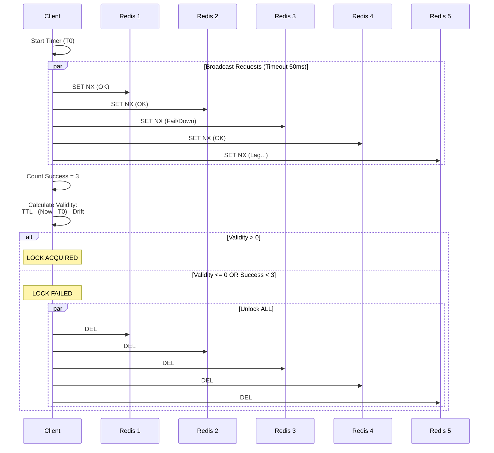
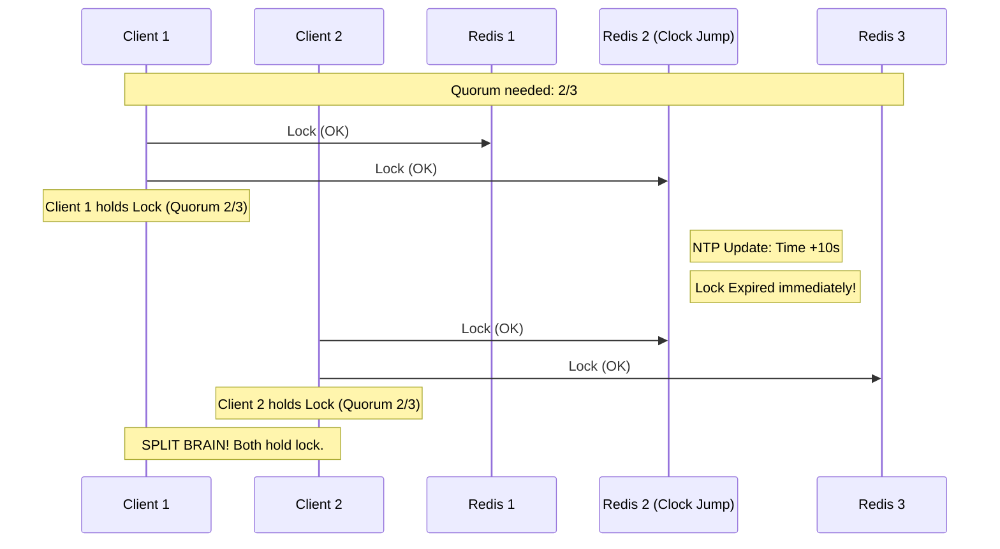
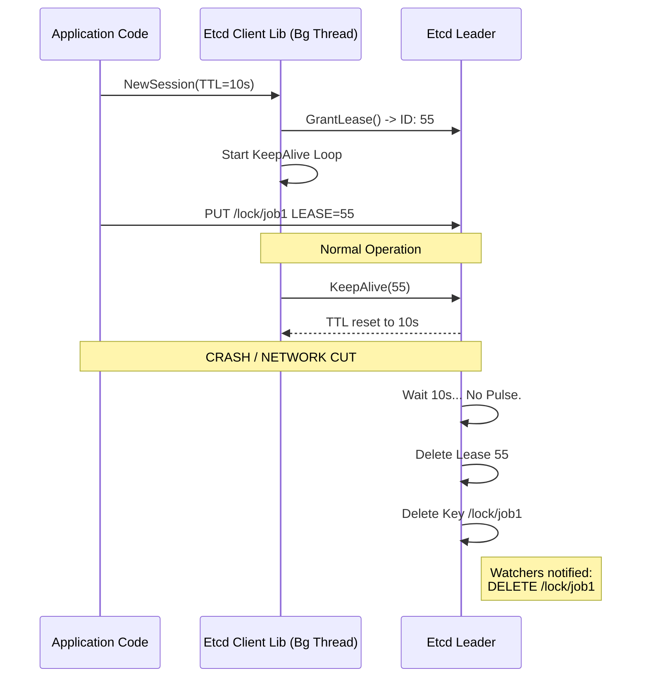
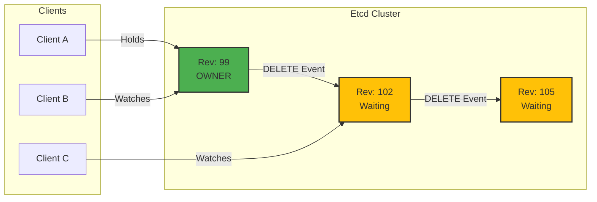
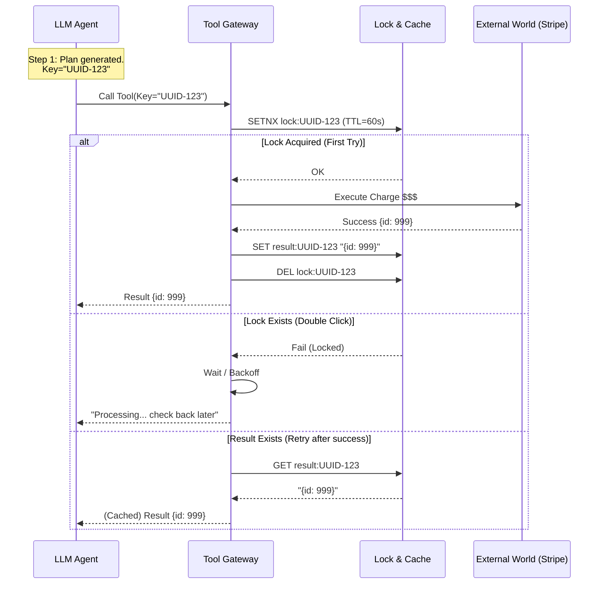

> [!danger] The Mutual Exclusion Lie
> 
> В локальной ОС мьютекс (`std::mutex`) работает, потому что ядро ОС является единым источником правды и контролирует планировщик.
> 
> В распределенной системе **нет единого времени**, нет общего планировщика, и процессы могут замирать (Stop-The-World GC) на неопределенное время.
> 
> **Аксиома:** Вы не можете гарантировать _взаимное исключение_ (Mutual Exclusion) в асинхронной системе без синхронизированных часов или токенов ограждения (Fencing Tokens). Если вы думаете иначе — вы просто еще не потеряли данные.

---
## 1. The Taxonomy: Efficiency vs. Correctness

> [!abstract] Философия Выбора: Цена Ошибки
> Перед тем как написать `mutex.Lock()`, вы должны ответить на вопрос:
> **"Какова цена того, что распределенный лок откажет, и два процесса войдут в критическую секцию одновременно?"**
>
> Это определяет класс инструмента:
> * **Efficiency (Эффективность):** Если цена — это зря потраченные ресурсы (CPU/Traffic).
>     * *Принцип:* **Fail Open**. Лучше сделать работу дважды, чем остановить сервис.
> * **Correctness (Корректность):** Если цена — это потеря данных, денег или репутации.
>     * *Принцип:* **Fail Closed**. Лучше вернуть ошибку и остановить процесс, чем допустить гонку.
### 1.1. Efficiency Locks (Advisory Locking)

> [!abstract] Концепция "Мягкого Отказа" (Fail Open)
> **Efficiency Lock** — это механизм предотвращения избыточной работы.
>
> Главное отличие от Correctness Lock заключается в поведении при аварии лок-сервера:
> * **Correctness:** Если лок недоступен или упал — **мы останавливаемся** (Fail Closed). Данные важнее аптайма.
> * **Efficiency:** Если лок недоступен или упал — **мы игнорируем лок** и выполняем работу (Fail Open). Аптайм важнее ресурсов.
#### A. Why "Advisory"?
Термин заимствован из Unix (Advisory vs Mandatory file locking).
Эти локи являются **рекомендательными**. Система (ядро/БД) не запрещает вам изменить ресурс, если у вас нет лока. Это джентльменское соглашение между вашими микросервисами: *"Перед тем как начать, проверь, не делает ли это кто-то другой"*.
#### B. The Use Case: Thundering Herd & Expensive Calc
Идеальный сценарий — защита от "Грочущего стада" при выполнении тяжелых, идемпотентных операций.

* **Сценарий:** 50 пользователей одновременно запрашивают генерацию тяжелого аналитического отчета (`report_2023_Q4.pdf`), который строится 30 секунд.
* **Без лока:** 50 воркеров загружают CPU на 100%, база данных ложится.
* **С локом (Redis):**
    1.  Воркер пытается сделать `SET report:lock:2023_Q4 "1" NX PX 30000`.
    2.  **Успех:** Воркер генерирует отчет, кладет в S3/Cache, удаляет лок.
    3.  **Неудача (Лок занят):** Воркер не делает ничего (или подписывается на ожидание результата, см. *Request Coalescing*).
* **Failure Scenario (Redis Down):**
    * Если Redis недоступен, блок `try/catch` ловит ошибку.
    * **Решение:** Мы логируем ошибку Redis, но **продолжаем** генерацию отчета.
    * **Итог:** Да, 50 воркеров сожгут CPU зря. Но пользователи получат отчет. Сервис не упал. Это допустимая цена за простоту.
#### C. Implementation Details (Redis)
Для Efficiency Locks достаточно **одного** инстанса Redis (или Master-Replica). Нам не нужен Redlock, так как мы готовы пережить потерю лока при фейловере.

**Паттерн:**
```bash
SET resource_name my_random_token NX PX 30000
```
- **NX (Not Exists):** Записать, только если ключа нет. Атомарность гарантии "одного победителя".
- **PX 30000 (TTL):** Жизненно необходим.
    - _Проблема:_ Если воркер упадет (OOM Killer, Segfault) _во время_ работы и не отпустит лок.
    - _Решение:_ Redis сам удалит ключ через 30 секунд (Liveness Guarantee). Без TTL вы получите вечный дедлок ресурса.
#### D. The Alternative: Postgres Advisory Locks

Если у вас уже есть PostgreSQL, и вы не хотите тянуть Redis ради локов, используйте встроенные "Совещательные блокировки".
- **Механизм:** Очень быстрые локи в памяти Postgres, не привязанные к строкам таблиц.
- **Session Level:** `pg_try_advisory_lock(key)` — держится пока жива TCP-сессия или до явного `unlock`.
- **Transaction Level:** `pg_try_advisory_xact_lock(key)` — держится до конца транзакции (`COMMIT`/`ROLLBACK`).
- **Плюс:** Автоматическое освобождение при разрыве соединения. Нет проблем с TTL (если приложение упало, TCP-сокет закрылся, Postgres снял лок мгновенно).
- **Минус:** Нагружают Connection Pool базы данных. Не используйте для High-Frequency Locking (тысячи локов в секунду).

> [!tip] Архитектурное правило Используйте **Efficiency Locks** только если операция **Идемпотентна** (Idempotent). То есть, если два воркера выполнят её одновременно (из-за сбоя лока), результат не испортится (например, файл в S3 перезапишется тем же контентом). Если повторное выполнение ломает данные — переходите в раздел **Correctness Locks**.

### 1.2. Correctness Locks (Mandatory Locking)

> [!danger] Принцип "Горца" (The Highlander Principle)
> **"Должен остаться только один".**
>
> Correctness Lock — это механизм обеспечения **Линеаризуемости** (Linearizability).
> В любой момент времени, с точки зрения любого наблюдателя в системе, ресурсом может владеть только один клиент.
>
> * **Цена:** Availability. Если система не может *гарантировать* единственность (нет кворума), она обязана отказать всем (Fail Closed).
> * **Риск:** Если этот лок нарушен, вы теряете деньги, коррумпируете данные или нарушаете физические законы (в IoT/Robotics).
#### A. The Philosophy: Fail Closed
В отличие от Efficiency Locks, здесь мы исповедуем паранойю.

* **Сценарий:** Сеть разделилась (Network Partition). Клиент А видит одну часть кластера, Клиент Б — другую.
* **Поведение:**
    * Система должна понять, что она находится в меньшинстве (Minority Partition).
    * Она **обязана** перестать выдавать локи и отозвать существующие.
    * Приложение получает ошибку `LockServiceUnavailable` и **прекращает работу**.
* **Почему это больно:** Ваш сервис "лежит", хотя серверы физически включены. Но это единственный способ избежать **Split Brain** (ситуации, когда два "мозга" управляют одним телом, разрывая его).
#### B. The Mechanism: Consensus (Raft/Paxos/ZAB)
Почему мы требуем Etcd, ZooKeeper или Consul? Почему нельзя взять Redis с репликацией?

Вся суть в моменте подтверждения записи (Ack):
1.  **Redis (Async):** Мастер пишет данные на диск/память $\to$ Отвечает "ОК" клиенту $\to$ Асинхронно шлет репликам.
    * *Дыра:* Если мастер умирает после "ОК", но до репликации — лок потерян. Новый мастер разрешит взять лок второму клиенту. **Корректность нарушена.**
2.  **Etcd (Consensus):** Лидер получает запрос $\to$ Шлет лог репликам $\to$ Ждет подтверждения от большинства ($N/2+1$) $\to$ Пишет на диск $\to$ Отвечает "ОК".
    * *Гарантия:* Если клиент получил "ОК", значит, лок переживет падение лидера, так как он есть на большинстве узлов.
#### C. The "Lease" Concept (Active Liveness)
В Correctness Locks мы не используем простой TTL (как `PX 30000` в Redis), потому что это полагается на системные часы, которые могут прыгать (NTP smearing, admin adjustment).

Мы используем **Lease (Аренду)** — объект сессии, привязанный к TCP-соединению.
* Клиент открывает сессию и шлет "пульс" (Heartbeat/KeepAlive) каждые N секунд.
* Лок привязан к этой сессии.
* Если клиент умирает (или сеть рвется), пульс пропадает.
* Кластер Etcd ждет TTL аренды и удаляет лок.
* **Важно:** Это не зависит от настенных часов (Wall Clock). Это зависит от *интервалов* времени.
#### D. The Hidden Enemy: Process Pauses (GC)
Даже Etcd не спасает от следующего сценария (проблема, поднятая Мартином Клеппманом):

1.  Client A берет лок в Etcd.
2.  Client A входит в **Stop-The-World GC** (сборка мусора) на 20 секунд. Процесс заморожен.
3.  Lease в Etcd истекает (так как клиент не шлет пульс). Лок освобождается.
4.  Client B берет лок и пишет данные.
5.  Client A "просыпается". Он *думает*, что лок все еще у него. Он пишет данные.
6.  **Результат:** Client A перезатер данные Client B. Лок был корректен, но использование — нет.

**Решение: Fencing Tokens (Токены Ограждения)**
Correctness Lock обязан возвращать монотонно возрастающий номер (Revision/Zxid).
* Лок 1 выдается с токеном `34`.
* Лок 2 выдается с токеном `35`.
* Хранилище (БД) должно проверять: `UPDATE ... WHERE token > current_token`.
#### E. Concrete Example: Financial Cron Job
Представьте сервис, списывающий абонентскую плату.

* **Задача:** Раз в месяц списать $10 со всех активных юзеров.
* **Риск:** Если два воркера запустят процесс одновременно, пользователи будут в ярости от двойного списания.
* **Реализация (Correctness):**
    1.  Воркеры идут в Etcd за локом `/locks/billing/2026-01`.
    2.  Только один получает лок.
    3.  Воркер держит сессию активной.
    4.  Если воркер падает посередине, лок освобождается через TTL.
    5.  Другой воркер подхватывает (используя идемпотентность транзакций внутри БД для тех юзеров, кого уже успели обработать).

> [!check] Архитектурное правило
> **Correctness Lock** — это комплексное решение.
> Это не просто "библиотека Etcd". Это связка:
> **Consensus System (Etcd)** + **Fencing Token** + **Storage with CAS support**.
> Если убрать любой элемент, система деградирует до уровня Efficiency Lock.

### 1.3. The CAP Theorem Implication

> [!abstract] Фундаментальный Закон
> Вы не можете обмануть физику. В распределенной системе, где возможны задержки или потери пакетов (Partition), вы обязаны выбрать одно из двух:
> 1.  **Availability (AP):** Система отвечает всегда, но может врать (отдавать старые данные, терять последние записи).
> 2.  **Consistency (CP):** Система говорит правду (линеаризуемость), но может "зависнуть" или вернуть ошибку, если не может связаться с большинством.
>
> **В контексте локов:**
> * **Redis = AP.** "Я дам тебе лок быстро, даже если я не уверен, что остальные реплики об этом знают".
> * **Etcd/ZK = CP.** "Я не дам тебе лок, пока не получу подписи от большинства свидетелей (Кворума)".
#### A. The "Redis Trap" (Asynchronous Replication)
Почему Redis (в стандартной конфигурации) не может гарантировать безопасность лока?

Проблема кроется в **Лаге Репликации**. Redis оптимизирован на скорость: он подтверждает запись клиенту *до* того, как данные уйдут на реплики.

**Анатомия катастрофы (Race Condition):**
1.  **Client A** отправляет `SET lock:resource "A" NX` Мастеру.
2.  **Master** записывает лок в память и мгновенно отвечает `OK`.
3.  *CRASH!* Мастер падает (выключается питание), **не успев** отправить лог репликации на Slave.
4.  **Sentinel/Cluster** обнаруживает падение и повышает Slave до нового Master.
5.  Новый Master **пуст**. В нем нет записи о `lock:resource`.
6.  **Client B** отправляет `SET lock:resource "B" NX` новому Мастеру.
7.  Новый Master отвечает `OK`.
8.  **Итог:** Client A и Client B владеют локом одновременно. Данные коррумпированы.
#### B. The "Etcd Guarantee" (Consensus & Quorum)
CP-системы работают на алгоритмах консенсуса (Raft, ZAB, Paxos). Они жертвуют скоростью ради гарантий.

**Механизм Записи (Commit):**
1.  **Client A** отправляет запрос Лидеру.
2.  Лидер записывает его в лог, но **не отвечает** клиенту.
3.  Лидер рассылает лог Фолловерам (Replicas).
4.  Лидер ждет подтверждения (Ack) от **Кворума** (Majority = $N/2 + 1$).
5.  Только получив подтверждения, Лидер фиксирует запись (Commit) и отвечает `OK` клиенту.

**Почему это надежно:**
Даже если Лидер упадет сразу после ответа "ОК", лок уже гарантированно лежит на большинстве узлов. Новый Лидер будет выбран только из тех, у кого есть самые свежие данные (свойство Raft). Потеря лока математически невозможна (при условии выживания большинства).
#### C. PACELC Theorem (The Hidden Latency Cost)
CAP говорит только об авариях (Partition). Теорема PACELC расширяет это на нормальную работу.

> **If Partition (P): choose A or C.**
> **Else (E): choose Latency (L) or Consistency (C).**

| Система | При аварии (P) | В штатном режиме (E) | Следствие для локов |
| :--- | :--- | :--- | :--- |
| **Redis** | Выбирает **A** | Выбирает **L** (Latency) | Мгновенный захват лока (<1ms). Риск потери. |
| **Etcd** | Выбирает **C** | Выбирает **C** (Consistency) | Медленный захват лока (RTT к репликам). Гарантия. |
#### D. Comparison Matrix: Architecture vs. Reliability

| Характеристика | Redis (Standalone / Sentinel) | Redis (Redlock) | Etcd / ZooKeeper |
| :--- | :--- | :--- | :--- |
| **Тип системы** | **AP** (Eventual Consistency) | **Probabilistic AP** | **CP** (Strong Consistency) |
| **Репликация** | Асинхронная | N/A (Client-side Quorum) | Синхронная (Consensus) |
| **Split Brain** | **Возможен.** При разделении сети могут появиться два мастера. | **Возможен.** Зависит от дрейфа часов. | **Невозможен.** Меньшинство переходит в Read-Only. |
| **Зависимость от часов** | **Высокая.** TTL истекает по локальным часам. | **Критическая.** Дрейф часов ломает алгоритм. | **Низкая.** Использует логические часы (Revision) и KeepAlive. |
| **Safety Grade** | ⭐️ Efficiency Only | ⭐️⭐️ Better Efficiency | ⭐️⭐️⭐️ Correctness |
> [!danger] Миф о `WAIT`
> В Redis есть команда `WAIT N timeout`, которая заставляет мастера ждать подтверждения от N реплик.
> Многие думают, что это превращает Redis в CP-систему. **Это не так.**
> * `WAIT` блокирует возврат ответа, но **не отменяет запись**.
> * Если кворум не набрался, запись все равно осталась на Мастере.
> * Это улучшает Consistency, но не дает гарантий Линеаризуемости, как Raft. Не используйте это для финансовых локов.

### 1.4. The "Database as Lock" Alternative

> [!abstract] Закон Гравитации Данных (Data Gravity)
> **Лучший лок — тот, который живет рядом с данными.**
>
> Если ваш ресурс — это строка в базе данных (баланс, статус заказа, ячейка склада), использование внешнего распределенного лока (Redis/Etcd) является **архитектурной ошибкой**.
> * **Redis Lock:** Требует синхронизации двух систем (Redis + DB). Если Redis упал, а БД жива — вы в тупике.
> * **DB Lock:** Атомарен. Лок берется и освобождается в рамках той же транзакции, что и изменение данных.
#### A. Row-Level Locking (Fine-Grained)
Это "золотой стандарт" для финансовых и учетных систем.

* **Инструмент:** `SELECT ... FOR UPDATE` (Postgres, MySQL, Oracle).
* **Механика:**
    1.  Начало транзакции (`BEGIN`).
    2.  Чтение строки с блокировкой. Другие транзакции, пытающиеся прочитать эту же строку с `FOR UPDATE`, **замирают** и ждут.
    3.  Изменение данных.
    4.  `COMMIT` (автоматическое снятие блокировки).
* **Преимущество (Safety):** Нет понятия "TTL лока". Лок держится ровно столько, сколько длится транзакция. Если приложение падает или рвется сеть $\to$ Транзакция откатывается $\to$ Лок снимается мгновенно.
* **Пример (Postgres):**
    ```sql
    BEGIN;
    -- Блокируем кошелек ID=42. Никто другой не может его заблокировать.
    SELECT balance FROM wallets WHERE id = 42 FOR UPDATE;
    
    -- Проверка бизнес-логики (на клиенте или в процедуре)
    -- IF balance < 100 THEN ROLLBACK;
    
    UPDATE wallets SET balance = balance - 100 WHERE id = 42;
    COMMIT; -- Лок снят
    ```

> [!tip] Advanced: `SKIP LOCKED`
> Для реализации очередей задач (Queue pattern) на базе SQL используйте `FOR UPDATE SKIP LOCKED`.
> Это позволяет воркерам пропускать заблокированные (кем-то обрабатываемые) строки и брать следующие свободные, не создавая конкуренции (Contention).
#### B. Advisory Locking (Coarse-Grained)
Что если вам нужно заблокировать что-то абстрактное, чего нет в таблицах? Например, "Я хочу, чтобы миграция БД запускалась только на одном сервере".
Вместо того чтобы поднимать Redis, используйте **Advisory Locks** (доступны в Postgres).

* **Суть:** Это быстрые мьютексы в оперативной памяти базы данных. Они не привязаны к физическим строкам.
* **Ключи:** Обычно это 64-битное число.
* **Типы:**
    1.  **Session Level:** `pg_try_advisory_lock(key)`. Держится, пока живо TCP-соединение. Идеально для защиты от падения воркера.
    2.  **Transaction Level:** `pg_try_advisory_xact_lock(key)`. Автоматически снимается при `COMMIT/ROLLBACK`.
* **Плюсы:** Не нужно администрировать лишний инфраструктурный компонент (Redis).
* **Минусы:** Нагружает БД (см. ниже).

#### C. The Hidden Tax: Connection Starvation
Почему мы не используем БД для всех локов подряд?

**Проблема:**
Каждый активный лок (особенно Session Level) или ожидание лока (`FOR UPDATE` без `NOWAIT`) занимает **соединение** (Connection) к базе данных.

* **Математика отказа:**
    * `Max Connections` = 500.
    * У вас 500 воркеров встали в очередь за локом на 5 секунд.
    * **Результат:** Пул соединений исчерпан. Ваш сайт лежит (возвращает 500), потому что пользователь не может даже сделать `SELECT * FROM content`, так как нет свободных коннектов.

> [!danger] Rule of Thumb
> Используйте БД для локов **только** если:
> 1.  Время удержания лока (Critical Section) очень короткое (< 100ms).
> 2.  ИЛИ Количество конкурентов мало (Internal Backoffice Tools, Migrations).
>
> Для высоконагруженных блокировок (тысячи RPS, долгое ожидание) используйте **Redis/Etcd**, чтобы не убить базу данных.

#### D. 2026 Context: Agentic Intent Locking
В эпоху AI-агентов мы используем гибридный подход.

Агенты (LLM) работают медленно. Мы не можем держать транзакцию открытой 10 секунд, пока GPT-5 "думает".
* **Решение:** State Machine Locking.
* **Таблица:** `agent_intents (id, status, locked_until)`.
* **Flow:**
    1.  **Short TX:** `UPDATE agent_intents SET status='PROCESSING', locked_until=NOW()+10s WHERE id=1 AND status='PENDING'`. (Быстрая блокировка строки).
    2.  **Long Action:** Агент идет думать, делать запросы к API (вне транзакции БД).
    3.  **Short TX:** Агент возвращается и пишет результат. `UPDATE ... SET status='DONE'`.
#### Summary: When to use DB as Lock?

| Feature | Redis/Etcd | Database (Row/Advisory) |
| :--- | :--- | :--- |
| **Data Proximity** | Low (Network hop required) | **High** (Lock is next to data) |
| **Consistency** | Depends (AP vs CP) | **Strong (ACID)** |
| **Cost** | Extra Infrastructure | Consumes DB Connections |
| **Auto-release** | TTL / KeepAlive | Transaction Rollback / Disconnect |
| **Best For...** | Distributed Resources, APIs, Leader Election | **Financial Data, Queues, Migrations** |
### 1.5. Decision Matrix (Лакмусовая бумажка архитектора)

> [!abstract] Квадрант Выбора
> Не существует "лучшего" лока. Существует только лок, подходящий под ваш **Risk Profile**.
>
> Мы оцениваем систему по двум осям:
> 1.  **Цена Гонки (Cost of Race):** Насколько больно, если лок откажет? (От "неприятно" до "увольнение").
> 2.  **Время Удержания (Hold Duration):** Сколько времени длится критическая секция? (От микросекунд до минут).
#### A. The Master Comparison Table
Используйте эту таблицу для защиты архитектурных решений (ADR).

| Feature | **Redis (Single/Sentinel)** | **Redis (Redlock)** | **Etcd / ZooKeeper / Consul** | **Database (Row Lock)** |
| :--- | :--- | :--- | :--- | :--- |
| **Philosophy** | **Efficiency** (AP) | **Probabilistic Safety** | **Correctness** (CP) | **Acid Truth** |
| **Guarantee** | "Best Effort". Лок может исчезнуть при фейловере. | "Quorum Consensus". Безопасен, пока часы синхронны. | **Strict Linearizability**. Гарантия Fencing Tokens. | **Transactional**. Атомарность с данными. |
| **Performance** | 🚀 Extreme (>100k RPS, <1ms) | ⚡ Fast (~10k RPS, <5ms) | 🐢 Slow (~1k RPS, 10-50ms) | 📉 Depends on DB load |
| **Split-Brain** | **Fail Open.** Две стороны могут владеть локом. | **Depends.** Зависит от дрейфа часов. | **Fail Closed.** Меньшинство блокируется. | **Fail Closed.** Rollback транзакции. |
| **Clock Dependency** | High (TTL) | Critical (Drift kills safety) | Low (Logical Clocks) | None (Session/Tx scope) |
| **Complexity** | Low (Simple `SETNX`) | High (Client logic) | High (Separate Cluster) | Zero (Built-in) |
#### B. Scenario-Based Selection

**Scenario 1: The "Thundering Herd" (Cache Warming)**
* **Задача:** 10,000 юзеров просят один и тот же отчет.
* **Риск:** Если лок откажет, мы вычислим отчет дважды. Потеряем CPU.
* **Hold Time:** 500ms - 5s.
* **Выбор:** ✅ **Redis (Single Node)**.
* **Почему:** Нам не нужен Etcd. Нам нужна скорость и простота. Если мастер упадет, ну и черт с ним, пересчитаем еще раз.

**Scenario 2: The "Double Spending" (Billing)**
* **Задача:** Списать деньги с кошелька пользователя.
* **Риск:** Если лок откажет, баланс станет отрицательным. Юридические последствия.
* **Hold Time:** 10ms - 100ms.
* **Выбор:** ✅ **Database Row Lock (`FOR UPDATE`)**.
* **Почему:** Данные лежат в БД. Лок должен быть транзакционен с данными. Нет смысла тащить внешний Etcd.

**Scenario 3: The "Cluster Leader" (Singleton Worker)**
* **Задача:** В кластере из 50 подов только один должен выполнять Cron-задачу (отправка пушей).
* **Риск:** Если будет два лидера, юзеры получат дубликаты пушей (спам).
* **Hold Time:** Дни/Месяцы (пока под жив).
* **Выбор:** ✅ **Etcd / ZooKeeper**.
* **Почему:** Redis не подходит из-за ненадежности при сетевых морганиях. DB не подходит, так как держать открытую транзакцию сутками нельзя (Vacuum/Undo logs bloat). Etcd с Lease — идеал.

**Scenario 4: The "Agentic Workflow" (LLM Task)**
* **Задача:** AI-агент бронирует отель через API.
* **Риск:** Агент может "задуматься" или уйти в ретрай, купив два номера.
* **Hold Time:** 10s - 60s (Очень долго!).
* **Выбор:** ✅ **DB State Machine (Optimistic Locking)**.
* **Почему:**
    * *Redis* убьет лок по TTL, пока LLM генерирует токены.
    * *Etcd* потребует сложного KeepAlive.
    * *Решение:* Таблица `tasks` с полем `version`. Агент читает версию, думает минуту, потом делает `UPDATE ... WHERE version = old_ver`.

#### C. The "Agentic" Checklist (2026 Edition)
Специальные требования для систем, где локи берут не алгоритмы, а AI-агенты.

1.  **Human-in-the-loop Latency:** Если лок удерживается во время ожидания ответа от человека (или LLM), **никогда** не используйте Redis/Etcd. Используйте статусы в БД (`status='LOCKED_BY_USER'`). Сетевые локи не предназначены для минут ожидания.
2.  **Semantic Collision:** Агенты могут пытаться изменить "смысл" документа, а не просто байты.
    * *Пример:* Агент А переписывает "Введение", Агент Б меняет "Тон" всего текста.
    * *Решение:* Иерархические локи (Hierarchical Locking) в Etcd или БД. Агент Б должен взять лок на корень документа, Агент А — на узел.
3.  **Tool Use Idempotency:** Лок должен защищать не код агента, а **вызов инструмента**.
    * Оберните вызовы внешних API (Stripe, Twilio) в `DistributedLock(idempotency_key)`.

> [!check] Golden Rules of 2026
> 1.  **Don't fight the database:** Если ресурс в БД, лок должен быть в БД.
> 2.  **Don't trust the clock:** Если корректность критична, используйте Fencing Tokens (версионирование), а не только лок.
> 3.  **Fail loudly:** Если Etcd недоступен, сервис должен вернуть `503`, а не пытаться работать "без страховки".

> [!check] Expert Recommendation
> В системах 2025+ года (особенно с AI Agents):
> По умолчанию считайте, что вам нужна **Correctness**.
> LLM-агенты недетерминированы и склонны к "галлюцинациям" в виде повторных вызовов.
> Лучше система будет чуть медленнее (Etcd), чем два автономных агента начнут войну правок за один документ.

---
## 2. The "Fast & Dangerous": Redis Redlock

> [!danger] Спор Титанов (Kleppmann vs. Antirez)
> Алгоритм Redlock стал причиной одной из самых известных инженерных дуэлей.
> * **Antirez (Автор Redis):** "Redlock достаточно надежен для большинства практических задач".
> * **Martin Kleppmann (Автор DDIA):** "Redlock — это плохой выбор. Он недостаточно надежен для корректности (из-за зависимости от часов) и слишком сложен для эффективности".
>
> **Вердикт 2026 года:** Используйте Redlock, если вам нужна высокая доступность (Availability) распределенного мьютекса, но **никогда** не доверяйте ему финансовые транзакции.
### 2.1. The Problem: Why `SETNX` on Master is Suicide

> [!danger] Иллюзия Безопасности
> Интуиция подсказывает: "Если я получил `OK` от базы данных, значит, данные сохранены".
> В мире Redis это **ложь**.
>
> Redis оптимизирован для скорости (Performance). По умолчанию он подтверждает запись клиенту (`Ack`) **до** того, как эта запись будет отправлена на реплики (Slaves) или записана на диск (fsync).
> Это создает **Окно Потери Данных** (Replication Gap), которое невозможно закрыть конфигурацией.
#### A. The Anatomy of the Command
Для начала, как выглядит правильный, но одиночный лок в Redis? (Даже его часто пишут неправильно).
```bash
SET lock:invoice:123 "r4nd0m_t0k3n" NX PX 10000
```
- **`SET ... NX` (Not Exists):** Атомарная гарантия. "Запиши, только если ключа нет". Это предотвращает перезапись чужого лока. 
- **`PX 10000` (TTL):** "Удали через 10 секунд". Защита от Liveness-проблем (если клиент умрет, лок снимется сам).
- **`"r4nd0m_t0k3n"`:** Зачем здесь случайное значение?
    - Чтобы реализовать **Safe Release**. При удалении лока скрипт Lua должен проверить: _"А мой ли это токен я удаляю?"_.
    - Иначе: Client A берет лок $\to$ Зависает $\to$ TTL истекает $\to$ Client B берет лок $\to$ Client A просыпается и делает `DEL`. Он удалит лок Клиента B! Токен защищает от этого.
#### B. The Async Gap (Физика катастрофы)
Почему эта схема рушится при аварии?
Redis использует **Асинхронную Репликацию**. Это означает, что Мастер не ждет Слейва.
1. **Acquire:** Client A посылает `SETNX` на **Master**.
2. **Ack:** Master записывает лок в память и **мгновенно** отвечает `OK` Клиенту A.
    - _Состояние:_ Client A уверен, что владеет ресурсом. Он начинает работу (например, отправку денег).    
3. **The Gap:** В этот момент пакет с данными репликации (`+SETNX...`) еще лежит в буфере сетевой карты Мастера или летит по проводам к Слейву.
4. **Crash:** Происходит сбой питания / Kernel Panic / OOM Kill на Мастере. Пакет репликации не дошел.
5. **Failover:**
    - Система мониторинга (Sentinel) видит, что Мастер мертв.
    - Она выбирает Слейва и повышает его до **Нового Мастера**.
    - **Важно:** Этот Слейв _пуст_ в контексте нашего ключа. Он никогда не получал команду `SETNX`.
6. **Violation:**
    - Client B посылает `SETNX` на **Новый Мастер**.
    - Новый Мастер (пустой) отвечает `OK`.
    - **Итог:** Client A и Client B владеют локом одновременно.
#### C. Visualizing the "Lost Write"
Этот сценарий не требует "редкого стечения обстоятельств". Он происходит при **каждом** жестком падении Мастера под нагрузкой.
```Code snippet
sequenceDiagram
    participant CA as Client A
    participant CB as Client B
    participant M as Redis Master
    participant S as Redis Slave (Future Master)

    CA->>M: SET lock:X NX (Acquire)
    activate M
    M->>M: Write to Memory
    M-->>CA: OK (You have the lock)
    deactivate M
    
    Note right of CA: Client A starts critical work...
    
    par Async Replication
        M--)S: Stream command (delayed)
    and Crash Event
        Note over M: 💥 POWER FAILURE 💥
    end
    
    Note over S: Replication packet LOST due to crash.
    
    Note over S: Sentinel promotes Slave to Master
    
    CB->>S: SET lock:X NX (Acquire)
    activate S
    S->>S: Key not found (Empty)
    S-->>CB: OK (You have the lock)
    deactivate S
    
    Note over CA, CB: ☠️ FATAL RACE CONDITION ☠️<br/>Both clients hold the lock
```
#### D. The Counter-Argument: "Why not use `WAIT`?"
Продвинутые инженеры спросят: _"В Redis же есть команда `WAIT`, которая блокирует ответ до подтверждения репликами!"_
Команда `WAIT num_replicas timeout` действительно существует.
```Bash
SET lock:X "token" NX
WAIT 1 1000
```
Если `WAIT` возвращает ошибку (не дождались реплик), значит ли это, что лок не взят?
**Нет.**
1. Запись на Мастере уже произошла.
2. `WAIT` лишь задержал ответ "OK".
3. Если мы получили тайм-аут `WAIT`, мы не знаем: данные не дошли до реплики или просто ответ от реплики задержался?
4. Более того, при Split Brain (разделении сети) использование `WAIT` может привести к тому, что Мастер станет недоступен для записи (будет вечно ждать реплик), превращая AP систему в неработающую CP.

**Вывод:** Redis архитектурно не предназначен для Strong Consistency. Любые попытки "натянуть" гарантии (через `WAIT`) дырявы. Если вам нужна гарантия — берите Etcd.

### 2.2. The Algorithm: Redlock (Distributed Quorum)

> [!abstract] Симуляция CP на базе AP
> Redlock пытается построить надежный (CP) замок, используя ненадежные (AP) кирпичи.
>
> **Фундаментальное отличие:** В Etcd консенсус достигается *между серверами* (Raft). В Redlock серверы Redis ничего не знают друг о друге. Консенсус собирает **клиент**.
>
> **Инфраструктура:** Нам нужно $N$ (обычно 5) **полностью независимых** мастеров Redis.
> * Никакой репликации.
> * Никакого Redis Cluster.
> * Желательно, чтобы они были разнесены по разным Availability Zones (физическая независимость), чтобы сбой питания в одной стойке не убил кворум.
#### A. The Protocol Step-by-Step
Алгоритм работает только тогда, когда клиент выполняет шаги с хирургической точностью.

**Step 1: Calibration (Старт)**
* Клиент генерирует уникальный токен (random string) для идентификации своего владения.
* Клиент запоминает текущее время с точностью до миллисекунды: $T_{start}$.

**Step 2: Broadcast (Сбор голосов)**
* Клиент пытается выполнить `SET resource token NX PX 30000` на всех 5 узлах **последовательно** (или параллельно, но с ожиданием всех).
* **Критично:** Таймаут соединения с каждым узлом должен быть мизерным (5-50 мс).
    * *Зачем?* Если узел Redis завис или упал, мы не должны ждать TCP-таймаута (60 сек). Мы должны мгновенно пропустить его и идти к следующему. Это обеспечивает свойство **Liveness**.

**Step 3: Quorum Check (Подсчет)**
* Клиент считает количество успешных `SET`.
* Нам нужно большинство: $Quorum = \lfloor \frac{N}{2} \rfloor + 1$.
* Для 5 узлов кворум равен **3**. Если собрали меньше — это провал.

**Step 4: Validity Check (Математика Времени)**
* Даже если мы собрали 3 голоса, лок может быть уже невалиден.
* Вычисляем затраченное время: $T_{elapsed} = T_{now} - T_{start}$.
* Вычисляем **фактическое время жизни** лока:
    $$Validity = TTL - T_{elapsed} - Drift$$
* **Drift (Дрейф):** Поправка на неточность часов и время пролета пакетов. Обычно берется как $ClockDrift \% + Buffer$.
* **Условие успеха:** Если $Count \ge 3$ **И** $Validity > 0$, лок считается взятым.

**Step 5: Rollback (Очистка при неудаче)**
* Если мы не набрали кворум, ИЛИ если валидность истекла.
* Клиент **обязан** отправить команду `DEL` (Unlock Script) на **ВСЕ 5 узлов**.
    * *Нюанс:* Даже на те, которые ответили ошибкой или тайм-аутом.
    * *Почему?* Пакет `SET` мог дойти до узла и записаться, но ответ `OK` мог потеряться в сети. Узел думает, что лок взят. Мы обязаны его очистить, иначе он будет заблокирован на 30 секунд (Deadlock by Zombie).

#### B. The "Split Vote" Problem (Retry Jitter)
Что если 5 клиентов одновременно пытаются взять лок?
* Клиент 1 берет лок на Ноде А.
* Клиент 2 берет лок на Ноде B.
* ...
* Никто не собрал кворум (3 из 5).

Если все клиенты подождут фиксированное время (100мс) и попробуют снова, они снова столкнутся (Livelock).
**Решение:** При неудаче клиент должен ждать случайное время (**Jitter**) перед повторной попыткой. Это десинхронизирует претендентов.
#### C. Visual Flow (Mermaid)


#### D. Why "Independent Masters"?

Почему нельзя использовать 5 реплик одного кластера? Потому что в репликации есть **Shared Fate** (Разделенная судьба). Если вы используете реплики, то данные (ваш лок) распространяются от одного источника правды. Если этот источник врет или тормозит, врут все. В Redlock каждый узел — это независимый свидетель. Вероятность того, что часы скакнут на 10 секунд одновременно на 5 разных физических серверах, крайне мала (если только вы не обновили NTP-демон везде одновременно через Ansible — _никогда так не делайте_).

> [!check] Expert Checklist для реализации
> 
> 1. Используете ли вы криптографически стойкий рандом для токена? (Чтобы не удалить чужой лок).
>     
> 2. Шлете ли вы `DEL` на **все** узлы при ошибке? (Иначе замусорите кластер).
>     
> 3. Учитываете ли вы время, потраченное на сетевые запросы, вычитая его из TTL?
>     
> 4. Есть ли у вас **Random Delay** перед ретраем?
>     
> 
> _Если ответ "Нет" хотя бы на один пункт — ваш Redlock сломан._
### 2.3. The Fatal Flaw: Clock Drift (Дрейф Часов)

> [!danger] Иллюзия Абсолютного Времени
> Алгоритм Redlock математически корректен **только** при выполнении условия:
> $$MaxClockDrift < Validity - Time_{elapsed}$$
>
> Проблема в том, что в реальном мире вы не контролируете $MaxClockDrift$.
> * Кварцевый генератор на сервере плывет от температуры.
> * NTP-демон может мгновенно перевести часы на 5 секунд назад или вперед (Stepping).
> * Администратор может вручную ввести `date -s ...`.
>
> Если часы на серверах Redis рассинхронизируются, понятие "Кворум" теряет смысл.
#### A. The Physics of Time (Skew vs. Step)
Чтобы понять угрозу, нужно различать два типа искажений времени:

1.  **Clock Skew (Дрейф/Уход частоты):**
    * Часы идут чуть быстрее или чуть медленнее (на пару ppm — parts per million).
    * *Влияние:* За 10 секунд реального времени сервер может насчитать 10.005 сек.
    * *Redlock:* Пытается компенсировать это через формулу "Drift Correction", отнимая небольшой процент от TTL. Это работает.
2.  **Clock Step (Скачок/Сдвиг):**
    * Самая страшная проблема. NTP-клиент видит, что часы отстали на 2 секунды, и **мгновенно** переводит их вперед.
    * *Влияние:* Для процесса Redis прошло 0 секунд CPU-времени, но системное время прыгнуло на +2 секунды.
    * *Redlock:* **Не может это компенсировать.** Лок мгновенно протухает.
#### B. The Attack Vector: The "Time Warp" Split Brain
Давайте детально разберем сценарий, описанный Клеппманом, который ломает гарантии Redlock.

**Дано:** 5 узлов (A, B, C, D, E). Кворум = 3.

1.  **Acquisition:**
    * **Client 1** успешно берет лок на узлах **A, B, C**.
    * Узлы D и E недоступны или ответили медленно.
    * Клиент 1 имеет кворум (3/5). Он начинает работу.
2.  **The Event (NTP Sync):**
    * На узле **C** происходит синхронизация времени. Его часы спешили, и NTP-демон переводит их вперед на 5 секунд (или просто происходит большой скачок).
    * Redis на узле C проверяет TTL ключа. Из-за скачка времени он "видит", что время истекло.
    * **Redis C удаляет ключ лока.** (Хотя реально прошло 1 секунда).
3.  **The Violation:**
    * Появляется **Client 2**.
    * Он запрашивает лок.
    * Узел **C** свободен (ключ удален). Узлы D и E проснулись/освободились.
    * Client 2 берет лок на **C, D, E**.
    * Client 2 имеет кворум (3/5).
4.  **Result:**
    * Client 1 уверен, что держит лок (A, B, C).
    * Client 2 уверен, что держит лок (C, D, E).
    * **Shared Resource Corrupted.**
#### C. The "Process Pause" Dilemma (Stop-The-World)
Дрейф часов — это не только проблема NTP. Это проблема восприятия времени клиентом.

Даже если часы Redis идеальны, "часы" внутри вашего приложения могут остановиться.

1.  **Client 1** берет лок с TTL = 10 сек.
2.  **Client 1** проверяет: "Прошло 100мс, у меня есть еще 9.9 сек".
3.  **GC Pause:** Runtime языка (Java/Go/Python) останавливает мир для сборки мусора. Пауза длится 15 секунд (в больших кучах или при свопинге).
4.  С точки зрения внешнего мира, лок в Redis истек.
5.  **Client 2** берет лок.
6.  **Client 1** просыпается.
    * Его локальная переменная говорит: "Я проверил время строчку назад, у меня есть лок".
    * Он пишет в БД.
    * **Результат:** Гонка данных, которую лок должен был предотвратить.

> [!tip] Как защититься? (Fencing Token)
> Лок сам по себе не может защитить от GC Pause.
> Единственная защита — **Fencing Token** (см. Раздел 4).
> Redlock **не предоставляет** Fencing Token (так как нет единого счетчика ревизий). Поэтому Redlock нельзя использовать для строгой корректности.
#### D. Operational Mitigation (SRE Checklist)
Если вы все же используете Redlock, вы обязаны настроить инфраструктуру так, чтобы минимизировать риск скачков времени.

1.  **NTP Configuration:**
    * Используйте `chrony` или `ntpd`.
    * Настройте их в режим **Slew Mode** (постепенное изменение частоты), а не **Step Mode**.
    * *Команда:* Запретите скачки времени (`stepout` или `-x` флаг), если разница меньше 1 минуты. Пусть лучше часы расходятся, чем скачут.
2.  **Hardware Clock:**
    * Не используйте "burstable" инстансы (T2/T3 в AWS) для узлов Redis Redlock. "Steal Time" гипервизора влияет на отсчет времени.
3.  **Monitoring:**
    * Алерт на `node_time_seconds` (Prometheus). Если разница между узлами кластера > 500мс — это Critical Alert.
#### E. Summary: Why "Time" is broken
В распределенных системах мы используем два типа часов:
* **Time-of-day (Wall Clock):** `System.currentTimeMillis()`. Подвержены скачкам. Нужны людям.
* **Monotonic (Logical Clock):** `System.nanoTime()`. Гарантированно идут только вперед. Нужны алгоритмам.

**Трагедия Redlock** в том, что он вынужден использовать *Wall Clock* (TTL ключа в Redis), чтобы сравнивать время между разными машинами (у которых нет общего Monotonic Clock). Это фундаментальный изъян дизайна, который невозможно исправить кодом.

### 2.4. Performance vs. Safety Matrix
Когда можно использовать Redlock, а когда нет?

| Характеристика   | Redlock (Redis)                                                                         | Consensus Lock (Etcd/ZK)                                  |
| :--------------- | :-------------------------------------------------------------------------------------- | :-------------------------------------------------------- |
| **Trust Source** | System Clock (Ненадежно)                                                                | Logical Clock / Raft Log (Надежно)                        |
| **Failover**     | Client-side logic (Сложно)                                                              | Server-side (Прозрачно)                                   |
| **Latency**      | Low (Параллельные запросы)                                                              | High (Консенсус требует RTT)                              |
| **Use Case**     | **Efficiency:** Не дать двум юзерам редактировать черновик. Не отправить письмо дважды. | **Correctness:** Списание денег. Лидерство в базе данных. |
### 2.5. Implementation Checklist (Если вы все-таки выбрали Redlock)
Не пишите Redlock сами. Это сложнее, чем кажется. Используйте проверенные библиотеки.
* **Java:** `Redisson` (Production standard).
* **Go:** `github.com/go-redsync/redsync`.
* **Python:** `rehash/redlock-py` (внимательно проверяйте активность мейнтейнеров).

> [!check] Expert Tip: The Watchdog Pattern
> Одна из главных проблем Redlock — угадать TTL.
> * Поставишь мало (5с) — лок протухнет, пока воркер работает (GC pause).
> * Поставишь много (5мин) — при падении воркера ресурс заблокирован на 5 минут.
>
> **Решение (реализовано в Redisson):**
> 1. Клиент берет лок с TTL = 30с.
> 2. В клиенте запускается фоновый поток (**Watchdog**).
> 3. Каждые 10 секунд Watchdog проверяет: "Я еще жив? Я еще работаю?".
> 4. Если да — он продлевает TTL лока в Redis (делает `PEXPIRE`).
> 5. Если клиент падает — Watchdog умирает, и лок исчезает через 30с.
> Это превращает фиксированный TTL в **динамическую сессию**.
### 2.6. Visualizing the Failure Mode



---
## 3. The "Slow & Correct": Consensus Locks (Etcd/ZooKeeper)

> [!abstract] Гарантия Линеаризуемости (Linearizability)
> В отличие от Redis, который обещает "Eventual Consistency" (в лучшем случае), Etcd и ZooKeeper обеспечивают **Линеаризуемость**.
>
> **Что это значит для лока:**
> Если Клиент А получил подтверждение захвата лока ("OK"), то **любой** другой клиент в кластере, обратившись к **любой** ноде, гарантированно увидит, что лок занят.
> Здесь нет "лага репликации". Здесь нет "потерянных записей".
>
> * **Цена:** Latency. Каждая операция записи требует сетевого общения с кворумом (Round Trip Time).
### 3.1. The Mechanics: Why it survives the crash?

> [!abstract] Гарантия "The Majority Intersection"
> В основе надежности Etcd (и алгоритма Raft) лежит теорема о пересечении множеств.
>
> Если вы записали данные на **Большинство** (Quorum Write) узлов, и выбираете нового Лидера тоже голосованием **Большинства** (Quorum Read/Vote), то эти два множества **обязаны** пересечься хотя бы на одном узле.
> $$Q_{write} \cap Q_{elect} \neq \emptyset$$
>
> Это означает, что новый Лидер *гарантированно* увидит последнюю запись (ваш лок). В Redis такой гарантии нет, так как чтение (выборы мастера) и запись не обязаны пересекаться.
#### A. The "Two-Phase" Commit (Raft Protocol)
Когда вы делаете `mutex.Lock()` в Etcd, происходит не просто запись в память. Происходит сложный танец синхронизации.

Представим кластер из 3 узлов: **Leader (L)**, **Follower 1 (F1)**, **Follower 2 (F2)**.

1.  **Propose (Предложение):**
    * Клиент отправляет запрос `PUT /lock/resource "owned"` Лидеру.
    * Лидер добавляет запись в свой локальный **WAL (Write Ahead Log)**.
    * *Статус:* **Uncommitted**. Клиент пока ждет. Если Лидер упадет сейчас — лок не взят.
2.  **Replicate (Репликация):**
    * Лидер отправляет RPC `AppendEntries` узлам F1 и F2.
    * Это происходит параллельно.
3.  **Acknowledge (Подтверждение):**
    * F1 получает лог, пишет его на свой **Диск** (fsync) и отвечает Лидеру: "Success".
    * F2 может тормозить (GC / Network lag).
4.  **Commit (Фиксация):**
    * Лидер видит: "Я записал + F1 записал". Итого 2 узла из 3.
    * **Кворум достигнут** ($2 > 3/2$).
    * Лидер помечает запись как **Committed**.
    * Лидер применяет запись к **State Machine** (реально создает ключ в KV-хранилище).
5.  **Response (Ответ):**
    * Только теперь Лидер отвечает клиенту: "OK, Lock Acquired".
    * Лидер асинхронно уведомляет F1 и F2: "Запись закоммичена, можете применять её".

> [!info] Latency Cost
> В Redis время ответа = `Network + MemoryWrite`. (~0.5ms).
> В Etcd время ответа = `Network + DiskFsync(Leader) + Network + DiskFsync(Follower) + Network`. (~10-20ms).
> Вы платите временем за гарантию того, что данные лежат на дисках большинства машин.
#### B. The Crash Proof (Почему лок выживает?)
Сценарий, который убивает данные в Redis, но безопасен в Etcd:

1.  Лидер ответил "OK" клиенту. Значит, запись есть на **L** и **F1**.
2.  **Мгновенно** после ответа Лидер (L) сгорает (Power Failure).
3.  У нас остались **F1** (с логом) и **F2** (без лога, он тормозил).
4.  Начинаются выборы (Election).
5.  **F2** пытается стать Лидером. Он просит голос у F1.
    * Алгоритм Raft запрещает голосовать за кандидата, чей лог "короче" или старее твоего.
    * **F1** видит: "У F2 нет последней записи, которая есть у меня".
    * **F1** голосует **ПРОТИВ** F2.
6.  **F1** пытается стать Лидером.
    * Он голосует за себя.
    * F2 голосует за него (так как лог F1 новее).
    * **F1** становится Лидером.
7.  **Recovery:**
    * F1 реплицирует отсутствующую запись на F2.
    * Лок сохранен. Система продолжает работу.
#### C. The "Zombie Leader" Protection (Term ID)
Еще одна опасность: **Network Partition**.

1.  Старый Лидер (L) отрезается от сети, но продолжает работать. Он думает, что он главный.
2.  Остальной кластер выбирает Нового Лидера (L').
3.  **Redis:** Старый Мастер может продолжать принимать записи от клиентов, находящихся в том же сегменте сети. Эти записи будут потеряны при воссоединении.
4.  **Etcd:**
    * Клиент пытается продлить лок (KeepAlive) на Старом Лидере (L).
    * L пытается реплицировать это на фолловеров, но сеть разорвана.
    * L не может собрать Кворум.
    * L **не отвечает** клиенту "OK". Запрос висит или падает по таймауту.
    * **Результат:** Старый Лидер автоматически превращается в Read-Only (или падает по ошибке), не допуская Split Brain в записях.
#### D. Comparison Table: Why Redis is "Fast but Loose"

| Этап | Redis (Async Replication) | Etcd (Raft Consensus) |
| :--- | :--- | :--- |
| **Запись на диск** | Опционально (AOF everysec). Обычно только RAM. | **Обязательно (fsync)** перед ответом. |
| **Репликация** | Fire-and-forget. Мастер не ждет. | **Synchronous.** Мастер ждет кворум. |
| **Условие успеха** | "Записано у меня (Master)". | "Записано у Большинства". |
| **Выборы лидера** | Любой Slave может стать Master (риск потери данных). | Только тот, у кого есть все Committed данные. |
| **Lock Safety** | 99.9% (Eventual). | 100% (Linearizable). |

> [!check] Архитектурный вывод
> Используйте Etcd не потому, что вам нравится Go или Kubernetes.
> Используйте его, потому что вам нужна **математическая гарантия** того, что два процесса не войдут в критическую секцию одновременно, даже если половина дата-центра сгорит в процессе.

### 3.2. Leases & Keep-Alive (Active Liveness)

> [!abstract] Паттерн "Dead Man's Switch" (Кнопка Мертвеца)
> В системах строгой согласованности мы не привязываем TTL к ключу (как в Redis). Мы привязываем ключ к **Сессии (Lease)**.
>
> **Механика:**
> 1.  Ключ лока — это просто запись в базе.
> 2.  Аренда (Lease) — это объект с таймером обратного отсчета на сервере.
> 3.  Если таймер доходит до нуля, Аренда уничтожается.
> 4.  **Важно:** Вместе с Арендой Etcd автоматически удаляет **все** ключи, привязанные к ней.
>
> Это позволяет клиенту держать тысячи локов и продлевать их жизнь одним-единственным запросом (Heartbeat), подтверждающим жизнь самого процесса.
#### A. The Lifecycle of a Lease
Разберем анатомию процесса, который происходит под капотом `concurrency.NewSession`.

1.  **Grant (Выдача):**
    * Клиент отправляет RPC `LeaseGrant(TTL=10s)`.
    * Etcd создает Lease ID (например, `0x123...`) и запускает таймер на сервере.
2.  **Attach (Привязка):**
    * Клиент создает ключ лока: `PUT /lock/my-resource "owned" --lease=0x123...`.
    * Теперь судьба ключа намертво связана с судьбой Аренды.
3.  **Keep-Alive (Пульс):**
    * Клиент запускает фоновую горутину (Background Thread).
    * Каждые $TTL / 3$ секунд (примерно 3.3 сек) она шлет RPC `LeaseKeepAlive(ID)`.
    * Сервер, получив сигнал, сбрасывает таймер обратно на 10 секунд.
4.  **Revocation (Аннигиляция):**
    * **Сценарий:** Клиент упал (OOM Kill) или сетевой кабель перерезан.
    * Пульс перестает приходить.
    * Через 10 секунд сервер удаляет объект Lease `0x123...`.
    * Движок Etcd мгновенно каскадно удаляет ключ `/lock/my-resource`.
    * Другие клиенты (через Watch API) мгновенно узнают об этом и занимают лок.
#### B. Why is this safer than Redis TTL?
Казалось бы, в Redis тоже есть TTL. В чем разница?

1.  **Server-Side Control:** В Etcd сервер сам управляет истечением. В Redis с Redlock клиент должен *рассчитывать* валидность, учитывая дрейф часов. В Etcd время отсчитывается только Лидером Raft.
2.  **Network Partition Safety:**
    * Если Клиент А отрезается от сети, он *знает*, что его Keep-Alive запросы падают с ошибкой.
    * Клиентская библиотека (`clientv3`) может перевести внутренний флаг сессии в состояние `Done`.
    * Приложение внутри критической секции может проверить этот флаг и **самоостановиться** еще до того, как сервер удалит лок.
    * В Redis вы просто "думаете", что лок еще ваш, пока локальные часы не скажут обратное.
#### C. Efficient Batching (Оптимизация)
Представьте микросервис, который обрабатывает 500 заказов параллельно. Ему нужно 500 локов.
* **В Redis:** Вам нужно слать 500 команд `PEXPIRE` каждую секунду, чтобы продлевать жизнь локов. Это спам в сеть.
* **В Etcd:** Вы создаете **одну** Аренду на весь процесс (Session). Привязываете к ней все 500 ключей.
    * Вы шлете всего **один** Heartbeat пакет в 3 секунды.
    * Если процесс падает, все 500 локов освобождаются одновременно.
    * Это радикально снижает нагрузку на сеть и CPU лок-сервера.
#### D. The "Liveness" Danger (GC Pause Trap)
Даже с Keep-Alive есть риск.
Что если *фоновый поток*, отправляющий Heartbeat, жив, а *главный поток*, выполняющий работу, завис в бесконечном цикле или дедлоке?
Лок будет обновляться вечно, но работа не делается. Ресурс заблокирован "Зомби".

> [!check] Архитектурное решение: Session Context
> В Go (и других языках) критическая секция должна уважать контекст сессии.
>
> ```go
> // Неправильно:
> go func() {
>     mutex.Lock()
>     time.Sleep(1 * time.Hour) // Работаем вечно, даже если сессия умерла
>     mutex.Unlock()
> }()
> 
> // Правильно:
> if err := mutex.Lock(ctx); err != nil { return }
> 
> // Мы создаем контекст, который умрет вместе с потерей связи с Etcd
> workCtx, cancel := context.WithCancel(context.Background())
> go func() {
>     select {
>     case <-session.Done(): // Канал закроется, если KeepAlive провалится
>         cancel() // Отменяем работу мгновенно!
>     }
> }()
> 
> DoHeavyWork(workCtx) // Функция должна уважать <-ctx.Done()
> ```

#### E. Visualizing the Logic



### 3.3. Revision & Fairness (Справедливая очередь)

> [!abstract] Паттерн "Ticket Queue" (Талончик в банке)
> Представьте очередь в госучреждении.
> * **Redis:** Толпа людей перед дверью. Дверь открывается, и все 50 человек пытаются пролезть одновременно. Побеждает самый сильный или наглый. Слабый может не войти никогда (**Starvation**).
> * **Etcd:** Терминал выдачи талонов. Вы подходите, получаете номер `A-105` и садитесь. Вы точно знаете, что войдете после `A-104`. Порядок гарантирован математически.
>
> В Etcd роль "номера талона" играет **Global Revision**.
#### A. The Mechanics of Revision (Глобальные Часы)
Etcd не использует "время" (Wall Clock). Он использует **Revision**.
Это 64-битное целое число, которое инкрементируется при **каждой** операции записи в кластер.

* Если я записал `Key A`, Revision = 50.
* Вы записали `Key B` сразу после меня, Revision = 51.
* Это создает **строгий глобальный порядок** всех событий в распределенной системе.

#### B. The Algorithm: How to build a Queue?
Как именно библиотека (например, клиент Go) использует это для блокировки?

**1. Create Sequential Key (Взятие талона)**
Клиент хочет взять лок `my-lock`.
Вместо того чтобы пытаться записать один ключ (как в Redis `SETNX`), клиент создает **уникальный ключ с префиксом**:
`PUT /locks/my-lock/<LeaseID>`

Etcd возвращает метаданные, в которых сказано:
> "Твой ключ создан. Текущая **CreateRevision** этого ключа: **105**".

**2. Check Priorities (Кто перед мной?)**
Клиент делает запрос `GET /locks/my-lock/ --prefix --sort-by=CREATE`.
Он получает список всех, кто стоит в очереди:
1.  `.../LeaseA` -> Revision 99 (Владелец)
2.  `.../LeaseB` -> Revision 102 (Ждет)
3.  `.../LeaseC` -> Revision 105 (**Это я**)

**3. The Decision (Вход или Ожидание)**
* Клиент проверяет: "Является ли моя ревизия (105) минимальной в списке?"
* **Нет.** Минимальная — 99.
* Значит, лок занят.

**4. The efficient Watch (Умное ожидание)**
Вместо того чтобы спамить сервер опросами ("А теперь? А теперь?"), клиент делает **Watch** (подписку).
**Критическая оптимизация:**
Клиент подписывается **НЕ** на владельца (99), и не на весь префикс.
Он подписывается на удаление ключа, который находится **прямо перед ним** (Revision 102).

* Клиент 105 ждет удаления Клиента 102.
* Клиент 102 ждет удаления Клиента 99.

Это создает цепочку (Linked List). Когда Владелец (99) уходит, уведомление получает *только* Клиент 102. Эффект "Грочущего Стада" (Thundering Herd) полностью устранен.

#### C. Visualizing the Fairness


#### D. Starvation-Free Guarantee
Почему это важно для архитектора?
Представьте высоконагруженную систему (High Contention), где лок освобождается и тут же занимается снова.
- **В Redis:** Если у вас есть "далекий" клиент (Latency 100ms) и "близкий" клиент (Latency 1ms), близкий клиент может захватывать лок 1000 раз подряд. Далекий клиент будет получать тайм-ауты вечно.
- **В Etcd:** Далекий клиент один раз создаст ключ (получит Revision 106). Даже если близкие клиенты придут позже, они получат Revision 107, 108...
- Etcd гарантирует: **Тот, кто встал в очередь, рано или поздно получит доступ.**

> [!check] Advanced: Fencing Token "из коробки" Помните проблему "Zombie Writer" (раздел 4)? Etcd решает её автоматически. Число **CreateRevision** (105), которое вы получили при создании ключа, и есть ваш **Fencing Token**.
> 
> Вы можете передавать это число (105) дальше в базу данных или API. `UPDATE resource SET val=... WHERE last_revision < 105`. Это делает систему Etcd-Locking полностью линеаризуемой (Linearizable).

### 3.4. Production Code: Go (Etcd Client v3)
Используйте официальный пакет `concurrency`, который инкапсулирует сложность выборов и сессий.

```go
package main

import (
	"context"
	"log"
	"time"

	clientv3 "go.etcd.io/etcd/client/v3"
	"go.etcd.io/etcd/client/v3/concurrency"
)

func main() {
	// 1. Подключение к кластеру (обязательно указывайте все эндпоинты)
	cli, err := clientv3.New(clientv3.Config{
		Endpoints:   []string{"etcd-1:2379", "etcd-2:2379", "etcd-3:2379"},
		DialTimeout: 5 * time.Second,
	})
	if err != nil {
		log.Fatal(err)
	}
	defer cli.Close()

	// 2. Создание Сессии (Lease + KeepAlive)
	// TTL=10s. Если мы умрем, лок исчезнет через 10 сек.
	s, err := concurrency.NewSession(cli, concurrency.WithTTL(10))
	if err != nil {
		log.Fatal(err)
	}
	defer s.Close() // Важно: закрытие сессии удаляет лок мгновенно

	// 3. Создание Объекта Лока
	// Это распределенный мьютекс поверх префикса "/my-lock/"
	m := concurrency.NewMutex(s, "/distributed-locks/resource-id")

	// 4. Захват (Blocking Wait)
	// Внутри: Create Key -> Wait for lowest revision
	ctx := context.Background()
	if err := m.Lock(ctx); err != nil {
		log.Fatal(err)
	}
	log.Println("Acquired lock!")

	// --- CRITICAL SECTION ---
	// Делаем важную работу.
	// Опционально: проверяем s.Done(), не умерла ли сессия пока мы работали.
	select {
	case <-s.Done():
		log.Fatal("Session expired, lost lock!")
	default:
		doSensitiveWork()
	}
	// ------------------------

	// 5. Освобождение
	if err := m.Unlock(ctx); err != nil {
		log.Fatal(err)
	}
	log.Println("Released lock")
}
```
### 3.5. ZooKeeper vs. Etcd: The Battle of CP

> [!abstract] Битва Поколений: JVM vs. Go
> Хотя обе системы решают одну задачу (CP Consistency), они принадлежат к разным мирам.
> * **ZooKeeper (2007):** Рожден в Yahoo!. Основа экосистемы Big Data (Hadoop). Написан на Java. Использует протокол **ZAB** (ZooKeeper Atomic Broadcast).
> * **Etcd (2013):** Рожден в CoreOS. Основа экосистемы Cloud Native (Kubernetes). Написан на Go. Использует протокол **Raft**.
>
> **Главное отличие для SRE:**
> ZooKeeper требует настройки JVM Heap и боится GC-пауз.
> Etcd требует быстрого диска (NVMe) и боится медленной сети.
#### A. Data Model: Tree vs. Flat Range
Различие в структуре данных диктует паттерны использования.

**1. ZooKeeper: File System (Hierarchical)**
ZK выглядит как файловая система Linux.
* Структура: `/locks/resource_1/lock-001`.
* **Плюс:** Идеально для ACL (прав доступа) на ветки дерева. Удобно визуализировать.
* **Lock Implementation:** Создание **Ephemeral Sequential Node**.
    * *Ephemeral:* Если TCP-соединение рвется, нода исчезает мгновенно (нет понятия TTL, есть понятие сессии сокета).
    * *Sequential:* ZK сам добавляет монотонный суффикс `-0001`.

**2. Etcd: Flat Key-Value (+ Range Scan)**
Etcd — это плоская карта `Map<String, Binary>`. Иерархия `/a/b/c` — это просто строковый префикс, а не структура данных.
* **Плюс:** **Range Queries**.
    * Etcd хранит ключи отсортированными лексикографически.
    * Можно сделать `GET /locks/ FROM /locks/a TO /locks/z`. Это супер-быстро.
* **Lock Implementation:** Создание ключа с **Lease**.
    * *Lease:* Объект первого класса. Он живет независимо от соединения (пока жив TTL). Это делает Etcd более устойчивым к кратковременным разрывам сети ("морганию" Wi-Fi), чем ZK Ephemeral Nodes.

#### B. The Operational Pain (Эксплуатация)
Здесь Etcd выигрывает "в одни ворота" в современных средах.

* **ZooKeeper (The Heavyweight):**
    * Требует JVM.
    * **Проблема GC:** Если Java уйдет в Stop-The-World GC на 5 секунд, ZK потеряет кворум, сбросит все соединения, и ваши приложения потеряют локи. Тюнинг GC для ZK — это черная магия.
    * Требует отдельного кластера (минимум 3 жирных сервера).
* **Etcd (The Lightweight):**
    * Один бинарник. Потребляет мало памяти (вне пиков).
    * В Kubernetes он **уже есть** (Control Plane). Для приложений можно поднять отдельный маленький etcd-кластер за секунды через Operator.
    * **Проблема MVCC:** Etcd хранит историю версий ключей. Старые версии нужно вычищать (**Compaction**), иначе база распухнет и встанет.

#### C. The "Kafka" Turning Point
Показательный момент истории:
Долгое время **Apache Kafka** не могла жить без ZooKeeper. Он хранил метаданные топиков и контроллеров.
В 2023 году Kafka представила **KRaft** (Kafka Raft) — отказ от ZooKeeper в пользу собственного протокола консенсуса.
**Причина:** Сложность поддержки ZK стала тормозить развитие Kafka. Это сигнал для индустрии: ZK становится "Legacy".

#### D. Comparison Matrix: 2026 Edition

| Feature | ZooKeeper (ZK) | Etcd |
| :--- | :--- | :--- |
| **Protocol** | **ZAB** (Сложный, академический) | **Raft** (Понятный, стандартный) |
| **Language** | Java (JVM) | Go |
| **Client Logic** | **Толстый клиент.** Вся логика ретраев и ватчеров сложна. Нужна либа `Curator` (Java). На Go/Python клиенты слабые. | **Тонкий клиент.** gRPC берет на себя многое. Отличные клиенты для Go, Python, Rust. |
| **Limits** | Хорошо держит большие объемы данных (сотни ГБ). | **Hard Limit** на размер базы (обычно 8GB). Не для хранения данных, только для метаданных! |
| **Network Partition** | Чувствителен. Ephemeral ноды умирают быстро. | Устойчив. Lease живет по TTL, даже если сеть лежит. |
| **Ecosystem** | Hadoop, Solr, Kafka (Legacy), ClickHouse. | Kubernetes, Patroni (Postgres), CoreDNS, Rook. |

> [!check] Архитектурный вердикт
> **Выбирайте ZooKeeper, если:**
> 1.  Вы используете **ClickHouse** или **Solr** (они требуют ZK для репликации).
> 2.  У вас уже развернут и отлажен кластер ZK, и SRE умеют его готовить.
> 3.  Вам нужно хранить в консенсусе много данных (>10GB).
>
> **Выбирайте Etcd, если:**
> 4.  Вы пишете на **Go/Python/Rust**.
> 5.  Вы живете в **Kubernetes**.
> 6.  Вам нужен просто надежный лок (Distributed Lock Manager).
> 7.  Вы хотите быстрый старт без тюнинга JVM.

---
## 4. The Safety Net: Fencing Tokens (Токены Ограждения)

> [!danger] Теорема Клеппмана (The Process Pause Problem)
> В статье "How to do distributed locking" Мартин Клеппман доказал:
> **Ни один распределенный лок с TTL (автоматическим истечением) не является безопасным без поддержки со стороны Хранилища Данных.**
>
> **Причина:** Клиент может "уснуть" (Stop-The-World GC, свопинг, троттлинг CPU гипервизором) на время, превышающее TTL лока.
> Когда он проснется, он будет *думать*, что владеет локом, но лок уже у другого.
>
> **Fencing Token** — это механизм, который превращает "плохой лок" в "отказ записи" на уровне базы данных.
### 4.1. The "Zombie Writer" Scenario (Анатомия сбоя)
Давайте разберем по миллисекундам, как происходит коррупция данных без токена.

**Дано:** Etcd (CP Lock), PostgreSQL (Storage), Client A (Victim), Client B (Attacker).

1.  **Acquire:** Client A берет лок в Etcd. (Lease TTL = 10s).
2.  **Check:** Client A читает данные из БД: `val = 100`.
3.  **The Pause:**
    * В этот момент на машине Client A запускается Full GC (Java/Go).
    * Процесс замораживается полностью.
    * Время идет... 5с... 10с... 12с.
4.  **Expiration:** Etcd видит, что TTL истек (KeepAlive не приходит). Etcd удаляет лок.
5.  **New Owner:** Client B запрашивает лок. Etcd выдает его.
6.  **Overwrite:** Client B пишет в БД: `UPDATE tbl SET val = 200`. (Commit).
7.  **The Zombie Wakes:**
    * Client A "просыпается" после GC.
    * Для него не прошло времени (он был заморожен). Его локальная переменная `hasLock` равна `true`.
    * Он выполняет следующую строчку кода: `UPDATE tbl SET val = 101`.
8.  **Result:** Значение `200` (от легитимного владельца B) перезаписано значением `101` (от зомби А). Данные испорчены. **Last Write Wins** сработал против нас.

### 4.2. The Fencing Protocol (Алгоритм Ограждения)
Чтобы защититься, мы должны связать Лок-сервер и Хранилище единым "счетчиком времени".

**Требование:** Лок-сервер должен выдавать не просто "ОК", а **монотонно возрастающее число** (Token / Epoch / Revision).

**Сценарий с защитой:**

1.  **Acquire:** Client A берет лок. Etcd возвращает токен **33** (Global Revision).
2.  **The Pause:** Client A засыпает. Лок истекает.
3.  **New Owner:** Client B берет лок. Etcd (так как это новая запись) возвращает токен **34**.
4.  **Write B:** Client B пишет в БД: `UPDATE tbl SET val=200, lock_ver=34`. БД запоминает, что последняя версия была 34.
5.  **Zombie Wakes:** Client A просыпается и пытается записать со своим токеном **33**.
6.  **The Fence (Барьер):**
    * Запрос Client A выглядит так:
      ```sql
      UPDATE tbl SET val=101, lock_ver=33
      WHERE id=1 AND lock_ver < 33;
      ```
    * База данных видит: Текущая `lock_ver` (34) **больше**, чем предлагаемая (33).
    * Строк обновлено: **0**.
7.  **Rejection:** Client A получает ответ "0 rows affected", понимает, что он Зомби, и умирает (Fail). Данные спасены.

### 4.3. Implementation Patterns
Как реализовать это в реальных хранилищах?
#### A. Relational DB (Postgres/MySQL)
Добавьте колонку `fencing_token` (или `version`) в целевую таблицу.

```sql
-- Schema
ALTER TABLE wallets ADD COLUMN fencing_token BIGINT DEFAULT 0;

-- Client Logic (Zombie Protection)
UPDATE wallets
SET 
    balance = $new_balance,
    fencing_token = $etcd_revision
WHERE 
    id = $wallet_id 
    AND fencing_token < $etcd_revision; -- The Critical Check
```
#### B. S3 / Blob Storage (The Hard Mode)
S3 не поддерживает условную запись по кастомному полю (до недавнего времени).
- **Вариант 1 (Strong Consistency):** Не пишите в S3 напрямую. Пишите метаданные в БД (с токеном), а БД пусть ссылается на неизменяемый (Immutable) файл в S3.
- **Вариант 2 (Conditional Write):** Используйте `If-None-Match` (ETag), но это защищает от перезаписи _конкретного контента_, а не от старого _владельца_. Для Fencing Tokens S3 подходит плохо.
#### C. External APIs (Payment Gateways)
Если вы вызываете Stripe API, вы не можете передать туда Etcd Revision.
- **Решение:** Idempotency Key.
- Используйте Etcd Revision как часть ключа идемпотентности: `Idempotency-Key: "order-123-rev-33"`.
- Это не идеальный Fencing (Stripe не знает, что 34 > 33), но это предотвращает повторы в рамках одной попытки. Для полной защиты нужен промежуточный State Machine в вашей БД.
### 4.4. Redlock vs. Etcd: The Missing Token
Почему Клеппман критиковал Redlock? Потому что **Redlock не генерирует Fencing Token.**
- Redis — это KV-store, а не Log. В нем нет глобального счетчика транзакций.
- Вы можете использовать `TIME` (timestamp) как токен, но часы ненадежны.
- **Вывод:** Redlock (Redis) принципиально не может обеспечить этот уровень защиты. Если вам нужна защита от Зомби-процессов — используйте **Etcd (Revision)** или **ZooKeeper (Zxid)**.
### 4.5. 2026 Context: Agentic Fencing (Semantic Guardrails)
В эпоху AI-агентов понятие "Зомби" расширяется. Зомби — это не только процесс после GC, но и **Агент, застрявший в цикле галлюцинаций**.
**Scenario:**
- **Agent A** (v1) начал задачу "Написать отчет". Взял лок.
- **Agent A** завис, генерируя бесконечный текст.
- Система (Orchestrator) убивает Agent A (timeout) и запускает **Agent B** (v2).
- **Agent B** берет лок (Token 55), пишет правильный отчет.
- **Agent A** (внезапно "развис" или сетевой пакет дошел с опозданием) пытается сохранить свою "галлюцинацию" с Token 54.

**Implementation for Vector DBs:** Большинство Vector DB (Pinecone/Weaviate) в 2024-2025 добавили поддержку `Conditional Updates`. Вам нужно хранить `meta.revision` в векторе.
```Python
# Pseudo-code for Agentic Fencing
try:
    vector_db.upsert(
        id="project_summary",
        vector=[0.1, ...],
        metadata={"content": "...", "revision": 55},
        condition="metadata.revision < 55" // Fencing Logic
    )
except ConditionFailedError:
    print("I am a Zombie Agent. Shutting down.")
```

> [!check] Final Checklist: Do I need Fencing?
> 
> 1. Использую ли я лок для защиты данных, которые **нельзя** потерять? (Да/Нет)
>     
> 2. Может ли мой воркер "зависнуть" (GC, I/O, AI Inference)? (Да - почти всегда).
>     
> 3. Поддерживает ли мое хранилище (БД) условную запись `UPDATE ... WHERE old < new`? (Да/Нет).
>     
> 
> Если везде **Да** — вы обязаны внедрить передачу Токена от Лока в Хранилище. Без этого лок — фикция.

---
## 5. 2026 Context: Locking for LLM Agents & Swarms

> [!abstract] Проблема "Медленного Мозга" (High Latency Agents)
> Традиционный лок рассчитан на то, что критическая секция выполняется быстро (CPU-bound).
>
> **В мире AI:**
> * Агент начинает транзакцию "Обновить профиль пользователя".
> * Агент генерирует Chain-of-Thought (CoT): 30 секунд.
> * Агент делает вызов инструмента (Tool Call) во внешний мир: 5 секунд.
> * **Итого:** Лок должен держаться 40+ секунд.
>
> **Redis (TTL 10s):** Убьет лок посередине мысли.
> **Etcd:** Держать TCP-сессию 40 секунд дорого.
> **Решение:** Переход от Мьютексов к **Durable Execution Locks** (Машинам Состояний).
### 5.1. The "Thinking Time" Problem (State Machine Locking)
Когда критическая секция длится дольше 1 секунды, это больше не задача для `mutex`. Это задача для базы данных.

**Паттерн: Intent Locking (Блокировка Намерений)**
Вместо того чтобы блокировать строку "физически", агент регистрирует свое "намерение".

1.  **Claim:** Агент пишет в таблицу `agent_locks`:
    * `resource_id`: "user:123:bio"
    * `agent_id`: "agent-gpt5-v2"
    * `expires_at`: `NOW() + 2 minutes` (Огромный TTL!)
    * `intent`: "Updating biography based on LinkedIn"
2.  **Verify:** БД (через Unique Constraint или условие) гарантирует, что активное намерение только одно.
3.  **Execute (Thinking):** Агент уходит думать. Он может рестартовать, переключаться между подами — запись в БД держит лок надежно.
4.  **Finalize:** Агент применяет изменения и удаляет запись из `agent_locks`.

> [!tip] Почему не Redis?
> Если агент "упал" во время генерации (OOM), Redis очистит лок через TTL. Но "намерение" в БД можно снабдить полем `status`.
> Другой агент ("Уборщик") может прочитать зависшее намерение, проверить логи, и либо откатить его, либо доделать. Redis не дает контекста для восстановления, БД — дает.

### 5.2. Semantic Locking (Vector Space Mutex)

> [!abstract] От Дискретности к Континууму
> Традиционный лок бинарен: Ключи `A` и `B` либо совпадают ($A=B$), либо нет ($A \neq B$).
>
> В мире LLM агенты работают со смыслами.
> * **Агент 1:** Хочет изменить "Условия возврата товара".
> * **Агент 2:** Хочет изменить "Гарантийные обязательства".
>
> С точки зрения базы данных (SQL), это разные строки.
> С точки зрения юристов и бизнеса, это **семантически связанные** области (Legal/Refunds). Если менять их параллельно без синхронизации, можно создать юридическую коллизию в контракте.
>
> **Semantic Lock** — это механизм блокировки "области смыслов" в векторном пространстве.
#### A. The Mechanics: Locking a "Sphere of Influence"
Вместо того чтобы держать запись в `lock_table` по первичному ключу, мы используем Векторную Базу Данных (Pgvector, Pinecone, Weaviate) как Lock Manager.

**Алгоритм:**

1.  **Intent Embedding (Векторизация Намерения):**
    * Агент формулирует свое намерение: *"Updating refund policy for damaged goods"*.
    * Система генерирует быстрый эмбеддинг этого текста ($V_{intent}$) с помощью легковесной модели (например, `all-MiniLM-L6-v2` — не тратьте токены GPT-4 на локи!).
2.  **Radius Check (Поиск Коллизий):**
    * Система делает запрос в таблицу активных локов:
      *"Найди все активные локи, чей вектор $V_{lock}$ находится ближе, чем порог $T$ (например, 0.2 cosine distance) к $V_{intent}$".*
3.  **The Decision:**
    * Если найдено пересечение $\to$ **Hard Lock** (Ждать).
    * Если пересечение далеко (0.3-0.5) $\to$ **Soft Lock** (Предупреждение в контекст агенту: *"Внимание, Агент Б редактирует смежную тему"*).
    * Если пересечений нет $\to$ Создаем новый векторный лок.

#### B. Architecture: Pgvector Implementation
Почему Postgres (pgvector), а не Redis?
Потому что нам нужна **Транзакционность**. Мы хотим атомарно проверить расстояние и записать лок.

```sql
-- Schema: Semantic Lock Table
CREATE TABLE semantic_locks (
    id UUID PRIMARY KEY,
    agent_id TEXT,
    intent_text TEXT,
    embedding VECTOR(384), -- Размерность MiniLM
    created_at TIMESTAMPTZ DEFAULT NOW()
);

-- Creating an Index for Speed (HNSW)
CREATE INDEX ON semantic_locks USING hnsw (embedding vector_cosine_ops);
```
#### C. Python Pseudo-Code (The Logic)
Как это выглядит в коде оркестратора агентов.
```Python
def acquire_semantic_lock(conn, agent_id, intent_text, threshold=0.2):
    # 1. Generate cheap embedding (on CPU)
    vec = embedding_model.encode(intent_text)
    
    with conn.transaction():
        # 2. Check for semantic collisions using Cosine Distance (<-> operator)
        # Мы ищем "ближайшего соседа". Если он слишком близко - это конфликт.
        cursor.execute("""
            SELECT agent_id, intent_text, (embedding <-> %s) as dist
            FROM semantic_locks
            ORDER BY dist ASC
            LIMIT 1
        """, (vec,))
        
        collision = cursor.fetchone()
        
        # 3. Decision Logic
        if collision and collision.dist < threshold:
            raise LockCollisionError(
                f"Blocked by {collision.agent_id} working on similar topic: '{collision.intent_text}' "
                f"(Similarity: {1 - collision.dist:.2f})"
            )
        
        # 4. Acquire Lock
        cursor.execute("""
            INSERT INTO semantic_locks (id, agent_id, intent_text, embedding)
            VALUES (%s, %s, %s, %s)
        """, (uuid.uuid4(), agent_id, intent_text, vec))
```
#### D. Use Case: Collaborative Code Editing (The "Refactoring" Danger)
Представьте рой (Swarm) кодеров.
- **Agent A (Refactorer):** Хочет переименовать класс `User` в `Customer` во всем проекте.
    - _Intent:_ "Global rename User entity to Customer".
- **Agent B (Feature):** Хочет добавить метод `getAge()` в класс `User`.
    - _Intent:_ "Add age calculation to User class".
**Конфликт:**
- Если использовать файловые локи: Агент А лочит 50 файлов. Агент Б ждет. Дедлок.
- Если использовать семантические локи:
    - Векторы "Global rename User" и "Add method to User" будут близки (оба про `User entity`).
    - Система обнаружит конфликт намерений _до_ того, как агенты начнут открывать файлы.
    - Оркестратор может приоритизировать Агента А (Refactoring), так как он затрагивает фундамент.
#### E. Nuance: Orthogonality (Ортогональность)
Векторные локи позволяют разрешать параллельную работу там, где обычные локи бы её запретили.
- **Agent A:** "Fix CSS padding in header".
- **Agent B:** "Optimize SQL query for header stats".
- Оба работают над компонентом `Header`. Обычный иерархический лок на `/components/header` заблокировал бы их.
- **Semantic Lock:** Вектор "CSS styling" и вектор "SQL Optimization" практически **ортогональны** (расстояние близко к 1.0).
- **Результат:** Блокировка разрешена. Параллелизм увеличен.

> [!check] Expert Recommendation Используйте Semantic Locking только для **Long-Running Transactions** (> 10 секунд), где стоимость вычисления эмбеддинга (10-50мс) пренебрежимо мала по сравнению со временем работы агента. Не используйте это для высокочастотного трейдинга или простых CRUD операций. Это инструмент для **координации мышления**, а не байтов.

### 5.3. Tool Use & Idempotency (Physical World Safety)
### 5.3. Tool Use & Idempotency: The "Physical World" Safety [Deep Dive]

> [!abstract] Проблема "Дрожащего Пальца"
> Когда человек нажимает кнопку "Купить" и страница виснет, он может нажать её еще раз. Хороший фронтенд блокирует кнопку.
>
> **AI-агент** — это пользователь с "дрожащим пальцем", который нажимает кнопку 10 раз в секунду.
> * Если LLM не получает ответ от инструмента (Tool) за 5 секунд, она склонна галлюцинировать сбой ("It seems the API failed") и повторять вызов.
> * В отличие от БД, внешние API (Twilio, Stripe, AWS) часто не имеют транзакций.
>
> **Locking Strategy:** Здесь мы блокируем не *ресурс*, а уникальный **След Действия** (Execution Trace).


#### A. The Vulnerability: Non-Deterministic Retries
Почему стандартный `Retry` в HTTP-клиентах здесь не работает?

1.  **Scenario:** Агент вызывает `send_email(to="boss", body="I quit")`.
2.  **Latency:** Почтовый сервер обрабатывает запрос 10 секунд.
3.  **Timeout:** Агент (или LangChain/AutoGPT runtime) имеет таймаут ожидания шага 5 секунд.
4.  **Loop:** Агент видит `TimeoutError`.
5.  **Decision:** LLM думает: "Наверное, сеть моргнула. Попробую снова".
6.  **Disaster:** Агент генерирует **новый** вызов.
    * Почтовый сервер наконец отправляет первое письмо.
    * Затем приходит второй запрос и отправляет второе письмо.
    * Босс получает 2 письма об увольнении. (Неловко, но не смертельно).
    * *В случае с банковским переводом это было бы фатально.*

#### B. The Protocol: Separating "Plan" from "Execute"
Чтобы защититься, мы должны разделить генерацию намерения и его исполнение.

**Phase 1: Planning (Minting the Token)**
Агент сначала должен "заявить" о намерении. На этом этапе действие еще не совершается.
* Оркестратор выдает агенту уникальный **Idempotency Key** (обычно UUIDv7 или Hash от параметров).
* Этот ключ записывается в лог диалога (Memory).

**Phase 2: Execution (The Guarded Call)**
Агент вызывает инструмент, **обязательно** передавая этот ключ.
`tools.bank_transfer(amount=100, idempotency_key="550e8400-e29b...")`

**Phase 3: The Gateway Logic (Interceptor)**
На стороне кода инструмента (Tool Gateway) работает жесткая логика блокировки:

1.  **Check Lock (Redis):** Есть ли активный ключ `lock:tool:550e...`?
    * *Да:* Значит, предыдущий запрос еще выполняется! **Wait & Return**. Не запускать новый процесс.
2.  **Check Result (DB/Cache):** Есть ли сохраненный результат для `result:tool:550e...`?
    * *Да:* Значит, действие уже выполнено успешно. **Return Cached Result**. Не выполнять повторно.
3.  **Execute:** Если ключа нет ни в локах, ни в результатах $\to$ Выполняем.

#### C. Architecture: The Tool Gateway Pattern
Никогда не давайте LLM вызывать `requests.post()` напрямую. Все вызовы должны идти через прокси-слой.


#### D. Code Example: Python Idempotency Decorator
Этот декоратор превращает любую Python-функцию в идемпотентный инструмент для агента.

``` Python
import functools
import redis
import json
import time

r = redis.Redis()

def idempotent_tool(ttl=60):
    def decorator(func):
        @functools.wraps(func)
        def wrapper(*args, **kwargs):
            # 1. Extract Key (Агент обязан передать 'idempotency_key')
            ikey = kwargs.get('idempotency_key')
            if not ikey:
                raise ValueError("Tool unsafe: idempotency_key required")

            lock_key = f"lock:tool:{ikey}"
            result_key = f"res:tool:{ikey}"

            # 2. Check for Cached Result (Past Success)
            cached = r.get(result_key)
            if cached:
                print(f"[Gateway] Return cached result for {ikey}")
                return json.loads(cached)

            # 3. Acquire Execution Lock (Active Processing)
            # Используем Redis как "Efficiency Lock", чтобы не делать работу дважды
            if not r.set(lock_key, "PROCESSING", nx=True, ex=ttl):
                # Если лок занят - значит другой поток/агент уже делает это.
                # Для LLM лучше вернуть "Wait", чем ошибку.
                raise SystemError("Tool is currently processing this request. Please wait.")

            try:
                # 4. PHYSICAL EXECUTION
                result = func(*args, **kwargs)
                
                # 5. Save Result & Release Lock
                r.set(result_key, json.dumps(result), ex=86400) # Keep result for 24h
                return result
            finally:
                r.delete(lock_key)
        return wrapper
    return decorator

# Usage
@idempotent_tool()
def charge_card(amount, user_id, idempotency_key):
    print(f"Calling Stripe API for ${amount}...")
    # Real dangerous call here
    return {"status": "charged", "tx_id": "tx_999"}
```
#### E. Cyber-Physical Example (IoT / Robotics)
Идемпотентность критична не только в финансах, но и в управлении физическими объектами.
**Сценарий:** Агент управляет умной теплицей.
- **Команда:** `water_plants(liters=10)`
- **Без ключа:** Агент "заикается" и посылает команду 3 раза. Теплица затоплена. Растения погибли.
- **С ключом:**
    - План: "Полив по расписанию 12:00". Ключ: `water-2026-10-25-1200`.
    - Даже если агент вызовет функцию 10 раз, шлюз IoT увидит ключ `water-...-1200` и откроет клапан **только один раз**.

> [!check] Архитектурное правило 2026 **Ни один AI-агент не должен иметь прав на запись (Write/POST) без Idempotency Key.**
> 
> 1. Если внешний API поддерживает идемпотентность (Stripe) — пробрасывайте ключ туда.
>     
> 2. Если API "глупый" (Legacy) — реализуйте логику блокировки и кэширования на своем Gateway (как в примере выше). Это ваша единственная страховка от "восстания машин" через `while True: api_call()`.
>

### 5.4. Swarm Coordination (Hierarchical Governance)

> [!abstract] Проблема "Муравьиного Затора"
> Представьте, что 100 агентов-строителей работают над небоскребом.
> * **Агент А** хочет покрасить стену в комнате 305.
> * **Агент Б** хочет снести весь 3-й этаж.
>
> Если Агент А просто повесит замок на "Комнату 305", Агент Б (сносящий этаж) не будет проверять каждую комнату. Он снесет этаж вместе с Агентом А.
>
> **Решение:** Иерархические локи (Intention Locks).
> Чтобы заблокировать "Комнату 305", Агент А должен сначала оставить метку "Намерение" (Intent) на Этаже 3 и на всем Здании.
#### A. The Theory: Multi-Granularity Locking (MGL)
Мы заимствуем систему типов блокировок из теории баз данных (Gray et al., 1975).
Вам нужны 4 типа локов вместо двух:

1.  **X (Exclusive):** "Я меняю этот узел". Никто не может читать или писать здесь и ниже.
    * *Пример:* Агент редактирует файл `main.go`.
2.  **S (Shared):** "Я читаю этот узел". Другие могут читать, но не писать.
    * *Пример:* Агент анализирует код в папке `/utils` для контекста.
3.  **IX (Intent Exclusive):** "Я планирую изменить что-то **глубже** в иерархии".
    * *Пример:* Лок на папку `/src`, означающий, что внутри какой-то файл будет изменен.
4.  **IS (Intent Shared):** "Я планирую читать что-то **глубже**".

**Матрица Совместимости (Compatibility Matrix):**

| Request \ Hold | IS | IX | S | X |
| :--- | :--- | :--- | :--- | :--- |
| **IS** (Read deep) | ✅ | ✅ | ✅ | ❌ |
| **IX** (Write deep) | ✅ | ✅ | ❌ | ❌ |
| **S** (Read here) | ✅ | ❌ | ✅ | ❌ |
| **X** (Write here) | ❌ | ❌ | ❌ | ❌ |

> [!tip] Главное правило
> Если Агент Б хочет взять **X-лок** на корень (удалить папку), он видит **IX-лок** Агента А (редактирующего файл внутри).
> `X` и `IX` несовместимы. Агент Б ждет. **Конфликт обнаружен без сканирования всех файлов.**
#### B. Implementation on Etcd (Prefix Locking)
Как реализовать это в Etcd, который является плоским KV-store? Мы используем структуру ключей как дерево.

**Сценарий:** Агент хочет изменить `/repo/backend/api.py`.

**Step 1: The Ascent (Подъем намерений)**
Агент должен получить **IX** локи на всех предков, начиная с корня:
1.  `PUT /locks/repo (Mode=IX)` ? $\to$ Success
2.  `PUT /locks/repo/backend (Mode=IX)` ? $\to$ Success

**Step 2: The Leaf Lock (Захват ресурса)**
3.  `PUT /locks/repo/backend/api.py (Mode=X)` ? $\to$ Success

**Step 3: Conflict Check (Пример)**
Другой агент хочет удалить папку `backend`.
1.  Он пытается взять `X` на `/locks/repo/backend`.
2.  Он проверяет, есть ли на этом узле несовместимые локи.
3.  Он видит `IX` (от первого агента) или `X` (на самом узле). Но он также должен проверить **потомков**.
    * *В Etcd:* `GET /locks/repo/backend/ --prefix`.
    * Если внутри есть хоть один активный лок — удаление запрещено.
#### C. Python Implementation: The Lock Manager
Агентам (LLM) нельзя доверять управление такой сложностью. Этим должен заниматься **Governance Layer** (прослойка кода).
```python
class HierarchicalLockManager:
    def acquire_write_lock(self, path: str):
        # path = "/repo/backend/api.py"
        parts = path.strip("/").split("/")
        
        # 1. Walk down from Root to Parent, acquiring IX locks
        current_path = ""
        acquired_intents = []
        
        try:
            for part in parts[:-1]: # All except last
                current_path += f"/{part}"
                if not self._acquire_node(current_path, mode="IX"):
                    raise LockConflict(f"Blocked at {current_path}")
                acquired_intents.append(current_path)
            
            # 2. Acquire X lock on the Target Leaf
            target_path = f"/{'/'.join(parts)}"
            if not self._acquire_node(target_path, mode="X", check_children=True):
                raise LockConflict(f"Target {target_path} is busy")
                
            return LockHandle(target_path, acquired_intents)
            
        except Exception:
            # Rollback: Release all acquired intents if failed halfway
            self._release_all(acquired_intents)
            raise

    def _acquire_node(self, node, mode, check_children=False):
        # Pseudo-code for Etcd transaction
        # IF mode == "X":
        #    Check if any lock exists on `node` (S, X, IS, IX) -> Fail
        #    IF check_children:
        #        Check if any keys exist with prefix `node/` -> Fail
        # IF mode == "IX":
        #    Check if (S, X) exists on `node` -> Fail
        #    (IS and IX are compatible, so we proceed)
        pass
```
#### D. 2026 Use Case: The "Architect & Workers" Swarm
Как это работает в реальных фреймворках типа AutoGen или LangGraph?
**Role 1: The Architect (Root Manager)**
- **Задача:** Реструктуризация проекта. Перенос кода из `v1` в `v2`.
- **Lock:** Берет **X-лок** на папку `/repo/v1`.
- **Эффект:** Ни один рабочий агент не может зайти в эту папку (даже прочитать), пока Архитектор не закончит перенос. Рой "замирает" в этой зоне.

**Role 2: The Specialist (Leaf Worker)**
- **Задача:** Фикс бага в `auth.py`.
- **Lock:** Берет **IX** на корень и **X** на файл.
- **Эффект:** Другие агенты могут работать в соседних файлах (`user.py`), так как **IX** совместим с **IX**. Параллелизм сохраняется.

> [!check] Архитектурный вердикт Для Swarm-систем:
> 
> 1. **Не используйте** простые `mutex`. Они либо блокируют всё (Global Lock), убивая параллелизм, либо не блокируют структуру, вызывая коллизии.
>     
> 2. **Используйте** Intent Locks (IX/IS). Это позволяет тысячам агентов работать параллельно над разными листьями одного дерева, блокируя ветки только при необходимости структурных изменений.
>

### 5.5. War Game: The "Schizophrenic Agent"
**Сценарий:**
RAG-система. Два агента параллельно обновляют "Долгосрочную память" (Vector DB) пользователя.
* **Agent A:** Пользователь сказал "Я люблю яблоки". (Добавляет вектор).
* **Agent B:** Пользователь сказал "У меня аллергия на яблоки". (Пытается удалить старые вектора про яблоки).

**Без лока:**
Race Condition. В базе могут остаться оба факта. LLM при следующем запросе сойдет с ума, видя противоречие.

**С Семантическим Локом:**
1.  Agent B берет лок на концепт "Apples + Health".
2.  Agent A пытается взять лок на "Apples + Preference".
3.  **Vector DB** видит семантическое пересечение в теме "Apples".
4.  Lock Manager заставляет Agent A ждать, пока Agent B закончит "чистку" памяти.
5.  **Result:** Консистентный профиль: "Аллергия на яблоки" (старое предпочтение удалено корректно).

> [!check] Архитектурный вердикт 2026
> Для AI-систем забудьте про низкоуровневые мьютексы.
>
> 1.  **Use DB State Machines:** Для долгих размышлений (Long-running processes).
> 2.  **Use Idempotency Keys:** Для защиты от ретраев инструментов.
> 3.  **Use Semantic Locking:** Если ресурсы нельзя четко разделить по ID (текст, смыслы).

---
## 6. Summary Checklist: Which Lock?

> [!summary] Протокол Выбора (Protocol of Choice)
> Не подбирайте инструмент под "стек технологий". Подбирайте инструмент под **Цену Отказа (Cost of Failure)**.
>
> 1.  **Efficiency:** Отказ лока $\to$ Потеря CPU/Трафика (Fail Open).
> 2.  **Correctness:** Отказ лока $\to$ Потеря Данных (Fail Closed).
> 3.  **Agentic:** Отказ лока $\to$ Галлюцинации/Циклы (Semantic Guardrails).
### 6.1. Level 1: The "Efficiency" Class (Optimistic)
**Сценарий:** "Мы не хотим делать одну и ту же работу дважды".
* *Примеры:* Генерация PDF, отправка пуш-уведомлений, прогрев кэша.

| Вопрос | Ответ | Рекомендация |
| :--- | :--- | :--- |
| **Критична ли двойная работа?** | Нет (просто жалко CPU) | **Redis (Single Instance)** |
| **Нужна ли строгая очередность?** | Нет (кто успел, тот съел) | `SET resource token NX PX 30000` |
| **Что если Redis упадет?** | Игнорируем ошибку, работаем без лока | **Fail Open Strategy** |
| **Нужен ли Redlock?** | Скорее нет. | Обычного Redis с репликацией достаточно. Redlock добавляет Latency без гарантий Correctness. |
### 6.2. Level 2: The "Correctness" Class (Pessimistic)
**Сценарий:** "Мы не должны допустить гонку писателей".
* *Примеры:* Списание средств, выбор Лидера кластера, запись в Append-Only лог.

| Вопрос | Ответ | Рекомендация |
| :--- | :--- | :--- |
| **Где лежат данные?** | В SQL БД (Postgres/MySQL) | **Row Lock (`SELECT FOR UPDATE`)**. Не тащите Etcd, если данные уже в транзакционной БД. |
| **Ресурс внешний?** | S3, API, File System | **Etcd / ZooKeeper**. Требуется CP-система. |
| **Можно ли потерять лок?** | Нет. | **Fail Closed Strategy**. Если Etcd недоступен $\to$ `503 Service Unavailable`. |
| **Защита от Зомби (GC)?** | **ОБЯЗАТЕЛЬНА.** | Требуйте **Fencing Token** (Revision) от лок-сервера и проверяйте его при записи (`CAS`). |
### 6.3. Level 3: The "Agentic" Class (Semantic)
**Сценарий:** "Автономные агенты работают долго и недетерминированно".
* *Примеры:* RAG-память, цепочки рассуждений (CoT), вызов внешних инструментов.

| Вопрос | Ответ | Рекомендация |
| :--- | :--- | :--- |
| **Длительность операции?** | > 10 секунд (Thinking time) | **DB State Machine**. Redis TTL убьет агента. Используйте статус в БД (`status='THINKING'`). |
| **Конфликт по смыслу?** | Агенты меняют разные файлы, но одну "тему" | **Vector Semantic Lock**. Блокировка области в векторном пространстве (Pgvector). |
| **Защита инструментов?** | Агент спамит API | **Idempotency Gateway**. Redis Lock на уникальный ключ запроса + Кэширование ответа. |
| **Структура проекта?** | Рой агентов над кодовой базой | **Hierarchical Locks (IX/IS)**. Позволяет блокировать ветки дерева, а не весь проект. |
### 6.4. Final Audit: The "Are you crazy?" Checklist
Перед деплоем пройдитесь по этим пунктам. Если вы ответили "Да" на любой из них — **у вас архитектурная ошибка**.

* [ ] **Используете ли вы Redis для защиты финансовых транзакций?**
    * *Risk:* При фейловере Redis вы потеряете деньги.
* [ ] **Используете ли вы лок БЕЗ Fencing Token для защиты записи в Storage?**
    * *Risk:* "Зомби-процесс" после GC перезатрет данные.
* [ ] **Используете ли вы "Spin Lock" (цикл `while` с запросами к Redis)?**
    * *Risk:* Вы DDoS-ите свой же Redis. Используйте Pub/Sub или Blocking Wait (в Etcd).
* [ ] **Блокируете ли вы ожидание ввода от пользователя (Human-in-the-loop)?**
    * *Risk:* Если юзер ушел пить кофе, вы держите мертвый лок. Используйте статусы в БД, а не системные локи.
* [ ] **Пытаетесь ли вы построить Redlock самостоятельно?**
    * *Risk:* Вы точно ошибетесь в формуле дрейфа часов. Берите готовую либу (`Redisson`).

> [!check] Golden Rule of Distributed Locking
> **Лок — это не щит. Лок — это светофор.**
> * Он не может физически остановить машину (процесс), которая решила проехать на красный.
> * Чтобы остановить нарушителя, нужен **Бетонный Блок (Fencing Token)** на стороне ресурса (Базы Данных).
>
> **Нет Токена = Нет Безопасности.**

---
## 7. War Games

> [!danger] Правило Крови
> Единственный способ узнать, работает ли ваша система блокировок — это попытаться её убить.
>
> Мы используем методологию **Chaos Engineering** (Jepsen-style tests), чтобы симулировать аварии.
> Если ваша система переживет эти 4 сценария, её можно деплоить в Production.
### 7.1. Scenario A: The "Split Brain" (Сетевой Разрыв)
Самый классический и самый разрушительный сценарий.

**Setup:**
* Кластер из 5 узлов (Redis Sentinel или Etcd).
* **Fault Injection:** Мы программно (через `iptables` или Chaos Mesh) разрываем сеть так, что кластер делится на две группы: {A, B} (Меньшинство) и {C, D, E} (Большинство).

**The Test:**
1.  Клиент 1 (подключен к {A, B}) пытается взять лок.
2.  Клиент 2 (подключен к {C, D, E}) пытается взять лок.

**Expected Behavior (Pass/Fail):**

| System | Behavior | Verdict |
| :--- | :--- | :--- |
| **Redis (Single/Sentinel)** | В группе {A, B} старый мастер может все еще принимать записи (если не настроен `min-replicas-to-write`). В группе {C, D, E} выбран новый мастер. **Оба клиента получают лок.** | ❌ **FAIL (Data Corruption)** |
| **Redlock** | Клиент 1 собирает 2 голоса (не кворум) $\to$ Fail. Клиент 2 собирает 3 голоса (кворум) $\to$ Success. | ✅ **PASS** (при условии корректных часов) |
| **Etcd / ZK** | Группа {A, B} теряет лидерство и переходит в Read-Only. Группа {C, D, E} выбирает лидера. Только Клиент 2 берет лок. | ✅ **PASS (Strong Safety)** |
### 7.2. Scenario B: The "Lazarus Process" (GC Pause & Zombie)
Симуляция зависания процесса, которая убивает данные без Fencing Token.

**Setup:**
* Worker A берет лок (TTL=5s) и начинает транзакцию.
* **Fault Injection:** Мы посылаем процессу Worker A сигнал `SIGSTOP` (эмуляция GC Pause) на 10 секунд.
* Worker B видит, что лок освободился, берет его и обновляет данные.
* Мы посылаем `SIGCONT` процессу Worker A (он просыпается).

**The Test:**
* Worker A, проснувшись, пытается завершить свою транзакцию (`COMMIT` или `UPDATE`).

**Expected Behavior:**

| Mechanism | Behavior | Verdict |
| :--- | :--- | :--- |
| **Naked Lock (Redis/Etcd)** | Worker A не знает, что спал. Он перезаписывает данные Worker B. "Last Write Wins" уничтожает работу B. | ❌ **FAIL (Lost Update)** |
| **Fencing Token (DB Check)** | Worker A шлет SQL с `token=33`. База видит, что текущий `token=34`. База отвечает: `0 rows affected`. Worker A падает с ошибкой. | ✅ **PASS** |
### 7.3. Scenario C: The "Time Warp" (Clock Jump)
Убийца Redlock'а и TTL-механизмов.

**Setup:**
* Используем `libfaketime` или настройки гипервизора.
* Worker берет лок с TTL=60s.
* **Fault Injection:** Мгновенно переводим часы на сервере (или клиенте) на +70 секунд вперед.

**The Test:**
* Считает ли Worker, что лок все еще у него?
* Считает ли Сервер, что лок истек?

**Expected Behavior:**

| System | Behavior | Verdict |
| :--- | :--- | :--- |
| **Redis (TTL)** | Redis удаляет ключ мгновенно. Другой воркер берет лок. Первый воркер все еще думает, что владеет им (если не проверяет время постоянно). | ⚠️ **RISK** |
| **Redlock** | Ломается полностью. Гарантии кворума исчезают, так как валидность рассчитывается от локальных часов. | ❌ **FAIL** |
| **Etcd (Lease)** | Lease отсчитывается Лидером Raft. Если часы скакнули на Лидере — лок слетит. Но это вызовет перевыборы Лидера (так как Heartbeats тоже зависят от времени). Система склонна к "Fail Safe" (сбросу), чем к "Fail Open". | ✅ **PASS (Mostly)** |
### 7.4. Scenario D: The "Agentic Schizophrenia" (Semantic Collision)
Специфичный тест для AI-систем (2026 Context).

**Setup:**
* Агент 1 (Role: Legal) хочет изменить пункт "Liability" в контракте.
* Агент 2 (Role: Risk) хочет изменить пункт "Indemnification" (юридически смежное понятие).
* Они используют **Vector Semantic Lock**.

**The Test:**
* Мы подаем два намерения с разными словами, но близким вектором (Cosine Similarity > 0.8).
* `Intent A`: "Limit damages to $1M"
* `Intent B`: "Cap financial responsibility at one million"

**Expected Behavior:**
* **Keyword Lock (Legacy):** Слова разные ("damages" vs "responsibility"). Локи выданы обоим. Конфликт в документе. ❌ **FAIL**.
* **Semantic Lock:** Векторы близки. Система видит коллизию. Агент 2 получает `LockCollisionError`. ✅ **PASS**.

### 7.5. Tools of the Trade (Инструментарий)
Как запустить эти тесты у себя?

1.  **Jepsen (Clojure):**
    * *Золотой стандарт.* Библиотека Кайла Кингсбери для проверки линеаризуемости БД. Если вы пишете свою базу — обязательно. Если используете Redis — почитайте отчеты Jepsen (они полны боли).
2.  **Chaos Mesh (Kubernetes):**
    * Идеально для Scenario A (Network Partition) и C (Time Skew).
    * Позволяет определить YAML-манифест хаоса: "Каждые 10 минут обрывай сеть между подами `redis-0` и `redis-1`".
3.  **Toxiproxy (Shopify):**
    * Для локальной разработки.
    * Позволяет симулировать "Latency Spike" (задержку) на TCP-соединении.
    * Тест: "Что будет с моим локом, если Redis отвечает 10 секунд?" (Ваш клиент должен упасть по тайм-ауту, а не зависнуть вечно).
4.  **Signal Injection (Linux):**
    * `kill -STOP <pid>` / `kill -CONT <pid>` — самый простой способ проверить Scenario B (Zombie) локально.

> [!check] Архитектурный Экзамен
> Перед запуском в прод задайте команде вопрос:
> **"Если я прямо сейчас выдерну питание у Master-ноды Redis, сколько денег мы потеряем?"**
>
> * Если ответ "Нисколько, у нас транзакции в Postgres" — вы молодцы (Раздел 1.4).
> * Если ответ "Нисколько, у нас Etcd + Fencing" — вы молодцы (Раздел 3 + 4).
> * Если ответ "Ну, может пару заказов задублируется..." — вы используете Efficiency Lock (Раздел 1.1), и это осознанный бизнес-риск.
> * Если ответ "Мы не знаем" — **вы не готовы к релизу.**
