**Tags:** #distributed-systems #transactions #saga #2pc #temporal #architecture

> [!abstract] Executive Summary
> **Распределенная транзакция** — это операция, затрагивающая данные на двух и более сетевых узлах (БД, сервисах).
>
> **Фундаментальная проблема:** В сети нет единого момента времени. Если узел А закоммитил данные, а узел Б упал до коммита, система оказывается в **Несогласованном Состоянии (Inconsistent State)**.
>
> **Эволюция решений:**
> 1.  **Strict (Hard):** 2PC/XA (Блокировка всех ради одного). Умерло вместе с монолитами.
> 2.  **Eventual (Soft):** Saga Pattern (Последовательность локальных транзакций + Компенсации). Стандарт индустрии.
> 3.  **Agentic (2026):** Semantic Transactions (Долгие процессы с нечетким откатом).

---
## 1. The "Dual Write" Problem (Почему это сложно?)

> [!danger] Аксиома Распределенных Систем
> **Невозможно** атомарно изменить состояние двух разных систем (например, Postgres и Kafka) в рамках одного синхронного вызова без использования тяжелого протокола координации (2PC).
>
> Любая попытка сделать это "в лоб" приводит к нарушению консистентности данных (Consistency) или их потере (Durability).
### 1.1. The Anatomy of the Illusion

> [!danger] Границы Транзакции (Transaction Boundary)
> Аннотация `@Transactional` (или `session.begin()`) управляет **только** TCP-соединением с Базой Данных.
> Она не имеет власти над:
> 1.  Вашим сетевым интерфейсом (Kafka/HTTP).
> 2.  Оперативной памятью (переменные).
> 3.  Файловой системой.
>
> **Сетевой вызов — это "Побочный Эффект" (Side Effect).** Как только байты ушли в сетевую карту, их нельзя "откатить" командой `ROLLBACK`. Физика не поддерживает `CTRL+Z`.
#### A. The "Naive" Code (Ловушка для Junior/Middle)
Рассмотрим типичный Java/Spring или Python/FastAPI код, который выглядит безопасным, но является миной замедленного действия.

```java
// Типичная ошибка проектирования
@Transactional // <--- Магическая граница
public Order createOrder(OrderDto dto) {
    // 1. Изменение состояния (State Mutation)
    // Hibernate пишет в "грязный контекст" (Persistence Context), 
    // но физический INSERT может быть отложен (Write-Behind).
    Order order = orderRepository.save(new Order(dto)); 
    
    // 2. Сетевой вызов (Side Effect)
    // Синхронная отправка. Если Kafka недоступна, мы получим Exception
    // и транзакция БД откатится. Кажется безопасным?
    kafkaTemplate.send("orders", order); 
    
    return order;
    // <--- Здесь Прокси вызывает connection.commit()
}
```
#### B. Failure Mode 1: The "Phantom Message" (Kafka First, DB Fail)
Это самый коварный сценарий, так как он создает ложную реальность в других сервисах.
**Хронология:**
1. **Line 1 (`save`):** Hibernate запомнил объект. В БД отправлен `INSERT`, но он висит в незавершенной транзакции.
2. **Line 2 (`send`):** Мы отправляем сообщение в Kafka. Брокер отвечает `ACK`.
    - _Точка невозврата:_ Склад (Consumer) уже получил сообщение и начал собирать товар.    
3. **Method Exit (`commit`):** Прокси пытается зафиксировать транзакцию в БД.
4. **The Crash:**
    - База данных возвращает `ConstraintViolationException` (например, такой ID заказа уже есть).
    - Или БД разрывает соединение (Network Partition).
    - Или Диск на сервере БД переполнен.
5. **Result:** Транзакция БД делает **ROLLBACK**. Заказа в базе нет.
    - А на складе (из-за шага 2) уже печатают накладную.
    - **Итог:** Мы отправили товар, за который нам не заплатили (заказа не существует).
#### C. Failure Mode 2: The "Black Hole" (DB First, Kafka Fail)
Попытка исправить ситуацию, перенеся отправку "после коммита" (например, через `TransactionSynchronizationManager.afterCommit` или просто вызывая код после транзакции).
**Хронология:**
1. **Transaction Commit:** Данные надежно записаны в Postgres. Заказ существует.
2. **The Gap:** Микросекунда между закрытием скобки `}` и следующей строкой кода.
3. **The Crash:**
    - Процесс убит OOM Killer'ом (Out of Memory).
    - Сервер перезагрузился (Spot Instance terminated).
    - Исключение в самом коде продюсера Kafka (SerializationError).
4. **Result:**
    - В Базе: Заказ есть, статус `CREATED`.
    - В Kafka: Тишина.
    - **Итог:** "Зависший заказ". Пользователь видит "Успех", деньги списаны, но никто никогда не начнет его обрабатывать.
#### D. Why not just mix them? (Почему `KafkaTransactionManager` не спасает?)
Kafka поддерживает транзакции (Atomic Send). Вы можете обернуть отправку 10 сообщений в одну транзакцию. Но Kafka **не поддерживает** XA-протокол (JTA) для объединения с JDBC транзакцией.
- Вы можете сделать атомарно (Kafka + Kafka).
- Вы можете сделать атомарно (DB + DB).
- Вы **не можете** сделать атомарно (DB + Kafka) без тяжелого Координатора, который свяжет LSN базы данных с Offset'ом Kafka.

> [!check] Определение Термина **Dual Write (Двойная Запись)** — это анти-паттерн, при котором приложение берет на себя ответственность за синхронизацию двух систем хранения (System of Record и Message Bus) без механизма восстановления консистентности.

### 1.2. The Hidden Enemy: The "Race Condition"

> [!abstract] Парадокс Наблюдателя
> В распределенной системе время не абсолютно.
> Тот факт, что Приложение (Producer) записало данные в БД, не означает, что Потребитель (Consumer) их видит.
>
> Существует два типа "Гонки", которые убивают Dual Write:
> 1.  **Isolation Gap:** Гонка между `COMMIT` и доставкой сообщения.
> 2.  **Replication Lag:** Гонка между Мастером БД и Репликой, с которой читает Consumer.
#### A. Type 1: The Isolation Gap (Гонка Изоляции)
Это происходит, когда вы отправляете событие **внутри** транзакции БД (до коммита), пытаясь гарантировать, что "если отправка упадет, транзакция откатится".

**Анатомия провала:**
Предположим, у нас стандартный уровень изоляции **Read Committed** (Postgres/Oracle/SQL Server default).

1.  **T=0ms (App):** `INSERT INTO orders (id=100)`.
    * *Postgres:* Строка записана на диск (в WAL и Heap), но помечена как "грязная" (незакоммиченная). Другие транзакции её не видят.
2.  **T=5ms (App):** `kafka.send("OrderCreated: 100")`.
    * *Network:* Пакет улетел. Kafka работает быстро (Append Only Log).
3.  **T=10ms (Consumer):** Склад получает событие "Заказ 100 создан".
4.  **T=12ms (Consumer):** Склад делает `SELECT * FROM orders WHERE id=100`.
    * *Postgres:* Видит строку, но проверяет MVCC (Multi-Version Concurrency Control). Видит, что транзакция создателя еще активна.
    * *Результат:* База возвращает **пустой результат (null)**.
5.  **T=15ms (Consumer):** Падает с ошибкой `OrderNotFound` или игнорирует событие.
6.  **T=20ms (App):** `COMMIT`. Транзакция завершена. Строка стала видимой.
    * **Слишком поздно.** Консьюмер уже обработал событие и "выплюнул" его.

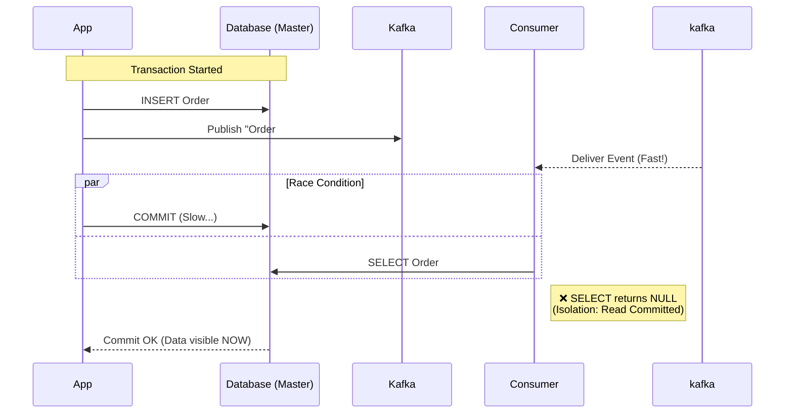
#### B. Type 2: The Replication Lag (Гонка Репликации)
"Хорошо," — думает разработчик, — "Я буду отправлять событие **после** коммита". Это спасает от проблемы изоляции, но открывает дверь для проблемы репликации, если Consumer читает с Read Replica (что является стандартом для Highload).
**Хронология:**
1. **App:** `COMMIT` в Master. (Данные надежно сохранены).
2. **App:** `kafka.send(...)`.
3. **Consumer:** Получает событие.
4. **Consumer:** Делает `SELECT` из **Replica**.
5. **The Lag:** Репликация в Postgres асинхронна. Лаг может составлять 10-100мс (в норме) или секунды (под нагрузкой).
6. **Result:** Мастер имеет данные, Реплика — еще нет. Consumer получает `null`.
#### C. Почему Kafka быстрее БД?
Это контринтуитивно, но архитектурно объяснимо:
- **Kafka:** Просто дописывает байты в конец файла (Sequential I/O) и отдает их в сеть. Почти Zero-Copy.
- **Database:** Должна обновить B-Tree индексы, проверить Foreign Keys, записать WAL, сделать fsync (иногда), обновить visibility map. Это тяжелая работа.
- **Сеть:** Внутри датацентра пакет летит < 1мс.
#### D. Решения (Mitigation)
Если вы попали в эту ловушку, у вас есть три пути (от плохого к правильному):
1. **Костыль (Retry):**
    - Если Consumer не нашел данные, он делает `sleep(100ms)` и пробует снова.
    - _Минус:_ Засоряет код, увеличивает latency, забивает потоки.
2. **Event Carried State Transfer (Толстое событие):**
    - Не отправляйте `{"id": 100}`.
    - Отправляйте `{"id": 100, "items": [...], "address": "..."}`. Весь стейт внутри события.
    - _Плюс:_ Consumer вообще не идет в БД. Гонки нет.
    - _Минус:_ Размер сообщений растет, проблемы с GDPR/Security (персональные данные в логах Kafka).
3. **Transactional Outbox (Правильное решение):**
    - См. Раздел 4. Consumer читает данные не когда они "прилетели", а когда они гарантированно закоммичены и извлечены из БД.

> [!check] Терминология 2026
> 
> - **MVCC (Multi-Version Concurrency Control):** Механизм в БД (Postgres, Oracle), который создает "снимки" данных. Благодаря ему читатели (SELECT) не блокируют писателей (INSERT), но читатели могут видеть "прошлое".
>     
> - **Eventual Consistency (Согласованность в конечном счете):** Гарантия того, что если прекратить изменения, то _через какое-то время_ все узлы (Master, Replica, Consumer) увидят одни и те же данные. Проблема в том, что бизнес часто не хочет ждать "какое-то время".
>

### 1.3. Why Transaction Managers Don't Help?

> [!abstract] "Фарш невозможно провернуть назад"
> Транзакционный менеджер (TM) эффективен только тогда, когда **все** участники процесса поддерживают протокол двухфазной фиксации (2PC / XA Standard).
>
> * **Postgres/Oracle:** Поддерживают XA (можно сделать `PREPARE TRANSACTION`, а потом `COMMIT/ROLLBACK`).
> * **Kafka / RabbitMQ / REST API:** **НЕ** являются XA-ресурсами.
>
> Вы не можете сказать HTTP-запросу "PREPARE". Как только байты ушли в сеть, они ушли. Вы не можете заставить Kafka "ждать" коммита в Postgres. Это две независимые вселенные.
#### A. The "Chained" Transaction Trap (Best Effort 1PC)
Многие фреймворки (Spring Data, Jakarta EE) предлагают паттерн **ChainedTransactionManager**. Он создает иллюзию атомарности, просто вызывая коммиты последовательно.

**Алгоритм (Псевдокод):**
```python
try:
    tx_db.begin()
    tx_kafka.begin()
    
    do_business_logic() # Write to DB, Send to Kafka buffer
    
    # The Critical Phase
    tx_kafka.commit()   # 1. Сначала коммитим Kafka (Событие ушло!)
    tx_db.commit()      # 2. Потом коммитим БД
except Exception:
    tx_kafka.rollback() # Бесполезно, если commit уже прошел
    tx_db.rollback()
```
**Сценарий сбоя:**
1. `tx_kafka.commit()` проходит успешно. Сообщение доступно потребителям.
2. **CRASH!** (Отключение питания, kill -9).
3. Приложение умирает _до_ выполнения `tx_db.commit()`.
4. База данных (не получив коммита) автоматически делает **ROLLBACK** при разрыве соединения.
5. **Итог:** У нас есть "Фантомное сообщение" в Kafka, ссылающееся на данные, которых нет в БД.

> [!warning] Chained TM Это не ACID. Это паттерн "Best Effort 1PC". Он лишь сужает окно уязвимости, но не устраняет его.
#### B. The "Kafka Transactions" Confusion

Kafka _действительно_ поддерживает транзакции (введены в версии 0.11). Разработчики видят это в документации и думают: _"О, мы спасены!"_.
Это заблуждение.
- **Kafka Transactions (`initTransactions`)** предназначены **только** для паттерна `Consume-Process-Produce` (читаем из Kafka Topic A -> обрабатываем -> пишем в Kafka Topic B).
- Они позволяют атомарно связать чтение (сдвиг оффсета) и запись (новое сообщение).
- Они **не знают** о вашей базе данных Postgres.
- Не существует способа связать LSN (Log Sequence Number) базы данных и Offset Kafka в одну атомарную операцию без внешнего координатора.
#### C. Why not XA (2PC)?
Теоретически, можно использовать брокеры, поддерживающие XA (например, старые версии ActiveMQ или IBM MQ), и базу данных через JTA (Java Transaction API).
Почему в 2026 году так никто не делает?
1. **Блокировка (Blocking):** В фазе `PREPARE` база данных блокирует строки. Она держит лок до тех пор, пока _медленный_ брокер сообщений не ответит. Если брокер тормозит, вся БД встает колом.
2. **Single Point of Failure:** Координатор транзакций становится узким местом. Если он падает, ресурсы остаются заблокированными вечно (heuristic hazard).
3. **Throughput:** XA убивает производительность. Kafka была создана, чтобы пропускать миллионы сообщений в секунду (Sequential I/O). XA требует random I/O и множественных сетевых RTT (Round Trip Time), что снижает пропускную способность на порядки.
4. **Cloud Native Incompatibility:** В облаке (AWS/GCP) сервисы эфемерны. XA требует стабильных IP и персистентных логов транзакций на каждом узле, что противоречит идеологии "Cattle, not pets".
#### D. The Only Way: Application-Level Consistency

Раз мы не можем положиться на инфраструктурный слой (Transaction Manager), мы должны поднять решение проблемы на уровень приложения.

Именно поэтому паттерн **Transactional Outbox** (Раздел 4) является единственным надежным решением. Мы переводим проблему "Распределенной транзакции между разнородными системами" в проблему "Локальной транзакции в одной БД".
- Мы пишем и бизнес-данные, и "намерение отправить сообщение" в **одну и ту же** базу данных.
- ACID базы данных гарантирует, что либо оба запишутся, либо никто.
- Асинхронная доставка (Relay) — это уже отдельный процесс, который может падать и ретраиться сколько угодно.
### 1.4. The Definition of Success

> [!abstract] Теорема о Двух Генералах
> В условиях ненадежной сети невозможно гарантировать, что два узла договорятся о статусе сообщения на 100% за конечное число шагов.
>
> Поэтому мы должны выбрать, чем жертвовать:
> 1.  **Safety (Безопасность):** Мы лучше остановим бизнес, чем допустим рассинхрон (CP-системы, 2PC).
> 2.  **Liveness (Живучесть):** Мы продолжим работу, но данные могут временно разъехаться или задублироваться (AP-системы, Saga).
#### A. The Impossible Dream: Atomic Commitment (Strong Consistency)
Это идеал: либо БД и Kafka обновились одновременно, либо никто.
* **Реализация:** Протокол 2PC (Two-Phase Commit).
* **Цена:** Если Kafka (или Координатор) недоступна, транзакция в БД **зависает**. Вы не можете продавать товары, потому что система уведомлений лежит.
* **Вердикт:** В Cloud Native архитектуре (Microservices) это анти-паттерн. Мы не жертвуем доступностью БД ради очереди сообщений.
#### B. The Realistic Goal: At-Least-Once Delivery (Eventual Consistency)
Это "Золотой Стандарт" для решения проблемы Dual Write.

**Контракт:**
1.  **Persistence:** Данные *гарантированно* записаны в локальную БД.
2.  **Delivery:** Система будет пытаться отправить сообщение в Брокер **бесконечно** (Retry Loop), пока не получит `ACK`.
3.  **Consequence:** Если сеть моргнула (Брокер получил сообщение, но `ACK` потерялся), Продюсер отправит сообщение повторно.
    * **Результат:** В Брокере могут появиться **дубликаты**.

> [!info] Почему мы выбираем дубликаты?
> Потеря данных (At-Most-Once) — это потеря денег/заказов. Это недопустимо.
> Дубликаты (At-Least-Once) — это техническая проблема, которую можно решить на стороне получателя.
>
> **Формула Успеха:**
> $$Reliability = AtLeastOnce (Producer) + Idempotency (Consumer)$$
#### C. The Consumer's Burden: Idempotency
Вы не можете решить проблему Dual Write, исправляя только Продюсера (отправителя). Вы *обязаны* спроектировать Консьюмера (получателя) так, чтобы он выдерживал дубликаты.

**Определение Идемпотентности:**
Математическое свойство операции, при котором многократное применение дает тот же результат, что и однократное.
$$f(f(x)) = f(x)$$

**Примеры:**
* **Плохо (Не идемпотентно):** `UPDATE wallets SET balance = balance - 100`.
    * Если сообщение придет дважды, мы спишем 200.
* **Хорошо (Идемпотентно):** `UPDATE wallets SET balance = balance - 100 WHERE tx_id = 'uuid-123' AND status = 'PENDING'`.
    * Второй раз `WHERE` не сработает (статус уже `PROCESSED`).
#### D. The "Exactly-Once" Myth
Маркетинг Kafka Streams и других систем часто обещает "Exactly-Once Processing".
Важно понимать нюанс:
* Это работает **только внутри** экосистемы Kafka (Kafka $\to$ Kafka).
* Как только вы выходите во внешний мир (Kafka $\to$ Email, Kafka $\to$ Postgres), гарантия исчезает.
* Вы снова возвращаетесь к паре **At-Least-Once + Idempotency**.
#### E. Summary Table: What are we building?

Мы строим систему типа **B (At-Least-Once)**.

| Тип гарантии | Потеря данных? | Дубликаты? | Latency | Применимость |
| :--- | :--- | :--- | :--- | :--- |
| **At-Most-Once** (Fire & Forget) | ✅ Да (возможна) | ❌ Нет | ⚡ Low | Логирование, метрики, некритичные пуши. |
| **At-Least-Once** (Retry) | ❌ Нет | ✅ Да (возможны) | 🐢 Medium | **Финансы, Заказы, Бизнес-события.** |
| **Exactly-Once** (2PC) | ❌ Нет | ❌ Нет | 🐌 High (Blocking) | Внутри одной БД или внутри Kafka Streams. |

> [!check] Архитектурное правило
> Когда Бизнес спрашивает: "Можем ли мы гарантировать, что платеж не пройдет дважды?", вы отвечаете:
> *"Мы гарантируем, что сообщение о платеже не потеряется (At-Least-Once), а наш процессинг игнорирует дубликаты (Idempotency)."*

---
## 2. The Classic Trap: 2PC (Two-Phase Commit)

> [!danger] Метафора "Свадебной Церемонии"
> Протокол 2PC работает как католическая свадьба.
> 1.  **Phase 1 (Voting):** Священник (Координатор) спрашивает каждого: "Берешь ли ты..?"
> 2.  **Point of No Return:** Как только вы сказали "Да" (Vote: Commit), вы **не можете** передумать. Вы обязаны ждать решения Священника.
> 3.  **Phase 2 (Decision):** Если **все** сказали "Да", Священник говорит "Объявляю вас мужем и женой" (Global Commit). Если хоть один сказал "Нет" (или умер) — свадьба отменяется для всех (Global Rollback).
>
> **Проблема:** Если Священник падает в обморок после вашего "Да", но до фразы "Объявляю...", вы стоите у алтаря вечно. Вы заблокированы.
### 2.1. The Mechanics: XA Standard (eXtended Architecture)

> [!info] Историческая справка
> **XA (eXtended Architecture)** — это спецификация Open Group (начала 90-х) для распределенной обработки транзакций (DTP).
> Она разделяет мир на:
> 1.  **AP (Application Program):** Ваш микросервис.
> 2.  **TM (Transaction Manager):** Координатор (например, Narayana, Atomikos, Seata).
> 3.  **RM (Resource Manager):** Хранилище данных (Postgres, Oracle, IBM MQ). Redis и Kafka **не являются** RM, так как не реализуют спецификацию XA.
#### A. The Global Transaction Identity (XID)
В отличие от локальной транзакции (`tx_id=100` внутри Postgres), глобальная транзакция имеет **XID** (Transaction Identifier), который генерирует TM.
Этот XID пробрасывается во все базы данных.
* Postgres знает: "Локальная транзакция 5555 является частью глобальной XID: abc-123".

#### B. Step-by-Step Protocol Execution

> [!info] Жизненный Цикл XA
> Обычная транзакция: `BEGIN` -> `SQL` -> `COMMIT`.
> XA транзакция: `XA START` -> `SQL` -> `XA END` -> `XA PREPARE` -> `XA COMMIT`.
>
> Самое важное происходит между `PREPARE` и `COMMIT`.
##### Phase 0: The Active Phase (Регистрация)
Прежде чем начнется "голосование", приложение выполняет работу.

1.  **Enlistment:** Приложение обращается к Transaction Manager (TM). TM создает глобальный `XID` и "подписывает" на него участвующие ресурсы (RM - Resource Managers, например, Postgres и JMS).
2.  **Execution:**
    * App шлет `INSERT` в Postgres. Postgres выполняет, но не коммитит.
    * App шлет сообщение в JMS. Брокер держит его в буфере, не отдавая потребителям.
3.  **Delimitation:** Приложение вызывает `commit()`.
    * TM шлет всем RM команду `XA END`.
    * Это сигнал: "Работа закончена, новые SQL запросы в этой транзакции приниматься не будут. Готовьтесь к голосованию".

##### Phase 1: The Prepare Phase (Hardening)
Это фаза, где **Latnecy превращается в Disk I/O**. Цель фазы — гарантировать, что RM *сможет* закоммитить, что бы ни случилось (пожар, перезагрузка).

TM шлет `XA PREPARE <XID>` каждому RM.

1.  **Logical Validation:** RM проверяет констрейнты (Unique, FK). Если ошибка $\to$ мгновенный `VOTE_ABORT`.
2.  **Hardening (Цементирование):**
    * RM берет все изменения из памяти (Dirty Pages) и пишет их в **WAL (Write Ahead Log)**.
    * **Critical:** RM делает `fsync` (принудительный сброс кэша ОС на физический диск).
    * *Зачем?* Если питание пропадет через секунду, RM обязан восстановить эту транзакцию из лога при рестарте.
3.  **Locking (Захват заложников):**
    * RM переводит блокировки строк (Row Locks) в режим "In-Doubt".
    * Теперь эти строки принадлежат не локальной сессии, а глобальному `XID`.
4.  **The Vow (Клятва):**
    * RM отвечает TM: `XA_OK` (Я готов).
    * **Контракт:** Ответив `XA_OK`, база данных **теряет право** на отмену. Она *обязана* ждать решения TM. Даже если TM "уснет" на час, база будет держать блокировки час.

> [!tip] Optimization: `XA_RDONLY`
> Если в данной транзакции вы только читали данные (`SELECT`) и ничего не меняли, RM отвечает `XA_RDONLY`.
> Это позволяет TM исключить этот ресурс из Фазы 2. Ему не нужно слать `COMMIT`, так как менять нечего. Это экономит один сетевой вызов.

##### Phase 2: The Commit Phase (Decision)
Это точка сингулярности. Решение принимает *только* TM.

1.  **The Decision Point:**
    * TM получил `XA_OK` от всех?
    * **Да:** Решение = `COMMIT`.
    * **Нет (или Timeout):** Решение = `ROLLBACK`.
2.  **Persistence of Decision (Запись в судовой журнал):**
    * TM пишет решение (`XID: COMMIT`) в **свой собственный** Transaction Log на диск.
    * *Зачем?* Если TM упадет *сейчас* (после принятия решения, но до отправки команд), при рестарте он прочитает лог: "Ага, транзакцию `abc` я решил коммитить". И начнет рассылку снова.
3.  **Broadcasting:**
    * TM шлет `XA COMMIT <XID>` всем RM.
    * *Примечание:* Если какой-то RM недоступен, TM будет долбиться к нему бесконечно (Retry Loop), пока тот не поднимется.
4.  **Completion (Освобождение):**
    * RM применяет изменения (делает видимыми).
    * RM **снимает блокировки**. (Ура, другие транзакции могут работать!).
    * RM удаляет запись о `XID` и отвечает `XA_OK` Координатору.
5.  **Forget:**
    * Получив подтверждения от всех, TM удаляет запись из своего лога. Транзакция забыта.

##### Example: The "In-Doubt" Nightmare
Представьте сценарий сбоя, чтобы понять цену 2PC.

1.  **Phase 1:** Postgres ответил `XA_OK`. Строка `id=100` заблокирована.
2.  **Crash:** Экскаватор перерубил кабель между TM (в США) и Postgres (в Европе).
3.  **Stalemate:**
    * Postgres "висит". Он не знает: "Все ли ответили ОК? Или кто-то отказал?".
    * Другие пользователи пытаются сделать `UPDATE ... WHERE id=100`. Они встают в бесконечное ожидание (Spinning/Blocking).
    * DBA видит лок. Он не может просто сделать `KILL SESSION`, потому что это нарушит целостность данных (если TM уже успел сказать "Commit" другим участникам).
4.  **Heuristic Hazard:**
    * DBA вручную принимает решение: `ROLLBACK PREPARED 'abc-123'`.
    * Если потом сеть поднимется и выяснится, что TM решил `COMMIT`, у нас будет **нарушение консистентности**, которое не починить кодом.

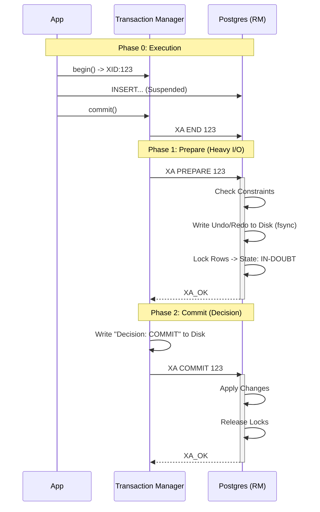
#### C. Java/JTA Example (Under the Hood)

> [!abstract] Магия "ThreadLocal"
> В JTA (Java Transaction API) разработчик редко передает объект транзакции явно (`db.exec(tx, sql)`).
> Вместо этого используется **ThreadLocal**.
> Транзакционный менеджер (TM) "вешает" контекст транзакции на текущий поток исполнения. Все ресурсы (JDBC DataSources, JMS Connection Factories), открываемые в этом потоке, автоматически "видят" этот контекст и присоединяются к нему.
##### 1. The Code: What Developer Sees
Вы пишете чистый бизнес-код. Выглядит просто, но это обманчивая простота.

```java
@Service
public class MoneyTransferService {
    
    @Autowired UserTransaction utx; // Интерфейс к TM (Arjuna/Atomikos)
    @Autowired DataSource dbDataSource; // XA-совместимый DataSource
    @Autowired ConnectionFactory jmsFactory; // XA-совместимый JMS

    public void transfer() throws Exception {
        // [STEP 1] Начало Глобальной Транзакции
        utx.begin(); 
        
        try {
            // [STEP 2] Работа с БД (Resource A)
            try (Connection conn = dbDataSource.getConnection()) {
                conn.createStatement().execute("UPDATE accts SET val = val - 100 WHERE id=1");
            } // conn.close() НЕ закрывает физ. соединение и НЕ делает commit!

            // [STEP 3] Работа с Очередью (Resource B)
            try (JMSContext ctx = jmsFactory.createContext()) {
                ctx.createProducer().send(queue, "Transfer Done");
            }

            // [STEP 4] Двухфазная фиксация
            utx.commit(); 
            
        } catch (Exception e) {
            utx.rollback();
            throw e;
        }
    }
}
```
#### 2. The Mechanics: What Actually Happens
Разберем построчно, что происходит внутри JVM и на уровне протокола.
**[STEP 1] `utx.begin()`**
- TM генерирует уникальный **Global Transaction ID (XID)**: `123-abc`.
- TM создает объект транзакции и кладет его в `ThreadLocal` текущего потока.
- Статус: `STATUS_ACTIVE`.

**[STEP 2] `dataSource.getConnection()` — The Enlistment (Вербовка)**
Это самый магический момент.
1. Вы просите соединение у пула.
2. Пул видит, что в `ThreadLocal` есть активная транзакция `123-abc`.
3. Пул берет физическое соединение к Postgres (`XAResource`).
4. Пул вызывает низкоуровневый метод драйвера: `XAResource.start(XID, TMNOFLAGS)`.
    - _Postgres:_ "Ага, все последующие команды в этой сессии относятся к глобальной транзакции `123-abc`".
5. Вы выполняете `UPDATE`. Postgres пишет в WAL, но не комитит.
6. `conn.close()`: Пул **не закрывает** соединение. Вместо этого он вызывает `XAResource.end(XID, TMSUCCESS)`.
    - _Postgres:_ "ОК, команды для этой транзакции закончены. Жду команды Prepare".

**[STEP 3] `jmsFactory.createContext()`**
Повторение сценария для второго ресурса.
1. JMS-драйвер видит XID в потоке.
2. Вызывает `XAResource.start(XID)` для брокера (IBM MQ / ActiveMQ).
3. `send()` отправляет сообщение. Брокер держит его в памяти, не отдавая потребителям.
4. Вызывает `XAResource.end(XID)`.

**[STEP 4] `utx.commit()` — The 2PC Protocol**
Здесь начинается "торможение". TM берет управление на себя.
1. **Phase 1 (Parallel Prepare):**
    - TM -> DB: `XAResource.prepare(XID)` $\to$ **fsync на диске БД**.
    - TM -> JMS: `XAResource.prepare(XID)` $\to$ **fsync на диске Брокера**.
2. **Logging:**
    - TM получает `XA_OK` от обоих.
    - TM пишет `COMMITTING 123-abc` в **свой лог** $\to$ **fsync на диске TM**.
3. **Phase 2 (Commit):**
    - TM -> DB: `XAResource.commit(XID, false)`.
    - TM -> JMS: `XAResource.commit(XID, false)`.
4. **Cleanup:**
    - TM очищает `ThreadLocal`.
#### 3. The Performance Price Tag
Давайте посчитаем стоимость этого кода в IOPS и Latency.

|**Операция**|**Локальная транзакция (1 DB)**|**XA Транзакция (DB + JMS)**|**Рост нагрузки**|
|---|---|---|---|
|**Сетевые вызовы (RTT)**|1 (Commit)|4 (Prepare x2 + Commit x2)|**400%**|
|**Disk Writes (fsync)**|1 (DB WAL)|3 (DB WAL + JMS Log + TM Log)|**300%**|
|**Lock Duration**|Короткая (только на время UPDATE)|**Длинная** (на время всей сети к JMS и обратно)|**Danger Zone**|

> [!danger] Почему Kafka не подходит?
> 
> Чтобы работать в этой схеме, драйвер Kafka должен реализовывать интерфейс `javax.transaction.xa.XAResource`.
> 
> Стандартный драйвер Kafka (`kafka-clients`) **этого не делает**.
> 
> Существуют проприетарные коннекторы, но они пытаются эмулировать XA поверх Kafka API, что ненадежно. Именно поэтому XA с Kafka — это архитектурная ошибка.

#### D. The Performance Penalty (Почему это медленно?)

> [!danger] Закон Литтла и Блокировки
> Самая страшная проблема XA — это не скорость сети, а **время удержания блокировки (Lock Duration)**.
>
> Пропускная способность строки (Max TPS per Row) ограничена формулой:
> $$TPS_{row} = \frac{1}{T_{lock}}$$
>
> * **Local TX:** Лок держится 1мс $\to$ 1000 обновлений в секунду.
> * **XA TX:** Лок держится 50мс (сеть + fsync) $\to$ **20 обновлений в секунду.**
>
> Вы физически не сможете продавать популярный товар быстрее 20 раз в секунду, какой бы мощный сервер БД у вас ни стоял.
##### 1. The Taxonomy of Latency (Из чего состоит торможение?)
Разберем анатомию одной транзакции. Почему она превращается из 2 мс в 50 мс?

1.  **Network RTT (Round Trip Time):**
    * В локальной транзакции приложение говорит с БД: `Req -> Resp`. (1 RTT).
    * В 2PC Координатор (TM) должен обменяться рукопожатиями со всеми:
        * `Prepare -> Ack` (DB)
        * `Prepare -> Ack` (MQ)
        * `Commit -> Ack` (DB)
        * `Commit -> Ack` (MQ)
    * **Итого:** 4 последовательных сетевых вызова. В облаке (AZ to AZ) это минимум 5-10 мс чистого пинга.

2.  **The `fsync` Tax (Налог на Диск):**
    * Самая дорогая операция в ОС. Принудительный сброс буфера на магнитный диск или SSD ячейки.
    * **Локально:** 1 `fsync` (Postgres WAL).
    * **XA:** 3 `fsync` (Postgres WAL + MQ Log + TM Decision Log).
    * Если ваш SSD выдает 1000 IOPS на запись, то XA снижает предел до 333 транзакций в секунду на поток.

##### 2. The "Convoy Effect" (Эффект Конвоя)
Представьте, что вы стоите в очереди в кассу (это очередь за блокировкой строки `id=100`).

* **Сценарий А (Локальный):** Покупатель подходит, платит, уходит. Занимает 1 секунду. Очередь движется быстро.
* **Сценарий Б (XA/2PC):** Покупатель подходит, достает телефон, звонит жене (Координатору), жена звонит теще (MQ)...
    * Все это время касса (строка БД) **занята**.
    * Вся очередь ждет, пока поговорят по телефону.
    * Если связь плохая (Latency Spike), покупатель стоит у кассы 10 секунд. Очередь вырастает до входа в магазин.
    * **Результат:** База данных показывает 100% CPU Wait, хотя диски и процессоры простаивают. Она просто ждет сеть.

##### 3. Reliability Coupling (Связанность Надежности)
В XA производительность системы определяется **самым медленным** участником.

$$Latency_{XA} = \max(Latency_{DB}, Latency_{MQ}) + Latency_{TM}$$

* Если ваша БД летает (0.1ms), но RabbitMQ ушел в Stop-The-World GC (500ms):
* **Блокировки в БД будут висеть 500ms.**
* Вы "заражаете" здоровую базу данных проблемами больного брокера сообщений.

##### 4. Comparison Matrix: The Price of ACID

| Metric | Local Transaction (Postgres) | Distributed 2PC (XA) | Impact Factor |
| :--- | :--- | :--- | :--- |
| **Commit Latency** | ~2-5 ms | ~20-100 ms | **10x - 50x Slower** |
| **Disk Syncs** | 1 (WAL) | 3+ (DB, MQ, TM) | **3x IO Load** |
| **Lock Hold Time** | Microseconds | Milliseconds (Network bound) | **Danger Zone** |
| **Throughput** | Limited by CPU/Disk | Limited by Network Latency | **Collapse** |
| **Scalability** | Linear | Negative (More nodes = Higher risk) | **Anti-Pattern** |
> [!check] Архитектурный Вердикт
> **Когда можно использовать 2PC?**
> 1.  **Low Frequency / High Value:** Перевод 1 миллиарда долларов между счетами раз в день. Здесь надежность важнее скорости, а блокировка на 100мс никому не мешает.
> 2.  **Internal Sharding:** Внутри NewSQL баз (CockroachDB), где сеть супер-быстрая и контролируемая.
>
> **Когда НЕЛЬЗЯ использовать 2PC?**
> 1.  **User Facing APIs:** Покупка в интернет-магазине.
> 2.  **High Concurrency:** Обновление счетчиков, балансов, складских остатков популярного товара.
> 3.  **Cloud Native:** В среде Kubernetes, где IP-адреса меняются, и поды умирают штатно. XA не переживет рестарта пода без потери транзакций ("Heuristic Hazard").
### 2.2. The Fatal Flaws (Почему это умерло?)

> [!danger] Теорема CAP на практике
> Протокол 2PC/XA — это экстремальная реализация **CA** (Consistency + Availability) в ущерб **P** (Partition Tolerance).
>
> В реальной сети (особенно в AWS/Azure) **Partition (P)** случается неизбежно.
> Когда случается разрыв сети, 2PC выбирает **Consistency** и жертвует **Availability**.
> **Перевод:** Ваша система встает колом и перестает принимать запросы, чтобы не допустить рассинхрона. Для Amazon или Netflix это недопустимо.
#### A. Synchronous Blocking: The "Resource Exhaustion" Pattern
Проблема не только в том, что транзакция долгая. Проблема в том, что она удерживает **дефицитные ресурсы** на все время ожидания сети.

**Цепная реакция:**
1.  **Locked Rows:** Транзакция держит лок на строку `User:123`.
2.  **Held Connection:** Транзакция держит физическое соединение с БД (из пула HikariCP/PgBouncer).
3.  **The Stall:** Сервис Б (участник транзакции) начинает тормозить (GC Pause на 2 секунды).
4.  **The Exhaustion:**
    * Сервис А продолжает принимать запросы.
    * Все потоки в Сервисе А встают в ожидание ответа от Сервиса Б.
    * Пул соединений с БД в Сервисе А исчерпывается (Pool Exhaustion).
5.  **Cascading Failure:** Сервис А перестает отвечать *даже на запросы, не связанные с этой транзакцией* (нет свободных соединений к БД).

> [!warning] Итог
> Один медленный микросервис в цепочке 2PC кладет **все** остальные микросервисы, участвующие в транзакции. Изоляция отказов (Fault Isolation) нарушается полностью.

#### B. Availability Math: The "Uptime" Product
Математика беспощадна. Объединяя сервисы в транзакцию, вы не складываете их надежность, а **перемножаете** их вероятность отказа.

Формула доступности системы с жесткой связью (Hard Coupling):
$$A_{system} = A_{coord} \times \prod_{i=1}^{N} A_{participant\_i}$$

**Пример из жизни:**
* У вас 3 сервиса: Order, Payment, Inventory.
* SLA каждого: **99.9%** (8.7 часов простоя в год). Вроде неплохо.
* SLA транзакции: $0.999 \times 0.999 \times 0.999 \approx 99.7\%$.
* **Результат:** 26 часов простоя в год.
* Если вы добавите 4-й сервис (Loyalty Points), надежность упадет еще ниже.
* **Бизнес-вывод:** Вы не можете провести платеж, потому что сервис "Бонусных Баллов" обновляется. Это архитектурный абсурд.

#### C. The "Heuristic Hazard" (Кошмар Администратора)
Это термин, который пугает опытных DBA.
**Heuristic Decision** — это когда база данных или администратор самовольно решают завершить подвисшую транзакцию, нарушая протокол, потому что "ждать больше нельзя".

**Сценарий катастрофы:**
1.  **Phase 1:** Координатор получил "ДА" от `DB_A` и `DB_B`.
2.  **Lock:** `DB_B` держит критические таблицы под локом.
3.  **Crash:** Координатор умирает (сгорает диск, падает под K8s) *до* отправки команды `COMMIT`.
4.  **Wait:** `DB_B` ждет... 1 минуту... 10 минут. Бизнес стоит.
5.  **Heuristic Rollback:** DBA видит, что продакшн лежит из-за лока. Он делает `ROLLBACK PREPARED` вручную, чтобы оживить систему.
6.  **Recovery:** Координатор перезагружается. Читает свой лог: "Я решил делать COMMIT".
7.  **Split Brain:** Координатор шлет `COMMIT` в `DB_A` (успех) и в `DB_B` (ошибка, так как транзакция уже убита).
8.  **Result:** Деньги списаны (`DB_A`), но товар не выдан (`DB_B`). Консистентность нарушена. Автоматического восстановления нет. Нужен ручной разбор данных.

#### D. Cloud Native Incompatibility (Kubernetes vs XA)
Почему 2PC умер именно с приходом Docker и Kubernetes?

1.  **Identity:** XA часто полагается на стабильные IP-адреса и хостнеймы для восстановления (Recovery). В K8s поды эфемерны, IP меняются.
2.  **Persistent Storage:** Координатор транзакций (TM) — это **Stateful** компонент. Ему нужен надежный диск для логов транзакций. Запускать Stateful TM в K8s — это операционная боль.
3.  **Auto-Scaling:** Если вы масштабируете микросервисы (`ReplicaSet`), кто из 10 реплик является "владельцем" незавершенной XA-транзакции?
    * XA требует "привязки" (Sticky) к конкретному экземпляру TM, что противоречит идеологии Cloud Native (Cattle, not Pets).

> [!check] Архитектурный вердикт
> XA/2PC — это технология для **статичных** систем (Mainframe, Oracle RAC, физические стойки), где топология сети не меняется годами.
> В динамичной микросервисной среде попытка внедрить XA равносильна попытке построить карточный домик во время землетрясения.
### 2.3. Sequence Diagram: The Blocking Wait

> [!danger] The "Kill Zone" (Зона Смерти)
> На диаграмме ниже обратите внимание на красную зону.
> Это период времени, когда строки базы данных находятся в статусе **In-Doubt**.
>
> В этот момент база данных **беспомощна**. Она не может отдать эти данные никому другому, даже если очень хочет. Она ждет сетевого пакета от Координатора.
> Любая задержка сети в этой зоне превращает микро-транзакцию в глобальный затор.
#### A. Visualizing the Bottleneck
Представим транзакцию покупки: списание денег (Bank DB) и резерв товара (Shop DB). Shop DB находится в другом регионе (Latency 50ms).

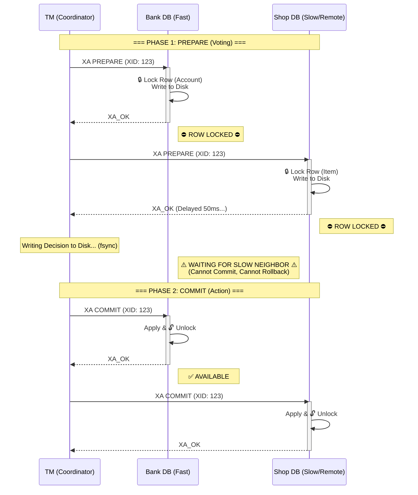
#### B. Decoding the Diagram: The Three Points of Failure

**1. The "Hostage" Situation (Ситуация с Заложником)**
Посмотрите на `Bank DB` (P1). Он ответил `XA_OK` почти мгновенно.
Но он **не может** снять блокировку, пока `Shop DB` (P2) не ответит Координатору, и пока Координатор не примет решение.
- **Эффект:** Быстрая база данных (`Bank DB`) искусственно замедляется до скорости самой медленной базы (`Shop DB`).
- **Метрика:** Latency транзакции = $Max(RTT_{P1}, RTT_{P2}, \dots)$.

**2. The Connection Pool Starvation (Голодание Пула)**
Пока `P1` ждет в красной зоне (`WAITING FOR SLOW NEIGHBOR`), физическое соединение TCP между вашим приложением и базой данных **занято**.
- Если у вас `HikariCP` с пулом в 10 коннектов.
- И транзакция длится 100мс (из-за сети).
- Максимальная пропускная способность сервиса = $10 \text{ conn} / 0.1 \text{ sec} = 100 \text{ RPS}$.
- **Итог:** Даже если CPU сервера простаивает, вы не можете обработать больше 100 запросов в секунду.

**3. The Global Lock Contention (Конкуренция за Локи)**
Если `Bank DB` — это высоконагруженный счет (например, "Кошелек Маркетплейса"), то блокировка этой строки на 100мс останавливает **все** платежи на платформе, которые затрагивают этот кошелек.
- В локальной БД лок висит 0.1мс.
- В XA — 100мс.
- Конкуренция (Contention) возрастает в 1000 раз.
#### C. Comparison: Why Sagas are Better?
Давайте наложим на эту диаграмму логику паттерна **Saga** (L2.SCL.16-3).
- **XA (2PC):** Лок держится от начала Фазы 1 до конца Фазы 2. (Длинная красная полоса).
- **Saga:**
    1. Транзакция в `Bank DB`: `Lock -> Update -> Commit -> Unlock`. (Мгновенно).
    2. Асинхронный вызов `Shop DB`.
    3. Транзакция в `Shop DB`: `Lock -> Update -> Commit -> Unlock`. (Мгновенно).

- **Разница:** В Saga нет момента, когда две базы заблокированы одновременно. Ресурсы освобождаются максимально быстро.

> [!check] Архитектурное правило
> 
> Никогда не включайте в XA-транзакцию ресурсы, находящиеся в разных зонах доступности (AZ) или регионах.
> 
> Сетевой джиттер (Jitter) в 50мс может показаться мелочью для HTTP API, но для блокировок базы данных это вечность.
### 2.4. exception: NewSQL (Google Spanner)

> [!abstract] Исключение, подтверждающее правило
> Google Spanner — это первая в мире глобально распределенная база данных, которая обеспечивает **External Consistency** (строгую линеаризуемость) и использует **2PC** на масштабе планеты, не страдая от проблем доступности.
>
> **Секрет:** Они решили проблему 2PC не программно, а аппаратно.
> 1.  **TrueTime API:** Атомные часы в каждом дата-центре.
> 2.  **Paxos над 2PC:** Участниками транзакции являются не одиночные сервера, а отказоустойчивые кворумы.
#### A. The "Paxos over 2PC" Trick (Решение проблемы доступности)

> [!abstract] Концепция "Бессмертного Участника"
> Главная уязвимость классического 2PC — это **Single Point of Failure** на стороне участников. Если Участник (БД) принимает `PREPARE`, а затем падает, вся глобальная транзакция зависает.
>
> **Решение Spanner:** Заменить ненадежный "Одиночный Сервер" на надежную "Paxos-группу".
> * Мы запускаем **2PC** поверх **Paxos**.
> * 2PC обеспечивает атомарность *между* шардами.
> * Paxos обеспечивает доступность *внутри* шарда.
##### 1. Architecture: Layers of Consensus
Чтобы понять магию, нужно разделить систему на слои.

* **Layer 1: The Shard (Range).** Данные разбиты на куски (Шарды). Например, `Users [A-M]` и `Users [N-Z]`.
* **Layer 2: The Replication Group.** Каждый Шард — это не один сервер, а кластер из 3 или 5 реплик, работающих по алгоритму консенсуса (Paxos в Spanner, Raft в CockroachDB).
    * У группы есть один **Leader** (принимает записи) и **Followers**.
* **Layer 3: The Transaction.** Глобальная транзакция координирует действия между *Лидерами* разных групп.

##### 2. The Mechanics: How it works?
Представим транзакцию, переводящую деньги с Шарда 1 на Шард 2.

**Step 1: Prepare Phase (Replicated Lock)**
Координатор шлет команду `PREPARE` Лидеру Шарда 1.
* **Classic DB:** Лидер пишет в локальный файл WAL и отвечает "OK". Если диск сгорит — конец.
* **NewSQL:**
    1.  Лидер получает `PREPARE`.
    2.  Лидер создает запись лога: *"Op: Prepare, TxID: 123, Lock: Row X"*.
    3.  Лидер **реплицирует** эту запись через Paxos/Raft на Фолловеров.
    4.  Только когда **Большинство (Quorum)** подтвердило запись ("Saved to disk"), Лидер отвечает Координатору: `XA_OK`.

**Step 2: The Crash (Fault Tolerance)**
В классике здесь наступает смерть. В Spanner — штатная ситуация.
* **Event:** Лидер Шарда 1 падает (Power failure) сразу после ответа `XA_OK`.
* **Detection:** Фолловеры перестают получать хартбиты.
* **Election:** Оставшиеся реплики выбирают Нового Лидера (за 3-5 секунд).
* **Recovery:** Новый Лидер читает свой реплицированный лог. Он видит запись: *"Op: Prepare, TxID: 123"*.
    * **Вывод:** "Ага, мы пообещали заблокировать эту строку. Я должен держать этот лок и ждать команды Координатора".

**Step 3: Commit Phase (Resumption)**
Координатор (возможно, тоже перезапущенный) шлет `COMMIT`.
* Команда приходит Новому Лидеру.
* Новый Лидер применяет её, реплицирует через Paxos факт коммита и снимает локи.

##### 3. Why is this revolutionary?
Это решает проблему **Blocking Availability**.

В классическом 2PC:
$$P(\text{Stall}) \approx 1 - (A_{node})^N$$
Где $N$ — количество участников. Чем больше шардов, тем выше шанс, что транзакция зависнет.

В Spanner/CockroachDB:
$$P(\text{Stall}) \approx 1 - (A_{group})^N$$
Надежность группы ($A_{group}$) на порядки выше надежности узла. Группа "умирает" только если выходят из строя $F+1$ реплик одновременно (например, 2 из 3).
Это позволяет Google запускать транзакции через 100 шардов с минимальным риском глобальной блокировки.
##### 4. Mermaid Visualization: The Resilient Participant

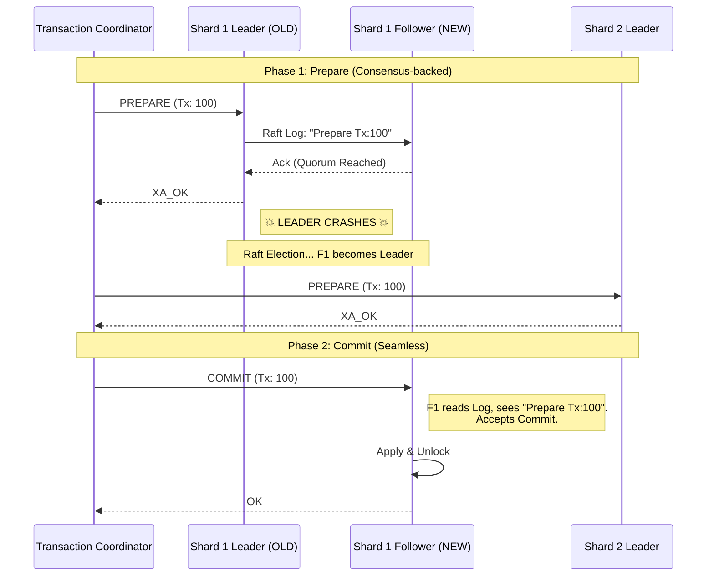

> [!check] Архитектурный урок Если вы строите систему, где важна строгая консистентность (CP), но вы боитесь блокировок 2PC — посмотрите в сторону **CockroachDB** или **TiDB**. Они берут на себя сложность управления Paxos-группами, предоставляя вам простой SQL-интерфейс, который ведет себя как "магический неубиваемый Postgres".
#### B. The TrueTime API (Решение проблемы скорости)

> [!abstract] Проблема Эйнштейна в Базах Данных
> В распределенной системе невозможно сказать, какое событие произошло раньше, если они случились на разных машинах.
>
> * **Сервер А (Лондон):** Часы показывают `12:00:00.005`.
> * **Сервер Б (Нью-Йорк):** Часы показывают `12:00:00.001`.
>
> Если Сервер Б запишет данные, а Сервер А их прочитает — увидит ли он эту запись? Если часы рассинхронизированы (Clock Skew), мы можем нарушить причинно-следственную связь (**Causality**). Мы можем прочитать данные "из будущего" или не увидеть данные "из прошлого".
>
> **TrueTime** решает это, признавая, что точного времени не существует. Существует только **интервал вероятности**.
##### 1. The API: Time is an Interval
Обычный Linux `gettimeofday()` возвращает одно число (timestamp). Это ложь, потому что кварцевый генератор на материнской плате дрейфует.

Google TrueTime возвращает структуру:
```cpp
struct TTInterval {
    time_t earliest; // Самое раннее возможное время сейчас
    time_t latest;   // Самое позднее возможное время сейчас
};
```

$$TT.now() = [t_{earliest}, t_{latest}]$$

Ширина интервала $\varepsilon = t_{latest} - t_{earliest}$ называется **Uncertainty Window (Окно Неопределенности)**.
- Благодаря атомным часам и GPS, Google держит $\varepsilon < 7ms$ (в среднем 4ms).
- Обычный NTP (Network Time Protocol) в интернете имеет $\varepsilon \approx 100-250ms$.
##### 2. The Algorithm: "Commit Wait" (Ожидание Истины)
Это сердце Spanner. Как гарантировать строгий порядок транзакций (External Consistency), если часы неточны?
**Правило:** Если транзакция $T_1$ хочет закоммититься с временной меткой $t_{commit}$, она должна **ждать**, пока мы не будем на 100% уверены, что $t_{commit}$ остался в прошлом.

**Механизм:**
1. **Выбор метки:** Координатор выбирает $t_{commit} = TT.now().latest$. (Берем "худший" вариант времени).
2. **Пауза (Wait):** Координатор держит блокировки и **ничего не делает** в течение времени $2 \times \varepsilon_{average}$ (около 10-14 мс).
3. **Проверка:** Координатор ждет, пока $TT.now().earliest$ станет больше, чем $t_{commit}$.
    - _Смысл:_ "Я подожду столько, чтобы даже самые отстающие часы в кластере гарантированно перевалили за отметку $t_{commit}$". 
4. **Фиксация:** Только теперь применяем изменения и снимаем локи.

> [!check] Результат
> 
> Если транзакция $T_2$ начнется _после_ завершения $T_1$, она гарантированно получит метку времени $t_{start2} > t_{commit1}$.
> 
> Даже если $T_1$ была в Австралии, а $T_2$ в США.
> 
> Это свойство называется **External Consistency** (или Strict Linearizability). Оно позволяет делать `SELECT` без блокировок (Snapshot Read) и получать всегда корректные данные.
##### 3. Why NTP destroys 2PC Performance?
Почему мы не можем использовать этот алгоритм в обычном Postgres поверх NTP?
Давайте посчитаем **Commit Wait** для NTP.
- Неопределенность NTP ($\varepsilon$) $\approx 100ms$ (оптимистично).
- Wait Time $\approx 2 \times 100ms = 200ms$.

Это значит, что каждый `INSERT` / `COMMIT` в вашей базе данных будет искусственно тормозиться на **200 миллисекунд**.
- Пропускная способность транзакций упадет до 5 штук в секунду на поток.
- Это неприемлемо для продакшена.

Google Spanner работает быстро (latency ~10-20ms) только потому, что они аппаратно сжали $\varepsilon$ до 4ms.
##### 4. Mermaid Visualization: The Wait Logic
Представьте две транзакции. Мы должны гарантировать, что они не перекроются во времени.

```mermaid
gantt
    dateFormat  SSS
    axisFormat  %S.%L
    title Commit Wait Strategy (Google Spanner)

    section Transaction 1
    Start T1          :active, t1, 000, 005
    Pick Timestamp (Ts=10):crit, 005, 005
    Wait Uncertainty (Commit Wait): 005, 015
    Commit T1 (Visible) :done, 015, 016

    section Real Time
    Uncertainty Window :active, 005, 014
    
    section Transaction 2
    Start T2 (Must be > Ts) :active, 017, 020
    Read Snapshot (Ts=10) : 020, 025
```
**Пояснение:**
- T1 выбирает Timestamp = 10ms.
- Но из-за погрешности часов, реальное время может быть 6ms.
- Если T1 сразу закоммитит и отпустит лок, T2 может начаться в "реальные" 8ms, получить Timestamp = 9ms.
- **Нарушение:** T2 началась _после_ T1 (физически), но имеет Timestamp _меньше_ (логически).
- **Commit Wait** заставляет T1 ждать до 15ms, чтобы гарантировать, что "время 10ms" точно прошло для всех.
##### 5. Hardware: The "Time Master"
Как Google добивается $\varepsilon < 7ms$?
В каждом дата-центре стоят **Time Master** серверы:
1. **GPS-приемники:** Получают время со спутников. (Точность высокая, но антенны могут отвалиться или заглушиться).
2. **Атомные часы (Atomic Clocks):** Используют распад рубидия/цезия. (Супер-стабильны, не зависят от сети).
3. **Daemon:** Локальный демон на каждом сервере постоянно опрашивает несколько Time Masters, отбрасывает аномалии и вычисляет узкий интервал.

> [!danger] Архитектурный урок
> 
> Без специального железа (Hardware Clocks) построить глобально распределенную базу данных с поддержкой строгой консистентности и высокой производительностью — **невозможно**.
> 
> Поэтому CockroachDB и YugabyteDB (работающие на обычном железе) используют **HLC (Hybrid Logical Clocks)**. Они расслабляют требования: они не ждут реального времени, а используют логические счетчики для разрешения конфликтов, что чуть менее надежно при катастрофических рассинхронах часов.
#### C. Open Source Alternatives: CockroachDB & TiDB

> [!abstract] Проблема "Commodity Hardware"
> У нас нет атомных часов. У нас есть дешевые VM в AWS, где `NTP` может врать на 500мс.
> Как построить **Strictly Serializable** (CP) базу данных в таких условиях?
>
> 1.  **CockroachDB:** "Мы используем локальные часы, но если они врут слишком сильно — узел совершает самоубийство". (Подход децентрализации).
> 2.  **TiDB:** "Локальным часам верить нельзя. Время выдает только Император (PD)". (Подход централизации).
##### 1. CockroachDB: Hybrid Logical Clocks (HLC)
Создатели CRDB (экс-гуглеры) адаптировали идеи Spanner для железа без GPS.

**Механизм HLC:**
Вместо одного числа (Unix Timestamp), время представлено парой:
$$HLC = \{ \text{PhysicalTime}, \text{LogicalCounter} \}$$

**Алгоритм:**
1.  **Causality Tracking:** Когда узел А посылает сообщение узлу Б, он прикладывает свой $HLC_A$.
2.  **Update:** Узел Б, получив сообщение, делает:
    $$HLC_B.\text{phys} = \max(\text{LocalWallTime}, HLC_A.\text{phys})$$
    Если сообщение пришло "из будущего" (часы А спешат), Узел Б подтягивает свои часы вперед (логически) или инкрементирует счетчик.
    * *Эффект:* Это создает **частичный порядок** (Partial Ordering), который уважает причинно-следственные связи, даже если физические часы чуть-чуть врут.

**Safety Barrier (Max Offset):**
CRDB имеет жесткую настройку `--max-offset` (по дефолту 500ms).
* Если узел обнаруживает, что его физические часы отстали от кластера более чем на 500ms (NTP failure), он **паникует и выключается** (Node Suicide).
* Это гарантирует, что "Окно Неопределенности" никогда не превысит 500ms.

> [!warning] Плата за отсутствие GPS
> В Spanner "Commit Wait" = 7ms.
> В CockroachDB при чтении данных "из настоящего" (follower read) иногда приходится ждать `MaxOffset` (до 500ms), чтобы гарантировать консистентность. Либо использовать специальные запросы `AS OF SYSTEM TIME`.
##### 2. TiDB: The Timestamp Oracle (TSO)
TiDB (вдохновленная Google Percolator) пошла по пути упрощения. Зачем мучиться с синхронизацией часов на 100 нодах, если можно раздавать время из одной точки?

**Архитектура:**
* **PD (Placement Driver):** Кластер управления (обычно 3 ноды). Лидер PD выполняет роль **TSO** (Timestamp Oracle).
* **TiKV:** Хранилище данных (Key-Value).
* **TiDB:** SQL-слой (Stateless).

**Алгоритм транзакции:**
1.  **Start:** Клиент хочет начать транзакцию. Он делает запрос к PD: "Дай мне `Start_TS`".
2.  **Execution:** Клиент читает/пишет в TiKV, используя `Start_TS` для изоляции (Snapshot Isolation).
3.  **Commit:** Клиент хочет закоммитить. Он снова идет к PD: "Дай мне `Commit_TS`".
4.  **Finalize:** Запись в TiKV фиксируется с `Commit_TS`.

**Плюсы:**
* Идеальная линейная история. `Commit_TS` — это просто монотонный `int64`. Никакой неопределенности.

**Минусы (География):**
* TSO — это узкое место и точка латентности.
* Если кластер **глобальный** (Шарды в США, Европе, Азии), а TSO стоит в США:
    * Каждая транзакция в Европе требует **2 трансатлантических перелета** (получить Start_TS, получить Commit_TS).
    * Это добавляет минимум **150-200ms** latency к любому `INSERT`.

##### 3. Comparison Matrix: Choosing Your Weapon

| Характеристика | Google Spanner | CockroachDB | TiDB |
| :--- | :--- | :--- | :--- |
| **Clock Source** | Atomic + GPS (TrueTime) | NTP + Logical (HLC) | Centralized Counter (TSO) |
| **Uncertainty ($\varepsilon$)** | < 7ms | ~250-500ms | 0 (Strict Order) |
| **Geo-Distribution** | **Ideal.** Wait is negligible. | **Good.** HLC handles local skew. | **Poor.** Latency penalty due to TSO RTT. |
| **Throughput** | Extreme | High | High (in single region) |
| **Dependency** | Specialized Hardware | NTP Health | PD Availability |

> [!check] Архитектурный вердикт
> **Когда брать CockroachDB?**
> * Вам нужен **Multi-Active Multi-Region** (запись в США и Европе одновременно с локальной скоростью).
> * Вы готовы следить за NTP демонами.
>
> **Когда брать TiDB?**
> * Ваш кластер находится в **одном регионе** (или Latency между AZ мала).
> * Вам нужна совместимость с протоколом MySQL.
> * Вы хотите архитектуру с разделением Compute (TiDB) и Storage (TiKV) для масштабирования аналитики (HTAP).

#### D. Comparison Table: Why not just use Spanner logic everywhere?

| Feature            | Classic 2PC (Microservices)       | Google Spanner (NewSQL)            |
| :----------------- | :-------------------------------- | :--------------------------------- |
| **Participant**    | Single Node (Fragile)             | Paxos/Raft Group (Robust)          |
| **Failure Impact** | Global Stall                      | Transparent Failover               |
| **Network**        | Public Internet / Virtual Network | Private Google Fiber (Low Latency) |
| **Clock Source**   | NTP (Unreliable)                  | Atomic + GPS (TrueTime)            |
| **Lock Duration**  | Network RTT dependent             | Commit Wait dependent              |

> [!check] Архитектурный Вердикт
> **Не пытайтесь повторить это дома.**
> * Spanner/CockroachDB работают, потому что они контролируют **весь стек**: от диска до сетевого протокола.
> * Пытаться построить аналог Spanner на уровне прикладного кода (Java/Go) поверх разнородных баз данных (Postgres + Mongo) — утопия.
> * Если вам нужна строгая консистентность и 2PC — **возьмите готовую NewSQL базу**, не пишите свой велосипед.

---
## 3. The Modern Standard: Saga Pattern

> [!abstract] Определение
> **Saga** — это последовательность локальных транзакций в разных микросервисах.
>
> Вместо одной длинной ACID-транзакции ($T_{global}$), мы выполняем цепочку коротких:
> $$T_1 \rightarrow T_2 \rightarrow T_3 \dots \rightarrow T_n$$
>
> Если транзакция $T_k$ падает, мы должны выполнить **компенсирующие действия** в обратном порядке, чтобы отменить эффекты $T_1 \dots T_{k-1}$:
> $$C_{k-1} \rightarrow C_{k-2} \dots \rightarrow C_1$$
### 3.1. The "ACD" Model (Жертва Изоляцией)

> [!abstract] Анатомия ACD
> Паттерн Saga жертвует буквой **I (Isolation)**, чтобы получить **A (Availability)**.
>
> * **A (Atomicity):** Семантическая атомарность. Либо все транзакции выполнены, либо выполнены компенсации. "Всё или ничего" (но растянутое во времени).
> * **C (Consistency):**
>     * *Local Consistency:* Каждая микро-транзакция ($T_i$) переводит локальную БД в валидное состояние.
>     * *Global Consistency:* Достигается только в конце Саги (Eventual Consistency).
> * **D (Durability):** Изменения каждого шага надежно сохранены в БД.
> * **I (Isolation):** ❌ **Отсутствует.**
>     * Промежуточные результаты транзакции $T_1$ видны всему миру **до** завершения всей Саги ($T_n$).
#### A. Why Isolation is Impossible? (Физика процессов)
В 2PC (ACID) мы держим блокировки на строках всё время жизни транзакции.
В Саге:
1.  **Step 1:** Сервис Заказов создает заказ. `COMMIT`. Блокировка снята.
2.  **Network Wait:** Ждем ответа от Платежного сервиса (100мс... 10с... 1 час).
3.  **Step 2:** Платежный сервис списывает деньги.
4.  **Anomaly Window:** В промежутке между Шагом 1 и Шагом 2 данные заказа доступны для чтения и изменения *другими* Сагами.
#### B. The Three Anomalies of Sagas (Классификация Рисков)
Вы обязаны знать врага в лицо. Гектор Гарсия-Молина в 1987 году описал эти аномалии для длинных транзакций (LLT).

**1. Lost Update (Потерянное обновление)**
Сага А перезаписывает изменения Саги Б, не зная о них.

* **Сценарий:**
    * Сага А (Одобрение кредита): Читает лимит клиента ($1000).
    * Сага Б (Списание покупки): Читает лимит ($1000). Списывает $100. Пишет $900.
    * Сага А: Одобряет кредит, списывает комиссию $10. Пишет $990 (основываясь на прочитанных $1000).
* **Результат:** Покупка Саги Б ($100) исчезла из баланса. Банк потерял деньги.
* **Защита:** Семантические блокировки (см. пункт C).

**2. Dirty Read (Грязное чтение)**
Сага А читает данные, которые записала Сага Б, но Сага Б позже *откатывается* (компенсируется).

* **Сценарий:**
    * Сага А (Покупка): Списывает деньги с карты. Баланс: $0.
    * Сага Б (Ежемесячный отчет): Читает баланс $0. Генерирует PDF "Денег нет".
    * Сага А: Фейлится на шаге "Доставка". Запускает Компенсацию. Возвращает деньги. Баланс: $1000.
* **Результат:** Пользователь получил отчет, где у него $0, хотя деньги вернулись. Данные в отчете некорректны.
* **Защита:** Версионирование статусов (`PENDING` state).

**3. Non-Repeatable Read (Неповторяющееся чтение)**
Сага читает данные дважды и получает разные результаты, потому что между чтениями вмешалась другая Сага.

* **Сценарий:**
    * Агент А проверяет наличие товара: "Есть 1 шт".
    * Агент А начинает думать (LLM Inference 10 сек).
    * Агент Б покупает этот товар (stock - 1).
    * Агент А решает купить товар. Пытается зарезервировать.
* **Результат:** Сбой операции, хотя проверка прошла успешно.
* **Защита:** Дизайн "Pessimistic Reservation" (Сначала резервируй, потом думай).
#### C. Defense Strategy: Semantic Locking (Семантическая Блокировка)
Раз у нас нет блокировок БД, мы должны имитировать их на уровне приложения.
Вместо того чтобы менять "сырые" данные (`balance`), мы вводим состояния.

**Плохо (Raw Update):**
```sql
UPDATE accounts SET balance = balance - 100 WHERE id = 1;
-- Деньги исчезли сразу. Если сага откатится, они появятся из воздуха.
```
**Хорошо (Semantic Lock / Pending):**
``` SQL
-- 1. Резервируем средства (Semantic Lock)
INSERT INTO reservations (account_id, amount, status) VALUES (1, 100, 'PENDING');

-- 2. Вычисляем доступный баланс (View)
-- Available = ActualBalance - Sum(PendingReservations)
```
**Как это решает аномалии?**
- **Dirty Read:** Отчеты читают только `ActualBalance`. Они не видят `PENDING` транзакций. Грязного чтения нет.
- **Lost Update:** Мы ничего не перезаписываем (`INSERT` вместо `UPDATE`).
- **Rollback:** Чтобы компенсировать, мы просто меняем статус резерва на `CANCELLED` или удаляем запись. Это безопасная операция.
#### D. Visualizing the Interleaving (Гонка Саг)

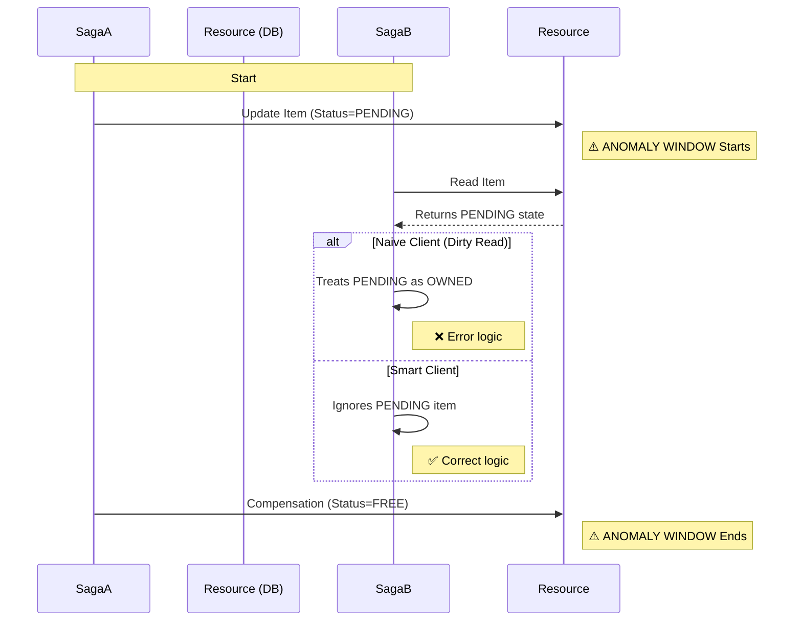

> [!check] Архитектурный Вердикт Использование Саг требует изменения UI/UX. Пользователь должен видеть не "Заказ Оплачен", а "Платеж в обработке". Пользователь должен видеть не "Товар куплен", а "Товар зарезервирован".
> 
> **Вывод:** Техническая проблема отсутствия Изоляции решается через **честность интерфейса** перед пользователем.
### 3.2. The Mechanics: Semantic Compensation

> [!abstract] Метафора "Зубной пасты"
> ACID-транзакция (2PC) похожа на редактирование текста в Word: нажали `Ctrl+Z`, и ошибки как не бывало.
>
> Сага похожа на выдавливание зубной пасты из тюбика.
> Если вы выдавили лишнее ($T_i$), вы не можете просто "засунуть" пасту обратно.
> Вы должны выполнить **Компенсирующее Действие ($C_i$)**: взять салфетку и вытереть раковину.
>
> **Результат:** Раковина чистая, но паста потрачена, салфетка грязная, и время ушло. Это и есть **Семантическая Компенсация**.
#### A. The Equation of Compensation
Математически, если $S$ — это состояние системы, то:
* **ACID Rollback:** $S_{final} = S_{initial}$ (Идеальный возврат).
* **Saga Compensation:** $S_{final} \approx S_{initial} + \text{SideEffects}$.

Где **Side Effects** — это логи аудита, отправленные уведомления, комиссии платежных шлюзов или просто потраченное время пользователя.

#### B. Classification of Reversibility (Спектр Обратимости)
Не все действия одинаково легко отменить. Мы делим транзакции на три типа риска.

| Тип транзакции | Пример | Сложность Компенсации ($C_i$) | Стратегия |
| :--- | :--- | :--- | :--- |
| **1. Naturally Reversible** | `POST /reservations` (Бронь в БД) | 🟢 **Easy.** `DELETE /reservations`. Или смена статуса на `CANCELLED`. Это чистая операция с данными. | Делайте эти шаги первыми. |
| **2. Compensatable with Loss** | `POST /charge` (Списание денег) | 🟡 **Medium.** `POST /refund`. Возврат возможен, но вы теряете комиссию эквайринга (2%), и деньги идут клиенту 3 дня. | Откладывайте до последнего момента. |
| **3. Pivot / Irreversible** | `POST /send-email` (Письмо "Ваш заказ отправлен") | 🔴 **Impossible.** Вы не можете удалить письмо из ящика пользователя. | **Pivot Point.** Делайте это только тогда, когда вероятность отмены = 0. |
#### C. The "Semantic Undo" Examples
Как писать код компенсации? Это не всегда очевидно.

**Scenario 1: The Banking Transfer**
* **Transaction ($T$):** `Deposit $100` (Пополнение счета).
* **Naive Compensation:** `Withdraw $100`.
* **Risk:** Что если между $T$ и $C$ пользователь успел вывести деньги, и баланс стал $50? Вы не можете списать $100 (уйдете в овердрафт).
* **Semantic Compensation ($C$):** "Создать корректирующую запись (Credit Note) на -$100". Если баланса нет — повесить долг. Это бизнес-решение, а не техническое.

**Scenario 2: The Ticket Booking**
* **Transaction ($T$):** Выписать билет на место 12A.
* **Naive Compensation:** Удалить билет.
* **Semantic Compensation ($C$):**
    1.  Аннулировать билет (сделать невалидным QR-код).
    2.  Вернуть место 12A в пул доступных ("Release seat").
    3.  *Side Effect:* Если кто-то подписан на "уведомление о местах", триггернуть событие.

**Scenario 3: The AI Agent (2026 Context)**
* **Transaction ($T$):** Агент отправил грубое письмо клиенту.
* **Compensation ($C$):**
    * Технически отмена невозможна.
    * Семантически: Агент генерирует и отправляет *новое* письмо с извинениями и промокодом.

#### D. The Golden Rule: Idempotency (Идемпотентность)
Это самое важное техническое требование к коду компенсаций.

> [!danger] Правило Выживания
> Оркестратор (Temporal/Cadence) будет вызывать вашу функцию компенсации ($C_i$) **бесконечно**, пока она не вернет "Success".
> Если сеть моргнет, вы получите вызов $C_i$ дважды.

**Плохой код (Not Idempotent):**
```python
def compensate_payment(order_id):
    # DANGER: Если вызвать 2 раза, мы вернем деньги дважды!
    payment_gw.refund(order_id, amount=100)
```
**Хороший код (Idempotent):**
```Python
def compensate_payment(order_id):
    # 1. Check State (Have we already refunded?)
    tx = db.get_transaction(order_id)
    if tx.status == 'REFUNDED':
        return "OK" # Already done, don't do it again
        
    # 2. Perform Action (Safe Refund)
    try:
        # Pass a unique idempotency_key to the provider
        payment_gw.refund(order_id, idempotency_key=f"refund_{order_id}")
        db.update_status(order_id, 'REFUNDED')
    except ProviderError:
        raise RetryableError() # Temporal will retry
```
#### E. What if Compensation Fails? (Zombie Sagas)
Представьте: $T_1$ (Бронь отеля) прошла. $T_2$ (Авиабилет) упала.
Нужно вызвать $C_1$ (Отмена отеля).
Но сервис отеля **лежит** (500 Error).

Что делать?
1. **Infinite Retries:** Оркестратор будет долбить сервис отеля часами/днями (Exponential Backoff). Это штатное поведение.
2. **Human Escalation:** Если компенсация не проходит 24 часа, Сага переходит в статус `ZOMBIE` (или `MANUAL_INTERVENTION`).
    - Создается тикет в Jira для саппорта.
    - Человек звонит в отель и отменяет бронь голосом.
    - Человек нажимает кнопку "Complete" в админке Оркестратора.

> [!check] Архитектурный урок
> 
> Никогда не пишите логику: "Если компенсация не удалась — ну и ладно, залогируем ошибку и выйдем".
> 
> Это приведет к **утечке ресурсов** (забронированные, но неоплаченные номера) и потере денег.
> 
> Компенсация **обязана** завершиться успехом. Рано или поздно. Роботом или Человеком.
### 3.3. Implementation Styles: The Great Debate

> [!abstract] Кто управляет хаосом?
> Главный вопрос при проектировании Саги: **"Где живет логика принятия решений?"**
>
> 1.  **Choreography:** Логика размазана по всем сервисам. Никто не знает полной картины.
> 2.  **Orchestration:** Логика собрана в одном месте (God Service / Workflow Engine). Есть "Владелец процесса".
#### A. Style 1: Choreography (Event-Driven / Танцоры)
Подход "Smart Endpoints, Dumb Pipes". Сервисы общаются исключительно через шину событий (Kafka/RabbitMQ). Нет центрального мозга.

**Метафора:** Джазовая импровизация. Музыканты слушают друг друга и подстраиваются. Нет дирижера.

**Workflow:**
1.  **Order Service:** Создает заказ $\to$ публикует событие `OrderCreated`.
2.  **Stock Service:** Подписан на `OrderCreated`. Резервирует товар $\to$ публикует `StockReserved`.
    * *Если ошибка:* Публикует `StockReservationFailed`.
3.  **Payment Service:** Подписан на `StockReserved`. Списывает деньги $\to$ публикует `PaymentProcessed`.
    * *Если ошибка:* Публикует `PaymentFailed`.
4.  **Order Service:** Подписан на `PaymentProcessed` (Success) и `PaymentFailed` (Compensate).

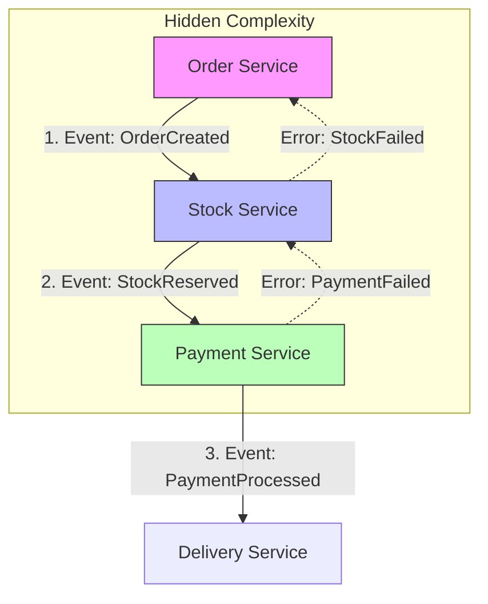
**Почему это опасно (The Trap):**
1. **Cyclic Dependencies (Циклические связи):**
    - Сервис А слушает Сервис Б, который слушает Сервис А.
    - Визуально архитектура превращается в клубок (Death Star Architecture).
2. **Observability Hell:**
    - "Где застрял заказ #555?"
    - Вам нужно проверить логи 4-х разных сервисов и Kafka, чтобы понять, что событие потерялось. Нет единого дашборда.
3. **Hidden Business Logic:**
    - Чтобы понять процесс "Создание заказа", вам нужно открыть репозитории кода 4-х разных команд. Никто в компании не может показать пальцем в одно место и сказать: "Вот алгоритм работы".

**Когда использовать?**
- Простые, линейные процессы (1-3 шага).
- Аналитика и уведомления (Fire & Forget).
#### B. Style 2: Orchestration (Command-Driven / Дирижер)
Вводится специальный сервис — **Оркестратор** (или Saga Coordinator).
В 2026 году это обычно реализуется через **Temporal**, **Cadence** или **Netflix Conductor**.
**Метафора:** Симфонический оркестр. Музыканты смотрят на дирижера. Дирижер решает, кто вступает.

**Workflow:**
1. **Order Service:** Получает HTTP-запрос. Запускает Workflow в Оркестраторе.
2. **Orchestrator:**
    - Шлет _Команду_ (gRPC/HTTP): `StockService.Reserve()`. Ждет ответа.
    - Шлет _Команду_: `PaymentService.Charge()`. Ждет ответа.
    - Если ошибка $\to$ Шлет _Команду_: `StockService.Cancel()`.

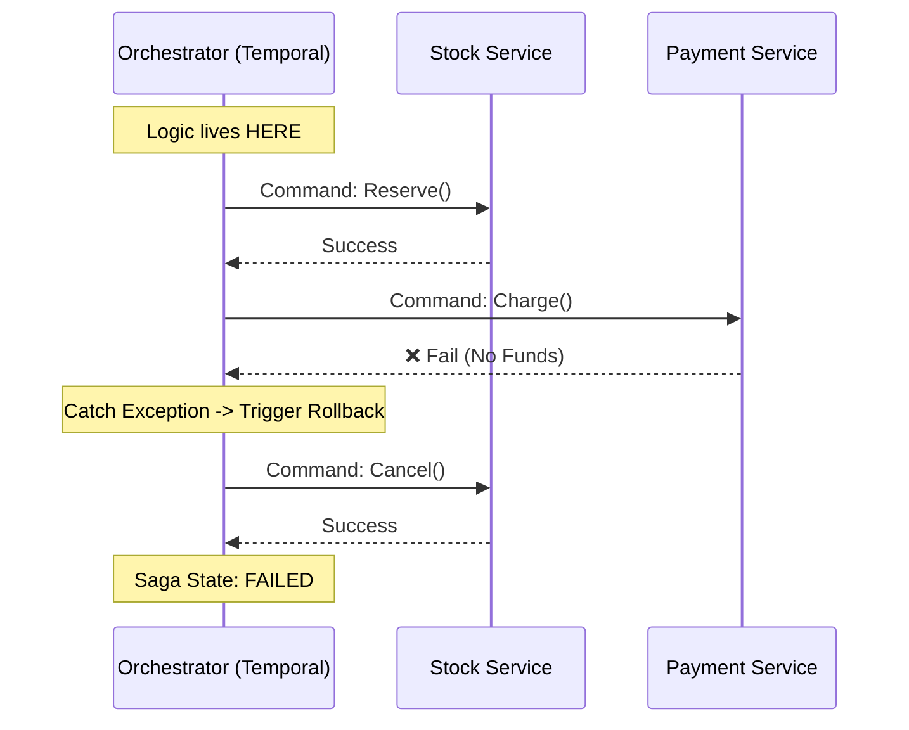

**Почему это стандарт 2026 (The Win):**
1. **Centralized Logic:** Весь бизнес-процесс описан в **одном файле** (Workflow Definition). Новый разработчик читает его как книгу.
2. **Single Source of Truth:** Вы заходите в UI Temporal и видите: "Заказ #555 упал на шаге оплаты, ожидаем ретрая".
3. **Separation of Concerns:**
    - Платежный сервис ничего не знает про "Заказы". Он просто умеет "Списывать" и "Возвращать". Он становится тупым исполнителем (Task Worker). Это снижает связность.

**Когда использовать?**
- Любые сложные процессы (Complex Workflows).
- Когда важна транзакционность и визуализация статуса.
- Финансовые операции.
#### C. Decision Matrix: Which one to choose?

|**Feature**|**Choreography (Events)**|**Orchestration (Commands)**|
|---|---|---|
|**Coupling**|Services know about events (Topic Coupling).|Services know nothing. Orchestrator knows all.|
|**Complexity**|Low at start $\to$ Nightmare at scale.|High setup (Infrastructure) $\to$ Low maint.|
|**Observability**|**Poor.** Distributed Tracing is hard.|**Excellent.** Out of the box status.|
|**Error Handling**|Hard. Need to design complex event chains.|Easy. `try/catch` block in Workflow code.|
|**Scalability**|High (Purely reactive).|High (Modern engines are sharded).|

> [!danger] Миф о "Единой Точке Отказа" (SPOF)
> 
> Критики говорят: "Если Оркестратор упадет, всё встанет".
> В 2026 году это невалидный аргумент.
> Современные движки (Temporal/Cadence) — это **распределенные кластеры** поверх Cassandra/Postgres. Они надежнее, чем ваши микросервисы.
> Если падает одна нода Оркестратора, другая подхватывает выполнение воркфлоу с того же места.
#### D. Hybrid Approach (Reactive Start, Orchestrated Core)
Часто используется компромисс:
1. **Trigger:** Сервис "Корзина" публикует событие `CheckoutStarted` (Choreography).
2. **Process:** Оркестратор "Заказов" слушает это событие и запускает **Оркестрируемую Сагу** (оплата, склад, доставка).
3. **Result:** В конце Оркестратор публикует событие `OrderCompleted` для аналитики (Choreography).

Это позволяет сохранить слабую связность между доменами (Sales vs. Analytics), но жесткий контроль внутри бизнес-транзакции.
### 3.4. 2026 Context: Durable Execution (Temporal)
> [!abstract] Определение Durable Execution
> **Durable Execution** — это парадигма разработки, где состояние выполнения программы (стек вызовов, локальные переменные) автоматически сохраняется и восстанавливается платформой.
>
> **Обещание:** Если ваш сервер сгорит прямо посреди выполнения функции (на строке 10), система поднимет процесс на другом сервере и продолжит выполнение ровно с той же строки (строка 10), сохранив значения всех переменных.
>
> Это делает код **неубиваемым**.
#### A. The End of "Stateless" Dogma

> [!abstract] Смена парадигмы (Paradigm Shift)
> **Stateless Dogma (2010-2024):** "Приложение не должно хранить состояние. При любом сбое мы теряем память (RAM). Все важное должно быть немедленно записано во внешнюю БД".
> * **Результат:** 80% вашего кода — это "клей" для сохранения/загрузки состояния, управление ретраями и борьба с гонками в БД.
>
> **Durable Execution (2025+):** "Приложение — это иллюзия бессмертного процесса. Платформа гарантирует, что локальные переменные и стек вызовов переживут любой сбой".
> * **Результат:** Бизнес-логика пишется так, будто сервер никогда не падает.
##### 1. The "Stateless" Trap (Ловушка безгражданства)
Почему архитекторы настаивали на Stateless сервисах? Потому что их легко масштабировать. Если под умирает, мы просто поднимаем новый, и он берет данные из общей БД.

Но у этого подхода есть огромная скрытая цена — **Accidental Complexity (Случайная Сложность)**.
Чтобы реализовать длительный процесс (например, "Onboarding пользователя: письмо $\to$ ждать 3 дня $\to$ проверка"), в Stateless-архитектуре вы вынуждены превращать Базу Данных в Машину Состояний.

**Анатомия "Stateless" реализации (The Old Way):**
Вам придется создать:
1.  **Table Schema:** Колонки `status`, `step`, `next_retry_at`, `retry_count`.
2.  **Cron Job / Scheduler:** Демон, который каждую минуту делает `SELECT * FROM onboarding WHERE next_retry_at < NOW()`.
3.  **State Management Code:**
    * "Загрузить юзера".
    * "Проверить статус".
    * "Если статус A, выполнить логику".
    * "Обновить статус на B".
    * "Обработать ошибку сети (Optimistic Locking)".
4.  **Queue:** Чтобы масштабировать Cron, вы добавляете Kafka.

**Итог:** Ваша бизнес-логика (отправить письмо) занимает 5 строк. Инфраструктурный код — 500 строк.

##### 2. The Durable Alternative (Abstraction of Immortality)
Durable Execution (реализованный в Temporal/Restate) предлагает инверсию контроля.
Вместо того чтобы вы *руками* сохраняли состояние в БД, **платформа** неявно сохраняет ход выполнения вашего кода.

**Durable реализация (The New Way):**
```python
@workflow.defn
class OnboardingWorkflow:
    @workflow.run
    async def run(self, user_id: str):
        # 1. Send Welcome Email
        await activities.send_email(user_id, "Welcome!")
        
        # 2. Wait for 3 days (Non-blocking sleep)
        # Состояние (строка кода 8) и переменная user_id персистируются.
        # Воркер освобождает ресурсы CPU/RAM. Таймер тикает в БД Temporal.
        await workflow.sleep(timedelta(days=3))
        
        # 3. Check Subscription
        is_sub = await activities.check_subscription(user_id)
        if not is_sub:
             await activities.send_email(user_id, "Discount?")
```
**Разница:**
- Нет `orders_state` таблицы.
- Нет Cron-джобов.
- Нет логики загрузки/сохранения.
- Переменная `user_id` "живет" 3 дня, переживая рестарты серверов.
##### 3. Terminology: Rehydration vs. Replay
Важно понимать, как именно достигается эта "магия".
- **Rehydration (Старый подход, напр. Hibernate/Orleans):**
    - Сериализация всего объекта (Snapshot) в BLOB.
    - При восстановлении: Десериализация объекта в память.
    - _Проблема:_ Сложно версионировать (если изменился класс), дорого сохранять большие графы объектов.
        
- **Event Sourcing & Replay (Подход Temporal):**
    - Сохраняется не состояние памяти, а **Журнал Событий (Event History)**: "Функция запущена", "Таймер установлен", "Таймер сработал".
    - **Recovery:** Чтобы восстановить состояние, движок берет чистый экземпляр кода и **проигрывает (Replay)** историю событий с ускорением.
    - Код сам восстанавливает свои локальные переменные, проходя тот же путь выполнения.
##### 4. The "Implicit State" Architecture
В этой парадигме меняется роль Базы Данных.
- **Раньше:** БД — это "Центр Вселенной". Приложение — это "Временный Гость", который приходит, меняет данные и уходит.
- **Сейчас:** Процесс (Workflow) — это "Центр Вселенной". БД — это просто способ запомнить, что произошло.

> [!check] Архитектурный вывод Переход на Durable Execution снижает количество кода (Code Volume) для сложных бизнес-процессов на **30-50%**. Вы перестаете писать код для _компьютеров_ (сохрани, загрузи, повтори) и начинаете писать код для _людей_ (отправь, подожди, проверь).
> 
> **Warning:** Это требует дисциплины. Код Workflow должен быть детерминированным (Isolated Sandbox), иначе Replay сломается.
#### B. How it Works: Event History & Replay (Магия)

> [!abstract] Метафора "День Сурка" (Groundhog Day)
> Представьте, что вы играете в видеоигру, но не можете сохраняться.
> Однако игра записывает каждое нажатие кнопок на вашем геймпаде в лог.
>
> Если электричество выключается, вы начинаете уровень **с самого начала**.
> Но игра (SDK) автоматически и мгновенно нажимает за вас все кнопки, которые вы нажали в прошлый раз, в точно те же моменты времени.
>
> * **Для наблюдателя:** Вы продолжили игру с того же места.
> * **Для процессора:** Вы пробежали весь уровень заново за 1 миллисекунду, чтобы вернуться в точку "сейчас".
##### 1. The Core Loop: Command vs. Event
Чтобы понять Replay, нужно различать два понятия, которые Temporal строго разделяет:

1.  **Command (Намерение):** Воркер говорит серверу: "Я хочу запустить Активность А" или "Я хочу поставить таймер на 1 час".
2.  **Event (Факты):** Сервер записывает в Историю: "Активность А была запланирована", "Таймер сработал", "Активность завершилась с результатом X".

**Воркер никогда не доверяет своей памяти.** Он доверяет только Истории Событий, которую ему присылает Сервер.

##### 2. The Replay Algorithm (Step-by-Step)
Рассмотрим сценарий: Workflow падает после выполнения одной задачи.

**Run 1 (Первый проход):**
1.  **Code:** `x = await activity.call("get_balance")`
2.  **Worker:** Видит `await`. Шлет серверу *Command*: `ScheduleActivity("get_balance")`.
3.  **Server:** Пишет в БД *Event*: `ActivityTaskScheduled`.
4.  **Activity Worker:** Выполняет задачу, возвращает `100`.
5.  **Server:** Пишет в БД *Event*: `ActivityTaskCompleted(result=100)`.
6.  **Code:** `y = await workflow.sleep(3 days)`.
7.  **Worker:** Шлет *Command*: `StartTimer(3 days)`.
8.  **Server:** Пишет *Event*: `TimerStarted`.
9.  **CRASH!** Воркер умирает (или выгружается из памяти для экономии ресурсов).

**Run 2 (Восстановление через 3 дня):**
Таймер на сервере тикает. Сервер будит нового Воркера.
Воркер пустой (чистая память). Сервер отдает ему **Event History**:
`[Started, ActivityScheduled, ActivityCompleted(100), TimerStarted, TimerFired]`

Воркер запускает код с первой строчки:
1.  **Code:** `await activity.call("get_balance")`
    * **SDK Intercept:** Стоп! SDK смотрит в Историю.
    * **Check:** Было ли это уже выполнено? Да, вижу событие `ActivityTaskCompleted(result=100)`.
    * **Mock:** SDK **не вызывает** реальную активность. Оно мгновенно возвращает `100` в переменную `x`.
2.  **Code:** `await workflow.sleep(3 days)`
    * **SDK Intercept:** Смотрит в историю. Видит `TimerFired`.
    * **Action:** Мгновенно разблокирует `await`.
3.  **Code:** Следующая строка... (Мы вернулись в точку "сейчас").

##### 3. The Anatomy of History (Что лежит в БД?)
История — это append-only список событий protobuf. Это "Source of Truth".

| ID | Event Type | Attributes (Payload) | Комментарий |
| :--- | :--- | :--- | :--- |
| 1 | `WorkflowExecutionStarted` | `{"args": ["user_123"]}` | Входные данные |
| 2 | `ActivityTaskScheduled` | `{"name": "CheckFraud"}` | Воркер попросил проверить фрод |
| 3 | `ActivityTaskStarted` | `{"workerID": "pod-5"}` | Кто-то взял задачу |
| 4 | `ActivityTaskCompleted` | `{"result": "SAFE"}` | **Результат сохранен навечно** |
| 5 | `TimerStarted` | `{"delay": "24h"}` | Воркер ушел в сон |
| ... | ... | ... | (Прошло 24 часа) |
| 6 | `TimerFired` | `{}` | Триггер для продолжения |
| 7 | `WorkflowTaskScheduled` | `{}` | "Воркер, проснись, пора работать!" |
##### 4. The Golden Rule: Determinism (Детерминизм)
Чтобы магия Replay сработала, код Workflow должен быть **абсолютно детерминированным**.
Если при повторном прогоне (Replay) ваш код пойдет по другой ветке `if/else`, чем в первый раз — вы получите фатальную ошибку `NonDeterministicError`.

**Forbidden Actions (Запрещено в Workflow):**
* ❌ `UUID.randomUUID()`: При Replay сгенерируется новый ID, который не совпадет с тем, что записан в истории как аргумент следующего шага.
* ❌ `System.currentTimeMillis()` / `datetime.now()`: Время при Replay будет другим. (Используйте `workflow.now()`, который берет время из Истории).
* ❌ `Thread.sleep()`: Это просто остановит поток, не сохраняя состояние.
* ❌ `Global Variables`: Глобальные переменные могут изменяться другими потоками.
* ❌ `Iterating over Maps`: Порядок итерации в HashMap не гарантирован (в Go/Java).

> [!tip] Как делать "случайные" вещи?
> Используйте `workflow.side_effect(lambda: random.randint(1, 100))`.
> * В первый раз функция выполнится, и результат запишется в Историю (`MarkerRecorded`).
> * При Replay значение будет взято из Истории, гарантируя детерминизм.
##### 5. Why Event Sourcing wins over Serialization?
Почему Temporal не делает просто "Save RAM to Disk" (как Java Serialization или Pickle)?

1.  **Versioning (Миграции):** Если вы измените имя класса или структуру объекта, сериализованный блоб станет нечитаемым. История событий (JSON/Protobuf) гораздо устойчивее к рефакторингу кода.
2.  **Debuggability:** Вы можете открыть UI и прочитать историю глазами. Вы видите, *что* случилось и *почему*. Бинарный снапшот памяти — это черный ящик.
3.  **Language Agnostic:** Историю, записанную Java-воркером, теоретически может прочитать и продолжить Go-воркер (если логика совпадает).
#### C. The Code Structure: Workflow vs. Activity

> [!abstract] Архитектурная Дихотомия
> В мире Durable Execution (Temporal/Cadence) код строго разделен на две зоны с разными физическими законами:
>
> 1.  **Workflow (Мозг):** Чистая логика, принятие решений. Живет в стерильном "Sandbox", где запрещен ввод-вывод (I/O). Гарантирует **Детерминизм**.
> 2.  **Activity (Мышцы):** Грязная работа. Взаимодействие с внешним миром (БД, API, Файлы). Гарантирует **Идемпотентность**.
##### 1. Workflow: The Orchestrator (Sandbox)
Это код, который описывает *алгоритм* вашей Саги.
Он **не выполняет** работу сам. Он лишь отдает приказы ("Запусти активность А", "Подожди 5 минут").

**Физика Workflow:**
* **Lightweight:** Воркер может держать в памяти миллионы открытых Workflow, так как они потребляют только стек и пару переменных.
* **Replayable:** Этот код будет выполняться многократно (при каждом восстановлении).
* **Strict Rules (The "Don'ts"):**
    * ⛔ **No Network I/O:** Нельзя делать `requests.get()`. Результат запроса может измениться при Replay.
    * ⛔ **No Native Threading:** Нельзя запускать треды/горутины. Управление параллелизмом только через API SDK (`asyncio.gather`).
    * ⛔ **No Random/Clock:** Нельзя `uuid4()` или `date.now()`. Используйте детерминированные аналоги от SDK (`workflow.now()`, `workflow.uuid()`).

##### 2. Activity: The Executor (Side Effects)
Это обычные функции. Здесь вы пишете код так, как привыкли: запросы к базе, вызов OpenAI, отправка писем.

**Физика Activity:**
* **Heavyweight:** Активности могут потреблять много CPU/RAM (например, ресайз видео).
* **Retry-Unit:** Активность — это *атомарная единица сбоя*. Если активность упала, Temporal перезапускает *только её* (согласно Retry Policy), не переигрывая весь Workflow.
* **Timeout-Bound:** Каждая активность обязана иметь таймаут (`StartToCloseTimeout`).
* **Non-Deterministic OK:** Здесь можно использовать рандом, текущее время и ненадежные API.

##### 3. The Interaction Model (Data Marshaling)
Workflow и Activity могут работать на **разных** физических машинах (Task Queues).
Они не делят память.

* **Передача данных:** Аргументы и Результаты автоматически сериализуются (JSON/Protobuf) и передаются через сервер Temporal.
* **Warning:** Не передавайте огромные объекты (PDF файлы на 10Мб) через аргументы.
    * *Плохо:* Workflow передает файл в Activity. (Раздувает History Log, тормозит БД).
    * *Хорошо:* Workflow передает `s3_key` (ссылку), Activity скачивает файл сама.

##### 4. Comparison Table: Where to put your code?

| Задача | Где разместить? | Почему? |
| :--- | :--- | :--- |
| **Бизнес-правило (`if amount > 1000`)** | ✅ **Workflow** | Это логика принятия решений. Она должна быть версионируемой и видимой. |
| **SQL-запрос (`SELECT ...`)** | ✅ **Activity** | Это I/O. База данных может вернуть разный результат в разное время. |
| **Генерация UUID для ID заказа** | ✅ **Workflow** | Используя `workflow.side_effect` или `workflow.uuid()`, чтобы ID зафиксировался в Истории. |
| **Вызов LLM (ChatGPT)** | ✅ **Activity** | Это долго, дорого и недетерминировано. Требует таймаутов. |
| **Цикл (`for item in items`)** | ✅ **Workflow** | Оркестрация списка задач. |
| **Парсинг большого XML** | ✅ **Activity** | Тяжелая операция CPU. Лучше не блокировать поток Workflow. |
##### 5. Code Example: The Correct Separation
Посмотрите, как Workflow делегирует "опасную" работу Активностям.

```python
# --- ACTIVITY LAYER (The Muscle) ---
@activity.defn
async def check_fraud_score(user_id: str) -> int:
    # Здесь можно делать что угодно: HTTP запросы, БД
    # Этот код выполнится один раз (или несколько при ретраях)
    # Результат (например, 85) запишется в историю навсегда.
    response = await third_party_api.get(f"/fraud/{user_id}")
    return response.score

# --- WORKFLOW LAYER (The Brain) ---
@workflow.defn
class LoanApprovalWorkflow:
    @workflow.run
    async def run(self, user_id: str):
        # 1. Вызов Активности (Command)
        # Воркер Workflow останавливается здесь и ждет результата.
        # При Replay: берет результат (85) из истории.
        score = await workflow.execute_activity(
            check_fraud_score,
            user_id,
            start_to_close_timeout=timedelta(seconds=10)
        )
        
        # 2. Логика (Pure Code)
        # Этот код должен давать один и тот же результат всегда,
        # если score == 85.
        if score > 80:
            status = "APPROVED"
        else:
            status = "REJECTED"
            
        return status
```

#### D. Implementation: Saga as Code (Python SDK Example)
Вот как выглядит Сага в 2026 году. Никаких очередей, топиков и `state`-полей в базе.

```python
from datetime import timedelta
from temporalio import workflow
from temporalio.common import RetryPolicy

# Импорт определений активностей (The Muscle)
with workflow.unsafe.imports_passed_through():
    from activities import reserve_stock, charge_payment, ship_goods
    from compensations import release_stock, refund_payment

@workflow.defn
class OrderSagaWorkflow:
    @workflow.run
    async def run(self, order: OrderData) -> str:
        # Список функций для отката (Stack LIFO)
        compensations = []
        
        try:
            # === STEP 1: Reserve Stock ===
            # Настраиваем политики ретраев (Exponential Backoff встроен)
            await workflow.execute_activity(
                reserve_stock,
                order,
                start_to_close_timeout=timedelta(seconds=10),
                retry_policy=RetryPolicy(maximum_attempts=3)
            )
            # Добавляем компенсацию в стек (только если шаг успешен)
            compensations.append(release_stock)

            # === STEP 2: Charge Payment ===
            await workflow.execute_activity(
                charge_payment,
                order,
                start_to_close_timeout=timedelta(seconds=30)
            )
            compensations.append(refund_payment)

            # === STEP 3: Ship (Pivot Point) ===
            await workflow.execute_activity(
                ship_goods, 
                order, 
                start_to_close_timeout=timedelta(minutes=5)
            )
            
            return "ORDER_COMPLETED"

        except Exception as e:
            # === SAGA ROLLBACK LOGIC ===
            # Если любой шаг упал (после всех ретраев), начинаем откат
            for comp in reversed(compensations):
                # Запускаем компенсации. 
                # Важно: Компенсации не должны падать (бесконечные ретраи).
                try:
                    await workflow.execute_activity(
                        comp, 
                        order,
                        start_to_close_timeout=timedelta(minutes=1)
                    )
                except Exception:
                    # Если компенсация не прошла - зовем человека (Human Intervention)
                    await workflow.execute_activity("notify_admin_zombie_saga", order)
            
            raise e
```
#### E. Why is this better than Kafka/Choreography?

|**Feature**|**Kafka/Choreography**|**Temporal/Orchestration**|
|---|---|---|
|**Timeout Handling**|Сложно. Нужен отдельный сервис-таймер или Delay Queue.|`await workflow.sleep(days=3)` (Одна строчка).|
|**Retries**|Сложно. DLQ, Retry Topic, Exponential Backoff logic manually.|Встроено в SDK. Просто конфиг.|
|**State Visibility**|Нужно собирать логи из 10 топиков.|UI показывает: "Green Step 1 -> Red Step 2".|
|**Development Speed**|Низкая (много инфраструктурного кода).|Высокая (пишем бизнес-логику сразу).|
|**Variable Storage**|Нужно сохранять контекст в БД на каждом шаге.|Локальные переменные (`compensations` list) сохраняются автоматически.|
#### F. 2026 Trend: Human-in-the-Loop & Agents
Саги больше не являются чисто автоматическими.
Агенты (AI) часто требуют подтверждения человека перед дорогими действиями.
**Механизм Signals:**
Workflow может "заснуть" на месяц, ожидая внешнего сигнала, не потребляя ресурсы CPU.
```Python
# Пример: AI Агент ждет подтверждения человека
@workflow.run
async def run_agent_task(self):
    await activities.ai_generate_proposal()
    
    # Агент засыпает. Процесс выгружается из памяти.
    # В базе висит таймер.
    await workflow.wait_condition(
        lambda: self.is_approved == True, 
        timeout=timedelta(days=7) # Если человек не нажал кнопку за 7 дней
    )
    
    if self.is_approved:
        await activities.execute_contract()
    else:
        await activities.escalate_to_manager()
```

> [!check] Архитектурный Вердикт
> 
> В 2026 году писать Саги на "голых" очередях (Kafka/Rabbit) считается **Legacy**.
> 
> Сложность обеспечения надежности (Retries, Timeouts, State Persistence) слишком высока.
> 
> **Используйте Durable Execution Engine.** Это делает распределенный код таким же простым, как локальный скрипт.
### 3.5. Design Pattern: The Pivot Transaction

> [!abstract] Горизонт Событий Саги
> Любая Сага делится на две фазы одной критической точкой — **Pivot Transaction**.
>
> 1.  **Phase 1 (Backward Recovery):** До Пивота. Если случается ошибка, мы откатываемся назад, выполняя компенсации ($C_i$).
> 2.  **Phase 2 (Forward Recovery):** После Пивота. Если случается ошибка, мы **не откатываемся**. Мы идем только вперед, бесконечно повторяя попытки ($Retry$), пока не пробьем стену.
>
> **Pivot Transaction** — это шаг, который либо **невозможно** отменить, либо **слишком дорого** отменять.
#### A. The Anatomy of Steps (Классификация Транзакций)
Чтобы правильно спроектировать Сагу, нужно разметить каждый шаг одним из трех тегов:

1.  **Compensatable Transactions ($T_c$):**
    * Действия, которые легко отменить.
    * *Пример:* Зарезервировать товар, создать черновик заказа.
    * *Свойство:* Имеют пару-компенсацию ($C_c$).
2.  **Pivot Transaction ($T_p$):**
    * Точка принятия обязательств (Commitment Point). Если этот шаг прошел успешно, Сага считается **успешной** с точки зрения бизнеса.
    * *Пример:* Списание денег с карты, Подпись договора, Печать чека.
    * *Свойство:* Это последний шаг, который может инициировать откат.
3.  **Retriable Transactions ($T_r$):**
    * Действия, которые гарантированно завершатся успехом (рано или поздно).
    * *Пример:* Начислить баллы лояльности, Отправить Email, Обновить статистику.
    * *Свойство:* Не требуют компенсации. Требуют **Idempotency** и **Infinite Retries**.
#### B. The Mathematical Model
Структура идеальной Саги выглядит так:

$$Start \rightarrow \underbrace{T_{c1} \rightarrow T_{c2}}_{\text{Phase 1}} \rightarrow \mathbf{T_{pivot}} \rightarrow \underbrace{T_{r1} \rightarrow T_{r2}}_{\text{Phase 2}} \rightarrow End$$

**Сценарии Сбоя:**
1.  **Сбой в $T_{c2}$:**
    * Мы еще не прошли Пивот.
    * **Action:** $Abort$. Запускаем $C_{c1}$ (отмена $T_{c1}$).
    * **Result:** Система чиста. Клиент получил ошибку.
2.  **Сбой в $T_{pivot}$:**
    * Критический момент.
    * **Action:** $Abort$. Запускаем $C_{c2} \rightarrow C_{c1}$.
    * **Result:** Система чиста.
3.  **Успех в $T_{pivot}$, но Сбой в $T_{r1}$:**
    * Мы прошли точку невозврата. Деньги списаны. Мы **не можем** просто все отменить (бизнес-цель достигнута).
    * **Action:** $Retry(T_{r1})$ ... 10 раз ... 100 раз ...
    * Если $T_{r1}$ (например, отправка Email) недоступен 3 дня, Сага висит 3 дня, но **не отменяет** заказ.
#### C. Strategy: Where to place the Pivot? (Стратегия Размещения)
От того, какой шаг вы назначите Пивотом, зависит надежность системы.

**Rule 1: The "Most Likely to Fail" Step**
Ставьте Пивотом то действие, которое имеет самый высокий риск бизнес-отказа (Business Logic Rejection).
* Обычно это **Платеж** (Недостаточно средств) или **Проверка Фрода**.
* *Почему:* Все шаги *после* Пивота не должны падать по бизнес-причинам. Вы не можете отказать клиенту в "Отправке письма", если деньги уже списаны.

**Rule 2: The "Hardest to Compensate" Step**
Пивот — это часто действие, компенсация которого болезненна.
* *Пример:* Списание денег ($T_{charge}$).
* Компенсация ($C_{refund}$) стоит денег (комиссия эквайринга) и занимает время (N дней).
* Поэтому мы ставим $T_{charge}$ **после** всех проверок (наличие товара, валидация адреса), чтобы минимизировать вероятность того, что нам придется делать Refund из-за нашей же ошибки.

**Rule 3: Push Pivot to the End**
В идеальной Саге Пивот — это последний шаг.
$$T_{c1} \rightarrow T_{c2} \rightarrow T_{c3} \rightarrow \mathbf{T_{pivot}}$$
* Это означает, что мы сначала "подстилаем соломку" (все резервируем), и только в конце "дергаем рубильник".

#### D. Example: The E-Commerce Flow
Разберем классический заказ.

1.  **Reserve Stock ($T_{c1}$):**
    * *Type:* Compensatable.
    * *Comp:* Release Stock.
    * *Logic:* Если нет товара, просто говорим "Нет".
2.  **Verify Address ($T_{c2}$):**
    * *Type:* Compensatable.
    * *Comp:* None (Read-only).
    * *Logic:* Если адрес кривой, отменяем Резерв ($C_{c1}$).
3.  **Charge Credit Card ($T_{pivot}$):**
    * *Type:* **PIVOT**.
    * *Risk:* Денег нет, карта заблокирована.
    * *Logic:* Если успех — **Заказ состоялся**. Если провал — отменяем Резерв ($C_{c1}$).
4.  **Create Shipping Ticket ($T_{r1}$):**
    * *Type:* Retriable.
    * *Logic:* Склад обязан принять тикет. Если склад лежит — долбимся пока не встанет.
5.  **Send Email ($T_{r2}$):**
    * *Type:* Retriable.
    * *Logic:* Если SMTP лежит — повторяем.

#### E. The "Zombie" Risk (Why Pivot matters)
Что будет, если вы перепутаете порядок?

* Сценарий: Сначала **Списали деньги** ($T_{pivot}$), а потом **Попытались зарезервировать товар** ($T_{c1}$).
* Результат:
    1.  Деньги ушли.
    2.  Товара на складе нет (Ошибка).
    3.  Приходится делать Refund ($C_{pivot}$).
    4.  Вы платите комиссию платежной системе впустую. Клиент зол ("Списали и вернули").
* **Вывод:** Пивот должен идти **после** всех проверок ресурсов.

> [!check] Архитектурный Вердикт
> **Pivot Transaction** — это граница между "Я пытаюсь это сделать" и "Я сделал это".
>
> * До Пивота вы боретесь с **Бизнес-ошибками** (нет денег, нет товара).
> * После Пивота вы боретесь только с **Техническими сбоями** (сеть упала, диск сгорел).
>
> Проектируйте Retriable-шаги (Phase 2) так, чтобы они **никогда** не могли упасть из-за логики (например, `NullPointerException` или `InvalidData`). Если Retriable-шаг падает фатально — ваша Сага застревает навсегда и требует ручного вмешательства.
### 3.6. Solutions for Isolation Gap (Защита от аномалий)

> [!danger] Аксиома "Голых Данных"
> В ACID-транзакции данные защищены стеной (Row Lock).
> В Саге данные защищены только **совестью других транзакций**.
>
> Если вы изменили поле `balance` на шаге 1, а шаг 5 случится через минуту, то целую минуту этот `balance` открыт для записи другими процессами.
> Чтобы избежать хаоса, мы используем стратегии **Семантической Изоляции**.
#### A. Strategy 1: Semantic Lock (The "Pending" State)
Это самый надежный способ. Мы не меняем основной ресурс. Мы создаем "Тень" изменения.

**Механизм:**
Вместо того чтобы делать `UPDATE items SET count = count - 1`, мы вводим сущность **Резерва**.

* **Schema:**
    * Таблица `items (id, total_quantity)`
    * Таблица `reservations (id, item_id, quantity, status, expiration)`

* **Logic:**
    1.  **Start Saga:** Создаем запись в `reservations` со статусом `PENDING`.
    2.  **Calculation:** Доступное количество товара вычисляется динамически (или через View):
        $$Available = Total - \sum(Confirmed) - \sum(Pending)$$
    3.  **Read:** Другие Саги видят, что `Available` уменьшился, хотя `Total` в таблице `items` не менялся.
    4.  **End Saga:**
        * *Success:* Превращаем `PENDING` в `CONFIRMED` (или удаляем резерв и уменьшаем `Total` атомарно).
        * *Failure:* Удаляем запись `reservations` (или ставим `CANCELLED`).

**Пример (SQL):**
```sql
-- Плохо (Saga Hazard):
UPDATE accounts SET amount = amount - 100 WHERE id = 1; 

-- Хорошо (Semantic Lock):
INSERT INTO pending_transactions (account_id, amount, type) 
VALUES (1, -100, 'HOLD');

-- Чтение баланса (Safe View):
SELECT (a.amount + COALESCE(SUM(p.amount), 0)) as safe_balance
FROM accounts a
LEFT JOIN pending_transactions p ON a.id = p.account_id
WHERE a.id = 1
GROUP BY a.id;
```
#### B. Strategy 2: Commutative Updates (Order Independence)
Аномалия **Lost Update** возникает, когда порядок операций важен (`Set Value`).
Если сделать операции **Коммутативными** (порядок не важен), проблема исчезает.
**Математика:**

$$A + B = B + A$$
Но:
$$A \times B \neq B \text{ (если это перезапись)}$$
- **Non-Commutative (Опасно):**
    - `UPDATE users SET status = 'ACTIVE'`
    - Если две Саги ставят разные статусы, победит последняя (Last Write Wins).
        
- **Commutative (Безопасно):**
    - `UPDATE items SET count = count + 5` (Инкремент).
    - Если придет 10 инкрементов в любом порядке, итог будет верным.

> [!tip] Дизайн-совет
> 
> Избегайте сеттеров (`setBalance(100)`). Используйте дельты (`addBalance(10)`).
> 
> Дельты устойчивы к гонке данных, если база поддерживает атомарные инкременты (как Postgres или Redis `INCR`).
#### C. Strategy 3: Pessimistic View (Фильтр Грязного Чтения)
Как защитить пользователя от чтения данных, которые находятся "в процессе изменения" (Dirty Read)?
**Пример:** Сага переводит деньги. Баланс временно 0. Сага откатилась -> баланс снова 1000.
Если пользователь запросил отчет в момент "0", он испугается.
**Решение:** Разделение полей.
1. `actual_balance`: Физические деньги на счете (меняется мгновенно).
2. `authorized_balance`: Деньги, доступные для траты (учитывает холды).

**UI Logic:**
- Пользователю показываем `authorized_balance`.
- Если Сага упала и `actual_balance` вернулся, пользователь даже не узнал, что деньги "исчезали" на миллисекунду.
- Мы "прячем" грязные данные за фасадом авторизации.
#### D. Strategy 4: Rerouting (Serialized Execution)
Иногда проще не бороться с конкурентностью, а устранить её.
Если Сага касается `Order #123`, мы можем гарантировать, что все команды для `Order #123` попадают в **один и тот же поток** (Thread/Worker).
**Реализация:**
- **Kafka:** Partition Key = `order_id`. Все события летят в одну партицию $\to$ один консьюмер.
- **Temporal:** Использование паттерна **Signals** в одном Workflow.
    - Workflow для `UserActor` висит в памяти вечно.
    - Все запросы на списание приходят как Сигналы.
    - Workflow обрабатывает их строго по очереди (`queue`).
    - **Результат:** Изоляция достигается за счет однопоточности обработки (Single Threaded Execution).
#### E. Strategy 5: Version Files (Optimistic Offline Lock)
Если Сага длится долго (дни), мы не можем держать даже Семантический Лок.
**Механизм:**
1. **Read:** Сага читает данные и запоминает `version = 5`.
2. **Long Process:** Сага спит, ждет, думает.
3. **Write:** Сага пытается обновить данные.
    ```SQL
    UPDATE doc SET content = '...', version = 6 
    WHERE id = 1 AND version = 5;
    ```
4. **Check:** Если `RowsAffected == 0`, значит кто-то (другая Сага) уже изменил данные (`version` стал 6 или 7).
5. **Reaction:** Сага падает с `OptimisticLockException` и перезапускается (читает новые данные и пробует снова).
#### F. Comparison Matrix: Which lock fits?

| **Стратегия**               | **Сложность**  | **Производительность** | **Применение**                       |
| --------------------------- | -------------- | ---------------------- | ------------------------------------ |
| **Semantic Lock (Pending)** | Medium         | High                   | **Standard.** Заказы, Склад, Билеты. |
| **Commutative Updates**     | Low            | Very High              | Счетчики, Лайки, Начисление баллов.  |
| **Pessimistic View**        | Low (UI logic) | High                   | Финансы (отображение баланса).       |
| **Rerouting (Kafka)**       | High (Infra)   | Medium                 | Строгая последовательность операций. |
| **Version Files**           | Low            | Medium (Retries)       | Редактирование профиля, Документы.   |

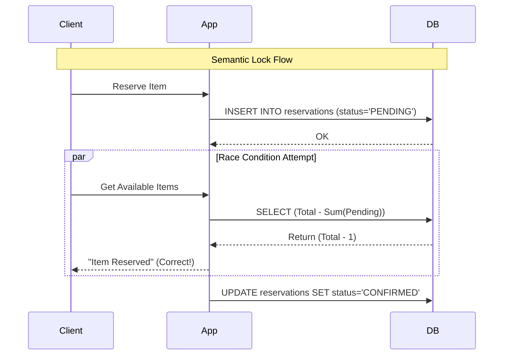

> [!check] Архитектурный Вердикт
> 
> В распределенных системах мы меняем **Database Isolation (ACID-I)** на **Business Logic Isolation**.
> Вместо того чтобы просить базу данных: _"Пожалуйста, подержи этот рядок заблокированным, пока я схожу в Google"_,
> Мы говорим: _"Я помечаю этот рядок как 'Занято'. Если кто-то придет — пусть учитывает метку"_.
> Это перекладывает ответственность с DBA на Разработчика.

---
## 4. The Robustness Pattern: Transactional Outbox

> [!abstract] Философия Паттерна
> **Проблема:** Вы не можете атомарно записать в Базу Данных и отправить в Kafka.
> **Решение:** Перестаньте пытаться отправить в Kafka.
>
> Вместо этого запишите "Намерение отправить сообщение" в ту же Базу Данных, в той же транзакции, где вы меняете бизнес-данные.
> * Postgres гарантирует ACID.
> * Значит, либо "Заказ + Намерение" запишутся вместе, либо не запишется ничего.
>
> Асинхронный процесс (Relay) позже прочитает "Намерение" и переложит его в Kafka.
### 4.1. The Mechanism: Atomic Staging
Суть паттерна — использование локальной транзакции базы данных как "шлюза" для внешнего мира.

**Schema Setup:**
Нам нужна специальная таблица `outbox` в той же БД, где живут бизнес-таблицы (`orders`).

```sql
CREATE TABLE outbox (
    id UUID PRIMARY KEY,
    aggregate_type VARCHAR(255), -- 'ORDER'
    aggregate_id VARCHAR(255),   -- '1001'
    type VARCHAR(255),           -- 'OrderCreated'
    payload JSONB,               -- '{"amount": 500, ...}'
    created_at TIMESTAMP DEFAULT NOW(),
    processed BOOLEAN DEFAULT FALSE -- Для Polling метода
);
```
**The Atomic Transaction:**
Код приложения меняется минимально, но гарантии меняются кардинально.
```Python
# Pseudo-code inside a DB Transaction
def create_order(order_data):
    with db.transaction():
        # 1. Business State Change
        order = db.insert("orders", order_data)
        
        # 2. Event Persistence (Side Effect as Data)
        event = {
            "type": "OrderCreated",
            "payload": order.to_json()
        }
        db.insert("outbox", event)
        
    # 3. Commit
    # Если здесь упадет БД -> и заказ, и событие исчезнут.
    # Если здесь упадет Kafka -> мы еще даже не пытались туда писать.
```
### 4.2. The Relay: Moving the Data (Доставка)
Теперь у нас есть таблица `outbox`, заполненная событиями. Как переложить их в брокер сообщений?
Существует два подхода: "Дешевый" и "Правильный".
#### A. The Polling Publisher (Low Scale / Startup)
Простой фоновый воркер (cron), который опрашивает базу.
- **Алгоритм:**
    1. `SELECT * FROM outbox WHERE processed = FALSE ORDER BY created_at LIMIT 50 FOR UPDATE SKIP LOCKED`.
    2. Цикл по строкам: `kafka.send(row)`.
    3. Если Kafka ответила OK: `UPDATE outbox SET processed = TRUE WHERE id = ...` (или `DELETE`).
    4. Sleep 1 second.
        
- **Плюсы:** Легко реализовать, не нужна сложная инфраструктура.
- **Минусы:**
    - **Polling Latency:** События уходят с задержкой (1-5 секунд).
    - **DB Load:** Постоянные `SELECT` нагружают базу, даже если событий нет.
    - **Ordering:** Трудно гарантировать строгий порядок при параллельных поллерах.
#### B. Transaction Log Tailing / CDC (High Scale / Enterprise)
Использование **Change Data Capture (CDC)**. В 2026 году это стандарт благодаря **Debezium**.
- **Принцип:**
    - Каждая база данных (Postgres, MySQL) пишет все изменения в **WAL (Write Ahead Log)** перед тем, как записать их в файлы данных.
    - Debezium притворяется репликой базы данных. Он читает поток WAL.
    - Как только в WAL появляется запись `INSERT INTO outbox`, Debezium мгновенно (sub-millisecond) отправляет её в Kafka.
        
- **Алгоритм:**
    1. App делает `COMMIT`. Запись попадает в WAL.
    2. Debezium читает WAL.
    3. Debezium видит изменение в таблице `outbox`.
    4. Debezium публикует сообщение в Kafka Connect.
    5. (Опционально) "Уборщик" удаляет старые записи из `outbox`.
        
- **Плюсы:**
    - **Zero Latency overhead:** События улетают мгновенно.
    - **No DB Load:** Мы не делаем `SELECT`, мы читаем лог диска.
    - **Perfect Ordering:** WAL строго упорядочен.
### 4.3. The Delivery Guarantee: At-Least-Once
Outbox гарантирует, что сообщение **не потеряется**. Но он может создать **дубликаты**.
**Сценарий дублирования (в Polling Publisher):**
1. Relay прочитал событие из БД.
2. Relay отправил в Kafka. Kafka ответила `ACK`.
3. Relay падает (OOM Kill) _до_ того, как успел сделать `UPDATE outbox SET processed=TRUE`.
4. Relay перезапускается.
5. Он снова читает ту же строку (так как она `FALSE`) и снова шлет в Kafka.
6. **Результат:** В Kafka два одинаковых сообщения.

> [!danger] Вывод
> 
> Использование Transactional Outbox **обязывает** потребителей быть **Идемпотентными**.
> 
> Вы не можете использовать Outbox, если ваши консьюмеры не умеют отбрасывать дубликаты.

### 4.4. The Inverse Pattern: Transactional Inbox
Outbox решает проблему _отправки_. Но как быть с _получением_?
Если Consumer получил сообщение, обновил БД, но не успел отправить `ACK` брокеру, брокер пришлет сообщение снова.
Для **Exactly-Once Processing** (логического) нам нужен **Inbox**.
**Алгоритм Консьюмера:**
```Python
def handle_event(event):
    with db.transaction():
        # 1. Deduplication Check
        if db.exists("inbox", id=event.id):
            return # Уже обработали
            
        # 2. Business Logic
        process_order(event.payload)
        
        # 3. Mark Processed (Audit Log)
        db.insert("inbox", {"id": event.id, "processed_at": now()})
    
    # 4. Acknowledge Broker
    kafka.commit_offset()
```
Теперь, даже если Kafka пришлет дубликат, транзакция БД (шаг 1) его отбросит.
### 4.5. 2026 Context: Agentic Memory Consistency

> [!danger] Проблема "Раздвоенного Сознания"
> У современного AI-агента есть три компонента состояния, которые рассинхронизируются за миллисекунды:
> 1.  **Context Window (RAM):** То, о чем он думает прямо сейчас.
> 2.  **Semantic Memory (Vector DB):** То, что он помнит о прошлом (Long-term).
> 3.  **World State (SQL/APIs):** То, что реально произошло в мире (баланс счета, бронь билета).
>
> **Сценарий краха:** Агент решает: "Я забронировал билет". Он пишет эту мысль в Vector DB. Затем он вызывает API авиакомпании, и вызов падает (500 Error).
> **Результат:** В памяти Агента билет *есть*. В реальности билета *нет*. При следующем запросе RAG достанет ложное воспоминание, и Агент будет клясться пользователю, что все готово.
#### A. The Architecture: "Thought-Action" Atomicity
В 2026 году мы не разрешаем Агентам писать в Vector DB или вызывать инструменты напрямую. Мы используем **Agentic Outbox**.

Мы рассматриваем "Мысль" (Thought) и "Намерение действовать" (Intent) как одну атомарную транзакцию.

**Схема данных (Postgres):**
```sql
CREATE TABLE agent_journal (
    id UUID PRIMARY KEY,
    run_id UUID,                -- ID сессии/диалога
    step_number INT,
    
    -- The Brain (CoT)
    thought_content TEXT,       -- "Пользователь хочет билет. Денег хватает. Бронирую."
    
    -- The Hand (Intent)
    tool_name VARCHAR(50),      -- "book_flight_api"
    tool_args JSONB,            -- {"flight": "BA123", "date": "2026-05-01"}
    
    status VARCHAR(20) DEFAULT 'PLANNED', -- PLANNED -> EXECUTED -> MEMORIZED
    created_at TIMESTAMP DEFAULT NOW()
);
```
#### B. The Protocol: Think, Commit, Act (Think-Commit-Act)
Вместо `LLM -> API -> VectorDB`, мы используем надежный пайплайн:
1. **Think (Generation):** LLM генерирует план действий. Мы **не выполняем** его сразу.
2. **Commit (Persistence):** Мы записываем Мысль и Аргументы функции в `agent_journal` в рамках одной ACID-транзакции.
    - _Гарантия:_ Теперь намерение надежно сохранено. Даже если сервер сгорит, Агент "не забудет", что он хотел сделать.
        
3. **Act (System 1 - Execution):**
    - Outbox Processor (Relay) читает журнал.
    - Вызывает реальный `book_flight_api`.
    - Если успех: Обновляет статус на `EXECUTED` и записывает результат (JSON) обратно в журнал.
    - Если провал: Обновляет статус на `FAILED` с текстом ошибки.
        
4. **Memorize (System 2 - Reflection):**
    - _Отдельный_ процесс (CDC) слушает обновления в `agent_journal`.
    - Только когда статус стал `EXECUTED` (или `FAILED`), мы берем пару `(Thought + Tool Result)`, генерируем Эмбеддинги и кладем их в **Vector DB**.

> [!check] Почему это решает проблему?
> 
> В Vector DB (память Агента) попадают **только свершившиеся факты**.
> 
> Агент никогда не запомнит "Я забронировал", если API вернуло ошибку. Он запомнит: "Я _попытался_ забронировать, но получил ошибку 500". Это и есть **Grounding (Заземление)**.

#### C. Handling "Phantom Thoughts"
Что делать, если Агент "подумал", записал в Outbox, но процесс упал до выполнения?
Благодаря Outbox паттерну, при перезапуске системы:
1. Processor видит запись в статусе `PLANNED`.
2. Он понимает: "Агент уже принял решение, но мы не успели его исполнить".
3. Он выполняет Tool Call.
4. Агент "просыпается" и видит результат выполнения, как будто он не умирал.

Это обеспечивает **Durable Agency** — агент, который переживает перезагрузку серверов, не теряя нить рассуждений.
#### D. Comparison: Naive vs. Outbox Agent

|**Feature**|**Naive Agent (Direct API)**|**Outbox Agent (Journaled)**|
|---|---|---|
|**Consistency**|**Weak.** Мысли опережают реальность.|**Strong.** Память отстает, но верна фактам.|
|**Crash Recovery**|**Amnesia.** Агент забывает, что хотел нажать кнопку.|**Resumption.** Агент продолжает с прерванного шага.|
|**Vector DB**|"Мусорка" из планов и фантазий.|Чистый лог исторических фактов.|
|**Latency**|Low (Direct Call)|Medium (DB Write + Async Worker)|
|**Debuggability**|Black Box (Only logs).|**SQL Journal.** Полная история "Сознания".|
#### E. Code Example: Python Agentic Outbox

```Python
def agent_step(user_input, run_id):
    with db.transaction():
        # 1. LLM Generation (Pure function, no side effects)
        plan = llm.generate(context=..., input=user_input)
        
        # plan.thought = "Need to refund user $50"
        # plan.tool = "stripe_refund"
        # plan.args = {"amount": 50}

        # 2. Atomic Commit (Save the thought AND the intent)
        # Мы НЕ вызываем stripe.refund() здесь!
        journal_entry = db.insert("agent_journal", {
            "run_id": run_id,
            "thought": plan.thought,
            "tool_name": plan.tool,
            "tool_args": plan.args,
            "status": "PLANNED"
        })
        
    # 3. Trigger Async Execution (Optimistic)
    # Если здесь упадет, фоновый воркер подберет задачу из БД
    background_worker.trigger(journal_entry.id)
    
    return "Thinking..." # UI показывает спиннер
```

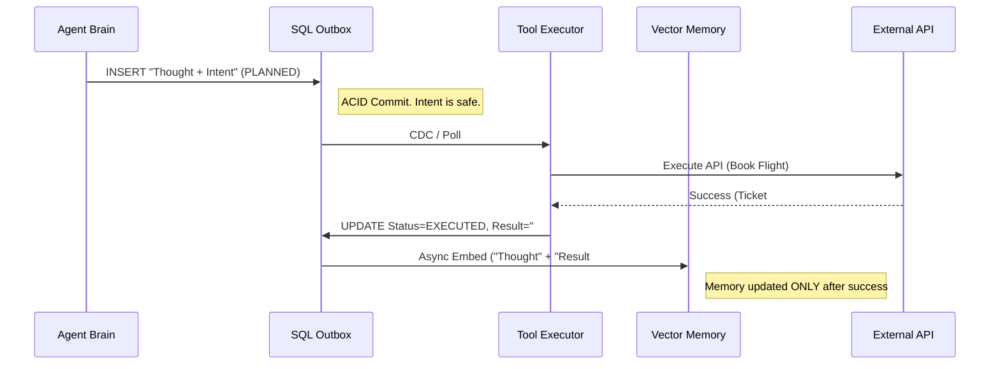

> [!tip] 2026 Terminology
> 
> **Re-Grounding Loop:** Процесс постоянной сверки внутренней модели мира Агента (Vector DB) с реальным миром (SQL/API) через механизм транзакционного журнала. Без этого Агент быстро становится недееспособным в реальной экономике.

### 4.6. Comparison: Direct vs. Outbox

| **Feature**      | **Direct Send (Dual Write)** | **Transactional Outbox**          |
| ---------------- | ---------------------------- | --------------------------------- |
| **Complexity**   | Low                          | Medium (Requires Relay/Debezium)  |
| **Consistency**  | **Unsafe** (Data Loss Risk)  | **Strong** (Eventual Consistency) |
| **Availability** | Low (DB + Kafka must be up)  | **High** (Only DB must be up)     |
| **Latency**      | Low (Direct socket)          | Low (CDC) / High (Polling)        |
| **Ordering**     | No Guarantee                 | **Guaranteed** (by WAL/Sequence)  |

> [!check] Архитектурный Вердикт
> 
> **Transactional Outbox + CDC (Debezium)** — это де-факто стандарт для Enterprise-систем.
> 
> Не изобретайте велосипед с распределенными транзакциями. Просто используйте Outbox. Это превращает ненадежную сеть в надежный поток данных.
---
## 5. High-Performance: TCC (Try-Confirm-Cancel)

> [!abstract] "Программный" 2PC
> TCC — это архитектурный паттерн, который переносит логику двухфазной фиксации (2PC) с уровня Базы Данных на уровень **Приложения**.
>
> Вместо того чтобы просить БД: "Заблокируй строку на минуту" (Physical Lock), мы говорим приложению: "Зарезервируй 5 единиц товара для меня" (Semantic Lock).
>
> * **Saga** — это "Извини, я ошибся, давай откатим" (Reactive).
> * **TCC** — это "Я сначала проверю и отложу, и только если все готовы — заберу" (Proactive).
### 5.1. The Protocol: The Three Verbs

> [!abstract] Жесткий Контракт
> TCC требует от участника (микросервиса) реализации трех методов, которые подчиняются строгим правилам:
> 1.  **Try:** Делает всё возможное, чтобы зарезервировать ресурс. Если `Try` успешен, система **гарантирует**, что ресурс есть и он наш.
> 2.  **Confirm:** Техническая фиксация. Не делает проверок. Просто перекладывает "из левого кармана в правый".
> 3.  **Cancel:** Безусловная отмена. Возвращает всё как было.
#### A. Verb 1: TRY (The Reservation Phase)
Это единственная фаза, где разрешена **Бизнес-Логика**.
Здесь происходят проверки баланса, доступности товара, лимитов кредита.

* **Задача:** Перевести ресурс из состояния `Available` в состояние `Reserved`.
* **Изоляция:** Ресурс должен быть "невидим" для других транзакций, но еще не списан окончательно.
* **Правило:** `Try` не должен менять основное состояние сущности так, чтобы это было необратимо.

**Пример (Банковский счет):**
У нас есть счет с балансом $100. Мы хотим перевести $30.
* *Неверно:* Сразу списать $30 (Баланс = 70).
* *Верно (TCC):*
    * Balance: $100 (Не меняем!)
    * Frozen: $0 $\to$ $30 (Увеличиваем заморозку)
    * *Effective Available:* $100 - 30 = 70$.

```sql
-- API: /try_payment
-- Transaction ID: xid_123
BEGIN;
    -- 1. Проверка и Резерв в одном атомарном шаге
    UPDATE accounts 
    SET frozen_amount = frozen_amount + 30
    WHERE id = 1 
      AND (balance - frozen_amount) >= 30; -- Проверка бизнес-условия

    -- 2. Если update вернул 0 строк -> throw InsufficientFundsException
    -- 3. Запись в лог транзакции (обязательно для идемпотентности)
    INSERT INTO tcc_fence_log (xid, branch_id, status) VALUES ('xid_123', 'b1', 'TRIED');
COMMIT;
```
#### B. Verb 2: CONFIRM (The Execution Phase)
Это фаза **Чистого Исполнения**. Здесь нет `if (money > 0)`. Если Координатор вызвал `Confirm`, это значит, что `Try` прошел успешно, и мы обязаны завершить начатое.
- **Задача:** Использовать зарезервированный ресурс.
- **Идемпотентность:** Метод будет вызываться повторно при сбоях сети. Он должен уметь понимать: "Я уже выполнил это".
- **Отказоустойчивость:** Бизнес-ошибки (Logic Errors) запрещены. Только технические (Connection refused).

**Пример:** Мы превращаем "Замороженные" деньги в "Списанные".
```SQL
-- API: /confirm_payment
BEGIN;
    -- 1. Проверка идемпотентности (Защита от двойного списания)
    IF EXISTS (SELECT 1 FROM tcc_fence_log WHERE xid='xid_123' AND status='CONFIRMED') THEN
        RETURN OK;
    END IF;

    -- 2. Применение изменений
    UPDATE accounts 
    SET balance = balance - 30,       -- Реально списываем
        frozen_amount = frozen_amount - 30 -- Размораживаем
    WHERE id = 1;

    -- 3. Обновление статуса
    UPDATE tcc_fence_log SET status = 'CONFIRMED' WHERE xid = 'xid_123';
COMMIT;
```
#### C. Verb 3: CANCEL (The Rollback Phase)
Фаза "Уборки мусора". Вызывается, если `Try` прошел, но где-то в другом микросервисе случилась беда.
- **Задача:** Вернуть зарезервированный ресурс в общий пул.
- **Null Compensation:** Главная проблема `Cancel` — он может прийти **до** `Try` (из-за сетевых аномалий) или если `Try` потерялся по дороге.
    - Система должна уметь обрабатывать `Cancel` для транзакции, которую она никогда не видела (разрешить "пустой откат").

**Пример:** Размораживаем деньги.
```SQL
-- API: /cancel_payment
BEGIN;
    -- 1. Проверка идемпотентности
    IF EXISTS (SELECT 1 FROM tcc_fence_log WHERE xid='xid_123' AND status='CANCELLED') THEN
        RETURN OK;
    END IF;

    -- 2. Проверка "Null Rollback" (Если Try так и не дошел)
    IF NOT EXISTS (SELECT 1 FROM tcc_fence_log WHERE xid='xid_123' AND status='TRIED') THEN
        -- Записываем, что мы отменили транзакцию (чтобы если Try придет позже, он не сработал)
        INSERT INTO tcc_fence_log (xid, status) VALUES ('xid_123', 'CANCELLED');
        RETURN OK;
    END IF;

    -- 3. Реальная отмена
    UPDATE accounts 
    SET frozen_amount = frozen_amount - 30
    WHERE id = 1;
    
    UPDATE tcc_fence_log SET status = 'CANCELLED' WHERE xid = 'xid_123';
COMMIT;
```
#### D. Technical Challenge: The "Fence Log" (Защита от Хаоса)

Почему в SQL-примерах выше везде фигурирует `tcc_fence_log`? Без этой таблицы TCC **не работает** в реальной сети.

Проблемы, которые она решает:
1. **Network Reordering (Hanging):**
    - Координатор послал `Try`. Пакет завис.
    - Координатор устал ждать (Timeout) и послал `Cancel`.
    - `Cancel` пришел первым, выполнился.
    - Спустя секунду долетает `Try`.
    - _Без лога:_ Мы зарезервируем деньги, которые никто никогда не подтвердит (Zombie Reservation).
    - _С логом:_ `Try` проверит лог, увидит запись `CANCELLED` (от шага C) и откажется выполняться.
        
2. **Idempotency (Duplicate Requests):**
    - Координатор послал `Confirm`. Сеть моргнула. Координатор послал `Confirm` снова.
    - _С логом:_ Второй вызов видит статус `CONFIRMED` и просто возвращает 200 OK.

> [!danger] Архитектурное правило TCC — это **вторжение** в структуру вашей базы данных. Вы не можете внедрить TCC, просто дописав пару Java-методов. Вам придется изменить схему БД (добавить колонки `frozen`) и создать инфраструктурные таблицы (`fence_log`). Это "Hard Invasion" паттерн.

### 5.2. Example: The "Flash Sale" Inventory

> [!abstract] Математика Дефицита
> В высоконагруженной системе понятие "Остаток товара" расщепляется на две переменные.
>
> 1.  **Total Stock ($S_{total}$):** Сколько коробок физически лежит на складе.
> 2.  **Frozen Stock ($S_{frozen}$):** Сколько коробок "держат в руках" покупатели, которые еще не оплатили.
>
> **Формула доступности:**
> $$Available = S_{total} - S_{frozen}$$
>
> TCC манипулирует исключительно переменной $S_{frozen}$ в первой фазе, и $S_{total}$ во второй.
#### A. The Schema: Shadowing the Inventory
Нам не нужны сложные блокировки. Нам нужна арифметика.

```sql
CREATE TABLE inventory (
    product_id BIGINT PRIMARY KEY,
    total_stock INT NOT NULL CHECK (total_stock >= 0),
    frozen_stock INT NOT NULL DEFAULT 0 CHECK (frozen_stock >= 0),
    
    -- Constraint защиты от перепродажи на уровне БД
    CONSTRAINT valid_stock CHECK (total_stock >= frozen_stock)
);

-- Начальное состояние: 1000 айфонов, 0 в резерве.
INSERT INTO inventory VALUES (1, 1000, 0);
```
#### B. Step 1: TRY (The "Reservation" Race)
Миллион пользователей одновременно нажимают "Купить". В этот момент мы **не списываем** товар. Мы пытаемся увеличить счетчик заморозки.
- **SQL-операция:** Атомарный апдейт с условием (Optimistic Locking).
- **Load:** Это самая "горячая" операция. База данных выстраивает запросы в очередь (Row Lock на микросекунды).
```SQL
-- Transaction Phase 1: TRY
-- Входные данные: product_id=1, qty=1
UPDATE inventory 
SET frozen_stock = frozen_stock + 1
WHERE product_id = 1 
  AND (total_stock - frozen_stock) >= 1; -- Критическое условие!

-- Анализ результата (JDBC/ORM):
-- Если row_count == 1: УСПЕХ. Мы зарезервировали товар. Отвечаем 200 OK.
-- Если row_count == 0: ПРОВАЛ. Товар закончился (или занят другими резервами). Отвечаем 409 Conflict ("Sold Out").
```

> [!tip] Почему это быстро? Мы не делаем `SELECT` перед `UPDATE`. Мы делаем все в одном запросе. Предикат `WHERE` гарантирует, что `frozen_stock` никогда не превысит `total_stock`.
#### C. Step 2: CONFIRM (The Deal Seal)
Пользователь успешно оплатил заказ (или платежный шлюз дал добро). Теперь нужно превратить "виртуальный" резерв в реальную продажу.
- **Логика:** Уменьшаем оба счетчика.
- **Смысл:** Мы говорим: "Та коробка, которая была в резерве, теперь уехала со склада".
```SQL
-- Transaction Phase 2: CONFIRM
-- Входные данные: product_id=1, qty=1
UPDATE inventory 
SET total_stock = total_stock - 1,
    frozen_stock = frozen_stock - 1
WHERE product_id = 1;

-- Примечание: Здесь не нужно условие WHERE available > 0, 
-- так как мы ГАРАНТИРОВАННО зарезервировали этот объем в фазе Try.
-- Этот запрос не может упасть из-за бизнес-логики.
```
#### D. Step 3: CANCEL (The Release)
Пользователь не ввел карту, таймер истек, или на счету нет денег. Нужно вернуть товар в продажу ("Разморозить").
```SQL
-- Transaction Phase 3: CANCEL
-- Входные данные: product_id=1, qty=1
UPDATE inventory 
SET frozen_stock = frozen_stock - 1
WHERE product_id = 1;
```
#### E. Visualization: The State Machine
Посмотрим, как меняются цифры при успешной продаже.

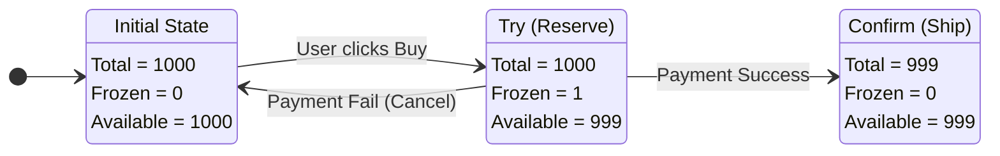

#### F. Handling "Hot Row" Contention (Совет Эксперта)
В реальном High-Load (Alibaba Singles Day) одна строка `product_id=1` в базе данных становится узким местом. Вы не можете делать `UPDATE` одной строки быстрее, чем позволяет диск/лок (ну, скажем, 500-1000 раз в секунду). Если запросов 50 000, система встанет.
**Решение (Inventory Sharding):** Разделите 1000 айфонов на 10 строк в БД.
- `row_1`: 100 шт.
- `row_2`: 100 шт.
- ...
- `row_10`: 100 шт.

Когда приходит запрос `Try`:
1. Выбираем случайную строку `row_k`.
2. Пытаемся сделать `UPDATE` в ней.
3. Если неудача (закончилось в этом шарде) -> пробуем `row_n`.

Это увеличивает пропускную способность TCC в 10 раз.

> [!check] Архитектурный Вердикт TCC для инвентаря — это стандарт индустрии e-commerce. Он дает **100% гарантию от перепродажи** (благодаря ACID в фазе Try) и высокую производительность (благодаря коротким транзакциям).
> 
> **Главное отличие от Саги:** В Саге мы бы сделали `UPDATE total = total - 1`. Если бы платеж не прошел, нам пришлось бы делать `UPDATE total = total + 1`. В промежутке между этими действиями наш склад "лжет" (показывает меньше товара, чем есть, либо товар "скачет"). TCC делает состояние честным.
### 5.3. TCC vs. Saga: The "Overbooking" Problem

> [!danger] Аксиома Изоляции
> Главное отличие TCC от Sagas — это уровень изоляции данных во время выполнения транзакции.
>
> * **Saga (Base Isolation):** Другие пользователи видят изменения *сразу* после первого шага. Если шаг был ошибочным, они видят "грязные" данные.
> * **TCC (Isolation by State):** Другие пользователи видят изменения только после фазы `Confirm`. В фазе `Try` они видят уменьшение `Available`, но неизменность `Total`.
#### A. The Scenario: "The Last Ticket" (Проблема Последнего Билета)
Представьте, что на концерт остался **1 билет**.
Два пользователя (Alice и Bob) пытаются купить его одновременно.

**Сценарий 1: Saga (Naive Implementation)**
Сага работает по принципу "Сначала стреляй (Action), потом думай (Compensate)".

1.  **Alice:** Нажимает "Купить".
2.  **Order Service:** Выполняет локальную транзакцию `UPDATE tickets SET count = 0`. (Commit).
3.  **Bob:** Нажимает "Купить".
4.  **Order Service:** Видит `count = 0`. Отказывает Бобу: "Sold Out". Боб уходит расстроенный.
5.  **Alice:** Переходит к оплате... Карта отклонена (Недостаточно средств).
6.  **Order Service:** Запускает компенсацию. `UPDATE tickets SET count = 1`.
7.  **Итог:** Билет снова свободен. Но Боб уже ушел к конкурентам. Мы потеряли продажу.
    * *Диагноз:* **Phantom Stock Exhaustion** (Фантомное исчерпание склада).

**Сценарий 2: TCC (Reservation Model)**
TCC работает по принципу "Сначала отложи (Try), потом забирай (Confirm)".

1.  **Alice:** Нажимает "Купить".
2.  **Inventory Service (Try):**
    * `Total = 1`
    * `Frozen = 1`
    * `Available = 0` (для новых покупателей).
3.  **Bob:** Нажимает "Купить". Видит `Available = 0`. Получает отказ (честный, так как билет зарезервирован).
4.  **Alice:** Оплата не проходит.
5.  **Inventory Service (Cancel):**
    * `Frozen = 0`
    * `Available = 1`.
6.  **Отличие:** В TCC мы тоже отказали Бобу. **НО!** В TCC у нас есть явный тайм-аут резерва.
    * Если Алиса "думает" над оплатой 15 минут, Сага держит `count=0` все 15 минут (или требует сложной логики).
    * TCC позволяет Бобу встать в очередь ("Notify me when available"), так как система знает: это не "Продано", это "Заморожено".

#### B. The "Inventory Thrashing" (Дрожание Склада)
Почему Саги плохи для высокочастотных систем?

Представьте распродажу. 1000 товаров, 10 000 покупателей. 20% оплат не проходят (ошибки карт, передумали).

* **В Саге:**
    * График остатков на складе выглядит как **кардиограмма**: `1000 -> 900 -> 950 -> 800 -> 820...`
    * Складская система сходит с ума. Она триггерит события "Low Stock", потом "Restock".
    * Аналитика не понимает реальный темп продаж.

* **В TCC:**
    * `Total Stock` (Физические остатки) убывает **монотонно**. Он уменьшается только при реальной оплате (`Confirm`).
    * `Frozen Stock` колеблется, но это служебная метрика.
    * Бизнес видит чистый график продаж без "шума" отмен.

#### C. The Overbooking Risk (Риск Перепродажи)
Теперь рассмотрим обратную ситуацию. Мы хотим избежать потери клиентов и разрешаем Саге "ленивое" списание.

* **Saga (Lazy style):** Списываем товар только в *конце* (на шаге 5), а в начале просто создаем "Заказ".
* **Risk:**
    1.  Создали 100 заказов для 100 билетов.
    2.  Все 100 перешли к оплате.
    3.  Пока они платили, пришел 101-й. Мы проверили склад (`count = 100`), создали 101-й заказ.
    4.  Все 101 успешно оплатили.
    5.  На шаге "Доставка" выясняется, что билетов только 100.
    6.  **Result:** 101-му клиенту придется делать **Refund** (возврат денег).
    * *Диагноз:* **Actual Overbooking**. Это репутационный крах. "Вы взяли мои деньги, а потом сказали, что товара нет!".

* **TCC Solution:**
    * Фаза `Try` гарантирует, что мы никогда не примем оплату, если не смогли заморозить слот.
    * `Confirm` гарантированно обеспечен физическим товаром.
    * Перепродажа математически невозможна (при корректном SQL в `Try`).

#### D. Decision Matrix: When to pay the price?
TCC сложнее Саги в 3 раза. Стоит ли оно того?

| Критерий | Saga | TCC |
| :--- | :--- | :--- |
| **Природа Ресурса** | Неограниченный / Виртуальный (Email, Push, Logs) | Ограниченный / Дефицитный (Места в самолете, Деньги) |
| **Цена Отката** | Низкая (Просто послать письмо "Sorry") | Высокая (Комиссия банка за Refund, Негатив клиента) |
| **Конкурентность** | Низкая (Каждый юзер работает со своим заказом) | Высокая (Все юзеры бьются за один пул товаров) |
| **Изоляция** | Eventual Consistency (Dirty Reads возможны) | Application Isolation (Резервы видны, но недоступны) |
#### E. Code Logic Comparison

**Saga (Compensatable Action):**
```python
# Step 1: Action (Dangerous)
def deduct_stock(item_id):
    db.execute("UPDATE items SET qty = qty - 1 WHERE id = ?", item_id)
    # Товар исчез. Если транзакция долгая, никто его не купит.

# Compensation
def restore_stock(item_id):
    db.execute("UPDATE items SET qty = qty + 1 WHERE id = ?", item_id)
    # Товар появился из воздуха.
```

**TCC (Reserved State):**
```Python
# Step 1: Try (Safe)
def try_reserve(item_id):
    # Товар на месте, просто помечен "чужим"
    db.execute("UPDATE items SET frozen = frozen + 1 WHERE id = ? AND (qty - frozen) > 0", item_id)

# Step 2: Confirm (Final)
def confirm_deal(item_id):
    # Только здесь товар исчезает
    db.execute("UPDATE items SET qty = qty - 1, frozen = frozen - 1 WHERE id = ?", item_id)
```

> [!check] Архитектурный Вердикт Используйте **TCC**, если "Откат" (Compensation) невозможен или дорог.
> 
> - Вы не можете "отменить" ставку на бирже, если рынок ушел. (Нужен TCC).
>     
> - Вы не можете "отменить" отправку денег в чужой банк мгновенно. (Нужен TCC/2PC).
>     
> 
> Используйте **Saga**, если ресурс не является жестким дефицитом.
> 
> - Amazon использует Саги для заказов. Почему? Потому что у них огромные склады. Если товара не хватило, они просто шлют письмо: "Доставим на неделю позже". Им проще извиниться, чем блокировать склад TCC-транзакциями.
>

### 5.4. The Hidden Costs (Почему все ненавидят TCC)

> [!danger] Теорема о Сложности TCC
> Реализация TCC увеличивает объем кода и сложность тестирования микросервиса минимум в **4 раза**.
>
> 1.  Бизнес-логика (`Try`).
> 2.  Логика фиксации (`Confirm`).
> 3.  Логика отката (`Cancel`).
> 4.  **Инфраструктура защиты** (Idempotency + Fence Log + Recovery).
>
> Если вы пропустите пункт 4, вы получите систему, которая дублирует списания и теряет деньги при первом же лаге сети.
#### A. The "Code Explosion" (Взрыв Кодовой Базы)
В обычном REST API вы пишете 1 метод: `POST /pay`.
В TCC вы пишете 3 метода, и они должны быть согласованы.

* **Try:** Должен проверить все условия.
* **Confirm:** Должен быть "слепым" (не проверять баланс), но надежным.
* **Cancel:** Должен уметь откатывать то, что сделал Try.

**Проблема рефакторинга:** Если вы меняете логику в `Try` (например, добавляете комиссию), вы обязаны зеркально обновить `Confirm` (списание) и `Cancel` (возврат). Рассинхрон этих методов ведет к утечке денег.

#### B. The "Fence Log" Tax (Налог на Идемпотентность)
Это самый технически сложный аспект, о котором забывают 90% разработчиков.
В распределенной сети сообщения дублируются и приходят в неправильном порядке.

**Сценарий 1: Double Confirm (Повтор)**
* Координатор шлет `Confirm`. Тайм-аут. Шлет `Confirm` снова.
* Без защиты: Вы спишете деньги дважды.
* **Решение:** Таблица `tcc_fence_log`. Перед выполнением `Confirm` проверяем: "Не выполнял ли я это уже?".

**Сценарий 2: Null Compensation (Пустой Откат)**
* Координатор шлет `Try`. Пакет потерялся.
* Координатор получает тайм-аут и шлет `Cancel`.
* Сервис получает `Cancel`, но он **никогда не видел** `Try`!
* **Решение:** Сервис должен разрешить "Отмену пустоты".
    * Но просто вернуть `200 OK` нельзя!
    * Вдруг потерявшийся пакет `Try` придет через секунду?
    * Сервис должен записать в `fence_log`: *"Транзакция XID отменена заочно"*.
    * Когда `Try` наконец дойдет, он проверит лог, увидит запись об отмене и **откажется** резервировать ресурс.

Это называется **Suspension Problem**. Решение требует обязательного INSERT в базу на каждый чих.

#### C. The "Zombie" Reservation Problem (Сборка Мусора)
Что произойдет, если Координатор (Оркестратор) упадет навсегда (сгорел диск) после отправки `Try`?

1.  Сервис А: Заморозил товар.
2.  Сервис Б: Заморозил деньги.
3.  Координатор: Мертв. Команда `Confirm` или `Cancel` никогда не придет.

**Результат:** Ресурсы заморожены навечно. Товар лежит на складе, но купить его нельзя. Это утечка ресурсов (Resource Leak).

**Решение (TCC Recovery Job):**
Вам нужен отдельный фоновый процесс (Daemon), который:
1.  Сканирует `fence_log` или таблицу резервов.
2.  Ищет транзакции в статусе `TRIED`, которые висят дольше N минут (TTL).
3.  Спрашивает у Координатора (если он жив): "Что с этой транзакцией?".
4.  Или (если стратегия aggressive): Автоматически вызывает `Cancel`.

> [!warning] Сложность
> Написание корректного Recovery Job в кластере (чтобы два воркера не начали откатывать одно и то же) — задача уровня Senior Backend Engineer.

#### D. Schema Intrusion (Вторжение в БД)
Saga может хранить свои логи в отдельной базе.
TCC требует изменения **основных таблиц**.

Чтобы реализовать `Try`, вам нужно добавить колонки `frozen_amount` в таблицу `accounts` или `frozen_qty` в таблицу `inventory`.
* Это ломает совместимость с легаси-кодом.
* Все старые сервисы, которые делают `SELECT balance`, теперь показывают неверные данные (они не знают, что надо вычитать `frozen`).
* Вам придется переписать **все** SQL-запросы в системе, чтобы они учитывали резервы.
#### E. Comparison: Are you ready for this?

| Pain Point | Saga | TCC |
| :--- | :--- | :--- |
| **SQL Changes** | Minimal (Audit Log) | **Massive** (Core tables schema change) |
| **Network Handling** | Retries | **Fence Log** (Crucial for correctness) |
| **Leaked State** | Dirty Reads | **Zombie Reservations** (Needs GC) |
| **Maintenance** | Low | **High** (Monitoring hung transactions) |
| **Latency** | Low (Optimistic) | **Lowest** (Short local TXs, no global locks) |

> [!check] Архитектурный Вердикт
> Не используйте TCC, если:
> 1.  Вы можете пережить кратковременное несоответствие остатков.
> 2.  Ваш ресурс не является жестким дефицитом.
> 3.  У вас нет опыта настройки **Seata** или аналогичных фреймворков. (Писать `Fence Log` руками — это путь к багам).
>
> TCC — это "тяжелая артиллерия" для финтеха и бирж. Для интернет-магазина носков это **Overkill**.
### 5.5. Frameworks: Don't DIY

> [!danger] Ошибка "Undifferentiated Heavy Lifting"
> Написание собственного движка TCC — это классический анти-паттерн.
>
> Вам кажется, что нужно всего лишь вызвать три метода.
> На практике вам придется написать:
> 1.  **RPC Interceptors:** Чтобы пробрасывать Transaction ID (`XID`) через HTTP-заголовки.
> 2.  **Transaction Repository:** Высокопроизводительное хранилище состояния транзакций.
> 3.  **Recovery Daemon:** Кластерный планировщик, который будет "подбирать" упавшие транзакции, не создавая Race Condition между нодами.
> 4.  **Fence Log Automation:** Автоматическая вставка проверок идемпотентности в SQL.
>
> Это месяцы работы инфраструктурной команды. Возьмите готовое.
#### A. The Market Leader: Seata (Alibaba)

> [!abstract] Оружие Судного Дня
> **Seata (Simple Extensible Autonomous Transaction Architecture)** — это решение, рожденное в огне распродажи "День Холостяка" (11.11).
>
> Когда вам нужно обрабатывать **500 000+ транзакций в секунду**, стандартные решения на базе HTTP (REST) не работают из-за оверхеда на хендшейки и парсинг заголовков.
> Seata использует собственный бинарный протокол поверх **Netty (TCP/RPC)**, что дает ей экстремальную производительность.
##### 1. The Trinity Architecture (Анатомия)
Seata разбивает ответственность на три компонента. Понимание их ролей критично для отладки.

1.  **TC (Transaction Coordinator):**
    * *Что это:* Отдельно стоящий сервер (Java application).
    * *Роль:* "Мозг". Хранит глобальное состояние транзакции (Global Session) и состояния веток (Branch Sessions).
    * *Storage:* Может хранить данные в памяти (быстро, но опасно), в файле (Raft log) или в БД (Postgres/MySQL) для надежности.
2.  **TM (Transaction Manager):**
    * *Что это:* Клиентская библиотека в вашем API Gateway или Оркестраторе.
    * *Роль:* "Заказчик". Он говорит: "Начинаем Глобальную Транзакцию!" и получает `XID` (Global Transaction ID). Он же командует: "Global Commit" или "Global Rollback".
3.  **RM (Resource Manager):**
    * *Что это:* Агент, встроенный в микросервис, который держит базу данных.
    * *Роль:* "Исполнитель". Регистрирует ветку (`Branch Register`) в TC и рапортует о статусе выполнения локальной фазы `Try`.

##### 2. TCC Mode in Seata (Manual Gear)
Seata известна своим **AT Mode** (автоматическая генерация SQL-откатов), но для High-Performance систем мы используем именно **TCC Mode**.

В TCC режиме Seata берет на себя самую грязную работу: **Проброс Контекста** и **Защиту от Дубликатов**.

**Код Интерфейса (Contract):**
```java
@LocalTCC
public interface InventoryService {

    /**
     * Phase 1: Try
     * @TwoPhaseBusinessAction: Эта аннотация связывает три метода в одну сущность.
     * name = "inventoryAction": Уникальное имя ресурса.
     * commitMethod: Имя метода для Phase 2.
     * rollbackMethod: Имя метода для Phase 3.
     */
    @TwoPhaseBusinessAction(name = "inventoryAction", commitMethod = "commit", rollbackMethod = "rollback")
    boolean prepare(
        @BusinessActionContextParameter(paramName = "productId") String productId,
        @BusinessActionContextParameter(paramName = "count") int count
    );

    // Phase 2: Confirm
    // Внимание: Аргументы не передаются напрямую! Они достаются из BusinessActionContext.
    boolean commit(BusinessActionContext context);

    // Phase 3: Cancel
    boolean rollback(BusinessActionContext context);
}
```

> [!warning] Магия Context Propagation Вы заметили, что методы `commit` и `rollback` принимают только `context`?
> 
> **Как они узнают `productId`?** Seata сохраняет аргументы, помеченные `@BusinessActionContextParameter`, в базе данных Координатора (TC) во время фазы Try. Когда наступает время Commit/Rollback, TC присылает эти данные обратно в микросервис. **Вывод:** Вам не нужно вручную хранить состояние транзакции в локальной БД между фазами!
##### 3. Automatic "Fence Log" (Killer Feature)

Помните проблему "Взрыва Кода" из раздела 5.4? Вам нужно было писать SQL для проверки идемпотентности и защиты от зависаний. Начиная с версии 1.5.0, Seata делает это **автоматически**.

Вам нужно только создать таблицу в БД вашего микросервиса:

```SQL
CREATE TABLE tcc_fence_log (
    xid VARCHAR(128) NOT NULL,
    branch_id BIGINT NOT NULL,
    action_name VARCHAR(64) NOT NULL,
    status TINYINT NOT NULL,
    gmt_create DATETIME NOT NULL,
    gmt_modified DATETIME NOT NULL,
    PRIMARY KEY (xid, branch_id),
    KEY idx_gmt_modified (gmt_modified),
    KEY idx_status (status)
);
```

**Как Seata использует её:**
1. **Во время `Try`:** Фреймворк неявно встраивает `INSERT INTO tcc_fence_log (status=TRIED)` в вашу локальную транзакцию.
2. **Во время `Confirm/Cancel`:** Фреймворк делает `SELECT FOR UPDATE` по `xid`.
    - Если записи нет и пришел `Cancel` (Null Rollback) -> вставляет запись `SUSPENDED`, предотвращая будущий `Try`.
    - Если запись есть и статус `CONFIRMED` -> пропускает выполнение (Идемпотентность).

**Итог:** Вы пишете только бизнес-логику. Инфраструктурную защиту Seata берет на себя.
##### 4. The Data Flow (Sequence Diagram)
Посмотрим, как данные летают по сети.

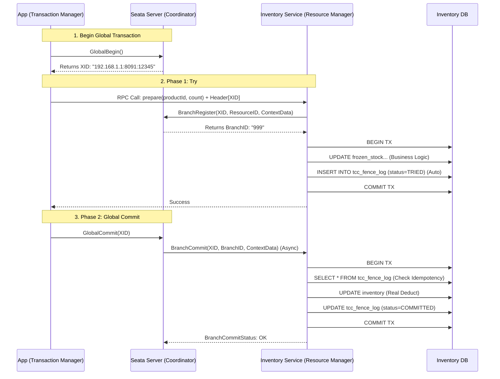
##### 5. Why Seata wins over LRA?

Если вы выбираете между стандартом MicroProfile LRA (REST) и Seata (TCP):
1. **Async Phase 2:** В Seata фаза `Confirm` выполняется асинхронно. TM получает ответ "Success" сразу после команды `GlobalCommit`. Ему не нужно ждать, пока все микросервисы реально подтвердят запись. Это снижает Latency для пользователя.
2. **Batching:** Seata умеет группировать несколько коммитов в один сетевой пакет (Client-side Batching), снижая нагрузку на сеть.
3. **Connection Management:** Seata RM использует одно постоянное TCP соединение с TC для всех транзакций, в то время как REST открывает новые соединения (или использует Pool).

> [!check] Архитектурный урок Если вы внедряете TCC в Java-экосистеме (Spring Cloud / Dubbo) — **Seata безальтернативна**. Попытка реализовать TCC-логику с "Fence Log" вручную — это путь к созданию сложной, глючной и медленной системы. Используйте `useTccFence=true` в конфигах Seata и спите спокойно.

#### B. The Java Standard: MicroProfile LRA
Если вы работаете в Enterprise Java (Quarkus, Helidon, Open Liberty), используйте стандарт **LRA (Long Running Actions)**.
Он основан на HTTP-заголовках и REST-принципах.

**Принцип работы:**
- Координатор LRA (отдельный сервис, например, Narayana).
- Участники помечают методы аннотациями.
```Java
@LRA(value = LRA.Type.REQUIRED) // Начинает или присоединяется к LRA
@POST
@Path("/book")
public Response bookFlight(@HeaderParam(LRA_HTTP_CONTEXT_HEADER) URI lraId) {
    // Logic for Try...
    return Response.ok().build();
}

@Compensate // Ссылка на метод отмены
@PUT
@Path("/compensate")
public Response cancelFlight(@HeaderParam(LRA_HTTP_CONTEXT_HEADER) URI lraId) {
    // Logic for Cancel...
    return Response.ok().build();
}

@Complete // Ссылка на метод подтверждения
@PUT
@Path("/complete")
public Response confirmFlight(@HeaderParam(LRA_HTTP_CONTEXT_HEADER) URI lraId) {
    // Logic for Confirm...
    return Response.ok().build();
}
```

**Плюс:** Это стандарт. Можно менять реализацию (Narayana на что-то другое).
**Минус:** Оверхед на HTTP-вызовы (все управляется через REST).
#### C. The .NET Way: MassTransit (Routing Slip)
В мире C# самым мощным инструментом является **MassTransit Courier**.
Они реализуют паттерн **Routing Slip** (Маршрутный Лист), который является разновидностью распределенной саги/TCC.
- Вы создаете "Slip" — список команд, которые нужно выполнить.
- Отправляете его в очередь.
- Каждый сервис выполняет свою часть и передает Slip дальше.
- Если ошибка — Slip начинает движение назад (выполняя Compensate-методы).
#### D. The Glue: Context Propagation (Проброс Контекста)
Самая сложная часть, которую фреймворки берут на себя — это **передача XID** (Transaction ID) сквозь слои приложения.
Без фреймворка вам придется вручную писать код вида:
```Python
# MANUAL HELL
def call_inventory(item_id, qty, xid):
    headers = {"x-tcc-id": xid} # Не забудь передать!
    requests.post(..., headers=headers)
```
С фреймворком (Interceptors):
1. **Incoming Request:** Middleware извлекает `x-seata-xid` из заголовков входящего запроса.
2. **ThreadLocal:** Кладет XID в локальный контекст потока.
3. **Outgoing Request:** HTTP-клиент (Feign/Axios) автоматически достает XID из ThreadLocal и вставляет в заголовки исходящего запроса.

Это гарантирует, что "Глобальная транзакция" не прервется, даже если цепочка вызовов пройдет через 10 микросервисов.
#### E. Comparison: Seata vs LRA vs Custom

|**Feature**|**Seata (Alibaba)**|**MicroProfile LRA**|**Custom (DIY)**|
|---|---|---|---|
|**Performance**|**Extreme** (Netty + Protobuf)|Medium (HTTP/REST)|Зависит от кривизны рук|
|**Protocol**|Proprietary (TCP)|Standard (HTTP)|Custom|
|**Language**|Java, Go, JS, C++|Java mainly|Any|
|**Consistency**|Strong (Fence Log built-in)|Strong|**Weak** (Обычно забывают Fence Log)|
|**Recovery**|Auto (TC Server)|Auto (Coordinator)|Manual Scripts / Cron|

> [!check] Архитектурный Вердикт
> 
> 1. Если у вас **Java/Go** и высокие нагрузки — берите **Seata**. Это золотой стандарт.
>     
> 2. Если у вас **Cloud Native / Kubernetes** и вы хотите стандартов — берите **LRA** (Narayana).
>     
> 3. Если вы пишете на Python/Node.js — посмотрите на **Temporal** (см. раздел 3). Реализовать TCC поверх Temporal гораздо проще, чем писать свой координатор, так как Temporal берет на себя ретраи и хранение состояния.
>

### 5.6. Comparison Matrix: TCC vs Saga vs 2PC

|**Feature**|**2PC (XA)**|**TCC**|**Saga**|
|---|---|---|---|
|**Consistency**|Strong (ACID)|Strong (Application Level)|Eventual (Base)|
|**Locking**|DB Locks (Heavy)|Resource Reservation (Light)|No Locks (Optimistic)|
|**Throughput**|Low|**High**|High|
|**Code Complexity**|Low (Driver handles it)|**Very High** (3x endpoints)|Medium|
|**Use Case**|Internal Systems|High-Freq Trading, Inventory|Order Processing, Email|

> [!check] Архитектурный Вердикт
> 
> Используйте TCC **только** для управления критическими, ограниченными ресурсами:
> 
> 1. Складские остатки (Inventory).
>     
> 2. Купоны / Промокоды (Vouchers).
>     
> 3. Балансы кошельков (Wallets).
>     
> 
> Для всего остального (отправка писем, создание записей в истории) используйте **Saga**. TCC для отправки email — это оверинжиниринг.

---
## 6. 2026 Context: Agentic Transactions & Semantic Rollback

> [!abstract] Проблема "Обезьяны с Гранатой"
> В классической системе разработчик пишет код, и он детерминирован.
> В Агентной системе (Agentic System) код пишет LLM на лету (через Tool Calls).
>
> **Агентная Транзакция** — это цепочка действий, инициированная вероятностной моделью.
> * **Риск:** Агент может "галлюцинировать" параметры (заказать 1000 тонн вместо 100).
> * **Проблема:** SQL-транзакция пройдет успешно (числа валидны), но Бизнес-транзакция будет катастрофой.
>
> Нам нужен слой **Semantical Integrity**, который стоит выше Referential Integrity базы данных.
### 6.1. The Concept: Semantic Rollback (Undo for AI)
Когда SQL-транзакция падает, база данных возвращает старые байты.
Когда Агент ошибается (например, отправляет письмо с неверной датой), мы не можем "вернуть байты". Мы должны совершить **Контр-Действие**.

**Semantic Rollback** — это вызов специализированного LLM-агента (Repair Agent) с целью исправить последствия ошибки основного Агента.

* **Пример:**
    1.  **Action:** Агент забронировал встречу на 3:00 AM вместо 3:00 PM.
    2.  **Detection:** Пользователь или Валидатор замечает аномалию.
    3.  **Semantic Rollback:** Система вызывает `UndoAgent`.
        * *Prompt:* "Ты ошибся во времени. Отмени встречу #123. Напиши извинение участникам. Создай новую встречу на 15:00."

### 6.2. Architecture: The "Draft-Commit" Protocol (Песочница)
Чтобы минимизировать необходимость отката, в 2026 году мы используем паттерн **Sandbox Execution**. Агентам запрещено менять реальность (`World State`) напрямую.

**Алгоритм:**
1.  **Phase 1: Draft (Черновик).**
    * Агент вызывает инструменты.
    * Система перехватывает вызовы и пишет их в таблицу `staged_actions` (или "Draft Mode" основной сущности).
    * *Пример:* Создается "Черновик платежа", "Черновик письма".
2.  **Phase 2: Validation (Суд).**
    * Автоматические правила (Deterministic Guardrails) проверяют черновик: "Сумма < $1000?", "Нет мата в письме?".
    * **Human-in-the-Loop:** Если риск высокий, черновик отправляется человеку на апрув.
3.  **Phase 3: Commit (Исполнение).**
    * Только после прохождения проверок система применяет изменения к реальной БД и вызывает внешние API.

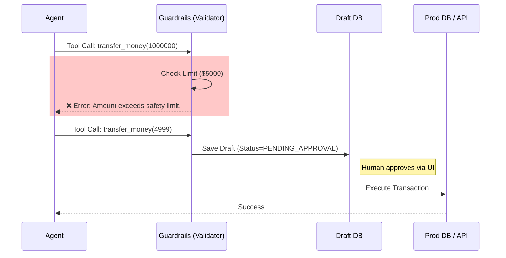
### 6.3. Protocol: Two-Phase Generation (2PG)

Это адаптация 2PC для нейросетей. Мы используем способность LLM к самокоррекции.

**Cycle:**
1. **Generate:** Агент генерирует JSON с параметрами транзакции.
2. **Simulate:** Система выполняет "Dry Run" (сухой прогон).
    - Проверяет FK в базе.
    - Проверяет бизнес-правила.
    - Возвращает _виртуальный_ результат или ошибку.
        
3. **Reflect (Self-Correction):**
    - Если симуляция вернула ошибку, мы скармливаем эту ошибку обратно Агенту: _"Твой запрос упал с ошибкой 'Invalid Date'. Исправь."_
    - Агент генерирует новый JSON.
        
4. **Execute:** Если симуляция ОК $\to$ выполняем реально.

> [!tip] Token Economics
> 
> Этот цикл стоит денег (токенов). Обычно мы ставим лимит: **Max 3 Retries**.
> 
> Если Агент не смог сформировать валидную транзакцию за 3 попытки — мы прерываем процесс и зовем человека (Escalation).
### 6.4. Code Example: Agentic Transaction Wrapper

Как обернуть вызов LLM в транзакционную логику на Python.
```Python
class AgentTransaction:
    def __init__(self, agent, max_retries=3):
        self.agent = agent
        self.max_retries = max_retries

    def execute(self, user_goal):
        attempts = 0
        history = [user_goal]

        while attempts < self.max_retries:
            # 1. Generation Phase
            action_plan = self.agent.generate(history)
            
            # 2. Validation / Simulation Phase
            try:
                self.validate_safety(action_plan) # Проверка Guardrails
                result = self.simulate_execution(action_plan) # Dry Run
            except ValidationException as e:
                # 3. Reflection Phase (Feedback Loop)
                error_msg = f"System: Your plan failed validation: {str(e)}. Please correct."
                history.append(action_plan)
                history.append(error_msg)
                attempts += 1
                continue # Try again with error context
            
            # 4. Commit Phase
            return self.commit_execution(action_plan)
            
        raise ZombieAgentException("Agent is stuck in error loop")

    def validate_safety(self, plan):
        if plan.tool == 'delete_database':
            raise ValidationException("Action forbidden by directive 4")
```

### 6.5. The "Ghost Write" Phenomenon (Фантомная Запись)
Уникальная проблема 2026 года.
Агент может "подумать", что он что-то сделал, потому что LLM склонна к утверждению успеха.
- **Scenario:**
    - User: "Купи билет".
    - Agent (LLM): _Генерирует текст_ "Я успешно купил билет #ABC".
    - **Reality:** Агент _забыл_ вызвать Tool `buy_ticket`. Он просто сгенерировал текст ответа.
        
- **Solution (Action Verification):**
    - Система должна запрещать Агенту выводить текст "Успешно", если в истории диалога нет подтвержденного события `ToolOutput` от системы.
    - Мы используем **Output Parsers**, которые блокируют ответ Агента, если он утверждает факт транзакции, которой не было в логах.

### 6.6. Comparison: ACID vs Agentic

|**Feature**|**ACID Transaction (SQL)**|**Agentic Transaction (LLM)**|
|---|---|---|
|**Deterministic**|Yes (100%)|No (Probabilistic)|
|**Rollback**|Restore previous state (Bytes)|**Compensating Action** (Semantic)|
|**Validation**|Constraints (Types, FK)|**Guardrails** (Safety, Ethics, Policy)|
|**Error Handling**|Exception Catching|**Self-Correction** (Re-prompting)|
|**Human Role**|None (Automated)|**Approver** (Critical for commit)|

> [!check] Архитектурный Вердикт
> 
> В эпоху ИИ понятие "Транзакция" расширяется.
> 
> Это больше не просто "Блокировка строк". Это **"Диалог с целью изменения состояния"**.
> 
> Ваша архитектура должна быть готова к тому, что "Оператор БД" (Агент) может быть пьян, забывчив или чрезмерно инициативен.
> 
> Паттерны **Draft-Commit** и **Simulation Loop** — это единственная защита от хаоса.
---
## 7. Decision Matrix: Which Transaction to use?

> [!abstract] Закон сохранения боли
> В распределенных системах сложность никуда не исчезает. Вы лишь выбираете, где она будет жить:
> 1.  **В Базе Данных:** (2PC/XA) — База тормозит, но код простой.
> 2.  **В Коде Приложения:** (TCC/Saga) — База летает, но код сложный и запутанный.
> 3.  **В Инфраструктуре:** (Outbox/CDC) — Нужны Kafka, Debezium, Zookeeper.
>
> **Золотое правило архитектора:** Всегда начинайте с самого простого варианта (Local TX). Переходите к следующему уровню сложности только тогда, когда предыдущий *физически* не справляется с требованиями бизнеса.
### 7.1. The Complexity Spectrum (От простого к сложному)
Мы ранжируем паттерны по возрастанию "Implementational Overhead" (накладных расходов на внедрение).

$$Local < Outbox < Saga (Orchestrated) < TCC < 2PC (XA)$$

#### 1. Local Transaction (The Monolith Approach)
* **Суть:** Все данные живут в одной БД. Или мы используем **Modular Monolith**.
* **Применимость:** 80% всех стартапов и B2B приложений.
* **Совет:** Если вы можете не делить базу данных — **не делите её**. Микросервисы — это средство масштабирования команд, а не самоцель.

#### 2. Transactional Outbox (The Glue)
* **Суть:** Асинхронная Eventual Consistency. "Я сохраню у себя, а остальные пусть подтянутся".
* **Применимость:** Синхронизация данных для поиска (Elasticsearch), кэшей (Redis), аналитики и уведомлений.
* **Ограничение:** Не подходит, если вам нужен синхронный ответ пользователю ("Платеж прошел?").

#### 3. Saga (The Standard)
* **Суть:** Цепочка локальных транзакций с компенсациями.
* **Применимость:** Длинные бизнес-процессы (Заказы, Путешествия), где допустимы временные несоответствия данных.
* **Жертва:** **Isolation**. Вы должны быть готовы к аномалиям (Dirty Reads) или бороться с ними вручную (Semantic Locks).

#### 4. TCC (The High-Frequency)
* **Суть:** Программная блокировка ресурсов.
* **Применимость:** Биржи, Биллинг, Складской учет дефицитных товаров.
* **Цена:** x3-x4 объем кода. Жесткая привязка к схеме БД.

#### 5. 2PC / XA (The Legacy / NewSQL)
* **Суть:** Глобальная блокировка.
* **Применимость:** Только внутри доверенной сети с низкой латентностью (Intranet) или при использовании NewSQL (CockroachDB, Spanner).
* **Табу:** Никогда не используйте XA между микросервисами через публичный интернет или JSON/REST.

### 7.2. The Flowchart: How to decide?
Следуйте этому алгоритму, чтобы выбрать паттерн.

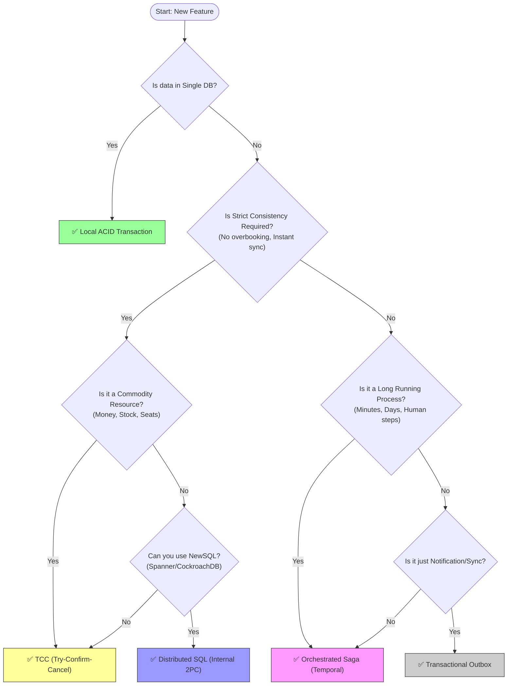
### 7.3. Comparative Matrix (Шпаргалка)

|**Feature**|**Local TX**|**Outbox**|**Saga**|**TCC**|**2PC (XA)**|
|---|---|---|---|---|---|
|**Consistency**|Strong (ACID)|Eventual|Eventual (ACD)|Strong (Application)|Strong (ACID)|
|**Isolation**|Perfect|N/A|**Leaky** (Dirty Reads)|Good (Reserved)|Perfect (Locks)|
|**Availability**|High|High|High|High|**Low** (Blocking)|
|**Latency**|Minimal|Async|Medium|Low (No global lock)|High (RTT x 4)|
|**Code Effort**|Low|Medium|High|**Very High**|Low (Driver)|
|**Infra Needs**|None|CDC / Kafka|Orchestrator|Coordination Svc|XA Managers|
|**Best For**|Monoliths|Analytics, Search|Orders, Workflows|Wallet, Inventory|Internal Sharding|
### 7.4. Real-World Scenarios (Примеры из жизни)

**Сценарий A: Регистрация пользователя**
- _Задача:_ Создать юзера в PostgreSQL, отправить Welcome Email, создать запись в CRM (Salesforce).
- _Анализ:_ Отправка Email и CRM не должны блокировать создание юзера. Если CRM лежит, мы просто повторим позже. Изоляция не важна.
- _Выбор:_ **Transactional Outbox**.
    - Транзакция 1: `INSERT users` + `INSERT outbox (event='UserCreated')`.
    - Воркер: Читает Outbox $\to$ Email + CRM.

**Сценарий B: Перевод денег между банками (Instant Payment)**
- _Задача:_ Списать со счета А, зачислить на счет Б.
- _Анализ:_ Деньги не могут исчезнуть. Овердрафт недопустим. Операция должна быть быстрой.
- _Выбор:_ **TCC (или Saga с сильными гарантиями).**
    - TCC надежнее: `Try` замораживает средства отправителя. Только если банк-получатель подтвердит готовность принять (`Try`), мы делаем `Confirm`.

**Сценарий C: Заказ доставки еды**
- _Задача:_ Оплата, Ресторан готовит, Курьер едет.
- _Анализ:_ Процесс долгий (40 мин). Откаты частые (курьеров нет, ресторан закрылся). Строгая изоляция не нужна (пользователь понимает статус "Поиск курьера").
- _Выбор:_ **Orchestrated Saga (Temporal).**
    - Легко управлять тайм-аутами ("Если курьер не найден за 15 мин -> Отмена").
    - Легко делать компенсации.

**Сценарий D: Покупка в App Store**
- _Задача:_ Списать деньги, выдать цифровую лицензию.
- _Анализ:_ Это критическая секция. Но Apple контролирует и базу денег, и базу лицензий.
- _Выбор:_ **NewSQL (Spanner/FoundationDB).**
    - Apple использует FoundationDB, которая дает ACID транзакции поверх распределенного кластера. Для разработчика это выглядит как **Local TX**.

### 7.5. Final Architect's Advice
1. **Avoid Distributed Transactions:** Лучшая распределенная транзакция — та, которой не было. Попробуйте спроектировать систему так, чтобы действие было идемпотентным и повторяемым, или чтобы все данные жили в одном шарде.
2. **Sync vs Async:**
    - Если пользователь **ждет** ответа (спиннер крутится) — избегайте Саг, используйте TCC или оптимизируйте до Local TX.
    - Если пользователь нажал "Оформить" и видит экран "Спасибо, мы взяли в работу" — используйте Саги/Outbox.
3. **Use Durable Execution:** В 2026 году ручное управление состоянием (State Machines в БД) — это технический долг. Используйте **Temporal**, **Restate** или аналоги. Это сэкономит вам 50% времени на отладку гонок и ретраев.
---
## 8. War Games: Chaos Engineering
## 8. War Games: Chaos Engineering & Verification [Deep Dive]

> [!danger] Иллюзия Надежности
> Распределенная система работает нормально 99% времени.
> Но именно в оставшийся 1% (сетевой шторм, рестарт подов, отказ диска) происходят **потери денег** и рассинхронизация данных.
>
> **Chaos Engineering** в контексте транзакций — это не просто "выключить сервер". Это хирургическое вмешательство с целью ответить на вопрос:
> *"Если я выдерну шнур питания ровно через 1 миллисекунду после `COMMIT` в базе, но до отправки сообщения в Kafka — восстановится ли система сама?"*


### 8.1. The Philosophy: Testing the Recovery, Not the Happy Path
Традиционные тесты проверяют: `Input A -> Output B`.
Хаос-тесты проверяют: `Input A -> Crash -> Recovery -> Output B`.

Ваша цель — верифицировать **Anti-Entropy Logic** (механизмы, которые устраняют хаос):
1.  **Idempotency:** Не приведет ли повтор пакета к двойному списанию?
2.  **Timeouts:** Не зависнет ли Сага навечно, если ответ потеряется?
3.  **Atomicity:** Не останется ли "висячих" резервов при частичном сбое?

### 8.2. Injection Points: Where to hurt?
Мы внедряем сбои на трех уровнях.

#### A. Network Level (Toxiproxy / Istio)
* **Blackhole:** Дропать все пакеты к Payment Gateway. Сага должна уйти в откат.
* **High Latency:** Добавить 30 секунд задержки к ответу БД. Приложение должно отвалиться по тайм-ауту, но *не* заблокировать поток навсегда.
* **Duplicate Packets:** Дублировать HTTP-ответы. Проверка идемпотентности клиента.

#### B. Infrastructure Level (Chaos Mesh)
* **Pod Kill:** Убить инстанс Оркестратора. Другой инстанс должен подхватить Workflow.
* **Disk Fill:** Заполнить диск БД на 100%. Транзакция должна откатиться чисто, не оставив мусора.
* **Clock Skew:** Сдвинуть время на сервере на 5 минут назад. (Критично для генерации токенов и тайм-аутов).

#### C. Application Level (ALFI - App Layer Fault Injection)
Самый точный метод. Мы внедряем "бомбы" прямо в код через заголовки или флаги.

```python
# Middleware Chaos Injector
def chaos_middleware(request):
    # Если в заголовке есть x-chaos-kill-after-commit
    if request.headers.get('x-chaos-fail') == 'true':
        db.commit()
        # Эмуляция краха VM сразу после записи в БД, 
        # но ДО возврата ответа клиенту.
        os._exit(1)
```

### 8.3. The "Kill-After-Commit" Test (The Gold Standard)
Это самый важный тест для любой системы с Transactional Outbox или TCC.
**Сценарий:**
1. Сервис выполняет бизнес-логику.
2. Сервис делает `COMMIT` в базу данных.
3. **КРАХ!** (Процесс умирает до того, как успел отправить `ACK` оркестратору или сообщение в Kafka).
4. **Восстановление:**
    - Оркестратор не получил ответ и шлет запрос повторно (Retry).
    - Сервис поднимается.

**Проверка:**
- Если сервис выполнит логику второй раз $\to$ **Double Spending** (Провал).
- Если сервис вернет ошибку "Уже сделано" $\to$ **Success** (Идемпотентность сработала).

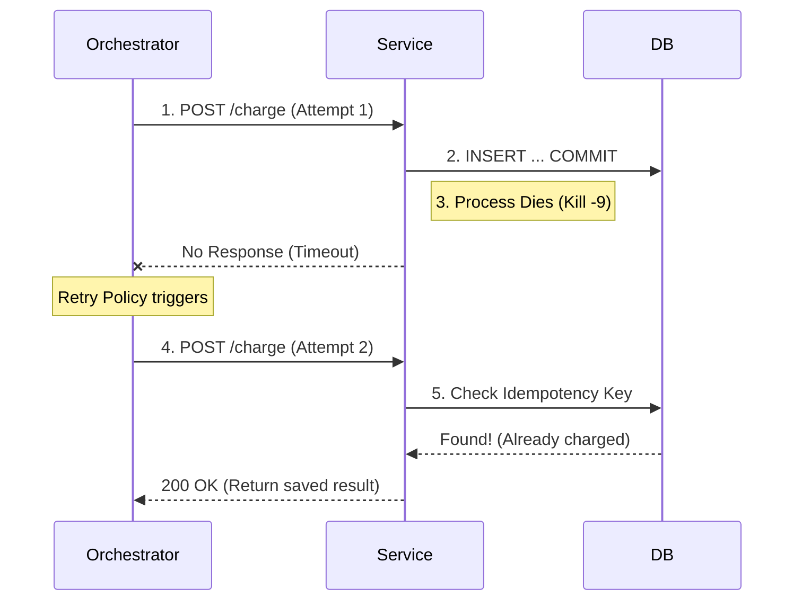
### 8.4. Specific Scenarios for Patterns

|**Pattern**|**Chaos Scenario**|**Expected Behavior**|
|---|---|---|
|**Saga**|Убить сервис компенсации ($C_1$) во время отката.|Оркестратор должен повторять вызов $C_1$ до бесконечности, пока сервис не оживет. Сага не должна застрять в "полу-откаченном" состоянии.|
|**TCC**|Послать `Cancel` без предварительного `Try` (потеря пакета).|Сервис должен вернуть 200 OK (Null Rollback) и записать во `fence_log`, что транзакция отменена.|
|**Outbox**|Убить Kafka Broker.|Записи должны копиться в таблице `outbox`. При поднятии Kafka они должны доставиться. Порядок событий `orders.id` должен сохраниться.|
|**Locking**|Убить сервис, который держит Redis Lock.|Lock должен иметь TTL. Он должен протухнуть через N секунд, иначе ресурс заблокирован навечно (Deadlock).|
### 8.5. Tools of Destruction (2026 Toolkit)
Не пишите скрипты на Bash. Используйте индустриальные стандарты.
1. **Chaos Mesh / Litmus (Kubernetes):**
    - Стандарт для Cloud Native. Умеет делать Network Partition, Packet Loss, Pod Failure.
    - _Фича:_ Можно настроить "Blast Radius" (взрывать только поды с лейблом `app=payment-service-stage`).
        
2. **Toxiproxy (Shopify):**
    - Прокси для локальной разработки и CI.
    - Вы ставите его между приложением и БД.
    - Командой API вы говорите: "Оборви все соединения". Идеально для unit-тестов драйверов БД.
        
3. **Jepsen (The Ultimate Boss):**
    - Фреймворк на Clojure для проверки линеаризуемости распределенных баз данных.
    - Если вы пишете свою базу данных или TCC-координатор — вы обязаны пройти тесты Jepsen.
### 8.6. The "Game Day" Protocol (Учения)
Chaos Engineering — это не только софт, это люди. Раз в квартал команда проводит **Game Day**.
1. **Hypothesis:** "Если упадет регион `us-east-1`, наш Passive реплика в `eu-central-1` станет Active за 5 минут без потери данных".
2. **Blast Radius:** Только Staging Environment (или Production для смелых, но с возможностью экстренной остановки).
3. **Execution:** Инженер запускает сценарий отказа.
4. **Observation:** Команда смотрит в Grafana/Datadog. Сработают ли алерты? Видят ли они причину?
5. **Post-Mortem:** Если гипотеза не подтвердилась (данные потеряны), создается задача с приоритетом `Critical`.

> [!check] Архитектурный Вердикт
> 
> Вы не можете _доказать_ корректность распределенной системы тестами.
> 
> Вы можете только _опровергнуть_ её надежность хаосом.
> 
> **Правило:** Если ваша система не переживает "Kill-After-Commit" тест — у вас нет транзакций. У вас просто "совпадение обстоятельств", которое работает до первого сбоя. 

## 9. Beyond Transactions: Agent Swarms & Robotic Fleets 

> [!abstract] Сдвиг Парадигмы: От ACID к Stigmergy
> В базах данных мы боремся за **Consistency** (чтобы данные были одинаковыми).
> В роях роботов мы боремся за **Convergence** (чтобы цель была достигнута), допуская, что каждый робот видит мир немного по-своему.
>
> Вместо Оркестратора, который говорит каждому "Сделай шаг влево", мы используем среду, где роботы сами решают, куда идти, основываясь на локальных правилах и глобальной цели.

### 9.1. Communication Layer: Why Kafka is too slow
Обычные брокеры (Kafka/RabbitMQ) не подходят для дронов.
1.  **Latency:** Дрону нужно знать положение соседа за 1 мс, чтобы не врезаться. Kafka дает 10-100 мс.
2.  **Centralization:** Если "центр" упадет или дрон влетит в туннель без 5G, он не должен остановиться.

**Решение 2026: DDS & Zenoh**
* **DDS (Data Distribution Service):** Стандарт де-факто (используется в ROS 2). Это P2P протокол поверх UDP. Нет центрального брокера. Роботы находят друг друга (Discovery) и шлют данные напрямую (Multicast).
* **Zenoh:** Протокол "Интернета Роботов". Позволяет объединять P2P Mesh (рой дронов) с Cloud (центр управления) с минимальным оверхедом.

### 9.2. Coordination Pattern 1: Market-Based Auctions (CNP)
Как решить, кто из 100 дронов полетит проверять подозрительный объект?
Мы используем **Contract Net Protocol (CNP)** — экономическую модель.

**Алгоритм (Аукцион):**
1.  **Manager (Или Облако):** Публикует задачу "Task: Scan Sector 7".
2.  **Bidding (Ставки):** Каждый дрон оценивает свои ресурсы:
    * Дрон А: "Я далеко, батарея 20%. Моя цена (Cost) = 100".
    * Дрон Б: "Я рядом, батарея 90%. Моя цена = 10".
3.  **Awarding:** Менеджер (или алгоритм консенсуса) отдает задачу Дрону Б.
4.  **Contract:** Дрон Б "подписывает" обязательство.

**Почему это круто:** Если Дрон Б собьют, задача снова выставляется на аукцион. Система самовосстанавливается (Self-Healing) без жестких транзакций.

### 9.3. Coordination Pattern 2: Stigmergy (Digital Pheromones)
Подход, украденный у муравьев. Идеален для **полной децентрализации** (нет связи с центром).

**Принцип:** Агенты не общаются друг с другом напрямую. Они меняют **Среду** (Environment).

**Пример (Складские роботы):**
1.  Робот А нашел препятствие. Он не пишет в чат "Тут камень".
2.  Он ставит "Виртуальную метку опасности" (Pheromone) в **Shared Virtual Map** (локально распределенной карте).
3.  Робот Б, проезжая рядом, считывает метку с карты и меняет маршрут.
4.  Метка со временем "испаряется" (TTL), если её не обновлять.

**Техническая реализация:** Используются **CRDTs (Conflict-free Replicated Data Types)**. Это структуры данных (G-Counter, LWW-Map), которые позволяют сливать (merge) карты от разных роботов без конфликтов, даже если они были оффлайн 10 минут.

### 9.4. Coordination Pattern 3: Hierarchical Control (Hybrid)
В реальных системах (Amazon Robotics, Military Drones) используется гибрид.

**Level 1: Mission Orchestration (Temporal / Saga)**
* *Где:* В облаке.
* *Что делает:* Высокоуровневая логика. "Заказ #123 должен быть собран".
* *Инструмент:* **Temporal**. Он создает "Mission Workflow". Если миссия падает, Temporal делает ретрай на уровне бизнес-логики (назначить другой отряд).

**Level 2: Fleet Management (Centralized Optimizer)**
* *Где:* Edge Server (на фабрике).
* *Что делает:* Traffic Control. Раздает пути, чтобы роботы не стояли в пробках. Решает задачу **Multi-Agent Path Finding (MAPF)**.

**Level 3: Local Autonomy (Reactive)**
* *Где:* На борту робота.
* *Что делает:* Избегание столкновений (Collision Avoidance), SLAM.
* *Принцип:* Если сервер молчит, робот переходит в режим "Safety Stop" или "Return Home".

### 9.5. Data Consistency: The "World Model"
Главная проблема: "Где правда?". Дрон А видит дверь открытой. Дрон Б видит закрытой.

Используется **Probabilistic Fusion (Слияние Данных):**
* Вместо `DoorStatus = OPEN` (Boolean), мы храним `DoorStatus = {OPEN: 0.8, CLOSED: 0.2}`.
* Используются **Фильтры Калмана** или **Байесовские сети** для обновления уверенности.
* Транзакция здесь — это не "LOCK ROW", а "Update Probability Belief".

### 9.6. Decision Matrix for Robotics

| Задача | Архитектура | Паттерн | Пример |
| :--- | :--- | :--- | :--- |
| **Склад (Amazon)** | Centralized | **MAPF + Orchestration** | Один супер-мозг управляет трафиком 1000 роботов. |
| **Рой дронов (Show)** | Centralized (Sync) | **Choreography (Time-based)** | Все дроны синхронизируют часы и выполняют скрипт по тайм-коду. |
| **Поисковая операция** | Decentralized | **Market-Based / Auction** | Дроны торгуются за зоны поиска. |
| **Муравьи (Nano-bots)** | Decentralized | **Stigmergy** | Общение через метки в среде. |

> [!tip] 2026 Trend: LLM as the Commander
> Сейчас мы встраиваем LLM прямо в "Мозг" роя.
>
> 1.  Человек говорит: *"Найди потерянного туриста в лесу"*.
> 2.  **Strategic Agent (Cloud):** Дробит задачу на сектора.
> 3.  **Tactical Agent (Squad Leader):** Использует Аукцион, чтобы раздать сектора дронам.
> 4.  **Action Agent (Drone):** Летит, используя нейронку для распознавания людей.
>
> Если дрон находит человека, он меняет свое состояние, и через **CRDT** это знание мгновенно распространяется на весь рой ("Цель найдена, всем собраться в точке X").

