#engineering #devops #sre #scalability #k8s

> [!abstract] Определение
> **Deployment Strategy** — это методология обновления работающего приложения с версии $V_1$ на $V_2$ таким образом, чтобы минимизировать **Downtime** (время простоя) и **Impact** (влияние ошибок на пользователей).
>
> Главная дилемма: **Скорость vs Надежность**.
> Чем быстрее вы выкатываете, тем выше риск положить прод. Чем безопаснее выкатываете, тем дороже это стоит (инфраструктура/время).

---
## 1. The Big Picture: Deployment vs. Release

> [!abstract] Фундаментальная Аксиома
> **Deployment != Release**.
>
> * **Deployment (Развертывание):** Это перекладывание бинарных файлов (артефактов) на сервера. Это *техническое* действие. Оно имеет бинарный статус: "Успех" (сервер запустился) или "Провал" (CrashLoopBackOff).
> * **Release (Релиз/Выпуск):** Это предоставление доступа к функционалу конечным пользователям. Это *бизнес-действие*. Оно имеет градиентный статус: "Фича включена для 5% пользователей", "Фича приносит деньги", "Фича ломает конверсию".
>
> **Цель архитектора:** Сделать Deployment скучным, частым и невидимым, чтобы Release мог быть мгновенным и безопасным.
### 1.1. The "Coupled" Trap (Анти-паттерн)

> [!danger] Атомарность Катастрофы
> В связанном (Coupled) подходе Deployment и Release являются **атомарной операцией**.
> $$Deployment(Code) + Release(Feature) = Event$$
>
> Это означает, что **физическое обновление файлов** на сервере мгновенно меняет **пользовательский опыт**.
> У вас нет пространства для маневра. Вы не можете "залить код, но не включать его". Вы либо побеждаете, либо проигрываете. Третьего не дано.
#### A. The Anatomy of the Trap (Почему это больно?)
Когда эти процессы склеены, возникают три системные патологии, которые убивают скорость разработки (Velocity).

**1. Release Anxiety ("Страх Пятницы")**
* *Симптом:* Команда вводит "Code Freeze" за два дня до релиза. Менеджеры нервничают. Деплои по пятницам запрещены официально или негласно.
* *Причина:* Высокий **Blast Radius** (Радиус поражения). Если релиз сломает продакшн в пятницу вечером, команде придется провести выходные, откатывая базу данных и чиня баги под давлением.
* *Следствие:* Релизы становятся редкими (раз в 2 недели), накапливая еще больше изменений, что увеличивает риск еще сильнее. Замкнутый круг.

**2. The "All-or-Nothing" Rollback (Заложники Монолита)**
Представьте, что в релиз вошли:
* Feature A: Критически важная фича для маркетинга (Revenue driver).
* Feature B: Исправление опечатки на главной.
* Feature C: Сложный рефакторинг базы данных.

* *Сценарий:* Feature C содержит баг, который кладет сервер (500 Error).
* *Реакция:* Вы обязаны сделать **Rollback** (Откат) до предыдущей версии.
* *Трагедия:* Вместе с багованной Feature C вы "убиваете" и Feature A, и Feature B. Маркетинг теряет деньги, разработчики Feature A фрустрированы, так как их идеальный код выкинули из-за чужой ошибки.

**3. Downtime Maintenance Windows (Остановка Мира)**
Так как обновление происходит "по живому", состояние системы в момент деплоя неконсистентно.
* Старый код может пытаться писать в новую структуру БД (или наоборот).
* Пользовательские сессии разрываются.
* *Решение (плохое):* Вывесить заглушку "We are under maintenance" на 2 часа ночью. В глобальном мире (24/7) это означает потерю клиентов в другом часовом поясе.

#### B. Architectural Metric: MTTR Impact
В архитектуре мы измеряем **Mean Time To Recovery (MTTR)** — среднее время восстановления после сбоя.

* **В Coupled-системе:** Чтобы починить баг, вам нужно:
    1.  Найти ошибку в коде.
    2.  Написать фикс.
    3.  Прогнать CI/CD пайплайн (Build, Test, Docker push).
    4.  Задеплоить артефакт.
    * *Время:* От 30 минут до часов. Все это время прод лежит.
* **В Decoupled-системе (Feature Flags):**
    1.  Зайти в админку флагов.
    2.  Выключить переключатель.
    * *Время:* 5 секунд. Прод восстановлен.

#### C. Real-World Scenario: The "Shopping Cart" Disaster
Рассмотрим классический пример провала Coupled Deployment.

1.  **Context:** Интернет-магазин обновляет алгоритм расчета скидок (`PricingService`) перед "Черной Пятницей".
2.  **The Change:** Разработчики переписали логику на более быструю, но забыли крайний случай (Edge case) с отрицательными скидками.
3.  **The Event:**
    * 18:00: Деплой новой версии сервиса.
    * 18:01: Все пользователи начинают видеть скидку -100% (магазин должен денег клиенту).
4.  **The Panic:**
    * SRE видит алерты.
    * Решение: Rollback.
    * Проблема: Пайплайн отката забит очередью других джобов Jenkins.
    * Результат: Ошибочная версия висит 15 минут. Убытки огромны.
5.  **The Fix (Decoupled Way):**
    * Если бы это было скрыто за Feature Flag, SRE просто отключил бы флаг `new_pricing_engine`, и пользователи мгновенно вернулись бы к старой (медленной, но корректной) логике.

> [!check] Архитектурный Вердикт
> Coupled Deployment допустим только на стадии MVP или для внутренних инструментов.
> Для Enterprise-систем это **технический долг**, который необходимо гасить внедрением стратегий Blue-Green, Canary или Feature Flags.
>
> Вы не можете масштабировать бизнес, если каждое обновление кода требует молитвы.
### 1.2. The "Decoupled" Ideal (Паттерн 2026)

> [!abstract] Смена Парадигмы: Латентный Код
> В "Развязанной" (Decoupled) архитектуре код, попадающий на сервер, находится в **латентном (спящем) состоянии**.
>
> * **Deployment:** Это доставка "спящего" кода на сервера. Это действие с низким риском.
> * **Activation:** Это пробуждение кода для конкретной группы пользователей.
> * **Release:** Это момент, когда код "просыпается" для 100% аудитории.
>
> Мы переходим от бинарного релиза (Вкл/Выкл) к **Градиентному (Progressive)**.

#### A. Level 1: Application Layer (Feature Flags)
Это самый гранулярный уровень контроля. Мы оборачиваем новую логику в условные операторы, управляемые извне.

* **Суть:** Вместо того чтобы ветвить код в Git (Feature Branches), мы ветвим его во время выполнения (Runtime).
* **Smart Targeting (Таргетинг 2026):**
    * Флаги 2015 года: `IF config.new_ui == true`.
    * Флаги 2026 года: `IF flag.eval(user_context) == true`.
    * Контекст позволяет включать фичу только для: `Region=EU`, `Role=Admin`, `Subscription=Premium`, `Device=iOS`.

**Код (Pattern: Abstraction):**
Не пишите `if` везде. Используйте провайдер.
```python
# Bad: Hardcoded Logic
if config.get("new_algorithm"):
    result = new_calc()

# Good: Context-Aware Evaluation
user_ctx = {"id": user.id, "email": user.email, "beta_group": True}

if feature_manager.is_enabled("smart-pricing-v2", user_ctx):
    # Этот код выполняется только для сотрудников компании
    result = smart_pricing_v2.calc() 
else:
    # Весь мир (99.9%) продолжает работать на старом, проверенном коде
    result = legacy_pricing.calc()
```
#### B. Level 2: Traffic Layer (Dark Launching / Shadowing)

Это техника для проверки **Back-end** систем под реальной нагрузкой, без влияния на пользователя.

- **Механизм (Traffic Mirroring):**
    1. Пользователь делает запрос `GET /recommendations`.
    2. Gateway (Envoy/Istio) направляет запрос в **Stable Version** (v1).
    3. Gateway **асинхронно копирует** (Fire-and-Forget) тот же запрос в **Shadow Version** (v2).
    4. Пользователь получает ответ от v1. Ответ от v2 отбрасывается (или пишется в лог).
- **Цель:** Сравнить производительность (Latency) и корректность (Accuracy) v2 на реальном трафике "Черной Пятницы".
- **Риск:** Нулевой. Даже если v2 упадет с `Kernel Panic`, пользователь этого не заметит.
#### C. Level 3: Infrastructure Layer (Blue-Green / Canary)

Это "Тяжелая артиллерия", когда мы не можем использовать Feature Flags (например, при обновлении версии базы данных или Kubernetes кластера).

- **Blue-Green (Switch):**
    - _Deployment:_ Поднимаем новый кластер (Green).
    - _Release:_ Переписываем правила DNS/Load Balancer.
    - _Откат:_ Мгновенный возврат DNS.
        
- **Canary (Gradient):**
    - _Deployment:_ Заменяем 1 под из 100.
    - _Release:_ Умный Ingress направляет 1% трафика на этот под.
    - _AI Analysis:_ Prometheus/Datadog сравнивает метрики (Error Rate, Latency) канарейки и основного флота. Если отклонение > 1% — автоматический откат.
#### D. The "Ring Deployment" Strategy (Кольца Деплоя)

В крупных компаниях (Google, Microsoft) используется концепция концентрических колец защиты.

1. **Ring 0 (Canary / Dogfood):** Деплой только для инженеров команды. (Они первыми "едят свой корм").
2. **Ring 1 (Internal):** Деплой для всех сотрудников компании.
3. **Ring 2 (Early Adopters):** 1-5% внешних пользователей (Beta-тестеры).
4. **Ring 3 (Production):** Оставшиеся 95% пользователей (раскатывается по регионам).

> [!check] Архитектурный Вердикт **Decoupled Architecture** требует инвестиций в инструменты:
> 
> 1. **Feature Flag Management System** (LaunchDarkly, Unleash, Split). Самописные конфиги в JSON больше не работают.
>     
> 2. **Observability** (Tracing, Metrics). Вы не можете делать Canary, если не видите ошибок в реальном времени.
>     
> 
> Но эти инвестиции окупаются: вы получаете **Mean Time To Recovery (MTTR) близкое к нулю**. Вы не чините баги, вы просто выключаете фичи.

### 1.3. Comparison: Who owns what?

> [!abstract] Разделение Власти
> В современной компании код проходит через две разные "таможни".
> 1.  **Deployment Boundary:** Технический барьер. Пропускает только *работоспособный* код (не падает, не течет память).
> 2.  **Release Boundary:** Бизнес-барьер. Пропускает только *полезный* код (приносит деньги, радует пользователя).
>
> Смешивание этих ролей ведет к тому, что Product Manager пытается рулить Kubernetes-кластером, а DevOps пытается оценивать UX. Это катастрофа.
#### A. The Comparative Matrix (Technical vs. Business)

| Aspect | Deployment (Техническая Реализация) | Release (Бизнес-Активация) |
| :--- | :--- | :--- |
| **Владелец (Owner)** | **Platform Team / SRE / Developers.** Люди, которые отвечают за `uptime` и пайплайны. | **Product Manager / Marketing / Growth.** Люди, которые отвечают за `revenue` и метрики продукта. |
| **Главный Вопрос** | *"Работает ли код?"* (Is it healthy?) | *"Нужен ли этот код?"* (Is it valuable?) |
| **Критерий Успеха** | **Green Health Checks.** Поды поднялись, памяти хватает, латентность в норме. | **Positive KPIs.** Конверсия выросла, жалоб нет, Retention стабилен. |
| **Механизм Отката** | **Technical Rollback.** `kubectl rollout undo`. Медленно, опасно, затрагивает всех. | **Toggle Off.** Выключение флага в админке. Мгновенно, точечно, безопасно. |
| **Инструментарий** | **GitOps:** ArgoCD, Flux, Helm, Terraform. | **Feature Management:** LaunchDarkly, Split, Unleash, PostHog. |
| **Время выполнения** | Часы/Минуты (CI/CD Pipeline). | Миллисекунды (Runtime Config Change). |
| **Аудитория** | Машины (Servers, Databases). | Люди (Users, Customers). |

#### B. The "Platform" Shift (Role of DevOps in 2026)
Важно понимать, что роль DevOps изменилась. Они больше не "деплоят релизы".
Они строят **Внутреннюю Платформу (IDP)**, которая позволяет:
1.  Разработчикам деплоить код автоматически (Deployment).
2.  Менеджерам включать фичи самостоятельно (Release).

> [!tip] The Vending Machine Metaphor
> * **DevOps/Platform:** Строят и обслуживают вендинговый автомат (Кластер/Пайплайн). Они следят, чтобы он не бил током и принимал монеты.
> * **Developers:** Загружают в автомат сникерсы и колу (Код/Артефакты).
> * **Product Managers:** Решают, какой товар выставить на витрину и по какой цене (Релиз/Флаги).

#### C. Scenario: The "Friday Night" Paradox
Как это разделение решает вечную проблему деплоев в пятницу?

**Ситуация:** Разработчик закончил сложную фичу "Dark Mode" в пятницу в 17:00.
* **Old Way (Coupled):**
    * Лид говорит: "Не мерджи. Если сломаем прод, выходные насмарку".
    * Код лежит до понедельника. Контекст теряется. Merge Conflict гарантирован.
* **New Way (Decoupled):**
    * Разработчик деплоит код в пятницу в 17:15. (**Deployment**).
    * Код обернут флагом `enable_dark_mode = false`.
    * Код попадает на прод. Ничего не ломается (код мертв/спящий).
    * Разработчик идет пить пиво со спокойной душой. CI/CD чист.
    * В понедельник утром Product Manager включает флаг для 5% юзеров. (**Release**).

#### D. Glossary: Key Terms Verification
Чтобы говорить на одном языке, уточним термины:

* **Dark Launch:** Деплой кода, который выполняется, но его результат невидим пользователю (например, "теневая" запись в новую таблицу БД для проверки нагрузки).
* **Feature Toggle (Flag):** Условный оператор в коде, состояние которого можно менять извне без перезапуска сервиса.
* **Canary Release:** Выпуск версии, доступной только малому % аудитории (как канарейка в шахте).
* **Ring Deployment:** Стратегия последовательного расширения аудитории (Кольцо 0: Разработчики -> Кольцо 1: Сотрудники -> Кольцо 2: Бета-тестеры -> Кольцо 3: Мир).

> [!check] Архитектурный Вердикт
> Если ваш Product Manager спрашивает: *"Когда мы задеплоим фичу?"*, поправьте его:
> *"Фича уже задеплоена неделю назад. Спроси себя, когда ты хочешь её **релизнуть**?"*
>
> Это изменение ментальной модели — самый дешевый способ повысить стабильность системы.

### 1.4. Scenario: The "Checkout 2.0" Example
Посмотрим, как выглядит идеальный процесс без даунтайма.

1.  **Monday (Deployment):** Разработчик мерджит код "Checkout 2.0". CI/CD выкатывает его на все поды в Production.
    * *Status:* Код на проде.
    * *Visibilty:* 0%. Флаг `checkout_v2` выключен.
2.  **Tuesday (Internal Release):** QA включает флаг `checkout_v2` только для пользователей с email `@company.com`.
    * *Status:* Тестирование на реальных данных (Testing in Prod).
    * *Risk:* Нулевой для внешних клиентов.
3.  **Wednesday (Canary Release):** Продакт-менеджер включает флаг для 5% трафика.
    * *Status:* Сбор метрик (Conversion Rate).
    * *Observation:* Видим падение продаж.
4.  **Wednesday + 1h (Kill Switch):** Продакт выключает флаг.
    * *Status:* Откат к версии 1.0.
    * *Action:* Команда чинит баг, делает новый Deployment.
5.  **Friday (Full Release):** Повторяем тест. Успех. Включаем на 100%.

> [!check] Архитектурный Вердикт
> Если вы хотите спать спокойно:
> 1.  Внедрите **Feature Flags** (хотя бы простейшие в конфиге или БД).
> 2.  Перестаньте называть "заливку кода" релизом.
> 3.  **Deployment** должен быть автоматическим и скучным пайплайном. **Release** должен быть управляемым экспериментом.

---
## 2. Strategy 1: Rolling Deployment (Ramped)

> [!abstract] Метафора "Скользящего Окна"
> **Rolling Deployment (Ramped)** — это стратегия постепенной замены инстансов версии $V_1$ на $V_2$ без остановки обслуживания.
>
> Представьте, что вы меняете колеса у едущего поезда. Вы не можете снять все колеса сразу.
> Вы поднимаете один вагон, меняете колесо, опускаете. Переходите к следующему.
>
> **Ключевая особенность:** В любой момент времени в кластере работают **две версии кода одновременно**. Это накладывает жесткие требования на обратную совместимость (Backward Compatibility).
### 2.1. The Mechanism: ReplicaSet Swap

> [!abstract] Принцип Неизменяемости (Immutability)
> В контейнерном мире вы никогда не "патчите" работающий сервер.
> Вы убиваете старый ($V_1$) и создаете новый ($V_2$).
>
> **Kubernetes Deployment** — это не исполнитель, это менеджер. Он не управляет подами напрямую.
> * **Deployment** управляет версиями (ReplicaSets).
> * **ReplicaSet** управляет количеством копий (Pods).
>
> Rolling Update — это процесс перетекания `desiredReplicas` из одного ReplicaSet в другой.
#### A. The Trigger: Pod Template Hash
Как K8s понимает, что пора начинать обновление?
Он смотрит на секцию `spec.template` в вашем YAML.

1.  **Change:** Вы изменили `image: myapp:v2` или `env: DB_HOST`.
2.  **Hash Calculation:** Deployment Controller берет хеш от нового шаблона пода (SHA-256).
3.  **Naming:** Создается новый ReplicaSet с именем `myapp-<new-hash>` (например, `myapp-6d8f5c`).
4.  **Old vs New:** Теперь у контроллера есть два подопечных:
    * `OldRS` (`myapp-5a2b1d`): replicas=3
    * `NewRS` (`myapp-6d8f5c`): replicas=0

> [!warning] Важный нюанс
> Если вы измените лейблы или аннотации самого *Deployment* (не `spec.template`), редеплой **не начнется**.
> Обновление триггерится только изменением шаблона Пода (то есть того, что внутри `template:`).

#### B. The Control Loop Algorithm (Step-by-Step)
Предположим, у нас `replicas: 3`, стратегия `maxSurge: 1`, `maxUnavailable: 0`.
Цель: Перейти от 3 старых к 3 новым, не роняя доступность ниже 100%.

**Итерация 1 (Surge):**
* Контроллер видит, что может создать 1 лишний под ($3 + 1 = 4$).
* `NewRS` scale up: $0 \to 1$.
* **Wait:** Система ждет прохождения `Readiness Probe` у нового пода. Пока он не `Ready`, трафик на него не идет, и процесс стоит.

**Итерация 2 (Scale Down Old):**
* Новый под стал `Ready`. Теперь у нас 4 здоровых пода.
* Контроллер видит, что можно убрать один старый.
* `OldRS` scale down: $3 \to 2$.
* Старый под переходит в статус `Terminating` (SIGTERM).

**Итерация 3 (Next Step):**
* Теперь у нас: New=1, Old=2. Всего 3. Можно снова сделать Surge.
* `NewRS` scale up: $1 \to 2$.
* Ждем `Ready`.

**Итерация 4 (Finalize):**
* `OldRS` scale down: $2 \to 1$.
* ... (цикл повторяется) ...
* `OldRS` scale down: $1 \to 0$.

**Результат:**
* `NewRS`: 3 replicas (Owner).
* `OldRS`: 0 replicas (остается в истории для возможности отката `kubectl rollout undo`).

#### C. The Safety Brake: Readiness Probes
Это самый критичный элемент механизма. Deployment Controller — это "тупой" робот. Он будет создавать и убивать поды с максимальной скоростью.
Единственное, что его тормозит — это **Readiness Probe**.

* **Без пробы:** K8s считает под готовым, как только процесс запустился (даже если Spring Boot еще 30 секунд грузит контекст).
    * *Результат:* K8s мгновенно заменит все поды на v2. Пользователи получат 502 Bad Gateway, так как v2 еще не загрузился.
* **С пробой:** K8s спрашивает `GET /health`.
    * Пока ответ не 200 OK, под считается `Unready`.
    * Rolling Update **блокируется** на этом шаге.
    * Старые поды ($V_1$) **не удаляются**, так как `maxUnavailable: 0` запрещает снижать число доступных подов.

#### D. Visualizing the Swap (Mermaid)

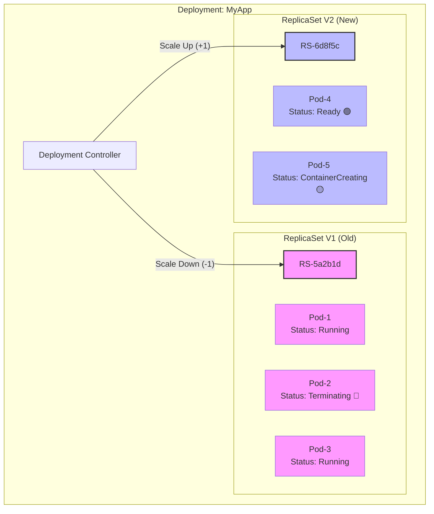

> [!check] Архитектурный Вердикт Понимание механики ReplicaSet Swap дает вам суперсилу: **вы можете управлять скоростью деплоя.**
> 
> - Хотите быстрее? Увеличьте `maxSurge` до 100% (это превратится в Blue-Green внутри одного неймспейса).
>     
> - Хотите безопаснее? Поставьте жесткие `readinessProbes`.
>     
> - Хотите debug? Сделайте `kubectl pause deployment`. Контроллер застынет в текущем состоянии (например, 50% v1 и 50% v2), и вы сможете изучить логи обоих версий под нагрузкой.

### 2.2. Tuning the Speed: maxSurge & maxUnavailable

> [!abstract] Арифметика Выживания
> Эти два параметра определяют ширину "окна обновления".
>
> $$Total Pods = Desired + maxSurge$$
> $$Min Available = Desired - maxUnavailable$$
>
> * **maxSurge (Газ):** Сколько *лишних* ресурсов мы готовы потратить, чтобы ускорить деплой.
> * **maxUnavailable (Риск):** Какую *часть трафика* мы готовы потерять (или перегрузить оставшиеся поды), чтобы ускорить деплой.
#### A. Parameter 1: maxSurge (The Accelerator)
Определяет, сколько **новых** подов можно создать сверх желаемого числа реплик.

* **Тип:** Число (`1`) или Процент (`25%`).
* **Логика:** Чем выше значение, тем быстрее пройдет обновление, но тем больше ресурсов (CPU/RAM) потребуется кластеру в моменте.
* **Пример:** `replicas: 10`, `maxSurge: 50%`.
    * K8s сразу создаст 5 новых подов.
    * В пике у вас будет 15 подов.
    * **Риск:** Если в кластере нет места (Node Capacity) или у вас жесткие квоты (ResourceQuota), новые поды зависнут в статусе `Pending`. Деплой встанет.
#### B. Parameter 2: maxUnavailable (The Brake)
Определяет, сколько **старых** подов можно убить до того, как новые станут готовы.

* **Тип:** Число (`1`) или Процент (`25%`).
* **Логика:**
    * `0`: (Paranoid Mode). Не удалять старый под, пока новый не скажет "Я готов". Гарантирует 100% capacity.
    * `100%`: (YOLO Mode). Убить все старые поды сразу. Это вызывает Downtime, но обновление происходит мгновенно (по сути, рестарт).
* **Пример:** `replicas: 10`, `maxUnavailable: 20%`.
    * K8s сразу убьет 2 старых пода.
    * Доступно: 8 подов.
    * **Риск:** Оставшиеся 8 подов могут не выдержать нагрузку (CPU Spike) и начнут падать (OOMKilled), вызывая цепную реакцию (Cascading Failure).
#### C. Strategic Presets (Готовые рецепты)
Я рекомендую использовать три стандартных пресета в зависимости от критичности сервиса.

**1. "Production Safe" (Zero Downtime, Slow)**
Идеально для критичных сервисов (Биллинг, Auth). Мы платим ресурсами за надежность.
```yaml
strategy:
  type: RollingUpdate
  rollingUpdate:
    maxSurge: 25%        # Создаем запас +25%
    maxUnavailable: 0    # Никогда не опускаемся ниже 100% capacity
```
- _Поведение:_ Сначала поднимаем новый, ждем Readiness, потом убиваем старый.
- _Стоимость:_ Высокая (требует запаса ресурсов).

**2. "Staging / Dev" (Fast, Risky)** Для тестовых сред, где скорость важнее 100% аптайма.
```YAML
strategy:
  type: RollingUpdate
  rollingUpdate:
    maxSurge: 50%        # Деплоим пачками
    maxUnavailable: 50%  # Убиваем половину сразу
```
- _Поведение:_ Агрессивная замена. Деплой проходит за секунды.

**3. "The Cheapskate" (Cost Optimized)** Для окружений с ограниченными ресурсами, где нельзя вылезать за лимиты (например, `maxSurge: 0` невозможен по определению, но близок к этому).
```YAML
strategy:
  type: RollingUpdate
  rollingUpdate:
    maxSurge: 0          # Не создавать лишних (не работает само по себе)
    maxUnavailable: 1    # Сначала убей, освободи место, потом создай
```
- _Примечание:_ K8s запрещает ставить оба параметра в 0.
- _Поведение:_ `Kill -> Create -> Wait -> Kill`. Экономит ресурсы, но временно снижает capacity на 1 под.
#### D. The "Percent vs Number" Trap
Что лучше использовать: `1` или `10%`?
- **Для малых деплойментов (N < 5):** Используйте **Числа**.
    - `replicas: 2`, `maxSurge: 25%` = 0.5 (округляется до 1). Разницы нет.
- **Для больших деплойментов (N > 50):** Используйте **Проценты**.
    - Если у вас 100 подов и вы поставите `maxSurge: 1`, деплой будет идти вечность (по 1 поду за раз).
    - `maxSurge: 10%` обновит кластер за 10 итераций.
#### E. Edge Case: Resource Quota Deadlock
Это классическая проблема в энтерпрайзе.
1. Namespace Quota: Limit CPU = 4 Cores.
2. App: Replicas = 4. (Использует 4 Cores).
3. Strategy: `maxSurge: 1`.
4. **Deployment:** Пытается создать 5-й под.
5. **Error:** `Forbidden: exceeded quota: limits.cpu`.
6. **Deadlock:** Новый под не может создаться. Старый под не может удалиться (так как `maxUnavailable: 0` ждет нового).
7. **Решение:**
    - Либо увеличить квоту.
    - Либо использовать стратегию "The Cheapskate" (`maxSurge: 0`, `maxUnavailable: 1`), чтобы сначала освободить место.

> [!check] Архитектурный Вердикт В 2026 году дефолтное значение в Kubernetes (начиная с v1.25+) для обоих параметров — **25%**. Это разумный компромисс.
> 
> Меняйте эти значения только если:
> 
> 1. У вас **High Load** и вы не можете позволить потерю 25% подов (ставьте `maxUnavailable: 0`).
>     
> 2. У вас **мало денег** и вы не можете позволить всплеск на 25% (ставьте `maxSurge: 1`).
>
### 2.3. The "Mixed Version" Trap (Архитектурный Риск)
Главная проблема Rolling Update — **Сосуществование (Coexistence)**.
В течение 5-10 минут (пока идет раскатка) ваши пользователи попадают то на $V_1$, то на $V_2$.

**Сценарий провала:**
1.  **DB Migration:** Вы переименовали колонку `name` в `fullname`.
2.  **Code v2:** Использует `fullname`.
3.  **Code v1:** Использует `name`.
4.  **Rolling Update:**
    * Поды $V_2$ работают нормально.
    * Поды $V_1$ (которые еще не убиты) начинают падать с ошибками SQL "Column not found", потому что миграция БД уже прошла, а код старый.
    * Пользователи получают 500 ошибок в 50% случаев.

**Решение:** Паттерн **Expand-Contract**.
1.  *Release 1:* Добавить колонку `fullname`, писать в обе, читать из `name`. (Код $V_1$ и $V_2$ совместимы).
2.  *Data Migration:* Скопировать данные.
3.  *Release 2:* Переключить чтение на `fullname`. Удалить запись в `name`.

### 2.4. Achieving True Zero Downtime (Graceful Shutdown)
### 2.4. Achieving True Zero Downtime: The Graceful Shutdown Dance [Deep Dive]

> [!abstract] Проблема Асинхронности (Race Condition)
> Когда Kubernetes решает убить под, запускаются два **параллельных** процесса:
> 1.  **Network Cutoff:** Контроллер Endpoints удаляет IP пода из списка (Service). Это изменение должно распространиться на *все* узлы кластера (iptables/IPVS) и на внешний Ingress. Это занимает время ($\Delta t \approx 10-30s$).
> 2.  **Process Termination:** Kubelet посылает контейнеру сигнал `SIGTERM`. Приложение начинает выключаться.
>
> **Фатальная ошибка:** Обычно процесс 2 (выключение) происходит быстрее, чем процесс 1 (обновление сети).
> **Результат:** Приложение уже мертво (или закрыло сокет), а Ingress все еще шлет в него запросы пользователей. Итог: `502 Bad Gateway`.


#### A. The Solution: The "Sleep Hack" (preStop Hook)
Мы должны искусственно задержать смерть приложения, чтобы дать сети время обновиться.
Мы используем хук `preStop`, который выполняется **перед** отправкой `SIGTERM`.

**Механика:**
1.  K8s решает удалить под.
2.  Запускается `preStop`. Команда `sleep 15` блокирует удаление.
3.  В это время (пока мы спим) K8s обновляет iptables и Ingress. Трафик перестает идти на этот под.
4.  `sleep` заканчивается.
5.  K8s шлет `SIGTERM`.
6.  Приложение спокойно дорабатывает *уже установленные* соединения (Connection Draining) и выходит.

**YAML Config:**
```yaml
apiVersion: apps/v1
kind: Deployment
spec:
  template:
    spec:
      terminationGracePeriodSeconds: 60 # Даем общий бюджет времени на смерть
      containers:
        - name: my-app
          lifecycle:
            preStop:
              exec:
                # Ждем, пока Load Balancer поймет, что нас нет
                command: ["/bin/sh", "-c", "sleep 15"]
```
#### B. Application Logic: Handling SIGTERM
Просто добавить `sleep` недостаточно. Ваш код должен уметь правильно обрабатывать сигнал завершения.
**Что должно делать приложение при получении SIGTERM:**
1. **Stop Listening:** Перестать принимать _новые_ TCP-соединения.
2. **Drain Connections:** Продолжить обрабатывать _текущие_ HTTP-запросы (in-flight requests).
3. **Exit:** Завершить процесс только когда счетчик активных запросов станет равен 0.

**Пример (Go / Gin):**
```Go
// 1. Создаем сервер
srv := &http.Server{Addr: ":8080", Handler: router}

// 2. Ждем сигнала в отдельной горутине
go func() {
    if err := srv.ListenAndServe(); err != nil && err != http.ErrServerClosed {
        log.Fatalf("listen: %s\n", err)
    }
}()

// 3. Перехватываем SIGTERM
quit := make(chan os.Signal)
signal.Notify(quit, syscall.SIGINT, syscall.SIGTERM)
<-quit // Блокируемся тут, пока не придет сигнал (после preStop sleep)

// 4. Graceful Shutdown (Draining)
ctx, cancel := context.WithTimeout(context.Background(), 30*time.Second)
defer cancel()
if err := srv.Shutdown(ctx); err != nil {
    log.Fatal("Server forced to shutdown:", err)
}
```
#### C. The Timeline Visualized
Посмотрим на хронологию идеального убийства.

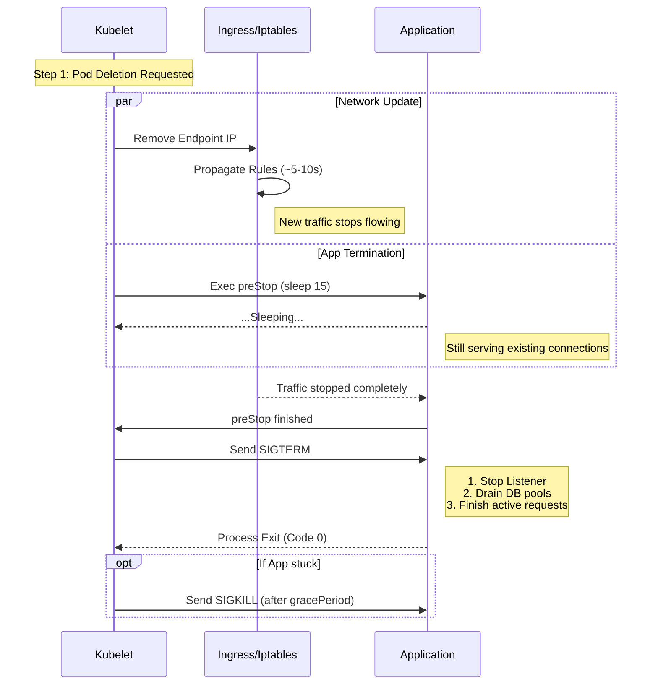
#### D. Connection Draining & Keep-Alive
Почему Draining так важен? Современные браузеры и API-клиенты используют `Keep-Alive`. Они держат TCP-соединение открытым минутами, чтобы слать в него новые запросы.
- **Без Draining:** Приложение при получении SIGTERM сразу закрывает сокет. Клиент, который собирался послать запрос в это открытое соединение, получает ошибку `Connection Reset by Peer`.
- **С Draining:** Приложение посылает заголовок `Connection: close` в ответ на последний запрос, мягко намекая клиенту: "Я ухожу, следующий запрос шли в другое место".

> [!check] Архитектурный Чек-лист Чтобы Rolling Update был действительно незаметным:
> 
> 1. **Infrastucture:** Добавьте `preStop: sleep 15` в YAML.
>     
> 2. **Code:** Реализуйте перехват `SIGTERM` и `server.Shutdown()`.
>     
> 3. **Timeout:** Убедитесь, что `terminationGracePeriodSeconds` (например, 60с) больше, чем сумма `sleep` (15с) + время обработки самого долгого запроса (например, 30с).
>     
> 
> Если `gracePeriod` слишком короткий, K8s пошлет `SIGKILL` (убийство кувалдой), и вы все равно получите 502 ошибку для долгих запросов.
### 2.5. Pros & Cons Summary

|**Плюсы (+)**|**Минусы (-)**|
|---|---|
|**Native & Simple:** Не требует внешних операторов (Argo, Istio). Работает везде.|**Slow Rollback:** Если вы нашли баг на 90% раскатки, откат займет столько же времени, сколько деплой. В это время пользователи страдают.|
|**Resource Efficient:** В отличие от Blue-Green, не требует удваивания железа.|**No Traffic Control:** Вы не можете сказать "Накати только на iPhone пользователей". Трафик распределяется случайно (Round Robin).|
|**Zero Downtime:** При правильной настройке Probes и Shutdown.|**Hard Verification:** Сложно понять "стало лучше или хуже", так как метрики смешиваются в кашу из v1 и v2.|

> [!check] Архитектурный Вердикт
> 
> Rolling Update — это "Рабочая Лошадка" (Workhorse).
> 
> Используйте её для 95% микросервисов, которые:
> 
> 1. Stateless.
>     
> 2. Имеют обратную совместимость API.
>     
> 3. Не являются критическими для жизни (не ядерный реактор).
>     
> 
> Для оставшихся 5% (критичный монолит, устаревшая БД) — используйте Blue-Green.

---
## 3. Strategy 2: Blue-Green Deployment (The Red Button)

> [!abstract] Архитектура "Рубильника"
> **Blue-Green Deployment** — это стратегия, при которой мы поддерживаем две идентичные производственные среды:
> * **Blue (Active):** Текущая версия ($V_1$), обслуживающая 100% реального трафика.
> * **Green (Idle):** Новая версия ($V_2$), развернутая, протестированная, но скрытая от пользователей.
>
> **Суть:** Deployment (развертывание на Green) отделен от Release (переключение трафика).
> **Киллер-фича:** Если после переключения на Green вы видите всплеск ошибок, вы *мгновенно* возвращаете трафик на Blue. Откат занимает ровно столько времени, сколько нужно для обновления конфига Load Balancer.
### 3.1. The Architecture: Parallel Universes

> [!abstract] Shared Data, Isolated Compute
> В Blue-Green архитектуре мы создаем **полную копию** вычислительных мощностей (Deployment, Service, ConfigMap, Secrets).
>
> * **Blue Environment (Live):** Версия $V_1$. Сюда направлен Ingress/Load Balancer. Пользователи здесь.
> * **Green Environment (Dark):** Версия $V_2$. Поднята, инициализирована, но изолирована от публичного интернета.
> * **Persistence Layer (Shared):** База данных, Redis, S3 и Kafka — **общие**. Оба окружения смотрят в один и тот же endpoint базы.
>
> **Суть стратегии:** Мы меняем *маршрут* к коду, а не сам код.
#### A. Phase 1: The Spin-Up (Подготовка "Зеленой Зоны")
Мы разворачиваем новую версию приложения рядом со старой.

* **Resource Spike:** В этот момент кластер потребляет $200\%$ ресурсов (CPU/RAM).
* **Isolation:** Green-версия не должна принимать пользовательский трафик случайно.
    * *В Kubernetes:* Мы создаем отдельный Service (`app-green-svc`), который не подключен к основному Ingress.
* **Database Connections:** Приложение $V_2$ стартует и открывает пул соединений к БД.
    * *Риск:* Если база данных работает на пределе (`max_connections`), старт Green-окружения может исчерпать лимит соединений и положить Blue-окружение еще до начала релиза.

#### B. Phase 2: Warm-Up (Прогрев - Критический этап)
Это то, что отличает профессионалов от любителей.
Если вы переключите 100 000 RPS на "холодное" Java/Go приложение, оно упадет из-за латентности (JIT-компиляция, заполнение локальных кэшей).

* **Synthetic Traffic:** CI/CD запускает скрипт, который "обстреливает" Green-версию синтетическими запросами (Smoke Tests).
* **Goal:** Заполнить пулы соединений, прогреть кэши в памяти, заставить Runtime оптимизировать код.

#### C. Phase 3: Verification (Тестирование в Проде)
QA-инженеры и Автотесты проверяют $V_2$ на реальной базе данных.

* **Access Method:**
    * *Вариант А (Header-based):* Ingress настроен так, что заголовок `X-Server-Select: green` маршрутизирует запрос на $V_2$.
    * *Вариант Б (VPN/Internal DNS):* Доступ только из внутренней сети компании по адресу `green.internal.api`.
* **Verification:** Мы проверяем не только "работает ли код", но и "не ломает ли он старые данные".

#### D. Phase 4: The Cutover (Момент Истины)
Атомарное переключение трафика. В мире Load Balancers это изменение **Веса (Weight)** бекенд-группы.

1.  **State T0:** Blue = 100%, Green = 0%.
2.  **Action:** API-вызов к Load Balancer (AWS ALB, Nginx, Istio).
3.  **State T1:** Blue = 0%, Green = 100%.

> [!warning] Почему не DNS?
> Никогда не используйте DNS для Blue-Green переключений.
> DNS имеет TTL (Time To Live). Если вы поменяете IP-адрес в DNS, клиенты увидят изменение через 5-60 минут (в зависимости от кэша провайдера).
> **Мгновенный откат будет невозможен.** Используйте только L7 Load Balancers (HTTP).

#### E. Phase 5: The Cool-Down (Остывание)
Мы не убиваем Blue сразу. Мы держим его в режиме "Standby".

* **Draining:** Старые запросы, которые успели попасть на Blue за миллисекунду до переключения, должны завершиться.
* **Safety Net:** Если через 15 минут после переключения мы увидим рост ошибок на Green, мы мгновенно вернем трафик на Blue (Rollback).
* **Cleanup:** Только когда метрики стабильны (обычно через 1-2 часа), CI/CD уничтожает поды Blue-окружения.

#### F. Visualization: The Traffic Switch (Mermaid)

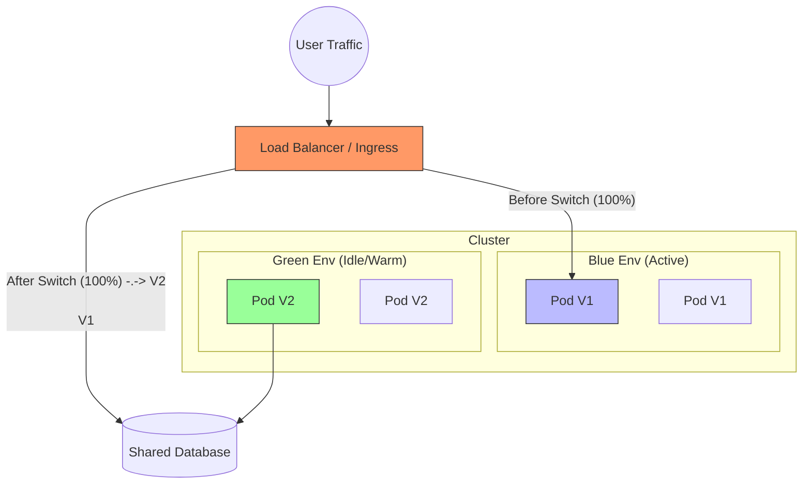

> [!check] Архитектурный Вердикт Blue-Green — это **единственная** стратегия, которая позволяет безопасно релизить:
> 
> 1. Монолиты (где долгий старт).
>     
> 2. Приложения с несовместимыми изменениями API (где нельзя смешивать трафик).
>     
> 
> **Цена:** Вы платите двойную цену за инфраструктуру в момент релиза. **Выгода:** Вы покупаете страховку от простоя.
### 3.2. Implementation in Kubernetes (Service Selector)

> [!abstract] Магия Лейблов
> В Kubernetes связь между `Service` (Балансировщиком) и `Pod` (Приложением) — **не жесткая**.
>
> Сервис не знает IP-адреса подов. Он знает только **Label Selector** (Критерий поиска).
> * Сервис говорит: *"Я буду слать трафик на всех, у кого наклеена бирка `version: v1`"*.
> * Blue-Green переключение — это просто изменение этого критерия поиска в манифесте Сервиса.
#### A. The Setup: Twin Deployments
Нам нужны два независимых Deployment-объекта. Они идентичны во всем, кроме **Лейблов (Labels)** и **Имиджа (Image)**.

**1. Blue Deployment (Active)**
```yaml
apiVersion: apps/v1
kind: Deployment
metadata:
  name: app-blue
spec:
  replicas: 3
  selector:
    matchLabels:
      app: payment-service
      version: v1  # <--- Идентификатор версии
  template:
    metadata:
      labels:
        app: payment-service
        version: v1
    spec:
      containers:
      - image: my-registry/payment:v1.0.0
```
**2. Green Deployment (Idle)**
```YAML
apiVersion: apps/v1
kind: Deployment
metadata:
  name: app-green
spec:
  replicas: 3
  selector:
    matchLabels:
      app: payment-service
      version: v2  # <--- Новая версия
  template:
    metadata:
      labels:
        app: payment-service
        version: v2
    spec:
      containers:
      - image: my-registry/payment:v2.0.0 # Новый код
```
#### B. The Dual Service Strategy (Prod vs Test)

Здесь совершается главная ошибка новичков. Они создают только один сервис. В правильной архитектуре нам нужно **два** сервиса.

**1. Production Service (The Router)** Этот сервис смотрит в интернет (Ingress). Он направляет трафик пользователей.
```YAML
apiVersion: v1
kind: Service
metadata:
  name: payment-prod
spec:
  selector:
    app: payment-service
    version: v1  # <--- Сейчас указывает на BLUE. Это наш "Рубильник".
  ports:
  - port: 80
```

**2. Validation Service (The Backdoor)** Этот сервис нужен, чтобы QA и Автотесты могли достучаться до Green-версии, пока она скрыта от мира.
```YAML
apiVersion: v1
kind: Service
metadata:
  name: payment-test-green
spec:
  selector:
    app: payment-service
    version: v2  # <--- Всегда указывает на новую версию (GREEN)
  ports:
  - port: 80
```
- _Результат:_ QA отправляет запросы на `http://payment-test-green`, проверяет релиз, и только потом дает отмашку на переключение.
#### C. The Switch (Imperative vs Declarative)
Как переключить трафик?
**Способ 1: Императивный (CLI - для понимания)** Мы "патчим" живой объект в кластере. Это быстро, но плохо для истории изменений.
```Bash
# Переключаем Prod на версию v2
kubectl patch service payment-prod -p '{"spec":{"selector":{"version":"v2"}}}'
```
- _Эффект:_ Kubernetes обновляет Endpoints. Трафик мгновенно начинает идти на поды с меткой `v2`.

**Способ 2: Декларативный (GitOps / Helm - для продакшена)** В `values.yaml` вашего Helm-чарта есть переменная:
```YAML
# values.yaml
activeVersion: "v1"
```
Вы меняете её на `"v2"`, коммитите в Git. ArgoCD видит изменение и применяет его. Это обеспечивает **Audit Trail** (кто и когда переключил рубильник).
#### D. Visualization: The Selector Swap (Mermaid)

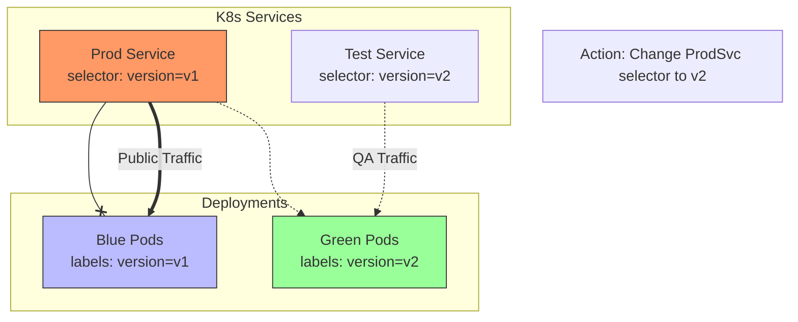

#### E. Edge Case: Long-Lived Connections
Что происходит со старыми соединениями в момент переключения?
- **HTTP (Short-lived):** Следующий запрос от пользователя (после патча сервиса) пойдет на Green. Переключение мгновенное.
- **WebSockets / DB Connections (Long-lived):**
    - Если пользователь держит открытый WebSocket с Blue-подом, изменение селектора сервиса **НЕ разорвет** это соединение.
    - K8s Service меняет правила маршрутизации только для **новых** соединений (`iptables NEW`).
    - _Решение:_ После переключения трафика вам нужно принудительно удалить Blue-поды (или послать им сигнал рестарта), чтобы они сбросили старые соединения и клиенты переподключились к Green.

> [!check] Архитектурный Вердикт Этот паттерн называется **"Service Selector Swap"**. Он надежен как автомат Калашникова, потому что использует нативные примитивы Kubernetes.
> 
> **Совет:** Используйте Helm или Kustomize для генерации манифестов. Руками править YAML-файлы для Blue и Green (дублировать код) — плохая практика.
### 3.3. The Database Dilemma (N+1 Compatibility)

> [!danger] Гравитация Данных
> Приложения эфемерны (Stateless), их можно клонировать. Данные имеют гравитацию (Stateful), их клонировать нельзя.
>
> В Blue-Green архитектуре **одна** база данных обслуживает **два** поколения кода одновременно:
> 1.  **Generation N (Blue):** Старый код, который сейчас обслуживает пользователей.
> 2.  **Generation N+1 (Green):** Новый код, который мы тестируем/прогреваем.
>
> **Аксиома:** Любая миграция БД, запускаемая перед стартом Green, должна быть **обратно совместимой**. Она не должна ломать код Blue.
#### A. The "Destructive Migration" Trap
Представьте, что вы хотите переименовать колонку `user_name` в `login`.

**Неправильный сценарий (Катастрофа):**
1.  **Migration:** `ALTER TABLE users RENAME COLUMN user_name TO login;`
2.  **Effect:** База данных обновилась мгновенно.
3.  **Blue Environment:** Код $V_1$ пытается выполнить `SELECT user_name FROM users`.
4.  **Crash:** SQL Error: `Column 'user_name' does not exist`.
5.  **Result:** Прод лежит. Green еще даже не поднялся. Это даунтайм.

#### B. The Solution: Expand-Contract Pattern (Parallel Change)
Мы никогда не изменяем существующие структуры. Мы только добавляем новые и медленно удаляем старые.
Процесс разбивается на **4 фазы** (и часто на 2 разных релиза).

**Scenario:** Переименование `address` $\to$ `shipping_address`.

**Phase 1: Expand (Add)**
* **Migration:** Добавляем новую колонку. Старую не трогаем.
  ```sql
  ALTER TABLE orders ADD COLUMN shipping_address VARCHAR(255);
  -- Код v1 продолжает читать/писать в 'address'. Ему все равно.
  ```
**Phase 2: Migrate (Dual Write)**
- **Deployment (v2):** Выкатываем код, который умеет работать с новой колонкой.
- **Logic v2:**
    - _Write:_ Пишем данные **и** в старую (`address`), **и** в новую (`shipping_address`) колонки. (Чтобы если мы откатимся на v1, данные не пропали).
    - _Read:_ Читаем из новой (`shipping_address`). Если там `NULL` (старая запись), читаем из старой (`address`).
- **Backfill (Data Migration):** Фоновый скрипт копирует исторические данные из `address` в `shipping_address`.

**Phase 3: Contract (Deprecate)**
- **Deployment (v3):** Выкатываем код, который больше не смотрит в старую колонку.
- **Logic v3:** Пишем/Читаем только `shipping_address`.
- _Внимание:_ Старая колонка `address` все еще в базе! Она теперь "мусор".

**Phase 4: Cleanup (Drop)**
- **Migration:** Удаляем старую колонку.
    ```SQL
    ALTER TABLE orders DROP COLUMN address;
    ```
- _Внимание:_ Это делается отдельным техническим релизом, когда мы на 100% уверены, что v1 и v2 полностью выведены из эксплуатации.
#### C. The Forbidden List (Banned Operations)
Во время активной фазы Blue-Green (когда работают оба контура) запрещены следующие операции:

|**Операция**|**Почему запрещено**|**Безопасная альтернатива**|
|---|---|---|
|`DROP TABLE / COLUMN`|Убивает старый код (Blue), который еще читает эти данные.|Оставить "сиротой", удалить через неделю.|
|`RENAME COLUMN`|Ломает маппинг полей в ORM (Hibernate/GORM).|Создать новую, скопировать, удалить старую.|
|`ALTER TYPE` (сужение)|Например, `VARCHAR` -> `INT`. Старый код может прислать строку.|Создать новую колонку с новым типом.|
|`ADD NOT NULL`|Если старый код не знает про эту колонку, он пришлет `INSERT` без нее -> Ошибка.|Добавить колонку с `DEFAULT` значением.|
#### D. Technical Implementation (Tools)
Как это автоматизировать в CI/CD?
1. **Pre-Deploy Step:** Запуск мигратора (Flyway/Liquibase).
    - _Правило:_ Разрешены только `CREATE TABLE`, `ADD COLUMN`, `CREATE INDEX`.
    - Если мигратор видит деструктивную команду -> Fail Pipeline.
2. **Deploy Green:** Поднимаются новые поды.
3. **Switch Traffic.**
4. **Post-Deploy Step (Optional):** Здесь нельзя удалять колонки! Потому что в случае мгновенного отката (Rollback) мы вернемся на старый код, а колонок уже нет.

> [!tip] Архитектурный Хак: Views
> 
> Если вам очень нужно переименовать таблицу, но вы не хотите менять код:
> 
> 1. `RENAME TABLE users TO users_v2;`
>     
> 2. `CREATE VIEW users AS SELECT * FROM users_v2;`
>     
> 
> Для старого кода `users` все еще существует (как View). Это работает для чтения, но с записью (Updatable Views) могут быть нюансы.

#### E. Visualization: The Compatibility Window

```mermaid
gantt
    title Database Evolution vs Code Deployment
    dateFormat  X
    axisFormat %s
    
    section Database
    Migration (Add Column)    :active, m1, 0, 10
    Both Columns Exist        :crit, m2, 10, 60
    Migration (Drop Old)      :done, m3, 60, 70
    
    section Code
    Version V1 (Blue)         :active, c1, 0, 40
    Version V2 (Green)        :active, c2, 20, 70
    
    section Traffic
    Switch to V2              :milestone, 40, 40
```
- **Critical Zone (10-60):** Период сосуществования. Схема БД должна быть "гибридной", поддерживая и V1, и V2.

> [!check] Архитектурный Вердикт
> 
> Blue-Green деплоймент переносит сложность из **Администрирования** (нет даунтайма) в **Разработку** (сложные миграции).
> 
> Вы должны научить разработчиков писать код, который поддерживает **N-1 Compatibility**:
> 
> _"Мой новый код должен работать с новой базой, но мой старый код ТОЖЕ должен работать с новой базой"._
### 3.4. The Problem of Background Jobs (Cron & Consumers)

> [!danger] Архитектурная Ловушка
> Load Balancer переключает только входящий **HTTP-трафик**.
> Он **не** контролирует:
> 1.  **Cron Jobs:** Планировщики задач (например, "Отправить дайджест в 9:00").
> 2.  **Queue Consumers:** Слушатели Kafka/RabbitMQ/SQS.
>
> Если вы просто поднимете Green-окружение (копию Blue), у вас будет **два** активных Крона и **два** набора Консьюмеров.
> * **Результат:** Двойная отправка писем, двойное списание денег, нарушение порядка обработки (Race Condition).
#### A. Taxonomy of Background Processes
Разделим демонов на две категории, так как стратегии для них разные.

**1. Time-Based (Cron / Scheduled)**
* *Поведение:* Просыпается раз в N минут.
* *Риск:* Если Blue и Green проснутся одновременно, задача выполнится дважды.
* *Пример:* Генерация PDF-отчета.

**2. Event-Based (Consumers / Workers)**
* *Поведение:* Постоянно слушает очередь (Push/Pull).
* *Риск:* Конкуренция за сообщения.
* *Пример:* Обработка платежа из топика `orders-paid`.

#### B. Strategy 1: The "Passive Green" (Recommended)
Это самый надежный паттерн. Мы запрещаем Green-окружению обрабатывать фоновые задачи до момента официального переключения.

**Реализация:**
1.  **Deployment:** Деплоим Green-версию.
    * Web-поды: `replicas: 10` (Активны, ждут прогрева).
    * Worker-поды: `replicas: 0` (Выключены!).
    * CronJobs: `suspend: true`.
2.  **Verification:** Тестируем Web-интерфейс.
3.  **The Switch (HTTP):** Переключаем Load Balancer на Green.
4.  **Worker Swap (The Gap):**
    * Scale Down Blue Workers -> 0.
    * Scale Up Green Workers -> 10.
    * Unsuspend Green Crons.

> [!warning] The Processing Gap
> Обратите внимание: между остановкой Blue и стартом Green есть лаг в 30-60 секунд.
> В это время очередь Kafka будет копиться.
> **Это нормально.** Consumer Lag — меньшее зло, чем Double Processing.

#### C. Strategy 2: Isolated Consumer Groups (Advanced)
Если вы используете Kafka, вы можете запустить Green Consumers параллельно, но так, чтобы они не мешали Blue.

**Реализация:**
1.  **Blue:** Consumer Group `payment-processor-v1`.
2.  **Green:** Consumer Group `payment-processor-v2`.
3.  **Логика:**
    * Kafka доставляет сообщение **обеим** группам.
    * Оба приложения получают событие "Order Created".
    * **НО!** Green-версия должна работать в режиме **"Shadow Mode"** (или Read-Only). Она обрабатывает логику, но **не коммитит** результат в БД и не шлет писем. Она просто логирует: *"Я бы списала $100"*.

* *Сложность:* Экстремально высокая. Требует поддержки в коде (`if (config.read_only) ...`).
* *Применение:* Тестирование критически важных алгоритмов биллинга.

#### D. Implementation in Kubernetes (Split Deployments)
Никогда не кладите Web и Worker в один Deployment.
Вам нужно разделять их, чтобы масштабировать и переключать независимо.

**Неправильно (Monolithic Pod):**
Один контейнер запускает и Nginx, и Celery Worker через `supervisord`.
* *Проблема:* Вы не можете выключить Worker, не убив Web.

**Правильно (Microservice Split):**
1.  **Deployment: `my-app-web`**
    * Image: `v2`
    * Replicas: 3
    * Env: `ROLE=WEB`
2.  **Deployment: `my-app-worker`**
    * Image: `v2`
    * Replicas: **0** (на старте Green)
    * Env: `ROLE=WORKER`

#### E. Idempotency as a Safety Net
Даже при стратегии "Passive Green" возможны ошибки (человеческий фактор: забыли выключить крон).
Ваш код должен быть **Идемпотентным**.

* **Logic:** Перед выполнением задачи проверь, не сделана ли она уже.
* **DB Lock:** Используйте `SELECT FOR UPDATE` или уникальные индексы (`processing_key`).
    * Если Blue начал транзакцию, Green наткнется на лок и отвалится (или подождет).
#### F. Visualization: The Worker Switchover

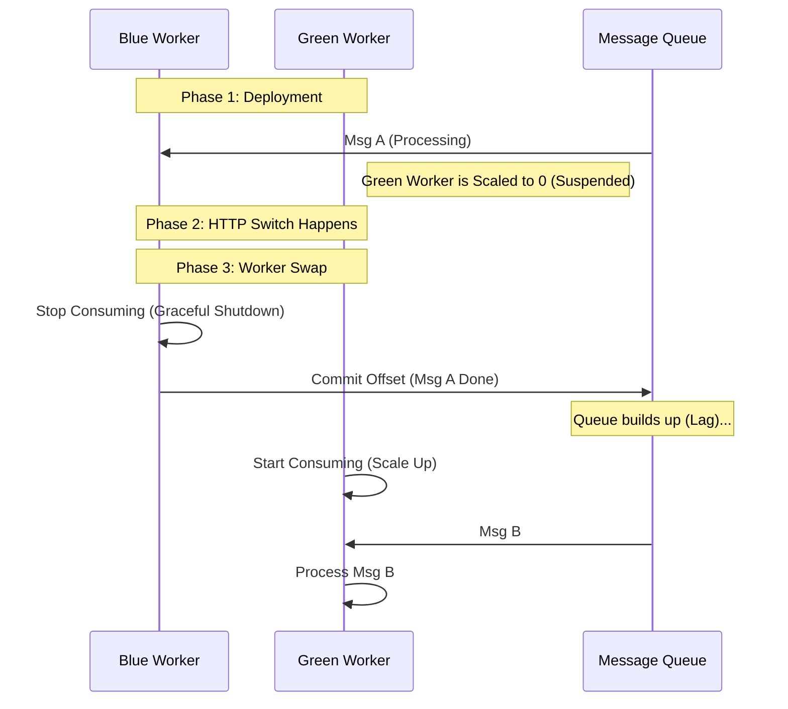

> [!check] Архитектурный Вердикт При Blue-Green деплое следуйте правилу **"Web First, Workers Last"**.
> 
> 1. Сначала переключите пользовательский трафик (HTTP).
>     
> 2. Убедитесь, что ошибок нет.
>     
> 3. Только потом переключайте "молотилки" (Workers).
>     
> 
> Если переключить воркеры раньше времени, а потом придется откатывать HTTP — вы получите рассинхрон данных (пользователь видит старый интерфейс, а его данные уже обработаны новой логикой).
### 3.5. Pros & Cons Summary

| **Плюсы (+)**                                                                                                                   | **Минусы (-)**                                                                                                                                                |
| ------------------------------------------------------------------------------------------------------------------------------- | ------------------------------------------------------------------------------------------------------------------------------------------------------------- |
| **Instant Rollback:** Нажали кнопку — вернулись на старую версию за секунду. Идеально для критических систем.                   | **Double Cost:** Вам нужно x2 ресурсов (CPU/RAM) на время деплоя. Если кластер загружен на 80%, вы не сможете поднять Green.                                  |
| **Testing in Prod:** Вы можете прогнать реальные тесты на Green-окружении с реальной БД перед пуском трафика.                   | **Cold Start:** Green-окружение "холодное". Его кэши (Local Cache, JIT compilation) пусты. При переключении возможен резкий скачок Latency (Thundering Herd). |
| **No Mixed Versions:** Пользователь никогда не попадет в ситуацию, когда CSS от v2, а JS от v1 (как бывает при Rolling Update). | **Stateful Complexity:** Сложно управлять соединениями к БД, миграциями и фоновыми воркерами.                                                                 |

> [!check] Архитектурный Вердикт
> 
> Используйте Blue-Green, если:
> 
> 1. Цена ошибки **фатальна** (Банк, Медицина).
>     
> 2. У вас есть бюджет на x2 инфраструктуру.
>     
> 3. Ваше приложение с трудом переживает состояние "смешанных версий" (Legacy Monolith).
>     
> 
> **Совет:** Для экономии ресурсов используйте "Blue-Green на минималках". Поднимайте Green, проводите тесты, переключайте. Если все ОК — убивайте Blue через 15 минут, а не держите его сутками.

---
## 4. Strategy 3: Canary Deployment (The Scalpel)

> [!abstract] Философия "Канарейки"
> **Canary Deployment** — это стратегия, при которой новая версия ($V_2$) становится доступной лишь малому подмножеству пользователей, в то время как остальные продолжают использовать старую версию ($V_1$).
>
> Название отсылает к шахтерам, которые брали канарейку в забой. Если птица умирала от газа, люди эвакуировались.
> В IT: Если 1% пользователей начинает получать 500-е ошибки, мы "эвакуируем" релиз (автоматический откат), спасая остальные 99%.
>
> **Главное отличие:** Blue-Green — это бинарный риск (все или ничего). Canary — это управляемый, градиентный риск.
### 4.1. The Mechanism: Weighted Traffic Splitting

> [!abstract] Decoupling Scale from Traffic
> В базовом Kubernetes объем трафика, который получает версия приложения, линейно зависит от количества её реплик ($Traffic \approx Replicas$).
>
> **Weighted Traffic Splitting** разрывает эту связь.
> Вы можете иметь **1 под** новой версии ($V_2$) и **10 подов** старой ($V_1$), но принудительно направить на $V_2$ ровно **1%** запросов через настройки балансировщика.
>
> Это переносит логику маршрутизации с сетевого уровня (L4 TCP) на прикладной уровень (L7 HTTP).
#### A. The Architecture: Virtual Service Router
Вместо того чтобы просто "лить воду в трубы", мы ставим "умный кран" перед сервисами.

1.  **Ingress Gateway (The Valve):** Входная точка (Nginx/Envoy). Она знает про "Веса" (Weights).
2.  **Service V1 (Stable):** Абстракция, указывающая только на стабильные поды.
3.  **Service V2 (Canary):** Абстракция, указывающая только на новые поды.

**Алгоритм распределения (The Rollout Loop):**
Цикл Канарейки — это не просто переключение, это **Step-Function** (ступенчатая функция).

1.  **Baseline State:**
    * `Weight V1: 100%`
    * `Weight V2: 0%` (Поды $V_2$ задеплоены, прошли HealthCheck, но простаивают).
2.  **Step 1 (The Probe):**
    * Изменяем конфиг Ingress: `Weight V2: 1%`.
    * **Wait & Watch:** Ждем 5-15 минут. Система мониторинга (Prometheus) собирает "Golden Signals" (Latency, Errors, Saturation).
3.  **Step 2 (The Expansion):**
    * Если ошибок нет $\to$ `Weight V2: 10%`.
    * **Auto-Scaling:** HPA (Horizontal Pod Autoscaler) видит нагрузку на $V_2$ и начинает добавлять реплики.
4.  **Step 3 (The Flip):**
    * `Weight V2: 50%` $\to$ `100%`.
    * Теперь $V_2$ становится новой Stable. $V_1$ удаляется.

#### B. Technical Implementation (Istio Example)
Вот как это выглядит в коде Service Mesh (стандарт 2026 года).
Мы используем объект `VirtualService` для настройки весов.

```yaml
apiVersion: networking.istio.io/v1beta1
kind: VirtualService
metadata:
  name: my-app-route
spec:
  hosts:
  - my-app.com
  http:
  - route:
    - destination:
        host: my-app-service
        subset: v1-stable  # Ссылка на DestinationRule
      weight: 90           # 90% запросов сюда
    - destination:
        host: my-app-service
        subset: v2-canary
      weight: 10           # 10% запросов сюда
```

> [!tip] Nginx Ingress
> 
> Если у вас нет Istio, то же самое можно сделать через аннотации Nginx Ingress Controller:
> 
> `nginx.ingress.kubernetes.io/canary: "true"`
> 
> `nginx.ingress.kubernetes.io/canary-weight: "10"`

#### C. The Critical Problem: "Sticky Sessions" (Session Affinity)
Это главная причина, почему Канарейки проваливаются и бесят пользователей.
**Сценарий провала:**
1. Пользователь заходит на сайт. Load Balancer кидает его на **Canary (V2)** (выпал жребий 10%).
2. Пользователь получает новый JS-бандл и новый UI.
3. Пользователь нажимает F5 (Refresh) или переходит на следующую страницу.
4. Load Balancer снова кидает кубик... и теперь пользователь летит на **Stable (V1)** (90% вероятности).
5. **Результат:** Браузер в шоке. Старый HTML пытается работать с кэшированным новым JS, или сессия теряется. Пользователь видит "400 Bad Request" или разлогинивается.

**Решение (Consistent Hashing):**
Мы должны гарантировать, что если пользователь _однажды_ попал в Канарейку, он останется там до конца релиза.
Используется хеширование по Cookie или Header.

```YAML
# Istio Sticky Session Config
trafficPolicy:
  loadBalancer:
    consistentHash:
      httpHeaderName: "x-user-id" # Или Cookie "session_id"
```
#### D. Visualization: The Traffic Flow (Mermaid)

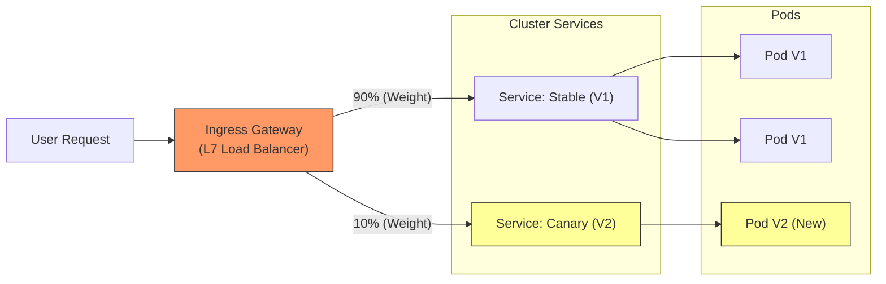

#### E. Statistical Significance (Математика Канарейки)
Почему нельзя пустить 1 запрос и решить, что все ОК?
Вам нужна **Статистическая Значимость**.
- Если на $V_1$ (Stable) ошибка возникает 1 раз на 1000 запросов (0.1%).
- И вы пустили на $V_2$ (Canary) всего 100 запросов и не увидели ошибок.
- **Вывод:** Это ничего не значит. Вы могли просто не "поймать" баг.
- **Правило:** Канарейка должна проработать под нагрузкой минимум N минут (обычно 15-30), чтобы собрать достаточно данных для сравнения Error Rate.

> [!check] Архитектурный Вердикт
> 
> Weighted Traffic Splitting — это единственный способ делать безопасные релизы в High-Load.
> 
> **Обязательные требования:**
> 
> 1. **L7 Load Balancer:** Nginx, Envoy, HAProxy. (AWS ALB умеет веса, но слабо умеет Sticky Sessions).
>     
> 2. **Affinity:** Настройка липких сессий (иначе сломаете фронтенд).
>     
> 3. **Observability:** Вы должны видеть метрики в разрезе версий (`app_version="v2"`), иначе вы не поймете, где ошибки.
>
### 4.2. Traffic Shaping Strategies (Кого пускать первым?)

> [!abstract] От рандома к детерминизму
> Просто переключить 5% трафика (`weight: 5`) недостаточно.
> **Traffic Shaping (Шейпинг)** — это использование L7-заголовков (Cookies, Headers, JWT Claims) для точного определения того, **кто именно** попадет в экспериментальную группу.
>
> **Цель:** Минимизировать репутационный риск.
> Сначала ломаем сотрудников (Dogfooding), потом лояльных бета-тестеров (Early Adopters), и только потом — обычных пользователей.
#### A. Strategy 1: The "Dogfood" Ring (Internal Only)
Нулевой уровень риска. Мы выпускаем версию $V_2$ только для сотрудников компании.

* **Механизм:** Ingress проверяет наличие специального заголовка или IP-адреса VPN.
* **Реализация (Istio/Nginx):**
    * `Match: headers[x-internal-secret] == "my-company-token"`
    * Или `Match: source_ip == 10.0.0.0/8`
* **Сценарий:** QA и Разработчики уже проверили фичу. Теперь её проверяют менеджеры и Sales-отдел в реальной работе.

#### B. Strategy 2: The "Beta" Ring (Opt-In Users)
Пользователи, которые сами согласились быть подопытными кроликами в обмен на ранний доступ к фичам.

* **Механизм:** Feature Flag в базе данных или специальная Cookie.
* **Психология:** Эти пользователи **прощают ошибки**. Если $V_2$ упадет, они напишут баг-репорт, а не уйдут к конкуренту.
* **Реализация:**
    * Фронтенд ставит куку `beta_user=true`.
    * Load Balancer видит куку и шлет на Canary.

#### C. Strategy 3: The "Geo" Ring (Blast Radius Containment)
Если у вас глобальный сервис, никогда не выкатывайте Канарейку на весь мир сразу.

* **Механизм:** Маршрутизация на основе `Cloudfront-Viewer-Country` или GeoIP.
* **Алгоритм:**
    1.  **Low Risk:** Новая Зеландия / Австралия (когда там ночь или мало трафика).
    2.  **Medium Risk:** Азия / Европа.
    3.  **High Risk:** США (основной рынок).
* **Почему это важно:** Если вы сломали биллинг в Новой Зеландии, вы потеряли $100. Если в США — $100,000.

#### D. Strategy 4: The "Sticky" Ring (Deterministic Hashing)
Это **самый критичный** технический аспект.
Рандомное распределение (`Weight: 5%`) работает плохо для Stateful-приложений (Frontend SPAs).

**Проблема "Мерцающего UI":**
1.  Пользователь загрузил `index.html` (попал на $V_2$).
2.  Браузер запрашивает `app.js` (попал на $V_1$).
3.  **Крах:** Версии несовместимы. Сайт сломан.

**Решение: Consistent Hashing (Липкость)**
Мы не кидаем кубик каждый раз. Мы вычисляем хеш от ID пользователя.

$$Destination = hash(User\_ID) \mod 100$$

* Если результат $< 5$, пользователь **всегда** попадает на Canary.
* Если результат $\ge 5$, пользователь **всегда** на Stable.
* Это гарантирует целостность сессии (Session Affinity).

#### E. Strategy 5: The "VIP Exclusion" (Risk Management)
Кого мы **НЕ** хотим пускать на Канарейку?
Ваших самых важных клиентов (Whales).

* **Механизм:** Ingress проверяет `tenant_id` или `plan_type`.
* **Правило:**
    * `IF plan == "Enterprise" THEN route -> Stable (V1)`
    * `ELSE route -> Canary (V2)`
* **Суть:** Экспериментируйте на Free-tier пользователях. Они не платят миллионы.

#### F. Technical Implementation (Istio Match Logic)
Вот как выглядит правильный конфиг "Умной Канарейки" в коде.

```yaml
apiVersion: networking.istio.io/v1beta1
kind: VirtualService
metadata:
  name: smart-canary
spec:
  hosts:
  - app.example.com
  http:
  # 1. VIP Protection (Всегда Stable)
  - match:
    - headers:
        x-user-plan:
          exact: "enterprise"
    route:
    - destination:
        host: app-service
        subset: v1-stable
        
  # 2. Beta Testers (Всегда Canary)
  - match:
    - headers:
        cookie:
          regex: "^(.*?;)?(beta_tester=true)(;.*)?$"
    route:
    - destination:
        host: app-service
        subset: v2-canary
        
  # 3. General Population (Sticky 5% Split)
  - route:
    - destination:
        host: app-service
        subset: v1-stable
      weight: 95
    - destination:
        host: app-service
        subset: v2-canary
      weight: 5
```
#### G. Visualization: The Sieve (Mermaid)

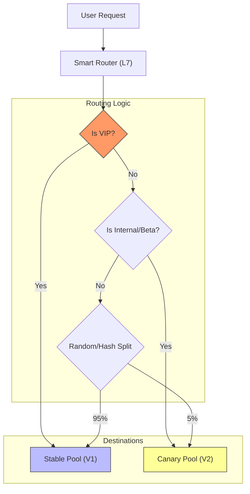

> [!check] Архитектурный Вердикт Хорошая стратегия Canary Deployment похожа на сито:
> 
> 1. Сначала отсейте тех, кого нельзя трогать (VIPs).
>     
> 2. Потом выберите тех, кто хочет пробовать (Beta).
>     
> 3. И только для "серой массы" (General Public) используйте процентное разделение с обязательным **Session Hashing**.
>
### 4.3. The "Baseline" Pattern (Avoiding False Positives)
Как понять, что рост ошибок на Канарейке вызван плохим кодом, а не внезапным скачком нагрузки на весь кластер?

**Проблема:**
* $V_1$ (Stable) работает уже неделю. У него прогретые кэши (JIT, DB Pools).
* $V_2$ (Canary) только что поднялся. Он "холодный".
* Если сравнить $V_2$ и $V_1$, Канарейка всегда будет медленнее. Это ложная тревога.

**Решение (Baseline Deployment):**
Мы поднимаем **три** набора подов на время анализа:
1.  **Primary ($V_1$):** Обслуживает 90% трафика.
2.  **Canary ($V_2$):** Обслуживает 5% трафика (Эксперимент).
3.  **Baseline ($V_1$ New):** Обслуживает 5% трафика (Контрольная группа).

**Анализ:** Мы сравниваем метрики **Canary vs Baseline**.
Оба "холодные", оба стартовали только что. Сравнение честное.

### 4.4. Tooling: Argo Rollouts & Flagger (2026 Standard)
### 4.4. Tooling: Argo Rollouts & Flagger (The Automation Standard) [Deep Dive]

> [!abstract] Роботы вместо Людей
> **Progressive Delivery Controllers** — это программные операторы внутри Kubernetes, которые автоматизируют процесс принятия решений.
>
> Вместо человека они:
> 1.  Меняют веса трафика (Traffic Shifting).
> 2.  Делают запросы в Prometheus/Datadog (Analysis).
> 3.  Принимают решение: откатить (Rollback) или продолжить (Promote).
>
> Два главных игрока на рынке: **Argo Rollouts** и **Flagger**.

[Image of progressive delivery controller architecture: Controller -> Metrics -> Mesh -> Traffic]

#### A. Tool 1: Argo Rollouts (The "Replacement" Strategy)
**Философия:** Argo Rollouts заменяет стандартный ресурс `Deployment` на свой собственный CRD — `Rollout`.
Это дает ему полный контроль над ReplicaSets.

* **Как это работает:**
    * Вы пишете манифест `kind: Rollout` вместо `kind: Deployment`.
    * Контроллер сам создает ReplicaSets (Active и Preview).
    * Контроллер сам патчит Ingress/Istio/SMI.
* **UI:** У Argo Rollouts есть шикарный дашборд (плагин к ArgoCD), где можно визуально видеть процесс канарейки и нажимать кнопку "Promote" (если настроены ручные гейты).

**Пример манифеста (Rollout):**
```yaml
apiVersion: argoproj.io/v1alpha1
kind: Rollout
metadata:
  name: payment-service
spec:
  replicas: 5
  strategy:
    canary:
      canaryService: payment-canary  # Сервис для тестов/метрик
      stableService: payment-stable  # Сервис для пользователей
      trafficRouting:
        istio:
          virtualService: 
            name: payment-vs         # Каким объектом рулить
      steps:
      - setWeight: 20                # 1. Пусти 20%
      - pause: {duration: 5m}        # 2. Жди 5 минут (собирай метрики)
      - analysis:                    # 3. Проверь метрики
          templates:
          - templateName: success-rate-check
      - setWeight: 50                # 4. Если ОК -> 50%
      - pause: {duration: 10m}
      - setWeight: 100               # 5. Финал
```
#### B. Tool 2: Flagger (The "Wrapper" Strategy)
**Философия:** Flagger не заставляет вас отказываться от `Deployment`. Он работает "поверх".
Он автоматизирует создание сервисов, секретов и правил маршрутизации.
- **Как это работает:**
    - Вы оставляете свой стандартный `Deployment`.
    - Вы создаете CRD `Canary`, который указывает на этот Deployment.
    - Flagger берет управление на себя: он создает _теневые_ деплойменты (`primary` и `canary`), управляет их масштабированием и настраивает Service Mesh.
        
- **Плюс:** Проще внедрить в существующие проекты, так как не надо переписывать все YAML-файлы на `Rollout`.

**Пример манифеста (Flagger Canary):**
```YAML
apiVersion: flagger.app/v1beta1
kind: Canary
metadata:
  name: payment-service
spec:
  targetRef:
    apiVersion: apps/v1
    kind: Deployment
    name: payment-service  # Ссылка на обычный Deployment
  service:
    port: 9898
    gateways:
    - public-gateway
    hosts:
    - app.example.com
  analysis:
    interval: 1m
    threshold: 5           # Max 5 ошибок подряд -> Rollback
    stepWeight: 10         # Шаг +10%
    maxWeight: 50          # Дойти до 50% и если ОК -> сразу 100%
    metrics:
    - name: request-success-rate
      thresholdRange:
        min: 99
    - name: request-duration
      thresholdRange:
        max: 500
```
#### C. The Brain: Analysis Templates (PromQL Integration)
Главная ценность этих инструментов — **Analysis Loop**.
Контроллер выступает клиентом Prometheus. Вы должны научить его, что такое "Хорошо".
**AnalysisTemplate (Argo Example):**
```YAML
apiVersion: argoproj.io/v1alpha1
kind: AnalysisTemplate
metadata:
  name: success-rate-check
spec:
  metrics:
  - name: success-rate
    successCondition: result[0] >= 0.99
    provider:
      prometheus:
        address: http://prometheus:9090
        query: |
          sum(rate(http_requests_total{app="payment", status!~"5.*"}[2m])) / 
          sum(rate(http_requests_total{app="payment"}[2m]))
```
- **Логика:**
    1. Выполни PromQL запрос.
    2. Если результат `>= 0.99` (99%), верни `Pass`.
    3. Если `< 0.99`, верни `Fail`.
    4. Если `Fail` $\to$ Argo Rollouts делает немедленный откат весов на 0%.
#### D. Comparison: Argo vs. Flagger

|**Feature**|**Argo Rollouts**|**Flagger**|
|---|---|---|
|**Integration**|Часть экосистемы Argo (ArgoCD).|Работает с FluxCD, Helm, Jenkins.|
|**Object Model**|Заменяет Deployment (`Rollout`).|Управляет Deployment (`Canary`).|
|**Traffic Mgmt**|Поддерживает Nginx, ALB, Istio, Linkerd.|Глубокая интеграция с Service Meshes (Istio, Linkerd, App Mesh).|
|**UI**|Отдельный мощный UI для визуализации шагов.|Использует Grafana dashboard.|
|**Philosophy**|Императивные шаги (`steps: setWeight`). Вы контролируете каждый шаг.|Декларативная автоматика. "Поднимай по 10% каждые 5 минут, пока не будет 50%".|
#### E. Visualization: The Controller Loop (Mermaid)

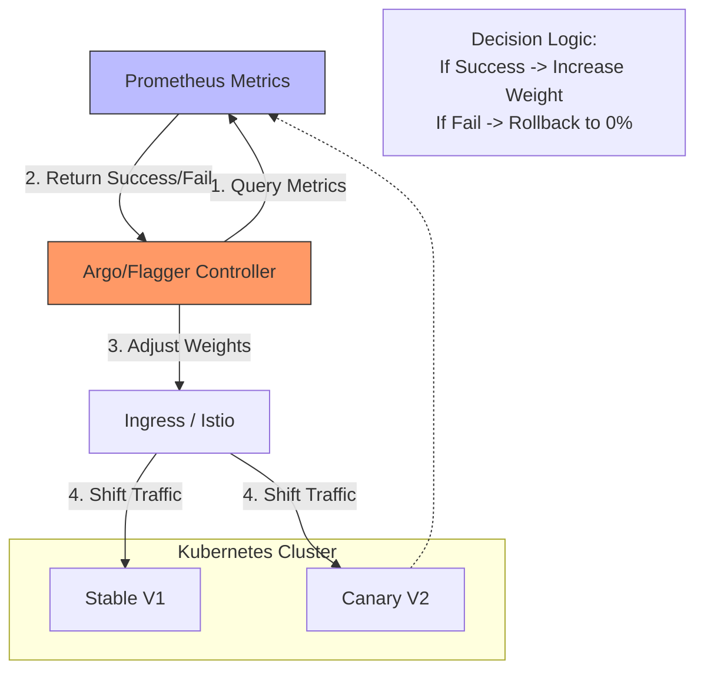

> [!check] Архитектурный Вердикт (2026)
> 
> - Если вы уже используете **ArgoCD** $\to$ Выбирайте **Argo Rollouts**. Это бесшовная интеграция, UI для разработчиков и понятная модель.
>     
> - Если вы используете **Flux** или хотите оставить стандартные Deployment-объекты $\to$ Выбирайте **Flagger**.
>     
> 
> **Главное:** Никогда не пишите свои скрипты на Bash/Python для переключения трафика. Используйте эти контроллеры. Они обрабатывают граничные случаи (HPA conflicts, metric delays), о которых вы даже не догадываетесь.
### 4.5. Analysis Metrics (The Golden Signals)

> [!abstract] Философия "Healthy vs. Alive"
> Kubernetes Health Checks (`livenessProbe`) отвечают на вопрос: *"Жив ли процесс?"*
> Canary Analysis отвечает на вопрос: *"Хорошо ли пользователю?"*
>
> Мы используем методологию **Google SRE Golden Signals**, адаптированную для релизов.
> Робот-анализатор (Argo/Flagger) каждую минуту делает запросы в Prometheus (PromQL) и сравнивает показатели Канарейки ($V_2$) с показателями Стабильной версии ($V_1$).
#### A. Signal 1: Error Rate (Качество)
Это самый очевидный, но часто неправильно настраиваемый сигнал.

* **Стандарт:** Процент `5xx` кодов ответа HTTP.
* **Нюанс 2026:**
    * `500` (Internal Server Error) — это крах.
    * `404` (Not Found) — это может быть нормой (юзер ошибся), А МОЖЕТ БЫТЬ багом роутинга в новом релизе.
    * **Logical Errors:** Если ваше API возвращает `200 OK`, но в теле JSON `{ "error": "database unreachable" }`, стандартная метрика это пропустит.
* **Решение:** Инструментируйте код (OpenTelemetry) так, чтобы отдавать метрику `app_business_error_total`, и смотрите на неё.

#### B. Signal 2: Latency (Скорость)
Пользователи ненавидят тормоза. Но смотреть на "Среднее время" (`Avg`) — это ошибка новичка.

* **Проблема среднего:** Если 99 запросов прошли за 10мс, а 1 запрос за 10 секунд (DB Timeout), среднее будет ~100мс. Вроде ОК, но один пользователь в ярости.
* **Решение: P99 (Tail Latency):** Мы смотрим на 99-й перцентиль.
    * *"Какое время ответа у 99% самых медленных пользователей?"*
    * Если на Stable P99 = 200ms, а на Canary P99 = 500ms $\to$ **Rollback**. Это деградация производительности.

#### C. Signal 3: Saturation (Эффективность)
Новый код может работать быстро и без ошибок, но при этом "жрать" память как не в себя (Memory Leak).

* **Метрика:** Usage vs Limit (Memory/CPU).
* **Сценарий:** Канарейка работает отлично 10 минут, но график памяти растет линейно. Через 2 часа она упадет с OOM (Out Of Memory).
* **Анализ:** Если Canary потребляет на 20% больше RAM при том же трафике, чем Stable $\to$ **Warning** (или Rollback, если ресурсы ограничены).

#### D. The "Relative Threshold" Logic (Математика сравнения)
Как задать порог отката?
* **Абсолютный (Плохо):** `error_rate < 1%`.
    * *Почему плохо:* Если у вас глобальный сбой внешнего API (Stripe лежит), ошибки будут и на Stable, и на Canary. Робот откатит релиз, но это не поможет.
* **Относительный (Хорошо):** `canary_error_rate <= stable_error_rate * 1.1`.
    * *Логика:* "Канарейка не должна быть хуже Стабильной версии более чем на 10%".
    * Если Stripe лежит, ошибки растут везде одинаково. Анализ проходит успешно (`Pass`), так как новый код не виноват.

#### E. PromQL Examples (Copy-Paste Ready)
Вот реальные запросы для Prometheus, которые используются в AnalysisTemplates.

**1. Success Rate Comparison (Относительный)**
```sql
# Успешность Canary / Успешность Baseline
(
  sum(rate(http_requests_total{app="myapp", version="canary", status!~"5.*"}[1m])) 
  / 
  sum(rate(http_requests_total{app="myapp", version="canary"}[1m]))
) 
/
(
  sum(rate(http_requests_total{app="myapp", version="stable", status!~"5.*"}[1m])) 
  / 
  sum(rate(http_requests_total{app="myapp", version="stable"}[1m]))
)
# Результат должен быть >= 0.95 (допускаем деградацию не более 5%)
```
**2. Latency P99 Check (Абсолютный)**

```SQL
histogram_quantile(0.99, sum(rate(http_request_duration_seconds_bucket{app="myapp", version="canary"}[1m])) by (le))
/* Результат должен быть < 0.5 (то есть меньше 500ms) */
```

#### F. Business Metrics (Revenue Guards)
Технические метрики могут врать.
Пример: Вы выкатили новый фронтенд. Кнопка "Купить" не работает (JS Error на клиенте).
- Сервер видит `200 OK` (страница отдалась).
- Latency низкая (ошибки обрабатываются быстро).
- **Но заказов нет!**

В 2026 году мы добавляем **Business Checks**:
1. **Orders Per Minute:** Сравниваем количество успешных транзакций.
2. **Login Rate:** Не сломалась ли авторизация.
3. **Client-Side Errors (Sentry):** Если Sentry видит всплеск JS-ошибок с тегом `release-v2` $\to$ **Instant Rollback**.
#### G. Visualization: The Decision Matrix

|**Metric**|**Stable Value**|**Canary Value**|**Logic**|**Decision**|
|---|---|---|---|---|
|**HTTP Errors**|0.1%|0.12%|Within 10% margin|✅ Pass|
|**Latency P99**|300ms|250ms|Faster!|✅ Pass|
|**CPU Usage**|20%|85%|**Saturation Spike!**|❌ Fail (Rollback)|
|**Orders/min**|100|0|**Business Critical!**|❌ Fail (Rollback)|

> [!check] Архитектурный Вердикт
> 
> Не полагайтесь на дефолтные настройки.
> 
> 1. Начните с простых **технических метрик** (Errors, Latency).
>     
> 2. Как можно скорее добавьте **одну бизнес-метрику** (Core Action).
>     
> 3. Всегда используйте **Baseline** (сравнение с текущей версией), чтобы избежать ложных срабатываний при внешних штормах.
>

### 4.6. Visualization: The Traffic Split

> [!abstract] Научный Метод в Деплое
> В правильной Canary-архитектуре мы не просто делим трафик на две части. Мы создаем три группы, как в клинических испытаниях лекарств:
>
> 1.  **Stable (General Population):** Основная масса пользователей (90%), которых мы не хотим трогать.
> 2.  **Canary (Experimental Group):** Версия $V_2$ (5%). "Пациенты, принимающие новое лекарство".
> 3.  **Baseline (Control Group):** Свежая копия версии $V_1$ (5%). "Пациенты, принимающие плацебо".
>
> **Зачем нужен Baseline?**
> Чтобы исключить влияние "холодного старта". Если Canary тормозит, это из-за нового кода или просто потому что кэши еще не прогрелись? Baseline тоже "холодный", поэтому сравнение $Canary \leftrightarrow Baseline$ — единственно честное.

#### A. The Traffic Flow Diagram
Эта схема показывает потоки данных (Traffic), метрик (Telemetry) и управляющих сигналов (Control Plane).

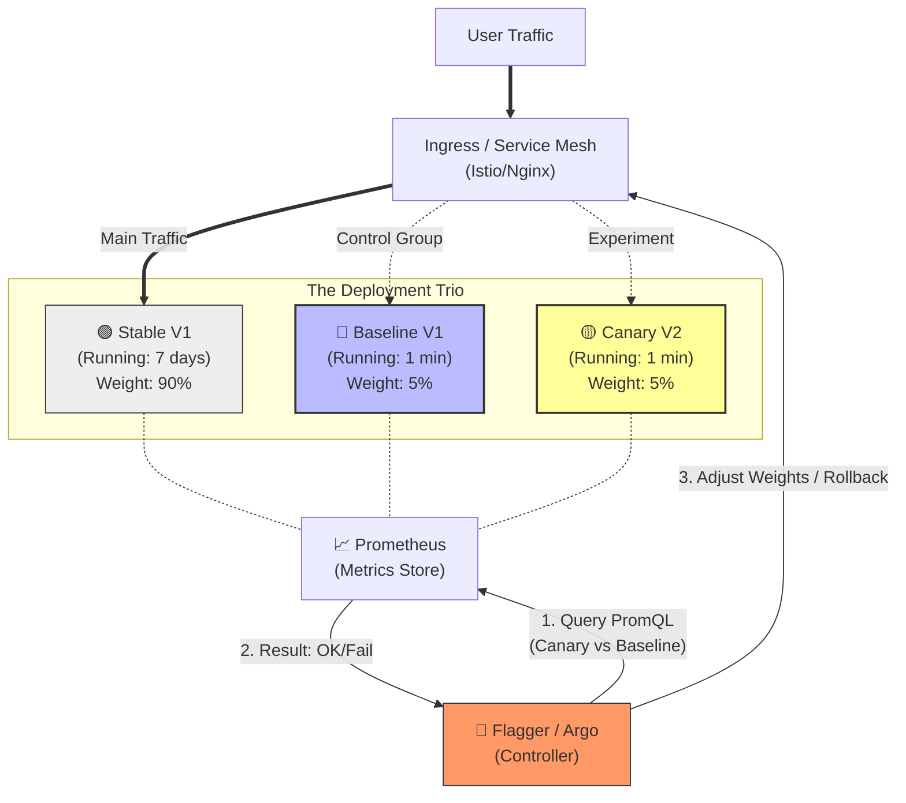
#### B. Component Breakdown

**1. The Ingress (The Actuator)**
Это исполнительный механизм. Он ничего не решает, он только исполняет приказ контроллера: _"Направь 5% сюда, 5% туда"_.
- _Важно:_ Он должен поддерживать **Consistent Hashing**, чтобы пользователь из группы Baseline не прыгал в группу Canary.

**2. The Trio (The Subjects)**
- **Stable:** "Священная корова". Сюда идут VIP-клиенты и большинство запросов. Мы не трогаем её веса, пока эксперимент не завершится на 100%.
- **Baseline:** Это _эфимерный_ деплоймент. Он создается только на время анализа и удаляется сразу после завершения канарейки. Он запускает **старый** имидж, но с **новой** конфигурацией среды (если она менялась).
- **Canary:** Это наш "подозреваемый".

**3. Prometheus (The Sensor)**
Он собирает метрики со всех трех групп.
- _Ключевой момент:_ Метрики должны иметь лейблы `version` или `track`.
    - `http_requests{track="stable"}`
    - `http_requests{track="baseline"}`
    - `http_requests{track="canary"}`

**4. The Controller (The Brain)**
Argo Rollouts или Flagger. Он выполняет бесконечный цикл:
1. **Sync:** Привести состояние кластера к желаемому (создать Baseline/Canary поды).
2. **Route:** Настроить веса.
3. **Measure:** Спросить Prometheus: `abs(Canary_Latency - Baseline_Latency) < Threshold`.
4. **Decide:**
    - Если метрики совпадают $\to$ Увеличить вес.
    - Если Canary хуже Baseline $\to$ **Abort & Rollback**.

#### C. Scenario: Why Baseline Saves Lives
Представьте, что у вас Java-приложение.
1. **Без Baseline:**
    - Stable работает неделю. JIT-компилятор соптимизировал код. Latency = 50ms.
    - Canary только стартовала. JIT еще работает. Latency = 70ms.
    - **Вывод робота:** "Canary на 40% медленнее! ROLLBACK!"
    - **Реальность:** Ложная тревога. Новый код нормальный, просто ему нужно время.
        
2. **С Baseline:**
    - Baseline тоже только стартовала. Latency = 70ms.
    - Canary стартовала. Latency = 70ms.
    - **Вывод робота:** "Baseline и Canary работают одинаково (70ms). Значит, замедление вызвано стартом, а не плохим кодом. PASS."
    - **Решение:** Продолжаем раскатку.

> [!check] Архитектурный Вердикт
> 
> Визуализация — это не просто картинка. Это карта ответственности.
> 
> - **SRE** смотрят на Controller (почему он откатил?).
>     
> - **Devs** смотрят на Canary метрики (почему код медленный?).
>     
> - **Manager** смотрит на Stable (бизнес работает?).
>     
> 
> Используйте паттерн **Baseline** всегда, когда вы используете рантаймы с "прогревом" (Java, .NET, Node.js). Для Go/Rust/C++ это менее критично, но все равно полезно для чистоты эксперимента.

### 4.7. Pros & Cons Summary

| **Плюсы (+)**                                                                                                    | **Минусы (-)**                                                                                          |
| ---------------------------------------------------------------------------------------------------------------- | ------------------------------------------------------------------------------------------------------- |
| **Lowest Blast Radius:** Ошибку увидят единицы. Риск минимален.                                                  | **High Complexity:** Требует Service Mesh (Istio/Linkerd) или умного Ingress и настроенного Prometheus. |
| **Production Testing:** Тестирование на реальном трафике, а не на синтетике.                                     | **Slow Rollout:** Полный цикл может занять часы (пока накопится статистика).                            |
| **Data-Driven Decisions:** Решение о релизе принимает алгоритм на основе цифр, а не менеджер на основе интуиции. | **Sticky Sessions Issue:** Сложно реализовать корректную работу с сессиями при смене весов.             |

> [!check] Архитектурный Вердикт
> 
> Canary — это "Золотой Стандарт" для микросервисов в 2026 году.
> 
> Но внедрять его нужно только тогда, когда у вас уже есть:
> 
> 1. **Observability:** Вы доверяете своим метрикам.
>     
> 2. **Automation:** У вас есть ArgoCD/Flux.
>     
> 3. **Traffic Control:** У вас есть Istio/Linkerd или Nginx Ingress Controller.
>     
> 
> Без этих компонентов Canary превратится в ручной ад ("подкрути конфиг nginx и посмотри в логи").
---
## 5. Bonus: Shadow Deployment (Dark Launch)

> [!abstract] Паттерн "Зеркало"
> **Shadow Deployment** (или Traffic Mirroring) — это стратегия, при которой мы запускаем новую версию ($V_2$) параллельно с боевой ($V_1$) и направляем на неё **копию** реального трафика.
>
> **Ключевые отличия от Канарейки:**
> 1.  **Fire-and-Forget:** Ответ от $V_2$ **игнорируется** (отбрасывается). Пользователь всегда получает ответ только от $V_1$.
> 2.  **Zero User Impact:** Если $V_2$ упадет, взорвется или вернет мусор — пользователь этого не заметит.
> 3.  **Full Load Test:** Это единственный способ проверить, выдержит ли бэкенд 100% реальной нагрузки (Production Load), не рискуя даунтаймом.
### 5.1. The Mechanism: Asynchronous Copying

> [!abstract] Физика Зеркалирования
> **Shadowing (Traffic Mirroring)** — это процесс дублирования L7-запросов (HTTP/gRPC) на уровне прокси-сервера (Sidecar/Ingress).
>
> Это операция типа **"Fire-and-Forget"** (Выстрелил и забыл).
> * **Main Path (Sync):** Прокси ждет ответа от основной версии ($V_1$), чтобы вернуть его клиенту.
> * **Shadow Path (Async):** Прокси отправляет копию в теневую версию ($V_2$), но **не ждет** ответа. Ответ $V_2$ отбрасывается (discarded) сразу после получения заголовков.
>
> **Главное правило:** Ошибки или тормоза Теневой версии ($V_2$) **никогда** не должны влиять на ответ пользователю.
#### A. The Traffic Flow Algorithm
Давайте разберем, что происходит внутри Envoy (стандарт де-факто для Service Mesh) при обработке одного пакета.

1.  **Ingress:** Получает TCP-пакет от клиента. Парсит HTTP-заголовки.
2.  **Buffering:** Если это POST-запрос с телом (Payload), Envoy должен **полностью буферизировать** его в памяти.
    * *Почему:* Нельзя стримить (stream) одни и те же байты в два сокета одновременно без буфера.
    * *Риск:* Увеличение потребления RAM на Ingress Gateway.
3.  **Forking:**
    * Поток А (Main): Открывает сокет к $V_1$ (Production).
    * Поток Б (Shadow): Открывает сокет к $V_2$ (Target).
4.  **Sending:** Envoy отправляет данные в оба канала.
5.  **Handling Responses:**
    * Как только $V_1$ ответил $\to$ Envoy отдает ответ клиенту. Транзакция для пользователя завершена. Latency = $Time(V_1)$.
    * Если $V_2$ ответил позже (или упал с Timeout) $\to$ Envoy пишет этот факт в метрики (`shadow_failure`), но **игнорирует** тело ответа.

#### B. Context Propagation (Header Injection)
Просто скопировать байты недостаточно. Теневое приложение должно знать, что оно — тень.
Иначе оно начнет слать реальные email-уведомления пользователям.

Умный прокси (Istio) автоматически модифицирует заголовки для Shadow-ветки:

1.  **Host Authority:** Меняется с `api.prod` на `api.shadow` (чтобы корректно работали VHost внутри приложения).
2.  **Tracing Headers:** Добавляется суффикс к `x-b3-traceid` или создается новый Span, помеченный как `mirror`.
    * *Цель:* Чтобы в Jaeger/Datadog вы видели два трейса, и ошибки $V_2$ не зажигали алерты "Production Down".
3.  **Custom Marker:** Мы часто вручную добавляем заголовок:
    * `X-Shadow-Traffic: true`
    * *Код приложения:* `if (headers['x-shadow-traffic']) { disable_email_sending(); }`

#### C. Performance Impact: The "Zero Latency" Lie
Часто говорят, что Shadowing имеет "нулевое влияние". Это маркетинговая ложь.

1.  **CPU Overhead:** Прокси тратит процессорное время на копирование байтов и управление вторым TCP-соединением.
2.  **Network Bandwidth:** Вы удваиваете внутренний трафик кластера (East-West Traffic).
    * Если ваш сервис перекачивает гигабайты, включение Mirroring может положить сеть (Network Saturation).
3.  **Connection Pools:** Теневой трафик расходует файловые дескрипторы и порты на узлах.

#### D. Sequence Diagram: The Async Detach

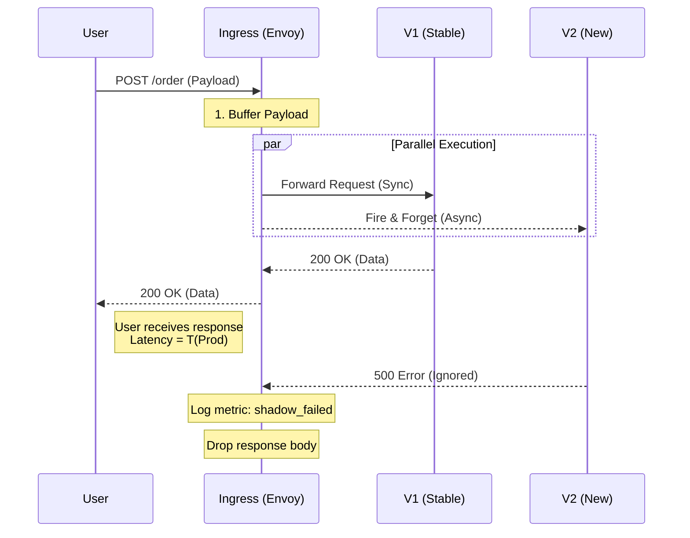
#### E. Out-of-Band Verification (OOB)
Как мы узнаем, что Shadow-версия работает правильно, если мы выкидываем ответы?
Ответы выкидываются для _пользователя_, но не для _системы мониторинга_.
В архитектуре Shadow Deployment часто ставят **Tap Service** (или Collector).
1. Прокси не просто шлет в $V_2$.
2. Прокси шлет и ответ $V_1$, и ответ $V_2$ в специальную очередь аналитики (Kafka).
3. **Diff Worker:** Читает из Kafka пару `(Resp V1, Resp V2)`, делает JSON Diff и кладет результаты в ELK/Splunk.
4. Инженер видит дашборд: "Расхождение в поле `total_price` в 0.01% запросов".

> [!check] Архитектурный Вердикт
> 
> Используйте Shadowing аккуратно:
> 
> 1. **Sampling:** Не обязательно зеркалировать 100%. Для High-Load достаточно `mirror_percent: 1%`. Это даст репрезентативную выборку без убийства сети.
>     
> 2. **Filter:** Зеркалируйте только `GET` запросы (безопасно) и исключайте `POST/PUT` (опасно для данных), если у вас нет полной изоляции БД.
>     
> 3. **Monitoring:** Следите за CPU вашего Ingress Controller. Mirroring — это тяжелая работа для прокси.
>

### 5.2. The "Side Effect" Trap (Главный Архитектурный Риск)
### 5.2. The "Side Effect" Trap: Managing State Mutation [Deep Dive]

> [!danger] Аксиома Непорочности
> **Side Effect (Побочный эффект)** — это любое изменение состояния системы, выходящее за пределы памяти процесса (запись в БД, вызов внешнего API, отправка email, изменение кэша).
>
> **Shadow Traffic Paradox:**
> Мы хотим проверить *логику* изменения состояния (правильно ли мы рассчитали сумму заказа?), но мы не хотим, чтобы это изменение *произошло в реальности* (списание денег).
>
> Если Shadow-версия ($V_2$) выполнит запись в ту же базу данных, что и Production ($V_1$), вы получите **Data Corruption** (порчу данных).


#### A. Taxonomy of Risks (Что может пойти не так?)

1.  **Duplicate Writes (Дублирование данных):**
    * $V_1$ создает `Order #100`.
    * $V_2$ создает `Order #101` (с тем же содержимым).
    * *Итог:* Статистика продаж завышена в 2 раза. Склад отгружает два товара вместо одного.
2.  **External Calls (Внешние вызовы):**
    * $V_1$ вызывает Stripe API (Charge $100).
    * $V_2$ вызывает Stripe API (Charge $100).
    * *Итог:* Клиент заплатил $200. Это репутационная катастрофа.
3.  **Notification Spam (Зомби-апокалипсис):**
    * $V_1$ шлет "Спасибо за покупку".
    * $V_2$ шлет "Спасибо за покупку".
    * *Итог:* Клиент думает, что его взломали.

#### B. Strategy 1: The "Read-Only" Filter (Level: Beginner)
Самый простой и безопасный способ. Мы зеркалируем только те запросы, которые **гарантированно** не меняют состояние.

* **Механизм:** На уровне Ingress (Envoy/Nginx) настраиваем фильтр.
* **Правило:**
    * `IF method == GET OR HEAD` $\to$ Mirror to $V_2$.
    * `IF method == POST, PUT, DELETE` $\to$ Do NOT Mirror.
* **Плюсы:** 100% безопасность. Нулевой риск дублей.
* **Минусы:** Вы не тестируете самую сложную бизнес-логику (Checkout, Registration). Вы тестируете только "читалки".

#### C. Strategy 2: Context-Aware Mocking (Level: Advanced)
Приложение $V_2$ должно **знать**, что оно — тень, и вести себя соответственно (как в симуляции).

**1. Context Propagation:**
Прокси (Envoy) добавляет заголовок `X-Is-Shadow: true` к зеркалированному запросу.

**2. The Shim Layer (Заглушки):**
В коде приложения мы используем паттерн **Dependency Injection**.
Если мы видим заголовок `X-Is-Shadow`, мы подменяем реальные адаптеры на Mock-адаптеры (No-Op).

```python
class PaymentService:
    def process_payment(self, request):
        # Проверяем контекст (пришел ли заголовок)
        if request.context.is_shadow:
            # SHADOW MODE: Логируем намерение, но не звоним в банк
            logger.info(f"[SHADOW] Would charge {request.amount} via Stripe")
            return PaymentResult(success=True, tx_id="mock_tx_123")
        
        # PROD MODE: Реальный вызов
        return stripe.Charge.create(amount=request.amount)
```
- **Риск:** Если разработчик забудет обернуть _новый_ вызов API в `if is_shadow`, тень "выстрелит" по-настоящему.
#### D. Strategy 3: Virtualization / Sandboxing (Level: God Mode)
Используется в банках и высоконагруженных системах (Uber, Netflix).
Shadow-версия работает "по-настоящему", но в изолированной песочнице.
1. **Shadow Database:**
    - Для $V_2$ поднимается отдельная база данных (или отдельная Schema).
    - Эта база наполняется данными из Prod-бэкапа.
    - $V_2$ пишет в эту базу. Данные там "ненастоящие".
2. **Virtual API Gateway:**
    - Все внешние вызовы (Stripe, Email) идут через специальный внутренний шлюз-мок (на базе, например, WireMock).
    - Шлюз отвечает $V_2$ успешными ответами ("ОК, деньги списаны"), но никуда не ходит.
#### E. The "Idempotency" Myth
Многие думают: _"У меня идемпотентное API, мне не страшны дубли"_.
Это ошибка.
- **Сценарий:** $V_1$ и $V_2$ шлют запрос с одним `idempotency_key`.
- **Race Condition:**
    - Если $V_1$ пришел первым $\to$ $V_2$ получит ошибку `409 Conflict` (или `200 OK` из кэша).
    - Если $V_2$ пришел первым (сеть лаганула у $V_1$) $\to$ $V_2$ совершит реальное действие, а $V_1$ получит ответ "Уже сделано".
- **Проблема:** Вы не знаете, _кто именно_ обработал запрос. Метрики смешиваются. Тестирование становится бесполезным.
#### F. Visualization: The Mocking Architecture (Mermaid)

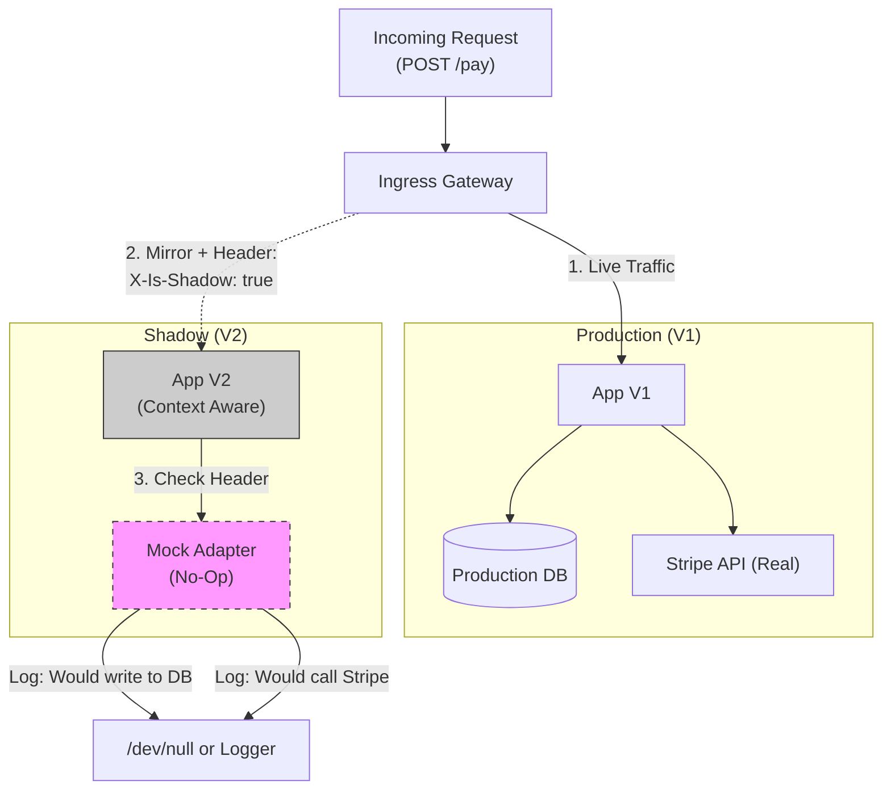

> [!check] Архитектурный Вердикт
> 
> 1. **Начните с GET-запросов.** Это безопасно и дает 80% пользы (проверка нагрузки на чтение, сериализация JSON).
>     
> 2. Для **POST-запросов** внедрение Shadowing требует изменения кода (Context Awareness).
>     
> 3. **Никогда** не зеркалируйте трафик на "чистую" версию $V_2$, если у неё нет механизма защиты от Side Effects (Mocking или Isolation). Это приведет к увольнению.
>

### 5.3. Verification: The Diffing Proxy (Scientific Comparison)
Зачем мы это делаем? Чтобы доказать **Паритет** (Parity).
Мы хотим убедиться, что новый микросервис на Rust выдает **тот же самый JSON**, что и старый монолит на PHP.

Используются инструменты типа **Twitter Diffy** (или современные аналоги вроде `Mizu` или `OpenDiffy`).

1.  Gateway шлет запрос на V1 и V2.
2.  Proxy перехватывает оба ответа.
3.  **Noise Filtering:** Мы исключаем поля, которые *должны* отличаться (timestamp, random GUID, server_id).
4.  **Comparison:** Сравниваем полезную нагрузку (Payload).
    * Если V1 вернул `price: 100`, а V2 вернул `price: 100.00` — это баг или фича? Shadow Deployment позволяет найти такие нюансы до релиза.

### 5.4. Use Case: The "Big Refactor"
Когда применять Shadow Deployment? Это дорого (x2 ресурсы), поэтому используем только для "Страшных изменений".

1.  **Миграция языка:** Java $\to$ Go. Логика должна остаться идентичной.
2.  **Миграция базы данных:** Oracle $\to$ PostgreSQL. ORM могут вести себя по-разному.
3.  **Capacity Planning:** Вы переезжаете с AWS c5.large на c6g.medium (ARM). Выдержит ли процессор? Включаем Shadow на 100% и смотрим на CPU Usage.

### 5.5. Implementation (Istio Example)
В Istio это делается одной строчкой в `VirtualService`.

```yaml
apiVersion: networking.istio.io/v1beta1
kind: VirtualService
metadata:
  name: my-service
spec:
  hosts:
  - my-service.prod.svc.cluster.local
  http:
  - route:
    - destination:
        host: my-service-v1  # Основной (User Facing)
        subset: v1
      weight: 100
    mirror:                  # <--- Магия здесь
      host: my-service-v2    # Теневой (Shadow)
      subset: v2
    mirrorPercentage: 
      value: 100.0           # Копируем 100% трафика (можно 10%)
```
### 5.6. Visualization: The Ghost Flow (Mermaid)

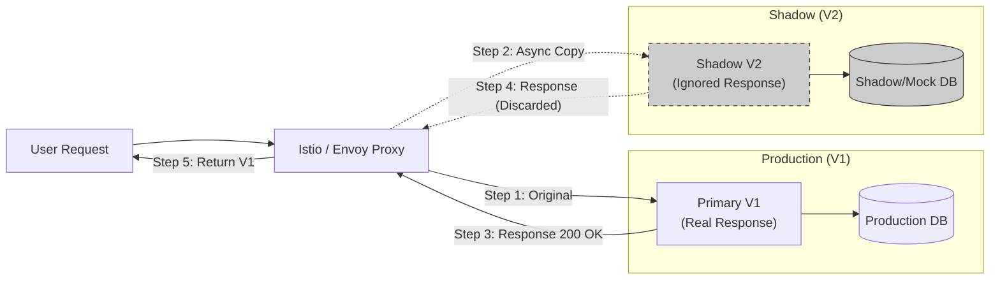

> [!check] Архитектурный Вердикт Shadow Deployment — это **инструмент уверенности**. Он позволяет вам сказать бизнесу: _"Я гарантирую, что новый биллинг работает корректно, потому что он уже неделю обрабатывает 100% реальных транзакций в теневом режиме и не выдал ни одной ошибки сравнения"._
> 
> **Цена:** Удвоение затрат на инфраструктуру (Compute). **Риск:** Запись в базу (нужна изоляция).
---
## 6. Comparison Matrix: How to Choose?

> [!abstract] Трилемма Деплоя
> Не существует "идеальной" стратегии. Каждая стратегия — это обмен чего-то на что-то (Trade-off).
>
> 1.  **Rolling Update:** Мы платим **временем отката** за дешевизну инфраструктуры.
> 2.  **Blue-Green:** Мы платим **деньгами** (x2 ресурсы) за мгновенный откат.
> 3.  **Canary:** Мы платим **сложностью настройки** (Istio/Argo) за минимальный радиус поражения.
> 4.  **Shadow:** Мы платим **деньгами и сложностью** за абсолютную уверенность в тестах.
### 6.1. The Ultimate Comparison Table

| Feature | Rolling Update | Blue-Green | Canary | Shadow (Mirroring) |
| :--- | :--- | :--- | :--- | :--- |
| **Cost (Infrastructure)** | 🟢 **Low** (1 pod overhead) | 🔴 **High** (200% capacity) | 🟡 **Medium** (Baseline + Canary pods) | 🔴 **High** (200% capacity) |
| **Rollback Speed** | 🔴 **Slow** (Re-deploy needed) | 🟢 **Instant** (Load Balancer switch) | 🟢 **Fast** (Traffic weight change) | ⚪ **N/A** (Users not affected) |
| **Blast Radius** | 🔴 **Random** (Unknown users hit) | 🔴 **All-or-Nothing** (100% users hit) | 🟢 **Minimal** (1-5% users hit) | 🟢 **Zero** (0% users hit) |
| **Real User Testing** | ✅ Yes | ✅ Yes (Post-switch) | ✅ Yes (Gradual) | ❌ No (Ignored response) |
| **Complexity** | 🟢 **Low** (Built-in K8s) | 🟡 **Medium** (Double Deployments) | 🔴 **High** (Requires Service Mesh/Argo) | 🔴 **Extreme** (Requires Mocking/Isolation) |
| **Best For...** | Stateless Apps, MVPs, Internal Tools | Critical Monoliths, Database Migrations | Microservices, High-Scale B2C | Refactoring, Language Migrations |

### 6.2. Decision Flowchart: How to Choose?
Не гадайте. Следуйте этому алгоритму.

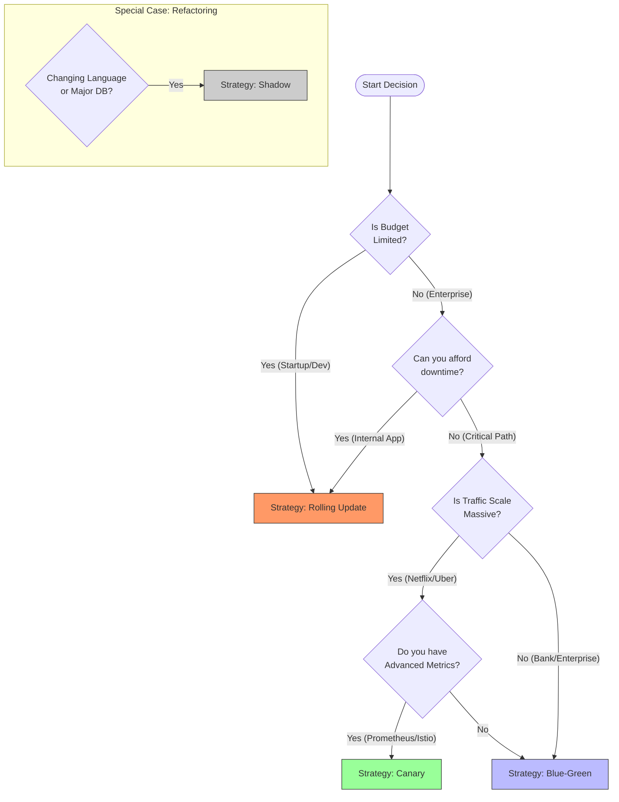
### 6.3. Scenario Analysis (Real World Examples)

#### Scenario A: The "FinTech Monolith" (Bank)
- **Context:** Огромное Java-приложение (старт 5 минут). Любая ошибка стоит миллионы. Трафик умеренный.
- **Choice: Blue-Green.**
- _Why:_
    - Долгий старт убивает Canary (слишком долго ждать прогрева каждого пода).
    - Банк может позволить себе x2 железо.
    - Нужна гарантия мгновенного отката, если вдруг транзакции перестанут проходить.
#### Scenario B: The "Global Social Network" (High Load)
- **Context:** Микросервисы на Go. 100M пользователей. Сотни релизов в день.
- **Choice: Canary.**
- _Why:_
    - **Scale:** У вас 10,000 подов. Поднять еще 10,000 для Blue-Green физически невозможно (не хватит IP-адресов или квот облака).
    - **Impact:** Ошибка на 100% пользователей (Blue-Green) положит колл-центр. Ошибка на 1% (Canary) пройдет незамеченной.
#### Scenario C: The "Internal Admin Panel" (Low Budget)
- **Context:** Админка для менеджеров. Бюджет ограничен.
- **Choice: Rolling Update.**
- _Why:_
    - Если менеджер увидит 500-ю ошибку в течение 1 минуты редеплоя, он просто обновит страницу.
    - Нет смысла тратить ресурсы инженеров на настройку Istio/Argo.
#### Scenario D: The "Heart Transplant" (Legacy Migration)
- **Context:** Переписываем устаревший SOAP-сервис на gRPC/REST.
- **Choice: Shadow Deployment.**
- _Why:_
    - Логика слишком сложная, чтобы покрыть её unit-тестами.
    - Риск ошибки 100%. Мы _ожидаем_, что новый сервис будет падать.
    - Нам нужно собрать 1000 отличий в ответах, починить их, и только потом пускать пользователей.
### 6.4. The "Hybrid" Approach (Advanced)
В 2026 году профессионалы комбинируют стратегии.
**Pattern: "Blue-Green Canary"**
1. Вы используете **Blue-Green** на уровне инфраструктуры (создаете новый ReplicaSet, но не переключаете Service).
2. Вы используете **Canary** на уровне Ingress (начинаете лить 1% на новый ReplicaSet).
3. Если все ОК $\to$ увеличиваете до 100%.
4. Если баг $\to$ мгновенно возвращаете 0%.
5. _Результат:_ Вы получаете безопасность Canary и чистоту окружения Blue-Green.

> [!check] Архитектурный Вердикт
> 
> **Rolling Update** — это "прожиточный минимум". Он должен быть настроен идеально (`maxSurge`, `readinessProbe`).
> 
> **Canary** — это цель, к которой нужно стремиться. Это не просто деплой, это культура "Тестирования на проде".
> 
> **Blue-Green** — это специализированный инструмент для тяжелых, редких релизов (Stateful Apps).
> 
> **Shadow** — это лабораторный инструмент, а не релизный. Включайте его только по требованию.

---
## 7. Decision Framework (2026 Context)

> [!abstract] Портфельный подход
> Не ищите "Серебряную пулю". Относитесь к стратегиям деплоя как к инвестиционному портфелю.
>
> * **Rolling Update** — это "Депозит". Надежно, дешево, стандартно.
> * **Blue-Green** — это "Страховка". Дорого, но спасает жизнь в критический момент.
> * **Canary** — это "Хедж-фонд". Сложно управляется, но дает максимальный контроль над рисками.
> * **Shadow** — это "Лаборатория R&D". Затратно, но необходимо для инноваций.
### 7.1. The Selection Matrix (Risk vs. Cost)

Мы выбираем стратегию на пересечении двух осей: **Цена Ошибки** (Impact) и **Сложность Состояния** (Statefulness).

| Характеристика сервиса                                       | Рекомендуемая стратегия | Почему?                                                                                                                              |
| :----------------------------------------------------------- | :---------------------- | :----------------------------------------------------------------------------------------------------------------------------------- |
| **Stateless Microservice** <br/> (Notification, Logger, BFF) | **Rolling Update**      | Сервис легко масштабируется, ошибка затрагивает малый % пользователей (при `maxUnavailable: 25%`). Нет смысла платить за x2 ресурсы. |
| **Stateful Monolith** <br/> (Legacy CRM, Core Banking)       | **Blue-Green**          | Монолит долго стартует (1-5 мин). Rolling Update будет идти вечность. Нужна гарантия атомарного переключения всех инстансов сразу.   |
| **High-Traffic Frontend** <br/> (User Facing App)            | **Canary**              | Ошибки JS/CSS ломают конверсию. Нужно проверить UI на 1% пользователей (Sticky Sessions обязательны!), прежде чем пускать всех.      |
| **Critical Refactoring** <br/> (Rewrite: Java -> Go)         | **Shadow**              | Никакие тесты не покроют 100% кейсов продакшена. Нужен "Run in parallel" режим для сверки ответов.                                   |
### 7.2. The Logical Flowchart (Algorithmic Choice)
Не гадайте. Проведите каждый сервис через этот алгоритм.

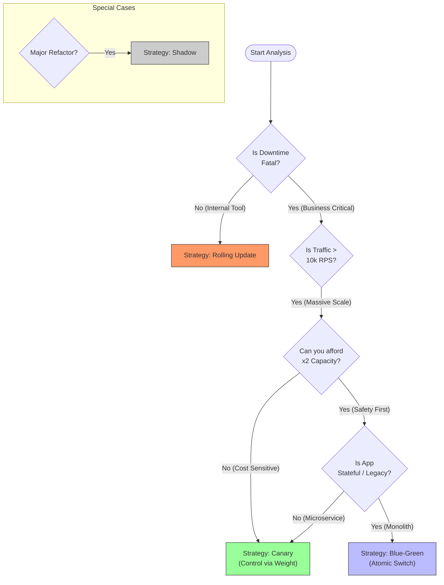
### 7.3. The "Cost Hack" (Spot Instances Strategy)
В 2026 году мы научились экономить на дорогих стратегиях, используя особенности облаков (AWS/GCP/Azure).

**Проблема:** Blue-Green и Shadow требуют удвоения ресурсов (x2 Cost). Финансовый директор (CFO) не одобрит. **Решение:** Используйте **Spot Instances** (Preemptible VM) для временного окружения.

- **Blue-Green:**
    - _Blue (Prod):_ Работает на On-Demand (стабильных) инстансах.
    - _Green (Staging):_ Поднимается на Spot-инстансах (которые на 70% дешевле).
    - _Риск:_ Если Spot отберут, деплой просто упадет (Fail Closed). Прод не пострадает.
    - _Profit:_ Вы получаете безопасность Blue-Green по цене Rolling Update.
### 7.4. The Maturity Model (Evolution Path)
Не пытайтесь внедрить Canary в первый день стартапа. Вы утонете в конфигурации Istio.

**Level 1: Survival (Startups)**
- **Strategy:** Rolling Update.
- **Tools:** Standard Kubernetes Deployment.
- **Focus:** Настроить `readinessProbe` и `requests/limits`. Этого достаточно для 90% компаний.

**Level 2: Stability (Growth)**
- **Strategy:** Blue-Green (для базы данных и монолита).
- **Tools:** ArgoCD (ручной Sync), Helm Hooks.
- **Focus:** Zero Downtime migrations, Graceful Shutdown.
    

**Level 3: Scale (Enterprise)**
- **Strategy:** Automated Canary.
- **Tools:** Argo Rollouts / Flagger + Prometheus + Service Mesh.
- **Focus:** Автоматический откат на основе бизнес-метрик (количество заказов).

**Level 4: Science (Tech Giants)**
- **Strategy:** A/B Testing + Shadowing + Chaos Engineering.
- **Tools:** In-house platforms / Advanced Istio.
- **Focus:** Эксперименты над пользователями, проверка гипотез.
    

### 7.5. Architectural Verdict: The "Hybrid Fleet"
Как выглядит идеальный кластер в 2026 году?
1. **Ingress Controller:** Nginx или Istio Gateway.
2. **Core Services (Auth, Payment):** Используют **Blue-Green**. Мы не рискуем деньгами. Мы лучше потратим лишние $100 на серверы, чем потеряем транзакцию.
3. **Edge Services (Frontend, API Gateway):** Используют **Canary**. Нам важно поймать баг UI на 1% пользователей.
4. **Worker Nodes:**
    - Stable Node Pool: Для Blue/Stable подов.
    - Spot Node Pool: Для Green/Canary/Shadow подов.

> [!check] Final Checklist (Definition of Ready) Прежде чем внедрять сложную стратегию, убедитесь, что у вас есть:
> 
> 1. [ ] **Observability:** Вы видите график ошибок в реальном времени. Без этого Canary — это русская рулетка.
>     
> 2. [ ] **Automation:** У вас есть CI/CD пайплайн. Руками править YAML для Blue-Green нельзя.
>     
> 3. [ ] **Database Migrations:** Ваш код поддерживает принцип `N-1 Compatibility`.
>     
> 
> Если хотя бы один пункт `Нет` — оставайтесь на **Rolling Update**. Это честно и безопасно.