> [!abstract] Monitoring vs. Observability
> 
> **Monitoring** говорит вам, что система упала ("Health: Red"). Это про _Known Unknowns_ (мы знали, что диск может переполниться, и поставили алерт).
> 
> **Observability** объясняет, **почему** она упала. Это про _Unknown Unknowns_ (мы не знали, что новый микросервис вызывает дедлок в базе данных при определенном User-Agent).
> 
> **Формула Успеха:**
> 
> $$Observability = Metrics + Logs + Traces + Correlation$$

---
## 1. The Three Pillars (Anatomy of Data)

> [!abstract] Физика Наблюдаемости
> Данные телеметрии — это проекции состояния системы. Представьте, что ваша система — это автомобиль.
> * **Метрики:** Спидометр. Стрелка показывает `100 км/ч`. Это дешево, быстро, но без деталей.
> * **Логи:** Бортовой самописец. *"12:00:01 Водитель нажал тормоз. 12:00:02 ABS сработала"*. Это детально, но данных очень много.
> * **Трейсы:** GPS-трек поездки. Откуда выехали, где стояли в пробке, куда приехали. Это показывает путь и задержки.
### 1.1. Metrics (Aggregatable Context)

> [!abstract] Определение
> **Метрика** — это измерение, взятое в определенный момент времени.
> Технически, это **Временной Ряд (Time Series)**: поток пар `(timestamp, value)`, идентифицируемый уникальным набором имени и лейблов.
>
> **Ключевая философия:** Метрики отвечают на вопросы "Сколько?" и "Как быстро?". Они предназначены для **агрегации**. Нам не важно, что процессор был загружен на 45% в 12:00:01. Нам важно, что *средняя загрузка за последние 5 минут* составила 90%.
#### A. The Data Model (Анатомия Метрики)
В стандарте Prometheus/OpenMetrics метрика выглядит так:

```text
<Metric Name>{<Label Name>=<Label Value>, ...} <Value> <Timestamp>
```
**Пример:**
`http_requests_total{method="POST", status="500", region="us-east-1"} 1024 1678888888`
- **Metric Name:** `http_requests_total`. Описывает, _что_ мы измеряем.
- **Labels (Dimensions):** `method`, `status`, `region`. Это "измерения", по которым мы можем фильтровать и группировать (Slice & Dice).
- **Value:** `1024`. Число (обычно float64).
- **Timestamp:** Время измерения (обычно миллисекунды epoch).
#### B. Metric Types (Типы Данных)
Существует три фундаментальных типа. Выбор неправильного типа делает невозможным создание полезных алертов.
**1. Counter (Счетчик)**
- **Поведение:** Число, которое **только растет** (монотонно возрастает). Сбрасывается в 0 только при рестарте приложения.
- **Примеры:** `http_requests_total`, `errors_total`, `tasks_completed`.
- **Математика:** Само по себе число 1024 бесполезно (мы не знаем, когда приложение стартовало).
    - Мы _всегда_ используем функцию `rate()` или `irate()`, чтобы получить скорость изменения (RPS - Requests Per Second).
    - `rate(http_requests_total[5m])` = "Среднее количество запросов в секунду за 5 минут".

**2. Gauge (Измеритель)**
- **Поведение:** Число, которое может **расти и падать**. Это "снэпшот" состояния в момент времени.
- **Примеры:** `memory_usage_bytes`, `goroutines_count`, `queue_depth`, `temperature_celsius`.
- **Математика:** К ним нельзя применять `rate()`. Их агрегируют через `avg_over_time()`, `max()`, `min()`.

**3. Histogram (Гистограмма) — Самый сложный и важный тип**
- **Проблема:** "Среднее время ответа" (Average) лжет. Если 99 запросов прошли за 1мс, а 1 запрос за 10с (таймаут), среднее будет ~100мс. Вы думаете, что все ок, а пользователь страдает.
- **Решение:** Гистограмма делит измерения на "ведра" (Buckets).
- **Структура:** Это не одна метрика, а набор из трех:
    - `_bucket{le="0.1"}`: Сколько запросов было быстрее 0.1с.
    - `_bucket{le="0.5"}`: Сколько запросов было быстрее 0.5с.
    - `_bucket{le="+Inf"}`: Все запросы.
    - `_sum`: Сумма всех длительностей (для подсчета среднего).
    - `_count`: Общее количество (Counter).
- **Математика:** Функция `histogram_quantile(0.99, ...)` позволяет аппроксимировать P99 (99-й перцентиль).
#### C. The Cardinality Explosion (Убийца Prometheus)
Это главная архитектурная ошибка при проектировании метрик.

> [!danger] High Cardinality
> 
> **Кардинальность (Cardinality)** — это количество уникальных временных рядов (Time Series), которые создает ваша метрика.
> 
> $$Cardinality = \prod (Unique\_Values\_Per\_Label)$$
> 
> **Пример Катастрофы:**
> 
> Вы добавили лейбл `user_id` в метрику запросов:
> 
> `http_requests_total{method="POST", user_id="u-10293"}`
> 
> - `method`: 4 варианта (GET, POST, PUT, DELETE).
>     
> - `user_id`: 1,000,000 пользователей.
>     
> - **Итог:** $4 \times 1,000,000 = 4,000,000$ новых временных рядов.
>     
> 
> **Результат:**
> 
> 1. Prometheus потребляет 100GB RAM и падает с OOM (Out Of Memory).
>     
> 2. Запросы к дашбордам выполняются по 2 минуты.
>     
> 3. Счет от облачного провайдера (Datadog/NewRelic) вырастает в 10 раз.
>     

**Золотое правило:**
Никогда не используйте в лейблах данные с высокой кардинальностью:
- ❌ User ID / Email
- ❌ IP Address
- ❌ Session ID
- ❌ Full URL (если там есть ID: `/api/users/123` -> используйте `/api/users/:id`)
- ❌ Trace ID
#### D. Visualizing Histogram Buckets (Mermaid)
Как работает аппроксимация P95 внутри гистограммы:

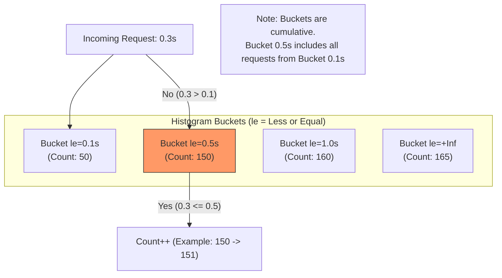
```mermaid
graph TD
    subgraph "Histogram Buckets (le = Less or Equal)"
        B1["Bucket le=0.1s <br/> (Count: 50)"]
        B2["Bucket le=0.5s <br/> (Count: 150)"]
        B3["Bucket le=1.0s <br/> (Count: 160)"]
        B_Inf["Bucket le=+Inf <br/> (Count: 165)"]
    end
    
    Req[Incoming Request: 0.3s] --> B1
    Req -- "No (0.3 > 0.1)" --> B2
    
    B2 -- "Yes (0.3 <= 0.5)" --> Increment["Count++ (Example: 150 -> 151)"]
    
    Note["Note: Buckets are cumulative.<br/>Bucket 0.5s includes all requests from Bucket 0.1s"]
    
    style B2 fill:#f96,stroke:#333
```

#### E. Strategy: What to Measure? (RED vs USE)
Не собирайте все подряд. Используйте стандартные методики.

|**Methodology**|**Target**|**Metrics to Collect**|
|---|---|---|
|**USE Method**|**Infrastructure**<br><br>  <br><br>(Node, CPU, Disk, Queue)|1. **Utilization:** % времени занятости (CPU Usage).<br><br>  <br><br>2. **Saturation:** Длина очереди (Load Average, Disk Queue).<br><br>  <br><br>3. **Errors:** Ошибки оборудования (Disk I/O Errors).|
|**RED Method**|**Services**<br><br>  <br><br>(Microservices, API)|1. **Rate:** Количество запросов в секунду (RPS).<br><br>  <br><br>2. **Errors:** Процент ошибочных запросов (5xx).<br><br>  <br><br>3. **Duration:** Длительность обработки (P50, P99).|

> [!tip] Совет Архитектора
> 
> Если вы вынуждены использовать "грязные" метрики (с высокой кардинальностью) для дебага, используйте **Retention Policy**.
> 
> - Настройте Prometheus так, чтобы удалять такие метрики через 24 часа.
>     
> - Или используйте **Logs** для детальных данных, а **Metrics** — только для агрегированных сигналов тревоги.
>
### 1.2. Logs (Discrete Events)

> [!abstract] Философия "Иголки в стоге сена"
> **Лог** — это неизменяемая запись о дискретном событии, произошедшем в конкретный момент времени.
>
> **Суперсила:** Бесконечная Кардинальность (Infinite Cardinality).
> В отличие от метрик, в логах можно и нужно сохранять данные с высокой уникальностью: `User ID`, `Request Body`, `Stack Trace`, `IP Address`.
>
> **Цена:** Логи — это самый дорогой тип телеметрии. Они занимают терабайты места и требуют огромных вычислительных мощностей для поиска.
> *Задача архитектора:* Максимизировать контекст, минимизируя объем.
#### A. The Evolution: From Grep to JSON (Structured Logging)
В 2026 году неструктурированные логи считаются техническим долгом.

**1. Unstructured (Legacy)**
`2026-05-20 12:00:00 [ERROR] Failed to process order 555: connection refused`
* **Проблема:** Чтобы понять, "сколько ошибок connection refused было у пользователя 555", вам нужно писать сложные регулярные выражения (Grok patterns). Это медленно и хрупко.
* **Парадигма:** Schema-on-Read (мы пытаемся придать структуру данным *во время чтения*).

**2. Structured (The Standard)**
Мы пишем логи как сериализованные объекты (JSON).
```json
{
  "ts": "2026-05-20T12:00:00Z",
  "level": "error",
  "app": "payment-service",
  "event": "order_processing_failed",
  "order_id": "555",
  "user_id": "u-987",
  "error_kind": "network_timeout",
  "trace_id": "a1b2c3d4e5f6", 
  "duration_ms": 154
}
```
- **Преимущество:** Данные уже структурированы. Мы можем делать SQL-like аналитику: `SELECT count(*) FROM logs WHERE error_kind = 'network_timeout' GROUP BY user_id`
- **Парадигма:** Schema-on-Write (мы задаем структуру _во время записи_).
#### B. Modern Pattern: The "Canonical Log Line" (Wide Events)
Классическая ошибка — "болтливое" логирование (Chatty Logging).
**Bad Practice (Chatty):**
1. `"Starting request processing..."`
2. `"User validated."`
3. `"Order created in DB."`
4. `"Payment charged."`
5. `"Request finished."`

- **Минус:** 5 записей на 1 запрос. Умножьте на 10k RPS. Вы платите за хранение "воды".

**Best Practice (Canonical / Wide Event):** Мы собираем контекст в памяти во время выполнения запроса и пишем **ОДНУ** "жирную" запись в конце.

```JSON
{
  "event": "request_completed",
  "path": "/api/buy",
  "status": 200,
  "user_id": "u-987",
  "steps_completed": ["auth", "db", "stripe"],
  "db_latency_ms": 5,
  "stripe_latency_ms": 150,
  "total_latency_ms": 160
}
```
- **Результат:** Экономия места в 5 раз. Мгновенная корреляция (все данные в одной строке).
#### C. Storage Economics: Indexing Strategies (Loki vs. Elastic)
Как искать по терабайтам логов, не разорившись на серверах? Есть два подхода.
**1. Full-Text Indexing (Elasticsearch, Splunk)**
- **Механизм:** Inverted Index. Каждое слово (`"u-987"`, `"timeout"`) попадает в индекс.
- **Плюс:** Мгновенный поиск по любому слову.
- **Минус:** Индекс занимает столько же места, сколько и сами логи (x2 Storage). Требует много оперативной памяти (RAM) для поддержки индексов. Очень дорого.

**2. Label-Based Indexing (Grafana Loki - The Cloud Native Way)**
- **Механизм:** Индексируются только метаданные (лейблы): `app="payment"`, `env="prod"`. Текст лога сжимается в чанки и кладется в дешевое S3-хранилище.
- **Поиск:** Работает как `grep` в облаке. Вы выбираете поток по лейблам, а внутри потока ищете перебором (Brute Force).
- **Плюс:** Экстремально дешево (хранение на S3 копейки). Индекс крошечный.
- **Минус:** Медленный поиск, если вы не сузили выборку по времени или лейблам.
#### D. The Security Trap: PII & Toxic Data
Логи — главный источник утечек данных. Разработчики любят делать `logger.Info("Request payload", request.Body)`.

> [!danger] Toxic Logging Никогда не логируйте:
> 
> 1. **PII:** Email, Телефоны, Паспортные данные.
>     
> 2. **Secrets:** API Keys, Passwords, Tokens.
>     
> 3. **PCI DSS:** Номера кредитных карт.
>     
> 
> **Решение:** Используйте "Redaction" (Маскирование) на уровне логгера или OTel Collector. `"password": "***"` вместо `"password": "hunter2"`
#### E. Visualization: The Indexing Trade-off (Mermaid)

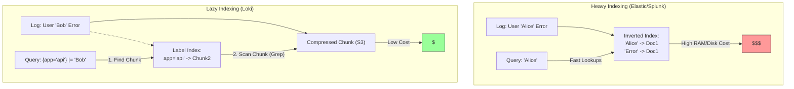
```mermaid
graph TD
    subgraph "Heavy Indexing (Elastic/Splunk)"
        Log1["Log: User 'Alice' Error"]
        Index1["Inverted Index: <br/> 'Alice' -> Doc1 <br/> 'Error' -> Doc1"]
        Query1["Query: 'Alice'"]
        
        Log1 --> Index1
        Query1 -- "Fast Lookups" --> Index1
        Index1 -- "High RAM/Disk Cost" --> Cost1[$$$]
    end

    subgraph "Lazy Indexing (Loki)"
        Log2["Log: User 'Bob' Error"]
        Meta2["Label Index: <br/> app='api' -> Chunk2"]
        Chunk2["Compressed Chunk (S3)"]
        Query2["Query: {app='api'} |= 'Bob'"]
        
        Log2 --> Chunk2
        Log2 -.-> Meta2
        Query2 -- "1. Find Chunk" --> Meta2
        Meta2 -- "2. Scan Chunk (Grep)" --> Chunk2
        Chunk2 -- "Low Cost" --> Cost2[$]
    end
    
    style Cost1 fill:#f99,stroke:#333
    style Cost2 fill:#9f9,stroke:#333
```

> [!tip] Совет Архитектора **Logs are for debugging, not for alerting.** Не стройте алерты на логах (например: "Если в логах 5 раз встретилось слово Error"). Это медленно и ненадежно.
> 
> - Используйте **Метрики** для алертинга ("RPS ошибок вырос").
>     
> - Используйте **Логи** для расследования ("Какого черта RPS вырос? А, это User 123 шлет битый JSON").
>
### 1.3. Tracing (Request Scoped Flow)

> [!abstract] Философия "Казуальности" (Причинно-следственной связи)
> **Distributed Tracing** — это метод отслеживания жизненного цикла одного запроса (Transaction), который проходит через множество микросервисов, баз данных и очередей.
>
> Если Метрики отвечают на вопрос *"Что происходит?"*, а Логи — *"Почему?"*, то Трейсинг отвечает на вопросы:
> 1.  **Where?** Где именно запрос провел 90% времени?
> 2.  **Who?** Кто вызвал кого? (Dependency Graph).
> 3.  **Parallelism:** Какие операции выполнялись последовательно (Serial), а какие — параллельно?
#### A. The Data Structure: DAG (Directed Acyclic Graph)
Трейс — это не просто список событий. Это дерево.

1.  **Trace (Трейс):** Корневой объект. Представляет собой **весь путь** запроса от клика пользователя до ответа.
    * Идентифицируется уникальным 128-битным `TraceID`.
2.  **Span (Спан):** Единый логический шаг работы.
    * Например: `HTTP GET /api/user`, `SQL SELECT users`, `Redis GET`.
    * Содержит: `SpanID`, `ParentSpanID`, `StartTime`, `Duration`, `Attributes` (Tags).
3.  **Parent-Child Relationship:**
    * Если Сервис А вызывает Сервис Б, то Спан А становится "Родителем" (Parent) для Спана Б.
    * Это позволяет построить иерархию.

#### B. The Magic: Context Propagation (W3C Trace Context)
Как сервис Б узнает, что он — часть трейса, начатого сервисом А?
Через "магию" передачи заголовков.

В 2026 году стандартом является **W3C Trace Context**.
Заголовок `traceparent` передается в каждом HTTP/gRPC запросе.

**Формат заголовка:**
`traceparent: 00-4bf92f3577b34da6a3ce929d0e0e4736-00f067aa0ba902b7-01`

* `version`: `00`
* `trace-id`: `4bf9...4736` (Глобальный ID транзакции).
* `parent-id`: `00f0...02b7` (ID спана, который вызвал этот запрос).
* `trace-flags`: `01` (Флаг сэмплирования: "Запиши меня!").

> [!tip] Baggage (Багаж)
> Кроме ID, мы можем передавать **Baggage**. Это пользовательские метаданные, которые "путешествуют" вместе с запросом через все сервисы.
> *Пример:* `baggage: userId=123, cluster=prod-eu`
> Сервис Z (глубоко внизу) может прочитать `userId` из багажа, даже если Сервис A (наверху) не передавал его явно в теле запроса.

#### C. Visualizing Time: The Waterfall View
Самая ценная часть трейсинга — визуализация времени. Она показывает **Gap Analysis** (пустоты).

Если вы видите, что между концом `Span A` и началом `Span B` есть дыра в 50мс — это **Network Latency** или время на сериализацию JSON.


```mermaid
gantt
    title Trace_Waterfall_Visualization
    dateFormat X
    axisFormat %s ms

    section Gateway
    POST_Checkout       :active, 0, 450
    
    section Order_Svc
    Validation_Logic    :crit, 10, 50
    Inventory_gRPC      :active, 50, 200
    Payment_REST        :active, 200, 400
    
    section Inventory_DB
    SQL_Select_Items    :100, 180
    
    section Stripe_API
    Charge_Card         :210, 390
    
    section Async_Worker
    Kafka_Send_Email    :410, 420
```
- **Critical Path:** В этом примере `Stripe API Call` (180ms) — это самый длинный блокирующий вызов. Оптимизация SQL (80ms) даст меньший эффект.
#### D. Span Attributes (Semantic Conventions)
OpenTelemetry диктует стандарты того, что писать внутри спана (Tags). Не пишите `tag: "hello"`. Используйте семантические конвенции:
- **Database:** `db.system="postgresql"`, `db.statement="SELECT * FROM users"`.
- **HTTP:** `http.method="POST"`, `http.status_code=200`, `http.route="/api/checkout"`.
- **Exception:** Если спан упал, добавьте событие `exception` со стектрейсом.
#### E. The Cost Problem: Sampling Strategies
Трейсинг генерирует **огромный** объем данных. Один HTTP-запрос может породить 50 спанов. Сохранять 100% трейсов (Total Capture) невозможно для High-Load.
1. **Head-Based Sampling (Вероятностное):**
    - Решение принимается в **начале** пути (Root Span).
    - _"Бросаем монетку: сохраняем 1% трейсов"_.
    - _Плюс:_ Дешево. Никакой нагрузки на сеть передачи данных.
    - _Минус:_ Вы почти гарантированно пропустите редкие ошибки. (Если ошибка случается 1 раз на 1000, в 1% сэмпле она вряд ли окажется).
        
2. **Tail-Based Sampling (Интеллектуальное):**
    - Все спаны собираются в буфере (OTel Collector).
    - Решение принимается, когда трейс **завершен**.
    - _Правило:_ "Если был статус 500 ИЛИ длительность > 2 сек — СОХРАНИТЬ. Иначе — сохранить 1%".
    - _Плюс:_ Вы видите **все** ошибки и аномалии.
    - _Минус:_ Требует много RAM на коллекторе для буферизации.

#### F. Visualization: The Trace Tree (Mermaid)

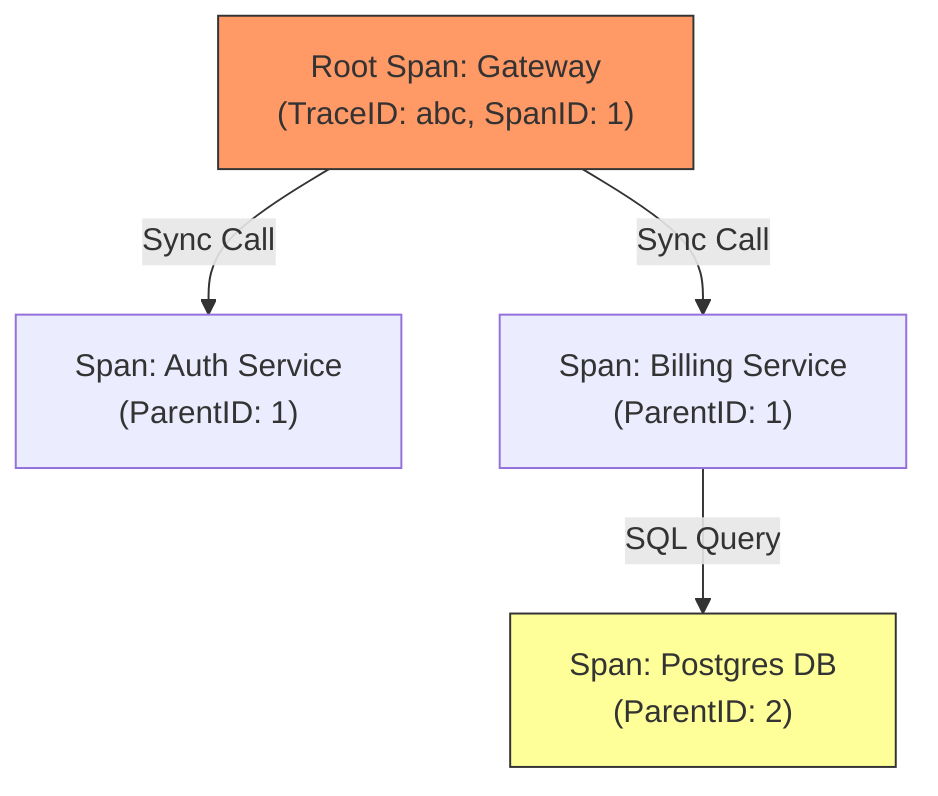
```mermaid
graph TD
    Root["Root Span: Gateway <br/> (TraceID: abc, SpanID: 1)"]
    Child1["Span: Auth Service <br/> (ParentID: 1)"]
    Child2["Span: Billing Service <br/> (ParentID: 1)"]
    Child3["Span: Postgres DB <br/> (ParentID: 2)"]
    
    Root -->|Sync Call| Child1
    Root -->|Sync Call| Child2
    Child2 -->|SQL Query| Child3
    
    style Root fill:#f96,stroke:#333
    style Child3 fill:#ff9,stroke:#333
```

> [!check] Архитектурный Вердикт
> 
> 1. **Инструментация:** Не пишите трейсинг руками. Используйте **OpenTelemetry Auto-Instrumentation** агенты (Java, Python, Node.js, Go). Они сами патчат библиотеки и прокидывают контекст.
>     
> 2. **Async Boundaries:** Убедитесь, что `traceparent` передается через Kafka/RabbitMQ заголовки. Иначе ваш трейс "разорвется" на две части (Producer Trace и Consumer Trace), и вы потеряете картину.
>     
> 3. **Не трейсите всё:** Не создавайте спан на каждую функцию `calculate_sum()`. Трейсите только **I/O операции** (Сеть, Диск, БД).
>
#### The Waterfall Visualization
Трейсинг позволяет увидеть "Водопад" выполнения.


```mermaid
gantt
    title Trace ID: a1b2c3d4 (Total: 500ms)
    dateFormat  X
    axisFormat %s ms

    section Frontend
    Handle Request     :active, 0, 500
    
    section Auth Svc
    Check JWT          :crit, 10, 50
    
    section Backend API
    Process Logic      :active, 60, 450
    
    section Database
    SQL Query (User)   :100, 200
    SQL Query (Orders) :250, 400
```
_Если бы у вас были только логи, вы бы увидели 5 записей, но не поняли бы, что `SQL Query (Orders)` ждал завершения `SQL Query (User)` (последовательно), а не выполнялся параллельно._
### 1.4. Continuous Profiling: The Code Microscope (The 4th Pillar)

> [!abstract] Философия "Белого Ящика"
> Метрики, Логи и Трейсы рассматривают сервис как "Черный ящик" (Black Box). Они измеряют входы и выходы.
>
> **Profiling** вскрывает этот ящик.
> Он отвечает на вопрос: *"Почему функция `ProcessImage` длилась 500мс? Это был цикл `for`, хеширование MD5 или ожидание блокировки (Mutex Contention)?"*
>
> **Continuous Profiling (CP)** — это постоянный, низкозатратный сбор профилей (CPU/Memory) со **всех** подов в продакшене.
> Раньше профайлеры включали только во время инцидентов ("Stop-the-world"). Сейчас они работают 24/7.
#### A. The Technology: eBPF & Zero Instrumentation
В 2026 году мы больше не подключаем тяжелые Java-агенты или Python-модули, которые замедляют приложение на 20%. Мы используем **eBPF**.

* **Как это работает:**
    * В ядро Linux загружается микро-программа (eBPF probe).
    * Она просыпается 100 раз в секунду (100Hz).
    * Она смотрит на **Instruction Pointer** процессора и раскручивает стек вызовов (Stack Unwinding).
    * Это происходит вне памяти приложения (Kernel Space).
* **Результат:** Вы получаете профиль любого процесса (Go, Rust, Java, Python, C++) с оверхедом **менее 1% CPU**. Разработчикам даже не нужно менять код.

#### B. The Visualization: Flame Graphs (Графики пламени)
Единственный способ понять профайлинг — научиться читать Flame Graph.

* **Ось X (Ширина):** Доля ресурсов (CPU Time или RAM Allocations). Чем шире "брусок", тем больше ресурсов он потребляет.
* **Ось Y (Высота):** Глубина стека вызовов.
    * `main()` -> `handler()` -> `logic()` -> `compress()`.
* **Анализ:** Мы ищем самые широкие "плато" на вершине графа. Это функции, которые работают долго и никого не вызывают (Leaf Nodes). Это и есть "горячие точки".

#### C. Profile Types (Что мы измеряем?)
Не путайте потребление памяти с утечками.

1.  **CPU Profiling:**
    * *Вопрос:* На каких строках кода процессор тратит такты?
    * *Кейс:* Вы видите, что 40% времени уходит на `json.Unmarshal`. Решение: сменить библиотеку JSON.
2.  **Memory Allocations (Alloc objects/space):**
    * *Вопрос:* Где создается мусор (Garbage)?
    * *Кейс:* Функция создает миллион временных строк. GC (сборщик мусора) сходит с ума, пытаясь их очистить. CPU горит, хотя логика простая.
3.  **Memory In-Use (Heap):**
    * *Вопрос:* Где утечка памяти? Кто держит объекты и не отпускает?
4.  **Lock/Mutex Contention:**
    * *Вопрос:* Почему CPU простаивает (0%), а приложение тормозит?
    * *Ответ:* 50 горутин дерутся за один мьютекс (`sync.Mutex`). Профайлинг покажет, где именно эта очередь.

#### D. Correlation: Trace ↔ Profile
Это Святой Грааль Observability 2026 года.

1.  Вы смотрите **Трейс** в Jaeger. Видите спан длиной 5 секунд.
2.  Вы нажимаете кнопку **"Show Profile for this Span"**.
3.  Система (например, Grafana Phlare или Pyroscope) фильтрует данные профилировщика строго за этот интервал времени (Start Time -> End Time) и строго для этого пода.
4.  Вы видите Flame Graph именно этих 5 секунд.

#### E. Architecture: Pull vs Push (Pyroscope / Parca)
Как хранить эти гигабайты данных?

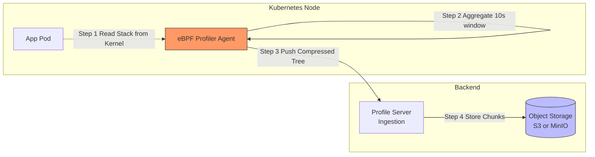
```mermaid
graph LR
    subgraph "Kubernetes Node"
        App["App Pod"]
        Agent["eBPF Profiler Agent"]
    end
    
    subgraph "Backend"
        Server["Profile Server <br/> Ingestion"]
        S3[("Object Storage <br/> S3 or MinIO")]
    end
    
    App -. "Step 1 Read Stack from Kernel" .-> Agent
    Agent -- "Step 2 Aggregate 10s window" --> Agent
    Agent -- "Step 3 Push Compressed Tree" --> Server
    Server -- "Step 4 Store Chunks" --> S3
    
    style Agent fill:#f96,stroke:#333
    style S3 fill:#bbf,stroke:#333
```
- **Deduplication:** Профайлинг генерирует много одинаковых стеков. Агенты агрегируют их локально перед отправкой. Сжатие достигает 100x. Хранить профайлы дешевле, чем трейсы.
#### F. Comparison with Other Pillars

| **Feature**  | **Metrics**   | **Tracing**         | **Continuous Profiling**      |
| ------------ | ------------- | ------------------- | ----------------------------- |
| **Unit**     | Число (Count) | Время (Duration)    | Ресурс (CPU Cycles/Bytes)     |
| **Depth**    | Service Level | Function Level      | Line-of-Code Level            |
| **Overhead** | ~0%           | High (network/disk) | Low (<1% CPU via eBPF)        |
| **Use Case** | Alerting      | Latency Analysis    | Optimization / Cost Reduction |

> [!check] Архитектурный Вердикт
> 
> **Continuous Profiling окупает себя мгновенно.**
> 
> _Пример из практики:_ Мы подключили Pyroscope и увидели, что 30% CPU на всех серверах тратится на бесполезную компрессию логов внутри библиотеки, которую мы забыли отключить.
> 
> **Исправление:** 1 строка конфига.
> 
> **Результат:** -30% к счету за облачные сервера (EC2).
> 
> Если у вас больше 50 подов — **Continuous Profiling обязателен**.
### 1.5. Summary Matrix: Choosing the Right Tool

> [!abstract] Эволюция Инструментария
> Мы переходим от вопроса *"Что сломалось?"* к вопросу *"Как сэкономить на облаке и починить быстрее?"*.
>
> * **Метрики** запускают тревогу (Alerting).
> * **Трейсы** сужают круг подозреваемых сервисов (Isolation).
> * **Логи** дают контекст ошибки (Context).
> * **Профайлинг** указывает на конкретную строку кода (Root Cause).

#### A. The Ultimate Comparison Table
Эта таблица поможет выбрать правильный инструмент для правильной задачи.

| Feature | 1. Metrics (Prometheus) | 2. Logs (Loki/Elastic) | 3. Traces (Jaeger/Tempo) | 4. Profiling (Pyroscope) |
| :--- | :--- | :--- | :--- | :--- |
| **Главный вопрос** | *"Is system healthy?"* (Здоровье) | *"Why event happened?"* (Событие) | *"Where is the latency?"* (Поток) | *"What resource is consumed?"* (Код) |
| **Единица данных** | Aggregated Point (Число) | Event (Текст/JSON) | Span (Интервал времени) | Stack Trace (Дерево вызовов) |
| **Cardinality** | 🟢 **Low** (Limited dims) | 🔴 **Infinite** (User IDs) | 🟡 **High** (Transaction IDs) | 🟡 **High** (Function Names) |
| **Storage Cost** | 🟢 **Low** (Highly compressed) | 🔴 **Very High** (Huge volume) | 🔴 **High** (If not sampled) | 🟢 **Low/Medium** (Deduped trees) |
| **Overhead** | ~0% (Counters) | Low (I/O Write) | Medium (Context propagation) | Low (<1% eBPF) |
| **Primary Use** | **Detection** (Dashboarding) | **Forensics** (Debugging) | **Dependency Analysis** | **Optimization** (Cost Reduction) |
| **Retention** | Годы (Trends) | Дни/Недели | Дни (3-7 days) | Недели (для сравнения релизов) |
#### B. The Troubleshooting Workflow (Algorithm)
Как эти инструменты работают вместе во время инцидента?
1.  **Detect (Metrics):** Алерт в Slack: `High Latency (P99 > 2s) on Billing Service`.
2.  **Isolate (Traces):** Открываем Jaeger. Видим, что `Billing` тормозит, потому что ждет ответа от `Tax-Service`.
3.  **Diagnose (Logs/Profiling):**
    * *Вариант А (Ошибка):* Идем в Логи `Tax-Service`. Видим `Connection Timeout to DB`. -> **Решение: Чиним БД.**
    * *Вариант Б (Тормоза):* В Логах чисто. Идем в Profiling `Tax-Service` за этот период. Видим, что функция `CalculateVAT` делает RegEx компиляцию в цикле. -> **Решение: Оптимизируем код.**

#### C. Data Volume vs. Business Value
График ниже показывает, почему нельзя полагаться только на Логи.
* **Logs:** Дают 100% деталей, но занимают 80% бюджета Observability.
* **Metrics:** Занимают 1% бюджета, но дают 80% оперативной информации.
* **Profiling:** Занимает 5% бюджета, но может уменьшить ваш счет за AWS на 30% (найдя утечки ресурсов).

#### D. Integration Patterns (Correlation is King)
Сила не в инструментах, а в связях между ними.
1.  **Metrics → Traces (Exemplars):**
    * На графике RPS (Метрика) есть точки. Клик по точке открывает Трейс конкретного медленного запроса.
2.  **Traces → Logs (TraceID):**
    * В интерфейсе Трейса вы нажимаете "Show Logs" и видите только логи, относящиеся к этому `trace_id`.
3.  **Traces → Profiles (Time Window):**
    * В интерфейсе Трейса (спан длительностью 5с) вы нажимаете "Show Flamegraph". Система показывает профиль CPU именно этого пода за эти 5 секунд.

#### E. Visualization: The Incident Funnel (Mermaid)

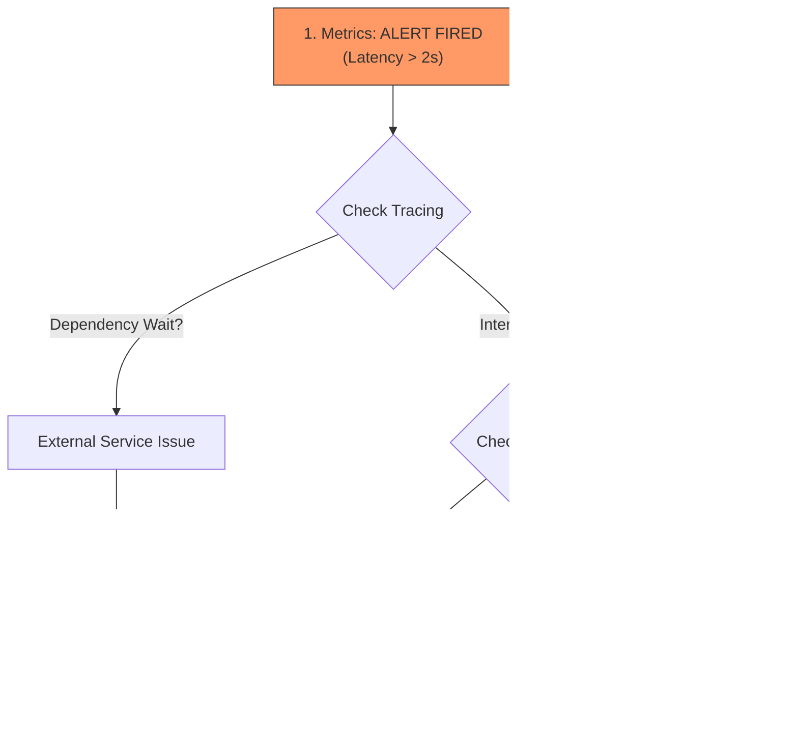
```mermaid
graph TD
    Alert["1. Metrics: ALERT FIRED <br/> (Latency > 2s)"]
    
    Alert --> CheckTrace{Check Tracing}
    
    CheckTrace -- "Dependency Wait?" --> ExtDep["External Service Issue"]
    CheckTrace -- "Internal Slow?" --> CodeIssue{Check Profiling}
    
    ExtDep --> CheckLogs["2. Logs: Check Errors"]
    CheckLogs --> RootCause1([Root Cause: Network/DB])
    
    CodeIssue -- "High CPU?" --> Flame["3. Profiling: Flame Graph"]
    Flame --> RootCause2([Root Cause: Bad Algorithm])
    
    CodeIssue -- "Wait/Lock?" --> Mutex["3. Profiling: Mutex View"]
    Mutex --> RootCause3([Root Cause: Deadlock])
    
    style Alert fill:#f96,stroke:#333
    style RootCause2 fill:#9f9,stroke:#333
    style RootCause3 fill:#9f9,stroke:#333
```

> [!check] Архитектурный Вердикт Если бюджет ограничен:
> 
> 1. **Must Have:** Метрики (Prometheus) — чтобы знать, что вы упали.
>     
> 2. **Must Have:** Структурированные Логи (Loki) — чтобы знать, почему.
>     
> 3. **Should Have:** Профайлинг (Pyroscope) — чтобы не платить за сервера лишнее.
>     
> 4. **Nice to Have:** Трейсинг (Tempo) — внедряйте, когда микросервисов станет больше 5-7 штук. До этого момента трейсинг часто (но не всегда) является "Overkill".
>

---
## 2. The Holy Grail: Correlation (Linking the Pillars)

> [!abstract] Конец "Swivel-Chair Integration"
> В прошлом инженеры занимались "Интеграцией на вращающемся стуле":
> 1.  Увидели пик на графике в Grafana.
> 2.  Повернулись, открыли Kibana, скопировали timestamp, начали грепать логи.
> 3.  Повернулись, открыли Jaeger, начали искать трейс.
>
> **Correlation (Корреляция)** — это технология автоматического связывания данных.
>
> **Формула 2026 года:**
> $$Context = (TraceID + SpanID + ResourceLabels + TimeWindow)$$
> Если все 4 столпа (Metrics, Logs, Traces, Profiles) разделяют этот контекст, вы можете мгновенно прыгать от "Алерта" к "Строке кода".
### 2.1. Mechanism 1: Trace Context in Logs (Logs ↔ Traces)

> [!abstract] Проблема "Слепоты Конкурентности"
> В высоконагруженной системе (10k RPS) в одну секунду в лог падает 10,000 записей от разных пользователей.
> * **Без контекста:** Это просто каша. Вы видите ошибку `DB Timeout`, но не знаете, чей это запрос.
> * **С контекстом:** Каждая строка лога, каждая метрика и (в идеале) каждый сэмпл профилировщика помечены уникальным идентификатором.
>
> **Universal Context Schema:**
> $$Context = \{ TraceID, SpanID, ServiceName, PodName, BuildID \}$$

#### A. The Implementation: Structured Log Injection
В 2026 году мы не пишем `logger.info("TraceID: " + id)`. Это делает **Middleware** автоматически.

**Как это работает (Go/Java Pattern):**
1.  **Incoming Request:** Load Balancer создает `TraceID`.
2.  **Thread Local / Context:** Middleware кладет этот ID в локальное хранилище потока (MDC в Java) или `context.Context` (в Go).
3.  **Logger Hook:** Логгер при *каждой* записи проверяет контекст. Если там есть ID, он добавляет их в JSON-вывод.

**Пример (Canonical Log Line):**
```json
{
  "ts": "2026-02-02T12:00:00Z",
  "level": "error",
  "msg": "Payment gateway rejected transaction",
  "error_code": "insufficient_funds",
  
  // --- The Glue (Context) ---
  "service": "billing-svc",     // 1. Для связи с Metrics
  "pod": "billing-v2-xyz",      // 2. Для связи с Kubernetes
  "trace_id": "a1b2c3d4e5f6...",// 3. Ссылка на Trace (Jaeger)
  "span_id": "12345678...",     // 4. Ссылка на Span
  "profiling_label": "checkout" // 5. Ссылка на Profiling Tag
}
```
#### B. The Profiling Connection (Logs ↔ Profiling)
Раньше Профайлинг (CPU/Memory) жил отдельно. Теперь мы связываем его с логами через **Resource Attributes** и **Time Windows**.
- **Проблема:** Профайлер (eBPF) работает на уровне ядра и часто не видит `TraceID` каждого запроса (так как сэмплирует стек 100 раз в секунду, а не на каждый запрос).
- **Решение 2026 (Labels + Time):**
    1. В логе ошибки вы видите: `ts=12:00:05`, `pod=billing-v2-xyz`.
    2. Вы нажимаете кнопку "Show CPU Profile".
    3. UI делает запрос в Pyroscope/Phlare:
        - _"Дай мне Flame Graph для пода `billing-v2-xyz` в окне `12:00:04 - 12:00:06`"_.
    4. Вы видите, что в эту секунду CPU был занят функцией `gzip.Compress`.

> [!tip] pprof Labels (Advanced) В Go и Java можно вешать лейблы прямо на горутины/потоки для профайлера. `pprof.Do(ctx, pprof.Labels("trace_id", traceID), func(_ context.Context) { ... })` Это позволяет видеть `trace_id` прямо внутри Flame Graph! Но это добавляет оверхед, используйте осторожно.
#### C. The Standardization: W3C Trace Context
Не изобретайте свои заголовки (`X-Request-ID` — устарело). Используйте стандарт **W3C**.
- `traceparent`: Содержит TraceID и ParentSpanID.
- `tracestate`: Дополнительные данные вендора (например, Tenant ID).

Если ваши логи, трейсы и профайлы используют одни и те же ID из W3C заголовка, корреляция происходит "из коробки" в системах типа Grafana Enterprise или Datadog.
#### D. Visualization: The Injection Flow (Mermaid)
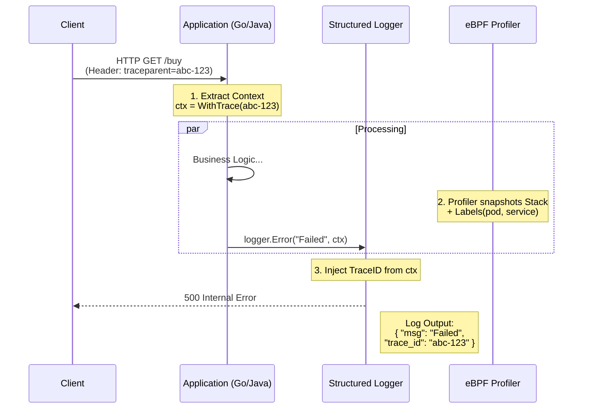
```mermaid
sequenceDiagram
    participant Client
    participant App as Application (Go/Java)
    participant Logger as Structured Logger
    participant Profiler as eBPF Profiler

    Client->>App: HTTP GET /buy <br/> (Header: traceparent=abc-123)
    
    Note over App: 1. Extract Context <br/> ctx = WithTrace(abc-123)
    
    par Processing
        App->>App: Business Logic...
        
        Note over Profiler: 2. Profiler snapshots Stack <br/> + Labels(pod, service)
        
        App->>Logger: logger.Error("Failed", ctx)
    end
    
    Note over Logger: 3. Inject TraceID from ctx
    Logger-->>Client: 500 Internal Error
    
    Note right of Logger: Log Output: <br/> { "msg": "Failed", <br/> "trace_id": "abc-123" }
```

> [!check] Архитектурный Вердикт
> 
> 1. **JSON Required:** Если вы пишете логи текстом, вы теряете возможность автоматической корреляции.
>     
> 2. **Middleware is Key:** Никогда не полагайтесь на то, что разработчик вручную добавит ID. Это должно быть скрыто в библиотеке (`interceptor`).
>     
> 3. **Consistency:** Имя сервиса в логах (`service="billing"`) должно быть **побайтово идентично** имени сервиса в профайлере и метриках. Иначе кнопка "Jump to Profile" не сработает.
>

### 2.2. Mechanism 2: Exemplars (Metrics ↔ Traces)

> [!abstract] Философия "Иголки в стоге сена"
> **Метрики** говорят: *"В ведре 'медленные запросы' лежит 1000 камней"*.
> **Exemplars (Экземпляры)** говорят: *"Вот один из этих камней. На нем написано `TraceID=abc-123`. Посмотри на него, остальные 999 такие же"*.
>
> **Exemplar** — это метаданные (обычно `TraceID` и `SpanID`), прикрепленные к конкретному наблюдению в гистограмме.
>
> **Цель:** Обеспечить "Прыжок №1" (Metric $\to$ Trace), который делает возможным "Прыжок №2" (Trace $\to$ Code Profile).
#### A. The Technical Problem (Disconnected Data)
Представьте, вы смотрите на график `P99 Latency` в Grafana.
* Вы видите пик: задержка подскочила с 0.1с до 5.0с.
* **Вопрос:** *Какой именно* запрос вызвал этот пик?
* **Старый метод:** Идем в Jaeger, выбираем сервис, ставим фильтр `min_duration=4.9s`, ищем вручную.
* **Новый метод (Exemplars):** Prometheus хранит ссылку на конкретный TraceID прямо внутри временного ряда.

#### B. The Data Structure (OpenMetrics Standard)
Технически Экземпляр — это дополнение к строке метрики.

```text
# HELP http_request_duration_seconds A histogram of latency.
# TYPE http_request_duration_seconds histogram
http_request_duration_seconds_bucket{le="10.0"} 500 # {trace_id="a1b2", span_id="c3d4"} 5.2
```
- `http_..._bucket{le="10.0"} 500`: Значение метрики (Counter). "В этом ведре 500 запросов".
- `#`: Разделитель.
- `{trace_id="a1b2", span_id="c3d4"}`: **Labels экземпляра**.
- `5.2`: **Значение экземпляра**. Точная длительность _этого конкретного_ запроса, который увеличил счетчик.

#### C. The "Three-Jump" Workflow (Metrics $\to$ Code)
Как Экземпляры открывают доступ к Continuous Profiling?
1. **Jump 1: The Alert (Metric $\to$ Trace)**
    - На дашборде вы видите точки поверх графика ("звезды").
    - Наводите курсор $\to$ видите `trace_id`.
    - Клик $\to$ открывается Jaeger/Tempo с этим трейсом.
2. **Jump 2: The Context (Trace $\to$ Metadata)**
    - Внутри Трейса вы видите: _"Запрос обрабатывался на поде `pod-xyz` в интервале `12:00:00 - 12:00:05`"_.
    - Трейс дает нам **точные координаты** для поиска профиля.
3. **Jump 3: The Root Cause (Trace $\to$ Profile)**
    - Интерфейс Трейсинга делает запрос в Profiling Backend (Pyroscope):
    - `Query: app="my-app" && pod="pod-xyz" && time_range=(Start, End)`
    - Открывается **Flame Graph**, показывающий, что именно этот под делал в эти 5 секунд.
#### D. Visualization: The Pivot Point (Mermaid)

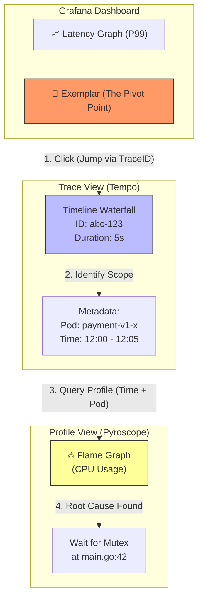
```mermaid
graph TD
    subgraph "Grafana Dashboard"
        MetricLine["📈 Latency Graph (P99)"]
        Dot["🔹 Exemplar (The Pivot Point)"]
        
        MetricLine --- Dot
    end
    
    subgraph "Trace View (Tempo)"
        Trace["Timeline Waterfall <br/> ID: abc-123 <br/> Duration: 5s"]
        Context["Metadata: <br/> Pod: payment-v1-x <br/> Time: 12:00 - 12:05"]
    end
    
    subgraph "Profile View (Pyroscope)"
        Flame["🔥 Flame Graph <br/> (CPU Usage)"]
        Code["Wait for Mutex <br/> at main.go:42"]
    end
    
    Dot -- "1. Click (Jump via TraceID)" --> Trace
    Trace -- "2. Identify Scope" --> Context
    Context -- "3. Query Profile (Time + Pod)" --> Flame
    Flame -- "4. Root Cause Found" --> Code
    
    style Dot fill:#f96,stroke:#333
    style Trace fill:#bbf,stroke:#333
    style Flame fill:#ff9,stroke:#333
```
#### E. Implementation Details & Cost
Вам не нужно писать код для этого. Вам нужна правильная конфигурация.
1. **Instrumentation:**
    - Библиотеки (Java/Go Client) должны поддерживать OpenMetrics.
    - В Prometheus конфиге нужно включить: `enable-feature=exemplar-storage`.
2. **Storage Cost (Memory only):**
    - Экземпляры хранятся **только в оперативной памяти** Prometheus (Circular Buffer).
    - Они _не пишутся_ на диск (в TSDB блоки) для долговременного хранения.
    - Если вы перезагрузите Prometheus, экземпляры исчезнут. Метрики останутся.
    - **Вывод:** Это инструмент оперативного реагирования (Live Debugging), а не исторического анализа.

> [!check] Архитектурный Вердикт
> 
> **Exemplars — это "клей" Observability.**
> 
> Без них Метрики и Трейсы существуют в параллельных вселенных.
> 
> - **Для разработчиков:** Убедитесь, что ваш `OTel SDK` настроен на генерацию экземпляров для гистограмм.
>     
> - **Для DevOps:** Убедитесь, что ваш Datasource в Grafana настроен на связь (Link) по `TraceID`.
>     
> 
> Если у вас есть Экземпляры, вы находите причину медленного запроса за 3 клика. Если нет — за 30 минут поиска "наугад".
### 2.3. Mechanism 3: Context-Aware Profiling (Traces ↔ Profiling)

> [!abstract] Проблема "Шумных Соседей"
> В микросервисе, обрабатывающем 1000 RPS, в любую секунду выполняются сотни функций одновременно.
>
> * **Standard Profiling:** Показывает "среднюю температуру по больнице". Вы видите, что функция `Compress` ест 30% CPU, но не знаете, *кто* её вызвал.
> * **Context-Aware Profiling:** Позволяет задать вопрос: *"Покажи мне Flame Graph только для TraceID `abc-123`"*.
>
> Это "Божественный режим" (God Mode) отладки: вы видите код, исполняемый в рамках одной конкретной транзакции.

#### A. The Correlation Levels (Evolution of Precision)

Мы различаем два уровня точности связывания Трейсов и Профилей.

**Level 1: Time-Based Correlation (Infrastructure)**
Это базовый уровень, доступный "из коробки" с eBPF профайлерами (Parca, Pyroscope).
* **Логика:**
    1.  Trace Span: `Service="Payment"`, `Pod="payment-pod-1"`, `Start=12:00:00`, `End=12:00:05`.
    2.  Query: *"Дай мне все сэмплы CPU с пода `payment-pod-1` в интервале `12:00:00 - 12:00:05`"*.
* **Проблема:** Если под обрабатывал 50 других запросов параллельно, их стеки смешаются в одну кучу. Вы увидите шум.

**Level 2: Label-Based Correlation (The Gold Standard)**
Это продвинутый уровень. Требует поддержки со стороны рантайма (Go 1.18+, Java Flight Recorder).
* **Логика:**
    1.  Приложение (Middleware) вешает метку `trace_id` прямо на **поток ОС** (Thread) или **Горутину** (Goroutine).
    2.  Профайлер (eBPF) считывает эти метки при каждом прерывании.
    3.  Query: *"Дай мне Flame Graph, где `labels.trace_id == abc-123`"*.
* **Результат:** Кристально чистый профиль одного запроса.

#### B. The "Off-CPU" Paradox (Wall Time vs. CPU Time)
Самая частая ошибка новичков — искать причину тормозов в CPU Profiler, когда её там нет.

> [!danger] Wall Time ≠ CPU Time
> * **Scenario:** Запрос длился 5 секунд (Wall Time).
> * **CPU Profile:** Показывает использование CPU всего 10мс.
> * **Где остальные 4.99с?**
>
> Поток спал! Он ждал:
> 1.  Ответа от БД (Network I/O).
> 2.  Освобождения мьютекса (Lock Contention).
> 3.  Записи на диск.
>
> **Решение:** Вам нужен **Off-CPU Profiling** (или Mutex Profiling). Он показывает стеки вызовов, которые *находятся в ожидании*.

#### C. Implementation Example (Go pprof Labels)
Как реализовать Level 2 корреляцию в Go (стандарт де-факто для Cloud Native).

```go
import (
    "context"
    "runtime/pprof"
)

func HandleRequest(w http.ResponseWriter, r *http.Request) {
    // 1. Извлекаем TraceID из заголовков (W3C)
    traceID := r.Header.Get("traceparent")

    // 2. Вешаем лейбл на эту Горутину
    // Теперь любой профиль (CPU, Heap, Mutex), снятый внутри, будет иметь trace_id
    labels := pprof.Labels("trace_id", traceID, "endpoint", r.URL.Path)
    
    pprof.Do(r.Context(), labels, func(ctx context.Context) {
        // 3. Выполняем бизнес-логику
        processBusinessLogic(ctx) 
    })
}
```
Теперь в Grafana Phlare или Pyroscope можно писать запрос: `cpu_profile{trace_id="abc-123"}`.
#### D. Visualization: The Full Picture (Mermaid)
Этот граф показывает, как анализировать "тормозящий" спан, используя оба типа профилирования.

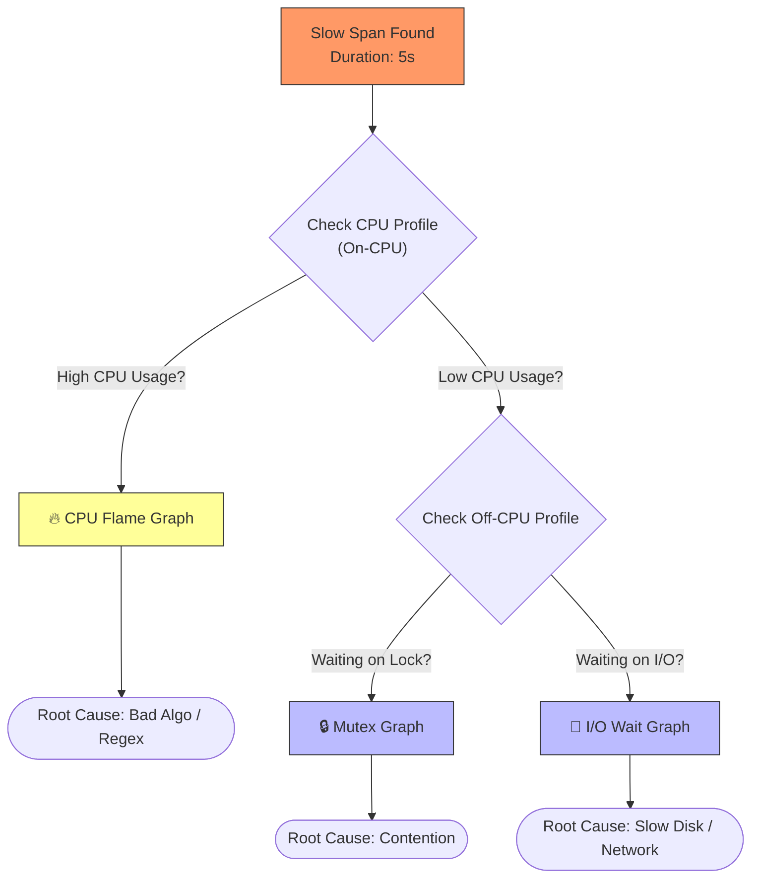
```mermaid
graph TD
    Span["Slow Span Found <br/> Duration: 5s"]
    
    CheckCPU{"Check CPU Profile <br/> (On-CPU)"}
    
    Span --> CheckCPU
    
    CheckCPU -- "High CPU Usage?" --> Flame["🔥 CPU Flame Graph"]
    Flame --> Algorithm(["Root Cause: Bad Algo / Regex"])
    
    CheckCPU -- "Low CPU Usage?" --> CheckWait{"Check Off-CPU Profile"}
    
    CheckWait -- "Waiting on Lock?" --> Mutex["🔒 Mutex Graph"]
    Mutex --> Deadlock(["Root Cause: Contention"])
    
    CheckWait -- "Waiting on I/O?" --> IO["💾 I/O Wait Graph"]
    IO --> Disk(["Root Cause: Slow Disk / Network"])
    
    style Span fill:#f96,stroke:#333
    style Flame fill:#ff9,stroke:#333
    style Mutex fill:#bbf,stroke:#333
    style IO fill:#bbf,stroke:#333
```

#### E. Business Value: "Why do we need this?"
Зачем тратить время инженеров на настройку `pprof labels`?
1. **Cost Reduction:** Вы видите не просто "Java ест память", а "Запрос `/export-report` создает 1GB временных объектов". Вы оптимизируете _конкретный_ эндпоинт и экономите RAM.
2. **MTTR (Mean Time To Resolution):** При дедлоках (Deadlocks) обычные метрики и логи бесполезны (приложение просто "висит"). Только Off-CPU Profiling покажет, в какой строке кода все потоки встали в очередь.

> [!check] Архитектурный Вердикт
> 
> 1. **eBPF — база.** Установите агент (Parca/Pyroscope) на все узлы. Это даст вам Level 1 корреляцию (по времени) "бесплатно" (без изменения кода).
>     
> 2. **Critical Path — Labeling.** Для самых критичных сервисов (Core Banking, Payment Gateway) внедрите `pprof labels` (Level 2). Это позволит разбирать инциденты с хирургической точностью.
>     
> 3. **Не забывайте про Off-CPU.** Тормоза — это чаще _ожидание_, чем _работа_.
>

### 2.4. Integration Map: The "Golden Triangle + 1" (Mermaid)
Визуализация того, как инженер должен двигаться по данным во время инцидента.

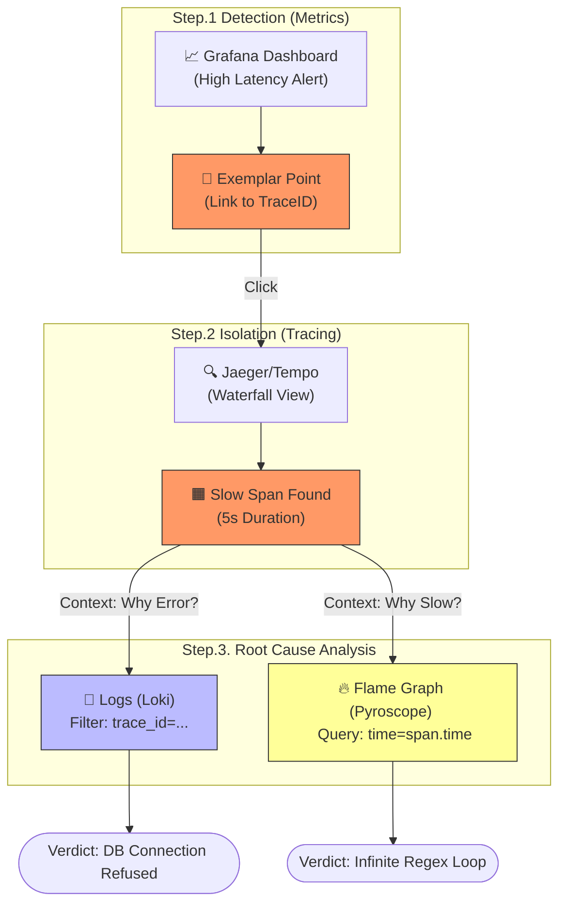
```mermaid
graph TD
    subgraph "Step.1 Detection (Metrics)"
        Dashboard["📈 Grafana Dashboard <br/> (High Latency Alert)"]
        Exemplar["🔹 Exemplar Point <br/> (Link to TraceID)"]
    end
    
    subgraph "Step.2 Isolation (Tracing)"
        TraceView["🔍 Jaeger/Tempo <br/> (Waterfall View)"]
        SlowSpan["🟧 Slow Span Found <br/> (5s Duration)"]
    end
    
    subgraph "Step.3. Root Cause Analysis"
        Logs["📄 Logs (Loki) <br/> Filter: trace_id=..."]
        Profile["🔥 Flame Graph (Pyroscope) <br/> Query: time=span.time"]
    end

    Dashboard --> Exemplar
    Exemplar -- "Click" --> TraceView
    
    TraceView --> SlowSpan
    
    SlowSpan -- "Context: Why Error?" --> Logs
    SlowSpan -- "Context: Why Slow?" --> Profile
    
    Logs --> Conclusion1(["Verdict: DB Connection Refused"])
    Profile --> Conclusion2(["Verdict: Infinite Regex Loop"])
    
    style Exemplar fill:#f96,stroke:#333
    style SlowSpan fill:#f96,stroke:#333
    style Profile fill:#ff9,stroke:#333
    style Logs fill:#bbf,stroke:#333
```
### 2.5. Implementation Checklist (Technical Requirements)
Чтобы эта магия заработала, вы должны настроить инфраструктуру:
1. **Trace Propagation:** Все ваши сервисы (и Load Balancers!) должны поддерживать стандарт `W3C Trace Context`. Если один сервис "съедает" заголовки и не передает их дальше, цепочка рвется.
2. **Shared Labels:**
    - В Prometheus метрика называется `app="payment"`.
    - В Loki лог имеет лейбл `app="payment"`.
    - В Jaeger сервис называется `service.name="payment"`.
    - В Pyroscope профиль имеет лейбл `service_name="payment"`.
    - _Важно:_ Имена должны совпадать **идеально**. Если в метриках `payment-svc`, а в логах `payment` — автоматическая корреляция не сработает.
        
3. **Clock Synchronization (NTP):** Для корреляции Трейсов и Профилей критически важно точное время. Рассинхрон часов на нодах убьет точность профилирования.

> [!tip] Совет Архитектора
> 
> **Начните с Логов и Трейсов.**
> 
> Связка `TraceID` в логах — это "низко висящий фрукт". Это делается за 1 день (настройка Middleware) и дает 80% пользы для дебага ошибок.
> 
> Связка Профилей и Трейсов — это "высший пилотаж", внедряйте это на этапе оптимизации производительности.

---
## 3. Architecture: The OpenTelemetry (OTel) Standard

> [!abstract] The "Vendor-Agnostic" Revolution
> **OpenTelemetry (OTel)** — это не просто библиотека. Это **стандарт** сбора, трансформации и экспорта телеметрии.
>
> Раньше вы были "заложником" вендора: ставили агент Datadog, и он слал данные в проприетарном формате. Чтобы переехать на NewRelic, нужно было переписывать код.
>
> **В 2026 году:**
> 1.  Ваш код (SDK) генерирует данные в формате **OTLP** (OpenTelemetry Protocol).
> 2.  Ваша инфраструктура (Collector) принимает OTLP.
> 3.  Вы можете сменить бэкенд (Prometheus $\to$ VictoriaMetrics, Jaeger $\to$ Tempo) одной строчкой в YAML-конфиге, не трогая код приложений.
>
> **Unified Pipeline:** OTel теперь официально поддерживает 4 сигнала: `Metrics`, `Logs`, `Traces` и `Profiles` (ранее OTEP).

### 3.1. The OTel Collector: The Data Refinery

> [!abstract] Эволюция Роли: От Proxy к ETL
> Раньше (2023) мы использовали разные агенты: `node_exporter` (метрики), `promtail` (логи), `jaeger-agent` (трейсы) и `parca-agent` (профили). Это 4 демона, поедающих CPU.
>
> **В 2026 году OTel Collector заменяет их всех.**
> Это единый бинарник, который умеет:
> 1.  **Принимать** 4 типа сигналов (Metrics, Logs, Traces, Profiles).
> 2.  **Обогащать** их едиными метаданными (K8s Pod Name, Region).
> 3.  **Сжимать** профили (Deduplication) для экономии сети.
> 4.  **Отправлять** в любые бэкенды.
#### A. Anatomy of the Pipeline (Receivers $\to$ Processors $\to$ Exporters)
Конфигурация коллектора строится как конвейер. Данные входят, мутируют и выходят.

| Компонент | Функция | Пример (Metrics/Traces) | Специфика Profiling (2026) |
| :--- | :--- | :--- | :--- |
| **1. Receivers** <br/> (Вход) | Слушают порты или читают файлы/ядро. | `otlp` (gRPC 4317), `prometheus`, `filelog`. | **`ebpf`** (читает стеки ядра), **`pprof`** (pull-модель для Go), `otlp_profiles` (push-модель). |
| **2. Processors** <br/> (Обработка) | Фильтрация, агрегация, удаление PII, добавление тегов. | `batch` (пакетирование), `memory_limiter`, `resourcedetection`. | **`pprof_dedup`** (схлопывание одинаковых стеков), **`symbolizer`** (преобразование адресов `0x4f` в имена функций). |
| **3. Exporters** <br/> (Выход) | Отправка в хранилище или другой коллектор. | `prometheusremotewrite`, `loki`, `otlp` (Tempo/Jaeger). | **`otlphttp`** (в Grafana Phlare/Pyroscope), `kafka` (для буферизации тяжелых профилей). |
#### B. The Critical Processor: Resource Detection
Почему в 2026 году это самый важный компонент?
Потому что **Корреляция** невозможна без единых тегов.

* **Проблема:**
    * Метрики приходят с тегом `instance="10.0.0.1:8080"`.
    * Профили (eBPF) приходят с тегом `host="node-worker-5"`.
    * **Результат:** Вы не можете наложить график CPU (метрика) на Flame Graph (профиль), потому что лейблы разные.
* **Решение:** Processor `k8sattributes` или `resourcedetection`.
    * Коллектор идет в API Kubernetes, узнает, что IP `10.0.0.1` принадлежит поду `payment-v2-pod-x`.
    * Он **принудительно** добавляет тег `k8s.pod.name="payment-v2-pod-x"` ко **всем** сигналам: и к метрикам, и к трейсам, и к профилям.
    * **Итог:** Идеальная сквозная навигация.

#### C. Handling Profiles (The Heavy Lifting)
Профилирование генерирует огромный объем данных (сотни килобайт текста каждую секунду).

> [!danger] Network Saturation Risk
> Если слать сырые профили от 1000 подов, вы получите гигабитный трафик "мусора".
>
> **Механизм OTel для профилей:**
> 1.  **Deduplication (Дедупликация):** Если функция `main()` вызывает `logic()` 1000 раз за секунду, мы не шлем 1000 записей. Мы шлем одну структуру дерева с счетчиком `value=1000`.
> 2.  **Delta Profiles:** Шлем только *изменения* в стеке вызовов по сравнению с предыдущей отправкой (экспериментальная фича).
> 3.  **Symbolization at Edge:** Преобразуем адреса памяти в читаемые имена функций на стороне агента (или откладываем это до бэкенда, чтобы разгрузить агент).
#### D. Example Configuration (otel-config.yaml)
Реальный пример настройки "4-Signal Pipeline".
```yaml
receivers:
  otlp:
    protocols:
      grpc: # Traces, Metrics, Logs, Profiles push here
        endpoint: 0.0.0.0:4317

processors:
  # 1. Защита от переполнения памяти
  memory_limiter:
    check_interval: 1s
    limit_mib: 512

  # 2. Главный секрет корреляции!
  # Добавляет k8s.pod.name, k8s.namespace.name ко ВСЕМУ
  k8sattributes:
    auth_type: "serviceAccount"
    passthrough: false
    extract:
      metadata:
        - k8s.pod.name
        - k8s.pod.uid
        - k8s.deployment.name
        - k8s.namespace.name

  # 3. Экономия сети
  batch:
    send_batch_size: 1000
    timeout: 10s

exporters:
  otlp/tempo: # Traces
    endpoint: "tempo:4317"
    tls: {insecure: true}
    
  prometheusremotewrite: # Metrics
    endpoint: "http://prometheus:9090/api/v1/write"
    
  otlphttp/profiling: # Profiles (Pyroscope/Phlare)
    endpoint: "http://pyroscope:4040"
    compression: gzip # Обязательно сжимать профили!

service:
  pipelines:
    traces:
      receivers: [otlp]
      processors: [memory_limiter, k8sattributes, batch]
      exporters: [otlp/tempo]
    metrics:
      receivers: [otlp]
      processors: [memory_limiter, k8sattributes, batch]
      exporters: [prometheusremotewrite]
    # Новый пайплайн 2026 года
    profiles:
      receivers: [otlp] # Принимаем профили от SDK или eBPF агента
      processors: [memory_limiter, k8sattributes, batch]
      exporters: [otlphttp/profiling]
```
#### E. Visualization: The Internal Processing (Mermaid)

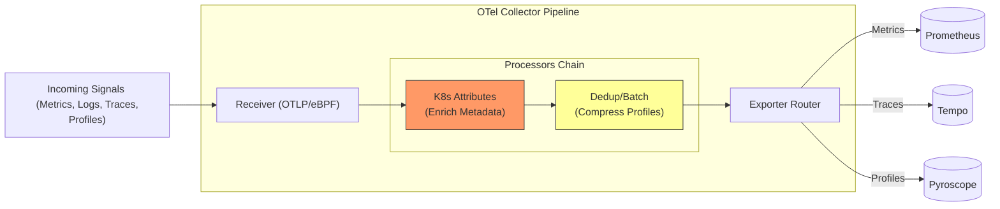
```mermaid
graph LR
    Input["Incoming Signals <br/> (Metrics, Logs, Traces, Profiles)"]
    
    subgraph "OTel Collector Pipeline"
        Receiver["Receiver (OTLP/eBPF)"]
        
        subgraph "Processors Chain"
            K8s["K8s Attributes <br/> (Enrich Metadata)"]
            Dedup["Dedup/Batch <br/> (Compress Profiles)"]
        end
        
        Router["Exporter Router"]
    end
    
    OutputM[("Prometheus")]
    OutputT[("Tempo")]
    OutputP[("Pyroscope")]
    
    Input --> Receiver
    Receiver --> K8s
    K8s --> Dedup
    Dedup --> Router
    
    Router -- "Metrics" --> OutputM
    Router -- "Traces" --> OutputT
    Router -- "Profiles" --> OutputP
    
    style K8s fill:#f96,stroke:#333
    style Dedup fill:#ff9,stroke:#333
```

> [!check] Архитектурный Вердикт Используйте **OTel Collector** в режиме **DaemonSet** (по одному на каждую ноду Kubernetes).
> 
> 1. Это позволяет читать системные метрики хоста.
>     
> 2. Это дает доступ к ядру для eBPF-профилирования всех подов на ноде.
>     
> 3. Это обеспечивает единую точку тегирования (`k8s.node.name`), что делает корреляцию железобетонной.
>
### 3.2. Architecture Diagram: The 4-Signal Pipeline

> [!abstract] Концепция "Single Agent"
> В прошлом мы запускали "зоопарк" агентов: `Promtail` читал файлы логов, `Telegraf` собирал метрики, `Jaeger Agent` ловил трейсы, а `Pyroscope` профилировал CPU.
>
> **Архитектура 2026 года:**
> Один бинарник (**OTel Collector**), запущенный как DaemonSet (один на ноду), собирает все 4 сигнала.
> * **Metrics + Traces + Logs:** Приходят от приложения (Push) или считываются с файлов.
> * **Profiles:** Считываются из ядра (Pull via eBPF) или приходят от рантайма.
>
> Это снижает накладные расходы на CPU ноды на 30-40%.
#### A. The Diagram: From Kernel to Dashboard
Эта схема показывает, как данные рождаются, обогащаются и сохраняются.


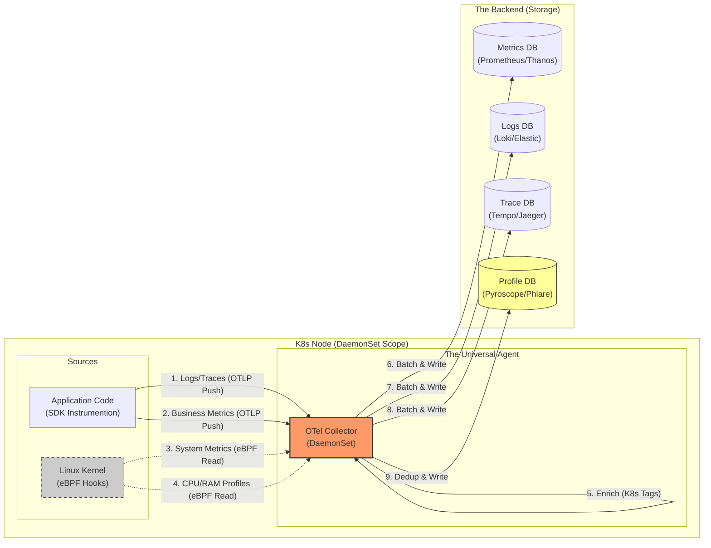
```mermaid
graph LR
    subgraph "K8s Node (DaemonSet Scope)"
        
        subgraph "Sources"
            AppCode["Application Code <br/> (SDK Instrumention)"]
            Kernel["Linux Kernel <br/> (eBPF Hooks)"]
        end
        
        subgraph "The Universal Agent"
            Collector["OTel Collector <br/> (DaemonSet)"]
        end
        
    end
    
    subgraph "The Backend (Storage)"
        Prometheus[("Metrics DB <br/> (Prometheus/Thanos)")]
        Loki[("Logs DB <br/> (Loki/Elastic)")]
        Tempo[("Trace DB <br/> (Tempo/Jaeger)")]
        Pyroscope[("Profile DB <br/> (Pyroscope/Phlare)")]
    end
    
    %% Flows
    AppCode -- "1. Logs/Traces (OTLP Push)" --> Collector
    AppCode -- "2. Business Metrics (OTLP Push)" --> Collector
    
    Kernel -. "3. System Metrics (eBPF Read)" .-> Collector
    Kernel -. "4. CPU/RAM Profiles (eBPF Read)" .-> Collector
    
    Collector -- "5. Enrich (K8s Tags)" --> Collector
    
    Collector -- "6. Batch & Write" --> Prometheus
    Collector -- "7. Batch & Write" --> Loki
    Collector -- "8. Batch & Write" --> Tempo
    Collector -- "9. Dedup & Write" --> Pyroscope
    
    style Collector fill:#f96,stroke:#333,stroke-width:2px
    style Pyroscope fill:#ff9,stroke:#333
    style Kernel fill:#ccc,stroke:#333,stroke-dasharray: 5 5
```
#### B. Component Breakdown (Who does what?)

**1. The Sources (Источники)**
- **Application SDK (Push):** Ваш код явно отправляет бизнес-метрики (`orders_processed`) и трейсы (`span_start/end`). Это "Белый ящик".
- **eBPF / Kernel (Pull/Observe):** Агент "подглядывает" за процессами.
    - _Auto-Metrics:_ RED-метрики (RPS, Error, Duration) для любого HTTP трафика без изменения кода.
    - _Auto-Profiling:_ Снятие стеков вызовов (Stack Traces) 100 раз в секунду. Это "Прозрачный ящик".

**2. The Collector (Обогатитель)** Самая важная часть схемы. Он делает **Correlation Magic**.
- **Metadata Injection:** Он знает, что процесс с PID 1234 — это под `cart-service-v2`. Он добавляет теги `k8s.pod.name` и `deployment.ver` ко **всем** сигналам.
- **Symbolization (Profile Specific):**
    - _Проблема:_ eBPF видит адреса памяти (`0x0045af`), а не имена функций (`main.processPayment`).
    - _Решение:_ Collector (или Backend) берет таблицу символов бинарника и переводит адреса в человекочитаемый вид.

**3. The Backends (Хранилища)**
- **Metrics (Prometheus):** Хранит "счетчики" (агрегаты). Дешево.
- **Logs (Loki):** Хранит "текст". Дорого. Используется как "индекс событий".
- **Traces (Tempo):** Хранит "графы". Средняя цена. Используется для поиска бутылочных горлышек.
- **Profiles (Pyroscope/Phlare):** Хранит "деревья".
    - _Особенность:_ Использует **Delta-encoding**. Если функция `A` вызывает `B`, и это повторяется миллион раз, хранится только одна запись с весом `1,000,000`. Это делает хранение профилей удивительно дешевым (дешевле логов).
#### C. The "Correlation ID" Flow
Как работает сквозная навигация в этой архитектуре?
1. Приложение генерирует `TraceID` (например, `abc-123`).
2. Приложение пишет этот ID в:
    - **Log:** `{"msg": "Error", "trace_id": "abc-123"}`
    - **Span:** Отправляет спан с ID `abc-123`.
    - **Exemplar:** Прикрепляет ID к метрике гистограммы.
    - **Pprof Label:** Вешает лейбл на поток, который считывает eBPF.
3. Collector добавляет ко всем 4 сигналам тег `env=production`.
4. В Grafana вы делаете Query: `Find everything where trace_id="abc-123" OR (env="production" AND time="now")`.
#### D. Why eBPF is Critical for Profiling?
Почему мы не используем старые методы (JMX, pprof HTTP endpoints)?
- **Zero Overhead:** eBPF работает в песочнице ядра. Он не останавливает приложение (no Stop-the-World).
- **Zero Instrumentation:** Вам не нужно импортировать библиотеки профилирования в `package.json` или `go.mod`.
- **Full Visibility:** eBPF видит не только User Space (ваш код), но и Kernel Space (время, потраченное на сетевой стек TCP/IP или запись на диск). Стандартные профайлеры этого не видят.

> [!check] Архитектурный Вердикт Если вы строите платформу в 2026 году:
> 
> 1. Ставьте **OTel Collector** как DaemonSet.
>     
> 2. Включайте в нем приемники **OTLP** (для Push) и **eBPF** (для Auto-Profiling).
>     
> 3. Это даст вам все 4 сигнала с минимальными усилиями разработчиков. Им нужно только подключить OTel SDK, остальное сделает инфраструктура.
>
### 3.3. Integration of Continuous Profiling (The New Standard)

> [!abstract] Эволюция: От OTEP к Стандарту
> Раньше профайлинг жил в изоляции. Чтобы связать трейс с профилем, приходилось "хакать" систему, сравнивая timestamp'ы.
>
> **OpenTelemetry Profiling (2026 Context):**
> Это расширение протокола OTLP, которое позволяет передавать данные профилирования (Stack Traces, Memory Allocations, Lock Contention) через тот же пайплайн, что и остальные сигналы.
>
> **Главное преимущество:** Единая мета-информация (`Resource Attributes`). Если коллектор добавляет тег `k8s.pod.name="cart-v2"` к метрикам, он добавляет его же к профилям. Это делает корреляцию автоматической и безошибочной.
#### A. The Data Model (Inside OTLP Profiles)
Как OTel передает "тяжелые" профили, не убивая сеть?
Он использует **формат pprof (Google)**, обернутый в OTLP.

1.  **Sample (Сэмпл):** Единица измерения.
    * *"Я видел этот стек вызовов 5 раз за последние 10 секунд"*.
    * Содержит: `Locations` (список адресов/функций), `Values` (CPU nanoseconds, alloc bytes), `Labels` (TraceID).
2.  **Location & Function:**
    * Вместо того чтобы слать строку `"com.example.OrderService.processPayment"` миллион раз, мы шлем её один раз в `Function Table` и присваиваем ID `42`.
    * В сэмплах мы шлем просто `[42, 15, 8]`.
    * **Результат:** Экстремальное сжатие данных (String Interning).
3.  **Link (Связь):**
    * Специальное поле, позволяющее привязать профиль к списку активных `TraceID` и `SpanID`.

#### B. The Challenge: Symbolization (Адреса vs Имена)
Это самая сложная часть архитектуры профилирования.
eBPF видит в памяти ядра только шестнадцатеричные адреса (`0x0045af3b`), а не имена функций. Чтобы человек понял профиль, адреса нужно перевести в символы.

Где это происходит?

| Strategy | Description | Pros | Cons |
| :--- | :--- | :--- | :--- |
| **Agent-Side Symbolization** | Агент на ноде читает файл символов (ELF/DWARF) и сразу шлет имена функций. | Бэкенд получает готовые данные. | Высокая нагрузка на CPU/Disk агента. Требует наличия debug symbols на проде (плохо для безопасности). |
| **Collector-Side Symbolization** | Агент шлет адреса + BuildID. Коллектор "обогащает" их. | Разгружает агент. | Коллектор становится "тяжелым". |
| **Deferred Symbolization (Best)** | Агент шлет адреса + **BuildID**. Бэкенд (Pyroscope/Phlare) скачивает символы из CI/CD хранилища и матчит их. | **Zero Overhead** на проде. Бинарники могут быть `stripped` (безопасно). | Требует настройки хранилища символов (Symbol Store). |
#### C. Configuration Strategy (OTel Collector Pipeline)
Как настроить коллектор для приема профилей?
Мы используем **Specific Receivers**.

```yaml
receivers:
  # 1. Pull Mode (Scraping) - для Go/Java приложений
  # Коллектор сам ходит на /debug/pprof/profile каждые 10с
  http_check/profiling:
    targets:
      - endpoint: "http://localhost:8080/debug/pprof/profile?seconds=10"
    collection_interval: 10s

  # 2. Push Mode (eBPF Agent)
  # Агент (например, Parca/Ebpf) пушит OTLP прямо в порт 4317
  otlp:
    protocols:
      grpc:
        endpoint: 0.0.0.0:4317

processors:
  # Обязательно добавляем теги K8s, иначе не найдем профиль
  k8sattributes:
    extract:
      metadata: [k8s.pod.name, k8s.deployment.name]
  
  # Группируем сэмплы для сжатия
  batch:
    send_batch_size: 1000

exporters:
  # Отправляем в профилировщик (поддерживающий OTLP)
  otlphttp/pyroscope:
    endpoint: "http://pyroscope-server:4040"
    compression: gzip
```
#### D. The "Build ID" Concept (Critical for Production)
Чтобы Deferred Symbolization сработала, система должна знать: _"Эти адреса памяти принадлежат сборке `v1.2.3` с хешем `abcde`"_.
1. **Compile Time:** Компилятор (Go/Rust/C++) генерирует уникальный `Build ID` и вшивает его в бинарник (в секцию `.note.gnu.build-id`).
2. **Runtime:** eBPF агент считывает этот ID из памяти запущенного процесса.
3. **Upload:** CI/CD пайплайн (GitHub Actions) загружает файлы debug symbols (с тем же ID) в S3 бакет.
4. **Backend:** Когда Pyroscope получает профиль с `BuildID=abcde`, он идет в S3, качает символы и показывает вам красивые имена функций.
#### E. Visualization: The Symbolization Flow (Mermaid)

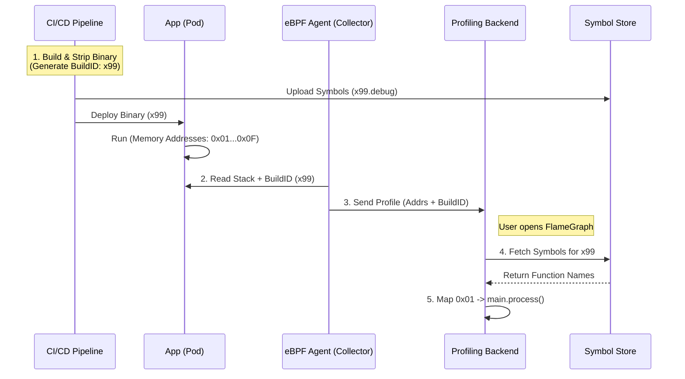
```mermaid
sequenceDiagram
    participant CI as CI/CD Pipeline
    participant App as App (Pod)
    participant Agent as eBPF Agent (Collector)
    participant Backend as Profiling Backend
    participant S3 as Symbol Store
    
    Note over CI: 1. Build & Strip Binary <br/> (Generate BuildID: x99)
    CI->>S3: Upload Symbols (x99.debug)
    CI->>App: Deploy Binary (x99)
    
    App->>App: Run (Memory Addresses: 0x01...0x0F)
    
    Agent->>App: 2. Read Stack + BuildID (x99)
    Agent->>Backend: 3. Send Profile (Addrs + BuildID)
    
    Note right of Backend: User opens FlameGraph
    
    Backend->>S3: 4. Fetch Symbols for x99
    S3-->>Backend: Return Function Names
    
    Backend->>Backend: 5. Map 0x01 -> main.process()
```

> [!check] Архитектурный Вердикт
> 
> 1. **Не используйте Pull-модель** (scrape HTTP endpoints) в Kubernetes масштаба. Это создает рассинхрон и нагрузку на Network.
>     
> 2. **Используйте eBPF (Push)**. Это дает вам профили "бесплатно" (без изменения кода) и, что важнее, профили ядра (Kernel Time).
>     
> 3. **Настройте Symbol Store.** Без этого ваши профили на продакшене (где бинарники `stripped`) будут бесполезным набором шестнадцатеричных чисел.
>
### 3.4. Deployment Strategy: Sidecar vs. DaemonSet
Где запускать OTel Collector?

| **Strategy**  | **Description**                                              | **Best For**                                                                    | **2026 Verdict**                                     |
| ------------- | ------------------------------------------------------------ | ------------------------------------------------------------------------------- | ---------------------------------------------------- |
| **Sidecar**   | Collector запускается в _каждом_ Поде (как контейнер-сосед). | Изоляция, сложная обработка трейсов, Serverless (Fargate).                      | ❌ **Too Expensive.** (Жрет много RAM на каждый под). |
| **DaemonSet** | Один Collector на каждую **Ноду** (VM).                      | Logs, Metrics, **Profiling** (нужен доступ к ядру!), Infrastructure Monitoring. | ✅ **Standard.** (Один агент обслуживает 50 подов).   |
| **Gateway**   | Отдельный кластер коллекторов для агрегации.                 | Балансировка нагрузки, скрытие API ключей, Tail-Based Sampling.                 | ✅ **Recommended** (в дополнение к DaemonSet).        |
### 3.5. Sampling Configuration (Saving Money)
Именно здесь вы экономите бюджет компании. Настраиваем `processors` в `otel-collector-config.yaml`.
```YAML
processors:
  # 1. Batching (Сжатие и отправка пачками - экономит CPU/Network)
  batch:
    timeout: 1s
    send_batch_size: 1024

  # 2. Tail Sampling (Умный отбор трейсов)
  # Храним трейс, ТОЛЬКО если была ошибка или задержка > 2с
  tail_sampling:
    decision_wait: 10s
    policies:
      - name: errors-policy
        type: status_code
        status_code: {status_codes: [ERROR]}
      - name: latency-policy
        type: latency
        latency: {threshold_ms: 2000}
      - name: probabilistic-policy
        type: probabilistic
        probabilistic: {sampling_percentage: 1} # Иначе сохраняем 1%

  # 3. Resource Detection (Авто-теггирование)
  # Добавляет: cloud.region, k8s.pod.name, host.name
  resourcedetection:
    detectors: [env, gcp, aws, k8s]
```

> [!check] Архитектурный Вердикт
> 
> **OTel Collector** — это швейцарский нож.
> 
> 1. Не подключайте библиотеки приложений напрямую к бэкенду (Jaeger/Loki). Подключайте их к **локальному OTel Collector**.
>     
> 2. Это дает вам буфер (если бэкенд упадет, коллектор сохранит данные в памяти/на диске).
>     
> 3. Это позволяет вам внедрить **Continuous Profiling** без изменения кода приложений (используя eBPF receiver в коллекторе).
>

---
## 4. Advanced Topic: Sampling Strategies (Saving Money)

> [!abstract] The "Data Gravity" Problem
> Данные имеют вес.
> * **Metrics:** Легкие. Мы храним их 100%.
> * **Logs:** Тяжелые. Мы индексируем только метаданные.
> * **Traces & Profiles:** **Очень тяжелые**.
>
> В системе с нагрузкой 10,000 RPS сохранение каждого трейса и профиля создаст поток записи в 500 MB/s. Это ~$50,000 в месяц за диски.
>
> **Sampling (Сэмплирование)** — это искусство отбрасывания 99% скучных данных, чтобы сохранить 100% важных (ошибки, аномалии, редкие пути).

### 4.1. Tracing Sampling: Head vs. Tail (The Classic Battle)

Стратегия выбора трейсов для сохранения.

| Strategy | Decision Point | Logic | Pros | Cons |
| :--- | :--- | :--- | :--- | :--- |
| **Head-Based** (Probabilistic) | **Start** of request (Ingress). | *"Сохраняй каждый 100-й запрос (1%)"*. Генератор случайных чисел. | Эффективно. Нулевая нагрузка на сеть и коллектор. | **Слепота.** Вы теряете 99% ошибок. Если баг воспроизводится редко, вы его не поймаете. |
| **Tail-Based** (Outcome-Driven) | **End** of request (Collector). | *"Запрос завершился с ошибкой? Или длился >2с? Сохраняй! Иначе бросай монетку"*. | **Точность.** Вы видите все инциденты. | **Cost.** Требует буферизации всех спанов в памяти OTel Collector до завершения трейса. |

> [!tip] 2026 Best Practice: Hybrid Sampling
> Используйте **Head-Based** (1-5%) для общего фона производительности.
> Используйте **Tail-Based** (100% for Errors/Latency) для инцидентов.
> *Результат:* Вы видите общую картину и не пропускаете ни одной аварии.

### 4.2. Profiling Sampling: Aggregation vs. Per-Event (The New Frontier)

> [!abstract] Фундаментальное отличие от Трейсинга
> В Трейсинге мы принимаем бинарное решение: **Keep** (сохранить весь трейс) или **Drop** (удалить полностью).
>
> В Профилировании мы **никогда не удаляем данные полностью**, потому что это исказит общую картину CPU Usage.
> Вместо удаления мы меняем **Разрешение (Resolution)**:
> * **Low Res:** Сливаем все вызовы в один общий профиль (Global Merge).
> * **High Res:** Оставляем уникальные метки (`trace_id`) для критических запросов.

#### A. Collection Sampling (The "Hz" Problem)
Это настройка агента (eBPF). Сколько раз в секунду мы смотрим на стек?

* **Standard Rate:** 19Hz или 99Hz (раз в ~10мс).
* **Почему не 100Hz?**
    * **The Lockstep Problem (Проблема синхронизации):** Если ваше приложение выполняет цикл ровно каждые 10мс, и профайлер просыпается ровно каждые 10мс, вы рискуете попадать в одну и ту же инструкцию (например, `sleep`). Вы получите искаженный профиль.
    * **Решение:** Использовать простые числа (97, 99) или добавить случайный джиттер (Jitter).
* **Overhead:** При 99Hz оверхед составляет <1% CPU. Если поднять до 1000Hz (для отладки микросекундных задержек), оверхед вырастет до 5-10%.

#### B. Storage Strategy 1: Global Aggregation (Merge)
Это режим "по умолчанию" для 99.9% трафика.

* **Механизм:**
    1.  Агент собирает 10,000 стеков за 10 секунд.
    2.  Он удаляет все уникальные ID (`trace_id`, `user_id`, `request_id`).
    3.  Он суммирует одинаковые стеки.
    4.  В базу пишется **одно** дерево (Flame Graph) на весь под.
* **Экономика:** Размер хранилища **константный** и не зависит от RPS.
* **Use Case:** *"Куда уходит CPU на этом сервере? (Garbage Collection, JSON parsing, etc.)"*

#### C. Storage Strategy 2: Per-Event Profiling (Labelled)
Это режим "высокой четкости" для инцидентов.

* **Механизм:**
    1.  Агент видит, что этот стек помечен лейблом `trace_id=abc-123`.
    2.  Он **не сливает** его с остальными.
    3.  В базу пишется отдельное дерево, привязанное к этому ID.
* **Экономика:** Размер хранилища растет линейно от RPS. Это **High Cardinality**.
* **Use Case:** *"Почему именно этот запрос пользователя VIP тормозил?"*

#### D. The 2026 Approach: Conditional Tagging (Hybrid)
Мы не выбираем одну стратегию. Мы комбинируем их в реальном времени.

**Алгоритм:**
1.  **Default:** Все профили стрипятся (удаляются теги) и агрегируются глобально.
2.  **Trigger:** Если OTel Collector видит, что запрос помечен как "Error" или "Slow" (через Tail-Based Sampling трейсов):
    * Он дает команду профилировщику (или сам на этапе процессинга): *"Не удаляй тег `trace_id` для этого конкретного сэмпла!"*.
3.  **Result:**
    * Вы видите общий фон (дешево).
    * Вы видите детальные профили *только* для ошибок (дорого, но полезно).
#### E. Visualization: The Aggregation Pipeline (Mermaid)

Как сырые данные превращаются в Flame Graph.

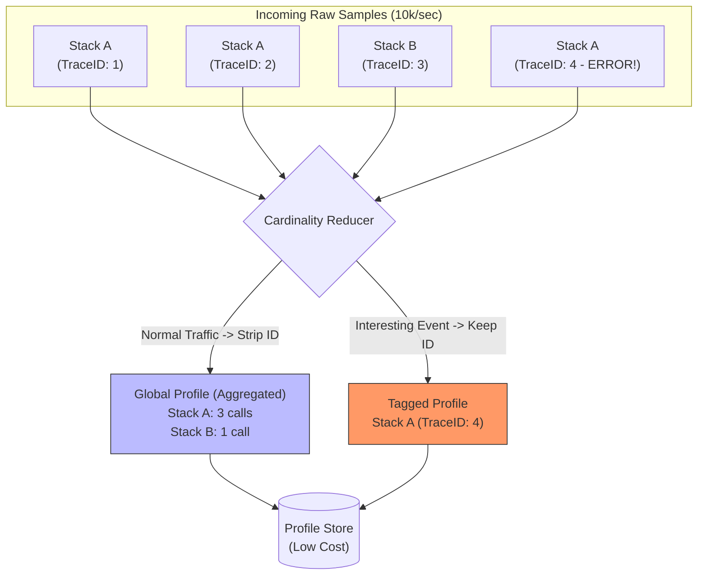
```mermaid
graph TD
    subgraph "Incoming Raw Samples (10k/sec)"
        S1["Stack A <br/> (TraceID: 1)"]
        S2["Stack A <br/> (TraceID: 2)"]
        S3["Stack B <br/> (TraceID: 3)"]
        S4["Stack A <br/> (TraceID: 4 - ERROR!)"]
    end
    
    Processing{"Cardinality Reducer"}
    
    S1 --> Processing
    S2 --> Processing
    S3 --> Processing
    S4 --> Processing
    
    Processing -- "Normal Traffic -> Strip ID" --> Merge["Global Profile (Aggregated) <br/> Stack A: 3 calls <br/> Stack B: 1 call"]
    
    Processing -- "Interesting Event -> Keep ID" --> Tagged["Tagged Profile <br/> Stack A (TraceID: 4)"]
    
    Merge --> DB[("Profile Store <br/> (Low Cost)")]
    Tagged --> DB
    
    style Tagged fill:#f96,stroke:#333
    style Merge fill:#bbf,stroke:#333
```

#### F. Cost Example (Mathematics of Profiling)
Представим сервис на Go.
- **Raw Data:** Стек весит ~2KB. Частота 100Hz.
- **Total Throughput:** 200 KB/sec на 1 ядро.
- **Aggregation (Merge):**
    - За 10 секунд (1000 сэмплов) мы получаем не 2MB данных, а всего **20KB** (так как код один и тот же, стеки схлопываются). Сжатие 100x.

- **Per-Event (Labelled):**
    - Если мы оставим `trace_id` на каждом сэмпле, они станут уникальными. Схлопывания не произойдет. Мы запишем **2MB**.
    - **Разница в цене:** В 100 раз.

> [!check] Архитектурный Вердикт **Continuous Profiling должен быть дешевым.** Если ваш счет за Pyroscope/Phlare сравнялся со счетом за Prometheus — вы что-то делаете не так.
> 
> 1. Проверьте настройки агента: **Aggregation Window** должно быть минимум 10с (лучше 60с для продакшена).
>     
> 2. Убедитесь, что вы не пишете `trace_id` во **все** профили подряд. Это самая частая ошибка конфигурации OTel Collector.
>
### 4.3. The "Coherent Sampling" Strategy (Unified Decision)

> [!abstract] Проблема "Разорванных Связей"
> Представьте, что вы расследуете убийство.
> * У вас есть отпечатки пальцев (Metrics).
> * Но видео с камеры наблюдения (Tracing) было удалено, чтобы сэкономить место на диске.
> * А показания свидетелей (Logs) были обобщены до фразы "Люди что-то видели".
>
> **Coherent Sampling (Когерентность)** — это гарантия того, что для *конкретного* запроса $R$ решение о сохранении принимается одинаково для всех сигналов:
> $$Decision(Trace_R) == Decision(Log_R) == Decision(Profile_R)$$
> Если запрос "плохой" — мы сохраняем всё. Если "хороший" — мы выбрасываем (или агрегируем) всё.
#### A. The Technical Challenge (Synchronization)
Трудность в том, что сигналы генерируются разными механизмами:
* **Traces:** Генерируются на каждый запрос (1:1).
* **Logs:** Генерируются произвольно (N:1).
* **Profiles:** Генерируются по таймеру (100Hz) и обычно не привязаны к запросу жестко.

Чтобы добиться когерентности, решение должно приниматься **централизованно** — в OTel Collector (Tail Sampling Processor), а не на агентах.

#### B. The Algorithm: Tail-Based Coherency
Как работает "Мозг" коллектора:

1.  **Ingest (Вход):**
    * Все сигналы (Trace Spans, Log Records, Profile Samples) поступают в коллектор.
    * *Критично:* Все они должны иметь метаданные `TraceID`. (Для профилей это делается через `pprof labels`).
2.  **Buffer (Ожидание):**
    * Коллектор удерживает данные в оперативной памяти (например, 15 секунд), ожидая завершения транзакции.
3.  **Evaluate (Суд):**
    * Проверяем условия: `Error=true`? `Latency > 2s`? `User=VIP`?
4.  **Execute (Приговор):**
    * **Scenario A (Keep):** Инцидент подтвержден.
        * Trace: Сохранить 100% спанов.
        * Logs: Сохранить 100% записей.
        * Profile: **Сохранить с лейблом `trace_id`** (High Cardinality).
    * **Scenario B (Drop):** Обычный запрос.
        * Trace: Удалить.
        * Logs: Удалить (или оставить только INFO/WARN).
        * Profile: **Удалить лейбл `trace_id`** и слить (Merge) в глобальный профиль (Low Cardinality).

#### C. Handling Profiles (The "Label Stripping" Pattern)
Это ключевой момент экономии для Continuous Profiling.

Мы не можем просто "удалить" профиль обычного запроса, иначе мы потеряем информацию о том, чем был занят CPU (Background Noise).
Мы используем технику **Label Stripping**.

* **Raw Sample:** `{stack=[main, serve, logic], values=[10ms], labels={trace_id="abc", pod="pod-1"}}`
* **Decision: Keep:** Пишем в базу как есть.
    * *Цена:* Высокая (уникальная запись).
    * *Польза:* Видим профиль конкретного запроса.
* **Decision: Drop:** Удаляем `trace_id`.
    * Sample превращается в: `{stack=[main, serve, logic], values=[10ms], labels={pod="pod-1"}}`
    * *Результат:* Этот сэмпл сливается (суммируется) с тысячами других таких же сэмплов от других запросов.
    * *Цена:* Почти ноль (дедупликация).

#### D. Implementation Example (OTel Collector Config)
В 2026 году это делается через процессор `tail_sampling` и специальные коннекторы.

*Примечание: Это концептуальная конфигурация, так как полная поддержка Coherent Profiling в OTel Collector находится в стадии активного внедрения.*

```yaml
processors:
  # 1. Группируем по TraceID
  groupbytrace:
    wait_duration: 10s
    num_traces: 1000

  # 2. Принимаем решение
  tail_sampling:
    policies:
      - name: errors-policy
        type: status_code
        status_code: {status_codes: [ERROR]}
      - name: slow-policy
        type: latency
        latency: {threshold_ms: 2000}

  # 3. (Magic) Процессор, который управляет профилями на основе решения по трейсу
  # Если Trace Dropped -> Strip Labels из связанных профилей
  transform/profiles:
    error_mode: ignore
    trace_statements:
      - context: profile
        statements:
          - set(attributes["trace_id"], nil) where trace.sampled == false
```
#### E. Visualization: The Decision Engine (Mermaid)

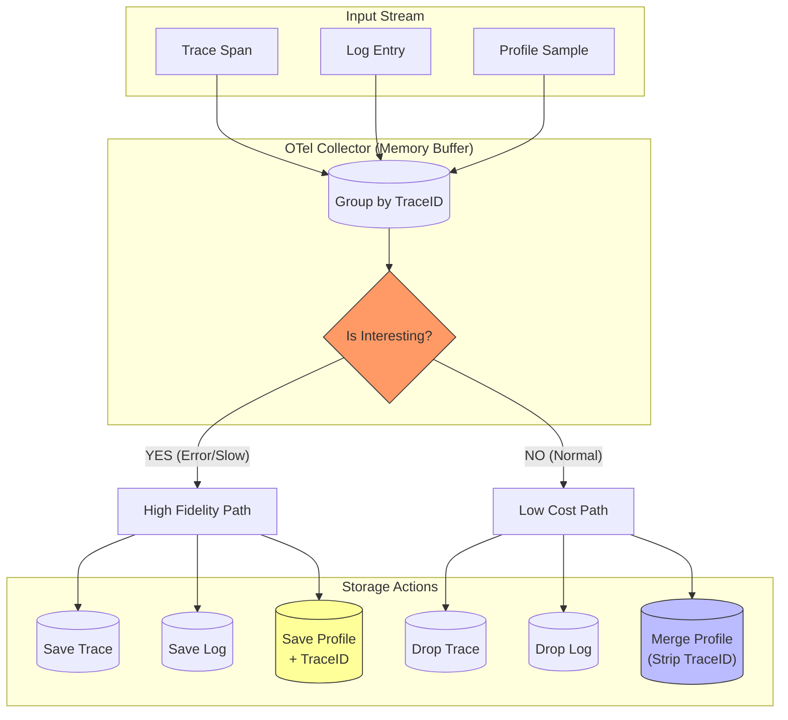
```mermaid
graph TD
    subgraph "Input Stream"
        T[Trace Span]
        L[Log Entry]
        P[Profile Sample]
    end
    
    subgraph "OTel Collector (Memory Buffer)"
        Group[("Group by TraceID")]
        Decision{Is Interesting?}
    end
    
    T --> Group
    L --> Group
    P --> Group
    
    Group --> Decision
    
    Decision -- "YES (Error/Slow)" --> KeepPath[High Fidelity Path]
    Decision -- "NO (Normal)" --> DropPath[Low Cost Path]
    
    subgraph "Storage Actions"
        SaveT[("Save Trace")]
        SaveL[("Save Log")]
        SaveP_Full[("Save Profile <br/> + TraceID")]
        
        DropT[("Drop Trace")]
        DropL[("Drop Log")]
        SaveP_Agg[("Merge Profile <br/> (Strip TraceID)")]
    end
    
    KeepPath --> SaveT
    KeepPath --> SaveL
    KeepPath --> SaveP_Full
    
    DropPath --> DropT
    DropPath --> DropL
    DropPath --> SaveP_Agg
    
    style SaveP_Full fill:#ff9,stroke:#333
    style SaveP_Agg fill:#bbf,stroke:#333
    style Decision fill:#f96,stroke:#333
```
#### F. Business Value Example
Давайте посчитаем ROI (Return on Investment) этой стратегии.
**Сценарий:** E-commerce, 5000 Checkout/sec.
- **Без Coherency:**
    - Мы храним 5% всех трейсов (Random).
    - Мы храним глобально агрегированные профили.
    - **Инцидент:** У 0.1% пользователей Checkout занимает 10 секунд.
    - **Результат:** В наши 5% попало мало проблемных трейсов. В глобальном профиле эти 0.1% "растворились" и не видны.
    - **Debug Time:** 4 часа.
- **С Coherency:**
    - Мы храним 0% обычных трейсов.
    - Мы храним 100% "медленных" трейсов (>5s) + их Детальные Профили.
    - **Инцидент:** Система автоматически сохранила полные данные по всем тормозящим запросам.
    - **Анализ:** Открываем Trace $\to$ Jump to Profile. Видим, что `CalculateTax()` делает лишний запрос в БД.
    - **Debug Time:** 5 минут.

> [!check] Архитектурный Вердикт
> 
> **Coherent Sampling** — это единственный способ сделать Continuous Profiling экономически оправданным в больших масштабах.
> 
> Вы платите за детализацию только тогда, когда она вам нужна (во время инцидента).
> 
> В остальное время вы платите только за агрегаты.
### 4.4. Adaptive Sampling (Dynamic Rate)

> [!abstract] Проблема "Черной Пятницы"
> Трафик — это волатильная величина.
> * **День:** 10,000 RPS. Сэмплинг 10% генерирует 1,000 трейсов/сек. (Норма).
> * **Ночь:** 100 RPS. Сэмплинг 10% генерирует 10 трейсов/сек. (Слишком мало для статистики).
> * **DDoS / Распродажа:** 100,000 RPS. Сэмплинг 10% генерирует 10,000 трейсов/сек. (Backend падает, диск переполняется за час).
>
> **Adaptive Sampling** — это алгоритм, который меняет процент сэмплирования ($R$) в реальном времени, чтобы поддерживать **константную скорость записи** (Target Write Rate).
#### A. The Math: PID Controller Approach
Мы не задаем фиксированный процент. Мы задаем **Target Budget** (например, 100 профилей в секунду).

Формула пересчета (выполняется каждую минуту):

$$R_{new} = \min \left( 100\%, \frac{Target_{budget}}{Current_{traffic}} \right)$$

* Если трафик растет $\to$ Процент падает.
* Если трафик падает $\to$ Процент растет (до 100%).
* **Результат:** Ваш счет за AWS/Grafana Cloud всегда одинаковый, независимо от нагрузки.

#### B. Adaptive Tracing (Standard Practice)
Здесь всё просто. OTel Collector (или Head-SDK) получает команду от бэкенда: *"Снизь рейты!"*.

* **Механизм:** Probabilistic Sampler меняет коэффициент.
* **Пример:**
    * 09:00 (Start of day): Traffic 1k RPS $\to$ Rate 10% $\to$ Stored 100 TPS.
    * 12:00 (Peak): Traffic 10k RPS $\to$ Rate 1% $\to$ Stored 100 TPS.
    * **Cost:** Flat.
    * **Resolution:** Во время пика мы теряем мелкие детали, но сохраняем общую картину.

#### C. Adaptive Profiling (The Hard Part)
С Continuous Profiling сложнее. Мы не можем просто "выключить" профилирование на половине серверов — мы потеряем видимость.
Вместо изменения *частоты сбора*, мы меняем **Стратегию Агрегации**.

**Режимы адаптации профилировщика:**

1.  **Resolution Adaptation (Cardinality Control):**
    * *Normal Load:* Мы прикрепляем `trace_id` к профилям медленных запросов. (High Cost).
    * *High Load:* Мы перестаем прикреплять `trace_id`. Все профили сливаются в глобальный. (Low Cost).
    * *Emergency:* Мы увеличиваем окно агрегации с 10с до 60с. (Ultra Low Cost).

2.  **Aggregation Window Expansion:**
    * Профилировщик шлет дельты изменений стека.
    * Если нагрузка на сеть растет, агент начинает агрегировать локально дольше. Вместо отправки каждые 10с, он шлет каждые 60с. Это снижает трафик метаданных в 6 раз.

#### D. The "Emergency Brake" (Circuit Breaker)
Что делать, если адаптивность не успевает (взрывной рост трафика x100 за секунду)?

* **Global Limit:** Жесткое ограничение на OTel Collector.
* `memory_limiter`: Если память коллектора заполнена на 80%, он начинает **дропать данные** (Drop spans/profiles), отдавая приоритет Метрикам.
* **Приоритет выживания:**
    1.  Metrics (Самые важные, маленькие).
    2.  Aggregated Profiles (Важны для понимания нагрузки CPU).
    3.  Logs (Тяжелые, дропаем первыми).
    4.  Traces (Тяжелые, дропаем вторыми).

#### E. Visualization: Traffic vs. Rate (Mermaid)

Этот график показывает, как сэмплинг (Синяя линия) движется в противофазе к Трафику (Красная линия), чтобы сохранить Стоимость (Зеленая зона) ровной.


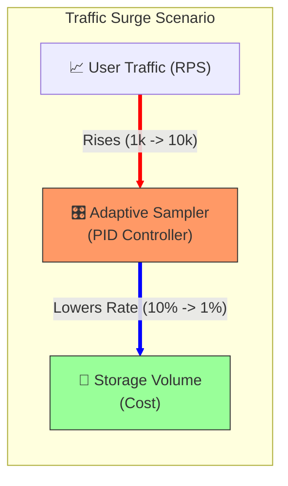
```mermaid
graph LR
    subgraph "Traffic Surge Scenario"
        Traffic["📈 User Traffic (RPS)"]
        Sampler["🎛️ Adaptive Sampler <br/> (PID Controller)"]
        Storage["💾 Storage Volume <br/> (Cost)"]
    end
    
    Traffic -- "Rises (1k -> 10k)" --> Sampler
    Sampler -- "Lowers Rate (10% -> 1%)" --> Storage
    
    style Sampler fill:#f96,stroke:#333
    style Storage fill:#9f9,stroke:#333
    
    linkStyle 0 stroke-width:4px,fill:none,stroke:red;
    linkStyle 1 stroke-width:4px,fill:none,stroke:blue;
```
#### F. Configuration Example (OTel Tail Sampling)
Настройка адаптивной политики в коллекторе (используя `probabilistic` с динамическим пересчетом — концептуально в Jaeger Remote Sampling или OTel Contrib).
```YAML
processors:
  # Адаптивный сэмплинг на основе количества спанов в секунду
  tail_sampling:
    policies:
      # 1. Сначала берем ошибки (всегда)
      - name: errors-keep
        type: status_code
        status_code: {status_codes: [ERROR]}
      
      # 2. Оставшийся трафик лимитируем
      - name: adaptive-normal
        type: probabilistic
        probabilistic:
          sampling_percentage: 10 # Базовое значение
          # Примечание: В Enterprise версиях (Grafana/Honeycomb) 
          # это число меняется динамически через API
```
> [!check] Архитектурный Вердикт **Static Rate (фиксированный процент) = Смерть бюджета.**
> 
> 1. Внедрите **Adaptive Sampling** на уровне OTel Collector или Load Balancer.
>     
> 2. Для **Профилирования**: настройте динамическое отключение тегов (`trace_id`) при росте нагрузки. Это спасет вашу базу данных от взрыва кардинальности.
>     
> 3. **Metrics First:** Никогда не сэмплируйте метрики (Counter/Gauge). Это ваш компас. Если вы потеряете метрики, вы ослепнете. Сэмплируйте только контекст (Traces/Logs/Profiles).
>
### 4.5. Visualization: The Coherent Decision Engine (Mermaid)

Как OTel Collector принимает решение о судьбе пакета данных.

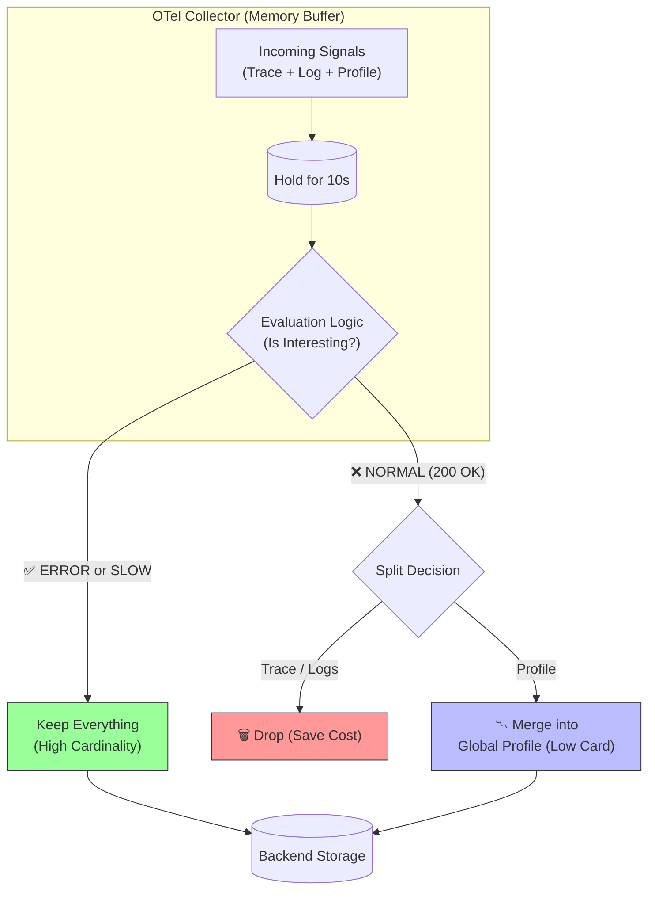
```mermaid
graph TD
    subgraph "OTel Collector (Memory Buffer)"
        Signal["Incoming Signals <br/> (Trace + Log + Profile)"]
        Buffer[("Hold for 10s")]
        
        Eval{"Evaluation Logic <br/> (Is Interesting?)"}
    end
    
    Signal --> Buffer
    Buffer --> Eval
    
    Eval -- "✅ ERROR or SLOW" --> Keep["Keep Everything <br/> (High Cardinality)"]
    
    Eval -- "❌ NORMAL (200 OK)" --> Branch{"Split Decision"}
    
    Branch -- "Trace / Logs" --> Drop["🗑️ Drop (Save Cost)"]
    Branch -- "Profile" --> Merge["📉 Merge into <br/> Global Profile (Low Card)"]
    
    Keep --> Storage[("Backend Storage")]
    Merge --> Storage
    
    style Keep fill:#9f9,stroke:#333
    style Drop fill:#f99,stroke:#333
    style Merge fill:#bbf,stroke:#333
```
### 4.6. Cost Calculation Example
Посчитаем экономию на реальном примере.
- **Дано:** 10,000 RPS. Каждый запрос = 2KB (Trace + Logs).
- **Total Volume:** 20 MB/s $\approx$ 1.7 TB/day.
- **Цена хранения:** $0.10 / GB / month.
- **Без сэмплирования:** $170 / day $\to$ **$5,100 / month**.

**Применяем стратегию:**
1. **Errors (1%):** Сохраняем 100%.
2. **Success (99%):** Сэмплируем 0.1%.
3. **Total Kept:** ~1.1% трафика.
4. **Счет:** **$56 / month**.
5. **Результат:** Экономия 99% денег при сохранении 100% важных данных.

> [!check] Архитектурный Вердикт
> 
> **Не бойтесь выбрасывать данные.**
> 
> Observability — это не архив "на всякий случай". Это инструмент поиска проблем.
> 
> "Нормальные" запросы не нужны для отладки. Вам нужны аномалии.
> 
> 1. Включите **Head-Based Sampling (1-5%)** в библиотеках (SDK), чтобы не перегружать сеть.
>     
> 2. Включите **Tail-Based Sampling** на Коллекторе для улавливания ошибок.
>     
> 3. Используйте **Adaptive Sampling**, чтобы не переполнить диски при DDoS-атаке.
>

---
## 5. Practical Implementation Guide

> [!abstract] Стандарт 2026 года
> Мы больше не внедряем Observability по частям. Мы внедряем **Unified Context**.
>
> **Цель:** Написать код один раз так, чтобы:
> 1.  Логгер знал о Трейсе.
> 2.  Профайлер знал о Трейсе.
> 3.  Метрика знала о Трейсе (Exemplar).
>
> Ниже приведен эталонный пример на Go (как самом популярном языке для Cloud Native), но принципы идентичны для Java/Python/Rust.
### 5.1. Code Example: The "Holy Quartet" (Go + OTel + Zap + Pprof)
Этот код демонстрирует, как связать все 4 сигнала одной нитью (`ctx`).

```go
package main

import (
    "context"
    "net/http"
    "runtime/pprof"
    "time"

    "go.opentelemetry.io/otel"
    "go.opentelemetry.io/otel/attribute"
    "go.opentelemetry.io/otel/trace"
    "go.uber.org/zap"
)

// 1. Setup Global Objects (Logger, Tracer, Meter)
var (
    tracer = otel.Tracer("order-service")
    meter  = otel.Meter("order-service")
    // Histogram for Latency (Buckets are critical!)
    latencyHist, _ = meter.Int64Histogram("http_request_duration_ms")
    logger, _      = zap.NewProduction()
)

func HandleOrder(w http.ResponseWriter, r *http.Request) {
    startTime := time.Now()
    
    // --- Step 1: Start Span (Tracing) ---
    // Extract context from incoming headers (W3C Trace Context)
    ctx, span := tracer.Start(r.Context(), "HandleOrder")
    defer span.End()

    // Get TraceID for correlation
    traceID := span.SpanContext().TraceID().String()

    // --- Step 2: Correlation Glue (Profiling) ---
    // CRITICAL: We attach TraceID to the CPU Profile!
    // Теперь любой сэмпл CPU, снятый eBPF/Runtime в этом блоке, будет иметь лейбл trace_id.
    pprofLabels := pprof.Labels("trace_id", traceID, "endpoint", "/order")
    
    pprof.Do(ctx, pprofLabels, func(ctx context.Context) {
        
        // --- Step 3: Structured Logging (Logs) ---
        // Логгер автоматически пишет trace_id в JSON
        logger.Info("Processing order",
            zap.String("trace_id", traceID), // Explicit link
            zap.String("user_id", r.Header.Get("X-User-ID")),
        )

        // Simulate Business Logic (CPU intensive)
        processExpensiveLogic(ctx) 
    })

    // --- Step 4: Metrics with Exemplars (Metrics) ---
    duration := time.Since(startTime).Milliseconds()
    
    // Мы передаем ctx, чтобы OTel SDK мог вытащить TraceID 
    // и прикрепить его как Exemplar к этой точке гистограммы.
    latencyHist.Record(ctx, duration, attribute.String("status", "200"))
}

func processExpensiveLogic(ctx context.Context) {
    // Some CPU burn...
    span := trace.SpanFromContext(ctx)
    span.AddEvent("Calculating Tax") // Log inside Span
    time.Sleep(50 * time.Millisecond)
}
```
### 5.2. Infrastructure: OTel Collector Configuration
Чтобы этот код заработал, инфраструктура должна уметь "переварить" данные.
Вот фрагмент `otel-config.yaml` для приема всех 4 сигналов.

```YAML
receivers:
  otlp:
    protocols:
      grpc: {endpoint: "0.0.0.0:4317"} # Metrics, Logs, Traces
      http: {endpoint: "0.0.0.0:4318"} # Profiles (Push from Pyroscope agent)

processors:
  # 1. Batching (Network Optimization)
  batch:
    send_batch_size: 1000
    timeout: 10s

  # 2. Metadata Enrichment (The Key to Correlation)
  # Добавляет k8s.pod.name ко всем сигналам
  k8sattributes:
    auth_type: "serviceAccount"
    extract:
      metadata:
        - k8s.pod.name
        - k8s.namespace.name

exporters:
  prometheusremotewrite: {endpoint: "http://prometheus:9090/api/v1/write"}
  otlp/tempo: {endpoint: "tempo:4317", tls: {insecure: true}}
  loki: {endpoint: "http://loki:3100/loki/api/v1/push"}
  
  # 3. Profiling Export (New Standard)
  otlphttp/profiling: 
    endpoint: "http://pyroscope:4040"
    compression: gzip

service:
  pipelines:
    traces: [otlp, batch, k8sattributes, otlp/tempo]
    metrics: [otlp, batch, k8sattributes, prometheusremotewrite]
    logs: [otlp, batch, k8sattributes, loki]
    profiles: [otlp, batch, k8sattributes, otlphttp/profiling] # Unified!
```
### 5.3. Dashboard Design: The "Single Pane of Glass"
Хороший дашборд отвечает на вопросы сверху вниз.
Не делайте отдельные дашборды "Logs" и "Traces". Делайте **Service Dashboard**.

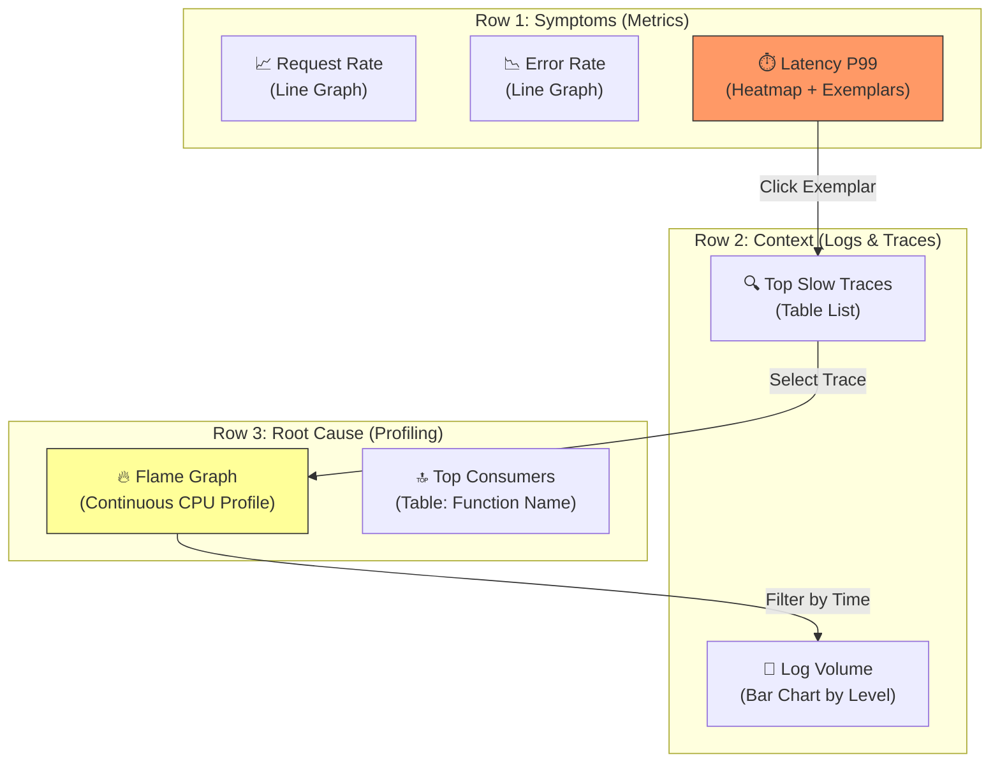
```mermaid
graph TD
    subgraph "Row 1: Symptoms (Metrics)"
        RPS["📈 Request Rate <br/> (Line Graph)"]
        Err["📉 Error Rate <br/> (Line Graph)"]
        Lat["⏱️ Latency P99 <br/> (Heatmap + Exemplars)"]
    end
    
    subgraph "Row 2: Context (Logs & Traces)"
        Logs["📄 Log Volume <br/> (Bar Chart by Level)"]
        Traces["🔍 Top Slow Traces <br/> (Table List)"]
    end
    
    subgraph "Row 3: Root Cause (Profiling)"
        Flame["🔥 Flame Graph <br/> (Continuous CPU Profile)"]
        TopFunc["🔝 Top Consumers <br/> (Table: Function Name)"]
    end
    
    Lat -- "Click Exemplar" --> Traces
    Traces -- "Select Trace" --> Flame
    Flame -- "Filter by Time" --> Logs
    
    style Lat fill:#f96,stroke:#333
    style Flame fill:#ff9,stroke:#333
```

**Workflow:**
1. **Row 1:** Видим всплеск Latency на графике (Metrics).
2. **Row 1:** Видим точки (Exemplars) на пике. Кликаем.
3. **Row 2:** Открывается Трейс. Видим, что Span "Processing" занял 5 секунд.
4. **Row 3:** Flame Graph автоматически фильтруется по времени этого спана.
    - _Ответ:_ Видим широкий столбец `json.Marshal`, занимающий 90% ширины.
    - _Вывод:_ Мы сериализуем огромный объект.
### 5.4. Alerting Strategy (What to wake up for?)
Не настраивайте алерты на Профайлинг. Это "шумные" данные.

|**Signal**|**Alert Type**|**Example**|**Action**|
|---|---|---|---|
|**Metrics**|**Symptom** (Симптом)|`ErrorRate > 1%` или `Latency P99 > 500ms`.|**Wake up on-call.** (Клиенты страдают).|
|**Logs**|**Context**|`Level=Fatal` или `Panic caught`.|Create Jira Ticket. (Баги, но сервис жив).|
|**Traces**|**Investigation**|None. (Too expensive to query).|None.|
|**Profiling**|**Saturation**|`Memory Usage > 85%` (OOM Risk).|Auto-scaling / Investigation.|
### 5.5. The Observability Maturity Model (2026 Edition)
Оцените свой уровень.
- **Level 0 (Blind):**
    - SSH на сервер.
    - `docker logs` и `top`.
    - Узнаем об ошибках от пользователей.
- **Level 1 (Basic):**
    - Prometheus + Grafana (Метрики).
    - ELK Stack (Текстовые логи).
    - Нет связи между ними.
- **Level 2 (Connected):**
    - Structured Logging (JSON).
    - Tracing (Jaeger).
    - `TraceID` есть в логах.
- **Level 3 (Professional - "The Quad-Pillar"):**
    - **Continuous Profiling** (eBPF) на всех нодах.
    - Exemplars в метриках.
    - Tail-Based Sampling для экономии.
- **Level 4 (Causal AI - Future):**
    - Система сама говорит: _"RPS упал, потому что деплой v1.2 увеличил CPU usage в функции `CheckAuth` на 40%"_.

> [!check] Final Implementation Checklist
> 
> 1. [ ] **SDK:** Добавлен ли `pprof.Labels` или OTel Profiling bridge в код?
>     
> 2. [ ] **Collector:** Настроен ли `k8sattributes` процессор? (Без него вы не найдете поды).
>     
> 3. [ ] **Network:** Открыты ли порты 4317/4318 между подами и коллектором?
>     
> 4. [ ] **Security:** Убраны ли пароли/токены из логов (Redaction)?
>

---
## 6. Summary: The Maturity Model

> [!abstract] Эволюция от "Слепоты" к "Рентгену"
> Зрелость Observability измеряется способностью системы отвечать на вопросы без участия человека.
>
> $$Maturity = \frac{Answers}{Manual\_Queries}$$
>
> * **Level 0:** Мы не знаем, что сломалось.
> * **Level 1:** Мы знаем, *что* сломалось (Alert), но не знаем почему.
> * **Level 2:** Мы знаем, *где* сломалось (Trace), но не знаем детали.
> * **Level 3 (Standard):** Мы видим *код*, который сломался (Profile).
> * **Level 4 (Future):** Система чинит себя сама (Auto-Remediation).
### 6.1. The 5 Levels of Visibility
Оцените, где находится ваша команда прямо сейчас.
#### Level 0: The "Blind" Zone (Reactive)
* **Симптомы:**
    * О падении продакшена вы узнаете из гневных тикетов поддержки или звонка CEO.
    * Логи смотрят через `ssh user@server` и `tail -f`.
    * Нет метрик, нет алертов.
* **Инструменты:** `grep`, `top`, `htop`.
* **Risk:** Экзистенциальный. Любой сбой может длиться днями.
#### Level 1: The "Siloed" Monitoring (Basic)
* **Симптомы:**
    * Есть дашборды "Светофоры" (Зеленый/Красный).
    * Логи собираются в ELK/Graylog, но они текстовые (не JSON).
    * Метрики и Логи живут в разных вкладках. Инженеры вручную копируют время инцидента.
* **Инструменты:** Prometheus + Node Exporter, ELK Stack.
* **Проблема:** Высокий MTTR. Вы видите, что CPU 100%, но логи чистые. Вы не знаете причину.
#### Level 2: The "Connected" Observability (Trace-Aware)
* **Симптомы:**
    * Внедрен **Distributed Tracing** (Jaeger/Tempo).
    * Логи стали структурированными (JSON) и содержат `trace_id`.
    * Можно перейти от Графика $\to$ к Трейсу $\to$ к Логу (в рамках одной транзакции).
* **Инструменты:** OTel SDK, Loki (LogQL), Grafana.
* **Проблема:** Трейс показывает, что Span длился 5 секунд. Но почему? БД ответила быстро. Сеть в порядке. Внутри спана "черная дыра" (работа кода).
#### Level 3: The "Quad-Pillar" Standard (Deep Dive)
* **Симптомы:**
    * Внедрен **Continuous Profiling** (eBPF).
    * Работает **Exemplars** (точки на графиках).
    * **Profiling Context:** Вы кликаете на медленный Span и видите Flame Graph именно этого вызова.
    * Вы видите не только ошибки (Errors), но и неэффективность (Cost).
* **Инструменты:** OTel Collector (DaemonSet), Pyroscope/Phlare, eBPF Agents.
* **Результат:** Инженер находит "утечку памяти в строке 42" за 3 клика.
#### Level 4: The "Causal" Intelligence (Automated)
* **Симптомы:**
    * **Change Intelligence:** Система говорит: *"RPS ошибок вырос, потому что 5 минут назад был деплой v1.3, который увеличил Lock Contention на 40%"*.
    * **Auto-Scaling based on Profiling:** Если приложение упирается в CPU, автоскейлер добавляет поды *только* если это полезная нагрузка, а не дедлок.
* **Инструменты:** AIOps (Dynatrace Davis, Datadog Watchdog), Custom Operators.

### 6.2. The Capability Matrix

| Feature | Level 1 (Monitoring) | Level 2 (Tracing) | Level 3 (Profiling) |
| :--- | :--- | :--- | :--- |
| **Data Source** | Metrics only | + Logs & Traces | **+ CPU/RAM Profiles** |
| **Correlation** | Manual (Time-based) | ID-based (`trace_id`) | **Context-based (`pprof labels`)** |
| **Overhead** | Low | Medium (Network) | **Low (<1% via eBPF)** |
| **Typical Question** | *"Is the server up?"* | *"Which service is slow?"* | **"Which line of code is slow?"** |
| **Storage Cost** | $ | $$ | **$$ (Offset by optimization)** |
| **Resolution Time** | Hours | Minutes | **Seconds** |

### 6.3. Visualization: The Maturity Pyramid (Mermaid)

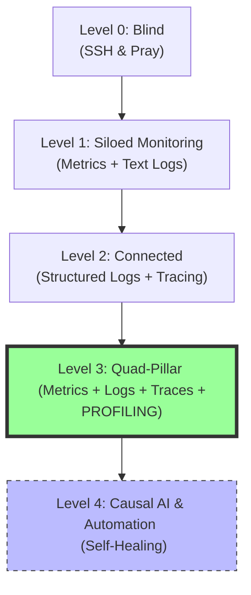
```mermaid
graph TD
    L4["Level 4: Causal AI & Automation <br/> (Self-Healing)"]
    L3["Level 3: Quad-Pillar <br/> (Metrics + Logs + Traces + PROFILING)"]
    L2["Level 2: Connected <br/> (Structured Logs + Tracing)"]
    L1["Level 1: Siloed Monitoring <br/> (Metrics + Text Logs)"]
    L0["Level 0: Blind <br/> (SSH & Pray)"]
    
    L0 --> L1
    L1 --> L2
    L2 --> L3
    L3 --> L4
    
    style L3 fill:#9f9,stroke:#333,stroke-width:4px
    style L4 fill:#bbf,stroke:#333,stroke-dasharray: 5 5
```
### 6.4. Strategic ROI: Why go to Level 3?
Финансовый директор (CFO) спросит: _"Зачем нам платить за хранение профилей (Level 3), если у нас уже есть трейсы (Level 2)?"_

**Ответ Архитектора:**
1. **Cloud Cost Reduction:**
    - _Без профилирования:_ Мы видим, что CPU 80%. Мы покупаем в 2 раза больше серверов (+100% Cost).
    - _С профилированием:_ Мы видим, что 40% CPU тратится на ненужную JSON-сериализацию в логах. Мы исправляем одну строку кода. Нагрузка падает до 40%. Мы сокращаем сервера (-50% Cost).
    - _ROI:_ Continuous Profiling окупает себя за первый месяц оптимизации.
2. **Debugging Deadlocks:**
    - Метрики и Трейсы **не видят** дедлоки (приложение просто молчит).
    - Только **Off-CPU Profiling** покажет, где застряли потоки. Без этого простой может длиться часами.

> [!check] Архитектурный Вердикт (Definition of Done) Ваша платформа Observability готова к 2026 году, если:
> 
> 1. [ ] Разработчик не пишет код для сбора метрик (все делает авто-инструментация).
>     
> 2. [ ] Алерт в Slack содержит ссылку, которая ведет на дашборд с **уже отфильтрованными** логами и трейсами.
>     
> 3. [ ] У вас есть данные eBPF (профили), которые позволяют сказать, сколько денег тратит каждая функция в коде.
>     
> 
> Если вы на Level 2 — внедряйте **OTel Collector + eBPF**. Это ваш следующий шаг.
