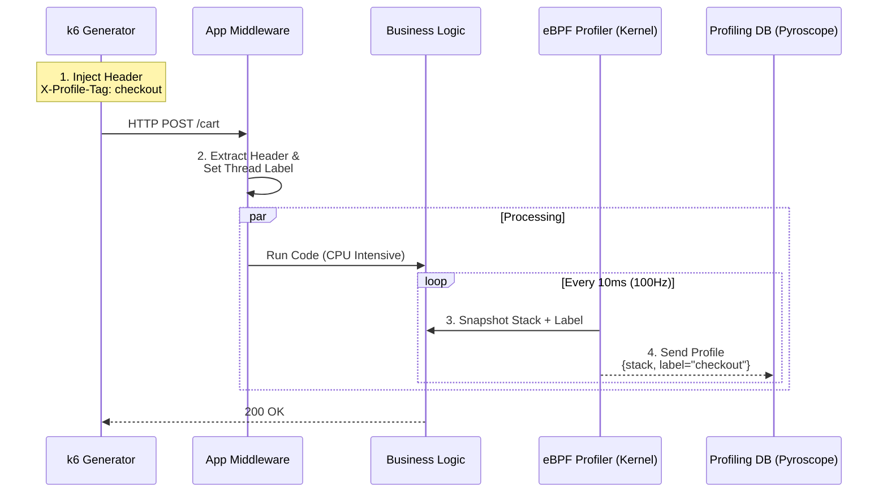
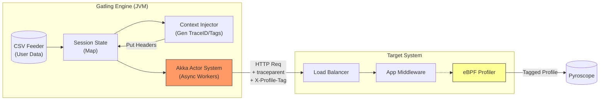
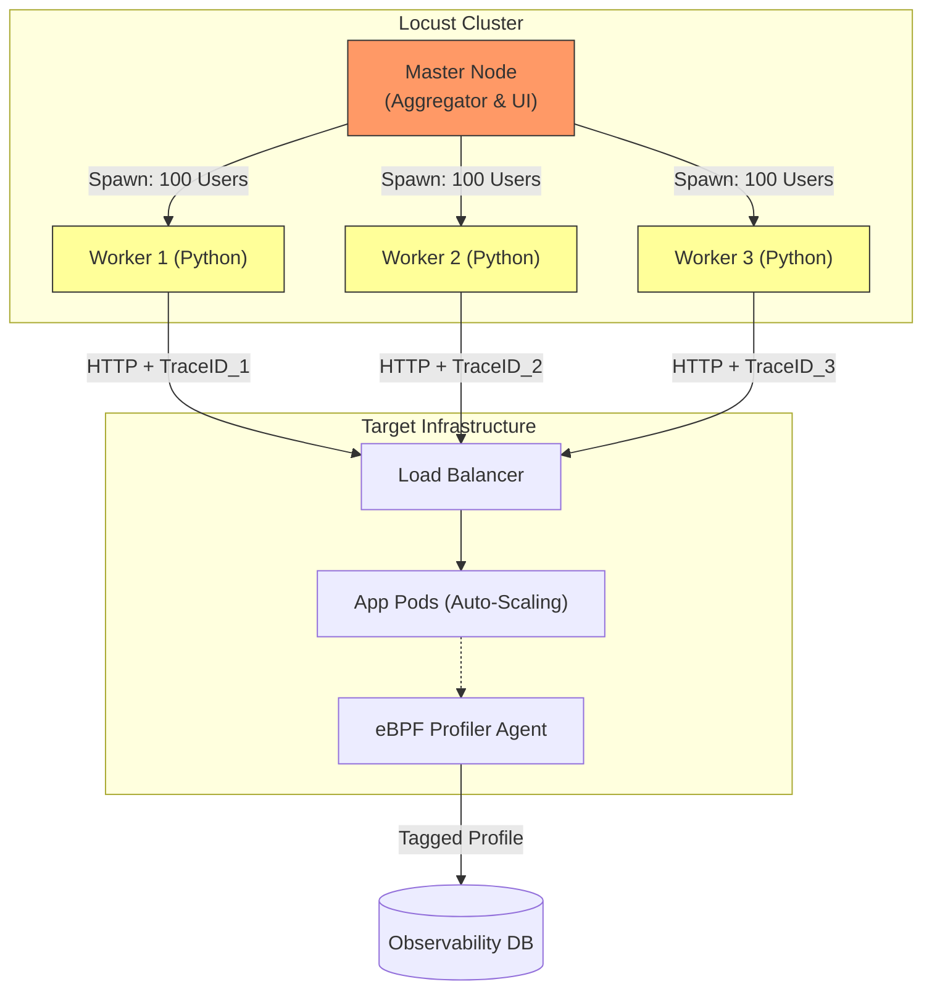
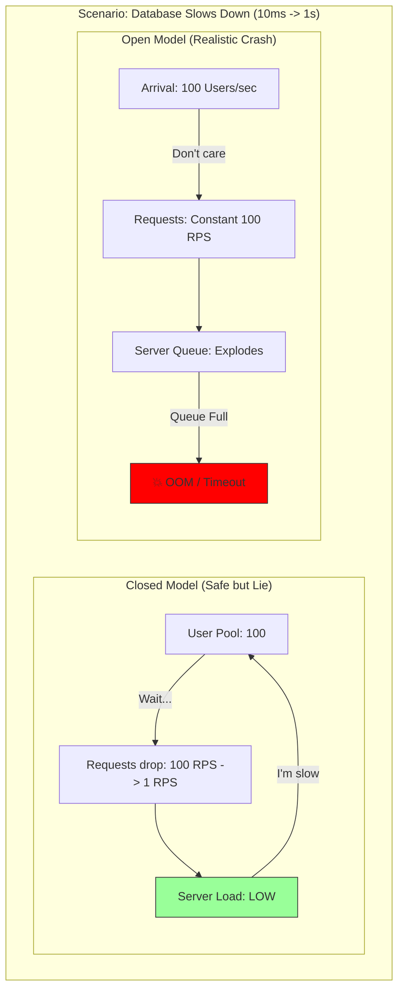
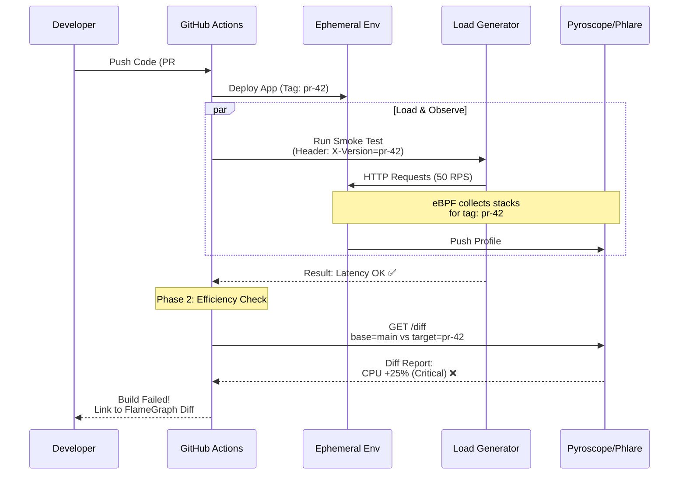
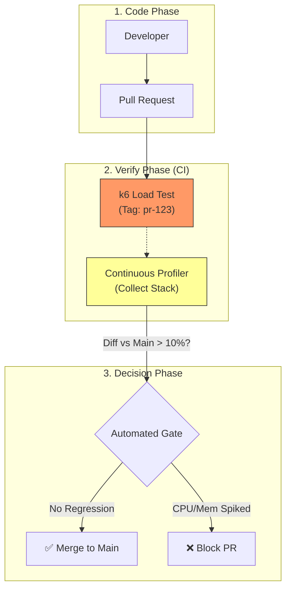

**Tags:** #sre #performance #testing #k6 #gatling #locust #ci-cd

## 1. The Landscape: Why Legacy is Dead? (From "Black Box" to "White Box")

> [!abstract] Сдвиг Парадигмы 2026
> Раньше (эпоха JMeter) нагрузочное тестирование было "Черным ящиком".
> * **Input:** Мы бомбардируем сервис 10,000 запросов.
> * **Output:** Мы получаем график: "Latency выросла до 5 секунд".
> * **Missing Link:** Мы не знали, *что именно* происходило внутри кода в этот момент. Инженеры гадали: "Это БД? Сеть? Или GC?"
>
> **Сегодня:** Мы объединяем **Load Generator** (k6) и **Continuous Profiling** (eBPF).
> Когда k6 дает нагрузку, он помечает трафик. Профайлер видит эту метку и сохраняет "срез" производительности кода именно под нагрузкой.
> Это превращает тестирование в "Белый ящик".

### 1.1. The Legacy Problem (Apache JMeter & Friends)
Почему инструменты 2010-х годов (JMeter, LoadRunner) умирают в Cloud Native среде?

1.  **GUI-First Mental Model:** XML-сценарии JMeter невозможно ревьюить в Pull Request. Они бинарны для человека. В мире GitOps это блокирует процесс.
2.  **Resource Heavy:** JMeter написан на Java и использует потоки (Thread-based model). Чтобы сгенерировать 50k RPS, вам нужна ферма серверов, которая потребляет столько же RAM, сколько и тестируемая система.
3.  **Lack of Observability Integration:**
    * JMeter — это "остров". Он генерирует отчеты в HTML/CSV.
    * Он не умеет нативно пушить метрики в Prometheus.
    * Он не умеет пробрасывать `Trace Context` (W3C headers) и `Profiling Labels` автоматически. Вы должны писать сложные скрипты (Groovy/BeanShell), чтобы научить его этому.

### 1.2. The Modern Standard: "Performance as Code" + Observability
Инструменты нового поколения (k6, Gatling, Locust) созданы для экосистемы Kubernetes и eBPF.

* **Developer Experience:** Тест — это код (JS, Python, Scala). Он живет в репозитории микросервиса.
* **Low Overhead:** k6 (на Go) использует модель виртуальных юзеров (Go-routines), а не потоков ОС. Один контейнер может выдать 30,000 RPS.
* **Native Correlation (The Game Changer):**
    * Современные генераторы умеют добавлять HTTP-заголовки `traceparent` и `X-Load-Test-ID` к каждому запросу.
    * **Continuous Profiler** (на стороне сервера) видит эти заголовки и позволяет вам отфильтровать Flame Graph: *"Покажи мне профиль CPU только для запросов от нагрузочного теста"* (исключая фоновый шум).

### 1.3. Comparative Scenario: Debugging a Slowdown

Представьте ситуацию: при нагрузке 5000 RPS время ответа выросло с 100мс до 2с.

| Этап | Legacy (JMeter) Workflow | Modern (k6 + Profiling) Workflow |
| :--- | :--- | :--- |
| **1. Detection** | JMeter показывает красный график в HTML отчете *после* теста. | График Latency в Grafana краснеет в *реальном времени*. |
| **2. Investigation** | Инженер перезапускает тест, заходит по SSH на сервер, запускает `top` или `jstack`, пытаясь поймать момент. | Инженер выделяет "горб" на графике Grafana и нажимает **"Show Flame Graph"**. |
| **3. Root Cause** | "Кажется, CPU высокий. Наверное, база данных тормозит?" (Гадание). | "Функция `json.Unmarshal` потребляет 70% CPU в потоке обработки заказа". (Факты). |
| **4. Resolution Time** | Часы (или дни). | Минуты. |

### 1.4. Why Continuous Profiling is Mandatory for Load Testing?
Нагрузочный тест — это единственный момент, когда ваша система работает на пределе.
Именно в этот момент (и только в этот!) проявляются самые хитрые баги производительности:
* **Lock Contention (Мьютексы):** Видны только при высоком concurrency.
* **GC Pressure (Сборка мусора):** Видна только при высоком allocation rate.
* **CPU Saturation:** Видна только под нагрузкой.

> [!danger] Правило Архитектора
> Запускать нагрузочный тест без включенного Continuous Profiling — это пустая трата электричества.
> Вы узнаете *предел* системы, но не узнаете *причину* предела.
>
> **Требование 2026:** Ваш нагрузочный скрипт должен передавать метаданные (теги), которые понимает ваш профайлер.

---
## 2. The Big Three Comparison Matrix

> [!abstract] Критерий выбора 2026: "Trace & Profile Ready"
> Мы больше не спрашиваем: *"Сколько RPS выдаст этот инструмент?"*. (Ответ всегда: "Достаточно, если есть деньги на облако").
>
> Мы спрашиваем:
> 1.  **Injection:** Насколько легко прокинуть `Trace Context` (W3C) в заголовки?
> 2.  **Tagging:** Можно ли динамически менять теги для профилировщика (например, `profile-tag: checkout-v2`)?
> 3.  **Output:** Умеет ли инструмент пушить свои метрики (Latencies, Errors) через OTLP в ту же Grafana, где живут метрики пода?

### 2.1. The Feature Matrix

| Feature | **k6** (Grafana Labs) | **Gatling** (Gatling Corp) | **Locust** (Open Source) |
| :--- | :--- | :--- | :--- |
| **Core Engine** | **Go** (Goroutines) | **Scala/Java** (Akka/Netty) | **Python** (Gevent) |
| **Performance (1 Node)** | 🚀 **Extreme** (30k-50k VUs) <br> *Lightweight threads* | 🚀 **High** (10k-20k Users) <br> *Async Non-blocking* | 🐢 **Low** (1k-3k Users) <br> *GIL limitation* |
| **Scripting Lang** | JavaScript (ES6) / TS | Scala / Java / Kotlin | Python |
| **Trace Injection** | ✅ **Native/Easy** <br> (JS Headers manipulation) | ⚠️ **Verbose** <br> (Requires DSL chaining) | ⚠️ **Manual** <br> (Python dict coding) |
| **Profiling Support** | ✅ **First Class** <br> (Tags & Extensions) | 🟡 **Plugin required** | 🟡 **Custom implementation** |
| **Output Protocol** | **Prometheus RW / OTLP** | Graphite / InfluxDB / HTML | CSV / Custom / WebUI |
| **Best For...** | **DevOps / CI Pipelines / Microservices** | **Complex Enterprise / Banking / JMS** | **Quick Hacks / Python Teams / Chaos** |
### 2.2. Detailed Analysis of "The Big Three"

#### A. k6: The Observability Native
Это выбор по умолчанию для Cloud Native команд в 2026 году.
* **Почему:** Он написан на Go, как и Kubernetes, Prometheus, Docker. Он "дышит" одними стандартами с вашей инфраструктурой.
* **Continuous Profiling Integration:**
    * k6 позволяет легко добавить заголовок `X-Profile-Tag: load-test` ко всем запросам.
    * Когда бэкенд (под профилировкой eBPF) видит этот заголовок, он помечает сэмплы стека.
    * **Результат:** В Pyroscope/Phlare вы можете отфильтровать профиль и увидеть потребление CPU *строго* от нагрузочного теста, отделив его от реальных пользователей.
* **Минусы:** JS-движок не является Node.js (это goja). Вы не можете просто сделать `npm install` любую библиотеку (нужен бандлинг).

#### B. Gatling: The Enterprise Tank
"Танк", который проедет везде. Если у вас сложный сценарий (WebSocket + MQTT + HTTP с сохранением состояния сессии в 5 шагов), Gatling — король.
* **Почему:** Его DSL (Domain Specific Language) позволяет описывать *повествовательные* сценарии, которые читаются как английский текст.
* **Observability:** Сложнее. JVM требует разогрева. Метрики часто пишутся в формате Graphite (легаси), хотя поддержка OTLP улучшается.
* **Минусы:** Scala пугает многих разработчиков. Крутая кривая обучения. Требует много памяти (Heap).

#### C. Locust: The Distributed Swarm
Инструмент для ситуаций "Нам нужно положить это ПРЯМО СЕЙЧАС, и я знаю только Python".
* **Почему:** Легкость кластеризации. Вы можете поднять 1 Master и 100 Workers в Kubernetes одной Helm-командой.
* **Observability:** Вы должны написать свой код для отправки метрик и трейсов. "Из коробки" он дает только простой Web UI.
* **Минусы:** Производительность одного узла низкая из-за Python GIL (Global Interpreter Lock). Для создания серьезной нагрузки (100k RPS) вам понадобится в 10 раз больше железа, чем для k6.

### 2.3. Architecture: How they talk to Profilers?

Как именно нагрузочный инструмент "активирует" профилирование на бэкенде?

1.  **Injection (Инъекция):** Генератор добавляет уникальный `TraceID` и `Baggage` (метки) в каждый HTTP-запрос.
2.  **Propagation (Распространение):** Load Balancer и Ingress передают эти заголовки сервису.
3.  **Activation (Активация):**
    * *Сценарий А (On-Demand):* Middleware сервиса видит специальный хедер и включает детальное профилирование (pprof labels) для этого запроса.
    * *Сценарий Б (Always-On):* eBPF агент пишет все данные, но благодаря тегам мы можем их "нарезать" постфактум.

**Пример заголовков (W3C Trace Context):**
```http
POST /checkout HTTP/1.1
Host: api.shop.com
traceparent: 00-4bf92f3577b34da6a3ce929d0e0e4736-00f067aa0ba902b7-01
tracestate: profiling_tag=load-test-scenario-A
User-Agent: k6/0.50.0
```
> [!check] Архитектурный Вердикт **Выбирайте k6**, если:
> - Вы хотите видеть метрики теста в Grafana рядом с метриками подов.
> - Вы хотите запускать тесты в CI/CD (GitHub Actions).
> - Вам нужна высокая производительность генератора (экономия денег на машинах генерации).
> 
> **Выбирайте Gatling**, если:
> - У вас сложная Java-инфраструктура или протоколы, отличные от HTTP (JMS, AMQP, JDBC).
> 
> **Выбирайте Locust**, если:
> - Команда знает только Python.
> - Вам нужно быстро (за час) написать распределенный тест на сложную логику, которую проще закодить на Python, чем на JS/Scala.
>

---
## 3. k6: The Modern Standard (Deep Dive)

> [!abstract] Философия "White Box Testing"
> В старой парадигме (JMeter) мы бомбардировали сервис снаружи и смотрели на ошибки.
> В новой парадигме (k6 + eBPF) мы делаем **инъекцию контекста**.
>
> Скрипт k6 выполняет две задачи одновременно:
> 1.  **Stress:** Создает давление на CPU/RAM (через HTTP запросы).
> 2.  **Context Propagation:** Передает `TraceID` и `Profiling Tags` в заголовках.
>
> Это позволяет вам открыть Pyroscope и сказать: *"Покажи мне Flame Graph только для тех запросов, которые сгенерировал k6, и только тех, которые упали с 500 ошибкой"*.

### 3.1. Why k6 is the "Go-to" Tool?
* **Go Runtime:** k6 написан на Go. Он использует легкие горутины вместо тяжелых потоков ОС (как JMeter). Один инстанс k6 на ноутбуке может выдать **30,000 RPS**. Это критично, чтобы *насытить* профилировщик данными.
* **Binary:** Это один файл. Никаких JVM, никаких `pip install`. Идеально для CI/CD контейнеров.
* **Extensions (xk6):** Вы можете собрать свой бинарник k6 с поддержкой Kafka, SQL, Redis или даже *нативного OTLP экспорта*.

### 3.2. Anatomy of an Observability-Ready Script
Ниже приведен эталонный скрипт 2026 года. Обратите внимание на функцию генерации заголовков. Это то, что связывает k6 с Continuous Profiling.

```javascript
import http from 'k6/http';
import { check, sleep } from 'k6';
import { randomString } from '[https://jslib.k6.io/k6-utils/1.2.0/index.js](https://jslib.k6.io/k6-utils/1.2.0/index.js)';

// 1. Config: Load Profile
export const options = {
  scenarios: {
    stress_test: {
      executor: 'ramping-arrival-rate', // Open Model (Realistic)
      startRate: 10,
      timeUnit: '1s',
      preAllocatedVUs: 50,
      stages: [
        { target: 200, duration: '1m' }, // Ramp up to 200 RPS
        { target: 200, duration: '2m' }, // Hold (Profiling Window)
        { target: 0, duration: '30s' },  // Ramp down
      ],
    },
  },
  thresholds: {
    http_req_duration: ['p(95)<500'], // Latency SLO
    http_req_failed: ['rate<0.01'],   // Error SLO
  },
};

// Helper: Generate W3C Trace Context
// Format: 00-traceId(32)-spanId(16)-01
function generateTraceHeader() {
  const traceId = randomString(32, '0123456789abcdef');
  const spanId = randomString(16, '0123456789abcdef');
  return `00-${traceId}-${spanId}-01`;
}

// 2. The VU Logic
export default function () {
  const traceHeader = generateTraceHeader();
  
  const params = {
    headers: {
      'Content-Type': 'application/json',
      
      // --- THE GLUE (Tracing) ---
      // Мы инициируем трейс здесь. Backend подхватит этот ID.
      'traceparent': traceHeader,
      
      // --- THE GLUE (Profiling) ---
      // Мы говорим бэкенду: "Это тест корзины".
      // Middleware на бэкенде должен превратить это в pprof labels.
      'X-Profile-Tag': 'scenario=cart_checkout',
      'X-Load-Test-ID': 'run_2026_02_02_v1',
    },
    tags: { name: 'CheckoutOps' }, // Tag for k6 metrics
  };

  const payload = JSON.stringify({ item_id: '12345', quantity: 1 });

  // Request
  const res = http.post('[http://api.service.local/cart/add](http://api.service.local/cart/add)', payload, params);

  // Assertion
  check(res, {
    'is status 200': (r) => r.status === 200,
  });
}
```
### 3.3. How k6 activates Profiling (The Architecture)
Чтобы магия сработала, цепочка должна быть неразрывной.
1. **k6:** Генерирует заголовок `X-Profile-Tag: checkout`.
2. **Load Balancer:** Пропускает этот заголовок (не вырезает!).
3. **Backend (Go/Java):** Middleware читает заголовок и делает: `pprof.Do(ctx, pprof.Labels("scenario", "checkout"), ...)`
4. **eBPF Profiler (Agent):** Считывает стеки CPU + эти лейблы.
5. **Pyroscope:** Сохраняет дерево вызовов с тегом.


### 3.4. Ramping Strategies for Profiling
Почему в скрипте выше я использовал `ramping-arrival-rate` и удержание 2 минуты?
- **Problem:** Профилировщики работают с частотой сэмплирования (обычно 19Hz или 99Hz).
- **Impact:** Если ваш тест длится 10 секунд (Smoke Test), профилировщик успеет собрать всего ~1000 сэмплов. Этого **мало** для построения достоверного Flame Graph. Вы увидите "шум".
- **Solution:** Для качественного Continuous Profiling нагрузочный тест должен держать **Plateau (Плато)** высокой нагрузки минимум **60-120 секунд**.
    - Это дает >10,000 сэмплов.
    - Это позволяет JIT-компилятору (Java/JS) разогреться.
    - Это позволяет увидеть работу Garbage Collector.

> [!tip] Совет Архитектора Не полагайтесь на встроенный `k6 run`. Используйте **k6 Operator** в Kubernetes. Он позволяет запускать распределенные тесты (10 подов k6), синхронно атакующие ваш сервис, и автоматически сливать метрики в тот же Prometheus, который мониторит ваши продакшн поды.

---
## 4. Gatling: The Enterprise Heavyweight

> [!abstract] Ниша Gatling в 2026 году
> Если k6 — это спецназ (быстрый, легкий, Go), то Gatling — это танковая дивизия.
>
> Используйте Gatling, когда:
> 1.  **Non-HTTP Protocols:** Вам нужно нагрузить JDBC (Database), JMS (Queues), MQTT (IoT) или AMQP (RabbitMQ). k6 здесь слаб.
> 2.  **Complex State:** Сценарий пользователя имеет 50 шагов, сложную логику переходов (`if/else`), накопление данных в сессии и сложную валидацию.
> 3.  **Kotlin/Java Environment:** Вся ваша команда пишет на Java/Kotlin. Учить JS для k6 они не хотят.
>
> **Связь с Profiling:** Gatling обладает мощнейшим механизмом инъекции метаданных (Feeders), который позволяет генерировать уникальные `TraceID` для *каждого* виртуального пользователя с минимальными затратами CPU.
### 4.1. The Modern DSL: Kotlin over Scala
В 2026 году мы больше не пишем на Scala (если это не Legacy). Мы используем **Kotlin DSL**. Это типизированный, читаемый и поддерживаемый код.

**Почему это важно для Observability?**
Потому что в Kotlin легко импортировать библиотеки OpenTelemetry SDK. Вы можете генерировать корректные W3C заголовки (`traceparent`), используя те же библиотеки, что и ваши разработчики в коде приложения.
### 4.2. Code Example: Context Injection (Kotlin)
Этот скрипт показывает, как "прошить" нагрузку контекстом для Continuous Profiling. Мы создаем "цепочку" (Chain), которая добавляет заголовки к каждому запросу.

```kotlin
import io.gatling.javaapi.core.*
import io.gatling.javaapi.http.*
import io.gatling.javaapi.core.CoreDsl.*
import io.gatling.javaapi.http.HttpDsl.*
import java.util.UUID

class BankingSimulation : Simulation() {

    // 1. Protocol Configuration
    val httpProtocol = http
        .baseUrl("[http://core-banking.local](http://core-banking.local)")
        .acceptHeader("application/json")

    // 2. Context Injection Helper
    // Генерируем TraceID и Tag для профилировщика
    val injectProfilingContext = exec { session ->
        val traceId = "00-" + UUID.randomUUID().toString().replace("-", "") + "-0000000000000001-01"
        val profileTag = "scenario=loan_approval" // Label for Pyroscope
        
        session
            .set("traceparent", traceId)
            .set("X-Profile-Tag", profileTag)
    }

    // 3. The Scenario
    val scn = scenario("Loan Approval Flow")
        .feed(csv("users.csv").random()) // Load User Data
        .exec(injectProfilingContext)    // <--- INJECTION HAPPENS HERE
        .exec(
            http("Step 1: Apply for Loan")
                .post("/api/loans")
                .header("traceparent", "#{traceparent}")     // Link to Tracing
                .header("X-Profile-Tag", "#{X-Profile-Tag}") // Link to Profiling
                .body(StringBody("""{ "userId": "#{userId}", "amount": 5000 }"""))
                .check(status.`is`(200))
        )
        .pause(1)
        .exec(
            http("Step 2: Check Status")
                .get("/api/loans/#{userId}")
                .header("traceparent", "#{traceparent}") // Propagate context
                .header("X-Profile-Tag", "#{X-Profile-Tag}")
        )

    init {
        setUp(
            scn.injectOpen(
                rampUsersPerSec(10.0).to(100.0).during(600) // Open Model
            )
        ).protocols(httpProtocol)
    }
}
```
### 4.3. Client-Side Profiling (The JVM Trap)
У Gatling есть "скелет в шкафу". Он работает на JVM.
При высокой нагрузке (20k Users) сам Gatling может начать тормозить из-за **Garbage Collection (GC)**.
**Проблема:**
Вы видите Latency = 2s.
- _Гипотеза А:_ Сервер тормозит.
- _Гипотеза Б:_ Генератор нагрузки (Gatling) "замерз" в GC Pause (Stop-the-world).

**Решение 2026 (Double-Side Profiling):**
Мы запускаем Continuous Profiler (eBPF Agent) **на машине генератора**.
1. **Server Profiling:** Показывает, как работает бэкенд.
2. **Generator Profiling:** Показывает, не перегружен ли сам Gatling.

Если на Flame Graph генератора вы видите, что 40% времени уходит на `G1GC`, значит, ваши метрики лгут. Вам нужно добавить RAM генератору или оптимизировать скрипт.
### 4.4. Feature Comparison: Why Gatling still exists?
В таблице ниже показаны области, где Gatling бьет k6.

|**Requirement**|**k6 (Go)**|**Gatling (JVM)**|**Verdict**|
|---|---|---|---|
|**Complex Logic**|JS is single-threaded (per VU). Hard to share state.|Akka Actors allow complex message passing between users.|**Gatling wins** for simulation (e.g., Chat Rooms).|
|**Protocol Support**|HTTP/1.1, HTTP/2, gRPC, WS. (Others via extension).|**Native:** JMS, MQTT, JDBC, LDAP, AMQP.|**Gatling wins** for Enterprise Integration.|
|**Pipeline Integration**|Binary -> easy in CI.|Requires JDK + Maven/Gradle build. Slower startup.|**k6 wins** for DevOps.|
|**Resource Usage**|Low RAM.|High RAM (JVM Heap).|**k6 wins** for Cost.|
### 4.5. Visualization: The Gatling Architecture (Mermaid)
Как Gatling управляет тысячами пользователей и инъекцией контекста.



> [!check] Архитектурный Вердикт
> 
> Выбирайте **Gatling** в двух случаях:
> 
> 1. Ваша цель — **не HTTP** (JMS, Database, Proprietary TCP).
>     
> 2. Ваш сценарий требует **сложной оркестрации** (User A кладет товар, User B его покупает, User C апрувит сделку). Акка-модель Gatling справляется с этим лучше, чем независимые итерации k6.
>     
> 
> **Обязательно:** Используйте Kotlin DSL и настраивайте генерацию `traceparent`. Без этого Gatling в 2026 году — слепое оружие.

---
## 5. Locust: The Python Swarm

> [!abstract] Философия "Code over Config"
> **Locust** — это инструмент для разработчиков, которые любят Python.
>
> **Его суперсила:** Распределенный режим (Distributed Mode) "из коробки" и лучший Web UI для управления нагрузкой в реальном времени.
> **Его слабость:** Производительность (Python GIL). Один процесс Locust выдаст в 10 раз меньше RPS, чем k6.
>
> **Связь с Profiling:**
> В отличие от k6/Gatling, у Locust нет "магических плагинов" для OTel. Вы должны вручную (в коде Python) добавлять `TraceID` и `Profile Tags` в заголовки. Это дает вам полный контроль, но требует дисциплины.
### 5.1. The Architecture: Master-Worker Topology
Чтобы создать серьезную нагрузку (50k+ RPS) на Python, вам нужно запустить **рой (Swarm)**.

1.  **Master Node:** Не генерирует нагрузку. Только хранит статистику и раздает команды ("Спавни еще 100 юзеров").
2.  **Worker Nodes:** 50-100 подов, которые реально делают HTTP-запросы.
3.  **Observability Challenge:**
    * Каждый Worker — это отдельный процесс.
    * Если вы хотите собрать единый профиль нагрузки, каждый Worker должен генерировать уникальные `TraceID`, но согласованные `Tags` (например, `load_test_run_id=Run_55`).

### 5.2. Code Example: The "Context-Aware" Locust
Стандартный пример из документации Locust бесполезен для Observability, так как он создает "слепой" трафик.
Ниже приведен пример **Enterprise-grade скрипта**, который пробрасывает контекст для Трейсинга и Профилирования.

```python
import uuid
from locust import HttpUser, task, between, events

# Глобальный ID запуска (генерируется один раз при старте мастера)
# В реальной жизни передается через Environment Variables
RUN_ID = f"locust_run_{uuid.uuid4().hex[:8]}"

class ContextAwareUser(HttpUser):
    wait_time = between(1, 2)

    def on_start(self):
        """Called when a User starts (Login, Setup)"""
        # Можно настроить базовые хедеры здесь
        pass

    @task
    def checkout_flow(self):
        # 1. GENERATE TRACE CONTEXT (Manual W3C)
        # 00 - version
        # trace_id (32 hex) - unique per request!
        # span_id (16 hex) - unique per request
        # 01 - sampled flag (force sampling for load test)
        trace_id = uuid.uuid4().hex
        span_id = uuid.uuid4().hex[:16]
        traceparent = f"00-{trace_id}-{span_id}-01"

        # 2. DEFINE PROFILING TAGS
        # По этим тегам Pyroscope отделит этот запрос от фона
        headers = {
            "Content-Type": "application/json",
            "traceparent": traceparent,         # Link to Jaeger/Tempo
            "X-Profile-Tag": "scenario=checkout", # Link to Pyroscope
            "X-Load-Run": RUN_ID
        }

        # 3. EXECUTE REQUEST
        with self.client.post("/api/checkout", json={"item": 1}, headers=headers, catch_response=True) as response:
            if response.status_code != 200:
                response.failure(f"Failed with {response.status_code}")
```
### 5.3. The "Generator-Side" Profiling (Catching the GIL)

Это критический момент для Locust. Python работает в одном потоке (GIL). Если ваш скрипт делает сложные вычисления (генерация данных, парсинг JSON), CPU генератора упрется в 100% _раньше_, чем сервер.

**Симптомы:**
- Latency в отчете Locust растет.
- CPU на сервере (Backend) низкий (10%).
- **Вывод:** Тормозит сам Locust.

**Решение (Profiling the Profiler):** Используйте **py-spy** (Continuous Profiler для Python) на подах-воркерах Locust.
1. Запустите тест.
2. На воркере: `py-spy record -o profile.svg --pid <locust_pid>`.
3. Если на Flame Graph вы видите, что 50% времени уходит на `json.loads` или генерацию UUID внутри скрипта — оптимизируйте скрипт, а не сервер!
### 5.4. Interactive Chaos & Profiling Loop
Locust обладает лучшим UI для экспериментов "на лету". Это позволяет проводить **Live Debugging Session** с использованием Continuous Profiling.
**Сценарий:**
1. Запускаем Locust на 100 Users.
2. Открываем Grafana Phlare (Flame Graph). Видим профиль "Норма".
3. В UI Locust двигаем ползунок до 1000 Users.
4. Смотрим на Flame Graph в реальном времени.
    - _Вопрос:_ "Изменилась ли форма профиля?"
    - _Ответ:_ Да! Появился огромный блок `mutex.Lock` (красный цвет).
5. **Вывод:** При росте нагрузки мы уперлись в блокировку (Lock Contention), а не в алгоритм.
### 5.5. Visualization: The Swarm Architecture (Mermaid)



> [!check] Архитектурный Вердикт Выбирайте **Locust**, если:
> 
> 1. **Скорость написания теста** важнее его производительности. (Нужно "положить" сервис через час, а не завтра).
>     
> 2. Вам нужно **Chaos Engineering**: менять нагрузку руками, наблюдая за профилем горения CPU.
>     
> 3. У вас есть ресурсы на кластер генераторов (CPU для Python дешевле времени инженеров).
>     
> 
> **Обязательно:**
> 
> - Вручную прописывайте `headers={"traceparent": ...}`.
>     
> - Следите за CPU самих воркеров Locust. Если они >80%, результаты теста невалидны.
>

---
## 6. Architecture: Workload Models (Open vs Closed)

> [!abstract] Закон Литтла и Профилирование
> В нагрузочном тестировании есть два мира, которые подчиняются разной физике.
>
> 1.  **Closed Model (Замкнутая):** У нас есть N пользователей. Новый запрос отправляется только *после* ответа на предыдущий.
>     * *Формула:* $Throughput = \frac{Users}{ResponseTime + ThinkTime}$.
>     * *Эффект:* Если сервер тормозит ($ResponseTime \uparrow$), то нагрузка падает ($Throughput \downarrow$). Система "жалеет" сама себя.
>
> 2.  **Open Model (Открытая):** Новые пользователи приходят с частотой $\lambda$ (например, 100/сек), независимо от состояния сервера.
>     * *Формула:* $Concurrency = Throughput \times ResponseTime$ (Little's Law).
>     * *Эффект:* Если сервер тормозит, нагрузка *не падает*. Вместо этого растет очередь и конкуренция (Concurrency).
>
> **Continuous Profiling** выглядит совершенно по-разному в этих моделях.

### 6.1. Closed Model (Loop-Based)
Это модель по умолчанию для большинства инструментов (JMeter, Locust, k6 `constant-vus`).

* **Поведение:** "Я жду ответа, потом думаю 1с, потом шлю новый запрос".
* **Сценарий:** Внутренние CRM, админки, Ticket-системы (где человек реально ждет).
* **Ловушка Профилирования (The Idle Trap):**
    * Представьте, что БД начала отвечать за 5с (вместо 100мс).
    * Ваши 100 виртуальных юзеров просто "зависли" в ожидании.
    * **Flame Graph:** Показывает, что CPU почти не используется (Idle/Off-CPU). Потоки спят.
    * **Вывод инженера:** *"Странно, система тормозит, но процессор свободен. Наверное, сеть?"*
    * **Реальность:** Вы просто перестали подавать нагрузку.

### 6.2. Open Model (Arrival-Based)
Это модель реальности (Amazon Black Friday, DDoS, Public API).

* **Поведение:** "Мне плевать, ответил ли ты прошлому клиенту. Я — новый клиент, и я уже здесь".
* **Сценарий:** Публичные веб-сайты, API, лендинги.
* **Эффект Профилирования (The Saturation Explosion):**
    * БД начала отвечать за 5с.
    * Генератор продолжает слать 100 запросов в секунду.
    * За 5 секунд накапливается 500 активных потоков/горутин.
    * **Flame Graph:** Показывает взрывной рост **Lock Contention** (красные блоки), **Context Switching** (переключение контекста ядра) и **GC Thrashing** (сборщик мусора сходит с ума от количества объектов в памяти).
    * **Вывод инженера:** *"Мы уперлись в лимиты рантайма/ядра"*.

### 6.3. Continuous Profiling Signatures
Как различить эти модели, глядя только на Flame Graph?

| Metric | Closed Model (при проблемах) | Open Model (при проблемах) |
| :--- | :--- | :--- |
| **CPU Usage** | 📉 **Падает** (потоки ждут IO) | 📈 **Растет** (до 100% из-за очередей) |
| **Active Goroutines** | ➖ **Константа** (равно VUs) | 🚀 **Экспоненциальный рост** (Accumulation) |
| **Flame Graph View** | Доминирует **Off-CPU** (синий/серый) | Доминирует **On-CPU** + **Mutex** (красный) |
| **Memory** | Стабильна | Утечка (OOM Killer придет скоро) |
| **Вывод** | *"Система ждет внешнего ресурса"* | *"Система захлебнулась"* |

### 6.4. Implementation Guide (How to config?)

Как настроить правильную модель в инструментах 2026 года?

**1. k6 (The Best Implementation)**
k6 имеет специальные экзекьюторы для Open Model.
```javascript
export const options = {
  scenarios: {
    // CLOSED MODEL (Loop) - Не используйте для Public API!
    employees_browsing: {
      executor: 'constant-vus',
      vus: 10,
      duration: '5m',
    },
    // OPEN MODEL (Arrival) - Реалистичный стресс-тест
    black_friday_traffic: {
      executor: 'ramping-arrival-rate', // Константный поток заявок
      startRate: 50,
      timeUnit: '1s',
      preAllocatedVUs: 100, // Пул воркеров
      stages: [
        { target: 200, duration: '2m' }, // Разгон до 200 RPS
      ],
    },
  },
};
```
**2. Gatling**
```Kotlin
// CLOSED
setUp(scn.injectOpen(atOnceUsers(10)))

// OPEN (Правильный выбор)
setUp(scn.injectOpen(
    constantUsersPerSec(100.0).during(600) // 100 юзеров в сек, несмотря ни на что
))
```

**3. Locust** Locust по своей архитектуре — это **Closed Model** (итератор `WaitTime`). Сделать из него честную Open Model сложно. Можно выставить `wait_time = 0`, но вы все равно ограничены количеством запущенных юзеров. Если все юзеры заняты ожиданием ответа, новые запросы не пойдут. _Вердикт:_ Не используйте Locust для проверки _отказоустойчивости очередей_ (Open Model scenarios).

### 6.5. Visualization: The "Death Spiral" (Mermaid)

Почему Open Model убивает сервера, а Closed — нет.



> [!check] Архитектурный Вердикт
> 
> 1. Если вы тестируете **сайт магазина** — используйте **Open Model** (`arrival-rate`). Покупатели не перестают заходить на сайт, если касса тормозит.
>     
> 2. Если вы тестируете **скрипт бэкапа** — используйте **Closed Model**.
>     
> 3. **Смотрите в Profiler:**
>     
>     - Если под нагрузкой растет _Latency_, но падает _CPU_ — это Closed Model, и вы тестируете "тормоза".
>         
>     - Если под нагрузкой растет _Memory/Goroutines/Mutex_ — это Open Model, и вы тестируете "отказоустойчивость".
>         
> 
> Истинная проверка надежности системы (Resiliency) возможна только в **Open Model**.

---
## 7. Advanced Integration: The Pipeline

> [!abstract] Парадигма "Shift-Left Efficiency"
> Раньше мы ловили проблемы производительности на стейджинге за неделю до релиза.
>
> **В 2026 году:**
> 1.  Разработчик открывает Pull Request.
> 2.  CI поднимает **Ephemeral Environment** (временный под с его кодом).
> 3.  Запускается **k6 Smoke Test** (5 минут нагрузки).
> 4.  **Continuous Profiler** снимает профиль этого прогона.
> 5.  Бот сравнивает профиль PR с профилем ветки `main`.
>
> **Gate Logic:**
> * *Latency Check:* P99 > 200ms? ❌ Fail.
> * *Efficiency Check:* CPU usage per request increased > 10%? ❌ Fail.
> * *Allocation Check:* Memory allocs increased > 20%? ❌ Fail.
### 7.1. The "Silent Regression" Problem
Почему Latency (k6) недостаточно?

Представьте, что разработчик заменил быстрый кеш на перебор массива.
* **Сценарий:** Нагрузка низкая (Smoke test).
* **Latency:** Было 5мс, стало 6мс. (Разница незаметна, порог 200мс не пробит).
* **CPU:** Было 1% ядра, стало 50% ядра.
* **Результат k6:** ✅ PASS.
* **Результат на Проде:** При нагрузке 10k RPS система "ляжет" или сожрет бюджет.

**Решение:** Только **Differential Profiling** увидит этот скачок CPU/RAM и заблокирует мерж.
### 7.2. Pipeline Architecture: The "3-Check" Gate
Ваш CI пайплайн должен состоять из трех слоев обороны.

1.  **Functional Check (Unit/Integration):** "Работает ли логика?"
2.  **Performance Check (k6 Thresholds):** "Укладываемся ли мы в SLO по времени?"
3.  **Efficiency Check (Profiler Diff):** "Не стали ли мы жирнее?"

### 7.3. Step-by-Step Implementation Flow

Как это работает технически (GitHub Actions / GitLab CI):

1.  **Deploy Ephemeral:**
    * Деплоим микросервис с тегом `pr-123`.
    * Включаем eBPF-профилировщик (Pyroscope/Parca) с тегом `service=my-app`, `version=pr-123`.
2.  **Generate Load (k6):**
    * Запускаем k6.
    * *Важно:* Передаем заголовки `X-Load-Test-ID: pr-123`.
    * Нагрузка должна быть стабильной (например, 50 RPS в течение 5 минут), чтобы профиль успел собраться.
3.  **Fetch & Compare (The Diff):**
    * Скрипт (например, `pyroscope-cli`) скачивает два профиля:
        * `Baseline`: Профиль из `main` ветки за вчерашний день.
        * `Candidate`: Профиль `pr-123` за последние 5 минут.
4.  **Decision:**
    * Если `diff(CPU) > +10%` $\to$ Блокируем PR.
    * Бот пишет коммент: *"Внимание! Функция `CalculateHash` стала потреблять на 40% больше CPU"*.
### 7.4. Visualization: The Automated Gate (Mermaid)

Этот граф показывает идеальный поток CI 2026 года.


### 7.5. Tooling: What to use?
Для реализации этого пайплайна вам понадобятся инструменты, поддерживающие сравнение:
1. **k6:** Для стабильной генерации нагрузки. Плагин `xk6-output-prometheus-remote` обязателен.
2. **Pyroscope / Grafana Phlare:** Единственные инструменты (на 2026 год), имеющие внятный API для сравнения профилей (`/diff`) и интеграцию с GitHub Actions.
3. **GitHub/GitLab Bot:** Скрипт, который парсит JSON-ответ от профилировщика и постит красивый Markdown-комментарий в PR.

> [!tip] Best Practice: Baseline Management С чем сравнивать PR?
> 
> - **Вариант А (Staging):** Сравнивать с профилем стейджинга. _Минус:_ Стейджинг "шумный", там работают другие тесты.
>     
> - **Вариант Б (Previous Release):** Сравнивать с "слепком" профиля последнего успешного релиза.
>     
> - **Вариант В (Main Branch Nightly):** Каждую ночь запускать этот же тест на ветке `main` и сохранять этот профиль как "Эталон" (Baseline). **Это лучший вариант.**
>     

### 7.6. Summary: The Feedback Loop
В старой модели разработчик узнавал о проблемах производительности через месяц (когда приходил счет за облако). В модели **Pipeline 2026** он узнает об этом через 10 минут после коммита.

**Пример комментария бота:**

> ❌ **Efficiency Check Failed**
> - **Latency P99:** 150ms (Pass)
> - **Error Rate:** 0% (Pass)
> - **Resource Usage:**
>     - CPU: +15% 🔺 (Threshold: 10%)
>     - RAM: +2% (Pass)
> **Root Cause:** Функция `users.ParseJSON` замедлилась на 400мс суммарно. [View Differential Flame Graph]

> [!check] Архитектурный Вердикт Внедрите **k6** не как отдельный этап "перед релизом", а как шаг в **каждом PR**. Но без **Continuous Profiling** это лишь половина защиты. k6 защищает **Пользователя** (Latency). Profiling защищает **Бизнес** (Cost). Вам нужно и то, и другое.
---
## 8. Summary & Best Practices

> [!abstract] Финальный Манифест
> **Нагрузочное тестирование без Профилирования — это гадание.**
> Вы можете узнать *предел* системы (например, 10k RPS), но вы никогда не узнаете *цену* этого предела (почему не 20k?).
>
> **Best Practice 2026:**
> Ваш CI пайплайн должен отвечать на два вопроса:
> 1.  **Resiliency:** "Падаем ли мы?" (k6 Thresholds).
> 2.  **Efficiency:** "На что мы тратим деньги?" (Profiling Diff).

### 8.1. The "Must-Do" Checklist

#### 1. Environment: "Dirty Lab" vs "Clean Lab"
* **Don't:** Тестировать на `localhost` или на "шумном" Dev-стенде, где 10 разработчиков дебажат код.
* **Do:** Выделенный "Performance Env" (или Ephemeral Pods в CI).
* **Profiling Context:** Обязательно установите на этом стенде eBPF-агенты (Pyroscope/Parca). Без них тест бесполезен.

#### 2. The Injector Health (Monitor the Shooter)
* **Don't:** Верить результатам, если CPU генератора (k6/Gatling) > 80%.
* **Do:** Мониторить метрики самого генератора.
    * *Симптом:* Если Latency растет, а CPU сервера низкий — скорее всего, задыхается генератор (Coordinated Omission).
    * *Решение:* Переходите на распределенный режим (k6-operator) или добавьте ядер генератору.

#### 3. Context Injection (The Holy Grail)
* **Don't:** Слать анонимный трафик.
* **Do:** Прошивать **каждый** запрос заголовками.
    * `traceparent`: Чтобы найти трейс в Jaeger.
    * `X-Profile-Tag`: Чтобы отфильтровать Flame Graph.
    * *Пример:* `X-Profile-Tag: test_run_id=CI-456`.
* **Why:** Это позволяет вам в UI профилировщика нажать кнопку "Filter by Tag" и увидеть профиль *только* нагрузочного теста, убрав фоновый шум (healthchecks, cron jobs).

#### 4. Data Strategy (Anti-Caching)
* **Don't:** Использовать одного юзера (`user_id=1`) для 10,000 запросов.
    * *Результат:* БД закеширует данные в RAM. Профилировщик покажет, что работа с диском = 0%. Это ложь.
* **Do:** Генерировать CSV с 1,000,000 уникальных ID.
    * *Результат:* Вы пробьете кеши процессора (L3 Cache) и базы данных. Профилировщик покажет *реальную* стоимость аллокаций памяти и I/O.

### 8.2. Troubleshooting Flow: Reading the Signals

Как интерпретировать комбинацию сигналов во время теста?

| Scenario | K6 (Metrics) | Profiler (Flame Graph) | Diagnosis | Action |
| :--- | :--- | :--- | :--- | :--- |
| **CPU Saturation** | Latency ⬆️ | **Wide stacks (On-CPU)**. Code logic (JSON, Loop). | Algorithmic inefficiency. | Optimize Code. |
| **Lock Contention** | Latency ⬆️ | **Red blocks (Mutex Wait)**. `sync.Mutex` / `parking`. | Thread starvation. | Reduce Locking scope / Sharding. |
| **Memory Leak** | Latency ⬆️ (slowly) | **GC Spikes**. `runtime.gcBgMarkWorker` (Go) or `G1GC` (Java). | High Allocation Rate. | Check Object Creation loops. |
| **I/O Wait** | Latency ⬆️ | **Empty/Flat CPU**. Off-CPU analysis needed. | Waiting for DB/Network. | Check Database Index / Network bandwidth. |
| **Client Bottleneck** | Latency ⬆️ | **Server is Idle**. Low CPU usage everywhere. | Generator (k6) is overloaded. | Scale up k6 workers. |

### 8.3. The "Shift-Left" Pipeline Visualization

Как внедрить это в культуру компании.


### 8.4. Final Architecture Recommendation
Если вы строите платформу с нуля в 2026 году:
1. **Tool:** Используйте **k6** (Go-based) за его нативную скорость и интеграцию с Prometheus.
2. **Profiler:** Используйте **eBPF-агент** (Pyroscope/Parca) на всех нодах Kubernetes.
3. **Glue:** Напишите **Shared Library** для k6, которая автоматически генерирует `TraceID` и `Profile Tags`. Заставьте всех QA использовать эту библиотеку.
4. **Metric:** Введите метрику **"Cost per Transaction"** (CPU seconds / Request). Это более честная метрика, чем просто Latency.

> [!check] Your Next Action Прямо сейчас откройте свой скрипт k6/Gatling и добавьте в него заголовок: `X-Profile-Tag: scenario=load_test`
> 
> Затем запустите тест и проверьте в Pyroscope/Phlare, можете ли вы отфильтровать профиль по этому тегу. **Если нет — ваш нагрузочный тест слеп.**