**Tags:** #k8s #servicemesh #istio #cilium #loadbalancing #grpc 

## 1. The Problem: L4 vs L7 Balancing

> [!abstract] "Слепота" против "Накладных расходов"
> В сетевом стеке Kubernetes есть фундаментальный компромисс:
>
> 1.  **L4 (Layer 4 - Transport):** Балансирует **соединения** (TCP/UDP пакеты).
>     * *Плюс:* Невероятно быстро (ядро Linux, iptables/IPVS/eBPF). Почти нулевой Overhead.
>     * *Минус:* "Слеп" к содержимому. Не понимает, где заканчивается один HTTP-запрос и начинается другой.
> 2.  **L7 (Layer 7 - Application):** Балансирует **запросы** (HTTP, gRPC, Redis).
>     * *Плюс:* "Умен". Может отправить `GET /static` на дешевые поды, а `POST /buy` на мощные. Понимает gRPC.
>     * *Минус:* Требует расшифровки трафика (Termination), парсинга заголовков и перешифровки. Это стоит CPU (Sidecar Tax).
>
> **В 2026 году Continuous Profiling — это главный судья в споре.** Он показывает, когда L4 создает "горячие точки" (Hotspots), а когда L7 съедает слишком много ресурсов на проксирование.

### 1.1. L4 Balancing: The "Sticky" Trap (Connection Level)

> [!abstract] Фундаментальное ограничение: Blind Transport
> L4 Балансировщик (Kubernetes `Service` типа ClusterIP, работающий через `kube-proxy`) оперирует на 4-м уровне модели OSI.
>
> * **Единица балансировки:** TCP/UDP-соединение (5-tuple: Source IP, Source Port, Dest IP, Dest Port, Protocol).
> * **Механизм:** NAT (Network Address Translation) через `iptables` или `IPVS`.
> * **Проблема:** Как только TCP-рукопожатие (SYN) завершено, запись о соединении попадает в таблицу `conntrack` ядра. Все последующие гигабайты данных в рамках этого сокета будут лететь **на один и тот же под**, пока соединение не разорвется.
>
> Это отлично работало для HTTP/1.1 (где соединения живут секунды). Это катастрофа для HTTP/2 и gRPC (где соединения живут часами).

#### A. The Mechanics of "Stickiness"
Почему это происходит?

1.  **Handshake:** Клиент шлет `SYN` на виртуальный IP сервиса (`10.96.0.1`).
2.  **Decision:** Ядро Linux выбирает случайный под (`Pod-A`).
3.  **Translation:** Ядро подменяет Destination IP на IP `Pod-A` и запоминает этот выбор.
4.  **Lock-in:** Теперь между Клиентом и `Pod-A` есть "труба".
    * Если вы добавите 50 новых реплик (`Pod-B`...`Pod-Z`), **ни один запрос** из этой трубы на них не попадет.
    * Балансировщик "отработал" только в момент создания трубы.

#### B. The "Elephant Flow" Problem (gRPC & HTTP/2)
Современные протоколы используют **Multiplexing** (Мультиплексирование).
Они открывают одно долгоживущее TCP-соединение и гоняют внутри него тысячи параллельных логических запросов (Streams).

* **Сценарий:**
    * У вас есть `Client-Pod` (1 шт) и `Server-Pods` (10 шт).
    * `Client-Pod` стартует и открывает **одно** gRPC-соединение.
    * L4 балансировщик кидает его на `Server-Pod-1`.
    * **Результат:** `Server-Pod-1` получает 100% трафика (10k RPS). Остальные 9 серверов получают 0 RPS.
    * Автоскейлер (HPA) видит средний CPU по больнице 10% (100%/10) и не масштабируется. А `Server-Pod-1` умирает от OOM или троттлинга.

#### C. Continuous Profiling Diagnosis: The "Variance Anomaly"
Как доказать, что проблема именно в балансировке, а не в коде, используя eBPF-профилирование?

Вам нужно сравнить профили разных реплик одного Deployment (`app=payment`).

**Шаг 1: Ищем "Жертву" (The Hot Pod)**
На Flame Graph перегруженного пода вы увидите классический "широкий" профиль:
* Доминируют функции бизнес-логики: `json.Marshal`, `grpc.Serve`, `sql.Query`.
* Статус потоков: **On-CPU** (зеленый/оранжевый в Pyroscope).
* *Диагноз:* Под работает на износ.

**Шаг 2: Ищем "Бездельников" (The Cold Pods)**
На Flame Graph остальных подов профиль будет выглядеть совершенно иначе:
* Доминируют функции ожидания ядра:
    * **Go:** `runtime.park`, `runtime.netpoll` (ожидание событий сети).
    * **Java:** `Unsafe.park`, `EpollEventLoop`.
    * **C++/Rust:** `epoll_wait`, `futex`.
* Статус потоков: **Off-CPU / Idle** (синий/серый).

> [!danger] Signature Detection
> Если у вас в кластере 10 подов одного сервиса, и их профили кардинально отличаются (**Variance**), у вас проблема L4 балансировки.
>
> * **Healthy Cluster (L7 Balanced):** Профили всех подов идентичны (подобны фракталам).
> * **Unhealthy Cluster (L4 Bottleneck):** Один под "горит" (Business Logic), остальные "спят" (Runtime Wait).

#### D. Пример: gRPC без Service Mesh
Представьте микросервисную архитектуру.

1.  **Service:** `CurrencyConverter` (gRPC).
2.  **Клиент:** PHP-монолит, который создает gRPC-клиент как Singleton при старте воркера.
3.  **L4 Effect:**
    * PHP-воркер запускается, резолвит DNS, коннектится к `Pod-3`.
    * Вся конвертация валют от этого воркера идет только в `Pod-3`.
    * Если `Pod-3` рестартует, клиент получает ошибку (если нет клиентского ретрая) и переподключается к `Pod-5`.
4.  **Profiling View:**
    * Вы видите, что `Pod-3` тратит 30% CPU на `protobuf.Decode`.
    * `Pod-4` тратит 0.1% CPU.
    * **Вывод:** Код оптимизировать бесполезно. Нужно внедрять **Client-Side Balancing** (в коде) или **Service Mesh** (инфраструктурно).

### 1.2. L7 Balancing: The Intent Distributor (Request Level)

> [!abstract] Разрыв связи: Connection vs Request
> На уровне L7 (Application Layer) балансировщик перестает быть просто "трубой" для байтов. Он становится "интеллектуальным почтальоном".
>
> * **Механизм:** Прокси (Envoy, Linkerd, Nginx) **терминирует** входящее TCP-соединение. Он полностью читает запрос, буферизует его, парсит заголовки (HTTP Headers, gRPC Metadata).
> * **Решение:** На основе содержимого (`POST /buy`, `User-Agent: iPhone`, `Cookie: vip=true`) он принимает решение о маршрутизации для *этого конкретного запроса*.
> * **Connection Pooling:** Прокси держит пул *горячих* (уже открытых) соединений к бэкендам.
>
> **Результат:** Даже если клиент прислал 1,000,000 запросов в одном TCP-соединении (HTTP/2 Multiplexing), L7-балансировщик размажет их ровным слоем по всем доступным подам.

#### A. The "Termination" Architecture
В отличие от L4, который просто меняет IP-адреса в пакетах (NAT), L7-прокси работает в User Space и выполняет тяжелую работу:

1.  **Ingest:** Принять байты, расшифровать TLS (если есть).
2.  **Parse:** Понять, где кончается один HTTP-запрос и начинается следующий (HTTP/2 framing).
3.  **Route:** Посмотреть в таблицу маршрутизации (VirtualService).
4.  **Enrich:** Добавить заголовки трассировки (`traceparent`), таймауты, ретраи.
5.  **Forward:** Выбрать свободный бэкенд, зашифровать в mTLS и отправить.

Это обеспечивает идеальную балансировку (**Perfect Distribution**), но создает **Latency Overhead** (обычно 1-3 мс на хоп).

#### B. Continuous Profiling Signature: The "Uniformity" & "Tax"
Как L7 выглядит на Flame Graph? Здесь есть две стороны медали.

**1. The Uniformity (Хорошая новость)**
Если вы откроете профили 50 подов сервиса, находящегося за L7-балансировщиком, вы увидите **Фрактальное Подобие**.
* Все поды имеют одинаковую ширину стеков бизнес-логики.
* Нет "горячих" или "холодных" реплик.
* *Вывод:* Балансировщик работает идеально.

**2. The Sidecar Tax (Плохая новость)**
На профиле *ноды* или *пода* вы увидите новый массивный блок, которого нет в коде вашего приложения.
* **Process Names:** `envoy`, `istio-proxy`, `linkerd2-proxy`.
* **Functions:** `ssl_read`, `http_parser_execute`, `tcmalloc`.
* **Cost Analysis:**
    * Если Envoy занимает **5-10%** CPU — это нормальная плата за mTLS и Observability.
    * Если Envoy занимает **40-50%** CPU (а приложение 50%) — ваша архитектура неэффективна. Вы сжигаете половину облачного бюджета на перекладывание JSON'ов.
    * *Решение:* Переход на gRPC (бинарный формат легче парсить) или на eBPF-based Service Mesh (Cilium/Ambient), где часть работы уходит в ядро.

#### C. Visual Example: The Multiplexing Split (Mermaid)

На этой схеме видно, как "Толстый поток" (одно соединение) нарезается на "Тонкие ломтики" (запросы).

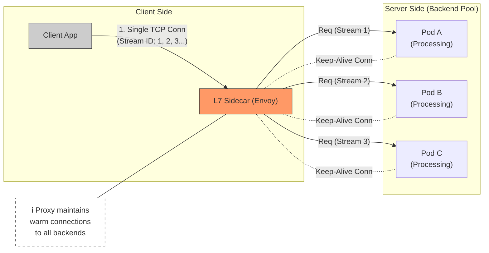
#### D. Алгоритмы "Внутри" L7 (The Smart Brain)
Поскольку прокси видит каждый запрос, он может применять алгоритмы, недоступные для L4.
1. **Least Request (Peak EWMA):**
    - Прокси знает _точно_, сколько запросов сейчас висит в ожидании ответа на `Pod-A`.
    - Если `Pod-A` поймал GC Pause и не отвечает, счетчик активных запросов растет.
    - Алгоритм мгновенно перестает слать туда новые запросы.
    - _L4 так не умеет_, потому что он видит только TCP-соединение, которое "Established", даже если приложение висит.
2. **Canary Weighting:**
    - "95% запросов на `v1`, 5% запросов на `v2`".
    - L4 может делить только по количеству подов (грубо). L7 делит математически точно.

> [!check] Архитектурный Вердикт
> 
> 1. Если вы используете **gRPC**, **L7 неизбежен**. Без него вы не получите масштабируемости.
>     
> 2. Используйте **Continuous Profiling**, чтобы следить за "Налогом на Сайдкар".
>     
>     - Если вы видите, что `envoy` потребляет больше CPU, чем ваша бизнес-логика (часто бывает на мелких JSON-сервисах с высоким RPS) — рассмотрите архитектуру **Ambient Mesh** или отказ от Mesh в пользу "толстых" SDK (gRPC-lb).
>
### 1.3. Case Study: The gRPC "Long-Lived" Disaster
Почему это критично именно для gRPC?

* **Сценарий:** Микросервис `Payment` вызывает `Fraud-Detection` (gRPC).
* **Deployment:** `Payment` имеет 1 реплику. `Fraud` имеет 10 реплик.
* **L4 Flow:**
    1.  `Payment` стартует, резолвит DNS, открывает TCP-сокет.
    2.  L4 перекидывает сокет на `Fraud-Pod-1`.
    3.  `Payment` шлет 10,000 RPS по этому сокету.
    4.  `Fraud-Pod-1` умирает от перегрузки (OOM / CPU Throttling).
    5.  Остальные 9 подов `Fraud` имеют 0 RPS.
* **Observability:**
    * Grafana показывает: `Fraud Service CPU = 10%` (в среднем). Алерт не звонит.
    * Клиенты получают 504 Timeout.
* **L7 Flow (Service Mesh):**
    * Сайдкар `Payment` видит 10,000 *запросов*.
    * Он раскидывает их веером (Round Robin / P2C) на все 10 подов `Fraud`.
    * Нагрузка на `Fraud-Pod-1` падает до 1,000 RPS. Все живы.

### 1.4. Visual Comparison (Mermaid)

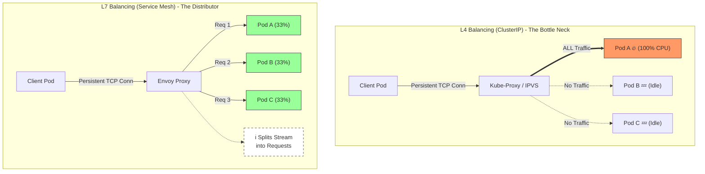

> [!check] Архитектурный вывод
> 
> 1. Если у вас **HTTP/1.1** (короткие запросы) — L4 (стандартный Service) часто достаточно. Соединения закрываются часто, балансировка происходит сама собой.
>     
> 2. Если у вас **gRPC / HTTP/2 / WebSockets** — **L7 обязателен**. Без него вы не сможете масштабировать нагрузку.
>     
> 3. Используйте **Continuous Profiling**, чтобы выявлять дисбаланс реплик (Variance). Если одна реплика "горит", а другие "мерзнут" — у вас проблема L4, а не проблема кода.
>
---
## 2. Load Balancing Algorithms (The Math of Fairness)

> [!abstract] Проблема "Хвоста" (The Tail at Scale)
> В распределенной системе производительность кластера определяется **самым медленным** узлом.
> Если вы балансируете запросы "вслепую" (Round Robin), вы неизбежно отправите быстрый запрос на перегруженный ("горячий") под.
>
> **Результат:** Эффект конвоя (Convoy Effect). Один медленный запрос блокирует обработку сотни быстрых, которые стоят за ним в очереди на сокете.
>
> **Задача алгоритма:** Минимизировать дисперсию (Variance) нагрузки между репликами.
### 2.1. Static Algorithms (Blind)

> [!abstract] Фундаментальная ошибка "Равенства"
> Статические алгоритмы основаны на ложной предпосылке: **"Все запросы равны, и все серверы равны"**.
>
> $$Cost(Req_A) \approx Cost(Req_B)$$
>
> В реальности:
> * $Req_A$ (Health Check) занимает 0.1ms и 0% CPU.
> * $Req_B$ (Generate PDF Report) занимает 500ms и 100% CPU.
>
> Статический балансировщик (Round Robin) отправит по одному запросу на каждый под.
> **Результат:** Под, получивший $Req_B$, "встанет колом", а под с $Req_A$ будет простаивать. Это называется **Skew (Перекос)**.
#### A. Round Robin (RR): The "Fair" Convoy
Самый старый и простой алгоритм.
* **Логика:** $Next = (Current + 1) \% N$.
* **Механика:** Балансировщик просто перебирает список IP-адресов по кругу. Он не хранит состояние (Stateless) и не знает, жив ли бэкенд (пока не сработает Health Check) и насколько он загружен.

**Термин: The Convoy Effect (Эффект Конвоя)**
Представьте узкую дорогу (Socket/CPU). Если впереди едет медленный трактор (тяжелый запрос), за ним выстраивается очередь из быстрых Ferrari (легкие запросы).
В RR, если "трактор" попал на `Pod-1`, все "Ferrari", отправленные на `Pod-1` по расписанию, будут ждать. P99 (хвостовая задержка) взлетает до небес.

#### B. Weighted Round Robin (WRR)
Попытка исправить ситуацию, если у вас разное железо.
* **Логика:** `Pod-Large` получает 3 запроса, `Pod-Small` получает 1 запрос.
* **Проблема:** Это помогает, если сервера разные, но **не помогает**, если запросы разные. WRR всё так же слеп к текущей загрузке CPU.

#### C. Continuous Profiling Diagnosis: The "Jagged Skyline"
Как доказать, что Round Robin убивает вашу производительность, используя данные профилировщика (Pyroscope/Phlare)?

В идеальном мире профили всех реплик должны быть идентичны (Uniform Distribution).
При использовании RR в гетерогенной среде (разные запросы) вы увидите картину **Replica Variance**:

1.  **Визуализация (Flame Graph Comparison):**
    * Выберите диапазон времени (например, 1 минута).
    * Постройте график `CPU Usage` с разбивкой по `pod_name`.
2.  **Симптомы "Слепой" балансировки:**
    * **Pod-A (The Victim):** Огромные блоки `On-CPU`. Высокий `mutex_lock_wait`. Стек вызовов глубокий.
    * **Pod-B (The Lucky):** Преобладают блоки `runtime.park` / `epoll_wait` (ожидание работы).
    * **Pod-C (The Average):** Что-то среднее.

> [!danger] Anti-Pattern: "Random" Load Balancing
> Некоторые считают, что Random лучше RR, так как избегает синхронизации.
> Математически (закон больших чисел), Random стремится к RR на бесконечности. Но на коротких дистанциях (секунды) Random создает локальные "сгустки" (Clumping) — может случайно отправить 5 тяжелых запросов подряд на один несчастный под.
> **Вердикт:** Random хуже RR для latency-sensitive сервисов.
#### D. Пример из жизни: JSON vs XML
Сервис парсинга документов.
* **Вход:** Поток документов. 90% — легкие JSON (1KB). 10% — тяжелые XML (10MB).
* **Алгоритм:** Round Robin.
* **Сценарий:**
    * Приходит пачка из 10 XML файлов подряд.
    * RR послушно раскладывает их по 10 подам (если повезет) или накидывает по 2-3 на один под (если не повезет с порядком).
* **Profiling View:**
    * Мы видим, что `Pod-3` тратит 80% времени в функции `xml.Decoder.Token`.
    * В это же время `Pod-4` (которому достались JSON) простаивает.
    * **Вывод:** Ресурс кластера используется неэффективно. Нам нужен алгоритм, который видит, что `Pod-3` занят XML-ем, и не шлет туда больше ничего. (См. раздел 2.2 Dynamic Algorithms).

#### E. Visualization: The Blind Dispatcher (Mermaid)

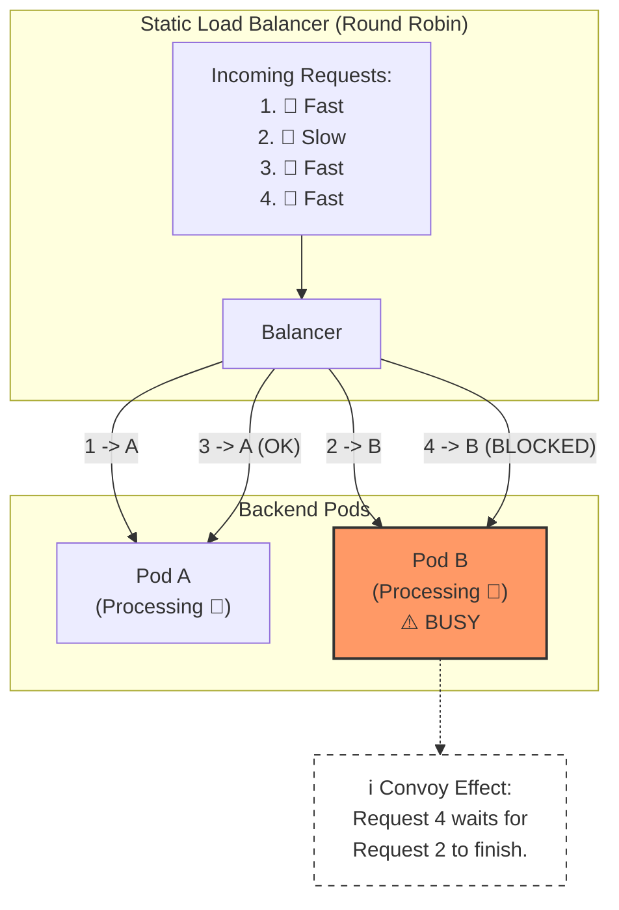

> [!check] Архитектурный Вердикт Используйте **Static Algorithms** (RR/Random) только в двух случаях:
> 
> 1. **Client-Side LB (Simple):** В "толстых" клиентах, где сложно держать состояние сервера.
>     
> 2. **Uniform Workload:** Когда вы точно знаете, что каждый запрос занимает ровно 5мс (например, чтение по ключу из Redis).
>     
> 
> Во всех остальных случаях (особенно HTTP API, gRPC) переходите на **Dynamic Algorithms** (P2C/EWMA).
### 2.2. Dynamic Algorithms (State-Aware)

> [!abstract] Переход от "Списков" к "Метрикам"
> Динамические алгоритмы принимают решение на основе **текущего состояния** бэкендов.
> Балансировщик (Envoy) для каждого апстрима (пода) хранит таблицу скоринга:
> * Сколько запросов сейчас в полете (Active Requests)?
> * Как быстро он отвечал последние 10 секунд (Latency)?
>
> **Цель:** Направить новый запрос туда, где он будет обработан быстрее всего *прямо сейчас*.
#### A. Least Request (LR): The Logical Step
Самый интуитивный динамический алгоритм.
* **Логика:** $Target = \min(ActiveRequests(Pod_1, ..., Pod_N))$.
* **Механика:** Envoy держит счетчик `atomic int` для каждого соединения. `+1` при отправке запроса, `-1` при получении ответа.
* **Проблема "Thundering Herd" (Грочущее стадо):**
    * Если `Pod-New` только что поднялся, у него 0 запросов.
    * В кластере с 1000 Envoy-прокси, *каждый* из них одновременно увидит "О, пустой под!" и отправит туда пачку трафика.
    * `Pod-New` мгновенно умирает от перегрузки.
    * *Решение:* Envoy использует LR не глобально, а в сочетании с P2C.

#### B. P2C: Power of Two Choices (The Gold Standard)
Это дефолтный алгоритм в Linkerd и современном Nginx. Математическое чудо, решающее проблему масштабирования.

* **Проблема LR:** Чтобы найти *абсолютный* минимум среди 1000 подов, нужно проверить их все ($O(N)$). Это дорого и требует блокировок.
* **Решение P2C:**
    1.  Выбираем случайно **два** индекса: $i, j$.
    2.  Сравниваем нагрузку: $Load(i)$ vs $Load(j)$.
    3.  Выбираем лучшего из двух.
* **Магия:** Математически доказано (Mitzenmacher, 2001), что этот подход дает балансировку, неотличимую от идеальной, но за константное время $O(1)$.
#### C. Peak EWMA (Exponentially Weighted Moving Average)
Это алгоритм "высшей лиги", созданный специально для языков с **Garbage Collection** (Java, Go, Node.js, Python).

* **Проблема Least Request:**
    * Представьте, что `Pod-A` вошел в **Stop-the-World GC Pause**.
    * Он перестал принимать новые соединения и обрабатывать старые.
    * Старые запросы завершились (или отвалились по таймауту). Счетчик `ActiveRequests` упал до **0**.
    * *Least Request:* "О, `Pod-A` свободен! Шлем туда трафик!".
    * *Результат:* Балансировщик заваливает "мертвый" (зависший) под запросами, которые умрут по таймауту.
* **Решение EWMA:**
    * Скор (оценка) пода зависит не только от кол-ва запросов, но и от **времени ответа (Latency)**.
    * Формула (упрощенно): $Score_t = Latency_{now} \cdot \alpha + Score_{t-1} \cdot (1-\alpha)$.
    * Если под начал "тупить" (Latency выросла), его Score резко ухудшается.
    * Даже если у него 0 запросов, EWMA помнит: *"Он отвечал 5 секунд в прошлый раз. Не шли туда, пока он не остынет"*.

#### D. Continuous Profiling Diagnosis: The "GC Hole"
Как увидеть работу EWMA на Flame Graph и убедиться, что она спасает вас от GC пауз?

**Сценарий:** Java-сервис с Heap 10GB. Раз в час случается Full GC на 2 секунды.

1.  **Если включен Round Robin / Least Request:**
    * На Flame Graph "спящего" пода вы увидите всплеск `G1GarbageCollector`, а рядом — **огромные блоки входящих HTTP-хендлеров**.
    * *Это плохо:* Под пытался работать, пока чистил память. Это вызвало Latency Spike для пользователей.
2.  **Если включен Peak EWMA:**
    * На Flame Graph вы увидите *только* `G1GarbageCollector`.
    * Блоки HTTP-хендлеров **исчезнут** на эти 2 секунды.
    * *Это отлично:* Балансировщик (Envoy) заметил замедление и *автоматически* перестал слать трафик на этот под.
    * **Результат:** Пользователи не заметили GC паузы, так как их запросы ушли на соседние поды.

#### E. Visualization: P2C Logic (Mermaid)

Как P2C выбирает жертву.

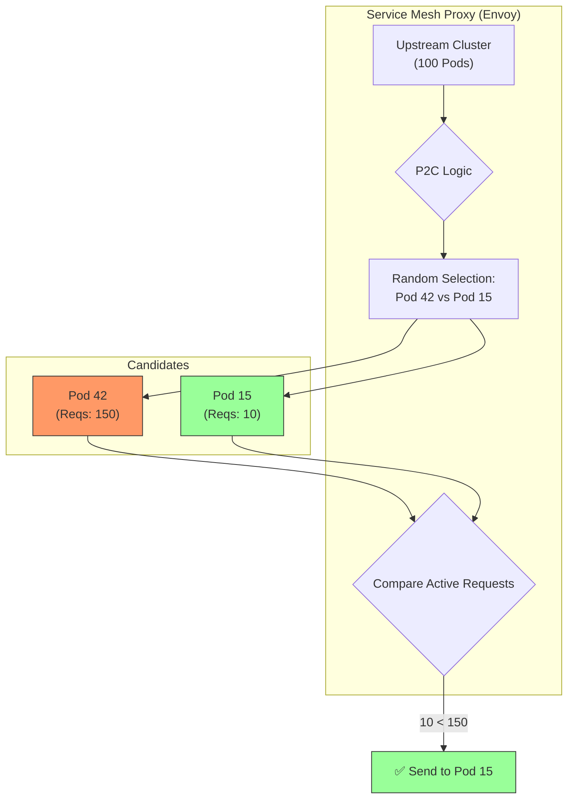

> [!check] Архитектурный Вердикт
> 
> 1. **P2C — это безопасный дефолт** для 90% микросервисов. (В Istio/Envoy: `lb_policy: LEAST_REQUEST` по факту использует P2C).
>     
> 2. **EWMA — обязателен для Java/Node.js**. Если у вас есть рантайм с GC, включите этот алгоритм. Это "бесплатное" улучшение стабильности.
>     
> 3. **Continuous Profiling Validation:**
>     
>     - Найдите на графике момент GC.
>         
>     - Если в этот момент под продолжал обрабатывать внешние запросы (и тормозить) — ваш балансировщик настроен неправильно.
>         
>     - Идеальная картина: GC начался $\to$ Трафик упал в ноль $\to$ GC закончился $\to$ Трафик вернулся.
>
### 2.3. The Future: Feedback-Driven Balancing (Profiling Integration)

> [!abstract] Сдвиг парадигмы: От "Симптомов" к "Причинам"
> Традиционные алгоритмы (EWMA, P2C) реагируют на **Latency** (Задержку).
> *Latency — это "запаздывающий индикатор" (Lagging Indicator).* Когда Latency выросла, пользователь *уже* пострадал, а очередь запросов *уже* переполнена.
>
> **Feedback-Driven Balancing (2026):**
> Балансировщик принимает решения на основе **насыщения ресурсов** (Resource Saturation), полученных через Continuous Profiling (eBPF).
> Мы не ждем, пока под начнет тормозить. Мы видим, что его очередь к CPU (Runqueue) выросла, и превентивно уводим трафик.

#### A. The New Signals: What eBPF sees?
Вместо примитивного "CPU Usage %" (который в контейнерах часто врет из-за троттлинга), мы используем метрики "изнутри ядра":

1.  **CPU Runqueue Latency (Самая важная метрика):**
    * *Определение:* Время, которое поток проводит в состоянии `RUNNABLE`, ожидая, пока планировщик ОС (CFS Scheduler) даст ему процессорное время.
    * *Смысл:* Это "очередь в кассу". Если кассир (CPU) работает быстро, но очередь длинная — вы будете ждать.
    * *Почему это лучше Latency:* Runqueue растет *до* того, как HTTP Latency пробьет потолок. Это раннее предупреждение.
2.  **Off-CPU Time (IO Wait):**
    * *Определение:* Время, когда поток заблокирован и ждет диска, сети или мьютекса.
    * *Сценарий:* Под A ждет ответа от базы данных. Его CPU = 0%. Обычный балансировщик (Least Request) завалит его новыми запросами.
    * *Profiling LB:* Видит, что потоки "висят" (Blocked), и снижает вес пода, понимая, что он не может обрабатывать запросы.
#### B. The Protocol: ORCA (Open Request Cost Aggregation)
Как передать эти данные от eBPF-агента в Envoy Proxy?
В 2026 году стандартом стал **ORCA** (изначально разработан Lyft/Envoy).

* **Механизм:**
    1.  **Backend (с eBPF):** При ответе на запрос (`200 OK`) добавляет специальный HTTP-заголовок (или gRPC Trailer) `x-endpoint-load-metrics`.
    2.  **Payload:** Внутри заголовка закодированы метрики профилирования:
        * `cpu_utilization`: Реальная нагрузка.
        * `mem_utilization`: Давление на память.
        * `application_utilization`: (Custom) Например, размер очереди задач внутри приложения.
    3.  **Load Balancer (Envoy):** Читает этот заголовок, обновляет веса для *этого конкретного эндпоинта* и следующий запрос шлет на другой под.

#### C. Real-World Scenario: The "Noise Neighbor" Problem
Классическая проблема Kubernetes, которую не решают обычные балансировщики.

* **Ситуация:**
    * `Pod-A` и `Pod-B` — реплики одного сервиса.
    * `Pod-A` живет на "тихой" ноде.
    * `Pod-B` живет на ноде, где соседний контейнер (CryptoMiner) съедает весь кэш L3 процессора и пропускную способность шины памяти.
* **Реакция Standard LB:**
    * CPU Usage у `Pod-B` нормальный (он ограничен лимитами).
    * Latency чуть выше, но в пределах нормы.
    * *Решение:* Шлем трафик 50/50.
* **Реакция Profiling LB:**
    * eBPF видит на `Pod-B` высокий **CPI (Cycles Per Instruction)** — процессору приходится ждать данные из RAM.
    * eBPF видит микро-задержки в Runqueue.
    * *Решение:* Envoy получает сигнал "Efficiency Drop" и снижает вес `Pod-B` до 10%.
    * **Итог:** P99 Latency остается стабильным, несмотря на шумного соседа.
#### D. Visualization: The Feedback Loop (Mermaid)

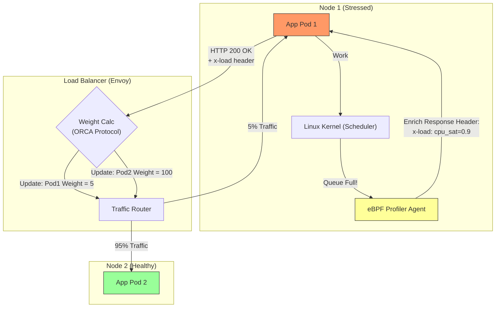

> [!check] Архитектурный Вердикт
> 
> 1. **Включите L7 Load Reporting:** Если вы используете Envoy/Istio, изучите настройку `LoadReportingService` (LRS) или поддержку ORCA.
>     
> 2. **Смотрите на Runqueue:** В дашбордах мониторинга добавьте график `node_schedstat_waiting` (из node-exporter или eBPF). Если он коррелирует с ростом Latency — вам нужен Feedback-Driven Balancing.
>     
> 3. **Continuous Profiling как Автопилот:** Это будущее. Профилировщик больше не просто "картинка для человека", это "датчик для автопилота" балансировщика.
>
### 2.4. Visualization: The Feedback Loop (Mermaid)
Как метрики профилирования меняют веса балансировки в реальном времени.

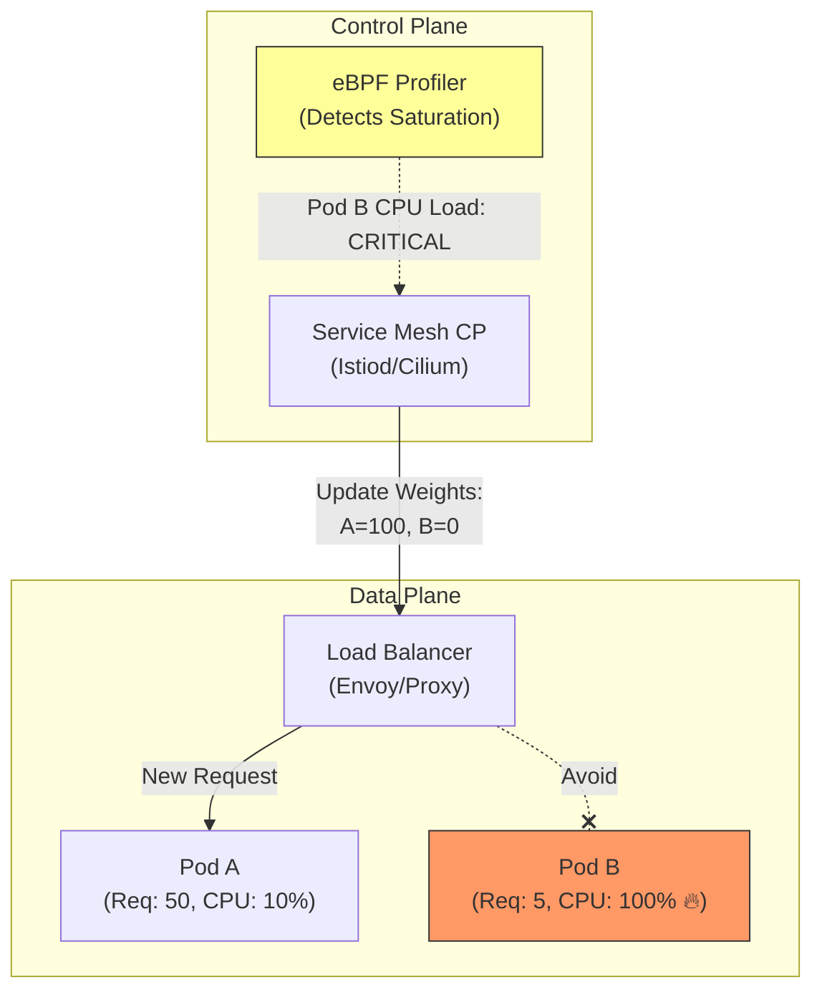
### 2.5. Comparison Matrix

|**Algorithm**|**Complexity**|**Fairness**|**CPU Cost**|**Best For...**|
|---|---|---|---|---|
|**Round Robin**|O(1)|⭐|Low|Static content, Dev envs.|
|**Least Request**|O(N) or O(1)|⭐⭐⭐|Medium|Long-lived connections (gRPC).|
|**P2C**|O(1)|⭐⭐⭐⭐⭐|Low|**General Purpose (Default)**.|
|**Peak EWMA**|O(1)|⭐⭐⭐⭐|Medium|Services with **GC Pauses** (Java, Node).|
|**Feedback (eBPF)**|O(1)|⭐⭐⭐⭐⭐⭐|High (Setup)|**CPU-bound workloads** (AI, Transcoding).|

> [!check] Архитектурный Вердикт
> 
> 1. **Никогда не используйте Round Robin** для микросервисов в продакшене. Это причина №1 необъяснимых пиков P99.
>     
> 2. Установите **P2C (Power of Two Choices)** как дефолт в вашем Service Mesh (`lb_policy: LEAST_REQUEST` в Envoy обычно реализует P2C).
>     
> 3. Если у вас Java-приложения, включите **EWMA**, чтобы балансировщик автоматически обходил поды во время GC.
>     
> 4. Используйте **Continuous Profiling**, чтобы валидировать настройки. Если Flame Graph показывает дисбаланс (Variance) — меняйте алгоритм.

---
## 3. Service Mesh Architectures: Evolution 2026

> [!abstract] Эволюция: От изоляции к эффективности
> **2018-2024 (Sidecar Era):** "Один под — Один прокси".
> * *Философия:* Максимальная изоляция. Если Envoy падает, он роняет только один сервис.
> * *Цена:* **Sidecar Tax**. Если у вас 1000 микросервисов, вы запускаете 1000 копий Envoy. Это съедает до 30% ресурсов кластера.
>
> **2026 (Ambient / Sidecar-less Era):** "Прокси как инфраструктура".
> * *Философия:* Сеть — это коммунальный ресурс (как электричество). L4 процессинг спускается на уровень Ноды (DaemonSet), L7 — в выделенные шлюзы.
> * *Цена:* Снижение изоляции (Shared Proxy), но радикальная экономия ресурсов и упрощение эксплуатации.

### 3.1. The Sidecar Pattern (Legacy / Specific Use-Cases)

> [!abstract] Определение: Сайдкар (Мотоциклетная коляска)
> В этой модели `Pod` Kubernetes перестает быть атомарной единицей запуска *одного* процесса.
>
> * **Структура:** В каждом Поде запускаются **два** контейнера:
>     1.  **Application Container:** Ваш код (Java/Go/Node).
>     2.  **Proxy Container (Sidecar):** Экземпляр Envoy (Istio) или Linkerd-proxy.
> * **Сетевая магия:** Весь входящий и исходящий трафик приложения принудительно заворачивается (через `iptables` rules, настроенные init-контейнером) в Proxy Container. Приложение думает, что общается с сетью, но на самом деле общается с Сайдкаром через `localhost`.

#### A. Mechanics: How "Transparent Interception" works?
Многие инженеры не понимают, как Сайдкар перехватывает трафик без изменения кода приложения.

1.  **Init-Phase:** При старте Пода запускается `istio-init` (с привилегиями `NET_ADMIN`).
2.  **Rules Injection:** Он прописывает правила в таблицу NAT ядра Linux внутри сетевого неймспейса Пода:
    * *"Всё, что пришло на порт 80, перенаправь на порт 15001 (Envoy)"*.
    * *"Всё, что исходит от приложения, перенаправь на порт 15001"*.
3.  **Runtime:** Приложение делает `curl google.com`. Ядро перехватывает пакет и отдает его Envoy. Envoy решает, можно ли туда ходить, шифрует пакет в mTLS и отправляет дальше.

#### B. The "Isolation" Advantage (Why it is still used?)
В 2026 году Sidecar считается Legacy для *обычных* задач, но он незаменим для **High-Security** и **Multi-Tenant** сред.

* **Security Boundary:** Если Envoy в `Pod-A` взломан (RCE), хакер получает доступ только к трафику `Pod-A`. В модели Ambient (общий прокси на ноду) взлом прокси компрометирует *все* поды на ноде.
* **Resource Fairness:** Если `Pod-A` начинает спамить запросами, он пожирает CPU *своего* Сайдкара (и упирается в свои cgroups лимиты). Он не может "съесть" процессорное время соседа.
* **Custom WASM:** Если вам нужно выполнять сложную бизнес-логику на уровне сети (например, кастомная валидация JWT токенов через WebAssembly), безопаснее делать это в изолированном Сайдкаре.

#### C. The "Tax" Problem (Why it is dying?)
Главная причина смерти Сайдкаров — экономика.

1.  **Resource Hoarding (O(N)):**
    * Envoy требует минимум ~50MB RAM и 0.1 CPU просто для старта.
    * Если у вас 1000 микросервисов $\to$ 1000 Envoy.
    * **Итог:** Вы тратите 50GB RAM просто на "инфраструктурный клей". В облаке это тысячи долларов в месяц.
2.  **Latency Overhead:**
    * Путь пакета: `Wire` $\to$ `Host NIC` $\to$ `Pod NetNS` $\to$ `iptables` $\to$ `Envoy` $\to$ `App`.
    * Это добавляет 2-5 мс задержки. Для High-Frequency Trading или Real-Time систем это неприемлемо.

#### D. Continuous Profiling Diagnosis: Seeing the Overhead
Сайдкар делает накладные расходы видимыми. Если вы запустите профилирование (Pyroscope) на Поде, вы увидите "двугорбый" Flame Graph.

* **Stack A (Your App):** Ваша бизнес логика (`com.mycompany.OrderService`).
* **Stack B (The Tax):** Стек Envoy (`envoy::Network::ConnectionImpl`, `boringssl`, `tcmalloc`).

**Как читать профиль:**
* **Healthy:** Envoy занимает 5-10% ширины графика. (Плата за mTLS и метрики).
* **Unhealthy:** Envoy занимает 40-50% ширины.
    * *Причина:* Скорее всего, вы гоняете через Mesh огромные пейлоады (JSON по 10MB) или у вас слишком много мелких запросов (Chatty Service), и Envoy тратит всё время на парсинг HTTP/2 фреймов.
    * *Решение:* Выключите Sidecar для этого сервиса или перейдите на Ambient Mesh.

#### E. Visual Flow: Inside the Pod (Mermaid)

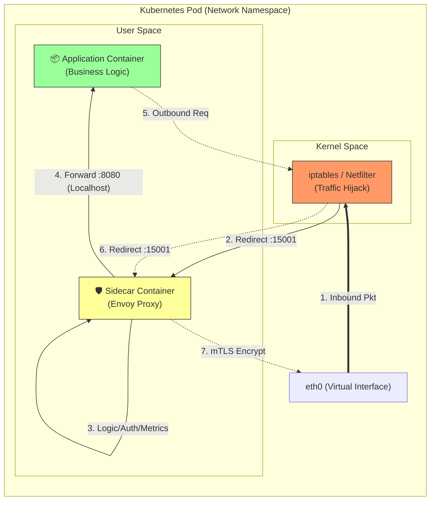

### 3.2. The Sidecar-less / Ambient Pattern (The New Standard)

> [!abstract] Разделение ответственности: L4 vs L7
> В модели Sidecar мы платили "полную цену" (L7 парсинг) за каждый запрос, даже если нам нужно было просто шифрование.
>
> **Ambient Mesh (2026)** разделяет Service Mesh на два слоя:
> 1.  **Secure Overlay (L4):** Дешевый, быстрый слой, работающий на уровне всей Ноды. Обеспечивает mTLS, TCP-метрики и Zero Trust. Включен всегда.
> 2.  **Waypoint Proxy (L7):** Полноценный Envoy, который подключается **только по требованию**. Нужен только если вы используете сложные политики (HTTP Header routing, Retries, Circuit Breaking).
>
> **Результат:** Снижение потребления RAM на 90% для сервисов, которым не нужен L7.

#### A. Layer 4: The Secure Overlay (ZTunnel / Cilium)
Это фундамент Ambient Mesh. Вместо тысячи прокси в подах, мы запускаем один агент на ноду.

* **Component:** `ZTunnel` (Istio, написан на Rust) или `Cilium Agent` (eBPF).
* **Protocol (HBONE):** Трафик инкапсулируется в **HTTP/2 CONNECT** туннель (HBONE - HTTP Based Overlay Network Environment).
    * Это позволяет пробрасывать TCP-трафик прозрачно, сохраняя mTLS шифрование.
* **Performance:**
    * Написан на Rust/eBPF, поэтому оверхед минимален.
    * Нет парсинга HTTP тела запроса. Только заголовки TCP/IP.
* **Profiling Impact:**
    * В профиле приложения (Container) вы больше не видите `envoy`. Вы видите чистый стек вызовов приложения.
    * Сетевая задержка "размазывается" по ядру ОС.

#### B. Layer 7: The Waypoint Proxy (Opt-in Intelligence)
Что делать, если вам нужно маршрутизировать запросы на основе HTTP-заголовка `User-Agent`? ZTunnel (L4) не умеет читать заголовки.

* **Architecture:** Вы деплоите отдельный `Deployment` (Waypoint Proxy) для своего неймспейса или сервис-аккаунта.
* **Traffic Flow:**
    1.  `Pod-A` отправляет запрос.
    2.  `ZTunnel` на ноде видит, что для целевого сервиса настроена L7-политика.
    3.  `ZTunnel` заворачивает трафик и отправляет его в `Waypoint Proxy` (это может быть на другой ноде).
    4.  `Waypoint` парсит HTTP, применяет логику и отправляет получателю.
* **Экономика:** Вы платите CPU только за те запросы, которые *реально* требуют L7 обработки.
#### C. Continuous Profiling Challenge: "The Noisy Neighbor"
В модели Sidecar профиль `envoy` принадлежал одному поду. В Ambient модели агент (ZTunnel) — общий.

**Проблема:**
1.  Вы видите, что процесс `ztunnel` на `Node-5` потребляет 4 ядра CPU (100% лимита).
2.  Из-за этого тормозит сеть у всех 20 подов на этой ноде.
3.  **Вопрос:** Кто виноват? Какой из 20 подов генерирует этот трафик?

**Решение (eBPF Profiling with Attribution):**
Стандартный `pprof` здесь бессилен. Вам нужен eBPF-профилировщик (например, Pixie или Pyroscope eBPF), который умеет сопоставлять системные вызовы с cgroups.
* **Filter by Cgroup:** Профилировщик должен показать CPU Usage агента `ztunnel`, но сгруппированный по *Source Pod IP*.
* **Diagnosis:** "Ага, 95% времени CPU внутри `ztunnel` тратится на шифрование трафика от `Pod-Bad-Guy`".

#### D. Comparison: "Tax" Visualization
Разница в накладных расходах (Overhead) на обработку одного запроса.

| Stage | Sidecar (Legacy) | Ambient (L4 Only) | Ambient (L7 Waypoint) |
| :--- | :--- | :--- | :--- |
| **Intercept** | iptables (Slow) | eBPF / Redirect (Fast) | eBPF / Redirect (Fast) |
| **Encryption** | Envoy (C++) | Rust / Kernel (Fast) | Rust $\to$ Envoy (C++) |
| **Parsing** | **Always HTTP/2** | **None (TCP)** | **HTTP/2** |
| **Hops** | 2 Local Hops | 0-1 Remote Hops | 2 Remote Hops ("Hairpin") |
| **Cost** | ⭐⭐⭐ (High) | ⭐ (Low) | ⭐⭐ (Medium) |

#### E. Visualization: The "Hairpin" Traffic Flow (Mermaid)

Показывает, как трафик делает петлю через Waypoint только при необходимости.

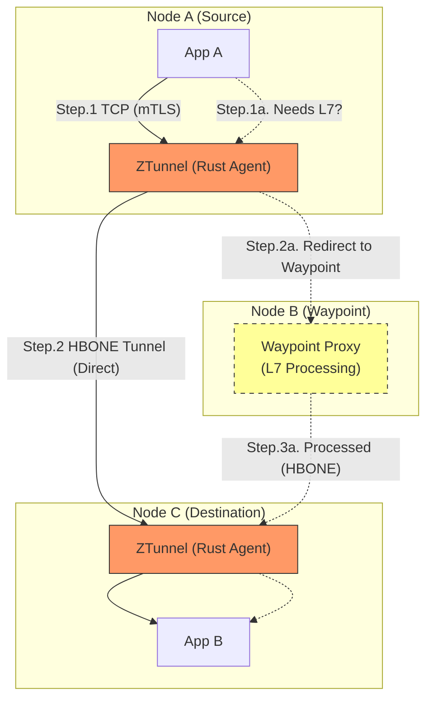

> [!check] Архитектурный Вердикт
> 
> 1. **Default to Ambient:** Для всех новых кластеров Kubernetes в 2026 используйте режим Ambient (или Cilium Mesh).
>     
> 2. **Avoid Waypoints:** Старайтесь не использовать L7 Waypoint без нужды. Проектируйте систему так, чтобы ей хватало L4 (TCP) балансировки и mTLS. Это даст вам производительность "голого" железа (Bare Metal).
>     
> 3. **Monitor the DaemonSet:** Настройте алерты на CPU Usage процесса `ztunnel` / `cilium-agent`. Если он упирается в полку — сеть встанет на всей ноде.
>
### 3.3. Comparative Analysis: Profiling & Cost

| Feature | Sidecar Model | Ambient / Sidecar-less Model |
| :--- | :--- | :--- |
| **Resource Cost** | 🔴 **High** (O(N) memory overhead). | 🟢 **Low** (Shared infrastructure). |
| **Latency** | 🟡 Medium (Fixed cost per request). | 🟢 Low for L4 (Direct), 🟡 Medium for L7 (Extra hop). |
| **Isolation** | 🟢 **High** (Crash loop affects 1 pod). | 🟡 Medium (Node-proxy crash affects all pods on node). |
| **Upgrade** | 🔴 **Painful** (Restart all apps to update Envoy). | 🟢 **Seamless** (Update DaemonSet/Deployment only). |
| **Profiling Visibility**| 🟢 **Clear** (Proxy is in the pod profile). | 🔴 **Obscured** (Proxy is outside; need Node-level profiling). |
### 3.4. Continuous Profiling Strategy for Sidecar-less
Переход на Ambient Mesh требует изменения подхода к диагностике. Вы больше не можете смотреть только на поды приложения.

**Сценарий:** Приложение тормозит, но его CPU Usage низкий.
**Sidecar Era:** Вы смотрите на `istio-proxy` в том же поде.
**Ambient Era:** Вы должны смотреть на **Node-Level Profile**.

1.  **Shared Proxy Saturation:**
    * Откройте профиль процесса `ztunnel` (или `cilium-agent`) на ноде.
    * Если он потребляет >80% выделенного лимита CPU, значит, нода перегружена сетевым трафиком.
    * *Действие:* Evict (выселить) часть подов на другую ноду.
2.  **Kernel/eBPF Cost:**
    * В Cilium большая часть работы происходит в пространстве ядра (SoftIRQ).
    * Обычные Application Profilers (Java/Go pprof) **не видят** это время.
    * *Действие:* Используйте eBPF-профилировщики (Pyroscope eBPF mode), которые показывают время, проведенное в `ksoftirqd` и BPF-программах.

### 3.5. Visualization: Traffic Flow Evolution (Mermaid)

Наглядно показывает, почему Ambient экономит ресурсы, но усложняет путь трафика для L7.

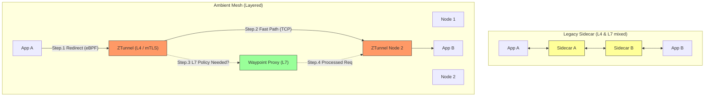

> [!check] Архитектурный Вердикт
> 
> 1. **Greenfield:** Начинайте сразу с **Sidecar-less** (Cilium или Istio Ambient). Это сэкономит вам ~30% бюджета на облако.
>     
> 2. **Observability:** Убедитесь, что ваша система профилирования (Pyroscope/Parca) умеет собирать данные **со всей Ноды**, а не только с контейнеров.
>     
> 3. **Диагностика:** Если L7 Waypoint Proxy начинает "гореть" (по профилю), это значит, вы перегрузили Mesh логикой. Попробуйте перенести часть логики (например, простые ретраи) на уровень клиента или L4, если возможно.
>

---
## 4. Advanced Resilience Features

> [!abstract] Философия "Graceful Degradation"
> Распределенные системы *всегда* находятся в состоянии частичного отказа.
> Задача Service Mesh — не "исправить" сбой, а **локализовать** его, чтобы падение одного микросервиса (Payment) не обрушило весь маркетплейс.
>
> **Ключевые механизмы 2026:**
> 1.  **Circuit Breaking:** "Выдернуть вилку из розетки", если устройство дымится.
> 2.  **Adaptive Concurrency:** "Впускать в клуб столько людей, сколько успевает обслужить бармен".
> 3.  **Deadline Propagation:** "Если клиент ждет всего 1 секунду, не начинай задачу, которая займет 5".
### 4.1. Circuit Breaking (The "Fuse")
Это защита от дурака и от перегрузки. Реализуется на уровне Envoy (Client Side).

* **Logic:** Envoy следит за ответами от апстрима (Service B).
* **Trigger:** "Если за последние 10 секунд произошло 5 ошибок (5xx) ИЛИ 3 тайм-аута".
* **Action (Open State):** Envoy **мгновенно** перестает слать запросы на Service B. Клиент получает ошибку `503 Service Unavailable` (Fail Fast) без ожидания.
* **Recovery (Half-Open):** Через 30 секунд Envoy пропускает *один* пробный запрос. Если ок — закрывает цепь. Если ошибка — ждет еще минуту.

> [!tip] Profiling Insight
> **Как калибровать?**
> Если ваш Circuit Breaker срабатывает слишком часто ("мигает"), откройте профиль **клиента** в момент сбоя.
> Если вы видите, что клиент ждет в `socket_read` (сеть), а серверный профиль показывает `idle` — проблема в сети/балансире.
> Если серверный профиль показывает `mutex_lock` — сервер жив, но заблокирован. Circuit Breaker спас вас от зависания потоков.
### 4.2. Retries & Retry Budgets (The Dangerous Friend)
Ретраи могут спасти от моргания сети, но могут убить систему (Retry Storm).

* **Naive Retry:** "Повторять 3 раза при любой ошибке".
    * *Результат:* Если сервис лежит, вы увеличиваете нагрузку на него в 4 раза (1 + 3).
* **Retry Budget (Best Practice 2026):**
    * Envoy ограничивает *процент* ретраев от общего потока.
    * *Правило:* "Ретраить не более 20% запросов".
    * Если у вас идет 100 RPS, и 50 из них падают, Envoy сделает ретрай только для 20. Остальные 30 получат ошибку сразу. Это спасает бэкенд от добивания.

### 4.3. Deadline Propagation (Global Time Control)
Критически важно для gRPC и глубоких цепочек вызовов (`A -> B -> C -> D`).

* **Problem:**
    * Сервис `A` вызывает `B` с таймаутом **5s**.
    * `B` думает 4.9s и вызывает `C`.
    * `B` ставит дефолтный таймаут для `C` в **5s**.
    * *Итог:* `A` уже отвалился по таймауту (5s прошло), а `C` продолжает молотить CPU еще 5 секунд впустую.
* **Solution (Deadline Propagation):**
    * gRPC передает заголовок `grpc-timeout`.
    * Когда `B` вызывает `C`, он смотрит: "У меня осталось 0.1s".
    * Он посылает запрос к `C` с таймаутом **100ms**.
    * `C` видит 100ms, понимает, что не успеет, и даже не начинает обработку.

### 4.4. Adaptive Concurrency (The "Auto-Pilot")
Статические лимиты (`max_connections: 100`) устарели. Железо ведет себя по-разному.

* **Algorithm (AIMD):**
    * Envoy измеряет Latency в реальном времени.
    * Если Latency стабильна — он понемногу увеличивает лимит параллельных запросов (**Additive Increase**).
    * Как только Latency начала расти (точка насыщения) — он резко снижает лимит (**Multiplicative Decrease**).
* **Result:** Сервис всегда работает на пике пропускной способности, но никогда не уходит в перегрузку (Queue buildup).
* **Profiling View:** При включенном Adaptive Concurrency профиль сервиса стабилизируется. Исчезают пики `runqueue_latency`.

### 4.5. Zone Aware Load Balancing (Topology Keys)
Экономия денег и снижение задержек.

* **Logic:**
    * Если `Pod-Client` находится в зоне `us-east-1a`.
    * Mesh отправляет трафик *преимущественно* на поды в `us-east-1a`.
* **Failover (Spillover):**
    * Если поды в `us-east-1a` перегружены (или упали), Mesh начинает переливать трафик в `us-east-1b`.
* **Cost:** Межзонный трафик в AWS/GCP стоит денег ($0.01-$0.02 за GB). Локализация трафика экономит тысячи долларов.

### 4.6. Visualizing Deadline Propagation (Mermaid)

Почему важно прокидывать дедлайны.

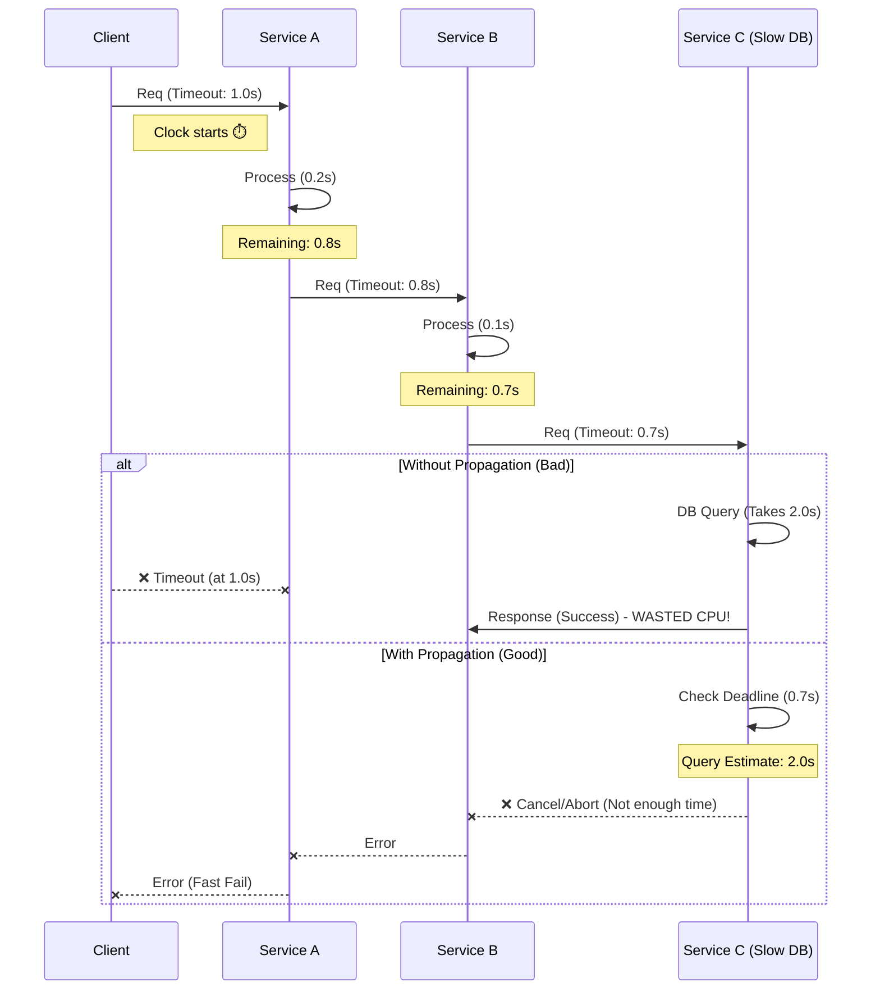
### 4.7. Continuous Profiling Strategy: Tuning Timeouts
Как выбрать правильный таймаут? Не гадайте. Смотрите в профиль.
1. **Capture:** Снимите профиль сервиса под нагрузкой.
2. **Analyze Wall Time:** Переключите Pyroscope в режим `Sample Type: Wall Time` (или `Delay`).
3. **Inspect P99:** Найдите, сколько времени занимает обработка 99% запросов (включая IO wait, блокировки БД).
4. **Set Formula:**
    $$Timeout = P99_{WallTime} \times 1.5 + Buffer$$
    
    _Если P99 = 200ms, ставьте таймаут 350-400ms. Ставить 30 секунд — это разрешать потокам висеть полминуты при сбое БД._

> [!check] Архитектурный Вердикт
> 
> 1. **Включите Retry Budget:** Это страховка от DDoS.
>     
> 2. **Используйте gRPC Deadlines:** Убедитесь, что ваши SDK прокидывают контекст (`ctx`) с дедлайнами по всей цепочке.
>     
> 3. **Adaptive Concurrency > Static Rate Limits:** Дайте Mesh самому найти предел производительности вашего сервиса.
>     
> 4. **Калибруйте таймауты профилировщиком:** Таймаут должен быть _чуть больше_ реального времени выполнения (Wall Time), а не произвольным числом.
>

---
## 5. Load Balancing & Continuous Profiling (Integration)

> [!abstract] Парадигма: От "Monitor & React" к "Sense & Adapt"
> Традиционная балансировка смотрит на **внешние** признаки: "Сервис отвечает медленно (Latency high) -> снижаем нагрузку".
> **Проблема:** Latency — это *посмертная* метрика. Когда она выросла, запрос уже пострадал.
>
> **Интеграция с Profiling (2026):**
> Мы связываем eBPF-профилировщик напрямую с Control Plane балансировщика.
> * **Signal:** "Очередь планировщика ядра (Runqueue) выросла". (Это происходит *до* роста Latency).
> * **Action:** Балансировщик мгновенно меняет веса (Weights), перенаправляя трафик на свободные ноды.
> * **Результат:** Система балансируется по *реальному насыщению* (Saturation), а не по косвенным признакам.

### 5.1. The "CPU Usage" Lie vs. True Saturation
Почему нельзя просто балансировать по CPU Usage (как это делает Kubernetes HPA)?

1.  **The Container Trap:** В Kubernetes лимиты (CPU Limits) реализуются через CFS Quota (Throttling).
    * Под может показывать 100% Usage, но при этом эффективно молотить числа (например, Video Transcoding). Это *хорошая* нагрузка.
    * Под может показывать 100% Usage, но тратить 60% времени на `context_switch` и `lock_contention`. Это *плохая* нагрузка.
    * Обычный `top` не видит разницы.
2.  **eBPF View (PSI & Runqueue):**
    * Continuous Profiler видит метрику **PSI (Pressure Stall Information)** или **Runqueue Latency**.
    * *Runqueue:* "Сколько микросекунд поток ждал, пока освободится ядро CPU".
    * Если Runqueue растет — значит, сервер перегружен, даже если CPU Usage < 80%.

### 5.2. Mechanism: Profiling-Driven Weight Adjustment
Как технически реализовать обратную связь между ядром Linux и Envoy Proxy?

**Компоненты:**
1.  **Sensor (eBPF Agent):** Pyroscope/Parca запускается на ноде. Собирает метрики `cpu_scheduler_latency` и группирует их по Pod IP.
2.  **Aggregator (Custom Metrics Adapter):** Преобразует данные профилировщика в формат, понятный Mesh-контроллеру (например, Prometheus format).
3.  **Actuator (Service Mesh CP):** Istiod или Cilium Operator читает метрику.
    * Если `Runqueue > 100ms` $\to$ `Weight = 1` (Min).
    * Если `Runqueue < 10ms` $\to$ `Weight = 100` (Max).
4.  **Enforcer (Envoy):** Получает обновленные веса через xDS протокол (Endpoint Discovery Service).

### 5.3. Case Study: The "Crypto-Miner" Neighbor
Классическая проблема облака: "Шумный сосед".

* **Ситуация:**
    * На одной ноде живут `App-Pod` (Ваш сервис) и `Data-Pod` (Тяжелая БД другого отдела).
    * `Data-Pod` начинает активно использовать L3-кэш процессора и шину памяти.
* **Standard LB View:**
    * CPU Usage у `App-Pod` низкий (он ждет память).
    * Latency чуть выросла.
    * *Решение:* LB продолжает слать трафик. `App-Pod` начинает тормозить сильнее.
* **Profiling LB View:**
    * eBPF видит рост метрики **LLC-Miss** (Last Level Cache Misses) и **CPI** (Cycles Per Instruction).
    * Профилировщик сигнализирует: "Эффективность процессора упала в 5 раз".
    * LB снижает вес `App-Pod`, спасая SLA, пока Kubernetes не перенесет под на другую ноду.

### 5.4. Advanced Pattern: Load Shedding (Сброс балласта)
Иногда балансировать некуда — все поды перегружены. Профилировщик помогает решить, *кого* убить.

* **Логика:**
    * Если профиль показывает, что 40% времени уходит на `GC` (Garbage Collection), добавление трафика приведет к **Death Spiral** (OOM Kill).
* **Action:**
    * Включается режим **Load Shedding**.
    * Envoy начинает дропать (отбрасывать) низкоприоритетный трафик (например, запросы от поисковых ботов или фоновую синхронизацию) *на входе*, чтобы дать приложению "продышаться".
    * Решение принимается на основе *типа* нагрузки в профиле (GC = Shed Load immediately).

### 5.5. Visualization: The Closed Loop (Mermaid)

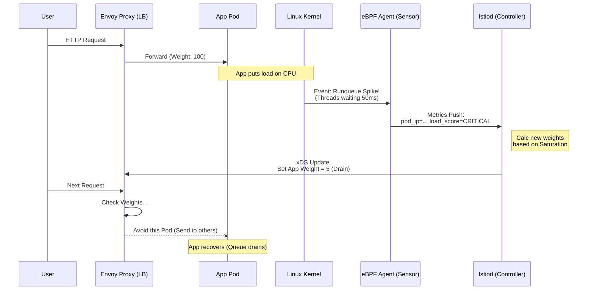
### 5.6. Terminology Clarification
- **Load Balancing (LB):** Распределение трафика между _существующими_ ресурсами. Работает быстро (миллисекунды).
- **Auto-Scaling (HPA):** Добавление _новых_ ресурсов (подов). Работает медленно (минуты).
- **Load Shedding:** Сброс излишков трафика, когда ресурсы исчерпаны.
- **Runqueue Latency:** Время ожидания потока в очереди на исполнение. Самая честная метрика насыщения CPU.
- **CPI (Cycles Per Instruction):** Показатель эффективности работы процессора. Высокий CPI = процессор ждет память/кэш (Stalled).

> [!check] Архитектурный Вердикт
> 
> 1. **Autoscaling недостаточно:** HPA слишком медленный. Вам нужна умная балансировка.
>     
> 2. **CPU Usage лжет:** Переходите на метрики насыщения (PSI / Runqueue) для принятия решений о маршрутизации.
>     
> 3. **Интеграция:** Используйте механизмы типа **ORCA** (Open Request Cost Aggregation) в Envoy для передачи метрик от профилировщика (eBPF) в балансировщик. В 2026 году это поддерживается нативно в Cilium Mesh.
>
---
## 6. Summary & Best Practices

> [!abstract] Финальный Манифест 2026
> Идеальная система балансировки должна быть **невидимой** (без Sidecar overhead), **умной** (понимать перегрузку CPU до роста Latency) и **жестокой** (мгновенно отключать сбойные узлы).
>
> **Золотое правило:**
> Не оптимизируйте код приложения, пока не убедитесь, что ваш Load Balancing распределяет нагрузку равномерно.
> *Оптимизация кода в системе с плохой балансировкой (Skew) — это полировка автомобиля, у которого квадратные колеса.*

### 6.1. Protocol Strategy: L4 vs L7 Decision Gate
Не платите "налог на парсинг" (L7 Tax) там, где это не нужно.

| Критерий | Рекомендация | Почему? | Profiling Check |
| :--- | :--- | :--- | :--- |
| **HTTP/1.1 (REST)** | **L4 (ClusterIP)** | Соединения короткие. Kube-proxy справится бесплатно. | Профили реплик должны быть идентичны. |
| **gRPC / HTTP/2** | **L7 (Mesh)** | Мультиплексирование требует разбора запросов. | Если используете L4, увидите **Variance Anomaly** (один под горит, другие спят). |
| **Database (TCP)** | **L4 (Cilium)** | Парсить SQL протокол в Envoy дорого. | Смотрите `ksoftirqd` на ноде. |
| **Public Edge** | **L7 (Ingress)** | Нужен WAF, Auth, Rate Limit. | Envoy будет потреблять CPU, это нормально. |

### 6.2. Algorithm Selection: The "P2C" Default
Забудьте про Round Robin.

1.  **Default:** Всегда ставьте **P2C (Power of Two Choices)** или **Least Request**. Это математически гарантирует отсутствие "хвостов" (Tail Latency).
2.  **Java/Node/Go:** Если у вас есть Garbage Collector, включите **Peak EWMA**.
    * *Смысл:* Алгоритм автоматически "объедет" под, который замер в GC Pause, так как его Latency резко вырастет.
3.  **High-Load Compute:** Для AI/ML задач используйте **Feedback-Driven (ORCA)**. Балансируйте по длине очереди GPU/CPU.

### 6.3. Architecture: Sidecar vs Ambient
Экономия денег — часть работы архитектора.

* **Greenfield (Новые проекты):** Начинайте с **Ambient Mesh** (Istio Ambient / Cilium).
    * *Выгода:* Экономия ~30-40% RAM/CPU кластера (нет дублирования прокси).
    * *Диагностика:* Используйте eBPF-профилировщик (Pyroscope) на уровне Ноды, чтобы следить за здоровьем общего `ztunnel` / `cilium-agent`.
* **High-Security (Zero Trust Strict):** Используйте **Sidecar**.
    * *Причина:* Если требование безопасности гласит "расшифровка ключей только внутри контейнера приложения".

### 6.4. Resilience: The "Kill Switch" Rules
Настройте это до того, как пойдете в прод.

1.  **Circuit Breaker:** Обязателен.
    * *Настройка:* `MaxFailures: 5`, `ResetTimeout: 30s`.
    * *Цель:* Не добивать лежачего. Fail Fast.
2.  **Retry Budget:** Обязателен.
    * *Настройка:* Ретраить не более **20%** от общего трафика.
    * *Цель:* Предотвратить Retry Storm (DDoS самого себя).
3.  **Timeouts:**
    * *Anti-Pattern:* "Поставлю 30 секунд на всякий случай".
    * *Best Practice:* Снимите профиль Wall Time для P99. Умножьте на 1.5. Это и есть ваш таймаут.

### 6.5. Troubleshooting Flow: The "Triangle of Truth"
Когда система тормозит, проверьте три угла.
1.  **Load Balancing (Skew):**
    * *Вопрос:* Нагрузка распределена ровно?
    * *Tool:* Grafana (RPS per Pod).
    * *Profiling:* Сравните Flame Graph двух разных подов. Если они разные — чините балансировщик (L4 -> L7).
2.  **App Performance (Code):**
    * *Вопрос:* Код тормозит сам по себе?
    * *Tool:* Tracing (Jaeger).
    * *Profiling:* Посмотрите на ширину стеков `On-CPU`.
3.  **Infrastructure (Saturation):**
    * *Вопрос:* Сосед мешает? Сеть забита?
    * *Tool:* eBPF Profiler (Node Level).
    * *Profiling:* Ищите `runqueue_latency`, `ksoftirqd`, `envoy` overhead.

### 6.6. Final Workflow Visualization (Mermaid)

Алгоритм действий при внедрении балансировки в 2026.

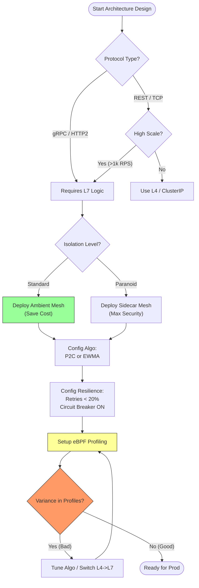

> [!check] Your Next Action
> 
> 1. Зайдите в настройки вашего `DestinationRule` (Istio) или `ServiceProfile` (Linkerd).
>     
> 2. Проверьте поле `loadBalancer`.
>     
> 3. Если там пусто (дефолт) или `ROUND_ROBIN` — **поменяйте на `LEAST_REQUEST` прямо сейчас**.
>     
> 4. Это займет 5 минут и, возможно, решит ваши проблемы с редкими таймаутами.

