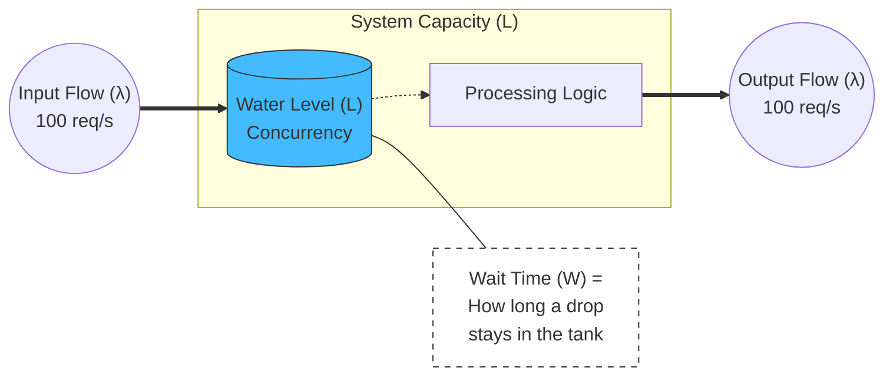
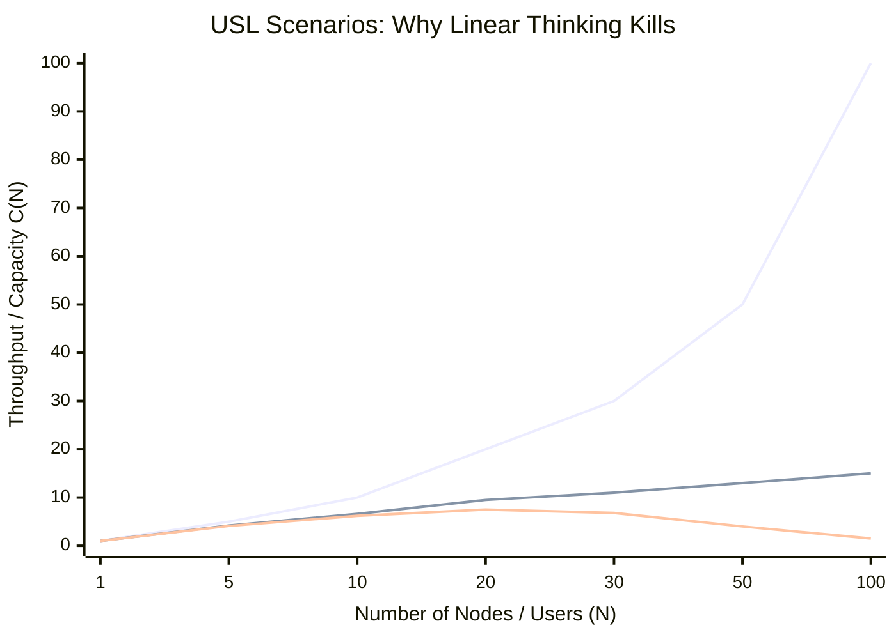
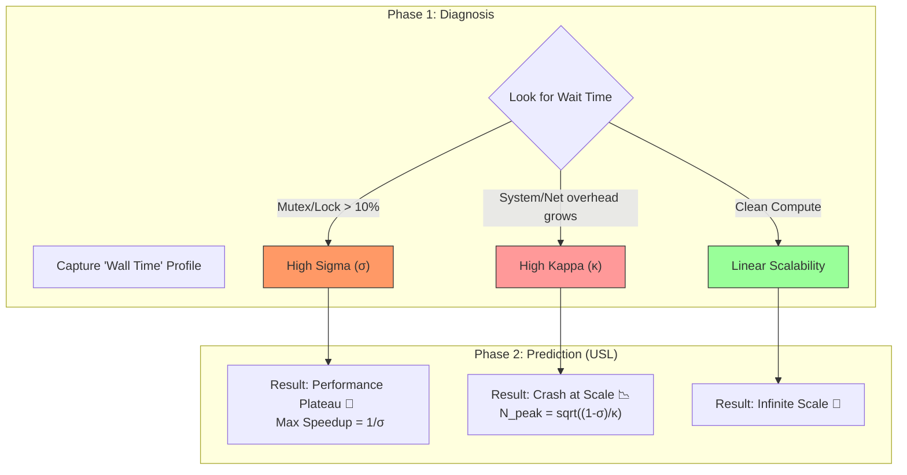
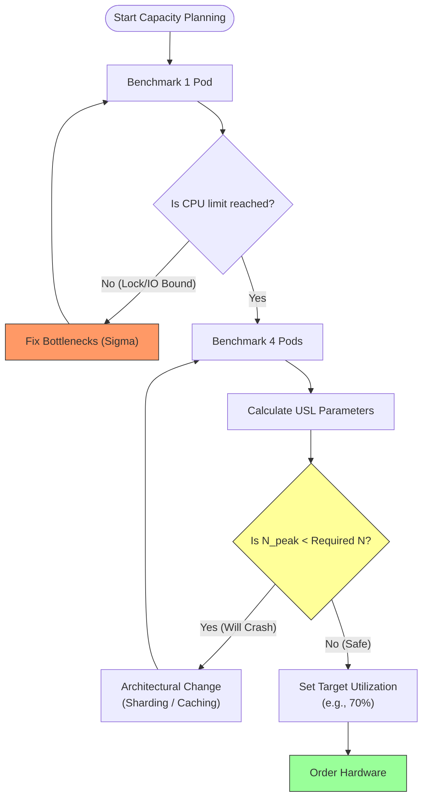
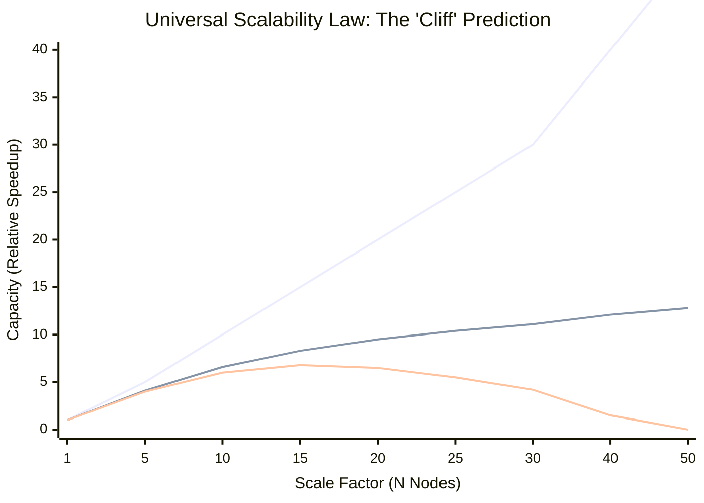
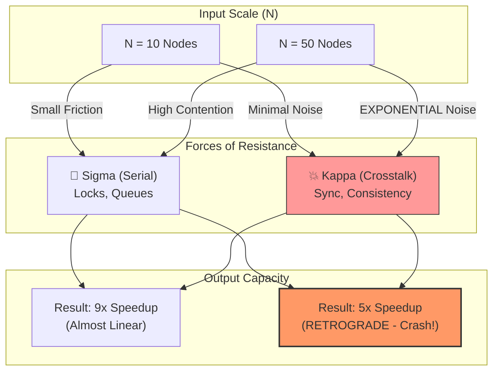
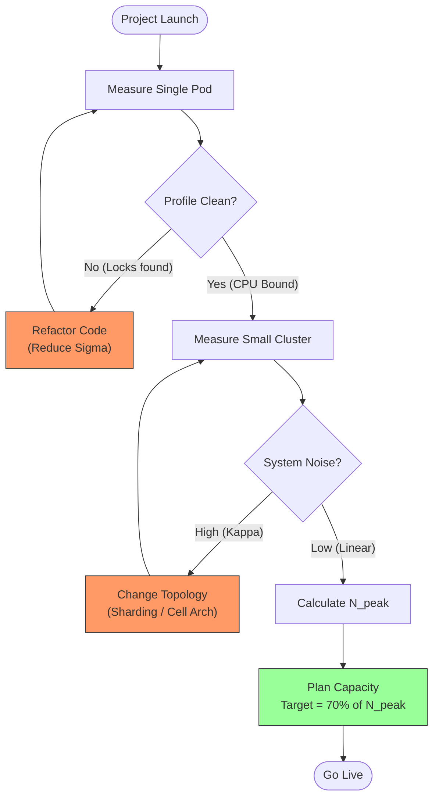

**Tags:** #sre #capacity-planning #math #performance #usl #profiling

## 1. The Philosophy: Why Linear Extrapolation Kills

> [!abstract] Ложь "Линейного Масштабирования"
> Интуиция подсказывает: *"Если 1 кассир обслуживает 10 покупателей в час, то 10 кассиров обслужат 100".*
>
> **В реальности:** 10 кассиров начинают толкаться локтями, бороться за доступ к одному терминалу оплаты и тратить время на разговоры друг с другом. В итоге они обслуживают не 100, а 60 покупателей. А если добавить 100 кассиров — магазин встанет.
>
> **Capacity Planning 2026** строится на поиске двух точек перегиба:
> 1.  **The Knee (Колено):** Где заканчивается линейный рост (Закон Амдала).
> 2.  **The Cliff (Обрыв):** Где производительность начинает падать (USL).

### 1.1. The Three Zones of Scalability
Любая система под нагрузкой проходит через три фазы. Ваша задача — знать, в какой фазе вы находитесь *сейчас*.

#### Zone 1: The Linear Zone (Ideal)
* **Состояние:** Ресурсы независимы. Shared State отсутствует.
* **Поведение:** $N \to 2N \Rightarrow Capacity \to 2Capacity$.
* **Пример:** Stateless микросервисы, которые делают `md5(input)` и не ходят в базу.
* **Profiling View:** При росте RPS профиль каждого пода остается неизменным (Uniform Profile).

#### Zone 2: The Contention Zone (Amdahl's Law)
* **Состояние:** Появляется конкуренция за общий ресурс (БД, Кеш, Network Bandwidth).
* **Поведение:** Добавление ресурсов дает *затухающий* эффект (Diminishing Returns).
    * Удвоили сервера $\to$ прирост +50%.
    * Еще удвоили $\to$ прирост +10%.
* **Причина (Serialization):** Часть работы ($\sigma$) должна выполняться последовательно. Пока один пишет в строку БД, остальные ждут.
* **Profiling View:** На Flame Graph появляются "Башни Ожидания" (Wait Towers) — `mutex_lock`, `futex`, `db_connection_wait`. Ширина стеков полезной работы уменьшается.

#### Zone 3: The Retrograde Zone (Universal Scalability Law)
Это "Зона Смерти", которую не видит линейная экстраполяция.
* **Состояние:** Накладные расходы на координацию (Coherency/Crosstalk) превышают полезную работу.
* **Поведение:** Добавление ресурсов **снижает** общую производительность.
    * Добавили ноду в кластер Kafka/Cassandra $\to$ RPS упал на 20%.
* **Причина (Crosstalk):** Каждая новая нода должна общаться со всеми остальными ($N^2$ связей). Сеть забита служебным трафиком (Gossip protocol, Rebalancing).
* **Profiling View:** Профиль забит системным шумом: `gc_drain`, `ksoftirqd` (прерывания), `serialization/deserialization`. Бизнес-логики почти нет.
### 1.2. The Mathematical Trap: Utilization vs. Latency
Почему нельзя планировать загрузку серверов на 90%?
Многие думают: *"У нас 80% CPU, значит у нас есть еще 20% запаса"*.
**Это фатальная ошибка.**

Согласно теории массового обслуживания (Queueing Theory), время ожидания ($Wait$) зависит от утилизации ($U$) гиперболически:

$$Wait Time \approx \frac{Service Time}{1 - U}$$

* При **U = 50%**: $Wait = \frac{1}{0.5} = 2x$ (Приемлемо).
* При **U = 80%**: $Wait = \frac{1}{0.2} = 5x$ (Тормоза).
* При **U = 95%**: $Wait = \frac{1}{0.05} = 20x$ (Сайт лежит).
* При **U = 100%**: $Wait = \infty$.

> [!danger] Архитектурное правило
> "Свободный CPU" (Idle CPU) — это не потраченные зря деньги. Это **страховка вашей Latency**.
> Если вы держите сервера на 90% CPU, любой микро-сплеск (Microburst) трафика на 10% отправит вашу Latency в космос (на порядок).
> **Целевая утилизация:** 60-70% для Latency-Sensitive систем.

### 1.3. Continuous Profiling: Seeing the Invisible Barriers
Как понять, что вы приближаетесь к границе зон, не доводя систему до падения?

1.  **Measuring Contention ($\sigma$ - Serialization):**
    * Профилировщик (Wall Time) показывает, какой процент времени потоки проводят в состоянии `Blocked`.
    * Если 15% времени потоки ждут `GlobalLock` — вы *никогда* не сможете масштабироваться больше, чем в $1/0.15 \approx 6.6$ раз (даже если у вас 1000 ядер).
2.  **Measuring Crosstalk ($\kappa$ - Coherency):**
    * Сравните профили при 10 подах и при 20 подах.
    * Если доля времени на `etcd_sync`, `cache_invalidation` или `gc_marking` выросла непропорционально — вы входите в Retrograde Zone.
    * Линейная экстраполяция здесь скажет "добавь еще подов", а профилировщик скажет "остановись, ты делаешь хуже".

### 1.4. Visual Analogy: The Dinner Party
Чтобы объяснить это бизнесу, используйте аналогию "Ужина":

* **Linear:** 4 человека едят пиццу. Каждый ест со своей скоростью. Добавили 4 человека и 4 пиццы — съели в 2 раза больше.
* **Contention (Amdahl):** У всех один нож для резки пиццы. Люди ждут в очереди за ножом. Добавление людей не ускоряет процесс, так как нож (бутылочное горлышко) один.
* **Retrograde (USL):** Люди начинают договариваться, кто следующий возьмет нож, спорить, вежливо уступать друг другу, и спрашивать "вкусно ли тебе?".
    * При 20 гостях, 90% времени уходит на разговоры (Crosstalk), и никто не ест.
    * Добавление еще 10 гостей приведет к тому, что все умрут с голоду, так как уровень шума станет невыносимым.

> [!check] Архитектурный Вердикт
> **Линейная экстраполяция работает только в учебниках.**
> В реальном Capacity Planning ваша цель — найти $\sigma$ (конкуренцию) и $\kappa$ (накладные расходы) с помощью нагрузочного тестирования и профилирования, и подставить их в формулу USL.
> Только так вы узнаете реальный предел вашей системы ($N_{peak}$).

---
## 2. Little’s Law (The Physics of Flow)

> [!abstract] "Омметр" для вашей системы
> В электротехнике $I = V/R$. В распределенных системах $L = \lambda \times W$.
>
> Это не эмпирическое правило. Это **математическая теорема**, доказанная Джоном Литтлом в 1961 году. Она верна для *любой* стабильной системы очередей: от очереди в Starbucks до буферов внутри процессора Intel.
>
> **Суть:** Количество запросов внутри вашего сервера (Concurrency) жестко привязано к входящему потоку (RPS) и времени обработки (Latency). Вы не можете изменить одно, не затронув остальные.

#### A. The Equation (Formula)
$$L = \lambda \times W$$

Где:

1.  **$L$ (Concurrency / WIP - Work In Progress):**
    * *Что это:* Среднее количество запросов, находящихся *внутри* системы в любой момент времени.
    * *Физика:* Это сумма запросов, которые **активно обрабатываются** CPU + запросы, которые **ждут** в очередях (Runqueue, Mutex wait, IO wait).
    * *В Kubernetes:* Количество активных горутин (`go_goroutines`), потоков Java или In-flight requests в Envoy.
2.  **$\lambda$ (Throughput / Arrival Rate):**
    * *Что это:* Скорость входящего потока (запросов в секунду - RPS).
    * *Условие:* В стабильной системе скорость входа равна скорости выхода ($\lambda_{in} = \lambda_{out}$).
3.  **$W$ (Wait Time / Latency / Residence Time):**
    * *Что это:* Среднее время, которое запрос проводит внутри системы (от приема байта до отправки ответа).
    * *Состав:* $W = ProcessingTime + QueueTime$.

#### B. Practical Example: Capacity Sizing
Закон Литтла позволяет планировать "железо" (RAM) на салфетке.

* **Задача:** Мы ожидаем трафик **10,000 RPS** ($\lambda$). Наш сервис отвечает за **200 мс** ($W=0.2s$). Сколько памяти нам нужно, если один запрос потребляет **5 MB** стека/кучи?
* **Расчет:**
    1.  Найдем Concurrency: $L = 10,000 \times 0.2 = 2,000$.
    2.  Это значит, что в *любую секунду* ваш сервер будет держать в памяти 2,000 одновременных соединений.
    3.  RAM = $2,000 \times 5 MB = 10,000 MB \approx 10 GB$.
* **Вывод:** Вам нужно минимум 10GB RAM. Если вы выделите 4GB, придет OOM Killer, даже если CPU будет свободен.

#### C. The "Stability" Trap (Where it breaks)
Закон работает только для **стабильных систем** (Stationary State), где средняя скорость входа равна средней скорости выхода.

* **Сценарий перегрузки:**
    * Вам прилетает 2000 RPS ($\lambda_{in}$).
    * Ваш сервер (из-за блокировок БД) может обработать только 1000 RPS ($\lambda_{out}$).
    * **Результат:** Очередь ($L$) растет бесконечно ($L \to \infty$). Закон Литтла здесь применяется к *росту очереди*, предсказывая, как быстро вы исчерпаете RAM.

#### D. Continuous Profiling Integration: The "Area" Insight
Как связать эту сухую формулу с красочными Flame Graphs?
**Flame Graph — это и есть визуализация Закона Литтла.**

Представьте профилировщик, который снимает стек-трейсы с частотой 100 Гц (100 раз в секунду).
* Если в системе находится $L=10$ активных запросов, профилировщик за 1 секунду соберет $10 \times 100 = 1000$ сэмплов.
* Если $L$ вырастет до 50 (из-за тормозов), профилировщик соберет 5000 сэмплов.

> [!tip] Profiling Interpretation
> 1.  **Ширина графика ($Total Samples$) $\propto L$ (Concurrency).**
>     * Если Flame Graph стал "шире" (больше сэмплов за тот же интервал времени), значит выросло $L$.
> 2.  **Закон Литтла в действии:**
>     * Вы видите, что ширина графика выросла в 2 раза ($L \uparrow$).
>     * Вы смотрите на дашборд Load Balancer'а: RPS не изменился ($\lambda \approx$).
>     * **Математический вывод:** Значит, Latency ($W$) обязана была вырасти в 2 раза.
>     * *Если мониторинг Latency этого не показывает — ваш мониторинг врет (например, он не учитывает время в очереди).*

#### E. Troubleshooting Scenario: The "Invisible" Latency
Классический кейс, который решается только через Little's Law + Profiling.

1.  **Симптом:** Поды рестартуют по OOM (Out Of Memory).
2.  **Dashboard:**
    * RPS: 500 (Const).
    * Latency (P99): 100ms (Const). *Кажется, всё ок.*
    * Memory: Растет пилой до краха.
3.  **Application:** Асинхронный сервис на Node.js или Go.
4.  **Анализ через Little's Law:**
    * Если Memory растет, значит растет $L$ (количество объектов в памяти/запросов).
    * Так как $L = \lambda \times W$, и $\lambda$ (RPS) постоянен, значит **растет $W$ (Latency)**.
    * *Но дашборд говорит, что Latency 100ms!*
5.  **Profiling Investigation:**
    * Открываем профиль `active_goroutines` или `heap_objects`. Видим рост.
    * Причина: Latency, которую вы мерите на выходе (response time), не учитывает "утечку" запросов, которые *никогда* не завершаются (Deadlocks) или висят в очень долгих ретраях.
    * Для этих "зомби-запросов" $W \to \infty$, поэтому $L \to \infty$.
    * **Вывод:** Закон Литтла помог найти утечку горутин, которую скрывал стандартный Latency-мониторинг (который часто мерит только *успешные* запросы).

#### F. Visualization: The Flow Tank (Mermaid)

Представьте систему как бак с водой.

> [!check] Архитектурный Вердикт
> 
> 1. Используйте $L = \lambda \times W$ для **Sanity Check**. Если RPS стоит, а поды скейлятся (растет $L$) — значит, выросла Latency, даже если вы этого не видите.
>     
> 2. Помните про **Sampling Bias**: Обычные метрики Latency часто показывают только _завершенные_ запросы. Профилировщик (через ширину графика $L$) показывает _все_ запросы, включая те, что зависли.
>

---
## 3. Universal Scalability Law (USL)

> [!abstract] "Закон Гюнтера" против "Закона Амдала"
> Джин Амдал (1967) сказал: *"Ваша скорость ограничена самой медленной последовательной частью"* (Serialization). Это объясняет, почему производительность выходит на плато.
>
> Нил Гюнтер (1993) пошел дальше: *"Ваша скорость также убивается накладными расходами на общение"* (Crosstalk). Это объясняет, почему производительность начинает **падать**.
>
> **USL (Universal Scalability Law)** — это единственная модель, способная предсказать точку краха ($N_{peak}$), когда система рушится под собственным весом.

#### A. The USL Equation (Anatomy of the Curve)
Формула моделирует относительную пропускную способность $C(N)$ в зависимости от нагрузки/узлов $N$.

$$C(N) = \frac{N}{1 + \sigma(N-1) + \kappa N(N-1)}$$

Где знаменатель описывает "силы сопротивления":
1.  **$1$:** Идеальная работа.
2.  **$\sigma (N-1)$:** Линейное замедление (Очередь).
3.  **$\kappa N (N-1)$:** Квадратичное замедление (Хаос).

#### B. The Coefficients: Sigma ($\sigma$) & Kappa ($\kappa$)
Понимание этих двух греческих букв отличает Senior SRE от Junior.

**1. Sigma ($\sigma$) — Contention (Конкуренция / Сериализация)**
* *Физический смысл:* "Очередь в туалет".
* *Суть:* Часть работы, которая не может быть распараллелена. Ресурсы захватываются эксклюзивно.
* *Примеры:*
    * Ожидание `mutex_lock`.
    * Транзакция в БД (Row Lock).
    * Запись в WAL (Write Ahead Log).
* *Эффект:* Превращает график в **Плато** (Асимптота $1/\sigma$). Если $\sigma=0.05$ (5%), вы никогда не разгонитесь быстрее чем в 20 раз.

**2. Kappa ($\kappa$) — Crosstalk (Когерентность / Согласование)**
* *Физический смысл:* "Совещание из 20 человек".
* *Суть:* Накладные расходы на поддержание консистентности данных между работниками. Количество связей растет как $N^2$.
* *Примеры:*
    * Синхронизация кэшей процессора (L3 Cache Coherency / NUMA).
    * Raft/Paxos heartbeats в распределенных системах (etcd, Consul).
    * Репликация данных "каждый каждому".
* *Эффект:* Превращает график в **Обрыв (Retrograde)**. Производительность начинает падать.
#### C. Continuous Profiling: Identifying $\sigma$ and $\kappa$
Как найти эти коэффициенты не методом подбора, а глядя в профилировщик (Pyroscope/Parca)?

**Finding Sigma ($\sigma$): The "Off-CPU" Profile**
Смотрите на время, когда потоки заблокированы (Waiting).
* **Metric:** Wall Time - CPU Time.
* **Markers:**
    * `sync.Mutex`, `RWMutex` (Go).
    * `futex`, `sem_wait` (C++/Linux).
    * `monitor_enter` (Java).
* *Диагноз:* Если при росте нагрузки ширина этих блоков на Flame Graph растет линейно — у вас проблема с $\sigma$. Решение: Шардирование (Sharding) или Lock-free структуры.

**Finding Kappa ($\kappa$): The "System Overhead" Profile**
Смотрите на рост "паразитной" работы, которой не было при малой нагрузке.
* **Metric:** CPU Time (System/Kernel mode).
* **Markers:**
    * **Data Movement:** `memcpy`, `memmove`, `json.Marshal` (Сериализация для передачи соседу).
    * **Kernel/Network:** `ksoftirqd` (обработка прерываний от сетевых карт из-за шквала P2P общения).
    * **GC:** `runtime.gcDrain` (Go) или `G1ConcRefinement` (Java). *Нюанс:* Чем больше узлов/потоков, тем сложнее GC отслеживать ссылки, и накладные расходы растут нелинейно.
* *Диагноз:* Если при удвоении кластера CPU Usage на *каждой* ноде вырос на 10% *без роста полезной нагрузки* — это $\kappa$. Вы сжигаете CPU на Crosstalk.

#### D. The "Scale Curve" Visualization (Mermaid)

График показывает, как Kappa убивает масштабируемость.

> _Примечание: График USL (зеленая линия в воображении) показывает пик где-то на N=20, после чего идет резкий спад (Retrograde)._

#### E. Practical Calculation: Finding $N_{peak}$
Самый важный вопрос Capacity Planning: **"Когда нам остановиться добавлять сервера?"**
Пик производительности достигается в точке:
$$N_{peak} \approx \sqrt{\frac{1-\sigma}{\kappa}}$$
**Пример из жизни (PostgreSQL Cluster):**
1. Вы профилируете кластер под нагрузкой.
2. Видите, что 5% времени уходит на локи ($\sigma = 0.05$).
3. Видите, что при добавлении нод накладные расходы на репликацию растут. Оцениваете $\kappa \approx 0.002$ (0.2%).
4. Считаем предел:$$N_{peak} = \sqrt{\frac{0.95}{0.002}} = \sqrt{475} \approx 21.7$$
5. **Вывод:** Максимальный размер кластера — **21 нода**.
6. Если вы купите 30 нод, кластер будет работать **медленнее**, чем 21. Вы потратите бюджет, чтобы ухудшить сервис.

> [!check] Архитектурный Вердикт
> 
> 1. **Никогда не скейлитесь вслепую.** Если HPA (Horizontal Pod Autoscaler) добавляет поды, а Latency не падает (или растет) — вы уперлись в USL Cliff.
>     
> 2. **Sigma ($\sigma$) лечится архитектурой:** Шардирование, избавление от глобальных локов, асинхронность.
>     
> 3. **Kappa ($\kappa$) лечится локальностью:** Уменьшайте "радиус поражения" общения. Не делайте кластера "каждый с каждым" на 1000 нод. Разбивайте на ячейки (Cells/Shards).
>     
> 4. Используйте **Continuous Profiling**, чтобы мониторить динамику $\kappa$. Если после релиза нового кода `ksoftirqd` или `gc` выросли — вы увеличили Kappa и снизили потолок масштабируемости.
>
---
## 4. Continuous Profiling: Finding $\sigma$ and $\kappa$

> [!abstract] White Box Scalability
> Традиционный подход к USL — "Black Box": мы замеряем RPS на 1, 2, 5, 10 нодах, строим график и пытаемся подобрать формулу, которая ляжет на точки.
>
> **Подход 2026 (Profiling-First):** Мы смотрим *внутрь* процесса.
> * **$\sigma$ (Sigma)** — это площадь "пустоты" на графике (время ожидания блокировок).
> * **$\kappa$ (Kappa)** — это "дельта" накладных расходов между работой в одиночку и работой в толпе.
>
> Профилировщик позволяет предсказать падение кластера из 100 нод, имея всего 5 нод на стейджинге.

### 4.1. Finding Sigma ($\sigma$): The "Serialization" Factor
**Определение:** Доля времени выполнения запроса, которая проходит в *последовательном* режиме из-за ожидания общего ресурса.

**Инструмент:** Profiling в режиме **Wall Time** (или Off-CPU Profiling).
*Warning:* Обычный CPU Profile здесь бесполезен, так как заблокированный поток не потребляет CPU.

**Алгоритм поиска:**
1.  **Capture:** Снимите профиль *Wall Time* под нагрузкой.
2.  **Filter:** Отфильтруйте всё, что находится в состоянии `Runnable` (полезная работа). Оставьте только `Waiting` / `Blocked`.
3.  **Identify:** Ищите функции синхронизации.
    * **Go:** `sync.(*Mutex).Lock`, `runtime.semacquire`, `channel send/recv`.
    * **Java:** `monitorenter`, `Object.wait`, `ReentrantLock`.
    * **Database:** Ожидание `Connection Pool`.
4.  **Calculate:**
    $$\sigma \approx \frac{\text{Time spent in Locks}}{\text{Total Request Time}}$$

> [!example] Пример: The "Global Logger" Trap
> У вас есть супер-быстрый веб-сервер.
> * **Проблема:** Весь код пишет логи через один глобальный объект `Logger`, защищенный мьютексом.
> * **Profiling View:** На Wall Time профиле вы видите, что 5% времени каждого запроса поток висит в `logrus.Mutex.Lock`.
> * **USL Prediction:** $\sigma = 0.05$.
> * **Вердикт:** Максимальное ускорение системы = $1 / 0.05 = 20x$. Даже если вы развернете 1000 подов, система будет работать как 20. Остальные 980 будут просто ждать мьютекс (в данном случае — диск или буфер логгера).

### 4.2. Finding Kappa ($\kappa$): The "Coherency" Factor
**Определение:** Накладные расходы на согласование состояния данных между участниками. Это "налог на существование" в кластере. Растет квадратично ($N^2$) или суперлинейно.

**Инструмент:** **Differential CPU Profiling** (Сравнение профилей).

**Алгоритм поиска:**
1.  **Baseline:** Снимите профиль пода, когда он работает **один** ($N=1$).
2.  **Scale:** Запустите кластер из **10 подов** ($N=10$) под той же нагрузкой на под.
3.  **Diff:** Вычтите профиль №1 из профиля №2. То, что осталось — это $\kappa$.

**Что искать (The "Noise"):**
Функции, доля которых выросла непропорционально:
* **Serialization:** `json.Marshal`, `protobuf.Encode` (мы стали больше пересылать данных соседям).
* **Kernel Network Stack:** `ksoftirqd`, `epoll_wait` (рост прерываний от peer-to-peer трафика).
* **Cluster Consensus:** `etcd.raft`, `consul.gossip`.
* **Cache Coherency:** (Видно через eBPF/Perf) Рост `LLC-misses` (промахи кэша) и `lock_bus` циклов.

> [!example] Пример: The "Chatty Cache"
> Вы используете распределенный кэш (например, Hazelcast или Infinispan) в режиме репликации.
> * **Тест:**
>     * При 1 ноде: CPU тратится на `Map.put` (бизнес-логика).
>     * При 10 нодах: CPU тратится на `Netty.read`, `ClusterService.sync`.
> * **Analysis:** Профиль показывает, что на 10 нодах 20% CPU уходит на синхронизацию.
> * **USL Calculation:** $\kappa$ — это скорость *роста* этих 20%. Если при 10 нодах "мусор" занимает 20%, значит $\kappa$ катастрофически высок. Кластер войдет в **Retrograde Zone** (начнет тормозить) уже на 15 нодах.

### 4.3. The "Profiling Triangle" for USL
Как классифицировать проблему, глядя на Flame Graph?

| Profiling Symptom | USL Factor | Interpretation | Action |
| :--- | :--- | :--- | :--- |
| **Flat, Wide Stacks** (Pure computation) | **Linear** ($\sigma \approx 0, \kappa \approx 0$) | Идеальное масштабирование. | Buy more servers. |
| **Deep "Wait" Towers** (Mutex, IO) | **Sigma** ($\sigma > 0$) | Конкуренция за ресурс (Contention). Добавление серверов бесполезно. | **Sharding** (разбить ресурс) или **Async** (не ждать). |
| **Broad System Noise** (GC, Network, Marshalling) | **Kappa** ($\kappa > 0$) | Накладные расходы на общение (Crosstalk). Добавление серверов вредно. | **Localization** (уменьшить радиус общения) или **Batching**. |

### 4.4. Visualization: From Flame Graph to USL Curve (Mermaid)

### 4.5. Архитектурный вывод (Actionable Advice)
1. **Измеряйте Wall Time, а не CPU Time:** Чтобы найти $\sigma$, вам нужно видеть, где потоки _спят_, а не работают.
2. **Сравнивайте N=1 и N=X:** Чтобы найти $\kappa$, вам нужна дельта. Профиль одного пода в вакууме никогда не покажет проблему когерентности кэшей.
3. **Правило 5%:** Если в профиле Wall Time вы видите, что любой Shared Resource (БД, Лок, Очередь) занимает >5% времени — это красный флаг. Ваша масштабируемость ограничена 20-ю нодами. Чините это _до_ масштабирования.
---
## 5. Practical Workflow: The Capacity Calculator

> [!abstract] От "Гадания" к "Инженерии"
> Задача Capacity Planning — перевести бизнес-метрики (DAU, Orders per Second) в инфраструктурные метрики (CPU Cores, RAM GB, Pod Count).
>
> **Алгоритм 2026 года:**
> 1.  **Micro-Benchmark:** Найти предел одного юнита ($N=1$).
> 2.  **Macro-Benchmark:** Найти коэффициенты деградации ($\sigma, \kappa$) на малом кластере.
> 3.  **Extrapolation:** Рассчитать $N_{peak}$ по формуле USL.
> 4.  **Headroom Calibration:** Определить целевую утилизацию, используя профиль Latency.

### Step 1: The Unit Baseline ($C_1$)
Сначала нужно понять, на что способен **один** изолированный под.

* **Action:** Запустите нагрузочный тест на 1 под (без автоскейлинга).
* **Goal:** Найти точку насыщения (Saturation Point), где Latency начинает деградировать.
* **Metric:** $RPS_{max}$ на 1 CPU Core.
* **Profiling Check:**
    * Снимите профиль в точке насыщения.
    * Убедитесь, что под уперся в CPU (Compute), а не в Lock (Mutex).
    * *Если под уперся в Mutex на 30% CPU — ваш код неэффективен, масштабировать его рано.*

### Step 2: The Scalability Gradient
Теперь нам нужно понять, как система ведет себя в группе. Линейная экстраполяция здесь врет, нам нужны реальные данные.

* **Action:** Проведите тест на **2 подах** и на **4 подах**.
* **Data Points:**
    * $N=1 \to 1000$ RPS.
    * $N=2 \to 1900$ RPS (Efficiency 95%).
    * $N=4 \to 3600$ RPS (Efficiency 90%).
* **Profiling Diff:**
    * Сравните профиль $N=1$ и $N=4$.
    * Появились ли новые функции в топе? (`etcd_sync`, `cache_lock`). Это ваши индикаторы $\sigma$ и $\kappa$.

### Step 3: The USL Calculation (Prediction)
Имея 3 точки (1, 2, 4), мы можем решить уравнение USL и найти неизвестные $\sigma$ и $\kappa$.
*(В 2026 году это делают скрипты или плагины в Grafana, но суть важна).*

* **Input:** Данные из шага 2.
* **Output:** Кривая масштабируемости.
* **Critical Finding:** $N_{peak}$ (Точка разворота).
    * Если расчет показывает, что пик будет на 50 подах, а вам нужно 100 подов для покрытия нагрузки — **вы в тупике**.
    * *Решение:* Не докупать сервера, а снижать $\sigma$ (рефакторинг локов) или $\kappa$ (шардирование БД).

### Step 4: The Headroom Strategy (Safety Margin)
Сколько "воздуха" оставлять в системе?

* **The Hockey Stick Curve:** Latency растет экспоненциально при приближении к 100% утилизации.
* **Rule of Thumb:**
    * **Interactive Services (HTTP/gRPC):** Target 60-70% CPU. (Оставляем 30% на микро-всплески и GC).
    * **Batch Processing (Queue Consumers):** Target 90% CPU. (Очередь сглаживает пики, Latency не важна).
* **Profiling Validation:**
    * Посмотрите на график `runqueue_latency` (очередь к процессору).
    * Найдите точку утилизации (например, 75%), где `runqueue` начинает расти выше 10ms.
    * Это и есть ваш **Hard Limit**. Никогда не планируйте нагрузку выше этой точки.

### 5.5. Visualization: The Decision Logic (Mermaid)

Как принимать решения на основе данных.

> [!check] Архитектурный Вердикт
> 
> 1. **Тестируйте на малых числах:** Вам не нужно разворачивать 1000 серверов, чтобы понять, что система упадет. Достаточно точек 1, 2, 4 и математики USL.
>     
> 2. **Profiling подтверждает модель:** Если USL предсказывает $\kappa$ (Crosstalk), вы _обязаны_ увидеть подтверждение в профилировщике (рост сетевых прерываний или системных вызовов). Если профиль чист — возможно, ошибка в тесте.
>     
> 3. **Запас прочности (Headroom):** Это не "деньги на ветер". Это плата за стабильность Latency согласно законам физики (Little's Law).

---
## 6. Visualization: The USL Curve (Mermaid)

> [!abstract] Карта "Минного поля"
> Этот график — самое важное, что вы должны показать бизнесу, когда они просят "просто добавить еще 10 серверов".
>
> График демонстрирует разрыв между **Ожиданием** (Линейный рост) и **Реальностью** (USL).
> * **Ось X:** Масштаб ($N$ — количество подов/шардов/ядер).
> * **Ось Y:** Производительность ($C(N)$ — Effective Throughput).
>
> **Ключевой инсайт:** После точки $N_{peak}$ добавление ресурсов не просто бесполезно, оно **вредно**. Вы платите деньги за то, чтобы ваша система работала медленнее.

### 6.1. The Three Zones of Scalability (Mathematical Visualization)

На графике представлены три сценария развития событий.

1.  **Linear (Ideal):** $N$ работников делают $N$ работы. (Мечта менеджера).
2.  **Amdahl (Reality with Contention):** Мы упираемся в бутылочное горлышко ($\sigma$). Рост замедляется, но не падает.
3.  **USL (Reality with Crosstalk):** Мы тратим всё время на согласование ($\kappa$). Производительность падает.

> _Примечание: Обратите внимание на зеленую линию (USL). Пик достигается на N=15. На N=50 система мертва (0 Capacity), хотя железа в 50 раз больше._
### 6.2. Zone Decoding: Physics & Profiling
Разберем, что происходит внутри системы в каждой зоне и как это выглядит в профилировщике.
#### Zone A: The Linear Ramp (Start)
- **Диапазон:** $N=1 \dots 5$
- **Физика:** Ресурсов (CPU/RAM) хватает с избытком. Конкуренция за локи минимальна. Накладные расходы на сеть незаметны.
- **Profiling Signature:**
    - Графики (Flame Graphs) "чистые".
    - Доминирует `Business Logic` (парсинг, вычисления).
    - `Wait Time` $\approx 0$.
- **Action:** Масштабируйтесь смело. HPA работает корректно.
#### Zone B: The Amdahl Plateau (Saturation)
- **Диапазон:** $N=5 \dots 15$
- **Физика:** Вступает в игру **Sigma ($\sigma$)**.
    - Потоки начинают выстраиваться в очередь к мьютексу, базе данных или диску.
    - Кривая отклоняется от прямой линии. Прирост от нового узла уже не +100%, а +30%... +10%... +1%.
- **Profiling Signature:**
    - На Flame Graph появляются "Башни Ожидания" (Waiting Towers).
    - Go: `sync.Mutex.Lock`, `runtime.semacquire`.
    - DB: `PoolWait`.
    - _Ширина этих башен растет пропорционально $N$._
- **Action:** Оптимизируйте код. Шардируйте данные. HPA становится неэффективным (дорого за малый прирост).
#### Zone C: The USL Cliff (Retrograde)
- **Диапазон:** $N > 15$ ($N_{peak}$)
- **Физика:** Вступает в игру **Kappa ($\kappa$)**.
    - Система захлебывается в коммуникациях.
    - Каждый новый узел добавляет $N$ новых связей. Сеть забита служебным трафиком (Gossip, Replication, Heartbeats).
    - **Коллапс:** Время на координацию превышает время на полезную работу.
- **Profiling Signature:**
    - Бизнес-логика исчезает с графика.
    - Доминирует "Системный шум": `ksoftirqd` (прерывания), `gc_drain` (сборка мусора), `serialization`, `etcd/raft`.
- **Action:** **STOP SCALING.** Немедленно удаляйте узлы, чтобы вернуться к пику. Разделяйте кластер на независимые ячейки (Cell-based Architecture).
### 6.3. The "Capacity Gap" Visualization (Mermaid)
Концептуальная схема, объясняющая разрыв между ожиданием и реальностью.

### 6.4. Terminology: The Critical Points

1. **$N_{peak}$ (The Peak):** Точка максимума на кривой USL.
    - _Определение:_ Количество узлов, при котором система выдает максимальный RPS.
    - _Правило:_ Никогда не переходите эту черту.
2. **The Knee (Колено):** Точка, где линейный рост переходит в плато (обычно где эффективность падает ниже 70%).
    - _Значение:_ Здесь заканчивается "дешевое" масштабирование.
3. **Headroom (Запас прочности):** Расстояние от текущей нагрузки до $N_{peak}$.
    - _Ошибка:_ Считать Headroom до $100\%$ CPU.
    - _Правильно:_ Считать Headroom до $N_{peak}$ на кривой USL.

> [!check] Архитектурный Вердикт
> 
> 1. **Визуализируйте это:** Не смотрите на сухие цифры RPS. Постройте график $RPS(N)$.
>     
> 2. **Ищите загиб:** Если точки на графике начали отклоняться от диагонали вниз — вы вошли в зону Амдала. Скоро будет обрыв.
>     
> 3. **Профилируйте обрыв:** Continuous Profiling покажет вам, _что именно_ составляет силу $\kappa$ (Kappa). Обычно это неявная синхронизация, о которой разработчики забыли (например, распределенный счетчик или слишком частый Health Check).
>
---
## 7. Summary & Best Practices

> [!abstract] Главный урок
> **Интуиция линейна, реальность нелинейна.**
> Перестаньте спрашивать: *"Сколько RPS держит один сервер?"*.
> Начните спрашивать: *"Какова Sigma ($\sigma$) нашего приложения и какова Kappa ($\kappa$) нашей архитектуры?"*.
>
> * Если $\sigma$ высокая — оптимизируйте код (убирайте локи).
> * Если $\kappa$ высокая — оптимизируйте топологию (уменьшайте радиус общения).
> * Только зная эти параметры, можно безопасно покупать железо.

### 7.1. The Capacity Checklist
Перед запуском в прод (или перед распродажей) пройдите этот чеклист.

| Check | Tool / Method | Why? |
| :--- | :--- | :--- |
| **1. Unit Limit** | Load Test (1 Pod) | Знать $C_1$ (базовую емкость). Убедиться, что боттлнек — CPU, а не IO/Lock. |
| **2. Little's Law Check** | Monitoring | Проверить консистентность метрик: $L \approx \lambda \times W$. Если нет — метрики врут. |
| **3. Contention ($\sigma$)** | **Wall Time Profiling** | Найти % времени в `mutex/lock`. Если >5%, скейлинг будет неэффективным. |
| **4. Crosstalk ($\kappa$)** | **Diff Profiling (1 vs 5)** | Найти рост "системного шума" (GC, Net, SerDe). Если растет быстро — есть риск USL Cliff. |
| **5. USL Prediction** | Math Model | Рассчитать $N_{peak}$. Никогда не скейлить кластер за эту точку. |
| **6. Headroom** | Runqueue Latency | Выставить HPA Target на уровень, где очередь к CPU еще не растет (обычно 60-70%). |
### 7.2. Anti-Patterns to Avoid
Ошибки, которые стоят миллионы.

1.  **"HPA спасет нас":** Автоскейлер реагирует на CPU Usage. Если вы в зоне USL Retrograde, добавление подов *увеличит* нагрузку (Kappa) и уронит систему быстрее.
2.  **"База данных большая, выдержит":** БД — это самый яркий пример системы с высокой $\sigma$ (WAL, Lock manager). Шардирование БД — единственное спасение от Амдала.
3.  **Игнорирование GC при сайзинге:** В языках с GC (Java/Go) нельзя использовать 100% RAM. При >70% заполнении Heap, GC начинает работать экспоненциально агрессивнее (Death Spiral). Учитывайте это в Little's Law ($L_{max}$ ограничено GC, а не OOM).

### 7.3. Final Workflow Visualization (Mermaid)

> [!check] Your Next Action
> 
> 1. Откройте **Pyroscope/Parca**.
>     
> 2. Выберите ваш самый нагруженный сервис.
>     
> 3. Переключите вид в **"Wall Time"** (не CPU).
>     
> 4. Посмотрите, какую долю занимают блокировки (`mutex`, `select`, `wait`).
>     
> 5. Если это число больше **10%** — поздравляю, вы нашли "бесплатную" производительность. Убрав этот лок, вы поднимете потолок масштабируемости всего кластера.

