**Tags:** #architecture #serverless #edge #wasm #webassembly #future #profiling

## 1. The Paradigm Shift: The Death of the "Server"

> [!abstract] Экономика простоя (Idle Cost)
> В классической облачной модели (даже в Kubernetes) вы арендуете **мощность** (Capacity).
> * Вы запускаете Pod с Java-приложением. Он потребляет 512MB RAM.
> * Если трафика нет (ночь), он все равно потребляет 512MB RAM и стоит денег.
>
> **Парадигма 2026:** Вы арендуете **исполнение** (Execution).
> * Нет трафика = Нет запущенных процессов = Счет $0.00.
> * "Сервер" как долгоживущая сущность исчезает. Появляется **Ephemeral Compute** (Эфемерные вычисления), которые материализуются только в момент входящего HTTP-запроса и исчезают сразу после отправки ответа.

### 1.1. Evolution of the Unit of Scale

> [!abstract] Закон уменьшения гранулярности
> История облачных вычислений — это история борьбы с **накладными расходами (Overhead)**.
>
> Каждая эпоха решала одну задачу: **Как упаковать больше полезной нагрузки (Payload) на один физический процессор?**
> * В 2010 мы тратили 5 минут на загрузку OS, чтобы запустить приложение.
> * В 2026 мы не можем позволить себе тратить даже 50 миллисекунд, потому что само приложение живет всего 10 мс.
#### A. The Evolutionary Table (2026 Edition)
Сравнение ключевых метрик на каждом этапе эволюции. Обратите внимание на рост плотности размещения (Packing Density).

| Era | Unit of Scale | Isolation Mechanism | Boot Time | Lifespan | Packing Density (Units per Node) | Archetype Metaphor |
| :--- | :--- | :--- | :--- | :--- | :--- | :--- |
| **1. Metal** | Physical Server | Air Gap (Physical) | ~10 min | Years | 1 | **Pets** (Любимцы) 🐶 |
| **2. Virtual** | VM (EC2) | Hypervisor (Hardware) | ~40 sec | Months | 10 - 50 | **Cattle** (Скот) 🐄 |
| **3. Container**| Pod (Docker) | Kernel Namespaces | ~2 sec | Days | 50 - 200 | **Cattle** 🐄 |
| **4. MicroVM** | Firecracker | KVM stripped | ~150 ms | Minutes | 2,000+ | **Insects** (Насекомые) 🐜 |
| **5. Isolate** | **Wasm Module** | **Memory Sandbox** | **~0.5 ms** | **Milliseconds**| **50,000+** | **Bacteria** (Бактерии) 🦠 |
#### B. Detailed Breakdown of Eras

**1. The Era of Pets (Bare Metal)**
* **Концепция:** Сервер — это уникальный актив. У него есть имя (например, `zeus`, `gandalf`). Если он "болеет" (сбой диска), админ его "лечит" ночью.
* **Проблема:** Огромный CapEx (капитальные расходы). Вы покупаете сервер под пиковую нагрузку, и 90% времени он простаивает (Idle).
* **Overhead:** 0% (все ресурсы ваши), но 90% Wasted Capacity.

**2. The Era of Cattle (Virtualization / Cloud 1.0)**
* **Концепция:** Сервер — это ресурс. Имена заменяются номерами (`web-001`, `db-042`). Если VM "заболела", мы её убиваем и запускаем новую.
* **Технология:** Hypervisor эмулирует железо. Каждая VM везет с собой **полное ядро OS** (Guest OS).
* **Проблема:** "Налог на OS". Если у вас 10 VM на сервере, вы запускаете 10 копий ядра Linux, 10 систем логирования, 10 планировщиков задач. Это съедает 20-30% RAM впустую.

**3. The Era of Containers (Cloud Native / Kubernetes)**
* **Концепция:** "Write Once, Run Anywhere". Мы перестали виртуализировать железо и начали виртуализировать **OS** (Userspace).
* **Технология:** Все контейнеры делят **одно общее ядро** хоста. Изоляция через cgroups (ресурсы) и namespaces (видимость).
* **Проблема:** Изоляция "дырявая" (Leaky). Один контейнер может обрушить ядро, убив соседей. Плюс, контейнер все еще тянет с собой тяжелый Userspace (Ubuntu/Alpine image), весящий сотни мегабайт.

**4. The Era of Bacteria (Wasm / Isolates / Serverless 2.0)**
* **Концепция 2026 года:** Чистая бизнес-логика. Никакой OS. Никакого Userspace. Никаких файловых систем.
* **Технология:** WebAssembly. Код компилируется в бинарный формат, который исполняется в изолированной области памяти внутри процесса-рантайма (как вкладка в Chrome).
* **Преимущество:**
    * **Cold Start:** Меньше 1 мс. Это быстрее, чем TCP handshake.
    * **Security:** Изоляция на уровне памяти (Memory Safety). Выход за пределы массива невозможен математически.
    * **Density:** Вы можете запустить 50,000 "нано-сервисов" на одном ноутбуке.

#### C. Visual Analogy: The Real Estate Metaphor
Чтобы объяснить это бизнесу, используйте аналогию с жильем.
1.  **Bare Metal = Особняк.** Вы владеете землей и домом. Обслуживание крыши — ваша проблема. Дорого, престижно, неэффективно для одного человека.
2.  **VM = Многоквартирный дом.** У вас свои стены, но фундамент и трубы общие. Вы платите коммуналку (Hypervisor tax).
3.  **Container = Гостиничный номер.** Стандартизировано. Быстрый check-in. Но вы все равно платите за коридоры и лифты.
4.  **Wasm = Капсульный отель (Pod).** Только кровать. Минимум пространства. Максимальная эффективность. Вы платите только за часы сна. Если людей нет — отель потребляет минимум энергии.

> [!important] Почему это важно для архитектора?
> Вы не можете использовать паттерны "Особняка" в "Капсульном отеле".
> * В VM вы могли позволить себе запустить Java Agent, который грузится 10 секунд.
> * В Wasm ("Бактерии") у вас **нет времени** на инициализацию. Ваш код должен начинать работать с первой инструкции. Это требует смены стека (например, Rust вместо Java Spring) и смены мышления (Snapshotting вместо Booting).

### 1.2. Serverless 2.0: Scale-to-Zero is the Default

> [!abstract] Определение: Эфемерные Вычисления
> В Serverless 1.0 (2015-2023) "Serverless" означало "Managed Service от облачного провайдера".
>
> **Serverless 2.0 (2026)** — это архитектурный паттерн, применимый везде (Cloud, Edge, K8s).
> Его суть описывается формулой:
> $$Cost = Requests \times (Duration + Memory)$$
> Если $Requests = 0$, то $Cost = 0$.
>
> Это достигается через механику **Scale-to-Zero**: инфраструктура автоматически удаляет все экземпляры приложения при отсутствии трафика и мгновенно (Just-in-Time) создает их при появлении первого пакета.

#### A. The Mechanics of "Zero" (How it actually works)
Как система принимает запрос, если ни одного сервера не запущено?
Здесь работает паттерн **Activator (или Proxy-Buffer)**.

1.  **Idle State (0 Replicas):**
    * В кластере нет подов вашего приложения. Память свободна.
    * Существует только маршрут в Ingress/Gateway, указывающий на специальный компонент — **Activator** (часть Knative или KEDA).
2.  **The Trigger (Request Arrives):**
    * Входящий HTTP-запрос попадает в Activator.
    * Activator видит, что эндпоинтов нет. Он ставит запрос в буфер (hold) и дает команду контроллеру: *"Срочно подними реплику!"*.
3.  **Cold Start (The Penalty):**
    * Оркестратор запускает Pod/Wasm. Это занимает время $T_{boot}$ (от 1мс до 2с).
    * Клиент ждет в буфере. Latency первого запроса = $T_{boot} + T_{process}$.
4.  **Active State:**
    * Как только под готов, Activator сбрасывает буфер в него.
    * Последующие запросы идут напрямую.
5.  **Cool Down:**
    * Если новых запросов нет в течение окна $T_{idle}$ (например, 30 сек), система убивает под.

#### B. The Three Pillars of Serverless 2.0

Чтобы приложение могло пережить такую жестокую жизнь (рождение и смерть тысячи раз в день), оно должно соответствовать трем принципам:

1.  **Strict Statelessness (Строгая бессостоятельность):**
    * Вы не можете хранить сессию в RAM. Вы не можете писать лог в локальный файл `/tmp` в надежде прочитать его позже.
    * *Правило:* Все, что не сохранено во внешнюю БД (Redis, S3, DynamoDB) до возврата HTTP-ответа, считается уничтоженным.
2.  **Event-Driven Triggering:**
    * Приложение не висит в ожидании (`while(true)`). Оно запускается событием.
    * *Типы событий:* HTTP Request, Kafka Message, S3 File Upload, Cron Schedule.
3.  **Fast Boot (Мгновенная загрузка):**
    * Если ваш Spring Boot приложение грузится 30 секунд, Serverless вам не подходит. Пользователь не будет ждать 30 секунд на "холодном старте".
    * *Требование:* Время старта < 500мс. (Именно поэтому Wasm и Rust/Go здесь побеждают Java/Python).

#### C. Comparison: Serverless 1.0 vs. 2.0

| Feature | Serverless 1.0 (Legacy Lambda) | Serverless 2.0 (Modern / Wasm) |
| :--- | :--- | :--- |
| **Packaging** | Zip archive (Code only) | OCI Image (Container / Wasm) |
| **Vendor Lock-in** | High (AWS SDK dependent) | Low (Standard HTTP / CloudEvents) |
| **Runtime** | Proprietary MicroVM | Standard Kubernetes / Wasmtime |
| **Limitations** | Timeout 15 min, Size 50MB | No strict limits (Configurable) |
| **Cold Start** | Unpredictable (Allocating VM) | **Deterministically Fast** (Pre-warmed) |

#### D. Concrete Example: The "E-Commerce Receipt" Generator

Представьте микросервис генерации PDF-чеков.

* **Нагрузка:**
    * Днем: Редкие пики (покупки).
    * Ночью: Тишина.
    * Распродажа: 10,000 req/sec.

* **Traditional (Always-On):**
    * Вы держите минимум 2 пода (для HA), потребляющих по 500MB RAM.
    * 99% времени они потребляют CPU вхолостую (Idle).
    * *Стоимость:* ~$50/мес.

* **Serverless 2.0 (Wasm):**
    * Вы деплоите Wasm-модуль (размер 2MB).
    * **0 запросов:** Потребление ресурсов 0. Стоимость $0.
    * **Запрос пришел:** Wasm стартует за 5мс, генерирует PDF, кладет в S3, отправляет ссылку, умирает.
    * **Распродажа:** Система мгновенно поднимает 500 копий Wasm-модуля параллельно.
    * *Стоимость:* ~$0.50/мес (оплата только за секунды генерации).

#### E. Visualization: The Activator Pattern (Mermaid)

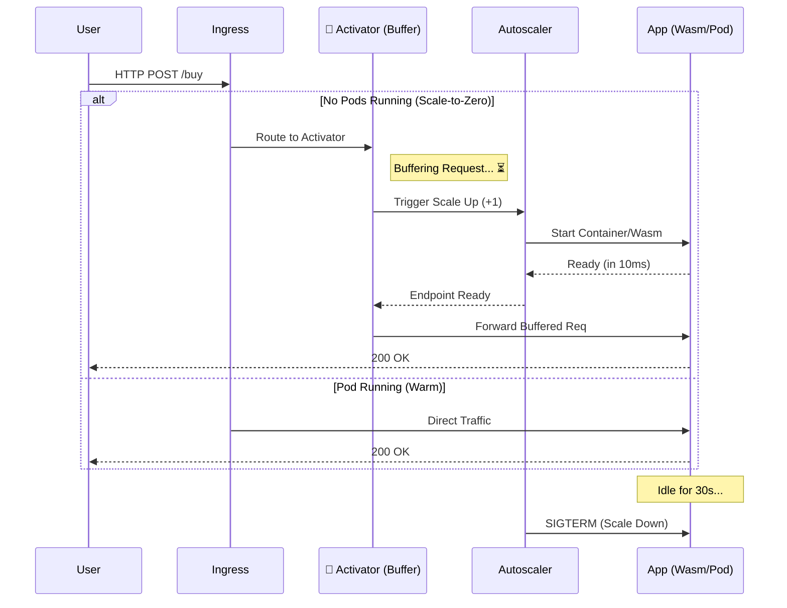
```mermaid
sequenceDiagram
    participant User
    participant Ingress
    participant Activator as 🛑 Activator (Buffer)
    participant K8s as Autoscaler
    participant Pod as App (Wasm/Pod)

    User->>Ingress: HTTP POST /buy
    
    alt No Pods Running (Scale-to-Zero)
        Ingress->>Activator: Route to Activator
        Note right of Activator: Buffering Request... ⏳
        Activator->>K8s: Trigger Scale Up (+1)
        K8s->>Pod: Start Container/Wasm
        Pod-->>K8s: Ready (in 10ms)
        K8s-->>Activator: Endpoint Ready
        Activator->>Pod: Forward Buffered Req
        Pod-->>User: 200 OK
    else Pod Running (Warm)
        Ingress->>Pod: Direct Traffic
        Pod-->>User: 200 OK
    end
    
    Note over Pod: Idle for 30s...
    K8s->>Pod: SIGTERM (Scale Down)
```

> [!important] Архитектурный совет Не пытайтесь перенести весь монолит в Serverless. Начните с **Async Workers** (фоновые задачи, вебхуки, процессинг файлов). Для них Cold Start в 1-2 секунды не критичен, а экономия ресурсов на Scale-to-Zero будет колоссальной.

> [!example] Пример: Обработка изображений
> * **Old Way:** Сервис `image-resizer` (3 реплики) висит в K8s и ждет загрузки картинок. Потребляет 20% кластера круглосуточно.
> * **New Way:** Код `resize.wasm` лежит в объектном хранилище. Пользователь грузит фото -> срабатывает Event -> запускается Wasm (за 2мс) -> ресайзит -> умирает.
> * **Profit:** Экономия ресурсов 90% для редко используемых задач.

### 1.3. The Compute Continuum: Core vs. Edge

> [!abstract] Определение: Вычислительный Континуум
> Раньше мир делился на **Клиент** (Браузер) и **Сервер** (Центральный ДЦ).
>
> В 2026 году инфраструктура представляет собой непрерывный спектр (Continuum) вычислительных мощностей, растянутый от устройства пользователя до гипер-облака.
>
> **Главное правило архитектора:**
> * Чем ближе к пользователю, тем **ниже задержка (Latency)**, но **меньше мощность** и **слабее консистентность**.
> * Чем ближе к ядру (Core), тем **выше задержка**, но **бесконечная мощность** и **строгая консистентность (ACID)**.
#### A. The Four Tiers of the Continuum

Разберем слои по мере удаления от "мозга" (Cloud) к "рукам" (Device).

| Tier | Location | Latency (RTT) | Technologies | Ideal Workload |
| :--- | :--- | :--- | :--- | :--- |
| **1. Core Cloud** | Hyperscale DC (AWS `us-east-1`) | 50 - 200 ms | Kubernetes, GPU Clusters, Oracle/Postgres | **"Heavy Lifting"**: Обучение AI, Хранилище данных (Data Lake), ACID транзакции, Бэкапы. |
| **2. Near Edge** | Metro IX (London, Moscow IX) | 10 - 30 ms | OpenStack, Local K8s, Availability Zones | **"Interactive"**: API Gateways, Server-Side Rendering (SSR), Redis Caching, Video Transcoding. |
| **3. Far Edge** | CDN / ISP Towers (Cloudflare, 5G) | 2 - 10 ms | Wasm Workers, Varnish, Envoy | **"Reactive"**: WAF, DDoS protection, Auth Check, A/B Testing, Simple Routing. |
| **4. Device Edge** | User's Phone / Browser / IoT | 0 ms | Wasm (Client), TensorFlow.js, SQLite (Local) | **"Instant"**: UI Rendering, Input Validation, Privacy-preserving ML Inference, Offline-first logic. |

#### B. The "Data Gravity" Problem (Почему нельзя перенести всё на Edge?)
Код (Logic) легко реплицировать в 1000 точек мира. Данные (State) — нет.

* **Scenario:** Вы хотите перенести интернет-магазин на Edge (в Берлин, Токио, Нью-Йорк), чтобы он открывался за 5 мс.
* **Problem:** Остаток товара на складе (Inventory) — это *глобальное* число.
    * Если вы храните его в Core (США), то Edge в Токио все равно должен сделать запрос в США, чтобы проверить наличие. Выигрыш по скорости исчезает.
    * Если вы реплицируете базу в Токио, вы получаете проблему **Distributed Consensus**. Синхронизация данных между США и Токио занимает время (Speed of Light). Вы рискуете продать один и тот же товар дважды.
* **Solution 2026:**
    * **Read-Heavy на Edge:** Читаем цены и описания из локальной реплики (Turso/D1).
    * **Write-Heavy в Core:** Кнопка "Купить" всегда идет в центральную базу.

#### C. Smart Placement Strategies
Как решить, куда положить конкретную функцию?

1.  **Stateless Logic $\to$ Far Edge.**
    * Примеры: Ресайз картинок, проверка JWT токена, Geo-redirect. Этим функциям не нужна база данных (или достаточно кэша).
2.  **Session State $\to$ Near Edge.**
    * Примеры: Корзина покупок, временные черновики. Используйте Key-Value хранилища (Redis), шардированные по регионам. Если Токио упадет, пользователь из Токио потеряет корзину, но это допустимый риск.
3.  **Source of Truth $\to$ Core Cloud.**
    * Примеры: Платежи, История заказов, Учетные записи. Здесь надежность (Durability) важнее скорости.

#### D. Local-First Software (Device Edge Renaissance)
Самый мощный тренд 2026 года — **Local-First**.
Вместо того чтобы делать запрос на сервер при каждом клике, приложение работает с локальной базой данных (SQLite/PouchDB) прямо в браузере/телефоне.

* **Sync Engines:** Фоновый процесс синхронизирует локальную базу с облаком, когда появляется сеть (используя CRDTs — Conflict-free Replicated Data Types).
* **Latency:** 0ms (потому что сеть не участвует в UI-интеракциях).
* **Role of Server:** Сервер превращается просто в "Backup & Sync Relay", а не в исполнителя логики.

#### E. Visualization: The Latency Map (Mermaid)

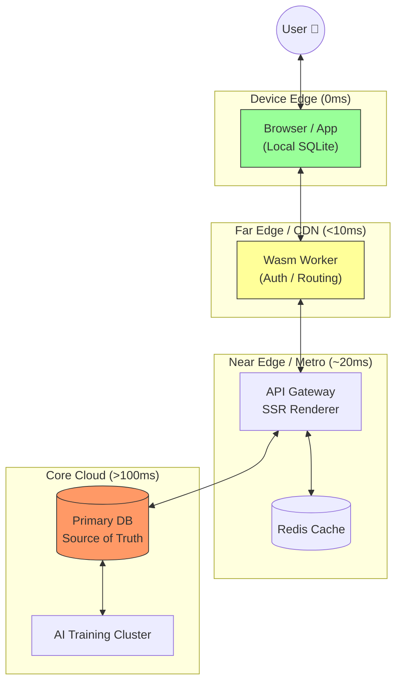
```mermaid
graph TD
    User((User 👤))
    
    subgraph "Device Edge (0ms)"
        App["Browser / App <br/> (Local SQLite)"]
    end
    
    subgraph "Far Edge / CDN (<10ms)"
        Worker["Wasm Worker <br/> (Auth / Routing)"]
    end
    
    subgraph "Near Edge / Metro (~20ms)"
        API["API Gateway <br/> SSR Renderer"]
        Cache[("Redis Cache")]
    end
    
    subgraph "Core Cloud (>100ms)"
        DB[("Primary DB <br/> Source of Truth")]
        AI["AI Training Cluster"]
    end
    
    User <--> App
    App <--> Worker
    Worker <--> API
    API <--> Cache
    API <--> DB
    DB <--> AI
    
    style App fill:#9f9,stroke:#333
    style Worker fill:#ff9,stroke:#333
    style DB fill:#f96,stroke:#333
```

> [!example] Реальный пример: Умный Домофон (IoT) Идеальная демонстрация континуума:
> 
> 1. **Device Edge (Камера):** ML-модель на чипе определяет "Это человек или кошка?". Если кошка — игнорируем (экономим трафик).
>     
> 2. **Far Edge (Вышка 5G):** Если человек — проверяем, является ли это лицо знакомым (кэшированный список жильцов).
>     
> 3. **Near Edge (Городской ЦОД):** Если незнакомец — начинаем транскодирование видеопотока для стриминга на телефон владельца.
>     
> 4. **Core Cloud (Архив):** Сохраняем видео инцидента в холодное хранилище (S3) для полиции.
>     

> [!check] Архитектурный Вердикт Не переносите на Edge то, что требует **ACID-транзакций**. Используйте Edge для:
> 
> 1. **Фильтрации** (отбросить 90% мусорного трафика до Core).
>     
> 2. **Персонализации** (собрать HTML страницу под конкретного юзера).
>     
> 3. **Безопасности** (остановить DDoS атаку на дальних подступах).
>
### 1.4. Why "Continuous Profiling" is Harder Here?
Смена парадигмы ломает традиционные инструменты Observability.

* **The "Short lifespan" Problem:** eBPF-профилировщик обычно собирает данные 10-60 секунд, чтобы построить достоверный Flame Graph. Если ваша Wasm-функция живет 50мс, профилировщик даже не успеет проснуться.
* **Solution (Snapshot Profiling):** Рантайм (Wasmtime) должен сам отдавать профиль *каждого* вызова (или сэмплировать 1% вызовов) и отправлять его асинхронно. Профилирование становится частью исполнения, а не внешним процессом.

### 1.5. Visualizing the Shift (Mermaid)

Сравнение жизненного цикла запроса.

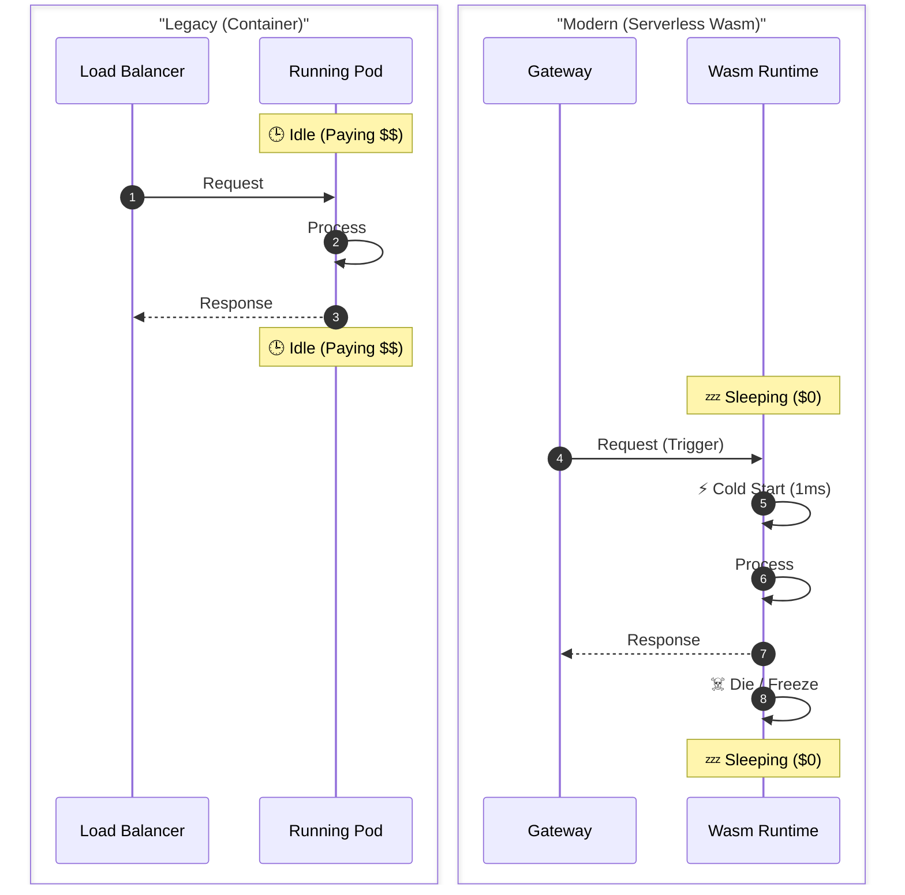
```mermaid
sequenceDiagram
    autonumber
    
    box "Legacy (Container)" #f9f9f9
        participant LB as Load Balancer
        participant App as Running Pod
    end
    
    box "Modern (Serverless Wasm)" #e6f7ff
        participant Gateway
        participant Runtime as Wasm Runtime
    end

    Note over App: 🕒 Idle (Paying $$)
    
    LB->>App: Request
    App->>App: Process
    App-->>LB: Response
    
    Note over App: 🕒 Idle (Paying $$)
    
    %% Modern Flow
    Note over Runtime: 💤 Sleeping ($0)
    
    Gateway->>Runtime: Request (Trigger)
    Runtime->>Runtime: ⚡ Cold Start (1ms)
    Runtime->>Runtime: Process
    Runtime-->>Gateway: Response
    Runtime->>Runtime: ☠️ Die / Freeze
    
    Note over Runtime: 💤 Sleeping ($0)
```

> [!check] Архитектурный Вердикт
> 
> 1. **Не боритесь с будущим:** Перестаньте упаковывать 10-строчные скрипты в 500-мегабайтные Docker-контейнеры. Это неэффективно.
>     
> 2. **Думайте функциями:** Начните выделять "горячие" и "холодные" пути в вашем монолите. Холодные пути (например, генерация PDF-отчета раз в месяц) — идеальные кандидаты на вынос в Serverless/Wasm.
>     
> 3. **Edge First:** Если ваша логика не требует записи в ACID-базу, попробуйте запустить её на Edge (Cloudflare Workers / Deno). Вы удивитесь скорости.
>
---
## 2. WebAssembly (Wasm): The Universal Runtime

> [!abstract] "Docker без Linux"
> Если Docker решил проблему **"Как упаковать приложение с его зависимостями"**, то Wasm решает проблему **"Как запустить приложение безопасно и мгновенно где угодно"**.
>
> **В чем разница?**
> * **Docker (Container):** Виртуализирует *Операционную Систему*. Внутри контейнера лежит целый дистрибутив Linux (Alpine/Debian). Это тяжело.
> * **Wasm (Isolate):** Виртуализирует *Инструкции Процессора* (ISA). Внутри модуля лежит только скомпилированный байт-код вашей бизнес-логики. Это легко.
>
> В 2026 году Wasm стал стандартом де-факто для Serverless и Edge, вытесняя Docker в нишу "тяжелых" Legacy-приложений.

### 2.1. Why Wasm Wins on the Edge? (Architecture Comparison)

> [!abstract] Анатомия эффективности: Userland vs. Isolate
> Главная проблема Docker-контейнеров на Edge — это дублирование.
> В каждом контейнере вы тащите с собой **Userland** (пространство пользователя): файловую систему (`rootfs`), стандартную библиотеку C (`glibc/musl`), пакетный менеджер (`apt/apk`) и конфигурационные файлы.
>
> **Wasm** отбрасывает всё это.
> Это не "маленький Linux". Это абстракция вычислителя.
> * **Docker:** Виртуализация уровня OS. "Я запускаю операционную систему, чтобы запустить процесс".
> * **Wasm:** Виртуализация уровня ISA (Instruction Set Architecture). "Я выделяю память и выполняю функции".

#### A. The Legacy Stack: Why Containers are "Heavy"
Когда вы запускаете `docker run`, происходит сложная хореография, убивающая задержку (Latency) на Edge.

1.  **I/O Penalty (OverlayFS):**
    * Контейнер собирается из слоев (Layers) файловой системы. Ядро должно смонтировать `OverlayFS`, объединив Read-only слои образа и Writable слой контейнера. Это дисковые операции.
2.  **Kernel Tax (Syscalls):**
    * Создание `cgroups` (лимиты CPU/RAM) и `namespaces` (изоляция сети/PID) требует множества системных вызовов к ядру хоста.
3.  **Userland Boot:**
    * Внутри контейнера стартует процесс. Если это Python, он должен загрузить интерпретатор, подтянуть динамические библиотеки (`ld-linux.so`, `libc.so`), инициализировать переменные окружения.
    * *Результат:* На "холодный старт" уходит **500ms - 2s**.

#### B. The Modern Stack: Why Wasm is "Light"
Wasm-модуль — это скомпилированный байт-код. Ему не нужна файловая система для старта.

1.  **Skip I/O (Memory Mapping):**
    * Рантайм просто проецирует (mmap) файл `.wasm` в память. Никакого монтирования дисков.
2.  **Verification (The unique step):**
    * Перед запуском рантайм делает один проход по байт-коду, проверяя безопасность типов и границ памяти. Это гарантирует, что код *физически* не может сбежать из песочницы.
3.  **Instantiation (Linear Memory):**
    * Создание "Инстанса" — это просто выделение непрерывного блока памяти (например, 64KB). Это так же быстро, как `malloc()`.
    * *Результат:* "Холодный старт" занимает **< 1ms** (микросекунды при использовании AOT-кэширования).
#### C. Comparative Analysis Table

| Feature | Linux Container (Docker) | Wasm Isolate | Impact on Edge |
| :--- | :--- | :--- | :--- |
| **Abstraction** | **OS Slice** (Filesystem + Kernel NS) | **Process Slice** (Memory + Functions) | Wasm плотнее в 100 раз. |
| **Boot Time** | 0.5s - 5s (Process forking) | 0.1ms - 5ms (Memory allocation) | Wasm позволяет Scale-to-Zero. |
| **Security** | **Attack Surface = Kernel.** 300+ Syscalls available. | **Attack Surface = Runtime.** 0 Syscalls allowed by default. | Wasm безопаснее для Multi-tenant. |
| **Dependency** | `glibc`, `openssl` (Dynamic Linking) | None / Statically Linked | Wasm не ломается при апдейте OS. |
| **Memory Overhead**| ~50MB per Idle container | ~50KB per Idle module | На RPi (4GB) можно запустить 10 Docker или 5000 Wasm. |
#### D. The "Pre-initialization" Trick (Wizer)
В 2026 году мы используем технику **Snapshotting** для Wasm (инструмент `wizer`).

* **Problem:** Даже в Wasm инициализация фреймворка (парсинг конфигов) может занимать 50мс.
* **Solution:** Мы запускаем инициализацию *на этапе сборки*.
    * Скрипт запускает Wasm, ждет завершения `init()`.
    * Делает **дамп памяти** (Snapshot) в новый `.wasm` файл.
* **Result:** В продакшене модуль стартует уже в инициализированном состоянии. Время старта = 0ms.

#### E. Visualization: The Density Difference (Mermaid)

Почему на один сервер влезает больше Wasm.

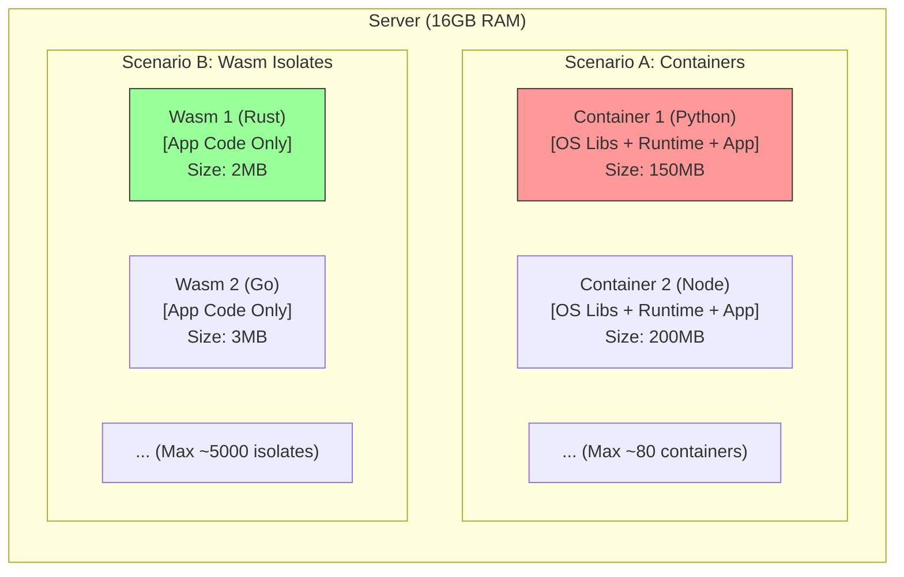
```mermaid
graph TB
    subgraph "Server (16GB RAM)"
        direction TB
        
        subgraph "Scenario A: Containers"
            C1["Container 1 (Python) <br/> [OS Libs + Runtime + App] <br/> Size: 150MB"]
            C2["Container 2 (Node) <br/> [OS Libs + Runtime + App] <br/> Size: 200MB"]
            C_Etc["... (Max ~80 containers)"]
        end
        
        subgraph "Scenario B: Wasm Isolates"
            W1["Wasm 1 (Rust) <br/> [App Code Only] <br/> Size: 2MB"]
            W2["Wasm 2 (Go) <br/> [App Code Only] <br/> Size: 3MB"]
            W_Etc["... (Max ~5000 isolates)"]
        end
    end
    
    style C1 fill:#f99,stroke:#333
    style W1 fill:#9f9,stroke:#333
```

> [!example] Реальный пример: Image Processing Service **Задача:** Принимать картинку, накладывать водяной знак, отдавать обратно.
> 
> - **Docker (ImageMagick):**
>     
>     - Образ: 200MB (нужен Linux + ImageMagick binaries).
>         
>     - Старт: 1.5 сек.
>         
>     - Память: 80MB.
>         
> - **Wasm (Rust + image-rs):**
>     
>     - Образ: 1.5MB (скомпилированный код).
>         
>     - Старт: 2 мс.
>         
>     - Память: 5MB (растет только при обработке, потом очищается).
>         
> - **Экономика:** На Edge-ноде с 2GB RAM вы можете обработать в 50 раз больше параллельных запросов на Wasm.
>     

> [!check] Архитектурный вывод Используйте **Wasm** на Edge не только ради скорости, но и ради **Плотности (Density)**. Экономика Edge строится на том, чтобы "набить" сервер тысячами мелких функций разных клиентов. Docker для этого слишком "жирный".
### 2.2. The "Component Model" (The 2026 Game Changer)

> [!abstract] Смерть "Dependency Hell"
> До 2024 года, если вы писали на Rust и хотели использовать библиотеку, написанную на Python (например, AI-модель), у вас был выбор:
> 1.  Переписать библиотеку на Rust (дорого).
> 2.  Использовать C-FFI (небезопасно, больно).
> 3.  Запустить Python как отдельный микросервис и ходить к нему по HTTP (медленно).
>
> **В 2026 году Component Model дает четвертый вариант:**
> Скомпилировать Python в `.wasm`, скомпилировать Rust в `.wasm`, и соединить их (Compose) в один бинарник. Они работают в *одном* процессе, но полностью изолированы.
#### A. Architecture: From Modules to Components
В раннем Wasm единицей был "Модуль". Это был просто набор байт.
В 2026 единицей стал "Компонент". Это Модуль + **Контракт**.

1.  **WIT (Wasm Interface Type):**
    * Это язык описания интерфейсов (IDL), похожий на Protobuf или GraphQL.
    * Он описывает *функции*, которые компонент **экспортирует** (предлагает) и **импортирует** (требует).
    * *Киллер-фича:* WIT оперирует **высокоуровневыми типами** (String, List, Record, Variant), а не просто байтами и числами.
2.  **Shared Nothing Architecture:**
    * В отличие от динамических библиотек (`.dll`, `.so`), компоненты **не делят память**.
    * Компонент A не может прочитать память Компонента B.
    * Передача данных происходит через копирование (Canonical ABI). Это чуть медленнее указателей, но гарантирует полную безопасность и отсутствие Side Effects.

#### B. The "Composition" Workflow (Polyglot Programming)
Как мы собираем приложение в 2026:

* **Team A (Security)** пишет валидацию JWT токенов на **Rust**. Компилирует в `auth.wasm`. Интерфейс: `validate(token: string) -> Result<User, Error>`.
* **Team B (Business)** пишет логику расчета скидок на **Python**. Компилирует в `pricing.wasm`.
* **Team C (Core)** пишет основной код на **Go**.
* **Сборка:** Инструмент (например, `wac` — Wasm Composition) берет эти три файла и "спаивает" их импорты и экспорты.
* **Результат:** Один файл `app.wasm`, внутри которого живут Rust, Python и Go. Вызов из Go в Rust занимает **наносекунды** (просто прыжок по памяти), а не миллисекунды (как HTTP).

#### C. Comparison: Microservices vs. Components

Это меняет гранулярность архитектуры.

| Feature | Microservices (gRPC/HTTP) | Wasm Components (WIT) |
| :--- | :--- | :--- |
| **Communication** | Network Socket (TCP/IP) | Memory Copy (Canonical ABI) |
| **Latency** | 1ms - 10ms (Serialization + Network) | < 1µs (Nanoseconds) |
| **Failure Domain** | Partial Failure (Network timeout) | Atomic (Function call panic) |
| **Deployment** | Many Pods / Containers | Single Wasm Binary |
| **Language** | Polyglot (Any language) | Polyglot (Any language to Wasm) |

#### D. The Registry Evolution (OCI for Wasm)
Где хранятся эти кирпичики?
* В 2026 году стандарт OCI (Docker Registry) нативно поддерживает Wasm Components.
* Вы делаете `warg publish my-org/auth-component:1.0.0`.
* Любой разработчик в мире может сделать `import "my-org/auth-component"` в своем WIT-файле, и тулинг сам скачает и слинкует нужный код. Это как `npm`, но для *бинарного* кода на *любом* языке.
#### E. Visualization: The "Virtual Monolith" (Mermaid)

Приложение выглядит как монолит (один процесс), но собрано как микросервисы.

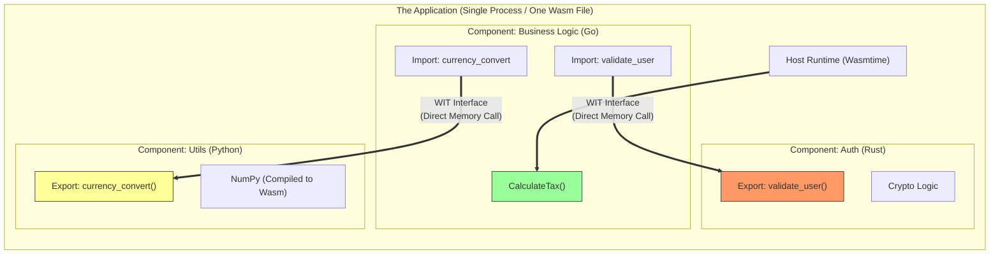
```mermaid
graph TD
    subgraph "The Application (Single Process / One Wasm File)"
        direction TB
        
        Host["Host Runtime (Wasmtime)"]
        
        subgraph "Component: Business Logic (Go)"
            GoFunc["CalculateTax()"]
            GoImport1["Import: validate_user"]
            GoImport2["Import: currency_convert"]
        end
        
        subgraph "Component: Auth (Rust)"
            RustExport["Export: validate_user()"]
            RustCore["Crypto Logic"]
        end
        
        subgraph "Component: Utils (Python)"
            PyExport["Export: currency_convert()"]
            PyLib["NumPy (Compiled to Wasm)"]
        end
        
        %% Linking via WIT
        GoImport1 == "WIT Interface <br/> (Direct Memory Call)" ==> RustExport
        GoImport2 == "WIT Interface <br/> (Direct Memory Call)" ==> PyExport
        
        Host ==> GoFunc
    end
    
    style RustExport fill:#f96,stroke:#333
    style PyExport fill:#ff9,stroke:#333
    style GoFunc fill:#9f9,stroke:#333
```

> [!example] Use Case: AI Inference Pipelines Идеальный пример использования Component Model.
> 
> 1. **Preprocessing:** Python (NumPy) — лучше всего подходит для работы с матрицами.
>     
> 2. **Inference:** C++ (ONNX Runtime) — максимальная скорость вычислений.
>     
> 3. **Postprocessing:** JavaScript — форматирование JSON для фронтенда.
>     
> 
> Раньше это было три разных сервиса или кошмар сборки C-расширений для Python. Теперь это **один Wasm-компонент**, где данные текут сквозь языки без задержек.

> [!check] Архитектурный Вердикт **Component Model** — это будущее переиспользования кода. Перестаньте копипастить логику валидации email между сервисами на Go и TS. Напишите компонент валидации на Rust, скомпилируйте в Wasm, и импортируйте его везде. Он будет работать быстро, безопасно и одинаково на всех платформах.
### 2.3. WASI: The Interface to Reality

> [!abstract] "Мозг в колбе"
> Сам по себе WebAssembly — это чистая математика. Он умеет складывать числа и двигать байты в памяти. Он **не умеет**:
> * Читать файлы.
> * Открывать TCP-сокеты.
> * Смотреть на системные часы.
> * Генерировать случайные числа.
>
> **WASI (WebAssembly System Interface)** — это "нервная система", которая соединяет этот изолированный мозг с реальным миром.
> В отличие от Linux Syscalls (которые жестко привязаны к ядру), WASI — это **модульный контракт**. Рантайм может подсунуть приложению "виртуальный" файл или "виртуальную" сеть, и приложение не заметит подмены.
#### A. The End of "Ambient Authority" (Security Revolution)
Это главное архитектурное отличие Wasm от всего, что было раньше (Docker, Node.js, Java).

* **Ambient Authority (Традиционная модель):**
    * Вы запускаете Node.js скрипт.
    * По умолчанию этот скрипт имеет **ваши права**. Он может прочитать ваши SSH-ключи, если знает путь к ним.
    * *Защита:* Пытаться фильтровать syscalls (очень сложно и ненадежно).
* **Capability-Based Security (Модель WASI):**
    * Вы запускаете Wasm модуль.
    * По умолчанию у него **нет прав ни на что**. Попытка открыть `/etc/passwd` вернет ошибку, потому что для модуля корнем файловой системы является пустота.
    * *Механизм:* Вы должны **явно передать** "Handle" (Дескриптор/Capability) при запуске.
    * *Пример:* `wasmtime run app.wasm --dir=/tmp/logs::/logs`. Теперь модуль видит папку `/tmp/logs` хоста, но внутри себя считает её `/logs`. Он физически не может выйти за пределы этой папки (как `chroot`, только надежнее).

#### B. Modular WASI (The 2026 Standard)
В 2026 году мы ушли от монолитного `wasi_snapshot_preview1` (который просто копировал POSIX) к модульной системе, основанной на Component Model.

Теперь WASI — это набор стандартизированных интерфейсов (Worlds):
1.  **wasi-cli:** Работа с файлами, stdio, аргументами (для консольных утилит).
2.  **wasi-http:** Интерфейс для отправки и получения HTTP-запросов.
    * *Почему это круто:* Приложение вызывает `outgoing-handler`. Рантайм может направить этот запрос в реальный интернет, а может завернуть его во внутреннюю шину Service Mesh, вообще минуя TCP/IP стек.
3.  **wasi-keyvalue:** Стандартный интерфейс для `get/set`.
    * В коде вы пишете `store.get("key")`.
    * На продакшене рантайм подключает это к **Redis**.
    * На локальной машине рантайм подключает это к **In-Memory Map**.
    * **Перекомпиляция не требуется.**

#### C. Comparison: Syscalls vs. WASI

| Feature | Linux Syscalls (Docker) | WASI Imports |
| :--- | :--- | :--- |
| **Nature** | Low-level Kernel Inteface | High-level Typed Interface (WIT) |
| **Permissions** | Deny-list (Seccomp profiles - hard) | **Allow-list** (Capabilities - default) |
| **Portability** | Linux only (Win/Mac via VM) | **Anywhere** (Bare metal, Browser, Cloud) |
| **Virtualization**| Hard (Requires FUSE/CNI) | **Trivial** (Just swap the import implementation) |
| **Network** | Opens raw TCP sockets | Uses abstract `incoming-handler` |
#### D. The "Portability" Myth vs. Reality
Многие думают, что переносимость — это "запускать одно и то же на Windows и Linux".
В 2026 году переносимость означает **"Запускать один и тот же бинарник на Сервере и в Браузере"**.

* **Server:** Рантайм реализует `wasi-filesystem` через реальный диск SSD.
* **Browser:** Рантайм (jco/browser-wasi) реализует `wasi-filesystem` через **Origin Private File System (OPFS)** браузера.
* **Код приложения:** Один и тот же файл `.wasm`. Бит в бит.

#### E. Visualization: Capability Injection (Mermaid)

Показывает, как рантайм "собирает" мир для модуля перед запуском.

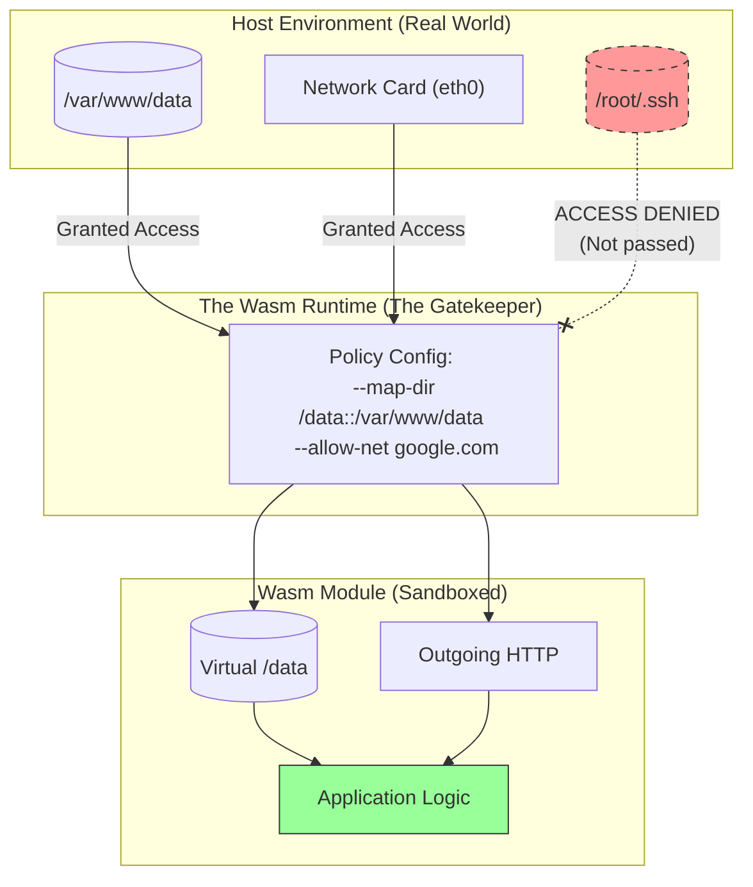
```mermaid
graph TD
    subgraph "Host Environment (Real World)"
        RealFS[("/var/www/data")]
        RealNet["Network Card (eth0)"]
        SecretKeys[("/root/.ssh")]
    end

    subgraph "The Wasm Runtime (The Gatekeeper)"
        Config["Policy Config: <br/> --map-dir /data::/var/www/data <br/> --allow-net google.com"]
    end

    subgraph "Wasm Module (Sandboxed)"
        AppCode["Application Logic"]
        VirtualFS[("Virtual /data")]
        VirtualNet["Outgoing HTTP"]
    end

    %% Flow
    RealFS -- "Granted Access" --> Config
    RealNet -- "Granted Access" --> Config
    SecretKeys -. "ACCESS DENIED <br/> (Not passed)" .-x Config

    Config --> VirtualFS
    Config --> VirtualNet
    
    VirtualFS --> AppCode
    VirtualNet --> AppCode
    
    style SecretKeys fill:#f99,stroke:#333,stroke-dasharray: 5 5
    style AppCode fill:#9f9,stroke:#333
```

> [!example] Реальный кейс: Плагины для SaaS Вы строите аналог Figma или Shopify и хотите дать пользователям писать плагины.
> 
> - **Проблема:** Если дать им JS/Docker, они могут майнить крипту или украсть данные других юзеров.
>     
> - **Решение (WASI):** Вы запускаете плагин в Wasm.
>     
>     - Вы **не даете** ему capability `wasi-sockets` (он не может ничего отправить в сеть).
>         
>     - Вы даете ему только capability `wasi-filesystem` на чтение одной конкретной папки с данными _этого_ юзера.
>         
> - **Результат:** 100% безопасная песочница без оверхеда на виртуалки.
>     

> [!check] Архитектурный Вердикт В 2026 году используйте WASI не как способ доступа к файлам, а как способ **абстрагирования от инфраструктуры**. Пишите код, который зависит от _интерфейса_ (`wasi-keyvalue`), а не от _реализации_ (`redis-client`). Это сделает ваши приложения бессмертными и переносимыми между любыми облаками.
### 2.4. Continuous Profiling Strategy for Wasm
Профилирование Wasm отличается от профилирования Linux-процессов.

1.  **JIT Complexity:** Wasm-код компилируется в машинный код (AOT/JIT) рантаймом. Стандартный `perf` видит только анонимные адреса памяти.
2.  **Runtime Support:** Вам нужен профилировщик, интегрированный с рантаймом (например, *Wasmtime Profiling Hooks*).
3.  **Mapping:** Профилировщик берет стек вызовов Wasm и накладывает его на **DWARF** (отладочную информацию), чтобы показать вам строки исходного кода на Rust/Go.
    * *Важно:* В продакшн мы часто вырезаем DWARF для уменьшения размера. В 2026 году используйте **Split DWARF** (дебаг-инфо лежит отдельно в S3 и подтягивается профилировщиком UI только при просмотре).

### 2.5. Visualization: The Stack Overhead (Mermaid)

Наглядно показывает, почему Docker проигрывает в плотности.

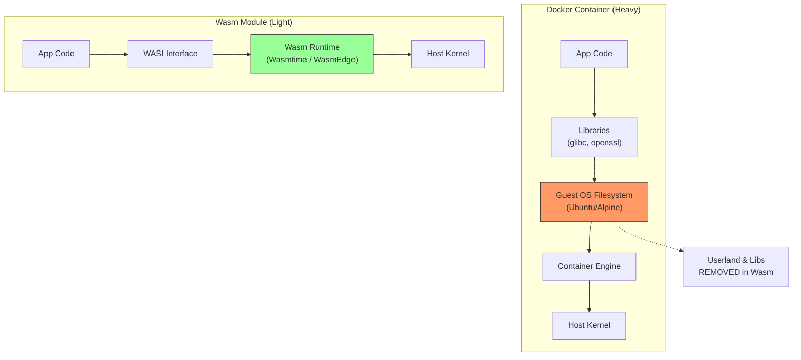
```mermaid
graph TD
    subgraph "Docker Container (Heavy)"
        App1["App Code"]
        Libs1["Libraries <br/> (glibc, openssl)"]
        Userland["Guest OS Filesystem <br/> (Ubuntu/Alpine)"]
        DockerEngine["Container Engine"]
        Kernel1["Host Kernel"]
        
        App1 --> Libs1 --> Userland --> DockerEngine --> Kernel1
    end

    subgraph "Wasm Module (Light)"
        App2["App Code"]
        WASI["WASI Interface"]
        Runtime["Wasm Runtime <br/> (Wasmtime / WasmEdge)"]
        Kernel2["Host Kernel"]
        
        App2 --> WASI --> Runtime --> Kernel2
    end
    
    style Userland fill:#f96,stroke:#333
    style Runtime fill:#9f9,stroke:#333
    
    %% Annotation showing what is removed
    Note["Userland & Libs <br/> REMOVED in Wasm"]
    Userland -.-> Note
```
### 2.6. Key Terms Glossary
- **Wasm (WebAssembly):** Бинарный формат инструкций. "Ассемблер для веба", ставший ассемблером для облака.
- **WASI (System Interface):** Стандарт POSIX-like функций для Wasm (Filesystem, Sockets, Clocks).
- **Wasmtime / WasmEdge:** Популярные серверные рантаймы (аналоги JVM для Java, но для Wasm).
- **AOT (Ahead-of-Time) Compilation:** Компиляция Wasm в машинный код _до_ запуска (при деплое). Обеспечивает мгновенный старт.
- **WIT (Wasm Interface Type):** Язык описания интерфейсов для соединения компонентов (аналог Protobuf, но для функций).

> [!check] Архитектурный Вердикт
> 
> 1. **Для новых Serverless функций:** Используйте Wasm (языки Rust, Go, TypeScript). Это даст экономию денег на Scale-to-Zero.
>     
> 2. **Для Legacy:** Оставьте в Docker. Не пытайтесь скомпилировать сложный Java EE монолит в Wasm — это (пока) больно из-за сборки мусора (хотя Wasm GC уже существует).
>     
> 3. **Безопасность:** Если вы запускаете **User-Generated Code** (плагины, скрипты клиентов), Wasm — единственный безопасный выбор. Docker-контейнеры "текут", Wasm Sandbox математически строг.
>
---
## 3. Serverless 2.0: Scale-to-Zero & Firecracker

> [!abstract] Проблема "Тяжелого Наследия"
> Wasm прекрасен, но вы не запустите в нем Django или Spring Boot "как есть" (по крайней мере, без боли).
>
> **Serverless 2.0 решает дилемму:**
> * Как взять обычный Docker-контейнер (с Python/Java).
> * Запустить его безопасно (как VM), чтобы соседи не украли данные.
> * И сделать это за 100 мс (как Lambda), чтобы работал Scale-to-Zero.
>
> **Ответ:** MicroVMs (Firecracker) + Memory Snapshotting.
### 3.1. Firecracker & MicroVMs: The Isolation of a VM, Speed of a Thread

> [!abstract] Проблема QEMU и "Жирного" наследия
> Традиционные гипервизоры (QEMU, VMware) создавались для эмуляции **физических компьютеров**.
> Они тратят секунды на инициализацию виртуального BIOS, сканирование виртуальной шины PCI, загрузку драйверов для виртуальной видеокарты Cirrus Logic 1995 года и флоппи-дисковода.
>
> **Firecracker** (созданный AWS в 2018 и ставший стандартом к 2026) сказал: *"Нам не нужен флоппи-дисковод в Serverless"*.
> Он заменяет весь сложный слой эмуляции на минималистичный код на Rust, который общается с гостевым Linux только через паравиртуализацию (Virtio).
#### A. Architecture: How it actually works
Firecracker — это обычный процесс в Linux (User-space), который использует `KVM` (Kernel-based Virtual Machine) для аппаратного ускорения.

1.  **VMM (Virtual Machine Monitor):** Firecracker запускается как процесс.
2.  **API Driven:** В отличие от QEMU (который запускается с сотней флагов командной строки), Firecracker управляется через **REST API** по Unix-сокету. Чтобы добавить сетевую карту или диск, вы шлете ему JSON `PUT /network-interfaces`.
3.  **No BIOS:** Он загружает ядро Linux напрямую в память (через протокол загрузки ядра Linux), минуя фазу BIOS/UEFI. Это экономит ~500-1000 мс.
4.  **Virtio Only:** Гостевая OS не видит "железа". Она видит только стандартизированные каналы связи (`virtio-net`, `virtio-blk`). Это "прямая труба" к хосту, без накладных расходов на эмуляцию прерываний старых чипов.

#### B. Security: The "Defense in Depth"
Почему Docker небезопасен для запуска чужого кода, а Firecracker безопасен?

* **Docker (Shared Kernel):**
    * Контейнер делает системный вызов (syscall) `read()`. Этот вызов обрабатывает **ядро хоста**.
    * *Риск:* Если в ядре есть уязвимость (напр., Dirty COW), процесс из контейнера может переписать память ядра и захватить весь сервер.
    * *Attack Surface:* 300+ системных вызовов Linux.
* **Firecracker (Hardware Virtualization):**
    * MicroVM имеет **свое собственное ядро**.
    * Системный вызов `read()` обрабатывается гостевым ядром. До хоста он доходит только как безопасный запрос к KVM.
    * **The Jailer:** Процесс Firecracker дополнительно обернут в жесткий `seccomp` профиль и `cgroup`. Даже если хакер сбежит из виртуалки, он попадет в "тюрьму" (Jailer) с минимальными правами.
    * *Side-Channel Attacks:* Firecracker умеет сбрасывать кэши процессора (L1/Branch Predictor) при переключении между виртуалками, защищая от атак класса Spectre/Meltdown.

#### C. Comparison: QEMU vs. Firecracker vs. Docker

| Feature | Docker (Container) | QEMU (Traditional VM) | Firecracker (MicroVM) |
| :--- | :--- | :--- | :--- |
| **Isolation Level** | Process (Namespaces) | Hardware (Full Emulation) | Hardware (Paravirtualization) |
| **Boot Time** | ~200-500ms | 10s - 60s | **~125ms** |
| **Memory Overhead** | Low (Shared Kernel) | High (Full OS + Devices) | **Very Low** (<5MB overhead) |
| **Device Model** | Direct Host Access | PCI, USB, VGA, BIOS | **Virtio Only** (Net, Block, Socket) |
| **Language** | Go (Runc) | C | **Rust** (Memory Safe) |
| **Ideal For** | Trusted Microservices | Legacy OS (Windows) | **Multi-tenant Serverless** |
#### D. The "Over-subscription" Economics
Главная причина, почему облака любят Firecracker — это возможность продать больше ресурсов, чем есть физически.

* **Scenario:** У вас сервер с 64GB RAM.
* **Promise:** Вы обещаете 1000 клиентам по 128MB RAM каждому (Total 128GB).
* **Reality:**
    * В Docker это опасно (если все начнут писать в память, придет OOM Killer).
    * В Firecracker работает **Ballooning**. Гипервизор может динамически "сдувать" и "надувать" память, доступную гостю, возвращая неиспользуемые страницы хосту.
    * Благодаря скорости старта (125мс), вы можете убивать простаивающие виртуалки агрессивно, освобождая ресурсы.

#### E. Visualization: The Stack Anatomy (Mermaid)

Визуализация уровней изоляции.

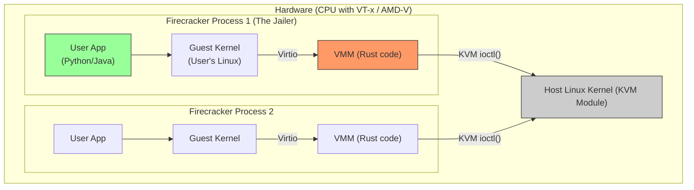
```mermaid
graph TB
    subgraph "Hardware (CPU with VT-x / AMD-V)"
        HostKernel["Host Linux Kernel (KVM Module)"]
        
        subgraph "Firecracker Process 1 (The Jailer)"
            VMM1["VMM (Rust code)"]
            Guest1["Guest Kernel <br/> (User's Linux)"]
            App1["User App <br/> (Python/Java)"]
            
            App1 --> Guest1
            Guest1 -- "Virtio" --> VMM1
        end
        
        subgraph "Firecracker Process 2"
            VMM2["VMM (Rust code)"]
            Guest2["Guest Kernel"]
            App2["User App"]
            
            App2 --> Guest2
            Guest2 -- "Virtio" --> VMM2
        end
        
        VMM1 -- "KVM ioctl()" --> HostKernel
        VMM2 -- "KVM ioctl()" --> HostKernel
    end
    
    style VMM1 fill:#f96,stroke:#333
    style App1 fill:#9f9,stroke:#333
    style HostKernel fill:#ccc,stroke:#333
```

> [!example] Пример из жизни: AWS Lambda Когда вы запускаете функцию в AWS Lambda:
> 
> 1. AWS создает выделенный Firecracker MicroVM специально для вашего аккаунта (или даже для функции).
>     
> 2. Внутрь пробрасывается ваш код.
>     
> 3. Код исполняется.
>     
> 4. После 10-15 минут простоя MicroVM уничтожается.
>     
> 
> Никто другой не может "подсмотреть" вашу память, потому что вы изолированы на уровне инструкций процессора (VT-x), а не просто правами доступа Linux.

> [!check] Архитектурный вывод Если вы строите платформу, где запускается **недоверенный код** (SaaS с плагинами, CI/CD раннеры, песочницы для собеседований): **Никогда не используйте чистый Docker.** Это небезопасно. Используйте **Firecracker** (напрямую или через инструменты вроде `Ignite` / `Kata Containers`). Это единственный способ спать спокойно.
### 3.2. The "SnapStart" Revolution (Solving Java Cold Start)
### 3.2. The "SnapStart" Revolution: Cheating Time with Checkpoints [Deep Dive]

> [!abstract] Эффект "Сохранения Игры"
> Проблема Java (и Spring Boot) в Serverless не в том, что она медленная, а в том, что она **долго разогревается**.
> JVM тратит 5-10 секунд на загрузку классов, JIT-компиляцию и построение графа зависимостей (Dependency Injection).
>
> **Решение 2026:** Мы переносим эти 5 секунд из **Runtime** (когда пользователь ждет) в **Build Time** (когда никто не ждет).
> Технология **Checkpoint/Restore in Userspace (CRIU)** или аппаратные снэпшоты Firecracker позволяют "заморозить" процесс после инициализации и "разморозить" его для обработки запроса.

#### A. The Physics of Fast Restore (Memory Mapping)
Почему восстановление из снэпшота быстрее, чем запуск приложения?

1.  **Cold Boot (CPU Bound):**
    * Чтобы запустить Spring, CPU должен прочитать тысячи `.class` файлов, распаковать их, верифицировать байт-код, выполнить статические инициализаторы, выделить объекты в Heap. Это миллиарды тактов CPU.
2.  **Snapshot Restore (IO Bound):**
    * Снэпшот — это просто дамп оперативной памяти на диске.
    * Восстановление — это системный вызов `mmap()`. OS не читает весь файл сразу. Она просто говорит процессу: "Твоя память находится в этом файле".
    * Когда CPU обращается к адресу памяти, происходит Page Fault, и OS подгружает нужную страницу с SSD.
    * **Результат:** Приложение готово отвечать мгновенно, страницы памяти грузятся "лениво" (Lazy Loading).

#### B. CRaC: The API for Time Travelers
Просто заморозить память недостаточно. Если в момент заморозки у вас было открыто соединение с базой данных, то при разморозке через неделю это соединение будет мертво.

**CRaC (Coordinated Restore at Checkpoint)** — это стандартный API в Java (OpenJDK), который позволяет коду узнать о заморозке.

```java
import org.crac.*;

public class DbConnector implements Resource {
    
    public DbConnector() {
        Core.getGlobalContext().register(this);
    }

    @Override
    public void beforeCheckpoint(Context<? extends Resource> context) {
        // Вызывается ПЕРЕД заморозкой
        // 1. Закрываем сокеты (они все равно протухнут)
        dbConnection.close();
        System.out.println("Going to sleep... Zzz");
    }

    @Override
    public void afterRestore(Context<? extends Resource> context) {
        // Вызывается ПОСЛЕ разморозки
        // 2. Создаем новые сокеты
        // 3. Обновляем токены и ключи
        dbConnection.connect(); 
        System.out.println("Hello from the future!");
    }
}
```
#### C. The "Entropy" Trap (Security Warning)
Это самая опасная ловушка снэпшотинга.
Если вы инициализируете `SecureRandom` или генерируете UUID **до** снэпшота, это состояние сохранится.
- **Сценарий:** Приложение генерирует `transaction_id = UUID.random()` в конструкторе.
- **Снэпшот:** Сохраняет это значение в памяти.
- **Разморозка:** Вы запускаете 1000 реплик из одного снэпшота.
- **Катастрофа:** Все 1000 реплик имеют **один и тот же** `transaction_id`. Все криптографические ключи идентичны.
- **Лечение:** Хук `afterRestore()` должен обязательно делать **Reseeding** (перезасев) генераторов случайных чисел.

#### D. Comparison: GraalVM Native Image vs. Snapshotting
Два способа сделать Java быстрой в 2026.

|**Feature**|**GraalVM Native Image (AOT)**|**CRaC / SnapStart (Snapshot)**|
|---|---|---|
|**Technology**|Ahead-of-Time Compilation to Machine Code|Dump & Restore of JVM Heap|
|**Startup Time**|**Extremely Fast** (5-50ms)|**Fast** (150-300ms)|
|**Throughput**|Lower (No JIT optimization at runtime)|**Maximal** (Full JIT available after restore)|
|**Compatibility**|**Hard** (No dynamic reflection, extensive config)|**Full** (It's a standard JVM)|
|**Build Time**|Very Slow (Minutes)|Fast (Standard Build + Wait for Init)|
|**Best For**|CLI tools, Sidecars|**Complex Monoliths, Spring Boot**|
#### E. Visualization: The "Teleportation" Pipeline (Mermaid)
Визуализация того, как мы пропускаем фазу инициализации.


```mermaid
graph TD
    subgraph "Phase 1: CI/CD Pipeline (Build Time)"
        Code["Source Code"] --> Compile["Compile .jar"]
        Compile --> Start["Start JVM & App"]
        Start --> Init["Run Framework Init <br/> (Spring Scan, DB Pools)"]
        Init --> Pause["⏸️ FREEZE (Checkpoint)"]
        Pause --> Save["💾 Save RAM to Disk"]
    end
    
    subgraph "Phase 2: Production (Runtime)"
        Request(("User Request")) --> Load["📂 Load RAM from Disk"]
        Load --> Resume["▶️ RESUME JVM"]
        Resume --> Handle["Handle Request"]
    end
    
    %% Visualizing the skipped part
    skipped["🚫 SKIPPED: Class Loading, JIT, Init"]
    
    Load -.-> Resume
    
    style Pause fill:#f96,stroke:#333
    style Resume fill:#9f9,stroke:#333
    style skipped fill:#ccc,stroke-dasharray: 5 5
```

> [!example] Use Case: Legacy Banking Service
> 
> У банка есть сервис расчета рисков на Java, который грузится 45 секунд (загружает ML-модели в память).
> 
> - **Без SnapStart:** Нельзя использовать в Serverless. Приходится держать запущенные поды (дорого).
>     
> - **Со SnapStart:**
>     
>     1. При деплое сервис стартует, грузит 2GB ML-моделей в RAM.
>         
>     2. Делается снэпшот.
>         
>     3. При запросе пользователя сервис "оживает" с уже загруженными моделями за 300 мс.
>         
> - **Результат:** Банк перевел сервис на Lambda и сэкономил 80% бюджета.
>     

> [!check] Архитектурный вывод
> 
> Не пытайтесь переписать сложный Java-бэкенд на Go только ради Cold Start.
> 
> В 2026 году **Snapshotting** — это дефолтный выбор для Java в облаке.
> 
> Внедрите **CRaC** в ваш код, чтобы корректно обрабатывать рестарты соединений, и вы получите производительность Serverless без смены языка.

### 3.3. Profiling in a Snapshotted World
Continuous Profiling сталкивается здесь с уникальной проблемой: **"Амнезия времени"**.

* **Проблема:** Если вы восстановили приложение из снэпшота, метрики времени старта (`uptime`) могут быть сломаны. Профилировщик может показать, что процесс работает 0 секунд, хотя JIT-компиляция уже прошла.
* **Решение (Epoch Profiling):** Профилировщики 2026 года (Pyroscope/Parca) умеют различать фазы:
    * **Phase A (Warm-up):** Профилируем процесс *до* создания снэпшота. Здесь мы ищем медленную инициализацию бинов.
    * **Phase B (Runtime):** Профилируем процесс *после* восстановления. Здесь мы ищем runtime-проблемы.
* **Важно:** Рандомизация адресного пространства (ASLR) должна быть синхронизирована, иначе стек-трейсы (символы) "поедут".

### 3.4. Comparison: Approaches to Multi-tenancy

Как мы запускаем код разных клиентов на одном сервере?

| Feature | Docker (Traditional) | MicroVM (Firecracker) | Wasm (Isolate) |
| :--- | :--- | :--- | :--- |
| **Isolation** | Weak (Shared Kernel) | **Strong** (Hardware Virt) | **Strong** (Memory Sandbox) |
| **Target App** | Legacy Linux Binaries | Legacy Linux Binaries | New Code (Rust/Go/JS) |
| **Boot Time** | Seconds | ~100-200ms | ~1ms |
| **Compatibility**| High (Anything runs) | High (Anything runs) | Medium (Need to recompile) |
| **Use Case** | Internal Trusted Services | **Untrusted / Legacy Serverless** | High-perf Edge Logic |
### 3.5. Visualization: The Lifecycle of a Snapshot (Mermaid)
Как мы обманываем время, чтобы Java работала быстро.

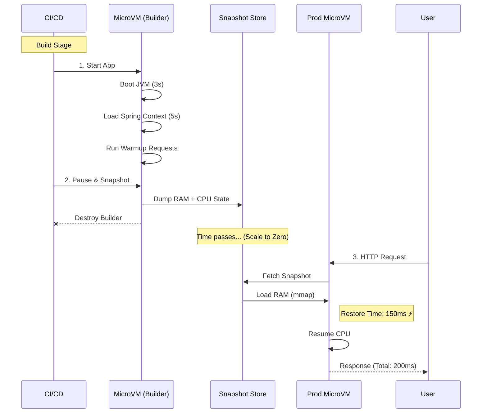
```mermaid
sequenceDiagram
    participant CI as CI/CD
    participant VM as MicroVM (Builder)
    participant Storage as Snapshot Store
    participant Prod as Prod MicroVM
    participant User

    Note over CI: Build Stage
    
    CI->>VM: 1. Start App
    VM->>VM: Boot JVM (3s)
    VM->>VM: Load Spring Context (5s)
    VM->>VM: Run Warmup Requests
    
    CI->>VM: 2. Pause & Snapshot
    VM->>Storage: Dump RAM + CPU State
    VM--xCI: Destroy Builder
    
    Note over Storage: Time passes... (Scale to Zero)
    
    User->>Prod: 3. HTTP Request
    
    Prod->>Storage: Fetch Snapshot
    Storage->>Prod: Load RAM (mmap)
    Note right of Prod: Restore Time: 150ms ⚡
    
    Prod->>Prod: Resume CPU
    Prod-->>User: Response (Total: 200ms)
```
### 3.6. Архитектурные Рекомендации (Best Practices)
1. **Разделяйте подходы:**
    - Пишете _новую_ функцию-валидатор? Используйте **Wasm** (Rust/Go). Это дешевле и быстрее.
    - Мигрируете _существующий_ сервис обработки заказов на Python/Java? Упакуйте его в **Container Image**, но запускайте в инфраструктуре с поддержкой **MicroVMs** (например, AWS Fargate или Knative с Firecracker backend).
2. **Stateless is King:** Снэпшоттинг работает, только если приложение не держит уникальных подключений к БД в момент "заморозки".
    - _Паттерн:_ Инициализируйте пулы соединений _лениво_ (при первом реальном запросе после восстановления), либо используйте хуки `beforeCheckpoint` / `afterRestore` (как в AWS Lambda SnapStart), чтобы пересоздать TCP-сокекты.
3. **Не бойтесь "холодного старта" для фоновых задач:** Если воркер обрабатывает очередь сообщений, задержка в 2 секунды на старт не важна. Snapshotting нужен в первую очередь для синхронных HTTP API.
---
## 4. Edge Computing: Defying the Speed of Light


> [!abstract] Физический предел
> Скорость света в оптоволокне — примерно $200,000$ км/с (медленнее вакуума).
> * **RTT Нью-Йорк $\leftrightarrow$ Лондон:** ~70-80 мс (в идеале).
> * **RTT Нью-Йорк $\leftrightarrow$ Сидней:** ~200+ мс.
>
> Никакая оптимизация кода (Rust/Assembly) не исправит физику. Если ваш клиент в Сиднее, а сервер в США, вы начинаете с отставанием в 200 мс.
> **Edge Computing** — это архитектурный ответ: "Если Магомет не идет к горе, гора (сервер) идет к Магомету".
### 4.1. The "Data Gravity" Problem (CAP Theorem Strikes Back)

> [!abstract] Закон Ньютона против Закона Мура
> Дэйв МакКрори (2010) сформулировал концепцию **Data Gravity (Гравитации Данных)**:
> *"По мере накопления данных, они приобретают массу. Эта масса притягивает к себе приложения и сервисы."*
>
> В контексте Edge это создает парадокс:
> * **Compute (Код):** Легкий. Хочет убежать на Edge (к пользователю).
> * **State (Данные):** Тяжелый. Хочет остаться в Core (в Consistency).
>
> Пытаясь разорвать эту связь, вы врезаетесь в **Теорему CAP** на скорости света. Вы не можете иметь мгновенную (Low Latency) и гарантированно точную (Consistent) запись данных в разных точках планеты одновременно.
#### A. The CAP Theorem in 2026 (The Edge Context)
В классическом облаке (один регион) мы часто игнорируем **P (Partition Tolerance)**, потому что оптоволокно внутри дата-центра надежно.
На Edge **P** становится константой. Сеть между Токио и Нью-Йорком *будет* рваться.

Поэтому выбор сводится к жесткой дихотомии:

1.  **CP (Consistency + Partition Tolerance):**
    * *Поведение:* Если Edge-нода в Берлине теряет связь с Мастером в США, она **перестает принимать записи**.
    * *Результат:* Глобальная целостность данных, но **100% Downtime** на запись при проблемах с сетью.
    * *Latency:* Всегда равна RTT до Мастера (100ms+). Смысл Edge теряется.
2.  **AP (Availability + Partition Tolerance):**
    * *Поведение:* Edge-нода принимает запись локально, даже если связи нет.
    * *Результат:* **0ms Latency**, но риск **Split Brain** (Конфликты данных). Пользователь в Токио купил последний билет, и пользователь в Берлине купил тот же билет.
    * *Reality:* Большинство Edge-приложений *обязаны* быть AP.
#### B. Taxonomy of Data Gravity (Not all data is equal)
Чтобы решить проблему, нужно классифицировать данные. Не все данные имеют одинаковую "массу".

| Data Type | Example | Gravity | Architecture Strategy |
| :--- | :--- | :--- | :--- |
| **1. Read-Heavy / Static** | Цены, Описания товаров, CDN контент | **Low** | **Replication.** Копируйте это на Edge. Eventual Consistency (отставание на секунды) допустимо. |
| **2. Ephemeral State** | Сессии пользователей, Корзина покупок, Черновики | **Medium** | **Sticky Routing (Session Affinity).** Привяжите пользователя к конкретной Edge-ноде. Если нода умрет — сессия потеряна, но база цела. |
| **3. Mutable Shared State** | Остаток на складе, Баланс счета, Seat Reservation | **Black Hole** | **Do Not Move to Edge.** Оставьте в Core. Любая попытка распределить это приведет к необходимости распределенного консенсуса (Paxos/Raft), который *медленнее*, чем просто запрос в центр. |
#### C. The Physics of Consensus (Why Raft doesn't work globally)
Почему нельзя просто запустить кластер CockroachDB/Etcd, растянутый на весь мир?

* **Формула:** Время фиксации транзакции в Raft = $RTT_{max} \times 2$.
* **Сценарий:** Узлы в Лондоне, Нью-Йорке и Токио.
* **Процесс:**
    1.  Лондон получает запись.
    2.  Лондон шлет запрос в Токио (200ms) и НЙ (70ms) "Согласны?".
    3.  Ждет ответа.
* **Итог:** Задержка записи будет ~400ms.
* **Вывод:** Распределенная база данных *медленнее*, чем централизованная, если узлы разнесены географически. Edge для ACID-транзакций — это антипаттерн.

#### D. The "Inventory Problem" Example
Классический пример, объясняющий проблему.
*Магазин продает кроссовки. Осталась 1 пара.*

1.  **Scenario: Naive Edge (AP)**
    * Юзер А (Токио) нажимает "Купить". Локальная нода: "ОК" (Остаток 0).
    * Юзер Б (Берлин) нажимает "Купить". Локальная нода: "ОК" (Остаток 0).
    * **Sync:** Ноды синхронизируются. Конфликт! Продано 2 пары, в наличии 1. Бизнес теряет репутацию.
2.  **Scenario: Smart Edge (Escrow Pattern)**
    * *Логика:* Вместо глобального счетчика, мы разбиваем остаток на "шарды".
    * *Core:* Всего 100 пар. Раздадим по 10 пар в каждый регион (Push).
    * *Edge (Токио):* Продает свои 10 пар мгновенно (0ms Latency).
    * *Edge (Берлин):* Продает свои 10 пар.
    * *Проблема:* В Токио кончились, в Берлине еще 5. Юзер из Токио видит "Sold Out".
    * *Решение:* Edge-нода запрашивает "транш" у соседа или ядра (уже медленно, но редко).

#### E. Visualization: The Latency vs. Consistency Curve (Mermaid)

График показывает, что вы платите за консистентность временем.

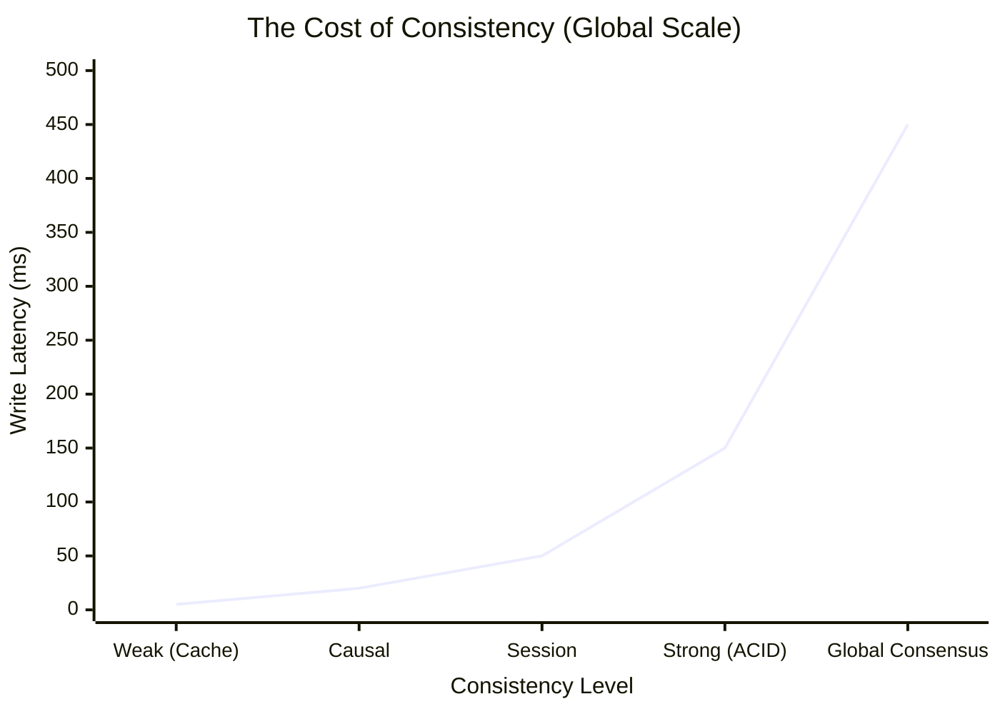
```mermaid
xychart-beta
    title "The Cost of Consistency (Global Scale)"
    x-axis "Consistency Level" ["Weak (Cache)", "Causal", "Session", "Strong (ACID)", "Global Consensus"]
    y-axis "Write Latency (ms)" 0 --> 500
    
    line [5, 20, 50, 150, 450]
```
#### F. Visualization: The Write Penalty Flow (Mermaid)

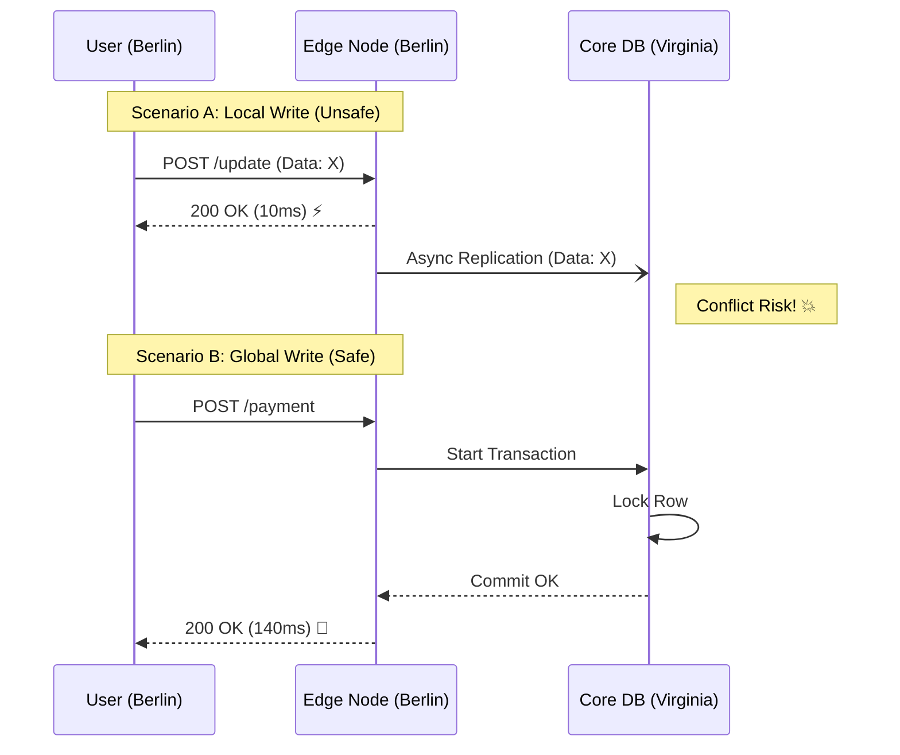
```mermaid
sequenceDiagram
    participant U as User (Berlin)
    participant E as Edge Node (Berlin)
    participant C as Core DB (Virginia)
    
    Note over U, E: Scenario A: Local Write (Unsafe)
    U->>E: POST /update (Data: X)
    E-->>U: 200 OK (10ms) ⚡
    E-)C: Async Replication (Data: X)
    Note right of C: Conflict Risk! 💥
    
    Note over U, E: Scenario B: Global Write (Safe)
    U->>E: POST /payment
    E->>C: Start Transaction
    C->>C: Lock Row
    C-->>E: Commit OK
    E-->>U: 200 OK (140ms) 🐢
```

> [!check] Архитектурный Вердикт
> 
> 1. **Segregate Logic:** Разделите приложение на "Read Paths" и "Write Paths".
>     
> 2. **Read at Edge:** Читайте данные с Edge (Eventual Consistency). Используйте заголовок `Cache-Control: stale-while-revalidate`.
>     
> 3. **Write at Core:** Пишите важные данные в Core. Пользователь готов подождать 200мс при нажатии кнопки "Оплатить" (это даже повышает доверие, т.н. UX "labor illusion").
>     
> 4. **Avoid Global Locks:** Никогда не используйте распределенные блокировки (Distributed Locks) между континентами. Это убьет производительность.
>
### 4.2. State Management Strategies for 2026

> [!abstract] Эволюция Хранения
> Раньше у нас была одна большая база (Oracle/Postgres) в центре.
>
> В 2026 году мы используем стратегию **"Data Locality"**:
> 1.  Если данные читают часто, а меняют редко $\to$ **Replicate** (копируй везде).
> 2.  Если данные меняют часто, но в рамках одной сущности $\to$ **Route** (отправь юзера к данным).
> 3.  Если данные меняют хаотично отовсюду $\to$ **Merge** (используй CRDT).
#### Strategy A: The "Read-Replica" Pattern (LiteFS / Turso)
Это стандарт де-факто для 90% веб-приложений (CMS, E-commerce каталоги, настройки).

* **Технология:** Распределенный SQLite (Cloudflare D1, Turso, Fly.io LiteFS).
* **Механика:**
    * В каждом регионе (Edge) поднимается легковесный процесс базы данных.
    * **Write Path:** Запись проксируется в Core-регион (Primary).
    * **Read Path:** Чтение происходит из локального файла `.sqlite` на диске Edge-сервера (0 ms network latency).
    * **Replication:** Используется **WAL-shipping**. Primary база шлет не SQL-запросы, а бинарные страницы изменений (Write Ahead Log) на Edge-ноды.
* **Плюсы:** Скорость чтения ограничена только скоростью SSD.
* **Минусы:** "Replica Lag". Юзер в Токио может увидеть старую цену на 200 мс дольше, чем юзер в Нью-Йорке.
#### Strategy B: The "Durable Object" (Actor Model) Pattern
Что делать, если нам нужна **строгая консистентность** (Strong Consistency) и транзакции, но мы не хотим ходить в Core? Например, чат-комната или документ для совместной работы.

* **Технология:** Cloudflare Durable Objects / Akka Edge / Microsoft Orleans.
* **Концепция:**
    * Вместо того чтобы хранить данные в базе, мы храним их в **памяти живого объекта** (Actor).
    * Этот объект существует в *единственном экземпляре* в мире.
    * Система "умного роутинга" размещает этот объект на той Edge-ноде, которая ближе всего к *большинству* активных пользователей этой комнаты.
* **Пример (Чат):**
    * Юзеры из Лондона и Парижа заходят в "Комнату №5".
    * Система поднимает "Actor Room-5" в дата-центре в Париже.
    * Все сообщения летят в Париж (10-20 мс). Внутри Актора — синхронная память. Конфликтов нет.
    * База данных нужна только для холодного бэкапа.

#### Strategy C: CRDTs (Conflict-free Replicated Data Types)
Математическое чудо, позволяющее писать в базу оффлайн или при "Network Partition", гарантируя, что данные потом сойдутся.

* **Суть:** Специальные типы данных, которые обладают свойством **коммутативности** ($A + B = B + A$) и **идемпотентности**.
* **Типы:**
    * **G-Counter (Grow-only):** Счетчик просмотров. Можно только увеличивать. Слияние = `max(A, B)`.
    * **LWW-Register (Last-Write-Wins):** Кто последний (по timestamp), тот и прав. (Опасно, нужны точные часы).
    * **RGA (Replicated Growable Array):** Для совместного редактирования текста (как в Google Docs).
* **Use Case:** Корзина покупок.
    * Юзер добавил "Товар А" с телефона (в метро, без сети).
    * Юзер удалил "Товар Б" с ноутбука (дома).
    * Когда оба устройства выйдут в сеть, CRDT сольет состояния: "В корзине Товар А, Товара Б нет". Обычная база перезаписала бы одно другим.

#### Strategy D: Session Affinity (Sticky Routing)
Самый дешевый способ эмулировать stateful-систему на Edge.

* **Механика:**
    * Load Balancer (Envoy/Nginx) выставляет пользователю куку `route=edge-node-42`.
    * Все последующие запросы летят именно на `edge-node-42`.
    * Данные хранятся в RAM этой ноды.
* **Проблема:** Если нода падает для обновления или сбоя, данные пользователя (сессия) пропадают.
* **Решение 2026:** Использовать Affinity + быстрый сброс состояния в **Global KV Store** (Redis) каждые N секунд.
#### E. Comparative Analysis Table

| Strategy | Consistency | Write Latency | Implementation Difficulty | Best For |
| :--- | :--- | :--- | :--- | :--- |
| **Read Replica (SQLite)** | Eventual | High (Proxy to Core) | Medium (Managed) | Catalogs, Blogs, User Profiles |
| **Durable Objects** | **Strong (Local)** | **Low** (If user is near) | High (New paradigm) | Games, Collab Tools, Chats |
| **CRDTs** | Strong Eventual | **Zero** (Local write) | Very High (Math heavy) | Offline-first apps, Shopping Carts |
| **Sticky Session** | None (Ram) | Zero | Low | Temp Caches, Anon Sessions |
#### F. Visualization: The Three Paths (Mermaid)

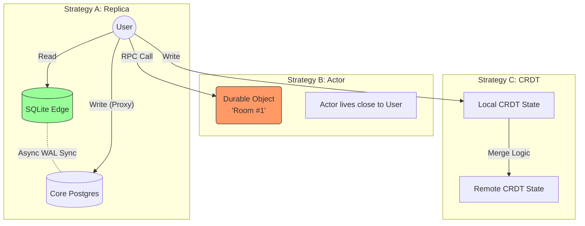
```mermaid
graph TD
    User((User))
    
    subgraph "Strategy A: Replica"
        EdgeDB[(SQLite Edge)] -. "Async WAL Sync" .- CoreDB[(Core Postgres)]
        User -- "Read" --> EdgeDB
        User -- "Write (Proxy)" --> CoreDB
    end
    
    subgraph "Strategy B: Actor"
        Actor(Durable Object <br/> 'Room #1')
        User -- "RPC Call" --> Actor
        Note[Actor lives close to User]
    end
    
    subgraph "Strategy C: CRDT"
        LocalState[Local CRDT State]
        RemoteState[Remote CRDT State]
        User -- "Write" --> LocalState
        LocalState -- "Merge Logic" --> RemoteState
    end
    
    style Actor fill:#f96,stroke:#333
    style EdgeDB fill:#9f9,stroke:#333
```

> [!check] Архитектурный Вердикт
> 
> 1. **Default:** Начинайте с **Read-Replicas** (Strategy A). Это закрывает 90% кейсов и не требует переучивания разработчиков (обычный SQL).
>     
> 2. **Interactive:** Если вы делаете игру или Notion-like редактор — смотрите в сторону **Durable Objects** или **CRDT**. Пытаться сделать это на Postgres — путь к боли.
>     
> 3. **Local-First:** В 2026 году CRDT часто живут прямо на клиенте (в браузере), а Edge просто служит реле для пересылки изменений.
>
### 4.3. Distributed Profiling: Aggregating the Chaos
Профилировать 5 серверов в дата-центре легко. Профилировать 5000 нано-серверов по всему миру — кошмар.

1.  **The Cardinality Explosion:**
    * Если вы добавите тег `region` к метрикам, у вас будет 100 регионов.
    * Если добавите `pod_id`, у вас будет 100,000 временных рядов. Prometheus взорвется.
2.  **Aggregation Strategies:**
    * **Local Sampling:** Edge-нода не шлет все профили. Она агрегирует их локально (построение локального Flame Graph за минуту) и шлет только сжатый результат.
    * **Tail-based Sampling:** Мы сохраняем детальный профиль (Trace + CPU) *только* для тех запросов, которые были медленнее 500 мс или вернули ошибку 500.

### 4.4. The "Thick" vs. "Thin" Edge
Не путайте эти понятия при проектировании.

| Feature | Thin Edge (CDN / Far Edge) | Thick Edge (Regional / Near Edge) |
| :--- | :--- | :--- |
| **Location** | Сотовые вышки, Точки обмена трафиком (ISP) | Региональные дата-центры (AWS Local Zones) |
| **Compute** | **Wasm Isolates** (ограниченные ресурсы) | **Kubernetes / VM** (полные ресурсы) |
| **State** | Stateless / K-V Cache | Stateful (Postgres Replica, Kafka) |
| **Latency** | < 5 ms | 10 - 20 ms |
| **Typical Task** | TLS, Auth, Routing, HTML re-write | API Gateway, Image Processing, Queue buffering |
### 4.5. Visualization: The Read/Write Split (Mermaid)

Архитектура гибридного доступа к данным.

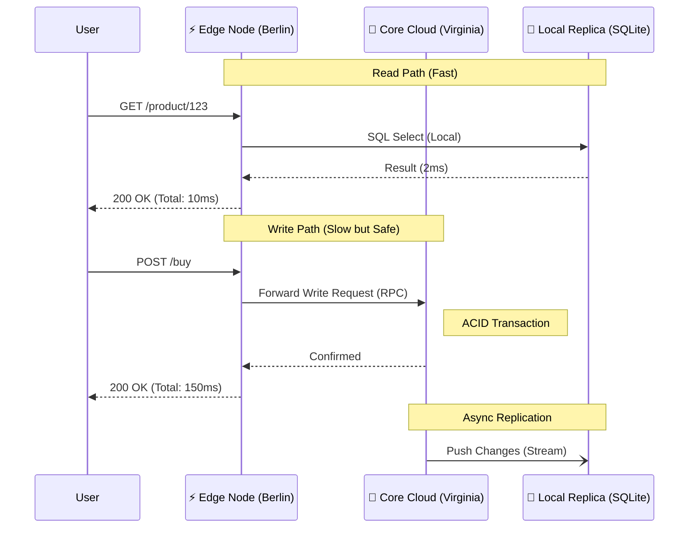
```mermaid
sequenceDiagram
    participant User
    participant Edge as ⚡ Edge Node (Berlin)
    participant Core as 🏢 Core Cloud (Virginia)
    participant EdgeDB as 💾 Local Replica (SQLite)
    
    Note over Edge, EdgeDB: Read Path (Fast)
    User->>Edge: GET /product/123
    Edge->>EdgeDB: SQL Select (Local)
    EdgeDB-->>Edge: Result (2ms)
    Edge-->>User: 200 OK (Total: 10ms)
    
    Note over Edge, Core: Write Path (Slow but Safe)
    User->>Edge: POST /buy
    Edge->>Core: Forward Write Request (RPC)
    Note right of Core: ACID Transaction
    Core-->>Edge: Confirmed
    Edge-->>User: 200 OK (Total: 150ms)
    
    Note over Core, EdgeDB: Async Replication
    Core-)EdgeDB: Push Changes (Stream)
```
---

> [!check] Архитектурный Вердикт
> 
> 1. **Read Local, Write Global:** Это "золотое правило" Edge архитектуры. Не пытайтесь делать распределенные транзакции.
>     
> 2. **Edge is for View:** Edge идеально подходит для уровня представления (View Layer) — генерация HTML, JSON API.
>     
> 3. **Observability:** Используйте инструменты, которые поддерживают **High Cardinality** (например, Grafana Mimir, Honeycomb), иначе вы ослепнете от количества меток.
>
## 5. Visualization: The Evolution of Compute (Mermaid)

> [!abstract] Закон "Схлопывания" Стека
> Эволюция облаков — это процесс систематического удаления лишних посредников между вашим Кодом и Железом.
>
> * **VM Era:** Мы платили налог за **эмуляцию железа** (BIOS, PCI).
> * **Container Era:** Мы платили налог за **Userland** (файловую систему, пакетные менеджеры, bash).
> * **Wasm Era (2026):** Мы удалили всё. Остался только Код и безопасный Интерфейс (WASI).
>
> Ниже приведены две визуализации: анатомическая (что мы удалили) и экономическая (как изменилась плотность).
### 5.1. The "Abstraction Tax" Anatomy (Mermaid)

Эта диаграмма показывает, как уменьшалась глубина стека (и, следовательно, Cold Start).


```mermaid
graph TD
    subgraph "Era 1: Virtual Machines (Heavy)"
        HW1[("Hardware")]
        Hyper[("Hypervisor (KVM)")]
        GuestOS[("🛑 Guest OS Kernel <br/> (Boot time: ~30s)")]
        Userland1[("🛑 Userland <br/> (Systemd, sshd, libs)")]
        App1[("App Code")]
        
        HW1 --> Hyper --> GuestOS --> Userland1 --> App1
    end

    subgraph "Era 2: Containers (Medium)"
        HW2[("Hardware")]
        HostOS[("Host Kernel")]
        Docker[("Container Engine")]
        Userland2[("🛑 Userland / RootFS <br/> (Alpine/Debian: ~100MB)")]
        App2[("App Code")]
        
        HW2 --> HostOS --> Docker --> Userland2 --> App2
    end

    subgraph "Era 3: Wasm Isolates (Light)"
        HW3[("Hardware")]
        HostOS3[("Host Kernel")]
        Runtime[("🚀 Wasm Runtime <br/> (Just Memory & CPU)")]
        App3[("App Code")]
        
        HW3 --> HostOS3 --> Runtime --> App3
    end
    
    style GuestOS fill:#f99,stroke:#333
    style Userland1 fill:#f99,stroke:#333
    style Userland2 fill:#f96,stroke:#333
    style Runtime fill:#9f9,stroke:#333
```
**Пояснение к слоям:**
1. **Guest OS (Red Zone):** Самый дорогой слой. Загрузка ядра, инициализация драйверов. В Wasm этого нет.
2. **Userland (Orange Zone):** "Мусор", который мы тащим в Docker-образах (`apt-get`, `openssl`, `glibc`). В Wasm этого нет (или оно статически слинковано в минимуме).
3. **Runtime (Green Zone):** Тончайшая прослойка, транслирующая Wasm-инструкции в машинный код.
### 5.2. The Density & Lifespan Matrix (Mermaid)

Как изменение технологии меняет архитектурные паттерны. Мы переходим от "Долгоживущих Гигантов" к "Мгновенным Бактериям".

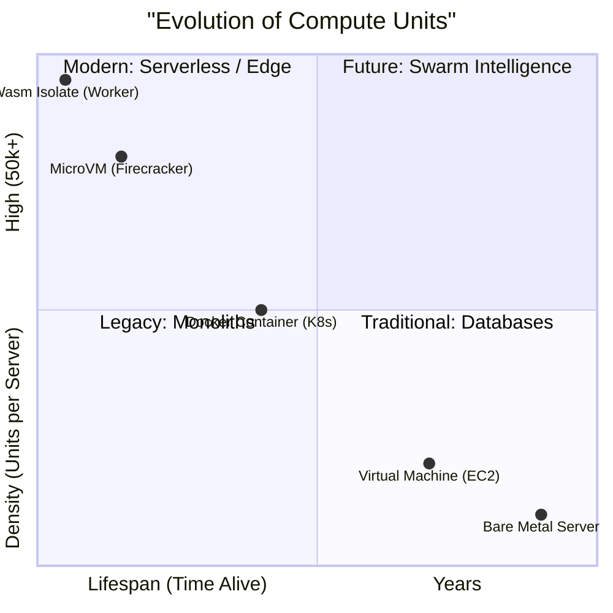
```mermaid
quadrantChart
    title "Evolution of Compute Units"
    x-axis "Lifespan (Time Alive)" --> "Years"
    y-axis "Density (Units per Server)" --> "High (50k+)"
    
    quadrant-1 "Future: Swarm Intelligence"
    quadrant-2 "Modern: Serverless / Edge"
    quadrant-3 "Legacy: Monoliths"
    quadrant-4 "Traditional: Databases"
    
    "Bare Metal Server": [0.9, 0.1]
    "Virtual Machine (EC2)": [0.7, 0.2]
    "Docker Container (K8s)": [0.4, 0.5]
    "MicroVM (Firecracker)": [0.15, 0.8]
    "Wasm Isolate (Worker)": [0.05, 0.95]
```

**Расшифровка квадрантов:**
- **Wasm Isolate (Top-Left):** Живет миллисекунды (только пока обрабатывает запрос). Плотность колоссальная (десятки тысяч на узле). Это позволяет использовать паттерн **"Function per User"**.
- **Bare Metal (Bottom-Right):** Живет годами. Плотность низкая (один OS на сервер).
### 5.3. Терминология (Glossary)
- **Userland (Пространство пользователя):** Набор библиотек и утилит операционной системы (все, что не ядро). В Docker вы обязаны тащить это с собой. В Wasm вы от этого свободны.
- **Overhead (Накладные расходы):** Ресурсы, которые тратятся на _поддержание жизни_ приложения, а не на полезную работу.
    - VM Overhead: ~20% (дублирование OS).
    - Wasm Overhead: <1% (JIT-компиляция).
- **Density (Плотность):** Ключевая метрика 2026 года. Сколько _изолированных_ клиентов вы можете обслужить на одном физическом сервере за $10,000. Wasm увеличивает этот показатель в 50-100 раз по сравнению с VM.

> [!check] Архитектурный вывод Глядя на эти диаграммы, задайте себе вопрос: **"За что я плачу облачному провайдеру?"**
> 
> - Если вы используете **EC2/VM**, вы платите за простой (Idle) гостевой OS.
>     
> - Если вы используете **K8s/Docker**, вы платите за хранение и перекачку гигабайтов Userland-файлов.
>     
> - Переход на **Wasm/Serverless** — это способ платить только за **App Code** (зеленый прямоугольник).
>
---
## 6. Visualization: Edge Request Flow (Mermaid)

> [!abstract] Борьба за "Зеленую Зону"
> Визуализация потока запросов помогает понять, где именно мы теряем время.
> * **Зеленая зона (Edge):** < 20 ms. Здесь живут Wasm, KV-store и кэш. Пользователь счастлив.
> * **Красная зона (Core / Origin):** > 100 ms. Здесь живут тяжелые базы данных и легаси. Пользователь ждет.
>
> **Задача архитектора:** Замкнуть цикл (Request/Response) внутри Зеленой зоны для 95% трафика, используя паттерны **SWR** и **Background Sync**.
### 6.1. Scenario A: The "Smart Read" (Stale-while-Revalidate)
Это самый современный паттерн (SWR). Мы отдаем пользователю "протухшие" данные мгновенно, а обновление делаем в фоне. Пользователь никогда не видит спиннера загрузки.

**Логика потока:**
1.  **Hit:** Если данные есть в кэше (даже старые), Edge отдает их за **5 мс**.
2.  **Background:** Параллельно Edge идет в Core за свежей версией.
3.  **Update:** Кэш обновляется. Следующий запрос получит свежие данные.

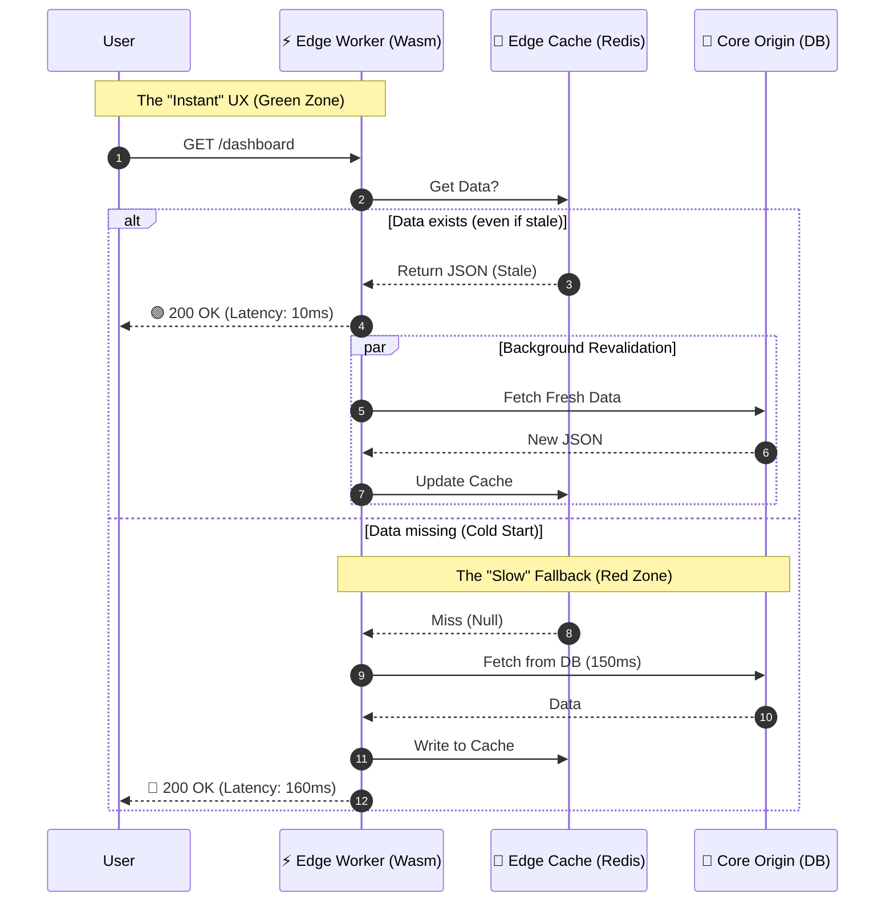
```mermaid
sequenceDiagram
    autonumber
    participant User
    participant Edge as ⚡ Edge Worker (Wasm)
    participant KV as 💾 Edge Cache (Redis)
    participant Core as 🏢 Core Origin (DB)

    Note over User, Edge: The "Instant" UX (Green Zone)
    
    User->>Edge: GET /dashboard
    Edge->>KV: Get Data?
    
    alt Data exists (even if stale)
        KV-->>Edge: Return JSON (Stale)
        Edge-->>User: 🟢 200 OK (Latency: 10ms)
        
        par Background Revalidation
            Edge->>Core: Fetch Fresh Data
            Core-->>Edge: New JSON
            Edge->>KV: Update Cache
        end
        
    else Data missing (Cold Start)
        Note over Edge, Core: The "Slow" Fallback (Red Zone)
        KV-->>Edge: Miss (Null)
        Edge->>Core: Fetch from DB (150ms)
        Core-->>Edge: Data
        Edge->>KV: Write to Cache
        Edge-->>User: 🔴 200 OK (Latency: 160ms)
    end
```
### 6.2. Scenario B: The "Guarded Write" (Edge Validation)

Почему запись через Edge лучше, чем напрямую в Core? Потому что Edge выступает как **"Вышибала" (Bouncer)**. Он отбрасывает невалидные запросы (400 Bad Request, 401 Unauthorized) _до того_, как они загрузят сеть и базу данных.

**Логика потока:**
1. **Auth:** Wasm проверяет JWT токен (CPU дешевый, Latency 0ms).
2. **Validation:** Wasm проверяет JSON Schema (например, "email обязателен").
3. **Reject:** Если ошибка — отбой мгновенно. Core даже не узнает о запросе.
4. **Forward:** Только "чистые" запросы летят через океан.

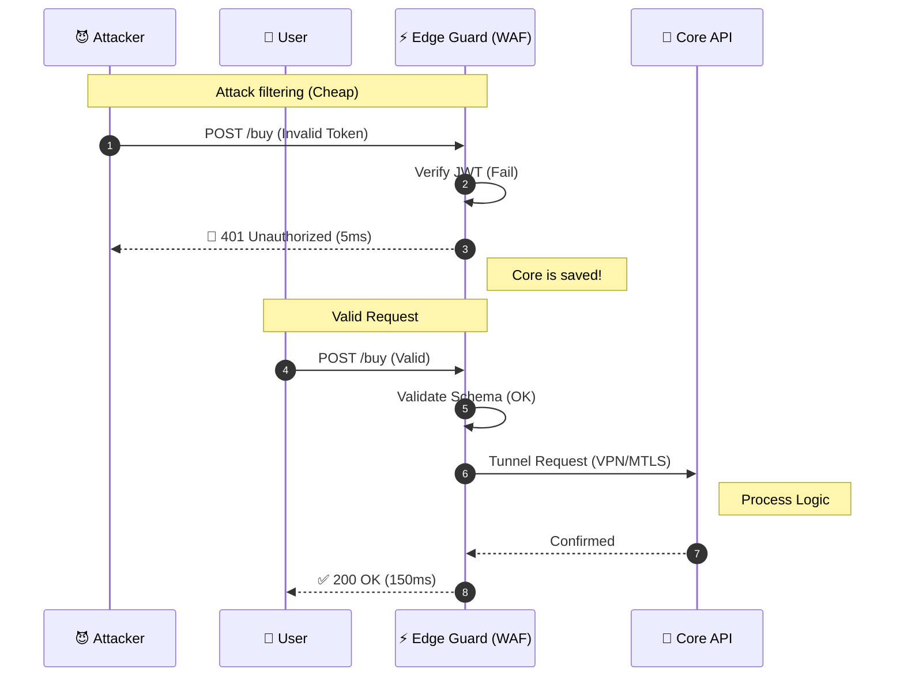
```mermaid
sequenceDiagram
    autonumber
    participant Malicious as 😈 Attacker
    participant User as 👤 User
    participant Edge as ⚡ Edge Guard (WAF)
    participant Core as 🏢 Core API

    Note over Malicious, Edge: Attack filtering (Cheap)
    
    Malicious->>Edge: POST /buy (Invalid Token)
    Edge->>Edge: Verify JWT (Fail)
    Edge-->>Malicious: 🚫 401 Unauthorized (5ms)
    Note right of Edge: Core is saved!
    
    Note over User, Edge: Valid Request
    
    User->>Edge: POST /buy (Valid)
    Edge->>Edge: Validate Schema (OK)
    
    Edge->>Core: Tunnel Request (VPN/MTLS)
    Note right of Core: Process Logic
    Core-->>Edge: Confirmed
    Edge-->>User: ✅ 200 OK (150ms)
```
### 6.3. Key Terminology for Flow Analysis
1. **Origin (Core):** Источник правды. Сервер, где лежит основная база данных. В Edge-архитектуре мы стараемся обращаться к нему как можно реже.
2. **Edge Worker:** Программный код (обычно Wasm или V8 Isolate), исполняемый на CDN-ноде. Это "мозг", который решает: отдать из кэша, сходить в Origin или заблокировать.
3. **SWR (Stale-while-Revalidate):** Стратегия HTTP-кэширования: _"Используй старое, пока качаешь новое"_. Основа UX 2026 года.
4. **TTFB (Time To First Byte):** Время от клика до получения первого байта ответа.
    - На Edge: 5-20 ms.
    - На Origin: 100-500 ms.
5. **Fan-out:** Паттерн, когда один запрос на Edge порождает несколько запросов к разным микросервисам (или базам) параллельно, а затем собирает результат. Edge делает это быстрее, чем браузер.

> [!check] Архитектурный Вердикт
> 
> 1. **Не будьте "Трубой":** Если ваш Edge просто проксирует запросы (`proxy_pass`), вы зря тратите деньги.
>     
> 2. **Move Compute Left:** Перенесите валидацию (`if !email.contains("@")`), авторизацию и рендеринг HTML на Edge.
>     
> 3. **Скрывайте Латенси:** Используйте SWR. Пользователь простит вам старую на 1 секунду цену, но не простит белый экран на 2 секунды.
>
---
## 7. Summary & Best Practices

> [!abstract] Смена ментальной модели
> Главный сдвиг десятилетия: **Мы перестали платить за ожидание (Idle).**
>
> * **Вчера (DevOps):** Мы оптимизировали утилизацию серверов (Bin Packing), пытаясь набить их контейнерами, чтобы CPU не простаивал.
> * **Сегодня (NoOps):** Мы оптимизируем **время исполнения**. Инфраструктура вообще не существует, пока не пришел запрос.
>
> Ваша задача как архитектора — не "построить кластер", а правильно разложить приложение по спектру **Compute Continuum**, минимизируя время холодного старта и задержку данных.
### 7.1. The Architect's Decision Matrix (What to use when?)

Не пытайтесь забить все гвозди молотком Wasm. У каждой технологии 2026 года есть своя ниша.

| Scenario | Technology Strategy | Why? |
| :--- | :--- | :--- |
| **New "Glue" Code** <br/> (Validators, Webhooks, API Adapters) | **Wasm (Rust/Go/TS)** | **Instant Scale.** Холодный старт <1ms. Высочайшая плотность. Идеально для Edge. |
| **Legacy Apps** <br/> (Spring Boot, Django, Rails) | **MicroVM (Firecracker) + Snapshotting** | **Compatability.** Не надо переписывать код. Снэпшоты решают проблему медленного старта JVM. |
| **High Performance Compute** <br/> (Video Transcoding, AI Inference) | **Hybrid (Container + GPU)** | **Hardware Access.** Wasm пока плохо работает с GPU (хотя WASI-NN развивается). Здесь нужен прямой доступ к драйверам NVIDIA via Docker. |
| **Untrusted Code** <br/> (User Plugins, Sandbox) | **Wasm / WASI** | **Security.** Единственный способ безопасно запустить чужой код внутри вашего процесса без оверхеда VM. |
| **Stateful Core** <br/> (Primary DB, Kafka) | **Persistent VMs / K8s** | **Data Gravity.** Базы данных не любят, когда их убивают каждые 5 минут. Им нужен стабильный диск и RAM. |
### 7.2. The "Golden Rules" of 2026 Architecture

#### Rule 1: The "Scale-to-Zero" First Mindset
При проектировании сервиса задайте вопрос: *"Может ли он умирать, когда нет работы?"*
* **Если Да:** Делайте его Stateless (храните стейт в Redis/S3) и деплойте как Serverless Function/Wasm. Это сэкономит 90% бюджета в Dev/Stage средах.
* **Если Нет:** У вас должна быть веская причина (например, он держит WebSocket соединения или кэширует терабайты в RAM).

#### Rule 2: Respect the Physics (Read Local, Write Global)
Никогда не делайте синхронную запись (Write) на Edge, если данные нужны в Core.
* **Bad:** Edge в Токио пишет в Master DB в США и ждет ответа. (Latency 200ms).
* **Good:** Edge в Токио пишет в локальную очередь (Redpanda/NATS) и сразу отдает "2022 Accepted". Синхронизация идет в фоне.

#### Rule 3: Componentize, Don't Microservice
Перестаньте плодить микросервисы только ради разделения языков.
* **Bad:** Сервис A (Python) ходит в Сервис B (Rust) по HTTP, чтобы проверить пароль. (Network Overhead + Serialization).
* **Good:** Скомпилируйте Rust в Wasm-компонент и импортируйте его в Python-сервис. Они работают в одном процессе. **Wasm Component Model — это убийца сетевого оверхеда.**

### 7.3. Observability Challenges & Solutions
Как мониторить то, что живет 10 миллисекунд?

1.  **Metric Cardinality Explosion:**
    * *Проблема:* Если каждая Edge-функция шлет метрику с тегом `instance_id`, ваш Prometheus упадет за час.
    * *Решение:* Агрегируйте метрики на уровне Edge-шлюза. Шлите в центр только перцентили (P50, P99), а не сырые данные.
2.  **Snapshot Profiling:**
    * *Проблема:* CPU Profiler не успевает собрать сэмплы за 5мс жизни функции.
    * *Решение:* Используйте **Deterministic Profiling** (доступен в Wasmtime). Рантайм точно знает, сколько инструкций выполнила каждая функция. Это точнее, чем сэмплирование по времени.

### 7.4. Final Architecture Flowchart (Mermaid)

Алгоритм выбора технологии для нового проекта.

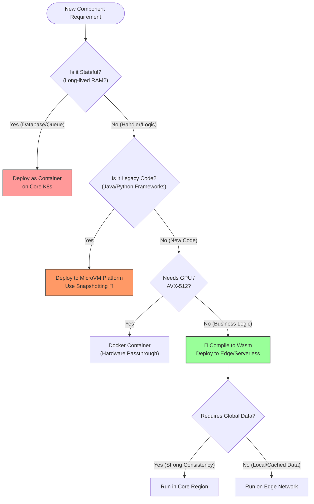
```mermaid
graph TD
    Start(["New Component Requirement"]) --> IsStateful{"Is it Stateful? <br/> (Long-lived RAM?)"}
    
    IsStateful -- "Yes (Database/Queue)" --> K8s["Deploy as Container <br/> on Core K8s"]
    
    IsStateful -- "No (Handler/Logic)" --> IsLegacy{"Is it Legacy Code? <br/> (Java/Python Frameworks)"}
    
    IsLegacy -- "Yes" --> Firecracker["Deploy to MicroVM Platform <br/> Use Snapshotting 📸"]
    
    IsLegacy -- "No (New Code)" --> IsHeavy{"Needs GPU / <br/> AVX-512?"}
    
    IsHeavy -- "Yes" --> Container["Docker Container <br/> (Hardware Passthrough)"]
    
    IsHeavy -- "No (Business Logic)" --> Wasm["🚀 Compile to Wasm <br/> Deploy to Edge/Serverless"]
    
    Wasm --> EdgeDecision{"Requires Global Data?"}
    
    EdgeDecision -- "Yes (Strong Consistency)" --> CentralWasm["Run in Core Region"]
    EdgeDecision -- "No (Local/Cached Data)" --> GlobalEdge["Run on Edge Network"]
    
    style Wasm fill:#9f9,stroke:#333,stroke-width:2px
    style Firecracker fill:#f96,stroke:#333
    style K8s fill:#f99,stroke:#333
```
### 7.5. Terminology Refresh (Glossary 2026)
- **Compute Continuum:** Концепция, где нет жесткой границы "Облако vs Устройство". Код течет туда, где данные.
- **Scale-to-Zero:** Способность инфраструктуры потреблять 0 ресурсов при отсутствии нагрузки. Главный экономический драйвер.
- **Wasm Component:** Бинарный модуль с четким интерфейсом (WIT), который можно компоновать с другими модулями на разных языках.
- **MicroVM:** Легковесная виртуальная машина (Firecracker), запускающаяся за <200мс. Мост для легаси.
- **Data Gravity:** Сила притяжения, заставляющая приложения переезжать ближе к большим массивам данных из-за латентности и пропускной способности.

> [!check] Your Next Action: The "Hello Wasm" Experiment Хватит теории. Сделайте это руками, чтобы почувствовать разницу.
> 
> 1. Установите **Rust** и **Cargo**.
>     
> 2. Установите `wasm32-wasi` таргет: `rustup target add wasm32-wasi`.
>     
> 3. Напишите "Hello World".
>     
> 4. Скомпилируйте: `cargo build --target wasm32-wasi`.
>     
> 5. Запустите через **Wasmtime**: `wasmtime target/wasm32-wasi/debug/hello.wasm`.
>     
> 
> Вы увидите мгновенный старт. Это и есть будущее вашего бэкенда.